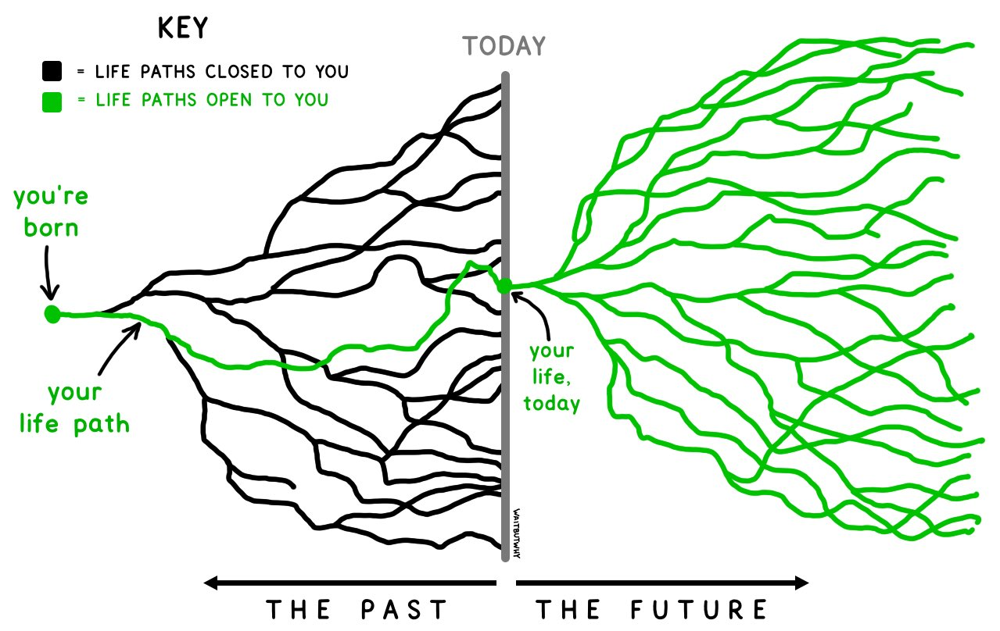

My founder friends constantly think about growth.  

我的创始人朋友们一直在思考发展问题。  

They think about how to measure their business growth and how to get to the next order of magnitude scale.  

他们考虑的是如何衡量业务增长，以及如何达到下一个数量级的规模。  

If they’re making $1M ARR today, they think about how to get to $10M ARR.  

如果他们今天的年收入是 100 万美元，他们就会考虑如何达到 1000 万美元的年收入。  

If they have 1,000 users today, they think about how to get to 10,000 users.  

如果他们今天有 1,000 个用户，他们就会考虑如何达到 10,000 个用户。

This made me wonder if/how people are measuring personal growth.  

这让我不禁要问，人们是否/如何衡量个人成长？  

I don’t want to use metrics like net worth or the number of followers, because that’s not what I live for.  

我不想用净资产或粉丝数量等指标来衡量，因为那不是我生活的目的。  

After talking with a lot of friends, I found three interesting metrics: rate of change, time to solve problems, and number of future options.  

在与很多朋友交流后，我发现了三个有趣的指标：变化率、解决问题的时间和未来选择的数量。

Some friends told me they find this blog post mildly sociopathic.  

有些朋友告诉我，他们觉得这篇博文有点反社会。  

Why do I have to measure everything? Life is to be lived, not to be measured.  

我为什么要衡量一切？生活是用来过的，而不是用来衡量的。  

As someone lowkey fascinated by numbers, I don’t see why measuring and living have to be mutually exclusive – measuring often helps me live better – but I see where they come from.  

作为一个对数字着迷的低调的人，我不明白为什么测量和生活必须是相互排斥的--测量往往能帮助我更好地生活--但我明白他们的出发点。  

This post is more of a thought exercise than a rigorous experiment.  

这篇文章与其说是一个严谨的实验，不如说是一个思考练习。

## Rate of change  

变化率

I have this theory that life has a circadian rhythm. Every 3-6 years, you become a different person.  

我有这样一个理论：生命有昼夜节律。每隔 3-6 年，你就会变成另外一个人。  

You work on different problems. Your lifestyle changes. The people you hang out with are different.  

你致力于解决不同的问题。你的生活方式改变了。你交往的人也不同了。  

If you haven’t caught up with a friend in 5 years, you might no longer have anything in common.  

如果你已经有 5 年没和朋友联系了，那么你们可能已经没有共同话题了。  

It’s not a coincidence that schools are structured into chunks of 3-6 years.  

学校的学制为 3-6 年，这并非巧合。

Looking back, I realized that every 3-6 years, my life completely changed.  

回想起来，我发现每隔 3-6 年，我的生活就会发生彻底的改变。  

From grade 3 to grade 10, I did competitive math. For the next 5 years, I worked as a writer.  

从三年级到十年级，我一直在做数学竞赛。之后的 5 年，我一直从事作家工作。  

Then I went to college and studied computer science for 4 years.  

后来我上了大学，学了四年计算机科学。  

After that, I fumbled around for almost 6 years.  

之后，我摸索了将近 6 年。  

It was only recently that I felt like I had a handle on life.  

直到最近，我才觉得自己已经掌握了生活的主动权。

Sami, a new friend who loves designing strategy games, told me about the rule of 72 in finance.  

萨米是一位喜欢设计策略游戏的新朋友，他告诉我金融领域的 72法则。  

It’s a simple formula that estimates the number of years it will take for an investment to double in value.  

这是一个简单的公式，用来估算投资价值翻番所需的年数。  

If the annual interest rate is 8%, it’ll take 72/8 = 9 years for the value of your investment to double.  

如果年利率为 8%，那么您的投资价值需要 72/8 = 9 年才能翻一番。

I wonder if I could treat myself as an investment, and measure my growth by how long it’d take me to become a new person.  

我在想，我是否可以把自己当作一项投资，用我需要多长时间才能成为一个全新的人，来衡量我的成长。  

Becoming a new person isn’t always a good thing, and probably not the goal for everyone.  

成为一个全新的人并不总是件好事，也可能不是每个人的目标。  

But for me, it is.  

但对我来说，确实如此。  

I want to be able to see things from a new perspective. I want to be exposed to new challenges.  

我希望能够从新的角度看问题。我想接受新的挑战。  

I treasure old friends (I still talk to my best friends in elementary school), but I like learning from new friends.  

我珍惜老朋友（我现在还和小学时的好朋友聊天），但我也喜欢向新朋友学习。

## Time to solve problems  

解决问题的时间

Quynh, an old friend who runs a publishing house in Vietnam, believes that there are three big problems in life: career, family, and finance.  

在越南经营一家出版社的老朋友 Quynh 认为，人生有三大难题：事业、家庭和经济。  

It usually takes people a decade to figure each out.  

人们通常要花上十年时间才能弄明白每一个问题。

1.  For the first decade after graduation, you figure out what you want to do with your life.  
    
    毕业后的头十年，你要想清楚自己的人生要做什么。
2.  For the next decade, you get married, buy a house, and have kids.  
    
    接下来的十年，你们结婚、买房、生子。
3.  For the next decade, you build out your savings to retire.  
    
    在接下来的十年里，你要为退休积累资金。

Her goal is to solve these problems as fast as possible, so she can focus on other more interesting problems.  

她的目标是尽快解决这些问题，这样她就可以专注于其他更有趣的问题。

This made me think that perhaps I can measure my growth by looking at what big problems I’ve solved.  

这让我想到，也许我可以通过观察自己解决了哪些大问题来衡量自己的成长。  

What big problems was I worried about 5 years ago that I no longer worry about now?  

5 年前我曾担心过哪些大问题，而现在却不再担心了？  

What big problems am I worried about now that I don’t want to worry about in 5 years?  

我现在担心的是什么大问题，5 年后我就不想再担心了？

What is considered a big problem depends on each person.  

什么是大问题，因人而异。  

For me, it’s career, finance, social, immigration, family, and health.  

对我来说，是职业、财务、社交、移民、家庭和健康。  

Here are a couple of concrete examples that made me feel like I’ve made progress.  

下面是几个具体的例子，让我觉得自己取得了进步。  

5 years ago, I was anxious about being in the US on a visa.  

5 年前，我还在为持签证来美国而焦虑不安。  

This problem went away when I got my green card.  

我拿到绿卡后，这个问题就迎刃而解了。  

5 years ago, I constantly felt insecure like I was an imposter in the Bay.  

5 年前，我经常感到不安全，好像自己是海湾地区的冒名顶替者。  

Today, I feel at home here.  

今天，我在这里有了家的感觉。

## Number of future options  

未来期权数量

A friend I’ve met through my Discord, Denys, told me that his friend has this theory that every few years, half of your dreams die.  

我通过 Discord 认识的一个朋友 Denys 告诉我，他的朋友有这样一个理论：每隔几年，你的梦想就会死掉一半。  

People give up on their dreams because they realize that they can no longer achieve them.  

人们之所以放弃梦想，是因为他们意识到自己再也无法实现梦想了。

I disagree. As I grow older, I have more dreams. I now know many things that I didn’t know before, and I have access to more resources than I ever did.  

我不同意。随着年龄的增长，我有了更多的梦想。我现在知道了很多以前不知道的事情，我可以获得比以前更多的资源。  

This allows me to do things that I used to think of as impossible.  

这让我可以做一些过去认为不可能的事情。

During a reinforcement learning course in college, I learned about empowerment maximization.  

在大学的一门强化学习课程中，我学到了授权最大化。  

It’s a simple principle that enables robots/agents to exhibit relatively intelligent behavior.  

这是一个简单的原理，能让机器人/代理表现出相对智能的行为。  

In the face of uncertainty, an agent following empowerment maximization would choose the action that maximizes future options.  

面对不确定性，遵循授权最大化原则的代理人会选择使未来选择权最大化的行动。  

For example, facing multiple switches, it’d choose the switch that opens the most doors.  

例如，面对多个开关，它会选择能打开最多门的开关。

I realized that this is the same principle that I’ve followed.  

我意识到，这也是我一直遵循的原则。  

In the face of uncertainty, I lean towards the decision that would give me the most future options.  

面对不确定性，我倾向于做出能给我带来最多未来选择的决定。  

For example, I’d choose a job that pays less but gives me more job options in the future (e.g.  

例如，我会选择一份工资较低但将来有更多工作选择的工作（例如，我会选择一份工资较高但将来有更多工作选择的工作（例如，我会选择一份工资较高但将来有更多工作选择的工作））。  

if the job gives me exposure like allowing me to work on open source or publish papers).  

如果这份工作能让我接触到更多信息，比如允许我从事开源工作或发表论文）。  

I’d prioritize tasks that teach me transferable skills instead of tasks that teach me niche, narrow skills.  

我会优先考虑那些能让我学到可迁移技能的任务，而不是那些能让我学到小众、狭隘技能的任务。

Perhaps I can measure my growth by how many new options I have gained/lost.  

或许，我可以用我获得/失去了多少新选择来衡量我的成长。  

What options are available to me today that were not available to me 5 years ago?  

今天我有哪些 5 年前没有的选择？  

What options were available to me 5 years ago that aren’t available to me now?  

5 年前我有哪些现在没有的选择？  

More importantly, what options that are not available to me today do I want 5 years from now?  

更重要的是，我希望 5 年后能有哪些现在没有的选择？

Sami pointed me to this [image](https://twitter.com/waitbutwhy/status/1367871165319049221) from Wait But Why. As time goes by, many doors are closed to us, but many new doors open up.  

萨米指给我看《等一下，为什么》中的这张图片。随着时间的流逝，许多门对我们关闭了，但许多新的门又打开了。  

Denys’s friend was referring to the black lines on the left, and I focus on the green lines on the right.  

丹尼斯的朋友指的是左边的黑线，而我关注的是右边的绿线。

## Conclusion  

结论

There are three heuristics that I follow for personal growth:  

在个人成长方面，我遵循三个启发式方法：

1.  I try to become a new person every 3-6 years.  
    
    每隔 3-6 年，我都会尝试成为一个全新的人。
2.  I try to solve big problems as fast as possible.  
    
    我试图尽快解决大问题。  
    
    I think of this as creating safety nets that allow me to take bigger risks and explore more things in the future.  
    
    我认为这就像建立了一个安全网，让我能够在未来冒更大的风险，探索更多的事物。
3.  I take actions that help me maximize future options.  
    
    我采取的行动有助于我最大限度地利用未来的选择。

These heuristics work for me (so far) because I have a strong bias towards novelty and exploration.  

这些启发式方法对我有用（到目前为止），因为我对新奇和探索有强烈的偏好。  

Maybe one day, I’ll get tired of exploration, and these heuristics will change.  

也许有一天，我厌倦了探索，这些启发式方法就会改变。  

When that happens, that’ll be growth.  

到那时，这就是增长。
