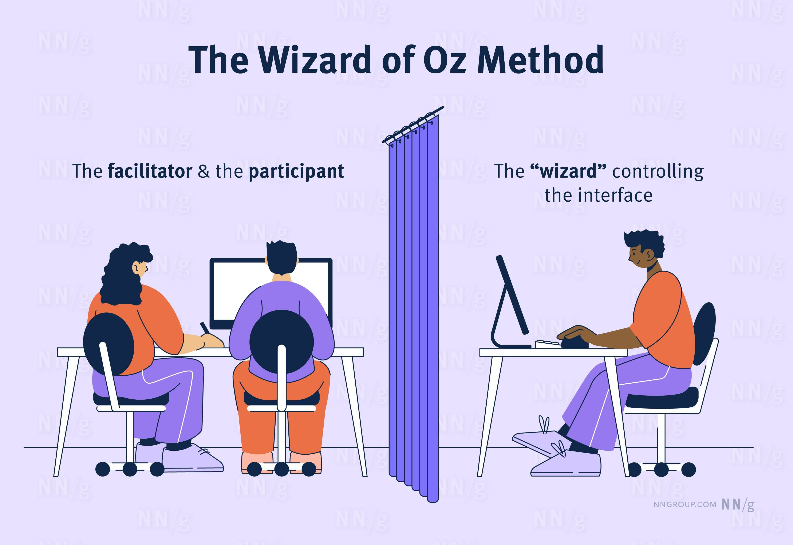
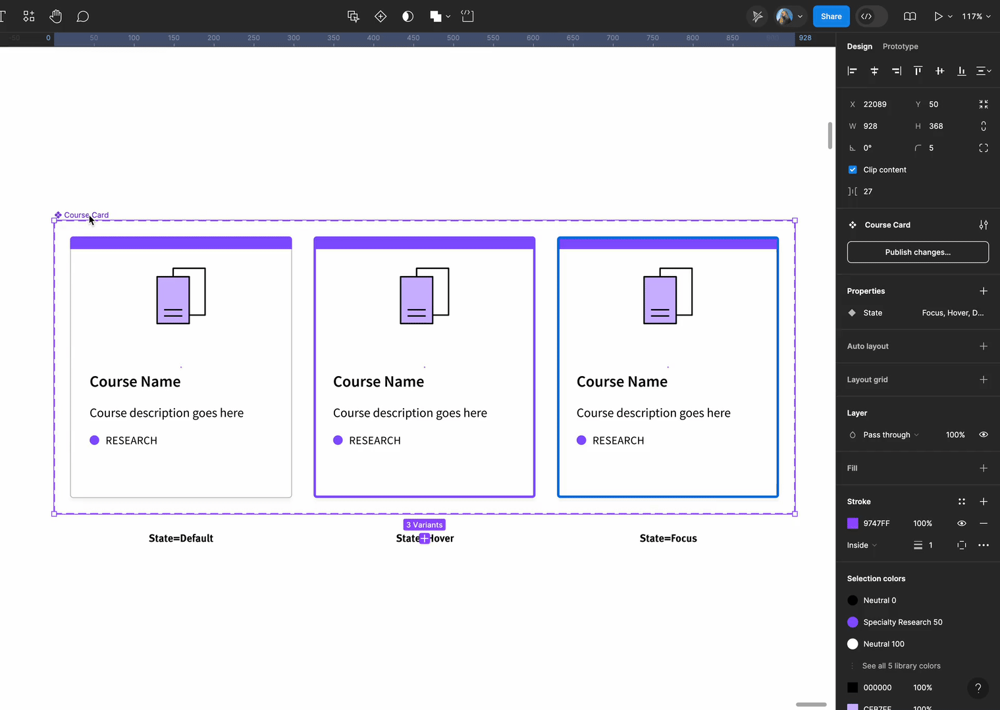
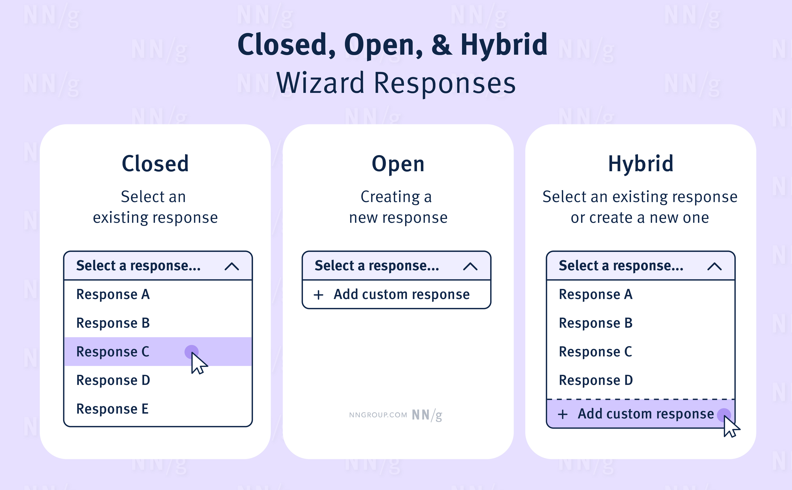

Summary:  The Wizard of Oz is a user-research method where a user interacts with a mock interface controlled, to some degree, by a person.  

摘要：《绿野仙踪》是一种用户研究方法，用户与在某种程度上由人控制的模拟界面进行交互。

The Wizard of Oz method helps teams test designs that are powered by complex technologies at a low cost.  

绿野仙踪 "方法可帮助团队以低成本测试由复杂技术驱动的设计。  

Instead of building out the technology, designers can simulate the responses the technology might provide by having a person “play” the system's role.  

设计者可以通过让人 "扮演 "系统的角色来模拟技术可能提供的反应，而不是构建技术。

-   [What Is the Wizard of Oz Method?  
    
    什么是绿野仙踪法？](https://www.nngroup.com/articles/wizard-of-oz/#toc-what-is-the-wizard-of-oz-method-1)
-   [When to Use the Wizard of Oz Method  
    
    何时使用绿野仙踪法](https://www.nngroup.com/articles/wizard-of-oz/#toc-when-to-use-the-wizard-of-oz-method-2)
-   [Benefits of Using the Wizard of Oz Method  
    
    使用绿野仙踪法的好处](https://www.nngroup.com/articles/wizard-of-oz/#toc-benefits-of-using-the-wizard-of-oz-method-3)
-   [How to Set up a Wizard of Oz Study  
    
    如何开设《绿野仙踪》学习班](https://www.nngroup.com/articles/wizard-of-oz/#toc-how-to-set-up-a-wizard-of-oz-study-4)
-   [Do You Need to Reveal the Wizard?  
    
    您需要揭示向导吗？](https://www.nngroup.com/articles/wizard-of-oz/#toc-do-you-need-to-reveal-the-wizard-5)
-   [Origins of the Method  
    
    方法的起源](https://www.nngroup.com/articles/wizard-of-oz/#toc-origins-of-the-method-6)
-   [Conclusion  
    
    结论](https://www.nngroup.com/articles/wizard-of-oz/#toc-conclusion-7)

## What Is the Wizard of Oz Method?  

什么是绿野仙踪法？

> The **Wizard of Oz** method is a moderated research method in which  a user interacts with an interface that appears to be autonomous but is (fully or partially) controlled by a human.  
> 
> 绿野仙踪法是一种调节式研究方法，在这种方法中，用户与看似自主但（完全或部分）由人类控制的界面进行交互。

The Wizard of Oz method takes its name from the children’s novel “The Wonderful Wizard of Oz” by Frank Baum.  

绿野仙踪 "的名称来自弗兰克-鲍姆的儿童小说《绿野仙踪》。  

In this novel, the main protagonist, Dorothy, and her companions meet a giant head that appears to be a powerful wizard, only to learn that it’s just an ordinary man pulling levers behind a curtain.  

在这部小说中，主人公多萝西和她的同伴们遇到了一个巨大的头颅，它似乎是一个强大的巫师，但后来才知道它只是一个在窗帘后面拉杠杆的普通人。

The Wizard of Oz method is used in [moderated usability tests](https://www.nngroup.com/articles/remote-usability-testing-costs/).  

绿野仙踪 "方法用于调节式可用性测试。  

Like in a traditional moderated usability test, a Wizard of Oz study involves a facilitator and a target user.  

与传统的调节式可用性测试一样，绿野仙踪研究也包括一名主持人和一名目标用户。  

In addition, you need someone to be “the wizard.” This person will select or create responses from the interface.  

此外，您还需要有人担任 "向导"。此人将从界面中选择或创建回复。

The Wizard of Oz method is similar to [testing paper prototypes](https://www.nngroup.com/videos/paper-prototyping-tutorial/) (where you might have someone play the role of the computer).  

绿野仙踪 "方法类似于测试纸质原型（在这种方法中，你可能会让某人扮演计算机的角色）。  

However, in the Wizard of Oz method, the design can be digital, and the person generating the system response is not visible to the user.  

然而，在绿野仙踪方法中，设计可以是数字化的，用户看不到生成系统响应的人。

_A usability-test session using the Wizard of Oz method involves an additional person, “the wizard,” who provides some or all of the system’s responses behind the scenes.  

使用绿野仙踪方法进行可用性测试时，需要增加一个人，即 "巫师"，在幕后提供系统的部分或全部响应。_

## When to Use the Wizard of Oz Method  

何时使用绿野仙踪法

The Wizard of Oz method is useful when testing new interfaces powered by complex technologies that  are difficult to test meaningfully with a prototype containing static content.  

在测试由复杂技术驱动的新界面时，绿野仙踪方法非常有用，因为这些技术很难通过包含静态内容的原型进行有意义的测试。  

Such interfaces include:  

这些接口包括

-   Conversational UIs, like chatbots  
    
    对话式用户界面，如聊天机器人
-   Interfaces that use learning algorithms to provide recommended content  
    
    使用学习算法提供推荐内容的界面
-   Interfaces that look up real-time information and present the results to the user  
    
    查询实时信息并将结果呈现给用户的界面

For example, the authors have used the Wizard of Oz method in the following research projects:   

例如，作者在以下研究项目中使用了绿野仙踪法：

-   **A project to improve the support chatbot on a technology retailer’s website.** A Wizard of Oz study helped the team explore how to provide helpful personalized recommendations appropriate for the device the user used to make a support request.  
    
    该项目旨在改进一家技术零售商网站上的支持聊天机器人。一项 "绿野仙踪 "研究帮助团队探索了如何根据用户提出支持请求时使用的设备提供有用的个性化建议。  
    
    A designer updated a Figma prototype during the session based on the responses that study participants gave in an introductory interview.  
    
    在会议期间，一名设计师根据研究参与者在介绍性访谈中的回答更新了 Figma 原型。
-   **A project to design a new voice assistant.** The Wizard of Oz method was used to help the team understand how users would interact with a new [voice assistant.](https://www.nngroup.com/articles/audio-signifiers-voice-interaction/) A Bluetooth speaker was placed inside a physical cardboard mockup.  
    
    一个设计新型语音助手的项目。我们采用了绿野仙踪的方法来帮助团队了解用户将如何与新的语音助手进行交互。一个蓝牙扬声器被放置在一个纸板模型中。  
    
    The user would talk to the mockup, and the voice assistant’s responses were generated through a text-to-voice application channeled through the Bluetooth speaker.  
    
    用户对着模型说话，语音助手通过蓝牙扬声器传输的 "文本到语音 "应用程序作出回应。
-   **A project to build a government form that searched various government databases in real time** and presented users the information that was stored about them.  
    
    该项目旨在建立一个政府表格，实时搜索各种政府数据库，并向用户展示所存储的相关信息。  
    
    A Wizard of Oz study helped the team learn how users perceived the retrieval of their information and how this information should be communicated.  
    
    一项 "绿野仙踪 "研究帮助团队了解了用户如何看待信息检索，以及应如何传达这些信息。  
    
    The researchers gathered the participant’s information through an initial interview in the session, and the wizard updated a live, coded prototype with what the user might see if a real database search were to be performed.  
    
    研究人员在会话中通过初步访谈收集了参与者的信息，然后向导更新了实时编码原型，使其与用户在进行真实数据库搜索时可能看到的内容一致。

## Benefits of Using the Wizard of Oz Method  

使用绿野仙踪法的好处

The Wizard-of-Oz method lowers investment risk into complex, costly technologies (such as generative AI): it provides early insights into their desirability, utility, and usability before companies spend money building them.  

Wizard-of-Oz 方法降低了对复杂、昂贵技术（如生成式人工智能）的投资风险：在公司花钱构建这些技术之前，它能提供对其可取性、实用性和可用性的早期见解。

The Wizard of Oz method is often used when developing [MVPs (Minimum Viable Products)](https://www.nngroup.com/articles/agile-glossary/#MVP).  

在开发 MVP（最小可行产品）时，经常会用到绿野仙踪法。  

One of the most famous examples of an MVP that used the Wizard of Oz method comes from Zappos, the first online shoe retailer.  

第一个在线鞋类零售商 Zappos 就是使用 "绿野仙踪 "方法实现 MVP 的最著名案例之一。  

Before investing money in warehouses, inventory, and service automation, founder Nick Swinmurn tested the company’s value proposition by fulfilling orders himself.  

在对仓库、库存和服务自动化进行投资之前，创始人尼克-斯温莫恩（Nick Swinmurn）通过亲自完成订单来测试公司的价值主张。  

When orders were placed on his website, Swinmurn would go to a local shoe store, buy the shoes, and mail them to the customer.  

当客户在网站上下单后，Swinmurn 会去当地的鞋店买鞋，然后邮寄给客户。

## How to Set up a Wizard of Oz Study  

如何开设《绿野仙踪》学习班

There are several moving parts to running a successful Wizard of Oz study.  

要成功开展 "绿野仙踪 "研究，有几个活动环节。  

Follow these 5 steps to get your study off the ground.  

按照以下 5 个步骤，让你的研究开始起步。

### Step 1: Create the Prototype  

步骤 1：创建原型

You will need a prototype of the new design for the user to interact with.  

您需要一个新设计的原型，供用户进行交互。  

Depending on what you’re testing, this might be:  

根据您测试的内容，这可能是：

-   A prototype in some design software (like Figma)  
    
    设计软件（如 Figma）中的原型
-   A coded prototype  
    
    编码原型
-   An existing technology as a proxy for the new functionality (e.g., an existing messaging platform to simulate a new chatbot)  
    
    用现有技术替代新功能（例如，用现有信息平台模拟新聊天机器人）

If you’ll be using design software (like Figma or ProtoPie), think about how the wizard can quickly make updates to the prototype.  

如果使用设计软件（如 Figma 或 ProtoPie），请考虑向导如何快速更新原型。  

For example, you could create components for any elements in your prototype that need to be updated in the session.  

例如，您可以为原型中任何需要在会话中更新的元素创建组件。  

This removes the need for the wizard to hunt for specific areas of the design to update.  

这样，向导就不需要寻找设计中需要更新的特定区域了。

(If you’re using Figma, the [multi-edit variant feature](https://www.youtube.com/watch?v=5tucsH2lUSQ) allows you to update instances of the same UI element across a component set.)  

(如果您使用的是 Figma，多编辑变体功能允许您在组件集中更新相同 UI 元素的实例）。

_When using Figma's multi-edit variant feature, the same element can be updated simultaneously across component variations when the wizard makes a change to one of them.  

使用 Figma 的多编辑变体功能时，当向导对其中一个组件变体进行更改时，同一元素可在不同组件变体中同时更新。_

### Step 2: Decide What Responses the Wizard Will Provide  

第 2 步：决定向导将提供哪些回复

-   Closed method: The wizard can choose from a set list of responses  
    
    封闭式方法：向导可从设定的回复列表中进行选择
-   Open method: The wizard will create new responses in the session.  
    
    打开方法：向导将在会话中创建新回复。
-   Hybrid method: The wizard can choose from a short list or craft new responses as needed.  
    
    混合方法：向导可以从一个简短的列表中进行选择，也可以根据需要制作新的回复。

_A wizard can either choose system responses from a set list, create new responses in the moment, or do both during a session.  

向导既可以从设定的列表中选择系统回复，也可以即时创建新的回复，或者在会话期间同时进行这两种操作。_

The closed method suits situations where there are only a few possible responses the system could give.  

封闭式方法适用于系统只有几种可能响应的情况。

The open method is better suited to interfaces that provide fluid user interactions (like conversational UIs); for these types of interfaces, it may be difficult to predict and provide preset responses.  

开放式方法更适合提供流畅用户交互的界面（如对话式用户界面）；对于这类界面，可能很难预测和提供预设响应。

The hybrid method offers the most flexibility; some responses are predetermined, but if one doesn’t fit, a new response can be created.  

混合法提供了最大的灵活性；有些回答是预先确定的，但如果某个回答不合适，也可以创建新的回答。

#### **Pros and Cons of Each Response Method  

每种应对方法的优缺点**

<table data-immersive-translate-walked="2ebfcd11-5f78-450d-890e-209a46f72772"><tbody data-immersive-translate-walked="2ebfcd11-5f78-450d-890e-209a46f72772"><tr data-immersive-translate-walked="2ebfcd11-5f78-450d-890e-209a46f72772"><th scope="row"><strong>Closed</strong></th><td data-immersive-translate-walked="2ebfcd11-5f78-450d-890e-209a46f72772" data-immersive-translate-paragraph="1">
<strong data-immersive-translate-walked="2ebfcd11-5f78-450d-890e-209a46f72772">✅ </strong>The wizard does not need to create a response on the spot. ✅ 向导无需当场创建回复。

<strong data-immersive-translate-walked="2ebfcd11-5f78-450d-890e-209a46f72772">✅ </strong>Responses are<strong data-immersive-translate-walked="2ebfcd11-5f78-450d-890e-209a46f72772"> </strong>easy to analyze since there’s less across tests. ✅ 由于不同测试之间的差异较小，因此很容易对答案进行分析。

<strong data-immersive-translate-walked="2ebfcd11-5f78-450d-890e-209a46f72772">⚠️ </strong>Choosing a response can take time if there are many. ⚠️ 如果回复很多，选择回复可能需要时间。
<strong data-immersive-translate-walked="2ebfcd11-5f78-450d-890e-209a46f72772">⚠️ </strong>There might not be responses that fit the situation. ⚠️ 可能没有符合实际情况的答复。</td></tr><tr data-immersive-translate-walked="2ebfcd11-5f78-450d-890e-209a46f72772"><th scope="row"><strong>Hybrid</strong></th><td data-immersive-translate-walked="2ebfcd11-5f78-450d-890e-209a46f72772" data-immersive-translate-paragraph="1">
<strong data-immersive-translate-walked="2ebfcd11-5f78-450d-890e-209a46f72772">✅ </strong>The wizard can select a response or create a new one. ✅ 向导可以选择一个回复或创建一个新回复。
<strong data-immersive-translate-walked="2ebfcd11-5f78-450d-890e-209a46f72772">⚠️ </strong>It can be challenging to decide whether to use an existing response or create a new one. ⚠️ 要决定是使用现有的回复还是创建一个新的回复，可能很有挑战性。</td></tr><tr data-immersive-translate-walked="2ebfcd11-5f78-450d-890e-209a46f72772"><th scope="row"><strong>Open</strong></th><td data-immersive-translate-walked="2ebfcd11-5f78-450d-890e-209a46f72772" data-immersive-translate-paragraph="1">
<strong data-immersive-translate-walked="2ebfcd11-5f78-450d-890e-209a46f72772">✅</strong>The wizard doesn’t need to search through existing responses. ✅向导无需搜索现有回复。

<strong data-immersive-translate-walked="2ebfcd11-5f78-450d-890e-209a46f72772">✅</strong>The wizard can keep the test running if the user says or does something unexpected. ✅ 如果用户说了或做了一些意想不到的事情，向导可以让测试继续运行。

<strong data-immersive-translate-walked="2ebfcd11-5f78-450d-890e-209a46f72772">⚠️</strong>Crafting new responses could be effortful and take time. ⚠️，起草新的答复可能需要花费大量精力和时间。
<strong data-immersive-translate-walked="2ebfcd11-5f78-450d-890e-209a46f72772">⚠️</strong>If there is a lot of variation in responses across tests, it can be hard to evaluate the interface’s performance. ⚠️，如果不同测试的响应差异很大，就很难评估界面的性能。</td></tr></tbody></table>

**Involve engineers in planning what the system responses should be.** Engineers can identify what responses are feasible, given their knowledge of the technology’s capabilities and constraints.  

让工程师参与规划系统的应对措施。工程师可以根据他们对技术能力和限制因素的了解，确定哪些应对措施是可行的。

### Step 3: Create a Study Protocol  

步骤 3：制定研究方案

A study protocol is a detailed outline of the study goals and how the study should be conducted.  

研究方案是对研究目标和如何开展研究的详细概述。  

The study protocol will help the wizard and the facilitator to understand how to act in the session.  

学习协议将帮助向导和主持人了解如何在会议中采取行动。

In addition to all the usual elements found in a [test plan](https://www.nngroup.com/articles/pm-research-plan/) (like the tasks you would give the user), the study protocol for a Wizard of Oz study should include:  

除了测试计划中的所有常规要素（如给用户布置的任务）外，绿野仙踪研究的研究方案还应包括以下内容：

-   **An overview of the roles,** including who will facilitate the session and who will be the wizard  
    
    角色概述，包括谁将主持会议，谁将担任向导
-   The **questions** that the facilitator will ask the user at the beginning of the session and that could inform the wizard’s responses during the session (if relevant)  
    
    主持人将在会议开始时向用户提出的问题，这些问题可能会为向导在会议期间的回答提供参考（如果相关的话）
-   The **elements of the design** that will be controlled by the wizard and how they will be controlled (e.g., decision trees, step-by-step instructions, or screenshots for the wizard to consult or follow)  
    
    将由向导控制的设计要素及其控制方式（如决策树、分步说明或截图，供向导参考或遵循）
-   The **responses** the wizard could choose from, if opting for the closed or hybrid method (.e.g., _Loading… please wait_ when the wizard needs more time or _Under construction_ if the user interacts with the system in an unexpected way)    
    
    如果向导选择封闭式或混合式方法（例如，当向导需要更多时间时，可选择 "正在加载......请稍候"；如果用户与系统的交互方式出乎意料，则可选择 "正在建设中"），向导可选择的回复方式
-   Any **guidelines** for how the wizard should respond if they improvise new system responses during the session (e.g., tone-of-voice recommendations if the wizard is pretending to be a chatbot)  
    
    如果向导在会话期间即兴做出新的系统响应，向导应如何响应的指导原则（例如，如果向导假装聊天机器人，建议使用语音语调）

### Step 4: Choose and Prepare the Wizard  

第 4 步：选择和准备向导

The wizard should be familiar with the:  

向导应熟悉

-   **Product concept and design:** The wizard should understand what the product is intended to do and how it would work.  
    
    产品概念和设计：向导应了解产品的用途和工作原理。  
    
    Ideally, they’ll also be aware of any technological constraints, so they can avoid providing system responses that are not feasible.  
    
    理想情况下，他们还能意识到任何技术限制，从而避免提供不可行的系统响应。
-   **Responses they should give:** If you are conducting a closed or hybrid test, the wizard may have helped create the responses.  
    
    他们应该给出的答案：如果您进行的是封闭式或混合式测试，向导可能已经帮助创建了答案。
-   **Prototyping software or code** if the wizard will need to update elements in a prototype.  
    
    如果向导需要更新原型中的元素，则需要原型软件或代码。

In many cases, a designer or developer may need to play the wizard.  

在许多情况下，设计师或开发人员可能需要扮演向导的角色。  

Spend some time preparing the wizard before the study so the sessions run smoothly.  

在学习前花一些时间为向导做准备，以便课程顺利进行。  

This might involve running through the study protocol with the wizard, giving the wizard practice on responding or updating the prototype, and even inviting the wizard to participate in a pilot test (see step 5).  

这可能包括与向导一起执行研究协议，让向导练习如何回复或更新原型，甚至邀请向导参与试点测试（见第 5 步）。

### Step 5: Pilot the Study  

步骤 5：试点研究

Since there are many moving parts, [piloting your study](https://www.nngroup.com/articles/pilot-testing/) ensures everything works as intended and that the wizard can quickly provide responses.  

由于有许多活动部件，试运行研究可确保一切按计划进行，并确保向导能迅速做出反应。  

You can pilot the test with a friend, colleague, or a real user.  

您可以与朋友、同事或真实用户一起进行测试。  

Piloting gives your wizard some practice before the real sessions and avoids wasting precious time in the session resolving unexpected technical issues.  

试运行可以让向导在真正的会议之前进行一些练习，避免在会议中浪费宝贵的时间来解决意想不到的技术问题。

As part of your pilot, you may realize that new responses are needed that you hadn’t anticipated.  

在试点过程中，您可能会意识到需要采取新的应对措施，而这是您始料未及的。  

Such insights allow you to refine your protocol before the study begins.  

有了这些见解，您就可以在研究开始前完善您的方案。

## Do You Need to Reveal the Wizard?  

您需要揭示向导吗？

The presence of the wizard is not usually revealed to the participant to ensure that realistic behavior is collected during the session.  

通常不会向参与者透露向导的存在，以确保在测试过程中收集到真实的行为。  

However, sometimes participants guess that a person is providing a response, especially if the design is low fidelity or the participant has a lot of technological knowledge.  

不过，有时参与者会猜测是某个人在提供回复，尤其是在设计的保真度较低或参与者拥有大量技术知识的情况下。  

In this case, the method becomes closer to a roleplay.  

在这种情况下，这种方法更接近于角色扮演。

Don’t worry if participants guess or ask if the responses are human-generated.  

如果参与者猜测或询问答复是否由人工生成，也不必担心。  

 Remind them to behave as they would if they were interacting with a real system.  

提醒他们要像与真实系统交互时那样行事。

In user-research sessions that involve [deception](https://www.nngroup.com/articles/ethical-dilemmas/), a debrief at the end of the session is needed to ensure that participants learn accurate information about the study and can decide whether they want to withdraw.  

在涉及欺骗的用户研究会话中，需要在会话结束时进行汇报，以确保参与者了解有关研究的准确信息，并决定是否退出。

Unless it could harm the participant to be unaware of this information, you don’t have to disclose that a human produced the system response.  

除非参与者不知道这一信息会对其造成伤害，否则您不必披露系统响应是由人作出的。

## Origins of the Method  

方法的起源

The Wizard of Oz method was first documented and used in 1973 by Don Norman and Allen Munro to test an automated airport computer-terminal travel assistant.  

1973 年，唐-诺曼（Don Norman）和艾伦-芒罗（Allen Munro）首次记录并使用了绿野仙踪方法，以测试机场计算机终端自动旅行助手。  

The name for this method was coined in 1983 by researcher Jeff Kelley, in his dissertation on natural-language interfaces at Johns Hopkins University.  

这种方法的名称由研究员杰夫-凯利于 1983 年在约翰-霍普金斯大学关于自然语言界面的论文中提出。  

These foundational studies explored user interactions with natural-language interfaces when this technology was early in its development.  

这些奠基性研究探讨了用户与自然语言界面的交互，当时这种技术还处于发展初期。

## Conclusion  

结论

A Wizard of Oz study offers early insights into complex and highly interactive interfaces that might be costly to experiment with and build.  

绿野仙踪》的研究为复杂和高度互动的界面提供了早期见解，而这些界面的实验和构建可能会耗资巨大。  

Not all usability studies need to use the Wizard of Oz method.  

并非所有可用性研究都需要使用绿野仙踪方法。  

Consider your research goals and what you need to learn.  

考虑您的研究目标和需要学习的内容。  

In many cases, a prototype with static content will be more than sufficient.  

在许多情况下，一个包含静态内容的原型就足够了。

If you need to learn how users react or engage with systems that provide personalized, real-time recommendations or utilize natural-language models, then the Wizard of Oz method can provide insights into how to design these systems most effectively.  

如果您需要了解用户对提供个性化、实时推荐或利用自然语言模型的系统的反应或参与情况，那么绿野仙踪方法可以让您深入了解如何最有效地设计这些系统。  

When running a Wizard of Oz study, preparation and planning are key.  

在开展绿野仙踪研究时，准备和规划是关键。  

Make a plan, involve engineers, and pilot your study for the best results.  

制定计划，让工程师参与进来，并对研究进行试点，以获得最佳效果。
