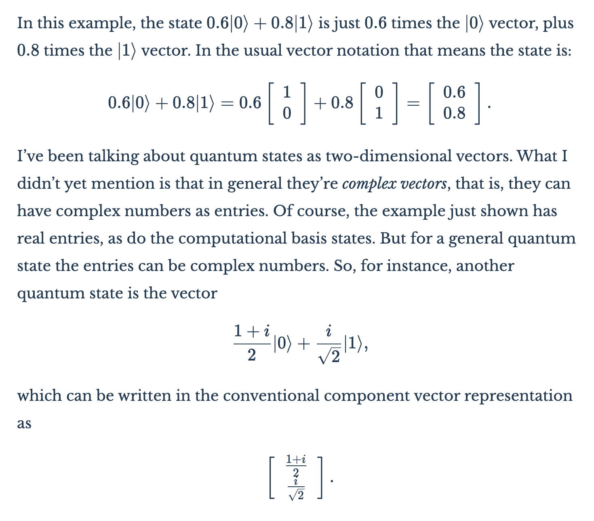
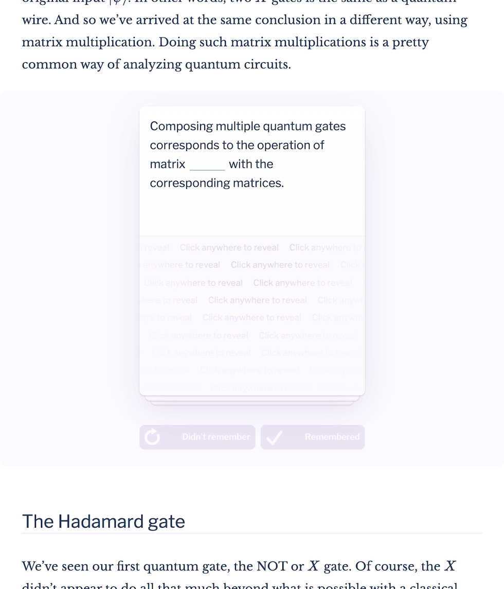
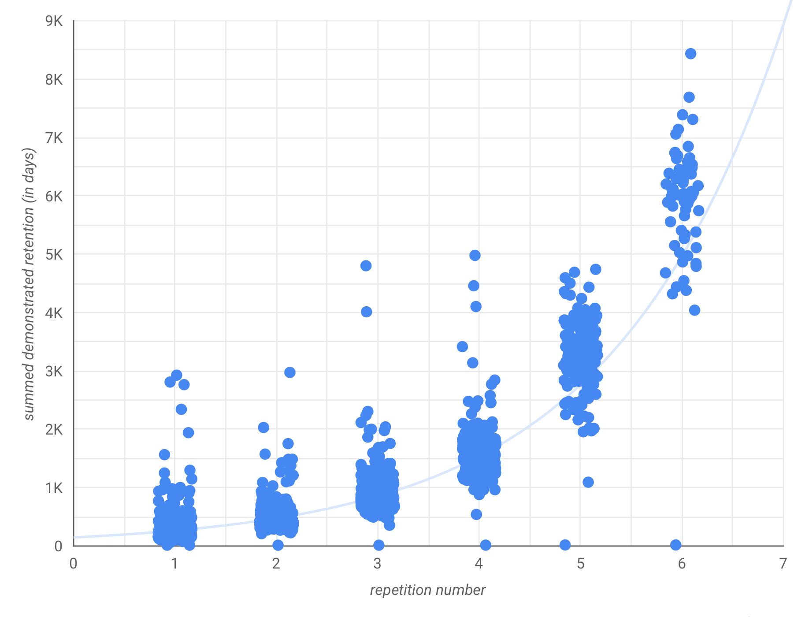

Part of the origin myth of modern computing is the story of a golden age in the 1960s and 1970s.  

现代计算机的起源神话之一就是 20 世纪 60 和 70 年代的黄金时代。  

In this story, visionary pioneers pursued a dream in which computers enabled powerful tools for thought, that is, tools to augment human intelligence  

在这个故事中，具有远见卓识的先驱们追寻着一个梦想，即计算机能够提供强大的思维工具，也就是增强人类智能的工具 E.g., Douglas Engelbart, [Augmenting Human Intellect: A Conceptual Framework](https://numinous.productions/ttft/assets/Engelbart1962.pdf) (1962).  

例如，Douglas Engelbart, Augmenting Human Intellect：概念框架》（1962 年）。.  

One of those pioneers, Alan Kay, summed up the optimism of this dream when he wrote of the potential of the personal computer: “the very use of it would actually change the thought patterns of an entire civilization”  

其中一位先驱艾伦-凯（Alan Kay）在谈到个人电脑的潜力时，总结了这一梦想的乐观精神：”它的使用将改变整个文明的思维模式” Alan Kay, [User Interface: A Personal View](https://numinous.productions/ttft/assets/Kay1989.pdf) (1989).  

艾伦-凯，《用户界面：个人观点》（1989 年）。.

It’s an inspiring dream, which helped lead to modern interactive graphics, windowing interfaces, word processors, and much else.  

这是一个鼓舞人心的梦想，它有助于现代交互式图形、窗口界面、文字处理程序以及其他许多方面的发展。  

But retrospectively it’s difficult not to be disappointed, to feel that computers have not yet been nearly as transformative as far older tools for thought, such as language and writing.  

但回过头来看，我们很难不感到失望，觉得计算机的变革性远不及语言和文字等更古老的思想工具。  

Today, it’s common in technology circles to pay lip service to the pioneering dreams of the past.  

如今，科技界普遍对过去的先锋梦想口诛笔伐。  

But nostalgia aside there is little determined effort to pursue the vision of transformative new tools for thought.  

但是，除了怀旧之外，人们并没有下定决心去追求变革性新思想工具的愿景。

We believe now is a good time to work hard on this vision again.  

我们相信，现在正是再次努力实现这一愿景的好时机。  

In this essay we sketch out a set of ideas we believe can be used to help develop transformative new tools for thought.  

在这篇文章中，我们将勾勒出我们认为可以用来帮助开发变革性新思想工具的一系列想法。  

In the first part of the essay we describe an experimental prototype system that we’ve built, a kind of _mnemonic medium_ intended to augment human memory. This is a snapshot of an ongoing project, detailing both encouraging progress as well as many challenges and opportunities.  

在文章的第一部分，我们介绍了我们建立的一个实验性原型系统，一种旨在增强人类记忆的记忆媒介。这是一个正在进行中的项目的缩影，其中既有令人鼓舞的进展，也有许多挑战和机遇。  

In the second part of the essay, we broaden the focus. We sketch several other prototype systems. And we address the question: why is it that the technology industry has made comparatively little effort developing this vision of transformative tools for thought?  

在文章的第二部分，我们扩大了重点。我们勾画了其他几个原型系统。我们还将探讨这样一个问题：为什么技术行业在开发这种变革性思维工具方面所做的努力相对较少？

In the opening we mentioned some visionaries of the past.  

我们在开篇提到了过去的一些远见卓识者。  

To those could be added many others – Ivan Sutherland, Seymour Papert, Vannevar Bush, and more.  

除此以外，还有伊万-萨瑟兰、西摩-帕帕特、范内瓦尔-布什等等。  

Online there is much well-deserved veneration for these people.  

在网上，人们对这些人的崇敬是当之无愧的。  

But such veneration can veer into an unhealthy reverence for the good old days, a belief that giants once roamed the earth, and today’s work is lesser.  

但是，这种崇敬可能会变成对过去美好时光的不健康的敬畏，认为巨人曾经在地球上肆虐，而今天的工作是次要的。  

Yes, those pioneers did amazing things, and arguably had ways of working that modern technologists, in both industry and academia, are poorly equipped to carry on.  

是的，这些先驱们做出了令人惊叹的成就，可以说，他们的工作方式是现代技术人员（无论是工业界还是学术界）所无法继承的。  

But they also made mistakes, and were ignorant of powerful ideas that are available today.  

但是，他们也犯过错误，对当今强大的思想一无所知。  

And so a theme through both parts of the essay is to identify powerful ideas that weren’t formerly known or weren’t acted upon.  

因此，贯穿这两部分文章的一个主题，就是找出以前不为人知或没有付诸行动的强大思想。  

Out of this understanding arises a conviction that a remarkable set of opportunities is open today.  

有了这种认识，我们就会坚信，今天有一系列非同寻常的机遇。

A word on nomenclature: the term “tools for thought” rolls off neither the tongue nor the keyboard.  

关于术语：”思想工具 ”这个词既不是从舌头上滚落，也不是从键盘上滚落。  

What’s more, the term “tool” implies a certain narrowness. Alan Kay has argued  

此外，”工具 ”一词意味着某种狭隘性。艾伦-凯认为 Again, in Alan Kay, [User Interface: A Personal View](https://numinous.productions/ttft/assets/Kay1989.pdf) (1989), among other places.  

在 Alan Kay 的《用户界面》（User Interface：个人观点》（1989 年）等著作中。 that a more powerful aim is to develop a new _medium for thought_. A medium such as, say, Adobe _Illustrator_ is essentially different from any of the individual tools _Illustrator_ contains.  

更强大的目标是开发一种新的思维媒介。例如，Adobe Illustrator 这样的媒介与 Illustrator 中的任何单个工具都有本质区别。  

Such a medium creates a powerful immersive context, a context in which the user can have new kinds of thought, thoughts that were formerly impossible for them.  

这种媒介创造了一种强大的身临其境的情境，在这种情境中，用户可以进行新的思考，进行以前不可能进行的思考。  

Speaking loosely, the range of expressive thoughts possible in such a medium is an emergent property of the elementary objects and actions in that medium.  

从广义上讲，在这种媒介中可能表达的思想范围是该媒介中基本物体和行为的一种新兴属性。  

If those are well chosen, the medium expands the possible range of human thought.  

如果选择得当，媒介就能扩大人类思想的可能范围。

With that said, the term “tools for thought” has been widely used since Iverson’s 1950s and 1960s work  

尽管如此，”思想工具 ”一词自上世纪五六十年代艾弗森的著作以来一直被广泛使用 An account may be found in Iverson’s Turing Award lecture, [Notation as a Tool of Thought](https://numinous.productions/ttft/assets/Iverson1979.pdf) (1979).  

艾弗森在图灵奖演讲《作为思维工具的符号》（1979 年）中对此进行了阐述。  

Incidentally, even Iverson is really describing a medium for thought, the APL programming language, not a narrow tool.  

顺便提一下，即使是艾弗森，他真正描述的也是一种思维媒介，即 APL 编程语言，而不是一种狭隘的工具。 introducing the term.  

介绍该术语。  

And so we shall use “tools for thought” as our catch all phrase, while giving ourselves license to explore a broader range, and also occasionally preferring the term “medium” when it is apt.  

因此，我们将使用 ”思想工具 ”作为我们的通用术语，同时允许自己探索更广泛的范围，偶尔也会在恰当的时候使用 ”媒介 ”一词。

Let’s come back to that phrase from the opening, about changing “the thought patterns of an entire civilization”.  

让我们回到开头的那句话，即改变 ”整个文明的思维模式”。  

It sounds ludicrous, a kind of tech soothsaying.  

这听起来很可笑，是一种技术预言。  

Except, of course, such changes have happened multiple times during human history: the development of language, of writing, and our other most powerful tools for thought.  

当然，这种变化在人类历史上发生过多次：语言、文字以及其他最强大的思维工具的发展。  

And, for better and worse, computers really have affected the thought patterns of our civilization over the past 60 years, and those changes seem like just the beginning.  

无论好坏，计算机在过去 60 年里确实影响了我们文明的思维模式，而这些变化似乎才刚刚开始。  

This essay is a small contribution to understanding how such changes happen, and what is still possible.  

这篇文章为了解这种变化是如何发生的，以及还有哪些可能性做出了一点贡献。

The musician and comedian Martin Mull has observed that “writing about music is like dancing about architecture”.  

音乐家兼喜剧演员马丁-穆尔（Martin Mull）曾说过，”写音乐就像跳建筑舞”。  

In a similar way, there’s an inherent inadequacy in writing about tools for thought.  

同样，在书写思想工具时也存在先天不足。  

To the extent that such a tool succeeds, it expands your thinking beyond what can be achieved using existing tools, including writing.  

只要这种工具取得成功，它就能拓展你的思维，超越使用现有工具（包括写作）所能达到的效果。  

The more transformative the tool, the larger the gap that is opened.  

工具的变革性越强，打开的缺口就越大。  

Conversely, the larger the gap, the more difficult the new tool is to evoke in writing.  

相反，差距越大，就越难在写作中唤起新工具。  

But what writing can do, and the reason we wrote this essay, is act as a bootstrap.  

但写作能做的，也是我们写这篇文章的原因，就是起到引导的作用。  

It’s a way of identifying points of leverage that may help develop new tools for thought.  

这是一种确定杠杆点的方法，可能有助于开发新的思维工具。  

So let’s get on with it.  

那我们就开始吧。

## Part I: Memory systems  

第 I 部分：记忆系统

## Introducing the mnemonic medium  

引入记忆媒介

Few subjects are more widely regarded as difficult than quantum computing and quantum mechanics.  

没有什么学科比量子计算和量子力学更被广泛认为是困难的了。  

Indeed, popular media accounts often regale (and intimidate) readers with quotes from famous physicists in the vein of: “anyone who thinks they’ve understood quantum mechanics has not understood quantum mechanics”.  

事实上，大众媒体经常引用著名物理学家的名言来恫吓读者：”任何自以为理解了量子力学的人都没有理解量子力学”。

What makes these subjects difficult?  

是什么让这些科目变得困难？  

In fact, individually many of the underlying ideas are not too complicated for people with a technical background.  

事实上，对于有技术背景的人来说，许多基本概念并不复杂。  

But the ideas come in an overwhelming number, a tsunami of unfamiliar concepts and notation.  

但是，各种想法层出不穷，陌生的概念和符号海啸般袭来。  

People must learn in rapid succession of qubits, the bra-ket notation, Hadamard gates, controlled-not gates, and many, many other abstract, unfamiliar notions.  

人们必须接二连三地学习量子比特、Bra-ket 符号、哈达玛门、受控不门以及其他许多抽象、陌生的概念。  

They’re imbibing an entire new language.  

他们正在学习一种全新的语言。  

Even if they can follow at first, understanding later ideas requires fluency with all the earlier ideas.  

即使他们一开始能听懂，要理解后面的观点也需要流畅地掌握前面的所有观点。  

It’s overwhelming and eventually disheartening.  

这让人不知所措，最终心灰意冷。

As an experiment, we have developed a website, [_Quantum Country_](https://quantum.country/), which explores a new approach to explaining quantum computing and quantum mechanics. Ostensibly, _Quantum Country_ appears to be a conventional essay introduction to these subjects.  

作为一项实验，我们开发了一个名为 ”量子国度 ”的网站，探索一种解释量子计算和量子力学的新方法。从表面上看，”量子国度 ”似乎是介绍这些主题的传统论文。  

There is text, explanations, and equations, much as in any other technical essay.  

其中有文字、解释和方程式，与其他技术文章一样。  

Here’s an excerpt:  

下面是摘录：

But it’s not a conventional essay. Rather, _Quantum Country_ is a prototype for a new type of _mnemonic medium_.  

但这不是一篇传统的散文。相反，《量子国度》是一种新型记忆媒介的原型。  

Aspirationally, the mnemonic medium makes it almost effortless for users to remember what they read.  

从愿望上讲，记忆媒介使用户几乎不费吹灰之力就能记住所读内容。  

That may sound like an impossible aspiration.  

这听起来似乎是一个不可能实现的愿望。  

What makes it plausible is that cognitive scientists know a considerable amount about how human beings store long-term memories.  

让人觉得可信的是，认知科学家对人类如何存储长期记忆有相当多的了解。  

Indeed, what they know can almost be distilled to an actionable recipe: follow these steps, and you can remember whatever you choose.  

事实上，他们所掌握的知识几乎可以提炼成一个可操作的秘诀：按照这些步骤，你可以记住任何你选择的东西。

Unfortunately, those steps are poorly supported by existing media.  

遗憾的是，现有媒体对这些步骤的支持力度不够。For more on this argument, see Andy Matuschak, [Why books don’t work](https://andymatuschak.org/books/) (2019).  

有关这一论点的更多信息，请参见安迪-马图沙克：《书籍为何不起作用》（2019 年）。 Is it possible to design a new medium which much more actively supports memorization?  

有没有可能设计一种新的媒介，更积极地支持记忆？  

That is, the medium would build in (and, ideally, make almost effortless) the key steps involved in memory.  

也就是说，这种媒介会将记忆的关键步骤内置其中（理想情况下，几乎不费吹灰之力）。  

If we could do this, then instead of memory being a haphazard event, subject to chance, the mnemonic medium would make memory into a choice.  

如果我们能做到这一点，那么记忆就不再是一个偶然的事件，而是受制于机会，记忆媒介将使记忆成为一种选择。  

Of course, on its own this wouldn’t make it trivial to learn subjects such as quantum mechanics and quantum computing – learning those subjects is about much more than memory. But it would help in addressing one core difficulty: the overwhelming number of new concepts and notation.  

当然，单凭这一点并不能让量子力学和量子计算等学科的学习变得轻而易举--学习这些学科所涉及的远不止是记忆。但它有助于解决一个核心难题：大量的新概念和新符号。

In fact, there are many ways of redesigning the essay medium to do that.  

事实上，要做到这一点，有很多重新设计作文媒介的方法。  

Before showing you our prototype, please pause for a moment and consider the following questions: how could you build a medium to better support a person’s memory of what they read?  

在向大家展示我们的原型之前，请大家稍停片刻，思考以下问题：如何构建一种媒介，以更好地支持人们对阅读内容的记忆？  

What interactions could easily and enjoyably help people consolidate memories?  

哪些互动可以轻松愉快地帮助人们巩固记忆？  

And, more broadly: is it possible to 2x what people remember? 10x?  

更广义地说：人们的记忆有可能翻 2 倍吗？10x?  

And would that make any long-term difference to their effectiveness?  

这是否会对其有效性产生任何长期影响？

Let’s sketch the user experience of _Quantum Country_.  

让我们来勾勒一下量子国度的用户体验。  

At the time of this writing the site contains three mnemonic essays (i.e., particular instances of the mnemonic medium).  

在撰写本文时，该网站包含三篇记忆法论文（即记忆法媒介的特定实例）。  

We’ll focus on the introductory essay, [“Quantum Computing for the Very Curious”](https://quantum.country/qcvc). Embedded within the text of the essay are 112 questions about that text.  

我们的重点是介绍性文章《非常好奇的量子计算》。文章中包含了 112 个与文章相关的问题。  

Users are asked to create an account, and quizzed as they read on whether they remember the answers to those questions.  

用户需要创建一个账户，并在阅读过程中被问及是否记得这些问题的答案。  

Here’s what the interaction looks like, as a user answers three questions.  

下面是用户回答三个问题时的交互情况。

  

Note that this interaction occurs within the text of the essay itself.  

请注意，这种互动发生在文章本身的文本中。  

Here’s a zoomed-out view, so you can see how such questions are surrounded by essay text both above and below:  

下面是放大后的视图，您可以看到这些问题是如何被上下两部分的文章内容所包围的：

We use the term _cards_ for these interface elements pairing questions and answers.  

我们使用 ”卡片 ”一词来表示这些将问题和答案配对的界面元素。

Of course, for long-term memory it’s not enough for users to be tested just once on their recall.  

当然，对于长期记忆来说，仅对用户进行一次记忆测试是不够的。  

Instead, a few days after first reading the essay, the user receives an email asking them to sign into a review session.  

相反，用户在第一次阅读文章几天后，就会收到一封邮件，要求他们登录到评论会话。  

In that review session they’re tested again, in a manner similar to what was shown above.  

在复习课上，他们将再次接受测试，测试方式与上图类似。  

Then, through repeated review sessions in the days and weeks ahead, people consolidate the answers to those questions into their long-term memory.  

然后，通过未来几天或几周的反复复习，人们会将这些问题的答案巩固到长期记忆中。

So far, this looks like no more than an essay which integrates old-fashioned flashcards.  

目前看来，这不过是一篇整合了老式闪存卡的文章。  

But notice the intervals indicated at the bottom of the cards:  

但请注意卡片底部标明的间隔时间：

  

The highlighted time interval is the duration until the user is tested again on the question.  

突出显示的时间间隔是用户再次接受问题测试之前的持续时间。  

Questions start out with the time interval “in-text”, meaning the user is being tested as they read the essay.  

问题以 ”文中 ”时间间隔开始，这意味着用户在阅读文章时接受测试。  

That rises to five days, if the user remembers the answer to the question.  

如果用户记住了问题的答案，这个时间会增加到五天。  

The interval then continues to rise upon each successful review, from five days to two weeks, then a month, and so on.  

每次成功审核后，间隔时间会继续延长，从五天到两周，再到一个月，依此类推。  

After just five successful reviews the interval is at four months.  

在成功进行五次审查后，间隔时间为四个月。  

If the user doesn’t remember at any point, the time interval drops down one level, e.g., from two weeks to five days.  

如果用户在任何时候都记不起来，时间间隔就会下降一级，例如从两周降到五天。

This takes advantage of a fundamental fact about human memory: as we are repeatedly tested on a question, our memory of the answer gets stronger, and we are likely to retain it for longer  

这就利用了人类记忆的一个基本事实：当我们反复接受一个问题的测试时，我们对答案的记忆就会变得更加深刻，也就有可能将其保留更长时间。 The literature on this effect is vast. A useful entrée is: Gwern Branwen, [Spaced Repetition for Efficient Learning](https://www.gwern.net/Spaced-repetition).  

有关这种效应的文献浩如烟海。以下是一篇有用的入门文章：Gwern Branwen, Spaced Repetition for Efficient Learning.. This exponential rise perhaps seems innocuous, but it’s transformative.  

.这种指数式增长看似无关紧要，但却具有变革性。  

It means that a relatively small number of reviews will enable a user to remember for years.  

这意味着，相对较少的评论就能让用户记住很多年。  

With the time taken to review a typical question being just a few seconds, that means a user can achieve long-term recall with no more than a few minutes’ work.  

复习一个典型问题所需的时间仅为几秒钟，这意味着用户只需几分钟的时间就能实现长期记忆。  

By contrast, with conventional flashcards it takes hours of review to achieve the same durability.  

相比之下，传统的闪存卡需要数小时的复习才能达到同样的效果。  

Exponential scheduling is far more efficient.  

指数调度的效率要高得多。

## The early impact of the prototype mnemonic medium  

记忆媒介原型的早期影响

Although it’s early days for _Quantum Country_ we can begin to see some of the impact of the mnemonic medium.  

尽管 ”量子国度 ”刚刚起步，但我们已经开始看到记忆媒介的一些影响。  

Plotted below is the demonstrated retention of answers for each user, versus the number of times each question in the mnemonic essay has been reviewed:  

下图是每个用户的答案保留率与记忆性文章中每个问题的复习次数对比图：

The graph takes a little unpacking to explain.  

要解释这张图，需要稍加解释。  

By a card’s “demonstrated retention” we mean the maximum time between a successful review of that card, and the prior review of that card.  

我们所说的卡片 ”证明保留时间 ”是指成功审核该卡片与之前审核该卡片之间的最长间隔时间。  

A little more concretely, consider repetition number 6, say (on the horizontal axis).  

再具体一点，假设重复次数为 6（在横轴上）。  

At the point, a user has reviewed all 112 questions in the essay 6 times.  

此时，用户已将作文中的 112 个问题复习了 6 遍。  

And the vertical axis shows the total demonstrated retention, summed across all cards, with each blue dot representing a single user who has reached repetition 6.  

纵轴显示的是所有卡片的总展示留存率，每个蓝点代表一个达到第 6 次重复的用户。

So, for instance, after 6 repetitions, we see from the graph that most users are up around 6,000 days of demonstrated retention.  

因此，举例来说，在重复 6 次之后，我们可以从图中看到，大多数用户的展示保留天数达到了 6000 天左右。  

That means an average of about 6,000 / 112 ~ 54 days per question in the essay.  

这意味着平均每道作文题大约需要 6,000 / 112 ~ 54 天。  

Intuitively, that seems pretty good – if you’re anything like us, a couple of months after reading something you have only a hazy memory.  

从直觉上看，这似乎很不错--如果你和我们一样，在读完一篇文章后的几个月里，你只会有一个模糊的记忆。  

By contrast, these users have, at low time cost to themselves (of which more below), achieved nearly two months of demonstrated retention across 112 detailed questions.  

相比之下，这些用户以较低的时间成本（详情见下文），在 112 个详细问题中实现了近两个月的保留。

Furthermore, you can see the exponential rise in retention with the number of times cards have been reviewed.  

此外，您还可以看到，随着卡片审核次数的增加，留存率也呈指数级上升。  

After the first review, users typically have an average of just over 2 days of demonstrated retention, per card  

在首次审核后，用户平均每张卡的留存时间通常略高于 2 天Particularly careful readers may wonder how this is possible, given that we stated earlier that the first review interval is 5 days.  

特别细心的读者可能会问，既然我们之前说过第一次审查间隔为 5 天，这怎么可能呢？  

The explanation is that we recently modified the review schedule so the first review is after 5 days. For most of _Quantum Country_’s history the review schedule was more conservative, and this is the reason for the difference.  

原因是我们最近修改了审核时间表，第一次审核是在 5 天之后。在量子国家的大部分历史中，审查时间表都比较保守，这就是出现差异的原因。. But by the sixth review that rises to an average of 54 days of demonstrated retention.  

.但到第六次审查时，平均留任时间上升到 54 天。  

That typically takes about 95 minutes of total review time to achieve.  

这通常需要大约 95 分钟的总审查时间才能实现。  

Given that the essay takes about 4 or so hours to read, this suggests that a less than 50% overhead in time commitment can provide many months or years of retention for almost all the important details in the essay.  

考虑到阅读文章大约需要 4 个小时左右的时间，这就表明，只需花费不到 50%的时间，就可以在数月或数年内保留文章中几乎所有的重要细节。

This is the big, counterintuitive advantage of spaced repetition: you get exponential returns for increased effort.  

这就是间隔重复的一大反直觉优势：付出更多的努力，就能获得指数级的回报。  

On average, every extra minute of effort spent in review provides more and more benefit.  

平均而言，在复习中每多花费一分钟，就会带来越来越多的益处。  

This is in sharp contrast with most experiences in life, where we run into diminishing returns.  

这与生活中的大多数经历形成了鲜明对比，在这些经历中，我们会遇到收益递减的问题。  

For instance, ordinarily if you increase the amount of time you spend reading by 50%, you expect to get no more than 50% extra out of it, and possibly much less.  

例如，通常情况下，如果你增加 50%的阅读时间，你期望从中获得的额外收获不会超过 50%，甚至可能更少。  

But with the mnemonic medium when you increase the amount of time you spend reading by 50%, you may get 10x as much out of it.  

但是，利用记忆媒介，当你把阅读时间增加 50%时，你可能会从中获得 10 倍的收获。  

Of course, we don’t quite mean those numbers literally.  

当然，我们并不完全按照字面意思来理解这些数字。  

But it does convey the key idea of getting a strongly non-linear return.  

但它确实传达了获得强烈非线性回报的关键理念。  

It’s a change in the quality of the medium.  

这是媒介质量的变化。

This delayed benefit makes the mnemonic medium unusual in multiple ways.  

这种延迟效益使记忆媒介在多个方面与众不同。  

Another is this: most online media use short-term engagement models, using variations on operant conditioning to drive user behavior.  

另一种情况是：大多数网络媒体使用短期参与模式，利用操作性条件反射的变体来驱动用户行为。  

This is done by Twitter, Facebook, Instagram, and many other popular media forms. The mnemonic medium is much more like meditation – in some ways, the anti-product, since it violates so much conventional Silicon Valley wisdom – in that the benefits are delayed, and hard to have any immediate sense of.  

推特（Twitter）、脸书（Facebook）、Instagram 和其他许多流行的媒体形式都是这样做的。记忆媒介更像冥想--从某种程度上说，它是反产品，因为它违反了硅谷的许多传统智慧--因为它的好处是延迟的，很难有任何直接的感觉。  

Indeed, with the mnemonic medium, the greater the delay, the more the benefit.  

事实上，对于记忆媒介来说，延迟越大，收益越多。

These are preliminary results, and need more investigation.  

这些只是初步结果，还需要更多的调查。  

One naturally wonders what would happen if we’d been much more aggressive with the review schedule, setting the initial interval between reviews to (say) 2 months?  

人们自然会想，如果我们更积极地制定审查计划，将最初的审查间隔时间设定为（比如）2 个月，结果会怎样？  

If users reliably retained information up to that point, then the graph would start very high, and we wouldn’t see the exponential.  

如果用户能可靠地将信息保留到这一点，那么图表的起点就会很高，我们就不会看到指数。  

We need to investigate these and many similar questions to better understand what’s going on with user’s memories.  

我们需要研究这些问题和许多类似问题，以便更好地了解用户的记忆发生了什么变化。

Early feedback from users makes us cautiously optimistic that they’re finding the mnemonic medium useful.  

用户的早期反馈让我们谨慎地感到乐观，他们发现这种记忆媒介非常有用。  

In May 2019, one of us posted to Twitter a short thread explaining the technical details of how quantum teleportation works. One user of _Quantum Country_ [replied to the thread](https://twitter.com/KeithMansfield/status/1132031824513966080) with:  

2019 年 5 月，我们中的一个人在 Twitter 上发布了一个短线程，解释了量子瞬移的技术细节。量子国度的一位用户回复说：

> I’ve only done your first quantum country course (so far) but I find it remarkable that I can view the proof and follow it, knowing what everything means. It’s almost like Neo in The Matrix telling Morpheus, ‘I know quantum computing’  
> 
> 我只学了你们的第一门量子国度课程（到目前为止），但我发现自己能看完证明并理解其中的含义，这非常了不起。这几乎就像《黑客帝国》中的尼奥告诉莫斐斯：”我知道量子计算”。 In the movie _The Matrix_ one of the characters (Neo) uses a computer to very rapidly upload martial arts skills into his mind.  
> 
> 在电影《黑客帝国》中，其中一个角色（尼奥）使用电脑将武术技能快速上传到自己的大脑中。  
> 
> As he opens his eyes after completing the upload he tells another character (Morpheus): “I know Kung Fu”.  
> 
> 当他完成上传睁开眼睛时，他告诉另一个角色（莫菲斯）：”我会功夫”.

A user with significantly more prior experience of quantum computing [wrote](https://news.ycombinator.com/item?id=19429035):  

一位在量子计算方面经验丰富的用户写道：

> I have a PhD in quantum information/computing and I knew everything in the essay before reading it, but the additional understanding I got from doing the given spaced repetition flashcards significantly improved my understanding of the material.  
> 
> 我是量子信息/计算专业的博士，在阅读这篇文章之前，我对文章中的所有内容都了如指掌，但通过做所给的间隔重复卡片，我对文章有了更多的了解，这大大提高了我对材料的理解。  
> 
> Everyone who is reading this essay, should sign up and give spaced repetition a try.  
> 
> 正在阅读这篇文章的每一个人，都应该注册并尝试一下间隔重复。

Another user, new to quantum computing, told us that _Quantum Country_ “is by far the best way that I could imagine being introduced to this material”.  

另一位刚刚接触量子计算的用户告诉我们，《量子国度》”是迄今为止我所能想象的介绍这种材料的最佳方式”。  

When we asked how he’d used what he’d learned, he explained that when a visitor to his company gave a technical seminar about quantum computing, he expected to get lost after about 10 minutes.  

当我们问及他如何运用所学知识时，他解释说，当一位来访者在他的公司举办有关量子计算的技术研讨会时，他预计自己会在大约 10 分钟后迷失方向。  

Instead:  

而不是

> Wow, I actually followed that for 40 or 45 minutes because the matrices looked familiar… \[the medium means\] you run into concepts over and over again… It affords interactions at a more effective level of abstraction.  
> 
> 哇，我居然跟了 40 或 45 分钟，因为这些矩阵看起来很熟悉......\[媒介意味着\] 你会一遍又一遍地遇到各种概念......它提供了更有效的抽象互动。

Site analytics show a constant flow of people steadily working through the review sessions in the manner we intended.  

网站分析显示，不断有人按照我们的预期方式稳步完成审查会话。  

Six months after release of the prototype, 195 users had demonstrated one full month of retention on at least 80% of cards in the essay, demonstrating an extraordinary level of commitment to the process  

原型发布 6 个月后，195 名用户在论文中至少有 80% 的卡片保留了整整一个月，这表明用户对该过程的投入程度非同一般 We’ve made no attempt at all to scale this out. It’s interesting to ponder doing so.  

我们完全没有尝试将其扩大。思考这样做很有意思。.  

We don’t yet have a good model of exactly what those people are learning, but it seems plausible they are taking away considerably more than from a conventional essay, or perhaps even from a conventional class.  

我们还没有一个很好的模型来说明这些人到底学到了什么，但他们从传统的论文中，甚至从传统的课堂中获得的东西似乎比传统的论文要多得多。

Of course, this kind of feedback and these kinds of results should be taken with a grain of salt.  

当然，这种反馈和结果应该谨慎对待。  

The mnemonic medium is in its early days, has many deficiencies, and needs improvement in many ways (of which more soon).  

记忆媒介还处于早期阶段，存在许多不足之处，需要在许多方面加以改进（很快会有更多改进）。  

It is, however, encouraging to hear that some users already find the medium exceptionally helpful, and suggests developing and testing the medium further.  

不过，令人鼓舞的是，一些用户已经发现该媒介非常有用，并建议进一步开发和测试该媒介。  

At a minimum, it seems likely the mnemonic medium is genuinely helping people remember.  

至少，记忆媒介很可能真正帮助了人们的记忆。  

And furthermore it has the exponentially increasing efficiency described above: the more people study, the more benefit they get per minute studied.  

此外，它还具有上述指数级增长的效率：学习的人越多，每学习一分钟获得的收益就越大。

In another informal experiment, we tried to figure out how much it affected user’s memories when they _weren’t_ asked to review cards.  

在另一个非正式的实验中，我们试图弄清楚，如果不要求用户复习卡片，会对他们的记忆产生多大影响。  

To do this, we introduced a deliberate short (two-week) delay on reviews for a small subset of 8 cards.  

为此，我们特意对 8 张卡片中的一小部分进行了短期（两周）延迟审查。  

That is, some users would review those 8 cards upon an initial read, and then would be prevented from reviewing them again for at least two weeks.  

也就是说，一些用户在首次阅读时会查看这 8 张卡片，然后至少在两周内无法再次查看。  

Other users would continue to study as normal on the 8 cards.  

其他用户将继续在 8 张卡片上正常学习。  

By comparing the two groups we could estimate the effect that reviewing the cards had on user’s memories.  

通过对两组进行比较，我们可以估算出复习卡片对用户记忆的影响。

What happened?  

怎么了？  

Well, for those users whose reviews were delayed, accuracy dropped from 91% (upon the initial read) to 87% (after two weeks).  

对于那些延迟评论的用户来说，准确率从 91%（初次阅读时）降至 87%（两周后）。  

This may seem a small drop, but keep in mind that users continued to review other cards, which almost certainly boosted their final performance, since those other cards had some overlap in content with the delayed cards.  

这似乎是一个很小的下降，但请记住，用户还在继续评测其他显卡，这几乎肯定会提高它们的最终性能，因为这些其他显卡与延迟评测的显卡在内容上有一些重叠。  

It’s difficult to avoid this kind of overlap without delaying reviews on all cards, a more drastic change in user experience than we wanted to impose.  

如果不延迟所有卡片的审核，就很难避免这种重叠。  

For users who were asked to review the cards as normal, accuracy improved from 89% to 96%.  

对于被要求像平常一样审阅卡片的用户，准确率从 89% 提高到 96%。  

The short summary is: when users didn’t review the cards, accuracy dropped by 4%; when they did review the cards, accuracy increased by 7%  

简而言之：当用户不查看卡片时，准确率下降了 4%；当用户查看卡片时，准确率提高了 7%。 In more detail: there were 16 users in the group that did the reviews, per usual, and 25 users in the group where reviews were delayed.  

更详细的情况是：按惯例进行审查的组有 16 个用户，而推迟审查的组有 25 个用户。  

The 95% confidence intervals were: 91 ± 4%, 87 ± 5%, 89 ± 5%, 96 ± 3%, assuming each variable is binomial, independent and identically distributed.  

95% 的置信区间分别为91 ± 4%、87 ± 5%、89 ± 5%、96 ± 3%，假设每个变量都是二项分布、独立且同分布。  

This latter assumption is approximate, since we’d expect some user- and question-dependent effects.  

后一种假设是近似的，因为我们预计用户和问题会产生一些影响。  

Note also that this was done in an earlier version of _Quantum Country_, where the review schedule had intervals of one day, three days, one week, and and two weeks.  

还要注意的是，在《量子国度》的早期版本中，审查时间间隔为一天、三天、一周和两周。.

Another way of looking at the data from this informal experiment is to ask which users saw improved or unchanged performance, and which saw their performance get worse.  

观察这一非正式实验数据的另一种方法是询问哪些用户的性能得到了改善或保持不变，哪些用户的性能变差了。  

In fact, every single user (100%) who reviewed cards on the regular schedule saw their performance either stay the same or improve.  

事实上，每一位（100%）定期复查卡片的用户都发现自己的成绩要么保持不变，要么有所提高。  

By contrast, 40% of the users whose reviews were delayed saw their performance get worse, while 60% saw it stay the same or improve.  

相比之下，40%被延迟审核的用户的绩效有所下降，而 60% 的用户的绩效保持不变或有所提高。

These are small-but-promising results.  

这些成果虽小，但大有可为。  

Of course, our experiment was only done over two weeks, and we’d expect larger effects in experiments done over longer periods.  

当然，我们的实验只进行了两周，如果实验时间更长，效果会更明显。  

And, as already mentioned, the effect is likely diminished by overlaps between the cards.  

而且，如前所述，卡片之间的重叠很可能会削弱效果。  

Nonetheless, this informal experiment again suggests the mnemonic medium is helping people’s memory, and suggests more comprehensive studies.  

尽管如此，这项非正式实验再次表明，记忆媒介有助于人们的记忆，并建议进行更全面的研究。

Despite these suggestive preliminary results, it’s still tempting to be dismissive.  

尽管这些初步结果很有启发性，但我们仍然很容易对此不屑一顾。  

Isn’t this “just” an essay with flashcards embedded? At some level, of course, that’s correct.  

这不就是一篇嵌入了闪卡的作文吗？在某种程度上，这当然是对的。  

In the same way, wikis are just editable web pages; Twitter is just a way of sharing very short form writing; and Facebook is just a way of sharing writing and pictures with friends.  

同样，维基只是一种可编辑的网页，推特只是一种分享简短文字的方式，而脸书只是一种与朋友分享文字和图片的方式。  

Indeed, writing itself is just a clever way of ordering a small number of symbols on a page.  

事实上，书写本身只是在页面上对少量符号进行排序的一种巧妙方式。  

While a medium may be simple, that doesn’t mean it’s not profound.  

媒介虽然简单，但并不意味着不深刻。  

As we shall see, the mnemonic medium has many surprising properties.  

我们将看到，记忆媒介具有许多令人惊讶的特性。  

It turns out that flashcards are dramatically under-appreciated, and it’s possible to go much, much further in developing the mnemonic medium than is _a priori_ obvious.  

事实证明，闪存卡的价值被严重低估了，而且在开发记忆媒介方面，闪存卡可以比先验的显而易见的方式走得更远。

Before we delve deeper into the mnemonic medium, let’s mention one challenge in the discussion: the inherent difficulty in achieving a good balance between conveying enthusiasm and the kind of arm’s-length skepticism appropriate for evaluation.  

在深入探讨记忆媒介之前，让我们先提一下讨论中的一个难题：要在传达热情和适合评估的怀疑态度之间取得良好的平衡存在固有的困难。  

On the one hand, we would not have built the mnemonic medium if we weren’t excited about the underlying ideas, and wanted to develop those enthusiasms. To explain the mnemonic medium well, we need to bring you, the reader, inside that thinking.  

一方面，如果我们不对记忆法的基本思想感到兴奋，并希望发展这些热情，我们就不会建立记忆法媒介。为了很好地解释记忆法媒介，我们需要把读者带入我们的思考之中。  

But having done that, we also need to step back and think more skeptically about questions such as: is this medium really working?  

但是，在这样做之后，我们还需要退一步，以更加怀疑的态度思考一些问题，比如：这种媒介真的有效吗？  

What effect is it actually having on people? Can it be made 10x better? 100x better?  

它对人们究竟有什么影响？能不能提高 10 倍？100倍？  

Or, contrariwise, are there blockers that make this an irredeemably bad or at best mediocre idea?  

或者，反过来说，是否有阻碍因素使其成为一个不可救药的坏主意，或者充其量是一个平庸的主意？  

How important a role does memory play in cognition, anyway?  

记忆在认知中到底起着多么重要的作用？  

So far, we’ve focused on the enthusiastic case for the medium, why one might consider this design at all.  

到目前为止，我们主要关注的是这种媒介的热销情况，也就是为什么人们会考虑这种设计。  

But later in this essay we’ll gradually step back and reflect in a more skeptical frame.  

不过，在本文的后面部分，我们将逐渐后退一步，以更加怀疑的态度进行反思。

## Expanding the scope of memory systems: what types of understanding can they be used for?  

扩大记忆系统的范围：记忆系统可用于哪些类型的理解？

_Quantum Country_ is an example of a _memory system_.  

量子国家就是记忆系统的一个例子。  

That is, it’s a system designed to help users easily consolidate what they’ve learned into long-term memory.  

也就是说，这是一个旨在帮助用户轻松将所学知识巩固到长期记忆中的系统。  

It’s part of a long history of memory systems, going back to ancient times, when the orator Cicero and the rhetorician Quintilian described mnemonic techniques that could be used to memorize long texts.  

这是历史悠久的记忆系统的一部分，可以追溯到古代，演说家西塞罗和修辞学家昆体良描述了可以用来记忆长篇文章的记忆法。

In modern times, many memory systems have been developed.  

近代以来，人们开发了许多记忆系统。  

Among the better known are Anki, SuperMemo, Quizlet, Duolingo, and Memrise. Like _Quantum Country_, each of these systems uses increasing time intervals between reviews of particular questions.  

其中比较著名的有 Anki、SuperMemo、Quizlet、Duolingo 和 Memrise。与 ”量子国度 ”一样，这些系统在复习特定问题时，都会增加复习时间间隔。  

Such systems are sometimes known as _spaced-repetition memory systems_ (or _SRM_ systems)  

这种系统有时被称为间隔重复记忆系统（或 SRM 系统） Strictly speaking, Quizlet’s basic product doesn’t use spaced repetition.  

严格来说，Quizlet 的基本产品不使用间隔重复。  

There is, however, a paid version using spaced repetition, and it’s otherwise quite similar to many of these systems.  

不过，也有使用间隔重复的付费版本，在其他方面与许多此类系统十分相似。. They’re usually justified in a manner similar to our explanation for _Quantum Country_: some notion of each review gradually increasing the consolidation strength for a memory.  

.它们的理由通常与我们对量子国度的解释类似：每次回顾都会逐渐增强记忆的巩固强度。

SRM systems are most widely used in language learning. Duolingo, for instance, claims [25 million monthly active users](https://techcrunch.com/2018/08/01/duolingo-hires-its-first-chief-marketing-officer-as-active-user-numbers-stagnate/). Reports are mixed on success. Some serious users are [enthusiastic about their success](https://www.thrillist.com/travel/nation/duolingo-app-review-foreign-language) with Duolingo. But [others find it of limited utility](https://www.thecut.com/2019/01/does-duolingo-even-work.html). The company, of course, [touts research](https://support.duolingo.com/hc/en-us/articles/115000035183-Are-there-official-studies-about-Duolingo-) showing that it’s incredibly successful.  

SRM 系统在语言学习中的应用最为广泛。例如，Duolingo 声称每月有 2500 万活跃用户。有关成功的报道不一。一些认真的用户热衷于使用 Duolingo。但也有一些人认为它的实用性有限。当然，Duolingo 公司吹嘘的研究结果表明，它取得了令人难以置信的成功。  

It seems likely to us that Duolingo and similar systems are useful for many users as part of (but only part of) a serious language learning program.  

在我们看来，Duolingo 和类似系统作为严肃的语言学习计划的一部分（但只是一部分），可能对许多用户有用。

What about memory systems for uses beyond language? Quizlet is popular, with [50 million monthly active users](https://techcrunch.com/2018/10/25/quizlet-hits-50m-monthly-users/).  

语言之外的记忆系统如何？Quizlet 很受欢迎，每月有 5000 万活跃用户。  

It’s widely used in classrooms, especially for simple declarative knowledge – lists of American Presidents, capitals of countries, and so on.  

它被广泛应用于课堂教学，尤其是简单的陈述性知识--美国总统名单、各国首都等。  

Anki and SuperMemo seem to most often be used for similar simple declarative knowledge, but have much smaller active user bases than Quizlet  

Anki 和 SuperMemo 似乎最常用于类似的简单陈述性知识，但其活跃用户群远小于 Quizlet They are, however, widely used within some interesting niche audiences. For instance, there is a [thriving population](https://www.reddit.com/r/medicalschoolanki/) of medical students using Anki.  

不过，它们在一些有趣的小众群体中被广泛使用。例如，使用 Anki 的医科学生人数众多。.

One of the ideas motivating _Quantum Country_ is that memory systems aren’t just useful for simple declarative knowledge, such as vocabulary words and lists of capitals.  

激励《量子国度》的想法之一是，记忆系统不仅对简单的陈述性知识有用，如词汇和首都名单。  

In fact, memory systems can be extraordinarily helpful for mastering abstract, conceptual knowledge, the kind of knowledge required to learn subjects such as quantum mechanics and quantum computing.  

事实上，记忆系统对于掌握抽象的概念性知识，也就是学习量子力学和量子计算等学科所需的知识，有极大的帮助。  

This is achieved in part through many detailed strategies for constructing cards capable of encoding this kind of understanding.  

这在一定程度上是通过许多详细的策略来实现的，这些策略用于构建能够编码这种理解的卡片。  

But, more importantly, it’s possible because of the way the mnemonic medium embeds spaced repetition inside a narrative.  

但更重要的是，之所以能做到这一点，是因为记忆媒介在叙事中嵌入了间隔重复的方式。  

That narrative embedding makes it possible for context and understanding to build in ways difficult in other memory systems.  

这种叙事性的嵌入使得语境和理解的建立成为可能，而其他记忆系统很难做到这一点。

Other people have also developed ways of using memory systems for abstract, conceptual knowledge.  

其他人也开发出了利用记忆系统获取抽象概念知识的方法。  

Perhaps most prominently, the creator of the SuperMemo system, Piotr Wozniak, has [written extensively](http://supermemopedia.com/wiki/Main_Page) about the many ingenious ways he uses memory systems  

也许最突出的是，超级记忆法系统的创造者皮奥特-沃兹尼亚克（Piotr Wozniak）撰写了大量关于他使用记忆系统的许多巧妙方法的文章More generally, Wozniak is, along with Sebastian Leitner, the principal pioneer of spaced-repetition memory systems. Much of Wozniak’s thinking is available online at (or linked from) the remarkable [SuperMemopedia](http://supermemopedia.com/wiki/Main_Page).  

更广泛地说，沃兹尼亚克与塞巴斯蒂安-莱特纳（Sebastian Leitner）是间隔重复记忆系统的主要先驱。沃兹尼亚克的许多思想都可以在著名的超级百科全书（SuperMemopedia）中在线查阅（或链接）。. And several other expert users of memory systems have also developed similar strategies.  

.其他一些内存系统的专家用户也制定了类似的策略。  

However, employing those strategies requires considerable skill.  

然而，运用这些策略需要相当高的技巧。  

In practice, that skill barrier has meant these strategies are used by no more than a tiny handful of people.  

在实践中，这种技能障碍意味着只有极少数人会使用这些策略。

By contrast, in _Quantum Country_ an expert writes the cards, an expert who is skilled not only in the subject matter of the essay, but also in strategies which can be used to encode abstract, conceptual knowledge. And so _Quantum Country_ provides a much more scalable approach to using memory systems to do abstract, conceptual learning.  

相比之下，在 ”量子国度 ”中，写卡片的是一位专家，这位专家不仅精通文章主题，还精通可以用来编码抽象概念知识的策略。因此，”量子国度 ”为使用记忆系统进行抽象概念学习提供了一种更具可扩展性的方法。  

In some sense, _Quantum Country_ aims to expand the range of subjects users can comprehend at all.  

从某种意义上说，《量子国度》旨在扩大用户能够理解的主题范围。  

In that, it has very different aspirations to all prior memory systems.  

在这一点上，它与之前所有的记忆系统有着截然不同的追求。

More generally, we believe memory systems are a far richer space than has previously been realized.  

更广泛地说，我们认为记忆系统是一个远比以往认识到的更为丰富的空间。  

Existing memory systems barely scratch the surface of what is possible. We’ve taken to thinking of _Quantum Country_ as a _memory laboratory_.  

现有的记忆系统只能勉强触及可能的表面。我们将量子国度视为一个记忆实验室。  

That is, it’s a system which can be used both to better understand how memory works, and also to develop new kinds of memory system.  

也就是说，这个系统既可以用来更好地理解记忆的工作原理，也可以用来开发新型记忆系统。  

We’d like to answer questions such as:  

我们希望回答以下问题

-   What are new ways memory systems can be applied, beyond the simple, declarative knowledge of past systems?  
    
    除了过去简单的陈述性知识，记忆系统还有哪些新的应用方式？
-   How deep can the understanding developed through a memory system be?  
    
    通过记忆系统形成的理解力有多深？  
    
    What patterns will help users deepen their understanding as much as possible?  
    
    哪些模式可以帮助用户尽可能加深理解？
-   How far can we raise the human capacity for memory? And with how much ease?  
    
    我们能在多大程度上提高人类的记忆能力？又有多容易？  
    
    What are the benefits and drawbacks?  
    
    有哪些优点和缺点？
-   Might it be that one day most human beings will have a regular _memory practice_, as part of their everyday lives?  
    
    会不会有一天，大多数人都会定期进行记忆练习，并将其作为日常生活的一部分？  
    
    Can we make it so memory becomes a choice; is it possible to in some sense solve the problem of memory?  
    
    我们能否让记忆成为一种选择；能否在某种意义上解决记忆问题？

Over the next few sections we sketch out some of our thinking about how memory systems may be developed.  

在接下来的几节中，我们将简要介绍我们对如何开发记忆系统的一些想法。  

We’ll see that memory systems are a small part of a much bigger picture.  

我们将看到，内存系统只是一幅更大图景中的一小部分。  

Not only is seriously developing memory systems likely to lead to one or more transformative tools for thought, we also believe it will teach us much about the general problem of developing such tools.  

认真开发记忆系统不仅有可能带来一种或多种变革性的思维工具，我们还相信，它将使我们了解开发此类工具的一般问题。

## Improving the mnemonic medium: making better cards  

改进记忆媒介：制作更好的卡片

In writing mnemonic essays, it’s tempting to treat the content of the cards rather casually.  

在写记忆性文章时，很容易对卡片的内容掉以轻心。  

After all, a card is just a question and an answer, each containing a little text, perhaps a figure.  

毕竟，一张卡片只是一个问题和一个答案，每个问题和答案都包含一点文字，也许是一个数字。  

Surely they ought to be easy to write?  

当然，它们应该很容易写？

While thinking in this way is tempting, it’s a mistake.  

虽然这种想法很诱人，但却是错误的。  

In fact, cards are fundamental building blocks of the mnemonic medium, and card-writing is better thought of as an open-ended skill.  

事实上，卡片是记忆媒介的基本组成部分，而卡片书写最好被视为一种开放式技能。  

Do it poorly, and the mnemonic medium works poorly.  

做得不好，记忆媒介的效果就会很差。  

Do it superbly well, and the mnemonic medium can work very well indeed.  

如果做得非常好，记忆媒介的作用就会非常明显。  

By developing the card-writing skill it’s possible to expand the possibilities of the medium.  

通过开发卡片书写技能，可以拓展卡片媒介的可能性。

A helpful comparison is to the sentence in written prose.  

将其与书面散文中的句子进行比较会有所帮助。  

For the beginning writer it’s tempting to treat sentences casually.  

对于初学写作的人来说，随意处理句子是很有诱惑力的。  

But in the hands of a great writer – say, a Nabokov – sentences can be developed into a virtuoso artform.  

但在伟大的作家--比如纳博科夫--手中，句子可以发展成为一种高超的艺术形式。  

What would it take to achieve virtuoso skill in writing the cards of the mnemonic medium?  

怎样才能熟练地书写记忆媒介卡片？

It’s not obvious _a priori_ that writing cards is such a rich activity. One of us wrote 17,000- and 6,000-word essays  

写卡片是一项内容丰富的活动，这一点并不明显。我们中有人写了 17000 字和 6000 字的文章Michael Nielsen, [Augmenting Long-term Memory](https://augmentingcognition.com/ltm.html) (2018), and Michael Nielsen, [Using spaced repetition systems to see through a piece of mathematics](http://cognitivemedium.com/srs-mathematics) (2019).  

迈克尔-尼尔森，《增强长期记忆》（2018年），以及迈克尔-尼尔森，《利用间隔重复系统看透数学》（2019年）。 whose subject was in large part understanding how to write good cards.  

其主题在很大程度上是了解如何写好卡片。  

He didn’t realize that was going to be the subject when he began writing; it only became clear in retrospect how rich card writing is.  

在开始写作时，他并没有意识到这将是一个主题；现在回想起来，才明白卡片写作是多么丰富。  

It turns out that answering the question “how to write good cards?” requires thinking hard about your theory of knowledge and how to represent it, and your theory of learning.  

事实证明，要回答 ”如何写好卡片？”这个问题，就必须认真思考你的知识理论、如何表述知识以及你的学习理论。  

The better those theories, the better your cards will be.  

这些理论越好，你的卡片就越好。  

Small wonder it’s a rich, open-ended problem!  

难怪这是一个内容丰富的开放性问题！

All that said, let’s make a few concrete observations about good card-writing.  

说了这么多，让我们来具体谈谈如何写好卡片。  

While the specific examples that follow are relatively banal, they should give you some feeling for the profound issues that arise in improving the mnemonic medium.  

虽然下面的具体例子相对平庸，但它们应该能让你对改进记忆媒介过程中出现的深刻问题有一些感觉。  

We’ll begin with three principles we used when writing the cards in _Quantum Country_.  

我们将从《量子国度》中编写卡片时使用的三个原则开始。  

Note that these are just three of many more principles – a more detailed discussion of good principles of card construction may be found in [Augmenting Long-term Memory](http://augmentingcognition.com/ltm.html).  

请注意，这只是众多原则中的三条--有关卡片制作的良好原则的更详细讨论，请参阅《增强长期记忆》。

-   **Most questions and answers should be atomic:** Early in his own personal memory practice, one of us was learning the Unix command to create links in the filesystem.  
    
    大多数问题和答案应该是原子式的：在个人记忆实践的早期，我们中的一位正在学习在文件系统中创建链接的 Unix 命令。  
    
    He entered the following question into his memory system: “How to create a soft link from linkname to filename”.  
    
    他在记忆系统中输入了以下问题：”如何创建从链接名到文件名的软链接”。  
    
    Together with the corresponding answer “ln -s filename linkname”.  
    
    以及相应的答案 “ln -s filename linkname”。  
    
    This looks like a good question, but he routinely forgot the answer.  
    
    这看起来是个好问题，但他经常忘记答案。  
    
    To address this, he refactored the card into two more atomic cards.  
    
    为了解决这个问题，他将这张卡重构为两张原子卡。  
    
    One card: “What’s the basic command and option to create a soft link?” (A: “ln -s”).  
    
    一张卡片”创建软链接的基本命令和选项是什么？(答：“ln -s”）。  
    
    Second card: “When creating a soft link, in what order do linkname and filename go?” (A: “filename linkname”).  
    
    第二张卡片”创建软链接时，链接名和文件名的顺序是什么？(答：”文件名链接名”）。  
    
    Breaking the card into more atomic pieces turned a question he routinely got wrong into two questions he routinely got right.  
    
    把卡片拆成更多的原子块，把他经常出错的一道题变成了他经常答对的两道题。  
    
    It seemed that the more atomic questions brought more sharply into focus what he was forgetting, and so provided a better tool for improving memory.  
    
    看来，更多的原子问题能让他更清楚地意识到自己遗忘了什么，从而为改善记忆提供了更好的工具。  
    
    And what of the original card? Initially, he deleted it.  
    
    那原来的卡片呢？最初，他删除了它。  
    
    But he eventually added the card back, with the same question and answer, since it served to integrate the understanding in the more atomic cards.  
    
    但他最终还是把这张卡加了回去，并附上了同样的问题和答案，因为这张卡有助于整合更多原子卡中的理解。
-   **Make sure the early questions in a mnemonic essay are trivial: it helps many users realize they aren’t paying enough attention as they read:  
    
    确保记忆性文章中的早期问题是琐碎的：这能帮助许多用户意识到他们在阅读时不够专注：Note added December 9, 2019: This claim appears to be based on an error in our data analysis, and is now retracted.  
    
    2019 年 12 月 9 日添加的注释：这一说法似乎是基于我们数据分析中的一个错误，现已撤回。  
    
    We’ve left the text in for historic reasons, but we no longer believe the claim.出于历史原因，我们保留了这段文字，但我们不再相信这种说法。** This was a discovery made when we released the first _Quantum Country_ essay.  
    
    这是我们在发表第一篇《量子国度》论文时发现的。  
    
    Anticipating that users would be struggling with a new interface, we deliberately made the first few questions in the essay utterly trivial – sort of a quantum equivalent to “2+2 = ?” – so they could focus on the interface.  
    
    考虑到用户在使用新界面时会感到吃力，我们特意将文章中的前几个问题设置得非常琐碎--有点像量子论中的 “2+2 = ?”。- 这样用户就能专注于界面。  
    
    To our surprise, users performed poorly on these questions, worse than they did on the (much harder) later questions.  
    
    出乎我们意料的是，用户在这些问题上的表现很差，比他们在后面的问题（难得多）上的表现还要差。  
    
    Our current hypothesis to explain this is that when users failed to answer the first few questions correctly it served as a wakeup call.  
    
    我们目前的假设是，当用户未能正确回答前几个问题时，就会给他们敲响警钟。  
    
    The questions were so transparently simple that they realized they hadn’t really been paying attention as they read, and so were subsequently more careful.  
    
    这些问题非常简单，以至于他们意识到自己在阅读时并没有真正用心，因此后来更加谨慎了。
-   **Avoid orphan cards:** These are cards which don’t connect closely to anything else.  
    
    避免孤牌：这些卡与其他任何卡都没有紧密联系。  
    
    Suppose, for the sake of illustration, that you’re trying to learn about African geography, and have a question: “What’s the territory in Africa that Morocco disputes?” (A: “The Western Sahara”) If you don’t know anything about the Western Sahara or Morocco or why there’s a dispute, that question will be an orphan, disconnected from everything else.  
    
    为了说明问题，假设你正在学习非洲地理，并有一个问题：”摩洛哥争议的非洲领土是什么？” （答：”西撒哈拉”）(答：”西撒哈拉”）如果你对西撒哈拉或摩洛哥一无所知，也不知道为什么会有争端，那么这个问题就会成为一个孤儿，与其他一切都脱节。  
    
    Ideally, you’ll have a densely interconnected web of questions and answers, everything interwoven in striking ways.  
    
    理想的情况是，你会有一张问题和答案密不可分的网，所有问题和答案都以引人注目的方式交织在一起。

Ultimately, we’d like to distill out a set of useful practical principles and idioms to help write good cards and, more generally, good mnemonic essays.  

最终，我们希望提炼出一套有用的实用原则和成语，帮助写出好的卡片，更广泛地说，帮助写出好的记忆文章。  

Aspirationally, such a set of principles and idioms would work much like _The Elements of Style_ (or some similar book of prose advice), and would help other people learn to write high-quality mnemonic essays.  

从愿望上讲，这样一套原则和习惯用语的作用很像《风格要素》（或类似的散文建议书），可以帮助其他人学习撰写高质量的记忆性散文。

When we first described _Quantum Country_ above we explained it using a simple model of spaced repetition: increased consolidation strength for memories leading to increased time intervals between reviews.  

我们在上文首次描述量子国度时，使用了一个简单的间隔重复模型对其进行了解释：记忆巩固强度的增加导致复习间隔时间的延长。  

This is a helpful simple model, but risks creating the misleading impression that it’s all that’s going on in the system.  

这是一个有用的简单模型，但有可能造成误导，让人以为这就是系统中发生的一切。  

In fact, for the mnemonic medium to work effectively, spaced repetition must be deployed in concert with many other ideas.  

事实上，要使记忆媒介有效发挥作用，间隔重复必须与许多其他想法配合使用。  

The three ideas we just described – atomicity of questions and answers, making early questions trivial, avoiding orphan cards – are just three of dozens of important ideas used in the mnemonic medium.  

我们刚才描述的三个想法--问题和答案的原子性、使早期问题变得琐碎、避免孤儿卡--只是记忆媒介中使用的几十个重要想法中的三个。  

We won’t enumerate all those other ideas here – that’s not the purpose of this essay.  

我们在此就不一一列举这些其他想法了--这不是本文的目的。  

But we want to emphasize this point, since it’s common for people to have the simplistic model “good memory system = spaced repetition”.  

但我们还是要强调这一点，因为人们通常会把 ”良好的记忆系统=间隔重复 ”简单化。  

That’s false, and an actively unhelpful way of thinking.  

这是错误的，也是一种毫无益处的思维方式。

Indeed, thinking in this way is one reason spaced-repetition memory systems often fail for individuals.  

事实上，这种思维方式正是间隔重复记忆系统经常失效的原因之一。  

We often meet people who say “Oh, I thought spaced repetition sounded great, and I tried Anki \[_etc_\], but it doesn’t work for me”.  

我们经常遇到这样的人，他们说：”哦，我觉得间隔重复听起来不错，我也试过 Anki \[等等\]，但它对我不起作用”。  

Dig down a little, and it turns out the person is using their memory system in a way guaranteed to fail.  

再深入一点，就会发现这个人使用记忆系统的方式注定会失败。  

They’ll be writing terrible questions, or using it to learn a subject they don’t care about, or making some other error.  

他们会写出糟糕的问题，或用它来学习他们不感兴趣的科目，或犯下其他错误。  

They’re a little like a person who thinks “learning the guitar sounds great”, picks it up for half an hour, and then puts it down, saying that they sound terrible and therefore it’s a bad instrument.  

他们有点像一个认为 ”学吉他很好听 ”的人，拿起吉他弹了半个小时，然后就放下了，说自己的声音很难听，所以吉他是一种糟糕的乐器。  

Of course, what’s really going on is that the guitar and memory systems are both skills that take time to develop.  

当然，真正的原因是吉他和记忆系统都是需要时间培养的技能。  

But, with that said, we want to build as much support as possible into the medium.  

不过，话虽如此，我们还是希望在媒体中建立尽可能多的支持。  

Ideally, even novices would benefit tremendously from the mnemonic medium.  

理想情况下，即使是新手也能从记忆媒介中获益匪浅。  

That means building in many ideas that go beyond the simplistic model of spaced repetition.  

这就意味着要在简单的间隔重复模式之外，融入更多的想法。

One of us has previously asserted  

我们中的一位曾断言Michael Nielsen, [Augmenting Long-Term Memory](https://augmentingcognition.com/ltm.html) (2018).  

迈克尔-尼尔森，《增强长期记忆》（2018 年）。 that in spaced-repetition memory systems, users need to make their own cards.  

在间隔重复记忆系统中，用户需要自己制作卡片。  

The reasoning is informal: users often report dissatisfaction and poor results when working with cards made by others.  

理由是非正式的：用户在使用他人制作的卡片时，经常会报告不满意和效果不佳。  

The reason seems to be that making the cards is itself an important act of understanding, and helps with committing material to memory.  

原因似乎是，制作卡片本身就是一种重要的理解行为，有助于将材料牢记于心。  

When users work with cards made by others, they lose those benefits.  

当用户使用他人制作的卡片时，就会失去这些优势。

_Quantum Country_ violates this principle, since users are not making the cards.  

量子国度》违反了这一原则，因为用户并没有制作卡片。  

This violation was a major concern when we began working on _Quantum Country_. However, preliminary user feedback suggests it has worked out adequately.  

在我们开始开发《量子国度》时，这种违规行为是一个主要问题。不过，初步的用户反馈表明，它已经得到了充分的解决。  

A possible explanation is that, as noted above, making good cards is a difficult skill to master, and so what users lose by not making their own cards is made up by using what are likely to be much higher-quality cards than they could have made on their own.  

一种可能的解释是，如上所述，制作好的卡片是一项很难掌握的技能，因此用户不自己制作卡片的损失可以通过使用可能比他们自己制作的质量高得多的卡片来弥补。  

In future, it’s worth digging deeper into this issue, both to understand it beyond informal models, and to explore ways of getting the benefits of active card making.  

今后，值得对这一问题进行更深入的研究，既要了解非正式模式之外的问题，也要探索如何获得积极制卡的好处。

Above we discussed three principles of good question-and-answer construction.  

上文我们讨论了良好问答结构的三个原则。  

Of course, it’s also possible to make more structural modifications to the nature of the cards themselves.  

当然，也可以对卡片本身的性质进行更多的结构性修改。  

Here’s three questions suggesting experiments in this vein:  

这里有三个问题建议进行这方面的实验：

-   **How can we ensure users don’t just learn surface features of questions?** One question in _Quantum Country_ asks: “Who has made progress on using quantum computers to simulate quantum field theory?” with the answer: “John Preskill and his collaborators”.  
    
    如何确保用户不会只学习问题的表面特征？量子国度》中的一个问题问：”谁在使用量子计算机模拟量子场论方面取得了进展？”答案是：”约翰-普雷斯基尔及其合作者”：答案是：”约翰-普莱斯基尔和他的合作者”。  
    
    This is the only “Who…?” question in the entire essay, and many users quickly learn to recognize it from just the “Who…?” pattern, and parrot the answer without engaging deeply with the question.  
    
    这是整篇文章中唯一一个 ”谁......？”的问题，许多用户很快就能从 ”谁......？”的模式中识别出来，并鹦鹉学舌地说出答案，而不会深入思考问题。  
    
    This is a common failure mode in memory systems, and it’s deadly to understanding.  
    
    这是内存系统中常见的故障模式，对于理解来说是致命的。  
    
    One response, which we plan to trial soon, is to present the question in multiple different-but-equivalent forms. So the user first sees the question as “Who has made progress \[_etc_\]?”; but then the second time the question is presented as a fill-in-the-blanks: “\_\_\_ and his collaborators have made progress on using quantum computers to simulate quantum field theory.” And so on, multiple different forms of the question, designed so the user must always engage deeply with the meaning of the question, not its superficial appearance.  
    
    我们计划很快试用一种应对方法，那就是以多种不同但等价的形式提出问题。因此，用户第一次看到的问题是 ”谁取得了\[等\]方面的进展？”；但第二次看到的问题是“\_\_\_\_\_\_和他的合作者在使用量子计算机模拟量子场论方面取得了进展”：“\_\_\_\_和他的合作者在使用量子计算机模拟量子场论方面取得了进展”。诸如此类，问题有多种不同的形式，目的是让用户必须始终深入了解问题的含义，而不是其肤浅的表象。  
    
    Ultimately, we’d like to develop a library of techniques for identifying when this learning-the-surface-feature pattern is occurring, and for remedying it.  
    
    最终，我们希望开发一个技术库，用于识别这种学习表面特征模式的发生时间，并进行补救。
-   **How to best help users when they forget the answer to a question?** Suppose a user can’t remember the answer to the question: “Who was the second President of the United States?” Perhaps they think it’s Thomas Jefferson, and are surprised to learn it’s John Adams. In a typical spaced-repetition memory system this would be dealt with by decreasing the time interval until the question is reviewed again.  
    
    当用户忘记问题的答案时，如何为他们提供最佳帮助？假设用户不记得问题的答案，”美国第二任总统是谁？也许他们认为答案是托马斯-杰斐逊，但当他们得知答案是约翰-亚当斯时却大吃一惊。在典型的间隔重复记忆系统中，可以通过缩短再次复习该问题的时间间隔来解决这个问题。  
    
    But it may be more effective to follow up with questions designed to help the user understand some of the surrounding context.  
    
    不过，更有效的办法可能是提出问题，帮助用户了解周围的一些情况。  
    
    E.g.: “Who was George Washington’s Vice President?” (A: “John Adams”).  
    
    例如：”乔治-华盛顿的副总统是谁？(答：”约翰-亚当斯”）。  
    
    Indeed, there could be a whole series of followup questions, all designed to help better encode the answer to the initial question in memory.  
    
    事实上，可以有一系列的后续问题，其目的都是为了帮助更好地将最初问题的答案编码在记忆中。
-   **How to encode stories in the mnemonic medium?** People often find certain ideas most compelling in story form.  
    
    如何在记忆媒介中编码故事？人们通常会发现，某些想法以故事的形式出现最有说服力。  
    
    Here’s a short, fun example: did you know that Steve Jobs actively opposed the development of the App Store in the early days of the iPhone?  
    
    举个简单有趣的例子：你知道乔布斯在 iPhone 诞生初期曾积极反对 App Store 的开发吗？  
    
    It was instead championed by another executive at Apple, Scott Forstall.  
    
    相反，苹果公司的另一位高管斯科特-福斯托尔（Scott Forstall）对此表示支持。  
    
    Such a story carries a force not carried by declarative facts alone.  
    
    这样的故事所蕴含的力量不是单纯的陈述事实所能比拟的。  
    
    It’s one thing to know in the abstract that even the visionaries behind new technologies often fail to see many of their uses.  
    
    即使是新技术背后的远见卓识者，也常常看不到它们的许多用途。  
    
    It’s quite another to hear of Steve Jobs arguing with Scott Forstall against what is today a major use of a technology Jobs is credited with inventing.  
    
    乔布斯与斯科特-福斯特尔（Scott Forstall）就乔布斯发明的一项技术的主要用途发生争执，这完全是另一回事。  
    
    Can the mnemonic medium be used to help people internalize such stories?  
    
    能否利用记忆媒介来帮助人们内化这些故事？  
    
    To do so would likely violate the principle of atomicity, since good stories are rarely atomic (though this particular example comes close).  
    
    这样做很可能会违反原子性原则，因为好故事很少是原子性的（尽管这个例子接近原子性）。  
    
    Nonetheless, the benefits of such stories seem well worth violating atomicity, if they can be encoded in the cards effectively.  
    
    尽管如此，如果能有效地将这些故事编码到卡片中，那么这些故事所带来的好处似乎非常值得违反原子性。

It’s easy to generate dozens more questions and ideas in a similar vein.  

类似的问题和想法很容易产生几十个。  

The mnemonic medium is not a fixed form, but rather a platform for experimentation and continued improvement.  

记忆媒介不是一种固定的形式，而是一个实验和不断改进的平台。

One useful metaphor for thinking about how to improve the mnemonic medium is to think of each mnemonic essay as a conventional essay accompanied by a kind of “reflected essay” – the knowledge encoded by all the cards.  

在思考如何改进记忆媒介时，一个有用的比喻是把每篇记忆文章看作是一篇传统文章，并附有一种 ”反映文章”--所有卡片编码的知识。  

A user can, with ease, choose to remember as much of that reflected essay as they wish.  

用户可以根据自己的意愿，轻松地选择记住反映的文章内容。  

Of course, the reflection is imperfect.  

当然，反射是不完美的。  

But by developing good card-making strategies we can make the reflected essay a nearly faithful reflection of all the important ideas, the ideas a reader would ideally like to retain.  

但是，通过制定良好的制卡策略，我们可以使所反映的文章近乎忠实地反映所有重要观点，即读者最希望保留的观点。

We said above that it’s a mistake to use the simplistic model “good memory system = spaced repetition”.  

我们在前面说过，使用 ”良好的记忆系统 = 有间隔的重复 ”这一简单模式是错误的。  

In fact, while spaced repetition is a helpful way to introduce _Quantum Country_, we certainly shouldn’t pigeonhole the mnemonic medium inside the paradigm of existing SRM systems. Instead, it’s better to go back to first principles, and to ask questions like: what would make _Quantum Country_ a good memory system?  

事实上，虽然间隔重复是介绍《量子国度》的一种有用方式，但我们当然不应该把这种记忆媒介局限在现有 SRM 系统的范式中。相反，我们最好回到最初的原则，并提出这样的问题：是什么让量子国度成为一个好的记忆系统？  

Are there other powerful principles about memory which we could we build into the system, apart from spaced repetition?  

除了间隔重复之外，我们还可以在系统中加入其他强大的记忆原则吗？

In fact, there are ideas about memory very different from spaced repetition, but of comparable power. One such idea is _elaborative encoding_.  

事实上，有一些关于记忆的想法与间隔重复非常不同，但却具有类似的力量。精心编码就是其中之一。  

Roughly speaking, this is the idea that the richer the associations we have to a concept, the better we will remember it.  

粗略地说，这就是我们对一个概念的联想越丰富，我们对它的记忆就越深刻。  

As a consequence, we can improve our memory by enriching that network of associations.  

因此，我们可以通过丰富联想网络来提高记忆力。

This is in some sense an obvious idea, according well with everyday experience.  

从某种意义上说，这是一个显而易见的想法，非常符合日常经验。  

For instance, it’s part of the reason it’s so much easier to learn new facts in an area we’re already expert in – we quickly form associations to our existing knowledge.  

例如，在我们已经是专家的领域学习新知识会容易得多，这就是原因之一--我们很快就会对现有知识形成联想。  

But just because the idea is obvious, that doesn’t mean it’s particularly well supported by existing media forms. There’s a lot of low-hanging fruit which we can actively support inside the mnemonic medium.  

但是，想法是显而易见的，并不意味着现有的媒体形式就能很好地支持它。我们可以在记忆媒介中积极支持许多低垂的果实。  

Indeed, several of the suggestions above already implicitly build on the idea of elaborative encoding – principles like “avoid orphan cards” are based on this.  

事实上，上述几项建议已经暗含了精心编码的理念--”避免孤儿卡 ”等原则就是基于这一点。  

Here’s three more suggestions which build on elaborative encoding:  

下面是在精心编码基础上提出的另外三项建议：

-   **Provide questions and answers in multiple forms:** In 1971, the psychologist Allan Paivio proposed the dual-coding theory, namely, the assertion that verbal and non-verbal information are stored separately in long-term memory.  
    
    提供多种形式的问题和答案：1971 年，心理学家艾伦-派维奥（Allan Paivio）提出了双重编码理论，即语言信息和非语言信息分别存储在长期记忆中。  
    
    Paivio and others investigated the _picture superiority effect_, demonstrating that pictures and words together are often recalled substantially better than words alone.  
    
    Paivio 等人对图片优势效应进行了研究，结果表明，图片和文字结合在一起的记忆效果往往比单独记忆文字要好得多。  
    
    This suggests, for instance, that the question “Who was George Washington’s Vice President?” may have a higher recall rate if accompanied by a picture of Washington, or if the answer (John Adams) is accompanied by a picture of Adams. For memory systems the dual-coding theory and picture superiority effect suggest many questions and ideas.  
    
    例如，这表明 ”谁是乔治-华盛顿的副总统？”这个问题如果配有华盛顿的照片，或者答案（约翰-亚当斯）配有亚当斯的照片，那么回忆率可能会更高。对于记忆系统来说，双重编码理论和图片优势效应提出了许多问题和想法。  
    
    How much benefit is there in presenting questions and answer in multiple forms? Perhaps even with multiple pictures, or in audio or video (perhaps with multiple speakers of different genders, different accents, _etc_), or in computer code? Perhaps in a form that demands some form of interaction?  
    
    以多种形式呈现问题和答案有多大益处？也许是多幅图片，也许是音频或视频（也许是不同性别、不同口音等的多位发言者），也许是计算机代码？或许采用需要某种形式互动的形式？  
    
    And in each case: what works best?  
    
    在每种情况下：什么最有效？
-   **Vary the context:** In 1978, the psychologists Steven Smith, Arthur Glenberg, and Robert Bjork  
    
    改变背景：1978 年，心理学家史蒂文-史密斯、阿瑟-格伦伯格和罗伯特-比约克 Steven M. Smith, Arthur Glenberg, and Robert A. Bjork, [Environmental context and human memory](https://numinous.productions/ttft/assets/Smith1978.pdf) (1978). reported several experiments studying the effect of place on human memory.  
    
    报告了几项研究地点对人类记忆影响的实验。  
    
    In one of their experiments, they found that studying material in two different places, instead of twice in the same place, provided a 40% improvement in later recall.  
    
    在他们的一项实验中，他们发现在两个不同的地方学习材料，而不是在同一个地方学习两次，会使后来的回忆能力提高 40%。  
    
    This is part of a broader pattern of experiments showing that varying the context of review promotes memory.  
    
    这是更广泛的实验模式的一部分，这些实验表明，改变复习的背景可以促进记忆。  
    
    We can use memory systems to support things like: changing the location of review; changing the time of day of review; changing the background sound, or lack thereof, while reviewing.  
    
    我们可以使用记忆系统来支持以下事项：更改复习地点；更改复习时间；更改复习时的背景声音或没有背景声音。  
    
    In each case, experiments have been done suggesting an impact on recall.  
    
    在每种情况下，都有实验表明会对回忆产生影响。  
    
    It’s not necessarily clear how robust the results are, or how reproducible – it’s possible some (or all) are the results of other effects, uncontrolled in the original experiment.  
    
    目前还不清楚这些结果有多稳健，也不清楚其可重复性如何--可能有些（或全部）结果是其他效应的结果，在最初的实验中没有受到控制。  
    
    Still, it seems worth building systems to test and (if possible) improve on these results.  
    
    尽管如此，似乎仍值得建立系统来测试并（如有可能）改进这些结果。
-   **How do the cards interact with one another? What is the ideal network structure of knowledge?** This is a very complicated and somewhat subtle set of questions.  
    
    卡片之间如何互动？理想的知识网络结构是什么？这是一系列非常复杂和微妙的问题。  
    
    Let’s give a simple example to illustrate the idea.  
    
    让我们举一个简单的例子来说明这个观点。  
    
    We’ve presented the cards in the mnemonic medium as though they are standalone entities.  
    
    我们在记忆媒介中呈现的卡片就像是独立的实体。  
    
    But there are connections between the cards.  
    
    但卡片之间还是有联系的。  
    
    Suppose you have cards: “Who was George Washington’s Vice President?” (Answer: “John Adams”, with a picture of Adams); “What did John Adams look like?” (Answer: a picture of Adams); perhaps a question involving a sketch of Adams and Washington together at some key moment; and so on.  
    
    假设你有卡片”乔治-华盛顿的副总统是谁？(答案：”约翰-亚当斯”，并附有亚当斯的照片）；”约翰-亚当斯长什么样？”（答案：亚当斯的照片）；也许还有一个问题涉及亚当斯和华盛顿在某个关键时刻的合影素描；等等。  
    
    Now, this set of cards forms a network of interrelated cards.  
    
    现在，这组卡片组成了一个由相互关联的卡片组成的网络。  
    
    And you can use a memory system like _Quantum Country_ to study that network. What happens to people’s observed recall if you remove a card?  
    
    你可以使用量子国度这样的记忆系统来研究这个网络。如果移除一张卡片，人们观察到的记忆会发生什么变化？  
    
    Are there crucial lynchpin cards? Are there particularly effective network structures?  
    
    是否有至关重要的关键牌？是否有特别有效的网络结构？  
    
    Particularly effective types of relationship between cards?  
    
    卡片之间的关系类型是否特别有效？  
    
    Crucially: are there general principles we can identify about finding the deepest, most powerful ways of representing knowledge in this system?  
    
    最重要的是：我们是否可以确定一些一般原则，以便在这个系统中找到最深刻、最强大的知识表征方式？

By now it’s obvious that the prototype mnemonic medium we’ve developed is the tip of a much larger iceberg.  

现在，我们开发的记忆媒介原型显然只是更大冰山的一角。  

What’s more, the suggestions we’ve made and questions we’ve asked here are also merely a beginning, to give you the flavor of what is possible.  

此外，我们在这里提出的建议和问题也仅仅是一个开端，目的是让您了解可能发生的事情。

## Two cheers for mnemonic techniques  

为记忆法欢呼

When we discuss memory systems with people, many immediately respond that we should look into mnemonic techniques.  

当我们与人讨论记忆系统时，很多人都会立即回答说，我们应该研究一下记忆法。  

This is an approach to memory systems very different to _Quantum Country_, Duolingo, Anki, and the other systems we’ve discussed.  

这是一种与量子国度、Duolingo、Anki 和我们讨论过的其他系统截然不同的记忆系统方法。  

You’re perhaps familiar with simple mnemonic techniques from school.  

您也许对学校里的简单记忆法并不陌生。  

One common form is tricks such as remembering the colors of the rainbow as the name Roy G.  

一种常见的形式是耍花招，比如把彩虹的颜色记成罗伊-G 的名字。  

Biv (red, orange, yellow, green, _etc_). Or remembering the periodic table of elements using a [song](https://www.youtube.com/watch?v=VgVQKCcfwnU)  

Biv（红、橙、黄、绿等）。或者用一首歌记住元素周期表An enjoyable extended introduction to such techniques may be found in Joshua Foer’s book “Moonwalking with Einstein” (2012).  

乔舒亚-福尔（Joshua Foer）的《与爱因斯坦漫步月球》（2012 年）一书对这类技术进行了令人愉快的扩展介绍。.

A more complex variation is visualization techniques such as the _method of loci_. Suppose you want to remember your shopping list.  

更复杂的变种是可视化技术，如定位法。假设您想记住购物清单。  

To do so using the method of loci, you visualize yourself in some familiar location – say, your childhood home.  

要使用 ”定位法 ”来实现这一目标，你需要想象自己身处某个熟悉的地点，比如儿时的家。  

And then you visualize yourself walking from room to room, placing an item from your shopping list prominently in each room.  

然后，想象自己从一个房间走到另一个房间，在每个房间的显著位置摆放购物清单上的一件物品。  

When you go shopping, you can recall the list by imagining yourself walking through the house – your so-called _memory palace_ – and looking at the items in each room.  

当你去购物时，你可以想象自己在房子里走动，即所谓的记忆宫殿，然后看看每个房间里的物品，从而回忆起清单。

If you’ve never used memory palaces this sounds like it couldn’t possibly work.  

如果你从未使用过记忆宫殿，这听起来似乎不可能奏效。  

But even novices are often shocked by how well such techniques work, with just a small amount of practice.  

但是，即使是新手，只要稍加练习，也会对这些技巧的效果感到震惊。  

Experts who work hard developing these techniques can do remarkable things, like memorizing the order of a shuffled deck of cards, or lists of hundreds of digits.  

努力开发这些技术的专家们可以做出了不起的事情，比如记住一副洗好的扑克牌的顺序，或者记住数百位数字的列表。  

It’s a way of using people’s immensely powerful visual and spatial memories as a form of leverage for other types of memory  

这是一种利用人们强大的视觉和空间记忆作为其他类型记忆杠杆的方法 A small minority of the population does not possess a mind’s eye, and so cannot mentally visualize.  

少数人没有心灵之眼，因此无法进行心理想象。  

This condition is known as [aphantasia](https://en.wikipedia.org/wiki/Aphantasia). One of us [asked on Twitter](https://twitter.com/michael_nielsen/status/1144281873197096961) if any aphantasics had tried using the method of loci, and if so how well it worked for them.  

这种情况被称为 ”无象症”。我们中有人在推特上询问，是否有象痴患者尝试过使用定位法，如果有，效果如何。  

The replies were remarkably heterogeneous (and striking), but most said such mnemonic techniques did not work for them.  

答复的差异非常大（而且引人注目），但大多数人都说这种记忆方法对他们不起作用。  

This deserves further study.  

这值得进一步研究。.

Given all this, it’s perhaps not surprising that we often meet people who tell us that mnemonic techniques are a much more promising approach to memory than ideas such as spaced repetition.  

有鉴于此，我们经常会遇到这样的人，他们告诉我们记忆法是比间隔重复等方法更有前途的记忆方法，这也许就不足为奇了。

We’re enthusiastic about such mnemonic techniques.  

我们热衷于这种记忆法。  

But it’s important to understand their limitations, and not be bedazzled by the impressiveness of someone who can rapidly memorize a deck of cards.  

但重要的是要了解它们的局限性，不要被那些能快速记住一副扑克牌的人所迷惑。

One caution concerns the range of what can be memorized using mnemonic techniques.  

需要注意的是，使用记忆法可以记忆的内容范围有限。  

In practice they’re often quite specialized.  

实际上，它们往往非常专业。  

Mnemonic experts will, for instance, use somewhat different approaches to memorize lists of digits versus decks of cards.  

例如，记忆专家在记忆数字列表和扑克牌时会使用不同的方法。  

Those approaches must be mastered separately – a heavy time investment for two narrow kinds of memory.  

这些方法必须分别掌握--对两种狭隘的记忆来说，时间投入是巨大的。  

Furthermore, the mnemonic techniques tend to be much better suited for concrete objects than abstract conceptual knowledge – it’s difficult to store, say, the main points in the Treaty of Versailles in your memory palace.  

此外，记忆法往往更适合具体的事物，而不是抽象的概念性知识--比如说，很难把凡尔赛条约的要点储存在你的记忆宫殿里。  

This doesn’t mean it can’t be done – mnemonic experts have developed clever techniques for converting abstract conceptual knowledge into concrete objects which can be stored in a memory palace.  

这并不意味着做不到--记忆专家们已经开发出巧妙的技术，将抽象的概念性知识转化为可以存储在记忆宫殿中的具体对象。  

But, in general, an advantage of spaced repetition is that it works across a far broader range of knowledge than do any of the mnemonic techniques.  

但总的来说，间隔重复的优势在于，它比任何记忆法都适用于更广泛的知识。

A second caution relates to elaborative encoding.  

第二个注意事项与精心编码有关。  

The mnemonic techniques are, as you have likely realized, an example of elaborative encoding in action, connecting the things we want to memorize (say, our shopping list) to something which already has meaning for us (say, our memory palace).  

正如你可能已经意识到的那样，记忆术是精心编码的一个例子，它将我们想要记忆的东西（比如购物清单）与对我们来说已经有意义的东西（比如我们的记忆宫殿）联系起来。  

By contrast, when an expert learns new information in their field, they don’t make up artificial connections to their memory palace.  

相比之下，当专家学习其领域的新信息时，他们不会人为地将其与记忆宫殿联系起来。  

Instead, they find meaningful connections to what they already know.  

相反，他们会发现与自己已有知识之间有意义的联系。  

Those connections are themselves useful expertise; they’re building out a dense network of understanding.  

这些联系本身就是有用的专业知识；它们正在构建一个密集的理解网络。  

It’s a deeper and more desirable kind of expertise, connections native to the subject itself, not artificially constructed mnemonics.  

这是一种更深层次、更受欢迎的专业知识，是学科本身的联系，而不是人为构建的记忆法。

All this makes us seem negative about mnemonic techniques.  

所有这一切都让我们对记忆法持否定态度。  

In fact, we’re enthusiastic, and have to date certainly underused them in the mnemonic medium.  

事实上，我们对它们充满热情，但迄今为止，在记忆媒介中肯定还没有充分利用它们。  

What we’ve written here is merely meant to temper the over-enthusiasm we sometimes encounter.  

我们在这里所写的只是为了缓和我们有时会遇到的过度热情。  

We’ve had people go so far as to tell us that mnemonics make memory a solved problem.  

有人甚至告诉我们，记忆法让记忆问题迎刃而解。  

That is simply false. But with their limitations understood, they’re a powerful tool.  

这根本就是错误的。但是，只要了解了它们的局限性，它们就是一个强大的工具。  

This is particularly true for knowledge which has an arbitrary, _ad hoc_ structure.  

对于具有任意、临时结构的知识来说，尤其如此。  

For example, it’s difficult to remember the colors of the rainbow because those colors are not obviously connected to anything else, unless you happen to have the [spectrum of visible light](https://en.wikipedia.org/wiki/Visible_spectrum) memorized for other reasons! That makes a mnemonic like Roy G. Biv extremely helpful.  

例如，要记住彩虹的颜色是很困难的，因为这些颜色与其他任何东西都没有明显的联系，除非你碰巧因为其他原因记住了可见光的光谱！因此，像罗伊-G-比夫这样的记忆法非常有用。  

And so mnemonic techniques should be thought of as a useful tool to use in building powerful memory systems, especially when combined with ideas such as spaced repetition.  

因此，记忆术应被视为建立强大记忆系统的有用工具，尤其是与间隔重复等理念相结合时。

## How important is memory, anyway?  

记忆到底有多重要？

People tend to fall into two buckets when told of the mnemonic medium.  

说到记忆媒介，人们往往会分成两类。  

One group is fascinated by the idea, and wants to try it out.  

其中一个小组对这一想法非常着迷，想要尝试一下。  

The second group is skeptical or even repulsed.  

第二类人持怀疑甚至排斥态度。  

In caricature, they say: “Why should I care about memory? I want deeper kinds of understanding!  

他们用漫画的形式说”我为什么要关心记忆？我想要更深刻的理解！  

Can’t I just look stuff up on the internet? I want creativity! I want conceptual understanding!  

我就不能上网查查吗？我要的是创造力！我要概念性的理解！  

I want to know how to solve important problems! Only dull, detail-obsessed grinds focus on rote memory.”  

我想知道如何解决重要问题！只有那些沉闷的、痴迷于细节的磨炼者才会专注于死记硬背”。

It’s worth thinking hard about such objections.  

这种反对意见值得认真思考。  

To develop the best possible memory system we need to understand and address the underlying concerns.  

要开发尽可能好的记忆系统，我们需要了解并解决潜在的问题。  

In part, this means digging down far enough to identify the mistaken or superficial parts of these concerns.  

在某种程度上，这意味着要深入挖掘，找出这些问题的错误或肤浅之处。  

It also means distilling as sharply as possible the truth in the concerns.  

这也意味着要尽可能清晰地提炼出所关注问题的真相。  

Doing both will help us improve and go beyond the current prototype mnemonic medium.  

做到这两点将有助于我们改进和超越目前的记忆媒介原型。

One response to such objections is the argument from lived experience.  

对这种反对意见的一种回应是以生活经验为论据。  

In the past, one of us (MN) has often helped students learn technical subjects such as quantum mechanics.  

过去，我们中的一位（MN）经常帮助学生学习量子力学等技术科目。  

He noticed that people often think they’re getting stuck on esoteric, complex issues.  

他注意到，人们常常认为自己被深奥、复杂的问题困住了。  

But, as suggested in the introduction to this essay, often what’s really going on is that they’re having a hard time with basic notation and terminology.  

但是，正如本文导言中所说的，真正的问题往往是他们在基本符号和术语方面遇到了困难。  

It’s difficult to understand quantum mechanics when you’re unclear about every third word or piece of notation.  

当你不清楚每三个单词或每一个符号时，就很难理解量子力学。  

Every sentence is a struggle.  

每一句话都是一场斗争。

It’s like they’re trying to compose a beautiful sonnet in French, but only know 200 words of French.  

就好像他们想用法语谱写一首优美的十四行诗，却只知道 200 个法语单词。  

They’re frustrated and think the trouble is the difficulty of finding a good theme, striking sentiments and images, and so on.  

他们感到沮丧，认为问题在于难以找到好的主题、引人注目的情感和图像等等。  

But really the issue is that they have only 200 words with which to compose.  

但真正的问题是，他们只有 200 个字的写作时间。

At the time, MN’s somewhat self-satisfied belief was that if people only focused more on remembering the basics, and worried less about the “difficult” high-level issues, they’d find the high-level issues took care of themselves.  

当时，MN 有点自以为是地认为，如果人们只专注于记住基础知识，少担心 ”困难 ”的高层次问题，他们就会发现高层次问题会自己解决。  

What he didn’t realize is that this also applied to him.  

他没有意识到的是，这同样适用于他自己。  

When he began using the memory system Anki to read papers in new fields, he found it almost unsettling how much easier Anki made learning the basics of such subjects.  

当他开始使用记忆系统 Anki 阅读新领域的论文时，他发现 Anki 让学习这些学科的基础知识变得如此容易，这几乎让他感到不安。  

And it made him start wondering if memory was often a binding constraint in learning new fields  

这让他开始思考，在学习新领域的过程中，记忆是否经常成为一种束缚？ See [here](http://augmentingcognition.com/ltm.html) and [here](http://cognitivemedium.com/srs-mathematics) for more on learning new fields using Anki. The last four paragraphs are adapted from [Augmenting Long-term Memory](http://augmentingcognition.com/ltm.html) (2018).  

有关使用 Anki 学习新领域的更多信息，请参阅此处和此处。最后四段改编自《增强长期记忆》（2018）。.

One particularly common negative response to the mnemonic medium is that people don’t want to remember “unimportant details”, and are just looking for “a broad, conceptual understanding”.  

对记忆媒介的一个特别常见的负面反应是，人们不想记住 ”不重要的细节”，而只是在寻求 ”广泛的、概念性的理解”。  

It’s difficult to know what to make of this argument.  

很难理解这种说法。  

Bluntly, it seems likely that such people are fooling themselves, confusing a sense of enjoyment with any sort of durable understanding.  

直截了当地说，这些人很可能是在自欺欺人，把享受感与某种持久的理解混为一谈。

Imagine meeting a person who told you they “had a broad conceptual understanding” of how to speak French, but it turned out they didn’t know the meaning of “bonjour”, “au revoir”, or “tres bien”.  

试想一下，一个人告诉你他对法语 ”有广泛的概念性理解”，但结果却是他不知道 “bonjour”、“au revoir ”或 “tres bien ”的意思。  

You’d think their claim to have a broad conceptual understanding of French was hilarious.  

你会觉得他们自称对法语有广泛的概念性理解很搞笑。  

If you want to understand a subject in any real sense you need to know the details of the fundamentals.  

如果你想真正理解一门学科，就必须了解基础知识的细节。  

What’s more, that means not just knowing them immediately after reading.  

更重要的是，这意味着不只是在阅读后立即了解它们。  

It means internalizing them for the long term  

这意味着将其长期内化The last two paragraphs are adapted from our forthcoming mnemonic essay: Andy Matuschak and Michael Nielsen, [How quantum teleportation works](https://quantum.country/teleportation) (2019).  

最后两段改编自我们即将发表的记忆文章：安迪-马图沙克和迈克尔-尼尔森：《量子传送是如何工作的》（2019）。.

A better model is that conceptual mastery is actually enabled by a mastery of details. One user of _Quantum Country_ told us that she found the experience of reading unexpectedly relaxing, because she “no longer had to worry” about whether she would remember the content.  

一种更好的模式是，对概念的掌握实际上是通过对细节的掌握来实现的。一位 ”量子国度 ”的用户告诉我们，她发现阅读的体验出乎意料地轻松，因为她 ”不再需要担心 ”是否能记住内容。  

She simply trusted that the medium itself would ensure that she did.  

她只是相信，媒介本身会确保她做到这一点。  

And she reported that she was instead able to spend more of her time on conceptual issues.  

她报告说，她反而可以把更多的时间花在概念问题上。

When people respond to the mnemonic medium with “why do you focus on all that boring memory stuff?”, they are missing the point.  

当人们用 ”你为什么专注于那些无聊的记忆东西？”来回应记忆媒介时，他们就错失了重点。  

By largely automating away the problem of memory, the mnemonic medium makes it easier for people to spend more time focusing on other parts of learning, such as conceptual issues.  

通过在很大程度上自动消除记忆问题，记忆媒介使人们更容易将更多的时间集中在学习的其他部分，如概念问题上。

Another common argument against spaced repetition systems is that it’s better to rely on natural repetition.  

反对间隔重复系统的另一个常见论点是，最好依靠自然重复。  

For instance, if you’re learning a programming language, the argument goes, you shouldn’t memorize every detail of that language.  

例如，如果你正在学习一门编程语言，那么你就不应该记住这门语言的每一个细节。  

Instead, as you use the language in real projects you’ll naturally repeatedly use, and eventually commit to memory, those parts of the language most important to learn.  

相反，当你在实际项目中使用这门语言时，你会自然而然地反复使用，并最终将语言中最需要学习的部分牢记于心。

There are important partial truths in this.  

这其中有重要的片面真理。  

It is good to use what you’re learning as part of your creative projects.  

将所学知识作为创意项目的一部分是很好的。  

Indeed, an ideal memory system might help that happen, prompting you as you work, rather than in an artificial card-based environment.  

事实上，一个理想的记忆系统可能有助于实现这一点，它能在你工作时提示你，而不是在一个人为的基于卡片的环境中。  

Furthermore, a common failure mode with memory systems is that people attempt to memorize things they’re unlikely to ever have any use for.  

此外，记忆系统的一个常见失败模式是，人们试图记住一些他们不可能用得上的东西。  

For instance, it’s no good (but surprisingly common) for someone to memorize lots of details of a programming language they plan to use for just one small project.  

例如，如果一个人只为一个小项目而记住一种编程语言的大量细节，这是不可取的（但却出乎意料地常见）。  

Or to memorize details “just in case” they ever need them. These patterns are mistakes.  

或者记住细节，”以备不时之需”。这些模式都是错误的。

But the truths of the last paragraph also have limits.  

但是，上一段的真理也有局限性。  

If you’re learning French, but don’t know any French speakers, then waiting for “natural opportunities” to speak just won’t work.  

如果您正在学习法语，但不认识任何会说法语的人，那么等待 ”自然的机会 ”说话是行不通的。  

And even if you do have (or create) opportunities to speak, it’s desirable to accelerate the awkward, uncomfortable early stages that form such a barrier to using the language.  

即使您有机会（或创造机会）说话，最好也能加快尴尬、不舒服的早期阶段，因为这些阶段是使用语言的障碍。

It’s in this phase that memory systems shine.  

记忆系统正是在这一阶段大放异彩。  

They can accelerate people through the awkward early stages of learning a subject.  

它们可以加速人们度过学习一门学科的尴尬的早期阶段。  

Ideally, they’ll support and enable work on creative projects.  

理想的情况是，他们能支持和促成创意项目的工作。  

For this to work well takes good heuristics for what any given person should commit to memory; what is good for one person to memorize may be bad for another.  

要使这种方法行之有效，就需要对任何特定的人应该记忆什么内容有良好的启发式方法；对一个人来说适合记忆的东西，对另一个人来说可能是不好的。  

Working such heuristics out is an ongoing challenge in the design of memory systems.  

在内存系统的设计中，解决此类启发式方法是一项持续的挑战。

(Incidentally, a surprising number of people say they are “repulsed”, or some similarly strong word, by spaced-repetition memory systems. Their line of argument is usually some variant on: it is claimed that spaced-repetition systems help with memory; if that is true I _must_ use the systems; but I hate using the systems. The response is to deny the first step of the argument.  

(顺便提一下，有很多人都说他们对间隔重复记忆法感到 ”厌恶”，或者类似的强烈字眼。他们的论点通常是：有人声称间隔重复记忆法有助于记忆；如果这是真的，我必须使用这种记忆法；但我讨厌使用这种记忆法。我们的回应是否认论证的第一步。  

Of course, the mistake is elsewhere: there is absolutely no reason anyone “should” use such systems, even if they help with memory.  

当然，错误还在别处：任何人都绝对没有理由 ”应该 ”使用这种系统，即使它们有助于记忆。  

Someone who hates using them should simply choose not to do so.  

讨厌使用它们的人可以选择不使用。  

Using memory systems is not a moral imperative!)  

使用记忆系统并不是道德要求！)

An immense amount of research has been done on the relationship of memory to mastery.  

关于记忆与掌握的关系，已经进行了大量的研究。  

Much of this research is detailed and context specific.  

这项研究的许多内容都很详细，而且针对具体情况。  

But at the level of broader conclusions, one especially interesting series of studies was done in the 1970s by Herbert Simon and his collaborators.  

但在更广泛的结论层面上，赫伯特-西蒙和他的合作者在 20 世纪 70 年代进行了一系列特别有趣的研究。  

They studied chess players, and discovered  

他们研究了棋手，发现 See, e.g., William G. Chase and Herbert A. Simon, [Perception in Chess](https://numinous.productions/ttft/assets/Chase197s.pdf) (1973). Some fascinating earlier work in a related vein was done by Adrian D.  

参见 William G. Chase 和 Herbert A. Simon，《国际象棋中的感知》（1973 年）。阿德里安-D.在相关领域的早期研究也很精彩。  

de Groot, and summarized in his book _Thought and Choice in Chess_ (1965).  

de Groot，并在其著作《国际象棋中的思维与选择》（1965 年）中进行了总结。 that when master chess players look at a position in chess they don’t see it in terms of the individual pieces, a rook here, a pawn there.  

当国际象棋大师观察棋局时，他们并不是从单个棋子的角度来看待棋局，比如这里一个车，那里一个卒。  

Instead, over years of playing and analyzing games the players learn to recognize somewhere between 25,000 and 100,000 patterns of chess pieces.  

相反，经过多年的对局和分析，棋手们学会了识别大约 25000 到 100000 种棋子模式。  

These much more elaborate “chunks” are combinations of pieces that the players perceive as a unity, and are able to reason about at a higher level of abstraction than the individual pieces.  

这些更为复杂的 ”块 ”是棋子的组合，棋手将其视为一个整体，并能以比单个棋子更高的抽象水平进行推理。  

At least in part it’s the ability to recognize and reason about these chunks which made their gameplay so much better than novices.  

至少在某种程度上，正是因为他们有能力识别和推理这些大块，他们的游戏才会比新手好得多。  

Furthermore, although Simon did this work in the context of chess, subsequent studies have found [similar results](https://en.wikipedia.org/wiki/Chunking_(psychology)) in other areas of expertise  

此外，虽然西蒙是在国际象棋的背景下完成这项工作的，但随后的研究发现，在其他专业知识领域也有类似的结果 We’ve met many mathematicians and physicists who say that one reason they went into mathematics or physics is because they hated the rote memorization common in many subjects, and preferred subjects where it is possible to derive everything from scratch.  

我们遇到过许多数学家和物理学家，他们说之所以投身数学或物理学，是因为他们讨厌许多学科中常见的死记硬背，而更喜欢可以从头开始推导出一切的学科。  

But in conversation it quickly becomes evident that they have memorized an enormous number of concepts, connections, and facts in their discipline.  

但在交谈中，我们很快就会发现，他们已经记住了大量本学科的概念、联系和事实。  

It’s fascinating these people are so blind to the central role memory plays in their own thinking.  

有趣的是，这些人对记忆在自己思维中的核心作用视而不见。.  

It seems plausible, though needs further study, that the mnemonic medium can help speed up the acquisition of such chunks, and so the acquisition of mastery.  

记忆媒介可以帮助加快掌握这些语块的速度，从而加快掌握这些语块的速度，这似乎是有道理的，但还需要进一步研究。

So, does all this mean we’re fans of rote memory, the kind of forced memorization common schools?  

那么，这一切是否意味着我们是死记硬背的拥趸，是普通学校的那种强迫记忆？

Of course not.  

当然不是。  

What we do believe is that many people’s dislike of rote memorization has led them to a generalized dislike of memory, and consequently to underrate the role it plays in cognition.  

我们认为，许多人不喜欢死记硬背，导致他们普遍不喜欢记忆，从而低估了记忆在认知中的作用。  

Memory is, in fact, a central part of cognition.  

事实上，记忆是认知的核心部分。  

But the right response to this is not immense amounts of dreary rote memorization.  

但正确的应对方法不是大量沉闷的死记硬背。  

Rather, it’s to use good tools and good judgment to memorize what truly matters.  

而是要利用好的工具和好的判断力，记住真正重要的东西。

We’ve identified some ways in which criticisms of memory systems are mistaken or miss the point.  

我们已经指出了一些批评记忆系统的错误或失误之处。  

But what about the ways in which those criticisms are insightful?  

但是，这些批评的精辟之处又是什么呢？  

What are the shortcomings of memory systems? In what ways should we be wary of them?  

记忆系统有哪些缺点？我们应该在哪些方面对它们保持警惕？

We’ve already implicitly mentioned a few points in this vein.  

在这方面，我们已经含蓄地提到了几点。  

Think about problems like the need to avoid orphan questions.  

想想需要回避孤儿问题之类的问题。  

Or to make sure that users don’t merely learn surface features of questions.  

或者确保用户不会仅仅学习问题的表面特征。  

These are ways in which memory systems can fail, if used poorly.  

如果使用不当，这些都是内存系统可能失效的方式。  

Here’s a few more key concerns about memory systems:  

下面是有关内存系统的几个主要问题：

-   **Memory systems don’t make it easy to decide what to memorize:** Most obviously, we meet a lot of people who use memory systems for poorly chosen purposes.  
    
    记忆系统不容易决定记忆什么：最明显的一点是，我们遇到过很多使用记忆系统来达到错误目的的人。  
    
    The following is surprisingly close to a transcript of a conversation we’ve both had many times:  
    
    下面的内容竟然接近于我们俩多次谈话的记录：
    
    > “I don’t like \[memory system\].  
    > 
    > ″我不喜欢 \[记忆系统\]。  
    > 
    > I tried to memorize the countries in Africa, and it was boring.”  
    > 
    > 我试着背诵非洲的国家，但很枯燥”。  
    > 
    > “Why were you trying to remember the countries in Africa?”  
    > 
    > ″你为什么要记住非洲的国家？”  
    > 
    > \[blank look of confusion.\]  
    > 
    > \[一脸茫然\]
    
    It’s easy to poke fun at this kind of thing.  
    
    嘲笑这种事情很容易。  
    
    But we’ve both done the equivalent in our own memory practices. Even some users of _Quantum Country_ seem to be going through the motions out of some misplaced sense of duty.  
    
    但我们都在自己的记忆实践中做过类似的事情。甚至有些 ”量子国度 ”的用户似乎也是出于某种错位的责任感而走过场。  
    
    The question “what will be beneficial to memorize” is fundamental, and answering that question well is not trivial.  
    
    ″背诵什么有益 ”是一个基本问题，而回答好这个问题并非易事。
-   **What’s the real impact of the mnemonic medium on people’s cognition?  
    
    记忆媒介对人们认知的真正影响是什么？  
    
    How does it change people’s behavior?  
    
    它如何改变人们的行为？** A famous boxer is supposed to have said that everyone has a plan until they get punched in the face.  
    
    一位有名的拳击手曾说过，每个人都有自己的计划，直到被人打了一拳。  
    
    Regular users of memory systems sometimes report that while they can remembers answers when being tested by their system, that doesn’t mean they can recall them when they really need them.  
    
    记忆系统的老用户有时会反映，虽然他们能在系统测试时记住答案，但这并不意味着他们能在真正需要时回忆起这些答案。  
    
    There can be a tip-of-the-tongue feeling of “Oh, I know this”, but not actual recall, much less the fluent facility one ultimately wants for effective action.  
    
    可能会有一种 ”哦，我知道这个 ”的舌尖感觉，但不是实际的回忆，更不是最终想要的有效行动所需的流畅设施。  
    
    Furthermore, the user may not even recognize opportunities to use what they have learned.  
    
    此外，用户甚至可能意识不到有机会使用他们所学到的知识。  
    
    More broadly: memory is not an end-goal in itself.  
    
    更广泛地说：记忆本身并不是目的。  
    
    It’s embedded in a larger context: things like creative problem-solving, problem-finding, and all the many ways there are of taking action in the world.  
    
    它蕴含在一个更大的背景中：比如创造性地解决问题、寻找问题，以及在世界上采取行动的各种方式。  
    
    We suspect the impact of memory systems will vary a lot, depending on their design.  
    
    我们认为，内存系统的影响会因设计不同而有很大差异。  
    
    They may be used as crutches for people to lean on.  
    
    它们可以用作拐杖，供人们依靠。  
    
    Or they may be used to greatly enable people to develop other parts of their cognition.  
    
    或者，它们可以用来极大地促进人们其他认知能力的发展。  
    
    We don’t yet understand very well how to ensure they’re enablers, rather than crutches.  
    
    我们还不太了解如何确保它们是助推器，而不是拐杖。  
    
    But later in the essay we’ll describe some other tools for thought that, when integrated with memory systems, may better enable this transition to more effective action.  
    
    不过，在文章的后面，我们将介绍一些其他的思考工具，这些工具与记忆系统结合后，可以更好地帮助我们过渡到更有效的行动。

## How to invent Hindu-Arabic numerals?  

如何发明印度-阿拉伯数字？

Let’s briefly get away from memory systems. Imagine you’re a designer living in ancient Rome, working for MDC (Mathematical Designs Corporation).  

让我们简单地从记忆系统说起。想象一下，你是一名生活在古罗马的设计师，为 MDC（数学设计公司）工作。  

A client comes in one day, expressing a desire to improve on Roman numerals.  

一天，一位客户前来咨询，表示希望改进罗马数字。  

Of course, that’s not literally how they describe their problem to you – more likely it’s a tax collector wanting to tabulate taxes more efficiently, and having some vague notion that MDC may be able to help.  

当然，这并不是他们向你描述问题的真实情况--更有可能的情况是收税员希望更有效地统计税款，并模糊地认为 MDC 可以提供帮助。  

But to you, an experienced designer, it seems that an improved system of numerals may be what they need.  

但对您这位经验丰富的设计师来说，改进后的数字系统可能正是他们所需要的。

How should you respond to this request?  

您应该如何回应这一要求？  

From our modern vantage point we know a vastly better system of numerals is possible, the Hindu-Arabic numerals.  

从现代的角度来看，我们知道有一种更好的数字系统，即印度-阿拉伯数字系统。  

Hindu-Arabic numerals were, in fact, a great leap in the history of tools for thought.  

事实上，印度-阿拉伯数字是思想工具史上的一大飞跃。  

Could you, as a designer, have made that leap?  

作为设计师，你能实现这一飞跃吗？  

What creative steps would be needed to invent Hindu-Arabic numerals, starting from the Roman numerals?  

从罗马数字开始，发明印度-阿拉伯数字需要哪些创造性步骤？  

Is there a creative practice in which such steps would be likely to occur?  

是否有可能出现这种步骤的创造性实践？

To be clear: this is a somewhat fanciful thought experiment.  

需要说明的是：这只是一个有点天马行空的思想实验。  

Many of the ideas needed to get to Hindu-Arabic numerals were, in fact, known earlier to the Babylonians, to the Greeks, and in other cultures.  

事实上，印度-阿拉伯数字所需的许多思想早在巴比伦人、希腊人和其他文化中就已出现。  

They were also inchoate in the abacus and similar devices.  

算盘和类似的装置中也蕴含着这些元素。  

And so we’re not asking a literal historical question.  

因此，我们问的不是一个字面意义上的历史问题。  

Rather, it’s a question meant to stimulate thought: what _design process_ could take you from Roman numerals to Hindu-Arabic numerals?  

相反，这是一个旨在激发思考的问题：从罗马数字到印度-阿拉伯数字的设计过程是怎样的？

We can’t know the answer to this question for sure.  

我们无法确定这个问题的答案。  

But it’s worth pointing out that the Hindu-Arabic numerals aren’t just an extraordinary piece of design.  

但值得指出的是，印度-阿拉伯数字并不仅仅是一个非凡的设计。  

They’re also an extraordinary mathematical insight.  

它们还具有非凡的数学洞察力。  

They involve many non-obvious ideas, if all you know is Roman numerals.  

如果你只知道罗马数字，就会发现其中有许多不显而易见的想法。  

Perhaps most remarkably, the meaning of a numeral actually _changes_, depending on its position within a number.  

也许最值得注意的是，一个数字的含义实际上会根据它在数字中的位置而发生变化。  

Also remarkable, consider that when we add the numbers 72 and 83 we at some point will likely use 2+3=5; similarly, when we add 27 and 38 we will also use 2+3=5, despite the fact that the meaning of 2 and 3 in the second sum is completely different than in the first sum.  

同样引人注目的是，当我们把 72 和 83 相加时，我们可能会在某个时刻使用 2+3=5；同样，当我们把 27 和 38 相加时，我们也会使用 2+3=5，尽管 2 和 3 在第二个和中的含义与在第一个和中的含义完全不同。  

In modern user interface terms, the numerals have the same affordances, despite their meaning being very different in the two cases.  

用现代用户界面术语来说，尽管数字的含义在两种情况下截然不同，但它们却具有相同的功能。  

We take this for granted, but this similarity in behavior is a consequence of deep facts about the number system: commutativity, associativity, and distributivity  

我们认为这是理所当然的，但这种行为上的相似性是由数系的深层事实所决定的：交换性、关联性和分配性The same phenomenon occurs in the conventional grade-school algorithms for multiplication and division.  

同样的现象也出现在小学乘法和除法的传统算法中。  

One of us has spun a short piece of [discovery fiction](https://twitter.com/michael_nielsen/status/1174420006907473920) discussing in more detail the way a hypothetical designer might have arrived at these ideas.  

我们中的一个人写了一篇短小的发现小说，更详细地讨论了一个假想的设计者是如何得出这些想法的。.  

All these properties (and many more) point to the design and mathematical insights being inextricably entangled: the mathematical insights are, in some sense, design insights, and vice versa.  

所有这些特性（还有更多特性）都表明，设计与数学见解密不可分：数学见解在某种意义上就是设计见解，反之亦然。

Indeed, it seems fair to say that any person who could invent Hindu-Arabic numerals, starting from the Roman numerals, would be both one of the great mathematical geniuses who ever lived, and one of the great design geniuses who ever lived.  

事实上，可以公平地说，能够从罗马数字出发发明印度-阿拉伯数字的人，既是有史以来最伟大的数学天才之一，也是有史以来最伟大的设计天才之一。  

They’d have to be extraordinarily capable in both domains, capable of an insight-through-making loop which used the evolving system of numerals to improve not just their own mathematical ideas, but to have original, world-class insights into mathematics; and also to use those mathematical insights to improve their evolving system of numerals.  

他们必须在这两个领域都有超凡的能力，能够通过洞察--创造循环，利用不断发展的数字系统，不仅改进自己的数学思想，而且对数学有原创性的、世界级的洞察力；还能利用这些数学洞察力来改进他们不断发展的数字系统。

This is rather sobering if we compare to conventional modern design practice.  

如果与传统的现代设计实践相比，这一点相当令人警醒。  

In a typical practice, you’d interview domain experts (in this case, mathematicians), and read any relevant literature.  

在典型的实践中，你会采访领域专家（在本例中是数学家），并阅读任何相关文献。  

You’d talk to users of existing systems, and analyze serious behavior, both individually and at scale.  

你要与现有系统的用户交谈，分析他们的个人行为和大规模行为。  

In short, you’d do what people in the design community refer to as immersing themselves in the target field.  

简而言之，你要像设计界人士所说的那样，沉浸在目标领域中。

This is a powerful practice.  

这是一种强大的实践。  

At its best it causes systems to come into existence which would otherwise be inconceivable.  

在最好的情况下，它能使原本无法想象的系统出现。  

If applied to Roman numerals (in hypothetical ancient Rome, not today  

如果应用于罗马数字（在假设的古罗马，而不是今天Of course, a designer who spoke to an expert on, say, Babylonian mathematics, might well have come across some of these ideas.  

当然，如果设计者与巴比伦数学专家交谈，很可能会发现其中的一些想法。  

We’ll ignore that, since it depends on the oddity that many excellent prior ideas about numeral systems had been displaced in Roman culture.  

我们将忽略这一点，因为这取决于一个奇怪的现象，那就是在罗马文化中，许多之前关于数字系统的优秀想法都被取代了。) this practice would likely improve them a great deal.  

) 这种做法很可能会大大改善它们。  

But it would not provide anywhere near the level of mathematical insight needed to arrive at Hindu-Arabic numerals.  

但它所提供的数学洞察力远远达不到印度-阿拉伯数字所需的水平。

Our story about Hindu-Arabic numerals and mathematics is fanciful.  

我们关于印度-阿拉伯数字和数学的故事是虚构的。  

But it expresses a general truth: _the most powerful tools for thought express deep insights into the underlying subject matter._ In the case of memory systems, this means they’re not just “applied cognitive science”, a collage of existing ideas from cognitive science pasted together using modern design practice.  

但它表达了一个普遍真理：最强大的思维工具表达了对底层主题的深刻见解。就记忆系统而言，这意味着它们不仅仅是 ”应用认知科学”，也不仅仅是利用现代设计实践将认知科学的现有理念拼贴在一起。  

Rather, they will express deep original insights into memory, insights no-one else in the world has ever had.  

相反，他们将表达对记忆的深刻独到见解，这些见解是世界上其他人从未有过的。  

A truly great memory system will be cognitive science of the highest order.  

真正伟大的记忆系统将是最高级别的认知科学。

From this discussion, we take away a warning and an aspiration.  

从这次讨论中，我们得到了一个警告和一个愿望。

The warning is this: conventional tech industry product practice will not produce deep enough subject matter insights to create transformative tools for thought.  

需要警惕的是：传统的科技行业产品实践无法产生足够深刻的主题洞察力，从而创造出变革性的思维工具。  

Indeed, that’s part of the reason there’s been so little progress from the tech industry on tools for thought.  

事实上，这也是科技行业在思想工具方面进展甚微的部分原因。  

This sounds like a knock on conventional product practice, but it’s not.  

这听起来像是对传统产品做法的抨击，其实不然。  

That practice has been astoundingly successful at its purpose: creating great businesses.  

这种做法在实现其目标--创建伟大企业--方面取得了惊人的成功。  

But it’s also what Alan Kay has dubbed a pop culture, not a research culture.  

但它也被艾伦-凯称为流行文化，而非研究文化。  

To build transformative tools for thought we need to go beyond that pop culture.  

要建立变革性的思想工具，我们需要超越流行文化。

The aspiration is for any team serious about making transformative tools for thought.  

任何认真制作变革性思维工具的团队都有这样的愿望。  

It’s to create a culture that combines the best parts of modern product practice with the best parts of the (very different) modern research culture.  You need the insight-through-making loop to operate, whereby deep, original insights about the subject feed back to change and improve the system, and changes to the system result in deep, original insights about the subject.  

这就是要创建一种文化，将现代产品实践的精华部分与（截然不同的）现代研究文化的精华部分结合起来。你需要通过 ”洞察-创造 ”循环来运作，即对主题的深刻、独到的洞察会反馈到系统的改变和完善中，而系统的改变又会带来对主题的深刻、独到的洞察。

Note that we are not making the common argument that making new tools can lead to new subject matter insights for the toolmaker, and vice versa.  

请注意，我们并不是在提出一个常见的论点，即制作新工具可以为工具制作者带来新的主题见解，反之亦然。  

This is correct, but is much weaker than what we are saying.  

这是正确的，但比我们所说的要弱得多。  

Rather: making new tools can lead to new subject matter insights _for humanity as a whole_ (i.e., significant original research insights), and vice versa, and this would ideally be a rapidly-turning loop to develop the most transformative tools.  

相反：制作新工具可以为全人类带来新的主题见解（即重要的原创性研究见解），反之亦然，这将是开发最具变革性工具的理想快速循环。

Doing this is a cultural struggle.  

这是一场文化斗争。  

It seems to be extraordinarily rare to find the insight-through-making loop working at full throttle.  

洞察力-洞察力-创造力循环全速运转的情况似乎格外罕见。  

People with expertise on one side of the loop often have trouble perceiving (much less understanding and participating in) the nature of the work that goes on on the other side of the loop.  

在环路一侧拥有专业知识的人往往难以察觉（更不用说理解和参与）环路另一侧的工作性质。  

You have researchers, brilliant in their domain, who think of making as something essentially trivial, “just a matter of implementation”.  

有的研究人员在自己的领域里才华横溢，却认为制造本质上是一件微不足道的事情，”只是一个实施的问题”。  

And you have makers who don’t understand research at all, who see it as merely a rather slow and dysfunctional (and unprofitable) making process.  

还有一些制造者根本不懂研究，他们认为研究只是一个相当缓慢、功能失调（而且无利可图）的制造过程。  

This is certainly true in Silicon Valley, where it’s common to meet accomplished technical makers who, after reading a few stories from Richard Hamming and Richard Feynman, think they understand research well enough that they can “create the new Bell Labs”.  

在硅谷当然也是如此，在那里经常会遇到一些有成就的技术制造者，他们在读完理查德-汉明和理查德-费曼的几个故事后，就认为自己对研究有足够的了解，可以 ”创建新的贝尔实验室”。  

Usually they’re victims of Dunning-Krugeritis, so ignorant they’re not even aware of their ignorance.  

他们通常是 ”邓宁-克鲁格炎 ”的受害者，无知到甚至意识不到自己的无知。

Of course, we’ve got a long way to go with _Quantum Country_.  

当然，在量子国度，我们还有很长的路要走。  

It’s not yet generating nearly deep enough ideas about memory and cognition; it’s not yet one of the world’s foremost memory laboratories.  

它还没有对记忆和认知产生足够深刻的想法；它还不是世界上最重要的记忆实验室之一。  

And considered as a product, it’s also in the very earliest days; we’re not yet iterating nearly fast enough, nor learning nearly fast enough from the system.  

作为一款产品，它还处于起步阶段；我们的迭代速度还不够快，从系统中学习的速度也不够快。  

Getting the insight-through-making loop to operate at full throttle will mean reinventing parts of both research culture and conventional product development culture; it will mean new norms and a new type of person involved in key decision making.  

要让 ”洞察-决策 ”循环全速运转，就意味着要重塑研究文化和传统产品开发文化的某些部分；意味着要制定新的规范，并让新型人员参与关键决策。  

But that’s the aspiration, and what we believe is necessary to develop transformative tools for thought.  

但这是我们的愿望，也是我们认为开发变革性思维工具所必需的。

We’ve examined the mnemonic medium in some depth.  

我们已经对记忆媒介进行了深入研究。  

The intent was to show you the early stages in the development of a specific tool for thought, and some of the thinking enabled by that development.  

其目的是向大家展示一种特定思维工具开发的早期阶段，以及这种开发所带来的一些思考。  

In this second part of the essay we explore more broadly, briefly sketching ideas for several other tools for thought.  

在文章的第二部分，我们将进行更广泛的探索，简要勾勒出其他几种思考工具的构思。  

And we’ll address some broader questions, especially around why there hasn’t been more work on tools for thought.  

我们还将讨论一些更广泛的问题，特别是为什么没有更多的思考工具。

## Mnemonic video  

记忆视频

In 2014, the digital artist Eric Wernquist released an extraordinary short video entitled “[Wanderers](https://vimeo.com/108650530)”. The video provides a first-person glimpse of what it would be like to explore the Solar System:  

2014 年，数字艺术家 Eric Wernquist 发布了一部名为 ”漫游者 ”的非凡短片。这段视频以第一人称的视角展现了探索太阳系的情景：

<iframe src="https://player.vimeo.com/video/108650530?color=ffffff&amp;title=0&amp;byline=0&amp;portrait=0&amp;badge=0" frameborder="0" allow="autoplay;
fullscreen" allowfullscreen=""></iframe>

We hear the narrator’s (Carl Sagan) wonder and awe, and cannot help but empathize with his deep belief in the value of exploration.  

我们听到了叙述者（卡尔-萨根）的惊叹和敬畏，不禁对他深信探索的价值感同身受。  

We get a sense of how many mysteries and how much beauty there is in our own cosmic neighborhood.  

我们可以感受到，在我们周围的宇宙中有多少奥秘，又有多少美丽。  

The music begins with a wistful nostalgia for those of our ancestors who dared to explore, and then changes to convey excitement and danger and the boldness of those members of our and future generations who continue that exploration.  

音乐的开头是对敢于探索的先辈们的怀念，然后转而传达出兴奋和危险，以及我们和后代人继续探索的勇气。

It’s interesting to contrast the video to the video’s script, a short text by Carl Sagan. The [text](http://mentalfloss.com/article/60335/wanderers-glimpse-humanitys-possible-future) is beautiful, but reading it is a much more remote and cerebral experience, conveying a much less visceral emotional understanding.  

有趣的是，视频与视频脚本（卡尔-萨根的一篇短文）形成了鲜明对比。文字很美，但读起来却更遥远、更费脑力，传达的情感理解也更不直观。

We have a friend, Grant Sanderson, who makes astonishing mathematics videos on his YouTube channel, [3Blue1Brown](https://www.youtube.com/channel/UCYO_jab_esuFRV4b17AJtAw).  

我们有一位朋友格兰特-桑德森，他在自己的 YouTube 频道 3Blue1Brown 上制作了令人惊叹的数学视频。  

Below is one of our favorites, a video sketching a proof of a relatively recent research result in geometry, using ideas from algebraic topology.  

下面是我们最喜欢的视频之一，它利用代数拓扑学的思想，对几何中一个相对较新的研究成果进行了草图证明。  

This sounds fearsome, but the video is beautiful and accessible, and has been viewed more than 1.2 million times.  

这听起来令人生畏，但这段视频却美轮美奂、平易近人，观看次数已超过 120 万次。

<iframe src="https://www.youtube.com/embed/AmgkSdhK4K8" frameborder="0" allow="accelerometer; autoplay; encrypted-media; gyroscope; picture-in-picture" allowfullscreen=""></iframe>

As with _Wanderers_, watching this video is a remarkable emotional experience.  

与《流浪者》一样，观看这段视频也是一种非凡的情感体验。  

It’s obvious the person narrating the video loves mathematics, and you cannot help but empathize.  

很明显，讲述视频的人热爱数学，让人不禁感同身受。  

As you watch, you experience repeated “Ahah!” moments, moments of surprising insight, as connections that were formerly invisible become obvious.  

在观看过程中，你会反复体验到 ”啊哈！”的时刻，体验到令人惊讶的洞察力，因为以前看不见的联系变得显而易见。  

It shows mathematics as something beautiful, containing extraordinary ideas and intriguing mysteries, while at the same time showing that doing mathematics is not mysterious, that it is something anyone can understand and even do.  

它展示了数学的美丽，蕴含着非凡的思想和引人入胜的奥秘，同时也表明数学并不神秘，任何人都能理解甚至做到。

It’s tempting to overlook or undervalue this kind of emotional connection to a subject.  

我们很容易忽视或低估这种与主题的情感联系。  

But it’s the foundation of all effective learning and of all effective action.  

但它是所有有效学习和所有有效行动的基础。  

And it is much easier to create such an emotional connection using video than using text.  

而使用视频比使用文字更容易建立这种情感联系。

There’s a flipside to this emotional connection, however.  

然而，这种情感联系也有另一面。  

We’ve often heard people describe Sanderson’s videos as about “teaching mathematics”.  

我们经常听到有人把桑德森的视频描述为 ”数学教学”。  

But in conversation he’s told us he doesn’t think more than a small fraction of viewers are taking away much detailed understanding of mathematics.  

但在交谈中，他告诉我们，他并不认为只有一小部分观众能从中获得对数学的详细理解。  

We suspect this is generally true, that high affect videos usually do little to change people’s detailed intellectual understanding.  

我们猜测，这种情况普遍存在，高感染力的视频通常不会改变人们对知识的详细理解。  

Rather, the extraordinary value of the videos lies in the emotional connection they create.  

相反，这些视频的非凡价值在于它们所创造的情感联系。

Is it possible to create a medium which blends the best qualities of both video and text?  

是否有可能创造一种媒介，将视频和文字的最佳品质融为一体？

In particular, is it possible to create a medium which has the emotional range possible in video – a range which can be used to convey awe and mystery and surprise and beauty?  

尤其是，是否有可能创造一种媒体，使其具有视频所能表达的情感范围--一种可以用来传达敬畏、神秘、惊喜和美的情感范围？  

But which can also firmly ground that emotional connection in detailed understanding, the mastery of details which is the raison d’être of both conventional text and, perhaps even moreso, of the mnemonic medium?  

但是，哪种方法还能将情感联系牢固地建立在对细节的理解和掌握上，而这正是传统文本的存在理由，或许更是记忆媒介的存在理由？

We believe this may be possible, and we plan to develop a _mnemonic video_ form that provides both the emotional connection possible in video, and the mastery of details possible in the mnemonic medium.  

我们相信这是可能的，我们计划开发一种记忆性视频形式，既能在视频中提供情感联系，又能在记忆媒介中掌握细节。

Creating such a form is challenging.  

创建这样的表格具有挑战性。  

Many MOOC platforms have attempted something a little in this vein.  

许多 MOOC 平台都在这方面进行了一些尝试。  

The typical approach is to have a low-affect talking head video, with the videos interrupted occasionally for brief quizzes  

典型的方法是播放影响较小的头条新闻视频，偶尔打断视频进行简短问答These images excerpted from [Astronomy: Exploring Time and Space](https://www.coursera.org/learn/astro).  

这些图片摘自《天文学》：探索时间与空间。. Here’s how it works on one MOOC platform, Coursera:  

.下面是一个 MOOC 平台 Coursera 的工作原理：

Other MOOCs differ in the details. But the overall emotional experience may be summed up as:  

其他 MOOC 在细节上各有不同。但总体情感体验可以概括为：

The very best parts of the video may be emotionally compelling, though it’s rare that they achieve the emotional range and connection of the best videos from people like Grant Sanderson.  

视频中最精彩的部分可能会在情感上引人入胜，但很少能达到格兰特-桑德森（Grant Sanderson）等人的最佳视频的情感范围和联系。  

And the overall emotional experience is disjointed, almost repellent.  

而整体的情感体验是不连贯的，几乎是令人厌恶的。  

Is it possible to create an integrated medium, with a unified and carefully crafted emotional and intellectual experience?  

是否有可能创造一种综合媒介，带来统一的、精心打造的情感和智力体验？  

Ideally, is it possible to create something like the following?  

理想情况下，是否有可能创建类似下面这样的功能？

In MOOCs, questions are typically presented in a very dry form, detached from context.  

在 MOOC 中，问题通常以非常枯燥的形式呈现，与上下文脱节。  

In the mnemonic video the narrator would explain why the questions are important, and why the user will benefit from participating, as a seamless part of the overall narration.  

在记忆法视频中，解说员会解释为什么这些问题很重要，为什么用户会从参与中获益，作为整体解说的一个无缝部分。  

Done right – perhaps with appropriate music, and a sense of urgency or play in the narration – it would create a real sense of the stakes.  

如果处理得当，或许再配上适当的音乐，并在旁白中加入紧迫感或戏剧性，就会让人真正感受到其中的利害关系。  

At the same time, the video player can be modified so the user can respond directly to questions, as part of the spaced-repetition experience.  

同时，还可以修改视频播放器，使用户可以直接回答问题，这也是间隔重复体验的一部分。  

The result would be much softer transitions between the high-affect core narration and the moderate-affect questions.  

这样，高效果的核心叙述和中等效果的问题之间的过渡就会柔和得多。

Here’s a short sketch of one approach to doing this  

下面简要介绍一种方法The narrator’s script in this sketch is adapted from _Cosmos_ (1984), episode 4.  

本小品中的旁白改编自《宇宙》（1984 年）第 4 集。, showing how the narrator could ask questions aloud as an integrated part of the overall narration:  

说明叙述者如何将大声提问作为整体叙述的一个组成部分：

It seems likely that the rhythm of mnemonic videos would be quite different to mnemonic essays.  

记忆性视频的节奏很可能与记忆性文章截然不同。  

In particularly, the frequency and density of questions would be lower than in the mnemonic medium, and it would be necessary to test different beats and cadences to ensure a good balance of emotional and intellectual experience.  

特别是，提问的频率和密度将低于记忆媒介，而且有必要测试不同的节拍和节奏，以确保情感和智力体验的良好平衡。  

Even high-affect video typically has quieter moments; it achieves the high affect in part by contrast to the lower-intensity moments.  

即使是高感染力的视频通常也有较安静的时刻；它达到高感染力的部分原因是与低强度的时刻形成对比。  

Think about the way a good action movie or thriller needs lulls; if it’s too high-intensity all the time, eventually our emotional response is dulled.  

想想看，一部好的动作片或惊悚片需要冷场；如果一直都太高强度，最终我们的情绪反应会变得迟钝。  

We could design mnemonic video so the questions help fill this lower-intensity emotional beat.  

我们可以设计记忆性视频，使问题有助于填补这种强度较低的情感节拍。

Of course, this is merely a quick sketch of one approach to the design of mnemonic video.  

当然，这只是对设计记忆视频的一种方法的简单勾勒。  

Ideally, there would also be a spaced-repetition component, perhaps with the questions asked in text instead of video.  

理想情况下，还应该有一个间隔重复的部分，也许可以用文字而不是视频提问。  

This sort of sketch seems to us a promising direction, but needs considerable development and intense testing.  

在我们看来，这种草图是一个很有前途的方向，但还需要大量的开发和密集的测试。  

In particular, we need to do detailed, second-by-second user experience testing, to understand and shape users’ emotional and intellectual experience.  

特别是，我们需要进行详细的、逐秒的用户体验测试，以了解和塑造用户的情感和智力体验。  

That would continue until we were confident that our target users were having the desired experience.  

在我们确信目标用户能够获得理想的体验之前，我们将继续这样做。  

Ideally, we’d also generate several more very different designs, and try to understand how each approach would impact the user’s emotional and intellectual experience.  

在理想情况下，我们还会产生几种截然不同的设计，并尝试了解每种方法会如何影响用户的情感和智力体验。

The broader point here is about taking emotion seriously.  

这里更广泛的意义在于认真对待情感。  

Historically, a lot of work on tools for thought has either ignored emotion, or treated it as no more than a secondary concern.  

从历史上看，许多关于思想工具的工作要么忽略了情感，要么将其视为次要问题。  

Instead, that work has focused on new skills acquired, on what the user “learns”. They’ve been designing for Spock, when emotional connection is a high-order bit.  

相反，这项工作的重点是用户获得的新技能，用户 ”学到 ”了什么。他们一直在为 ”斯波克”（Spock）设计，而情感联系才是最重要的。  

Do users feel disinterested? Afraid? Hostile? Anxious?  

用户是否感到不感兴趣？害怕？敌意？焦虑？  

Or do they internalize a sense of excitement, of beauty, perhaps even an expansion in their own goals, an expansion of their self?  

或者，他们是否内化了一种兴奋感、美感，甚至可能是对自己目标的拓展，对自我的拓展？

By contrast, media forms such as movies and music and (often) video games do take emotion seriously.  

相比之下，电影、音乐和视频游戏（通常）等媒体形式确实会认真对待情感。  

The designers of such forms often have incredibly elaborate models of user’s emotional responses.  

这种形式的设计者往往对用户的情绪反应有着令人难以置信的精心设计。  

These models range from detailed, second-by-second understanding, to deep thinking about a user’s overall emotional journey.  

这些模型包括详细的逐秒理解，以及对用户整体情感历程的深入思考。  

We believe it’s possible and desirable to use such approaches in the development of tools for thought.  

我们相信，在开发思维工具时使用这种方法是可能的，也是可取的。

At the same time, a positive emotional experience alone is not enough.  

同时，仅有积极的情感体验是不够的。  

For tools for thought to attain enduring power, the user must experience a real growth in mastery, an expansion in their ability to act.  

思想工具要想获得持久的力量，使用者必须体验到掌握能力的真正增长，即行动能力的扩展。  

And so we’d like to take both the emotional and intellectual experience of tools for thought seriously.  

因此，我们要认真对待思想工具带来的情感和智力体验。  

Mnemonic video is a good venue for such exploration.  

记忆录影是进行此类探索的良好场所。  

To paraphrase Einstein, attaining a detailed understanding without forming an emotional connection is lame; while forming an emotional connection without detailed understanding has no enduring power.  

用爱因斯坦的话说，没有情感联系的详细理解是蹩脚的，而没有详细理解的情感联系则没有持久的力量。

## Why isn’t there more work on tools for thought today?  

为什么今天没有更多关于思想工具的工作？

If tools for thought are so great, why isn’t more work being done on them?  

如果思想工具这么好，为什么没有更多的工作来做呢？  

Why aren’t they a major industry?  

为什么它们不是主要产业？

As noted in the introduction, there’s certainly a lot of lip service paid.  

正如导言中提到的那样，口惠而实不至。  

It is, for instance, common to hear technologists allude to Steve Jobs’s metaphor of computers as “bicycles for the mind”.  

例如，我们经常听到技术专家提到史蒂夫-乔布斯把计算机比喻为 ”心灵的自行车”。  

But in practice it’s rarely more than lip service.  

但在实践中，这只是口头上说说而已。  

Many pioneers of computing have been deeply disappointed in the limited use of computers as tools to improve human cognition.  

许多计算机领域的先驱者对计算机在改善人类认知方面的有限应用深感失望。  

Douglas Engelbart [disparaged](http://dougengelbart.org/content/view/348/000/) the “dangerous, disappointing, narrow, path that we seem to be stuck with following”.  

道格拉斯-恩格尔巴特（Douglas Engelbart）贬低了 ”我们似乎不得不走的危险、令人失望、狭窄的道路”。  

When asked in 2006 how much of his vision had been achieved, Engelbart replied facetiously [“about 2.8 percent”](https://www.smithsonianmag.com/innovation/douglas-engelbart-invented-future-180967498/). Alan Kay gives talks asserting [“The real computer revolution hasn’t happened yet”](http://www.vpri.org/pdf/m2007007a_revolution.pdf) and in [an interview](https://www.fastcompany.com/40435064/what-alan-kay-thinks-about-the-iphone-and-technology-now) has described the modern web as “reinventing the flat tire… at least give us what Engelbart did, for Christ’s sake.”  

2006 年，当被问及他的愿景实现了多少时，恩格尔巴特轻描淡写地回答 ”大约 2.8%”。艾伦-凯在演讲中断言 ”真正的计算机革命还没有发生”，并在一次采访中将现代网络描述为 ”重新发明爆胎......看在上帝的份上，至少让我们看到恩格尔巴特所做的一切”。

Our experience is that many of today’s technology leaders genuinely venerate Engelbart, Kay, and their colleagues.  

我们的经验是，今天的许多技术领导者都由衷地敬佩恩格尔巴特、凯和他们的同事。  

Many even feel that computers have huge potential as tools for improving human thinking.  

许多人甚至认为，计算机作为改善人类思维的工具，具有巨大的潜力。  

But they don’t see how to build good businesses around developing new tools for thought.  

但他们不知道如何围绕开发新的思维工具建立良好的企业。  

And without such business opportunities, work languishes.  

没有这样的商业机会，工作就会停滞不前。

What makes it difficult to build companies that develop tools for thought?  

是什么原因导致难以建立开发思想工具的公司？  

To answer this, consider Adobe, one of the few large companies serious about developing new tools for thought  

要回答这个问题，不妨看看 Adobe 公司，它是为数不多的认真开发新思想工具的大公司之一。Another large company which takes tools for thought extremely seriously is AutoDesk.  

另一家极其重视思想工具的大公司是 AutoDesk。  

A similar story could be told about it.  

类似的故事还有很多。. It’s poured money into developing new mediums  

.它投入资金开发新媒体 The plural of medium is, of course, media.  

媒介的复数当然是 media。  

However, in this context media would usually mean many pieces of new content.  

不过，在这种情况下，媒体通常是指许多新内容。  

That’s not what we mean: we mean multiple different new mediums (_Illustrator_, _Photoshop_ _etc_). We’ll reserve the unusual pluralization for this somewhat unusual meaning.  

这不是我们的意思：我们指的是多种不同的新媒介（Illustrator、Photoshop 等）。我们将保留不寻常的复数形式来表达这个有点不寻常的意思。 for designers and artists – programs such as _Illustrator_, _Photoshop_, and so on. These mediums are remarkable tools for thought.  

设计师和艺术家使用的程序，如 Illustrator、Photoshop 等。这些媒介是非凡的思维工具。

Unfortunately for Adobe, such mediums are extremely expensive to develop, and it’s difficult to prevent other companies from cheaply copying the ideas or developing near-equivalents.  

对 Adobe 来说，不幸的是，开发这种媒介的成本极高，而且很难防止其他公司低价抄袭创意或开发近似产品。  

Consider, for example, the way the program _Sketch_ has eaten into Adobe’s market share, after duplicating many of the best features from several of Adobe’s products, perhaps most notably _Illustrator_. And consider the way _Figma_ is now eating into both _Sketch_ and _Illustrator_’s market share. Both _Sketch_ and _Figma_ have done this without needing to make an enormous investment in research.  

举例来说，Sketch 程序在复制了 Adobe 多款产品（其中最著名的可能是 Illustrator）的许多最佳功能之后，已经蚕食了 Adobe 的市场份额。再看看 Figma 现在是如何蚕食 Sketch 和 Illustrator 的市场份额的。Sketch 和 Figma 都做到了这一点，而无需在研究方面进行大量投资。  

That’s a big advantage they have over Adobe.  

这是 Adobe 的一大优势。

As Marc Andreessen has observed  

正如马克-安德烈森所言 In Elad Gil’s “High Growth Handbook” (2018).  

埃拉德-吉尔的《高增长手册》（2018 年）中。:

> true defensibility purely at the product level is really rare in \[Silicon\] Valley, because there are a lot of really good engineers… And then there’s the issue of leap-frogging.  
> 
> 在（硅）谷，纯粹在产品层面上的真正可辩护性非常罕见，因为这里有很多非常优秀的工程师......还有一个问题就是跳跃式发展。  
> 
> The next team has the opportunity to learn from what you did and then build something better.  
> 
> 下一个团队有机会从你们的工作中吸取经验教训，然后建立更好的工作。

Put another way, many tools for thought are public goods.  

换句话说，许多思想工具都是公共产品。  

They often cost a lot to develop initially, but it’s easy for others to duplicate and improve on them, free riding on the initial investment.  

这些产品最初的开发成本往往很高，但其他人很容易复制和改进，从而免费利用最初的投资。  

While such duplication and improvement is good for our society as a whole, it’s bad for the companies that make that initial investment.  

虽然这种重复和改进对我们整个社会都有好处，但对进行初始投资的公司来说却很不利。  

And so such tools for thought suffer the fate of many public goods: our society collectively underinvests in them, relative to the benefits they provide  

因此，这些思想工具遭遇了许多公共产品的命运：相对于它们带来的好处，我们的社会对它们的集体投资不足Of course, it does cost money for companies such as _Sketch_ and _Figma_ to duplicate features originating in _Illustrator_, and they have introduced some improvements.  

当然，对于 Sketch 和 Figma 等公司来说，复制源自 Illustrator 的功能确实需要成本，但它们也推出了一些改进措施。  

So our characterization as a public good is only approximate.因此，我们对公共产品的描述只是近似的。 .

Earlier, we argued that modern design practice generally isn’t up to the challenge of producing genuinely transformative tools for thought.  

早些时候，我们曾指出，现代设计实践普遍无法应对生产真正具有变革性的思想工具这一挑战。  

On the surface, that process-level argument appears very different to the public goods argument we just made.  

从表面上看，这一过程层面的论点似乎与我们刚才提出的公共产品论点大相径庭。  

In fact, the process-level explanation is a consequence of the public goods explanation: companies don’t use the necessary processes because there’s little value to them in doing so.  

事实上，流程层面的解释是公共产品解释的结果：公司不使用必要的流程，因为这样做对他们来说价值不大。  

By contrast, in “harder-tech” industries – say, chip design – companies have much more incentive to do deep research work.  

相比之下，在 ”更难的技术 ”行业，比如芯片设计，企业更有动力进行深入研究。  

In those industries it’s considerably harder for other companies to duplicate or capture the value of that research.  

在这些行业中，其他公司要复制或获取这些研究的价值要难得多。

It’s illuminating to contrast with video games.  

与电子游戏相比，这很有启发性。  

Game companies develop many genuinely new interface ideas.  

游戏公司开发了许多真正新颖的界面创意。  

This perhaps seems surprising, since you’d expect such interface ideas to also suffer from the public goods problem: game designers need to invest enormous effort to develop those interface ideas, and they are often immediately copied (and improved on) by other companies, at little cost.  

这似乎有些出人意料，因为你本以为这些界面创意也会遭遇公共产品问题：游戏设计者需要投入巨大的精力来开发这些界面创意，而这些创意往往会立即被其他公司复制（并加以改进），而且成本很低。  

In that sense, they are public goods, and enrich the entire video game ecosystem.  

从这个意义上说，它们是公共产品，丰富了整个电子游戏生态系统。

But there’s a big difference between video game companies and companies such as Adobe.  

但电子游戏公司与 Adobe 等公司之间存在很大差异。  

Many video games make most of their money from the first few months of sales.  

许多电子游戏的大部分收入都来自最初几个月的销售。  

While other companies can (and do) come in and copy or riff on any new ideas, it often does little to affect revenue from the original game, which has already made most of its money  

虽然其他公司可以（也确实）抄袭或借鉴任何新创意，但这往往不会影响原版游戏的收入，因为原版游戏已经赚到了大部分钱 In fact, cloning is a real issue in gaming, especially in very technically simple games.  

事实上，克隆在游戏中确实是一个问题，尤其是在技术非常简单的游戏中。  

An example is the game _Threes_, which took the developers more than a year to make.  

例如，开发人员花了一年多时间制作的游戏《Threes》。  

Much of that time was spent developing beautiful new interface ideas.  

大部分时间都花在开发漂亮的新界面创意上。  

The resulting game was so simple that clones and near-clones began appearing within days.  

由此产生的游戏是如此简单，以至于克隆和近似克隆的游戏在几天内就开始出现。  

One near clone, a game called _2048_, sparked a mini-craze, and became far more successful than _Threes_.  

其中一款近似克隆的游戏《2048》引发了一场小型热潮，其成功程度远远超过了《Threes》。  

At the other extreme, some game companies prolong the revenue-generating lifetime of their games with re-releases, long-lived online versions, and so on.  

另一个极端是，一些游戏公司通过重新发行、长期在线版本等方式延长游戏的创收寿命。  

This is particularly common for capital-intensive AAA games, such as the _Grand Theft Auto_ series.  

这种情况在资本密集型 AAA 游戏（如《侠盗猎车手》系列）中尤为常见。  

In such cases the business model relies less on clever new ideas, and more on improved artwork (for re-release), network effects (for online versions), and branding.在这种情况下，商业模式较少依赖于巧妙的新创意，而更多地依赖于改良的艺术品（用于再版）、网络效应（用于网络版）和品牌效应。 .  

While this copying is no doubt irritating for the companies being copied, it’s still worth it for them to make the up-front investment.  

虽然这种抄袭无疑会让被抄袭的公司感到恼火，但对他们来说，进行前期投资仍然是值得的。

The net result is that in gaming, clever new interface ideas can be distinguishing features which become a game’s primary advantage in the marketplace.  

最终的结果是，在游戏中，巧妙的新界面创意可以成为游戏的显著特征，成为游戏在市场上的主要优势。  

Indeed, new interface ideas may even help games become classics – consider the many original (at the time) ideas in games ranging from _Space Invaders_ to _Wolfenstein 3D_ to _Braid_ to _Monument Valley_.  

事实上，新的界面创意甚至可以帮助游戏成为经典--想想《太空侵略者》、《战狼 3D》、《Braid》和《纪念碑谷》等游戏中的许多原创（当时）创意吧。  

As a result, rather than underinvesting, many companies make sizeable investments in developing new interface ideas, even though they then become public goods.  

因此，许多公司非但没有投资不足，反而在开发新的界面创意方面进行了可观的投资，尽管这些创意随后成为了公共产品。  

In this way the video game industry has largely solved the public goods problems.  

这样，电子游戏产业在很大程度上解决了公共产品问题。

By contrast, a company like Adobe builds their business around distribution and long-term lock in.  

相比之下，Adobe 这样的公司则是围绕分销和长期锁定建立业务。  

They convince people – indeed, entire organizations – to make long-term commitments to their products.  

他们说服人们--甚至整个组织--对其产品做出长期承诺。  

Schools offer classes so people can call themselves “_Photoshop_ experts” or “_Illustrator_ experts”. Companies designate their design departments as “Adobe shops”.  

学校开设课程，让人们可以自称为 “Photoshop 专家 ”或 “Illustrator 专家”。公司将其设计部门指定为 “Adobe 商店”。  

So while Adobe does invest in developing clever new interface ideas (for them, unlike the video game companies, this genuinely means tools for thought), it’s less central to their competitive advantage, and they invest less than they would if it was their central advantage.  

因此，尽管 Adobe 在开发巧妙的新界面创意方面进行了投资（对他们来说，与视频游戏公司不同，这真正意味着思考工具），但这对他们的竞争优势并不那么重要，而且他们的投资也比如果这是他们的核心优势时要少。  

And Adobe does perhaps as much or more work developing tools for thought as any company.  

而 Adobe 在开发思想工具方面所做的工作可能不亚于任何一家公司。

It’s encouraging that the video game industry can make inroads on the public goods problem.  

令人鼓舞的是，电子游戏产业能够在公共产品问题上取得进展。  

Is there a solution for tools for thought?  

有没有思想工具的解决方案？  

Unfortunately, the novelty-based short-term revenue approach of the game industry doesn’t work.  

遗憾的是，游戏产业以新奇为基础的短期收入方式行不通。  

You want people to really master the best new tools for thought, developing virtuoso skill, not spend a few dozen hours (as with most games) getting pretty good, and then moving onto something new.  

你希望人们真正掌握最好的新思想工具，培养精湛的技能，而不是花几十个小时（和大多数游戏一样）就能玩得很好，然后再去玩新的东西。

Another plausible solution to the public goods problem is patents, granting a temporary monopoly over use of an invention.  

解决公共产品问题的另一个貌似可行的办法是授予专利权，暂时垄断一项发明的使用。  

Many software companies, including Adobe, develop a large patent portfolio.  

包括 Adobe 在内的许多软件公司都开发了大量的专利组合。  

However, the current patent system is not a solution for this problem.  

然而，现行专利制度并不能解决这一问题。  

In 2017, Dana Rao, Adobe’s Vice President for Intellectual Property and Litigation, posted a [call](https://morningconsult.com/opinions/improving-patents-will-not-kill-innovation/) for major reforms to the patent system, stating that:  

2017年，Adobe公司负责知识产权和诉讼的副总裁达纳-拉奥（Dana Rao）发帖呼吁对专利制度进行重大改革，并指出：”我们需要对专利制度进行重大改革：

> \[the patent\] system is broken… What happened?  
> 
> \[专利\]制度被打破了......发生了什么？  
> 
> A patent gold rush built by patent profiteers… Their value lies not in the innovation behind the patent but in the vagueness of the patent’s claims and the ability to enforce it in a plaintiff-friendly forum… Where did the material for these bad patents come from?  
> 
> 专利暴发户建立的专利淘金热......他们的价值不在于专利背后的创新，而在于专利权利要求的模糊性以及在原告友好的论坛上实施专利的能力......这些糟糕专利的材料从何而来？  
> 
> The advent of software… This led to idea-only patents being granted with broad and often invalid claims, and eager patent profiteers were only too glad to take advantage.  
> 
> 软件的出现......这导致仅有创意的专利被授予了宽泛且往往无效的权利要求，而热衷于专利的暴发户们则乐于从中渔利。

Adobe shares in common with many other software companies that much of their patenting is defensive: they patent ideas so patent trolls cannot sue them for similar ideas.  

Adobe 与许多其他软件公司的共同点是，它们的大部分专利都是防御性的：它们为创意申请专利，这样专利巨头就不能以类似的创意起诉它们。  

The situation is almost exactly the reverse of what you’d like.  

情况几乎正好与你希望的相反。  

Innovative companies can easily be attacked by patent trolls who have made broad and often rather vague claims in a huge portfolio of patents, none of which they’ve worked out in much detail.  

创新型公司很容易受到专利巨头的攻击，这些专利巨头在庞大的专利组合中提出了广泛且往往相当含糊的权利要求，但他们并没有对其中任何一项进行详细研究。  

But when the innovative companies develop (at much greater cost) and ship a genuinely good new idea, others can often copy the essential core of that idea, while varying it enough to plausibly evade any patent.  

但是，当创新公司（以更高的成本）开发并推出一个真正好的新创意时，其他人往往可以复制该创意的基本核心，同时对其进行足够的改动，从而貌似合理地规避任何专利。  

The patent system is not protecting the right things.  

专利制度没有保护正确的事物。

Switching away from the viewpoint of individual companies, and to the viewpoint of society as a whole, not only do we want to incentivize invention, we also want ideas to move reasonably rapidly into the public domain.  

从单个公司的视角转向整个社会的视角，我们不仅希望激励发明创造，我们还希望创意能够以合理的速度进入公共领域。  

Think about fundamental tools for thought such as writing and the number system.  

思考基本的思维工具，如书写和数字系统。  

Obviously, it’s good that those spread throughout society, unencumbered by IP concerns!  

显然，在全社会普及这些知识是件好事，不会受到知识产权问题的影响！  

More broadly, many tools of thought become more valuable for society as they become more ubiquitous.  

更广泛地说，随着思想工具的普及，许多思想工具对社会变得更有价值。  

Again, here the modern patent system has numerous well-known problems, striking a poor balance between private and public interest.  

同样，现代专利制度也存在许多众所周知的问题，在私人利益和公共利益之间没有取得很好的平衡。  

While a well-designed patent system might very well help solve the public goods problem, the patent system we actually have seems poorly adapted to the problem.  

虽然一个精心设计的专利制度很可能有助于解决公共产品问题，但我们现有的专利制度似乎并不能很好地适应这一问题。

Is it possible to avoid the public goods problem altogether? Here’s three classes of tools for thought which do:  

有可能完全避免公共产品问题吗？这里有三类思考工具可以做到这一点：

-   Search engines such as Google are tools for thought.  
    
    谷歌等搜索引擎是思考的工具。  
    
    They avoid the public goods problem because their value is in their brand and in hard-to-duplicate and capital intensive backend elements (including their data centers, proprietary algorithms, ad network, and distribution), not in their interface ideas.  
    
    它们避免了公共产品问题，因为它们的价值在于品牌、难以复制和资本密集型的后端要素（包括数据中心、专有算法、广告网络和分销），而不是界面创意。
-   A service such as Twitter can be considered a tool for collective thought.  
    
    推特这样的服务可被视为集体思考的工具。  
    
    While the interface is easily copied, the company is hard to duplicate, due to network effects.  
    
    虽然界面很容易复制，但由于网络效应，公司却很难复制。
-   Novel hardware devices (e.g., for VR, or the Wii remote, or for new musical instruments) can be used as the basis for new tools for thought.  
    
    新的硬件设备（如 VR、Wii 遥控器或新乐器）可以作为新的思维工具的基础。  
    
    While hardware can be duplicated, it’s often much more expensive than duplicating software.  
    
    虽然硬件可以复制，但往往比复制软件昂贵得多。  
    
    And, in any case, the advantage for such companies is often in distribution, marketing, and relationships with vendors who make products for the platform.  
    
    而且，无论如何，这类公司的优势往往在于分销、营销以及与为平台生产产品的供应商的关系。

While these suggestions all avoid the public goods problem, they don’t directly solve the public goods problem.  

虽然这些建议都避免了公共产品问题，但并没有直接解决公共产品问题。  

And many promising directions – including ideas such as the mnemonic medium and mnemonic videos – involve a substantial public goods element.  

而许多有前途的方向，包括记忆媒介和记忆视频等想法，都包含了大量的公益元素。  

Is it possible to solve the public goods problem in such cases?  

在这种情况下，有可能解决公共产品问题吗？  

The two most promising approaches seem to us to be:  

在我们看来，最有希望的两种方法是

-   Philanthropic funding for research.  
    
    用于研究的慈善资金。  
    
    This approach was used, for instance, by the field of computer animation and animated movies.  
    
    例如，计算机动画和动画电影领域就采用了这种方法。  
    
    Decades of public research work on computer animation resulted in a large number of powerful and (in many cases) publicly available ideas.  
    
    数十年的计算机动画公共研究工作产生了大量强大的、（在许多情况下）可公开获得的想法。  
    
    This, in turn, helped prepare the way for companies such as Pixar and Dreamworks, which developed many of the ideas further, and took them to scale.  
    
    这反过来又为皮克斯和梦工厂等公司铺平了道路，它们进一步发展了许多创意，并将其推向了规模化。
-   The model used by Adobe and similar companies, in which new tools for thought are a central part of the company’s operations, but not the core of their competitive moat.  
    
    Adobe 和类似公司采用的模式，即新的思维工具是公司运营的核心部分，但不是其竞争护城河的核心。  
    
    That moat may instead be built around training, marketing, documentation, and so on.  
    
    这种护城河可能是围绕培训、营销、文档等建立起来的。

## Questioning our basic premises  

质疑我们的基本前提

There are three important premises we’ve taken for granted up to now.  

到目前为止，我们认为有三个重要前提是理所当然的。  

First is the assertion that we’re still in the early days, that many more transformative tools for thought are yet to be discovered.  

首先是我们仍处于早期阶段，还有许多变革性的思维工具有待发现。  

Second is the assertion that work on tools for thought is stalled, that there’s not lots of interesting work going on.  

第二种说法是，思想工具方面的工作停滞不前，没有很多有趣的工作在进行。  

And third, a kind of meta-premise, is the assertion that this kind of work is worth doing, relative to the current fashion for related ideas such as artificial general intelligence and brain-computer interfaces.  

第三，这是一种元前提，即相对于当前流行的人工通用智能和脑机接口等相关理念而言，这类工作值得一做。  

In this section we discuss these premises.  

在本节中，我们将讨论这些前提。

### What if the best tools for thought have already been discovered?  

如果最好的思考工具已经被发现了呢？

In other words, perhaps the 1960s and 1970s were an unrepeatable golden age, and all we can expect in the future is gradual incremental improvement, and perhaps the occasional major breakthrough, at a decreasing frequency?  

换句话说，也许 20 世纪 60 年代和 70 年代是一个不可复制的黄金时代，而我们未来所能期待的只是逐步渐进的改进，也许偶尔会有重大突破，但频率会越来越低？

There’s a plausible story suggesting this is true.  

有一个似是而非的故事表明这是真的。  

Tech is an enormous industry, well funded, with many bright, ambitious, talented people.  

科技是一个庞大的产业，资金充足，拥有许多聪明、有抱负、有才华的人。  

Surely if there were major ideas to discover, people would do so?  

当然，如果有重大发现，人们会去发现吗？  

This argument is reinforced by the fact that, at the individual level, we meet many brilliant people who are fascinated by (and often working on) tools for thought, but who nonetheless seem to be making slow progress.  

在个人层面上，我们遇到过许多才华横溢的人，他们对思维工具非常着迷（而且经常在研究），但似乎进展缓慢，这一事实强化了上述论点。

But while this story has a superficial appeal, it’s misleading.  

不过，虽然这个故事表面上很吸引人，但却有误导之嫌。  

Really difficult problems – problems like inventing Hindu-Arabic numerals – aren’t solved by good intentions and interest alone.  

真正的难题--比如发明印度-阿拉伯数字--不是仅凭良好的愿望和兴趣就能解决的。  

A major thing missing is foundational ideas powerful enough to make progress.  

我们缺少的主要是足以推动进步的基础理念。  

In the earliest days of a discipline – the proto-disciplinary stage – a few extraordinary people – people like Ivan Sutherland, Doug Engelbart, Alan Kay, and Bret Victor – may be able to make progress.  

在一门学科的最初阶段，也就是原学科阶段，伊万-萨瑟兰（Ivan Sutherland）、道格-恩格尔巴特（Doug Engelbart）、艾伦-凯（Alan Kay）和布雷特-维克托（Bret Victor）等少数非凡人物可能会取得进展。  

But it’s a very bespoke, individual progress, difficult to help others become proficient in, or to scale out to a community.  

但这是一种非常个性化的个人进步，很难帮助其他人熟练掌握，也很难推广到整个社区。  

It’s not yet really a discipline.  

这还不是一门真正的学科。  

What’s needed is the development of a powerful praxis, a set of core ideas which are explicit and powerful enough that new people can rapidly assimilate them, and begin to develop their own practice.  

我们需要的是发展一种强有力的实践，一套足够明确和有力的核心理念，让新人能够迅速吸收，并开始发展自己的实践。  

We’re not yet at that stage with tools for thought.  

在思想工具方面，我们还没有达到那个阶段。  

But we believe that we’re not so far away either.  

但我们相信，我们也并不遥远。

While that argument is helpful context, it doesn’t address the core point: it doesn’t mean there are a lot of new transformative tools for thought waiting to be discovered. Again: maybe the most important tools for thought have already been discovered?  

虽然这一论点是有益的背景，但它并没有解决核心问题：这并不意味着有许多新的变革性思想工具正等待着人们去发现。还是那句话：也许最重要的思想工具已经被发现了？

We can’t predict the future, so it’s not possible to answer this question with certainty.  

我们无法预测未来，所以也就无法确切地回答这个问题。  

But it seems to us that the human race just hasn’t really tried very hard yet.  

但在我们看来，人类似乎还没有真正努力过。  

When small groups of motivated people do – as in pioneering labs such as PARC, SRI, and other DARPA-inspired early efforts, as well as modern labs such as Dynamicland – they make rapid progress.  

当一小群积极进取的人这样做时--就像在 PARC、SRI 等先驱实验室和其他受 DARPA 启发的早期努力，以及 Dynamicland 等现代实验室那样--他们就会取得快速进步。  

It’s extremely encouraging that those efforts – tiny efforts, in the scheme of humanity’s overall research effort – make such rapid progress.  

这些努力--在人类整体研究工作中微不足道的努力--能取得如此迅速的进展，实在令人鼓舞。  

To us, that suggests scaling them up, becoming much more ambitious.  

对我们来说，这意味着要扩大规模，变得更加雄心勃勃。

### Isn’t this what the tech industry does? Isn’t there a lot of ongoing progress on tools for thought?  

这不就是科技行业的工作吗？在思想工具方面不是正在取得很多进展吗？

In particular, aren’t there already a lot of imaginative, determined, well-funded people working on this?  

尤其是，不是已经有很多富有想象力、意志坚定、资金充足的人在从事这项工作了吗？  

Isn’t tech in considerable part already about developing new tools for thought?  

科技在很大程度上不就是为了开发新的思维工具吗？

Part of this question is caused by a confusion in terms. Obviously, many tech companies build special-purpose tools for solving specific problems. But while those may be valuable tools, they’re certainly not “tools for thought” in the broad sense we’re discussing – not like language or writing or, for that matter, Illustrator.  

这个问题的部分原因是术语上的混淆。很明显，许多科技公司都会为解决特定问题而开发一些特殊用途的工具。尽管这些工具可能很有价值，但它们肯定不是我们所讨论的广义上的 ”思想工具”--不像语言或写作，也不像 Illustrator。

Still, there are tech companies which really do develop tools for thought.  

不过，也有一些科技公司确实在开发思想工具。  

We already discussed some examples where companies have partially or totally avoided the public goods problem, tools such as: Illustrator, Google Search, Twitter, Slack, Google Docs, programmer tools  

我们已经讨论过一些公司部分或完全避免了公共产品问题的例子，例如：Illustrator、Google Search、Twitter、Slack、Google Doc、程序员工具等：Illustrator、谷歌搜索、Twitter、Slack、谷歌文档、程序员工具Programmer tools are a case where the insight-through-making loop operates quite well. The avoidance of the public goods problem is enabled by a complex set of factors, including the fact that this is a case where many highly skilled researchers are simultaneously also accomplished makers, and it’s either their job to produce public goods (researchers) or an enjoyable hobby.  

在程序员工具中，”洞察力-创造力 ”这一循环运作得很好。避免公共产品问题是由一系列复杂因素促成的，其中包括这样一个事实，即许多高技能的研究人员同时也是出色的制造者，生产公共产品（研究人员）要么是他们的工作，要么是他们的业余爱好。  

To a lesser extent the same is true in the artistic and music communities.  

在艺术和音乐界，情况也是如此。, and so on. All really are significant tools for thought.  

等等。它们都是重要的思考工具。

But consider our most fundamental tools for thought – language, writing, music, _etc_. Those are public goods.  

但想想我们最基本的思维工具--语言、写作、音乐等。这些都是公共产品。  

No-one owns language; to the extent that it is owned (trademarks and so on) it may actually limit the utility of language.  

没有人拥有语言；如果拥有语言（商标等），实际上可能会限制语言的实用性。  

These tools are all about introducing fundamental new mental representations and mental operations.  

这些工具都是为了引入新的基本思维表征和思维操作。  

Those aren’t owned by any company, they’re patterns owned by humanity.  

这些不属于任何公司，而是人类拥有的模式。

This argument makes it seem likely that many of the most fundamental and powerful tools for thought do suffer the public goods problem.  

这一论点让人觉得，许多最基本、最强大的思想工具都可能存在公共产品问题。  

And that means tech companies focus elsewhere; it means many imaginative and ambitious people decide to focus elsewhere; it means we haven’t developed the powerful practices needed to do work in the area, and a result the field is still in a pre-disciplinary stage.  

这意味着科技公司把重点放在了别处；意味着许多富有想象力和雄心壮志的人决定把重点放在别处；意味着我们还没有开发出在这一领域开展工作所需的强大实践，因此这一领域仍处于学科前沿阶段。  

The result, ultimately, is that it means the most fundamental and powerful tools for thought are undersupplied.  

最终的结果是，这意味着最基本、最强大的思想工具供应不足。

### Why not work on artificial general intelligence (AGI) or brain-computer interfaces (BCI) instead?  

为什么不研究人工智能（AGI）或脑机接口（BCI）呢？

We’re often asked: why don’t you work on AGI or BCI instead of tools for thought?  

经常有人问我们：你们为什么不研究 AGI 或 BCI，而要研究思维工具？  

Aren’t those more important and more exciting?  

这些不是更重要、更令人兴奋的吗？  

And for AGI, in particular, many of the skills required seem related.  

尤其是对于人工智能来说，所需的许多技能似乎都是相关的。

They certainly are important and exciting subjects.  

它们当然是重要而令人兴奋的主题。  

What’s more, at present AGI and BCI are far more fashionable (and better funded).  

更重要的是，目前 AGI 和 BCI 更时髦（资金也更充足）。  

As a reader, you may be rolling your eyes, supposing our thinking here is pre-determined: we wouldn’t be writing this essay if we didn’t favor work on tools for thought.  

作为读者，你可能会翻白眼，认为我们在这里的想法是预先确定的：如果我们不赞成在思想工具方面下功夫，我们就不会写这篇文章。  

But these are questions we’ve wrestled hard with in deciding how to spend our own lives.  

但这些问题都是我们在决定如何度过自己的一生时苦苦思索的。  

One of us wrote a book about artificial intelligence before deciding to focus primarily on tools for thought; it was not a decision made lightly, and it’s one he revisits from time to time.  

我们中的一位写过一本关于人工智能的书，后来决定把主要精力放在思考工具上；这不是一个轻易做出的决定，他时不时会重新审视这个决定。  

Indeed, given the ongoing excitement about AGI and BCI, it would be surprising if people working on tools for thought didn’t regularly have a little voice inside their head saying “hey, shouldn’t you be over there instead?” Fashion is seductive.  

事实上，鉴于人们对 AGI 和 BCI 的持续热情，如果开发思维工具的人脑子里没有经常有一个声音在说：”嘿，你不是应该在那边吗？时尚是诱人的。

One striking difference is that AGI and BCI are based on relatively specific, well-defined goals.  

一个显著的区别是，AGI 和 BCI 基于相对具体、明确的目标。  

By contrast, work on tools for thought is much less clearly defined.  

相比之下，思想工具方面的工作就不那么明确了。  

For the most part we can’t point to well-defined, long-range goals; rather, we have long-range visions and aspirations, almost evocations.  

在大多数情况下，我们无法指出明确的、长远的目标；相反，我们有长远的愿景和抱负，几乎是唤起。  

The work is really about exploration of an open-ended question: how can we develop tools that change and expand the range of thoughts human beings can think?  

这项工作实际上是在探索一个开放式的问题：我们如何才能开发出改变和扩大人类思维范围的工具？

Culturally, tech is dominated by an engineering, goal-driven mindset.  

从文化上讲，科技界以工程和目标驱动型思维为主导。  

It’s much easier to set KPIs, evaluate OKRs, and manage deliverables, when you have a very specific end-goal in mind.  

当你有一个非常具体的最终目标时，制定 KPI、评估 OKR 和管理交付成果就会容易得多。  

And so it’s perhaps not surprising that tech culture is much more sympathetic to AGI and BCI as overall programs of work.  

因此，科技文化对作为整体工作计划的 AGI 和 BCI 抱有更多的同情，这也许并不奇怪。

But historically it’s not the case that humanity’s biggest breakthroughs have come about in this goal-driven way.  

但从历史上看，人类最大的突破并不是以这种目标驱动的方式实现的。  

The creation of language – the ur tool for thought – is perhaps the most important occurrence of humanity’s existence.  

语言--思维的工具--的创造也许是人类存在的最重要的事件。  

And although the origin of language is hotly debated and uncertain, it seems extremely unlikely to have been the result of a goal-driven process.  

尽管语言的起源还存在着激烈的争论和不确定性，但它似乎极不可能是目标驱动过程的结果。  

It’s amusing to try imagining some prehistoric quarterly OKRs leading to the development of language.  

试着想象一些史前季度 OKR 导致了语言的发展，这很有趣。  

What sort of goals could one possibly set?  

可以设定什么样的目标？  

Perhaps a quota of new irregular verbs? It’s inconceivable!  

也许是新的不规则动词的配额？真是不可思议！

Similarly, the invention of other tools for thought – writing, the printing press, and so on – are among our greatest ever breakthroughs.  

同样，其他思维工具的发明--文字、印刷机等--也是我们有史以来最伟大的突破之一。  

And, as far as we know, all emerged primarily out of open-ended exploration, not in a primarily goal-driven way.  

而且，据我们所知，所有这些都主要产生于开放式探索，而不是以目标为导向。  

Even the computer itself came out of an exploration that would be regarded as ridiculously speculative and poorly-defined in tech today.  

就连计算机本身也是在一次探索中诞生的，而在今天的技术领域，这种探索会被认为是可笑的投机行为，而且定义不清。  

Someone didn’t sit down and think “I need to invent the computer”; that’s not a thought they had any frame of reference for.  

没有人会坐下来想 ”我需要发明计算机”，他们没有任何参照系。  

Rather, pioneers such as Alan Turing and Alonzo Church were exploring extremely basic and fundamental (and seemingly esoteric) questions about logic, mathematics, and the nature of what is provable.  

相反，艾伦-图灵和阿朗佐-丘奇等先驱者正在探索有关逻辑、数学和可证明事物本质的极其基础和基本（看似深奥）的问题。  

Out of those explorations the idea of a computer emerged, after many years; it was a discovered concept, not a goal.  

经过多年的探索，计算机的想法终于出现了；这只是一个被发现的概念，而不是一个目标。  

Fundamental, open-ended questions seem to be at least as good a source of breakthroughs as goals, no matter how ambitious.  

根本性的、开放式的问题似乎至少和目标一样，无论多么雄心勃勃，都是取得突破的源泉。  

This is difficult to imagine or convince others of in Silicon Valley’s goal-driven culture.  

在硅谷以目标为导向的文化中，这一点很难想象，也很难让别人信服。  

Indeed, we ourselves feel the attraction of a goal-driven culture.  

事实上，我们自己也感受到了目标驱动型文化的吸引力。  

But empirically open-ended exploration can be just as, or more successful.  

但是，从经验上讲，开放式的探索可能同样成功，甚至更加成功。

“What will new tools for thought be like?” is a question we hear often.  

″新的思想工具会是什么样的？”这是我们经常听到的一个问题。  

And yet, almost by definition, we cannot say.  

然而，几乎根据定义，我们不能说。  

As we noted earlier, if we could communicate the experience in an essay, then the tools would be failing at their job; they would not be transforming a person’s thinking, or even their consciousness.  

正如我们前面所指出的，如果我们能用一篇文章来传达这种体验，那么这些工具就会失灵，它们就无法改变一个人的思维，甚至无法改变他的意识。  

Concretely: to understand the mnemonic medium you must use it intensively over an extended period.  

具体来说：要理解记忆媒介，就必须长期大量地使用它。  

And even then you may not be conscious of the effect; we’ve done interviews with users who are apparently unaware of the incredible level of recall they have of material in the essay they have read.  

我们曾采访过一些用户，他们显然没有意识到自己对所读文章中的材料有惊人的记忆力。  

One of the most famous papers in the philosophy of consciousness is entitled “What is it like to be a bat?” Each tool for thought poses a similar question, near impossible to answer without immersion in the tool: “What is it like to be a language user?  

意识哲学中最著名的论文之一题为 ”做一只蝙蝠是什么感觉？每一种思维工具都会提出一个类似的问题，如果不沉浸在工具中，几乎是无法回答的：”语言使用者是什么样的？  

A musician?” and so on.  

音乐家？”等等。

It seems plausible to us that work on tools for thought will be, over the next few decades, more important than work on AGI and BCI.  

在我们看来，在未来几十年里，思维工具方面的工作将比 AGI 和 BCI 方面的工作更为重要。  

And, given how fashionable and well-funded work on AGI and BCI currently is, it seems nearly certain that work on tools for thought offers vastly greater benefit, at the margin.  

而且，鉴于目前人工智能（AGI）和生物识别（BCI）的工作是多么时髦，资金又是多么充足，似乎几乎可以肯定的是，思维工具的工作在边际上能带来更大的益处。

What about the longer term? There, the situation is less clear.  

长远来看呢？情况就不那么明朗了。  

It seems likely that the three fields will merge, or at least feed strongly into one another.  

看来，这三个领域很可能会合并，或至少会有力地相互促进。  

Together with Shan Carter, one of us has argued that one of the most promising applications for AI is as a way of discovering new tools for thought  

我们中的一位与单-卡特（Shan Carter）共同认为，人工智能最有前途的应用之一是发现新的思维工具。 Shan Carter and Michael Nielsen, [Using Artificial Intelligence to Augment Human Intelligence](https://distill.pub/2017/aia/) (2017).  

Shan Carter 和 Michael Nielsen，《利用人工智能增强人类智能》（2017 年）。.

BCI seems likely to be even more closely related.  

BCI 似乎与此关系更为密切。  

BCI is sometimes described using ideas like a memory chip for long-term memories, or some way of increasing short-term working memory.  

有时，BCI 会被用来描述长期记忆的记忆芯片或某种增加短期工作记忆的方法。  

Such ideas may well become important.  

这些想法很可能变得非常重要。  

But it also seems possible that BCIs will be used to enable new mental operations, new mental representations, and new affordances for thought; in short, the same kind of things as are involved in developing non-BCI tools for thought.  

不过，BCI 似乎也有可能被用于实现新的思维操作、新的思维表征和新的思维承受能力；简而言之，与开发非 BCI 思维工具所涉及的内容相同。  

Perhaps we’ll develop the capacity to directly imagine ourselves in 4 or 5 or more dimensions; or traversing a Riemann manifold; or the ability to have multiple tracks of conscious attention.  

也许我们会发展出在 4 维、5 维或更多维度中直接想象自己的能力；或穿越黎曼流形的能力；或拥有多个有意识注意力轨道的能力。  

These are about changing the interface for thought, the basic abstractions and operations which are allowed.  

这些都是关于改变思维界面、基本抽象和允许的操作。  

And so it seems plausible that work today on tools for thought will directly impact the way we use BCIs in the future.  

因此，今天在思维工具方面所做的工作将直接影响我们未来使用生物识别技术的方式，这似乎是有道理的。

## Executable books  

可执行书籍

> The skill of writing is to create a context in which other people can think.  
> 
> 写作的技巧在于创造一种环境，让其他人能够在其中思考。
> 
> — Edwin Schlossberg  
> 
> \- 埃德温-施洛斯贝格

The computer scientist Peter Norvig has written an [interactive essay](https://github.com/norvig/pytudes/blob/master/ipynb/Economics.ipynb) discussing the distribution of wealth in society.  

计算机科学家彼得-诺维格（Peter Norvig）撰写了一篇讨论社会财富分配的互动文章。  

Norvig’s essay is a Jupyter notebook which expresses many of the ideas in running Python code.  

诺维格的文章是一个 Jupyter 笔记本，其中表达了运行 Python 代码的许多想法。  

That code sets up a population of agents, with an initial distribution of wealth.  

该代码设定了一个代理群体，并对财富进行了初始分配。  

Agents randomly (and repeatedly) meet one another in pairs, and engage in simple economic transactions.  

代理人随机地（重复地）成对相遇，并进行简单的经济交易。  

More concretely: a simple transaction model could be that when two people meet, their joint wealth is pooled, and then randomly divided between the two of them.  

更具体地说：一个简单的交易模式可以是，当两个人相遇时，他们的共同财产被集中起来，然后在他们两个人之间随机分配。  

That model is just to give you the gist – more complex transaction models are, of course, possible.  

这种模式只是给你一个要点，当然还可以有更复杂的交易模式。  

The notebook simulates how the distribution of wealth evolves over time.  

该笔记本模拟了财富分配如何随时间演变。

Part of what makes Norvig’s essay beautiful is that with just a few lines of Python code Norvig is able to show some surprising results about wealth inequality.  

诺尔维格的文章之所以优美，部分原因在于诺尔维格仅用几行 Python 代码就展示了一些令人惊讶的财富不平等结果。  

For instance, his results suggest that the initial distribution of wealth in the economy doesn’t much affect the long-run distribution of wealth.  

例如，他的研究结果表明，经济中财富的初始分配对财富的长期分配影响不大。  

Rather, it’s the nature of the transactions which determines the long-run distribution of wealth.  

相反，是交易的性质决定了财富的长期分配。  

This likely violates at least some user’s intuitions.  

这很可能至少违反了一些用户的直觉。  

As another example, his results also suggest that constraining agents to trade only with people geographically near them makes little difference to the final distribution of wealth.  

另一个例子是，他的研究结果还表明，限制代理人只与地理位置相近的人进行交易，对财富的最终分配几乎没有影响。

Results like these will challenge the intuition of some users.  

这样的结果会挑战一些用户的直觉。  

But instead of those challenges being on the basis of easily-ignored abstract arguments, users can immediately engage with Norvig’s model.  

但是，这些挑战不是基于容易被忽视的抽象论点，而是用户可以立即参与到诺维格的模型中来。  

Suppose someone doesn’t like the idea that the initial distribution of wealth doesn’t affect long-run wealth inequality.  

假设有人不喜欢财富的初始分配不影响长期财富不平等的观点。  

They’re challenged to find a counterexample, an initial distribution of wealth which does affect long-run inequality.  

他们面临的挑战是找到一个反例，一个确实会影响长期不平等的初始财富分配。  

They can experiment easily, making simple modifications to just one or a few lines of Python code, trying to find instances where the initial distribution matters.  

他们可以轻松地进行实验，只对 Python 代码中的一行或几行进行简单修改，试图找到初始分布很重要的情况。  

No matter whether they succeed or fail, they will build a better understanding of the problem  

无论成功还是失败，他们都将对问题有更深入的了解Sufficiently motivated reasoners will, of course, ignore any conclusion they don’t like.  

当然，有足够动机的推理者会忽略任何他们不喜欢的结论。  

Such people are most likely a lost cause to serious thought.  

这样的人很可能失去严肃思考的动力。.

Suppose the content of Norvig’s essay had instead been presented in a more conventional static form.  

假设诺尔维格文章的内容是以更传统的静态形式呈现的。  

For a reader to extend or interrogate the results would require total mastery of the material, and a high level of mathematical competence.  

读者若要对这些结果进行扩展或质疑，就必须完全掌握这些材料，并具备高水平的数学能力。  

But in the notebook format it’s much easier for the reader to experiment.  

但在笔记本格式中，读者更容易进行尝试。  

Their exploration is scaffolded, they can make small modifications and see the results, even the answers to questions Norvig did not anticipate.  

他们的探索是有支架的，他们可以做一些小修改，然后看到结果，甚至是诺维格没有预料到的问题的答案。  

This kind of scaffolded exploration is a way to build up their own understanding, and perhaps even push the frontiers of knowledge.  

这种脚手架式的探索是建立他们自己的理解的一种方式，或许还能推动知识的前沿。

Norvig’s essay is one of thousands (or perhaps even millions) of Jupyter notebooks that have been created.  

诺尔维格的文章是已创建的数千（甚至数百万）个 Jupyter 笔记本中的一个。  

Of course, most such notebooks are hastily and poorly written.  

当然，这些笔记本大多写得匆忙而拙劣。  

But in the hands of an excellent writer and thinker like Norvig, notebooks can become remarkable environments for thought, both individual and shared.  

但在诺维格这样的优秀作家和思想家手中，笔记本可以成为非凡的思考环境，既可以是个人的，也可以是共享的。  

It’s tempting to regard them as merely a mashup of essay and code.  

我们很容易把它们看作是文章和代码的混合体。  

But really they’re a new media form, with different possibilities from either essays or code, and with striking opportunities to go much further.  

但实际上，它们是一种新的媒体形式，与散文或代码都有不同的可能性，而且有更进一步的惊人机会。  

In this section we explore those opportunities  

在本节中，我们将探讨这些机会Of course, systems like Jupyter go back decades.  

当然，像 Jupyter 这样的系统可以追溯到几十年前。  

There are antecedents in Knuth’s notion of literate programming, in Mathematica notebooks, in PARC’s Learning Research Group, in the PLATO system (and, more broadly, computer-assisted instruction), to name but a few.  

Knuth 的识字编程概念、Mathematica 笔记本、PARC 的学习研究小组、PLATO 系统（以及更广义的计算机辅助教学）等等，都有其前身。  

In the discussion below we emphasize opportunities that seem to us undervalued in many of these prior systems.  

在下面的讨论中，我们将强调在许多先前的系统中我们似乎被低估的机会。.

We described Norvig’s essay as an “interactive essay”.  

我们将诺维格的文章称为 ”互动文章”。  

It’s useful to have a more specific term, to distinguish it from other interactive forms, like the mnemonic medium.  

有一个更具体的术语是有益的，可以将其与其他互动形式（如记忆媒介）区分开来。  

In this essay, we’ll use the term “executable book”  

在本文中，我们将使用 ”可执行图书 ”一词。This is, of course, a placeholder term.  

当然，这只是一个占位术语。  

“Executable essay” would in many ways be more natural, though unfortunately that term is perhaps even more naturally interpreted as meaning “web page”, in the current context.  

在许多方面，”可执行论文 ”会更自然，但遗憾的是，在目前的语境下，这个词可能更自然地被解释为 ”网页”。. We won’t define this precisely here; definition is not the point.  

.我们不会在这里给它下准确的定义，因为定义不是重点。  

Rather, the point is to try to better understand the potential of media forms which combine prose and code in something like this form.  

相反，重点在于尝试更好地理解以类似这种形式将散文和代码结合起来的媒体形式的潜力。

### Tools for thought must be developed while doing serious work. The aspiration to canonical content  

在认真工作的同时，必须开发思考工具。对规范内容的渴望

Seymour Papert, one of the principal creators of the Logo programming language, had a remarkable aspiration for Logo.  

西摩-帕帕特（Seymour Papert）是 Logo 编程语言的主要创造者之一，他对 Logo 有着非凡的期望。  

Logo is sometimes described as a “programming language for children”, and people sometimes think Papert was mostly interested in helping children learn how to program.  

Logo 有时被称为 ”儿童编程语言”，人们有时会认为帕帕特主要是为了帮助儿童学习编程。  

But that wasn’t Papert’s principal intent.  

但这并不是帕帕特的主要意图。  

Rather, Papert wanted to create an immersive environment – a kind of “Mathland” – in which children could be immersed in mathematical ideas.  

相反，帕帕特希望创造一种身临其境的环境--一种 ”数学乐园”，让孩子们沉浸在数学思想中。  

In essence, children could learn differential geometry by going to Mathland.  

从本质上讲，孩子们可以通过进入数学乐园来学习微分几何。

It’s a beautiful aspiration, and Logo contains many striking ideas.  

这是一个美好的愿望，《Logo》包含了许多引人注目的想法。  

But as far as we know, no professional differential geometer (or, more generally, mathematician) uses Logo seriously as a tool in their work.  

但是，据我们所知，没有任何专业微分几何学家（或者更广泛地说，数学家）在工作中认真使用 Logo 作为工具。  

And upon reflection that seems troubling.  

仔细想想，这似乎令人不安。  

If Logo genuinely expresses the ideas of differential geometry, why don’t differential geometers use it?  

如果 Logo 真正表达了微分几何的思想，为什么微分几何学家不使用它呢？  

You start to wonder: might it be that Logo leaves out important ideas about differential geometry, maybe even the most important ideas about differential geometry?  

你会开始怀疑：Logo 会不会遗漏了微分几何的重要思想，甚至是微分几何最重要的思想？  

After all, while mathematically trained, Papert wasn’t himself an accomplished differential geometer.  

毕竟，虽然帕帕特受过数学训练，但他本人并不是一个出色的微分几何学家。  

How would he even have known what to include?  

他怎么会知道要包括什么？  

And certainly most of the people interested in Logo aren’t qualified to make that judgment.  

当然，大多数对 Logo 感兴趣的人都没有资格做出这样的判断。

There’s a standard retort to this, which we’ve heard from within the Logo community.  

对此，我们从 Logo 界听到了一个标准的反驳。  

It’s to talk about the “floor” and “ceiling” of different environments for thought.  

这是为了讨论不同思想环境的 ”底线 ”和 ”上限”。  

In this account, Logo has a low floor (meaning anyone can use it) and a low ceiling (so it’s not well adapted for the sort of advanced work a professional would want to do).  

从这个角度看，Logo 的下限很低（意味着任何人都可以使用），上限也很低（因此它不太适合专业人员想要进行的高级工作）。

At first this sounds plausible. But upon reflection it’s difficult to make much sense of.  

初听起来似乎有道理。但仔细一想，却很难讲得通。  

How do the creators of Logo know that mastering Logo helps later with understanding real (forgive us!) differential geometry?  

Logo 的创造者怎么知道掌握 Logo 会有助于以后理解真正的（请原谅我们！）微分几何？  

What’s the criterion for success?  

成功的标准是什么？  

One of us (MN) worked for several years doing research in the closely related field of Riemannian geometry.  

我们中的一位（MN）曾在与之密切相关的黎曼几何领域从事过数年的研究工作。  

While Logo is enjoyable to use and contains many fun ideas, MN has trouble seeing that learning Logo would help much in learning differential geometry.  

虽然 Logo 使用起来很愉快，而且包含许多有趣的想法，但 MN 却很难看出学习 Logo 对学习微分几何有多大帮助。

At the end of Norvig’s economics essay is a short afterword explaining how he came to write the essay.  

诺尔维格的经济学论文末尾有一个简短的后记，解释了他是如何写出这篇文章的。  

Shortly before writing the essay he’d heard about the kinds of economic models discussed in the notebook, and he wanted to explore several questions about them.  

在写这篇文章前不久，他听说了笔记本中讨论的几种经济模型，他想探究其中的几个问题。  

After talking it over with some colleagues they decided to each independently attack the problems, and to compare notes.  

在与几位同事讨论后，他们决定各自独立解决这些问题，并将笔记进行比较。  

Although Norvig’s essay is, in some sense, “educational”, Norvig’s intent was to explore a set of problems he himself was genuinely curious about.  

虽然诺尔维格的文章在某种意义上具有 ”教育性”，但诺尔维格的本意是探讨他自己真正好奇的一系列问题。  

The educational aspect was a byproduct.  

教育方面是一个副产品。

And so what you have is a world-class research scientist who wanted to explore a set of questions.  

因此，你所拥有的是一位世界级的科学家，他想探索一系列问题。  

He used the Jupyter medium to do those explorations, and then to share that exploration with the world.  

他利用 Jupyter 媒介进行这些探索，然后与全世界分享这些探索。  

And he shared it in a form where others could immediately build upon and extend his thinking.  

他还以一种他人可以立即借鉴和扩展其思想的形式分享了这些思想。

There’s a lot of work on tools for thought that takes the form of toys, or “educational” environments.  

有很多关于思维工具的工作都是以玩具或 ”教育 ”环境的形式进行的。  

Tools for writing that aren’t used by actual writers.  

真正的作家不会使用的写作工具。  

Tools for mathematics that aren’t used by actual mathematicians.  

实际数学家不使用的数学工具。  

And so on.  

等等。  

Even though the creators of such tools have good intentions, it’s difficult not to be suspicious of this pattern.  

尽管这类工具的创造者用心良苦，但我们很难不对这种模式产生怀疑。  

It’s very easy to slip into a cargo cult mode, doing work that seems (say) mathematical, but which actually avoids engagement with the heart of the subject.  

我们很容易陷入 ”货物崇拜 ”模式，做一些看似（比如）数学的工作，但实际上却回避了主题的核心。  

Often the creators of these toys have not ever done serious original work in the subjects for which they are supposedly building tools.  

通常情况下，这些玩具的创造者从未在他们所谓的制造工具的主题方面进行过认真的原创工作。  

How can they know what needs to be included?  

他们如何知道哪些内容需要包括在内？

Concretely: suppose you want to build tools for subject X (say X = differential geometry).  

具体来说：假设你想为 X 学科（比如 X = 微分几何）开发工具。  

Unless you are deeply involved in practicing that subject, it’s going to be extremely difficult to build good tools.  

除非你深入实践这一主题，否则要想制作出好的工具是非常困难的。  

It’ll be much like trying to build new tools for carpentry without actually doing any carpentry yourself.  

这就好比不亲自动手做木工活，就想制造新的木工工具。  

This is perhaps part of why tools like _Mathematica_ work quite well – the principal designer, Stephen Wolfram, has genuine research interests in mathematics and physics.  

这也许正是 Mathematica 等工具运行良好的部分原因--主要设计者斯蒂芬-沃尔夫拉姆（Stephen Wolfram）对数学和物理学有着真正的研究兴趣。  

Of course, not all parts of _Mathematica_ work equally well; some parts feel like toys, and it seems likely those are the ones _not_ being used seriously internal to the company.  

当然，并不是 Mathematica 的所有部分都能同样出色地工作；有些部分感觉就像玩具，而这些部分很可能是公司内部没有认真使用的部分。

There’s a general principle here: _good tools for thought arise mostly as a byproduct of doing original work on serious problems_.  

这里有一个普遍原则：好的思维工具大多是在对严肃问题进行原创性工作时产生的副产品。  

They tend either be created by the people doing that work, or by people working very closely to them, people who are genuinely bought in  

它们要么是由从事这项工作的人创建的，要么是由与他们密切协作的人创建的，他们是真正被收买的人 A related argument has been made in Eric von Hippel’s book “Democratizing Innovation” (2005), which identifies many instances where what appears to be commercial product development is based in large or considerable part on innovations from users.  

埃里克-冯-希佩尔（Eric von Hippel）的著作《创新的民主化》（2005 年）提出了一个相关的论点，该书指出，在许多情况下，看似商业性的产品开发在很大程度上或相当大的程度上是基于用户的创新。.  

Furthermore, the problems themselves are typically of intense personal interest to the problem-solvers.  

此外，问题本身通常与问题解决者的个人兴趣密切相关。  

They’re not working on the problem for a paycheck; they’re working on it because they desperately want to know the answer.  

他们研究这个问题不是为了薪水，而是因为他们迫切地想知道答案。

Many people have asked why we wrote our first mnemonic essay about quantum computing.  

很多人问我们为什么要写第一篇关于量子计算的记忆文章。  

If we’d chosen an easier subject we could have attracted a much larger audience.  

如果我们选择一个更容易的主题，就能吸引更多的观众。  

But we also wanted the essay to be authentic, to be about problems we wanted to solve.  

但我们也希望文章真实可信，是关于我们想要解决的问题的。  

One of us (MN) has done a lot of original research work on quantum computing.  

我们中的一位（MN）在量子计算方面做了大量原创性研究工作。  

The essay reflects that thinking.  

这篇文章反映了这种想法。  

Indeed, the framing of the essay is about answering a question MN personally wanted to answer: if humans ever discovered aliens, would they have computers, and if so, what types of computer would they have?  

事实上，这篇文章的框架就是要回答 MN 个人想要回答的一个问题：如果人类发现了外星人，他们会有计算机吗？  

This perhaps sounds like a contrived question, but it’s quite serious, and turns out to be a deep question with a nontrivial answer: writing the essay helped MN substantially improve his understanding of the question.  

这也许听起来是个矫揉造作的问题，但其实是个相当严肃的问题，而且事实证明，这是一个深刻的问题，答案并不简单：写这篇文章帮助 MN 大大提高了他对问题的理解。

That said, answering that question wasn’t the principal point of creating the essay: making the mnemonic medium was.  

尽管如此，回答这个问题并不是创作这篇文章的主要目的：制作记忆媒介才是。  

And for future work on tools for thought, it’d be valuable to push much harder on questions we’d genuinely like to answer ourselves.  

对于未来的思考工具工作，我们应该更加努力地研究我们自己真正想回答的问题。  

That’s a way of keeping yourself honest, ensuring you’re not just building a flashy toy, but something genuinely useful for solving real problems that are of independent interest.  

这是让自己保持诚实的一种方式，确保你不是在制造一个华而不实的玩具，而是在制造真正有用的东西，以解决真正的问题，而这些问题都是独立关注的。

In serious mediums, there’s a notion of _canonical media_.  

在严肃媒体中，有一种 ”经典媒体 ”的概念。  

By this, we mean instances of the medium that expand its range, and set a new standard widely known amongst creators in that medium.  

我们所说的 ”媒介”，是指扩大媒介范围，并在该媒介的创作者中广为流传的新标准。  

For instance, _Citizen Kane_, _The Godfather_, and _2001_ all expanded the range of film, and inspired later film makers. It’s also true in new media.  

例如，《公民凯恩》、《教父》和《2001》都扩大了电影的范围，并启发了后来的电影制作者。新媒体也是如此。  

YouTubers like Grant Sanderson have created canonical videos: they expand the range of what people think is possible in the video form.  

格兰特-桑德森（Grant Sanderson）等优酷用户创造了经典视频：他们扩大了人们对视频形式的想象范围。  

And something like the _Feynman Lectures on Physics_ does it for textbooks.  

而像《费曼物理学讲座》这样的教科书就能做到这一点。  

In each case one gets the sense of people deeply committed to what they’re doing.  

在每一个案例中，我们都能感受到人们对自己所做工作的执着追求。  

In many of his lectures it’s obvious that Feynman isn’t just educating: he’s reporting the results of a lifelong personal obsession with understanding how the world works.  

在他的许多演讲中，费曼显然不仅仅是在进行教育：他报告的是个人毕生痴迷于了解世界如何运作的结果。  

It’s thrilling, and it expands the form.  

它令人激动，也拓展了形式。

We’ve been disappointed by how unambitious people are in this sense with _Jupyter_ notebooks. They haven’t pushed the medium all that hard; there is no _Citizen Kane_ of Jupyter notebooks. Indeed, we’re barely beyond the Lumière brothers.  

在这个意义上，Jupyter 笔记本让我们感到失望。他们并没有大力推动这一媒介的发展；Jupyter 笔记本中没有 ”公民凯恩”（Citizen Kane）。事实上，我们几乎还没有超越卢米埃尔兄弟。  

Examples like Norvig’s notebook are fine work, but seem disappointing when evaluated as leading examples of the medium.  

诺维格的笔记本等例子都是很好的作品，但如果将其作为媒介的领先范例来评估，则似乎令人失望。

Aspiring to canonicity, one fun project would be to take the most recent IPCC climate assessment report (perhaps starting with a small part), and develop a version which is executable.  

为了达到经典性，一个有趣的项目是将 IPCC 最新的气候评估报告（也许可以从一小部分开始），开发出一个可执行的版本。  

Instead of a report full of assertions and references, you’d have a live climate model – actually, many interrelated models – for people to explore.  

你将有一个活生生的气候模型--实际上是许多相互关联的模型--供人们探索，而不是一份充满断言和参考资料的报告。  

If it was good enough, people would teach classes from it; if it was really superb, not only would they teach classes from it, it could perhaps become the creative working environment for many climate scientists.  

如果它足够好，人们就会用它来上课；如果它真的很棒，人们不仅会用它来上课，它或许还能成为许多气候科学家创造性的工作环境。

One promising exploration in this direction is _[The Structure and Interpretation of Classical Mechanics](https://mitpress.mit.edu/sites/default/files/titles/content/sicm_edition_2/book.html)_, a beautiful executable book building up classical mechanics.  

在这方面，《经典力学的结构与解释》是一个很有希望的探索，这是一本建立经典力学的精美可执行书籍。  

Many theorems of classical mechanics aren’t just expressed in static form, on the page, but live, as code which can be modified by the user.  

经典力学的许多定理并不仅仅以静态的形式在页面上表达，而是以用户可以修改的代码形式实时表达。  

Theorems become APIs, which can literally be applied to other objects, and chained together.  

定理变成了应用程序接口（API），可以应用于其他对象，并串联在一起。  

It uses a much more powerful underlying model than Jupyter, developing a new symbolic language as part of the book.  

它使用了比 Jupyter 更强大的底层模型，并在书中开发了一种新的符号语言。  

It has many flaws – among them, the book doesn’t run live in the browser, making it difficult for users to experiment.  

它有许多缺陷，其中包括该书不能在浏览器中实时运行，因此用户很难进行实验。  

And while the book is well written, the authors do not understand classical mechanics as deeply as the authors of some other books.  

虽然这本书写得很好，但作者对经典力学的理解并不像其他一些书的作者那样深刻。  

But it’s nonetheless an inspiring evocation of what is possible.  

尽管如此，它还是鼓舞人心地唤起了人们的想象力。  

And it hints at what is possible when authors use executable books for a serious purpose, and aspire toward canonical media.  

同时，它也暗示了当作者出于严肃的目的使用可执行图书，并渴望成为经典媒体时，可能出现的情况。

### Stronger emotional connection through an inverted writing structure  

通过倒置的写作结构加强情感联系

Consider an author writing a popular book about quantum mechanics.  

假设一位作家正在撰写一本关于量子力学的通俗读物。  

Such an author is in a strong position: they can begin their book with astonishing phenomena such as black hole evaporation, quantum teleportation, and the role of quantum fluctuations in the early universe.  

这样的作者处于有利地位：他们可以在书的开头介绍一些惊人的现象，如黑洞蒸发、量子瞬移以及量子波动在早期宇宙中的作用。  

Or, if they wish, they can start with some of the deepest mysteries known to humanity: the relationship between quantum mechanics and gravity, or the quantum measurement problem.  

或者，如果他们愿意，也可以从人类已知的一些最深奥的谜题入手：量子力学与万有引力之间的关系，或者量子测量问题。  

There is no shortage of extraordinary phenomena and beautiful mysteries.  

这里不乏非凡的现象和美丽的奥秘。  

These are the kind of things which touch a chord inside many, perhaps most people.  

这些事情触动了许多人，也许是大多数人的内心。  

And so it’s relatively easy to draw readers in, to get them engaged, and keep them connected.  

因此，吸引读者、让他们参与并保持联系相对容易。

By contrast, consider a typical technical book about quantum mechanics.  

相比之下，请看一本关于量子力学的典型技术书籍。  

It’s very unlikely to start with black hole evaporation or quantum teleportation – and if it does, such a discussion will be perfunctory.  

它不太可能从黑洞蒸发或量子瞬移开始--如果它真的开始了，这样的讨论也只是敷衍了事。  

Instead, it will start out drily, with technical minutiae. Complex numbers. Wavefunctions.  

相反，它一开始就会絮絮叨叨地讲述一些技术细节。复数。波函数  

Many different types of differential equations, and how to solve them.  

许多不同类型的微分方程，以及如何求解它们。  

Hermitian and unitary operators.  

赫米特算子和单元算子  

And so on, piece by piece slowly building up all the machinery needed to solve quantum mechanical problems. It may be tens or even hundreds of pages before the book begins to connect to the exciting problems which form the bread-and-butter of popular accounts.  

以此类推，一块一块地慢慢建立起解决量子力学问题所需的所有机制。可能要花上几十页甚至几百页的篇幅，这本书才开始与那些令人兴奋的问题联系起来，而这些问题正是热门话题的基础。

People with little experience doing good technical writing often complain about this dry, bottom-up approach.  

缺乏良好技术写作经验的人常常抱怨这种枯燥的、自下而上的方法。  

They will complain that writers should instead stay closer to the fun material, and use less technical notation and nomenclature.  

他们会抱怨作家应该更贴近有趣的材料，少用技术符号和术语。  

But when competent writers attempt to follow this prescription, invariably it works poorly.  

但是，当有能力的作家试图遵循这一处方时，总是效果不佳。

One problem is that a person can spend years reading analogies about black hole evaporation, quantum teleportation, and so on.  

一个问题是，一个人可以花数年时间阅读有关黑洞蒸发、量子瞬移等的类比。  

And at the end of all that reading they typically have… not much genuine understanding to show for it. The analogies and heuristic reasoning simply don’t go far.  

而在所有阅读结束后，他们通常......并没有多少真正的理解。类比和启发式推理根本走不远。  

They may be entertaining and produce some feeling of understanding.  

它们可能具有娱乐性，并让人产生某种理解的感觉。  

But the reasoning won’t scale out; it can’t be applied to other phenomena, at least not without lots of caveats, caveats the reader is in no position to understand or apply.  

但是，这种推理无法推广；它无法应用于其他现象，至少在没有很多注意事项的情况下是这样，而这些注意事项读者是无法理解或应用的。  

As a result, good technical writers instead mostly build things up from first principles, with occasional digressions to the broader motivating picture.  

因此，优秀的技术撰稿人大多会从第一原理出发，偶尔也会离题万里，从更广阔的角度来阐述问题。  

And that means starting with a lot of detailed, technical minutiae.  

这意味着要从大量详细的技术细节入手。

It’s striking to contrast conventional technical books with the possibilities enabled by executable books.  

传统的技术书籍与可执行书籍所带来的可能性形成鲜明对比。  

You can imagine starting an executable book with, say, quantum teleportation, right on the first page.  

你可以想象一下，一本可执行的书，比如说，量子传送，就是从第一页开始的。  

You’d provide an interface – perhaps a library is imported – that would let users teleport quantum systems immediately.  

你可以提供一个接口--也许可以导入一个库--让用户立即传送量子系统。  

They could experiment with different parts of the quantum teleportation protocol, illustrating immediately the most striking ideas about it.  

他们可以对量子传送协议的不同部分进行实验，立即说明其中最引人注目的想法。  

The user wouldn’t necessarily understand all that was going on.  

用户不一定能理解发生的一切。  

But they’d begin to internalize an accurate picture of the meaning of teleportation.  

但他们会开始在内心深处准确地理解远距传物的含义。  

And over time, at leisure, the author could unpack some of what might _a priori_ seem to be the drier details.  

随着时间的推移，在闲暇之余，作者可以解读一些先验看来可能比较枯燥的细节。  

Except by that point the reader will be bought into those details, and they won’t be so dry  

只是到了那个时候，读者会对这些细节信以为真，也就不会那么枯燥乏味了A similar argument has been made by Rachel Thomas, [Providing a Good Education in Deep Learning](https://www.fast.ai/2016/10/08/teaching-philosophy/) (2016).  

雷切尔-托马斯（Rachel Thomas）在《在深度学习中提供良好的教育》（2016 年）一书中也提出了类似的论点。

In other words, you could begin an executable book with material the users already care about, can connect to easily, and find motivating.  

换句话说，你可以用用户已经关心、能够轻松联系到并且认为有激励作用的材料来开始一本可执行的书。  

For instance, you could begin by exploring teleportation or the Big Bang.  

例如，你可以从探索远距传物或宇宙大爆炸开始。  

But such an opening won’t suffer the drawback of popular science, of being vague and imprecise.  

但这样的开场白不会有科普的弊端，即含糊不清、不够精确。  

Rather, the interface would be completely well specified.  

相反，界面将完全明确。  

And, with some care, the interface could be scaled out, applied in ever-expanding contexts.  

而且，只要稍加注意，该界面还可以扩展，应用于不断扩大的环境中。  

The understanding would be transferable.  

这种理解是可以转移的。  

Even a user who has understood only a tiny part of the material could begin tinkering, building up an understanding based on play and exploration.  

即使用户只理解了教材的一小部分内容，也可以开始修补，在游戏和探索的基础上加深理解。  

It’s common to dismiss such an approach as leading to a toy understanding; we believe, on the contrary, that with well enough designed scaffolding it can lead to a deep understanding  

通常，人们会认为这种方法只会带来玩具式的理解；相反，我们认为，只要设计了足够好的脚手架，这种方法就能带来深刻的理解The masters of this are video game designers. See, for example, Dan Cook, [Building a Princess Saving App](https://numinous.productions/ttft/assets/Cook2008.pdf) (2008), and Jonathan Blow and Marc ten Bosch, [Designing to Reveal the Nature of the Universe](https://www.youtube.com/watch?v=OGSeLSmOALU) (2011).这方面的大师是电子游戏设计师。例如，请参阅丹-库克（Dan Cook）的《打造一款拯救公主的应用程序》（2008 年），以及乔纳森-布洛（Jonathan Blow）和马克-腾-博什（Marc ten Bosch）的《设计揭示宇宙的本质》（2011 年）。 . Developed in enough depth, such an environment may even be used to explore novel research ideas.  

.如果开发得足够深入，这样的环境甚至可以用来探索新的研究思路。  

To our knowledge this kind of project has never been seriously pursued. But it’d be fun to try.  

据我们所知，这种项目从未被认真实施过。不过，尝试一下还是很有趣的。

## Summary and Conclusion  

总结和结论

We’ve covered a lot, and it’s helpful to distill the main takeaways – general principles, questions, beliefs, and aspirations.  

我们已经谈了很多，提炼出主要的收获--一般原则、问题、信念和愿望--是很有帮助的。  

Let’s begin with memory systems, particularly the mnemonic medium:  

让我们从记忆系统开始，尤其是记忆媒介：

-   **Memory systems make memory into a choice, rather than an event left up to chance:** This changes the relationship to what we’re learning, reduces worry, and frees up attention to focus on other kinds of learning, including conceptual, problem-solving, and creative.  
    
    记忆系统让记忆成为一种选择，而不是听天由命的事件：这就改变了我们与所学内容之间的关系，减少了担忧，并将注意力转移到其他类型的学习上，包括概念性学习、解决问题的学习和创造性学习。
-   **Memory systems are in their infancy:** it is possible to increase effective human memory by an order of magnitude, even beyond what existing memory systems do; and systems such as the mnemonic medium may help expand the range of subjects users can comprehend at all.  
    
    记忆系统仍处于起步阶段：人类的有效记忆有可能提高一个数量级，甚至超过现有记忆系统所能做到的；记忆媒介等系统可能有助于扩大用户所能理解的主题范围。
-   **What would a virtuoso use of the mnemonic medium look like?** There’s some sense in which the mnemonic medium is “just” flash cards.  
    
    记忆媒介的高超运用会是怎样的呢？从某种意义上说，记忆媒介 ”只是 ”闪存卡。  
    
    The right conclusion isn’t that it’s therefore trivial; it’s that flash cards are greatly underrated.  
    
    正确的结论不是说这是微不足道的，而是说闪存卡被大大低估了。  
    
    In writing _Quantum Country_ we treated the writing of the cards with reverence; ideally, authors would take card writing as seriously as Nabokov took sentence writing.  
    
    在写作《量子国》的过程中，我们以敬畏之心对待卡片的书写；理想的情况是，作者会像纳博科夫对待句子的书写一样认真对待卡片的书写。  
    
    Of course, we didn’t reach that level, but the aspiration expands the reach of the medium.  
    
    当然，我们没有达到那个水平，但这个愿望扩大了媒体的影响范围。  
    
    What would virtuoso or even canonical uses of the mnemonic medium look like?  
    
    记忆媒介的精湛使用甚至经典使用会是什么样子？
-   **Memory systems can be used to build genuine conceptual understanding, not just learn facts:** In _Quantum Country_ we achieve this in part through the aspiration to virtuoso card writing, and in part through a narrative embedding of spaced repetition that gradually builds context and understanding.  
    
    记忆系统可以用来建立真正的概念理解，而不仅仅是学习事实：在 ”量子国度 ”中，我们部分地通过追求精湛的卡片书写来实现这一目标，部分地通过嵌入叙事的间隔重复来逐步建立情境和理解。
-   **Mnemonic techniques such as memory palaces are great, but not versatile enough to build genuine conceptual understanding:** Such techniques are very specialized, and emphasize artificial connections, not the inherent connections present in much conceptual knowledge.  
    
    记忆宫殿 ”等记忆法固然很好，但在建立真正的概念理解方面却不够全面：这类技术非常专业，强调的是人为的联系，而不是许多概念性知识中存在的内在联系。  
    
    The mnemonic techniques are, however, useful for bootstrapping knowledge with an _ad hoc_ structure.  
    
    不过，记忆法对于引导具有临时结构的知识非常有用。
-   **Memory is far more important than people tend to think:** It plays a role in nearly every part of cognition, including problem-solving, creative work, and meta-cognition.  
    
    记忆的重要性远远超出了人们的想象：它几乎在认知的每一个环节都发挥着作用，包括解决问题、创造性工作和元认知。  
    
    The flip side is that memory systems themselves want to grow into other types of tools – tools for reading, tools for problem-solving, tools for creating, tools for attention management.  
    
    反过来说，记忆系统本身也想成长为其他类型的工具--阅读工具、解决问题的工具、创造工具、注意力管理工具。  
    
    That said, we don’t yet know what memory systems want to be.  
    
    尽管如此，我们还不知道内存系统想要成为什么样子。  
    
    To reiterate: memory systems are in their infancy.  
    
    重申：记忆系统仍处于起步阶段。

The mnemonic medium is merely one prototype tool for thought.  

记忆媒介只是思维的一种原型工具。  

We also discussed several other ideas, including mnemonic video and executable books.  

我们还讨论了其他一些想法，包括记忆视频和可执行图书。  

Here are some key takeaways:  

以下是一些重要启示：

-   **What practices would lead to tools for thought as transformative as Hindu-Arabic numerals?  
    
    什么样的做法才能产生像印度-阿拉伯数字那样具有变革性的思想工具？  
    
    And in what ways does modern design practice and tech industry product practice fall short?  
    
    现代设计实践和科技行业的产品实践在哪些方面存在不足？** To be successful, you need an _insight-through-making loop_ to be operating at full throttle, combining the best of deep research culture with the best of Silicon Valley product culture.  
    
    要想取得成功，就需要将深入研究文化与硅谷产品文化的精髓结合起来，全速运行 ”洞察-洞察-创造 ”循环。
-   **Tools for thought are (mostly) public goods, and as a result are undersupplied:** That said, there are closely-related models of production which have succeeded (the games industry, Adobe, AutoDesk, Pixar).  
    
    思维工具（大部分）是公共产品，因此供应不足：尽管如此，还是有与之密切相关的生产模式取得了成功（游戏产业、Adobe、AutoDesk、Pixar）。  
    
    These models should be studied, emulated where possible, and used as inspiration to find more such models.  
    
    应研究这些模式，在可能的情况下加以仿效，并将其作为寻找更多此类模式的灵感来源。
-   **Take emotion seriously:** Historically, work on tools for thought has focused principally on cognition; much of the work has been stuck in Spock-space.  
    
    认真对待情感：从历史上看，思想工具方面的工作主要集中在认知方面；大部分工作都停留在斯波克空间。  
    
    But it should take emotion as seriously as the best musicians, movie directors, and video game designers.  
    
    但它应该像最优秀的音乐家、电影导演和电子游戏设计师一样，认真对待情感。  
    
    Mnemonic video is a promising vehicle for such explorations, possibly combining both deep emotional connection with the detailed intellectual mastery the mnemonic medium aspires toward.  
    
    记忆录象是进行这种探索的一个很有前途的载体，它有可能将深厚的情感联系与记忆录象媒介所期望的对知识的详细掌握结合起来。
-   **Tools for thought must be developed in tandem with deep, original creative work:** Much work on tools for thought focuses on toy problems and toy environments.  
    
    思维工具的开发必须与深层次的、原创性的创造性工作同步进行：许多关于思维工具的工作都集中在玩具问题和玩具环境上。  
    
    This is useful when prototyping, but to be successful such tools must ultimately be used to do serious, original creative work.  
    
    这在制作原型时很有用，但要取得成功，最终必须使用这些工具来完成严肃的原创性工作。  
    
    That’s a baseline litmus test for whether the tools are genuinely working, or merely telling a good story.  
    
    这是检验这些工具是真正有效，还是只是在讲一个好故事的基本试金石。  
    
    Ideally, for any such tool there will be a stream of canonical media expanding the form, and entering the consciousness of other creators.  
    
    理想的情况是，任何此类工具都会有一系列经典媒体来扩展其形式，并进入其他创作者的意识。

Let’s return to the question that began the essay: how to build transformative tools for thought?  

让我们回到文章开头的问题：如何打造变革性的思想工具？  

Of course, we haven’t even precisely defined what such transformative tools are!  

当然，我们甚至还没有准确定义这种变革性工具是什么！  

But they’re the kind of tools where relatively low cost changes in practice produce transformative changes in outcome – non-linear returns and qualitative shifts in thinking.  

但是，在这些工具中，成本相对较低的实践变化会产生变革性的结果--非线性回报和思维的质变。  

This is in contrast with the usual situation, where a small change in practice causes a small change in results.  

这与通常的情况不同，即做法上的微小变化会导致结果上的微小变化。

Historically, humans have invented many such transformative tools for thought.  

历史上，人类发明了许多这样的变革性思维工具。  

Writing and music are ancient examples; in modern times, tools such as _Photoshop_ and _AutoCAD_ qualify. Although it’s very early days, we believe the mnemonic medium shows much promise.  

古代有文字和音乐，现代则有 Photoshop 和 AutoCAD 等工具。尽管还处于初期阶段，但我们相信记忆媒介大有可为。  

It needs to be developed much further, along the lines we’ve described, and likely requires additional powerful ideas.  

它需要按照我们所描述的思路进一步发展，可能还需要更多强有力的想法。  

But we believe it’s possible for humanity to have a widespread memory practice that radically changes the way we think.  

但我们相信，人类有可能拥有一种广泛的记忆方法，从根本上改变我们的思维方式。

More broadly, we hope the principles in this essay will help support the creation of more transformative tools for thought.  

更广泛地说，我们希望本文中的原则将有助于支持创造更具变革性的思想工具。  

Historically, most invention of tools for thought has been done bespoke, by inspired individuals and groups.  

从历史上看，大多数思想工具的发明都是由有灵感的个人和团体定制的。  

But we believe that in the future there will be an established community that routinely does this kind of invention.  

但我们相信，将来会有一个成熟的社区，经常进行这类发明。
