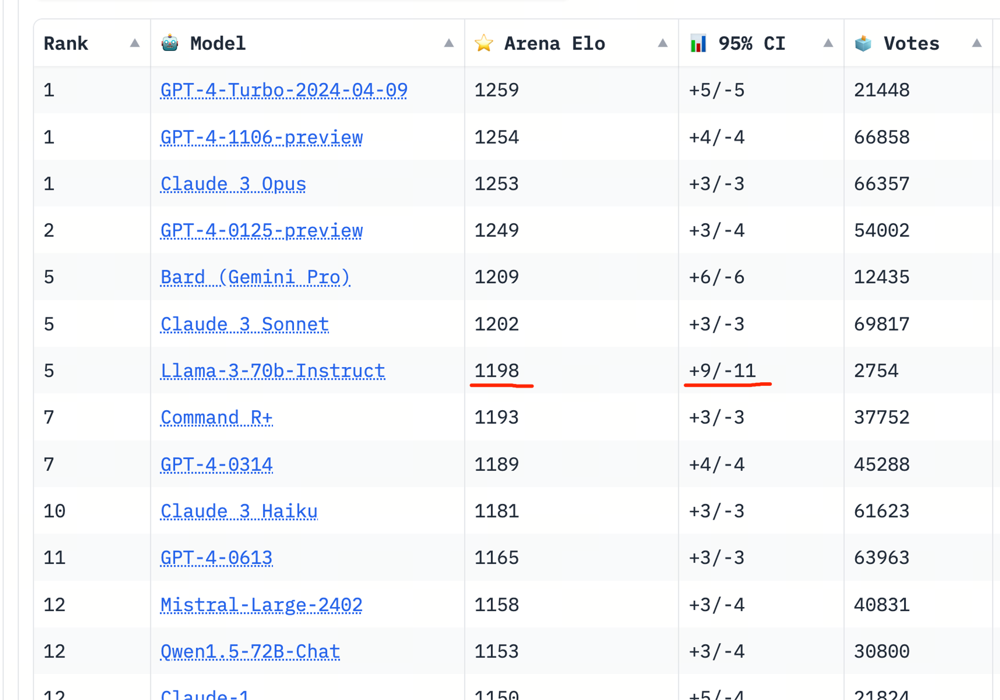
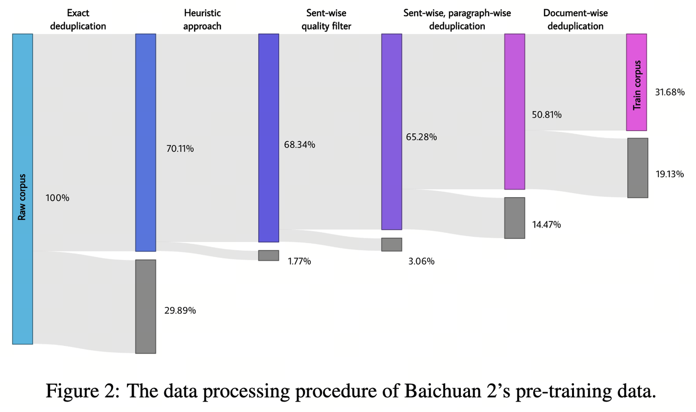
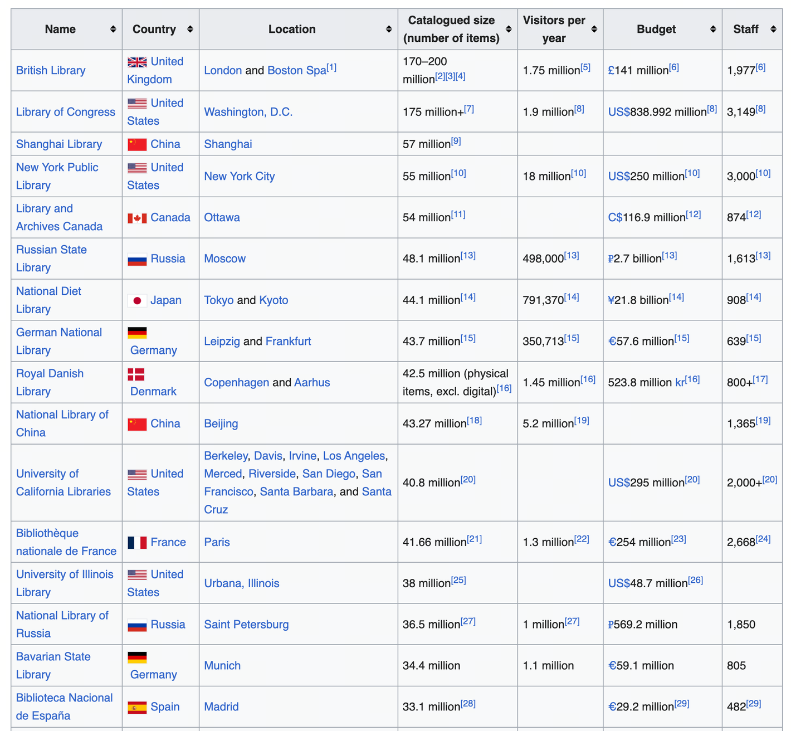
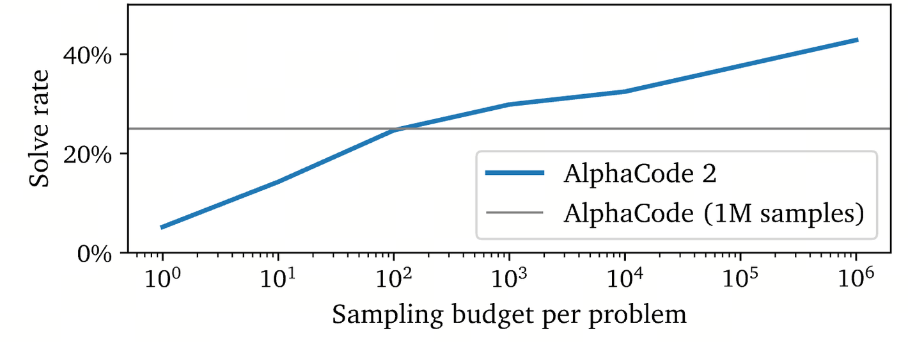
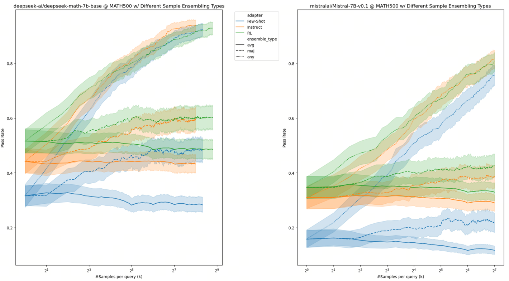
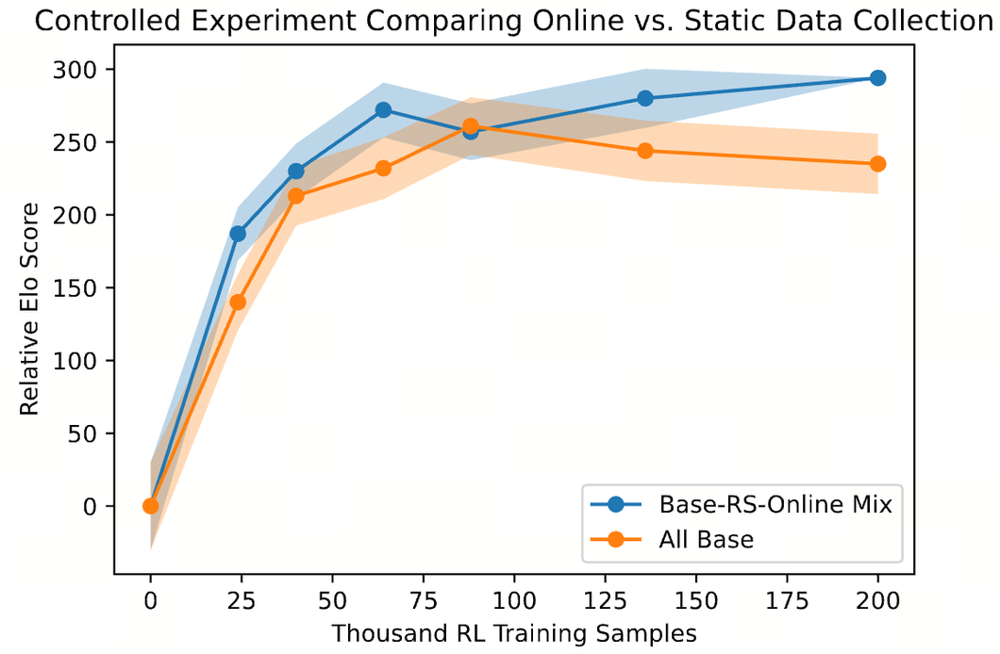
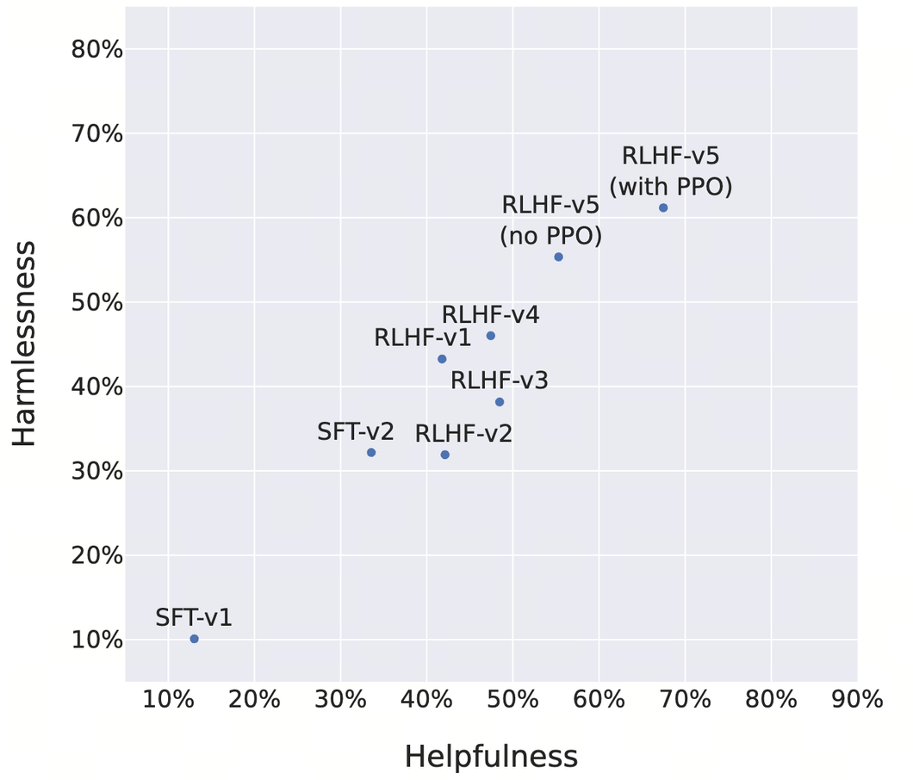
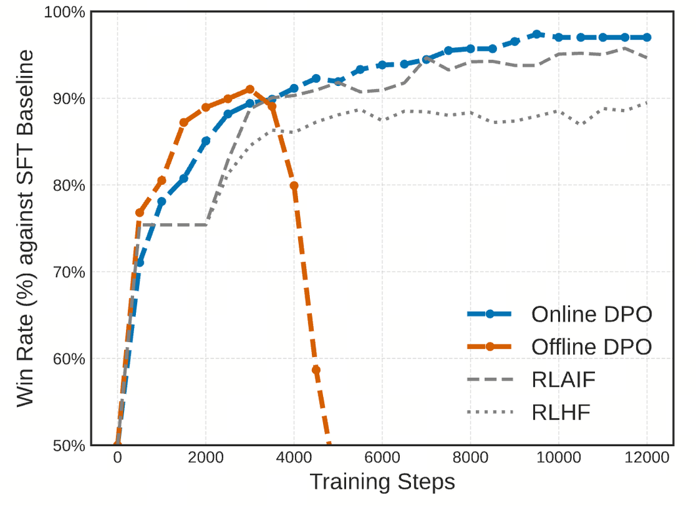

Released on Apr 22 2024  

2024 年 4 月 22 日发布

The scaling of text data is likely reaching a ceiling as most of the easy web text (Common Crawl, Github, Arxiv .etc) are now used up.  

由于大多数简易网络文本（Common Crawl、Github、Arxiv ......等）已被使用殆尽，文本数据的扩展可能已达到上限。

There will surely be new text data like digging harder from the internet, scanning library books and synthetic data.  

肯定会有新的文本数据，如从互联网上挖掘、扫描图书馆书籍和合成数据。  

Yet it is quite challenging to increase another order of magnitude — more likely, they are just incremental within the current order.  

然而，要再提高一个数量级是相当具有挑战性的--更有可能的是，它们只是在当前数量级内的递增。

The next chapter of the game starts from multimodal, particularly unified video-language generative model, because only video data gives orders of magnitude increase.  

游戏的下一章将从多模态，特别是统一的视频语言生成模型开始，因为只有视频数据才能带来数量级的提升。

However, the bad news is, it seems that video data can not increase the reasoning capability of the model — recall that reasoning is the number one key capability that marks strong models.  

然而，坏消息是，视频数据似乎无法提高模型的推理能力--记得推理能力是标志强大模型的首要关键能力。

But the good news is, video data increase everything else, particularly grounding to real-world, and exhibit strong potential to become neural world models (instead of hard-coded physical engines like Zelda), which leads to the possibility of learning from simulated physical feedback.  

但好消息是，视频数据增加了其他一切，特别是与现实世界的接地性，并表现出成为神经世界模型（而不是像塞尔达那样的硬编码物理引擎）的强大潜力，这导致了从模拟物理反馈中学习的可能性。

Scaling up reinforcement learning from X feedback seems to be the most promising direction to continue increase model’s reasoning capability, where X means human, AI, and environment feedback.  

从 X 反馈中扩大强化学习似乎是继续提高模型推理能力的最有希望的方向，这里的 X 指的是人类、人工智能和环境反馈。

Just like how AlphaGo Zero achieves super-human performance on Go, self-play and interacting with the environment could be a direction for super-human generative models. Making the model online and iteratively learn from the feedback (instead of a single-sound offline optimization) could potentially lead to continuously increased reasoning capability.  

就像 AlphaGo Zero 在围棋上取得超人表现一样，自我对弈和与环境互动可能是超人生成模型的一个方向。让模型在线并从反馈中迭代学习（而不是单一的离线优化），有可能不断提高推理能力。

The first chapter of the game of scale focus on scaling text data, which peaks at GPT-4 and concluded by Llama 3. The second chapter of this game would be unified video-language generative modeling and iterative reinforcement learning from X feedback.  

规模游戏的第一章侧重于文本数据的规模化，在 GPT-4 中达到顶峰，在 Llama 3 中结束。游戏的第二章将是统一的视频语言生成建模和来自 X 反馈的迭代强化学习。

Disclaimer: This article is essentially a quick personal research note about future work after reading through the release note of Llama 3. The opinion presented could be different than existing beliefs.  

免责声明：本文主要是在通读《Llama 3》发布说明后，对未来工作的个人快速研究笔记。文中观点可能与现有观点不同。  

I welcome any criticisms and contradictory opinions.  

我欢迎任何批评和相左的意见。  

You can either directly comment on this document, [message me on X](https://twitter.com/Francis_YAO_), or send me an email for detailed discussions.  

您可以直接对本文档发表评论，也可以在 X 上给我留言，或给我发电子邮件进行详细讨论。

For the base model, we check MMLU, MATH, GPQA, and BBH as key metrics because they measures advanced knowledge and reasoning, and the leaderboard looks like this.  

对于基础模型，我们将 MMLU、MATH、GPQA 和 BBH 作为关键指标，因为它们衡量的是高级知识和推理能力。

One thing exceptional about LLaMA 3 70B is that its performance is much better than its peer 70B-level models whose (MMLU is typically about 70+) and enters the frontier model regime (of 80+ MMLU).  

LLaMA 3 70B 的一个特别之处在于，其性能远远优于同类 70B 级模型（MMLU 通常约为 70+），并进入了前沿模型体系（MMLU 为 80+）。

There could be two reasons for LLaMA 3 70B achieving so good MMLU:  

LLaMA 3 70B 取得如此优异的MLU 成绩可能有两个原因：

Yet when the score becomes 80+, it would be quite difficult, though not impossible, to decorate MMLU — the dataset itself is a hard one.  

然而，当分数达到 80 分以上时，要对MLU 进行装饰就相当困难了，尽管并非不可能--数据集本身就是一个难题。

The chat version also looks not bad from [chatbot arena](https://chat.lmsys.org/?leaderboard)  

从聊天机器人竞技场来看，聊天版本也不错

But note that there was a clear score boosting pattern after the initial release of LLaMA 3 — it is not hard to tell which answer is provided by LLaMA 3 based on the textual patterns — resulting in about rank 3 initially, but now the ELO gradually goes down.  

但要注意的是，在 LLaMA 3 发布之初，有一个明显的提分模式--根据文本模式不难判断出哪个答案是由 LLaMA 3 提供的--导致最初的排名约为第 3 位，但现在 ELO 逐渐下降。  

Yet you can see the confidence interval (+9/-11) is much larger than other models (+5/-5) so its rank may continue goes down.  

然而，你可以看到置信区间（+9/-11）比其他模型（+5/-5）要大得多，因此它的排名可能会继续下降。

Llama 3’s initial leaderboard climbing with few votes and high variance  

喇嘛 3》的初始排行榜不断攀升，票数少而差异大

Honestly it is completely unnecessary to do performance decoration and score boosting — it is already a pretty good model — doing so may increase its reputation among the general public (or may not), but definitely will harm the reputation among the professionals.  

老实说，完全没有必要做性能装饰和分数提升--它已经是一个相当不错的模型了--这样做可能会提高它在公众中的声誉（也可能不会），但肯定会损害它在专业人士中的声誉。  

And again, it is already the best publicly accessible model.  

再说一遍，它已经是最好的公开模式。

My bet is that eventually it may converge to about GPT-4 0314 of ELO 1180 — about Claude 3 Haiku performance (again, pretty good).  

我敢打赌，最终可能会收敛到大约 ELO 1180 的 GPT-4 0314 - 大约Claude 3 Haiku 性能（同样，相当不错）。

is probability already here.  

概率已经存在。  

As we observe that GPT-4 Turbo / Gemini Ultra / Claude 3 Opus / Llama 3 400B are all about the same range (MMLU around 85).  

我们注意到，GPT-4 Turbo / Gemini Ultra /Claude 3 Opus / Llama 3 400B 的范围都差不多（MMLU 约 85）。  

To continue scale up text we need more data, the problem is whether it is possible to substantially increase the amount of text data beyond Llama 3’s 15T tokens.  

要继续扩展文本，我们需要更多的数据，问题是能否在 Llama 3 的 15T 标记之外大幅增加文本数据量。

There are the following directions, ranked by the potential scale of new data:  

按照新数据的潜在规模排序，有以下几个方向：

Relaxing the filtering and deduplication threshold.  

放宽过滤和重复数据删除阈值。

Scanning more books from libraries  

从图书馆扫描更多书籍

We discuss them one by one.  

我们逐一讨论。

CC is only part of the internet  

CC 只是互联网的一部分

This factor is the largest undetermined factor about text scaling. We do not know how large the actual internet is.  

这个因素是文本缩放方面最大的未确定因素。我们不知道互联网的实际规模有多大。

For companies like Microsoft / Google and Meta who can readily dump a much larger portion of the internet beyond CC, they can still dig more data.  

对于微软、谷歌和 Meta 这样的公司来说，他们可以随时将互联网上更多的数据转储到 CC 以外的地方，他们还可以挖掘更多的数据。

But the problem is, after deduplication and quality filtering, how much tokens could remain.  

但问题是，经过重复数据删除和质量过滤后，还能剩下多少令牌。

We are still digging from CC  

我们仍在挖掘 CC

The problem with this approach is, the final number of tokens we can produce of existing CC is upper bounded by the data processing pipeline, and may not change in terms of orders of magnitude  

这种方法的问题在于，我们最终能生成的现有 CC 标记数量受数据处理流水线的上限限制，可能在数量级上没有变化

New CC dumps increases linearly with time, still no change in orders of magnitude.  

新的 CC 数据库随着时间的推移呈线性增长，在数量级上仍然没有变化。

Yet scaling law says exponentially increasing data result in linearly increased performance.  

然而，缩放定律表明，指数级增长的数据会带来线性增长的性能。  

So eventually we may result in another 5T new tokens on top of the 15T Llama 3 data, yet what we truly want is another 50T tokens.  

因此，最终我们可能会在 15T Llama 3 数据的基础上再产生 5T 新代币，但我们真正想要的是另外 50T 代币。

Releasing the filtering and deduplication threshold  

释放过滤和重复数据删除阈值

Raw data is large, we are not using all of them because of data quality and duplication. [Baichuan tech report](https://arxiv.org/abs/2309.10305) has a nice figure on the filtering influence the amount of final tokens:  

原始数据很大，由于数据质量和重复问题，我们没有全部使用。百川技术报告中有一个很好的数据，说明了过滤对最终代币数量的影响：

It is a research problem (see [Shayne et. al.](https://arxiv.org/abs/2305.13169), [Muennighoff et. al.](https://arxiv.org/abs/2305.16264) and [Xue et. al.](https://arxiv.org/abs/2305.13230)) to what extend you should keep your quality and deduplication standard.  

应该在多大程度上保持质量和重复数据删除标准，这是一个研究问题（见 Shayne 等人、Muennighoff 等人和 Xue 等人）。  

The general impression is, probably not too loose.  

总的印象是，可能不会太松。

Recently, [Liu et. al.](https://arxiv.org/abs/2404.07503) gives a nice summary of synthetic data, highlighting data sources of reasoning, tool-using, multimodality, multilingual, and alignment data.  

最近，Liu 等人对合成数据进行了很好的总结，强调了推理数据、工具使用数据、多模态数据、多语言数据和对齐数据等数据源。

The key challenge remains: it seems that most existing data work cannot change the order of magnitude, such that they are mostly used for continue-pretraining and finetuning, but not directly on pretraining.  

关键的挑战依然存在：大多数现有的数据工作似乎无法改变数量级，因此它们大多用于继续预训练和微调，而不是直接用于预训练。

The only exception is the [Phi model series](https://www.microsoft.com/en-us/research/blog/phi-2-the-surprising-power-of-small-language-models/) as they use GPT-4 produced data to train a much smaller model. The problem here is whether their approach can scale to larger models and break the GPT-4 upper bound.  

唯一的例外是 Phi 模型系列，因为他们使用 GPT-4 生成的数据来训练一个小得多的模型。这里的问题是，他们的方法能否扩展到更大的模型，并打破 GPT-4 的上限。

Scanning more books from libraries  

从图书馆扫描更多书籍

Clearly these are promising directions because library books are definitely of extremely high quality — much higher than the web — and can clearly improve professional knowledge benchmarks like MMLU.  

显然，这些都是很有前景的方向，因为图书馆书籍的质量绝对极高--比网络要高得多--而且可以明显提高专业知识基准，如《媒介与信息管理大学》（MMLU）。  

Below gives a list of largest libraries in the world  

以下是世界上最大的图书馆名单

The problem is not on the tech side — buying copyrights from these libraries may simply exhaust all the AI investments — and a large portion of them are not for sale.  

问题不在技术方面--从这些图书馆购买版权可能会耗尽所有的人工智能投资--其中很大一部分图书馆是非卖品。  

And again, if on average there is 70K tokens per book, then 200 million books is only about 14T tokens.  

再说一遍，如果平均每本书有 70K 代币，那么 2 亿本书也不过是 14T 代币左右。  

It doubles the existing number, but not much larger.  

它是现有数字的两倍，但不会大很多。

So far we have discussed that it is likely GPT-4 level frontier models is approaching the ceiling of text scaling, and further scale up text data may encounter much harder challenges (but still possible).  

到目前为止，我们已经讨论过，GPT-4 级前沿模型可能已经接近文本扩展的上限，进一步扩展文本数据可能会遇到更艰巨的挑战（但仍有可能）。  

We surely want to continue the carnival because scaling is a law.  

我们当然希望继续举办狂欢节，因为缩放是一项法律。  

Scaling always wins, the problem is what to scale next.  

规模化总是赢家，问题是下一步该怎么做。

Video data may not improve reasoning, but it improves everything else  

视频数据可能无法改善推理能力，但却能改善其他一切

A clear direction is multimodal data, particularly [video data](https://www.qqtube.com/blog/how-much-storage-does-youtube-have).  

一个明确的方向是多模态数据，特别是视频数据。  

Youtube and Tiktok is presumably orders of magnitude larger than text — yes that’s where the new order of magnitude come from.  

Youtube 和 Tiktok 大概比文本大几个数量级--是的，这就是新数量级的由来。  

But there is an immediate challenge: does multimodal data improve text-based reasoning?  

但眼前的挑战是：多模态数据是否能改善基于文本的推理？

The answer is hard and probably not. Then there is a follow-up realistic question: if OpenAI release GPT-5 next month, with its [MMMU](https://mmmu-benchmark.github.io/) score increase from 56 to 70 but MMLU retains to be 86, what kind of message would it send and how would the public react to it?  

答案是很难，可能也不会。那么还有一个现实的后续问题：如果 OpenAI 下个月发布 GPT-5，其 MMMU 分数从 56 分提高到 70 分，但 MMLU 仍保持在 86 分，这会传递出什么样的信息，公众又会作何反应？

Yet the good news is, even if video data do not increase reasoning, it improves everything else, particularly grounding, thus enabling the model to receive feedback from the real-world.  

然而，好消息是，即使视频数据不能提高推理能力，它也能改善其他方面，尤其是接地，从而使模型能够接收来自真实世界的反馈。

To improve reasoning, one need to scale up exploration and exploitation in reinforcement learning  

要提高推理能力，就需要扩大强化学习中的探索和利用范围

Specifically one may need to scale:  

具体来说，可能需要扩大规模：

The horizon of model’s exploration, e.g., deployment the model online for a year and update on a weekly basis, instead of single-step optimization  

模型探索的时间跨度，例如，将模型在线部署一年并每周更新，而不是单步优化

The search space, e.g., let the model generate one million responses and pick the best of them, instead of the original InstructGPT’s best-of-7 approach.  

搜索空间，例如，让模型生成一百万个回应，并从中选出最佳回应，而不是 InstructGPT 最初的七选一方法。

The source of feedback, specially gradually move from human feedback (because human feedback does not scale and the model is becoming stronger than their human annotators) to AI and environment feedback (thus the requirement for world model).  

反馈的来源，特别是从人的反馈（因为人的反馈不能扩展，而模型正变得比人的注释者更强大）逐渐转向人工智能和环境反馈（因此需要世界模型）。

A very unfortunate fact is that many of the existing research work is looking into tiny details of small-scale single-round optimization, e.g., adding one loss term on DPO. Yet the key here is online iterative large scale exploration and exploitation.  

一个非常不幸的事实是，现有的许多研究工作都在研究小规模单轮优化的微小细节，例如在 DPO 上增加一个损耗项。然而，这里的关键是在线迭代大规模探索和利用。

So just scaling up video-language right? Doesn’t sound too hard?  

因此，只需扩大视频语言的规模，对吗？听起来不难吧？

The current situation is, unlike text scaling where we have quite standard architecture (MoE transformer), standard objective (next word prediction), standard pipeline (pretraining then alignment), the design space of vision / multimodal generative models are much larger than language models, and we have not yet converged on even some basic questions, for example:  

目前的情况是，与我们拥有相当标准的架构（MoE 转换器）、标准目标（下一个单词预测）和标准流水线（预训练然后配准）的文本缩放不同，视觉/多模态生成模型的设计空间要比语言模型大得多，而且我们甚至在一些基本问题上都还没有达成一致，例如：

Should we train on separate modalities first, then use adapters to bridge modalities, as is the current practices like [LLaVA](https://llava-vl.github.io/), or should we directly train on the mixture of all modalities?  

我们是应该先进行单独模式的培训，然后使用适配器来连接各种模式（如目前的 LLaVA），还是应该直接进行所有模式的混合培训？

Should we use a unified transformer backbone, or some CV stuff, like UNet and CNNs, for the image / video part?  

在图像/视频部分，我们应该使用统一的转换器骨干网，还是使用一些 CV 工具（如 UNet 和 CNN）？  

What type of modifications we should make on the transformer architecture (e.g., 3D positional encoding)?  

我们应该对转换器架构进行哪种类型的修改（如三维位置编码）？  

How to make the best of mixture of expert layers?  

如何使专家层的混合达到最佳效果？

Adding new modalities should at least not harm existing modalities, yet it is common observation that adding vision may negatively influence language.  

增加新的模式至少不应该损害现有的模式，但普遍的看法是，增加视觉可能会对语言产生负面影响。  

How to reconcile the contradiction between different modalities?  

如何协调不同模式之间的矛盾？

For the video understanding part, how to do tokenization/ representation learning?  

对于视频理解部分，如何进行标记化/表征学习？  

Should one consider VQ-VAE styled discrete tokens or Sora-styled continuous space-time patches?  

应该考虑 VQ-VAE 风格的离散标记，还是 Sora 风格的连续时空补丁？  

Should one use contrastive-styled objective like CLIP or reconstruction-styled objective like the original VAE?  

是使用像 CLIP 这样的对比式客观题，还是使用像最初的 VAE 这样的重构式客观题？

For the video generation part, should it be like autoregressive like VideoPoet or diffusion-based like Sora?  

对于视频生成部分，是采用 VideoPoet 这样的自回归方式，还是采用 Sora 这样的扩散方式？  

How to train a transformer model that can simultaneously perform diffusion-styled generation and autoregressive generation?  

如何训练一个能同时进行扩散型发电和自回归发电的变压器模型？

The final solution may be quite simple and only modifies small parts of existing solutions, but to identify these small yet crucial modifications, the community need saturation attack on these problems.  

最终的解决方案可能非常简单，只是对现有解决方案的一小部分进行修改，但要确定这些微小而关键的修改，社区需要对这些问题进行饱和攻击。

Having discussed there might be limited new data for pretraining and multimodal may not improve reasoning, to further improve the reasoning capability (which is after all the core capability of language models), we turn our focus on scaling reinforcement learning.  

在讨论了用于预训练的新数据可能有限以及多模态可能无法提高推理能力之后，为了进一步提高推理能力（这毕竟是语言模型的核心能力），我们将重点转向扩展强化学习。

The problem is, again, what to scale; the good news is, basically any dimension in RL can and should be scaled.  

问题还是在于缩放什么；好消息是，基本上 RL 中的任何维度都可以缩放，也应该缩放。  

We first discuss a particular metric: pass@K, which means given K trials, if the model can succeed at least once.  

我们首先讨论一个特殊指标：pass@K，即在 K 次试验中，模型是否至少能成功一次。  

DPO is basically optimizing pass at 2 (choice a good one, reject a bad one), and the InstructGPT bass is pass at 7 (choose the best one out of 7 candidates).  

DPO 基本上是优化 2 的通过率（选择一个好的，拒绝一个坏的），而 InstructGPT 低音则是 7 的通过率（从 7 个候选者中选择一个最好的）。

What if we scale K and, instead of considering pass at 7, we consider pass at 1million?  

如果我们将 K 比例扩大，不再考虑 7 的及格，而是考虑 100 万的及格呢？

From the [AlphaCode](https://storage.googleapis.com/deepmind-media/AlphaCode2/AlphaCode2_Tech_Report.pdf) paper, we see how model pass rate continuously improve when scaling K:  

从 AlphaCode 的论文中，我们可以看到模型通过率是如何随着 K 的缩放而不断提高的：

[Yuxuan Tong](https://yaofu.notion.site/5c44436a2cd643b381e74427e7f7b14f?pvs=25) verified on MATH, how DeepSeek and Mistral continuously improve when scaling the search space K:  

童雨萱在 MATH 上验证了 DeepSeek 和 Mistral 如何在扩展搜索空间 K 时持续改进：

Clearly the curve have not yet saturated.  

显然，曲线尚未饱和。

One immediate question is, how do we pick the best one out of 1 million candidates?  

一个迫在眉睫的问题是，我们如何从 100 万候选人中挑选出最佳人选？  

We take a look at GPT-4’s approach by tracking its MATH performance improvements over Mar 2023 to Apr 2024:  

我们通过跟踪 2023 年 3 月至 2024 年 4 月期间 GPT-4 的 MATH 性能改进情况，来了解 GPT-4 的方法：

These improvements show:  

这些改进体现在

Use code-based feedback to verify the answer  

使用基于代码的反馈来验证答案

Use process-based reward model to verify the answer  

使用基于流程的奖励模型来验证答案

Use expert-level annotation to produce the feedback  

使用专家级注释生成反馈

Also important to note that these improvements are not from one-shot optimization, but iteratively through multiple rounds of optimizations, which Anthropic referred as [online iterative RLHF](https://arxiv.org/abs/2204.05862):  

还需要注意的是，这些改进并非来自一次优化，而是通过多轮迭代优化实现的，Anthropic 将其称为在线迭代 RLHF：

Claude-1’s online iterative RLHF  

Claude-1的在线迭代 RLHF

The effectiveness of iterative improvements is also verified by the practice of [Llama 2](https://arxiv.org/abs/2307.09288):  

Llama 2 的实践也验证了迭代改进的有效性：

Llama2’s iterative improvements over multiple versions  

Llama2 经过多个版本的反复改进

Actually, the fact that human have approaching the limit of text data should be the problem already realized by OpenAI by mid 2022, when they have finished the training of the initial version of GPT-4. Now is Apr 2024, with the release of Llama 3, it is time to summarize the first chapter of the game of scaling, where most of the frontier models are about GPT-4 parity.  

事实上，人类已经接近文本数据的极限，这应该是 OpenAI 在 2022 年年中已经意识到的问题，当时他们已经完成了 GPT-4 初始版本的训练。现在是 2024 年 4 月，随着 Llama 3 的发布，是时候总结缩放游戏的第一章了，在这一章中，大多数前沿模型都与 GPT-4 相当。

In 2023, the race of multimodal generative model already began with the image capability.  

2023 年，多模态生成模型的竞赛已经从图像能力开始。  

Currently, only [Gemini](https://gemini.google.com/app) and [Reka](https://showcase.reka.ai/) are capable of understanding video (but cannot generate video), and Sora seems to be the only model that is capable of generating minute-length video (but video only).  

目前，只有 Gemini 和 Reka 能够理解视频（但不能生成视频），而 Sora 似乎是唯一能够生成分钟长度视频（但只能生成视频）的机型。  

Currently, only GPT-4 Turbo, AlphaCode, and DeepSeek Math have explored how to scale up the search space and the feedback signal, and only GPT-4 / Claude have reported extensive results on online iterative RLHF.  

目前，只有 GPT-4 Turbo、AlphaCode 和 DeepSeek Math 探索了如何扩大搜索空间和反馈信号，也只有 GPT-4 /Claude 报告了在线迭代 RLHF 的大量结果。

The second chapter of the game of scaling, begins now.  

缩放游戏的第二章，现在开始。
