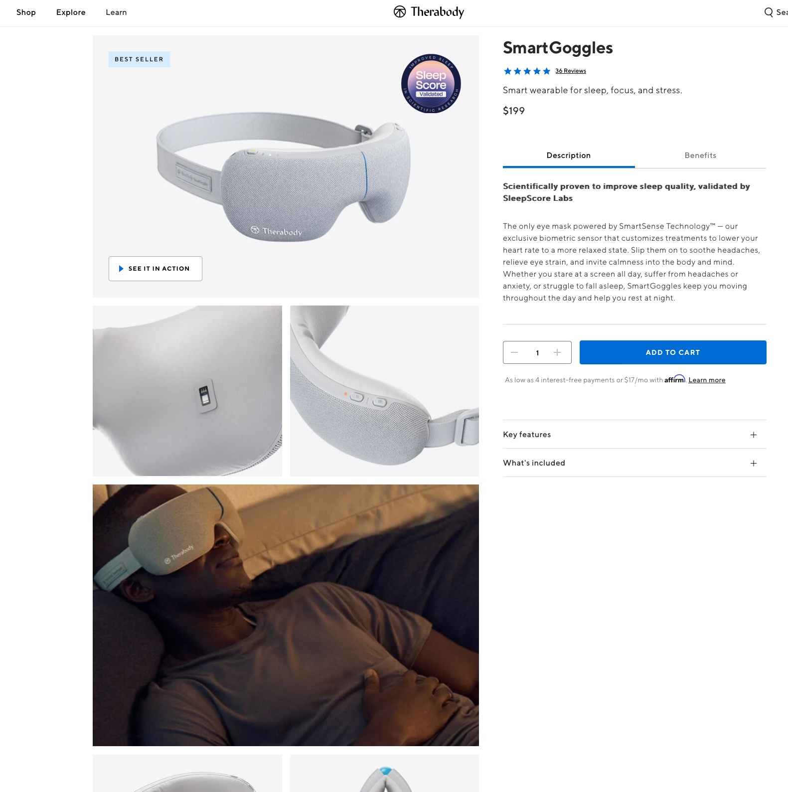
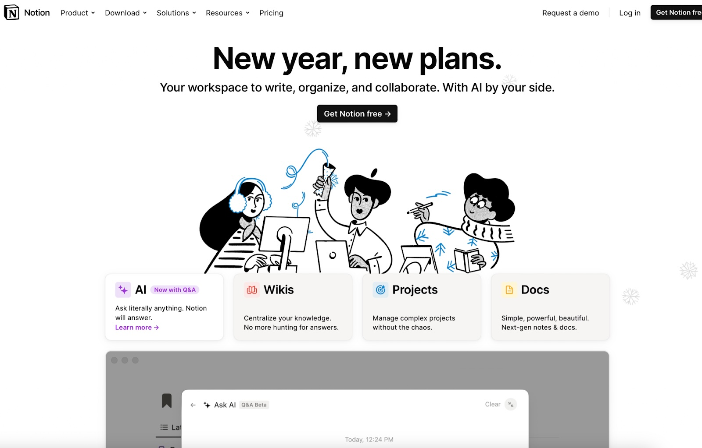
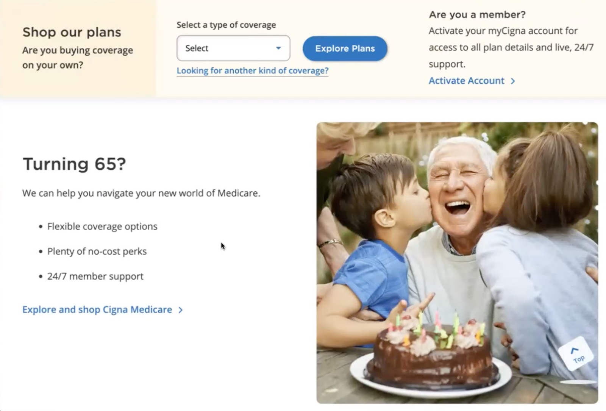
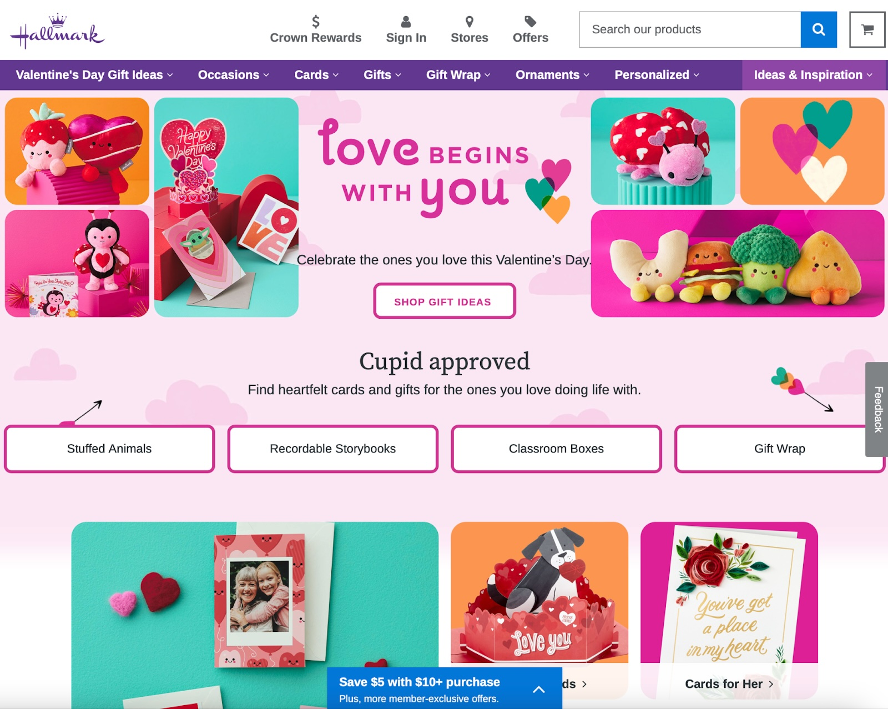
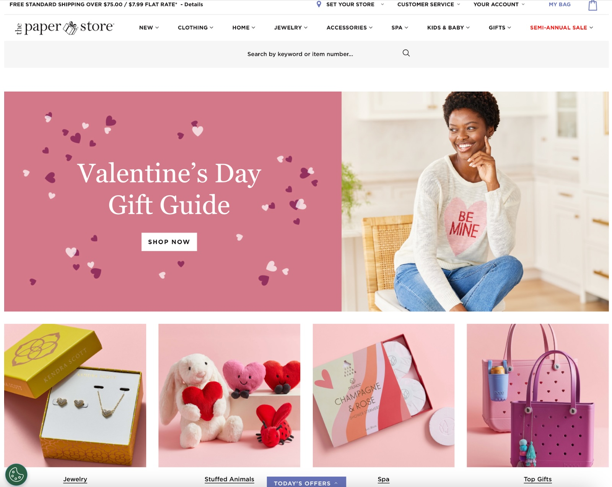
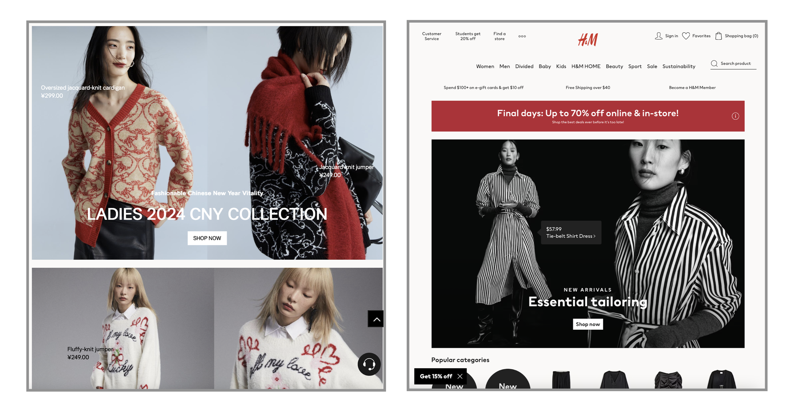

Summary:  A few relevant, high-quality visuals placed next to associated text can boost users’ comprehension of your content and its memorability.  

摘要：将几个相关的高质量视觉元素放置在相关文本旁边，可以提高用户对内容的理解和记忆效果。

When implemented strategically, visuals can enhance users’ ability to understand and remember products.  

在战略实施时，视觉元素可以增强用户理解和记忆产品的能力。  

Here are seven best practices for memorable visuals.  

这里有七个关于令人难忘的视觉元素的最佳实践。

-   [#1 Choose or Create Relevant Visuals  
    
    #1 选择或创建相关的视觉](https://www.nngroup.com/articles/7-tips-memorable-imagery/#toc-1-choose-or-create-relevant-visuals-1)
-   [#2: Avoid Stock Photos  
    
    #2：避免使用库存照片](https://www.nngroup.com/articles/7-tips-memorable-imagery/#toc-2-avoid-stock-photos-2)
-   [#3: Display Products in a Realistic Context  
    
    #3：在真实环境中展示产品](https://www.nngroup.com/articles/7-tips-memorable-imagery/#toc-3-display-products-in-a-realistic-context-3)
-   [#4: Place Visuals Close to Relevant Text  
    
    #4：将视觉元素放置在相关文本附近](https://www.nngroup.com/articles/7-tips-memorable-imagery/#toc-4-place-visuals-close-to-relevant-text-4)
-   [#5: Avoid Too Much Imagery  
    
    #5：避免过多的图像](https://www.nngroup.com/articles/7-tips-memorable-imagery/#toc-5-avoid-too-much-imagery-5)
-   [#6 Choose High-Resolution Photographs  
    
    #6 选择高分辨率的照片](https://www.nngroup.com/articles/7-tips-memorable-imagery/#toc-6-choose-high-resolution-photographs-6)
-   [#7 Consider How Visuals Could Be Interpreted Across Cultures  
    
    #7 考虑视觉在不同文化中的解读方式](https://www.nngroup.com/articles/7-tips-memorable-imagery/#toc-7-consider-how-visuals-could-be-interpreted-across-cultures-7)
-   [Test Your Visuals   
    
    测试您的视觉](https://www.nngroup.com/articles/7-tips-memorable-imagery/#toc-test-your-visuals-8)
-   [Conclusion  
    
    结论](https://www.nngroup.com/articles/7-tips-memorable-imagery/#toc-conclusion-9)

## #1 Choose or Create Relevant Visuals  

#1 选择或创建相关的视觉

Visuals exist alongside other content, and users leverage this content to interpret them. Our [eyetracking research](https://www.nngroup.com/articles/zigzag-page-layout/) shows that users focus more on images that strengthen text content. Designers should choose **imagery that promotes the key message** that users should take away.  

视觉内容与其他内容并存，用户利用这些内容来解读它们。我们的眼动研究显示，用户更关注能够加强文本内容的图像。设计师应选择能够传达用户应该记住的关键信息的图像。  

They should think of images and text as two different channels that they can use to convey their message and strengthen it.  

他们应该将图像和文本视为可以用来传达并加强信息的两个不同渠道。

Irrelevant visuals are a missed opportunity and they may decrease the memorability of your message.  

无关的视觉是一个被忽视的机会，它们可能降低您信息的记忆度。

For example, the image on JacksonHewitt.com shows a family dressed in winter clothing enjoying sparklers.  

例如，JacksonHewitt.com 上的图片展示了一家穿着冬季服装享受烟花的家庭。  

This image is not relevant to the tax-service text content and, as a result, fails to strengthen the content and the memorability of the service.  

这幅图片与税务服务的文本内容无关，因此未能加强内容和服务的记忆度。

_❌ This Jackson Hewitt page about tax services includes an irrelevant photo of a happy family lighting sparklers.  

❌ 这个关于税务服务的 Jackson Hewitt 页面包含了一张与内容无关的照片，展示了一个快乐的家庭在点燃烟花。  

The image has poor relevancy to the content and the service provided is unlikely to be easily comprehended and remembered.  

图像与内容的相关性较差，提供的服务可能不容易理解和记忆。_

_✅ This TurboTax page features an image of a call with a certified tax accountant and a tax- refund notification.  

✅ 这个 TurboTax 页面展示了与认证税务会计师通话以及税款退还通知相关的图片。  

The connection between the image and the content is strong and therefore, the message and image reinforce each other.  

图像与内容之间的联系紧密，因此，信息和图像相互强化。  

The content is easy to comprehend and memorable.  

内容易于理解且易记。_

## #2: Avoid Stock Photos  

#2: 避免使用库存照片

Stock photos are often generic and not specific to your content.  

库存照片通常是通用的，与您的内容不相关。  

Other sites, products, or competitors may use the same image.  

其他网站、产品或竞争对手可能使用相同的图片。  

Not only are users likely to overlook photos they have seen previously, but they are also less likely to remember them.  

用户不仅可能会忽略他们之前看过的照片，而且也不太可能记住它们。

For example, the Lenovo Support Services product categories were represented by stock images that were not specific to Lenovo or to the navigational categories.  

例如，联想支持服务产品类别由与联想或导航类别不相关的库存图片代表。  

These images were not memorable.  

这些图片不容易记忆。

_❌ This Lenovo page featured stock images that did not help convey the capabilities of each support tier.  

❌ 联想此页面使用的库存图片未能有效传达每个支持层的功能。_

Businesses that sell physical products can easily avoid stock photos by featuring their product in their photography.  

销售实体产品的企业可以通过在摄影作品中展示其产品来轻松避免使用库存照片。  

Meanwhile, SaaS businesses can avoid stock photos by featuring clear screenshots of their software — which is what customers often want to see!  

与此同时，SaaS 企业可以通过展示其软件的清晰截图来避免使用库存照片 — 这正是客户经常希望看到的！

_✅ Notion’s product features were represented by unique screenshots of the Notion interface; these images made the different capabilities more concrete and increased each feature’s memorability.  

✅ Notion 的产品功能通过独特的 Notion 界面截图来展示；这些图片使不同功能更具体化，增强了每个功能的记忆性。_

## #3: Display Products in a Realistic Context  

#3: 在真实环境中展示产品

To boost the memorability of your product and [product visuals](https://www.nngroup.com/articles/visual-design-in-ux-study-guide/), show the product in the context in which it would realistically be used.  

为了增强产品及产品视觉的记忆性，展示产品时应呈现其真实使用环境。  

These types of visuals will support users’ comprehension of the product and help them to remember it.  

这类视觉元素将支持用户理解产品，并帮助他们记住产品。

Consider including the following in your product imagery:  

考虑在产品形象中包含以下内容：

-   **The environment**: Show where and when the product is used (i.e., location, time of day, socially or alone).  
    
    环境：展示产品的使用地点和时间（例如，地点、一天中的时间、社交或独处）。  
    
    These elements can help communicate the **product’s purpose**.  
    
    这些元素有助于传达产品的目的。
-   **The target audience**: Show **who will benefit** from using this product.  
    
    目标受众：展示谁将从使用该产品中受益。

_✅ Therabody’s product page for SmartGoggles showed a photograph of the product used by a user at home while they sleep.  

✅ Therabody 的 SmartGoggles 产品页面展示了一张用户在家中使用产品的照片，用户正在睡觉。_

_❌ While Notion’s illustration may have been meant to show that its product can be used in various settings, the visual lacked realism and required too much work to grasp the message.  

❌ 虽然 Notion 的插图可能旨在展示其产品可在各种环境中使用，但视觉缺乏现实感，需要太多工作才能理解信息。_

## #4: Place Visuals Close to Relevant Text  

#4: 将视觉内容放置在相关文本附近

In addition to choosing relevant imagery, designers should strategically place images [near](https://www.nngroup.com/articles/gestalt-proximity/) related text content to facilitate comprehension and memorability. Additionally, if your site is [responsive](https://www.nngroup.com/articles/responsive-web-design-definition/), ensure that the **proximity of text and associated visuals is preserved across all screen sizes.**   

除了选择相关的图像外，设计师还应该战略性地将图像放置在相关文本内容附近，以促进理解和记忆。此外，如果您的网站是响应式的，请确保文本和相关视觉内容的接近性在所有屏幕尺寸上都得到保留。

On Cigna’s website, an image of a senior with a birthday cake accompanied the text Turning 65? The image placement supported comprehension of the content.  

在 Cigna 的网站上，一张带有生日蛋糕的老年人的图片伴随着“65 岁了吗？”的文本。图像的放置支持了内容的理解。

_✅ The Cigna.com homepage featured an image of a senior with a birthday cake close to the relevant text_ Turning 65? _The image supported the comprehension and memorability of the content._  

✅ Cigna.com 的首页展示了一张带有生日蛋糕的老年人的图片，与相关文本“65 岁了吗？”紧密相连。图像支持了内容的理解和记忆。

However, on Cigna.com’s mobile design, the visual was far away from the text _Turning 65?_ As a result, usability-test participants incorrectly assumed the image went with the dental-care content and were confused.  

然而，在 Cigna.com 的移动设计中，视觉与文本“满 65 岁了？”相距甚远。结果，可用性测试参与者错误地认为图像与牙齿护理内容相关，并感到困惑。

_❌ On mobile, the image was separated from the_ Turning 65? _section. The text and the image were not in the same viewport.  

❌ 在移动设备上，图像与“满 65 岁了？”部分分开显示。文本和图像不在同一视窗内。  

Test participants incorrectly assumed that the image went with the  

测试参与者错误地认为图像与_Dental Care, Covered _section._  

牙齿护理，保障部分相关。

## #5: Avoid Too Much Imagery  

#5: 避免过多图像

Too many visuals can be distracting and cause each of them to be less impactful.  

过多的视觉元素会分散注意力，使它们各自的影响力降低。  

Instead, choose a few solid visuals that communicate the key takeaways on each page.  

相反，选择一些能传达每页关键信息的实质性视觉元素。

Hallmark’s homepage features ten similar visuals above the fold.  

Hallmark 的主页在折叠线以上展示了十个类似的视觉元素。  

The number of images weakens the page’s visual hierarchy.  

图像数量削弱了页面的视觉层次结构。  

The eye is overwhelmed and unsure of where to focus. In this case, less is more.  

眼睛感到不知所措，不确定要关注哪里。在这种情况下，少即是多。

_❌ Hallmark.com: The ten similar visuals above the page fold were overwhelming.  

❌ Hallmark.com: 页面折叠上方的十个类似视觉效果令人不知所措。_

The Paper Store struck the proper balance with five distinct visuals representing unique product categories.  

The Paper Store 通过五个不同的视觉效果，代表独特的产品类别，找到了适当的平衡。  

The page had a clear visual hierarchy.  

该页面具有清晰的视觉层次结构。

_✅ PaperStore.com:  Each of the five distinct visuals communicated a clear message and the ensemble was not overwhelming.  

✅ PaperStore.com: 五个独特的视觉效果传达了清晰的信息，整体效果没有令人不知所措。_

## #6 Choose High-Resolution Photographs  

#6 选择高分辨率的照片

Low-resolution images appear blurry and can lack important details; as a result, they are often harder to comprehend and remember.    

低分辨率的图像看起来模糊，可能缺乏重要细节；因此，它们通常更难理解和记住。

The Hewlett-Packard Laptops page featured a blurry image of office employees.  

惠普笔记本电脑页面展示了一张模糊的办公员工图像。  

The image was too low-resolution to tell whether the laptops featured in the image were HP Laptops or if this was a stock image.  

该图像分辨率太低，无法确定图像中展示的是惠普笔记本电脑还是库存图像。

_❌ This page features a low-resolution image of office employees, and it is too blurry to tell whether the employees pictured are using Hewlett-Packard devices.  

❌ 该页面展示了一张办公员工的低分辨率图像，图像太模糊，无法确定图中员工是否在使用惠普设备。_

## #7 Consider How Visuals Could Be Interpreted Across Cultures  

#7 考虑视觉效果在不同文化中的解读方式

Imagery can “translate” differently from one culture to another.  

在不同文化之间，“意象”可能有不同的“翻译”方式。  

Sometimes, localized visuals resonate better with people and are more successful at achieving the intended effect.  

有时，本地化的视觉更能引起人们共鸣，并更成功地实现预期效果。

For example, during the month of January, the Chinese version of the H&M website featured photographs of clothing suited to celebrating Chinese New Year.  

例如，在一月份期间，H&M 中文网站展示了适合庆祝中国新年的服装照片。  

These visuals were more [culturally relevant](https://www.nngroup.com/articles/crosscultural-design/) among users in China.  

这些视觉在中国用户中更具文化相关性。

_✅ The Chinese version of the H&M website (left) featured visuals related to the Chinese New Year, while the US version (right) did not.  

✅ H&M 中文网站（左）展示了与中国新年相关的视觉，而美国版（右）则没有。  

These visuals were culturally relevant.  

这些视觉具有文化相关性。_

## Test Your Visuals   

测试您的视觉

[Qualitative usability testing](https://www.nngroup.com/articles/qual-usability-testing-study-guide/) is the best method to determine if your visuals are understood. Follow these best practices when [testing your visuals](https://www.nngroup.com/articles/testing-visual-design/):  

定性可用性测试是确定您的视觉是否被理解的最佳方法。在测试视觉时，请遵循以下最佳实践：

-   **Show the visual in the design**: Visuals do not exist in a vacuum. They accompany and complement other content in your design.  
    
    在设计中展示视觉：视觉并非独立存在。它们与设计中的其他内容相伴并相辅相成。  
    
    Where possible, test visuals within the design or accompanied by the surrounding text or [microcopy](https://www.nngroup.com/articles/microcontent-how-to-write-headlines-page-titles-and-subject-lines/).  
    
    在可能的情况下，在设计中测试视觉，或者与周围文本或微型文案一起测试。
-   **Write tasks that encourage users to naturally discover the visual**. Avoid telling users where to go or what to do. Instead, ask them to complete a [realistic task](https://www.nngroup.com/articles/better-usability-tasks/) requiring them to navigate to the page including the visual.  
    
    编写鼓励用户自然发现视觉的任务。避免告诉用户去哪里或做什么。相反，要求他们完成一个现实任务，需要他们导航到包含视觉的页面。  
    
    If users seem to notice the visual and don’t explicitly mention it, you can ask the followup question _What did you learn from this page?_  
    
    如果用户似乎注意到了视觉但没有明确提到它，您可以问后续问题：“您从这个页面学到了什么？”
-   **Watch whether users notice the visual.** In your analysis, pay close attention to whether users noticed the visual, even if they don’t mention it.  
    
    观察用户是否注意到了视觉。在分析中，要密切关注用户是否注意到了视觉，即使他们没有提到它。  
    
    For example, they might pause near the visual or decrease their scrolling pace.  
    
    例如，他们可能会在视觉附近停顿或减慢滚动速度。  
    
    Evaluate whether their impressions or takeaways from the page suggest they gained information from the visual.  
    
    评估他们对页面的印象或收获是否表明他们从视觉中获得了信息。
-   **Be aware of the** [**query effect**](https://www.nngroup.com/articles/interviewing-users/)[.](https://www.nngroup.com/articles/interviewing-users/) Practitioners sometimes mistakenly ask users about visuals outright.  
    
    要注意查询效应。从业者有时会错误地直接询问用户有关视觉的问题。  
    
    Avoid doing this because you risk forcing the user to make up an opinion to answer your question when, in reality, they don’t have one.  
    
    避免这样做，因为这样做会导致用户不得不凭空回答您的问题，而实际上他们并没有自己的观点。  
    
    Instead, ask a nonleading, follow-up question like _What do you think about this product after exploring this page?_ and note whether they naturally mention the visual.  
    
    相反，提出一个非引导性的后续问题，比如“在浏览这个页面后，您对这个产品有什么看法？”并注意他们是否自然提到了视觉。

The following three methods can help you learn about the memorability of your visuals.  

以下三种方法可以帮助您了解视觉的记忆性。  

They are often performed as remote, [unmoderated studies](https://www.nngroup.com/articles/remote-usability-tests/).  

它们通常作为远程、无主持的研究进行。

1.  [**5-second test:**](https://www.nngroup.com/videos/5-second-usability-test/) In this test, you present your visual to the user for 5 seconds (or another short period of time), then hide it.  
    
    5 秒测试：在这个测试中，您向用户展示您的视觉作品 5 秒钟（或其他短时间），然后隐藏它。  
    
    When the visual disappears, you can ask the user to describe what they saw and what they think the visual communicated or contained.  
    
    当视觉消失时，您可以要求用户描述他们看到了什么，以及他们认为这个视觉传达或包含了什么。  
    
    The short time limit will help you understand whether the participant could correctly assign a label to the visual.  
    
    短时间限制将帮助您了解参与者是否能够正确地为视觉分配标签。  
    
    To gather more first impressions, ask _What stuck out to you, if anything?_  
    
    为了收集更多的第一印象，问一下：“你觉得有什么特别吸引你的地方吗？”
2.  [**Open word-choice test**](https://www.nngroup.com/articles/testing-visual-design/)**:** This test is like a 5-second test but without the time limit.  
    
    开放式词汇选择测试：这个测试类似于 5 秒测试，但没有时间限制。  
    
    Participants are presented with a visual and asked to describe it (either verbally or in a written format).  
    
    参与者被呈现一个视觉作品，并被要求描述它（口头或书面形式）。  
    
    The lack of a time limit allows researchers to collect as many associations and labels as possible.  
    
    没有时间限制使研究人员能够收集尽可能多的联想和标签。  
    
    Analyze whether the words and descriptions generated by the participants are consistent and accurate.  
    
    分析参与者生成的词语和描述是否一致和准确。  
    
    Variation in how participants interpreted the visual might suggest that the image is not concrete and familiar enough.  
    
    参与者对视觉作品的解释方式的差异可能表明该图像不够具体和熟悉。
3.  [**A/B testing**](https://www.nngroup.com/videos/ab-testing-101/)**:** If you have a live product and enough traffic on your site, you can compare two live versions of your design, altering only a visual between versions.  
    
    A/B 测试：如果您有一个在线产品并且网站上有足够的流量，您可以比较您设计的两个在线版本，只在版本之间改变视觉方面。  
    
    With this type of test, you’ll know whether one visual significantly impacted the metric you are measuring (typically, conversions).  
    
    通过这种测试类型，您将了解一个视觉是否显著影响您正在衡量的指标（通常是转化）。  
    
    Since this is a [quantitative method](https://www.nngroup.com/articles/quant-vs-qual/), you’ll learn whether one visual works better but not why.  
    
    由于这是一种定量方法，您将了解一个视觉效果更好，但不知道原因。

## Conclusion  

结论

Well-chosen, high-quality imagery can supplement text and strengthen the comprehensibility and memorability of your content.  

精心选择的高质量图像可以补充文本，增强内容的可理解性和记忆性。  

However, in order to function as an effective aid, visuals must be relevant and specific to your particular context, be accompanied by explanatory text, and not overwhelm users.  

然而，为了作为有效的辅助工具，视觉必须与您特定的背景相关且具体，必须附有解释性文本，并且不能使用户感到不知所措。  

Consider testing your images to ensure that they work for you rather than simply wasting screen real estate.  

考虑测试您的图像，以确保它们为您所用，而不仅仅浪费屏幕空间。
