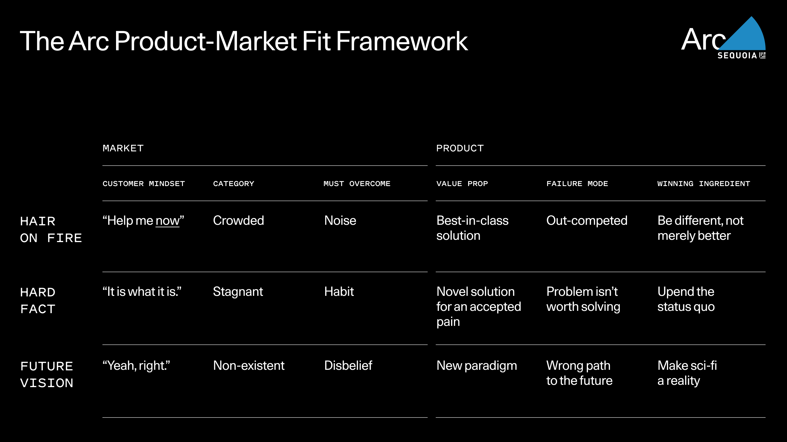
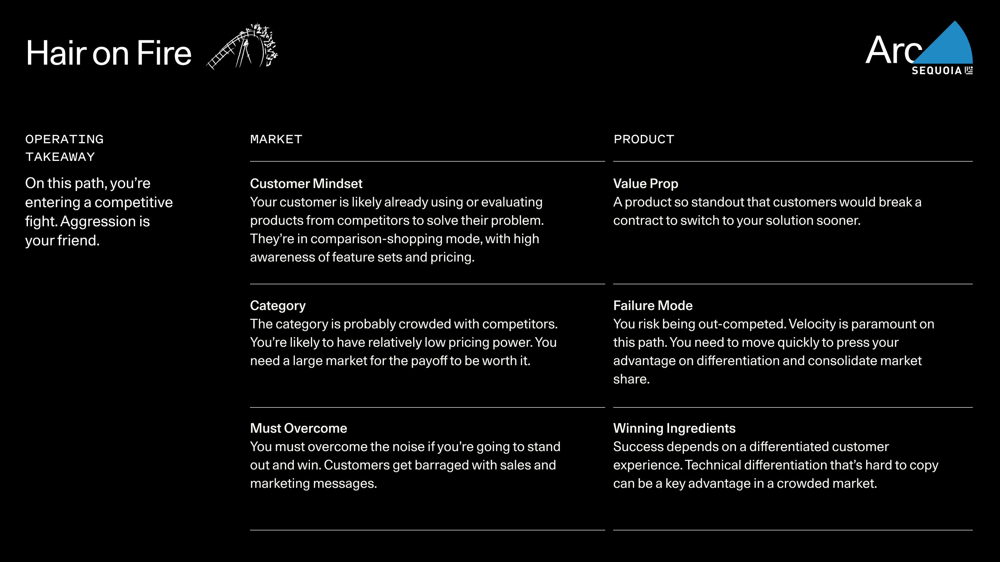
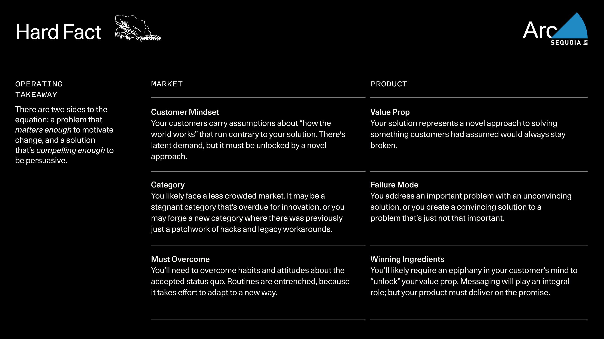
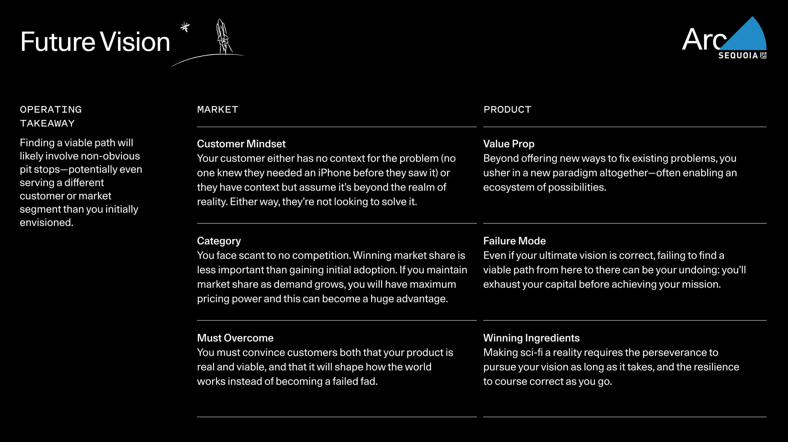
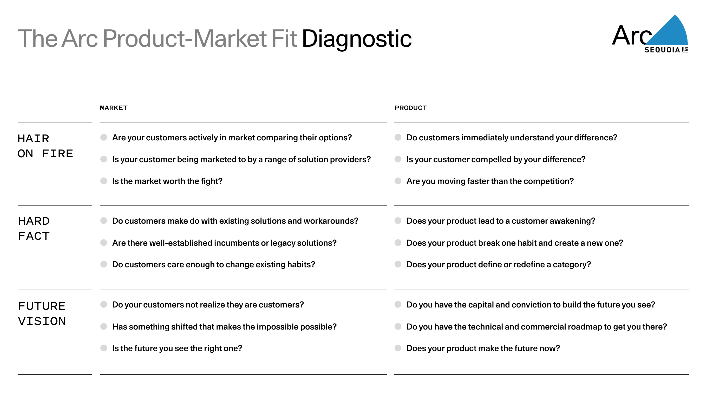
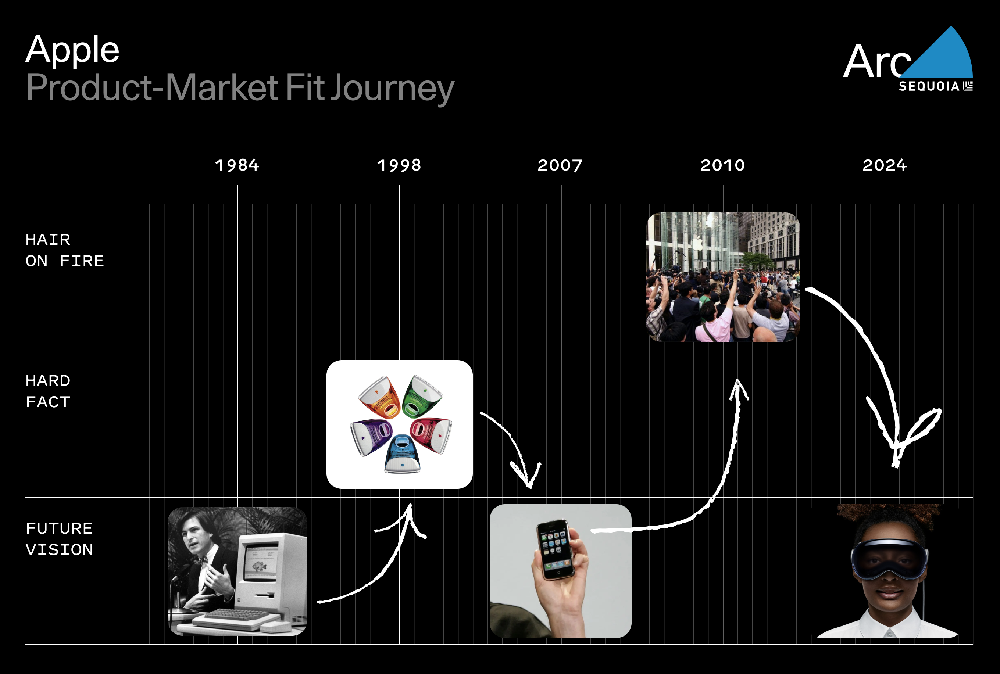

## The Arc Product-Market Fit Framework  

产品-市场契合框架Arc

Finding product-market fit is the central quest of every early-stage startup.  

寻找产品市场契合点是每个初创企业的中心任务。  

As we have seen over years of partnering with companies before they reached PMF, there are many ways of thinking about and approaching this quest. We walk founders through the following framework during [Arc](https://www.sequoiacap.com/arc/), our company-building immersion for pre-seed and seed stage companies.  

与我们多年来与公司合作的经验表明，在公司达到 PMF 之前，有许多思考和探索这一问题的方式。我们在Arc期间为种子轮和种子阶段的公司提供公司构建沉浸式体验，引导创始人走过以下框架。  

Rather than diagnosing whether you have product-market fit, this framework outlines three distinct archetypes of PMF which help you understand your product’s place in the market and determine how your company operates.  

与其诊断您是否具备产品市场契合度，这个框架概述了三种不同的 PMF 原型，帮助您了解产品在市场中的定位，并确定公司的运营方式。

## 3 Archetypes of Product-Market Fit  

产品市场契合的三种原型

Ultimately, product-market fit is about your product’s place in the world.  

最终，产品市场契合是关于你的产品在世界中的定位。  

There are different aspects to how your product fits into the world that you could hone in on—competitive landscape, the technical merits of your product, etc. We think the best way is to start by focusing on how the **_customer_ _relates to the problem_** your product solves.   

有许多方面可以让你的产品融入这个世界，比如竞争格局、产品的技术优点等。我们认为最好的方法是从客户与你的产品解决的问题之间的关系入手。

There are different kinds of problems, and different ways customers relate to them.  

存在各种不同类型的问题，客户与这些问题的关系也各不相同。  

We see three basic archetypes, each with its own distinct customer-product relationship dynamics.  

我们看到三种基本原型，每种都有其独特的客户-产品关系动态。

### **Hair on Fire  

头发着火**

You solve a problem that’s a clear, urgent need for customers. The demand is obvious.  

您解决了客户迫切需要解决的问题。需求是显而易见的。  

Because of this, your category is likely crowded with competitors vying for market share.  

因此，您的类别很可能会有很多竞争对手争相抢占市场份额。  

Your customers are actively wrestling with the problem, and likely comparing existing products to solve it.  

您的客户正在积极应对这一问题，很可能正在比较现有产品以解决它。  

To succeed in such a dynamic, you must rise above the noise.  

要在这样一个充满活力的环境中取得成功，你必须超越喧嚣。  

The only way to do so is by delivering the best-in-class solution.  

唯一的方法是提供最佳解决方案。  

And best-in-class products stand out because they are different, not merely better.  

优秀的产品之所以脱颖而出，是因为它们与众不同，而不仅仅是更好。  

You can’t just be faster or cheaper—you need a truly differentiated customer experience to have a durable advantage.  

你不能只是更快或更便宜，你需要一个真正独特的客户体验才能获得持久的优势。

### **Hard Fact  

严格事实**

You take a pain point universally accepted as a hard fact of life, and see that it’s merely a hard problem _that your product solves_ for the customer. Your customers have resigned themselves to just living with the problem.  

您将一个被普遍接受为生活中不可避免的痛点，视为您的产品可以为客户解决的难题。您的客户已经习惯了与这个问题共存。  

They’re not urgently engaged with trying to solve it.  

他们并没有急着试图解决这个问题。  

The status quo is just how it is, and change doesn’t seem like an option.  

现状就是现状，似乎改变并非选项。  

You upend how things are done with an unexpected approach: Facts can’t be changed—but problems can be solved.  

你以一种出人意料的方式颠覆了事物的常规做法：事实固然无法改变，但问题却可以解决。  

The challenge to overcome is force of habit.  

克服的挑战在于战胜惯性。  

Customers will have to change their current behaviors, and inertia is powerful.  

客户需要改变他们目前的行为习惯，而惯性是非常强大的。  

You need an approach that’s novel enough, for a problem that _matters_ enough, to be worth making a change.  

你需要一种新颖而有效的方法，来解决一个重要的问题，从而值得进行改变。

### **Future Vision  

未来展望**

You enable a new reality through visionary innovation.  

通过具有远见的创新，您可以开启全新的现实。  

It sounds like science fiction to customers, either because the concept is familiar but sounds impossible (like abundant cheap energy from nuclear fusion) or because no one ever imagined it (like the iPhone).  

对客户来说，这听起来像科幻小说，要么是因为概念熟悉但听起来不可能（比如核聚变能源的丰富廉价），要么是因为没有人想象过（比如 iPhone）。  

Customers are not only not trying to solve the problem, they are either oblivious to it or predisposed to think it’s a pipe dream.  

客户不仅没有尝试解决问题，而且他们要么对此视而不见，要么倾向于认为这是一个不切实际的想法。  

Either way, the obstacle is disbelief: Customers must believe that your product represents a whole new paradigm—often with its own ecosystem.  

无论哪种情况，障碍都在于不信任：客户必须相信您的产品代表了一个全新的范式，往往具有自己的生态系统。  

(The iPhone wasn’t just a device; its App Store was a new way of interfacing with the internet.  

iPhone 不仅仅是一部设备；它的 App Store 开创了一种新的与互联网互动的方式。  

Tesla isn’t just a car; it’s a network of cameras and self-driving software that’s a new driving experience.) Customers must find the paradigm and its possibilities irresistible.  

特斯拉不仅仅是一辆汽车；它是一个由摄像头和自动驾驶软件组成的网络，提供全新的驾驶体验。客户必须觉得这种范式及其可能性是无法抗拒的。  

As we’ll discuss below, this path is often long, and finding the right route with the right commercial opportunities along the way is usually critical.  

正如我们将在下文讨论的那样，这条道路通常很漫长，沿途找到合适的商业机会是至关重要的。

## How to Operate in Each Path   

如何在每个路径中进行操作

Once you understand these archetypes, you can self-identify which path your company is on.  

一旦您理解了这些原型，您就可以确定您的公司所处的道路。  

Many founders we encounter in Arc assume they’re _supposed_ to be in the Hair on Fire path. They have absorbed the adage to listen to what customers need.  

许多我们在Arc中遇到的创始人都认为他们应该追求火急火燎的道路。他们已经领会了倾听客户需求的箴言。  

That’s good advice.  

这是个很好的建议。  

But it often comes as a revelation that Hard Fact or Future Vision dynamics are viable options for finding PMF.  

但通常会让人惊讶的是，硬事实或未来愿景动态是寻找 PMF 的可行选择。

Hopefully you’re already working on a problem you have a unique advantage in solving.  

希望您已经在解决一个您具有独特优势的问题上努力工作。  

Your path, however, will be defined by how _your customer_ relates to this problem (and how they feel about your solution).  

但是，您的路径将取决于客户对这个问题的看法（以及他们对您的解决方案的感受）。  

You can find success on any path—but each brings a distinct set of operating priorities that are essential to understand.  

你可以在任何道路上找到成功，但每条道路都有其独特的运营重点，这些重点至关重要，需要深入理解。

### Path 1 – Hair on Fire  

着火的头发路径

The Hair on Fire path requires both a great product and a great go-to-market effort—in quick succession.  

着火的头发路径需要一个优秀的产品和一个出色的市场推广工作 - 快速而连贯。  

This combination of solution, selling and speed is the key to overcoming the competition.   

这种解决方案、销售和速度的结合是战胜竞争的关键。

### Hair on Fire – Case Studies  

着火的头发 - 案例研究

Along with product velocity, one hallmark of companies that break through to find success in the Hair on Fire path is the ability to aggressively out-maneuver the competition.  

与产品速度一起，成功走上“火焰之路”的公司的一个特点是能够积极地超越竞争对手。  

 

Assaf Rappaport and his Wiz co-founders had previously founded Adallom together.  

Assaf Rappaport 和他的 Wiz 联合创始人之前一起创立了 Adallom。  

For their new company, they were intrigued by the problem of cloud infrastructure security—but it was already a crowded space with incumbents like Palo Alto Networks and startups like Orca Security offering products on the market.  

他们的新公司对云基础设施安全问题很感兴趣，但这个领域已经有像 Palo Alto Networks 这样的老牌公司和像 Orca Security 这样的初创公司在市场上提供产品，竞争激烈。  

However, when they interviewed CISOs, the topic kept surfacing at the top of everyone’s wish list. There was evident demand in a large market—but it took some digging to find the opportunity for differentiation.  

然而，当他们采访首席信息安全官时，这个话题一直浮出水面，成为每个人愿望清单的首要内容。在一个庞大的市场中存在明显的需求，但需要一些挖掘才能找到差异化的机会。  

Most cloud security products relied on agents, a piece of software that needs to be installed in every server in order to monitor it.  

大多数云安全产品都依赖代理，这是一种需要安装在每台服务器上才能监视其运行情况的软件。  

Wiz conceived an “agentless” solution that not only reduced friction and headaches, but surfaced vulnerabilities more effectively.  

Wiz 提出了一种“无代理”解决方案，不仅减少了阻力和麻烦，还更有效地暴露了漏洞。  

Even better, once connected it could surface those vulnerabilities in the course of a 15-minute customer demo.  

更好的是，一旦连接，它可以在 15 分钟的客户演示中展示这些漏洞。  

Assaf and his team found their advantage, and floored the accelerator, aggressively out-maneuvering the competition: engineers built the product during their workday Israel time, and worked double-duty as sales reps at night—daytime in the U.S. They went from $0 to $2.8M in a single quarter and reached $100M in ARR in 18 months, setting a new record for the fastest-growing software company, ever.  

Assaf 和他的团队发现了他们的优势，并踩下油门，积极地超越竞争对手：工程师们在以色列的工作时间内构建产品，并在晚上兼职作为销售代表——在美国的白天。他们在一个季度内从 0 美元增长到 280 万美元，并在 18 个月内达到 1 亿美元的年度重复收入，创下了有史以来增长最快的软件公司的新纪录。  

   

When Parker Conrad founded Rippling, he was entering a large Hair on Fire market.  

Parker Conrad 创立 Rippling 时，他进入了一个激烈竞争的市场。  

Every company needs HR software, and this urgency was reflected in the steep competition: there were already at least half a dozen incumbents fighting for market share.  

每家公司都需要人力资源软件，这种紧迫感在激烈的竞争中得到体现：已经至少有半打现有公司在争夺市场份额。  

In fact one of them was Parker’s _own_ previous company Zenefits. Why bother?  

实际上，其中一个是帕克自己之前的公司 Zenefits。为什么还要费心呢？  

Because his deep expertise meant he knew what needed to be done differently: While other providers stitched together disparate datasets to offer a single platform for HR and benefits, Rippling’s approach was to build a unified database.  

由于他的深厚专业知识，他知道需要做出不同的事情：其他提供商将不同的数据集拼凑在一起，为人力资源和福利提供一个统一平台，而 Rippling 的方法是构建一个统一的数据库。  

This foundation layer for employee data could then “ripple” out to any aspect of the employee experience, from benefits to expenses to device management.  

这个员工数据的基础层可以“涟漪”到员工体验的任何方面，从福利到费用再到设备管理。  

Their technical advantage created a different experience for HR, finance and IT administrators, which allowed Rippling to stand out and quickly grow market share in a field of incumbents.  

他们的技术优势为人力资源、财务和 IT 管理员带来了独特的体验，使 Rippling 在众多竞争对手中脱颖而出，迅速扩大了市场份额。  

And their strategy of bundling the widest set of employee experiences gave it pricing power even in a Hair on Fire dynamic where price leverage can be challenging for new entrants.  

他们的策略是打包最广泛的员工体验，即使在价格杠杆对新进入者来说可能具有挑战性的“火灾”动态中，也赋予其定价权。

### Path 2 – Hard Fact  

第二条路径 - 严肃事实

The Hard Fact path entails getting customers to re-evaluate and change the way they approach a current process.  

Hard Fact 路径包括让客户重新评估和改变他们处理当前流程的方式。  

This requires first educating the market, and then capturing the opportunity.  

首先需要教育市场，然后抓住机会。

### Hard Fact – Case Studies  

实际事例 - 案例研究

Your novel approach may replace an existing market (like Salesforce moving CRM to the cloud) or it may create a new market (like Uber reimagining the taxi experience as a rideshare marketplace).  

您的创新方法可能会取代现有市场（就像 Salesforce 将 CRM 转移到云端那样），也可能会创造一个新市场（就像 Uber 重新构想出租车体验为共享乘车市场）。  

Either way, you will likely face less competition on the Hard Fact path because the difficulty of changing the status quo has discouraged other founders from taking on the problem.  

无论如何，选择“硬事实”这条路，您可能会面对较少的竞争，因为改变现状的困难已经让其他创始人望而却步。  

To succeed, Uber had to not only convince legions of everyday people to drive strangers around, but also engage with taxi unions, local regulations and labor laws.  

为了取得成功，优步不仅需要说服大批普通人接载陌生人，还需要与出租车工会、当地法规和劳工法律进行沟通。  

Others’ natural aversion to such difficulty means you’ll likely get more of a greenfield opportunity.  

其他人对这种困难的天然厌恶意味着你很可能会获得更多的全新机遇。

When Block (then Square) first launched, the hard fact they were addressing was widely known and acknowledged: “cash only.” For many small businesses or at any farmers’ market, there was no way to accept credit cards.  

区块（然后是广场）首次推出时，他们所解决的现实问题是众所周知和公认的：“仅限现金”。对于许多小型企业或任何农贸市场来说，无法接受信用卡。  

Consumers would trudge off to find ATMs and merchants would often miss out on sales.  

消费者会步行前往取款机，而商家则经常错失销售机会。  

Jack Dorsey and Jim McKelvey’s unique insight was that smartphones, which were just becoming ubiquitous, could be effectively turned into mobile credit card terminals.  

Jack Dorsey 和 Jim McKelvey 独具慧眼，他们认识到智能手机正逐渐普及，可以有效地转变为移动信用卡终端。  

Square realized that this supposed hard fact of life was actually a hard problem _that it could solve_.  

方块意识到这个被认为是生活中的硬道理实际上是一个它可以解决的难题，它可以解决这个难题。  

But finding success meant getting the world to see it no longer had to live with this pain point, and to trust Square’s solution enough to adopt their new way.  

但要取得成功意味着让世界看到不再必须忍受这一痛点，并且足够信任 Square 的解决方案以采纳他们的新方式。  

In order to activate this epiphany and win over early adopters who would evangelize the product, Square made an early decision to give its hardware and software away for free to merchants and figure out a business model later.  

为了激活这一领悟并赢得早期采用者的支持，他们成为产品的传道者，Square 早早决定向商家免费提供硬件和软件，并在以后找出商业模式。  

Eventually, Square became a new standard.   

最终，Square 成为了一种新的标准。

In 2006, marketing mainly consisted of advertising, mailers and telemarketing.  

2006 年，营销主要是通过广告、邮寄和电话营销来实现的。  

This put small businesses at a disadvantage, as these were all high-cost channels.  

这给小型企业造成了不利影响，因为这些都是高成本渠道。  

Brian Halligan and Dharmesh Shah realized there was a new way: small companies could leverage the properties of the fast-maturing internet—blogs, social media, SEO, email newsletters—to reach audiences at a fraction of the cost of traditional channels.  

Brian Halligan 和 Dharmesh Shah 意识到有一种新的方式：小公司可以利用快速成熟的互联网特性——博客、社交媒体、搜索引擎优化、电子邮件新闻简报——以极低的成本接触受众，而不是传统渠道。  

HubSpot’s suite of content, SEO and email management tools solved this problem for customers.  

HubSpot 的内容、SEO 和电子邮件管理工具为客户解决了这一问题。  

But in order for customers to _believe_ in their approach and begin adopting their product, HubSpot needed to crystalize the new way in customers’ minds—to make them _aware_ that the old way was broken and could be replaced with something better.  

为了让客户相信他们的方法并开始采用他们的产品，HubSpot 需要在客户心中明确新的方式 - 让他们意识到旧的方式已经破裂，可以被更好的东西取代。  

They did this by coining a term for their new way—“inbound marketing”— and even wrote a book about it.  

他们通过创造一个新术语“入站营销”来实现这一点，甚至还写了一本关于这个概念的书籍。  

They were so effective at educating the market that the idea caught on and started a marketing revolution in the small business world, propelling HubSpot to product-market fit and beyond.  

他们在市场教育方面非常有效，以至于这个想法迅速传播开来，在小型企业界掀起了一场营销革命，推动 HubSpot 实现产品市场契合并走向成功。

### Path 3 – Future Vision  

未来愿景路径 3 - Future Vision

The Future Vision path has the most ways to fail and the fewest to succeed, but potentially the largest payoff.  

未来愿景路径可能性最高失败，成功可能性最低，但潜在回报最大。  

Taking this path requires endurance and the ability to attract and retain top talent for the long haul.  

走这条路需要有耐力，以及吸引并留住顶尖人才的能力。

### Future Vision – Case Studies  

未来展望 - 案例分析

Philosopher Søren Kierkegaard said, “Life can only be understood by looking backward, but it must be lived looking forward.” Future Vision founders like Nvidia’s Jensen Huang, who took a tortuous 30-year path to reach the company’s founding ambition, can probably relate.  

哲学家苏伦·基尔凯郭尔曾说：“生活只有在回顾时才能被理解，但必须向前看来度过。”未来愿景的创始人，如英伟达的黄仁勋，经历了漫长的 30 年才实现公司的创业抱负，或许能够产生共鸣。  

 

Nvidia’s initial vision was to uplevel what PCs are capable of with a 3D graphics chip that would transform the experience of using a computer.  

Nvidia 最初的愿景是通过一款 3D 图形芯片来提升 PC 的性能，从而改变使用计算机的体验。  

When Nvidia released its first chip, it was so ahead of its time that no one knew what to do with it.  

Nvidia 发布其第一款芯片时，它的技术领先于当时，以至于没有人知道如何利用它。  

It took six years and three product lines to find product-market fit in an industry where the GPU enabled irresistible new possibilities: video games.  

在一个行业中，花了六年时间和三个产品线才找到产品市场契合点，其中 GPU 实现了令人无法抗拒的新可能性：视频游戏。  

While Nvidia’s original ambition wasn’t limited to the video game industry, it became synonymous with gaming innovation, with its GPUs powering both PCs and Xboxes.  

尽管英伟达最初的雄心并不仅限于视频游戏行业，但它已经成为游戏创新的代名词，其 GPU 为 PC 和 Xbox 提供动力。  

Were it not for that very productive pit stop—which propelled Nvidia to profitability and IPO—the company never would have survived long enough to power today’s AI revolution.  

如果不是那个非常高效的停车站——它让英伟达实现了盈利和首次公开募股——这家公司就不可能存活到足以推动今天的人工智能革命。  

In fact, they were teetering on bankruptcy before finding PMF in gaming.  

事实上，他们在发现游戏中的 PMF 之前濒临破产。  

Thirty years from its founding, Nvidia is enabling a new computing paradigm as GPUs transform everything from data centers to cloud computing.  

三十年来，Nvidia 正在推动一种新的计算范式，GPU 正在改变数据中心到云计算等各个领域。

Future Vision products that fail to find PMF are often described as being “too early.” For instance, 11 years after Google Glass launched, augmented reality still hasn’t gone mainstream.  

未来愿景产品如果未能找到产品市场符合度（PMF），通常会被描述为“时机过早”。例如，谷歌眼镜推出 11 年后，增强现实仍未成为主流。  

This is precisely why finding pit stops with _commercial traction along the way_ is so critical.  

这正是为什么在路途中找到具有商业吸引力的停车点如此重要。  

Assuming your vision is correct and you can find a viable path, time is on your side with the Future Vision archetype: You can amass an insurmountable headstart while the world comes around to your paradigm.  

假设您的愿景是正确的，并且您能找到一条可行的道路，时间对您有利，因为具有未来愿景原型：当世界开始接受您的范式时，您可以积累无法逾越的领先优势。  

But finding the right pit stops can be difficult.  

但是找到合适的停靠点可能会有些困难。  

You must act with imperfect information—“live looking forward,” as Kierkegaard said—and the pitfalls are always more obvious in hindsight.  

你必须在信息不完整的情况下行动，正如基尔凯郭尔所说的，“活在向前看”，而事后总是更容易看到陷阱。  

Oftentimes finding the right path means embracing unexpected turns, both with the technology you produce and the market you serve.  

通常，找到正确的道路意味着接受意想不到的转折，无论是你生产的技术还是你服务的市场。  

  

OpenAI is one of the most interesting Future Vision stories of our time.  

OpenAI 是当今最引人入胜的未来愿景故事之一。  

Its vision is to achieve artificial general intelligence (AGI)—long considered a pipe dream in technology circles—and to do so for the benefit of humanity.  

它的愿景是实现人工通用智能（AGI），这在技术界长期被视为一个梦想，旨在造福人类。  

To achieve this, they started as a non-profit, since the founders thought the profit motive of a company would undermine their mission of human benefit.  

为了实现这一目标，他们选择成立非营利组织，因为创始人认为公司的盈利动机会削弱他们的人类利益使命。  

A few years into the journey, however, they realized that the cost of compute needed to innovate their large language models outstripped the fundraising capacity of even the best-connected non-profit.  

然而，几年后，他们意识到，推动大型语言模型创新所需的计算成本已经超过了即使是最有影响力的非营利组织的筹款能力。  

Their path required a turn into the for-profit sector.  

他们的道路需要转向盈利部门。  

Adopting a more traditional startup structure brought funding as well as expectations for product launches—hence ChatGPT.  

采用更传统的创业结构不仅带来了资金，还带来了对产品发布的期望，因此ChatGPT。  

It instantly found product-market fit in the iPhone paradigm of “_I couldn’t imagine wanting it until I saw it._” Consumer demand for generative AI was nascent in 2022. In 2023, OpenAI generated $[1.6B](https://www.reuters.com/technology/openai-annualized-revenue-tops-16-billion-information-2023-12-30/).  

它立即在 iPhone 范式中找到了产品市场契合度，就像“我在看到它之前无法想象想要它”一样。2022 年，消费者对生成式人工智能的需求还处于萌芽阶段。到了 2023 年，OpenAI 创造了 16 亿美元的价值。  

While ChatGPT achieved the fastest adoption of any consumer technology product ever, for OpenAI it’s the pit stop they need on the way toward their _real_ ambition.  

当ChatGPT实现了有史以来任何消费技术产品最快的采用速度时，对于 OpenAI 来说，这是他们在实现真正抱负途中的一个必经之地。

### Putting it All Together  

整合所有内容

Using the framework of these three paths—and keeping in mind that one isn’t better than the others—you can reflect on your own product’s place in the world.  

在这三个路径的框架下，并且要记住它们之间并没有优劣之分，您可以思考一下您的产品在世界上的定位。  

What path are you on? How do customers relate to the problem you’re solving?  

你所走的是哪条道路？顾客如何与你要解决的问题相关联？  

Are you thinking about the right category dynamics? What are your operating priorities?  

您是否考虑了正确的类别动态？您的经营重点是什么？  

Do you need to optimize for velocity and scale, land an epiphany with early adopters, or strategize the pit stops in your journey?  

您是希望优化速度和规模，与早期采用者达成顿悟，还是为旅程中的中途站点制定策略？

### The Quest Continues   

探索之旅继续前行

Practice is always messier than theory, and as you apply this thinking in the real world there are several important nuances to keep in mind:   

实践总是比理论更加复杂，当你在现实世界中应用这种思维时，需要牢记几个重要的细微差别：

Product-market relationship dynamics are fluid.  

产品市场关系的变化是流动的。  

Over time, many companies end up moving from one path to another as they introduce new products or as customer attitudes change about an existing product and underlying problem.  

随着时间的推移，许多公司最终会因引入新产品或客户对现有产品和潜在问题的态度发生变化而从一条道路转向另一条道路。  

Some companies straddle two paths at once.  

有些公司同时走两条路。  

The point of this framework is not to irrevocably set your path in stone; it would be a mistake to identify yourself too narrowly with any one of them.  

这个框架的目的并不是让你的道路一成不变；过于狭隘地认同其中任何一条都是错误的。  

 

Apple, for instance, started as a Future Vision.  

苹果，例如，最初是一个未来的愿景。  

The company’s initial memo to Sequoia in 1978 acknowledged that there was zero demand for household computers.  

公司在 1978 年向红杉资本发出的初始备忘录承认家用电脑没有任何需求，这一点。  

“Apple management,” it stated, “believes that most potential customers of 1980 do not today have the slightest interest in purchasing a home computer.” As they captured imaginations and grew in popularity in the ’80s, however, the category of personal computers was no longer a Future Vision.  

“苹果管理层认为，1980 年的大多数潜在客户今天对购买家用电脑没有丝毫兴趣。”然而，随着它们在 80 年代引起人们的想象力并日益普及，个人电脑这一类别已不再是未来的愿景。  

By 1998, with the launch of iMac, Apple addressed a Hard Fact: computers, while increasingly ubiquitous, were impersonal.  

1998 年，随着 iMac 的推出，苹果解决了一个现实问题：尽管计算机越来越普及，但却缺乏人情味。  

The iPhone instantly found PMF as a Future Vision when Steve Jobs unveiled it in 2007.  

iPhone 在 2007 年史蒂夫·乔布斯揭示时立即被视为未来愿景。  

The smartphone category then quickly shifted to Hair on Fire dynamics and a flood of new smartphones entered the market.  

智能手机类别随后迅速转向火烧头发的动态，市场涌入了大量新智能手机。  

Apple managed to retain its dominance by defining the category, being right and continuing to innovate.  

苹果成功保持了主导地位，通过定义类别、做出正确选择并持续创新。  

Today, Apple is introducing yet another Future Vision with Apple Vision Pro.  

今天，苹果再次推出了具有 Apple Vision Pro 的未来愿景。  

The device leverages the 10X advancements in sensors developed for the iPhone: the fruits of one product’s PMF journey can create seeds for the next.  

设备利用了为 iPhone 开发的传感器方面的 10 倍进步：一个产品的 PMF 之旅的成果可以为下一个产品奠定基础。  

Will Apple Vision Pro enable entirely new experiences we can’t yet imagine, and fall squarely in the Hair on Fire path a few years from now?  

苹果视觉 Pro 能否带来我们无法想象的全新体验，并在未来几年内成为紧急情况下的焦点？  

Time will tell.  

时间会证明一切。

Legendary companies string together multiple product lines that evolve through one path of product-market fit to another.  

传奇公司将多个产品线串联起来，这些产品线在不同的产品市场契合路径中不断演进。  

While one product may plateau, the next product starts rising.  

一个产品达到平台期时，另一个产品开始崛起。

You can use this framework to orient yourself regardless of where you are in this cycle.  

无论您身处何种阶段，都可以利用这个框架来指引自己。  

PMF may seem like a destination you’re trying to reach—but keeping and expanding on it once you arrive is an ongoing quest that will last as long as your company does.  

PMF 可能看起来像是您试图达到的目标，但一旦到达后，保持并扩展它将是一个持续的追求，将持续到您的公司存在的整个过程中。  

   

JOIN OUR MAILING LIST  

订阅我们的邮件服务

## Get the best stories from the Sequoia community.  

获取 Sequoia 社区中最精彩的故事。
