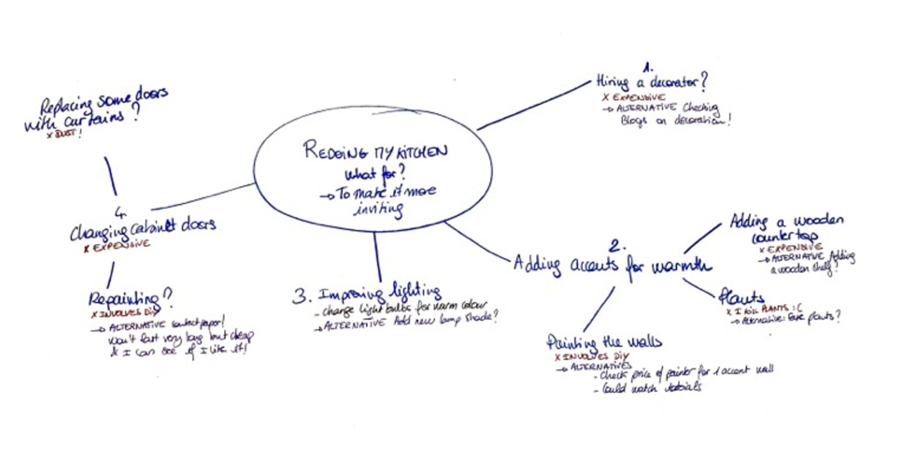

## Need to know  

需要了解

Creativity, or the ability to ‘think outside of the box’, is a wonderful gift.  

创造力，或者说能够‘打破常规思维’的能力，是一种美妙的天赋。  

It helps you solve problems, create unique things, and live a life that is true to who you are.  

它帮助您解决问题，创造独特的事物，并过上真实的生活。  

But it is easier said than done – for most of us, it takes time and effort not to follow the beaten path.  

说起来容易做起来难 - 对于我们大多数人来说，走出常规需要时间和努力。  

In this Guide, we will introduce you to a mental practice that is central to creativity – _possibility thinking_ – and propose a series of exercises you can follow that will help you get better at thinking beyond the box.  

在本指南中，我们将向您介绍一种对创造力至关重要的心理实践——可能性思维，并提出一系列练习，帮助您更好地超越传统思维模式。

In simple terms, possibility thinking is the ability to conceive of what does not exist but could become real.  

简单来说，可能性思维是指能够想象出尚不存在但有可能实现的事物的能力。  

Possibility thinking has only recently garnered attention from scholars, but the concept is not new.  

可能性思维最近才开始引起学者们的关注，但这个概念并非新鲜事物。  

It was first [proposed](https://bera-journals.onlinelibrary.wiley.com/doi/10.1080/0958517990100110) by Anna Craft in 1999 and she and her collaborators have since spent decades [studying](https://www.tandfonline.com/doi/abs/10.1080/03004279.2012.656671) its development in children.  

1999 年，安娜·克拉夫特首次提出了这个概念，并且她和她的合作者们在接下来的几十年里致力于研究儿童的发展。  

As their research shows, thinking in terms of possibilities sounds simple but it is in fact a complex skill.  

根据他们的研究，以可能性为思考方式听起来很简单，但实际上是一项复杂的技能。  

Possibility thinking requires _both_ imagining what is not there _and_ creating paths to it, so that it can become a reality.  

可能性思维需要想象不存在的事物，并为其开辟道路，使之成为现实。  

For example, children might not be able to get to the Moon, but they can both imagine this possibility and create forms of pretend play to make the possibility ‘real’, at least for them.  

例如，孩子们也许无法到达月球，但他们可以想象这种可能性，并创造假想游戏的形式，至少让这种可能性对他们来说变得“真实”。

To take another example, if we ask you to imagine that humans have three arms, you can probably do this easily enough.  

举个例子，如果我们让你想象人类有三只手臂，你可能会很容易地做到。  

But if you cannot envision how this could be made true, then it will remain no more than a mental image.  

但如果你无法想象如何实现这一点，那么它将仅仅保持在你脑海中的一个想象。  

However, if you were to start writing about a dystopian future where humans have been genetically altered to have extra limbs, then you are entering the realm of the possible.  

但是，如果你开始写一个关于末世未来的故事，描述人类被基因改造成拥有额外肢体的情况，那么你就进入了可能的领域。  

Improbable, yes, but not impossible because now you have connected the imagined image to aspects of what is real.  

虽然看似不太可能，但并非完全不可能，因为你已经将想象中的图像与现实的一些方面联系在了一起。  

This is part of what makes possibility thinking so important.  

这是使可能性思维如此重要的一部分，这也是为什么它如此重要。  

It helps us identify what could be made a reality and how.  

它帮助我们确定哪些事情可以实现，以及如何实现。  

Thinking that it was possible to go to the Moon and envisioning that it involved something resembling a satellite launcher is what allowed humanity, ultimately, to make the trip.  

认为登上月球是可能的，并设想这需要类似卫星发射器的设备，最终使人类得以实现这次旅行。

When you apply possibility thinking in your daily life, it can give you a powerful sense of agency.  

当你在日常生活中运用可能性思维时，会让你拥有强大的主动性。  

It can help you find innovative solutions to actually do what you want to do, in one form or another.  

它可以帮助您找到创新的解决方案，从而实现您想要做的事情，无论以何种方式。

In this Guide, we’ll take you through a series of exercises to show how you can apply possibility thinking to real-life problems you’re facing.  

在本指南中，我们将通过一系列练习向您展示如何将可能性思维应用于您面临的实际问题。  

The aim is not to find the one and only or best solution, but to map a wide range of options that exist, even if you are not aware of them at the start, and to reflect on how you could act upon them.  

目的不是找到唯一或最佳解决方案，而是绘制出各种存在的选择，即使在一开始你并不知道它们，并思考如何采取行动。  

Ultimately this will both broaden your horizon and get you thinking and doing things you would have never thought possible.  

最终，这将拓宽你的视野，让你开始思考和做一些你从未想过可能的事情。  

In this sense, possibility thinking is about looking forward: recognising what experiences, relationships, objects and meanings may be useful to solve not only present but future problems.  

从这个意义上说，可能性思维是关于展望未来的：认识到哪些经验、关系、物体和意义可能有助于解决不仅是当前而且是未来的问题。

The exercises that follow will involve drawing a _possibility map_, so make sure to have a notepad and a pen or pencil close at hand.  

接下来的练习将涉及绘制可能性地图，请确保手边备有记事本和一支笔或铅笔。  

Possibility maps can take many shapes, from a literal map to a tree of possibilities, or even lists.  

可能性地图可以呈现多种形式，从字面地图到可能性树，甚至列表。  

What all possibility maps have in common is that they can help you chart possibilities and impossibilities around an issue.  

所有可能性地图的共同特点是它们可以帮助您勾勒出围绕一个问题的可能性和不可能性。  

You can then use your map to navigate beyond the box – and find unexpected solutions to a wide range of problems.  

您可以利用地图超越局限，找到各种问题的意想不到的解决方案。

It is easier to start using possibility thinking and possibility maps for concrete practical issues that call for creative solutions – think designing an awareness campaign, redecorating a place, reorganising your workplace, etc. This is because these issues will have a broad range of possibilities, making them a good place to start.  

对于需要创造性解决方案的具体实际问题，开始使用可能性思维和可能性地图更容易 - 想象设计一项意识宣传活动，重新装饰一个地方，重新组织你的工作场所等等。这是因为这些问题将有广泛的可能性范围，使其成为一个很好的起点。  

With practice, you will then be able to apply possibility thinking to more complex or constrained issues.  

经过实践，您将能够将可能性思维应用于更复杂或受限制的问题，然后。  

In fact, the applications are limitless.  

实际上，这些应用是无穷无尽的。  

For instance, it can be used to address relationship issues (such as how to deal with difficult colleagues, help your children potty-train, or organise the holidays with a large extended family); to navigate a career change (by charting what you could be doing); to plan a dream trip (through laying out all the options); or to design better products (by mapping the venues worth exploring and the roadblocks you will have to navigate around).  

例如，它可以用于解决人际关系问题（如如何应对棘手的同事、帮助孩子们学会如厕，或者与庞大的家庭组织假期）；应对职业变化（通过规划你可能会从事的工作）；策划梦想之旅（列出所有选择）；或设计更好的产品（绘制值得探索的场所和需要绕过的障碍）。

To make the most of this Guide, spend a moment now to come up with a specific, real-life problem you are grappling with – and then you can apply the exercises to this problem.  

要充分利用本指南，请立即花点时间思考一个你正在面临的具体现实问题，然后可以将这些练习应用到这个问题上。  

It could be something mundane, such as how to redecorate your kitchen, or something more complicated, such as how to deal with a difficult boss.  

可能是一些平凡的事情，比如如何重新装饰你的厨房，或者更复杂的事情，比如如何应对一个困难的老板。  

In fact, these are the two examples that we will use throughout the Guide, to help you see what possibility thinking looks like in a personal and professional context.  

实际上，这两个例子是我们在整个指南中将使用的，以帮助您了解个人和专业背景下的可能性思维是什么样子。  

However, for each step, you can swap out our example problems for your own.  

然而，在每一步中，您都可以用您自己的问题替换我们的示例问题。

## What to do  

该做什么

An important note before we start: to engage in possibility thinking requires you to stay open to a wide range of options.  

在我们开始之前，有一点重要的事情需要说明：进行可能性思考需要您保持对各种选择的开放态度。  

That means not rejecting ideas even if they seem strange at first. But it also means not embracing a solution before the end of the process.  

这意味着即使一开始看起来很奇怪的想法也不要拒绝，但也不要在流程结束之前就接受解决方案。  

Focusing too much on one outcome can result in tunnel vision – the opposite of possibility thinking.  

过度关注一个结果可能导致狭隘思维，与可能性思维相反。  

So try to keep an open mind until you reach the end of the process.  

因此，请保持开放的心态，直到你完成整个过程。

To help you to draw your possibility map, we will guide you through a series of questions.  

为了帮助您绘制可能性地图，我们将引导您回答一系列问题。  

It is often easier to start by answering these questions on a separate piece of paper, and to begin charting the map on another sheet as multiple possibilities begin to appear.  

通常更容易先在一张独立的纸上回答这些问题，然后在另一张纸上绘制地图，因为会出现多种可能性。  

The map then acts as a way to keep all your findings in one place, and it will ensure you don’t forget to explore some areas in the later stages.  

地图可以帮助您将所有发现保存在一个地方，确保您不会忘记在后期探索某些区域。

**Ask yourself** **‘What for?’**  

反思‘为何而为’

The first (and arguably most significant) thing to do when trying to solve a problem is to understand exactly what the issue is.  

解决问题时，首先要做的（也可以说是最重要的）事情是准确理解问题的本质。  

So let’s start by spending time understanding the problem, including what makes it a problem, formulating and reformulating it; in other words, [framing it](https://link.springer.com/chapter/10.1007/978-1-4020-2393-4_7).  

因此，让我们首先花时间深入了解问题，包括问题的本质，制定和重新制定问题；换句话说，对问题进行界定。

Framing the problem may sound straightforward, but in practice it often isn’t.  

解决问题可能听起来很简单，但在实际操作中往往并不容易。  

This is because we sometimes hide less noble intentions behind more socially acceptable ones.  

这是因为我们有时会用更社会接受的借口掩盖不那么高尚的意图。  

Or because obvious issues hide deeper dissatisfactions.  

或者是因为明显的问题掩盖了更深层次的不满情绪。  

Or, simply, because complex situations make identifying specific problems more difficult.  

或者，简单来说，复杂的情况会使得特定问题的识别变得更加困难。

There are two types of questions that can help you there.  

那里有两种类型的问题可以帮助你。  

The first is simply ‘Why?’ Why exactly do you think the current situation is a problem?  

第一个问题是‘为什么？’ 你为什么觉得当前的情况是个问题呢？  

For instance, if your problem was how to redecorate your kitchen, then let’s start with the question: why do you want to redecorate your kitchen?  

例如，如果您的问题是如何重新装饰厨房，那么让我们从这个问题开始：您为什么想要重新装饰厨房？  

Is it because you find it unwelcoming? Because you feel bad when guests come over?  

你觉得是因为你觉得不友好吗？因为当客人来访时你感到不舒服吗？  

Because it is not practical?  

因为这不切实际吗？

Be honest with yourself, even if it is not always pleasant.  

坦诚面对自己，即使有时并不那么愉快，也是很重要的。  

It might be easier to convince yourself that you want to redecorate because you prefer a cosy home, when the reality is that you’d like to be able to show off to your friends when they come over.  

或许更容易说服自己，你想重新装饰，因为你更喜欢一个舒适的家，但实际上你更想向朋友炫耀当他们来访。  

Knowing yourself and your needs and motives will help you frame the problem in terms of the right goals and, thus, find more effective solutions: if you want to show off, focus on the first impression your kitchen gives.  

了解自己和自己的需求和动机将有助于您正确界定问题，并因此找到更有效的解决方案：如果您想炫耀，专注于厨房给人的第一印象。  

If you want something that feels cosy, think of places that make you feel that way and try to emulate them.  

如果你想要一种温馨的感觉，想想让你感到这种感觉的地方，然后尝试模仿它们。

The second question is ‘What am I hoping to achieve?’ What would my ideal end point be?  

第二个问题是‘我希望实现什么？’我理想的最终目标是什么？  

Let’s say your problem is that you have a difficult boss, who tends to micromanage you in unproductive ways.  

假设你的问题是你有一个难缠的老板，倾向于以无效的方式对你进行过度管理。  

Is your aim to be able to work better so their attitude doesn’t affect your career?  

你的目标是为了能够更好地工作，以免他们的态度影响你的职业吗？  

Or is it to stop the micromanagement because having someone breathing down your neck constantly is unsustainable?  

还是为了避免微观管理，因为让某人不断在你身边喘气是不可持续的？

There most likely won’t be a single and simple answer to ‘What for?’, and that is actually a good thing.  

对于“为什么？”很可能不会有一个单一简单的答案，而这实际上是件好事。  

It means there are multiple potential end points that could be desirable.  

这意味着存在多个可能的理想终点。  

The role of the what-for game is primarily to help you visualise where you would like to go, so you chart paths to get there.  

what-for 游戏的主要作用是帮助您清晰地展现自己想要前往的目的地，以便您规划到达那里的路径。  

The more options, the better.  

选择越多，越好。

‘What for?’ is a good question to start thinking about possibilities, but it is also one to keep in mind throughout.  

“为什么？”是一个很好的问题，可以开始思考可能性，但也是一个需要贯穿始终的问题。  

It will help you make sure you focus on the right things.  

它将帮助您确保专注于正确的事情。  

Possibility thinking is most effective when it helps you realise new things about your own intentions.  

当可能性思维帮助您意识到自己意图的新事物时，它才最有效。  

If you arrive at a good solution for your problem and yet remain unsatisfied, chances are that this is because it doesn’t fully match what you are, deep down, hoping to achieve.  

如果您找到了解决问题的好方法，但仍然感到不满意，很可能是因为它并没有完全符合您内心深处所希望实现的目标。  

Let’s say, for instance, that after going through all the steps below you find the perfect solution to get your boss off your back, yet somehow it feels wrong.  

让我们假设，例如，经过以下所有步骤，您找到了让老板别再烦你的完美解决方案，但不知何故，感觉不对。  

Then maybe what you _really_ want is a career change.  

那也许你真正想要的是换个职业。

**Ask yourself** **‘What if?’**  

反思‘如果’的可能性

Now that you have defined your (actual) problem, let’s start mapping your possibilities.  

现在您已经明确了问题，让我们开始探索解决方案。  

The first method for doing this is called ‘what if’ and involves [counterfactual thinking](https://brill.com/display/book/9789004314184/B9789004314184-s008.xml) – an [effective](https://ieeexplore.ieee.org/abstract/document/5174633) way to cultivate creativity and innovation.  

第一种方法称为“假设如果”，涉及反事实思维 - 这是培养创造力和创新的有效方式。

To play the what-if game, start by choosing what you think is the biggest constraint on the situation you are in.  

玩“假设游戏”时，首先选择您认为是当前情况中最大的限制因素。  

For instance, in the case of the kitchen renovation, your biggest constraint might be your budget.  

例如，在进行厨房翻新时，您最大的限制可能是预算。  

Then, imagine the constraint wasn’t there. Ask yourself: ‘What if money wasn’t an issue?  

然后，想象一下没有这个限制。问问自己：“如果钱不是问题，会怎样呢？  

What would you do?’ List all the potential solutions you can think of that might exist in the absence of that constraint.  

'“你会怎么做？”列出你能想到的所有潜在解决方案，这些解决方案可能在没有那个限制的情况下存在。'  

For instance, perhaps you’d choose to install a beautiful wooden countertop?  

例如，也许您会选择安装一个漂亮的木制台面呢？  

Keep this list of solutions for the next exercise.  

保留这份解决方案清单，供下次练习使用。

While completing this counterfactual exercise, you might realise that, actually, it doesn’t make much difference.  

在完成这个反事实的练习时，您可能会意识到，其实并没有太大的差别。  

Perhaps you still can’t think of (m)any solutions even with that constraint removed.  

也许即使解除了那个限制，你仍然可能想不出太多解决方案。  

Don’t worry – this can be illuminating too.  

别担心 - 这也可能是一种启发。  

Realising this can help you reframe your problem – for instance, maybe what you need to do first is figure out what styles of kitchen you like, or maybe you need to identify other constraints that really are relevant to the situation.  

意识到这一点可以帮助您重新审视问题 - 例如，也许您首先需要弄清楚自己喜欢哪种厨房风格，或者也许您需要确定其他确实与情况相关的限制条件。

Applying the what-if game to the case of a micromanaging boss, you might identify the constraint of not being able to talk to them openly.  

当将“假设游戏”应用于一个微观管理的老板的情况时，您可能会发现无法坦诚地与他们交谈是一个约束。  

Removing this constraint, you could ask yourself: ‘What if I could openly talk to them about how they treat me, without being afraid of what they will do?’ You might come up with a list of things you’d say.  

放下这种限制，你可以问自己：“如果我能够毫不畏惧地和他们谈论他们对待我的方式，会怎样？”你可能会想出一些你想说的话。  

But perhaps not – you might realise that the main constraint is not actually _how_ your boss reacts or would react, but figuring out _what_ you would want to tell them.  

但也许并非如此 - 你可能会意识到，主要的限制实际上并不是你的老板会如何反应，而是弄清楚你想告诉他们什么。

**Ask yourself ‘What would someone** **else do?’**  

可以问问自己‘别人会怎么做？’

At this stage, if the what-if game was fruitful, you might have a map full of possibilities.  

在这个阶段，如果假设游戏进行得顺利，你可能会得到一张充满可能性的地图。  

But, as we saw, it’s often the case that you won’t, and that’s OK too – that’s why you engaged in possibility thinking in the first place: because you didn’t know what to do.  

但正如我们所看到的，通常情况是你不会这样做，这也没关系 - 这就是你最初进行可能性思考的原因：因为你不知道该怎么做。  

This next stage should help you add new territories or branches to your map.  

这一步将帮助您将新的领土或分支机构添加到您的地图上。  

It involves perspective-taking – seeing the world through the eyes of someone else.  

它涉及透过他人的眼睛看世界，换个角度来看事物。  

Having multiple perspectives on an issue has been shown to help solve problems – after all, that’s why [diverse teams](https://www.pnas.org/doi/abs/10.1073/pnas.2200841119) are often more creative.  

从不同角度看待问题已被证明有助于解决问题 - 毕竟，这就是为什么多元化团队通常更有创造力。

How can you harness the power of diverse groups even when you are on your own?  

当你独自一人时，如何充分利用不同群体的力量？  

Through the use of imagination, by envisioning what someone else would do in that situation.  

通过想象，设想别人在那种情况下会做什么，以此来解决问题。  

There are two categories of people that can be useful here: other actors who are in the same situation, and people who aren’t involved, but who you think would easily find a solution if they were.  

在这里可能会有用的有两类人：处于相同情况的其他演员，以及没有参与其中但如果他们参与的话可能会很容易找到解决方案的人。

In the case of a difficult boss, other actors could be your colleagues or your supervisor.  

当遇到难缠的老板时，其他人可以是你的同事或你的主管。  

For instance, if your colleague had to work on a close project with your boss, how would they deal with them?  

例如，如果您的同事必须与您的老板共同开展一个紧密的项目，他们会如何应对？  

It’s important at this stage to recognise that what works for others may not work for you, without letting this stop you from exploring other perspectives.  

在这个阶段，重要的是要意识到，适用于他人的方法未必适用于你，但不要因此而阻止你探索其他观点。  

For instance, your coworker might be much more assertive than you are comfortable being.  

例如，您的同事可能比您更加坚定，而您可能感到不太自在。  

Or they might not be very involved in their work and not care enough to be bothered by a bit of micromanagement.  

或者他们可能对工作不够投入，不在乎被微观管理所困扰。  

We cannot flip assertiveness or conscientiousness on and off like a switch, so ‘turning’ into your coworker is not going to be a viable solution on its own.  

我们无法像开关一样随意切换自信或尽责，因此单靠“变成”你的同事并不是一个可行的解决方案。  

But it can help widen your perspective.  

但它可以帮助拓宽你的视野，让你看到更多可能性。

You can also take the perspective of someone not directly involved, but who you believe would easily solve the issue.  

你也可以站在一个并非直接参与其中但你认为能够轻松解决问题的人的角度来思考。  

For example, in the kitchen redecoration scenario, what would your friend, who always has amazing ideas when it comes to decorating her own home, do to redecorate her kitchen?  

举例来说，在厨房重新装修的情境下，您那位总是在装饰自己家时拥有惊人创意的朋友，会如何重新装饰她的厨房呢？  

Or where would Martha Stewart start?  

那玛莎·斯图尔特会从哪里开始呢？  

As with the first type of imagining, this can help you map both possibilities (how they would solve the issue) and apparent impossibilities (what would not work in your situation).  

与第一种想象类似，这可以帮助您描绘出可能性（他们如何解决问题）和明显的不可能性（在您的情况下不起作用的内容）。  

Let’s say your friend is really good with power tools and does everything herself, whereas you can barely use a glue gun?  

假设你的朋友非常擅长使用电动工具，什么事情都自己动手，而你几乎连胶枪都不会用？  

In that case, you might add some modest DIY options to your growing list of possibilities, but you could rule out complex DIY projects as an option for you.  

在这种情况下，您可以考虑将一些简单的 DIY 选项添加到您不断增长的可能性清单中，但您可以排除复杂的 DIY 项目。

There’s another type of perspective-taking that involves directly asking or looking at what others do.  

还有一种透视方式，直接询问或观察他人的行为。  

The key here is in not taking this as advice on what you _should_ do, but as an example of what _could_ be done. It can sometimes be tricky to ask people you know what they would do.  

关键在于不要把这当作你应该做的建议，而是作为一个可以做的示例。有时候询问你认识的人他们会怎么做可能会有些棘手。  

They might have such a different understanding of the situation that their advice isn’t useful.  

他们可能对情况的理解有很大差异，以至于他们的建议并不实用。  

And they might expect you to apply what they suggest and [be hurt](https://psyche.co/ideas/recognise-the-point-of-giving-advice-and-you-can-do-it-better) if you don’t.  

他们可能期望你接受他们的建议，如果你不这样做会感到受伤。

This is where the internet is an invaluable resource: people who have dealt with issues similar to yours have most likely posted about it online, sharing their strategies and receiving more feedback than they bargained for.  

互联网的强大之处在于这里是一个无价的资源：那些遇到类似问题的人很可能在网上分享他们的策略，得到比他们预期更多的反馈。  

Yes, what you will find online is to be taken with a huge grain of salt.  

是的，在网上找到的信息需要持怀疑态度，不可全信。  

Pinterest is filled with unrealistic tutorials on how to paint your own ‘marble’ countertop, and Reddit will most likely tell you your boss is a psychopath.  

Pinterest 充斥着关于如何绘制自己的“大理石”台面的不切实际教程，而 Reddit 很可能会告诉你，你的老板是个精神病患者。  

But the diversity of perspectives you will encounter can help you map possibilities you would have never thought of.  

然而，你将会遇到的多元视角可以帮助你开拓出你从未想过的可能性。  

And other people’s experiences can also help you determine what is unlikely to work.  

其他人的经验也可以帮助您确定哪些方法不太可能奏效。

**Ask yourself ‘Why not?’  

为什么不呢？**

You should by now have an extensive map of possibilities.  

您现在应该已经拥有一个广泛的可能性地图。  

The aim of this stage is to look at each in turn and ask ‘Why not?’ Let’s say you mapped as a possibility that you could look for a mentor in your organisation to help you find the best way to communicate with your boss.  

这个阶段的目标是逐个审视每一个，并问自己：“为什么不呢？”假设您将寻找组织内的导师，帮助您找到与老板沟通的最佳方式。  

Why is this not a solution for you?  

为什么这对你来说不是一个解决方案呢？  

Maybe your organisation is too small, and it would be hard to find someone you can truly be open with.  

或许您的组织规模太小，很难找到一个您可以真正坦诚相待的人。  

Or, maybe, you wouldn’t know who to approach.  

或许，你不清楚该找谁。

The aim at this stage is not to be negative just for the sake of it, but to better understand the limits of each possibility and identify what needs to be changed to make it a workable solution _for you_.  

在这个阶段，我们的目标不是为了消极而消极，而是为了更好地理解每种可能性的限制，并确定需要做出哪些改变，以使其成为您可行的解决方案。  

Remember to make notes on your map as you apply this exercise to your various branches and possibilities.  

在将这项练习应用到不同的分支和可能性时，请记得在地图上做笔记。

For possibilities that seem more distant – you find it hard to believe you could implement them – try reversing your focus by asking ‘Why would it not work?’ For example, perhaps one solution on your map is using DIY to renovate your kitchen, but you can’t for a second imagine doing that?  

针对看似更遥远的可能性 - 你觉得很难相信自己能够实现它们 - 尝试改变关注点，问自己“为什么不行？”。例如，也许你地图上的一个解决方案是使用 DIY 来翻新厨房，但你无法想象自己会这样做？  

Turn this around: why not use DIY on your kitchen? Is it because you lack the skills?  

把这个问题想一下：为什么不在厨房里自己动手？是因为你缺乏技能吗？  

OK, but you could learn. Or is it because you think power tools are too expensive?  

好的，但你可以学习一下。或者是因为你觉得电动工具太贵了？  

OK, but you could rent them.  

好的，但你可以租用它们。

(To give you an approximate idea for how your map might look at this point, check out an example map one of us – Constance – created for the kitchen scenario.)  

(为了让您对地图的大致外观有个概念，请查看我们中的一位 - 康斯坦斯 - 为厨房场景创建的示例地图。)

Image supplied by the authors  

作者提供的图像

The aim of the why-not game is to help you refine your map by understanding better what is truly possible or impossible, and why.  

why-not 游戏的目的是帮助您通过更好地理解什么是真正可能或不可能的，以及为什么，来完善您的地图。  

At the end of it, your map should have multiple, developed branches – if not, go back to the previous exercises and expand some of the possibilities.  

最后，您的地图应该有多个发展完善的分支 - 如果没有，请返回到之前的练习并拓展一些可能性。  

The ‘What would someone else do?’ question can be particularly helpful here.  

“在这里，‘别人会怎么做?’这个问题可能特别有帮助。”

For instance, in the case of dealing with a difficult boss, branches could include: trying to talk to them about the issue, finding support in your organisation, finding support to help you understand what triggers you in their behaviour, relocating to another team, changing organisation, changing jobs, etc. For each branch, you should have a list of associated possibilities (eg, for the second branch focused on finding support, one possibility could be contacting the mentoring programme in your organisation) and impossibilities (eg, for the first branch on communicating with your boss, you have already tried direct communication and know it doesn’t work, so you could rule this out).  

例如，在应对困难老板的情况下，可能的分支包括：尝试与他们谈论问题，寻找组织内的支持，寻找支持以帮助您了解他们行为中的触发因素，转移到另一个团队，换工作地点，换工作等。针对每个分支，您应该列出相关可能性的清单（例如，针对寻找支持的第二个分支，一个可能性是联系您组织中的指导计划），以及不可能性的清单（例如，针对与老板沟通的第一个分支，您已经尝试过直接沟通并知道不起作用，因此您可以排除这一可能性）。

At this stage, you can try repeating the what-if game and see whether it alters your map.  

在这个阶段，您可以尝试重新玩“假设”游戏，看看是否会改变您的认知地图。  

Think of another potential constraint and imagine it didn’t exist. If the answer to ‘What if constraint x was removed?’ is that no new solutions are forthcoming, then it is not really a constraint.  

想象另一个可能的限制条件，并假设它不存在。如果对“如果去除约束 x 会怎样？”的回答是没有新的解决方案出现，那么它实际上并不是一个约束。  

If it only generates a few new solutions, then it is a partial constraint and not the core one that should be addressed.  

如果它只提供了一些新的解决方案，那么它只是一个部分性约束，而不是需要解决的核心问题。  

For example, if imagining you have amazing DIY skills doesn’t significantly change your map then it is not the main issue.  

举例来说，如果你认为拥有出色的 DIY 技能并没有显著改变你的地位，那么这并不是主要问题。  

Perhaps that’s because the real constraint has to do with money and the cost of materials.  

或许这是因为真正的限制在于金钱和材料的成本。

You can also apply the what-if game to the existing possibilities on your map.  

您也可以将“假设游戏”应用于地图上已有的可能性。  

If the answer to ‘What if I implemented that possibility?’ is that it would not solve the situation, then it is not a possibility at all.  

如果实施这种可能性不能解决问题，那么这根本不算是一种可能性。  

For example, let’s say you identified earlier that your main aim is to make your kitchen more practical.  

举个例子，假设您之前确定的主要目标是让您的厨房更加实用。  

One of the solutions on your map is changing your cabinet doors.  

你的地图上提供的一个解决方案是更换橱柜门。  

But applying the what-if test here shows that it is not going to solve the problem – no matter how much you want an excuse to splurge money on the doors, it won’t help solve the key problem at hand.  

但是通过进行假设测试，可以发现无论你多么想找借口在门上挥霍金钱，都不会帮助解决手头的关键问题。

Going through your map, applying the what-if game to different constraints and possibilities will help you grow the map in places and prune it in others, ultimately broadening your understanding of what is possible.  

通过对地图进行研究，运用“假设游戏”来探索不同的限制和可能性，将有助于您在某些方面扩展地图，在其他方面修剪地图，最终拓宽您对可能性的理解。

**Ask yourself ‘What else and how else?’  

反思并问自己：‘还有其他什么？如何做？’**

The aim of this last exercise is to chart even more possible paths to your aims. Think of it as adding even more alternative branches for each possibility.  

这个最后的练习的目的是为您的目标开辟更多可能的路径。可以将其视为为每种可能性添加更多的替代分支。  

This could help you find a way around constraints or you might find a backup plan that turns out better than the original solution.  

这可能帮助您找到绕过限制的方法，或者您可能会发现一个比原始解决方案更好的备选方案。

Looking at the possibilities on your map that you marked as unsuitable for you (in the why-not stage), ask yourself _how else_ you could you achieve a similar result.  

查看您在地图上标记为不适合您的可能性（在为什么不阶段），问问自己如何以其他方式实现类似的结果。  

Let’s say your aim was to make your kitchen more inviting and one solution you came up with was to install a wooden countertop, but you marked this as impractical earlier on because you don’t have the budget to afford this solution.  

假设你的目标是让厨房更具吸引力，你想到一个解决方案是安装木制台面，但你之前认为这个方案不切实际，因为你没有预算来支持这个解决方案。  

Asking yourself ‘How else?’ could prompt you to realise an alternative could be sourcing a cheap wooden countertop by going to a salvage yard that sells reclaimed timber.  

反思“还有其他办法吗？”可能会启发您，发现另一种选择是前往销售回收木材的废品场，寻找廉价的木制台面。  

Or you might think of an alternative solution that involves fitting wooden shelves – benefiting from the natural warmth of wood, but more cheaply than via a new countertop.  

或者您可以考虑另一种解决方案，即安装木制货架-享受木材的自然温暖，但成本比新台面低。  

Asking ‘How else?’ might sometimes slightly change your aims. (It might be useful at this point to go back to what you found in the what-for game to make sure these changes still align with your goals.)  

问“还有其他什么？”有时可能会稍微改变你的目标。（此时回顾一下你在“what-for”游戏中发现的内容可能会有所帮助，以确保这些变化仍与你的目标一致。）

[Wondering](https://www.bloomsbury.com/uk/wonder-9781350085152/) about alternatives is not just a way to bypass constraints.  

思考替代方案不仅仅是规避限制的手段。  

It is also a way to expand on existing possibilities, so that you don’t miss out on great options.  

这也是一种扩展现有可能性的方式，让您不会错过很棒的选择。  

Look at each of the possibilities you have charted and ask _what else_ could you do that achieves a similar aim.  

查看您已经绘制的各种可能性，并思考还有哪些其他方法可以达到类似的目的。  

For instance, an alternative to finding a mentor to support your career in spite of your difficult boss could be to locate a group of peers in your organisation, where you could both meet likeminded individuals going through similar things and network to create new opportunities for yourself.  

例如，你可以在组织中找到一群同事，与其寻找导师来支持你的职业，不如结识志同道合的人，他们也在经历类似的事情，一起建立新的机会网络。  

Or working on why your boss triggers you so much could involve therapy, but also activities that encourage mindfulness such as yoga or meditation.  

为什么你的老板会让你如此激动可能需要治疗，也可能需要进行鼓励正念的活动，比如瑜伽或冥想。

**Use your map  

使用您的地图进行导航**

As it probably became clear as you worked through the preceding exercises, [possibility thinking](https://journals.sagepub.com/doi/abs/10.1177/27538699231172436) is not a linear process.  

正如您在之前的练习中可能已经意识到的那样，可能性思维并不是一个线性的过程。  

It often involves going back to earlier stages and, with practice, asking all the question prompts almost simultaneously.  

它经常涉及回到较早的阶段，通过实践几乎同时提出所有问题提示。  

Hopefully, by the end of this Guide, you should have a wonderfully detailed map of possibilities and be able to identify those you would have never thought of before.  

希望在本指南结束时，您将拥有一个详细的可能性地图，并能够识别以前从未想过的可能性。

The problems we used in this Guide are real problems that confronted one or both of us.  

本指南中所使用的问题是我们其中一个或双方真实面对的问题。  

How did the possibility maps help us solve them?  

如何利用可能性地图帮助我们解决问题？  

Exploring how to improve our kitchen made us realise that our biggest constraint was that we didn’t want to spend much money on our kitchen because we knew we wanted to move house soon.  

探索如何改善我们的厨房让我们意识到，我们最大的限制是我们不想在厨房上花太多钱，因为我们知道我们很快就要搬家了。  

So we covered our cabinets in colourful contact paper, added a curtain to the window, and changed our lights.  

因此，我们用彩色的接触纸覆盖了橱柜，给窗户加上了窗帘，并更换了灯具。  

It worked a charm, and good it did because the COVID-19 pandemic made us stay in the house longer than we’d expected.  

它起了魔力作用，这很好，因为 COVID-19 大流行让我们呆在家里的时间比预期的长。

As for the terrible boss?  

关于那个可怕的老板呢？  

One of us (Constance) tried all the options on the map, from mentors and support groups to reading guides on effective communication.  

康斯坦斯尝试了地图上的所有选项，从导师和支持团体到阅读关于有效沟通的指南。  

In the end, counselling helped the most. I identified some of my triggers, but mostly it made me realise that I hated that job.  

最终，咨询帮助最多。我找出了一些触发因素，但更多的是让我意识到我讨厌那份工作。  

Focusing on my manager was a way to hide how disappointed I had been by what sounded like my dream job.  

把注意力放在我的经理身上是一种掩饰我对听起来像是我的梦想工作感到失望的方式。  

So I made another map to help me figure out what to do with my life.  

所以我又制作了一张地图，帮助我弄清楚该如何规划我的人生。  

And I couldn’t be happier with my choice.  

我对我的选择感到非常满意。

This is what possibility thinking is about, ultimately. Yes, it can help you solve problems and be more creative.  

这就是可能性思维的核心，它可以帮助你解决问题并激发更多创造力。  

But it also invites you to think beyond the problem in front of you, to explore a whole universe you did not even realise existed, and find your own path within it.  

但它也邀请您超越眼前的问题，探索一个您甚至没有意识到存在的整个宇宙，并在其中找到自己的道路。

It can sometimes feel vertiginous, and you might not know where to start.  

有时候会感到眩晕，也许不知道该从哪里开始。  

If that’s the case, look in turn at each branch on your map. How does it feel?  

如果是这样的话，请逐个查看地图上的每个分支。感觉如何？  

Can you see yourself doing that? Why? Why not? Which options could you explore first?  

你能想象自己去做那件事吗？为什么？为什么不？你可以先探索哪些选择？  

What about as a last resort?  

作为最后的手段是什么？

Solutions that work for others do not have to work for you, and what looks good on paper can sometimes just feel plain wrong when you start thinking of implementing it.  

别人的解决方案未必适用于你，有时候，纸面上看起来很好的东西，在你开始考虑实施时可能会感觉完全错误。  

Emotions and subjectivity can be powerful tools for making decisions – although it can always be useful to reflect on why some areas of your map can make you feel a certain way.  

情绪和主观性可以是做决定的强大工具 - 尽管反思为什么地图的某些区域会让你产生某种感觉总是有益的。

More often than not, exploring a possibility map is a joyful experience.  

多数情况下，探索可能性地图是一种愉快的经历。  

Even when we have to restart or go back to the drawing board, we do it with the realisation that the world is always more open than it seems at first sight.  

即使我们不得不重新开始或回到起点，我们也要意识到，世界总是比一开始看起来更加开放。  

This is the first (and last) lesson of possibility thinking!  

这是可能性思维的第一（也是最后一）课！

### Key points – How to use ‘possibility thinking’  

关键要点- 如何运用“可能性思维”

1.  **Possibility thinking can help you in your personal and professional life.** Applying possibility thinking to everyday problems can help you create a map of possible solutions that are not yet apparent but could become a reality.  
    
    可能性思维可以助您在个人和职业生活中。将可能性思维应用于日常问题，有助于您构建一幅潜在解决方案的地图，这些方案目前尚不明显，但有望成为现实。
2.  **Ask yourself ‘What for?’** The key to solving any problem is to be clear about what you want to achieve.  
    
    解决任何问题的关键是明确你想要实现什么，所以问问自己‘为什么？’。  
    
    Before creating your map of possibilities, explore what your aims truly are.  
    
    在制作可能性地图之前，先探索一下你的真正目标。
3.  **Ask yourself ‘What if?’** Now get a pen and paper and start creating your map.  
    
    反思“如果”的问题。现在拿起笔和纸，开始绘制你的地图。  
    
    The what-if exercise will get you started and involves exploring what solutions become available if you imagine that certain constraints or obstacles are removed.  
    
    开始进行“假设”练习，探索在想象某些限制或障碍被移除时会有哪些解决方案可用。
4.  **Ask yourself ‘What would someone else do?’** This exercise involves imagining what others would do if faced with your issue – or you could ask them directly.  
    
    反思‘别人会怎么做’。这个练习涉及想象别人在面对你的问题时会采取什么行动 - 或者你可以直接向他们请教。  
    
    Don’t gather opinions as advice on what you should and shouldn’t do.  
    
    不要把意见当作你应该或不应该做的建议。  
    
    Instead, look at them as alternative paths that you can use to widen your map of possibilities.  
    
    相反，将它们视为您可以使用的替代路径，以拓宽您的可能性范围。
5.  **Ask yourself ‘Why not?’** Look at the solutions on your map and be your own opposition – argue with yourself about why you believe some solutions are possible or impossible.  
    
    反问自己：“为何不尝试？”查看地图上的解决方案，并成为自己的反对者——和自己辩论，思考为何你认为某些解决方案可能或不可能。  
    
    Debates, even with yourself, are a wonderful way to expand your horizon of possibility.  
    
    辩论，即使是与自己，也是拓展可能性视野的绝佳方式。
6.  **Ask yourself ‘What else and how else?’** Find even more alternative solutions by looking at the possibilities on your map and asking how else you could reach the same goal, then expand on these answers by asking what else you could do instead.  
    
    问问自己：“还有什么其他方法和怎么做？”通过查看地图上的可能性，询问如何达到相同的目标，然后通过询问还能做什么来扩展这些答案，找到更多的替代解决方案。  
    
    Turn your impossibilities into opportunities and your possibilities into a host of new and original solutions.  
    
    将您的不可能变为可能，将您的可能性转化为一系列全新且原创的解决方案。
7.  **Use your map.** Reap the benefits of your hard work: explore your map, imagine what it would be like to implement each possibility, make a plan for what to do next, and start experimenting.  
    
    利用您的地图，享受辛勤工作的成果：探索地图，想象实现每种可能性的情况，制定下一步计划，并开始实验。  
    
    After all, possibility thinking doesn’t take place in the head but in the world.  
    
    可能性思维并非发生在头脑中，而是发生在现实世界中。

## Links & books  

链接和书籍

Visit the [website](https://www.possibilitystudies.net/) of the Possibility Studies Network for more information about possibility thinking and the growing international community of researchers and practitioners invested in its study and cultivation.  

访问可能性研究网络的网站，获取更多关于可能性思维以及不断壮大的国际研究者和从业者社区对其研究和培育的信息。  

You can also find a series of tools and methods there as well as information about monthly events and annual conferences.  

您还可以在那里找到一系列工具和方法，以及关于每月活动和年度会议的信息。  

We hope to meet you at one of these in the future!  

我们希望将来有机会见到你们中的某位！

Watch this [video](https://sparks.learning.asu.edu/videos/possibility-thinking-protocols) from Arizona State University which features the psychologist and creativity expert Ronald Beghetto describing his approach to a group possibility thinking exercise or ‘protocol’.  

观看亚利桑那州立大学的这段视频，心理学家和创造力专家罗纳德·贝盖托描述了他的群体可能性思维练习或“协议”的方法。

Watch the interactive [seminar](https://www.youtube.com/watch?v=JMSp0iogi6E&list=PL8rA24Gd1nPM-E1GMumKhPVZwSdfJ_7w3) ‘Cultivating the Possible’ (2021) on YouTube produced by Dublin City University and hosted by one of us (Vlad) that focuses on incorporating possibility thinking and creativity into education.  

观看由都柏林市立大学制作并由我们之一（弗拉德）主持的 YouTube 上的互动研讨会“培育可能性”（2021 年），重点是将可能性思维和创造力融入教育中。

Access the Sage [journal](https://us.sagepub.com/en-us/nam/possibility-studies-society/journal203734#aims-and-scope) _Possibility Studies and Society_ to read a short [manifesto](https://journals.sagepub.com/doi/full/10.1177/27538699221127580) that outlines the what, who and how of possibility studies.  

访问 Sage 期刊《可能性研究与社会》，阅读一篇简短的宣言，了解可能性研究的内容、对象和方法。

There are several books that can help bring new perspectives on the possible and possibility thinking, such as Ronald Beghetto’s book _Uncertainty x Design: Educating for Possible Futures_ (2023) and the [volume](https://link.springer.com/book/10.1007/978-3-030-84478-3) _The Art of Serendipity_ (2022), edited by Wendy Ross and Samantha Copeland.  

有几本书可以帮助我们从新的角度看待可能性和可能性思维，比如罗纳德·贝盖托（Ronald Beghetto）的著作《不确定性 x 设计：教育可能的未来》（2023）以及温迪·罗斯（Wendy Ross）和萨曼莎·科普兰（Samantha Copeland）编辑的《偶然的艺术》（2022）。

And, for those rare readers who haven’t had enough of our views and advice, the [book](https://academic.oup.com/book/31846) _The Possible: A Sociocultural Theory_ (2020) outlines the approach that one of us (Vlad) uses to guide his own thinking about possibilities.  

对于那些罕见的读者，还没有尽兴阅读我们的观点和建议的人，2020 年的书籍《可能性：一种社会文化理论》概述了我们之一（弗拉德）用来引导自己思考可能性的方法。

Save  

存储

Share  

分享内容

Post  

帖子

Email  

电子邮件

3 April 2024  

2024 年 4 月 3 日
