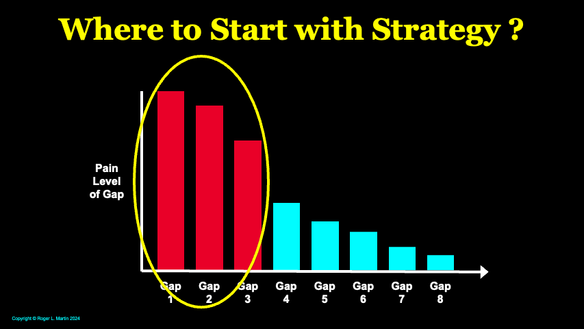

## Playing To Win  

为了取胜而比赛

## **Focus on Betterment  

专注于改善**

Source: Roger L. Martin, 2024  

出处：罗杰·L·马丁著，2024 年

There is a goodly amount of confusion on the question of where to start on strategy.  

关于战略从何处开始的问题存在相当多的混淆，让人困惑。  

The most common view is: “we don’t have a strategy, so we need to develop one.” I see it differently and that has implications for how to embark on strategy.  

最常见的观点是：“我们没有战略，所以我们需要制定一个。”我持有不同看法，这对如何着手制定战略有重要影响。  

I explain in the Playing to Win/Practitioner Insights piece, _Where to Start with Strategy: Focus on Betterment_.  

在《玩转胜利/从业者见解》中，我解释了战略起点何在：专注于改善。

**_Do_ versus _Say_ in Strategy  

战略中的行动与言说**

[As I have written before](https://rogermartin.medium.com/strategy-is-what-you-do-not-what-you-say-a6e483840557), every company (or organization or person, for that matter) has a strategy.  

正如我之前所提到的，每家公司（或组织或个人，无论如何）都制定了一项战略。  

Often a company’s strategy has little or nothing to do with what its strategic planning document _says_, which is typically full of platitudinous statements, flowery prose, and mind-numbing charts and graphs.  

通常情况下，公司的战略与其战略规划文件所述内容无关，后者通常充斥着陈词滥调、华丽辞藻以及令人昏昏欲睡的图表。  

These documents are great for board retreats and for corporate planning types — but little else.  

这些文件非常适合董事会撤退和企业规划，但在其他方面用途有限。

A company’s strategy is what it _does._ Its strategy is the set of choices that it has put into action over time.  

一家公司的战略体现在它的行动中。战略是公司随着时间采取的一系列选择。  

Like the expression “you are what you eat;” you are your choices — regardless of how or why they were made.  

就像“你是你吃的东西”这句话一样；你就是你的选择 — 无论这些选择是如何或为什么做出的。  

That is the case even if those choices are not written down anywhere.  

即使这些选择没有被书面记录，情况仍然是这样的。  

That is why all entrepreneurs have strategies — even if they deny that they do, which is often the case.  

这就是为什么所有的企业家都有策略 — 即使他们否认，这种情况经常发生。  

They spend on some things and not others. They choose to serve some customers and not others.  

他们在某些方面花钱，而在其他方面则不花钱。他们选择为某些客户提供服务，而不为其他客户提供服务。  

They operate in some geographies and not others.  

他们在一些地区有业务，而在其他地区没有。

My entrepreneur father would deny that he even knew what strategy was (until later in his life when I started writing books on strategy, which he read as a dutiful father).  

我的企业家父亲会否认他甚至知道什么是战略（直到晚年时，我开始写关于战略的书，他作为一个尽职的父亲阅读）。  

But he chose to spend zero on his own office — he was CEO and 100% shareholder — and used whatever salesperson’s office was empty because there was always at least one who was on the road — because him having an office created zero value for customers.  

但他选择在自己的办公室上不花一分钱 — 他是 CEO 和 100%的股东 — 并使用任何空着的销售人员办公室，因为总会有至少一个销售人员在外出 — 因为他有办公室对客户毫无价值。  

However, he chose to spend heavily on frequently washing the trucks that delivered the company’s animal feed to his farmer customers because it gave them confidence that their feed would always be delivered by these well-maintained, pristine trucks — and that confidence made a real difference to customers.  

然而，他选择在经常清洗运送公司动物饲料的卡车上大手笔投资，因为这让他的农民客户对这些保养良好、一尘不染的卡车充满信心 — 这种信心对客户来说真的很重要。  

He refused to ever deviate from the published price list because he wanted each farmer to be confident that no other farmer would get a better deal from his company — and his salespeople could focus on selling quality and service not negotiating on price.  

他拒绝偏离已发布的价格表，因为他希望每位农民都能确信没有其他农民会从他的公司获得更好的交易，这样他的销售人员就可以专注于销售质量和服务，而不是在价格上进行讨价还价。  

Those, and many others, were profound strategy choices — even though none was ever written down or seen as ‘strategy’ by my father.  

那些选择，以及许多其他决策，都是深远的战略选择 — 即使从未被记录下来或被我父亲视为‘战略’。

**So What?  

那又怎样？**

At least 92% of companies have a strategy because they have been in operation for a year or more.  

至少 92%的公司制定了战略，因为它们已经运营了一年或更长时间。  

(According to government statistics ([here](https://sbecouncil.org/about-us/facts-and-data/) and [here](https://www.americanprogress.org/article/entrepreneurship-startups-and-business-formation-are-booming-across-the-u-s/)) only 8% of US companies are in their first year of operation.) Until it starts operation, a brand-new company does not have a strategy because it hasn’t done anything yet.  

根据政府统计数据（这里和这里），美国仅有 8%的公司处于运营的第一年。直到开始运营，一家全新的公司还没有制定战略，因为它还没有做任何事情。  

It may have a strategic intent, but it doesn’t have a strategy.  

它可能有战略意图，但却没有明确的战略。  

And since many of those first-year companies haven’t established a consistent set of choices yet, I will concede that some fraction of the 8% don’t have a strategy yet.  

由于许多这些初创公司尚未建立一套一致的选择，我愿意承认其中有一部分 8%尚未制定战略。  

But any company that is already in operation has a strategy because it has been doing some things and not other things.  

但是，任何一家已经运营的公司都会有一项战略，因为它一直在做一些事情，而不是其他事情。  

These companies don’t have a strategic blank state.  

这些公司没有明确的战略规划。  

Even if a company hires a new CEO, that CEO can’t start from scratch in creating a strategy: there is a strategy in place whether written down or not, whether good, bad, or indifferent.  

即使一家公司聘请了新的首席执行官，该首席执行官也不能从零开始制定战略：无论是否书面记录，无论是好是坏还是中立，都已经有一项战略在执行。

That notwithstanding, many new CEOs (whether internal or external hires) assume — sometimes explicitly, sometimes implicitly — that they are starting with a strategic blank slate.  

尽管如此，许多新任 CEO（无论是内部还是外部聘用）都会假定 — 有时是明确地，有时是隐含地 — 他们从一个全新的战略起点开始。  

I often get told that: “Roger, we have no strategy. Help me create one.”  

我经常听到：“罗杰，我们没有战略。帮我制定一个。”

In my experience, that plays directly into the hand of the greatest enemy of strategy: the stranglehold of the status quo — which is the product of all prior choices intersecting with the competitive environment.  

依我经验，这直接助长了战略的最大敌人：现状的束缚 — 这是所有先前选择与竞争环境的交汇所形成的。  

Starting with that assumption is unhelpful, even dangerous.  

以这种假设为出发点是不利的，甚至是危险的。  

As with most things in life, possession is nine-tenths of the law.  

在生活中，拥有就是法律的九分之九。  

The current set of strategy choices — regardless of how they were made and whether or not they are written down — has possession.  

无论这些战略选择是如何制定的，是否有书面记录，它们都是有效的。  

Because it reflects what the organization currently does, it is the most familiar, the most comfortable, the most habitual.  

因为它反映了组织目前的运作情况，所以它是最为熟悉、舒适和习惯的。  

And familiarity, comfort and habit are magnets for human action.  

熟悉、舒适和习惯是人类行动的吸引力。  

Human beings instinctively want to continue behaviors that are familiar and comfortable, which engrains habits, which, in turn, increase familiarity and comfort, and so on.  

人类本能地希望继续那些熟悉和舒适的行为，这会形成习惯，进而增加熟悉感和舒适感，如此循环。

The status quo couldn’t care less what the company claims is its ‘new strategy.’ It will strive to keep doing what it is currently doing.  

现状并不在乎公司所宣称的“新战略”。它会继续努力做当前正在做的事情。

**The Power of Betterment  

更好的提升力量**

Instead of creating a strategy as if you don’t have one, think betterment.  

不要像没有策略一样去创造，要考虑更好的改进。  

Is the ultimate goal a great strategy? For sure. As I argue, strategy is an _integrated set of choices_ that compels desired customer action. But the best way to start is with a pareto chart. What are the biggest gaps between what you _wish_ was happening and what _is_ happening?  

最终目标是一个伟大的战略吗？肯定。正如我所主张的，战略是一系列整合的选择，促使客户采取期望的行动。但最好的开始方式是使用帕累托图。您希望发生的事情与实际发生的事情之间最大的差距是什么？

Start with the biggest one and ask: ‘what different choices could we make to cause the gap to go away?’ If you can make a different set of choices that makes that gap disappear, chances are that is the best possible thing you could do strategically.  

从最大的差距开始，思考：“我们可以做出哪些不同的选择来消除这个差距？”如果你能找到一组不同的选择，让这个差距消失，那很可能就是你在战略上能做的最好的事情。  

That is betterment — starting with the current situation and making it better.  

这是改善 — 从当前情况出发，让其变得更好。

But before you put those choices into action, go to the second biggest gap and ask what different choices you could make to cause that gap to go away.  

但在你付诸行动之前，请前往第二大的差距处，思考可以做出哪些不同选择来消除这个差距。  

Then consider those choices in the context of the choices you are contemplating to work on the first gap.  

然后在您考虑解决第一个差距时，考虑这些选择。  

If the two sets of choices are consistent, terrific! Then move on to the third choice.  

如果两组选择一致，太好了！然后继续进行第三个选择。  

But if the choices relative to the second gap are inconsistent or conflictual with the choices relative to the first gap, then do the hard work of revisiting the choices for the two gaps to create a new set of choices that are compatible and address both the biggest and next biggest gap.  

但是，如果与第一个间隙相关的选择与与第二个间隙相关的选择不一致或冲突，那么就要努力重新审视这两个间隙的选择，制定一组新的选择，既兼容又能解决最大和次大的间隙。

Then, whether you have or have not needed to rework choices on the biggest two gaps, go on to the third challenge to determine what choices you could make to cause that gap to go away.  

然后，无论您是否需要重新调整最大的两个差距上的选择，继续前进到第三个挑战，看看您可以做出哪些选择来消除那个差距。  

Identify those choices, and check compatibility.  

辨别这些选项，并检查其兼容性。  

If incompatible, revisit the three sets of choices in concert and modify the choices to make them compatible and consistent.  

如果不兼容，请一起重新审视三组选择，并修改选择，使其兼容和一致。

If you knock off the three biggest gaps with an integrated set of choices, you won’t regret it.  

如果您通过一套综合选择消除三个最大的差距，您将不会后悔。  

You will have made your strategy dramatically better.  

你将大幅改善你的战略。  

And it sets you up for further betterment by going on to tackle the next most important gap and so on.  

它为您做好进一步改善的准备，继续解决下一个最重要的差距，依此类推。

**Betterment over Perfection  

追求进步胜过追求完美**

This approach will _not_ please strategy perfectionists.  

这种方法不会讨好那些追求完美策略的人。  

They want to act as if strategy formulation is an exercise that has the goal of transforming from a state of _bad strategy_ to a _perfect strategy_ — and for these folks, one subset of having a _bad strategy_ is the delusion of having _no strategy_.  

他们希望将战略制定视为一个旨在从糟糕的战略状态转变为完美战略状态的过程 — 对于这些人来说，拥有糟糕战略的一个子集是认为自己没有战略的错觉。

The downside of this view is that it tends to cause the status quo to fade into the background as the mind focuses on the object of the perfect strategy.  

这种观点的缺点在于，它往往会导致人们将现状淡化为背景，而专注于完美策略的对象。  

The assumption (whether explicit or implicit) is that if we create a perfect strategy, it will become a reality.  

假设（无论是明示还是暗示）是，如果我们制定了一个完美的策略，它将变为现实。  

That is to say, we will choose a new strategy and it will replace whatever the old strategy was — and all we know about it is that it is bad.  

换句话说，我们将选择一种新策略来替代旧策略，我们唯一知道的是它是糟糕的。  

That helps the power of the status quo to undermine the pursuit of the perfect strategy — and maintain its stranglehold.  

这有助于现状的力量破坏对完美战略的追求，并维持其控制力。

In contrast, the mindset of betterment focuses on the journey from the choices producing the current painful gap to enacting a set of choices that eliminates the gap.  

相比之下，改善心态关注的是从导致当前痛苦差距的选择到实施一系列消除这一差距的选择的过程。  

The current choices, the gap, the journey, and the desired strategic outcome are all front of mind.  

当前的选择、差距、旅程和期望的战略结果都在脑海中。

In addition, by focusing on one gap at a time, betterment makes the strategy problem more tractable, and tractability is often a challenge in strategy.  

此外，通过一次只专注于一个差距，改善使战略问题更易于解决，而易于解决在战略中经常是一个挑战。  

Executive teams can get overwhelmed by the task of creating from scratch a perfect overall strategy.  

高管团队可能会被从头开始打造完美整体战略的任务所压倒。  

That often feels too daunting and too abstract.  

这常常感觉太过艰深和抽象。  

Betterment is a more concrete task that makes it easier for executive teams to stay engaged and power through.  

更好的管理是一个更具体的任务，使得高管团队更容易保持参与并坚持下去。

However, betterment isn’t a free lunch. As I have said [over](https://www.amazon.com/Playing-Win-Strategy-Really-Works/dp/142218739X/) and [over](https://www.youtube.com/watch?v=iuYlGRnC7J8), in the end the company needs one integrated set of choices.  

然而，改善并非免费午餐。正如我一再强调的，公司最终需要一个统一的选择方案。  

If you stop after the set of choices to eliminate the most painful gap, you won’t have an integrated set of choices for the company.  

如果您在选择集之后停下来，以消除最痛苦的差距，那么您将无法为公司提供一个完整的选择方案。  

You will have simply solved one big problem.  

你将简单地解决了一个重大问题。  

Furthermore, if you don’t revisit the first (and then the second) choice to make sure that the choices to make the top two (and then three) gaps go away are consistent and reinforcing, you will end up with a strategy mess of conflicting choices — and that will help the status quo maintain its stranglehold.  

此外，如果您不重新审视第一个（然后是第二个）选择，以确保消除导致前两个（然后是三个）差距消失的选择是一致的和相互加强的，您最终将陷入一团冲突选择的战略混乱中 — 这将有助于现状维持其控制。  

And if you stop after three gaps, don’t do another pareto assessment of the next most important gaps, and get to work on them, you will never get close to anything resembling a perfect strategy.  

如果您在三个间隙之后停下来，不要再对接下来最重要的间隙进行帕累托评估，而是立即着手解决它们，否则您将永远无法接近任何类似完美战略的东西。  

Continuous improvement is the practice that has to prevail in strategy by way of betterment.  

持续改进是战略中必须普及的实践，通过不断改善来实现。

**Practitioner Insights**

The siren call in strategy is perfection.  

战略中的诱惑在于追求完美。  

‘Our strategy is terrible,’ or ‘we don’t have a strategy.’ ‘We need to develop a strategy’ — a _perfect strategy_. It is time to get to work. This sounds eminently sensible and noble. Who wouldn’t want a _perfect strategy_?  

“我们的战略很糟糕”，或者“我们没有战略”。我们需要制定一个完美的战略。是时候开始行动了。这听起来非常明智和高尚。谁不想要一个完美的战略？

But this is one of those cases where wishing for something and heading off in the direction of that wish is not likely to result in what you wish.  

但这是其中一种情况，仅仅希望得到某事并朝着那个愿望的方向前进，不太可能实现你的愿望。  

It is not impossible, just not likely because it makes the task as hard as possible.  

它并非不可能，只是不太可能，因为这使任务变得尽可能困难。

The superior mindset and approach is betterment.  

优越的心态和方法是追求更好。  

Start by deeply understanding the choices that have produced the most painful gaps between what we wish was happening and what is happening.  

从深入理解导致我们希望发生的事情与实际发生的事情之间产生最痛苦差距的选择开始。  

Start with the first gap and make a new set of choices.  

从第一个空隙开始，做出一系列新的选择。  

But don’t forget the current choices that have produced the gap.  

但不要忘记造成这种差距的现有选择。  

Pay close attention to how to migrate from that current set of choices to the new set of choices.  

请仔细考虑如何从当前选择集迁移到新的选择集。

Then proceed gap by gap to make new sets of choices.  

然后逐个缝隙进行，形成新的选择集。  

Recognize that they are not necessarily going to fit with and reinforce each other. That is OK.  

意识到它们不一定会完全契合并相互加强。这是可以接受的。  

Since you have done the hard work to think through the choices for each gap, you will be in a better position to modify them to fit tightly and reinforce powerfully.  

由于您已经努力思考了每个空白的选择，因此您将更有能力对其进行修改，使其更紧密地契合并更有力地加固。

In my experience, successfully tackling the three most painful gaps gets you the proverbial 80%-for-the-20% and encourages you to focus on and make the most important strategic choices.  

根据我的经验，成功地解决三个最痛苦的差距会让你事半功倍，并鼓励你专注于并做出最重要的战略选择。  

But don’t stop there.  

但不要止步于此。  

Once you have accomplished that, do a new pareto chart and start on the next three most painful gaps — and so on, and so on.  

一旦你完成了这一步，制作一张新的帕累托图，然后着手解决接下来的三个最令人痛苦的差距 — 如此类推。

While this might feel like a circuitous route to perfection, what appears to be the more direct route isn’t as feasible or available as folks think.  

尽管这可能看起来是一条迂回的道路通向完美，但更直接的路径并不像人们想象的那样可行或可用。  

So, be patient but resolute in your pursuit of awesome strategy by way of betterment.  

因此，在追求卓越战略的道路上要保持耐心而坚定，不断改进。
