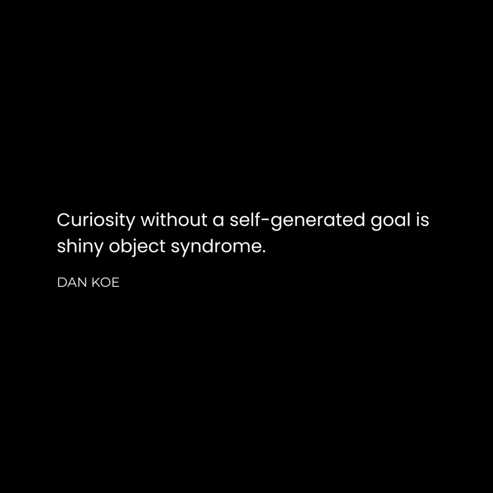
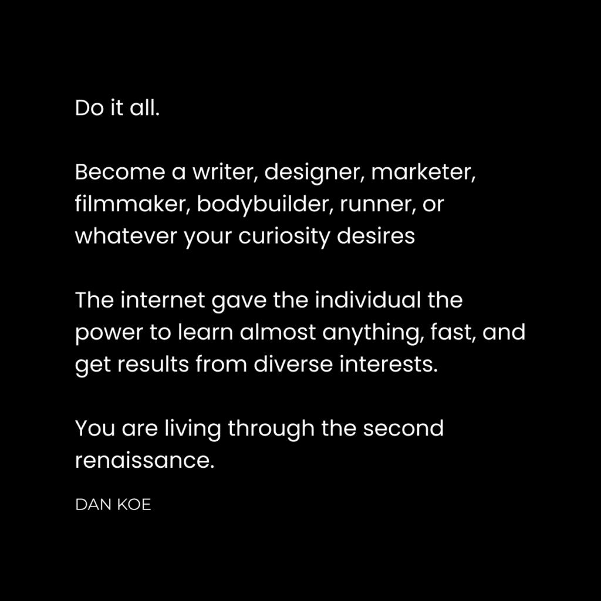

<iframe title="The Rise Of The Generalist – How To Thrive With Multiple Interests" width="800" height="450" src="https://www.youtube.com/embed/KTgakWW0Rzw?feature=oembed" frameborder="0" allow="accelerometer; autoplay; clipboard-write; encrypted-media; gyroscope; picture-in-picture; web-share" referrerpolicy="strict-origin-when-cross-origin" allowfullscreen=""></iframe>

We’re in the middle of a second renaissance.  

我们正身处第二次文艺复兴的中期。

But only a select few people can see what’s going on.  

但只有少数人能看到发生了什么。

Even fewer people are actually taking advantage of it.  

实际上，越来越少的人真正利用它。

Can you see it?  

你能看见它吗？

-   The creator economy is growing at an exponential rate.  
    
    创作者经济正在以指数速度增长。
-   People don’t trust traditional jobs or schooling to secure their future.  
    
    人们不相信传统工作或学校能够确保他们的未来。
-   People are turning to creators to educate them on the skills necessary to thrive in a fast-changing digital environment.  
    
    人们正转向创作者，让他们教授在快速变化的数字环境中蓬勃发展所需的技能。
-   AI, automation, and software have made business more accessible to people who want to do what they enjoy for a living.  
    
    人工智能、自动化和软件使得想要从事自己喜欢的工作的人更容易进入商业领域。
-   People are working less, earning more, and leveraging technology to remove themselves from the old society.  
    
    人们工作时间减少，收入增加，并利用技术摆脱传统社会。
-   People are craving human connection online from people with personalities, not glorified search engines who talk about one specialized interest.  
    
    人们渴望在网上与有个性的人建立人际关系，而不是只和谈论某一专业兴趣的搜索引擎打交道。

These are all connected to the fact that technology has changed the way we work, the opportunities we have for work, and what justifies valuable work.  

这些都与技术如何改变我们的工作方式、我们的工作机会以及有价值工作的定义有关。

If you want to do what you enjoy for a living, you’re living in the right time period.  

如果你想以自己喜欢的方式谋生，那么现在正是最好的时代。

The internet has decentralized wealth generation to individuals who value self-education, personal responsibility, and amounting to something in your life by doing good work.  

互联网已经将财富的生成分散给那些重视自我教育、个人责任，并通过努力工作在生活中取得成就的个人。

A few problems have led to this.  

一些问题导致了这种情况。

**1) Specialists compete with other specialists.  

专家之间相互竞争。**

A specialist is someone who attempts to achieve a goal with a single interest or skill.  

专家是指试图通过单一兴趣或技能来实现目标的人。

Like a bodybuilder with fitness.  

像一个健身达人。

Or only playing one role/class/character in a video game.  

或者只在视频游戏中扮演一个角色或职业。

Or performing a mechanical string of tasks at a job.  

在工作中执行一系列机械性任务。

Being a specialist made sense in the Industrial Age but not in the Information Age.  

在工业时代，成为专家是有意义的，但在信息时代却不再适用。

When a bodybuilder gets injured, they either get bored and stop making progress or start from scratch.  

当健美运动员受伤时，他们要么感到无聊并停止进步，要么从零开始。

When you get countered in a video game, or someone is already playing your role, you are at a massive disadvantage.  

当你在视频游戏中被反制，或者有人已经扮演了你的角色，你就 处于极大的劣势。

When your work consists of the same thing over and over again, not only are you a prime candidate for replacement, but life loses its zest because there is no challenge or novel goal that brings meaning to life… your time shrivels up because all you can focus on is working all day, being tired all night, paying the bills, hoping your family doesn’t leave you, and the rest.  

当你的工作重复枯燥时，不仅容易被替代，而且生活失去了乐趣，因为没有挑战或新目标赋予生活意义...你的时间变得枯燥无味，因为你只能专注于整天工作，整夜疲惫，支付账单，希望家人不会离开你，等等。

On the other hand, generalists are diverse and interesting.  

另一方面，综合性人才具有多样性和吸引力。

Most people think that in order to become successful, they have to be really good at one thing.  

大多数人认为，要成功，他们必须在一件事上表现得非常出色，但实际上成功并不一定需要只擅长一件事。

Social media has distorted how we perceive value.  

社交媒体扭曲了我们对价值的看法。

You don’t need chiseled six-pack abs and a spray tan to impress others and generate attention.  

你不需要拥有雕刻般的六块腹肌和喷涂棕色肌肤来吸引别人的注意和留下深刻印象。

Most people find it impressive to have a tiny bit of muscle mass, be able to do a few pull-ups and have a life outside of fitness.  

大多数人发现，拥有一点点肌肉量，能做几个引体向上，并且在健身之外还有自己的生活是令人印象深刻的。

Pair that with a writing hobby and some psychology knowledge and you open up a world of opportunities from random people on the internet (that you wouldn’t have been able to get in front of in the past).  

将写作爱好和一些心理知识结合起来，您将打开一扇通往互联网上陌生人世界的大门（这是您过去无法接触到的人群）。

In the second renaissance, you don’t need to be exceptional at one thing, you need to be average at many.  

在第二次文艺复兴中，你不需要在某一方面出类拔萃，而是需要在许多方面都表现平均才行。

**2) The internet favors the generalist.  

互联网更青睐全面发展的人。**

When I first started in business I was bombarded with the advice to “niche down.”  

当我刚开始做生意时，我被建议“找准细分市场”。

The riches are in the niches, so they say.  

有句话说“财富在于细分市场”。

And don’t just niche down a bit, niche _so far down_ that you only have a small pool of people you can help with the skill you’ve learned.  

不要只是稍微细分，要细分到只有一小群人才能用你学到的技能帮助。

It makes sense, but in my eyes, it’s outdated advice.  

这是有道理的，但在我看来，这些建议已经过时了。

Social media is at the forefront of attention.  

社交媒体正处于关注的焦点。

Things like paid ads and cold emails – you know, the things absolutely nobody likes doing – require you to get specific on your messaging so you can find, target, and get your work in front of specific people.  

诸如付费广告和冷邮件之类的事情 - 你知道的，绝对没有人喜欢做的事情 - 需要你在消息中变得更具体，这样你才能找到、定位并让你的工作出现在特定的人群面前。  

If you don’t understand this, take my free [one-person business foundations course](https://theone-personbusiness.com/).  

如果您不理解，请参加我免费的一人创业基础课程。

As marketing shifts more and more to organic content on social media, this just isn’t the case.  

随着营销越来越多地转向社交媒体上的有机内容，情况并非如此。

With content, your work is exposed to diverse audiences because that’s just how social media works.  

有了内容，您的工作会被展示给不同的受众，因为这就是社交媒体的运作方式。

-   The algorithm  
    
    算法
-   Reposts and shares  
    
    转发和分享
-   Comments from random people  
    
    从随机人士的评论中提取内容

They all launch you into unpredictable audiences.  

他们都会将你推向意想不到的观众中。

And, people aren’t on social media to learn or buy (at least when they log on to social media until they come across something beneficial to their lives).  

人们上社交媒体并不是为了学习或购买，至少在他们登录社交媒体时，直到他们发现对他们生活有益的东西为止。  

They’re there to be entertained. So, you need to adapt your strategy accordingly.  

他们在那里是为了寻求娱乐。因此，您需要相应地调整您的策略。

If your message is too niche, people will scroll right past it.  

如果您的消息过于专业化，人们会直接忽略它。

Instead, you have to attract a diverse audience with a range of interests and then _persuade_ them of the importance of the skill you aim to monetize.  

相反，您需要吸引各种兴趣的不同观众，然后说服他们您打算实现的技能的重要性。

If all you talk about is what you sell, people will catch on that fast.  

如果你只谈论你在销售的东西，人们会很快就会看穿。

I would rather have a diverse 100,000-follower audience than a niche 10,000-follower audience because I understand how to educate people.  

我宁愿拥有一个拥有 10 万多元素的观众，而不是一个特定领域的 1 万关注者，因为我知道如何教育人们。

I will teach you how to do this soon.  

我会很快教会你如何做到这一点。

**3) Labor work is more replaceable than ever.  

劳动工作比以往任何时候都更易被替代。**

Society has set you up to fail.  

社会已经让你注定失败。

We are in the middle of a spiritual war of beliefs.  

我们正身处一场信仰之战之中。

Older generations haven’t allowed their identity to be challenged with the changing landscape.  

旧一代人没有允许自己的身份在不断变化的环境中受到挑战。  

Their mind still lives in a time when it was smart to go to school, get a job, and work until you die with the possibility of a good retirement.  

他们的思维仍停留在一个认为上学、找工作，然后工作直到死去，并有可能获得良好退休的时代。

It’s not their fault… that’s just human nature.  

这并不是他们的错，那只是人性使然。  

It takes time for belief systems to evolve on a collective scale.  

信仰系统在集体层面上演变需要时间。

The problem is that people will claw and fight so that you don’t change.  

问题在于人们会拼命挣扎和争斗，不让你改变。  

As much as they say they do it out of love for you, the reality is that their identity is threatened when you do better than them.  

他们虽然声称是出于对你的爱，但实际上当你做得比他们好时，他们的身份就受到了威胁。

The path of the Second Renaissance Man requires mental strength and fortitude.  

第二文艺复兴人之路需要坚强的心智和毅力。

You must have conviction in your beliefs that you have more potential than getting a job that a robot can replace within 5-10 years.  

你必须坚信自己的信念，相信你拥有的潜力远远超过了在 5-10 年内会被机器人取代的工作。

I don’t need to tell you that most schooling and job options are outdated when you can go to any news or reporting site and see for yourself.  

我不需要告诉你，大多数学校和工作选择都已经过时，你只需打开任何新闻或报道网站，就能看到这一点。

## Why Generalists Thrive In The Creator Economy  

为什么全才在创作者经济中蓬勃发展

 

Only slaves are expected to perform one task for their entire life.  

只有奴隶被期望终身执行同一项任务。

That’s what our current education and employment system reflects.  

这正是我们当前教育和就业制度所体现的。

Wage slavery is a very real thing.  

工资奴役是一个非常现实的问题。

On the other hand, a “free man” is defined as someone who acts on their interests and does many things throughout their life.  

另一方面，“自由人”被定义为那些根据自己的利益行事并在一生中做许多事情的人。

If you don’t create a goal, you will be assigned one, and society is great at handing out goals to those who can’t think for themselves.  

如果您不设定目标，将会被分配一个，而社会擅长为那些无法为自己思考的人设定目标。

A generalist is someone who learns all relevant knowledge and skills out of interest of achieving a goal in their life.  

通才是指一个人出于兴趣学习所有相关的知识和技能，以实现他们生活中的目标。

This came naturally for me, as I’m sure it has for many people reading this.  

这对我来说很自然，我相信对于阅读这篇文章的许多人来说也是如此。

I’m grateful I have an audience that can relate to my failures.  

我很感激有一群观众能够理解我的失败。

So, for those who are in the trenches, I want to provide some clarity.  

那些身处一线的人，我想为他们提供一些澄清。

I failed at dropshipping, e-commerce, SEO, digital art, and more.  

我在跌打运输、电子商务、SEO、数字艺术等领域都失败了。

But in the pursuit of my business goals, I stacked an irreplaceable set of skills.  

但在追求我的业务目标时，我获得了一套无法替代的技能堆栈。

One or two skills didn’t bring me much in terms of results.  

一项或两项技能并没有给我带来太多成果。

But five… six… seven skills allowed me to spot and act on profitable opportunities because I had more tools to solve more problems.  

但是五…六…七种技能让我能够发现并抓住有利可图的机会，因为我有更多的工具来解决更多的问题。

Dropshipping taught me branding so I could stand out from bigger brands with low shipping times.  

代销教会我品牌营销，让我能够在低运输时间的情况下脱颖而出。

E-commerce taught me advertising and product design so I could be more attention-grabbing.  

电子商务教会我如何进行广告和产品设计，让我更具吸引力。

Digital art taught me graphic design and the nuances of building an audience on social media.  

数字艺术让我领悟到平面设计的技巧，以及在社交媒体上吸引受众的要领。

_Notice how I didn’t study endless tutorials to learn those skills.  

请注意，我并没有通过学习无穷无尽的教程来掌握这些技能。  

I set a goal of working for myself, started a project, and practiced those skills while educating myself along the way.  

我设定了一个目标，要为自己工作，开始了一个项目，并在学习的过程中练习这些技能，一路上不断提升自己。_

All of those “failures” were the reason I can do what I do today.  

所有这些“失败”都是我今天能做的原因。

There are 2 reasons why this story matters.  

这个故事之所以重要有两个原因。

### 1) Failure Stacking Makes You Irreplaceable  

1) 失败叠加使您不可替代

Most people know what “skill stacking” is.  

大多数人知道什么是“技能堆叠”。

It’s like a diversified stock portfolio.  

就像一个多元化的股票投资组合一样。

Rather than investing all of your money in one stock – like a specialist – that sets you up for catastrophe, you invest in various stocks to increase your chances at success.  

不要把所有的钱都投资在一只股票上，就像一个专家一样，这会让你陷入灾难之中。你应该投资于不同的股票，增加成功的机会。

Even if one stock drops, a few others may go up and you will still be at a profit.  

即使一只股票下跌，其他几只可能上涨，你仍然会盈利。

If you were going to be in the NBA or have a platinum album, you would know by now.  

如果你真的要进入 NBA 或拥有白金专辑，你早就知道了。

Being the best at one specific thing is statistically near impossible.  

在某一特定领域成为最优秀的几乎是不可能的统计事实。

Now, being top 25% in the few areas you find interesting… that’s pretty easy.  

现在，在你感兴趣的几个领域中跻身前 25％… 这相当容易。

To make this more digestible, let’s reframe “skill stacking” as “failure stacking.”  

为了更容易理解，让我们将“技能堆叠”重新解释为“失败堆叠”。

Acquiring a skill puts you in the mindset that you just need to study and learn all day.  

学习一项技能会让你觉得只需要整天学习和进步。

Acquiring a failure assumes that you are actively working toward a goal and gaining actual experience.  

遭遇失败意味着您正在积极追求目标并积累实际经验。

-   **Identify a goal in your life** – like quitting your job, finding a partner, or getting fit.  
    
    确定生活目标 - 例如辞职、找到伴侣或变得健康。
-   **Start with what you know** – you can only know what to learn when you hit a roadblock, so hit one fast.  
    
    从你已知的出发 - 只有当你遇到困难时，你才能明白应该学什么，所以要尽快遇到困难。
-   **Pursue your curiosity** – let your experience guide you into new paths to experiment with.  
    
    追求你的好奇心 - 让经验指引你踏上新的探索之路。

All of these will overlap eventually.  

所有这些最终都会相互重叠。

Starting in fitness can introduce you to diet models to try, training programs to test, and lifestyle changes to implement.  

开始健身可以让你了解不同的饮食模式、尝试不同的训练计划，以及实施生活方式的改变。

Once you get to the top 25%, which isn’t much in fitness, you can explore new routes.  

一旦你跻身前 25％，尽管在健身领域这并不算多，你就可以探索新的途径。

Maybe you want to start a career in fitness, so you start writing on the internet and building an audience.  

也许你想要在健身领域开启职业生涯，因此你开始在互联网上写作并建立受众群体。

Again, once you get to the top 25%, which again isn’t much, you can start adding to your results by branching out.  

再次，一旦您达到前 25％，虽然这并不多，但您可以通过拓展来进一步提升您的成果。

You can study philosophy to add depth to your writing, design to enhance your brand, or really anything as a creator – and that’s why generalists thrive.  

作为创作者，你可以通过学习哲学来为你的写作增添深度，为品牌增添设计，或者实现任何创意 - 这就是通才蓬勃发展的原因。

### 2) The Most Profitable Niche Is You  

2) 最有利可图的细分市场就是你

The creator economy – not to be confused with the influencer economy – is characterized by individuals who pursue their interests and document their knowledge.  

创作者经济 - 与影响者经济不同 - 是由追求个人兴趣并记录知识的个人所特征化的。

Nobody wants to follow a glorified search engine that talks about the same thing all the time.  

没有人愿意跟随一个整天谈论同样事情的被美化的搜索引擎。

Many creators tell me they are afraid to branch out into new interests because they have trouble understanding how that will work.  

许多创作者告诉我，他们害怕尝试新的兴趣领域，因为他们难以理解如何进行。

All you have to do is look at everyone you follow. Are they talking about _one_ thing? Are they actually?  

你只需看看你关注的每个人。他们在讨论同一个话题吗？他们真的在吗？

Or are they giving their opinions, beliefs, knowledge, and snippets of their life experience packaged up into impactful content?  

他们是在分享他们的观点、信仰、知识和生活经验，创作出有影响力的内容吗？

“But Dan, what do I sell then?”  

但是丹，那我应该卖什么呢？

That’s where things get tricky.  

这就是问题变得复杂的地方。

## How To Earn A Living As A Generalist  

如何成为通才并谋生

 

The first step to earning a living as a generalist is choosing a career path that doesn’t box you into one specific skill or interest.  

成为通才谋生的第一步是选择一条职业道路，不要让自己被困在一个特定的技能或兴趣中。

In other words, you need to become an entrepreneur.  

换句话说，你需要开始创业。

But that alone doesn’t cut it.  

但仅凭这一点还不够。

You can easily get trapped in a specific niche with work you no longer find meaningful.  

你很容易陷入一个你不再觉得有意义的特定领域的工作中。

As mentioned, you are in the second renaissance.  

正如提到的，您正身处第二次文艺复兴。

Social media is the new town square.  

社交媒体就像新时代的城市广场。

Creators are the new Renaissance men.  

创作者们是新文艺复兴时代的多面手。

Creators are the decentralized education system.  

创作者是分散式教育体系。

Creators are the new economy.  

创作者们是新经济的推动者。

Stop thinking of a “creator” as some new internet job. Think of it as a part of life.  

不要把“创造者”看作是一种新的互联网工作，而是将其视为生活的一部分。  

You already spend most of your day on your phone.  

你已经大部分时间都在手机上了。  

To act like social media isn’t engrained in humanity at this point is foolish.  

在这一点上，认为社交媒体不是人类根深蒂固的一部分是愚蠢的。  

Being a “creator” is just expressing your value in the digital world rather than being a slave to it on the sidelines.  

成为“创作者”意味着在数字世界中展现自己的价值，而不是被边缘化成为它的奴隶。

You probably follow creators for education and entertainment because they present beliefs and opportunities different from what you’ve been told.  

你可能关注创作者是为了教育和娱乐，因为他们呈现的信念和机会与你之前所接触到的不同，带来新的视野。

Ideas shape society, and it’s happening right before your eyes.  

想法塑造社会，而且这就在你眼前发生着。

Creators are earning an independent income by teaching what they know by pursuing their interests.  

创作者们通过分享自己的知识并追求兴趣赚取独立收入。

They solve problems in their life and sell the solution.  

他们解决生活中的问题并将解决方案销售出去。

Some sell stylish blue light glasses to help with sleep.  

有些人销售时尚的蓝光眼镜，以帮助改善睡眠。  

Some sell business advice because college professors probably don’t own a business (unless they are teaching out of passion and sitting on wads of cash), so creators are some of the few qualified to teach it.  

一些人销售商业建议，因为大学教授可能没有自己的企业（除非他们出于激情教学并坐拥一大笔现金），所以创作者是少数有资格教授的人之一。  

Some sell productivity systems, psychology practices, and meditations.  

一些人销售生产力系统、心理学实践和冥想。

If you don’t see this, it’s probably time to unfollow everyone and start searching for new pockets of the internet that create the society you want to see in the world.  

如果您没有看到这一点，可能是时候取消关注所有人，开始寻找在互联网上打造您希望在世界中看到的社会的新空间。  

Your attention is going somewhere, might as well fuel what you believe in (and what you want to become).  

您的注意力正投向某个方向，何不支持您所信仰的事物（以及您想要成为的样子）。

Let’s start there. How do you begin earning a living?  

让我们从那里开始。你是如何开始谋生的呢？

### Build A General Audience  

制作一个通用受众

I’m not a fan of building “niche” or specific audiences.  

我不喜欢建立“利基”或特定的受众群体。

I am a fan of helping your audience reach a big goal with whatever skills, interests, and ideas help them get there.  

我是一个支持者，希望能够帮助您的观众通过各种技能、兴趣和想法实现重要目标。

When people tell you to build a niche audience in a specific topic, they usually don’t realize that’s not what they are doing.  

当人们告诉你要在特定主题中建立一个利基受众时，他们通常没有意识到他们实际上并非如此。

They say that, and then they go on to give random mindset tips, discuss their beliefs, post about their lives, and discuss their other interests.  

他们说这些话，然后继续分享一些随机的心态建议，谈论他们的信仰，发表关于生活的帖子，以及讨论其他兴趣。

Before anything else, why build an audience?  

在做任何事情之前，为什么要建立观众？

Because you need attention and people if you want to make an independent income.  

因为你需要关注和人际关系，如果你想要获得独立的收入。

You can no longer rely on your boss to generate attention with a marketing department that sells their product.  

您不能再依赖您的老板通过营销部门来吸引注意力，销售他们的产品。  

You have to do it all yourself.  

你必须亲自完成所有事情。

Building an audience is the most accessible way for beginners to do this.  

建立受众是初学者最容易的方法之一。  

All you need is an internet connection, a few ideas, and the ability to type on your keyboard.  

你只需要一台能上网的电脑，一些创意，和打字的技能。  

I teach this in [2-Hour Writer](https://2hourwriter.com/).  

我在《2 小时作家》课程中教授这个内容。

To make this simple:  

为了简单起见：

-   **Choose a big goal** – Is it financial freedom? Is it a fit body? Is it self-actualization?  
    
    设定一个宏伟的目标 - 是追求财务自由？还是拥有健康的身体？还是实现自我？  
    
    The purpose of a value creator – someone focused on value and education rather than entertainment and looks – is to help people improve their mind, body, business, and relationships.  
    
    价值创造者的目的是帮助人们提升头脑、身体、事业和人际关系，而非专注于娱乐和外表。
-   **List out skills, interests, and beliefs** – What do people need to know in order to reach that goal?  
    
    列出技能、兴趣和信念 - 为了实现这个目标，人们需要了解什么？  
    
    The combination of these is what makes you unique.  
    
    你独特的特质源自于这些元素的结合。
-   **Frame everything you write through the lens of achieving that goal** – If you want to talk about basket weaving for some reason, do it, but talk about how it benefits your life as a fun hobby that helps with creativity and mental clarity.  
    
    在写作时要始终以实现目标为出发点 - 如果你想谈论编织篮子，可以这样做，但要谈论它如何作为一项有趣的爱好来提升生活质量，促进创造力和思维清晰度。

Let’s say the goal I’m helping people achieve is financial freedom.  

假设我帮助人们实现的目标是实现财务自由。

I talk about creativity, psychology, writing, and human potential to help people get there.  

我谈论创造力、心理学、写作和人类潜力，旨在帮助人们实现自身潜能。

Someone else can choose something completely different, like performance/health, budgeting, and spirituality.  

别人可以选择完全不同的事物，例如表现/健康、预算和灵性。

Both have the same big goal that everyone wants – financial freedom – with completely different ways of getting there.  

两者都追求同一个伟大目标，即每个人都渴望的财务自由，但实现方式却大相径庭。

The problem most creators face is that they either don’t have a goal to frame their content, don’t choose a goal that people want, or choose a goal so small that they attract a small audience.  

创作者面临的问题是，他们要么没有明确的目标来塑造他们的内容，要么选择了人们不感兴趣的目标，要么选择了一个太小的目标，以至于只吸引了少数观众。

The bigger the goal, the bigger your potential audience and the more unique you can be.  

目标越大，你的潜在受众就越广，你也就能展现更多独特之处。

### Make Noise, Find Signal  

制造噪音，寻找信号

Most creators struggle to start writing because they don’t know what to write about.  

大多数创作者在开始写作时会遇到困难，因为他们不知道该写什么。

1.  Just start writing. Nobody is watching when you have zero followers.  
    
    只要开始写作。当你还没有粉丝时，没有人在关注你。
2.  If your friends follow you, good.  
    
    如果你的朋友跟随你，那很好。  
    
    Maybe it’s finally time for them to learn who you really are and potentially join you.  
    
    或许现在是时候让他们了解真正的你，并有可能加入你。  
    
    And if they don’t like it, maybe they don’t really care about you, and you should find that out now instead of later.  
    
    如果他们不喜欢，也许他们并不真正在乎你，你应该现在就弄清楚，而不是等到以后。
3.  Write about all of your interests.  
    
    记述你所有的兴趣。  
    
    Make a lot of noise and let your audience decide what they want to hear more of from you.  
    
    制造很多噪音，让你的观众决定他们更想听什么。  
    
    A few poorly performing posts aren’t the end of the world; it’s data.  
    
    一些表现不佳的帖子并不是世界末日；这只是数据而已。

Of course, posting good content is only one aspect of social growth.  

当然，发布优质内容只是社交增长的一个方面，但并不是全部。  

You have to understand social media as a skill if you want to grow. I talk about that skill in [How To Actually Build An Audience On Social Media](https://thedankoe.com/letters/how-to-actually-grow-on-social-media-what-they-dont-tell-you/).  

如果你想要成长，就必须把社交媒体视为一种技能。我在《如何在社交媒体上真正建立受众》中详细讨论了这一技能。

Next question: how do I write?  

下一个问题：我应该怎么写？

First, make a list of content ideas based on your interests.  

首先，根据您的兴趣制定一个内容创意清单。

Second, focus on the “how” and “why.”  

其次，专注于“如何”和“为什么”。

Third, write out the post.  

第三步，撰写这篇文章。

Fourth, filter it through your big goal.  

从你的宏伟目标出发，筛选出它。

Let’s say I’m writing about psychology.  

假设我正在写关于心理学。

Some topics include:  

一些主题包括：

-   How do I manage my emotions? Create a list of steps.  
    
    如何管理我的情绪？制定一个步骤清单。
-   Why should I manage my emotions? Think of compelling reasons from experience.  
    
    为什么要管理情绪？从经验中找出令人信服的理由。

Frame it through a big goal like financial freedom, and you have a post:  

以财务自由这样一个宏伟的目标为框架，你就有了一个立场：

> How to manage your emotions:  
> 
> 如何管理自己的情绪：
> 
> -   Become aware of negative reactions  
>     
>     意识到负面反应并加以处理
> -   Pause before you act on them  
>     
>     在采取行动之前先停下来思考
> -   Stay quiet or make a better decision  
>     
>     保持安静或做出更明智的决定
> 
> When you repeat this process, you reprogram your mind to be less negative.  
> 
> 当您反复进行这个过程时，您重新调整思维，变得更加积极。
> 
> Life, money, and relationships will flow with ease.  
> 
> 生活、金钱和人际关系将会顺畅发展。

All it takes is a small mention of your big goal for it to be impactful.  

只需稍微提及一下您的宏伟目标，就能产生深远影响。

Why are we focused on illustrating the “why” or importance of an idea?  

我们为什么要专注于阐明一个想法的“为什么”或重要性？

Because people whine a lot and experiment little.  

因为人们经常抱怨，却很少尝试新事物。

“Dan, how can I talk about my interests if nobody is interested in them?”  

丹，如果没有人对我的兴趣感兴趣，我怎么谈论我的兴趣呢？

That’s not their fault. It’s yours.  

这不是他们的错，而是你的。  

Your interests aren’t interesting because you don’t make them interesting.  

你的兴趣之所以不引人注目，是因为你没有让它们变得有趣。

If you _became_ interested in them, that means there’s a series of thoughts and ideas that can make it important to someone else.  

如果你对它们感兴趣，那就意味着存在一系列的想法和观念，可以使它对其他人变得重要。

You weren’t born with that interest. You were programmed into it.  

你并不是天生对那个兴趣感兴趣的。而是被灌输进去的。  

You were persuaded of its importance and adopted it to help you achieve your goals in life.  

你被其重要性所说服，并采纳它来帮助你实现生活目标。

This does require you to think. It probably won’t be that easy the first time around.  

这确实需要你思考。第一次可能不会那么容易。

### Establish Authority With A Digital Asset  

通过数字资产建立权威

At this point, you are writing quite a few posts.  

现在，您已经写了相当多的帖子。

You should review their performance every week to see which ideas did better than others.  

您应该每周审查他们的表现，了解哪些想法比其他更为出色。  

It should be obvious which ones they are.  

应该很明显它们是哪些。

You can look for better writing or more engagement.  

你可以寻找更好的写作方式或者更多的互动。

From there, you want to make the most of those ideas:  

从那里开始，您希望充分发挥这些想法的价值：

-   Turn them into longer-form content like a thread, carousel, newsletter, or video.  
    
    将它们转化为更长的内容形式，如帖子、轮播、通讯或视频，以便更好地展示。
-   Rewrite that post from multiple angles to consistently get more engagement.  
    
    从多个角度重新撰写那篇帖子，以持续获得更多互动。
-   Bake that topic into your writing routine and make it a part of your brand.  
    
    将该主题融入您的写作日常，并使其成为品牌的一部分。

If that topic continues to do well for you, establish a piece of your authority in that topic by creating a digital asset.  

如果您在某个主题上表现不错，可以通过创建数字资产来巩固在该主题上的权威地位。

Create a free product. Pin a thread or carousel to your profile.  

创建一个免费产品，并将一个帖子或轮播图固定到您的个人资料上。  

Write it down as a potential starting point for a digital product.  

将其记录下来，作为数字产品的潜在起点。  

This is what we do in my new course [Mental Monetization](https://mentalmonetization.com/) to monetize your creative work. It launches on June 3rd when the early bird price increases.  

这是我们在我的新课程《心智变现》中所做的事情，帮助你变现创意作品。6 月 3 日正式上线，早鸟价即将结束。

Why do we do this?  

为什么我们要这样做呢？

So you don’t feel like you have to keep repeating yourself and box yourself into a niche.  

所以您不必觉得自己必须不断重复自己并将自己局限在一个特定领域。

A free product will contain almost everything you know on the topic.  

一个免费的产品将包含关于这个主题的几乎所有你所了解的内容。

Instead of writing endless content on that, you can just send them to the free product or they can read your pinned thread.  

而不是无休止地写内容，您可以直接将它们发送到免费产品，或者让他们阅读您的置顶帖子。

This gives you room to continue experimenting with new ideas to diversify your brand and make it irreplaceable as a generalist.  

这为您提供了继续尝试新想法的空间，使您的品牌多样化，并使其成为通才，不可替代。

As you make noise and find signal, you will solidify the signal as a part of your brand by consistently repurposing that idea and creating new free products to get people on your email list.  

当您制造噪音并找到信号时，通过持续重新利用这个想法并创建新的免费产品来巩固信号，将其作为品牌的一部分，并吸引人们加入您的电子邮件列表。

### Build A Portfolio Of Income Sources  

打造多元收入来源组合

As a generalist, we can look to a few people for inspiration.  

作为一名综合性专家，我们可以从一些人身上获得灵感。

First, there’s Zuby.  

首先，这里有 Zuby。

He’s a rapper, fitness buff, and political commentator.  

他是一位说唱歌手、健身爱好者和政论评论员。

With a rather general audience, he promotes his music, fitness ebook, and public speaking gigs.  

他面向广泛的观众推广他的音乐、健身电子书和公开演讲。  

He isn’t boxed into one specific topic and that’s what allows him to stand out.  

他不被限制在一个特定的话题上，这正是让他脱颖而出的原因。

I’d like to think of myself as another example.  

我愿意把自己看作另一个例子。

Even though I started out in web design, that didn’t stop me from talking about emotional management and self-improvement.  

尽管我最初是从事网页设计的，但这并没有阻止我谈论情绪管理和自我提升。

It didn’t stop me from building more products like a physical planner and self-help ebook (The Path To Power that was complete sh\*t but allowed me to get better and eventually write and publish a full book).  

它没有阻止我继续制作更多产品，比如实体日程安排和自助电子书（《通往力量之路》虽然糟糕透顶，但却让我进步，最终写作并出版了一本完整的书）。

As my audience grew thanks to attracting people with big goals of achieving more in their life, I was able to pivot out of web design into writing, productivity, branding, and marketing.  

随着吸引那些有着更多生活目标的人群，我的受众不断增长，我得以从网页设计转向写作、生产力、品牌和营销，逐渐实现转变。

I wouldn’t even say those are my interests. I honestly talk about whatever ideas are on my mind.  

我甚至不会说那些是我的兴趣。我会真诚地谈论我脑海中的任何想法。  

Because if they are important to me with the goals I have, they can _become_ important to someone else with those shared goals, which is quite a few people.  

因为如果它们对我很重要，与我设定的目标相关，它们也可以对其他有相同目标的人变得重要，而这样的人还有很多。

In brief, launch products around the ideas that do well for you.  

简单来说，围绕对你有利的想法推出产品。

Monetize with courses, cohorts, templates, systems, tutorials, or whatever else will help people achieve a smaller goal that helps them get a few steps closer to the big goal.  

通过课程、小组、模板、系统、教程或其他方式，帮助人们实现一个小目标，从而让他们更接近实现大目标。

Every 3-6 months, launch at least one free product and one paid product until you have a brand and business you are satisfied with.  

每 3-6 个月，推出至少一个免费产品和一个付费产品，直到您拥有一个令您满意的品牌和业务。

Once you have _cash flow,_ then you can consider building a product that requires capital and a large audience of people to sell.  

一旦您有现金流，您就可以考虑开发需要资金和大量受众才能销售的产品。  

I wasn’t raised in a wealth family.  

我并不是在一个富裕的家庭长大。  

I never had capital to invest. I had to create my own substantial income source to be able to do thing like publish my own book and build a software startup.  

我从未有过资本投资。我必须创造自己的可观收入来源，才能做像出版自己的书和建立软件创业公司这样的事情。

That’s how you earn a living as a generalist in a world going digital.  

这就是你在一个数字化的世界中作为通才谋生的方式。

Thank you for reading and enjoy the rest of your day.  

感谢您的阅读，祝您享受余下的一天。

– Dan  

丹（来源）
