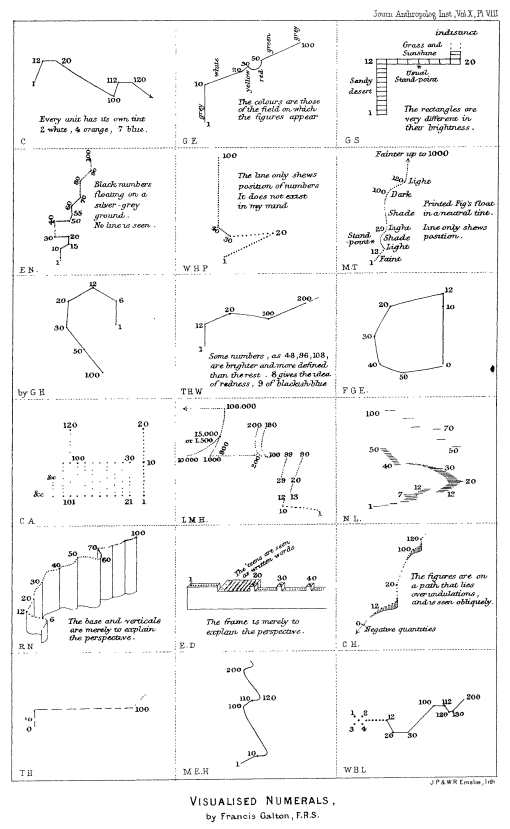
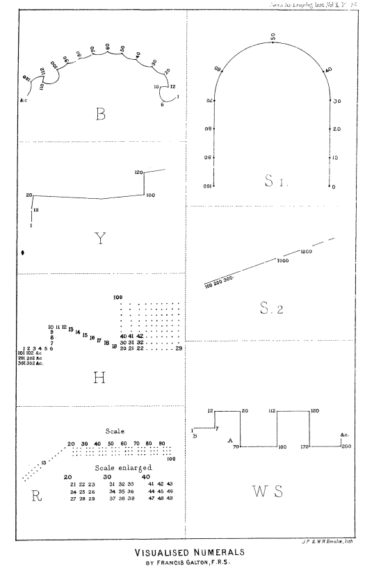
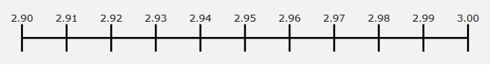
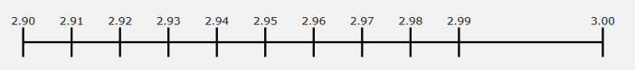
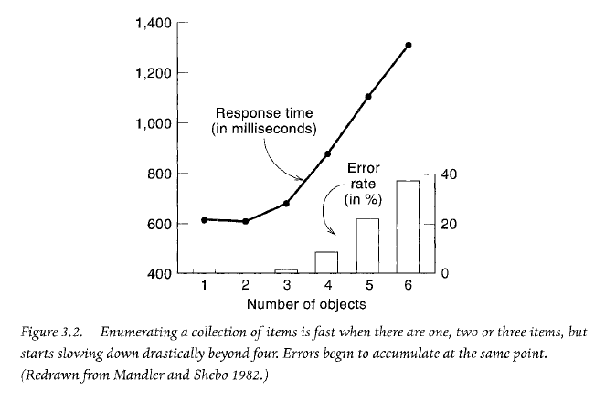
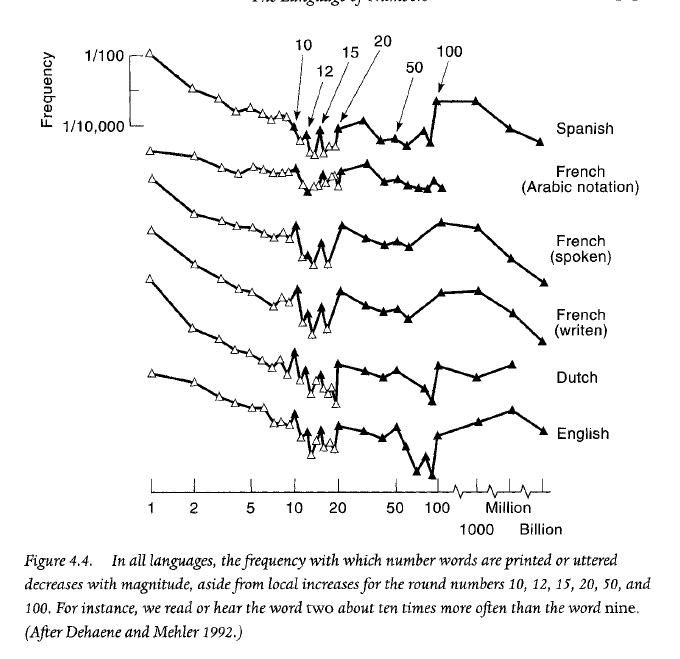
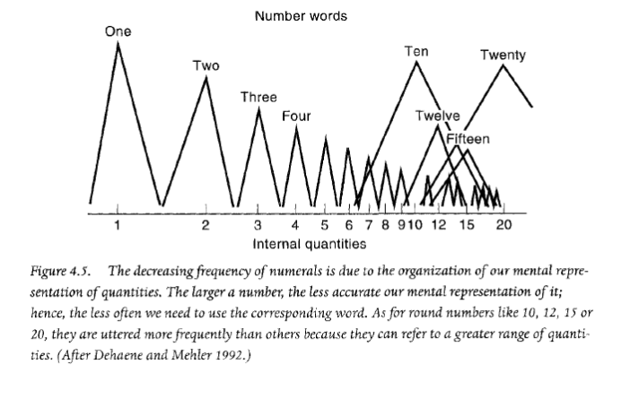

I once worked at a company that priced everything with a .95 ending.  

我曾在一家公司工作，他们定价时总是以.95 结尾，这是他们的惯例。  

The bestselling software package was $999.95. Add-on products were $9.95, or $19.95, or $49.95. Everything ended with a .95. It had been this way for more than twenty years.  

畅销软件包的价格为$999.95。附加产品的价格分别为$9.95，$19.95 和$49.95。所有价格都以.95 结尾，这种情况已经持续了二十多年。

One day, one of the VPs suggested we change all prices to end in .99. The rationale was that raising prices from .95-endings to .99-endings would net an extra four cents for every transaction.  

有一天，其中一位副总裁建议我们将所有价格改为以.99 结尾。其理由是，将价格从.95 结尾提高到.99 结尾将为每笔交易增加四分钱。

But would that really happen? According to traditional economics, no.  

但这真的会发生吗？根据传统经济学的观点，不太可能。  

That’s because traditional economics predicts that raising a price results in fewer units—and fewer units, even at a higher price, means less revenue.  

这是因为传统经济学预测提高价格会导致销售更少的单位，即使以更高的价格销售更少的单位也意味着收入减少。

Flash forward a few years. Different company, same question.  

几年后，快进。换了家公司，同样的问题。  

We’re sitting around a conference table discussing pricing strategy for an upcoming product.  

我们正围坐在会议桌旁，讨论即将推出产品的定价策略。  

The VP leading the meeting smacks our competitor’s catalog onto the table.  

会议主持人副总裁将我们竞争对手的目录砰地一声摔在桌子上。  

As we review our competitor’s products, we notice they price some of their products with .99-endings and others with .00-endings.  

在审查竞争对手的产品时，我们注意到他们有些产品定价以.99 结尾，而另一些产品则以.00 结尾。

Why? Did they know something we didn’t?  

为什么？他们知道我们不知道的事情吗？  

Do .99-ending prices make more money—but only some of the time?  

.99 结尾的价格会带来更多收益吗？但并非始终如此？

To answer these questions, we need to take a deep dive into how the mind perceives numbers—and how that affects consumer behavior.  

要回答这些问题，我们需要深入了解大脑如何感知数字，以及这如何影响消费者行为。

## 3 ways .99-ending prices affect your spending habits  

.99 结尾的价格如何影响您的消费习惯：3 种方式

### 1\. .99-ending prices make you spend more money  

.99 结尾的价格会让你花更多的钱

In one of the [first-ever studies on 9-ending prices](http://web.mit.edu/simester/Public/Papers/Effectsof$9.pdf), a national mail order company sent out their catalog to three group of people.  

在第一批有关以 9 结尾的价格的研究中，一家全国性邮购公司向三组人群发送了他们的目录。  

Each group got a slightly different version of the catalog.  

每个小组收到了略有不同版本的目录。

1.  The first group saw 9-ending prices for the four dresses, such as $39.  
    
    第一组看到了四件连衣裙的价格以 9 结尾，比如 39 美元。
2.  The second group saw prices that were $5 more—$44 instead of $39.  
    
    第二组看到的价格是 44 美元，比 39 美元贵了 5 美元。
3.  The third group saw prices that were $5 _less_—or $34 instead of $39.  
    
    第三组看到的价格比原价低$5，为$34，而不是$39。

These tests were run with four dresses at four prices: $39, $49, $59, $69.  

这些测试是以四种价格分别为$39、$49、$59 和$69 的连衣裙进行的测试。

The group that saw the 9-ending prices purchase more dresses and spent more money.  

看到价格以 9 结尾的群体购买了更多的连衣裙，并且花费了更多的钱。  

The 9-ending prices earned 48% more revenue over prices that were $5 _more_, and 53% more revenue over prices that were $5 _less_.  

以 9 结尾的价格比高出 5 美元的价格的收入高出 48%，比低于 5 美元的价格的收入高出 53%。

<table data-immersive-translate-walked="eca2d80a-93a8-487f-9500-05a753d18362"><tbody data-immersive-translate-walked="eca2d80a-93a8-487f-9500-05a753d18362"><tr data-immersive-translate-walked="eca2d80a-93a8-487f-9500-05a753d18362"><td><strong>Prices</strong></td><td data-immersive-translate-walked="eca2d80a-93a8-487f-9500-05a753d18362"></td><td data-immersive-translate-walked="eca2d80a-93a8-487f-9500-05a753d18362"></td><td data-immersive-translate-walked="eca2d80a-93a8-487f-9500-05a753d18362"></td></tr><tr data-immersive-translate-walked="eca2d80a-93a8-487f-9500-05a753d18362"><td><strong>Item</strong></td><td data-immersive-translate-walked="eca2d80a-93a8-487f-9500-05a753d18362"><strong data-immersive-translate-walked="eca2d80a-93a8-487f-9500-05a753d18362" data-immersive-translate-paragraph="1">9-ending prices 价格以 9 结尾</strong></td><td data-immersive-translate-walked="eca2d80a-93a8-487f-9500-05a753d18362"><strong data-immersive-translate-walked="eca2d80a-93a8-487f-9500-05a753d18362" data-immersive-translate-paragraph="1">$5 less 5 美元更少</strong></td><td data-immersive-translate-walked="eca2d80a-93a8-487f-9500-05a753d18362"><strong data-immersive-translate-walked="eca2d80a-93a8-487f-9500-05a753d18362" data-immersive-translate-paragraph="1">$5 more 再加$5</strong></td></tr><tr data-immersive-translate-walked="eca2d80a-93a8-487f-9500-05a753d18362"><td data-immersive-translate-walked="eca2d80a-93a8-487f-9500-05a753d18362" data-immersive-translate-paragraph="1">Dress #1 这件第一件连衣裙</td><td data-immersive-translate-walked="eca2d80a-93a8-487f-9500-05a753d18362">&nbsp;$ 39.00</td><td data-immersive-translate-walked="eca2d80a-93a8-487f-9500-05a753d18362">&nbsp;$&nbsp;&nbsp;&nbsp; 34.00</td><td data-immersive-translate-walked="eca2d80a-93a8-487f-9500-05a753d18362">&nbsp;$&nbsp;&nbsp;&nbsp; 44.00</td></tr><tr data-immersive-translate-walked="eca2d80a-93a8-487f-9500-05a753d18362"><td data-immersive-translate-walked="eca2d80a-93a8-487f-9500-05a753d18362" data-immersive-translate-paragraph="1">Dress #2 第二件衣服</td><td data-immersive-translate-walked="eca2d80a-93a8-487f-9500-05a753d18362">&nbsp;$ 49.00</td><td data-immersive-translate-walked="eca2d80a-93a8-487f-9500-05a753d18362">&nbsp;$&nbsp;&nbsp;&nbsp; 44.00</td><td data-immersive-translate-walked="eca2d80a-93a8-487f-9500-05a753d18362">&nbsp;$&nbsp;&nbsp;&nbsp; 54.00</td></tr><tr data-immersive-translate-walked="eca2d80a-93a8-487f-9500-05a753d18362"><td data-immersive-translate-walked="eca2d80a-93a8-487f-9500-05a753d18362" data-immersive-translate-paragraph="1">Dress #3 第三件连衣裙</td><td data-immersive-translate-walked="eca2d80a-93a8-487f-9500-05a753d18362">&nbsp;$ 59.00</td><td data-immersive-translate-walked="eca2d80a-93a8-487f-9500-05a753d18362">&nbsp;$&nbsp;&nbsp;&nbsp; 54.00</td><td data-immersive-translate-walked="eca2d80a-93a8-487f-9500-05a753d18362">&nbsp;$&nbsp;&nbsp;&nbsp; 64.00</td></tr><tr data-immersive-translate-walked="eca2d80a-93a8-487f-9500-05a753d18362"><td data-immersive-translate-walked="eca2d80a-93a8-487f-9500-05a753d18362" data-immersive-translate-paragraph="1">Dress #4 第四件连衣裙</td><td data-immersive-translate-walked="eca2d80a-93a8-487f-9500-05a753d18362">&nbsp;$ 79.00</td><td data-immersive-translate-walked="eca2d80a-93a8-487f-9500-05a753d18362">&nbsp;$&nbsp;&nbsp;&nbsp; 74.00</td><td data-immersive-translate-walked="eca2d80a-93a8-487f-9500-05a753d18362">&nbsp;$&nbsp;&nbsp;&nbsp; 84.00</td></tr></tbody></table>

<table data-immersive-translate-walked="eca2d80a-93a8-487f-9500-05a753d18362"><tbody data-immersive-translate-walked="eca2d80a-93a8-487f-9500-05a753d18362"><tr data-immersive-translate-walked="eca2d80a-93a8-487f-9500-05a753d18362"><td data-immersive-translate-walked="eca2d80a-93a8-487f-9500-05a753d18362"><strong data-immersive-translate-walked="eca2d80a-93a8-487f-9500-05a753d18362" data-immersive-translate-paragraph="1">Units purchased 购买的数量</strong></td><td data-immersive-translate-walked="eca2d80a-93a8-487f-9500-05a753d18362"></td><td data-immersive-translate-walked="eca2d80a-93a8-487f-9500-05a753d18362"></td><td data-immersive-translate-walked="eca2d80a-93a8-487f-9500-05a753d18362"></td></tr><tr data-immersive-translate-walked="eca2d80a-93a8-487f-9500-05a753d18362"><td><strong>Item</strong></td><td data-immersive-translate-walked="eca2d80a-93a8-487f-9500-05a753d18362"><strong data-immersive-translate-walked="eca2d80a-93a8-487f-9500-05a753d18362" data-immersive-translate-paragraph="1">9-ending prices 价格以 9 结尾</strong></td><td data-immersive-translate-walked="eca2d80a-93a8-487f-9500-05a753d18362"><strong data-immersive-translate-walked="eca2d80a-93a8-487f-9500-05a753d18362" data-immersive-translate-paragraph="1">$5 less 5 美元更少</strong></td><td data-immersive-translate-walked="eca2d80a-93a8-487f-9500-05a753d18362"><strong data-immersive-translate-walked="eca2d80a-93a8-487f-9500-05a753d18362" data-immersive-translate-paragraph="1">$5 more 再加$5</strong></td></tr><tr data-immersive-translate-walked="eca2d80a-93a8-487f-9500-05a753d18362"><td data-immersive-translate-walked="eca2d80a-93a8-487f-9500-05a753d18362" data-immersive-translate-paragraph="1">Dress #1 这件第一件连衣裙</td><td>21</td><td>16</td><td>17</td></tr><tr data-immersive-translate-walked="eca2d80a-93a8-487f-9500-05a753d18362"><td data-immersive-translate-walked="eca2d80a-93a8-487f-9500-05a753d18362" data-immersive-translate-paragraph="1">Dress #2 第二件衣服</td><td>14</td><td>8</td><td>10</td></tr><tr data-immersive-translate-walked="eca2d80a-93a8-487f-9500-05a753d18362"><td data-immersive-translate-walked="eca2d80a-93a8-487f-9500-05a753d18362" data-immersive-translate-paragraph="1">Dress #3 第三件连衣裙</td><td>7</td><td>7</td><td>6</td></tr><tr data-immersive-translate-walked="eca2d80a-93a8-487f-9500-05a753d18362"><td data-immersive-translate-walked="eca2d80a-93a8-487f-9500-05a753d18362" data-immersive-translate-paragraph="1">Dress #4 第四件连衣裙</td><td>24</td><td>12</td><td>15</td></tr><tr data-immersive-translate-walked="eca2d80a-93a8-487f-9500-05a753d18362"><td>TOTAL</td><td>66</td><td>43</td><td>48</td></tr></tbody></table>

<table data-immersive-translate-walked="eca2d80a-93a8-487f-9500-05a753d18362"><tbody data-immersive-translate-walked="eca2d80a-93a8-487f-9500-05a753d18362"><tr data-immersive-translate-walked="eca2d80a-93a8-487f-9500-05a753d18362"><td><strong>Revenue</strong></td><td data-immersive-translate-walked="eca2d80a-93a8-487f-9500-05a753d18362"></td><td data-immersive-translate-walked="eca2d80a-93a8-487f-9500-05a753d18362"></td><td data-immersive-translate-walked="eca2d80a-93a8-487f-9500-05a753d18362"></td></tr><tr data-immersive-translate-walked="eca2d80a-93a8-487f-9500-05a753d18362"><td><strong>Item</strong></td><td data-immersive-translate-walked="eca2d80a-93a8-487f-9500-05a753d18362"><strong data-immersive-translate-walked="eca2d80a-93a8-487f-9500-05a753d18362" data-immersive-translate-paragraph="1">9-ending prices 价格以 9 结尾</strong></td><td data-immersive-translate-walked="eca2d80a-93a8-487f-9500-05a753d18362"><strong data-immersive-translate-walked="eca2d80a-93a8-487f-9500-05a753d18362" data-immersive-translate-paragraph="1">$5 less 5 美元更少</strong></td><td data-immersive-translate-walked="eca2d80a-93a8-487f-9500-05a753d18362"><strong data-immersive-translate-walked="eca2d80a-93a8-487f-9500-05a753d18362" data-immersive-translate-paragraph="1">$5 more 再加$5</strong></td></tr><tr data-immersive-translate-walked="eca2d80a-93a8-487f-9500-05a753d18362"><td data-immersive-translate-walked="eca2d80a-93a8-487f-9500-05a753d18362" data-immersive-translate-paragraph="1">Dress #1 这件第一件连衣裙</td><td data-immersive-translate-walked="eca2d80a-93a8-487f-9500-05a753d18362">&nbsp;$ 819.00</td><td data-immersive-translate-walked="eca2d80a-93a8-487f-9500-05a753d18362">&nbsp;$748.00</td><td data-immersive-translate-walked="eca2d80a-93a8-487f-9500-05a753d18362">&nbsp;$&nbsp;&nbsp;&nbsp;&nbsp; 544.00</td></tr><tr data-immersive-translate-walked="eca2d80a-93a8-487f-9500-05a753d18362"><td data-immersive-translate-walked="eca2d80a-93a8-487f-9500-05a753d18362" data-immersive-translate-paragraph="1">Dress #2 第二件衣服</td><td data-immersive-translate-walked="eca2d80a-93a8-487f-9500-05a753d18362">&nbsp;$686.00</td><td data-immersive-translate-walked="eca2d80a-93a8-487f-9500-05a753d18362">&nbsp;$352.00</td><td data-immersive-translate-walked="eca2d80a-93a8-487f-9500-05a753d18362">&nbsp;$&nbsp;&nbsp;&nbsp;&nbsp; 540.00</td></tr><tr data-immersive-translate-walked="eca2d80a-93a8-487f-9500-05a753d18362"><td data-immersive-translate-walked="eca2d80a-93a8-487f-9500-05a753d18362" data-immersive-translate-paragraph="1">Dress #3 第三件连衣裙</td><td data-immersive-translate-walked="eca2d80a-93a8-487f-9500-05a753d18362">&nbsp;$413.00</td><td data-immersive-translate-walked="eca2d80a-93a8-487f-9500-05a753d18362">&nbsp;$ 378.00</td><td data-immersive-translate-walked="eca2d80a-93a8-487f-9500-05a753d18362">&nbsp;$&nbsp;&nbsp;&nbsp;&nbsp; 384.00</td></tr><tr data-immersive-translate-walked="eca2d80a-93a8-487f-9500-05a753d18362"><td data-immersive-translate-walked="eca2d80a-93a8-487f-9500-05a753d18362" data-immersive-translate-paragraph="1">Dress #4 第四件连衣裙</td><td data-immersive-translate-walked="eca2d80a-93a8-487f-9500-05a753d18362">&nbsp;$1,896.00</td><td data-immersive-translate-walked="eca2d80a-93a8-487f-9500-05a753d18362">&nbsp;$1,008.00</td><td data-immersive-translate-walked="eca2d80a-93a8-487f-9500-05a753d18362">&nbsp;$&nbsp; 1,110.00</td></tr><tr data-immersive-translate-walked="eca2d80a-93a8-487f-9500-05a753d18362"><td>TOTAL</td><td data-immersive-translate-walked="eca2d80a-93a8-487f-9500-05a753d18362">&nbsp;$3,814.00</td><td data-immersive-translate-walked="eca2d80a-93a8-487f-9500-05a753d18362">&nbsp;$2,486.00</td><td data-immersive-translate-walked="eca2d80a-93a8-487f-9500-05a753d18362">&nbsp;$&nbsp; 2,578.00</td></tr><tr data-immersive-translate-walked="eca2d80a-93a8-487f-9500-05a753d18362"><td data-immersive-translate-walked="eca2d80a-93a8-487f-9500-05a753d18362"></td><td data-immersive-translate-walked="eca2d80a-93a8-487f-9500-05a753d18362"></td><td data-immersive-translate-walked="eca2d80a-93a8-487f-9500-05a753d18362"><strong data-immersive-translate-walked="eca2d80a-93a8-487f-9500-05a753d18362" data-immersive-translate-paragraph="1">9-ending: +53% 9 结尾：+53%</strong></td><td data-immersive-translate-walked="eca2d80a-93a8-487f-9500-05a753d18362"><strong data-immersive-translate-walked="eca2d80a-93a8-487f-9500-05a753d18362" data-immersive-translate-paragraph="1">9-ending: +48% 以 9 结尾：+48%</strong></td></tr></tbody></table>

**_9-ending prices led to a 48% more revenue, even when the price was higher.  

价格以 9 结尾导致收入增加 48%，即使价格更高。_**

A [second study](https://hbr.org/2003/09/mind-your-pricing-cues) tried the same thing, but with a much larger sample size.  

另一项研究尝试了相同的方法，不过样本量更大。  

 In this study, catalogs promoting 169 items were sent to two groups of 45,000 people.  

在这项研究中，向两组 45,000 人发送了促销 169 种商品的目录。  

One group saw .00-endings and the other group saw .99-endings. **The group that saw the .99-ending prices spent 8% more**.  

一组看到了以.00 结尾的价格，另一组看到了以.99 结尾的价格。看到以.99 结尾的价格的一组花费了多 8%。

### 2\. .99-ending prices make you more likely to spend money  

以.99 结尾的价格更容易让你花钱

In [another study](http://www.scialert.net/fulltext/?doi=jas.2005.383.384&org=11), conducted in France, researchers watched people buying cheese at a grocery store.  

在另一项研究中，在法国，研究人员观察了人们在杂货店购买奶酪的情况。  

They changed the prices of the cheese at 2-hour intervals and watched how people responded.  

他们每隔 2 小时改变奶酪的价格，然后观察人们的反应。  

First, they priced cheeses with .99-ending prices.  

首先，他们定价奶酪时使用以.99 结尾的价格。  

Two hours later, they switched the prices to .00-ending prices.  

两小时后，他们将价格调整为以.00 结尾的价格。

They ran the experiment for two days. During this time, 241 people bought cheese.  

他们进行了为期两天的实验。在这期间，有 241 人购买了奶酪。  

When they saw .00-ending prices, they bought cheese 44.1% of the time.  

他们看到价格以.00 结尾时，有 44.1%的概率购买奶酪。  

But when they saw .99-ending prices, they bought cheese 51.2% of the time.  

但是当他们看到价格以.99 结尾时，他们有 51.2%的几率购买奶酪。

This study not only confirmed that .99-ending prices lead to more revenue, but they are also more likely to trigger a sale.  

这项研究不仅证实了以.99 结尾的价格会带来更多收入，而且还更有可能促成销售。

That’s not all.  

这还不是全部。  

Experimenters also learned that the overall transaction amount went up when customers bought cheeses with .99-ending prices.  

实验者还发现，顾客购买以.99 结尾的奶酪时，整体交易金额会增加。  

For .00-ending prices, the mean purchase amount was €5.08, but with .99-ending prices, the mean purchase amount was €6.53.  

对于以.00 结尾的价格，平均购买金额为€5.08，而以.99 结尾的价格，则平均购买金额为€6.53。

This study revealed that .99-ending prices leads consumers to miscalculate their overall spend.  

这项研究揭示了，以.99 结尾的价格会导致消费者错误估算他们的整体支出。

### 3\. .99-ending prices make it harder to keep track of what you spend  

99 结尾的价格使得难以追踪你的花费

In [another study](http://onlinelibrary.wiley.com/doi/10.1002/mar.20084/full), researchers split people into two groups, and gave each group $73 and a list of products to buy.  

在另一项研究中，研究人员将参与者分成两组，每组给予 73 美元，并提供一份要购买的产品清单。

The first group saw products with .00-ending prices, such as $3.00. This group bought an average of 23.9 items and spent $71.70 of the $73.  

第一组看到了价格以.00 结尾的产品，比如$3.00。这个组平均购买了 23.9 件商品，花费了 73 美元中的 71.70 美元。  

They spent _less_ than they intended.  

他们花的钱比他们原计划的要少。

But the story was different for the second group.  

但是第二组的情况却截然不同。  

When the researchers dropped prices by one cent—from $3.00 to $2.99, for example—this group bought an average of 25.21 items and spent $75.38.  

研究人员将价格从$3.00 降低一分钱，例如从$3.00 降至$2.99 时，这个群体购买了平均 25.21 件物品，总共花费了$75.38。

**_Dropping the price by one cent led to an increase in sales of 5.1%.  

将价格降低一分钱导致销售增长了 5.1%。_**

The second group, which saw .99-ending prices couldn’t budget as well as the first group.  

第二组看到价格以.99 结尾，预算能力不如第一组。  

As we’ve seen, .99-ending prices makes it more likely you will spend money _and_ that you will spent more overall.  

正如我们所看到的，价格以.99 结尾会让你更有可能花钱，也会让你总体花费更多。  

It seems the reason for this is that .99-ending prices cause you to miscalculate how much you’re spending.  

看起来这是因为以.99 结尾的价格会让您在计算支出时出现误差。

Why are we tricked by .99-ending prices?  

为什么我们总是会被以.99 结尾的价格所迷惑？

To answer this, we need to understand how your mind perceives and compares numbers.  

要回答这个问题，我们需要了解您的大脑是如何感知和比较数字的。

## When your brain quantifies subjective stimuli, 1 + 3 = 2  

当你的大脑对主观刺激进行量化时，1 + 3 = 2

If you have one light bulb, and you want to double the number of light bulbs, all you need is one more: one plus one equals two.  

如果你有一个灯泡，想要让灯泡数量翻倍，你只需要再添一个：一加一等于二。

Pretty obvious, right?  

相当明显，是吧？

Now, let’s say you’ve hung a 15-watt light bulb, and you want the room to be twice as bright.  

现在，假设您挂了一个 15 瓦的灯泡，想让房间变得更亮一倍。  

How would you do this?  

你会怎么做呢？

Well, the easy answer is that you simply add one more light bulb.  

嗯，简单来说，你只需要再加一个灯泡就可以了。  

One 15-watt light bulb plus another 15-watt light bulb gives you 30 watts–a room that’s twice as bright.  

一个 15 瓦的灯泡再加上另一个 15 瓦的灯泡，就是 30 瓦——一个亮度加倍的房间。

Right?  

是吧？

Wrong.  

不正确。

Actually, if you have a 15-watt light bulb, and you want to double the brightness of your room, you would need 60 watts.  

实际上，如果你有一个 15 瓦的灯泡，想要让房间更亮，你需要使用 60 瓦的灯泡。  

**You need to _quadruple_ your wattage in order to _double_ your perception of brightness.  

为了让您感知到的亮度加倍，您需要将功率增加四倍。**

(If you’re hanging Christmas lights and want to be twice as bright as your neighbor, then you need to buy four times as many Christmas lights.)  

如果你想在挂圣诞灯时比邻居更亮，就需要买四倍多的圣诞灯。

This is known as [Steven’s Power Law](https://en.wikipedia.org/wiki/Stevens%27s_power_law), and it predicts how our scales of magnitude differ when we perceive various stimuli.  

这被称为史蒂文的权力法则，它预测了我们感知各种刺激时的数量级差异。  

Stevens Power Law says that to double the perception of brightness, add 4 times more wattage.  

史蒂文斯功率定律指出，要使亮度感知加倍，需增加四倍的瓦数。

This law is true other perceptions, too, but at different constants:  

这个定律对其他感知也是正确的，只是在不同的常数下表现出来：

-   To double the perception of sweetness, add 1.7 times more sugar  
    
    为了增强甜味，可添加 1.7 倍的糖量
-   To double the perception of heaviness, add 1.7 times more weight  
    
    为了增强重量感的感知度，需要增加 1.7 倍的重量
-   To double the perception of shock, add 1.2 times more electricity  
    
    为了增强电击感的效果，增加 1.2 倍的电量

And it even works for more than just physical stimuli:  

甚至适用于更多不仅仅是物理刺激的情况：

-   To double your happiness, you need 4 times more money.  
    
    要加倍幸福，你需要多赚 4 倍的钱。
-   To get a watch twice as nice, you need to spend 8.7 times more.  
    
    要买一块质量好两倍的手表，您需要花费 8.7 倍的价格。
-   To double your social status, you need to earn 2.6 times more money.  
    
    要提升你的社会地位，你需要赚 2.6 倍的收入。
-   To double the seriousness of theft, you need to steal 60 times more.  
    
    要加重盗窃的严重性，您需要偷 60 倍的价值。  
    
    (If someone steals $100 from you, you’re only half as angry as if they had stolen $6,000 instead.)  
    
    如果有人从你那里偷走 100 美元，你只会生气到他们偷走 6000 美元的一半。

And, of course, it happens for how you perceive numbers, too.  

当然，同样地，这也会影响你对数字的认知。  

As soon as your mind needs to compute and compare numbers, the scales of magnitude bend and warp, just like they do when you need to quantify changes in physical stimuli.  

当您的思维需要计算和比较数字时，数量级就会弯曲和扭曲，就像在量化物理刺激变化时一样。

## How your mind perceives numbers  

你的思维是如何理解数字的

Your mind doesn’t process numbers on a neat, objective scale.  

你的大脑并不以整洁、客观的方式处理数字，它不是按照一个整齐的、客观的尺度来处理数字。

Just like doubling the wattage of your light bulbs doesn’t double the perception of brightness, doubling the number doesn’t necessarily mean doubling your perception of twice-as-much.  

就像加倍灯泡的瓦数并不会让亮度感知加倍一样，加倍数量并不一定会让你对两倍多的感知加倍。

Sometimes it takes more. Sometimes less.  

有时候需要花更多时间，有时候需要花更少时间。

That’s because your brain processes numbers on an internal, subjective scale that bends and warps.  

这是因为你的大脑会根据内部的主观尺度来处理数字，这个尺度会扭曲和变形。  

Most people have in their minds a visual number scale; it’s likely you do, too.  

大多数人在脑海中都有一个视觉化的数字刻度；你很可能也有。

More than a century ago, Francis Galton [attempted to draw the ways people view numbers](http://galton.org/essays/1880-1889/galton-1881-jaigi-visualised-numerals.pdf). Here is what he found:  

一个多世纪前，弗朗西斯·高尔顿尝试描绘人们对数字的看法。以下是他的发现：

 

Some numbers lie in rows or blocks. Others are in three dimensions.  

一些数字是按行或块排列的，而另一些则是在三维空间中。  

One person’s visualization even looks like a clock for the numbers one through twelve, and then as the numbers increase beyond twelve they arc to the left, before turning clockwise again for numbers 101 through 112.  

一个人的可视化甚至看起来像一个时钟，数字从一到十二依次排列，当数字超过十二时，它们向左移动，然后再顺时针转到 101 到 112 的数字。

When we talk about numbers, what we are really talking about is something more complicated.  

当我们谈论数字时，实际上我们在谈论的是更加复杂的概念。  

Numbers don’t exist in our mind in the same definite, objective way they exist in the world.  

数字在我们的头脑中并不以与它们在世界中存在的那种明确、客观的方式存在。

Numbers don’t always lie on neat, linear scales.  

数字并不总是遵循整洁、线性的刻度。  

Instead, they often lie on warped scales of magnitude.  

相反，它们通常处于扭曲的尺度上。  

How we process and compare numbers is affected by how we perceive them.  

我们处理和比较数字的方式受我们感知它们的影响。

For example, in the real, objective world, a number scale might look like this:  

举例来说，在现实客观的世界中，一个数字刻度可能是这样的：

But in the subjective world of your brain, you perceive the same numbers like this:  

但在你的大脑主观世界中，你会以这种方式感知相同的数字：

On a scale like this, the space between 2.99 and 3.00 is greater than one cent.  

在这个刻度上，2.99 和 3.00 之间的间隔大于一分钱。  

When you see a price of $2.99, it feels like less than $2.99 because something is warping the scale and affecting your perception of the number.  

当你看到$2.99 的价格时，会觉得比$2.99 要便宜，因为某种因素扭曲了比例，影响了你对数字的感知。  

It feels closer to $2.90 or even $2.00.  

它感觉更接近$2.90 甚至$2.00。

But why?  

为什么呢？

**_What makes our mind perceive the number scale incorrectly?  

我们的思维为何会错误地感知数字尺度？  

How do .99-endings trick our brains into thinking they’re smaller numbers than they really are—and trick us into spending more?  

.99 结尾的数字是如何欺骗我们的大脑，让我们认为它们比实际数字小，并导致我们消费更多的？_**

It would be impossible to give a full account of what’s going on in the brain.  

很难对大脑中正在发生的事情做出全面的描述。  

But we do know that two key mechanisms are at play: one is the **anchor effect**, and the other is the **left-digit effect**.  

但我们知道有两个关键机制在起作用：一个是锚定效应，另一个是左位数效应。

Let’s take a look at each of these.  

让我们逐个来看看这些。

## The anchor effect  

锚定效应

The first reason you perceive numbers incorrectly is related to the anchoring effect.  

你错误地感知数字的第一个原因与锚定效应有关。  

To illustrate this, let’s borrow a [famous example](https://books.google.com/books?id=dSJQn8egXvUC&lpg=PA23&dq=richard%20thaler%20anchor%20population%20milwaukee&pg=PA23#v=onepage&q&f=false) from Richard Thaler and Cass Sunstein.  

为了更好地说明这一点，让我们借用理查德·塞勒和卡斯·桑斯坦提出的一个著名例子。

If I ask you to guess the population of Milwaukee, how would you decide?  

如果我让你猜密尔沃基的人口，你会怎么做决定呢？

-   If you’re from **Chicago**, you might think to yourself, __well, I know 3 million people live in Chicago, and Milwaukee seems quite a bit smaller, but it’s still a big city, so let’s say 1 million people.__  
    
    如果你来自芝加哥，你可能会想，嗯，我知道芝加哥有 300 万人口，而密尔沃基似乎要小得多，但它仍然是一个大城市，所以我们就估计有 100 万人吧。
-   But if you’re from **Green Bay** you might think, _I know around 100,000 people live in Green Bay, and Milwaukee seems quite a bit bigger—and probably more than twice as big—so let’s say 300,000 people_.  
    
    但是如果你来自绿湾，你可能会想，我知道绿湾有大约 10 万人口，而密尔沃基似乎要大得多——可能是两倍还多——所以我们就说 30 万人口。

In the first instance—you’re from Chicago—the number 3 million is your anchor, and you adjust downward.  

首先，如果你来自芝加哥，300 万是你的基准，你会往下调整。  

No matter what number you choose, the initial number of 3 million exerts a powerful effect on your prediction.  

无论您选择什么数字，300 万这个初始数字都会对您的预测产生强大的影响。

But in the second instance—you’re from Green Bay—the number 100,000 is your anchor, and you adjusted upward.  

但在第二种情况下，你来自绿湾，数字 100,000 成为你的锚点，你向上调整了。  

Again, your initial anchor influences your choice.  

再次强调，您最初的参照点会影响您的选择。

It turns out neither guess is correct.  

结果表明，两个猜测都不正确。  

The real population of Milwaukee is just under 600,000 people.  

密尔沃基的实际人口略低于 60 万人。

Let’s take a few real-life examples of how this works.  

让我们来看几个实际例子，了解这是如何运作的。

### Your brain wants a reference point  

你的大脑需要一个参照物

Anchors are powerful because you have a hard time assigning values to objects.  

锚点很有用，因为你很难为对象赋值。  

Your brain searches for a reference point—_any_ reference point. The problem is that anchors exert a powerful influence on how we perceive value—_and we don’t even know it._ Even when you know you can be tricked by anchors, they _still_ affect your answers. It is impossible for us to ignore anchors.  

你的大脑会寻找一个参照点，任何一个都行。问题在于锚点对我们感知价值产生了强大的影响，而我们甚至不自知。即使你知道会被锚点影响，它们仍会影响你的答案。我们无法忽视锚点。

You can try this right now on yourself.  

您可以立刻在自己身上尝试。  

In three seconds, can you guess the answers to these two simple math problems?  

你能在三秒钟内猜出这两个简单的数学问题的答案吗？

-   1 x 2 x 3 x 4 x 5 x 6 x 7 x 8  
    
    1 乘以 2 乘以 3 乘以 4 乘以 5 乘以 6 乘以 7 乘以 8
-   8 x 7 x 6 x 5 x 4 x 3 x 2 x 1

Have your answer?  

你有答案了吗？

Amos Tversky and Daniel Kahneman, in their famous paper, “[Judgment under Uncertainty: Heuristics and Biases](http://psiexp.ss.uci.edu/research/teaching/Tversky_Kahneman_1974.pdf),” found that for the first sequence, the average guess is 512.  

阿莫斯·特沃斯基和丹尼尔·卡尼曼在他们著名的论文“不确定性下的判断：启发式和偏见”中指出，对于第一个序列，平均猜测值为 512。  

For the second sequence, the average guess is 2,250.  

对于第二个序列，平均猜测为 2,250。

In the first sequence, the number 1 serves as an anchor, and the average guess is low.  

在第一个序列中，数字 1 充当锚点，平均猜测值较低。  

But in the second sequence, the number 8 serves as an anchor. The average guess is much higher.  

但在第二个序列中，数字 8 起到了锚点的作用。平均猜测要高得多。

Not only are these two numbers wildly divergent from each other–because of their different anchors–but they’re also completely wrong.  

这两个数字之间的差异非常大，因为它们有不同的基准点，所以它们完全错误。  

The correct answer to both math problems is 40,320.  

这两个数学问题的正确答案均为 40,320。

### Anchors can be _anything_  

锚可以是任何东东

In one study, Dan Ariely found that [completely random numbers can function as anchors](https://academic.oup.com/qje/article-abstract/118/1/73/1917051?redirectedFrom=PDF).  

在一项研究中，丹·阿里埃利发现完全随机的数字可以作为锚点的参照。  

He asked his students to write down the last two digits of their social security number before placing bids in an auction.  

他要求学生在拍卖前写下他们社会安全号码的最后两位数字。  

In other words, if the auctioneer held up a bottle of wine, students would write down the two digits—say, 88—and then place their bid.  

换句话说，如果拍卖师举起一瓶葡萄酒，学生们会记下两位数，比如 88，然后进行竞价。

He found that students who had above-median social security numbers placed bids that were **_57 to 107 percent higher_** than students who had below-median social security numbers.  

他发现，那些社会安全号码高于中位数的学生所出的价格比那些社会安全号码低于中位数的学生高出 57 至 107%。

He also found that one-fifth of students with the highest social security numbers placed bids that were more than **_3 times the average_**.  

他还发现，拥有最高社会安全号码的五分之一学生所出的价格超过平均价的 3 倍。  

In one example, students in the top-fifth bid $56 on average for a cordless computer keyboard, compared with students in the bottom-fifth, who bid $16 on average.  

在一个例子中，前五分之一的学生平均出价 56 美元购买无线电脑键盘，而底五分之一的学生平均出价 16 美元。

Students were unaware that their willingness-to-pay was significantly affected by two arbitrary numbers.  

学生们并不知道，他们的支付意愿会受到两个任意数字的显著影响。

### You fall for the anchor effect, even when you know the anchor is wrong  

即使你知道参考点是错误的，你也会受到锚定效应的影响

The anchor effect even works for outrageous numbers—numbers you know couldn’t possibly be true.  

锚定效应甚至适用于荒谬的数字，即使是你知道不可能是真实的数字。

Suppose I ask you the following questions:  

假设我问你以下问题：

-   Is the temperature of San Francisco higher or lower than 558 degrees?  
    
    旧金山的温度是高于还是低于 558 度？
-   Is the average price of a college textbook more or less than $7,128.53?  
    
    大学教科书的平均价格是高于还是低于$7,128.53？
-   Did the Beatles release more or less than 100,025 top ten records?  
    
    披头士发布的前十名唱片数量是 100,025 张以上还是以下？

Now, you know San Francisco is warmer than Seattle, but it’s not 558 degrees warmer.  

现在，您知道旧金山比西雅图更暖和，但并不是暖和西雅图 558 度。  

You also know textbooks are expensive, but not thousands of dollars.  

你也知道教科书价格昂贵，但并非数千美元。  

And the Beatles were popular—and you know they had some hits—but they didn’t release more than a hundred thousand records.  

披头士很受欢迎，你知道他们有一些热门歌曲，但他们并没有发行超过十万张唱片。

These obviously incorrect anchors couldn’t affect your answer, right?  

这些明显不正确的锚点会影响你的答案吗？

The thing is, _they do_. When psychologist George Quattrone [asked his students these questions](https://www.socialpsychology.org/pdf/jasp1989.pdf), they couldn’t help but being tricked by the answer, even when they knew the reference points were blatantly wrong.  

事情是，他们确实这样做。当心理学家乔治·夸特龙向他的学生提出这些问题时，即使他们知道参考点明显错误，他们也忍不住被答案所欺骗。

### You fall for the anchor bias, even when you don’t realize an anchor exists  

即使你没有意识到锚点的存在，你也会受到锚定偏见的影响

It gets worse. The scariest anchors are the ones you don’t know exist.  

情况变得更糟。最可怕的是那些你不知道存在的锚点。

A few years ago, researchers set up an experiment on a boardwalk at a popular West Coast beach.  

几年前，研究人员在西海岸一处热门海滩的木板路上进行了一项实验。  

Several vendor stalls were lined up next to one another.  

几个摊位紧挨着摆放在一起。  

One vendor sold clothing, and displayed a sweatshirt at the front of the stall.  

一个供应商在摊位前出售服装，并展示了一件卫衣。  

The vendor next door sold CDs.  

旁边的供应商在卖 CD。

Researchers found that the price of the sweatshirt in one stall affected how much people were willing to pay for the CD in the next-door stall—even though the sweatshirt was a completely unrelated product offered by a different vendor.  

研究人员发现，即使汗衫是由另一家不相关供应商提供的产品，但一个摊位上汗衫的价格会影响人们愿意为隔壁摊位上的 CD 支付多少。

Simply seeing the price of a sweatshirt in a next-door vendor—even subconsciously—was enough for that number to serve as an anchor price for the CD.  

仅仅在隔壁摊位上看到一件卫衣的价格——即使是下意识地——也足以让那个数字成为 CD 的基准价格。  

When the sweatshirt was listed at $10, people were willing to pay $7.29 for the CD.  

当卫衣标价为$10 时，人们愿意支付$7.29 购买 CD。  

But when the sweatshirt was listed at $80, people were willing to pay $9.00 for the CD. **The vendor made an extra $1.71 per sale simply because the vendor next door raised the price of a sweatshirt.**  

但是当卫衣标价 80 美元时，人们愿意为 CD 支付 9.00 美元。仅仅因为隔壁摊位的摊主提高了卫衣的价格，这位摊主每笔交易额外赚取了 1.71 美元。

These researchers [point out](https://msbfile03.usc.edu/digitalmeasures/jnunes/intellcont/Incidental%20Prices-1.pdf) that:  

这些研究人员指出：

> The consumer who spots a Mercedes billboard that makes it clear that the C-class model can be purchased for less than $37,000 while turning into a fast-food drive-through.  
> 
> 消费者在转向快餐店的时候，看到了一块梅赛德斯广告牌，明确显示 C 级车型可以以低于 37,000 美元的价格购买。  
> 
> Does the consumer’s $6.95 value meal suddenly seem to be a better deal?  
> 
> 消费者的$6.95 价值套餐突然变得更划算了吗？  
> 
> Given our results, we suspect that this is often the case.  
> 
> 根据我们的研究结果，我们怀疑这种情况经常发生。

What’s clear from these studies—and hundreds of others—is that we are easily tricked into activities based on stimuli that register below the surface of our consciousness.  

这些研究清楚地表明，我们很容易被潜意识层面的刺激所欺骗，从而参与各种活动。  

These subconscious cues affect what we are willing to spend on the things we buy every day without us realizing it.  

这些潜意识的信号影响着我们在日常购买中的消费习惯，而我们却并不自知。

## The left-digit effect  

左位数字效应

So far, we’ve been comparing numbers with other numbers: one number is an anchor for another number.  

到目前为止，我们一直在将数字与其他数字进行比较：一个数字是另一个数字的基准。

But anchors can function at another level. Even digits _within_ a single number can function as anchors, and make you perceive the whole number as less or more than its objective quantity.  

但锚点可以在另一个层次发挥作用。甚至单个数字内的数字也可以作为锚点，让您感觉整个数字比其实际数量少或多。

Here’s how.  

这是怎么做的。

In languages such as English, you read from left to right.  

在英语等语言中，阅读是从左到右进行的。  

Your brain sees the left digit first; as you read 2.99, you process the left-digit—the number two—slightly ahead of the other digits, and slightly before your brain calculates the value of the whole number.  

你的大脑首先看到左边的数字；当你看到 2.99 时，你会先处理左边的数字——数字二——稍微领先于其他数字，并且稍早于你的大脑计算整个数字的价值。  

Because you see the left digit first, it serves as an anchor for the entire number.  

因为您首先看到左边的数字，它作为整个数字的锚点。  

Even though 2.99 is only slightly below 3.00, the leftmost digit pulls our perception of the entire number closer to 2 than 3.  

尽管 2.99 仅略低于 3.00，但最左边的数字会让我们将整个数字的感知更接近 2 而不是 3。  

This is called the **left-digit effect**.  

这被称为左位数效应。

Let’s take one more step back and ask: why does your brain fall for this trick?  

让我们再往前退一步问：为什么你的大脑会被这个把戏所迷惑？

Here’s why: _**because your brain is constantly looking for shortcuts.**_  

这是因为：你的大脑总是在寻找捷径。

At any given moment, you’re handing more stimuli than you’re you’re capable of consciously processing.  

在任何时候，您都在处理比您有意识处理的更多的刺激。

This means at a subconscious level, your brain needs to make trade-offs.  

这意味着在潜意识层面，你的大脑需要做出取舍。  

Usually those trade-offs involve taking mental shortcuts.  

通常这些权衡涉及采取心理上的简便方式。

## The 2 shortcuts your brain loves (and your wallet hates)  

你的大脑喜欢的 2 种捷径（但你的钱包却不喜欢）

Here are the two shortcuts your brain _always_ takes:  

这是你的大脑总是采取的两种捷径：

1.  Find a small number.  
    
    找一个小的数字。
2.  Find a round, neat, number.  
    
    找一个整数，它是圆的，整洁的。

The reason your brain likes small numbers like like 1, 2, and 3; and round numbers like 10, 20, 100, and 1000, is because they are easy to process.  

你的大脑喜欢 1、2 和 3 这样的小数字，以及 10、20、100 和 1000 这样的整数，是因为它们更容易处理。

### How cognitive load affects your perception of price  

认知负荷如何影响您对价格的认知

When you’re forced to compute large, complicated numbers, this increases your cognitive load, takes extra energy, and literally takes extra time.  

当你被迫计算大而复杂的数字时，这会增加你的认知负荷，消耗额外的能量，并且确实需要更多的时间。  

It’s even possible to measure just how much extra time your brain needs to map complicated, multi-digit numbers onto an internal, subjective scale using the two shortcuts—1) find a small number, and 2) find a round number.  

甚至可以测量大脑需要多长时间来将复杂的多位数映射到内部主观尺度上的额外时间，使用两个快捷方式——1）找到一个小数字，2）找到一个整数。

When you see a number like 5,352 or 2.99 or 1,343,456, you need to go through an extra cognitive step of mapping this value onto your internal magnitude scale.  

当你看到类似 5,352 或 2.99 或 1,343,456 这样的数字时，你需要经历额外的认知步骤，将这个值映射到你内心的量级尺度上。  

In your brain’s ongoing quest to stay as efficient as possible, it maps large complicated numbers onto an internal magnitude scale of small or neat, round numbers.  

为了保持大脑尽可能高效，它会将复杂的大数字映射到一个内部的大小或整洁、圆满数字的尺度上。

from Stanislas Dehaene, _The Number Sense: How the Mind Creates Mathematics_, 67  

取自 Stanislas Dehaene 的《数字感：大脑如何创造数学》第 67 页

In [one experiment](http://forum.johnson.cornell.edu/faculty/mthomas/LeftDigitEffect.pdf), students were asked to compare the prices of ballpoint pens.  

在一项实验中，学生被要求比较圆珠笔的价格。  

Half the students saw pens with 0-ending prices, such as $3.00 and $3.60. The other half saw 9-ending prices and a left-digit change, such as $2.99 and $3.59. The researchers found that the students who saw 9-ending prices perceived a much greater price difference between $2.99 and $3.59 than the students who compared pens priced at $3.00 and $3.60. They also found that the change in the left digit drastically alter the students’ perception of the quantity.  

一半的学生看到了价格以 0 结尾的钢笔，例如 3.00 美元和 3.60 美元。另一半看到了价格以 9 结尾并且左位数发生变化的钢笔，例如 2.99 美元和 3.59 美元。研究人员发现，看到以 9 结尾的价格的学生认为 2.99 美元和 3.59 美元之间的价格差异要大得多，而比较价格为 3.00 美元和 3.60 美元的学生则认为价格差异较小。他们还发现，左位数的变化极大地改变了学生对数量的感知。

They were even able to measure the difference in cognitive load down to the millisecond.  

他们甚至能够精确测量认知负荷的差异，达到毫秒级别。  

It took students 1,067 milliseconds to determine that 5.00 was lower than 5.50. But it took only 903 milliseconds to determine that 4.99 was less than 5.50. Students were able to process the difference between the two numbers 15.37% faster when the left digit changed.  

学生们花了 1,067 毫秒来确定 5.00 比 5.50 低。但是只花了 903 毫秒来确定 4.99 比 5.50 小。当左边的数字发生变化时，学生们能够以比之前快 15.37%的速度处理这两个数字之间的差异。

Even though the numeric distance between $3.00 and $3.60 is the same as $2.99 and $3.59, the psychological difference is much larger.  

尽管$3.00 和$3.60 之间的数字距离与$2.99 和$3.59 相同，但心理上的差异却要大得多。

### Number frequencies  

数字出现频率

This is also reflected in the language we use to talk about about numbers.  

这也体现在我们谈论数字时所使用的语言中。  

According to Stanislas Dehaene in [The Number Sense](https://www.amazon.com/Number-Sense-Mind-Creates-Mathematics/dp/0195132408/ref=sr_1_2), _**when you’re in conversation, you’re more likely to hear the numbers 1, 2, or 3 than all the other digits combined**_. They come to mind faster, and they’re spoken more often.  

据斯坦尼斯拉斯·德哈恩在《数字感》中的观点，在对话中，你更有可能听到数字 1、2 或 3，而不是所有其他数字加起来。这些数字更快地浮现在脑海中，并且被提及的频率更高。

It’s the same in print.  

在印刷品上是一样的。  

Across all languages and cultures, our brains love small numbers and round numbers.  

在所有语言和文化中，我们的大脑更喜欢小数字和整数。  

Two researchers analyzed the number frequency in several languages, including French, Japanese, English, Dutch, Catalan, Spanish, and even Kannada, “a Dravidian language spoken in Sri Lanka and southern India.” Here is what they found:  

两位研究人员分析了多种语言中的数字频率，包括法语、日语、英语、荷兰语、加泰罗尼亚语、西班牙语，甚至坎纳达语，“一种在斯里兰卡和印度南部使用的德拉维达语言”。以下是他们的研究结果：

from Stanislas Dehaene, _The Number Sense: How the Mind Creates Mathematics_, 111  

取自 Stanislas Dehaene 的《数字感：大脑如何创造数学》第 111 页

Additionally, Dahaene says if you have a big, specific, and complicated number that happens to also be a round number, then you need to actually specify.  

此外，Dahaene 表示，如果你有一个大、具体且复杂的数字，恰好也是一个整数，那么你需要明确指定。  

You would need to say “Mexico has _exactly_ 39 million inhabitants.” Without adding “exactly,” your listeners would assume you’re rounding.  

你需要说“墨西哥有三千九百万居民。”如果不加上“确切”一词，听众会误以为你在四舍五入。

In the same way, you can say “there are about 20 students in the class,” but you couldn’t say “there are about 19 students in the class.” (_Number Sense_, 109) And you can say “twenty or twenty-five dollars” but not “twenty-one or twenty-six” dollars.  

以同样的方式，你可以说“班里大约有 20 名学生”，但不能说“班里大约有 19 名学生”。（数字感觉，109）你可以说“二十或二十五美元”，但不能说“二十一或二十六美元”。

Why is this? Dehaene writes that  

为什么会这样？Dehaene 写道

> Human language is deeply influenced by a nonverbal representation of numbers that we share with animals and infants.  
> 
> 人类语言深受我们与动物和婴儿共享的非语言数字表达方式的影响，这种表达方式深深影响着我们的语言。  
> 
> I believe that this alone explains the universal decrease of word frequency with number size.  
> 
> 我相信这就是解释词频随数字大小普遍减少的唯一原因。  
> 
> We express small numbers much more often than large ones because our mental number line represents numbers with decreasing accuracy.  
> 
> 我们更常表达小数字，而非大数字，因为我们的心理数字线对数字的表示随着数值的增大而逐渐减少准确性。  
> 
> The larger a quantity is, the fuzzier our mental representation of it, and the less often we feel the need to express that precise quantity.  
> 
> 数量越大，我们对其的心理表征就越模糊，也就越不经常感到需要表达那个精确的数量。

from Stanislas Dehaene, _The Number Sense: How the Mind Creates Mathematics_, 114  

取自 Stanislas Dehaene 的《数字感：大脑如何创造数学》第 114 页

Humans love small numbers and round numbers.  

人类喜欢简单易懂的数字。  

You go to great lengths to map complicated quantities onto an internal scale that makes them easier to process.  

你竭尽全力将复杂的数量映射到内部标度上，以便更容易处理。

## So, what’s happening in your brain when you see a .99-ending price?  

当你看到价格以.99 结尾时，你的大脑会有何反应？

1.  When you see a price of $2.99, what your brain really sees is “two, a decimal, and some other numbers,” and looks for a shortcut.  
    
    当你看到价格为$2.99 时，你的大脑实际上会解读为“两元九角九分”，并寻找捷径。
2.  The first shortcut is to look for a small, neat number, so you’re going to gravitate toward either _two_ or _three_.  
    
    第一个快捷方式是寻找一个小而整洁的数字，因此你会更倾向于选择二或三。
3.  The problem is, even though _two_ and _three_ are objective quantities in the real world, the truth is they’re placeholders that sit on a subjective, internal scale of magnitude in your brain.  
    
    问题在于，尽管现实世界中的二和三是客观数量，但事实上它们只是你大脑中主观内在量级的占位符。
4.  In your brain’s quest to map $2.99 onto this scale, it will be heavily influenced by the left-digit effect, where, unknown to your conscious self, the number _two_ acts as an anchor.  
    
    在你的大脑努力将$2.99 映射到这个尺度上时，它会受到左位数效应的重大影响，而你的意识自我并不知晓，数字二起到了锚点的作用。
5.  In your brain’s desire for speed and efficiency over accuracy, you’re going to register the number $2.99 as slightly less than its real value.  
    
    在你的大脑中，追求速度和效率胜过准确性，你会将 2.99 美元这个数字误认为比实际价值略低。  
    
    This makes it more likely you’ll purchase the item, you’ll lose track of what you spend, and you’ll spend more overall.  
    
    这会增加你购买该商品的可能性，让你失去对支出的把控，最终导致总体花费增加。
