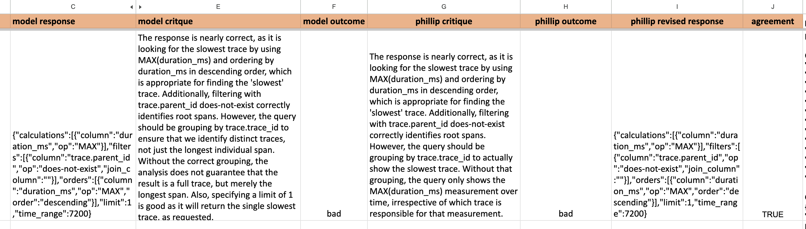
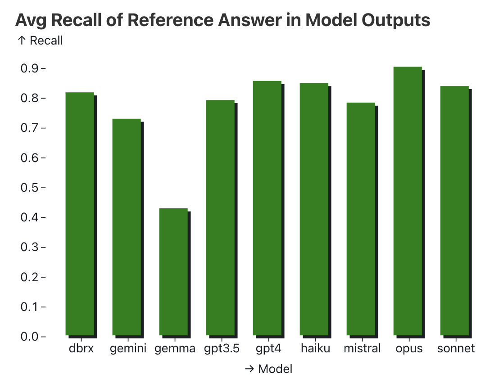
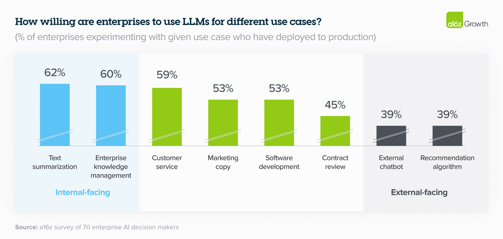
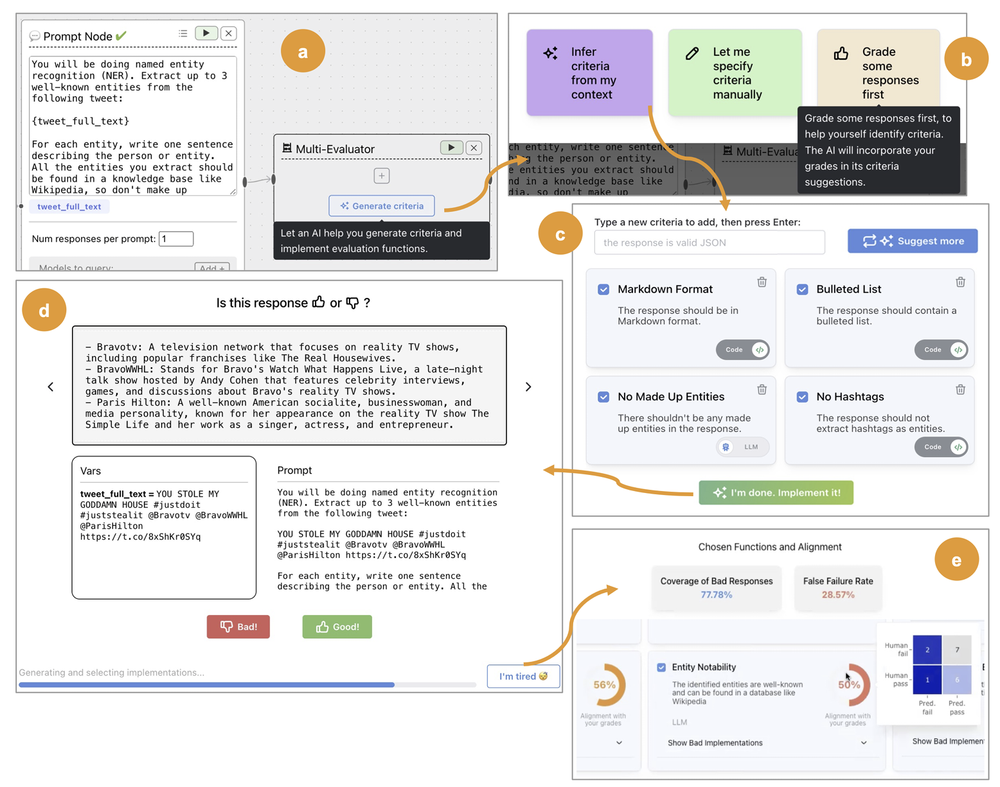
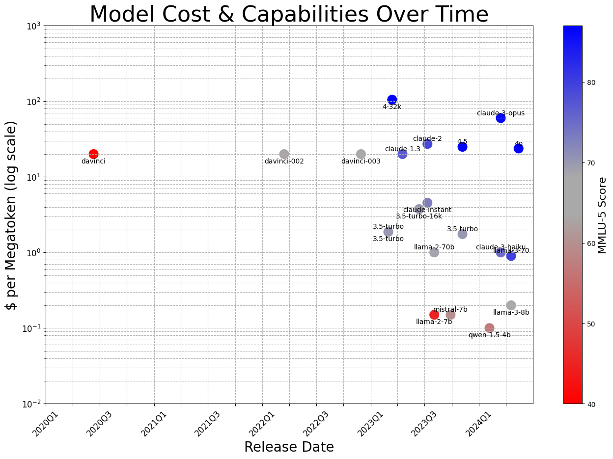

> Also published on O’Reilly Media in three parts: [Tactical](https://www.oreilly.com/radar/what-we-learned-from-a-year-of-building-with-llms-part-i/), [Operational](https://www.oreilly.com/radar/what-we-learned-from-a-year-of-building-with-llms-part-ii/), [Strategic](https://www.oreilly.com/radar/what-we-learned-from-a-year-of-building-with-llms-part-iii-strategy/). Also see [podcast](https://lu.ma/e8huz3s6).  
> 
> 也可在 O’Reilly Media 上分为三个部分发布：战术、运营、战略。另外请查看播客。

It’s an exciting time to build with large language models (LLMs).  

现在正是利用大型语言模型构建的激动人心时刻（LLMs）。  

Over the past year, LLMs have become “good enough” for real-world applications.  

在过去的一年里，LLMs已经变得“足够好”以应用于现实世界。  

And they’re getting better and cheaper every year.  

他们每年都变得更好，价格也更便宜。  

Coupled with a parade of demos on social media, there will be an [estimated $200B investment in AI by 2025](https://www.goldmansachs.com/intelligence/pages/ai-investment-forecast-to-approach-200-billion-globally-by-2025.html).  

预计到 2025 年，将有约 2000 亿美元的投资进入人工智能领域，同时伴随着社交媒体上的一系列演示。  

Furthermore, provider APIs have made LLMs more accessible, allowing everyone, not just ML engineers and scientists, to build intelligence into their products.  

此外，提供者 API 使LLMs更易访问，让每个人，而不仅仅是机器学习工程师和科学家，都能将智能融入其产品中。  

Nonetheless, while the barrier to entry for building with AI has been lowered, creating products and systems that are effective—beyond a demo—remains deceptively difficult.  

尽管使用人工智能构建的准入门槛已降低，但要创建有效的产品和系统——超越演示——仍然具有欺骗性的难度。

We’ve spent the past year building, and have discovered many sharp edges along the way.  

我们花了一年的时间进行建设，沿途发现了许多棱角分明的问题。  

While we don’t claim to speak for the entire industry, we’d like to share what we’ve learned to help you avoid our mistakes and iterate faster.  

虽然我们不敢自称代表整个行业，但我们愿意分享我们所学到的经验，帮助您避免犯我们的错误，更快地迭代。  

These are organized into three sections:  

这些内容被分为三个部分：

-   [Tactical](https://applied-llms.org/#tactical-nuts--bolts-of-working-with-llms): Some practices for prompting, RAG, flow engineering, evals, and monitoring.  
    
    战术：关于提示、RAG、流程工程、评估和监控的一些实践方法。  
    
    Whether you’re a practitioner building with LLMs, or hacking on weekend projects, this section was written for you.  
    
    无论您是专业人士在LLMs上进行构建，还是在周末进行项目开发，本节内容都是为您而写的。
-   [Operational](https://applied-llms.org/#operation-day-to-day-and-org-concerns): The organizational, day-to-day concerns of shipping products, and how to build an effective team.  
    
    运营：涉及运送产品和建立高效团队的组织日常关注事项。  
    
    For product/technical leaders looking to deploy sustainably and reliably.  
    
    针对希望实现可持续和可靠部署的产品/技术领导者。
-   [Strategic](https://applied-llms.org/#strategy-building-with-llms-without-getting-out-maneuvered): The long-term, big-picture view, with opinionated takes such as “no GPU before PMF” and “focus on the system not the model”, and how to iterate.  
    
    战略：长期、宏观视角，包括“在 PMF 之前不使用 GPU”和“专注于系统而非模型”等主观看法，以及如何迭代。  
    
    Written with founders and executives in mind.  
    
    针对创始人和高管撰写的内容。

We intend to make this a practical guide to building successful products with LLMs, drawing from our own experiences and pointing to examples from around the industry.  

我们打算将这本书打造成一个实用指南，教你如何用LLMs打造成功的产品，我们将从自身经验中汲取灵感，并指出行业中的案例。

Ready to ~delve~ dive in? Let’s go.  

准备好深入探索了吗？让我们开始吧。

___

## Tactical: Nuts & Bolts of Working with LLMs  

1 战术：与LLMs合作的基本要领

Here, we share best practices for core components of the emerging LLM stack: prompting tips to improve quality and reliability, evaluation strategies to assess output, retrieval-augmented generation ideas to improve grounding, how to design human-in-the-loop workflows, and more.  

在这里，我们分享新兴LLM堆栈核心组件的最佳实践：提示技巧以提高质量和可靠性，评估策略以评估输出，检索增强生成的想法以改进基础，如何设计人在回路工作流程等。  

While the technology is still nascent, we trust these lessons are broadly applicable and can help you ship robust LLM applications.  

尽管技术仍处于萌芽阶段，我们相信这些经验教训具有广泛适用性，可以帮助您开发出稳健的LLM应用程序。

## Prompting  

1.1 提示[](https://applied-llms.org/#prompting)

We recommend starting with prompting when prototyping new applications.  

我们建议在原型设计新应用程序时从提示开始，这样可以更好地理解和实现。  

It’s easy to both underestimate and overestimate its importance.  

人们很容易既低估又高估它的重要性。  

It’s underestimated because the right prompting techniques, when used correctly, can get us very far.  

它被低估了，因为正确的提示技巧，如果正确使用，可以让我们取得很大进展。  

It’s overestimated because even prompt-based applications require significant engineering around the prompt to work well.  

它被高估了，因为即使是基于提示的应用程序，也需要围绕提示进行重要的工程工作才能运行良好。

### Focus on getting the most out of fundamental prompting techniques  

1.1.1 专注于充分利用基础提示技巧[](https://applied-llms.org/#focus-on-getting-the-most-out-of-fundamental-prompting-techniques)

A few prompting techniques have consistently helped with improving performance across a variety of models and tasks: n-shot prompts + in-context learning, chain-of-thought, and providing relevant resources.  

一些提示技巧一直以来都在改善各种模型和任务的性能方面发挥着一致的作用：n-shot 提示+上下文学习，思维链，以及提供相关资源。

The idea of in-context learning via n-shot prompts is to provide the LLM with examples that demonstrate the task and align outputs to our expectations.  

通过 n-shot 提示进行上下文学习的理念是为 LLM 提供示例，展示任务并使输出符合我们的期望。  

A few tips:  

一些建议：

-   If n is too low, the model may over-anchor on those specific examples, hurting its ability to generalize.  
    
    如果 n 值过低，模型可能会过度依赖这些特定示例，从而损害其泛化能力。  
    
    As a rule of thumb, aim for n ≥ 5. Don’t be afraid to go as high as a few dozen.  
    
    一般来说，目标是 n ≥ 5 是一个经验法则。不要害怕将数字提高到几十。  
    
-   Examples should be representative of the prod distribution.  
    
    示例应当具有代表性，反映产品分发情况。  
    
    If you’re building a movie summarizer, include samples from different genres in roughly the same proportion you’d expect to see in practice.  
    
    如果您正在开发电影摘要生成器，请确保样本涵盖不同流派，比例与实际情况大致相符。  
    
-   You don’t always need to provide the input-output pairs; examples of desired outputs may be sufficient.  
    
    您并非总需要提供输入输出对；提供所需输出的示例可能就足够了。  
    
-   If you plan for the LLM to use tools, include examples of using those tools.  
    
    如果您打算让LLM使用工具，请提供使用这些工具的示例。

In Chain-of-Thought (CoT) prompting, we encourage the LLM to explain its thought process before returning the final answer.  

在思维链 (CoT) 提示中，我们鼓励 LLM 在给出最终答案之前解释他们的思考过程。  

Think of it as providing the LLM with a sketchpad so it doesn’t have to do it all in memory.  

将其视为为LLM提供素描本，这样它就不必全部依赖内存。  

The original approach was to simply add the phrase “Let’s think step by step” as part of the instructions, but, we’ve found it helpful to make the CoT more specific, where adding specificity via an extra sentence or two often reduces hallucination rates significantly.  

最初的方法是简单地将短语“让我们一步一步地思考”添加到说明中，但我们发现通过增加一两句额外的具体内容，通常可以显著降低幻觉率。

For example, when asking an LLM to summarize a meeting transcript, we can be explicit about the steps:  

例如，当要求一个LLM总结会议记录时，我们可以明确说明步骤：

-   First, list out the key decisions, follow-up items, and associated owners in a sketchpad.  
    
    首先，在草图中列出关键决策、后续事项和相关责任人。  
    
-   Then, check that the details in the sketchpad are factually consistent with the transcript.  
    
    然后，请检查素描本中的细节是否与成绩单内容一致。  
    
-   Finally, synthesize the key points into a concise summary.  
    
    最后，将关键要点综合起来，形成简明扼要的总结。

Note that in recent times, [some doubt](https://arxiv.org/abs/2405.04776) has been cast on if this technique is as powerful as believed.  

近年来，一些人开始怀疑这种技术是否真的像人们所认为的那样强大。  

Additionally, there’s significant debate as to exactly what is going on during inference when Chain-of-Thought is being used.  

此外，在使用“思维链”进行推理时，究竟发生了什么存在着重大争议。  

Regardless, this technique is one to experiment with when possible.  

无论如何，这项技术是值得尝试的。

Providing relevant resources is a powerful mechanism to expand the model’s knowledge base, reduce hallucinations, and increase the user’s trust. Often accomplished via Retrieval Augmented Generation (RAG), providing the model with snippets of text that it can directly utilize in its response is an essential technique.  

提供相关资源是扩展模型知识库、减少幻觉并增加用户信任的强大机制。通常通过检索增强生成（RAG）来实现，向模型提供文本片段，使其能直接在回应中使用，这是一种重要的技术。  

When providing the relevant resources, it’s not enough to merely include them; don’t forget to tell the model to prioritize their use, refer to them directly, and to mention when none of the resources are sufficient.  

在提供相关资源时，仅仅包含它们是不够的；不要忘记告诉模型优先考虑它们的使用，直接引用它们，并在没有足够资源时进行说明。  

These help “ground” agent responses to a corpus of resources.  

这些有助于代理响应资源语料库时“扎根”。

### Structure your inputs and outputs  

1.1.2 规划好您的输入和输出[](https://applied-llms.org/#structure-your-inputs-and-outputs)

Structured input and output help models better understand the input as well as return output that can reliably integrate with downstream systems. Adding serialization formatting to your inputs can help provide more clues to the model as to the relationships between tokens in the context, additional metadata to specific tokens (like types), or relate the request to similar examples in the model’s training data.  

结构化的输入和输出有助于模型更好地理解输入，并生成可靠地与下游系统集成的输出。将序列化格式应用于您的输入可以帮助模型更好地理解上下文中令牌之间的关系，为特定令牌提供额外的元数据（如类型），或将请求与模型训练数据中的类似示例相关联。

As an example, many questions on the internet about writing SQL begin by specifying the SQL schema.  

举例来说，许多关于在互联网上编写 SQL 的问题都是从指定 SQL 模式开始的。  

Thus, you can expect that effective prompting for Text-to-SQL should include [structured schema definitions](https://www.researchgate.net/publication/371223615_SQL-PaLM_Improved_Large_Language_ModelAdaptation_for_Text-to-SQL).  

因此，您可以期待，有效的文本到 SQL 提示应该包括结构化模式定义。

Structured input expresses tasks clearly and resembles how the training data is formatted, increasing the probability of better output.  

结构化输入清晰地表达任务，类似于训练数据的格式，提高了获得更好输出的概率。  

Structured output simplifies integration into downstream components of your system. [Instructor](https://github.com/jxnl/instructor) and [Outlines](https://github.com/outlines-dev/outlines) work well for structured output.  

结构化输出简化了集成到系统下游组件中的过程。讲师和大纲对结构化输出非常有效。  

(If you’re importing an LLM API SDK, use Instructor; if you’re importing Huggingface for a self-hosted model, use Outlines.)  

如果您导入的是LLM API SDK，请使用 Instructor；如果您导入的是 Huggingface 用于自托管模型，请使用 Outlines。

When using structured input, be aware that each LLM family has their own preferences.  

在使用结构化输入时，请注意每个LLM家庭都有他们自己的偏好。  

Claude prefers `<xml>` while GPT favors Markdown and JSON.  

Claude 偏爱 `<xml>` ，而 GPT 更喜欢使用 Markdown 和 JSON 格式。  

With XML, you can even pre-fill Claude’s responses by providing a `<response>` tag like so.  

使用 XML，您甚至可以通过提供类似于 `<response>` 标记的方式来预先填写 Claude 的响应。

```
messages=[
    {
        "role": "user",
        "content": """Extract the <name>, <size>, <price>, and <color> from this product description into your <response>.
            <description>The SmartHome Mini is a compact smart home assistant available in black or white for only $49.99. At just 5 inches wide, it lets you control lights, thermostats, and other connected devices via voice or app—no matter where you place it in your home. This affordable little hub brings convenient hands-free control to your smart devices.
            </description>"""
    },
    {
        "role": "assistant",
        "content": "<response><name>"
    }
]
```

### Have small prompts that do one thing, and only one thing, well  

1.1.3 设置简洁明了的小提示，每个提示只完成一项任务，而且做到最好[](https://applied-llms.org/#have-small-prompts-that-do-one-thing-and-only-one-thing-well)

A common anti-pattern / code smell in software is the “[God Object](https://en.wikipedia.org/wiki/God_object)”, where we have a single class or function that does everything. The same applies to prompts too.  

软件开发中常见的反模式/代码异味是“上帝对象”，即一个类或函数负责过多功能。提示也是如此。

A prompt typically starts simple: A few sentences of instruction, a couple of examples, and we’re good to go.  

一个提示通常从简单开始：几句指导，几个例子，就可以顺利进行。  

But as we try to improve performance and handle more edge cases, complexity creeps in.  

然而，随着我们努力提高性能并处理更多边缘情况，复杂性也随之增加。  

More instructions. Multi-step reasoning. Dozens of examples.  

更多说明。多步推理。数十个例子。  

Before we know it, our initially simple prompt is now a 2,000 token Frankenstein.  

转眼间，我们最初简单的提示已经变成了一个包含 2,000 个标记的“弗兰肯斯坦”。  

And to add injury to insult, it has worse performance on the more common and straightforward inputs!  

更让人气馁的是，它在更为常见和直接的输入上表现更糟糕！  

GoDaddy shared this challenge as their [No. 1 lesson from building with LLMs](https://www.godaddy.com/resources/news/llm-from-the-trenches-10-lessons-learned-operationalizing-models-at-godaddy#h-1-sometimes-one-prompt-isn-t-enough).  

GoDaddy 将这一挑战分享为他们从LLMs构建中得到的第一课。

Just like how we strive (read: struggle) to keep our systems and code simple, so should we for our prompts.  

就像我们努力（即：挣扎）保持系统和代码简单一样，我们的提示也应该如此。  

Instead of having a single, catch-all prompt for the meeting transcript summarizer, we can break it into steps:  

为了避免会议记录摘要生成器只有一个全能提示，我们可以将其分解为几个步骤

-   Extract key decisions, action items, and owners into structured format  
    
    提取关键决策、行动项和责任人，并以结构化格式呈现
-   Check extracted details against the original transcription for consistency  
    
    检查提取的细节与原始转录进行对照，确保一致
-   Generate a concise summary from the structured details  
    
    从结构化细节中生成简洁的摘要

As a result, we’ve split our single prompt into multiple prompts that are each simple, focused, and easy to understand.  

因此，我们将单个提示拆分为多个简单、专注且易于理解的提示。  

And by breaking them up, we can now iterate and eval each prompt individually.  

通过拆分它们，现在我们可以逐个迭代和评估每个提示，使得处理更加简单。

### Craft your context tokens  

制作您的上下文标记[](https://applied-llms.org/#craft-your-context-tokens)

Rethink, and challenge your assumptions about how much context you actually need to send to the agent.  

重新思考，并挑战您对实际需要发送给代理的上下文量的假设。  

Be like Michaelangelo, do not build up your context sculpture—chisel away the superfluous material until the sculpture is revealed.  

像米开朗基罗一样，不要一味增加上下文雕塑的材料 - 而是去除多余的部分，直到雕塑被展现出来。  

RAG is a popular way to collate all of the potentially relevant blocks of marble, but what are you doing to extract what’s necessary?  

RAG 是一种流行的方法，用于整理所有潜在相关的大理石块，但您又在做什么来提取必要的内容呢？

We’ve found that taking the final prompt sent to the model—with all of the context construction, and meta-prompting, and RAG results—putting it on a blank page and just reading it, really helps you rethink your context.  

我们发现，将模型收到的最终提示——包括所有的上下文构建、元提示和 RAG 结果——放在空白页面上，然后阅读，确实有助于重新思考您的上下文。  

We have found redundancy, self-contradictory language, and poor formatting using this method.  

我们发现使用这种方法存在冗余、自相矛盾的语言以及格式不佳。

The other key optimization is the structure of your context.  

另一个关键的优化是调整您上下文的结构。  

If your bag-of-docs representation isn’t helpful for humans, don’t assume it’s any good for agents.  

如果您的文档包表示对人类没有帮助，不要认为它对代理人有任何好处。  

Think carefully about how you structure your context to underscore the relationships between parts of it and make extraction as simple as possible.  

仔细思考如何构建上下文，突出各部分之间的关系，使提取变得尽可能简单。

More [prompting fundamentals](https://eugeneyan.com/writing/prompting/) such as prompting mental model, prefilling, context placement, etc.  

更多提示基础知识，例如提示心理模型、预填充、上下文放置等。

## Information Retrieval / RAG  

1.2 信息检索 / RAG[](https://applied-llms.org/#information-retrieval-rag)

Beyond prompting, another effective way to steer an LLM is by providing knowledge as part of the prompt.  

除了提示之外，另一种有效的引导LLM的方式是在提示中提供知识。  

This grounds the LLM on the provided context which is then used for in-context learning.  

这将在提供的上下文中对LLM进行基础，然后用于上下文学习。  

This is known as retrieval-augmented generation (RAG).  

这被称为检索增强生成（RAG）。  

Practitioners have found RAG effective at providing knowledge and improving output, while requiring far less effort and cost compared to finetuning.  

从业者发现，RAG 在提供知识和改善产出方面非常有效，而且相较于微调，所需的工作量和成本要少得多。

### RAG is only as good as the retrieved documents’ relevance, density, and detail  

1.2.1 RAG 的好坏取决于检索文档的相关性、密度和细节[](https://applied-llms.org/#rag-is-only-as-good-as-the-retrieved-documents-relevance-density-and-detail)

The quality of your RAG’s output is dependent on the quality of retrieved documents, which in turn can be considered along a few factors  

您的 RAG 输出质量取决于检索文档的质量，而这又可以考虑几个因素

The first and most obvious metric is relevance.  

首要且最明显的指标是相关性。  

This is typically quantified via ranking metrics such as [Mean Reciprocal Rank (MRR)](https://en.wikipedia.org/wiki/Mean_reciprocal_rank) or [Normalized Discounted Cumulative Gain (NDCG)](https://en.wikipedia.org/wiki/Discounted_cumulative_gain).  

通常是通过排名指标（如平均倒数排名（MRR）或归一化折现累积增益（NDCG））来衡量的。  

MRR evaluates how well a system places the first relevant result in a ranked list while NDCG considers the relevance of all the results and their positions.  

MRR 评估系统在排名列表中放置第一个相关结果的效果，而 NDCG 则考虑所有结果的相关性及其位置。  

They measure how good the system is at ranking relevant documents higher and irrelevant documents lower.  

他们评估系统在将相关文档排名靠前、不相关文档排名靠后方面的表现。  

For example, if we’re retrieving user summaries to generate movie review summaries, we’ll want to rank reviews for the specific movie higher while excluding reviews for other movies.  

例如，如果我们要获取用户摘要以生成电影评论摘要，我们会希望对特定电影的评论进行更高排名，同时排除其他电影的评论。

Like traditional recommendation systems, the rank of retrieved items will have a significant impact on how the LLM performs on downstream tasks.  

就像传统的推荐系统一样，检索到的物品排名对LLM在后续任务中的表现有着重要影响。  

To measure the impact, run a RAG-based task but with the retrieved items shuffled—how does the RAG output perform?  

为了评估影响，运行一个基于 RAG 的任务，但是将检索到的项目打乱顺序——RAG 输出的表现如何？

Second, we also want to consider information density.  

此外，我们还需要考虑信息的密度。  

If two documents are equally relevant, we should prefer one that’s more concise and has fewer extraneous details.  

如果两个文档同等相关，我们应该选择更简洁、更少无关细节的那一个。  

Returning to our movie example, we might consider the movie transcript and all user reviews to be relevant in a broad sense.  

回到我们的电影示例，我们可能认为电影剧本和所有用户评论在广义上是相关的。  

Nonetheless, the top-rated reviews and editorial reviews will likely be more dense in information.  

尽管如此，顶级评价和编辑评论很可能会更加详细丰富。

Finally, consider the level of detail provided in the document.  

最后，请考虑文档中提供的详细程度。  

Imagine we’re building a RAG system to generate SQL queries from natural language.  

想象我们正在开发一个能够从自然语言生成 SQL 查询的 RAG 系统。  

We could simply provide table schemas with column names as context.  

我们可以简单地提供带有列名作为上下文的表结构。  

But, what if we include column descriptions and some representative values?  

但是，如果我们加入列描述和一些代表性数值呢？  

The additional detail could help the LLM better understand the semantics of the table and thus generate more correct SQL.  

附加细节可以帮助LLM更好地理解表的语义，进而生成更准确的 SQL 语句。

### Don’t forget keyword search; use it as a baseline and in hybrid search  

1.2.2 不要忘记关键字搜索；将其作为基准并在混合搜索中使用[](https://applied-llms.org/#dont-forget-keyword-search-use-it-as-a-baseline-and-in-hybrid-search)

Given how prevalent the embedding-based RAG demo is, it’s easy to forget or overlook the decades of research and solutions in information retrieval.  

考虑到基于嵌入式的 RAG 演示如此普遍，很容易忽略信息检索领域数十年的研究和解决方案。

Nonetheless, while embeddings are undoubtedly a powerful tool, they are not the be-all and end-all.  

尽管嵌入式无疑是一个强大的工具，但并非万事万物。  

First, while they excel at capturing high-level semantic similarity, they may struggle with more specific, keyword-based queries, like when users search for names (e.g., Ilya), acronyms (e.g., RAG), or IDs (e.g., claude-3-sonnet).  

首先，虽然它们擅长捕捉高级语义相似性，但在处理更具体的基于关键字的查询时可能会遇到困难，比如当用户搜索名称（例如，Ilya）、首字母缩写（例如，RAG）或 ID（例如，claude-3-sonnet）时，可能会遇到困难。  

Keyword-based search, such as BM25, is explicitly designed for this.  

基于关键词的搜索，例如 BM25，是专门为此目的设计的。  

Finally, after years of keyword-based search, users have likely taken it for granted and may get frustrated if the document they expect to retrieve isn’t being returned.  

经过多年的基于关键字的搜索，用户很可能已经习以为常，如果他们期望检索的文档没有被返回，他们可能会感到沮丧。

> Vector embeddings _do not_ magically solve search.  
> 
> 向量嵌入并不能神奇地解决搜索问题。  
> 
> In fact, the heavy lifting is in the step before you re-rank with semantic similarity search.  
> 
> 实际上，重要的工作在于在重新排序时使用语义相似性搜索之前的步骤。  
> 
> Making a genuine improvement over BM25 or full-text search is hard. — [Aravind Srinivas, CEO Perplexity.ai](https://x.com/AravSrinivas/status/1737886080555446552)  
> 
> 要比 BM25 或全文搜索取得真正的改进是困难的。— Aravind Srinivas，Perplexity.ai 首席执行官

> We’ve been communicating this to our customers and partners for months now.  
> 
> 我们已经几个月向我们的客户和合作伙伴传达了这一信息。  
> 
> Nearest Neighbor Search with naive embeddings yields very noisy results and you’re likely better off starting with a keyword-based approach.  
> 
> 最近邻搜索使用天真的嵌入会产生非常嘈杂的结果，最好从基于关键字的方法开始。  
> 
> — [Beyang Liu, CTO Sourcegraph](https://twitter.com/beyang/status/1767330006999720318)  
> 
> — Beyang Liu，Sourcegraph 首席技术官

Second, it’s more straightforward to understand why a document was retrieved with keyword search—we can look at the keywords that match the query.  

其次，通过关键字搜索更容易理解文档是如何被检索出来的——我们可以查看与查询匹配的关键词。  

In contrast, embedding-based retrieval is less interpretable.  

相反，基于嵌入式检索的方法较难解释。  

Finally, thanks to systems like Lucene and OpenSearch that have been optimized and battle-tested over decades, keyword search is usually more computationally efficient.  

最终，多亏了像 Lucene 和 OpenSearch 这样经过数十年优化和实战检验的系统，关键词搜索通常更具计算效率。

In most cases, a hybrid will work best: keyword matching for the obvious matches, and embeddings for synonyms, hypernyms, and spelling errors, as well as multimodality (e.g., images and text).  

在大多数情况下，混合使用效果最佳：对于明显匹配，使用关键词匹配；对于同义词、上位词、拼写错误以及多模态（例如图像和文本），则使用嵌入。  

[Shortwave shared how they built their RAG pipeline](https://www.shortwave.com/blog/deep-dive-into-worlds-smartest-email-ai/), including query rewriting, keyword + embedding retrieval, and ranking.  

Shortwave 分享了他们构建 RAG 管道的过程，包括查询重写、关键词+嵌入式检索和排名。

### Prefer RAG over finetuning for new knowledge  

1.2.3 优先选择 RAG 而不是微调来获取新知识[](https://applied-llms.org/#prefer-rag-over-finetuning-for-new-knowledge)

Both RAG and finetuning can be used to incorporate new information into LLMs and increase performance on specific tasks.  

RAG 和 finetuning 都可用于将新信息整合到LLMs中，并提高特定任务的性能。  

However, which should we prioritize?  

然而，我们应该优先考虑什么？

Recent research suggests RAG may have an edge. [One study](https://arxiv.org/abs/2312.05934) compared RAG against unsupervised finetuning (aka continued pretraining), evaluating both on a subset of MMLU and current events.  

最近的研究表明 RAG 可能具有优势。一项研究将 RAG 与无监督微调（也称为持续预训练）进行了比较，并在 MMLU 和当前事件的子集上进行了评估。  

They found that RAG consistently outperformed finetuning for knowledge encountered during training as well as entirely new knowledge.  

他们发现，相对于微调，RAG 在训练期间遇到的知识以及全新知识方面表现更出色。  

In [another paper](https://arxiv.org/abs/2401.08406), they compared RAG against supervised finetuning on an agricultural dataset.  

在另一篇论文中，他们对 RAG 与在农业数据集上进行的监督微调进行了比较。  

Similarly, the performance boost from RAG was greater than finetuning, especially for GPT-4 (see Table 20).  

同样，来自 RAG 的性能提升大于微调，尤其是对于 GPT-4（详见表 20）。

Beyond improved performance, RAG has other practical advantages.  

除了提升性能外，RAG 还具有其他实际优势。  

First, compared to continuous pretraining or finetuning, it’s easier—and cheaper!—to keep retrieval indices up-to-date.  

首先，与连续的预训练或微调相比，保持检索索引的最新更容易且更经济实惠！  

Second, if our retrieval indices have problematic documents that contain toxic or biased content, we can easily drop or modify the offending documents.  

另外，如果我们的检索指标中包含有毒或偏见内容的问题文件，我们可以轻松地删除或修改这些有问题的文件。  

Consider it an andon cord for [documents that ask us to add glue to pizza](https://x.com/petergyang/status/1793480607198323196).  

将其视为文件上的安全绳，要求我们在披萨上加胶水。

In addition, the R in RAG provides finer-grained control over how we retrieve documents.  

此外，RAG 中的 R 提供了更精细的控制，使我们能够更精准地检索文档。  

For example, if we’re hosting a RAG system for multiple organizations, by partitioning the retrieval indices, we can ensure that each organization can only retrieve documents from their own index.  

举例来说，如果我们为多个组织托管 RAG 系统，通过对检索索引进行分区，我们可以确保每个组织只能从自己的索引中检索文档。  

This ensures that we don’t inadvertently expose information from one organization to another.  

这样可以确保我们不会无意中将一个组织的信息泄露给另一个组织。

### Long-context models won’t make RAG obsolete  

1.2.4 长文本模型不会使 RAG 变得过时[](https://applied-llms.org/#long-context-models-wont-make-rag-obsolete)

With Gemini 1.5 providing context windows of up to 10M tokens in size, some have begun to question the future of RAG.  

随着 Gemini 1.5 提供的上下文窗口最多可达 10M 个标记，一些人已开始质疑 RAG 的未来。

> I tend to believe that Gemini 1.5 is significantly overhyped by Sora.  
> 
> 我倾向于认为 Gemini 1.5 受到 Sora 的过度炒作。  
> 
> A context window of 10M tokens effectively makes most of existing RAG frameworks unnecessary — you simply put whatever your data into the context and talk to the model like usual.  
> 
> 一个包含 10M 令牌的上下文窗口实际上使大多数现有的 RAG 框架变得不再必要 — 您只需将您的数据放入上下文中，然后像平常一样与模型交互。  
> 
> Imagine how it does to all the startups / agents / langchain projects where most of the engineering efforts goes to RAG 😅 Or in one sentence: the 10m context kills RAG.  
> 
> 想象一下，大部分的工程工作都投入到 RAG 中的所有初创公司/代理商/langchain 项目中会发生什么😅或者用一句话说：10m 的背景扼杀了 RAG。  
> 
> Nice work Gemini — [Yao Fu](https://x.com/Francis_YAO_/status/1758935954189115714)  
> 
> 双子座干得好 — 姚夫

While it’s true that long contexts will be a game-changer for use cases such as analyzing multiple documents or chatting with PDFs, the rumors of RAG’s demise are greatly exaggerated.  

尽管长篇上下文对于分析多个文档或与 PDF 进行聊天等用例将是一个重大变革，但是 RAG 的消亡传闻被夸大了。

First, even with a context size of 10M tokens, we’d still need a way to select relevant context.  

即使上下文大小为 10M 令牌，我们仍然需要一种方法来选择相关的上下文。  

Second, beyond the narrow needle-in-a-haystack eval, we’ve yet to see convincing data that models can effectively reason over large context sizes.  

其次，在狭隘的大海捞针评估之外，我们尚未看到有说服力的数据表明模型能够有效地推理大范围的上下文大小。  

Thus, without good retrieval (and ranking), we risk overwhelming the model with distractors, or may even fill the context window with completely irrelevant information.  

因此，如果没有良好的检索（和排名）功能，我们就有可能用干扰因素淹没模型，甚至可能用完全无关的信息填充上下文窗口。

Finally, there’s cost. During inference, the Transformer’s time complexity scales linearly with context length.  

最后，成本也是一个考量因素。在推断时，Transformer 的时间复杂度随着上下文长度呈线性增长。  

Just because there exists a model that can read your org’s entire Google Drive contents before answering each question doesn’t mean that’s a good idea.  

仅仅因为存在一个模型可以在回答每个问题之前读取您组织的整个谷歌驱动器内容，并不意味着这是一个好主意。  

Consider an analogy to how we use RAM: we still read and write from disk, even though there exist compute instances with [RAM running into the tens of terabytes](https://aws.amazon.com/ec2/instance-types/high-memory/).  

考虑类比我们如何使用 RAM：尽管存在运行内存达数十 TB 的计算实例，我们仍然需要从磁盘读取和写入数据。

So don’t throw your RAGs in the trash just yet.  

所以不要急着把你的抹布扔进垃圾桶。  

This pattern will remain useful even as context sizes grow.  

这种模式将在上下文尺寸增大时仍然保持实用。

## Tuning and optimizing workflows  

1.3 调整和优化工作流程[](https://applied-llms.org/#tuning-and-optimizing-workflows)

Prompting an LLM is just the beginning.  

引导一个LLM只是一个起点。  

To get the most juice out of them, we need to think beyond a single prompt and embrace workflows.  

为了充分利用它们，我们需要超越单一提示，拥抱工作流程。  

For example, how could we split a single complex task into multiple simpler tasks?  

举个例子，我们如何将一个复杂的任务分解成多个简单的任务？  

When is finetuning or caching helpful with increasing performance and reducing latency/cost?  

何时使用 finetuning 或缓存可以提高性能并降低延迟/成本？  

Here, we share proven strategies and real-world examples to help you optimize and build reliable LLM workflows.  

在这里，我们分享经过验证的策略和现实世界的示例，以帮助您优化和构建可靠的LLM工作流程。

### Step-by-step, multi-turn “flows” can give large boosts  

1.3.1 逐步进行，多轮“流程”可以大大提升效率[](https://applied-llms.org/#step-by-step-multi-turn-flows-can-give-large-boosts)

It’s common knowledge that decomposing a single big prompt into multiple smaller prompts can achieve better results.  

众所周知，将一个大提示分解为多个较小的提示可以取得更好的效果。  

For example, [AlphaCodium](https://arxiv.org/abs/2401.08500): By switching from a single prompt to a multi-step workflow, they increased GPT-4 accuracy (pass@5) on CodeContests from 19% to 44%.  

例如，AlphaCodium：通过从单一提示转变为多步工作流程，他们成功将在 CodeContests 上的 GPT-4 准确率（pass@5）从 19%提升至 44%。  

The workflow includes:  

工作流程包括以下内容：

-   Reflecting on the problem  
    
    反思问题
-   Reasoning on the public tests  
    
    在公共测试上进行推理
-   Generating possible solutions  
    
    制定可能解决方案
-   Ranking possible solutions  
    
    对可能解决方案进行排名
-   Generating synthetic tests  
    
    生成合成测试的过程
-   Iterating on the solutions on public and synthetic tests.  
    
    不断改进公共和合成测试中的解决方案。

Small tasks with clear objectives make for the best agent or flow prompts.  

小任务目标明确，是最佳的代理人或流程提示。  

It’s not required that every agent prompt requests structured output, but structured outputs help a lot to interface with whatever system is orchestrating the agent’s interactions with the environment.  

并非每个代理都需要提示请求结构化输出，但结构化输出对于与编排代理与环境交互的任何系统接口非常有帮助。  

Some things to try:  

一些尝试的建议：

-   A tightly-specified, explicit planning step. Also, consider having predefined plans to choose from.  
    
    一个严格规定的、明确的规划步骤。同时，考虑提供预先制定的计划供选择。
-   Rewriting the original user prompts into agent prompts, though this process may be lossy!  
    
    将原始用户提示改写为代理提示，尽管这个过程可能会有信息丢失！
-   Agent behaviors as linear chains, DAGs, and state machines; different dependency and logic relationships can be more and less appropriate for different scales.  
    
    代理行为可以被视为线性链、有向无环图和状态机；不同规模可能需要不同的依赖关系和逻辑关系，更或更少适合。  
    
    Can you squeeze performance optimization out of different task architectures?  
    
    你能从不同的任务架构中提升性能吗？
-   Planning validations; your planning can include instructions on how to evaluate the responses from other agents to make sure the final assembly works well together.  
    
    计划验证；您的计划可以包括如何评估其他代理商的响应，以确保最终装配协调良好。
-   Prompt engineering with fixed upstream state—make sure your agent prompts are evaluated against a collection of variants of what may have happen before.  
    
    通过固定的上游状态进行工程提示——确保您的代理提示根据可能在之前发生的各种情况的集合进行评估。

### Prioritize deterministic workflows for now  

目前优先考虑确定性工作流程[](https://applied-llms.org/#prioritize-deterministic-workflows-for-now)

While AI agents can dynamically react to user requests and the environment, their non-deterministic nature makes them a challenge to deploy.  

人工智能代理虽然能够动态地对用户请求和环境做出反应，但其非确定性特性使得它们在部署时面临挑战。  

Each step an agent takes has a chance of failing, and the chances of recovering from the error are poor.  

代理人每走一步都有失败的可能性，而且从错误中恢复的机会很少。  

Thus, the likelihood that an agent completes a multi-step task successfully decreases exponentially as the number of steps increases.  

因此，随着步骤数量的增加，代理成功完成多步任务的可能性呈指数级下降。  

As a result, teams building agents find it difficult to deploy reliable agents.  

因此，构建代理的团队发现难以部署可靠的代理。

A potential approach is to have agent systems produce deterministic plans which are then executed in a structured, reproducible way.  

一种潜在的方法是让代理系统生成确定性计划，然后以结构化、可复现的方式执行。  

First, given a high-level goal or prompt, the agent generates a plan.  

首先，根据高层次的目标或提示，代理制定一个计划。  

Then, the plan is executed deterministically.  

然后，计划会被以确定性方式执行。  

This allows each step to be more predictable and reliable. Benefits include:  

这样可以使每个步骤更加可预测和可靠。其中的好处包括：

-   Generated plans can serve as few-shot samples to prompt or finetune an agent.  
    
    生成的计划可以作为少量样本，用于激励或微调代理。
-   Deterministic execution makes the system more reliable, and thus easier to test and debug.  
    
    确定性执行使系统更加可靠，从而更易于测试和调试。  
    
    In addition, failures can be traced to the specific steps in the plan.  
    
    此外，失败可以追溯到计划中的具体步骤。
-   Generated plans can be represented as directed acyclic graphs (DAGs) which are easier, relative to a static prompt, to understand and adapt to new situations.  
    
    生成的计划可以表示为有向无环图（DAGs），相对于静态提示，更易于理解和适应新情况。

The most successful agent builders may be those with strong experience managing junior engineers because the process of generating plans is similar to how we instruct and manage juniors.  

那些成功的代理商建造者可能是那些有着丰富管理初级工程师经验的人，因为制定计划的过程类似于我们指导和管理初级工程师的方式。  

We give juniors clear goals and concrete plans, instead of vague open-ended directions, and we should do the same for our agents too.  

我们为初学者设定明确的目标和具体计划，而不是模糊的开放式指导，我们也应该为我们的代理人做同样的事情。

In the end, the key to reliable, working agents will likely be found in adopting more structured, deterministic approaches, as well as collecting data to refine prompts and finetune models.  

最终，建立可靠、高效的代理的关键可能在于采用更加结构化、确定性的方法，以及收集数据来优化提示并调优模型。  

Without this, we’ll build agents that may work exceptionally well some of the time, but on average, disappoint users.  

没有这个，我们将会构建出一些时候表现异常出色，但平均而言却让用户失望的代理。

### Getting more diverse outputs beyond temperature  

1.3.3 获取更多不仅限于温度的多样化输出[](https://applied-llms.org/#getting-more-diverse-outputs-beyond-temperature)

Suppose your task requires diversity in an LLM’s output.  

假设您的任务需要在LLM的输出中具有多样性。  

Maybe you’re writing an LLM pipeline to suggest products to buy from your catalog given a list of products the user bought previously.  

也许您正在编写一个LLM管道，根据用户先前购买的产品列表推荐从您的目录中购买的产品。  

When running your prompt multiple times, you might notice that the resulting recommendations are too similar—so you might increase the temperature parameter in your LLM requests.  

当您多次运行您的提示时，您可能会注意到生成的建议太过相似—因此您可能需要增加您的LLM请求中的温度参数。

Briefly, increasing the temperature parameter makes LLM responses more varied.  

简单来说，增加温度参数会使LLM的响应更加丰富多样。  

At sampling time, the probability distributions of the next token become flatter, meaning that tokens that are usually less likely get chosen more often.  

在采样时，下一个标记的概率分布变得更加平坦，这意味着通常不太可能被选择的标记会更频繁地被选中。  

Still, when increasing temperature, you may notice some failure modes related to output diversity.  

在增加温度时，您可能会注意到一些与输出多样性相关的故障模式。  

For example, some products from the catalog that could be a good fit may never be output by the LLM.  

例如，目录中一些产品可能非常合适，但可能永远不会被LLM输出。  

The same handful of products might be overrepresented in outputs, if they are highly likely to follow the prompt based on what the LLM has learned at training time.  

如果这些产品在训练时高度可能根据LLM学到的内容来遵循提示，那么它们在输出中可能会被过度代表。  

If the temperature is too high, you may get outputs that reference nonexistent products (or gibberish!)  

如果温度过高，您可能会得到引用不存在产品（或无意义内容）的输出

In other words, increasing temperature does not guarantee that the LLM will sample outputs from the probability distribution you expect (e.g., uniform random).  

换句话说，增加温度并不保证LLM会从您期望的概率分布中采样输出，例如均匀随机。  

Nonetheless, we have other tricks to increase output diversity.  

然而，我们还有其他方法来提高产出的多样性。  

The simplest way is to adjust elements within the prompt.  

调整提示中的元素是最简单的方式。  

For example, if the prompt template includes a list of items, such as historical purchases, shuffling the order of these items each time they’re inserted into the prompt can make a significant difference.  

例如，如果提示模板包含一系列项目，比如历史购买记录，每次将这些项目插入提示时改变它们的顺序可能会产生重大影响。

Additionally, keeping a short list of recent outputs can help prevent redundancy.  

此外，保持一份最近输出清单可以有效避免重复。  

In our recommended products example, by instructing the LLM to avoid suggesting items from this recent list, or by rejecting and resampling outputs that are similar to recent suggestions, we can further diversify the responses.  

在我们推荐产品的示例中，通过指示LLM避免建议来自最近列表的项目，或者拒绝并重新采样类似于最近建议的输出，我们可以进一步使响应多样化。  

Another effective strategy is to vary the phrasing used in the prompts.  

另一种有效的策略是改变提示中使用的措辞。  

For instance, incorporating phrases like “pick an item that the user would love using regularly” or “select a product that the user would likely recommend to friends” can shift the focus and thereby influence the variety of recommended products.  

例如，加入诸如“选择用户会喜欢经常使用的物品”或“挑选用户可能会向朋友推荐的产品”等短语，可以改变焦点，从而影响推荐产品的多样性。

### Caching is underrated  

缓存的重要性被低估了[](https://applied-llms.org/#caching-is-underrated)

Caching saves cost and eliminates generation latency by removing the need to recompute responses for the same input.  

缓存通过避免需要重新计算相同输入的响应，既节约成本又消除生成延迟。  

Furthermore, if a response has previously been guardrailed, we can serve these vetted responses and reduce the risk of serving harmful or inappropriate content.  

此外，如果先前已对响应进行了保护，我们可以提供经过审查的响应，从而降低提供有害或不适当内容的风险。

One straightforward approach to caching is to use unique IDs for the items being processed, such as if we’re summarizing new articles or [product reviews](https://www.cnbc.com/2023/06/12/amazon-is-using-generative-ai-to-summarize-product-reviews.html). When a request comes in, we can check to see if a summary already exists in the cache.  

一个简单的缓存方法是为正在处理的项目使用唯一的 ID，比如我们正在总结新文章或产品评论。当收到请求时，我们可以检查缓存中是否已经存在摘要。  

If so, we can return it immediately; if not, we generate, guardrail, and serve it, and then store it in the cache for future requests.  

如果是这样，我们可以立即返回；如果不是，我们会生成、设置保护栏，并提供，然后将其存储在缓存中以备将来请求。

For more open-ended queries, we can borrow techniques from the field of search, which also leverages caching for open-ended inputs.  

对于更加开放式的查询，我们可以借鉴搜索领域的技术，该领域也利用缓存来处理开放式输入。  

Features like autocomplete, spelling correction, and suggested queries also help normalize user input and thus increase the cache hit rate.  

自动完成、拼写纠正和建议查询等功能有助于规范用户输入，进而提高缓存命中率。

### When to finetune  

1.3.5 何时进行微调[](https://applied-llms.org/#when-to-finetune)

We may have some tasks where even the most cleverly designed prompts fall short.  

我们可能会遇到一些任务，即使是设计得再巧妙的提示也会不够用。  

For example, even after significant prompt engineering, our system may still be a ways from returning reliable, high-quality output.  

例如，即使经过重大的优化工程，我们的系统可能仍然需要一段时间才能返回可靠且高质量的输出。  

If so, then it may be necessary to finetune a model for your specific task.  

如果是这样的话，可能需要对您的特定任务进行模型微调。

Successful examples include:  

成功的案例包括：

-   [Honeycomb’s Natural Language Query Assistant](https://www.honeycomb.io/blog/introducing-query-assistant): Initially, the “programming manual” was provided in the prompt together with n-shot examples for in-context learning.  
    
    Honeycomb 的自然语言查询助手：最初，"编程手册"与 n-shot 示例一起提供，以便进行上下文学习。  
    
    While this worked decently, finetuning the model led to better output on the syntax and rules of the domain-specific language.  
    
    虽然这个方法效果还不错，但对模型进行微调会在领域特定语言的语法和规则方面产生更好的结果。
-   [Rechat’s Lucy](https://www.youtube.com/watch?v=B_DMMlDuJB0): The LLM needed to generate responses in a very specific format that combined structured and unstructured data for the frontend to render correctly.  
    
    Rechat 的 Lucy：需要LLM来以非常特定的格式结合结构化和非结构化数据，以便前端正确渲染。  
    
    Finetuning was essential to get it to work consistently.  
    
    微调是必不可少的，以确保其能够持续稳定运行。

Nonetheless, while finetuning can be effective, it comes with significant costs.  

尽管微调可能有效，但会带来相当大的成本。  

We have to annotate finetuning data, finetune and evaluate models, and eventually self-host them.  

我们需要对微调数据进行标注，微调和评估模型，最终自行托管它们。  

Thus, consider if the higher upfront cost is worth it.  

因此，请考虑高昂的前期成本是否值得。  

If prompting gets you 90% of the way there, then finetuning may not be worth the investment.  

如果提示让您完成了 90%的工作，那么微调可能并不值得投资。  

However, if we do decide to finetune, to reduce the cost of collecting human-annotated data, we can [generate and finetune on synthetic data](https://eugeneyan.com/writing/synthetic/), or [bootstrap on open-source data](https://eugeneyan.com/writing/finetuning/).  

但是，如果我们决定进行微调以降低收集人工标注数据的成本，我们可以生成合成数据进行微调，或者在开源数据上引导。

## Evaluation & Monitoring  

1.4 评估与监测[](https://applied-llms.org/#evaluation-monitoring)

Evaluating LLMs is a [minefield](https://www.cs.princeton.edu/~arvindn/talks/evaluating_llms_minefield/) and even the biggest labs find it [challenging](https://www.anthropic.com/news/evaluating-ai-systems). LLMs return open-ended outputs, and the tasks we set them to are varied.  

评估LLMs是一项充满挑战的雷区，即使是最大的实验室也会觉得困难。LLMs会产生开放式的结果，而我们给它们的任务也是多样化的。  

Nonetheless, rigorous and thoughtful evals are critical—it’s no coincidence that technical leaders at OpenAI [work on evaluation and give feedback on individual evals](https://twitter.com/eugeneyan/status/1701692908074873036).  

然而，严格而深思熟虑的评估至关重要——OpenAI 的技术领导者们致力于评估工作并就个别评估提供反馈，这并非巧合。

Evaluating LLM applications invites a diversity of definitions and reductions: it’s simply unit testing, or it’s more like observability, or maybe it’s just data science.  

评估LLM个应用程序引发了各种定义和概念：它可以简单看作是单元测试，也可以视为更类似于可观察性，又或者仅仅是数据科学。  

We have found all of these perspectives useful.  

我们发现所有这些观点都很有用。  

In this section, we provide some lessons on what is important in building evals and monitoring pipelines.  

在这一部分，我们提供了一些关于构建评估和监控管道中重要的教训。

### Create a few assertion-based unit tests from real input/output samples  

1.4.1 从真实的输入/输出样本中创建几个基于断言的单元测试[](https://applied-llms.org/#create-a-few-assertion-based-unit-tests-from-real-inputoutput-samples)

Create [unit tests (i.e., assertions)](https://hamel.dev/blog/posts/evals/#level-1-unit-tests) consisting of samples of inputs and outputs from production, with expectations for outputs based on at least three criteria.  

创建单元测试，即断言，使用生产中的输入和输出样本，根据至少三个标准对输出的预期进行断言。  

While three criteria might seem arbitrary, it’s a practical number to start with; fewer might indicate that your task isn’t sufficiently defined or is too open-ended, like a general-purpose chatbot.  

当三个标准可能看起来是武断的时候，这是一个实用的起点数字；更少可能表明您的任务定义不够充分，或者太开放，就像一个通用聊天机器人。  

These unit tests, or assertions, should be triggered by any changes to the pipeline, whether it’s editing a prompt, adding new context via RAG, or other modifications.  

这些单元测试或断言应该在管道发生任何更改时触发，无论是编辑提示，通过 RAG 添加新的上下文，还是其他修改。  

This [write-up has an example](https://hamel.dev/blog/posts/evals/#step-1-write-scoped-tests) of an assertion-based test for an actual use case.  

这篇写作中提供了一个关于实际用例的基于断言的测试示例。

Consider beginning with assertions that specify phrases that let us include or exclude responses.  

考虑从指定的断言开始，这些断言指定了我们可以包含或排除响应的短语。  

Also try checks to ensure that word, item, or sentence counts lie within a range.  

也尝试检查以确保单词、项目或句子的计数在合理范围内。  

For other kinds of generations, assertions can look different. [Execution-based evaluation](https://www.semanticscholar.org/paper/Execution-Based-Evaluation-for-Open-Domain-Code-Wang-Zhou/1bed34f2c23b97fd18de359cf62cd92b3ba612c3) is one way to evaluate code generation, wherein you run the generated code and check if the state of runtime is sufficient for the user request.  

对于其他类型的生成，断言可能有所不同。基于执行的评估是评估代码生成的一种方式，您运行生成的代码并检查运行时状态是否足够满足用户请求。

As an example, if the user asks for a new function named foo; then after executing the agent’s generated code, foo should be callable!  

举例来说，如果用户要求一个名为 foo 的新功能；那么在执行代理生成的代码后，应该可以调用 foo！  

One challenge in execution-based evaluation is that the agent code frequently leaves the runtime in a slightly different form than the target code.  

在执行型评估中的一个挑战是，代理代码经常以与目标代码略有不同的形式离开运行时。  

It can be effective to “relax” assertions to the absolute most weak assumptions that any viable answer would satisfy.  

放宽断言的条件，使其符合任何可行答案的最基本要求可能更为有效。

Finally, using your product as intended for customers (i.e., “dogfooding”) can provide insight into failure modes on real-world data.  

最后，按照客户预期使用您的产品（即“dogfooding”）可以帮助您洞察真实世界数据上的故障模式。  

This approach not only helps identify potential weaknesses, but also provides a useful source of production samples that can be converted into evals.  

这种方法不仅有助于识别潜在的弱点，还提供了一个可转化为评估的生产样本的有益来源。

### LLM-as-Judge can work (somewhat), but it’s not a silver bullet  

1.4.2 LLM-作为法官可以起作用（在某种程度上），但这并不是万能之策[](https://applied-llms.org/#llm-as-judge-can-work-somewhat-but-its-not-a-silver-bullet)

LLM-as-Judge, where we use a strong LLM to evaluate the output of other LLMs, has been met with skepticism.  

作为法官，我们使用强大的LLM来评估其他LLMs的输出，一直备受怀疑。  

(Some of us were initially huge skeptics.) Nonetheless, when implemented well, LLM-as-Judge achieves decent correlation with human judgments, and can at least help build priors about how a new prompt or technique may perform.  

有些人最初对此持怀疑态度。然而，当实施得当时，LLM作为评判者与人类判断有着相当的相关性，至少可以帮助建立关于新提示或技术可能表现的先验。  

Specifically, when doing pairwise comparisons (control vs.  

具体来说，在进行成对比较时（对照组 vs.  

 treatment), LLM-as-Judge typically gets the direction right though the magnitude of the win/loss may be noisy.  

通常情况下，LLM-作为法官通常能够准确把握方向，尽管胜负的幅度可能会有些嘈杂。

Here are some suggestions to get the most out of LLM-as-Judge:  

这里有一些建议，帮助您充分发挥LLM作为法官的作用：

-   Use pairwise comparisons: Instead of asking the LLM to score a single output on a [Likert](https://en.wikipedia.org/wiki/Likert_scale) scale, present it with two options and ask it to select the better one.  
    
    使用成对比较：不要求LLM在李克特量表上对单个输出进行评分，而是呈现两个选项，并要求其选择更好的一个。  
    
    This tends to lead to more stable results.  
    
    这通常会导致更加稳定的结果。
-   Control for position bias: The order of options presented can bias the LLM’s decision.  
    
    控制位置偏见：呈现选项的顺序可能会影响LLM的决定。  
    
    To mitigate this, do each pairwise comparison twice, swapping the order of pairs each time.  
    
    为了缓解这个问题，每次都要进行两两比较两次，每次交换一下对的顺序。  
    
    Just be sure to attribute wins to the right option after swapping!  
    
    请确保在交换后将胜利归因于正确的选项！
-   Allow for ties: In some cases, both options may be equally good.  
    
    允许平局：在某些情况下，两个选项可能同样出色。  
    
    Thus, allow the LLM to declare a tie so it doesn’t have to arbitrarily pick a winner.  
    
    因此，允许LLM宣布平局，避免随意选择获胜者。
-   Use Chain-of-Thought: Asking the LLM to explain its decision before giving a final answer can increase eval reliability.  
    
    使用思维链：在最终给出答复之前，要求LLM解释其决策，可以提高评估的可靠性。  
    
    As a bonus, this lets you to use a weaker but faster LLM and still achieve similar results.  
    
    作为奖励，这样您可以使用一个更弱但更快的LLM，仍然能够达到类似的效果。  
    
    Because this part of the pipeline is typically run in batch, the extra latency from CoT isn’t a problem.  
    
    因为这部分流水线通常以批处理方式运行，来自 CoT 的额外延迟并不是问题。
-   Control for response length: LLMs tend to bias toward longer responses.  
    
    控制响应长度：LLMs 会导致更长的响应。  
    
    To mitigate this, ensure response pairs are similar in length.  
    
    为了缓解这个问题，请确保响应对的长度相似。

A useful application of LLM-as-Judge is checking a new prompting strategy against regression.  

LLM-作为法官的一个有用的应用是将新的提示策略与回归进行对比，以检验其有效性。  

If you have tracked a collection of production results, sometimes you can rerun those production examples with a new prompting strategy, and use LLM-as-Judge to quickly assess where the new strategy may suffer.  

如果您已经记录了一系列生产结果，有时您可以使用新的提示策略重新运行这些生产示例，并利用LLM-作为评判者，快速评估新策略可能存在的问题。

Here’s an example of a [simple but effective approach](https://hamel.dev/blog/posts/evals/#automated-evaluation-w-llms) to iterate on LLM-as-Judge, where we log the LLM response, judge’s critique (i.e., CoT), and final outcome.  

这是一个简单但有效的方法示例，用于对LLM-作为评委进行迭代。我们记录LLM的响应，评委的评论（即 CoT）和最终结果。  

They are then reviewed with stakeholders to identify areas for improvement.  

然后与利益相关者一起审查，以确定改进的方向。  

Over three iterations, agreement with humans and LLM improved from 68% to 94%!  

经过三轮迭代，与人类和LLM的一致性从 68%提高到 94%！



LLM-as-Judge is not a silver bullet though.  

LLM-担任法官并不是解决问题的灵丹妙药。  

There are subtle aspects of language where even the strongest models fail to evaluate reliably.  

语言中存在微妙之处，即使是最强大的模型也难以可靠评估。  

In addition, we’ve found that [conventional classifiers](https://eugeneyan.com/writing/finetuning/) and reward models can achieve higher accuracy than LLM-as-Judge, and with lower cost and latency.  

此外，我们发现传统分类器和奖励模型可以比LLM-as-Judge 实现更高的准确性，且成本和延迟更低。  

For code generation, LLM-as-Judge can be weaker than more direct evaluation strategies like execution-evaluation.  

对于代码生成，LLM-作为评判者可能比直接执行评估等策略更弱。

### The “intern test” for evaluating generations  

1.4.3 用于评估世代的“实习生测试”[](https://applied-llms.org/#the-intern-test-for-evaluating-generations)

We like to use the following “intern test” when evaluating generations: If you took the exact input to the language model, including the context, and gave it to an average college student in the relevant major as a task, could they succeed?  

在评估世代时，我们喜欢使用以下“实习生测试”：如果您将准确的输入提供给语言模型，包括上下文，并将其作为任务交给相关专业的普通大学生，他们能成功吗？  

How long would it take?  

需要多长时间？

-   If the answer is no because the LLM lacks the required knowledge, consider ways to enrich the context.  
    
    如果答案是否定的，因为LLM缺乏必要的知识，请考虑如何丰富背景信息。
-   If the answer is no and we simply can’t improve the context to fix it, then we may have hit a task that’s too hard for contemporary LLMs.  
    
    如果答案是否定的，而我们无法改善上下文以解决问题，那么我们可能遇到了对当代LLMs来说太困难的任务。
-   If the answer is yes, but it would take a while, we can try to reduce the complexity of the task.  
    
    如果答案是肯定的，但需要一些时间，我们可以尝试简化任务的复杂性。  
    
    Is it decomposable? Are there aspects of the task that can be made more templatized?  
    
    这个任务可以分解吗？有哪些方面可以更加模板化？
-   If the answer is yes, they would get it quickly, then it’s time to dig into the data.  
    
    如果答案是肯定的，他们会迅速获得结果，那么现在是时候深入挖掘数据了。  
    
    What’s the model doing wrong? Can we find a pattern of failures?  
    
    模型出了什么问题？我们能找到失败的模式吗？  
    
    Try asking the model to explain itself before or after it responds, to help you build a theory of mind.  
    
    在模型回答前或后，请尝试要求模型解释自己，以帮助您建立心智理论。

### Overemphasizing certain evals can hurt overall performance  

1.4.4 过分强调某些评估可能会影响整体性能[](https://applied-llms.org/#overemphasizing-certain-evals-can-hurt-overall-performance)

> “When a measure becomes a target, it ceases to be a good measure.” — Goodhart’s Law.  
> 
> 当一个指标变成目标时，它就不再是一个好的指标。 — 古德哈特定律。

An example of this is the Needle-in-a-Haystack (NIAH) eval.  

这是“大海捞针”（NIAH）评估的一个例子的示例。  

The original eval helped quantify model recall as context sizes grew, as well as how recall is affected by needle position.  

随着上下文规模的增长，原始评估有助于量化模型召回率的变化，同时也揭示了召回率受针位置影响的情况。  

However, it’s been so overemphasized that it’s featured as [Figure 1 for Gemini 1.5’s report](https://arxiv.org/abs/2403.05530).  

然而，它被过分强调，以至于它被列为 Gemini 1.5 报告中的第一图。  

The eval involves inserting a specific phrase (“The special magic {city} number is: {number}”) into a long document that repeats the essays of Paul Graham, and then prompting the model to recall the magic number.  

评估涉及将特定短语（“特殊魔法{城市}数字为：{数字}”）插入重复保罗·格雷厄姆的文章的长文档中，然后提示模型回忆魔法数字。

While some models achieve near-perfect recall, it’s questionable whether NIAH truly measures the reasoning and recall abilities needed in real-world applications.  

尽管一些模型实现了接近完美的召回率，但是否 NIAH 真正衡量了现实世界应用中所需的推理和召回能力仍然值得怀疑。  

Consider a more practical scenario: Given the transcript of an hour-long meeting, can the LLM summarize the key decisions and next steps, as well as correctly attribute each item to the relevant person?  

考虑一个更实际的情境：假设有一场持续一个小时的会议记录，LLM是否能够总结出关键决策和下一步行动，并正确地将每个项目归属到相关人员？  

This task is more realistic, going beyond rote memorization, and considers the ability to parse complex discussions, identify relevant information, and synthesize summaries.  

这项任务更贴近现实，不仅仅是死记硬背，还考虑到解析复杂讨论的能力，识别相关信息，并综合总结。

Here’s an example of a [practical NIAH eval](https://observablehq.com/@shreyashankar/needle-in-the-real-world-experiments). Using [doctor-patient transcripts](https://github.com/wyim/aci-bench/tree/main/data/challenge_data), the LLM is queried about the patient’s medication.  

这是一个实际的 NIAH 评估示例。通过医生和患者的对话记录，询问LLM关于患者的药物情况。  

It also includes a more challenging NIAH, inserting a phrase for random ingredients for pizza toppings, such as “_The secret ingredients needed to build the perfect pizza are: Espresso-soaked dates, Lemon, and Goat cheese._”. Recall was around 80% on the medication task and 30% on the pizza task.  

它还包括一个更具挑战性的 NIAH，插入了一个短语，用于描述比萨配料的随机成分，例如“构建完美比萨所需的秘密配料是：浸泡浓缩咖啡的枣、柠檬和羊奶酪。”在药物任务中的召回率约为 80％，在比萨任务中为 30％。



Tangentially, an overemphasis on NIAH evals can reduce performance on extraction and summarization tasks.  

在提取和总结任务中，过分强调 NIAH 评估可能会降低表现。  

Because these LLMs are so finetuned to attend to every sentence, they may start to treat irrelevant details and distractors as important, thus including them in the final output (when they shouldn’t!)  

由于这些LLMs对每个句子都非常敏感，它们可能开始将不相关的细节和干扰因素视为重要，因此在最终输出中包含它们（但实际上不应该！）

This could also apply to other evals and use cases. For example, summarization.  

这也适用于其他评估和用例，比如总结。  

An emphasis on factual consistency could lead to summaries that are less specific (and thus less likely to be factually inconsistent) and possibly less relevant.  

强调事实的一致性可能导致摘要变得不够具体（因此不太可能存在事实上的不一致），也可能变得不太相关。  

Conversely, an emphasis on writing style and eloquence could lead to more flowery, marketing-type language that could introduce factual inconsistencies.  

相反，过分强调写作风格和修辞可能导致使用更花哨、营销化的语言，从而可能引入事实上的不一致性。

### Simplify annotation to binary tasks or pairwise comparisons  

1.4.5 将注释简化为二元任务或成对比较[](https://applied-llms.org/#simplify-annotation-to-binary-tasks-or-pairwise-comparisons)

Providing open-ended feedback or ratings for model output on a [Likert scale](https://en.wikipedia.org/wiki/Likert_scale) is cognitively demanding.  

在李克特量表上为模型输出提供开放式反馈或评分在认知上是具有挑战性的。  

As a result, the data collected is more noisy—due to variability among human raters—and thus less useful.  

因此，由于人类评分者之间的差异性，收集的数据变得更加嘈杂，因此不太实用。  

A more effective approach is to simplify the task and reduce the cognitive burden on annotators.  

更有效的方法是简化任务，减轻注释者的认知负担。  

Two tasks that work well are binary classifications and pairwise comparisons.  

二元分类和成对比较是两种效果很好的任务。

In binary classifications, annotators are asked to make a simple yes-or-no judgment on the model’s output.  

在二元分类中，注释者被要求对模型的输出做出简单的是或否判断。  

They might be asked whether the generated summary is factually consistent with the source document, or whether the proposed response is relevant, or if it contains toxicity.  

他们可能会被问及生成的摘要是否与源文件事实一致，或者建议的回答是否相关，或者是否包含有毒性。  

Compared to the Likert scale, binary decisions are more precise, have higher consistency among raters, and lead to higher throughput.  

与李克特量表相比，二元决策更为精确，评分者之间的一致性更高，并且能够提高工作效率。  

This was how [Doordash set up their labeling queues](https://doordash.engineering/2020/08/28/overcome-the-cold-start-problem-in-menu-item-tagging/) for tagging menu items through a tree of yes-no questions.  

这是 Doordash 如何通过一系列是非问题树来设置他们的标签队列，用于标记菜单项的方式。

In pairwise comparisons, the annotator is presented with a pair of model responses and asked which is better.  

在成对比较中，注释者会看到一对模型响应，并被要求选择哪个更好。  

Because it’s easier for humans to say “A is better than B” than to assign an individual score to either A or B individually, this leads to faster and more reliable annotations (over Likert scales).  

由于人类更容易说“A 比 B 更好”而不是为 A 或 B 分配单独的分数，这导致更快速和更可靠的注释（相对于 Likert 量表）。  

At a [Llama2 meetup](https://www.youtube.com/watch?v=CzR3OrOkM9w), Thomas Scialom, an author on the Llama2 paper, confirmed that pairwise-comparisons were faster and cheaper than collecting supervised finetuning data such as written responses.  

在 Llama2 聚会上，Llama2 论文的作者 Thomas Scialom 确认，成对比较比收集监督微调数据（如书面回复）更快更便宜。  

The former’s cost is $3.5 per unit while the latter’s cost is $25 per unit.  

前者的成本是每单位 3.5 美元，而后者的成本是每单位 25 美元。

If you’re writing labeling guidelines, here are some [example guidelines](https://eugeneyan.com/writing/labeling-guidelines/) from Google and Bing Search.  

如果您正在撰写标签指南，这里有一些来自谷歌和必应搜索的示例指南供参考。

### (Reference-free) evals and guardrails can be used interchangeably  

1.4.6 版本中，评估和防护栏可以互相替代[](https://applied-llms.org/#reference-free-evals-and-guardrails-can-be-used-interchangeably)

Guardrails help to catch inappropriate or harmful content while evals help to measure the quality and accuracy of the model’s output.  

防护栏有助于捕捉不当或有害内容，而评估有助于衡量模型输出的质量和准确性。  

And if your evals are reference-free, they can be used as guardrails too.  

如果您的评估是无参考的，它们也可以作为护栏。  

Reference-free evals are evaluations that don’t rely on a “golden” reference, such as a human-written answer, and can assess the quality of output based solely on the input prompt and the model’s response.  

无参考评估是指评估过程中不依赖于“黄金”参考，如人工编写的答案，而是仅根据输入提示和模型的响应来评估输出质量。

Some examples of these are [summarization evals](https://eugeneyan.com/writing/evals/#summarization-consistency-relevance-length), where we only have to consider the input document to evaluate the summary on factual consistency and relevance.  

一些例子包括总结评估，我们只需考虑输入文档，以评估摘要的事实一致性和相关性。  

If the summary scores poorly on these metrics, we can choose not to display it to the user, effectively using the eval as a guardrail.  

如果摘要在这些指标上得分不佳，我们可以选择不向用户显示它，实际上将评估作为一种保护措施。  

Similarly, reference-free [translation evals](https://eugeneyan.com/writing/evals/#translation-statistical--learned-evals-for-quality) can assess the quality of a translation without needing a human-translated reference, again allowing us to use it as a guardrail.  

同样，无参考翻译评估可以评估翻译的质量，而无需人工翻译的参考，再次使我们能够将其用作保障。

### LLMs will return output even when they shouldn’t  

1.4.7 LLMs 将返回输出，即使它们不应该[](https://applied-llms.org/#llms-will-return-output-even-when-they-shouldnt)

A key challenge when working with LLMs is that they’ll often generate output even when they shouldn’t.  

在使用LLMs时面临的一个关键挑战是，它们经常会在不应该生成输出的情况下生成输出。  

This can lead to harmless but nonsensical responses, or more egregious defects like toxicity or dangerous content.  

这可能导致无害但毫无意义的回应，或者更严重的缺陷，例如毒性或危险内容。  

For example, when asked to extract specific attributes or metadata from a document, an LLM may confidently return values even when those values don’t actually exist. Alternatively, the model may respond in a language other than English because we provided non-English documents in the context.  

例如，当要求从文档中提取特定属性或元数据时，LLM可能会自信地返回值，即使这些值实际上并不存在。或者，由于我们提供了非英语文档作为上下文，该模型可能会用其他语言进行回应。

While we can try to prompt the LLM to return a “not applicable” or “unknown” response, it’s not foolproof.  

虽然我们可以尝试促使LLM返回“不适用”或“未知”的响应，但这并不是绝对可靠的。  

Even when the log probabilities are available, they’re a poor indicator of output quality.  

即使有对数概率可用，它们也并不是输出质量的良好指标。  

While log probs indicate the likelihood of a token appearing in the output, they don’t necessarily reflect the correctness of the generated text.  

对数概率表示一个标记出现在输出中的可能性，但并不一定反映生成文本的准确性。  

On the contrary, for instruction-tuned models that are trained to answer queries and generate coherent responses, log probabilities may not be well-calibrated.  

相反，对于经过指导训练的模型，这些模型被训练来回答查询并生成连贯的响应，对数概率可能无法很好地校准。  

Thus, while a high log probability may indicate that the output is fluent and coherent, it doesn’t mean it’s accurate or relevant.  

因此，尽管高对数概率可能表明输出流畅连贯，但并不代表其准确或相关。

While careful prompt engineering can help to an extent, we should complement it with robust guardrails that detect and filter/regenerate undesired output.  

虽然谨慎的提示工程在一定程度上有所帮助，但我们应该配以强大的防护栏，以便检测、过滤和重新生成不需要的输出。  

For example, OpenAI provides a [content moderation API](https://platform.openai.com/docs/guides/moderation) that can identify unsafe responses such as hate speech, self-harm, or sexual output.  

例如，OpenAI 提供了内容审核 API，可以识别不良回复，如仇恨言论、自残或性内容。  

Similarly, there are numerous packages for [detecting personally identifiable information](https://github.com/topics/pii-detection).  

同样，有许多软件包可用于检测个人身份信息。  

One benefit is that guardrails are largely agnostic of the use case and can thus be applied broadly to all output in a given language.  

一个好处是护栏在很大程度上与具体用例无关，因此可以广泛应用于给定语言中的所有输出。  

In addition, with precise retrieval, our system can deterministically respond “I don’t know” if there are no relevant documents.  

此外，通过精确检索，我们的系统可以在没有相关文档时确定性地回复“我不知道”。

A corollary here is that LLMs may fail to produce outputs when they are expected to.  

这里的一个推论是，当期望产生输出时，LLMs可能会失败。  

This can happen for various reasons, from straightforward issues like long-tail latencies from API providers to more complex ones such as outputs being blocked by content moderation filters.  

这可能是由各种原因引起的，从简单的问题，比如来自 API 提供者的长尾延迟，到更复杂的问题，比如输出被内容审核过滤器阻止。  

As such, it’s important to consistently log inputs and (potentially a lack of) outputs for debugging and monitoring.  

为了调试和监控的目的，重要的是始终记录输入和（可能的）输出，以便排查问题。

### Hallucinations are a stubborn problem  

1.4.8 幻觉是一个顽固的问题[](https://applied-llms.org/#hallucinations-are-a-stubborn-problem)

Unlike content safety or PII defects which have a lot of attention and thus seldom occur, factual inconsistencies are stubbornly persistent and more challenging to detect.  

与内容安全或 PII 缺陷不同，这些问题受到了很多关注，因此很少发生，而事实上的不一致性却顽固存在，并且更具挑战性，更难以检测。  

They’re more common and occur at a baseline rate of 5 - 10%, and from what we’ve learned from LLM providers, it can be challenging to get it below 2%, even on simple tasks such as summarization.  

它们更为常见，基线率为 5-10％，根据我们从LLM提供者那里了解到的，即使是像摘要这样简单的任务，将其降至 2％以下也是具有挑战性的。

To address this, we can combine prompt engineering (upstream of generation) and factual inconsistency guardrails (downstream of generation).  

要解决这个问题，我们可以结合提示工程（在生成之前）和事实不一致的防护栏（在生成之后）。  

For prompt engineering, techniques like CoT help reduce hallucination by getting the LLM to explain its reasoning before finally returning the output.  

为了即时工程，类似 CoT 的技术有助于通过要求LLM在最终输出之前解释其推理来减少幻觉。  

Then, we can apply a [factual inconsistency guardrail](https://eugeneyan.com/writing/finetuning/) to assess the factuality of summaries and filter or regenerate hallucinations.  

然后，我们可以使用事实不一致的防护栏来评估摘要的准确性，并过滤或重新生成虚构内容。  

In some cases, hallucinations can be deterministically detected.  

在某些情况下，可以确定性地检测到幻觉。  

When using resources from RAG retrieval, if the output is structured and identifies what the resources are, you should be able to manually verify they’re sourced from the input context.  

当使用来自 RAG 检索的资源时，如果输出是结构化的并且能够识别资源，您应该能够手动验证它们是否来自输入上下文。

## Operational: Day-to-day and Org concerns  

2 运营：日常和组织关注

## Data  

2.1 数据[](https://applied-llms.org/#data)

Just as the quality of ingredients determines the taste of a dish, the quality of input data constrains the performance of machine learning systems. In addition, output data is the only way to tell whether the product is working or not.  

就像食材的质量决定了一道菜的味道一样，输入数据的质量会限制机器学习系统的性能。此外，输出数据是判断产品是否正常运行的唯一方式。  

All the authors focus on the data, looking at inputs and outputs for several hours a week to better understand the data distribution: its modes, its edge cases, and the limitations of models of it.  

所有作者都专注于数据，每周花费数小时查看输入和输出，以更好地理解数据分布：包括其模式、边缘情况和模型的局限性。

### Check for development-prod skew  

2.1.1 检查开发与生产环境之间的差异[](https://applied-llms.org/#check-for-development-prod-skew)

A common source of errors in traditional machine learning pipelines is _train-serve skew_. This happens when the data used in training differs from what the model encounters in production.  

传统机器学习流程中常见的错误源是训练-服务偏差。这种情况发生在训练中使用的数据与模型在生产环境中遇到的数据不一致时。  

Although we can use LLMs without training or finetuning, hence there’s no training set, a similar issue arises with development-prod data skew.  

虽然我们可以在没有培训或微调的情况下使用LLMs，因此没有训练集，但开发和生产数据倾斜也会出现类似问题。  

Essentially, the data we test our systems on during development should mirror what the systems will face in production.  

从本质上讲，在开发过程中，我们测试系统的数据应该与系统在生产中将面对的情况相一致。  

If not, we might find our production accuracy suffering.  

否则，我们可能会发现生产精度下降。

LLM development-prod skew can be categorized into two types: structural and content-based.  

LLM 开发-生产偏差可分为两种类型：结构性和基于内容的。  

Structural skew includes issues like formatting discrepancies, such as differences between a JSON dictionary with a list-type value and a JSON list, inconsistent casing, and errors like typos or sentence fragments.  

结构偏差包括格式不一致的问题，例如 JSON 字典中的列表类型值与 JSON 列表之间的差异，大小写不一致，以及拼写错误或句子片段等问题。  

These errors can lead to unpredictable model performance because different LLMs are trained on specific data formats, and prompts can be highly sensitive to minor changes.  

这些错误可能导致模型性能不稳定，因为不同的LLMs是根据特定的数据格式进行训练的，而提示可能对细微变化非常敏感。  

Content-based or “semantic” skew refers to differences in the meaning or context of the data.   

基于内容或“语义”偏差是指数据在含义或上下文方面的差异。

As in traditional ML, it’s useful to periodically measure skew between the LLM input/output pairs.  

与传统机器学习一样，定期衡量LLM个输入/输出对之间的偏差是很有帮助的。  

Simple metrics like the length of inputs and outputs or specific formatting requirements (e.g., JSON or XML) are straightforward ways to track changes.  

简单的度量标准，如输入和输出的长度或特定的格式要求（例如 JSON 或 XML），是跟踪变化的直接方式。  

For more “advanced” drift detection, consider clustering embeddings of input/output pairs to detect semantic drift, such as shifts in the topics users are discussing, which could indicate they are exploring areas the model hasn’t been exposed to before.  

为了更深入地检测漂移，可以考虑对输入/输出对的嵌入进行聚类，以检测语义漂移，比如用户讨论主题的变化，这可能表明他们正在探索模型之前未接触过的领域。  

 

When testing changes, such as prompt engineering, ensure that hold-out datasets are current and reflect the most recent types of user interactions.  

在测试更改时，如提示工程，请确保保留数据集是最新的，并反映最近用户交互的类型。  

For example, if typos are common in production inputs, they should also be present in the hold-out data.  

例如，如果生产输入中经常出现拼写错误，那么这些错误也应该存在于保留数据中。  

Beyond just numerical skew measurements, it’s beneficial to perform qualitative assessments on outputs.  

除了仅仅进行数值偏斜度测量之外，对输出进行定性评估也是很有帮助的。  

Regularly reviewing your model’s outputs—a practice colloquially known as “vibe checks”—ensures that the results align with expectations and remain relevant to user needs.  

定期审查模型的输出，俗称“氛围检查”，可确保结果符合预期并保持与用户需求的相关性。  

Finally, incorporating nondeterminism into skew checks is also useful—by running the pipeline multiple times for each input in our testing dataset and analyzing all outputs, we increase the likelihood of catching anomalies that might occur only occasionally.  

最后，将不确定性纳入偏斜检查中也是有用的——通过对测试数据集中的每个输入运行管道多次并分析所有输出，我们增加了捕捉偶尔发生的异常的可能性。

### Look at samples of LLM inputs and outputs every day  

每天查看LLM个输入和输出样本[](https://applied-llms.org/#look-at-samples-of-llm-inputs-and-outputs-every-day)

LLMs are dynamic and constantly evolving.  

LLMs 是动态的，并且不断演变。  

Despite their impressive zero-shot capabilities and often delightful outputs, their failure modes can be highly unpredictable.  

尽管它们具有令人印象深刻的零射击能力和常常令人愉悦的输出，但它们的故障模式可能非常不可预测，而且难以预料。  

For custom tasks, regularly reviewing data samples is essential to developing an intuitive understanding of how LLMs perform.  

对于自定义任务，定期审查数据样本是培养对LLMs表现直观理解的关键。

Input-output pairs from production are the “real things, real places” (_genchi genbutsu_) of LLM applications, and they cannot be substituted. [Recent research](https://arxiv.org/abs/2404.12272) highlighted that developers’ perceptions of what constitutes “good” and “bad” outputs shift as they interact with more data (i.e., _criteria drift_).  

生产中的输入输出对是LLM应用程序的“真实事物、真实地点”（现场原物）, 无法替代。最近的研究强调，随着开发人员与更多数据互动，他们对“好”和“坏”输出的认知会发生变化（即，标准漂移）。  

While developers can come up with some criteria upfront for evaluating LLM outputs, these predefined criteria are often incomplete.  

开发人员可以事先制定一些标准来评估LLM的输出，但这些预定义的标准通常是不完整的。  

For instance, during the course of development, we might update the prompt to increase the probability of good responses and decrease the probability of bad ones.  

例如，在开发过程中，我们可能会更新提示，以增加获得良好回应的可能性，减少获得不良回应的可能性。  

This iterative process of evaluation, reevaluation, and criteria update is necessary, as it’s difficult to predict either LLM behavior or human preference without directly observing the outputs.  

这种评估、重新评估和标准更新的迭代过程是必要的，因为很难在没有直接观察输出的情况下预测LLM的行为或人类偏好。

To manage this effectively, we should log LLM inputs and outputs.  

为了有效管理，我们应该记录LLM的输入和输出。  

By examining a sample of these logs daily, we can quickly identify and adapt to new patterns or failure modes.  

通过每日检查这些日志样本，我们可以快速识别并适应新的模式或故障模式。  

When we spot a new issue, we can immediately write an assertion or eval around it.  

当我们发现一个新问题时，我们可以立即编写一个断言或评估。  

Similarly, any updates to failure mode definitions should be reflected in the evaluation criteria.  

同样，任何对故障模式定义的更新都应该反映在评估标准中。  

These “vibe checks” are signals of bad outputs; code and assertions operationalize them.  

这些“氛围检查”是不良输出的信号；代码和断言将其实现。  

Finally, this attitude must be socialized, for example by adding review or annotation of inputs and outputs to your on-call rotation.  

最后，这种态度必须得到社会化，例如通过将输入和输出的审查或注释添加到您的值班轮换中。

## Working with models  

2.2 操作模型[](https://applied-llms.org/#working-with-models)

With LLM APIs, we can rely on intelligence from a handful of providers.  

利用LLM个 API，我们可以依赖来自少数提供商的智慧。  

While this is a boon, these dependencies also involve trade-offs on performance, latency, throughput, and cost. Also, as newer, better models drop (almost every month in the past year), we should be prepared to update our products as we deprecate old models and migrate to newer models.  

虽然这是一个好处，但这些依赖也涉及性能、延迟、吞吐量和成本方面的权衡。此外，随着更新更好的模型的发布（在过去一年几乎每个月都有），我们应该准备更新我们的产品，弃用旧模型并迁移到新模型。  

In this section, we share our lessons from working with technologies we don’t have full control over, where the models can’t be self-hosted and managed.  

在这一部分，我们分享了在与我们无法完全控制的技术合作时的经验教训，其中模型无法自行托管和管理。

### Generate structured output to ease downstream integration  

生成结构化输出以便于后续集成更加便捷[](https://applied-llms.org/#generate-structured-output-to-ease-downstream-integration)

For most real-world use cases, the output of an LLM will be consumed by a downstream application via some machine-readable format.  

对于大多数实际应用场景，LLM的输出将被下游应用程序以某种机器可读格式消费。  

For example, [Rechat](https://www.youtube.com/watch?v=B_DMMlDuJB0), a real-estate CRM, required structured responses for the front end to render widgets. Similarly, [Boba](https://martinfowler.com/articles/building-boba.html), a tool for generating product strategy ideas, needed structured output with fields for title, summary, plausibility score, and time horizon.  

例如，Rechat 是一款房地产 CRM，需要结构化的响应来渲染前端小部件。类似地，Boba 是一个用于生成产品战略想法的工具，需要结构化的输出，包括标题、摘要、可信度评分和时间范围字段。  

Finally, LinkedIn shared about [constraining the LLM to generate YAML](https://www.linkedin.com/blog/engineering/generative-ai/musings-on-building-a-generative-ai-product), which is then used to decide which skill to use, as well as provide the parameters to invoke the skill.  

最后，LinkedIn 分享了如何约束LLM生成 YAML，以便决定使用哪种技能，并提供调用该技能所需的参数。

This application pattern is an extreme version of Postel’s Law: be liberal in what you accept (arbitrary natural language) and conservative in what you send (typed, machine-readable objects).  

这种应用程序模式是 Postel 法则的一个极端体现：在接受内容时要宽容（接受任意自然语言），在发送内容时要谨慎（发送类型化、机器可读的对象）。  

As such, we expect it to be extremely durable.  

因此，我们期待它具有极高的耐用性。

Currently, [Instructor](https://github.com/jxnl/instructor) and [Outlines](https://github.com/outlines-dev/outlines) are the de facto standards for coaxing structured output from LLMs. If you’re using an LLM API (e.g., Anthropic, OpenAI), use Instructor; if you’re working with a self-hosted model (e.g., Huggingface), use Outlines.  

目前，Instructor 和 Outlines 是从 LLMs 中获取结构化输出的事实标准。如果您正在使用 LLM API（例如 Anthropic、OpenAI），请使用 Instructor；如果您正在使用自托管模型（例如 Huggingface），请使用 Outlines。

### Migrating prompts across models is a pain in the ass  

2.2.2 在不同模型间迁移提示是一件很麻烦的事情[](https://applied-llms.org/#migrating-prompts-across-models-is-a-pain-in-the-ass)

Sometimes, our carefully crafted prompts work superbly with one model but fall flat with another.  

有时候，我们精心设计的提示对一个模型效果很好，但对另一个模型却效果不佳。  

This can happen when we’re switching between various model providers, as well as when we upgrade across versions of the same model.  

当我们在不同的模型提供商之间切换，或者在同一模型的不同版本之间升级时，就会出现这种情况。  

 

For example, Voiceflow found that [migrating from gpt-3.5-turbo-0301 to gpt-3.5-turbo-1106 led to a 10% drop](https://www.voiceflow.com/blog/how-much-do-chatgpt-versions-affect-real-world-performance) in their intent classification task. (Thankfully, they had evals!) Similarly, [GoDaddy observed a trend in the positive direction](https://www.godaddy.com/resources/news/llm-from-the-trenches-10-lessons-learned-operationalizing-models-at-godaddy#h-3-prompts-aren-t-portable-across-models), where upgrading to version 1106 narrowed the performance gap between gpt-3.5-turbo and gpt-4.  

例如，Voiceflow 发现将从 gpt-3.5-turbo-0301 迁移到 gpt-3.5-turbo-1106 导致他们的意图分类任务下降了 10%。（幸运的是，他们进行了评估！）同样，GoDaddy 观察到了一个正向的趋势，升级到 1106 版本缩小了 gpt-3.5-turbo 和 gpt-4 之间的性能差距。  

(Or, if you’re a glass-half-full person, you might be disappointed that gpt-4’s lead was reduced with the new upgrade)  

或者，如果你是一个乐观的人，你可能会对 gpt-4 的领先地位在新升级中被缩小感到失望。

Thus, if we have to migrate prompts across models, expect it to take more time than simply swapping the API endpoint.  

因此，如果我们需要在不同模型之间迁移提示，预计这将比简单交换 API 端点需要更多的时间。  

Don’t assume that plugging in the same prompt will lead to similar or better results.  

不要假设插入相同的提示会带来相似或更好的结果。  

Also, having reliable, automated evals helps with measuring task performance before and after migration, and reduces the effort needed for manual verification.  

同时，拥有可靠的自动评估有助于在迁移前后衡量任务绩效，减少手动验证所需的工作量。

### Version and pin your models  

版本化和固定您的模型[](https://applied-llms.org/#version-and-pin-your-models)

In any machine learning pipeline, “[changing anything changes everything](https://papers.nips.cc/paper_files/paper/2015/hash/86df7dcfd896fcaf2674f757a2463eba-Abstract.html)”.  

在任何机器学习流程中，“改变一点就会改变一切”是很重要的。  

This is particularly relevant as we rely on components like large language models (LLMs) that we don’t train ourselves and that can change without our knowledge.  

这一点尤为重要，因为我们依赖诸如大型语言模型（LLMs）之类的组件，这些组件不是我们自己训练的，而且可能在我们不知情的情况下发生变化。

Fortunately, many model providers offer the option to “pin” specific model versions (e.g., gpt-4-turbo-1106).  

幸运的是，许多模型提供商提供了“固定”特定模型版本的选项，例如 gpt-4-turbo-1106。  

This enables us to use a specific version of the model weights, ensuring they remain unchanged.  

这使我们能够使用模型权重的特定版本，确保它们保持不变。  

Pinning model versions in production can help avoid unexpected changes in model behavior, which could lead to customer complaints about issues that may crop up when a model is swapped, such as overly verbose outputs or other unforeseen failure modes.  

在生产环境中固定模型版本可以帮助避免模型行为的意外更改，这可能导致客户投诉出现问题，例如模型交换时可能出现的过于冗长的输出或其他未预料的故障模式。

Additionally, consider maintaining a shadow pipeline that mirrors your production setup but uses the latest model versions.  

此外，请考虑维护一个影子管道，它镜像您的生产环境设置，但使用最新的模型版本。  

This enables safe experimentation and testing with new releases.  

这样可以安全地进行新版本的实验和测试。  

Once you’ve validated the stability and quality of the outputs from these newer models, you can confidently update the model versions in your production environment.  

在您确认了这些更新模型产生的稳定性和质量后，您可以有信心地在生产环境中更新模型版本。

### Choose the smallest model that gets the job done  

选择最适合的小型模型完成任务[](https://applied-llms.org/#choose-the-smallest-model-that-gets-the-job-done)

When working on a new application, it’s tempting to use the biggest, most powerful model available.  

在开发新应用程序时，很容易被最大、最强大的模型所吸引。  

But once we’ve established that the task is technically feasible, it’s worth experimenting if a smaller model can achieve comparable results.  

但是一旦我们确定任务在技术上是可行的，就值得尝试一下，看看是否较小的模型可以达到相似的效果。

The benefits of a smaller model are lower latency and cost. While it may be weaker, techniques like chain-of-thought, n-shot prompts, and in-context learning can help smaller models punch above their weight.  

较小模型的优势在于更低的延迟和成本。虽然它可能弱一些，但通过思维链、n-shot 提示和上下文学习等技术，较小模型可以发挥出色的作用。  

Beyond LLM APIs, finetuning our specific tasks can also help increase performance.  

除了LLM个 API 之外，优化我们的特定任务也可以帮助提高性能。

Taken together, a carefully crafted workflow using a smaller model can often match, or even surpass, the output quality of a single large model, while being faster and cheaper.  

通过精心设计的工作流程，使用较小的模型往往可以达到甚至超过单个大型模型的输出质量，同时更快速和更经济。  

For example, this [tweet](https://twitter.com/mattshumer_/status/1770823530394833242) shares anecdata of how Haiku + 10-shot prompt outperforms zero-shot Opus and GPT-4.  

举例来说，这条推文分享了 Haiku + 10-shot 提示的实例数据，显示其胜过零-shot Opus 和 GPT-4。  

In the long term, we expect to see more examples of [flow-engineering](https://twitter.com/karpathy/status/1748043513156272416) with smaller models as the optimal balance of output quality, latency, and cost.  

从长远来看，我们预计会看到更多的流程工程示例，采用更小的模型，以实现输出质量、延迟和成本的最佳平衡。

As another example, take the humble classification task.  

举个例子，让我们来看看简单的分类任务。  

Lightweight models like DistilBERT (67M parameters) are a surprisingly strong baseline.  

DistilBERT（6700 万参数）等轻量级模型是一个出乎意料的强大基准。  

The 400M parameter DistilBART is another great option—when finetuned on open-source data, it could [identify hallucinations with an ROC-AUC of 0.84](https://eugeneyan.com/writing/finetuning/), surpassing most LLMs at less than 5% of the latency and cost.  

400M 参数的 DistilBART 是另一个很好的选择——在开源数据上进行微调后，它可以以 0.84 的 ROC-AUC 识别幻觉，超过大多数LLMs，而且延迟和成本不到 5%。

The point is, don’t overlook smaller models.  

关键是，不要忽视较小的模型。  

While it’s easy to throw a massive model at every problem, with some creativity and experimentation, we can often find a more efficient solution.  

虽然将庞大的模型应用于每个问题很容易，但通过一些创意和实验，我们通常可以找到更有效的解决方案。  

 

## Product  

2.3 产品[](https://applied-llms.org/#product)

While new technology offers new possibilities, the principles of building great products are timeless.  

尽管新技术带来了新的可能性，但构建优秀产品的原则却是永恒不变的。  

Thus, even if we’re solving new problems for the first time, we don’t have to reinvent the wheel on product design.  

因此，即使我们第一次解决新问题，也不必重新发明产品设计这个概念。  

There’s a lot to gain from grounding our LLM application development in solid product fundamentals, allowing us to deliver real value to the people we serve.  

通过在扎实的产品基础上开展LLM应用开发，我们可以获得很多好处，从而为我们服务的人们提供真正的价值。

### Involve design early and often  

早期和频繁地参与设计[](https://applied-llms.org/#involve-design-early-and-often)

Having a designer will push you to understand and think deeply about how your product can be built and presented to users.  

有一位设计师将促使您深入思考和理解如何构建和呈现产品给用户。  

We sometimes stereotype designers as folks who take things and make them pretty.  

我们有时会把设计师刻板地定义为那些拿来东西然后让它们变得漂亮的人。  

But beyond just the user interface, they also rethink how the user experience can be improved, even if it means breaking existing rules and paradigms.  

除了用户界面，他们还重新思考如何改进用户体验，即使这意味着打破现有规则和范式。

Designers are especially gifted at reframing the user’s needs into various forms. Some of these forms are more tractable to solve than others, and thus, they may offer more or fewer opportunities for AI solutions.  

设计师擅长将用户需求重新构建成不同形式。有些形式更容易解决，因此可能提供更多或更少的 AI 解决方案机会。  

Like many other products, building AI products should be centered around the job to be done, not the technology that powers them.  

与许多其他产品一样，构建 AI 产品应该以需求为中心，而不是技术。

Focus on asking yourself: “What job is the user asking this product to do for them?  

专注于问自己：“用户希望这个产品为他们解决什么问题？  

Is that job something a chatbot would be good at? How about autocomplete?  

这份工作适合聊天机器人吗？自动完成又如何？  

Maybe something different!” Consider the existing [design patterns](https://www.tidepool.so/blog/emerging-ux-patterns-for-generative-ai-apps-copilots) and how they relate to the job-to-be-done.  

“也许有些不同！”考虑现有的设计模式，以及它们如何与工作任务相关。  

These are the invaluable assets that designers add to your team’s capabilities.  

设计师为您的团队增添了宝贵的能力资产。

### Design your UX for Human-In-The-Loop  

2.3.2 为人在环设计您的 UX[](https://applied-llms.org/#design-your-ux-for-human-in-the-loop)

One way to get quality annotations is to integrate Human-in-the-Loop (HITL) into the user experience (UX).  

为了获得高质量的注释，一种方法是将人在环（HITL）集成到用户体验（UX）中。  

By allowing users to provide feedback and corrections easily, we can improve the immediate output and collect valuable data to improve our models.  

通过让用户轻松提供反馈和更正，我们可以改进即时输出，并收集宝贵的数据以优化我们的模型。

Imagine an e-commerce platform where users upload and categorize their products.  

想象一个电子商务平台，用户可以上传并对其产品进行分类。  

There are several ways we could design the UX:  

我们可以用多种方式来设计用户体验

-   The user manually selects the right product category; an LLM periodically checks new products and corrects miscategorization on the backend.  
    
    用户手动选择正确的产品类别；LLM定期检查新产品，并在后端纠正错误的分类。
-   The user doesn’t select any category at all; an LLM periodically categorizes products on the backend (with potential errors).  
    
    用户根本没有选择任何类别；后端定期使用LLM对产品进行分类（可能存在错误）。
-   An LLM suggests a product category in real-time, which the user can validate and update as needed.  
    
    一个LLM在实时提供建议一个产品类别，用户可以验证并根据需要更新。

While all three approaches involve an LLM, they provide very different UXes.  

尽管这三种方法都涉及到一个LLM，但它们提供非常不同的用户体验。  

The first approach puts the initial burden on the user and has the LLM acting as a post-processing check.  

第一种方法将初始负担放在用户身上，并将LLM作为后处理检查。  

The second requires zero effort from the user but provides no transparency or control.  

用户无需付出任何努力，但却没有透明度或控制权。  

The third strikes the right balance.  

第三者找到了合适的平衡。  

By having the LLM suggest categories upfront, we reduce cognitive load on the user and they don’t have to learn our taxonomy to categorize their product!  

通过让LLM在最前面建议类别，我们减轻了用户的认知负担，他们无需学习我们的分类法就能对产品进行分类！  

At the same time, by allowing the user to review and edit the suggestion, they have the final say in how their product is classified, putting control firmly in their hands.  

同时，通过允许用户查看和编辑建议，他们对产品的分类方式有最终决定权，从而将控制权牢牢掌握在他们手中。  

As a bonus, the third approach creates a [natural feedback loop for model improvement](https://eugeneyan.com/writing/llm-patterns/#collect-user-feedback-to-build-our-data-flywheel).  

作为奖励，第三种方法为模型改进提供了一个自然的反馈循环。  

Suggestions that are good are accepted (positive labels) and those that are bad are updated (negative followed by positive labels).  

接受好的建议（积极标签），更新不好的建议（负面标签后跟积极标签）。

This pattern of suggestion, user validation, and data collection is commonly seen in several applications:  

这种建议、用户验证和数据收集的模式在许多应用程序中都很常见

-   Coding assistants: Where users can accept a suggestion (strong positive), accept and tweak a suggestion (positive), or ignore a suggestion (negative)  
    
    编码助手：用户可以接受建议（强烈正面反馈），接受并微调建议（正面反馈），或忽略建议（负面反馈）
-   Midjourney: Where users can choose to upscale and download the image (strong positive), vary an image (positive), or generate a new set of images (negative)  
    
    中途：用户可以选择放大并下载图像（强烈正面），变换图像（正面），或生成新的一组图像（负面）
-   Chatbots: Where users can provide thumbs up (positive) or thumbs down (negative) on responses, or choose to regenerate a response if it was really bad (strong negative).  
    
    聊天机器人：用户可以对响应进行点赞（积极）或点踩（消极），或选择重新生成响应，如果响应非常糟糕（强烈消极）。

Feedback can be explicit or implicit.  

反馈可以是明示的或暗示的。  

Explicit feedback is information users provide in response to a request by our product; implicit feedback is information we learn from user interactions without needing users to deliberately provide feedback.  

明确反馈是用户对我们产品的请求提供信息时所提供的反馈；隐式反馈是我们从用户互动中学到的信息，无需用户刻意提供反馈。  

Coding assistants and Midjourney are examples of implicit feedback while thumbs up and thumb downs are explicit feedback.  

编码助手和 Midjourney 是隐式反馈的例子，而赞和踩则是显式反馈的形式。  

If we design our UX well, like coding assistants and Midjourney, we can collect plenty of implicit feedback to improve our product and models.  

通过精心设计我们的 UX，例如编码助手和 Midjourney，我们可以收集大量隐含反馈，以改进我们的产品和模型。

### Prioritize your hierarchy of needs ruthlessly  

2.3.3 有目的地优先满足你的需求[](https://applied-llms.org/#prioritize-your-hierarchy-of-needs-ruthlessly)

As we think about putting our demo into production, we’ll have to think about the requirements for:  

当我们考虑将我们的演示投入生产时，我们需要考虑到以下要求：

-   Reliability: 99.9% uptime, adherence to structured output  
    
    可靠性：99.9% 的正常运行时间，遵循结构化输出，确保数据输出的准确性
-   Harmlessness: Not generate offensive, NSFW, or otherwise harmful content  
    
    无害性：不生成冒犯、不良内容或其他有害内容
-   Factual consistency: Being faithful to the context provided, not making things up  
    
    忠实于提供的背景信息，不虚构内容
-   Usefulness: Relevant to the users’ needs and request  
    
    有用性：与用户的需求和请求相关，符合用户的实际需要
-   Scalability: Latency SLAs, supported throughput  
    
    可伸缩性：延迟服务水平协议，支持的吞吐量
-   Cost: Because we don’t have unlimited budget  
    
    由于我们的预算有限
-   And more: Security, privacy, fairness, GDPR, DMA, etc, etc.  
    
    安全、隐私、公平性、GDPR、DMA 等等方面。

If we try to tackle all these requirements at once, we’re never going to ship anything.  

如果我们试图一次解决所有这些要求，我们永远无法交付任何东西。  

Thus, we need to prioritize. Ruthlessly.  

因此，我们需要有所取舍。毫不留情。  

This means being clear what is non-negotiable (e.g., reliability, harmlessness) without which our product can’t function or won’t be viable.  

这意味着明确了什么是不可妥协的（例如，可靠性、无害性），没有这些特质，我们的产品就无法正常运作或不会可行。  

It’s all about identifying the minimum lovable product.  

一切都在于确定最小可爱产品。  

We have to accept that the first version won’t be perfect, and just launch and iterate.  

我们必须接受第一个版本不会完美，只需启动并不断迭代。

### Calibrate your risk tolerance based on the use case  

根据具体情况调整您的风险承受能力[](https://applied-llms.org/#calibrate-your-risk-tolerance-based-on-the-use-case)

When deciding on the language model and level of scrutiny of an application, consider the use case and audience.  

在确定应用程序的语言模型和审查级别时，请考虑使用情况和受众。  

For a customer-facing chatbot offering medical or financial advice, we’ll need a very high bar for safety and accuracy.  

针对提供医疗或金融建议的面向客户的聊天机器人，我们需要确保安全性和准确性达到极高水平。  

Mistakes or bad output could cause real harm and erode trust. But for less critical applications, such as a recommender system, or internal-facing applications like content classification or summarization, excessively strict requirements only slow progress without adding much value.  

错误或糟糕的输出可能会导致实际伤害并破坏信任。但对于较不关键的应用，如推荐系统，或内部应用，如内容分类或摘要，过于严格的要求只会减缓进展，而并没有增加太多价值。

This aligns with a recent [a16z report](https://a16z.com/generative-ai-enterprise-2024/) showing that many companies are moving faster with internal LLM applications compared to external ones (image below).  

这与最近的 a16z 报告一致，显示许多公司在内部LLM应用程序方面比外部应用程序更快（见下图）。  

By experimenting with AI for internal productivity, organizations can start capturing value while learning how to manage risk in a more controlled environment.  

通过尝试在内部生产力中应用人工智能，组织可以开始在学习如何在更受控制的环境中管理风险的同时捕获价值。  

Then, as they gain confidence, they can expand to customer-facing use cases.  

随着他们信心的增长，他们可以扩展到面向客户的使用情况。

 Proportion of enterprise LLM use across internal and external-facing use cases ([source: a16z report](https://a16z.com/generative-ai-enterprise-2024/))  

企业LLM在内部和外部用例中的使用比例（来源：a16z 报告）

## Team & Roles  

2.4 团队与角色[](https://applied-llms.org/#team-roles)

No job function is easy to define, but writing a job description for the work in this new space is more challenging than others.  

没有一种工作职能是容易定义的，但为这个新领域的工作撰写描述比其他工作更具挑战性。  

We’ll forgo Venn diagrams of intersecting job titles, or suggestions for job descriptions.  

我们不会使用交叉职位标题的维恩图，也不会提出工作描述的建议。  

We will, however, submit to the existence of a new role—the AI engineer—and discuss its place.  

然而，我们将接受一个新角色的存在——AI 工程师，并讨论其定位。  

Importantly, we’ll discuss the rest of the team and how responsibilities should be assigned.  

重要的是，我们将讨论团队中其他成员的情况，以及如何分配责任。

### Focus on the process, not tools  

专注于过程，而非工具[](https://applied-llms.org/#focus-on-the-process-not-tools)

When faced with new paradigms, such as LLMs, software engineers tend to favor tools.  

面对新的范式时，例如LLMs，软件工程师倾向于偏爱工具。  

As a result, we overlook the problem and process the tool was supposed to solve.  

因此，我们忽略了这个工具本应解决的问题和流程。  

In doing so, many engineers assume accidental complexity, which has negative consequences for the team’s long-term productivity.  

在这个过程中，许多工程师会误以为存在意外复杂性，这会对团队的长期生产力产生负面影响。

For example, [this write-up](https://hamel.dev/blog/posts/prompt/) discusses how certain tools can automatically create prompts for large language models.  

例如，本文讨论了如何使用某些工具自动为大型语言模型生成提示。  

It argues (rightfully IMHO) that engineers who use these tools without first understanding the problem-solving methodology or process end up taking on unnecessary technical debt.  

它（在我看来是正确的）指出，那些在不先了解问题解决方法或过程的情况下使用这些工具的工程师最终会承担不必要的技术债务。

In addition to accidental complexity, tools are often underspecified.  

除了偶然的复杂性外，工具通常缺乏详细规范。  

For example, there is a growing industry of LLM evaluation tools that offer “LLM Evaluation In A Box” with generic evaluators for toxicity, conciseness, tone, etc. We have seen many teams adopt these tools without thinking critically about the specific failure modes of their domains.  

例如，有一个不断增长的行业提供“LLM评估工具一揽子”，其中包括毒性、简洁性、语气等通用评估器。我们看到许多团队在没有批判性地考虑其领域特定故障模式的情况下采用了这些工具。  

Contrast this to EvalGen.  

与 EvalGen 进行对比。  

It focuses on teaching users the process of creating domain-specific evals by deeply involving the user each step of the way, from specifying criteria, to labeling data, to checking evals.  

它专注于教用户创建特定领域的评估过程，通过深度参与用户每一步，从指定标准，到标记数据，再到检查评估，使用户更好地理解。  

The software leads the user through a workflow that looks like this:  

软件会引导用户按照以下步骤完成工作流程：

 Shankar, S., et al. (2024). Who Validates the Validators?  

Shankar, S.等人（2024 年）。谁来验证验证者？  

Aligning LLM-Assisted Evaluation of LLM Outputs with Human Preferences. Retrieved from [https://arxiv.org/abs/2404.12272](https://arxiv.org/abs/2404.12272)  

利用LLM辅助评估LLM输出与人类偏好进行对齐。来源：https://arxiv.org/abs/2404.12272

EvalGen guides the user through a best practice of crafting LLM evaluations, namely:  

EvalGen 指导用户通过最佳实践来制作LLM评估，即：

-   Defining domain-specific tests (bootstrapped automatically from the prompt).  
    
    自动从提示中引导启动，定义特定领域的测试。  
    
    These are defined as either assertions with code or with LLM-as-a-Judge.  
    
    这些被定义为具有代码或LLM-作为法官的断言。
-   The importance of aligning the tests with human judgment, so that the user can check that the tests capture the specified criteria.  
    
    重要的是将测试与人类判断力对齐，以便用户可以检查测试是否符合指定的标准。
-   Iterating on your tests as the system (prompts, etc) changes.   
    
    随着系统（包括提示等）的变化，不断完善您的测试。

EvalGen provides developers with a mental model of the evaluation-building process without anchoring them to a specific tool.  

EvalGen 为开发人员提供了评估构建过程的心智模型，而不限制他们使用特定工具。  

We have found that after providing AI Engineers with this context, they often decide to select leaner tools or build their own.  

我们发现，提供了这样的背景信息后，AI 工程师们通常会决定选择更简洁的工具或自行开发。  

  

There are too many components of LLMs beyond prompt writing and evaluations to list exhaustively here.  

在这里无法详尽列举LLMs的各个组成部分，除了提示编写和评估之外还有很多其他内容。  

  However, it is important that AI Engineers seek to understand the processes before adopting tools.  

然而，重要的是 AI 工程师在采用工具之前先了解这些过程。

### Always be experimenting  

2.4.2 始终保持实验精神，不断尝试新事物[](https://applied-llms.org/#always-be-experimenting)

ML products are deeply intertwined with experimentation.  

机器学习产品与实验密不可分。  

Not only the A/B, Randomized Control Trials kind, but the frequent attempts at modifying the smallest possible components of your system, and doing offline evaluation.  

不仅仅是 A/B 测试、随机对照试验这样的类型，还包括频繁尝试修改系统中可能的最小组件，并进行离线评估。  

The reason why everyone is so hot for evals is not actually about trustworthiness and confidence—it’s about enabling experiments!  

大家如此热衷于评估的原因实际上并不在于可信度和信心，而是为了促进实验的进行！  

The better your evals, the faster you can iterate on experiments, and thus the faster you can converge on the best version of your system.  

评估越好，您就能更快地在实验中迭代，从而更快地收敛于系统的最佳版本。  

 

It’s common to try different approaches to solving the same problem because experimentation is so cheap now.  

现在很常见尝试不同方法来解决同一个问题，因为实验变得如此廉价。  

The high cost of collecting data and training a model is minimized—prompt engineering costs little more than human time.  

最大程度减少数据采集和模型训练的高成本，快速工程几乎只需人力成本。  

Position your team so that everyone is taught [the basics of prompt engineering](https://eugeneyan.com/writing/prompting/). This encourages everyone to experiment and leads to diverse ideas from across the organization.  

定位团队，确保每个人都掌握提示工程的基础知识。这样可以鼓励大家进行实验，从而产生组织内涌现出的多样化想法。

Additionally, don’t only experiment to explore—also use them to exploit!  

此外，不仅要进行实验来探索，还要利用它们来开发！  

Have a working version of a new task?  

是否有一个新任务的可用版本？  

Consider having someone else on the team approach it differently.  

考虑让团队中的其他人以不同的方式来处理这个问题。  

Try doing it another way that’ll be faster.  

尝试以更快的方式做一下别的方法。  

Investigate prompt techniques like Chain-of-Thought or Few-Shot to make it higher quality.  

调查提示技术，如思维链或少拍，以提高质量。  

Don’t let your tooling hold you back on experimentation; if it is, rebuild it, or buy something to make it better.  

不要让工具成为实验的障碍；如果是这样，重新构建它，或者购买更好的工具。  

 

Finally, during product/project planning, set aside time for building evals and running multiple experiments.  

最后，在产品/项目规划时，请留出时间进行评估并运行多个实验。  

Think of the product spec for engineering products, but add to it clear criteria for evals.  

考虑工程产品的产品规格，同时明确评估标准。  

And during roadmapping, don’t underestimate the time required for experimentation—expect to do multiple iterations of development and evals before getting the green light for production.  

在路线规划过程中，不要低估实验所需的时间——在获得生产批准之前，预计需要进行多次开发和评估。

### Empower everyone to use new AI technology  

2.4.3 让每个人都能够使用最新的人工智能技术[](https://applied-llms.org/#empower-everyone-to-use-new-ai-technology)

As generative AI increases in adoption, we want the entire team—not just the experts—to understand and feel empowered to use this new technology.  

随着生成式人工智能的普及，我们希望整个团队——而非仅限专家——都能理解并掌握使用这项新技术。  

There’s no better way to develop intuition for how LLMs work (e.g., latencies, failure modes, UX) than to, well, use them.  

想要培养对LLMs工作方式（例如延迟、故障模式、用户体验）的直觉，最好的方法莫过于亲自使用它们。  

LLMs are relatively accessible: You don’t need to know how to code to improve performance for a pipeline, and everyone can start contributing via prompt engineering and evals.  

LLMs 相对容易访问：您无需了解如何编码即可改善管道性能，每个人都可以通过快速工程和评估开始贡献。

A big part of this is education. It can start as simple as [the basics of prompt engineering](https://eugeneyan.com/writing/prompting/), where techniques like n-shot prompting and CoT help condition the model towards the desired output.  

教育是其中的一个重要组成部分。它可以从简单的提示工程基础开始，例如 n-shot 提示和 CoT 等技术有助于将模型调整到所需的输出。  

Folks who have the knowledge can also educate about the more technical aspects, such as how LLMs are autoregressive when generating output.  

了解的人也可以教授更多技术方面的知识，比如在生成输出时，LLMs 是自回归的。  

In other words, while input tokens are processed in parallel, output tokens are generated sequentially.  

换句话说，输入标记是并行处理的，但输出标记是按顺序生成的。  

As a result, latency is more a function of output length than input length—this is a key consideration when designing UXes and setting performance expectations.  

因此，延迟更多取决于输出长度而不是输入长度—这在设计用户体验和设定性能期望时是一个关键考虑因素。

We can go further and provide opportunities for hands-on experimentation and exploration.  

我们可以进一步提供机会，让人们进行实践和探索。  

A hackathon perhaps?  

也许是一个黑客马拉松？  

While it may seem expensive to have a team spend a few days hacking on speculative projects, the outcomes may surprise you.  

尽管让团队花几天时间进行投机性项目的研究可能看起来很昂贵，但结果可能会让您感到惊讶。  

We know of a team that, through a hackathon, accelerated and almost completed their three-year roadmap within a year.  

我们知道一个团队，通过一次黑客马拉松，成功加速并在一年内几乎完成了他们原定三年的发展计划。  

Another team had a hackathon that led to paradigm-shifting UXes that are now possible thanks to LLMs, which have been prioritized for the year and beyond.  

另一个团队举办了一次黑客马拉松，带来了颠覆性的 UX 体验，这些体验现在得以实现，这要归功于LLMs，已被列为今年及以后的重点。

### Don’t fall into the trap of “AI Engineering is all I need”  

2.4.4 不要陷入“我只需要 AI 工程”的误区[](https://applied-llms.org/#dont-fall-into-the-trap-of-ai-engineering-is-all-i-need)

As new job titles are coined, there is an initial tendency to overstate the capabilities associated with these roles.  

随着新的职称的出现，人们往往会过分夸大这些角色所具备的能力。  

This often results in a painful correction as the actual scope of these jobs becomes clear.  

这经常导致痛苦的纠正，因为这些工作的实际范围变得清晰。  

Newcomers to the field, as well as hiring managers, might make exaggerated claims or have inflated expectations.  

初入行业的人和招聘经理可能会夸大其词或抱有过高期望。  

Notable examples over the last decade include:  

在过去的十年里，一些显著的例子包括：

-   Data Scientist: “[someone who is better at statistics than any software engineer and better at software engineering than any statistician](https://x.com/josh_wills/status/198093512149958656).”    
    
    数据科学家：“一个比任何软件工程师更擅长统计学，比任何统计学家更擅长软件工程的人。”
-   Machine Learning Engineer (MLE): a software engineering-centric view of machine learning   
    
    机器学习工程师（MLE）：以软件工程为中心的机器学习视角

Initially, many assumed that data scientists alone were sufficient for data-driven projects.  

最初，许多人认为仅有数据科学家就足以进行数据驱动项目，这是一个误解。  

However, it became apparent that data scientists must collaborate with software and data engineers to develop and deploy data products effectively.  

然而，显而易见的是，数据科学家必须与软件和数据工程师合作，才能有效地开发和部署数据产品。  

 

This misunderstanding has shown up again with the new role of AI Engineer, with some teams believing that AI Engineers are all you need.  

这种误解再次出现在新角色 AI 工程师身上，一些团队认为只需要 AI 工程师就够了。  

In reality, building machine learning or AI products requires a [broad array of specialized roles](https://papers.nips.cc/paper_files/paper/2015/hash/86df7dcfd896fcaf2674f757a2463eba-Abstract.html).  

实际上，构建机器学习或人工智能产品需要涵盖广泛领域的专业角色。  

We’ve consulted with more than a dozen companies on AI products and have consistently observed that they fall into the trap of believing that “AI Engineering is all you need.” As a result, products often struggle to scale beyond a demo as companies overlook crucial aspects involved in building a product.  

我们已经咨询了十多家公司关于人工智能产品，并一直观察到它们陷入了“认为‘AI 工程’就是你所需要的”这一陷阱。因此，产品往往难以在演示之外扩展，因为公司忽视了构建产品所涉及的关键方面。

For example, evaluation and measurement are crucial for scaling a product beyond vibe checks.  

例如，评估和测量对于将产品扩展至超越氛围检查至关重要。  

The skills for effective evaluation align with some of the strengths traditionally seen in machine learning engineers—a team composed solely of AI Engineers will likely lack these skills.  

有效评估所需的技能与传统上在机器学习工程师中看到的一些优势相一致——一个完全由人工智能工程师组成的团队可能会缺乏这些技能。  

Co-author Hamel Husain illustrates the importance of these skills in his recent work around detecting [data drift](https://github.com/hamelsmu/ft-drift) and [designing domain-specific evals](https://hamel.dev/blog/posts/evals/).  

共同作者 Hamel Husain 在最近的工作中阐述了这些技能的重要性，围绕检测数据漂移和设计特定领域的评估。

Here is a rough progression of the types of roles you need, and when you’ll need them, throughout the journey of building an AI product:  

这是在构建人工智能产品过程中您需要的各种角色类型以及它们所需的时间的大致发展路径：

-   First, focus on building a product. This might include an AI engineer, but it doesn’t have to.  
    
    首先，专注于产品的建设。这可能涉及到 AI 工程师，但不是必须的。  
    
    AI Engineers are valuable for prototyping and iterating quickly on the product (UX, plumbing, etc).  
    
    AI 工程师在快速原型设计和产品迭代（UX，管道等方面）方面发挥着重要作用。  
    
     
-   Next, create the right foundations by instrumenting your system and collecting data.  
    
    接下来，通过仪器化系统并收集数据来确立正确的基础。  
    
    Depending on the type and scale of data, you might need platform and/or data engineers.  
    
    根据数据的类型和规模，您可能需要平台工程师和/或数据工程师。  
    
    You must also have systems for querying and analyzing this data to debug issues.  
    
    您还需要拥有用于查询和分析数据以调试问题的系统。
-   Next, you will eventually want to optimize your AI system.  
    
    接下来，您最终会希望优化您的人工智能系统。  
    
    This doesn’t necessarily involve training models.  
    
    这并不一定涉及训练模型。  
    
    The basics include steps like designing metrics, building evaluation systems, running experiments, optimizing RAG retrieval, debugging stochastic systems, and more.  
    
    基础包括设计指标、构建评估系统、运行实验、优化 RAG 检索、调试随机系统等步骤。  
    
    MLEs are really good at this (though AI engineers can pick them up too).  
    
    MLE 在这方面非常擅长（尽管 AI 工程师也可以掌握它们）。  
    
    It usually doesn’t make sense to hire an MLE unless you have completed the prerequisite steps.  
    
    除非您已经完成先决步骤，否则雇佣一个 MLE 通常是没有意义的。

Aside from this, you need a domain expert at all times.  

除此之外，您需要随时有一个领域专家的支持。  

At small companies, this would ideally be the founding team—and at bigger companies, product managers can play this role.  

在小公司，这个角色理想情况下应该由创始团队担任—而在大公司，产品经理可以扮演这个角色。  

Being aware of the progression and timing of roles is critical.  

意识到角色的发展和时间安排至关重要，把握角色的进展和时机至关重要。  

Hiring folks at the wrong time (e.g., [hiring an MLE too early](https://jxnl.co/writing/2024/04/08/hiring-mle-at-early-stage-companies/)) or building in the wrong order is a waste of time and money, and causes churn.  

在错误的时间雇用人员（例如，过早雇用 MLE）或按错误顺序构建是浪费时间和金钱，并导致流失。  

  Furthermore, regularly checking in with an MLE (but not hiring them full-time) during phases 1-2 will help the company build the right foundations.  

此外，在 1-2 阶段定期与 MLE 保持联系（但不全职雇佣他们）将有助于公司建立正确的基础。  

 

## Strategy: Building with LLMs without Getting Out-Maneuvered  

制定策略：在不被挑衅的情况下建造LLMs

Successful products require thoughtful planning and prioritization, not endless prototyping or following the latest model releases or trends.  

成功的产品需要经过深思熟虑的规划和优先考虑，而不是无休止地进行原型制作或追随最新的模型发布或潮流。  

In this final section, we look around the corners and think about the strategic considerations for building great AI products.  

在这最后一部分，我们将环顾四周，思考构建优秀的 AI 产品时的战略考量。  

We also examine key trade-offs teams will face, like when to build and when to buy, and suggest a “playbook” for early LLM application development strategy.  

我们还会探讨团队将面临的关键抉择，比如何时自建和何时购买，并为早期LLM应用开发策略提供“playbook”建议。

## No GPUs before PMF  

PMF 之前没有 GPU[](https://applied-llms.org/#no-gpus-before-pmf)

To be great, your product needs to be more than just a thin wrapper around somebody else’s API.  

要成为伟大，您的产品需要超越仅仅是对他人 API 的简单封装。  

But mistakes in the opposite direction can be even more costly.  

但是在相反的方向犯错可能会更加昂贵。  

The past year has also seen a mint of venture capital, including an eye-watering six billion dollar Series A, spent on training and customizing models without a clear product vision or target market.  

过去一年还见证了大量风险投资，包括一笔令人瞠目结舌的 60 亿美元的 A 轮融资，用于培训和定制模型，但缺乏明确的产品愿景或目标市场。  

In this section, we’ll explain why jumping immediately to training your own models is a mistake and consider the role of self-hosting.  

在这一部分，我们将解释为什么立即开始训练自己的模型是一个错误，并思考自主托管的作用。

### Training from scratch (almost) never makes sense  

3.1.1 从头开始训练几乎没有意义[](https://applied-llms.org/#training-from-scratch-almost-never-makes-sense)

For most organizations, pretraining an LLM from scratch is an impractical distraction from building products.  

对于大多数组织来说，从头开始预训练一个LLM是一种不切实际的分散注意力，而不是建设产品。

As exciting as it is and as much as it seems like everyone else is doing it, developing and maintaining machine learning infrastructure takes a lot of resources.  

尽管令人兴奋，似乎每个人都在做，但开发和维护机器学习基础设施需要大量资源。  

This includes gathering data, training and evaluating models, and deploying them.  

包括数据收集、模型训练和评估，以及部署的过程。  

If you’re still validating product-market fit, these efforts will divert resources from developing your core product.  

如果您仍在验证产品市场适应性，这些努力将会分散资源，使您无法专注于开发核心产品。  

Even if you had the compute, data, and technical chops, the pretrained LLM may become obsolete in months.  

即使您具备计算能力、数据和技术能力，预训练模型LLM可能在几个月内就会过时。

Consider [BloombergGPT](https://arxiv.org/abs/2303.17564), an LLM specifically trained for financial tasks.  

考虑 BloombergGPT，这是一个专门针对金融任务训练的LLM。  

The model was pretrained on 363B tokens via a heroic effort by [nine full-time employees](https://twimlai.com/podcast/twimlai/bloomberggpt-an-llm-for-finance/), four from AI Engineering and five from ML Product and Research. Despite this, it was [outclassed by gpt-3.5-turbo and gpt-4](https://arxiv.org/abs/2305.05862) on those very tasks within a year.  

该模型是由九名全职员工共同努力，其中四名来自 AI 工程部，五名来自 ML 产品和研究部，对 363B 个标记进行了预训练。尽管如此，它在一年内就被 gpt-3.5-turbo 和 gpt-4 在这些任务上超越了。

This story and others like it suggest that for most practical applications, pretraining an LLM from scratch, even on domain-specific data, is not the best use of resources.  

这个故事和其他类似的情况表明，对于大多数实际应用来说，即使在特定领域的数据上从头开始进行预训练，也不是资源的最佳利用方式。  

Instead, teams are better off finetuning the strongest open-source models available for their specific needs.  

相反，团队最好调整使用最强大的开源模型，以满足他们的特定需求。

There are of course exceptions. One shining example is [Replit’s code model](https://blog.replit.com/replit-code-v1_5), trained specifically for code generation and understanding.  

当然也有例外情况。一个闪亮的例子就是 Replit 的代码模型，专门训练用于代码生成和理解。  

With pretraining, Replit was able to outperform other models of larger sizes such as CodeLlama7b.  

通过预训练，Replit 能够超越其他更大尺寸的模型，如 CodeLlama7b。  

But as other, increasingly capable models have been released, maintaining utility has required continued investment.  

然而随着发布了其他功能越来越强大的模型，保持实用性就需要持续的投入。

### Don’t finetune until you’ve proven it’s necessary  

3.1.2 在证明必要性之前不要进行微调[](https://applied-llms.org/#dont-finetune-until-youve-proven-its-necessary)

For most organizations, finetuning is driven more by FOMO than by clear strategic thinking.  

对于大多数组织来说，微调更多地是出于对错失恐惧的驱动，而非清晰的战略思考。

Organizations invest in finetuning too early, trying to beat the “just another wrapper” allegations.  

组织往往过早投资于细节优化，试图摆脱“只是又一个封套”的质疑。  

In reality, finetuning is heavy machinery, to be deployed only after you’ve collected plenty of examples that convince you other approaches won’t suffice.  

实际上，微调就像是一台重型机械，只有在你收集了足够多的例子并且确信其他方法不够时才能部署。

A year ago, many teams were telling us they were excited to finetune.  

一年前，许多团队告诉我们他们很兴奋地进行优化。  

Few have found product-market fit and most regret their decision.  

很少有人找到产品与市场的契合点，大多数人都后悔他们的决定。  

If you’re going to finetune, you’d better be _really_ confident that you’re set up to do it again and again as base models improve—see the [“The model isn’t the product”](https://applied-llms.org/#the-model-isnt-the-product-the-system-around-it-is) and [“Build LLMOps”](https://applied-llms.org/#build-llmops-but-build-it-for-the-right-reason-faster-iteration) below.  

如果您打算进行微调，最好确保您已经做好了再次进行操作的准备，因为基础模型在改进的同时也会不断提高——请参见下面的“模型不是产品”和“构建 LLMOps”。

When might finetuning actually be the right call?  

什么情况下微调才是正确的选择？  

If the use case requires data not available in the mostly-open web-scale datasets used to train existing models—and if you’ve already built an MVP that demonstrates the existing models are insufficient.  

如果使用案例需要的数据不在大多数用于训练现有模型的开放网络规模数据集中，并且您已经构建了一个演示现有模型不足的 MVP。  

But be careful: if great training data isn’t readily available to the model builders, where are _you_ getting it?  

但是要小心：如果模型构建者没有准备好的优质训练数据，你会从哪里获取呢？

LLM-powered applications aren’t a science fair project.  

LLM-powered 应用程序不是一个科学展示项目，而是一个成熟的商业产品。  

Investment in them should be commensurate with their contribution to your business’ strategic objectives and competitive differentiation.  

投资应与他们对您企业战略目标和竞争优势的贡献相匹配。

### Start with inference APIs, but don’t be afraid of self-hosting  

3.1.3 从推理 API 开始，但不要害怕自行托管[](https://applied-llms.org/#start-with-inference-apis-but-dont-be-afraid-of-self-hosting)

With LLM APIs, it’s easier than ever for startups to adopt and integrate language modeling capabilities without training their own models from scratch.  

利用LLM个 API，创业公司现在可以更轻松地采用和整合语言建模能力，而无需从零开始训练自己的模型。  

Providers like Anthropic, and OpenAI offer general APIs that can sprinkle intelligence into your product with just a few lines of code.  

Anthropic 和 OpenAI 等供应商提供通用 API，只需几行代码，即可为您的产品注入智能。  

By using these services, you can reduce the effort spent and instead focus on creating value for your customers—this allows you to validate ideas and iterate towards product-market fit faster.  

通过使用这些服务，您可以减少精力投入，更专注于为客户创造价值—这样可以帮助您更快地验证想法，并朝着产品市场契合迭代。

But, as with databases, managed services aren’t the right fit for every use case, especially as scale and requirements increase.  

然而，与数据库一样，托管服务并非适用于每种情况，尤其是在规模和需求增加时。  

Indeed, self-hosting may be the only way to use models without sending confidential / private data out of your network, as required in regulated industries like healthcare and finance, or by contractual obligations or confidentiality requirements.  

实际上，自行托管可能是在受监管行业（如医疗保健和金融）或合同义务或保密要求下，使用模型而不将机密/私人数据发送出网络的唯一途径。

Furthermore, self-hosting circumvents limitations imposed by inference providers, like rate limits, model deprecations, and usage restrictions.  

此外，自行托管可以规避推理提供商施加的限制，如速率限制、模型淘汰和使用限制。  

In addition, self-hosting gives you complete control over the model, making it easier to construct a differentiated, high-quality system around it.  

另外，自主托管让您完全掌控模型，更容易构建一个差异化、高质量的系统。  

Finally, self-hosting, especially of finetunes, can reduce cost at large scale. For example, [Buzzfeed shared how they finetuned open-source LLMs to reduce costs by 80%](https://tech.buzzfeed.com/lessons-learned-building-products-powered-by-generative-ai-7f6c23bff376#9da5).  

最终，自行托管，尤其是对 finetunes 的自行托管，可以在大规模上降低成本。例如，Buzzfeed 分享了他们如何通过 finetuned 开源LLMs来降低 80%的成本。

## Iterate to something great  

3.2 不断迭代，走向伟大[](https://applied-llms.org/#iterate-to-something-great)

To sustain a competitive edge in the long run, you need to think beyond models and consider what will set your product apart.  

要在长期保持竞争优势，您需要超越模型，思考如何让您的产品脱颖而出。  

While speed of execution matters, it shouldn’t be your only advantage.  

虽然执行速度很重要，但它不应该是你唯一的优势。

### The model isn’t the product, the system around it is  

3.2.1 模型并非产品，而是其周围的系统[](https://applied-llms.org/#the-model-isnt-the-product-the-system-around-it-is)

For teams that aren’t building models, the rapid pace of innovation is a boon as they migrate from one SOTA model to the next, chasing gains in context size, reasoning capability, and price-to-value to build better and better products.  

对于那些不构建模型的团队来说，创新的快速步伐是一种福音，因为他们不断迁移到更新的 SOTA 模型，追求上下文规模、推理能力和性价比的提升，以打造越来越优质的产品。  

This progress is as exciting as it is predictable.  

这个进展既令人兴奋又可以预料到，真是令人振奋。  

Taken together, this means models are likely to be the least durable component in the system.  

总的来说，这意味着模型很可能是系统中最不耐用的部分。

Instead, focus your efforts on what’s going to provide lasting value, such as:  

专注于能够带来持久价值的事务，比如：

-   Evals: To reliably measure performance on your task across models  
    
    评估：可靠地衡量跨模型的任务表现
-   Guardrails: To prevent undesired outputs no matter the model  
    
    防护栏：无论模型如何，都可以防止不良输出，确保输出符合预期
-   Caching: To reduce latency and cost by avoiding the model altogether  
    
    通过缓存来减少延迟和成本，避免完全使用模型
-   Data flywheel: To power the iterative improvement of everything above  
    
    数据飞轮：推动一切不断改进的动力

These components create a thicker moat of product quality than raw model capabilities.  

这些组件比原始模型的能力创造了更高品质的产品，形成了更为坚固的壕沟。

But that doesn’t mean building at the application layer is risk-free.  

但这并不意味着在应用层进行构建是没有风险的。  

Don’t point your shears at the same yaks that OpenAI or other model providers will need to shave if they want to provide viable enterprise software.  

不要把你的剪刀指向那些 OpenAI 或其他模型提供商需要剃毛的牦牛，如果他们想提供可行的企业软件。

For example, some teams invested in building custom tooling to validate structured output from proprietary models; minimal investment here is important, but a deep one is not a good use of time.  

例如，一些团队投资于构建定制工具，用于验证专有模型的结构化输出；在这里进行最小的投资很重要，但深入投资并不是一个明智的时间利用。  

OpenAI needs to ensure that when you ask for a function call, you get a valid function call—because all of their customers want this.  

OpenAI 需要确保当您请求函数调用时，您会得到一个有效的函数调用，因为所有的客户都希望这样。  

Employ some “strategic procrastination” here, build what you absolutely need, and await the obvious expansions to capabilities from providers.  

在这里采用一些“战略性拖延”，先构建您绝对需要的部分，然后等待供应商明显扩展能力的到来。

### Build trust by starting small  

3.2.2 通过小步建立信任[](https://applied-llms.org/#build-trust-by-starting-small)

Building a product that tries to be everything to everyone is a recipe for mediocrity.  

试图迎合所有人的产品注定平庸无奇。  

To create compelling products, companies need to specialize in building sticky experiences that keep users coming back.  

要打造引人入胜的产品，公司需要专注于打造让用户回头的吸引力体验。

Consider a generic RAG system that aims to answer any question a user might ask.  

考虑一个通用的 RAG 系统，旨在回答用户可能提出的任何问题。  

The lack of specialization means that the system can’t prioritize recent information, parse domain-specific formats, or understand the nuances of specific tasks.  

由于缺乏专业化，系统无法优先处理最新信息，解析特定领域的格式，或理解特定任务的细微差别。  

As a result, users are left with a shallow, unreliable experience that doesn’t meet their needs, leading to churn.  

因此，用户得到了肤浅且不可靠的体验，无法满足他们的需求，从而导致流失。

To address this, focus on specific domains and use cases.  

要解决这个问题，需要专注于特定的领域和使用情况。  

Narrow the scope by going deep rather than wide.  

深入专注，而非广泛涉猎。  

This will create domain-specific tools that resonate with users.  

这将创建与用户共鸣的领域特定工具。  

Specialization also allows you to be upfront about your system’s capabilities and limitations.  

专业化还能帮助您清楚地了解系统的能力和局限性。  

Being transparent about what your system can and cannot do demonstrates self-awareness, helps users understand where it can add the most value, and thus builds trust and confidence in the output.  

透明地表明您的系统能够做什么和不能做什么，展示自我意识，帮助用户了解它在哪些方面可以提供最大价值，从而建立对输出的信任和信心。

### Build LLMOps, but build it for the right reason: faster iteration  

3.2.3 构建 LLMOps，但出于正确的原因构建它：更快的迭代[](https://applied-llms.org/#build-llmops-but-build-it-for-the-right-reason-faster-iteration)

DevOps is not fundamentally about reproducible workflows or shifting left or empowering two pizza teams—and it’s definitely not about writing YAML files.  

DevOps 并不根本是关于可复制的工作流程、向左转移或赋予两披萨团队权力，它绝对不是关于编写 YAML 文件的。

DevOps is about shortening the feedback cycles between work and its outcomes so that improvements accumulate instead of errors.  

DevOps 旨在缩短工作与结果之间的反馈周期，使改进得以积累，而非错误。  

Its roots go back, via the Lean Startup movement, to Lean Manufacturing and the Toyota Production System, with its emphasis on Single Minute Exchange of Die and Kaizen.  

其根源可以追溯到精益创业运动，以及精益生产和丰田生产体系，强调单分钟模具更换和改善。

MLOps has adapted the form of DevOps to ML.  

MLOps 已经将 DevOps 的理念应用到机器学习中。  

We have reproducible experiments and we have all-in-one suites that empower model builders to ship.  

我们拥有可重现的实验和一体化套件，可以让模型构建者轻松发布模型。  

And Lordy, do we have YAML files.  

主啊，我们真是有很多 YAML 文件。

But as an industry, MLOps didn’t adopt the function of DevOps.  

但作为一个行业，MLOps 并没有采纳 DevOps 的职能。  

It didn’t shorten the feedback gap between models and their inferences and interactions in production.  

它没有缩短模型和它们在生产中的推理和交互之间的反馈延迟。

Hearteningly, the field of LLMOps has shifted away from thinking about hobgoblins of little minds like prompt management and towards the hard problems that block iteration: production monitoring and continual improvement, linked by evaluation.  

令人振奋的是，LLMOps 领域已经摆脱了对小心灵魔鬼（如提示管理）的思考，转向了阻碍迭代的难题：生产监控和持续改进，二者通过评估相互联系。

Already, we have interactive arenas for neutral, crowd-sourced evaluation of chat and coding models – an outer loop of collective, iterative improvement.  

目前，我们已经拥有用于中立、众包评估聊天和编码模型的互动竞技场 - 这是一个集体、迭代改进的外部循环。  

Tools like LangSmith, Log10, LangFuse, W&B Weave, HoneyHive, and more promise to not only collect and collate data about system outcomes in production, but also to leverage them to improve those systems by integrating deeply with development.  

LangSmith、Log10、LangFuse、W&B Weave、HoneyHive 等工具承诺不仅收集和整理有关生产系统结果的数据，还通过与开发深度整合来利用这些数据来改进这些系统。  

Embrace these tools or build your own.  

接受这些工具或者自行开发。

### Don’t Build LLM Features You Can Buy  

不要开发LLM个可以购买的功能[](https://applied-llms.org/#dont-build-llm-features-you-can-buy)

Most successful businesses are not LLM businesses.  

大多数成功的企业并不是LLM企业。  

Simultaneously, most businesses have opportunities to be improved by LLMs.  

同时，大多数企业都有机会通过LLMs来实现改进。

This pair of observations often mislead leaders into hastily retrofitting systems with LLMs at increased cost and decreased quality and releasing them as ersatz, vanity “AI” features, complete with the [now-dreaded sparkle icon](https://x.com/nearcyan/status/1783351706031718412).  

这一对观察往往会误导领导者匆忙地对系统进行改造，增加成本、降低质量，然后将其发布为赝品、虚荣的“AI”功能，配备着如今备受恐惧的闪亮图标。  

There’s a better way: focus on LLM applications that truly align with your product goals and enhance your core operations.  

专注于与您的产品目标真正一致并增强您的核心运营的LLM应用程序，这才是更好的方式。

Consider a few misguided ventures that waste your team’s time:  

考虑一些误导性的冒险，浪费团队时间的情况：

-   Building custom text-to-SQL capabilities for your business.  
    
    为您的业务定制文本到 SQL 的功能。
-   Building a chatbot to talk to your documentation.  
    
    创建一个能与您的文档进行对话的聊天机器人。
-   Integrating your company’s knowledge base with your customer support chatbot.  
    
    将您公司的知识库与客户支持聊天机器人进行整合。

While the above are the hellos-world of LLM applications, none of them make sense for a product company to build themselves.  

尽管以上是LLM应用程序的基础，但对于产品公司自行开发这些应用程序都没有意义。  

These are general problems for many businesses with a large gap between promising demo and dependable component—the customary domain of software companies.  

这些是许多企业普遍存在的问题，表现出承诺的演示和可靠组件之间存在很大差距——这是软件公司的惯常领域。  

Investing valuable R&D resources on general problems being tackled en masse by the current Y Combinator batch is a waste.  

把宝贵的研发资源投入到当前 Y Combinator 批次正在大规模解决的通用问题上是一种浪费。

If this sounds like trite business advice, it’s because in the frothy excitement of the current hype wave, it’s easy to mistake anything “LLM” as cutting-edge, accretive differentiation, missing which applications are already old hat.  

如果这听起来像老生常谈的商业建议，那是因为在当前炒作狂潮的兴奋中，很容易将任何“LLM”误认为是尖端、增值的差异化，忽略了哪些应用已经过时。

### AI in the loop; Humans at the center  

3.2.5 人工智能在循环中；以人类为中心[](https://applied-llms.org/#ai-in-the-loop-humans-at-the-center)

Right now, LLM-powered applications are brittle.  

目前，基于LLM的应用程序很容易出现问题。  

They required an incredible amount of safe-guarding and defensive engineering, yet remain hard to predict.  

他们需要大量的安全防护和防御工程，但仍然难以预测。  

Additionally, when tightly scoped these applications can be wildly useful.  

此外，当这些应用程序被严格限定范围时，它们可以极为有用。  

This means that LLMs make excellent tools to accelerate user workflows.  

这意味着LLMs是优秀的工具，可以加速用户的工作流程。

While it may be tempting to imagine LLM-based applications fully replacing a workflow, or standing in for a job function, today the most effective paradigm is a human-computer centaur ([Centaur chess](https://en.wikipedia.org/wiki/Advanced_chess)).  

虽然诱人，但想象LLM为基础的应用程序完全取代工作流程或替代工作职能，如今最有效的范式是人机半人马（半人马国际象棋）。  

When capable humans are paired with LLM capabilities tuned for their rapid utilization, productivity and happiness doing tasks can be massively increased.  

当有能力的人类与经过调整以快速利用的LLM能力配对时，任务的完成可以大幅提高生产力和幸福感。  

One of the flagship applications of LLMs, GitHub CoPilot, demonstrated the power of these workflows:  

作为LLMs的旗舰应用之一，GitHub CoPilot 展示了这些工作流的强大之处：

> “Overall, developers told us they felt more confident because coding is easier, more error-free, more readable, more reusable, more concise, more maintainable, and more resilient with GitHub Copilot and GitHub Copilot Chat than when they’re coding without it.” - [Mario Rodriguez, GitHub](https://resources.github.com/learn/pathways/copilot/essentials/measuring-the-impact-of-github-copilot/)  
> 
> “总的来说，开发人员告诉我们，他们因为使用 GitHub Copilot 和 GitHub Copilot Chat 而感到更加自信，因为编码更容易、更无错误、更易读、更可重用、更简洁、更易维护和更具弹性，而不是在没有它的情况下编码。” - Mario Rodriguez, GitHub

For those who have worked in ML for a long time, you may jump to the idea of “human-in-the-loop”, but not so fast: HITL Machine Learning is a paradigm built on Human experts ensuring that ML models behave as predicted.  

长期从事机器学习的人可能会迅速跳到“人在循环”的概念，但不要那么快：HITL 机器学习是建立在人类专家确保 ML 模型表现如预期的范式上。  

While related, here we are proposing something more subtle.  

虽然相关，但在这里我们提出了更微妙的建议。  

LLM-driven systems should not be the primary drivers of most workflows today, they should merely be a resource.  

今天，LLM驱动系统不应该是大多数工作流程的主要推动力，而应该只是一种资源。

By centering humans, and asking how an LLM can support their workflow, this leads to significantly different product and design decisions.  

通过以人为中心，并探讨LLM如何支持他们的工作流程，这将导致显著不同的产品和设计决策。  

Ultimately, it will drive you to build different products than competitors who try to rapidly offshore all responsibility to LLMs; better, more useful, and less risky products.  

最终，它将促使您开发出与试图迅速将所有责任外包给LLMs的竞争对手不同的产品；更好、更实用、更安全的产品。

## Start with prompting, evals, and data collection  

3.3 从提示、评估和数据收集开始[](https://applied-llms.org/#start-with-prompting-evals-and-data-collection)

The previous sections have delivered a firehose of techniques and advice. It’s a lot to take in.  

先前的部分提供了大量的技术和建议。这些内容很多，需要仔细消化。  

Let’s consider the minimum useful set of advice: if a team wants to build an LLM product, where should they begin?  

考虑到最基本的建议：如果一个团队想要开发一个LLM产品，他们应该从哪里开始？

Over the past year, we’ve seen enough to be confident that successful LLM applications follow a consistent trajectory.  

在过去的一年里，我们已经看到足够的证据，可以确信成功的LLM应用程序都遵循着一致的发展轨迹。  

We walk through this basic “getting started” playbook in this section.  

我们将在本节中介绍这个基本的“入门”手册。  

The core idea is to start simple and only add complexity as needed.  

核心思想是从简单开始，只在必要时增加复杂性。  

A decent rule of thumb is that each level of sophistication typically requires at least an order of magnitude more effort than the one before it.  

一个相当不错的经验法则是，通常每提升一个层次的复杂度，所需的努力至少比之前多一个数量级。  

With this in mind…  

考虑到这一点..

### Prompt engineering comes first  

工程优先考虑提示[](https://applied-llms.org/#prompt-engineering-comes-first)

Start with prompt engineering. Use all the techniques we discussed in the tactics section before.  

从提示工程开始。在战术部分讨论的所有技术之前使用。  

Chain-of-thought, n-shot examples, and structured input and output are almost always a good idea.  

思维链、n-shot 示例以及结构化的输入和输出几乎总是一个好主意。  

Prototype with the most highly capable models before trying to squeeze performance out of weaker models.  

在尝试提升较弱型号性能之前，先使用最高性能的原型机。

Only if prompt engineering cannot achieve the desired level of performance should you consider finetuning.  

只有当工程无法达到所需的性能水平时，才应考虑微调。  

This will come up more often if there are non-functional requirements (e.g., data privacy, complete control, cost) that block the use of proprietary models and thus require you to self-host. Just make sure those same privacy requirements don’t block you from using user data for finetuning!  

如果存在阻止使用专有模型并因此需要自行托管的非功能性要求（例如，数据隐私、完全控制、成本），这将更频繁地出现。只需确保这些隐私要求不会阻止您使用用户数据进行微调！

### Build evals and kickstart a data flywheel  

3.3.2 构建评估并启动数据飞轮[](https://applied-llms.org/#build-evals-and-kickstart-a-data-flywheel)

Even teams that are just getting started need evals.  

即使是刚刚起步的团队也需要进行评估。  

Otherwise, you won’t know whether your prompt engineering is sufficient or when your finetuned model is ready to replace the base model.  

否则，您将无法确定您的提示工程是否足够，或者您的微调模型何时准备好替换基础模型。

Effective evals are [specific to your tasks](https://twitter.com/thesephist/status/1707839140018974776) and mirror the intended use cases. The first level of evals that we [recommend](https://hamel.dev/blog/posts/evals/) is unit testing.  

有效的评估应当具体针对您的任务，并反映预期的使用情况。我们建议的第一级评估是单元测试。  

These simple assertions detect known or hypothesized failure modes and help drive early design decisions.  

这些简单的断言可检测已知或假设的故障模式，并有助于推动早期设计决策。  

Also see other [task-specific evals](https://eugeneyan.com/writing/evals/) for classification, summarization, etc.  

请参考其他专门任务的评估，如分类、摘要等。

While unit tests and model-based evaluations are useful, they don’t replace the need for human evaluation.  

虽然单元测试和基于模型的评估很有用，但它们并不能完全替代人类评估的必要性。  

Have people use your model/product and provide feedback.  

鼓励人们使用您的模型/产品并提供反馈意见。  

This serves the dual purpose of measuring real-world performance and defect rates while also collecting high-quality annotated data that can be used to finetune future models.  

这样做不仅可以衡量现实世界的性能和缺陷率，还可以收集高质量的带注释数据，用于优化未来的模型。  

This creates a positive feedback loop, or data flywheel, which compounds over time:  

这创造了一个积极的反馈循环，也就是数据飞轮，随着时间的推移而不断增强：

-   Human evaluation to assess model performance and/or find defects  
    
    人工评估以评估模型性能和/或发现缺陷
-   Use the annotated data to finetune the model or update the prompt  
    
    使用带有注释的数据来微调模型或更新提示
-   Repeat  
    
    重复一遍

For example, when auditing LLM-generated summaries for defects we might label each sentence with fine-grained feedback identifying factual inconsistency, irrelevance, or poor style.  

例如，在审核LLM生成的摘要中查找缺陷时，我们可能会为每个句子添加细致的反馈，指出事实不一致、无关或糟糕的风格。  

We can then use these factual inconsistency annotations to [train a hallucination classifier](https://eugeneyan.com/writing/finetuning/) or use the relevance annotations to train a [relevance-reward model](https://arxiv.org/abs/2009.01325). As another example, LinkedIn shared about their success with using [model-based evaluators](https://www.linkedin.com/blog/engineering/generative-ai/musings-on-building-a-generative-ai-product) to estimate hallucinations, responsible AI violations, coherence, etc. in their write-up  

我们可以利用这些事实不一致性的注释来训练幻觉分类器，或者使用相关性的注释来训练相关性奖励模型。举个例子，LinkedIn 在他们的文章中分享了使用基于模型的评估器来估计幻觉、负责任的 AI 违规行为、连贯性等方面取得的成功。

By creating assets that compound their value over time, we upgrade building evals from a purely operational expense to a strategic investment, and build our data flywheel in the process.  

通过创建随着时间增值的资产，我们将建筑评估从纯粹的运营费用升级为战略投资，并在此过程中构建我们的数据飞轮。

## The high-level trend of low-cost cognition  

低成本认知的高层趋势[](https://applied-llms.org/#the-high-level-trend-of-low-cost-cognition)

In 1971, the researchers at Xerox PARC predicted the future: the world of networked personal computers that we are now living in.  

1971 年，施乐帕克的研究人员预言了未来：我们现在生活在的网络个人电脑世界。  

They helped birth that future by playing pivotal roles in the invention of the technologies that made it possible, from Ethernet and graphics rendering to the mouse and the window.  

他们通过在发明使其成为可能的技术中发挥关键作用，如以太网和图形渲染，鼠标和窗口，帮助孕育了那个未来。

But they also engaged in a simple exercise: they looked at applications that were very useful (e.g. video displays) but were not yet economical (i.e. enough RAM to drive a video display was many thousands of dollars).  

但他们也进行了一个简单的练习：他们研究了一些非常实用的应用（比如视频显示），但目前还不划算（即，驱动视频显示所需的内存成本高达数千美元）。  

Then they looked at historic price trends for that technology (a la Moore’s Law) and predicted when those technologies would become economical.  

然后他们查看了该技术的历史价格趋势（类似于摩尔定律），并预测了这些技术何时会变得经济实惠。

We can do the same for LLM technologies, even though we don’t have something quite as clean as transistors per dollar to work with.  

我们可以为LLM技术做同样的事情，尽管我们没有像每美元晶体管那样干净的东西可以使用。  

Take a popular, long-standing benchmark, like the Massively-Multitask Language Understanding dataset, and a consistent input approach (five-shot prompting).  

选择一个流行且历史悠久的基准测试，如大规模多任务语言理解数据集，采用一致的输入方法（五次提示）。  

Then, compare the cost to run language models with various performance levels on this benchmark over time.  

然后，比较随着时间推移在此基准测试上以不同性能水平运行语言模型的成本。

 Figure. For a fixed cost, capabilities are rapidly increasing.  

针对固定成本，能力迅速增强。  

For a fixed capability level, costs are rapidly decreasing.  

针对固定的能力水平，成本正在迅速下降。  

Created by co-author Charles Frye using public data on May 13, 2024.  

由合著者查尔斯·弗莱于 2024 年 5 月 13 日使用公共数据创建。

In the four years since the launch of OpenAI’s davinci model as an API, the cost of running a model with equivalent performance on that task at the scale of one million tokens (about one hundred copies of this document) has dropped from $20 to less than 10¢ – a halving time of just six months.  

自 OpenAI 的 davinci 模型作为 API 推出以来的四年里，以相同性能在一百万标记规模（大约相当于一百份本文）上运行模型的成本已经从 20 美元降至不到 10 美分 - 仅仅六个月的减半时间。  

Similarly, the cost to run Meta’s LLaMA 3 8B, via an API provider or on your own, is just 20¢ per million tokens as of May of 2024, and it has similar performance to OpenAI’s text-davinci-003, the model that enabled ChatGPT.  

同样，截至 2024 年 5 月，通过 API 提供商或自行运行 Meta 的 LLaMA 3 8B 的成本仅为每百万令牌 20 美分，其性能与 OpenAI 的 text-davinci-003 类似，后者使ChatGPT成为可能。  

That model also cost about $20 per million tokens when it was released in late November of 2023.  

那款模型在 2023 年 11 月底发布时，每一百万个标记的成本大约是 20 美元。  

That’s two orders of magnitude in just 18 months – the same timeframe in which Moore’s Law predicts a mere doubling.  

这仅仅是在短短 18 个月内达到了两个数量级的增长，与摩尔定律预测的仅仅翻倍相比。

Now, let’s consider an application of LLMs that is very useful (powering generative video game characters, a la [Park et al](https://arxiv.org/abs/2304.03442)) but is not yet economical (their cost was estimated at $625 per hour [here](https://arxiv.org/abs/2310.02172)).  

现在，让我们考虑一个非常有用的LLMs应用，用于为生成式视频游戏角色提供动力，类似于 Park 等人的做法，但目前尚不经济（他们的成本在这里估计为每小时 625 美元）。  

Since that paper was published in August of 2023, the cost has dropped roughly one order of magnitude, to $62.50 per hour.  

自从 2023 年 8 月发表该论文以来，成本已经大致降低了一个数量级，每小时 62.50 美元。  

We might expect it to drop to $6.25 per hour in another nine months.  

我们可能预计它会在另外九个月内下降至每小时 6.25 美元。

Meanwhile, when Pac-Man was released in 1980, $1 of today’s money would buy you a credit, good to play for a few minutes or tens of minutes – call it six games per hour, or $6 per hour.  

与此同时，1980 年发布的《吃豆人》游戏，今天的 1 美元可以让你获得一次游戏机会，可以玩几分钟或几十分钟 - 每小时大约可以玩 6 局游戏，相当于每小时 6 美元。  

This napkin math suggests that a compelling LLM-enhanced gaming experience will become economical sometime in 2025.  

这个餐巾纸上的计算表明，到 2025 年某个时候，一个引人入胜的LLM增强游戏体验将变得经济实惠。

These trends are new, only a few years old.  

这些趋势是新的，仅有几年的历史。  

But there is little reason to expect this process to slow down in the next few years.  

但在接下来的几年里，很少有理由指望这个过程会减缓。  

Even as we perhaps use up low-hanging fruit in algorithms and datasets, like scaling past the “Chinchilla ratio” of ~20 tokens per parameter, deeper innovations and investments inside the data center and at the silicon layer promise to pick up the slack.  

即使我们可能在算法和数据集中耗尽低挂果实，比如超过每个参数的“毛丝鼠比”约 20 个令牌，数据中心内部和硅层的更深层创新和投资承诺填补空缺。

And this is perhaps the most important strategic fact: what is a completely infeasible floor demo or research paper today will become a premium feature in a few years and then a commodity shortly after.  

这也许是最重要的战略事实：今天完全不可行的地板演示或研究论文将在几年后成为高级功能，然后很快变成商品。  

We should build our systems, and our organizations, with this in mind.  

我们应该以此为指导原则来构建我们的系统和组织。

## Enough 0 to 1 demos, it’s time for 1 to N products  

4 个足够的演示，是时候从 1 个到 N 个产品了

We get it, building LLM demos is a ton of fun.  

我们明白，制作LLM个演示真的很有趣。  

With just a few lines of code, a vector database, and a carefully crafted prompt, we create ✨magic ✨.  

仅需几行代码、一个向量数据库和一个精心设计的提示，我们就能创造出 ✨魔法✨。  

And in the past year, this magic has been compared to the internet, the smartphone, and even the printing press.  

在过去的一年里，这种魔法被比作互联网、智能手机，甚至印刷术。

Unfortunately, as anyone who has worked on shipping real-world software knows, there’s a world of difference between a demo that works in a controlled setting and a product that operates reliably at scale.  

不幸的是，任何在实际软件交付中工作过的人都知道，在受控环境中运行良好的演示与在规模上可靠运行的产品之间存在着天壤之别。

> There’s a large class of problems that are easy to imagine and build demos for, but extremely hard to make products out of.  
> 
> 有一类问题很容易想象并制作演示，但要将其做成产品却异常困难。  
> 
> For example, self-driving: It’s easy to demo a car self-driving around a block; making it into a product takes a decade.  
> 
> 例如，自动驾驶：演示一辆车在街区自动驾驶很容易；但要把它变成产品需要十年的时间。  
> 
> \- [Andrej Karpathy](https://x.com/eugeneyan/status/1672692174704766976)  
> 
> 安德烈·卡帕西 (Andrej Karpathy)

Take, for example, self-driving cars. The first car was driven by a neural network in [1988](https://proceedings.neurips.cc/paper/1988/file/812b4ba287f5ee0bc9d43bbf5bbe87fb-Paper.pdf). Twenty-five years later, Andrej Karpathy [took his first demo ride in a Waymo](https://x.com/karpathy/status/1689819017610227712). A decade after that, the company received its [driverless permit](https://x.com/Waymo/status/1689809230293819392).  

以自动驾驶汽车为例，第一辆汽车是在 1988 年由神经网络驾驶的。二十五年后，Andrej Karpathy 在 Waymo 中进行了他的第一次演示乘车。十年后，该公司获得了无人驾驶许可。  

That’s thirty-five years of rigorous engineering, testing, refinement, and regulatory navigation to go from prototype to commercial product.  

经过三十五年的严格工程、测试、改进和监管导航，才能从原型走向商业化产品。

Across industry and academia, we’ve observed the ups and downs for the past year: Year 1 of N for LLM applications.  

在行业和学术界，我们已经看到了过去一年的起伏：LLM应用的第一年。  

We hope that the lessons we’ve learned—from [tactics](https://applied-llms.org/#tactical-nuts-bolts-of-working-with-llms) like evals, prompt engineering, and guardrails, to [operational](https://applied-llms.org/#operational-day-to-day-and-org-concerns) techniques and building teams to [strategic](https://applied-llms.org/#strategy-building-with-llms-without-getting-out-maneuvered) perspectives like which capabilities to build internally—help you in year 2 and beyond, as we all build on this exciting new technology together.  

我们希望我们从评估、提示工程和防护栏等策略，到操作技术和团队建设，再到战略视角，比如内部建设哪些能力所学到的经验，能够在第二年及以后帮助您，因为我们都在共同构建这一令人兴奋的新技术。

___

## Stay In Touch  

保持联系，保持联系

If you found this useful and want updates on write-ups, courses, and activities, subscribe below.  

如果您觉得这篇内容有帮助，并且想获取有关文章、课程和活动的更新，请在下方订阅。

You can also find our individual contact information on our [about page](https://applied-llms.org/about.html).  

您也可以在我们的关于页面上找到我们的个人联系方式。

## Acknowledgements  

6 致谢

This series started as a convo in a group chat, where Bryan quipped that he was inspired to write “A Year of AI Engineering”.  

这个系列最初源自一个群聊中的对话，Bryan 开玩笑说他受到启发要写“AI 工程的一年”。  

Then, ✨magic✨ happened, and we were all pitched in to share what we’ve learned so far.  

然后，✨魔法✨发生了，我们被邀请分享迄今为止所学到的知识。

The authors would like to thank Eugene for leading the bulk of the document integration and overall structure in addition to a large proportion of the lessons.  

作者们要感谢尤金在整个文件的整合和总体结构方面的领导，以及在很大一部分课程中所传授的知识。  

Additionally, for primary editing responsibilities and document direction.  

此外，针对主要的编辑职责和文件指导。  

The authors would like to thank Bryan for the spark that led to this writeup, restructuring the write-up into tactical, operational, and strategic sections and their intros, and for pushing us to think bigger on how we could reach and help the community.  

作者们要感谢 Bryan，因为他点燃了这篇写作的火花，将写作重组为战术、运营和战略部分及其介绍，并推动我们思考如何更广泛地接触和帮助社区。  

The authors would like to thank Charles for his deep dives on cost and LLMOps, as well as weaving the lessons to make them more coherent and tighter—you have him to thank for this being 30 instead of 40 pages!  

作者们感谢查尔斯在成本和 LLMOps 方面的深入探讨，以及将这些经验融合在一起使之更加连贯和紧凑 —— 你们应该感谢他，因为这本书只有 30 页，而不是 40 页！  

The authors thank Hamel and Jason for their insights from advising clients and being on the front lines, for their broad generalizable learnings from clients, and for deep knowledge of tools.  

作者感谢 Hamel 和 Jason，感谢他们在为客户提供建议和处于一线工作中的见解，感谢他们从客户那里获得的广泛可推广的经验教训，以及对工具的深入了解。  

And finally, thank you Shreya for reminding us of the importance of evals and rigorous production practices and for bringing her research and original results.  

最后，感谢 Shreya 提醒我们评估和严格的生产实践的重要性，并分享她的研究和原创成果。

Finally, we would like to thank all the teams who so generously shared your challenges and lessons in your own write-ups which we’ve referenced throughout this series, along with the AI communities for your vibrant participation and engagement with this group.  

最后，我们要感谢所有团队，他们慷慨地分享了你们在自己的文章中提到的挑战和经验教训，我们在整个系列中都引用了这些内容，同时也感谢人工智能社区对这个团队的热情参与和互动。

## About the authors  

6.1 作者简介[](https://applied-llms.org/#about-the-authors)

See the [about page](https://applied-llms.org/about.html) for more information on the authors.  

查看关于页面，了解更多关于作者的信息。

If you found this useful, please cite this write-up as:  

如果您觉得这篇文章对您有帮助，请引用此文

> Yan, Eugene, Bryan Bischof, Charles Frye, Hamel Husain, Jason Liu, and Shreya Shankar. 2024.  
> 
> Yan, Eugene, Bryan Bischof, Charles Frye, Hamel Husain, Jason Liu 和 Shreya Shankar。2024 年。  
> 
> ‘Applied LLMs - What We’ve Learned From A Year of Building with LLMs’. Applied LLMs. 8 June 2024.  
> 
> “应用LLMs - 我们从一年的LLMs建设中学到的经验”。应用LLMs。2024 年 6 月 8 日。  
> 
> https://applied-llms.org/.

or

```
@article{AppliedLLMs2024,
  title = {What We've Learned From A Year of Building with LLMs},
  author = {Yan, Eugene and Bischof, Bryan and Frye, Charles and Husain, Hamel and Liu, Jason and Shankar, Shreya},
  journal = {Applied LLMs},
  year = {2024},
  month = {Jun},
  url = {https://applied-llms.org/}
}
```
