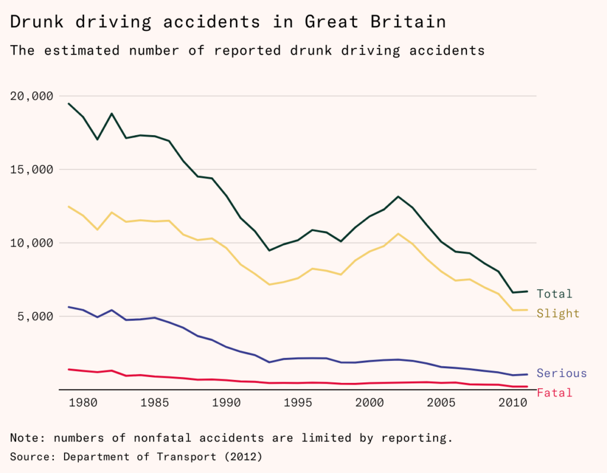
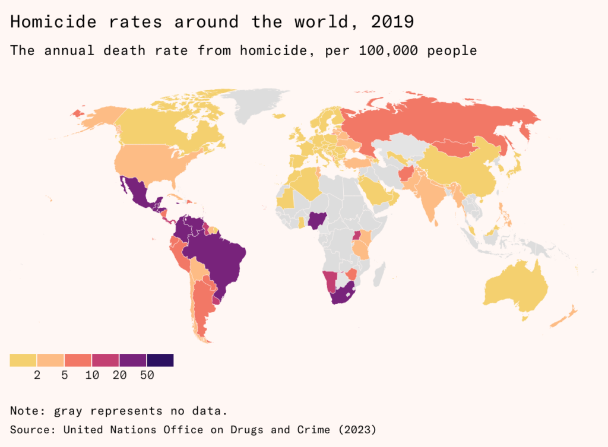
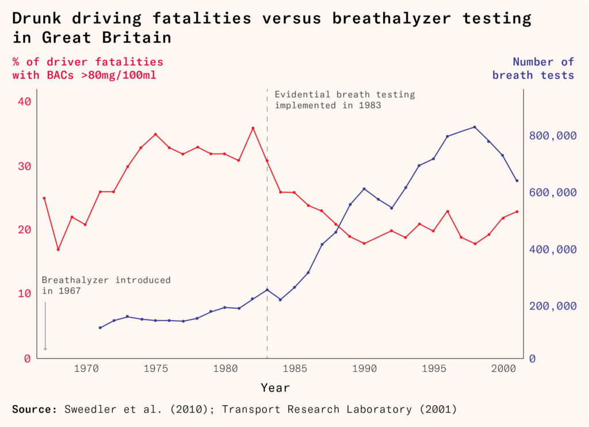
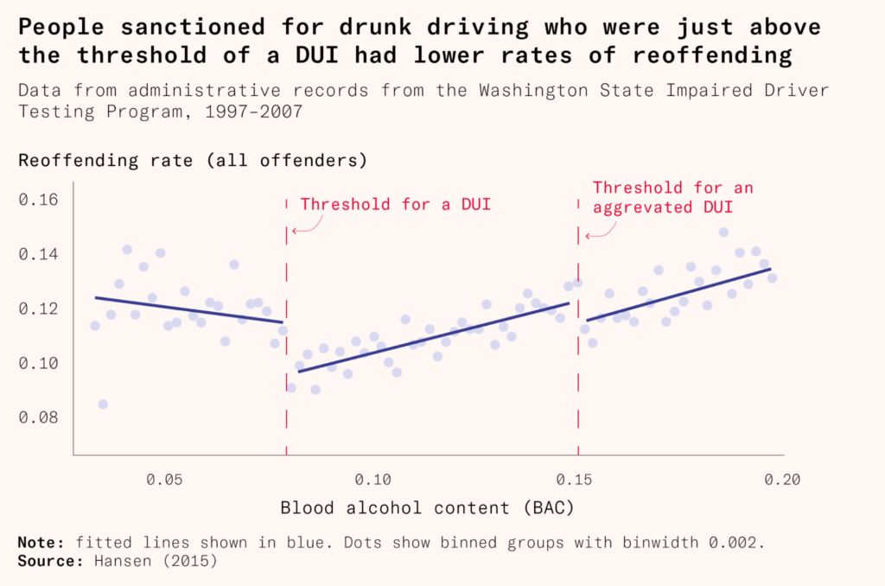
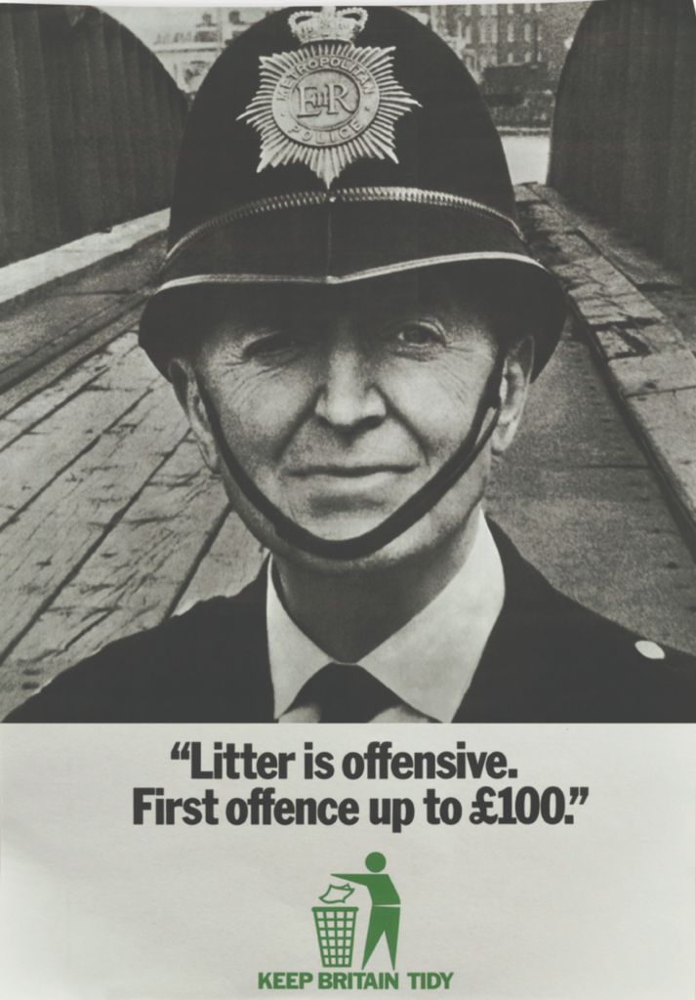
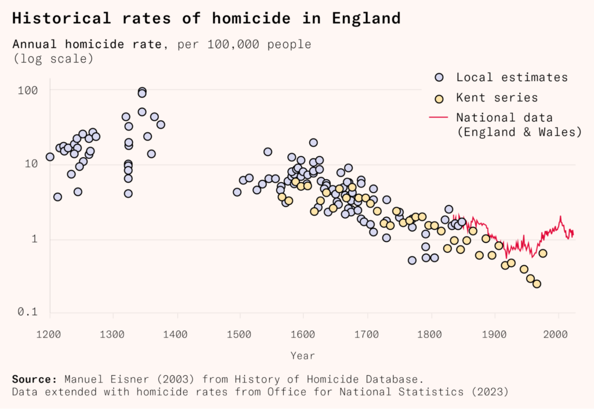

Deterrence alone might not stop crime.  

仅仅依靠威慑可能无法有效阻止犯罪。  

But, as the campaign against drunk driving shows, it could help create the norms that do.  

但正如反对酒后驾驶的运动所展示的，它可能有助于塑造这种规范。

My grandfather, an Essex doctor in general practice, was a pillar of his local community.  

我的祖父是埃塞克斯的一名全科医生，也是当地社区的重要人物。  

An anxious and conscientious man, he was the kind of doctor who would visit unwell patients late into the night just to check their cases had not deteriorated into emergencies.  

他是一个焦虑而尽责的男人，是那种医生，会在深夜去看望病人，以确保他们的病情没有恶化为紧急情况。  

His wife, my grandmother, was a magistrate.  

他的妻子，也就是我的祖母，是一位法官。

He also would drink and drive on occasion, whether coming back from the opera or the golf club.  

他也会偶尔喝酒后开车，无论是从歌剧院还是高尔夫俱乐部回来。  

After one night at [Glyndebourne](https://www.glyndebourne.com/), he recalled watching other members of the audience, including other doctors, judges, professors, and journalists, stagger out to their cars, keys in hand, before clambering into the driver’s seats.  

在格林德伯恩度过一夜后，他回忆起观看其他观众，包括其他医生、法官、教授和记者，摇摇晃晃地走向他们的车，手里拿着钥匙，然后爬进驾驶座。  

I am guessing that his well-to-do friends seldom queried his capacity to drive.  

我猜他那些富裕的朋友很少怀疑他的驾驶能力。

My grandfather reduced, although did not quite eliminate, his drunk driving following one occasion when a police officer spotted him driving far too slowly home from one such event.  

我的祖父在一次警察发现他从这样的活动回家开得太慢的事件后，减少了酒后驾车，尽管并没有完全消除。  

He was pulled over and breathalyzed.  

他被拦下来接受了呼气测试。  

He was certain he would be caught, but either the breathalyzer failed or he had metabolized just enough alcohol to be under the limit.  

他确信自己会被抓住，但要么呼吸测试仪出了故障，要么他代谢的酒精刚好低于限制标准。

My grandfather dedicated his days (and many nights) to saving lives.  

我的祖父把他的白天和许多夜晚都奉献给了拯救生命的事业。  

But he also risked lives on his nights out.  

但他在外出时也冒着危及他人生命的风险。

Viewed from the 1960s it might have seemed like ending drunk driving would be impossible.  

从 20 世纪 60 年代的视角来看，似乎结束酒后驾车是不可能的。  

Even in the 1980s, the movement [seemed unlikely](https://www.jstor.org/stable/2083166) to succeed and many researchers [questioned](https://www.jstor.org/stable/657664?casa_token=Z9PXrbl-oBAAAAAA%3Av-UqCQXmBUeUypchPNVyPk2kdh9M5XvCprZbwmEAdQIrrWdwLhDzVHjmoiM0Jw-VrhvVOz_1erzhNjXzx66vTwXa18jpKtuZUfzexD139OOYCuheAQ) whether it constituted a social problem at all.  

即使在 1980 年代，这场运动似乎不太可能成功，许多研究人员质疑它是否真正构成一个社会问题。

Yet things did change: in 1980, [1,450 fatalities](https://hansard.parliament.uk/commons/1993-10-26/debates/fcf0f2e2-0d94-4655-8c30-332d9da9403f/DrinkDriving) were attributed to drunk driving accidents in the UK. In 2020, [there were 220](https://www.gov.uk/government/statistics/reported-road-casualties-in-great-britain-provisional-estimates-involving-illegal-alcohol-levels-2020#:~:text=Provisional%20estimates%20of%20casualties%20in,central%20estimate%20of%20220%20fatalities). Road deaths in general declined much more slowly, from around 6,000 in 1980 to 1,500 in 2020.  

然而事情确实发生了变化：1980 年，英国有 1450 人死于酒驾事故。到了 2020 年，这个数字降至 220 人。总体上，道路死亡人数下降得更慢，从 1980 年的约 6000 人降至 2020 年的 1500 人。  

Drunk driving fatalities dropped overall and as a percentage of all road deaths.  

醉酒驾驶致死事故的数量总体下降，占所有道路死亡人数的比例也有所降低。

The same thing happened in the United States, though not to quite the same extent.  

美国也发生了类似的情况，尽管程度不尽相同。  

In 1980, there were around [28,000 drunk driving deaths](https://www.ncjrs.gov/ovc_archives/nvaa99/chap12.htm#:~:text=In%201980%2C%20there%20were%20approximately,increased%20substantially%20(NHTSA%201998).) there, while in 2020, there were [11,654](https://crashstats.nhtsa.dot.gov/Api/Public/Publication/813294#:~:text=In%202020%20there%20were%2011%2C654%20people%20killed%20in%20alcohol%2Dimpaired,the%20United%20States%20in%202020.).  

1980 年，该地区有大约 28,000 起酒驾死亡案例，而 2020 年则有 11,654 起。  

Despite this progress, drunk driving remains a substantial public threat, comparable in scale to homicide (of which in 2020 there were 594 in Britain and 21,570 in America).  

尽管取得了这一进展，酒后驾驶仍然是一个重大的公共威胁，与谋杀相比规模相当（2020 年英国发生 594 起，美国发生 21,570 起）。

Of course, many things have happened in the last 40 years that contributed to this reduction.  

当然，在过去的 40 年里发生了许多事情，这些事情有助于减少。  

Vehicles are better designed to prioritize life preservation in the event of a collision.  

车辆设计更注重在碰撞事件中保护生命。  

Emergency hospital care has improved so that people are more likely to survive serious injuries from car accidents.  

急诊医院护理已经改善，使得人们更有可能从车祸中幸存下来。  

But, above all, driving while drunk has become stigmatized.  

但最重要的是，酒后驾车已经受到社会的唾弃。

This stigma didn’t come from nowhere.  

这种污名并非无中生有。  

Governments across the Western world, along with many civil society organizations, engaged in [hard-hitting education](https://assets.publishing.service.gov.uk/media/5a7d9241ed915d497af703b2/Drink_Drive_IPA_Paper_2012.pdf) campaigns about the risks of drunk driving. And they didn’t just talk.  

西方世界各国政府以及许多民间社会组织开展了有力的关于酒后驾驶风险的教育宣传活动，而且他们付诸行动。  

Tens of thousands of people faced criminal sanctions, and many were even put in jail.  

数以万计的人面临刑事制裁，许多人甚至被监禁。

Two underappreciated ideas stick out from this experience.  

这次经历中有两个被低估的想法引人注目。  

First, deterrence works: incentives matter to offenders much more than many scholars found initially plausible.  

首先，威慑是有效的：对犯罪者来说，激励比许多学者最初认为的更为重要。  

Second, the long-run impact that successful criminal justice interventions have is not primarily in rehabilitation, incapacitation, or even deterrence, but in altering the social norms around acceptable behavior.  

成功的刑事司法干预对社会行为规范的改变产生的长期影响，主要不在于康复、禁锢，甚至威慑。

The techniques used to drive down drunk driving help illustrate how many crimes were brought under control in the past, and how more might be in the future.  

醉酒驾驶的打击手段有助于说明过去是如何控制了许多犯罪，并且未来可能如何控制更多犯罪。  

Deterrence can jump-start a virtuous cycle: it reduces the rate of a crime, making the crime less normal.  

威慑可以启动良性循环：它降低了犯罪率，使犯罪行为变得不那么普遍。  

Less normal crimes bring higher community sanctions, or ‘moral costs’.  

较少普通的犯罪会导致更严厉的社区制裁，或者称之为‘道德成本’。  

This further reduces the rate at which people commit the crime, making it less normal still.  

这进一步降低了人们犯罪的速率，使得这种行为更不寻常。  

This cycle cannot eliminate a crime entirely; some persistent offenders will continue to commit crimes unless they are incapacitated or rehabilitated successfully.  

这个周期无法完全消除犯罪；一些顽固的罪犯将继续犯罪，除非他们被成功地使无能为力或成功康复。  

But by using deterrence to create moral costs, we can make offenses rare, and focus enforcement efforts on the small group of those who commit crimes in spite of their costs.  

但是通过利用威慑来制造道德成本，我们可以使犯罪行为变得罕见，并将执法重点放在那些尽管成本高昂仍然犯罪的少数人身上。

**Classical deterrence works  

古典威慑是有效的**

The [classic economic explanation](https://journals.sagepub.com/doi/full/10.1177/14773708211072415) for how criminal justice interventions reduce crime is deterrence: criminals fear being caught, charged, and put in jail, or fined, and thus commit fewer crimes.  

犯罪司法干预减少犯罪的经典经济学解释是威慑：罪犯害怕被抓、被控告、被监禁或罚款，因此犯罪行为减少。

The theory of deterrence presumes potential offenders are rational actors, or at least make sensible cost-benefit calculations.  

威慑理论认为潜在的犯罪者是理性的行为者，或者至少会做出明智的成本效益计算。  

It suggests potential offenders are balancing the expected costs of crime – how likely they are to be caught, multiplied by how badly they will be punished – against the benefits of offending.  

它表明潜在的犯罪者正在权衡犯罪的预期成本，即被抓到的可能性乘以受到的严惩，与犯罪的好处之间的平衡。

According to the model, we can deter crime by raising the costs of offending, either by increasing detection – the likelihood of getting caught – or increasing the punishment for those caught.  

根据这个模型，我们可以通过提高犯罪成本来阻止犯罪，可以通过提高检测率（即被抓到的可能性）或加大对被抓到者的惩罚。  

If deterrence works as intended, it is preventative: fewer people commit crimes and society rarely has to carry out punishments.  

如果威慑力发挥预期作用，它具有预防性：犯罪的人更少，社会很少需要实施惩罚。  

Most people will not offend at all out of fear of the consequences, while habitual offenders will at least reduce their level of offending since there will be fewer instances where the crime is worth the risk.  

大多数人出于对后果的恐惧而不会犯罪，而习惯性犯罪者至少会减少犯罪的频率，因为犯罪值得冒险的情况会减少。

One striking implication of this model is that you can make up for a relatively low rate of catching criminals by increasing the severity of punishment when they are caught, thus increasing the expected cost of crime.  

这个模型的一个显著含义是，您可以通过增加犯罪分子的抓捕率来弥补相对较低的捕获率，从而增加犯罪的预期成本。  

As we will see in a moment, this will not always work as theorized: criminals are not always aware of slightly longer minimum or maximum sentences, so simply increasing the probability a criminal gets caught is likely to work better.  

正如我们即将看到的那样，这并不总是按照理论来运作：罪犯并不总是意识到略长一点的最低或最高刑期，因此仅仅增加抓获罪犯的可能性可能会更有效。

Many criminologists take a dim view of deterrence theory: they claim most people are nonresponsive to both the severity of punishment and their chances of getting caught.  

许多犯罪学家对威慑理论持怀疑态度：他们声称大多数人对惩罚的严厉程度和被抓到的机会都不太在意。  

Noncriminals, the bulk of the population, never even consider committing crimes, not because of a rational calculation but because they consider such acts to be [morally wrong](https://journals.sagepub.com/doi/10.1177/1477370811416415), the view goes.  

非罪犯，人口的大部分，甚至从未考虑犯罪，不是出于理性的考量，而是因为他们认为这样的行为在道德上是错误的。  

Those who do commit crimes don’t make rational calculations either, but instead follow what’s accepted in their community.  

那些犯罪的人并不进行理性的计算，而是跟随他们社区所认可的行为。

When looking beyond the individual to communities and countries, they argue, very little of the [remarkably wide variance in crime victimization](https://academic.oup.com/qje/article-abstract/111/2/507/1938401?login=false) observed between countries, cities, and neighborhoods is explained by more severe punishment and higher rates of apprehension.  

当我们将视线从个人转向社区和国家时，他们认为，国家、城市和社区之间观察到的犯罪受害率的显著差异，很少能用更严厉的惩罚和更高的逮捕率来解释。  

Botswana retains the death penalty, and last executed a murderer (by hanging) in 2021, but has a homicide rate of over 10 per 100,000 – high by global standards.  

博茨瓦纳保留死刑，最近一次执行死刑是在 2021 年，执行对象是一名谋杀犯（绞刑），但其谋杀率超过每 10 万人口 10 起，按全球标准来看是相当高的。  

Sweden is more forgiving of murderers – its last execution for anything was in 1910 – but has a homicide rate of only around one per 100,000.  

瑞典对谋杀犯更宽容，自 1910 年以来没有执行过死刑，但谋杀率仅约为每 10 万人中的 1 人。

Instead of simply hiking penalties and putting more cops on the block, these deterrence skeptics suggest, we need to address [social inequalities](https://academic.oup.com/book/25591/chapter-abstract/192939621?redirectedFrom=fulltext&login=false) and enact real social change.  

与其仅仅加大处罚力度并增加更多警察在岗，这些怀疑威慑效果的人士建议，我们需要解决社会不平等，并实施真正的社会变革。  

Otherwise, we fail to prevent crime and enact senselessly harsh yet ineffective punishments on those who happen to get caught.  

否则，我们将无法防止犯罪，对那些不幸被抓到的人实施毫无意义的严厉且无效的惩罚。  

For many reformers, prison especially is a blunt and cruel instrument that should be abolished and replaced with something else as a matter of urgency.  

对许多改革者来说，监狱尤其是一种迟钝而残酷的工具，应当被废除，并紧急替换为其他制度。  

Others argue that crime is [only punished because it is different](https://www.journals.uchicago.edu/doi/abs/10.1086/592425) from normal behavior, and deterrence is an excuse, rather than a true empirical relationship.  

有人认为犯罪之所以受到惩罚，是因为它与正常行为不同，而威慑只是一种借口，而非真正的经验关系。

To be fair to the deterrence skeptics, they are correct that the empirical evidence around the rational actor model is [mixed](https://www.jstor.org/stable/10.1086/670398#metadata_info_tab_contents). Some studies suggest deterrence works a bit here and there, [especially when detection is increased](https://academic.oup.com/bjc/article/59/4/800/5233006), while others find the impact to be limited or even to have [counterproductive](https://onlinelibrary.wiley.com/doi/abs/10.1111/j.1745-9133.2007.00456.x) side effects: a prison sentence [can end up increasing offending on release](https://forum.effectivealtruism.org/posts/cPDptuFTiCLr8XXkL/cause-exploration-prizes-crime-reduction).  

对于怀疑威慑效果的人来说，他们指出理性行为者模型的经验证据是混杂的是正确的。一些研究表明，威慑在某些情况下有效，特别是在增加检测时，而其他研究发现其影响有限，甚至可能产生适得其反的副作用：监禁可能会导致释放后的犯罪增加。

While the empirical literature is mixed, some of the best well-documented studies of criminal justice do demonstrate that incentives effectively reduce crime in line with what deterrence would predict.  

尽管经验文献存在分歧，但一些最为充分记录的刑事司法研究确实表明，激励措施有效地减少犯罪，符合威慑的预期。  

The evidence is strongest for increases in the likelihood of [detection](https://www.aeaweb.org/articles?id=10.1257/jel.20141147). Two studies are particularly helpful, one on apprehension and the other on punishment.  

最有力的证据表明增加检测可能性。两项研究尤为有助，一项涉及逮捕，另一项涉及惩罚。

The first [study](https://www.jstor.org/stable/23045634), from Mirko Draca, Stephen Machin and Robert Witt, has a particularly clear claim to identifying a causal connection between greater police presence – and by proxy, a greater probability of apprehension – on city streets and reduction in crime.  

Mirko Draca、Stephen Machin 和 Robert Witt 的第一项研究特别明确地指出，在城市街道上增加警力（间接地增加逮捕概率）与犯罪减少之间存在因果关系。  

The Metropolitan Police suddenly increased police patrols near London Tube stations in five central London boroughs in response to the infamous [7/7 suicide bombings in 2005](https://en.wikipedia.org/wiki/7_July_2005_London_bombings), in a move called Operation Theseus.  

大都会警察突然加强了在伦敦五个中心区的地铁站附近的警力巡逻，以应对 2005 年臭名昭著的 7/7 自杀式爆炸袭击，这一举措被称为忒修斯行动。  

The policing intervention was not intended by policymakers to address street crime as such but to prevent further terrorism.  

执法干预并非政策制定者的初衷是解决街头犯罪问题，而是为了防止进一步的恐怖主义活动。  

It was not targeted selectively to achieve a crime reduction.  

它并非有针对性地实施以达到减少犯罪的目的。  

Thus, it is what economists call a natural experiment, and it is useful for determining typical offender responses to increased police presence as opposed to the smaller-scale targeted interventions known as hot spot policing (for which the [evidence is also strong](https://youthendowmentfund.org.uk/news/targeted-policing-in-high-crime-areas-reduces-youth-violence-research-finds/)).  

因此，这被经济学家称为自然实验，有助于确定典型罪犯对增加警力的反应，与规模较小的有针对性干预措施（即热点警务）有所不同，而对此类警务的证据也很充分。

In total, police activity went up 30 percent in central London.  

在伦敦市中心，警方活动总体上增加了 30％。  

In the places where activity went up most, crime fell.  

在活动增加最多的地方，犯罪率下降了。  

For the six weeks of the policy, the affected areas saw about 12 percent lower street crime, or four fewer crimes per 10,000 people, while crimes that happen off the street, like burglary, saw no change.  

在政策实施的六周内，受影响地区的街头犯罪率下降了约 12％，即每 10,000 人减少了四起犯罪，而发生在街头以外的犯罪，如入室盗窃，则没有发生变化。  

Because different affected locations got different increases in police presence, they could work out how much each extra dose of policing helped: they found that each ten percent increase in police activity caused a three to four percent decrease in crime.  

由于不同受影响的地点增加了不同数量的警力，他们能够计算出每一次额外的警力增加对犯罪的帮助有多大：他们发现警力活动增加百分之十，犯罪率就会下降百分之三到四。

The crimes prevented due to police presence in one area didn’t appear to cause more crime to take place at another time or place.  

由于警察在某一地区的存在阻止了犯罪，似乎并没有导致在其他时间或地点发生更多的犯罪。  

There was simply less crime, meaning safer streets, presumably because offenders were worried about getting caught by all the police around.  

街道更安全，犯罪更少，可能是因为犯罪者担心被周围的警察抓住。

The other key [study](https://www.jstor.org/stable/42919318), by Brian Bell, Laura Jaitman, and Stephen Machin – this one on severity of punishment – examined the [English riots of 2011](https://en.wikipedia.org/wiki/2011_England_riots) that started, and were most intense, in London.  

Brian Bell、Laura Jaitman 和 Stephen Machin 进行的另一项重要研究，关注惩罚严重程度，调查了 2011 年在伦敦爆发并最为激烈的英国骚乱。  

Rioters looted shops, burned cars, and destroyed commercial and public buildings for three days before being quelled by the police.  

暴徒在被警方制服前连续三天洗劫商店、烧毁汽车，并摧毁商业和公共建筑。  

Between 13,000 and 15,000 people were involved in the riots in some form, and more than 5,000 offenses were recorded.  

骚乱中涉及的人数在 13,000 至 15,000 人之间，记录了 5,000 多起违法行为。

The police were initially overwhelmed, but the rioters left plenty of evidence, which later allowed several thousand rioters to be arrested and convicted of offenses including burglary, criminal damage, violent disorder, robbery, and theft.  

警方最初不堪重负，但暴徒留下了大量证据，后来导致数千名暴徒因入室盗窃、故意破坏、暴力扰乱、抢劫和盗窃等罪名被逮捕和定罪。  

Although this was not expected in advance, the judiciary, in practice Magistrates’ Courts (a quicker, jury-less lower court in England and Wales usually used for more minor offenses), decided to treat participation in the riot as an aggravating factor.  

尽管事先没有预料到，司法实践中的治安法院（英格兰和威尔士通常用于较轻微违法行为的更快、无陪审团的下级法院）决定将参与暴乱视为加重因素。  

As a result, people convicted of riot-related offenses were three times more likely to be sentenced to prison than those who committed similar offenses unrelated to the riots.  

因此，被判犯有与骚乱相关罪行的人被判入狱的可能性是犯有类似但与骚乱无关罪行的人的三倍。  

On top of that, prison sentences were around 2.5 times longer than comparable non-riot crimes.  

此外，监禁刑期比同类非暴乱犯罪长约 2.5 倍。  

Around 3,000 people received a sanction related to their activity in the riots.  

大约有 3,000 人因参与暴乱活动而受到处罚。

Criminals were listening. The riots had been heavily concentrated geographically.  

罪犯们在倾听。骚乱在地理上严重集中。  

During the riots, the main riot crimes (burglary, criminal damage, and violence against the person) went up 57 percent in 88 of the 4,760 sub-wards that make up London, and were flat in the others.  

在骚乱期间，伦敦的主要骚乱犯罪（入室盗窃、故意破坏和对人身的暴力）在由 4760 个分区组成的 88 个分区中上升了 57％，而其他地区则保持不变。  

But afterward, riot crimes fell three percent citywide, while non-riot crimes actually rose.  

但后来，全市范围内的暴乱犯罪率下降了百分之三，而非暴乱犯罪实际上上升了。  

Criminals appeared to be rationally shifting from activities they expected to be punished more seriously to ones they did not.  

罪犯似乎在理性地转移他们原本认为会受到严厉惩罚的活动，转向那些他们认为不会受到惩罚的活动。  

Because the crime drop wasn’t concentrated to the most affected areas, from which the incapacitated criminals were drawn, and because other crimes rose, it probably wasn’t coming from incapacitating the offenders: rather potential offenders unrelated to the August 2011 riots were deterred from committing crimes that they now perceived to be associated with more severe sanctions.  

由于犯罪下降并未集中在受影响最严重的地区，这些地区是犯罪分子的来源地，并且其他犯罪案件上升，因此犯罪下降可能并非源自对罪犯的剥夺能力，而是因为与 2011 年 8 月骚乱无关的潜在犯罪分子被吓阻，不再犯罪，因为他们现在认为这些犯罪行为会受到更严厉的制裁。

Deterrence has its academic skeptics, but few in the real world.  

威慑在学术界有些怀疑者，但在现实世界中却并不常见。  

Criminals do seem to commit less crime when they are more likely to get caught.  

当罪犯更容易被抓到时，他们似乎犯罪更少。  

They do seem to be somewhat responsive to the severity of punishment as well, even if they are less sensitive to punishment than apprehension.  

他们似乎对惩罚的严重性有一定的反应，尽管他们对惩罚的敏感度不如对逮捕那么高。

**Can drunk driving be deterred?  

如何有效阻止酒后驾驶？**

Even if deterrence affects how many people commit robbery, drunk driving seems like a difficult case for it.  

尽管威慑影响了多少人犯抢劫罪，但酒后驾驶似乎是一个难题。

Many drunk drivers are thought to be alcoholics.  

许多酒后驾车的人被认为有酒精成瘾问题。  

That would suggest they are not paradigmatically good long-term decision-makers. This has led some [researchers to claim](https://www.ncbi.nlm.nih.gov/pmc/articles/PMC4040307/), just as they do for other criminals, that prospective sanctions will not work on drunk drivers because of fundamental personality differences between them and the general public.  

这表明他们在长期决策方面并不是典范的好决策者。这导致一些研究人员认为，就像对待其他犯罪分子一样，由于他们与普通公众之间存在根本的个性差异，预期的制裁对酒后驾车者不起作用。  

What’s more, drunk driving has a very low detection rate.  

此外，醉酒驾驶的检测率非常低。  

Can people really be worrying about getting caught when so few who drive under the influence are detected at all?  

有那么少的酒后驾车者被检测到，人们真的会担心被抓到吗？

In fact, these researchers are too pessimistic.  

实际上，这些研究人员过于悲观了。  

Drunk driving was deterred and reduced much like other crimes.  

醉酒驾驶的发生得到了遏制和减少，就像其他犯罪一样。

While being drunk in charge of a road vehicle had been illegal since the outset of motoring in the United Kingdom, it was only in 1967 that a formal legal limit (80 milligrams of alcohol per 100 milliliters of blood – or 35 micrograms per 100 milliliters of breath) was introduced.  

尽管自从机动车辆问世以来，在英国酒后驾驶一直是违法的，但直到 1967 年才设立了正式的法定限制（每 100 毫升血液中的酒精含量为 80 毫克，或每 100 毫升呼吸中的酒精含量为 35 微克）。

Because of the new feasibility of enforcement, plus the emergence of a grassroots movement opposing it, many governments started campaigns to reduce drunk driving.  

由于执法的新可行性以及草根运动的兴起反对酒后驾车，许多政府开始了减少酒后驾车的运动。  

The widespread deployment of mobile breathalyzers made detecting drunk driving more feasible and immediate, with British police carrying out 800,000 tests in 1998 when they peaked, up from 100,000 in 1971.  

移动呼吸测试仪的广泛应用使得检测酒后驾驶变得更加可行和即时，英国警方在 1998 年达到峰值时进行了 80 万次测试，比 1971 年的 10 万次增加了。

As drunk driving prevention became a greater policing priority, the sanctions for drunk driving, and especially causing death by dangerous driving, were increased substantially, eventually including extended prison sentences.  

随着酒后驾驶预防成为执法的重点，对酒后驾驶的处罚，尤其是由危险驾驶造成死亡的处罚，得到了大幅提高，最终包括延长监禁刑期。  

For example, the UK’s 1988 Road Traffic Offenders Act had a maximum prison sentence of five years for causing death by dangerous driving.  

例如，1988 年英国道路交通违法者法案规定，危险驾驶致人死亡最高可判五年监禁。  

In 1993, it was raised to ten years. From 2022, the maximum penalty was life imprisonment.  

1993 年，刑期延长至十年。自 2022 年起，最高刑罚为无期徒刑。  

During this period, new offenses for causing death by careless driving (for example, by inattention to other road users or by tailgating) and causing serious injury by dangerous driving were introduced.  

在这段时期内，引入了新的罪行，如因疏忽驾驶而造成死亡（例如，对其他道路使用者疏忽不顾或尾随）以及因危险驾驶造成严重伤害。  

Prosecutors charge people for these offenses with [some regularity](https://www.sentencingcouncil.org.uk/wp-content/uploads/Motoring-Statistical-Bulletin.pdf) (between 100 and 250 prosecutions a year in Britain for most offense types).  

检察官定期对这些罪行的犯罪嫌疑人提起诉讼（英国每年对大多数罪行类型进行 100 到 250 起起诉）。

One thing is immediately obvious, given the decline of drunk driving: while some significant subgroup of drunk drivers were alcoholics, most were not.  

有一件事情显而易见，随着酒后驾车的减少：虽然一些重要的醉酒驾驶者是酗酒者，但大多数并非如此。  

A great many people who previously considered drunk driving, like my grandfather, became far more likely to refrain.  

许多人，包括我的祖父在内，以前认为酒后驾车是可以接受的，但现在更倾向于克制自己。  

This suggests an important conclusion: even if some offenders are truly irrational actors, many are surprisingly responsive to incentives even when their reasoning is impaired.  

这表明一个重要的结论：即使一些犯罪者确实是非理性的行为者，许多人在他们的推理受损时仍然对激励措施有惊人的响应。

We know that fatalities from drunk driving [dropped](https://www.tandfonline.com/doi/pdf/10.1080/15389580490465175) during the period that breathalyzer testing ramped up and sanctions increased. But was this causation or coincidence?  

我们知道，在呼吸测试加强和制裁加重的时期，醉酒驾驶造成的死亡人数有所下降。但这是因果关系还是巧合呢？

In the United Kingdom, there are not many studies with research designs that credibly isolate the impact of these changes.  

在英国，很少有研究采用能够可靠地分离这些变化影响的研究设计。  

Fortunately, parts of the United States adopted a similar range of policies over the same period.  

幸运的是，美国的一些地区在同一时期采取了类似的政策范围。

As with other deterrence studies, the literature on drunk driving does suggest that increased detection lowered rates of drunk driving.  

与其他威慑研究类似，关于酒后驾驶的文献确实表明，增加检测可以降低酒后驾驶率。  

It is slightly more skeptical about increased severity, though the totality of evidence does support the role of harsher punishments.  

它对增加严重性持稍许怀疑态度，尽管所有证据确实支持更严厉惩罚的作用。

[One study](https://www.aeaweb.org/articles?id=10.1257/pol.6.2.231) examined times when police highway patrols were reduced due to budget cuts.  

一项研究调查了警察公路巡逻因预算削减而减少的情况。  

When there were fewer officers on the road, there was a closely associated increase in road fatalities.  

当路上的警察数量减少时，道路死亡人数也随之增加。  

This suggests that police officers – and the risk of detection brought with them – not only deterred drunk driving but all sorts of reckless driving behaviors.  

这表明警察——以及随之而来的检测风险——不仅可以阻止酒后驾驶，还可以阻止各种鲁莽驾驶行为。

In terms of severity of punishment, the academic evidence on automatic [license suspensions](https://www.sciencedirect.com/science/article/abs/pii/S0749379798001196) for drunk drivers is mixed: it seems to have worked in some states but not others. [But one study](https://www.jstor.org/stable/43495428) from Benjamin Hansen makes it seem almost certain that sanction severity reduces drunk driving – in addition to the work detection is doing.  

就惩罚醉酒驾驶者自动吊销驾照的严重程度而言，学术证据存在分歧：在一些州似乎起到了作用，但在另一些州则没有。但本杰明·汉森（Benjamin Hansen）的一项研究几乎可以肯定地表明，制裁的严重性可以减少醉酒驾驶 - 除了检测工作正在进行的工作。

Washington State police kept over half a million individual records of drunk driving cases between 1995 and 2011.  

华盛顿州警方在 1995 年至 2011 年期间保留了超过 50 万起酒驾案例的个人记录。  

At that time, Washington had the same standards as Britain for drunk driving – 0.08 percent in the blood, or 80 milligrams per 100 milliliters.  

那时，华盛顿的酒后驾驶标准与英国相同，即血液中的酒精含量为 0.08％，或每 100 毫升 80 毫克。

Under this sanction regime, if you are caught with a blood alcohol concentration just above a threshold, you will be punished much more harshly than someone who was caught driving just under a threshold.  

在这种制裁体制下，如果你被发现血液酒精浓度略高于阈值，你将受到比被发现驾驶略低于阈值的人更严厉的惩罚。  

Since you can’t target an exact percentage point of alcohol in the blood, those who were measured at .08 would be similar to those with a .079 level, except for the fact that they would be punished.  

由于无法准确确定血液中的酒精百分比，被测量为 0.08 的人与 0.079 水平的人相似，唯一的区别是前者将受到惩罚。  

It turned out those sanctioned for drunk driving did have a lower chance of being caught drunk driving again – ten percent for those sanctioned versus 12 percent for those who were under the limit, or about a sixth lower.  

事实证明，那些因酒后驾驶受到制裁的人再次被抓到酒后驾驶的机会较低 - 受到制裁者的机会为百分之十，而那些处于限制之下的人的机会为百分之十二，大约低了六分之一。  

This represents a substantial reduction especially when considering this is a policy regime applied to every driver who drinks in Washington State, rather than a subgroup of offenders, and that many of the costs (such as a fine and driving license suspension) fall on the offender.  

这代表了一项显著的减少，尤其是考虑到这是适用于华盛顿州每位酒后驾驶者的政策制度，而不是一小部分违规者，并且许多成本（如罚款和驾驶执照暂扣）都由违规者承担。  

It compares favorably to [rehabilitation programs](https://www.tandfonline.com/doi/full/10.3109/00952990.2014.966199) focused on repeat offenders that can show larger reductions but for smaller populations.  

它与专注于惯犯的康复计划相比，虽然可以展示更大的减少，但适用于较小的人群。

There were other ways to raise the severity of punishment besides jail time.  

除了监禁之外，还有其他方法可以提高惩罚的严厉程度。  

Prosecutors and judges used a wide range of punishments – fines, imprisonment, and driving bans – as well as rehabilitative requirements such as compulsory attendance of Alcoholics Anonymous meetings.  

检察官和法官采取了多种惩罚措施，包括罚款、监禁和吊销驾照，同时还要求进行康复，如强制参加戒酒无名会议。  

One powerful intermediate sanction was requiring an offender to fit their car with an interlock device (at their own expense) that prevents the engine from starting unless the driver passes an automated breathalyzer test. Encouragingly, in this study those who were banned from driving continued to commit fewer driving offenses after their driving ban elapsed.  

一种强有力的中间制裁是要求罪犯自费为他们的汽车安装一个防盗装置，该装置会阻止发动机启动，除非驾驶员通过自动呼气测试。令人鼓舞的是，在这项研究中，那些被禁止驾驶的人在驾驶禁令结束后继续犯较少的交通违法行为。

All of these estimates for deterrence are almost certainly a lower bound.  

所有这些关于威慑的估计几乎肯定是一个保守估计。  

For example, the Washington study only compares drivers who had lucky near misses with those who were caught driving just above the limit.  

例如，华盛顿的研究仅比较那些幸运地险些发生事故的司机与那些被抓到超速的司机。  

Many drivers, similar to my grandfather, might have altered their behavior after experiencing near misses where they were stopped by police and marginally passed a breathalyzer test. The Washington study measures the effectiveness of the sanctions by how much more it reduced recidivism than a near miss – but if near misses also reduce drunk driving then the impact was undercounted.  

许多司机，就像我的祖父一样，在经历了几次险些被警察拦下并勉强通过呼吸测试后，可能已经改变了他们的行为。 华盛顿的研究通过制裁的效果来衡量，看它比险些被警察拦下后减少再犯率多少 - 但如果险些被警察拦下也减少了酒后驾驶，那么影响就被低估了。  

On top of that, many drivers, deterred by the prospect of being tested and sanctioned, could have avoided driving anywhere close to the limit at all.  

此外，许多司机可能会避免靠近极限附近驾驶，因为他们担心会被检测和受到制裁。

Contrary to the hard-core skeptics, deterrence is important even for drunk driving.  

与那些极端怀疑论者相反，威慑对于酒后驾驶也是至关重要的。  

At the same time, deterrence cannot actually explain most of the decline in drunk driving: drunk driving fell by five times over this period, vastly more than what would be expected from studies of deterrence.  

与此同时，威慑并不能完全解释酒后驾驶减少的大部分原因：在这段时间内，酒后驾驶减少了五倍，远远超过了威慑研究所预期的数量。  

This is where the skeptical criminologists have a point: social norms are important too.  

这正是怀疑犯罪学家有一定道理的地方：社会规范也非常重要。

**Moral costs  

道德成本**

When skeptical criminologists write about the role of norms, it is usually in contrast to the incentives faced by rational actors.  

当怀疑论犯罪学家讨论规范的作用时，通常是与理性行为者所面临的激励相对比。  

In fact, they are deeply intertwined.  

实际上，它们是密不可分的。

Social norms function as a type of cost – call them moral costs – which can be treated within a rational actor model.  

社会规范起到一种成本的作用 - 将其称为道德成本 - 可以在理性行为者模型中加以考虑。  

And these norms are created, in part, by the severity of punishment for a crime.  

这些规范在一定程度上是由对犯罪的惩罚严厉程度所塑造的。

When we [incorporate norms as moral costs](https://www.jstor.org/stable/40752536?seq=1#metadata_info_tab_contents) into the cost-benefit analysis that potential offenders theoretically perform when considering whether to commit crime, it is clear that, unlike standard legal costs, these moral costs are experienced differently by different people.  

当我们将规范作为道德成本纳入潜在犯罪者在考虑是否犯罪时进行的成本效益分析中时，很明显，与标准法律成本不同，这些道德成本在不同人身上的体验是不同的。  

A potential offender in a low-crime milieu might view them as quite severe, as it would be a significant break from their community.  

在低犯罪环境中，潜在的犯罪者可能会认为这些措施非常严厉，因为这将与他们的社区产生重大分歧。  

A potential offender in a high-crime milieu might see them as quite low, as they would simply be acting like everyone else.  

在高犯罪环境中，潜在的犯罪者可能会认为他们的风险很低，因为他们只是像其他人一样行事。

Still, how do we explain these moral costs?  

然而，我们如何解释这些道德成本呢？  

One aspect is whether committing the crime is normal in a community.  

一个方面是犯罪在社区中是否被视为正常行为。  

Individuals want to know how other people will (or would hypothetically) judge their behavior.  

个人想知道其他人将如何（或假设性地将如何）评价他们的行为，这是人们的需求。  

If crime is normal in their community, an offender will correctly judge that people will still think they are normal if they commit the occasional crime.  

如果在他们的社区犯罪是常态，罪犯会准确地判断，即使他们偶尔犯罪，人们仍然会认为他们是正常的。

Interestingly, criminal justice can influence this perception of normality.  

有趣的是，刑事司法可以影响人们对正常的看法。  

Being caught and processed, even without any further penalty, sends a powerful message to many people: this is not normal.  

被捕获和处理，即使没有进一步的惩罚，也向许多人传达了强烈的信息：这不正常。  

The process of police observation and detection helps to highlight that the community takes bad conduct seriously without necessarily requiring a heavy sanction.  

警察的观察和侦查过程有助于凸显社区认真对待不良行为，而不一定需要严厉的制裁。

Publicizing punishments can undergird this process.  

公开惩罚可以支持这个过程。  

Governments frequently disseminate anti–drunk driving messages in print, on television, on roadside signs, and increasingly via text and social media, highlighting the health risks to oneself and others, as well as the legal consequences if caught.  

政府经常通过印刷品、电视、路边标志，以及越来越多地通过短信和社交媒体传播反酒后驾驶的信息，强调对自己和他人的健康风险，以及被抓到的法律后果。  

One reason why they might not always work is that media exposure can unintentionally raise the salience of drunk driving, making it perversely seem more normal.  

他们可能不总是有效的一个原因是，媒体曝光可能会无意中提高酒后驾车的关注度，使其看起来更正常。  

This is precisely what you want to avoid when dealing with occasional suspects who are more worried about what is normal than what is harmful.  

这正是您在处理偶发嫌疑人时要避免的情况，他们更担心的是什么是正常的，而不是什么是有害的。  

Nevertheless, anti–drunk driving campaigns that focus both on enhanced enforcement and the legal consequences of getting caught have been found to [reduce drunk driving](https://www.sciencedirect.com/science/article/pii/S1744224904002360) in a variety of circumstances.  

然而，专注于加强执法和强调被抓到后的法律后果的反酒后驾驶运动已被证实能在各种情况下减少酒后驾驶。

There may also be scope to use the promotion of certain social norms to reduce drunk driving, not just the deterrence itself.  

也许还可以通过促进某些社会规范来减少酒后驾驶，而不仅仅依靠威慑手段。  

One quasi-experimental study looked at a mass media campaign that took place from 2002 to 2003 aimed at young adults in Montana, premised on precisely telling drivers what was normal behavior rather than what was harmful.  

一项准实验研究调查了 2002 年至 2003 年在蒙大拿州针对年轻成年人进行的大众传媒宣传活动，其目的是准确告知驾驶者什么是正常行为，而非有害行为。  

The study split Montana up into three regions: the western part was subject to a TV and radio campaign supplemented by cinema, newspaper, and poster advertising.  

研究将蒙大拿州划分为三个地区：西部地区接受了电视和广播广告的宣传，同时还有电影院、报纸和海报广告的补充。  

A representative slogan was ‘Most Montana young adults (4 out of 5) don’t drink and drive’.  

大多数蒙大拿州年轻成年人（五分之四）不酒后驾车，这是一个代表性口号。  

The eastern region was treated as a control, surveyed and studied without any intervention, while the central part was treated as a buffer zone where the media intervention was expected to produce some spillover.  

东部地区被视为对照组，进行调查和研究，没有任何干预，而中部地区被视为缓冲区，预计媒体干预会产生一些外溢效应。

Critically, the information disseminated through the campaign was an accurate summary of what Montanans reported doing.  

重要的是，该活动传播的信息准确概括了蒙大拿州居民所报告的活动。  

Drunk driving is deviant behavior in Montana but young people were not aware of quite how deviant it is.  

醉酒驾驶在蒙大拿州被视为不良行为，但年轻人并不了解它的严重性。  

A series of random phone surveys before, during, and after the intervention measured the impact of the campaign.  

通过一系列随机电话调查，在干预活动之前、期间和之后测量了广告活动的影响。  

The advertising caused young people in the intervention counties in western Montana to update their perception relative to the control counties.  

广告导致蒙大拿西部干预县的年轻人更新了他们对控制县的看法。

A significant [shift was to norms](https://www.socialnormsresources.org/casestudies/montanadwi.php) around having a designated driver.  

一个重要的变化是关于指定驾驶员的规范发生了转变。  

Over 40 percent of young Montanans surveyed said they personally always had a designated sober driver when planning to go out drinking while only 30 percent believed that others engaged in this practice.  

超过 40％的蒙大拿州年轻人在调查中表示，他们在计划外出喝酒时，个人总是有指定的代驾司机，而只有 30％的人认为其他人会采取这种做法。  

After the intervention, the treated group estimated that just under 40 percent of their peer group, young Montanans, used designated drivers while the control group had remained roughly the same.  

在干预之后，治疗组估计他们的同龄蒙大拿人中有将近 40％使用指定司机，而对照组保持基本不变。  

In other words, the treated group’s estimate of designated driver use was higher and closer to the reality based on the same survey’s self-reported use.  

换句话说，治疗组对指定驾驶员使用的估计更高，更接近于同一调查中自我报告使用的实际情况。  

The treated group was significantly more likely to report using a designated driver themselves than the control group.  

处理组报告使用指定司机的可能性明显高于对照组。  

The study also found a small but statistically significant reduction in road fatalities related to alcohol use compared to the control region.  

研究还发现，与对照地区相比，与酒精相关的道路死亡人数有所减少，虽然幅度较小，但在统计上是显著的。

This study and others like it suggest that the public perception of norms can be inaccurate and media interventions can play a role in updating them.  

这项研究以及其他类似研究表明，公众对规范的认知可能存在误差，而媒体干预可以在更新这些认知方面发挥作用。  

Other advertising campaigns around the world at the same time [emphasized the shamefulness of drunk driving](https://www.youtube.com/watch?v=syo4decSDkM), and are widely seen as having shifted social norms around it.  

其他国家在同一时间的广告活动中强调了酒后驾车的可耻行为，被广泛认为已经改变了社会对此的规范。  

Nevertheless, these public campaigns worked because they were backed by a credible threat of detection and sanction.  

然而，这些公共宣传活动之所以取得成功，是因为它们背后有可信的检测和制裁的威胁支持。

This need for publicity to create common knowledge of social stigma helps explain why detection is commonly found to be a stronger mechanism of deterrence than severity of punishment: more instances of detection can raise the moral cost of a crime more than a single long sentence.  

为了公众普遍了解社会污名，宣传的需求有助于解释为何检测通常被发现是比惩罚严重性更强的威慑机制：检测的更多实例可能比单一的长期刑罚更能提高犯罪的道德成本。  

But it also helps explain why severe sentences can work too in some contexts: a more severe sentence reflects a more serious social judgment.  

但它也有助于解释为什么在某些情境中严厉的刑罚也能奏效：更严厉的刑罚反映了更严肃的社会评判。

Taken as a whole, the evidence suggests an interesting model: moral costs add to the overall costs of committing a crime, but these moral costs are, at least in part, driven by the severity of punishment.  

从整体来看，证据表明一个有趣的模型：道德成本增加了犯罪的总成本，但这些道德成本至少部分是由惩罚的严重程度驱使的。

**Conditional offenders: more common than you think  

有条件犯罪者：比你想象的更普遍**

Are other criminals like drunk drivers? It depends on the crime.  

其他罪犯是否像酒后驾车者一样？这取决于犯罪的性质。

We can call people who may or may not commit crimes based on the degree of moral costs conditional offenders.  

我们可以根据道德成本的程度来称呼那些可能犯罪或可能不犯罪的人为有条件的罪犯。  

Where crime is low, they will sense that offending is wrong, and most crimes will be committed by hard cases who are resistant to social considerations.  

在犯罪率低的地方，人们会意识到犯罪是错误的，大多数犯罪行为将由那些不受社会考虑影响的顽固分子所犯。  

However, in a high-crime environment, the much larger group of conditional offenders will commit a great many offenses when added together.  

然而，在高犯罪环境中，当更大规模的有条件犯罪者群体汇聚在一起时，将会犯下大量犯罪行为。  

Because crime is normalized, and indeed they face the prospect of being victimized themselves, they will not feel as much guilt in participating.  

由于犯罪已经被视为正常现象，而且他们自己也可能成为受害者，因此在参与其中时，他们不会感到太多的内疚。

This may have been the secret sauce in the campaign against drunk driving: most offenders were actually conditional offenders, who normally did not commit crimes but saw little moral sanction against drunk driving.  

这可能是打击酒后驾车活动中的秘密武器：大多数违法者实际上是有条件的违法者，他们通常不犯罪，但对酒后驾车却没有太多道德制裁。  

Detection increased, which played some role in discouraging drunk driving.  

检测增加有助于遏制酒后驾驶。  

But most important was making society’s dislike of the crime credible with penalties and common knowledge created by stories of those punishments and bolstered by [advertising](https://meltingasphalt.com/ads-dont-work-that-way/).  

但最重要的是，通过刑罚和广告强化的惩罚故事，让社会对犯罪的厌恶变得更加可信。

People came to understand that to drive drunk would be to deviate from group norms. This created the virtuous cycle where drunk driving became increasingly infrequent, and therefore increasingly deviant (i.e., decreasingly normal).  

人们开始意识到酒后驾车会偏离群体规范。这导致了一种良性循环，酒后驾车变得越来越少见，因此越来越不正常。  

Today, most of us wouldn’t dare to drive drunk – but we might not have felt the same way in 1970.  

今天，大多数人不敢酒后驾车，但在 1970 年可能并不是这样。

Can this experience be generalized?  

这个经验可以推广吗？  

An objection to this story is that it’s plausible for something like drunk driving, but not so much for other major crime categories like violence or theft.  

对这个故事的异议是，酒后驾驶之类的事情看起来是合理的，但对于其他主要犯罪类别，比如暴力或盗窃，就不太可能了。  

At least concerning theft, the logic can be readily extended.  

至少在盗窃问题上，这种逻辑可以很容易地推广。  

My record is not spotless: I illegally downloaded and shared an enormous volume of copyrighted music, films, and TV shows in my youth before platforms like Spotify and Netflix rendered on-demand listening and watching cheap and convenient.  

我的记录并不完美：在年轻时期，我曾非法下载和分享大量受版权保护的音乐、电影和电视节目，直到像 Spotify 和 Netflix 这样的平台让点播听歌和看电视变得便宜和便利。  

People I know still see torrenting as normal, and acceptable, and would be very unlikely to turn their nose up at it.  

我认识的人仍然认为下载种子是一种正常且可以接受的行为，他们很少会对此抱有偏见。  

Here I am a conditional offender. I, and many others, were undeterred by the [famously aggressive](https://journals.sagepub.com/doi/full/10.1177/14773708211072415) and ubiquitous ‘You wouldn’t steal a purse’ anti-piracy notices disseminated during my youth.  

我是一个有条件的违法者。在我年轻时，我和许多人一样，并不被那些著名的侵权通知“你不会偷一个钱包”所吓倒。  

This was probably because mere consumers of pirated material were seldom sanctioned and this was well-known.  

这可能是因为盗版材料的普通消费者很少受到制裁，这一点是众所周知的。  

Without enforcement suggesting those crimes were truly morally blameworthy, I felt little moral cost.  

没有强制执行，表明这些犯罪真正是道德上应受责备的，我感到几乎没有道德成本。

In fact, many cases of declines in crime are similar to the drunk driving story: increased enforcement and punishment created common knowledge that society is against some socially harmful activity, and thereby driven most conditional offenders out.  

实际上，许多犯罪率下降的案例都与酒后驾驶的故事相似：加强执法和惩罚造成了一个共识，即社会反对某些对社会有害的行为，从而将大多数有条件的违法者排斥出社会。

Approaches to tackling litter illustrate both the potential value of creating a common norm but also its limitations without enforcement.  

处理垃圾的方法展示了创造共同规范的潜在价值，但也揭示了在没有执行力的情况下的局限性。  

Littering was once thought to be widely permissible. In fact, it was widely legal.  

乱丢垃圾曾一度被认为是普遍允许的行为。实际上，这是合法的。  

That began to change in the 1950s, as communities around the world united to oppose litter.  

20 世纪 50 年代开始，随着全球各地社区的团结反对垃圾，情况开始发生变化。  

In 1971, punishments in the UK got much stricter with the Dangerous Litter Act, which raised maximum fines from £10 to £100, almost £2,000 now.  

1971 年，英国通过《危险垃圾法案》，将最高罚款从 10 英镑提高到 100 英镑，几乎相当于现在的 2000 英镑，使惩罚变得更加严厉。  

Common knowledge of the punishment driven by mass campaigns has made it clear that society condemns littering.  

众所周知，通过大规模运动推动的惩罚已经清楚地表明社会谴责乱丢垃圾。  

Did this make littering more rare?  

这是否导致乱丢垃圾变得更少？  

It is hard to assess from a counterfactual, especially given the growth of key sources of litter such as fast-food outlets, but litter is still [considered a significant problem](https://www.gov.uk/government/publications/litter-and-littering-in-england-data-dashboard/litter-and-littering-in-england-2017-to-2018) in much of the UK.  

从反事实的角度来评估很困难，尤其是考虑到快餐店等主要垃圾来源的增长，但在英国的许多地方，垃圾仍然被认为是一个重要问题。  

Rather than adapting their behavior to the public norm, many people appear to have adopted different interpretations of what constitutes littering.  

与其调整行为以符合公众规范，许多人似乎选择了不同的解释来定义什么是乱丢垃圾。  

More recent campaigns have tried to tackle this by [highlighting](https://www.keepbritaintidy.org/news/one-four-admit-carefully-littering) that so-called careful littering is still a crime.  

近期的广告活动试图解决这一问题，强调所谓的“小心乱扔垃圾”仍然构成犯罪。

A moral cost enforced with a punishment.  

通过惩罚施加的道德成本。

Image  

图片

Source: Keep Britain Tidy  

来源：英国保持整洁

This experience contrasts with Singapore, which has gone from suffering waste as [a major public health hazard](https://www.towardszerowaste.gov.sg/zero-waste-masterplan/chapter1/our-past/#:~:text=In%201964%2C%20only%20around%2060,the%20hot%20and%20humid%20weather.) in the 1960s to remarkably low levels of litter today, and substantially less than any major city in the UK.  

这种经历与新加坡形成鲜明对比。新加坡在 20 世纪 60 年代曾经历废物成为主要公共卫生危害，如今的垃圾水平显著降低，远远低于英国任何主要城市。  

Singapore, of course, has famously harsh criminal penalties for offenses such as drug trafficking.  

新加坡对于诸如毒品走私等犯罪行为有着严厉的刑罚制度。  

In the case of littering, however, Singapore is not quite so far out of line with the UK in terms of punishment severity.  

但是，在扔垃圾的情况下，新加坡的惩罚严厉程度与英国并不相去甚远。  

A litterer faces a S$300 (£176) fine for a first offense (and occasionally just a warning), compared to an £80 fixed penalty notice in the UK.  

对于第一次违规，乱扔垃圾者将面临 300 新元（176 英镑）的罚款（有时只是警告），相比之下，英国的固定罚单是 80 英镑。  

The real difference is enforcement.  

实际上的区别在于执行的严格程度。  

Despite facing little visible litter, Singapore’s authorities issued around [20,000 penalty tickets](https://www.todayonline.com/singapore/more-people-caught-littering-singapore-last-year-over-20000-tickets-issued-nea-report-2277026#:~:text=Those%20who%20litter%20may%20face,issued%20from%202020%20to%202022.) last year (between 3 and 4 fines for every 1,000 Singaporean residents).  

尽管新加坡几乎没有明显的垃圾问题，但去年当局开出了约 20,000 张罚单（相当于每 1,000 名新加坡居民中有 3 到 4 张罚单）。  

Singapore’s relatively highly law-abiding population still faces constant reminders of the social sanction for littering.  

新加坡相对守法的人口仍然不断受到乱丢垃圾的社会制裁的提醒。  

By contrast, [91,000 fines](https://www.theguardian.com/environment/2023/aug/10/record-number-english-welsh-councils-private-firms-litter-fines) were issued in England and Wales (1.5 for every 1,000 residents) in 2021/2022.  

相比之下，2021/2022 年在英格兰和威尔士共开出了 91,000 张罚单，相当于每 1,000 名居民中有 1.5 张罚单。  

Enforcement is patchy, with [some local authorities](https://www.theguardian.com/environment/2020/aug/27/councils-england-wales-littering) barely enforcing this area of the law at all.  

执法不严格，一些地方政府几乎没有执行这方面的法律。

Without enforcement, conditional offenders are able to justify their occasional littering to themselves if nobody else on the basis that it is harmless, unintended, or caused by an inconvenient lack of rubbish bins.  

没有强制执行，有条件的违规者可以向自己辩解，认为偶尔乱丢垃圾是无害的、无意的，或者是由于缺少方便的垃圾桶。  

In Singapore, there is less opportunity for the conditional offender to hide from the moral cost.  

在新加坡，条件犯罪者很难逃避道德责任。

Remarkably, even murder may be like this.  

令人惊讶的是，甚至谋杀也可能是这样的。  

According to the best available evidence, homicide rates were [50 or 100 times higher in the 1300s](https://academic.oup.com/bjc/article-abstract/41/4/618/468305?login=false%5C%5C), across Europe, than they are today.  

根据现有的最佳证据，1300 年代欧洲的谋杀率比今天高出 50 到 100 倍。  

It was simply considered normal – even admirable – to prosecute feuds and escalate drunken fights over honor into potential killings.  

人们简单地认为起诉仇恨，将荣誉之争升级为潜在的杀戮，甚至被视为正常行为，甚至值得钦佩。  

These [norms steadily changed](https://www.vrc.crim.cam.ac.uk/system/files/documents/manuel-eisner-historical-trends-in-violence.pdf), in substantial part because governments gained the capacity and desire to punish perpetrators.  

这些规范逐渐变化，主要是因为政府具备了惩罚加害者的能力和意愿。  

Blood feuds and brawls turned into ritualized duels, and eventually self-control became normal and impulsiveness deviant.  

血仇和斗殴逐渐演变为仪式化的决斗，最终自我控制变得普遍，冲动则成为异常行为。  

It is widely argued that the honor culture of the US South [helps to explain](https://www.researchgate.net/publication/228261113_A_History_of_Violence_The_Culture_of_Honor_as_a_Determinant_of_Homicide_in_the_US_South#:~:text=According%20to%20the%20culture%20of,but%20only%20in%20the%20South.) why murder rates are higher there today.  

人们普遍认为美国南部的荣誉文化有助于解释为什么那里的谋杀率较高。

When you know how to look, you start finding conditional offenders everywhere.  

当你学会如何观察时，你会发现无处不在的违规行为者。  

I was surprised to find out that two well-to-do friends, one now an economist and the other a philosopher, stole food on occasion as undergraduates.  

我惊讶地发现，两位富裕的朋友，一位现在是经济学家，另一位是哲学家，大学时偶尔偷食物。  

A classic method is ‘mistakenly’ failing to scan concealable items at a self-checkout ([one study](https://journals.sagepub.com/doi/epub/10.1177/1748895816643353) from Emmeline Taylor suggests that up to a third of self-checkout users have committed theft).  

一个经典的方法是在自助结账时“错误地”未扫描可隐藏的物品（Emmeline Taylor 的一项研究表明，高达三分之一的自助结账用户曾经犯过盗窃行为）。  

This might be justified out of necessity (stealing food when they were young or poor) or in pursuit of a bit of excitement and rebellion.  

这可能是出于必要（比如年轻或贫困时偷食物）或追求一点刺激和叛逆。  

Since the detection of shoplifting is low and the detection of theft at self-checkouts is likely even lower, the moral sanctions against committing that sort of theft are weak.  

由于商店盗窃的检测率较低，自助结账处盗窃的检测率可能更低，因此对这种盗窃行为的道德制裁较弱。

[Five percent of the potential UK tax take](https://www.theguardian.com/politics/2021/sep/16/tax-lost-in-uk-amounts-to-35bn-almost-half-say-campaigners-due-to), and [about ten percent of the US equivalent](https://www.irs.gov/newsroom/the-tax-gap), is lost to tax evasion, a huge fraction of which is driven by paying cash and not declaring the transaction.  

英国潜在税收的百分之五，以及美国相应的大约百分之十，因逃税而流失，其中很大一部分是由于使用现金支付而未申报交易。  

Even people who do this, who would never think of themselves as criminals, become criminals under the conditions of low enforcement and little moral cost.  

即使是从未认为自己是罪犯的人，在执法不严和道德成本低的情况下，也会变成罪犯。

But if the story of drunk driving is instructive, there might be a similar path forward here.  

但如果酒后驾车的故事具有启示作用，这里可能会有类似的发展方向。  

Higher penalties and better enforcement can make a behavior less normal, and by becoming less normal, and more deviant, the actions carry greater moral costs for nearly everyone.  

更严厉的惩罚和更有效的执法可以使某种行为变得不太普遍，随着变得不太普遍和更加偏离常态，这些行为对几乎每个人都带来更大的道德成本。

**Criminals carry and spread bad social norms  

罪犯携带并传播不良社会价值观**

I have introduced the notion of conditional offenders and explained how they are responsive to social norms when considering whether to commit an offense.  

我已经介绍了条件性犯罪者的概念，并解释了在考虑是否犯罪时他们如何对社会规范做出反应。  

What about their more well-known relatives, the people who commit crimes like murder, rape, and assault notwithstanding the strong condemnation associated with these crimes?  

他们更为人熟知的亲戚是那些犯下谋杀、强奸和袭击等罪行的人，尽管这些罪行受到强烈谴责？

We can call these people persistent offenders, in that they commit offenses with some frequency despite well-established social norms. They do not feel the burden of ‘moral costs’ to the same extent as the public generally.  

我们可以称这些人为惯犯，因为他们频繁犯罪，尽管社会规范已经确立。他们并不像大多数公众那样感受到“道德成本”的负担。  

Unsurprisingly, they tend to be well-known to police and can become the model of what a typical offender looks like for professionals dealing with crime.  

毫不奇怪，他们往往为警方所熟知，对于处理犯罪的专业人士来说，他们可能成为典型犯罪者的典范。

Although small in number, they can play an outsize role in the burden of victimization placed on communities.  

尽管数量不多，但他们在社区受害负担中扮演着重要的角色。  

The disproportionate influence of a small number of very prolific offenders on local experience of crime was powerfully illustrated in Leinster, Ireland, in 2021 when three members of a [notorious burglary gang](https://www.express.co.uk/news/world/1460522/Men-dead-car-crash-N7-Dublin-Ireland-burglary-gang?int_source=amp_continue_reading&int_medium=amp&int_campaign=continue_reading_button#amp-readmore-target) died in a car crash after fleeing police. Burglaries in [the area](https://m.sundayworld.com/crime/irish-crime/decrease-in-leinster-burglaries-attributed-by-gardai-to-deaths-of-three-criminals-in-n7-crash/40858796.html#:~:text=crime%20drop%20%7C-,Decrease%20in) they had habitually targeted halved in the following months. In the City of London, [catching and sentencing](https://road.cc/content/news/cycling-uk-encourages-clever-bike-theft-policing-306837) a small organized gang reduced bike theft in the area by 90 percent.  

2021 年，爱尔兰莱斯特地区发生了一起事故，三名臭名昭著的入室盗窃团伙成员在逃离警方追捕时死于车祸，生动展示了极少数极具犯罪记录的罪犯对当地犯罪经验的巨大影响。随后几个月，他们经常袭击的地区入室盗窃数量减少了一半。在伦敦市，抓获并判处一小型有组织团伙，使该地区的自行车盗窃减少了 90%。

When the UK government applied austerity measures to the criminal justice system during the 2010s, [officials justified](https://www.civitas.org.uk/content/files/CommunitySentencingAug2010.pdf) shaving time off prison sentences on the premise that each offender cost the public more while incapacitated in prison than finishing their sentences in the community.  

当英国政府在 2010 年代对刑事司法系统实施紧缩措施时，官员们辩称，每名罪犯在监禁期间给公众造成的成本比在社区完成刑期更高。  

In recent months, the UK government has told judges to delay imposing new [custodial sentences](https://www.theguardian.com/law/2023/oct/12/england-and-wales-judges-told-not-to-jail-criminals-because-prisons-full-report) and announced extensions of [early-release schemes](https://www.theguardian.com/society/2024/mar/11/prisoners-could-be-let-out-60-days-early-to-relieve-crowded-jails-in-england-and-wales) because prisons are full.  

最近几个月，英国政府已告诉法官延迟执行新的监禁判决，并宣布延长提前释放计划，因为监狱已经满员。  

However, it is easy to underestimate the cost of leaving criminals out in society partly because most crime is unmeasured, and also because of the damage prolific offenders do to norms.  

然而，很容易低估将罪犯留在社会中的成本，部分原因是大多数犯罪无法衡量，另一部分原因是猖獗的罪犯对规范造成的破坏。

How do we know most crime is unmeasured?  

我们如何知道大多数犯罪是未被记录的？  

The United Kingdom’s Ministry of Justice occasionally conducts [self-report surveys](https://assets.publishing.service.gov.uk/media/5a7c893fe5274a7b7e32117a/proven-re-offending-after-release.pdf) of criminality among representative samples of current prisoners.  

英国司法部偶尔对代表性样本的现有囚犯进行自我报告犯罪调查。  

In the most recent, 74 percent of offenders acknowledged they had committed an offense for which they had not been caught in the year prior to imprisonment.  

在最近的调查中，74％的罪犯承认在入狱前一年犯下了一项未被发现的罪行。  

They had committed a median of three offenses in just four weeks before they were incarcerated (a reasonably high frequency in itself) but the mean was 44, implying that a subset of offenders go through sustained periods of committing low-level crime (such as shoplifting) at remorseless volumes.  

他们在被监禁之前仅仅四周内就犯下了中位数为三次的罪行（本身就是相当高的频率），但平均数却是 44，这意味着一部分罪犯经历了持续一段时间犯下低级别犯罪（如店铺盗窃）的无悔量。  

A vanishing minority of these offenses results in detections and convictions.  

只有极少数这类犯罪行为最终被侦破和定罪。

Similarly, [a Home Office analysis](https://www.crim.cam.ac.uk/files/hors299.pdf) of lifetime criminal careers found that the ratio between official criminal convictions and self-reported crime was 39 to 1 (for shoplifting, the ratio was nearly 77).  

同样，内政部对终身犯罪生涯的分析发现，官方犯罪定罪与自报犯罪之间的比例为 39 比 1（对于店铺扒窃，比例接近 77）。  

Many offenders may cost the government more when incarcerated but cost the public more when they are in the community, even including how much prisons cost to the taxpayer.  

许多罪犯在监禁期间可能会给政府带来更高的成本，但在社区中时会给公众带来更大的负担，甚至包括监狱对纳税人的费用。

You can think of flagrant crime as the opposite of deterrence: while deterrence makes a crime more rare, and therefore more morally condemned, flagrant crime makes a crime more common, and therefore less morally condemned.  

你可以将公然犯罪视为威慑的反面：威慑使犯罪更加罕见，因此更受道德谴责，而公然犯罪则使犯罪更加普遍，因此受到的道德谴责更少。  

Each crime lowers the cost of doing further crimes for everyone, where each crime prevented raises it.  

每一起犯罪都会降低每个人继续犯罪的成本，而每一起阻止的犯罪都会提高这个成本，从而促使更多的犯罪行为。  

Each dropped piece of litter and stolen candy bar makes you a little more likely to do the same.  

每丢弃一件垃圾和偷走一块糖果，都会让你更有可能重复这样的行为。

Yet usually criminal justice policies treat offenders as isolated actors rather than carriers of antisocial norms. Or, to put it another way, crime, especially crime for which people are not being caught, processed, and punished, has negative externalities that are typically not taken into account.  

通常情况下，刑事司法政策将罪犯视为孤立的个体，而非反社会规范的传播者。换句话说，犯罪，尤其是未被抓获、处理和惩罚的犯罪，会带来通常未被考虑的负面外部影响。  

Such approaches neglect the high costs of a high-crime equilibrium and the difficulty of escaping one once established.  

这些方法忽略了高犯罪平衡的高昂成本以及一旦确立后难以摆脱的困境。

This phenomenon can arguably be seen in a microcosm in the case of the aforementioned London riots.  

这种现象在前述伦敦骚乱的案例中可以被视为微观体现。  

The summer 2011 riots were initially triggered by a protest in North London around the police killing of a local drug dealer.  

2011 年夏季骚乱最初是由北伦敦的一次抗议引发的，抗议是因为当地一名毒贩被警方击毙。  

Normally such an event would fizzle out, but every now and then [it can ignite something much larger](https://www.researchgate.net/publication/336892625_Manchester_Riots_of_2011_and_the_Index_of_Multiple_Deprivation).  

通常这种事件会逐渐被遗忘，但偶尔也会引发更大的变化。  

In this case, the riots rapidly spread to other boroughs of London and then on to other cities across the UK.  

在这种情况下，骚乱迅速蔓延到伦敦的其他区域，然后扩散到英国其他城市。

Those who participated in the looting were [less likely](https://www.theguardian.com/uk-news/2021/aug/01/courts-failed-people-caught-up-in-uk-riots-in-2011-says-ex-chief-prosecutor) to have prior convictions than typical.  

参与抢劫的人比一般人更少可能有先前的犯罪记录。  

The media reported startling cases of young people with great prospects in sports or higher education getting caught up in the action and potentially ruining their futures.  

媒体报道了一些令人震惊的案例，年轻人中有许多前途无量的人被卷入其中，可能会毁了他们的未来。  

One prominent case was [Chelsea Ives](https://www.standard.co.uk/sport/sport-olympics/i-ve-been-unfairly-made-a-scapegoat-for-the-violence-says-jailed-olympics-girl-6371186.html), a former Olympic ambassador who was sentenced to prison for two years at the age of 18 for looting a phone shop and vandalizing a police car.  

一个著名的案例是切尔西·艾夫斯，一位前奥林匹克大使，18 岁时因抢劫手机店和破坏警车而被判处两年监禁。  

By her own account, her behavior was out of character and indeed it likely was.  

据她自己所述，她的行为出乎寻常，而事实上很可能确实如此。  

Such a person would generally not have put her future at risk were it not for the outbreak of riots.  

这样一个人通常不会冒着风险，如果不是因为暴乱的爆发，她未来一般不会受到威胁。

This is evidence that there are a surprisingly large number of conditional law abiders in the general population; people, especially young people, who will normally behave well (or at least well enough to stay under the radar of the formal criminal justice system) but will commit crimes of some severity if given collective permission or peer encouragement.  

这表明在普通人群中存在着相当多的有条件遵守法律的人；尤其是年轻人，他们通常会表现良好（或至少足够好，以至于不会引起正式刑事司法系统的注意），但如果得到集体许可或同伴鼓励，他们会犯一些严重的罪行。

**The moral economy of sanctions  

制裁的道德经济体制**

Social norms can also explain why [different aspects of deterrence](https://journals.sagepub.com/doi/full/10.1177/14773708211072415#bibr72-14773708211072415) (certainty of apprehension, celerity – i.e., swiftness – of sanction, and severity of punishment) cannot always be traded off against one another as the standard economic model would predict.  

社会规范也可以解释为什么制约的不同方面（逮捕的确定性、制裁的迅速性以及惩罚的严重性）并不总是可以像标准经济模型所预测的那样可以相互抵消。  

As we’ve seen, apprehension seems to work better.  

正如我们所见，理解似乎更有效。

Increasing severity alone is impractical as well as ineffective.  

仅仅增加严重性是不切实际且无效的。  

Social norms also help determine what people think is an [appropriate punishment](https://www.jstor.org/stable/10.1086/592425).  

社会规范也有助于确定人们认为何为适当的惩罚。  

A community will resist the imposition of harsh sanctions for conduct that is considered relatively ‘normal’ even if it is widely acknowledged to be harmful.  

社区会抵制对被视为相对“正常”但被广泛认为有害的行为施加严厉制裁。  

In some cases, juries are unwilling to convict and victims are unwilling to bear witness if they are concerned the resulting punishment for an offender will be too high.  

在某些情况下，陪审团不愿意定罪，受害者也不愿意作证，因为他们担心对犯罪者的惩罚会太严厉，从而导致这种情况。

The starkest example of this jury nullification comes from [a historical study](https://www.jstor.org/stable/26529053?seq=2) comparing eighteenth- and nineteenth-century juries sitting in London’s Old Bailey, England and Wales’s Central Criminal Court.  

这种陪审团裁决无效的最鲜明例子来自一项历史研究，比较了在伦敦老贝利和英格兰威尔士中央刑事法院坐庭审理的十八和十九世纪陪审团。  

Over the period, the death penalty was progressively abolished for most of the 220 offenses it covered, starting with fraud in 1813 and ending with arson in 1856, leaving only murder, treason, ship burning, espionage, piracy, and various military offenses.  

随着时间的推移，死刑逐渐被废除，涵盖的 220 种罪行中的大多数罪行，从 1813 年的欺诈开始，到 1856 年的纵火结束，仅剩下谋杀、叛国、烧船、间谍、海盗和各种军事罪行。  

The study found that death penalty abolition for a given offense was associated with an average 16 percentage point increase in the likelihood of conviction.  

该研究发现，废除某一罪行的死刑与被定罪的可能性平均增加了 16 个百分点。  

Jurors were not willing to hang the accused for offenses like stealing a handkerchief, and when a conviction obliged them to, they refused to convict at all.  

陪审员不愿意因为像偷手绢这样的罪行而判处被告死刑，当被迫定罪时，他们拒绝判决。

A smaller but still significant increase in convictions was found when the British government was forced to halt transportation to colonies (after losing the American Revolutionary War) and introduce less punitive prison sentences.  

英国政府被迫停止向殖民地输送囚犯（在美国革命战争失败后），并引入较为宽容的监禁判决，导致定罪数量略有增加，虽规模较小但仍显著。  

If juries (and the public more generally) find severe punishment repugnant, then increased detection combined with relatively minor sanctions (such as fines) could be more likely to push us toward a low-crime equilibrium than occasional harsh sanctions.  

如果陪审团（以及更广泛的公众）认为严厉的惩罚令人厌恶，那么增加检测力度并结合相对较轻的制裁（如罚款）可能更有可能将我们推向低犯罪的平衡点，而不是偶尔的严厉制裁。

Observe the success of drunk driving reduction through this lens.  

从这个角度观察酒后驾车减少的成功。  

In a society where a large proportion of people, including doctors, judges, and even police, drinks and drives, then the public and criminal justice system will struggle to impose long prison sentences when people accidentally kill other road users.  

在一个社会中，包括医生、法官甚至警察在内的大部分人酗酒后驾车，那么当人们意外杀死其他道路使用者时，公众和刑事司法系统将很难判处长期监禁。  

But such a society will be much more amenable to the rolling out of breathalyzer tests that sanction the same individuals before their reckless behavior leads to casualties.  

然而，这样的社会将更容易接受实施呼吸测试，以在这些鲁莽行为导致伤亡之前对同一群体的个人进行制裁。  

A stinging fine or temporary driving license ban is easier for courts to apply with public support.  

法院更容易执行一项受公众支持的刺激性罚款或暂时的驾驶执照禁令。

Those sanctions then reduce the prevalence of offending especially among conditional offenders who have a great deal more to lose.  

这些制裁随后降低了犯罪的普遍性，尤其是在有更多可以失去的有条件犯罪者中。  

Since many of these conditional offenders are responsive to social norms, the overall impact on drunk driving will be larger than those directly experiencing a sanction.  

由于许多这些有条件的违法者对社会规范敏感，他们的行为对酒后驾驶的整体影响将比直接受到制裁的人更大。

Once conditional law abiders more consistently avoid drunk driving, a smaller, more resistant population is responsible for most drunk driving.  

一旦那些有条件守法的人更加一致地避免酒后驾驶，就会有更少、更有抵抗力的人群负责大部分的酒后驾驶。  

Then, stiffer penalties both for drunk driving itself and causing death or injury while drunk in charge of a vehicle become more feasible from a prison cost perspective and in the eyes of the public.  

随后，从监狱成本的角度和公众的视角来看，对酒后驾驶本身以及在酒后驾驶的情况下造成死亡或受伤的人实施更严厉的处罚变得更加可行。  

The expressive element of harsh sanctions, widely communicated, authorizes bystanders or third parties to prevent people from committing an offense, perhaps in the very interests of the prospective offender.  

严厉制裁的表现元素，广为传播，授权旁观者或第三方阻止人们犯罪，也许是为了潜在犯罪者的利益。  

This might take the form of a friend taking away someone’s keys, or a bouncer at the pub calling a customer a taxi.  

这可能是朋友帮忙拿走柟人的钥匙，或者酒吧保安为顾客叫出租车。

**Progress in crime reduction    

犯罪率下降的进展**

Crime imposes enormous [costs on society](https://bensouthwood.substack.com/p/how-bad-is-crime). Yet academic criminologists and policymakers alike have despaired at the prospects of effective  

犯罪给社会带来巨大的成本。然而，学术犯罪学家和决策者对有效的前景感到绝望。  

crime prevention.  

犯罪预防。

Robert [Martinson](https://www.nationalaffairs.com/public_interest/detail/what-works-questions-and-answers-about-prison-reform), a famous American sociologist and former civil rights activist, after decades of studying prisoner rehabilitation, famously proclaimed, ‘nothing works’.  

罗伯特·马丁森，美国著名社会学家和前民权活动家，在数十年研究囚犯康复后，著名宣称“没有什么是有效的”。  

More recently, Megan Stevenson, a prominent professor in both law and economics at the University of Virginia, [systematically reviewed](https://www.bu.edu/bulawreview/files/2023/12/STEVENSON.pdf) randomized controlled trials in criminal justice available in the academic literature, finding very limited instances of interventions focused on individual behavioral change reducing offending.  

最近，弗吉尼亚大学的著名法律和经济学教授梅根·史蒂文森系统地审查了学术文献中关于刑事司法的随机对照试验，发现很少有针对个体行为改变以减少犯罪的干预措施。

Social critics attribute crime to deep structural factors and early childhood experiences that criminal justice policy cannot influence.  

社会评论家认为犯罪是由深层结构因素和儿童早期经历所致，这是刑事司法政策无法影响的。  

Meanwhile, policing and prisons are expensive, while their benefits are not immediately apparent, so they are easy prey for policymakers during cost-cutting parts of a political cycle.  

与此同时，执法和监狱的成本高昂，而它们的好处并不立即显现，因此在政治周期的削减成本阶段，它们很容易成为政策制定者的攻击目标。

The staggering reduction in drunk driving shows the social critics to be wrong.  

醉酒驾驶的显著减少表明社会评论家是错误的。  

Criminal justice has a unique ability to do the very thing academic criminologists want: to change social norms by creating credible common knowledge about what society dislikes, thus raising the moral costs of doing crime.  

刑事司法具有独特的能力，可以实现学术犯罪学家所期望的目标：通过建立关于社会不喜欢什么的可信普遍认知，从而提高犯罪的道德成本。

Radical critics of punitive criminal justice are correct that life-changing sanctions like prison sentences are always expensive and sometimes cruel.  

激进批评惩罚性刑事司法的人指出得没错，像监禁这样改变生活的制裁措施总是昂贵的，有时也是残酷的。  

Nevertheless, some punishment is necessary. Nearly everyone wants to see a lower prison population.  

然而，一些惩罚是必要的。几乎每个人都希望看到监狱人口减少。  

Some want to see prison abolished altogether.  

有些人希望彻底废除监狱制度。  

But I seldom hear anyone specifically suggest, with the benefit of hindsight, that the penalties for causing death by drunk driving should be reduced.  

但我很少听到有人明确建议，事后看来，应该减轻因酒后驾车致死而受到的处罚。

We all benefit from being in a relatively lower drunk driving equilibrium, where drunk driving is highly stigmatized such that many would not even dream of doing it.  

我们都受益于保持相对较低的酒后驾驶平衡，酒后驾驶受到高度污名化，以至于许多人甚至不敢想象这样做。  

The best way to have fewer people in prison is to have a generally low-crime society where norms of good behavior are substantially self-enforcing.  

有更少的人被监禁的最佳途径是建立一个普遍犯罪率低、良好行为规范得到实质性自我执行的社会。  

In the meantime, criminal sanctions, including the prospect of prison, are part of a wider process that keeps respectable people, just like my grandfather, the celebrated GP, away from endangering others.  

与此同时，刑事制裁，包括监禁的可能性，是一个更广泛的过程的一部分，使得像我的祖父这样备受尊敬的人，就像我的祖父这位备受尊敬的家庭医生一样，远离危害他人。

1

The chart in a previous version of this article had an error on the righthand y-axis, where figures of the number of breath tests conducted were listed in the 10,000s.  

本文先前版本中的图表右侧 y 轴存在错误，呼吸测试次数的数字列出在了万位数。  

They should have been in 100,000s. This has now been corrected.  

他们本应该达到十万人。现在已经修正过来了。
