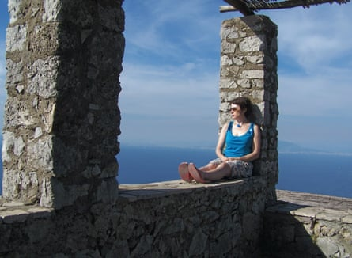
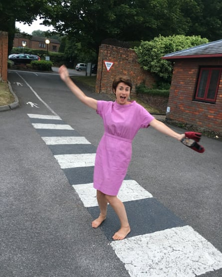
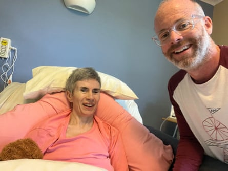

My wife always said she would die of Alzheimer’s. It turns out she was right about that.  

我的妻子一直说她会死于阿尔茨海默病。事实证明她是对的。  

For years, I insisted she would not.  

多年来，我一直坚信她不会。  

In the end, Vanessa clinched our little argument by dying last September, but we had known her fate since 2019, the year she was diagnosed, at the age of 49.  

最终，凡妮莎在去年九月去世，结束了我们之间的小争论，但我们自 2019 年得知她的命运，那时她已经 49 岁。  

For at least three years before that, though, the realisation dawned by hideous degrees which way the debate was going.  

然而，在那之前至少三年，逐渐有了可怕的认识，知道辩论的方向。

When we met, in the mid-00s, the proposition that Vanessa did not have Alzheimer’s, nor was about to develop it, was an easy motion to defend.  

当我们相遇时，在 00 年代中期，很容易捍卫的观点是 Vanessa 没有患阿尔茨海默病，也不会患上这种疾病。  

She was dazzling and creative, with a successful career as a marketing executive.  

她是一个令人眼花缭乱且富有创造力的人，拥有成功的营销执行官职业生涯。  

In that context, her preoccupation with this old person’s disease came across as a little absurd.  

在这种情境下，她对这种老年病的关注显得有点荒谬。

We met on the dancefloor of a nightclub in 2004. I was 32, she was about to turn 35.  

我们是在 2004 年的夜店舞池相遇的。当时我 32 岁，她快要满 35 岁了。  

Far too old for a place like that, but we were reliving former glories in honour of mutual friends – a last glance back at our careless youth.  

那个地方对我们来说太过陈旧，但我们为了共同的朋友在重温往昔的辉煌 - 最后一次回顾我们不谨慎的青春。  

When the management turned us out after a long night of carousing into the next stage of our lives, Vanessa scribbled her number for me on a piece of paper.  

当管理层在我们狂欢了一个漫长的夜晚后把我们赶出去，进入我们生活的下一个阶段时，Vanessa 在一张纸上给我写下了她的电话号码。  

How she would have loved to be able to do that only 15 years later.  

她多么希望在短短 15 年后就能做到这一点。

A few weeks into our relationship, she told me that her mum, in her 50s, was dying of Alzheimer’s and, a little later again, that she was sure to do the same.  

在我们的关系发展了几周后，她告诉我，她 50 多岁的母亲患有阿尔茨海默病，而且稍后又说她也肯定会得这种病。  

I put her fears down to general fatalism, and spent much of the following decade insisting she had nothing to worry about.  

我把她的恐惧归因于一般的宿命论，并在接下来的十年里坚持她没有什么好担心的。  

Until I could no longer find plausible grounds to argue that everything was fine.  

直到我再也找不到合理的理由来辩称一切都很好，我才意识到事情并非如此。

A common question is: when did the disease start? There is no neat answer.  

一個常見的問題是：疾病是什麼時候開始的？這並沒有一個明確的答案。  

It’s possible Vanessa could feel it coming on long before any of her symptoms showed.  

Vanessa 可能在任何症状出现之前就察觉到了。  

To the outside world, though, Alzheimer’s reveals itself by subtle degrees, each one plausibly dismissed in the early stages as “nothing”.  

然而，对外界而言，阿尔茨海默病是逐渐显露出来的，每一个细微的迹象在早期都可能被轻易地解释为“无关紧要”。  

And even when they start to become obviously “something”, there is usually a range of alternative explanations.  

即使它们开始显现出“某种东西”的迹象，通常也会有一系列其他解释。  

The twisted genius of this disease begins with the way it smuggles itself in under the cover of other conditions.  

这种疾病的狡猾之处在于它偷偷摸摸地藏身于其他疾病的掩护下。  

Absent-mindedness, ageing, menopause, through depression, anxiety and epilepsy – all would be presented as perfectly plausible explanations, first by me, then by some serious experts in their field.  

忘事、衰老、更年期、抑郁、焦虑和癫痫等问题，首先是我，然后是一些该领域的专家，都会提出完全合理的解释。  

In retrospect, though, it began with a zit on her chin.  

然而，回想起来，一切都始于她下巴上的一个痘痘。

We used to go out for dinner at the end of family holidays in Devon.  

我们过去常常在德文郡的家庭假期结束时一起出去吃晚餐。  

There is a beach cafe overlooking the sea, round the headland from where we were married in 2006.  

有一家海滩咖啡馆坐落在海边，从我们 2006 年结婚的地方绕过海角处眺望大海。  

As we sat down for the 2013 edition, I pointed out the zit with much amusement.  

当我们坐下来参加 2013 年的活动时，我兴致勃勃地指着那颗痘痘，引起了很多笑声。  

Vanessa responded in a similar vein. For a minute or so, the repartee was spiky and hilarious.  

Vanessa 以类似的方式回应。一分钟左右，对话变得尖锐而滑稽。  

Then we looked at the menu.  

然后我们浏览了菜单。

At the end of the meal, as we were leaving, I cracked another joke about the monstrous carbuncle.  

餐后，我们准备离开时，我又开了一个关于巨大瘤的笑话。

Vanessa looked at me in horror. “What? I’ve got a zit on my chin?”  

Vanessa 惊恐地看着我说：“什么？我下巴上长痘痘了？”

I remember the chill. We were well used to her mislaying car keys and sunglasses and whatnot.  

我记得那种寒意。我们已经习惯了她老是把车钥匙、太阳镜等东西弄丢。  

But this seemed different. This was an entire conversation we had just had.  

但这感觉不同。这是我们刚刚进行过的完整对话。

It didn’t really matter. The incident was isolated, and life went on as normal.  

这并不是什么大不了的事。这个事件是孤立的，生活还是照常进行。  

Maybe the first doubts started to niggle in the back of my mind, but I maintained the line.  

或许最初我脑海中开始萌生疑虑，但我仍然坚守初衷。  

There was nothing unusual about any of this.  

这一切都很寻常。  

What she must not do is ruin her life worrying about it.  

她不应该为此担心而毁了自己的生活。

___

There is no point worrying about dementia. One in 14 of us [will develop it](https://www.nhs.uk/conditions/alzheimers-disease/) if we live beyond 65, one in six if we go beyond 80.  

没有必要担心痴呆症。如果我们活到 65 岁以上，就会有 14 个人中有一个患上痴呆症；如果活到 80 岁以上，就会有六个人中有一个患上痴呆症。  

There are various lifestyle choices we can make to lessen our risk (public health officials [have identified 12](https://www.alzint.org/resource/dementia-risk-factors-infographic/)), of which it pays to be aware, but worrying is not one of them. What will be will be.  

有许多生活方式选择可以降低我们的风险（卫生官员已经确定了 12 种），我们应该意识到这一点，但担心并不是其中之一。将来会怎样就会怎样。

It is true, though, that this is a hateful disease once it starts to take hold.  

的确，一旦这种可恨的疾病开始蔓延，情况就会变得更糟。  

Its ultimate genius is the way it comes for the very soul of you.  

它的终极天才在于以一种方式触及你内心深处。  

You never hear about a brave fight against dementia, as you do so many other conditions, because you can’t fight it.  

你从未听说过有人勇敢地与痴呆症作斗争，就像对抗其他许多疾病一样，因为你无法与之抗争。  

To fight is to make a choice, which requires cognition.  

战斗就是做出选择，这需要认知。  

By degrees, dementia disables that faculty, rendering its victim helpless.  

逐渐地，痴呆症会剥夺受害者的这种能力，使其变得无助。

There is a mini-industry of advice on how to stave off dementia (start with [exercise, smoking, diet](https://www.dementiauk.org/information-and-support/about-dementia/prevention-and-risk-factors/)) and then, as the saying goes, to “live well with dementia” once diagnosed.  

有关如何预防痴呆症的建议有很多（从运动、戒烟、饮食开始），然后，顺应俗语，“与痴呆症共存”一旦确诊。  

This latter movement is controversial, its proponents declaring themselves as diagnosed with dementia, then writing books, blogs and speeches about it, often for more than 10 years.  

这种后续行动备受争议，支持者自称患有痴呆症，然后写书、博客和演讲，通常持续超过 10 年。

The work they do raising awareness is valuable, but the insinuation that it should be possible to live well with this condition is disingenuous.  

他们提高意识的工作很有价值，但认为在这种情况下能过得很好是不诚实的。  

Vanessa in her prime led teams and launched marketing campaigns for major international corporations.  

Vanessa 在她的巅峰时期领导团队，并为主要国际公司推出营销活动。  

But she could no more have delivered a speech in 2016, three years before her diagnosis, than she could have concentrated enough to use a laptop, which by then was not at all.  

但是在 2016 年之前，她无法发表演讲，因为那时距离她的诊断还有三年，就像她无法集中精力使用笔记本电脑一样。  

Over the next few years, her decline was brutal and unanswerable.  

在接下来的几年里，她的衰退变得残酷且无法解释。

In 2016, she was still a hands-on mum to our two children, who were by then eight and six.  

2016 年，她仍然是我们两个孩子的全职妈妈，他们当时分别是八岁和六岁。  

Seven years later, she would be dead.  

七年后，她就去世了。  

I can see now that is quick, although it did not feel so at the time.  

我现在明白这很快，尽管当时并没有这种感觉。  

Other journeys will take longer, but by the mid stages of dementia, a patient’s days of adventures and blogging will be long gone.  

其他旅程可能需要更长时间，但到了痴呆症中期，患者已经无法再体验冒险和博客的乐趣。

Vanessa in 2005. Photograph: Courtesy of Michael Aylwin  

2005 年的瓦妮莎。照片：由迈克尔·艾尔温提供

By 2016, we were still adventuring as a family.  

2016 年，我们一家仍然在进行冒险。  

I was concerned about Vanessa at that stage, no question, but there were still grounds for maintaining the original line of argument.  

当时我确实对 Vanessa 感到担忧，毫无疑问，但仍然有理由坚持最初的论点。  

The chaos of young family life was losing its power as an explanation for some of her more alarming missteps, but menopause, which came early for her, had since stepped in to explain away instances of memory loss or outbursts of temper.  

年轻家庭生活的混乱不再是解释她一些更令人担忧的失误的主要原因，而更年期早早到来，已经开始解释记忆丧失或脾气暴躁的情况。

“You’re clinging to this menopause thing,” she once said to me.  

她曾经对我说：“你总是纠缠于这个更年期的事情。”

“You’re clinging to the Alzheimer’s,” I retorted.  

"你还在固执地抓住阿尔茨海默病不放，"我反驳道。

In 2017, I came to accept that I was indeed the one doing the clinging.  

2017 年，我开始意识到我确实是那个执着的人。  

And then, cruelly, she was given the all-clear.  

然后，残忍地，她被宣布没有问题了。

___

The one time we went to the GP about her concerns was in 2014.  

2014 年，她曾一次去看全科医生表达她的担忧。  

The appointment ended when Vanessa was presented with the standard cognitive test that precedes any referral.  

瓦妮莎在接受了在任何转诊之前的标准认知测试后，约会结束了。  

Such was her fear of memory tests that she broke down and would not even look at it.  

她对记忆测试的恐惧如此之深，以至于她崩溃了，甚至不愿看它。

In the end, we bypassed the GP altogether, after she had a pair of curious seizures in 2017.  

最后，我们完全绕过了全科医生，因为她在 2017 年发生了一对奇怪的癫痫发作。  

She was gripped by a form of vertigo. Both times I called an ambulance.  

她感到一种眩晕。我两次都打电话叫救护车。

After the first, in September, she was lined up for an MRI scan.  

九月份的第二次，她接受了核磁共振扫描。  

I lobbied the admin desk at the hospital for a rethink, told them they didn’t understand the significance of what they were suggesting.  

我在医院的行政办公室游说，要求他们重新考虑，并告诉他们他们没有理解他们所建议的事情的重要性。  

I’m not sure what I wanted them to do about it, but I knew this MRI scan would bring together all of Vanessa’s fears.  

我不确定我想让他们对此做什么，但我知道这次 MRI 扫描会激发出 Vanessa 所有的恐惧。  

This was the moment we stared the monster in the face. I suppose I was afraid.  

这是我们直面怪兽的时刻。我想我当时很害怕。  

The administrator shrugged and said she had to have it.  

管理员耸了耸肩，说她必须要这个东西。

When we drove in for the results, in October, we sat in silence, with the air of the condemned.  

十月份，当我们驾车去领取成绩时，我们默默无语地坐着，仿佛已被判了死刑。  

I had fully come round. It had to be Alzheimer’s.  

我已经完全清醒过来了，这一定是阿尔茨海默症。  

Which was when they told us her brain was as clear as a bell.  

当他们告诉我们她的大脑清晰如铃时。

“We know you have had concerns,” said the consultant. “Don’t worry. There is no Alzheimer’s here.”  

“我们知道您有一些担忧，”顾问说。“别担心。这里没有阿尔茨海默症。”

When they told her it would be terrible for her to waste any more of her energy worrying about it, I felt a teardrop prick at the edge of my eye.  

当他们告诉她不要再浪费精力去担心这件事时，我眼角泪水夺眶而出。

A weight had been lifted, but a relief like that is not all good news.  

一种负担已经解除，但这种解脱并非全是好消息。  

Particularly if it turns out to be false.  

特别是如果最终证明是错误的时候。  

As we drove away that very afternoon, Vanessa said: “What am I going to blame it on now?”  

当我们那天下午开车离开时，瓦妮莎说：“我现在要找什么借口呢？”

When you have laboured under a cross your whole adult life, to be relieved of it so suddenly is disconcerting.  

当你一生中承受着十字架的重担，突然间摆脱它是令人不安的。  

Whether coincidentally or not, her symptoms unwound spectacularly from then on.  

无论是巧合还是其他原因，从那时起，她的症状都出现了惊人的好转。  

Every day it seemed a new level of incapacity was reached.  

每天似乎都在达到新的无能为力的层次。  

The next 21 months or so were unnerving, as she started to fall apart in front of our children, then 10 and eight, who should not have had to witness it, let alone suffer the repercussions, all the while being told her brain was fine.  

接下来的 21 个月左右令人不安，她开始在我们的孩子面前崩溃，当时他们分别是 10 岁和 8 岁，不应该目睹这一切，更不用说承受后果，而她却被告知她的大脑没问题。

Vanessa’s second turn, a week before Christmas 2017, was more spectacular again.  

Vanessa 在 2017 年圣诞节前一周的第二次表演再次更加壮观。  

She held my hand and screamed that the room was upside down, that I was upside down.  

她握住我的手，尖叫说房间颠倒了，我也颠倒了。  

This time the emergency neurologist was on duty at the hospital.  

这次医院的急诊神经科医生在值班。  

He was sufficiently impressed by her symptoms to take her on as a patient, without any GP referral.  

他对她的症状印象深刻，甚至在没有任何家庭医生的转诊下，决定接受她作为患者。  

But he and his team would be flummoxed for nearly two years.  

但是他和他的团队将陷入困惑将近两年。

The problem was twofold.  

问题有两个方面。  

One, those MRI scans that kept coming back clear; two, Vanessa’s ability, even then, to turn on the charm.  

一是那些一直呈现正常结果的 MRI 扫描；二是即使在那时，范妮莎也能展现魅力。  

Sometimes, we had meetings with two consultants in the same room, and she would have us all roaring with laughter at her dark humour.  

有时候，我们会在同一个房间和两位顾问开会，她总是用她的黑色幽默让我们捧腹大笑。  

On the surface, there seemed nothing wrong, even to experts.  

表面上看起来一切正常，即使对专家来说。  

They call it compensating, and her neurologist later told me he had never had a patient able to compensate for her condition as Vanessa did.  

他们称之为补偿，后来她的神经学家告诉我，他从未有过像 Vanessa 那样能够补偿她病情的患者。  

Without the scenes he had witnessed in A&E before Christmas, we would no doubt have been sent home.  

如果不是在圣诞节前在急诊室目睹的那些场景，我们肯定会被送回家。

As she deteriorated, I bombarded the neurologists with lengthy emails, detailing the latest symptoms. In 2018, it became clear she could not read, or at least concentrate enough to read a passage.  

随着她病情恶化，我向神经学家们发送了长篇电子邮件，详细描述了最新的症状。到了 2018 年，很明显她无法阅读，或者至少无法集中注意力阅读一段文字。  

She could not take her medication correctly or understand the pillbox we bought to make it easier.  

她无法正确地服用药物，也无法理解我们购买的药盒，以便更方便服药。  

Then, for the first time, I had to help her on with a T-shirt, then again, then again, and so on.  

然后，第一次，我第一次得帮她穿上 T 恤，然后又一次，再一次，如此往复。  

Multiple – and occasionally dangerous – cooking mishaps occurred.  

发生了多次烹饪意外，有时候还会很危险。  

For safety, the following year we replaced our gas stove with an induction hob, which I struggled to make work.  

为了安全起见，第二年我们将燃气灶换成了电磁炉，但我很难让它正常运转。  

Vanessa didn’t stand a chance. So that was her cooking career over.  

瓦内萨毫无胜算。所以她的烹饪生涯结束了。  

Her entries in the family calendar on the wall, very much her initiative, petered out in 2018, too.  

她在墙上的家庭日历上的记录，很大程度上是她的主动，到了 2018 年就逐渐停止了。  

And in January 2019, she was unable to sign our daughter’s birthday card.  

2019 年 1 月，她无法签署我们女儿的生日卡。

___

It was a lumbar puncture that finally teased out the demon in her system.  

最终是腰椎穿刺检查揪出了她体内的恶魔。  

There was a deficiency of the protein amyloid in Vanessa’s spinal fluid, her neurologist explained to us, which meant it had to be gathering in her brain.  

Vanessa 的神经学家向我们解释说，她的脊髓液中缺乏淀粉样蛋白质，这意味着它必须在她的大脑中积聚。  

Which meant she had dementia.  

这意味着她患有痴呆症。

This was relayed in the matter-of-fact manner of the professional, weirdly devastating and reassuring at the same time.  

这是以专业人士的事实陈述方式传达的，怪异地毁灭和令人 ger 保的，同时也令人 ger 保。  

Now it was just a question of which type of dementia.  

现在的问题只是要确定是哪种类型的痴呆症。  

In order to find out, she would need to have a Pet (positron emission tomography) scan and, given her mother’s history, a DNA test. The tie-breaker, as he described it.  

为了找到答案，她需要接受 PET（正电子发射断层扫描）检查，并且考虑到她母亲的病史，还需要进行 DNA 测试。这是他所描述的决定性因素。

A Pet scan uses a different level of technology to an MRI, and is more expensive, thus rarely deployed.  

PET 扫描和 MRI 使用不同的技术水平，因此价格更高，因此很少被采用。  

An MRI scan might be the equivalent of a 3D photograph of the structure of a building; a Pet scan is more like a heat map of what is going on inside.  

MRI 扫描就像是建筑结构的 3D 照片；而 PET 扫描则更像是显示内部活动的热图。  

If there’s a fire smouldering away, the MRI scan won’t show it until the building is damaged; a Pet scan will.  

如果有火在悄悄燃烧，MRI 扫描不会显示出来，直到建筑物受损；PET 扫描则可以。

On the morning of 13 September 2019, just over a month before her 50th birthday, Vanessa’s neurologist summoned all his powers of straight-talking to tell us, more or less as soon as we sat down, that it was Alzheimer’s.  

2019 年 9 月 13 日早上，距离她 50 岁生日仅过一个多月，Vanessa 的神经学家用尽一切直言不讳的力量，在我们刚坐下来的时候就告诉我们，她得了阿尔茨海默病。  

For a Pet scan, they inject some radioactive goo into your system and see which bits light up.  

进行宠物扫描时，他们会向您的体内注射一些放射性物质，然后观察哪些部位会发光。  

We were shown the cold blue regions of Vanessa’s brain that were not working properly, most of them in the middle and rear.  

我们看到了范妮莎大脑中那些未正常工作的冷蓝色区域，其中大部分位于中部和后部。  

Two weeks later, he was able to confirm from the DNA test result that she had what her mother must also have had.  

两周后，他通过 DNA 检测结果确认，她具有她母亲必然也具有的特质。  

It was not just Alzheimer’s, it was familial Alzheimer’s.  

这不仅仅是阿尔茨海默病，而是家族遗传性阿尔茨海默病。

She had been right all along. And there was nothing she or anyone could have done about it.  

她一直是对的，而且她或任何人都无法改变这个事实。

___

For years, Vanessa had said to me: “If I ever get Alzheimer’s, you have to help me end it.” “Well, darling, technically that’s illegal in this country.  

几年来，Vanessa 一直对我说：“如果我得了阿尔茨海默病，你必须帮我结束它。”“亲爱的，从技术上讲，在这个国家是违法的。  

But shall we cross that bridge if we ever get to it?”  

但是如果有一天真的遇到这种情况，我们会去克服困难吗？

Here, finally, we were.  

终于，我们来到了这里。  

I waited anxiously for her to bring the subject up, but I’m pleased to say she never did.  

我焦急地等待着她提起这个话题，但我很高兴地说，她从未这样做过。  

Her mortal fear shifted at that point from Alzheimer’s to nursing homes.  

她的极度恐惧从患阿尔茨海默病转变为对养老院的恐惧。

But her ability to think coherently was so elusive by then that I think she was safe from the thought processes required for suicide.  

但是她当时的思维连贯能力已经如此难以捉摸，以至于我觉得她已经远离了自杀所需的思维过程。  

It must take a great effort of will to end a life, just as it must to fight a terminal illness. [Dementia](https://www.theguardian.com/society/dementia) takes that away from you in time.  

结束一条生命必须付出极大的意志努力，就像对抗终末疾病一样。痴呆会在时间中夺走这一切。

We were told she was still in the early stage of the disease.  

我们被告知她仍处于疾病的早期阶段。  

I found that news almost as crushing as the main headline.  

我发现这则新闻几乎和主要头条一样令人震惊。  

If this was early, I wasn’t looking forward to mid or late.  

如果这是早期的话，我并不期待中期或晚期。  

I’d been looking after Vanessa – by which I mean guiding, covering for and assisting – at least as much as I had been the children, who in turn were watching out for her as much as the other way round, for two years or more.  

我一直在照顾瓦妮莎，我的意思是指导、照顾和帮助她，至少和我照顾孩子们一样多。而这些孩子们反过来也在尽力照顾她，就像双向的关系一样，已经有两年多了。  

I was helping her dress and undress.  

我在帮她穿脱衣服。  

In effect, I was a single parent of three, one of whom was older than me.  

实际上，我是三个孩子中的一个单亲家长，其中一个比我还大。

Vanessa took the diagnosis better than expected, which again was probably down to the condition itself.  

瓦妮莎对诊断的接受比预期好，这可能又归因于疾病本身。  

Would it have made any difference for her to have been diagnosed earlier? Probably not.  

她如果早点被诊断，会有什么不同吗？可能不会。  

To watch her decline so rapidly and have no official explanation had been disconcerting, it’s true, even if it was pretty obvious what was happening.  

观察她如此迅速地衰退，却没有官方解释，确实令人不安，尽管发生的事情显而易见。  

But the earlier her diagnosis landed, the better able to apprehend it she would have been.  

但是，越早确诊，她就越能更好地理解病情。  

When it did come, the condition itself softened its own blow.  

当它终于到来时，条件本身减轻了冲击。

What a diagnosis can do for you is open up resources, although sometimes you have to find out for yourself what they are and where to find them.  

诊断可以帮助您开启资源，尽管有时您必须自己弄清楚资源是什么以及在哪里寻找它们。  

Which, of course, requires cognition.  

当然，这需要认知。  

Without an advocate, someone in even a mild stage of Alzheimer’s would struggle, possibly prohibitively; in anything like a moderate stage they would find it impossible.  

没有倡导者的情况下，即使是患有轻度阿尔茨海默病的人也会遇到困难，可能会受到严重限制；而在类似中度阶段的情况下，他们会发现这是不可能的。  

The form for Vanessa’s [personal independence payment](https://www.gov.uk/pip) application, for example, required pages of written testimony and hours to fill them in.  

例如，范妮莎的个人独立支付申请表格需要填写几页书面证词，填写这些内容需要花费数小时。  

But that was nothing compared to the palaver of securing [continuing healthcare (CHC) funding from the NHS](https://www.ageuk.org.uk/information-advice/health-wellbeing/health-services/nhs-continuing-healthcare/), by which point any dementia patient is, by definition, incapable of the rudimentary tasks of living, let alone advocacy.  

但是与从英国国家医疗服务体系（NHS）获得持续医疗保健（CHC）资金的繁琐程序相比，这只是小巫见大巫，到了那个时候，任何患有痴呆症的患者，从定义上就已经无法完成基本的生活任务，更不用说进行倡导了。

Vanessa in 2017. Photograph: Courtesy of Michael Aylwin  

2017 年的照片中的 Vanessa。摄影：Michael Aylwin 提供。

Dementia’s final insult, after the pitiless assault on a person’s health, dignity and actual self, is the financial toll.  

痴呆症的最后侮辱，在对一个人的健康、尊严和真实自我的无情攻击之后，是经济负担。  

As things stand, a diagnosis of dementia, already a somewhat upsetting event, might as well come with a bill of six figures, to be paid over the course of the rest of one’s life, or until such time as personal savings fall beneath a threshold of £23,250.  

就目前情况而言，被诊断患有痴呆症，本已是一件令人不安的事情，最好还附带一张六位数的账单，可在余生中支付，或直至个人储蓄低于 23,250 英镑的阈值。  

Only then will the state step in to assist with the ferocious costs.  

只有在那时，国家才会介入协助应对高昂的费用。  

This disease can ruin a person in more ways than one.  

这种疾病可以从多个方面毁掉一个人。

With good reason, public policy towards dementia, the funding or otherwise of research and care, provokes anger and controversy at every turn.  

有充分理由，痴呆症的公共政策，无论是对研究还是护理的资助，都在每一个转折点上引发愤怒和争议。  

Extraordinary demands are made of patients and their families that would never be exacted from patients of other diseases.  

患者及其家人被要求承担非同寻常的责任，这种要求从未对其他疾病的患者提出过。  

Dementia support is a public health blind spot.  

痴呆症支持是公共卫生领域的一个盲点。  

Partly this is because of dementia’s elusiveness, in contrast to more physical, identifiable and treatable conditions; partly it is because of the sheer cost of care that is revealing itself now we are catching up with how deeply its tentacles reach.  

部分原因是因为痴呆症的难以捉摸，与更具体、可识别和可治疗的疾病形成对比；部分原因是由于护理的巨大成本，我们现在正在意识到它的触角有多深。

A few months after Vanessa’s diagnosis, the UK went into lockdown.  

凡妮莎确诊几个月后，英国实施了封锁措施。  

These were strange times for all of us.  

这对我们所有人来说都是不寻常的时期。  

As much as to be locked down with dementia in the house sounds – and was – difficult, I took comfort from the knowledge no one else was able to go out, either.  

尽管在家中被困在痴呆症的困扰中听起来很困难，实际上也是如此，但我从这一事实中得到了安慰，即其他人也无法外出。

But the domestic challenge was relentless and enervating. And infuriating. Absolutely infuriating.  

但是国内的挑战持续不断，让人感到疲惫。而且令人愤怒。绝对令人愤怒。

They don’t tell you that in the brochure.  

宣传册里没有提到这个。  

We’re all braced for the overarching tragedy of a dementia patient’s decline, but far too little airtime is given to how much it will drive you mad with irritation on a day-to-day level.  

我们都为痴呆症患者的衰退做好了准备，但很少有人提到它会在日常生活中让你疯狂地恼火有多严重。  

Both of you. It works both ways.  

你们两个都可以。这是双向的。  

She annoyed me more than I can say, but if anything I annoyed her more.  

她让我烦恼得无法言喻，但如果说有什么的话，我可能更让她烦恼。

One of you ends up doing everything for the other, which in the context of the disease is fair enough.  

在疾病的情况下，最终会有一个人为另一个人做所有事情，这是相当公平的。  

But the other, already disconcerted by the deterioration of their powers, is driven to distraction by the constant presence of their spouse and the insult, as they see it, of the continual meddling and assisting.  

但另一方已经因能力的恶化而感到困惑，他们的配偶的持续存在以及持续干涉和帮助被视为侮辱，使他们感到分心。  

Fury is the regular result. Which in turn drives the carer mad with frustration.  

愤怒是一种常见的情绪反应，这会让照顾者因为挫折感到疯狂。  

To have to do everything in the house, including the heavy duty of a spouse’s personal care, and be raged at for your pains.  

要在家里包揽一切，包括照顾配偶的重活，还要因此受到责备，实在令人痛苦。

I read some of my diary entries from that time and cringe.  

我翻阅了一些当时的日记条目，感到有些尴尬。  

Hateful thoughts cross your mind – about whether you ever loved your spouse and when it might all be over.  

令人厌恶的想法涌入你的脑海 - 你是否曾经爱过你的配偶，以及一切何时会结束，这些念头不断纠缠。  

Then you go off and read one of the many articles out there of families hit by this terrible disease, most of which focus on the love that will get them through – and, with your blood boiling from the latest raging argument, the guilt crashes over you.  

然后你会去阅读关于受到这种可怕疾病困扰的家庭的许多文章之一，这些文章大多侧重于爱如何帮助他们度过难关 - 而此时，你因最新的激烈争吵而怒火中烧，内心涌上一股罪恶感。  

The danger is, you come to see yourself as failing – or, worse still, as just not a very nice person.  

危险在于，你会开始认为自己是个失败者，甚至更糟糕的是，只是一个不怎么友善的人。  

Chuck in a few more articles from people who purport to be “living well with dementia”, and the effect on your state of mind can be quite dangerous.  

从自称“与痴呆症共存”并发布了更多文章的人那里摘录一些内容，对你的心态可能会产生相当危险的影响。

And then the time will probably come when it is no longer feasible to look after your loved one at home.  

然后，可能会有一天，家里再也无法照顾你所爱的人变得不可行。  

Cue guilt of an even higher order.  

引发更高层次的内疚感。

I used to wonder what the breaking point would look like, when we would know the time had come.  

我曾经好奇，破裂的时刻会是怎样的，我们将如何知道时机已经到来。  

I imagined it would be incontinence or some such thing.  

我想象它可能是尿失禁或类似的情况。  

In fact, the development that started to force the issue was something as banal as her refusing my help, which had all sorts of practical repercussions.  

实际上，导致问题恶化的开端是她拒绝我的帮助，这看似平凡的举动却带来了各种实际影响。  

But I suppose we were “lucky”, because, just as I was starting to look at possible nursing homes and to wonder how on earth we were going to negotiate this transition peacefully, fate intervened to make the decision for us.  

但我想我们算是“幸运”的，因为就在我开始考虑可能的养老院并想知道我们如何能够和平地进行这个过渡时，命运介入，替我们做出了决定。

___

There was a self-help book doing the rounds when I was a young man called Feel the Fear and Do It Anyway.  

在我年轻的时候，有一本自助书在流传，名为《感受恐惧，然后去做》。  

My flatmate and I used to joke about the title and co-opt it for any number of situations.  

我的室友和我过去常常拿这个标题开玩笑，用在各种情境中。  

Change the word “fear” to “guilt”, and you have a reasonable mantra to cling to when it comes to placing a loved one in a nursing home.  

将“恐惧”改为“内疚”，您就会得到一个合理的座右铭，当需要将所爱之人安置在养老院时，可以依赖。  

There is no easy way to make the leap, but once you have, it’s just about true to say that everyone benefits.  

没有简单的方法可以跨越这一障碍，但一旦你做到了，可以说每个人都会受益。  

Not totally true, because residency in a nursing home is undoubtedly not a thing to aspire to.  

不完全正确，因为住在养老院显然不是一个值得向往的事情。  

If you are ill enough to need one, there is no path available that is attractive, but the levels of care in a good nursing home, with professionals constantly on hand, are far higher than a spouse can provide in your own home.  

如果您病得需要，没有可供选择的吸引人的路径，但在一家良好的养老院，专业人员随时在场，提供的护理水平远高于配偶在家中所能提供的。

By the summer of 2021, we were at or around breaking point.  

到了 2021 年夏季，我们已经到了崩溃的边缘。  

As Vanessa’s faculties clogged up, they turned out the fury that most able-minded people manage to keep in check.  

随着瓦妮莎的能力受阻，他们释放出大多数有头脑的人设法控制住的愤怒。  

In the space of a few weeks, we went from the crushing monotony of daily care – dressing, undressing, feeding, guiding (physically and emotionally), washing, containing, etc – to an infernal alternative reality that could not be sustained.  

在短短几周的时间里，我们从日常照料的沉闷单调中走出来 - 穿衣、脱衣、喂食、引导（无论是身体上还是情感上）、洗涤、约束等等 - 进入了一个无法持续的地狱般的替代现实。

There was a period, maybe the hardest of all for Vanessa, when she dutifully allowed me and her carers to help her with the aspects of living she could no longer manage, the indignity of it a burden that had to be borne without the wherewithal to complete those tasks herself.  

Vanessa 经历了一个时期，也许是最艰难的时期，她尽职尽责地允许我和照顾她的人帮助她处理她无法再独立完成的生活方面，这种屈辱是一个负担，必须承受，却没有能力自己完成这些任务。  

But then the sense of duty failed like everything else.  

但是然后责任感也像其他一切一样消失了。

This began as a problem at bedtime.  

这是一个在晚上睡觉时出现的问题。  

At the end of a long day, she would refuse my attempts to get her ready for bed and then actually into it, which makes it sound a lot more playful than it was.  

在漫长的一天结束时，她总是拒绝我帮她准备睡觉，甚至是让她上床，这种描述听起来比实际情况更有趣。  

Physically, she remained capable, but her spatial awareness had so deserted her that even just sitting down on a dining chair, let alone climbing into bed, was an operation that required careful choreography.  

从物理上讲，她仍然保持着能力，但她的空间意识已经如此之差，以至于甚至只是坐在餐椅上，更不用说爬上床了，都需要精心的安排。

Eventually, her instincts, which screamed that the assistance required was a humiliation and my offering it an insult, became a storm she could no longer suppress.  

最终，她的直觉告诉她，需要的帮助让她感到羞辱，而我提供帮助则成了一种侮辱，这种情绪已经变成了她无法抑制的风暴。  

I was regularly accused of being a pervert for wanting to undress her.  

我经常被指控是一个变态，因为想要脱掉她的衣服。  

How dare I decide it was bedtime! She didn’t need or want me to go into the bathroom with her.  

我怎么敢决定现在是睡觉时间！她并不需要或想要我跟着她进浴室。

All of which meant none of these simple tasks could take place.  

所有这些都意味着这些简单任务都无法进行。  

It regularly took more than an hour to finesse events from going upstairs to actually settling down to sleep.  

经常需要花费一个多小时的时间，从上楼到最终安定下来入睡。

She remained more or less continent, insofar as she knew when she needed to go.  

她在某种程度上保持着克制，因为她知道何时需要去上厕所。  

But she needed help performing the necessary manoeuvres.  

但是她需要帮助来执行必要的动作。  

The nurses called it “functionally incontinent”.  

护士们将其称为“功能性失禁”。  

Occasionally, she would try to take herself to the loo and terrible scenes would ensue – when she managed to sit but forgot to take down her pants, or remembered to take down her pants but forgot to lift the lid, or mistook the bath for the loo and fell into it.  

有时候，她会试图自己去上厕所，结果发生了可怕的场面 - 她或者设法坐下却忘记脱下裤子，或者记得脱下裤子却忘记抬起马桶盖，又或者把浴缸误认为是厕所然后掉进去。  

Never did my respect for the care profession reach greater heights than when attempting a clean-up while the patient raged, “You did this!” and came at me with soiled hands.  

在病人暴怒时试图清理时，我对护理职业的尊重达到了一个新的高度，他大喊：“你做了这个！”然后用脏手朝我走来。

Vanessa and Michael in 2023. Photograph: Courtesy of Michael Aylwin  

2023 年的 Vanessa 和 Michael。照片：Michael Aylwin 提供

But it was raised hands that proved the turning point.  

然而，正是举起的手证明了转折点。  

By September 2021, matters had reached a stage where the local authority’s psychiatrist started Vanessa on a course of risperidone, an antipsychotic drug normally used for schizophrenia and bipolar disorder.  

到了 2021 年 9 月，情况已经发展到地方当局的精神科医生开始给瓦内萨开了一种利培酮疗程，这是一种通常用于治疗精神分裂症和躁郁症的抗精神病药物。  

After I sent an emergency email about her rising levels of violence against me and her visiting carer, but also the first signs of aggression against our children, we were advised by the hospital to double her dose and to switch another of her several meds to something harder.  

我发送了一封关于她对我和她的看护者施加暴力的紧急电子邮件，同时也提到了她对我们的孩子表现出的第一个攻击迹象，医院建议我们将她的剂量加倍，并将她的几种药物之一换成更强效的药物。

So began her last days in our home, her last days of speech.  

她在我们家的最后几天开始了，也是她说话的最后几天。

By then, she had become difficult to understand, but one episode will stay with me.  

那时，她变得越来越难以理解，但有一个情节会永远留在我的记忆中。  

It was the last thing I remember her saying.  

这是我记得她说的最后一句话。  

I was upstairs, when I heard the dread sound of her raised voice, and multiple thuds and bangs.  

我在楼上的时候听到她提高声音的可怕声音，还有多次重击和砰的声音。

In the kitchen, Vanessa was sitting on the step by the back door.  

瓦妮莎坐在厨房的后门台阶上。  

There was cream cheese smeared around the floor, including on her shoe, and a damaged tub on the floor.  

地板上涂抹着奶油奶酪，包括她的鞋子，还有一个损坏的浴缸。  

A table lay upturned by the sofa.  

沙发旁边倒着一张桌子。

Frustration and despair had left her furious, as if she knew she had hit a new low.  

她被沮丧和绝望激怒，仿佛意识到自己已经跌入新的低谷。  

She was barely intelligible through the faltering and slurs, but when complete phrases did tumble out, they were all the more devastating for that.  

她的话语几乎难以理解，结巴和口齿不清，但当完整的短语脱口而出时，这些话语变得更加毁灭性。

After thumping the floor with her fists, she slipped into a gentler, sadder mood.  

她用拳头重重地敲击地板后，逐渐陷入了一种更温和、更悲伤的情绪。

“It’s not a life. It’s not a life. I was really vibrant once, going everywhere … ”  

“这不是生活。这不是生活。曾经我充满活力，无处不在…”

She stopped to sob gently. “And now I’m not. I don’t know who I am. I’ve got nothing to do.”  

她停下来轻轻抽泣。“现在我不知道自己是谁了。我什么都不知道该做了。”

She mumbled something unintelligible, slumped back against the glass door, until the incoherence parted for one last, soft lament.  

她嘟囔着一些难以理解的话，倚在玻璃门上，直到那些无意义的话语为最后一声轻柔的悲叹让开。

“It’s all gone away.”  

“一切都已经消失了。”

I was suddenly incapable of speech myself.  

我突然失去了讲话能力。

It had all gone away.  

一切都已经消失了。

___

That was the Tuesday.  

那是星期二。  

At 5am on the Friday, 17 years and about five hours (I later worked out) after our eyes first met on that dancefloor, she suddenly started gasping for breath.  

在星期五凌晨 5 点，距我们第一次在舞池相遇已经 17 年零大约五个小时（后来我算出来的）时，她突然开始喘不过气来。  

I turned on the light. She was lying on her side, head turned towards me, midway down the bed.  

我打开了灯。她侧躺着，头转向我，身体位于床的中央。  

Her jaw was locked shut; there was a pool of dribble under her mouth; her eyes were open but not responsive; and she was forcing breath through her system in a horrible, rasping wheeze.  

她的下巴紧闭着，嘴角溢满口水；眼睛虽然睁开却无神；她用恶心的喘息声勉力呼吸。

We are not sure what precipitated the seizure that took her away from home for good.  

我们不确定是什么导致了这场癫痫发作，让她永远离开家。  

It might have been the disease doing its thing. It might have been the meds.  

可能是疾病在发作，也可能是药物的作用。  

Our neurologist reckoned it was the meds. It turns out risperidone can be a vicious drug.  

我们的神经科医生认为是药物的原因。事实证明，利培酮可能是一种剧毒的药物。

The paramedics carried her out of our front door.  

救护人员将她从我们的前门抬了出来。  

And the search for a nursing home, so far fruitless if not quite frantic, became much more urgent.  

寻找养老院的努力迄今为止还没有结果，但情况变得更加紧急。

By then we had been turned away as ineligible by the vast majority we approached.  

那时，我们被绝大多数接触的人认为不符合资格而被拒绝。  

Most of them could not have Vanessa because she was under the age of 65.  

大多数人无法拥有瓦妮莎，因为她还不到 65 岁。  

Of the ones who didn’t mind her age, most could not have her because she was on risperidone, which requires heightened levels of nursing – and of course implies heightened levels of what they euphemistically categorise as “challenging behaviour”.  

那些不介意她年龄的人中，大多数无法和她在一起，因为她正在服用利培酮，这需要更高水平的护理 - 当然也意味着更高水平的他们委婉地称为“具有挑战性行为”的行为。

The problem is, nursing homes have a responsibility to their residents, who tend to be frail and vulnerable.  

护理院对他们的居民负有责任，因为这些居民往往身体虚弱且脆弱。  

An angry 50-year-old strutting around the place is a threat they cannot afford to risk.  

一个愤怒的 50 岁老人在这个地方来回走动是他们无法承担的风险。  

One home actually suggested we wait to see how Vanessa emerged from her seizure.  

有一个家庭建议我们等一等，看看瓦内萨从癫痫发作中恢复的情况。  

If she turned out to be incapacitated by it, they could have her.  

如果她被这个击倒了，他们可以处理她。

One of our carers was tipped off about a place high up in the North Downs, near Haslemere.  

我们的一位照料者得知了一个位于北唐斯高处，靠近哈斯尔米尔附近的地方。  

I did not drive along its narrow lane with any sense of expectation.  

我沿着这条狭窄的小巷开车，并没有怀着任何期待。  

This was the eighth home I had visited, after countless phone calls to other institutions and agencies, but it was family-run and independent.  

这是我参观的第八家住所，之前我给其他机构和机构打了无数电话，但这家是家庭经营的独立机构。  

And it turned out to be perfect.  

结果却完美无缺。

I drove straight from there to visit Vanessa in hospital for the first time.  

我直接从那里开车去医院第一次探望 Vanessa。  

She had been moved by then from the acute medical unit to the senior ward, which allowed visitors, despite the tail end of Covid.  

她当时已经从急诊部转移到了老年病房，尽管疫情的尾声，但允许探视。  

That was the day the penny dropped that she had left our home for the last time.  

那天她最终离开我们家的事实让人心生感慨。  

Not only did we have somewhere suitable for her to go, but it was more obvious than ever she would need it.  

我们不仅有一个适合她去的地方，而且比以往更明显她会需要它。

She was pleased to see me when I walked in, which was a relief.  

她看到我进来时很高兴，这让我感到欣慰。  

I suppose I would have been a welcome sight. If only I’d been there to take her home.  

我想我本来会是一个受欢迎的人。要是我当时在那里把她带回家就好了。  

She was not able to speak, slurring her words, her tongue sort of stuck against her teeth.  

她说话不清楚，舌头似乎卡在牙齿上，无法正常发音。  

She could barely move, certainly not walk.  

她几乎无法动弹，更别说走路了。  

But there she was, in slow motion, smiling, even laughing, soft echoes of her at her best.  

然而，她却在那里，慢动作中微笑，甚至发笑，仿佛她最美好的一面在轻轻回荡。

After an hour or so, I went to leave, and she cried out, as if confronting the realisation that this was it for her.  

大约一个小时后，我准备离开时，她大声哭喊，仿佛意识到这对她来说就是终点。  

When I drove home, past the primary school our children had only recently left, the road was teeming with the red shirts of children walking home with their parents, just as ours had for so many years with her.  

当我开车回家时，经过我们的孩子们不久前才离开的小学，路上挤满了穿着红衬衫的孩子们和他们的父母，就像我们多年来一样带着孩子回家。  

That night, when I walked into a pitch-black bedroom, I wondered if I should turn on the light.  

那天晚上，当我走进一间漆黑的卧室时，我在想是否应该开灯。  

But it suddenly seemed pointless. She was not coming back.  

但突然觉得一切都变得毫无意义。她不会回来了。

The kids, now both at secondary school, left for the bus stop the next morning, and I closed the door on an empty house.  

孩子们现在都在上中学，第二天早上他们离开去等公交车，我关上了空荡荡的房门。  

No need to help Vanessa down the stairs, no need to make her cereal, slide the chair in behind her, give her her pills.  

不需要帮助范妮莎下楼梯，也不需要给她做早餐，只需在她后面放好椅子，然后给她吃药。  

Later, I walked to the local church to have Covid jab number three (what’s the point?  

稍后，我走到当地的教堂去接种第三针新冠疫苗（这有什么意义呢？  

I’m not a carer any more).  

我不再是照顾者了。  

On the way back, I turned into the gate and looked at the house we had bought together 14 years earlier, in which we had raised our children.  

在回家的路上，我转进了大门，看着我们 14 年前一起买下的房子，我们在那里抚养孩子。  

I realised she would never walk through its front door again.  

我意识到她再也不会从那扇前门走进来了。

And so the guilt makes way for grief. There is no way around that either.  

因此，内疚让悲伤而来。这也是无法绕过的。  

As with the guilt, you just have to accept it.  

就像对待罪恶一样，你只需要接受它。  

I do think that one area dementia is kinder on the bereaved is in the way it metes out its grief in instalments.  

我认为痴呆症对丧失者更为温和的一个方面是它分阶段释放悲伤，让人逐渐承受。  

There is never a moment, as there must be with cancer or heart disease, when routine, day-to-day living is suddenly turned on its head by a diagnosis or an event.  

与癌症或心脏病不同，日常生活从未因诊断或事件而突然翻篇。  

With dementia, you can usually see it all coming a long way off.  

患有痴呆症时，通常可以提前看到一些征兆。  

Even if a diagnosis is a shock (which it very much was not for us), there will normally be years to come of further life.  

即使诊断结果令人震惊（对我们来说并非如此），通常还会有更多年的生活。  

From there, each stage presents itself with plenty of warning and plenty of time for adjustment.  

从那里开始，每个阶段都会提前充分警告，并有充足的时间进行调整。

There will be ruptures that trigger grief.  

将会有导致悲伤的裂痕。  

Vanessa’s leaving home was a big one for me, but she was still alive, still in this world.  

瓦妮莎离开家对我来说是一个重大的事件，但她仍然活着，还在这个世界上。

___

From a purely selfish position, the two years after Vanessa moved into the home was a period of release, a return to something like normality, albeit missing the one with whom you created that normality.  

从一个纯粹自私的立场来看，Vanessa 搬进这所房子后的两年是一个释放的时期，回归到了类似正常的状态，尽管缺少了与你一起创造那种正常的人。  

Once continuing healthcare funding had been awarded, 15 months and three appeals after she had been admitted to the home, it did feel as if almost the last of the burden had been lifted.  

一旦继续医疗资助获得批准，她被送进养老院 15 个月后，经过三次上诉，几乎感觉到最后的负担已经解除。

Almost – because there is someone who does not get to escape.  

几乎 - 因为有人无法逃脱，所以并非完全。  

The burden remaining for me was merely to watch Vanessa’s final decline.  

我所面临的唯一负担只是目睹瓦妮莎最终的衰落。  

She was the one who lived it.  

她就是那个经历过的人。  

She had to suffer this ordeal hidden away in a special place, so the rest of us could carry on with living.  

她必须独自忍受这场磨难，藏匿在一个特殊的地方，这样我们其他人才能继续生活。

I don’t believe it is possible to “live well” with the type of dementia Vanessa had to deal with, but that does not mean there is no more joy to be had.  

我不相信有可能以 Vanessa 所面对的这种痴呆症“过得好”，但这并不意味着就没有更多的快乐可享受。  

And we had it – moments snatched amid the dehumanising cruelty of it all, but real and worth something all the same.  

我们在这一切的非人道残酷中抓住了一些时刻，虽然真实而且有价值，但也是值得的。  

Although her speech never returned, she did very suddenly get up from her chair and walk, a few days into her stay at the home, which empowered us to do more together in her first year there.  

尽管她的言语从未恢复，但在她在家中逗留的几天后，她突然从椅子上站起来走动，这让我们在她第一年在那里时能够更多地一起做事。  

Sunny days on the North Downs, brownies in the cafe, laughter in the pub.  

北唐的晴天，咖啡馆里品尝布朗尼，酒吧里欢声笑语。

Those last two years were a chance for us to rebuild our relationship.  

那最后的两年对我们来说是重建关系的机会。  

I don’t know what it says about me that relations with my wife improved so much after she lost the power of speech, but there was a genuine beauty about the way she transcended what had gone before.  

我不知道为什么我妻子失去语言能力后，我们的关系会变得更好，但她超越了以往的方式确实很美丽。

She had always had a dark side.  

她一直隐藏着内心的黑暗。  

In good times, there was no one more brilliant and joyous, but she was troubled, too, by the anxious soul she saw as the “real” Vanessa, lurking beneath the charisma.  

在美好的时光里，她是最聪明和快乐的，但她也受困扰，因为她看到了作为“真正”的范妮莎，隐藏在魅力之下的焦虑灵魂。  

Undoubtedly, her dark side held sway for long periods.  

毫无疑问，她的黑暗一面长期控制着她。  

Then again, maybe that was the dementia quietly corrupting her circuitry.  

可能那是痴呆悄悄侵蚀她的电路。

As you watch Alzheimer’s relentlessly dismantle a person, it does make you wonder where personality ends and condition starts.  

当你目睹阿尔茨海默病无情地摧毁一个人时，确实让你思考个性的边界在哪里，疾病的起点又在哪里。  

About whether there is such a boundary at all.  

是否真的存在这样的边界。  

We now have names and diagnoses for so many conditions that might previously have passed as personality traits.  

现在我们已经为许多以前可能被视为个性特征的症状命名并进行了诊断。  

Vanessa’s was an extreme one, a disease that would kill her in time, but it was absolutely part of who she was.  

Vanessa 患的是一种极端疾病，会在未来夺去她的生命，但这绝对是她的一部分。  

Condition or personality, it is all just chemistry in the brain, and there’s only so much any of us can do about it.  

无论是条件还是个性，一切都只是大脑中的化学反应，我们对此能做的事情也是有限的。

There were difficult times.  

曾经有过艰难的时期。  

Even if it’s the result of a condition, the collapse of a personality is tough to take on a face-to-face level.  

即使是由某种条件导致的，一个人格的崩溃也很难在面对面的层面上承受。  

Bitterness and dark thoughts on both sides are impossible to avoid.  

双方都难以避免苦涩和负面情绪。  

Alzheimer’s drives a couple apart, even as it binds them together, allowing no escape for either.  

阿尔茨海默病使一对夫妇分道扬镳，尽管它将他们紧密联系在一起，却不给任何一方留下逃脱的余地。

What a blessing, then, those last two years were, when I was the visitor she was pleased to see and the heavy duty care was someone else’s responsibility.  

那么，那最后两年是多么幸运，我成为了她乐意见到的访客，而繁重的照料责任则落在了别人身上。  

I finished them in awe of her.  

我敬畏地完成了它们。  

Even I have to concede that I lost the debate about the Alzheimer’s, but I won another we used to have about who the real Vanessa was.  

我不得不承认，我输掉了关于阿尔茨海默病的辩论，但我赢得了我们曾经进行的关于真正的瓦妮莎是谁的另一个辩论。  

She reckoned it was the worrier; I reckoned it was the brilliant one, the one everyone knew and would remember.  

她认为那是一个担心的人；我认为那是一个聪明的人，是每个人都认识并会记住的那个人。

Sure enough, again and again in her final months, I saw her summon from somewhere an energy and joie de vivre that lit up her care home.  

确实，在她最后的几个月里，我看到她一次又一次地从内心深处激发出一种活力和生活的乐趣，照亮了她的疗养院。  

When everything else had fallen away – the ability to think straight, the ability to dress herself, feed herself, wash, talk, walk and, eventually, swallow – what remained was the core of her, that smile and that laugh, right up to her last day of consciousness.  

当其他一切都消失了——思考清晰的能力、自己穿衣的能力、自己喂养的能力、洗漱的能力、说话的能力、行走的能力，最终甚至吞咽的能力——剩下的是她的核心，那微笑和那笑声，一直持续到她最后一天的清醒。

After an extraordinary display of breathing against all odds, of a heart that kept on beating and could of course, and should of course, have carried on doing so for years more, she finally slipped away at five minutes to midnight on a Friday in September, a full eight days after I was told to get down there quick.  

在一次非凡的呼吸表演中，尽管一切都是逆境，一颗不停跳动的心脏当然可以，也应该继续跳动多年，但她最终在九月的一个星期五午夜前五分钟悄然离世，整整八天前我被告知要赶紧赶到那里。  

And just 24 hours shy of 19 years since we met on that dancefloor.  

而距我们在那个舞池相遇已经整整 19 年，仅差 24 小时。

What a dance it has been.  

这是一场美妙的舞蹈。  

Not as I might have expected, but expectations can only ever be thwarted, so I don’t have anything to do with them.  

并非如我所预料的那样，但期望只会带来失望，所以我与之无关。  

I emerge with a touch of survivor’s guilt.  

我带着一丝幸存者的愧疚出现在人群中。  

To watch closely the deterioration of a mind of such vivacity and colour to its end point, sped up in that untimely fashion, has been difficult, but it has been a sort of privilege, too.  

观察一个如此充满活力和色彩的思想迅速走向终点的恶化，虽然以不及时的方式加速，这是困难的，但也是一种特权。  

For all the anguish she endured in expectation of her fate, I hope Vanessa would have looked back on her life, if she could, with fondness and pride.  

希望范妮莎在等待命运时所忍受的所有痛苦，如果她能回顾自己的一生，能怀着温柔和自豪。  

At 53, she died at least 20 years before her time, but there is much living to be had in 50 – and she had it.  

她在 53 岁时过早离世，比她的本该寿命提前至少 20 年，但在 50 岁时还有很多生活可以享受，而她也确实充分体验了。

There is increasing talk in society about dementia, and rightly so, given the toll it takes on people’s lives and on the economy, the cost to the latter far more than that of cancer and heart disease combined.  

社会上越来越多地谈论痴呆症，这是正确的。痴呆症对人们的生活和经济都造成了巨大影响，后者的成本远远超过癌症和心脏病的总和。  

Funding for research lags way, way behind where it should be.  

研究资金远远滞后于应有的水平，亟需改善。  

But side by side with heightened awareness comes a slightly unnerving campaign not only of patients sermonising on how to live well with dementia, but of professionals urging folk to get themselves diagnosed.  

随着意识的提高，伴随而来的是一场略显不安的运动，不仅有患者在宣扬如何与痴呆症健康地生活，还有专业人士敦促人们接受诊断。

I’m not so sure. Vanessa used to tell me a day did not go by without her worrying about Alzheimer’s.  

我不太确定。Vanessa 过去常告诉我，她每天都在担心老年痴呆症。  

I like to think that is an exaggeration, but if she worried about it at all, and she certainly did, it was too much.  

我喜欢认为这有些夸张，但如果她真的有所担心，而她确实有，那就太多了。  

What a diagnosis earlier in her journey might have done to her I don’t know.  

我不知道，如果在她旅程的早期进行诊断会对她产生什么影响。  

I just wanted her to stop the worrying – about Alzheimer’s and about who she really was.  

我只是希望她不再为阿尔茨海默病和她真正的身份而担心。  

What was the point of any of it?  

这一切到底有何意义？

There are drugs in the offing that will be able to slow the decline of a dementia like Alzheimer’s – and [one day no doubt an actual cure](https://www.nationalbrainappeal.org/) – for the sake of which an early diagnosis would be of benefit.  

有一些药物即将问世，可以减缓像阿尔茨海默病这样的痴呆症的恶化，毫无疑问，总有一天会有一个真正的治愈方法，为了这个目的，早期诊断将是有益的。  

But they are not readily available yet.  

但它们目前还不容易获得。  

In the meantime, the best defence against the disease’s encroachment is to live – as fully and for as long as possible.  

与此同时，最好的抵御疾病侵袭的方法是尽可能充实地活着，活得尽可能长久。  

Without worrying. But that applies equally to everyone.  

无需担忧。但这同样适用于每个人。

It is also, at heart, the advice of the “live well with dementia” movement.  

它实质上也代表了“与痴呆症健康共处”运动的建议。  

Dementia does not confer gifts, as some claim.  

痴呆症并不会带来天赋，就像一些人所声称的那样。  

What it might do, in its milder stages, is wake you up to what you should be doing anyway.  

在较轻的阶段，它可能会唤醒你对本应该做的事情的认识。  

Dementia’s “gift” is to reinforce a familiar message that resonates with everyone.  

痴呆症的“礼物”是强调一条与每个人都 resonates 的熟悉信息。  

Make the most of now.  

把握当下。
