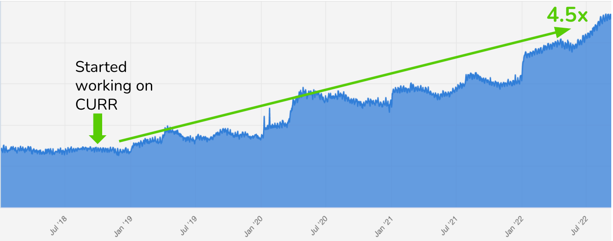
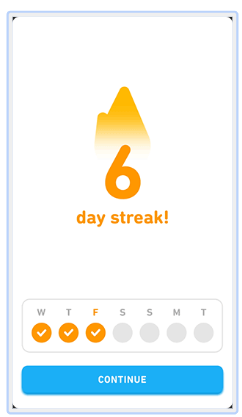

_👋 Hey, [Lenny](https://twitter.com/lennysan) here! Welcome to this month’s ✨ **free edition** ✨ of Lenny’s Newsletter.  

👋 嘿，莱尼在这里！欢迎阅读本月的✨免费版✨莱尼通讯。  

Each week I humbly tackle reader questions about product, growth, working with humans, and anything else that’s stressing you out about work.  

每周我谦卑地回答读者关于产品、增长、人际关系以及工作中让你感到压力的任何其他问题。_

_If you’re not a subscriber, here’s what you missed this month:  

如果您还不是订阅者，这是本月您错过的内容：_

1.  _[Growth inflections  
    
    增长转折点](https://www.lennysnewsletter.com/p/growth-inflections)_
    
2.  _[How to be prepared for layoffs  
    
    如何应对裁员风险](https://www.lennysnewsletter.com/p/how-to-be-better-prepared-for-layoffs)_
    
3.  _[How Coda builds product  
    
    Coda 如何开发产品](https://www.lennysnewsletter.com/p/how-coda-builds-product)_
    

_Subscribe to get access to these posts, and every post.  

订阅以获取对这些帖子和每一篇帖子的访问权限。_

I was at a small event a few months back where [Jorge Mazal](https://www.linkedin.com/in/jorgemazal/) (former CPO of Duolingo) shared the story behind Duolingo’s growth reaccelerating.  

几个月前，我参加了一个小型活动，Jorge Mazal（Duolingo 的前首席产品官）分享了 Duolingo 增长重新加速背后的故事。  

I was captivated.  

我被吸引住了。  

I’ve never seen a growth story like this before—4.5x growth for a mature product, driven by a small handful of product changes, rooted in an innovative growth model, and explained in such actionable detail.  

我以前从未见过这样的增长故事—成熟产品增长了 4.5 倍，仅通过少数产品变化推动，根植于创新的增长模式，并以如此具体的细节解释。  

I asked Jorge if he’d be willing to share (and expand on) the story with a broader audience, and I’m so happy he agreed.  

我问了豪尔赫是否愿意与更多人分享（并深入讨论）这个故事，他答应了，我感到非常高兴。  

Many products already look to Duolingo for inspiration, and I suspect this story will only increase that trend.  

许多产品已经从 Duolingo 汲取灵感，我相信这个故事只会进一步推动这种趋势。  

Enjoy!  

祝您愉快！

_Follow Jorge for more on [LinkedIn](https://www.linkedin.com/in/jorgemazal/) and [Twitter](https://twitter.com/jorgemazal).  

关注 Jorge，了解更多关于 LinkedIn 和 Twitter 的内容。_

I joined Duolingo as the Head of Product in late 2017.  

2017 年底，我加入了 Duolingo，担任产品负责人。  

Duolingo was already the most downloaded education app in the world, with hundreds of millions of users, fulfilling its mission to “develop the best education in the world and make it universally available.” However, user growth was slowing down.  

Duolingo 已经成为全球下载量最大的教育应用程序，拥有数亿用户，实现了“提供世界一流教育并使其普遍可及”的使命。然而，用户增长正在放缓。  

By mid-2018, daily active users (DAU) were growing at a single-digit rate year-over-year, which was troubling, given the explosive growth the company had seen in the past. This was a problem for a startup with investors anxious to see fast monetization growth.  

到 2018 年中，每日活跃用户（DAU）的增长率仅为个位数，这令人担忧，考虑到公司过去曾经历的爆炸式增长。对于一家希望快速实现盈利增长的初创公司来说，这是一个问题。

In this post I’ll cover some of our early failures and then our first big wins that helped us turn around growth, including launching leaderboards, refocusing on push notifications, and optimizing the “streak” feature.  

在这篇文章中，我将分享一些我们早期的失败经历，以及我们的第一个重大成功，帮助我们扭转增长，包括推出排行榜、重新关注推送通知和优化“连胜”功能。  

These, together with several other efforts across Product and Marketing, helped us grow DAU by 4.5x over four years.  

这些努力与产品和营销领域的其他举措一起，帮助我们在四年内将 DAU 增长了 4.5 倍。  

Robust organic user growth supercharged Duolingo toward its 2021 IPO.  

稳健的有机用户增长为 Duolingo 推进 2021 年 IPO 目标注入动力。

This article is an in-depth look into that journey.  

本文深入探讨了这段旅程。  

It is my hope that sharing this work will help others find their own growth breakthroughs faster.  

我希望通过分享这项工作，能帮助他人更快地找到他们自己的成长突破。

Our first attempt at reigniting growth was focused on improving retention, i.e. fixing our “leaky bucket” problem.  

我们重新激发增长的第一次尝试侧重于改善留存率，也就是解决我们的“漏斗”问题。  

We prioritized working on retention over new-user acquisition because all of our new-user acquisition was organic, and, at the time, we didn’t have an obvious lever to pull to supercharge that.  

我们优先考虑保留用户，而不是获取新用户，因为我们所有的新用户获取都是有机的，而且当时我们没有明显的方法可以快速推动增长。  

Also, some of us had a suspicion that we could improve retention through gamification.  

也有一些人怀疑，我们可以通过游戏化来提高用户留存。  

There were two main reasons why this felt like the right approach to me.  

有两个主要原因让我觉得这是正确的方法。  

First, Duolingo had already implemented several gamification mechanics successfully, such as the progression system on the home screen, streaks, and an achievements system.  

首先，多邻国已经成功实施了几种游戏化机制，例如主屏幕上的进度系统、连胜和成就系统。  

And second, top digital games at the time had much higher retention rates than our product, which I took as evidence that we hadn’t yet reached the ceiling for gamification’s impact.  

其次，当时的热门数字游戏比我们的产品具有更高的留存率，这让我相信我们还没有达到游戏化影响的上限。  

 

_Duolingo’s gamified Home and Achievements pages  

Duolingo 的游戏化主页和成就页面_

Armed with a short presentation I co-created with our chief designer, we were able to get just enough buy-in from the rest of the executive team to create a new team, the Gamification Team.  

在我们与首席设计师共同创作的简短演示文稿的支持下，我们成功说服其他高管团队，创建了一个新团队——游戏化团队。  

The team consisted of an engineering manager, an engineer, a designer, an APM, and me.  

团队成员包括一位工程经理、一位工程师、一位设计师、一位 APM 和我。

But there was one small issue: we had no idea which incremental gamification mechanics would work for Duolingo.  

但是有一个小问题：我们不确定哪种增量式游戏化机制适用于多邻国。

Our team at the time was hooked on a game called Gardenscapes_,_ a mobile, match-3 puzzle game similar to Candy Crush_._ This mobile game became our first inspiration.   

当时我们团队迷上了一个名为《花园物语》的游戏，这是一个类似于《糖果传奇》的手机消除类益智游戏。这款手机游戏成为了我们的第一个灵感来源。

_A Gardenscapes match-3 puzzle level  

《花园奇缘》三消益智关卡_

As we looked at the different game mechanics in Gardenscapes, we didn’t really know what we were looking for—we just knew that Gardenscapes seemed stickier than Duolingo, and we saw several parallels.  

在我们研究 Gardenscapes 中不同的游戏机制时，我们并不确切知道我们在寻找什么 — 我们只是感觉到 Gardenscapes 比 Duolingo 更吸引人，并且我们看到了一些相似之处。  

A three-minute Duolingo lesson felt similar to a Gardenscapes match-3 level, and Duolingo and Gardenscapes both used progress bars to provide visual feedback on how close the user was to completing the session.  

一节三分钟的 Duolingo 课程感觉就像是在玩 Gardenscapes 的匹配 3 级别，两者都使用进度条来直观显示用户完成课程的进度。  

Gardenscapes, however, paired its progress bar with a moves counter, which Duolingo didn’t do.  

《花园奇缘》却将其进度条与移动计数器配对，而《多邻国》没有这样做。  

The moves counter allowed users only a finite number of moves to complete a level, which added a sense of scarcity and urgency to the gameplay.  

移动计数器只允许用户在有限次数内完成一个级别，这为游戏增添了稀缺感和紧迫感。  

We decided to incorporate the counter mechanic into our product.  

我们决定将计数机制融入到我们的产品中。  

We gave our users a finite number of chances to answer questions correctly before they had to start the lesson over.  

我们给用户提供了有限次数的机会来正确回答问题，否则他们必须重新开始课程。

It took our team a couple of months of work to add the counter.  

我们团队花了几个月的时间才成功添加计数器。  

With the release of the update, I expectantly waited for an unmitigated success.  

随着更新的发布，我满怀期待地等待着一次毫无保留的成功。  

Depressingly, the result of all that effort was completely neutral. No change to our retention.  

令人沮丧的是，所有努力的成果却完全是中性的，对我们的留存没有任何改变。  

No increase in DAU. We hardly got any user feedback at all. I was deflated.  

DAU 没有增长。我们几乎没有收到任何用户反馈。我感到灰心丧气。  

The greatest effect the initiative had was on our team.  

这项倡议对我们团队产生的最大影响。  

After the results came out, we quickly fell into dissension.  

结果公布后，我们迅速陷入了分歧。  

Some wanted to continue iterating on the idea, while others wanted to pivot.  

一些人希望继续推进这个想法，而另一些人则希望改变方向。  

The team almost immediately (and dramatically) disbanded, and the idea was abandoned.  

团队几乎立即解散（并且是戏剧性的），这个想法被抛弃了。  

It was pretty awful.  

这太糟糕了。  

The one silver lining of this failure was that I learned a lot about the company culture and about how to improve my personal leadership style—though that’s for a different article.  

这次失败的唯一潜在好处是，我对公司文化和如何改善个人领导风格有了很多了解—尽管这需要另一篇文章来详细阐述。

_The first attempt to reignite growth through more gamification resulted in a dumpster fire.  

试图通过更多的游戏化来重新点燃增长的首次尝试结果却是一场灾难。_

Feeling burned after our gamification effort, we completely pivoted away from improving retention and put together a new product team focused on acquiring new users, called the Acquisition Team.  

在我们的游戏化努力之后感到疲惫，我们完全转向改善留存，并组建了一个新的产品团队，专注于获取新用户，即获取团队。  

At the time, Uber was doing well with user acquisition and had reputedly grown largely because of its referral program.  

当时，优步在用户获取方面表现出色，并且据说其增长主要是因为其推荐计划。  

Inspired by this, we created a referral program similar to Uber’s.  

受到启发，我们建立了类似于 Uber 的推荐计划。  

The reward was a free month of our premium subscription, Super Duolingo (at the time, it was called Duolingo Plus).  

奖励是我们高级订阅服务的一个免费月份，即 Super Duolingo（当时称为 Duolingo Plus）。  

Seemed like a pretty good offer to us!   

对我们来说，这似乎是一个相当不错的优惠！

We implemented the feature and hoped our second attempt would be more successful.  

我们实施了这个功能，并希望我们的第二次尝试会更加成功。  

Instead, new users increased by only 3%.  

相反，新用户仅增长了 3%。  

It was positive, but not the type of breakthrough we needed.  

它是积极的，但并非我们所需要的突破性进展。  

Still, the team doubled down and pushed through, shipping iterations to the referral program and making some other bets, but no avail.  

尽管如此，团队倍加努力并坚持不懈，推出推荐计划的迭代版本并进行其他尝试，但却毫无结果。

While the team continued to iterate, it became clear to me that we had to find a different approach to tackle our growth problem.  

当团队不断迭代时，我意识到我们必须找到一种不同的方法来解决增长问题。  

   

The aftermath of these back-to-back failures in only a few months was a period of reflection for me about making better product bets.  

这些接二连三的失败，让我在短短几个月内陷入了反思，思考如何做出更好的产品决策。  

 

In hindsight, it became clear why the Gardenscapes moves counter was not a good fit for our product.  

事后看来，我们的产品并不适合花园景观的移动计数器，这一点变得很明显。  

When you are playing Gardenscapes, each move feels like a strategic decision, because you have to outmaneuver dynamic obstacles to find a path to victory.  

在玩《花园物语》时，每一步都像是一个战略决策，因为您需要巧妙地规避动态障碍，找到通往胜利的路径。  

But strategic decision-making isn’t required to complete a Duolingo lesson—you mostly either know the answer to a question or you don’t.  

但是完成多邻国课程并不需要进行战略决策 —— 你大多时候要么知道问题的答案，要么不知道。  

Because there wasn’t any strategy to it, the Duolingo moves counter was simply a boring, tacked-on nuisance.  

由于缺乏策略，Duolingo 的移动次数只是一个乏味的、随意添加的麻烦事。  

It was the wrong gamification mechanic to adopt into Duolingo.  

这是错误的游戏化机制，不适合应用到 Duolingo 中。  

I realized that I had been so focused on the similarities between Gardenscapes and Duolingo that I had failed to account for the importance of the underlying differences.  

我意识到我一直专注于《花园物语》和多邻国之间的相似之处，但却忽略了底层差异的重要性。  

 

It also did not take long to understand why our referral program did not produce Uber-like success.  

也很快就明白了为什么我们的推荐计划没有取得像优步那样的成功。  

Referrals work for Uber because riders are paying for rides on a never-ending pay-as-you-go system.  

乘客通过不间断的按需付费系统支付乘车费用，这使得推荐对 Uber 非常有效。  

A free ride is a constant incentive.  

免费搭乘是一种持续的激励。  

For Duolingo, we were trying to incentivize users by offering a free month of Super Duolingo.  

为了 Duolingo，我们试图通过提供一个免费的超级 Duolingo 月份来激励用户。  

However, our best and most active users already had Super Duolingo, and we couldn’t give them a free month when they were already in a plan.  

然而，我们最好和最活跃的用户已经使用超级 Duolingo，因此当他们已经在一个计划中时，我们无法为他们提供免费一个月的服务。  

This meant that our strategy, which needed to rely on our best users, actually excluded them.  

这意味着我们的战略需要依赖我们最优秀的用户，但实际上却将他们排除在外。

In both of these situations, we had borrowed successful features from other products, but the wrong way.  

在这两种情况下，我们借鉴了其他产品成功的特点，但方法却不正确。  

We had failed to account for how a change in context can impact the success of a feature.  

我们没有考虑到上下文变化如何影响功能成功。  

I came away from these attempts realizing that I needed a better understanding of how to borrow ideas from other products intelligently.  

我意识到我需要更好地理解如何聪明地从其他产品中借鉴创意。  

Now when looking to adopt a feature, I ask myself:  

现在当我考虑采用一个新功能时，我会问自己：

-   Why is this feature working in that product?  
    
    为什么这个功能在那个产品中能够正常运行？
    
-   Why might this feature succeed or fail in our context, i.e. will it translate well?  
    
    在我们的环境中，这个功能可能会成功或失败的原因是什么？它是否会被很好地传达？
    
-   What adaptations are necessary to make this feature succeed in our context?  
    
    在我们的环境中，为了使这个功能成功，需要做出哪些调整？
    

In other words, we needed to use better judgment in adapting when adopting.  

换句话说，我们需要在采纳时做出更明智的决策。  

Being more systematic in just this area would have made a big difference in what gamification mechanics we chose to pursue.  

在这个领域更加系统化会对我们选择要追求的游戏化机制产生重大影响。  

And we would have probably been dissuaded from focusing on referrals altogether.  

我们可能本来就会被劝阻，不再专注于推荐。  

I was committed to making sure our next attempts would be more methodical.  

我致力于确保我们下一步的尝试更加有条理和系统化。  

We needed to be better at basing our decisions on data, insights, and foundational principles.   

我们需要更好地根据数据、洞见和基本原则做出决策。

Duolingo has always excelled at collecting data, especially in support of A/B testing.  

Duolingo 一直擅长收集数据，特别是在支持 A/B 测试方面表现出色。  

But there hadn’t been much effort put into using the data for insights generation.  

但是并没有投入太多精力来利用数据生成洞察。  

Having seen from the inside how Zynga and MyFitnessPal used data, I felt we could use Duolingo’s data to find a North Star metric and get the breakthrough we needed.  

从内部了解到 Zynga 和 MyFitnessPal 如何利用数据，我觉得我们可以利用 Duolingo 的数据找到一个关键指标，从而获得我们所需的突破。  

 

My time at Zynga and MyFitnessPal gave us inspiration on how to segment and model our users by engagement level.  

我在 Zynga 和 MyFitnessPal 工作的经历启发了我们，如何根据用户的参与程度对他们进行分组和建模。  

Zynga separated their users and measured retention based on the following weekly retention metrics:  

Zynga 将其用户分开，并根据以下每周留存指标进行了测量

-   **Current users retention rate (CURR):** The chance a user comes back this week if they came to the product each of the past two weeks   
    
    当前用户留存率（CURR）：指用户如果在过去两周内每周都使用产品，本周再次使用产品的概率
    
-   **New users retention rate (NURR):** The chance a user comes back this week if they were new to the product last week   
    
    新用户留存率（NURR）：指的是上周是产品新用户的用户本周再次回来的概率
    
-   **Reactivated user retention rates (RURR):** The chance a user comes back this week if they reactivated last week  
    
    用户重新激活率（RURR）：如果用户上周重新激活，则本周再次回来的机会
    

Later, when I worked at MyFitnessPal, I found that they had adopted and expanded Zynga’s retention work.  

后来，我在 MyFitnessPal 工作时发现，他们采纳并扩展了 Zynga 的留存工作。  

They not only used CURR, NURR, and RURR to measure growth but also to model future scenarios.  

他们不仅使用 CURR、NURR 和 RURR 来衡量增长，还用于模拟未来情景。  

They also added SURR:  

他们还添加了 SURR

-   **Resurrected user retention rate (SURR):** The chance a user comes back this week if they resurrected (from a longer absence) last week  
    
    复活用户留存率（SURR）：指的是用户上周复活后，本周再次回归的概率
    

I hypothesized that we could use these metrics at Duolingo as a starting point to create a more sophisticated model, and use that model to identify a North Star metric.  

我假设我们可以利用这些指标在多邻国作为起点，创建一个更复杂的模型，并利用该模型来确定一个核心指标。  

Working with the data scientist and the engineer manager in the Acquisition Team, we came up with the model below.  

与收购团队的数据科学家和工程经理合作，我们得出了以下模型。  

We used the same retention rates as Zynga and MyFitnessPal, but we tweaked from a weekly view to a daily view and we added several more metrics.  

我们采用了与 Zynga 和 MyFitnessPal 相同的留存率，但我们将视角从每周改为每日，并增加了几个更多的指标。

The blocks, or _buckets_, represent different user segments with different levels of engagement.  

桶或桶代表具有不同参与程度的用户细分。  

And every single user who has ever used the product is in one, and only one, bucket on any given day.  

每个曾经使用过该产品的用户在任何一天都只属于一个桶。  

That means the buckets in the model are MECE (mutually exclusive, collectively exhaustive) in representing the entire base of users who have ever used Duolingo.  

这意味着模型中的分类是相互排斥且完全穷尽的，能够代表所有曾经使用过 Duolingo 的用户群体。  

The  

那个_arrows_ measure the movement of users between the buckets (these include CURR, NURR, RURR, and SURR, but evolved into daily retention rates rather than weekly).  

箭头测量用户在不同桶之间的流动（这些桶包括 CURR、NURR、RURR 和 SURR，但已演变为每日留存率而非每周）。  

Combining the buckets and the arrows, the model creates an almost closed-circuit system, with new users being the only break.  

通过将桶和箭头结合起来，该模型创建了一个几乎闭环的系统，新用户成为唯一的突破口。 

Conveniently, the top four buckets of the model add up to DAU. Those buckets are defined as:   

方便的是，模型的前四个桶加起来就是 DAU。这些桶被定义为：

-   **New users:** first day of engagement ever in the app  
    
    新用户：首次使用应用程序参与活动的第一天
    
-   **Current users:** engaged today and at least one other time in the prior 6 days  
    
    当前用户：今天参与，并且在过去 6 天内至少参与过一次
    
-   **Reactivated users:** first day of engagement after being away for 7-29 days  
    
    重新激活的用户：离开 7-29 天后重新参与的第一天
    
-   **Resurrected users:** first day of engagement after being away for 30 days or longer  
    
    复活用户：30 天或更长时间后重新参与的第一天
    

The remaining three buckets represent users who were not active today and have different degrees of inactivity.  

今天未活跃的用户有不同程度的不活跃，剩下的三个桶代表了这些用户。

-   **At-risk WAU:** inactive today, but active in at least one of the prior 6 days   
    
    风险 WAU：今天不活跃，但在过去 6 天中至少有一天活跃
    
    -   At-risk WAU + DAU = WAU   
        
        风险用户数 + 活跃用户数 = 周活跃用户数
        
-   **At-risk MAU:** inactive in the past seven days, but active in at least one of the prior 23 days   
    
    风险 MAU：过去七天内处于不活跃状态，但在之前的至少 23 天内至少活跃一次
    
    -   At-risk MAU + WAU = MAU  
        
        风险 MAU + 活跃用户周数 = 月活跃用户
        
-   **Dormant users:** inactive in the past 31 days or longer   
    
    休眠用户：指在过去 31 天或更长时间内未活跃的用户
    
    -   MAU + dormant users =  Total user base  
        
        月活跃用户 + 休眠用户 = 总用户基数
        

The fact that DAU, WAU, and MAU can easily be calculated from these buckets made it easy to model them over time.  

可以轻松地从这些数据桶中计算出 DAU、WAU 和 MAU，这使得随着时间推移对它们进行建模变得简单。  

This is a key feature of the model.  

这是模型的一个重要特点。  

Additionally, by manipulating the rates represented by the arrows, we can model the compounding and cumulative impact of moving these rates over time; in other words, the rates are the levers product teams can pull to grow DAU.  

此外，通过调整箭头所代表的速率，我们可以模拟随着时间推移这些速率的复利和累积影响；换句话说，速率是产品团队可以拉动的杠杆，以增加 DAU。

With the model created, we started taking daily snapshots of data to create a history of how all of these user buckets and retention rates had evolved on a day-by-day basis over the past several years.  

利用创建的模型，我们开始每天拍摄数据快照，以便记录这些用户存储桶和留存率如何随着时间推移在过去几年里每天发生变化的历史。  

With this data, we could create a forward-looking model and then perform a sensitivity analysis to predict which levers would have the biggest impact on DAU growth.  

利用这些数据，我们可以建立一个前瞻性模型，然后进行敏感性分析，预测哪些杠杆对 DAU 增长的影响最大。  

We ran a simulation for each rate, where we moved a single rate 2% every quarter for three years, holding all the other rates constant.  

我们为每个利率进行了模拟，每个季度将一个利率提高 2%，持续三年，同时保持其他所有利率不变。  

 

Below are the results of our first simulation.  

这是我们第一次模拟的结果。  

It shows how those small 2% movements on each lever impacted forecasted MAU and DAU.  

它展示了每个杠杆上微小的 2%移动是如何影响预测的月活跃用户数（MAU）和日活跃用户数（DAU）的。

We immediately saw that CURR had a gigantic impact on DAU—5 times the impact of the second-best metric.  

我们立即意识到，CURR 对 DAU 产生了巨大的影响——是第二佳指标影响的 5 倍。  

In hindsight, the CURR finding made sense, because the Current User bucket has an interesting characteristic: current users who stay active return to the same bucket.  

事后看来，CURR 发现是合理的，因为当前用户桶具有一个有趣的特点：保持活跃的用户会回到同一个桶。

This produces a compounding effect, which means that CURR is much harder to move, but when it does, it will have a greater impact.  

这会产生复利效应，也就是说，CURR 要移动起来更困难，但一旦移动，将会产生更大的影响。  

Based on this analysis, we knew that CURR was the metric we had to move in order to get that strategic breakthrough we wanted.  

根据这项分析，我们知道必须调整 CURR 这个指标，才能实现我们期望的战略突破。  

We decided to create a new team, the Retention Team, with CURR as its North Star metric.  

我们决定成立一个新团队，保留团队，以 CURR 作为其核心指标。

One of the biggest benefits of focusing on CURR was deciding not to work on things that seemed paramount before, especially new-user retention.  

集中于 CURR 的最大好处之一是决定不再致力于之前似乎至关重要的事情，尤其是新用户留存。  

This was a huge mindset shift for a company that had tremendous success spending years running the bulk of its growth experiments on new users first.   

这对一家公司来说是一个巨大的心态转变，这家公司在过去几年中取得了巨大的成功，首先在新用户身上进行了大部分增长实验。

Another big lesson was seeing the massive gap between how a metric could impact DAU vs.  

另一个重要的教训是看到一个指标对 DAU 的影响与之间的巨大差距。  

MAU; for example, CURR’s impact on DAU was 6 times its impact on MAU.  

例如，CURR 对 DAU 的影响是对 MAU 影响的 6 倍。  

iWAURR (inactive WAU reactivation rate) was the second-best lever for moving DAU but a distant fourth for moving MAU, behind increasing new and resurrected users.  

iWAURR（不活跃 WAU 重新激活率）是推动 DAU 增长的第二大杠杆，但对于推动 MAU 增长而言，它排名第四，远远落后于增加新用户和复活用户。  

This meant that, at some point, we would still need to figure out new growth vectors for new-user acquisition if we wanted to see substantial MAU improvements.  

这意味着，到某个时候，如果我们想要看到月活跃用户大幅改善，我们仍然需要找到新的增长方向来获取新用户。  

But for the time being, our focus was only on moving DAU, so we prioritized CURR over all other growth levers.  

然而，目前我们只专注于提高 DAU，因此我们将 CURR 优先考虑在所有增长杠杆之上。  

And it turned out to be the right choice.    

结果证明这是正确的决定。

With this clear directive, we looked at our historical model data and at our A/B tests going back a few years to see if we had inadvertently done anything that had moved CURR in the past. Surprisingly, we hadn’t.  

在这明确的指示下，我们研究了我们的历史模型数据和几年来的 A/B 测试，看看我们是否无意中做了任何导致过去 CURR 变化的事情。令人惊讶的是，我们并没有。  

In fact, CURR had not moved in years.  

实际上，CURR 多年来都没有发生变化。  

We had to figure out our first steps to move CURR based on first principles.   

我们必须根据首要原则找出移动 CURR 的第一步。

I still thought gamification was a good place to start when trying to improve retention.  

我仍然认为游戏化是改善留存率的一个很好的切入点。  

Our failure with the Gardenscapes-style moves counter hadn’t actually disproved any of the original reasons why we believed gamification still had upside for Duolingo—we had only learned that the moves counter was a clumsy attempt at it.  

我们在 Gardenscapes 风格的移动计数器上的失败并没有实质性地推翻我们最初认为游戏化对 Duolingo 仍然有潜力的任何理由，我们只是发现移动计数器只是一个笨拙的尝试。  

This time, we would be more methodical and intelligent about features we added or borrowed.  

这一次，我们将更加系统和聪明地思考我们添加或借鉴的功能。  

We made sure to apply the lessons from our prior efforts with gamification.  

我们确保运用了我们在游戏化方面的先前经验教训。

After some consideration, we decided to bet on leaderboards. Here’s why and how.  

经过深思熟虑，我们决定押注排行榜。以下是原因和方式。  

Duolingo already had a leaderboard for users to compete with their friends and family, but it wasn’t particularly effective.  

Duolingo 已经为用户提供了一个排行榜，让他们与朋友和家人竞争，但效果并不特别好。  

Based on my experience at Zynga, I felt that there was a better way.  

根据我在 Zynga 的经验，我感觉有更好的方式。  

When I started working on Zynga’s FarmVille 2 game, it included a leaderboard similar to Duolingo’s existing leaderboard, where users competed with their friends.  

当我开始参与 Zynga 的 FarmVille 2 游戏时，它包含了一个类似 Duolingo 现有的排行榜，用户可以与朋友竞争。  

I had hypothesized based on my personal experience as a player that the closeness of the competitor’s engagement would be more important than the closeness of personal relationships.  

我根据我作为一名玩家的个人经验假设，竞争对手的亲近程度比个人关系的亲近程度更重要。  

I thought this would be especially true in a mature product where many users’ friends weren’t active anymore.  

我认为这在成熟产品中尤其真实，因为许多用户的朋友不再活跃。  

From our testing at Zynga, that idea turned out to be true.  

在我们在 Zynga 的测试中得出的结论证实了这个想法的正确性。  

Based on this, I felt a leaderboard system, similar to what I had helped design at Zynga, would succeed in the context of our product.  

根据这一点，我认为在我们的产品环境中，一个类似我曾经在 Zynga 帮助设计的排行榜系统会取得成功。

FarmVille 2’s leaderboard also included a “league” system.  

FarmVille 2 的排行榜还包括了一个“联赛”系统。  

Beyond getting to the top of a weekly leaderboard, users had the opportunity to move through a series of league levels (e.g. from the Bronze league to the Silver league to the Gold league).  

除了登上每周排行榜的榜首，用户还有机会在不同联赛级别之间晋级（例如，从青铜联赛晋升到白银联赛，再到黄金联赛）。  

Leagues provided users with a greater sense of progress and reward, an integral element in game design.  

联赛为玩家提供了更强烈的进步和奖励感，这是游戏设计中不可或缺的要素。  

They also increased engagement over time, since engaged users move up to more competitive leagues week after week.  

他们还增加了随着时间的推移的参与度，因为参与的用户每周都会晋升到更具竞争力的联赛。  

We felt this feature would translate well to Duolingo’s existing product because it tapped directly into the common human motivators of competitiveness and progression.  

我们认为这个功能会很好地融入到多邻国现有的产品中，因为它直接利用了竞争和进步这两个普遍的人类动机。  

 

_Users are matched with other users who had a similar level of engagement in the prior week.  

用户将与上周参与程度相似的其他用户进行匹配。  

The top players at the end of this week move up to a higher league the following week.  

本周末排名靠前的玩家将在下周晋升到更高级别的联赛。_

Not all aspects of the FarmVille 2 leaderboards would translate well to Duolingo, though.  

农场主 2 排行榜的各个方面并不完全适合在多邻国进行翻译。  

We had to use our judgment to adapt this gaming mechanic to Duolingo’s context.  

我们必须凭借自己的判断力，将这种游戏机制调整到 Duolingo 的背景中。  

In FarmVille 2, competing in the leaderboard required completing additional kinds of tasks on top of the core gameplay.  

在 FarmVille 2 中，参加排行榜需要完成除了核心游戏玩法之外的额外任务。  

That was something that we purposefully left out.  

那是我们故意忽略的内容。  

In the Duolingo context, more tasks would only add unnecessary complexity to language learning.  

在 Duolingo 的情境中，增加更多任务只会给语言学习增添不必要的复杂性。  

We deliberately made our leaderboard as casual and frictionless as possible; users were automatically opted in and could progress to the top of the first league by merely engaging consistently in their regular language study.  

我们特意设计了我们的排行榜，让它尽可能随意和无障碍；用户被自动选择，并且可以通过在他们的日常语言学习中保持一贯的参与来进入第一联赛的榜首。  

By keeping the game mechanic exciting, but making it simpler than in FarmVille 2, we felt like we had struck the right balance of adopting and adapting.  

通过保持游戏机制的刺激性，但简化比《农场物语 2》更简单，我们觉得我们已经找到了采纳和调整的正确平衡。

The leaderboards feature had a huge and almost immediate impact on our metrics.  

领先榜单功能对我们的指标产生了巨大而几乎立竿见影的影响。  

Overall learning time increased by 17%, and the number of highly engaged learners (users who spend at least 1 hour a day for 5 days a week) tripled.  

整体学习时间增加了 17%，高度参与的学习者数量（即每周至少连续 5 天每天学习 1 小时以上的用户）增加了三倍。  

At this time, we hadn’t yet figured out how to calculate statistical significance for CURR, but we saw that our traditional retention metrics (D1, D7, etc.) improved materially and with statistical significance.  

此时，我们尚未弄清楚如何为 CURR 计算统计显著性，但我们发现我们的传统留存指标（D1、D7 等）在实质上得到了改善，并且具有统计显著性。  

Going forward, the leaderboards feature became a vector for improving metrics, and teams continue to optimize the feature to this day.  

在未来，排行榜功能成为改善指标的一个途径，团队继续优化该功能至今。  

Also importantly, the leaderboard was the Retention Team’s first breakthrough!   

更重要的是，排行榜是保留团队的首次突破！

The Retention Team was completely energized to find more mechanics to keep current users engaged and motivated to practice every day.  

保留团队充满活力，致力于寻找更多机制，以保持当前用户的参与度和激励，让他们每天坚持练习。  

One area they started to look into was push notifications.  

他们开始研究的一个方向是推送通知。  

Based on substantial A/B testing in prior years, Duolingo had established that notifications can be a big vector for growth, but that impact had plateaued for us over the years.  

根据之前几年大量的 A/B 测试，Duolingo 已经确认通知可以成为增长的重要途径，但这种影响在多年来已经趋于稳定。  

With a re-energized team full of new ideas, we felt it was the right time to revisit this vector.  

随着团队重新充满活力，充满新想法，我们觉得现在是重新审视这个向量的正确时机。

As we started diving into this, there was one principle that became paramount.  

当我们深入探讨时，有一个原则变得尤为重要。  

It came from a cautionary tale from Groupon’s CEO.  

这是源自 Groupon 首席执行官的一则警示故事。  

He explained to Luis von Ahn, our CEO, that for a long time, Groupon stuck to one email notification per day.  

他向我们的首席执行官 Luis von Ahn 解释说，长时间以来，Groupon 一直坚持每天发送一封电子邮件通知。  

But their team started wondering whether sending more emails would improve metrics.  

但是他们的团队开始怀疑，发送更多的电子邮件是否会提高指标。  

The CEO eventually gave in and allowed his team to test sending one more email to each user each day.  

CEO 最终同意并允许他的团队每天向每个用户发送一封额外的电子邮件进行测试。  

This test resulted in a big increase to their target metrics.  

这次测试导致了他们的目标指标大幅提升。  

Encouraged, Groupon kept experimenting, sending more emails, even as many as five a day.  

在受到鼓励的情况下，Groupon 继续进行实验，甚至一天发送多达五封电子邮件。  

Then, in what felt like a change from one day to the next, their email channel lost most of its effectiveness.  

然后，在短短一天之间，他们的电子邮件渠道失去了大部分的效果。  

Over time, the accumulation of Groupon’s aggressive email tests had basically destroyed their channel.  

随着时间的推移，Groupon 积极进行的电子邮件测试积累基本上摧毁了他们的渠道。  

One often underappreciated risk with aggressively A/B testing emails and push notifications is that it results in users opting out of the channel; and even if you kill the test, those users remain opted out forever.  

积极进行电子邮件和推送通知的 A/B 测试时，经常被忽视的风险之一是导致用户选择退出该渠道；即使您终止测试，这些用户也会永远选择退出。  

Do this many times, and you’ve destroyed your channel. This was the outcome to avoid.  

做了这么多次，你已经毁了你的频道。这是要避免的后果。  

For our push notifications, we established one foundational rule: protect the channel.  

在我们的推送通知中，我们确立了一个基本原则：保护这个渠道。

With this constraint in mind, we decided to give the team a lot of freedom to optimize on dimensions like timing, templates, images, copy, localization, etc., but they could not increase the quantity of notifications without strong justification and CEO approval.  

在考虑到这一限制的情况下，我们决定给团队很大的自由度，可以在时间、模板、图片、文案、本地化等方面进行优化，但在没有充分理由和 CEO 批准的情况下不能增加通知的数量。  

Over time, through countless iterations, A/B testing, and a bandit algorithm, the team was able to generate dozens of small- and medium-size wins that have amounted to substantial gains in DAU year after year.  

随着时间的推移，通过无数次迭代、A/B 测试和赌徒算法，团队成功取得了数十个小规模和中规模的胜利，这些胜利已经积累成了每年 DAU 实质性增长的巨大收益。  

 

_A meme about Duolingo’s “pushiness” that went viral in 2019  

2019 年在社交媒体上爆红的有关 Duolingo“唠叨”特点的迷因_

In the search for even more growth vectors, the APM on the Retention Team started exploring whether there was a strong correlation between retention and usage of particular Duolingo features.  

为了寻找更多增长方向，保留团队的 APM 开始探索保留率与特定 Duolingo 功能的使用之间是否存在强相关性。  

He discovered that if a user reached a 10-day streak, their chances of dropping off were reduced substantially.  

他发现，如果用户连续坚持 10 天的打卡记录，他们放弃的可能性会大大降低。  

Clearly, a lot of this was simply correlation and selection bias, but we felt the insight was interesting enough to start investing in improving this feature again.  

显然，很多情况只是相关性和选择偏见，但我们觉得这个见解足够有趣，值得再次投资以改进这个功能。  

 

The concept of a streak is really quite simple: show users the number of consecutive days they’ve done any activity on the app.  

连续记录的概念非常简单：向用户展示他们在应用程序上连续进行任何活动的天数。  

But it turns out that there is a surprisingly large number of optimization opportunities around streaks.  

然而，事实证明，围绕连胜存在着大量令人惊讶的优化机会。  

 

We got our first big win with the streak-saver notification—a notification that alerts users with streaks if they are about to lose their streak.  

我们通过 streak-saver 通知取得了第一个重大胜利——一种通知，会在用户即将失去连胜时提醒他们。  

This late-night notification proved that indeed there was considerable upside to doubling down on streak optimizations.  

这个深夜通知证明，确实加倍努力进行连胜优化有很大的潜力。  

After this, several improvements followed: calendar views, animations, changes to streak freezes, and streak rewards, among others.  

经过这些改进后，紧随其后的是：日历视图、动画、连续冻结的调整以及连续奖励等。  

Each helped improve upon the original streak idea and generated substantial improvements to retention.  

每个都有助于改进原始的连胜概念，并带来了对留存的实质性改善。  

 

To date, the streak feature is one of Duolingo’s most powerful engagement mechanics.  

到目前为止，连胜功能是 Duolingo 最强大的参与机制之一。  

When people talk about their Duolingo experience, they often bring up their streak.  

当人们谈论他们在 Duolingo 上的学习经历时，他们经常提到他们的学习连续天数。  

I recently met one user who told me, “I have a 1,435-day streak!” and added, “with no streak freezes!” His bragging rights were well-earned, as he had been studying his chosen language daily for almost four years.  

我最近遇到一个用户，他告诉我说：“我已经连续学习了 1,435 天！”还补充说：“而且没有任何连胜冻结！”他的自豪是实至名归的，因为他几乎已经连续四年每天学习他选择的语言。

Streaks work for a number of reasons.  

条纹之所以有效，是因为有许多原因。  

One of those is that a streak increases user motivation over time; the longer the streak is, the greater the impetus to keep the streak going.  

一个重要的原因是，连续的行为会随着时间增加用户的动力；而且，连续的时间越长，保持连续的动力就越强烈。  

When it comes to user retention, this is the exact behavior we want in our users.  

在用户留存方面，这就是我们希望用户展现的准确行为。  

Each day that a learner comes to Duolingo, they care a bit more about coming back the next day than they did the day before, hence increasing retention and DAU.  

每天学习者来到多邻国时，他们对第二天再次回来的兴趣会比前一天更高，因此提高了留存率和 DAU。  

As a meta-lesson, our success with the streak mechanic further showed us that we could squeeze major wins from existing features.  

作为一个元教训，我们在连胜机制上的成功进一步证明了我们可以从现有功能中获得重大收益。  

We could see the value in both big breakthroughs and in fast optimizations.  

我们能够看到在大的突破和快速优化中的价值。  

And an A+ team often has a mix of both.  

一个 A+团队通常拥有两者的结合。

We didn’t stop at CURR; there was a very healthy paranoia that at some point CURR would hit a ceiling, so sooner or later we would have to figure out growth vectors for new user acquisition.  

我们没有止步于 CURR；存在一种非常健康的偏执，认为 CURR 迟早会达到一个上限，因此我们迟早需要为新用户获取制定增长向量。  

The Retention Team stayed focused on increasing CURR, but as a company, we consistently increased our investment in growth by creating more and more Product and Marketing teams to find new vectors (for both retention and acquisition).  

保留团队专注于增加 CURR，但作为公司，我们持续增加对增长的投资，通过创建越来越多的产品和营销团队来寻找新的途径（用于保留和获取）。  

Luckily, several of these bets worked, including expanding internationally, building social features (this is what the Acquisition eventually team pivoted to, with great success), accelerating course content creation, working with influencers, increasing our presence in schools, investing (a little bit) in paid UA, and going crazy viral on TikTok.  

幸运的是，其中几项赌注成功了，包括国际扩张，构建社交功能（这正是收购团队最终转向的方向，取得了巨大成功），加速课程内容创作，与影响者合作，在学校扩大我们的存在，投资（少量）付费用户获取，并在 TikTok 上疯狂传播。  

Each of these merits its own case study.   

每个都值得进行案例研究。

Through our efforts over four years, we were able to increase CURR by 21%, which represents a reduction in the daily churn of our best users by over 40% and, together with our other successful bets, led to an increase in our DAU of 4.5x. Last year was one of the fastest growth rates in Duolingo’s history.  

经过四年的努力，我们成功将 CURR 增长了 21%，这意味着我们最优质用户的日均流失率减少了 40%以上。再加上其他成功的举措，我们的 DAU 增长了 4.5 倍。去年是 Duolingo 历史上增长速度最快的一年。  

The quality of the user base also improved; the share of our DAU with a streak of 7 days or longer increased almost 3 times to more than half of our DAU.  

用户群体质量也有所提升；我们 DAU 中连续 7 天或更长时间的用户比例增加了近 3 倍，占到了 DAU 的一半以上。  

This means that not only does Duolingo have a much higher number of active users now, but also that those users are much more likely to keep coming back, refer their friends, and subscribe to Super Duolingo.  

这意味着 Duolingo 现在不仅拥有更多活跃用户，而且这些用户更有可能持续使用、推荐给朋友，并订阅 Super Duolingo。  

This growth was key to Duolingo’s successful IPO.   

这种增长对 Duolingo 成功的首次公开募股至关重要。

I hope that this article gives you the inspiration you need to find new vectors of growth for your product.  

我希望这篇文章能激发你，帮助你找到产品增长的新途径。  

If you adopt anything from my experience at Duolingo, I hope you adapt it to your own context using your best judgment.  

如果您从我在多邻国的经验中借鉴任何内容，希望您能根据自己的实际情况和最佳判断进行调整。  

Don’t blindly trust what Duolingo or any other company did. Certainly that didn’t work for me.  

不要盲目相信 Duolingo 或任何其他公司。对我来说，那肯定行不通。  

Happy experimenting!  

愉快地进行实验！

_Gamification Team: You know who you are. Thank you for teaching me so much!  

游戏化团队：你们知道自己是谁。谢谢你们教会我这么多！_

_Acquisition Team: Vanessa Jameson (Engineer Director), Cem Kansu and Liz Nagler (PMs on the team, now VP of Product and Product Area Lead for Growth, respectively), and the rest of the team, who worked super-hard and eventually made a smart and successful pivot to work on social features.  

收购团队：Vanessa Jameson（工程总监）、Cem Kansu 和 Liz Nagler（团队的项目经理，现在分别是产品副总裁和增长产品领域负责人），以及团队的其他成员，他们努力工作，并最终聪明地成功转向开发社交功能。  

Shoutout to Nico Sacheri (Principal PM) and Hideki Shima (Eng Director), who have been crushing it leading the Connections team for the past couple of years.  

向 Nico Sacheri（首席产品经理）和 Hideki Shima（工程总监）致敬，他们在过去几年里一直领导 Connections 团队取得了巨大成功。_

_Growth Model: Erin Gustafson (Staff Data Scientist) and Vanessa Jameson, who collaborated with me in the creation of the growth model.  

成长模型：Erin Gustafson（员工数据科学家）和 Vanessa Jameson 与我合作共同创作了这一成长模型。  

Learn more about how Erin is working to evolve the way Duolingo thinks about growth in her recent post:  

了解更多关于 Erin 如何努力改变 Duolingo 对增长的看法在她最近的帖子中[https://blog.duolingo.com/growth-model-duolingo/](https://blog.duolingo.com/growth-model-duolingo/)_

_Retention Team: Sean Colombo (OG Engineer Manager for the team, and now Eng Area Lead for Growth), Daniel Falabella (OG PM for the team, now GM for Duolingo ABC), John Trivelli (Designer on leaderboards), Anton Yu (PM who “re-discovered” streaks and so much more), Jackson Shuttleworth and Osman Mansur (Sr. PM and PM on the team today, still crushing it), Antonia Scheidel (Engineering Manager, also crushing it), and all the wonderful engineers and designers who have worked and continue to work on this team.  

保留团队：Sean Colombo（团队的 OG 工程师经理，现任增长领域负责人），Daniel Falabella（团队的 OG 产品经理，现任 Duolingo ABC 总经理），John Trivelli（排行榜设计师），Anton Yu（“重新发现”连胜等内容的产品经理），Jackson Shuttleworth 和 Osman Mansur（团队今天的高级产品经理和产品经理，仍然表现出色），Antonia Scheidel（工程经理，也表现出色），以及所有曾经在这个团队工作并继续工作的优秀工程师和设计师。_

_Gina Gotthilf, who was a total growth rock star in Duolingo’s early years.  

吉娜·戈特希尔夫（Gina Gotthilf）在 Duolingo 早期是一位成长的超级明星。_

_Luis von Ahn (CEO) and Tyler Murphy (Chief Designer), with whom I reviewed every single product change for almost five years.  

路易斯·冯·安（首席执行官）和泰勒·墨菲（首席设计师）与我一起审查了近五年的每一个产品变更。_

Thank you, Jorge! You can follow Jorge for more on [LinkedIn](https://www.linkedin.com/in/jorgemazal/) and [Twitter](https://twitter.com/jorgemazal).  

谢谢你，Jorge！您可以在 LinkedIn 和 Twitter 上关注 Jorge，获取更多信息。

Have a fulfilling and productive week 🙏  

祝您度过充实而高效的一周 🙏

If you’re hiring, [join Lenny’s Talent Collective](https://www.lennysjobs.com/talent/welcome) to start getting bi-monthly drops of world-class hand-curated product and growth people who are open to new opportunities.  

如果您正在招聘，请加入 Lenny 的人才集合，开始获取每两个月一次的世界一流手工筛选的产品和增长人才，他们愿意接受新机会。

If you’re looking for a new gig, join the collective to get personalized opportunities from hand-selected companies.  

如果您正在寻找新的工作机会，请加入我们的团队，获取来自精心挑选公司的个性化机会。  

You can join publicly or anonymously, and leave anytime.  

您可以选择公开或匿名加入，并随时离开。

[Apply to join  

申请加入的申请](https://www.lennysjobs.com/talent)

1.  **Athena:** [Head of Growth](http://head%20of%20growth/) (Remote)  
    
    雅典娜：增长主管（远程）
    
2.  **MetaMap:** [VP, Product](https://www.lennysjobs.com/jobs/74ca739b-4b51-4d55-8727-6606327fae58) (SF, Miami, Mexico City)  
    
    MetaMap: 副总裁，产品（旧金山，迈阿密，墨西哥城）
    

**If you’re finding this newsletter valuable, share it with a friend, and consider subscribing if you haven’t already.  

如果您觉得这份通讯有用，请与朋友分享，并考虑订阅，如果您还没有订阅的话。**

Sincerely,  

此致敬礼，

Lenny 👋
