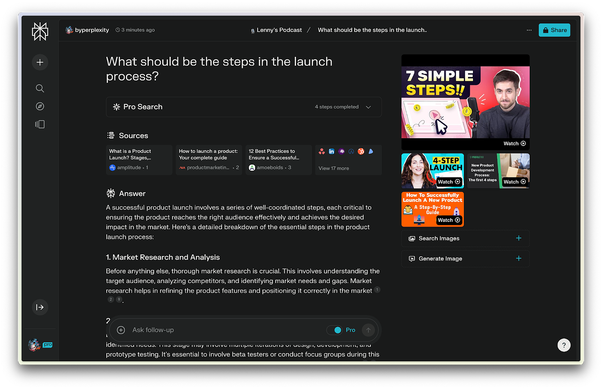
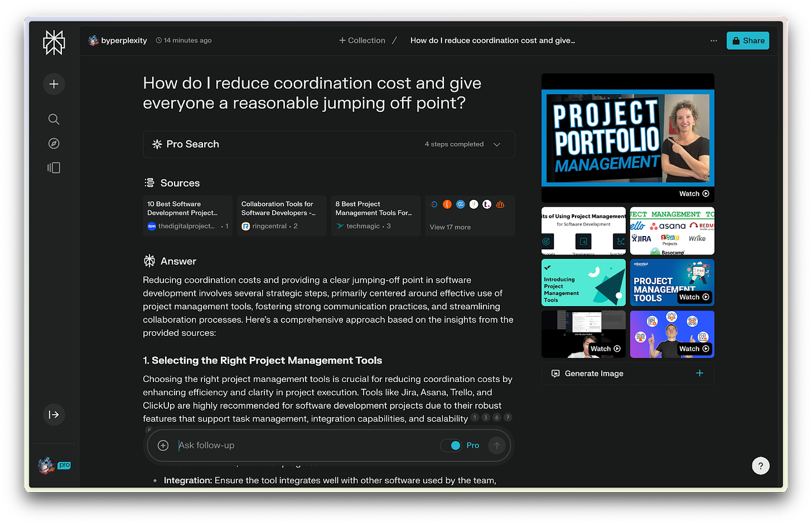
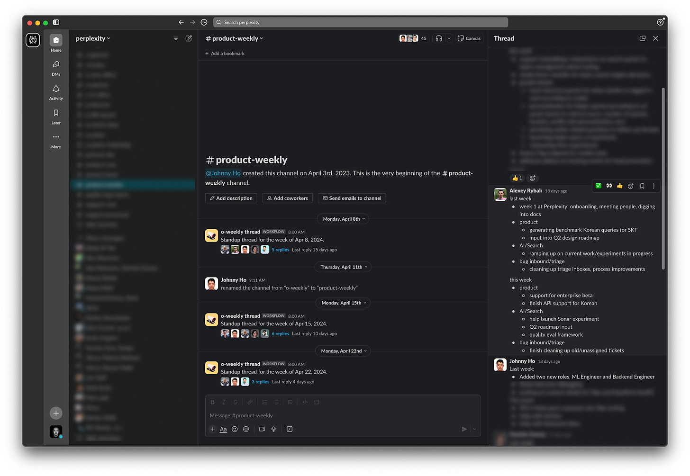
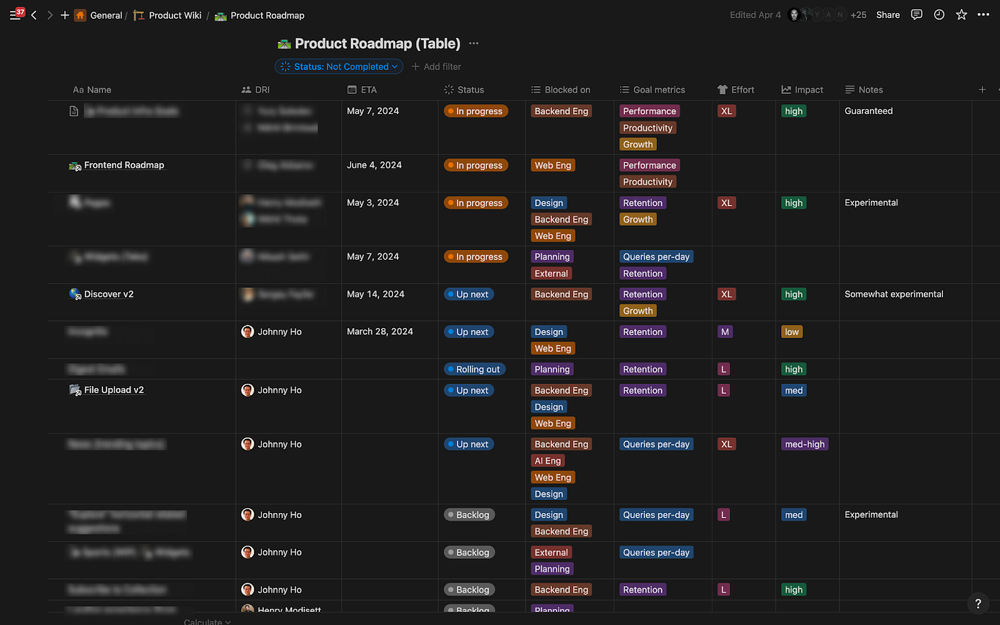
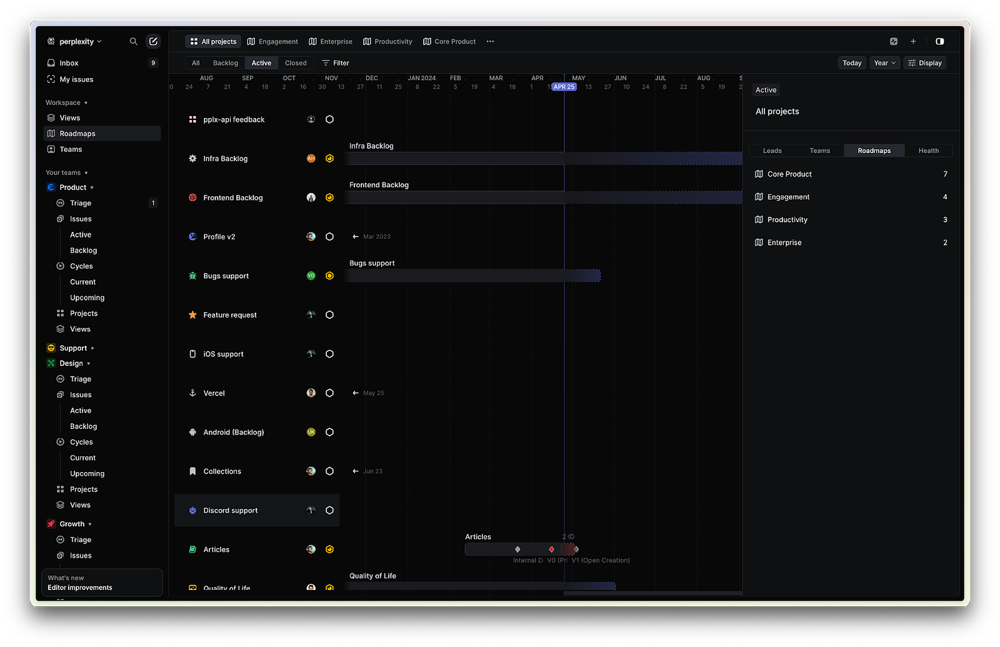
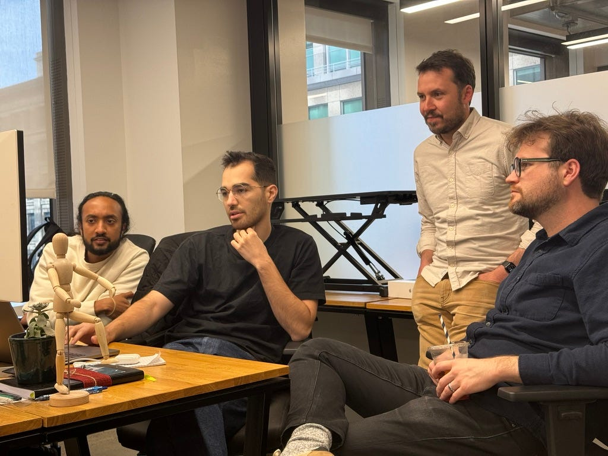

_👋 Hey, [Lenny](https://twitter.com/lennysan) here! Welcome to this month’s ✨ **free edition** ✨ of Lenny’s Newsletter.  

👋 嘿，莱尼在这里！欢迎阅读本月的✨免费版✨莱尼通讯。  

Each week I tackle reader questions about building product, driving growth, and accelerating your career.  

每周我会回答关于产品开发、推动增长和职业发展加速方面的读者问题。_

_If you’re not a subscriber, here’s what you missed this month:  

如果您还不是订阅者，这是本月您错过的内容：_

1.  _[The secret to Duolingo’s exponential growth  
    
    Duolingo 取得指数增长的秘诀](https://www.lennysnewsletter.com/p/the-secret-to-duolingos-growth)_
    
2.  _[How to accelerate growth by focusing on the features you already have  
    
    如何通过专注于您已经拥有的功能来加速增长](https://www.lennysnewsletter.com/p/how-to-accelerate-growth-by-focusing)_
    
3.  _[How AI will impact product management  
    
    人工智能将如何影响产品管理](https://www.lennysnewsletter.com/p/how-ai-will-impact-product-management)_
    
4.  _[How to make an impact in your first 90 days  
    
    如何在您的头 90 天产生影响](https://www.lennysnewsletter.com/p/how-to-make-an-impact-in-your-first)_
    

_For $150 a year, get access to these posts and every prior post, along with an invite to a private Slack community with global meetups, a mentor matching program, interview prep support, live AMAs, and more.  

每年 150 美元，您将获得访问这些帖子以及之前所有帖子的权限，还可获邀请加入私人 Slack 社区，参加全球聚会，导师匹配计划，面试准备支持，现场 AMA 等。  

I guarantee you’ll get 100x the value of a subscription or your money back.  

我保证您将获得订阅的 100 倍价值，否则退款。_

Founded less than two years ago, [Perplexity](https://www.perplexity.ai/) has become a many-times-a-day-use product for me, replacing many of my Google searches—and I’m not alone.  

成立不到两年的 Perplexity 已经成为我每天多次使用的产品，取代了我许多的谷歌搜索，而且我并不是唯一一个这样做的。  

With fewer than 50 employees, the company has a user base that’s grown to tens of millions.  

公司拥有不到 50 名员工，但用户群已经增长到数千万。  

They’re also generating over $20 million ARR and taking on both Google and OpenAI in the battle for the future of search.  

他们的年收入超过 2000 万美元，并且正在与 Google 和 OpenAI 等公司在搜索领域的未来之争中展开竞争。  

Their  

他们的[recent fundraise of $63m](https://x.com/AravSrinivas/status/1782784338238873769) values the company at more than $1 billion, and their investors include Nvidia, Jeff Bezos, Andrej Karpathy, Garry Tan, Dylan Field, Elad Gil, Nat Friedman, Daniel Gross, and Naval Ravikant (but sadly not me 😭).  

公司最近一轮筹资 6300 万美元，估值超过 10 亿美元，投资者包括 Nvidia、Jeff Bezos、Andrej Karpathy、Garry Tan、Dylan Field、Elad Gil、Nat Friedman、Daniel Gross 和 Naval Ravikant（但遗憾的是没有我😭）。  

Nvidia CEO Jensen Huang said he uses the product “  

英伟达首席执行官黄仁勋表示他使用这款产品“[almost every day](https://arc.net/l/quote/uglckdse).”  

几乎每天。

I sat down with [Johnny Ho](https://www.linkedin.com/in/hjohnny/), the company’s co-founder and head of product, to give you an inside look at how Perplexity builds product—which to me feels like what the future of product development will look like for many companies:  

我与公司联合创始人兼产品负责人 Johnny Ho 坐下来，为您揭示 Perplexity 是如何打造产品的内幕——对我来说，这就像许多公司未来产品开发的样子

1.  **AI-first:** They’ve been asking AI questions about every step of the company-building process, including “How do I launch a product?” Employees are encouraged to ask AI before bothering colleagues.  
    
    AI 优先：他们一直在向 AI 提问有关公司建设过程的每一个步骤，包括“如何推出产品？”员工被鼓励在打扰同事之前向 AI 提问。
    
2.  **Organized like slime mold:** They optimize for minimizing coordination costs by parallelizing as much of each project as possible.  
    
    有机体就像粘菌一样组织：它们通过尽可能将每个项目的工作并行化来优化，以最小化协调成本。
    
3.  **Small teams:** Their typical team is two to three people. Their AI-generated (highly rated) [podcast](https://www.perplexity.ai/podcast) was built and is run by just one person.  
    
    小团队：他们典型的团队规模为两到三人。他们的人工智能生成的（备受好评）播客是由一人独立建立和运营的。
    
4.  **Few managers:** They hire self-driven ICs and actively avoid hiring people who are strongest at guiding other people’s work.  
    
    少数经理：他们会招聘自我驱动的个人贡献者，并积极避免雇用那些最擅长指导他人工作的人。
    
5.  **A prediction for the future:** Johnny said, “If I had to guess, technical PMs or engineers with product taste will become the most valuable people at a company over time.”  
    
    未来的预测：约翰尼说：“如果要我猜的话，随着时间推移，技术产品经理或具有产品品味的工程师将成为公司中最有价值的人。”
    

_For more, check out [Perplexity](https://www.perplexity.ai/). And [they’re hiring](https://www.perplexity.ai/hub/careers)! For more stories of how the best product teams operate, don’t miss my deep dives into [Linear](https://www.lennysnewsletter.com/p/how-linear-builds-product), [Shopify](https://www.lennysnewsletter.com/p/how-shopify-builds-product), [Figma](https://www.lennysnewsletter.com/p/how-figma-builds-product), [Notion](https://www.lennysnewsletter.com/p/how-notion-builds-product), [Duolingo](https://www.lennysnewsletter.com/p/how-duolingo-builds-product), [Ramp](https://www.lennysnewsletter.com/p/how-ramp-builds-product), [Miro](https://www.lennysnewsletter.com/p/how-miro-builds-product), [Coda](https://www.lennysnewsletter.com/p/how-coda-builds-product), [Gong](https://www.lennysnewsletter.com/p/how-gong-builds-product), and [Snowflake](https://www.lennysnewsletter.com/p/how-snowflake-builds-product).  

欲了解更多详情，请查看 Perplexity。他们正在招聘！想要了解最优秀产品团队的运作方式，千万别错过我对 Linear、Shopify、Figma、Notion、Duolingo、Ramp、Miro、Coda、Gong 和 Snowflake 的深度剖析。_

_P.S. I’m collaborating with Perplexity on a deep dive into how product managers use Perplexity, and we’d love to hear from you.  

P.S. 我正在与 Perplexity 合作，深入探讨产品经理如何使用 Perplexity，我们很乐意听取您的意见。  

Fill out  

填写表格[this short survey](https://perplexity.typeform.com/to/gh54lgJh) if you use Perplexity regularly, and they’ll reach out to conduct a user interview.  

如果您经常使用 Perplexity，请填写这份简短的调查表，他们会联系您进行用户访谈。_

From left: Johnny Ho, Aravind Srinivas, and Denis Yarats, co-founders of Perplexity  

从左至右：Johnny Ho，Aravind Srinivas 和 Denis Yarats，Perplexity 的联合创始人

Honestly, at the very beginning, we didn’t know how to do all kinds of things, including product management, _project_ management, finances, HR, etc. We had early access to GPT-3, and as we were figuring out how to build the company, we’d start everything by asking AI, “What is X?” and then “How do we do X properly?” For example, we asked questions like “How do you launch a product?  

老实说，在最开始的时候，我们对各种事情一无所知，包括产品管理、项目管理、财务、人力资源等。我们早期就能接触到 GPT-3，当我们在摸索如何建立公司时，我们会通过询问 AI“X 是什么？”然后“我们应该如何正确地做 X？”来开始一切。例如，我们会问诸如“如何推出一个产品？”之类的问题。  

What should be the steps in the launch process?” You get a rough step-by-step process, which for a startup was good enough.  

“启动过程中的步骤应该是什么？”您将得到一个粗略的逐步过程，对于初创公司来说已经足够好了。  

Obviously, it’s often not correct on the first try, but neither is a human, right?  

显然，第一次尝试通常不正确，但人类也不是完美的，对吧？  

So we’d just iterate naturally from there.  

所以我们只需自然地从那里继续进行。

Trying to figure things out by ourselves took days, but with AI and some prompting, we could get rolling in five minutes.  

通过人工智能和一些提示，我们可以在五分钟内开始运转，而不是花费几天的时间来摸索。

We’re still doing this.  

我们仍在继续这个工作。  

This week, for example, I asked Perplexity, “How do I write an email inviting someone to Perplexity Pro?”  

本周，举个例子，我问 Perplexity，“如何写一封邀请某人加入 Perplexity Pro 的电子邮件？”

We even tried to use it at times to build our product, but we found AI tooling wasn’t anywhere near good enough when it comes to coding.  

我们甚至尝试过在某些时候使用它来构建我们的产品，但是我们发现 AI 工具在编码方面远远不够好。  

It could help us write scripts, but if you wanted sustainable code to build a platform on, it didn’t really work.  

它可以帮助我们编写脚本，但如果您想要构建一个可靠的平台，这种方法并不是最佳选择。  

Even today, with the advances and latest models, it still only writes templates.  

即使在今天，尽管有了先进的技术和最新的模型，它仍然只能编写模板。  

You can’t really design a new long-lived abstraction with it.  

你不能真的用它来设计一个新的长期存在的抽象。

We have only two full-time PMs, in an organization of 50.  

我们这个有 50 人的组织里只有两名全职项目经理。

Our two PMs  

我们的两位项目经理

Typical projects we work on only have one or two people on it.  

我们通常参与的项目只有一两个人。  

The hardest projects have three or four people, max. For example,  

最困难的项目通常只有三到四个人。例如，[our podcast](https://www.perplexity.ai/podcast) is built by one person end to end.  

我们的播客是由一个人独立制作的。  

He’s a brand designer, but he does audio engineering and he’s doing all kinds of research to figure out how to build the most interactive and interesting podcast. I don’t think a PM has stepped into that process at any point.  

他是一位品牌设计师，同时也搞音频工程，他正在进行各种研究，以找出如何打造最具互动性和趣味性的播客。我认为在这个过程中从未有产品经理介入。

We leverage product management most when there’s a really difficult decision that branches into many directions, and for more involved projects.  

当我们面临一个分支多方向的非常困难的决策，以及更复杂的项目时，我们最需要发挥产品管理的作用。

The hardest, and most important, part of the PM’s job is having taste around use cases.  

产品经理工作中最困难且最重要的部分是在使用案例中保持敏锐的洞察力。  

With AI, there are way too many possible use cases that you could work on.  

有了人工智能，有太多可能的用例可以让你去探索。  

So the PM has to step in and make a branching qualitative decision based on the data, user research, and so on.  

因此，项目经理必须根据数据、用户研究等信息做出分支定性决策。  

For example, a big problem with AI is how you prioritize between more productivity-based use cases versus the engaging chatbot-type use cases.  

例如，人工智能面临的一个重要问题是如何在更注重提高生产力的用例和更具吸引力的聊天机器人类型的用例之间进行优先排序。  

Pretty early on, we decided to focus on the former, but there are still ongoing discussions.  

早期，我们决定专注于前者，但仍在进行讨论。

We plan to hire one or two more PMs over the next year, but the bar for hiring is going to stay very high.  

我们计划在接下来的一年内雇佣一到两名项目经理，但招聘标准将保持很高。

Given the pace we are working at, we look foremost for flexibility and initiative.  

考虑到我们的工作节奏，我们最看重的是灵活性和主动性。  

The ability to build constructively in a limited-resource environment (potentially having to wear several hats) is the most important to us.  

在有限资源的环境中进行建设性的建设能力（可能需要扮演多种角色）对我们来说是最重要的。

When you take a look at resumes of PMs, a lot of them prioritize helping other people and finding alignment.  

当您查看产品经理的简历时，许多人都将帮助他人和寻找共识作为优先考虑的事项。  

I believe this becomes less important with the advent of AI.  

我相信随着人工智能的发展，这变得不那么重要了。  

So you don’t necessarily need skills around managing processes or leading people as much.  

因此，并不一定需要具备管理流程或领导团队的能力。  

We look for strong ICs with clear quantitative impacts on users rather than within their company.  

我们寻找对用户有明显定量影响的强大 IC，而不是公司内部的影响。  

If I see the terms “Agile expert” or “scrum master” in the resume, it’s probably not going to be a great fit.  

如果我在简历中看到“敏捷专家”或“Scrum Master”这些术语，那可能不会是一个很好的匹配。

Also, AI allows PMs to do a _lot_ more IC work, especially for data analysis and customer insights.  

此外，AI 使产品经理能够在数据分析和客户洞察方面做更多的 IC 工作。  

You still need some fundamental knowledge, of course (i.e. math, statistics, a basic grasp of programming), but it’s never been easier to be a truly “technical” PM.  

当然，你仍然需要一些基础知识（比如数学、统计学、基本的编程理解），但成为一个真正“技术”型产品经理从未如此容易。

We still select for culture fit and being easy to work with, but we’re less looking for people who guide other people’s efforts, because it’s not as necessary with AI.  

我们仍然注重文化匹配和易于相处，但不再强调寻找那些引导他人努力的人，因为在人工智能时代这已不再那么必要。  

This might change as we get to a certain scale, but at the current scale, there are way more products to build than there are people to work on them.  

随着规模的扩大，情况可能会有所变化，但在目前的规模下，需要开发的产品远远超过了可用的人手。

I think in the future, I expect fewer layers of management in the industry in general.  

未来，我预计整个行业的管理层会减少。  

And if I had to guess, a technical PM or an engineer with product taste will become the most valuable people at a company over time.  

如果非要我猜的话，随着时间推移，技术产品经理或具有产品品味的工程师将成为公司中最有价值的人。

My goal is to structure teams around minimizing “coordination headwind,” as described by [Alex Komoroske](https://www.linkedin.com/in/alex-komoroske-6597336/) in [this deck on seeing organizations as slime mold](https://komoroske.com/slime-mold/).  

我的目标是围绕最小化“协调阻力”来组建团队，就像 Alex Komoroske 在这份关于将组织视为粘菌的演示文稿中所描述的那样。  

The rough idea is that coordination costs (caused by uncertainty and disagreements) increase with scale, and adding managers doesn’t improve things.  

粗略的想法是，随着规模的增加，协调成本（由不确定性和分歧引起）也在增加，而增加管理者并不能改善情况。  

People’s incentives become misaligned. People tend to lie to their manager, who lies to  

人们的激励变得不一致。人们倾向于向他们的经理说谎，而经理也会说谎_their_ manager.  

他们的经理。  

And if you want to talk to someone in another part of the org, you have to go up two levels and down two levels, asking everyone along the way.  

如果你想和组织的其他部门的人交谈，你必须向上走两层，再向下走两层，一路上问每个人。

Instead, what you want to do is keep the overall goals aligned, and parallelize projects that point toward this goal by sharing reusable guides and processes.  

相反，您需要保持整体目标的一致性，并通过共享可重用的指南和流程来使指向这一目标的项目并行化。  

Especially with the advance of AI, it’s possible to minimize coordination costs by using AI for “  

特别是随着人工智能的发展，可以通过利用人工智能来降低协调成本[rubber duck debugging](https://en.wikipedia.org/wiki/Rubber_duck_debugging)” your ideas instead of relying on perfect alignment and consensus.  

与其依赖于完美的对齐和共识，不如“橡皮鸭调试”您的想法。  

We also keep a “who’s who” list updated in our internal docs, and if you feel the need to reach out to anyone, just do it.  

我们还在内部文档中更新“谁是谁”的名单，如果你需要联系任何人，随时都可以。  

This requires a large degree of trust.  

这需要相当高的信任度。

But even more importantly, with AI, you don’t have to reach out to people as often.  

但更重要的是，有了人工智能，你不必经常与人交流。  

Sometimes before asking the question you were going to ask someone else, you could first try spending one minute asking AI to reduce coordination costs and give everyone a reasonable jumping-off point to do it themselves.  

有时在向他人提出问题之前，您可以先尝试花一分钟询问人工智能，以降低协调成本，并为每个人提供一个合理的起点来自行解决。

Perplexity has existed for less than two years, and things are changing so quickly in AI that it’s hard to commit beyond that.  

焦虑存在不到两年，人工智能领域变化如此迅速，很难做出长期承诺。  

We create quarterly plans. Within quarters, we try to keep plans stable within a product roadmap.  

我们制定季度计划。在季度内，我们努力确保计划与产品路线图保持稳定。  

The roadmap has a few large projects that everyone is aware of, along with small tasks that we shift around as priorities change.  

路线图中包含一些大型项目，所有人都知道，还有一些小任务，我们会根据优先级的变化进行调整。  

Being nimble is critical as developments in AI often have unforeseeable impact.  

在人工智能领域，灵活应对至关重要，因为其发展往往具有不可预见的影响。  

For example, the rapid developments in open-source models and context length have had downstream impact on the product, roadmap, and overall business.  

例如，开源模型和上下文长度的快速发展对产品、路线图和整体业务产生了深远影响。  

Just recently, Meta released Llama 3 and Mistral released 8x22B; we’re looking into creative ways to use those models in our product.  

最近，Meta 发布了 Llama 3 和 Mistral 发布了 8x22B；我们正在探索如何在我们的产品中创造性地运用这些模型。

The projects in the product roadmap also need to be flexible because new product development runs in parallel with a technical/model development roadmap.  

产品路线图中的项目也需要灵活，因为新产品开发与技术/模型开发路线是并行进行的。  

Engineers shift between maintaining existing products and building new products, depending on the week.  

工程师们会根据每周的情况在维护现有产品和开发新产品之间进行转换。  

The technical roadmap tends to grow quickly as we run into limitations of existing systems and accumulate tech debt, but we try to prioritize tech debt that unlocks product improvements.  

技术路线图往往会迅速增长，因为我们遇到现有系统的限制并积累技术债务，但我们会优先处理那些能带来产品改进的技术债务。

Within a given week, though, plans are fairly stable.  

然而，在一个星期内，计划通常是相对稳定的。  

Each week we have a kickoff meeting where everyone sets high-level expectations for their week.  

每周我们都会举行一个启动会议，每个人都会设定他们这周的高层期望。  

We have a culture of setting 75% weekly goals: everyone identifies their top priority for the week and tries to hit 75% of that by the end of the week.  

我们有一个文化，即设定每周 75%的目标：每个人确定本周的首要任务，并努力在周末前完成该任务的 75%。  

 Just a few bullet points to make sure priorities are clear during the week.  

只需几个要点，以确保在本周的工作中优先事项清晰明了。

Taking a moment at the beginning of the week to reflect on meta tasks brings clarity and prevents overly reactive or hectic decision-making.  

在一周开始时花点时间反思元任务，可以带来清晰，避免过度反应或忙乱的决策。  

Over time, our ability to estimate size and prioritize based on return on investment has also improved.  

随着时间的推移，我们对规模的估计和基于投资回报进行优先排序的能力也得到了提升。

We try to be as rigorous and data-driven as possible in quarterly planning.  

我们在季度规划中尽量做到严谨和数据驱动。  

All objectives are measurable, either in terms of quantifiable thresholds or Boolean “was X completed or not.” Our objectives are very aggressive, and often at the end of the quarter we only end up completing 70% in one direction or another.  

所有目标都是可衡量的，要么以可量化的阈值为标准，要么以布尔值“X 是否完成”为标准。我们的目标非常激进，通常在季度末我们只能完成 70%左右的目标，或者朝某个方向完成了 70%。  

The remaining 30% helps identify gaps in prioritization and staffing.  

剩下的 30%有助于识别优先级和人员配备方面的差距，帮助确定优先级和人员配备方面存在的问题。  

Underinvestments, for example, in hiring infra engineers become quickly apparent when infrastructural goals aren’t met.  

当基础设施目标未能实现时，很快就会显现出在招聘基础设施工程师方面投资不足的问题。

After the central objectives and high-level designs are determined, we try to be fairly decentralized in our decision-making.  

在确定了中心目标和高层设计之后，我们尽量在决策过程中保持较为分散的权力。  

Projects are driven by a single DRI, and execution steps are done in parallel as much as possible.  

项目由单一的负责人推动，尽可能并行执行各个步骤。

The first step for any project is to break it down into parallel tasks as much as possible to reduce coordination issues.  

任何项目的第一步是尽可能将其分解为并行任务，以减少协调问题。  

We do this in Linear, and I lead this work along with the PM on the team (or whoever is handling the PM duties).  

我们在 Linear 中进行这项工作，我与团队上的项目经理一起领导这项工作（或者是负责项目经理职责的人）。  

We strive for each task to be self-contained—you should be able to execute on it without blockers.  

我们致力于确保每个任务都是自包含的 - 您应该能够在没有障碍的情况下执行它。  

And you will likely have to make some controversial decisions, but you can just work through the controversy later.  

你可能需要做出一些有争议的决定，但可以稍后再处理这些争议。

At the beginning of each project, there is a quick kickoff for alignment, and afterward, iteration occurs in an asynchronous fashion, without constraints or review processes.  

每个项目开始时，都会进行快速启动以实现对齐，然后迭代以异步方式进行，没有任何限制或审查流程。  

When individuals feel ready for feedback on designs, implementation, or final product, they share it in Slack, and other members of the team give honest and constructive feedback.  

当个人感觉准备好接受有关设计、实施或最终产品的反馈时，他们会在 Slack 中分享，团队的其他成员会提供真诚而富有建设性的反馈。  

Iteration happens organically as needed, and the product doesn’t get launched until it gains internal traction via dogfooding.  

迭代会自然发生，并且产品只有在通过内部试用获得足够推动后才会推出。

I encourage people to try to work in parallel as much as they can.  

我鼓励人们尽量同时进行工作，以提高效率。  

They should not be waiting for everyone to unblock them.  

他们不应该等着每个人来解除对他们的屏蔽。  

Ideally, you have design, front end, and back end all working at the same time on the same project.  

理想情况下，您可以同时在同一项目上进行设计、前端和后端工作，让它们协同工作。  

And now that we have a business team, all four people could work in parallel, whereas conventionally you might wait for designs or mock-ups to show up first.  

现在我们有了一个商业团队，所有四个人可以并行工作，而传统上你可能要等待设计或模型首先出现。

The teams are currently structured by function (product, R&D, design, business, etc.), and different teams think about different layers of the company and stack.  

目前团队按照功能（产品、研发、设计、业务等）划分，不同团队关注公司不同层面和架构。  

But all energy is directed toward improving the core product.  

但所有的精力都投入到改进核心产品上。  

We design objectives that translate to common top-level metrics and improve the user experience holistically.  

我们设计的目标是将其转化为常见的顶层指标，从整体上改善用户体验。  

For example, all teams share common top-level metrics while A/B testing within their layer of the stack.  

例如，所有团队在其技术堆栈层面进行 A/B 测试时共享共同的顶层指标。  

Because the product can shift so quickly, we want to avoid political issues where anyone’s identity is bound to any given component of the product.  

由于产品可能变化如此迅速，我们希望避免任何政治问题，其中任何人的身份都与产品的任何组件相关联。

At our current size, we are flat by design, and the reporting structure does not dictate priorities as much as commitments to top-level goals.  

在我们目前的规模下，我们的组织结构是扁平化的，而报告结构并不像对顶层目标的承诺那样决定优先事项。  

Our two full-time PMs—one web and one mobile—report to me as head of product.  

我们有两位全职产品经理，一位负责网页，一位负责移动端，他们向我作为产品负责人汇报工作。  

We’ve found that when teams don’t have a PM, team members take on the PM responsibilities, like adjusting scope, making user-facing decisions, and trusting their own taste.  

我们发现，当团队没有项目经理时，团队成员会承担项目经理的职责，例如调整范围、做出面向用户的决策，并信任自己的品味。

Central to our approach is to take feedback, both from users and internally, and distill it into a few intuitive products that can work for many customers.  

我们方法的核心是接受来自用户和内部的反馈，并将其提炼成几款直观的产品，以满足众多客户的需求。  

We also try to distill the feedback in a way that motivates and informs our team, setting a broad vision but letting individuals control their own decisions about what would best serve the original goal.  

我们还尝试以一种激励和告知我们团队的方式提炼反馈，设定一个广泛的愿景，但让个人自行决定如何最好地实现原始目标。  

Our decentralized approach for decisions passes the torch of responsibility, enabling fast-paced iteration without the need for approval processes.  

我们的分散决策方法将责任的火炬传递下去，实现快速迭代，无需经过批准流程。  

Individuals make urgent, locally optimal decisions.  

个人做出紧急的、在当地最优的决策。  

Any misalignments are then ironed out quickly afterward.  

任何不对齐的问题都会很快得到解决。

[Linear](https://linear.app/).  

线性。  

For AI products, the line between tasks, bugs, and projects becomes blurred, but we’ve found many concepts in Linear, like Leads, Triage, Sizing, etc., to be extremely important.  

对于 AI 产品，任务、错误和项目之间的界限变得模糊，但我们发现线性中的许多概念，如潜在客户、分类、规模等，非常重要。  

A favorite feature of mine is auto-archiving—if a task hasn’t been mentioned in a while, chances are it’s not actually important.  

我最喜欢的功能之一是自动归档 - 如果一个任务很久没有被提及，那么很可能它实际上并不重要。

The primary tool we use to store sources of truth like roadmaps and milestone planning is [Notion](https://www.notion.so/).  

我们主要使用 Notion 这个工具来存储诸如路线图和里程碑规划等真实来源。  

We use Notion during development for design docs and RFCs, and afterward for documentation, postmortems, and historical records.  

我们在开发过程中使用 Notion 来编写设计文档和 RFC，然后用于文档、事后总结和历史记录。  

Putting thoughts on paper (documenting chain-of-thought) leads to much clearer decision-making, and makes it easier to align async and avoid meetings.  

将思绪记录在纸上（记录思维链）有助于更清晰地做决策，并使异步对齐和避免开会变得更容易。

[Unwrap.ai](https://www.unwrap.ai/) is a tool we’ve also recently introduced to consolidate, document, and quantify qualitative feedback.  

Unwrap.ai 是我们最近推出的工具，用于整合、记录和量化定性反馈。  

Because of the nature of AI, many issues are not always deterministic enough to classify as bugs.  

由于人工智能的本质，许多问题并不总是足够确定，以便归类为错误。  

Unwrap groups individual pieces of feedback into more concrete themes and areas of improvement.  

将组中的各个反馈单独展开，整理成更具体的主题和改进方向。

High-level objectives and directions come top-down, but a large amount of new ideas are floated bottom-up.  

高层目标和方向是自上而下确定的，但许多新想法是由下而上提出的。  

We believe strongly that engineering and design should have ownership over ideas and details, especially for an AI product where the constraints are not known until ideas are turned into code and mock-ups.  

我们坚信工程和设计团队应该对想法和细节负责，尤其是在人工智能产品中，因为直到想法转化为代码和模型后才能了解约束条件。  

Plenty of brainstorming is going on at all times.  

不断有大量头脑风暴在进行。  

We have a dedicated brainstorm channel in Slack, follow-up ideas are collected in Linear, and often polishes go straight to code without anyone asking.  

我们在 Slack 中设有专门的头脑风暴频道，在 Linear 中收集后续想法，而且经常会直接将修改后的内容转化为代码，无需他人询问。

The best examples of bottom-up ideas can be seen in Perplexity’s Discovery, Collection, and Sharing experiences.  

在 Perplexity 的 Discovery、Collection 和 Sharing 体验中，可以看到最好的自下而上思想的例子。  

For example, as I shared above, our brand designer Phi builds  

例如，就像我之前分享的那样，我们的品牌设计师 Phi 进行设计[the Discover Daily podcast](https://www.perplexity.ai/podcast) and simultaneously makes decisions around the script, ElevenLabs integration, brand, and audio engineering.  

Discover Daily podcast 同时负责脚本、ElevenLabs 集成、品牌和音频工程的决策。  

With AI, it’s impossible to predict use cases until iterations of the product are released.  

利用人工智能，要预测使用案例，直到产品发布多个迭代版本之后才变得可能。  

A year ago, we would never have predicted that the Discover experience would eventually be built into a podcast.  

一年前，我们绝对没有预料到 Discover 体验最终会被打造成一个播客。

Big challenges today revolve around scaling from our current size to the next level, both on the hiring side and in execution and planning.  

当今的重大挑战在于如何从我们当前的规模迈向下一个水平，无论是在招聘方面还是在执行和规划方面。  

We don’t want to lose our core identity of working in a very flat and collaborative environment.  

我们不希望失去在一个非常扁平和协作的环境中工作的核心身份。  

Even small decisions, like how to organize Slack and Linear, can be tough to scale.  

即使是一些小决定，比如如何组织 Slack 和 Linear，也可能难以扩展。  

Trying to stay transparent and scale the number of channels and projects without causing notifications to explode is something we’re currently trying to figure out.  

我们目前正在努力解决如何保持透明并扩大渠道和项目数量，而不会导致通知爆炸的问题。

A lot of features and products at Perplexity were built during one-week (or less) hackathons.  

Perplexity 的许多功能和产品是在一周甚至更短的黑客马拉松中开发出来的。  

Focused sprints to build new features have proved to be the most exciting and memorable times.  

专注的冲刺来开发新功能已被证明是最令人兴奋和难忘的时刻。  

Our first interactive search prototype, Pro Search (formerly Copilot), was built in a few days, but it has improved over many iterations of polish and fine-tuning.  

我们的第一个交互式搜索原型，Pro Search（前身为 Copilot），虽然是在几天内构建完成的，但经过多次打磨和微调得到了改进。

_Thank you, [Johnny](https://www.linkedin.com/in/hjohnny/)! Also, a big thank-you to [Phi Hoang](https://www.linkedin.com/in/phi-hoang-a8689741/) for helping with visuals.  

谢谢你，约翰尼！也要感谢 Phi Hoang 帮助制作视觉效果。_

_For more, check out [Perplexity](https://www.perplexity.ai/), and [they’re hiring](https://www.perplexity.ai/hub/careers)!  

欲了解更多，请查看 Perplexity，他们正在招聘中！_

_Have a fulfilling and productive week 🙏  

祝您度过充实而高效的一周 🙏_

I run a white-glove recruiting service specializing in product roles, working with a few select companies at a time.  

我经营一家白手套招聘服务，专门为产品职位提供服务，一次只与少数几家公司合作。  

If you’re hiring for senior product roles, apply to work with us:  

如果您正在招聘高级产品职位，请申请加入我们：

[Apply to join  

申请加入的申请](https://www.lennysjobs.com/talent/)

If you’re exploring new opportunities yourself, use the same button above to sign up.  

如果您正在寻找新的机会，请使用上面的按钮进行注册。  

We’ll send over personalized opportunities from hand-selected companies if we think there’s a fit.  

如果我们认为合适，我们将发送来自精心挑选公司的个性化机会。  

Nobody gets your info until you allow them to, and you can leave anytime.  

除非您允许，否则不会有人获取您的信息，您可以随时离开。

**If you’re finding this newsletter valuable, share it with a friend, and consider subscribing if you haven’t already.  

如果您觉得这份通讯有用，请与朋友分享，并考虑订阅，如果您还没有订阅的话。  

There are  

存在[group discounts](https://www.lennysnewsletter.com/subscribe?group=true), [gift options](https://www.lennysnewsletter.com/subscribe?gift=true), and [referral bonuses](https://www.lennysnewsletter.com/leaderboard) available.  

提供团体折扣、礼品选择和推荐奖金。**

Sincerely,  

此致敬礼，

Lenny 👋
