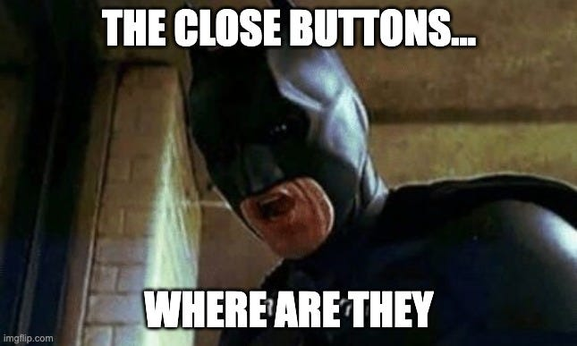
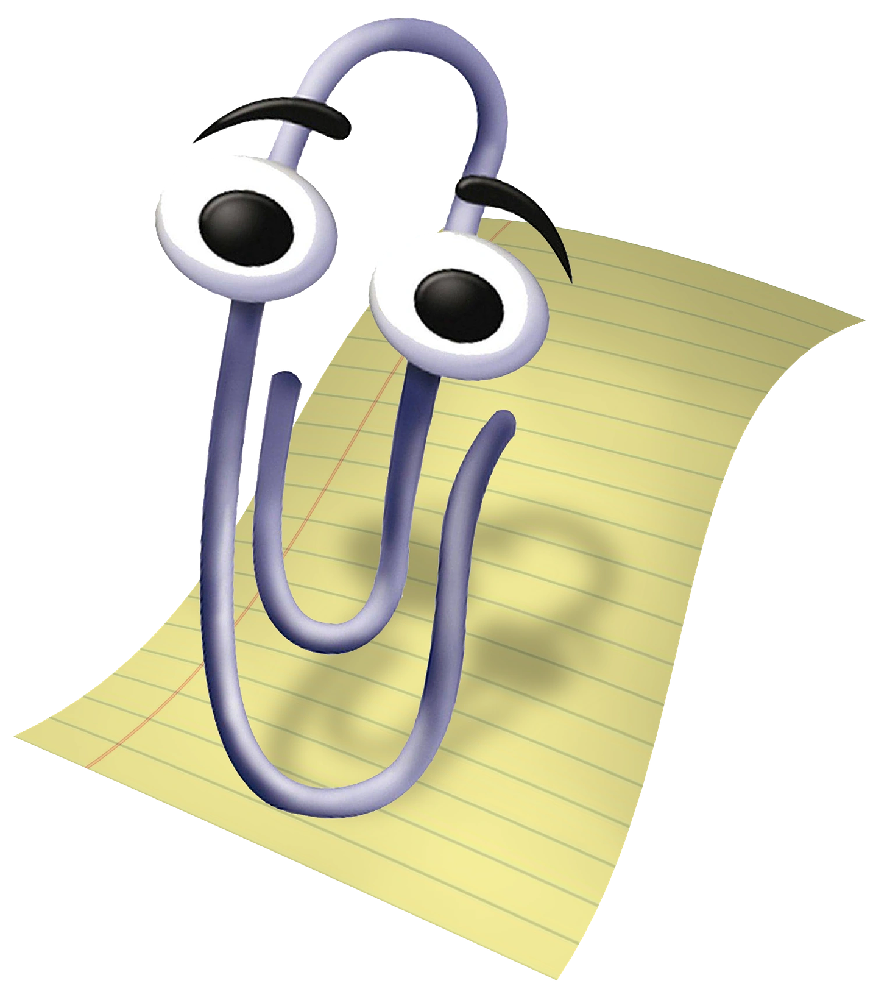
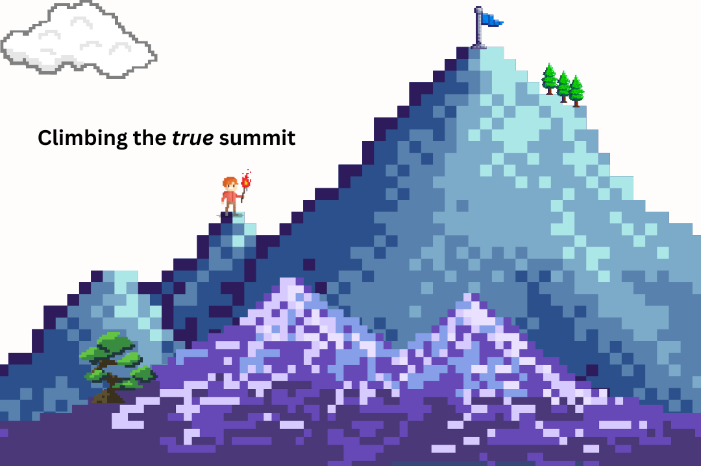
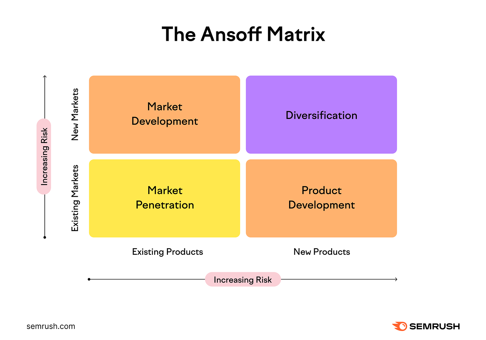
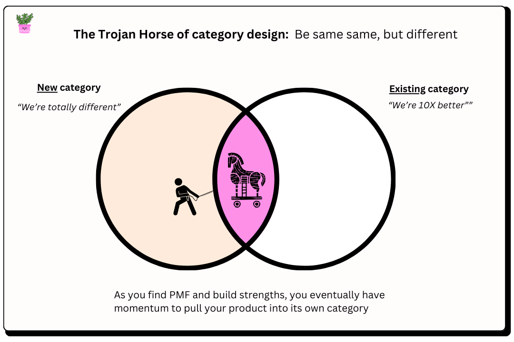

_👋 Hey, I’m Jaryd!  

嗨，我叫 Jaryd！  

Here to help you build and grow your product with actionable deep dives into the growth motions, strategic playbooks, products, and founding stories of world-class companies.  

我们在这里帮助您构建和发展产品，深入分析增长策略、战略手册、产品以及世界一流公司的创始故事。  

View all my previous analyses  

查看我所有之前的分析结果[here](https://www.howtheygrow.co/s/deep-dives).  

在这里。_

Hi, everyone!  

大家好！

There’s a universal truth that as users of countless software products, we can probably all agree with: **Popups suck.**  

有一个大家都能认同的普遍真理：作为无数软件产品的用户，弹出窗口真让人厌烦。

And—just like that party host who tries to show you around their new house, pointing out their gallery wall and all the nicknacks you don’t really care about—so do those 20-step product tours.  

就像那个试图带你参观新房子的派对主人，指着他们的画廊墙和你并不太在意的小摆件一样，那些 20 步的产品导览也是如此。  

_Skip, thanks!  

不用了，感谢！_

Even as someone who studies products and builds products for a living, I can’t close a popup fast enough.  

即使我是一名研究和开发产品的专业人士，我也无法迅速关闭弹出窗口。  

But up until now, these annoyances have been somewhat of a necessary evil.  

但到目前为止，这些烦恼在某种程度上仍然是不可避免的。  

An evil I’ve guiltily deployed many times across the products I’ve built for my users to probably rage click out of faster than Batman can disappear from a conversation.  

我在为用户开发的产品中多次罪恶地使用过这种手段，他们可能会比蝙蝠侠从对话中消失得更快地愤怒点击退出。  

This has been especially true for PLG products, where tours and popups are how product builders and growth teams drive adoption.  

这在 PLG 产品中尤其明显，产品开发者和增长团队通过导览和弹出窗口来促进用户的采纳。  

But, luckily for the world of software, in 2020 James Evans, Richard Freling, and Vinay Ayyala co-founded [CommandBar](https://www.commandbar.com/?utm_source=howtheygrow) with a key insight: **Digital adoption products are a** _**frustration**_**\-center because they** _**push**_ **information to users.**  

不过，幸运的是，在 2020 年，詹姆斯·埃文斯、理查德·弗雷林和维奈·阿亚拉共同创立了 CommandBar，并提出了一个重要的见解：数字化采纳产品常常让人感到沮丧，因为它们会向用户推送信息。

Like all brilliant ideas, the solution seems so clear when you hear it. **[CommandBar](https://www.commandbar.com/?utm_source=howtheygrow)** _**pulls**_ **users toward information when they need it and turns user assistance into a** _**delight**_**\-center.**  

像所有优秀的想法一样，当你听到这个解决方案时，它显得非常清晰。CommandBar 在用户需要信息时引导他们，并将用户支持转变为一种愉悦的体验。

The easiest way to think about what they do is like this: **CommandBar allows product teams to embed an intelligent AI agent on top of their software to help their end-users perform actions, fetch data, and co-browse with them to show how the product works.  

最简单的理解他们所做的事情的方法是：CommandBar 允许产品团队在他们的软件上嵌入一个智能 AI 代理，帮助最终用户执行操作、获取数据，并与他们共同浏览，展示产品的使用方式。  

**

As James told me in our interview, **it’s like having a friendly human assistant standing by your side who anticipates your needs.** [Copilot](https://www.commandbar.com/copilot/?utm_source=howtheygrow) is a true successor to the antiquated tree-diagram chatbot— it’s just miles more personalized and helpful.  

正如詹姆斯在我们的采访中所说，这就像有一个友好的人工助手在你身边，能够预见你的需求。Copilot 是真正的古老树状图聊天机器人的继任者——它更加个性化且更具帮助性。

Through their comprehensive user assistance suite, [CommandBar](https://www.commandbar.com/?utm_source=howtheygrow) helps their B2B customers with all the vital parts of their own growth motions: Onboarding, activation, upselling, and retention.  

CommandBar 通过其全面的用户支持套件，帮助 B2B 客户处理增长过程中的关键环节：入职、激活、追加销售和客户留存。

Ironically, despite CommandBar being a sales-led company, they’re in the business of helping product-led companies do PLG.  

具有讽刺意味的是，尽管 CommandBar 是一家以销售为主的公司，但他们的业务是帮助以产品为主导的公司实现产品主导增长（PLG）。  

**That’s why my thesis is that CommandBar will win because they’re building the PLG-as-a-Service layer** for the generation of companies scrambling to be product-led.  

这就是为什么我认为 CommandBar 会胜出，因为他们正在为那些急于转型为以产品为导向的公司构建 PLG-as-a-Service 层。  

In a way, like the strategy of selling picks in the gold rush.  

在某种程度上，这就像是在淘金热中出售选择的策略。

And they’re already killing it.  

他们已经表现得很出色了。  

They’ve raised ~$25M, have hundreds of customers, are reaching around 25M end users, and are growing at 300% a year.  

他们已筹集约 2500 万美元，拥有数百名客户，服务约 2500 万终端用户，年增长率达到 300%。  

But, as we’ll see in today’s deep dive, CommandBar has found growth momentum by bucking the common wisdom that startups should create a category.  

但是，正如我们今天深入探讨的内容所示，CommandBar 通过打破创业公司应当创建一个类别的常规智慧，找到了增长的动力。  

If you only have a few minutes to spare, here are some tactical things product builders, founders, and senior tech leaders can learn from CommandBar **in just 5 minutes.**  

如果你只有几分钟的时间，这里有一些产品开发者、创始人和高级技术领导者可以在短短 5 分钟内从 CommandBar 学到的实用技巧。

-   **One of the most impactful, lowest investment, and least risky growth levers is to make what you already have much better.** While growth through “new” seems more sexy, you likely have much more juice to squeeze out of your existing product.  
    
    最具影响力、投资成本最低、风险最小的增长杠杆之一，就是将你现有的产品提升到更高的水平。虽然通过“新”来实现增长看起来更有吸引力，但你可能还有更多的潜力可以从现有产品中挖掘。
    
-   **Offering your audience unique and aggregated first-party data from the larger market is an incredibly strong carrot.  
    
    向您的受众提供来自更大市场的独特聚合第一方数据，是一个极具吸引力的优势。  
    
    **Since CommandBar is a layer sitting across many PLG platforms, they are able to aggregate insights _across_ many companies and share novel insights with their customers on how they can do PLG better.  
    
    由于 CommandBar 是一个覆盖多个 PLG 平台的层，他们能够汇聚来自多家公司的洞察，并与客户分享如何更好地实施 PLG 的新见解。
    
-   **Product-market fit maps very closely to how repeatable your customer flow is.** If your demand is fragmented and people want you for different reasons, then you're probably good at sales/marketing but might not have strong PMF.  
    
    产品市场契合度与客户流的可重复性密切相关。如果你的需求分散，人们出于不同的原因需要你的产品，那么你可能在销售和市场营销方面表现不错，但可能并没有强大的产品市场契合度。  
    
-   **When going after your ICP, don’t stop at** _**title**_**. Push further into pain points, company structure, what other tools the company uses, etc.** You need to go deeper and ask, “Are these the _best_ folks with this title that we could meet?”.  
    
    在寻找理想客户时，不要仅仅关注职位。要深入了解他们的痛点、公司结构以及使用的其他工具等。你需要更深入地问：“这些人是我们能见到的最合适的职位吗？”
    
-   **The quality of company-generated content is increasingly becoming a signal for the quality of the product and a** _**whole-product**_ **differentiator.** CommandBar has an [insanely good blog](https://www.commandbar.com/blog/?utm_source=howtheygrow)—one of the best I’ve seen—and they told me that it’s very hard to make the 1,000-word post work these days.  
    
    公司生成内容的质量越来越成为产品质量的标志和整体产品的差异化因素。CommandBar 的博客非常出色——是我见过的最好的之一——他们告诉我，现在让一千字的文章发挥作用非常困难。  
    
    Either content needs to be very deep (their strategy…  
    
    内容需要非常深入（他们的策略…_and mine_), or very snackable. The “_Content Written For Google_” level stuff isn’t engaging, and to stay defensible in the Generative Search era, _you have to optimize for people staying on your page._  
    
    以及我的），或者非常适合小吃。“为谷歌撰写的内容”并不吸引人。为了在生成搜索时代保持竞争力，你必须优化内容，让人们愿意停留在你的页面上。
    
-   **Tapping into sponsored podcasts and newsletters as a channel can be an incredibly effective way to reach your market.** But, you need your audience and messaging— with a differentiated narrative and counter-positioning— locked in before you do creator-led growth.  
    
    利用赞助播客和新闻通讯作为渠道可以非常有效地接触市场。然而，在进行创作者主导的增长之前，您需要先明确您的受众和信息——并具备差异化的叙事和反向定位。
    
-   **If your product is found through searching, and not discovery, then G2 reviews can be a strong source of leads.** When products are evaluated by comparison shopping (like B2B software in a known category), [G2](https://www.g2.com/) is the place where that happens.  
    
    如果您的产品是通过搜索而非发现找到的，那么 G2 评论可以成为强有力的潜在客户来源。当产品通过比较购物（例如已知类别的 B2B 软件）进行评估时，G2 就是进行这种评估的地方。  
    
    You need to actively ask and incentivize your customers to review you.  
    
    你需要主动邀请并激励客户为你写评价。
    

-   **Disrupting an existing category is often better than trying to create a brand-new one.  
    
    颠覆现有的类别往往比尝试创造一个全新的类别更有效。  
    
    At least, to start.  
    
    至少，从这里开始。**James said, **“**_Every founder wants to be an innovator; building a new mousetrap the world has never seen and building a market before any competitors catch on.  
    
    詹姆斯说：“每位创始人都希望成为创新者；他们想创造一个世界上从未见过的新捕鼠器，并在竞争对手察觉之前建立市场。”  
    
    In most cases, I firmly believe that process is hard mode  
    
    在大多数情况下，我坚信这个过程是困难的模式_.” Easy mode is taking the insight behind your mousetrap and using it to disrupt an existing category by adding your own rules to a known game.  
    
    简单模式是利用你捕鼠器背后的洞察，通过在一个已知的游戏中添加自己的规则，来颠覆一个现有的类别。  
    
-   **You can always start in an existing category, and then once you’ve found success, pull the market into a new one you create later.** Perhaps the best way to create a category is to go through a category.  
    
    你可以从一个现有的类别开始，一旦取得成功，就可以将市场引入你稍后创建的新类别。或许创建一个类别的最佳方式就是先经历一个类别。
    
-   **It’s possible to be so good that** _**your**_ **customers want to show your branding to** _**their**_ **customers**.  
    
    你可以做到如此优秀，以至于客户愿意向他们的客户展示你的品牌。  
    
    This is elite-level trust, and happens when you prioritize for the end user experience even more than your direct customer.  
    
    这是精英级别的信任，发生在你将最终用户体验的优先级放在比直接客户更高的位置时。  
    
    Although, both usually win in this case.  
    
    尽管如此，在这种情况下，两者通常都会赢。
    
-   **Interoperability is how you can make your product hard to replace.** Embedded products win.  
    
    互操作性是让你的产品难以被替代的关键。嵌入式产品更具优势。
    

-   **When playing an established game, you can add your own rules by building a narrower version of what your competitors have, with just enough functionality to compete, that still preserves and highlights your core insight.  
    
    在玩一个成熟的游戏时，你可以通过构建一个更简化的版本来添加自己的规则，这个版本的功能足够与竞争对手抗衡，同时仍然保留并突出你的核心见解。  
    
    **This isn’t just about [Tablestakes & Differentiators](https://www.linkedin.com/posts/pauladams_differentiation-vs-tablestakes-the-world-activity-7105104228276137984-hNqj/), but more so the opportunity to _**differentiate**_ on _**table stakes**_ and focus more on the outcome that the customer is looking for. You don't have to copy.  
    
    这不仅仅关乎基本要求和差异化，更重要的是在基本要求上找到差异化的机会，专注于客户所期望的结果。你不需要照搬。
    
-   **It’s essential to align your AI pricing with your overall product strategy.** You need to think about what outcome you’re trying to optimize for, and based on that, determine the risk-reward for capping usage.  
    
    将人工智能定价与整体产品战略对齐至关重要。您需要思考您希望优化的结果，并据此确定使用限制的风险与收益。
    
-   **As much as possible, you want to focus on** _**pulling, not pushing**_**.** It’s as basic as this: Listening and learning beats talking.  
    
    尽量专注于拉而不是推。简单来说，倾听和学习比说话更重要。  
    
    Yet, many products don't abide by this fundamental law of communication.  
    
    然而，许多产品并未遵循这一基本的沟通原则。
    
-   **Another golden rule is this:** _**Don’t annoy users.**_ This starts by thinking about what annoys _you_ as a user, then working backward to make sure you’re not forgetting to empathize with your own product’s users.  
    
    另一个黄金法则是：不要让用户感到烦恼。这首先要考虑作为用户的你所烦恼的事情，然后反向思考，确保你没有忘记对自己产品的用户保持同理心。
    
-   **James believes the theme of PLG has destroyed more enterprise value than it has created.** To his point, PLG works once you’ve achieved PMF, but before then, being sales-led helps you understand why people are coming to you.  
    
    詹姆斯认为，PLG 的主题所摧毁的企业价值远超过其创造的价值。他指出，PLG 在你实现产品市场契合（PMF）后才会有效，但在此之前，销售主导的方式能帮助你理解客户为何会找上你。  
    
    Plus, the downside with PLG is that the  
    
    此外，PLG 的一个缺点是_motivation to talk to you is so low once people have access.  
    
    一旦人们有了接触，和你交流的动机就会大大降低。_
    

-   **Don’t overthink the mechanics of PMF, and dwell on the question: “**_**Do we have it?**_**!”.** The focus should be solely on executing, speaking to people, and learning from what you’re doing.    
    
    不要过于纠结于 PMF 的机制，而是要关注这个问题：“我们达到了吗？”重点应放在执行、与人交流以及从实践中学习。
    
-   **The pitch deck is first and foremost for you as the founders, and investors second. “**_We’ve always been clear-headed that the most valuable asset in our company wasn’t the capital, but our time as founders.  
    
    演示文稿首先是为了你们这些创始人，其次才是为了投资者。“我们一直清楚，我们公司最宝贵的资产不是资本，而是我们作为创始人的时间。”  
    
    We looked at our seed deck as a memo to ourselves of why we - self-proclaimed smart people who could do a bunch of other things with their time - should invest the next decade+ of our blood, sweat, and tears into this company  
    
    我们将种子计划视为对自己的备忘，提醒我们这些自认为聪明的人，能够用时间做很多其他事情，为什么应该将接下来的十年及以上的心血投入到这家公司_”, says James.  
    
    “詹姆斯说。
    
-   **Spending too much time on the design of your deck is a red flag.** It shows you’re either prioritizing the wrong things or “_you are trying to hide bad ideas with pretty slides_”  
    
    在演示文稿设计上花费过多时间是一个警示信号。这表明你可能在优先考虑错误的事情，或者“试图用华丽的幻灯片掩盖不好的想法”。
    
-   **It’s a misnomer to think you’re not a good founder if you’re not doing deep work.** James says sometimes the the best thing you can do— at least once you have PMF**—**is unblocking someone in 3 minutes vs an hour.  
    
    认为如果你没有进行深度工作就不是一个好的创始人是个误解。詹姆斯说，有时候在你获得产品市场契合度后，最好的做法是用 3 分钟帮助别人解决问题，而不是花一个小时。  
    
    He has days where he chooses to just do meetings and sit on Slack.  
    
    他有些日子只选择开会和在 Slack 上待着。
    

In today’s analysis, we’ll explore [how CommandBar is reshaping what product adoption looks like](https://www.commandbar.com/?utm_source=howtheygrow) as **they seek to own the PLG-as-a-Service layer**, as well as their contrarian Trojan Horse strategy for category creation. We’ll cover:   

在今天的分析中，我们将探讨 CommandBar 如何重塑产品采用的方式，他们希望掌控 PLG 即服务层，以及他们的反传统特洛伊木马策略来创造新类别。我们将讨论：

1.  **Origins:** _**Cmd+K; The Universal Search Bar**_**.** When CommandBar started as a single product company after an initial idea pivot, the founders had a strong opinion on what they wanted to bring to market—_Cmd+k-as-a-Service._ But despite getting into YC and seeing signs of early PMF, they realized creating a category was deeply overrated.  
    
    起源：Cmd+K；通用搜索栏。当 CommandBar 在初次构思转变后作为一家单一产品公司起步时，创始人对他们想要推出的市场产品有着强烈的看法——Cmd+k 即服务。尽管他们进入了 YC 并看到了早期产品市场契合的迹象，但他们意识到创造一个类别的价值被严重高估了。 
    
2.  **Repositioning:** _**The Gravity Of Markets.**_ Starting in the late 90s, with Microsoft’s infamous Clippy, product builders have realized the importance of helping users learn and adopt software.  
    
    重新定位：市场的重力。自 90 年代末微软的 Clippy 问世以来，产品开发者逐渐认识到帮助用户学习和使用软件的重要性。  
    
    That’s resulted in the commoditized Digital Adoption market with minimal innovation.  
    
    这导致了一个商品化的数字采纳市场，几乎没有创新。  
    
    CommandBar’s thesis is that these products suck for users and are ineffective for the same reason Clippy is dead:  
    
    CommandBar 的观点是，这些产品对用户来说非常糟糕，且由于与 Clippy 消亡的原因相同而无效：_Pushing_ info to people is a flawed approach.  
    
    向人们传递信息是一种不够有效的方法。
    
3.  **Product:** _**Command(+K) and Conquer**_.  
    
    产品：命令与征服（+K）。  
    
    To unlock growth, stop playing the game on hard mode, and show the market why CommandBar’s approach of  
    
    为了实现增长，停止在困难模式下竞争，向市场展示 CommandBar 的独特方法_assistance through_ _pulling_ is right, James swallowed a hard pill and repositioned CommandBar to compete in the existing category.  
    
    通过拉动提供帮助是正确的，詹姆斯咽下了一颗苦药，并重新调整了 CommandBar 以在现有类别中竞争。  
    
    Within just 3 years, they’ve built an AI-powered user assistance product suite for product-led SaaS companies and are leaders in the market.  
    
    仅仅三年内，他们为以产品为导向的 SaaS 公司打造了一套人工智能驱动的用户支持产品，并在市场上处于领先地位。
    
4.  **Playbook:** _**Become the Gold Standard That End-Users Demand**._ CommandBar’s move has been to turn product adoption (a frustration) into user assistance (a delight).  
    
    操作手册：成为终端用户所期望的黄金标准。CommandBar 的做法是将产品采纳（一个困扰）转变为用户支持（一个愉快的体验）。  
    
    As a result, they’re following a similar path to products like Stripe and Plaid:  
    
    因此，他们的路径与 Stripe 和 Plaid 等产品相似：_Users trust these products so much, that companies want to show off that they use them_. This is the ultimate awareness flywheel.  
    
    用户对这些产品的信任程度很高，以至于公司希望展示他们在使用这些产品。这就是终极的品牌认知循环。  
    
    And as it spins faster, the big picture is to pull their market once again, back into their own defined category.  
    
    随着转速的加快，整体目标是将他们的市场重新拉回到自己定义的类别中。
    

_Great! Hatch secured. All systems ago. Let’s begin our descent.  

太好了！舱口已锁定，所有系统正常。我们开始下降吧。_

Like so many incredible products, the idea for [CommandBar](https://www.commandbar.com/?utm_source=howtheygrow) came from the founders **pulling the thread on an internal product they made for another startup they were working on.**  

和许多令人惊叹的产品一样，CommandBar 的创意源于创始人对他们为另一家初创公司开发的内部产品的深入探索。

James, Richard, and Vinay were buddies from college building [codePost](https://codepost.io/)—a tool for computer science teachers to grade and drop feedback on student code.  

詹姆斯、理查德和维奈是大学时的好友，他们正在开发 codePost——一个帮助计算机科学教师对学生代码进行评分和提供反馈的工具。

Despite having no prior startup experience, the trio had a knack for product building.  

尽管他们没有创业经验，但这三人却对产品开发有着独特的天赋。  

They were great at learning from customers and quickly iterating based on feedback.  

他们擅长从客户那里学习，并能迅速根据反馈进行调整。  

But, this led to a product with a lot of functionality where the learning curve continued to increase.  

但是，这导致了一个功能强大的产品，学习曲线也随之不断加深。  

As James said, this led to an important insight; one that would lead them to CommandBar.  

正如詹姆斯所说，这带来了一个重要的洞察，指引他们走向 CommandBar。

> We learned with codePost that shipping fast and being super responsive to user questions and feedback was a competitive advantage.  
> 
> 我们从 codePost 了解到，快速发货和对用户问题及反馈的及时响应是我们的竞争优势。  
> 
> We also learned that when you do that,  
> 
> 我们还了解到，当你这么做时，**your product can get complicated and hard to use quickly.  
> 
> 你的产品可能会变得复杂，使用起来也会很快变得困难。**  
> 
> codePost became kind of one-size-fits-all but in a way that meant confusing-for-most.  
> 
> codePost 变得有些一刀切，但这让大多数人感到困惑。

James Evans (CEO)  

詹姆斯·埃文斯（CEO）

Being the savvy builders they are—and hating the idea of intrusive popups and classic onboarding tactics—they came up with a solution to help users navigate around and get the most value out of codePost.  

作为精明的开发者，他们厌恶侵入式弹窗和传统的引导方式，因此想出了一个解决方案，帮助用户更好地导航并充分利用 codePost。

**They made a terminal full of contextual shortcuts for their users, allowing them to teleport anywhere on the app without having to explore menus or figure out what to click.  

他们为用户创建了一个充满上下文快捷方式的终端，使他们能够在应用程序中随意传送，而无需浏览菜单或思考该点击什么。**

I love how James describes it:  

我喜欢詹姆斯的描述

> It was a “command bar” that allowed us to remove the entry points to a lot of features: instead of a button leading you to X, we could allow you to search for X.  
> 
> 这是一种“命令栏”，使我们能够去除许多功能的入口：我们可以让你直接搜索 X，而不是通过按钮引导你去 X。  
> 
> That way, any user could quickly find what they cared about, but the UI would never be cluttered or overwhelming.  
> 
> 这样，用户可以迅速找到他们关心的内容，而界面则始终保持简洁，不会让人感到压迫。  
> 
> Basically  
> 
> 基本来说**this was a way to scale a UI but keep it discoverable**. **It also had the unexpected effect of increasing our product velocity; we could build narrow and experimental features without sacrificing any UX.**  
> 
> 这是一种扩展用户界面的方法，同时保持其可发现性。意外地，它还提高了我们的产品开发速度；我们可以在不影响用户体验的情况下，构建一些小而实验性的功能。

A true magic widget, all at the tap of _**Cmd+K.**_  

一个真正的魔法小工具，只需按下 Cmd+K。

It worked incredibly well.  

它的效果非常好。  

So well, that the founders started spending more time thinking about this widget than their actual product.  

这么好，以至于创始人开始花更多时间关注这个小部件，而不是他们真正的产品。

That's the biggest sign there is. **Follow what excites you in the early days, even if you’re technically doing something else.**  

这就是最大的标志。在早期阶段，尽管你可能在做其他事情，但要追随那些让你感到兴奋的事。

So they decided to turn their magic widget into a productized _Cmd+K-as-a-Service_ startup_,_ believing that other product builders would be facing the same problem they solved for themselves.  

因此，他们决定将自己的魔法小工具转变为一种产品化的 Cmd+K 即服务初创公司，认为其他产品开发者也会面临他们曾经解决的相同问题。

CommandBar was born in the Spring of 2020, and the team started building _**cmd+k**_ **for any app** during the Summer batch of YC.  

CommandBar 于 2020 年春季成立，团队在 YC 的夏季批次中开始为任何应用程序开发 cmd+k。

Their core belief was that users spend too much time learning how to use new interfaces and that a search-first approach was simply better.  

他们的核心信念是用户在学习如何使用新界面上花费了太多时间，而采用搜索优先的方法显然更为有效。

**The first product gave teams the ability to configure the search bar so the default state could be personalized based on end-user attributes.  

第一个产品让团队能够配置搜索栏，从而根据最终用户的属性个性化默认状态。  

**For example, by user type, level of engagement (i.e. power users vs unactivated ones), and activity history within the product.  

例如，可以根据用户类型、参与程度（如活跃用户与未激活用户）以及在产品中的活动历史进行分类。

This is what the first product looked like, and how they packaged it in [their seed deck.](https://www.commandbar.com/blog/commandbars-seed-deck/?utm_source=howtheygrow)  

这就是第一个产品的外观，以及他们在种子推介中是如何包装的。

Quick bit of advice I loved from James regarding this first slide of their pitch deck:  

我很喜欢詹姆斯对他们推介材料第一张幻灯片的一个简短建议：

> My biggest advice (and learning) from iterating on this slide is to **be as clear as possible about what you’re building early on in the presentation**. If you don’t, everything that follows will just lead to more confusion.  
> 
> 我从这个幻灯片的迭代中得到的最大建议是，在演示的早期尽量清晰地说明你要构建的内容。如果不这样做，后续的内容只会让人更加困惑。

Today that first product, called [Spotlight](https://www.commandbar.com/spotlight/?utm_source=howtheygrow), looks like this. Still very true to the core concept, just 10X more powerful.  

今天，第一个产品 Spotlight 看起来是这样的。它依然忠于核心概念，但功能强大了 10 倍。

**Spotlight was, and is, a window into any application.** **It allows people to see and go deep into a product without having to go anywhere.**  

Spotlight 就像一个窗口，让人们能够深入了解任何应用程序，无需到处走动。

At first, James positioned CommandBar as a brand new paradigm for interacting with software.  

起初，詹姆斯将 CommandBar 视为与软件互动的一种全新范式。  

A new category to disrupt the boring, annoying, and commoditized Digital Adoption space.  

一个全新的类别，旨在打破无聊、烦扰和商品化的数字采纳领域。

And rightly so, _it was._  

这确实是正确的。

But **educating the market on something different and selling your product in a newly minted category with no competition is hard for three obvious reasons:**  

但是，在一个没有竞争的新类别中教育市场并销售你的产品是很困难的，主要有三个明显的原因

1.  Nobody has the budget for your new category  
    
    没有人有预算来为你的新类别提供支持
    
2.  New categories are seen as risky, and buyers have a _Fear of Fucking Up_  
    
    新类别被认为风险较大，买家担心会犯错
    
3.  When you create a category, you remove helpful reference points  
    
    创建类别时，会失去一些有用的参考点
    

Nonetheless, they had real traction. But **traction can also be like a Siren’s song**—pulling good sailors into the sea if they're not careful.  

尽管如此，他们确实取得了真正的进展。但进展有时就像海妖的歌声——如果不小心，可能会把优秀的水手引入大海。

In the year after YC, their universal search bar was spreading faster than they expected.  

在 YC 之后的那一年，他们的通用搜索栏传播速度超出了他们的预期。

They were winning nice early customers and adding great logos like Gusto, LaunchDarkly, ClickUp, and Netlify.  

他们成功吸引了早期的优质客户，并增加了 Gusto、LaunchDarkly、ClickUp 和 Netlify 等知名品牌。  

All inbound, I might add.  

所有的入境，我可能还想补充一下。  

This pushed them quickly toward $1M in ARR, and powered them through their Seed and Series A rounds, raising $25M in total.  

这使他们迅速达到了 100 万美元的年经常性收入，并帮助他们顺利完成了种子轮和 A 轮融资，总共筹集了 2500 万美元。  

To many founders, they’d go home singing at this point about finding product-market fit.  

对于许多创始人来说，他们此时会高歌回家，庆祝找到产品与市场的契合。

But not James. He saw this as **a false summit in their journey to PMF.**  

但詹姆斯并不这样认为。他将这视为他们通往产品市场契合之路上的一个虚假顶峰。

At this point, he was doing all the selling. And despite closing deals, what he realized was that **each deal won felt very different.** As he put it, _“Each company thought we were something different. And our buyers were very disparate.  

此时，他负责所有的销售。尽管成功达成了交易，但他意识到每一笔交易的感觉都截然不同。正如他所说，“每家公司都认为我们是不同的，而我们的买家也各不相同。”  

We had leaders from Product, Engineering, Growth/Marketing, and Customer Support/Success.  

我们有来自产品、工程、市场增长和客户支持/成功的领导团队。_”

-   Some thought CommandBar was a power user shortcut tool  
    
    有人认为 CommandBar 是一个为高级用户设计的快捷工具
    
-   Some thought CommandBar was a dev-tool-specific alternative to onboarding  
    
    有人认为 CommandBar 是一种专为开发工具设计的替代入门方式
    
-   Some thought CommandBar was a way to reduce support tickets  
    
    有人认为 CommandBar 可以帮助减少支持请求数量
    

To James, **product-market fit maps closely to how repeatable your customer flow is.** I’d read that sentence again because that’s golden wisdom.  

对詹姆斯来说，产品与市场的契合度与客户流动的可重复性息息相关。我会再读一遍这句话，因为这真是宝贵的智慧。

> Does everyone who wants to use your product have the same problems, and get excited about the same features?  
> 
> 所有想使用你们产品的人都面临相同的问题，并对相同的功能感到兴奋吗？  
> 
> Or is everyone a bit different and using your product randomly and asking for features that don't really make sense?  
> 
> 或者每个人的使用方式都不一样，他们随机使用你的产品，并提出一些实际上没有意义的功能要求？  
> 
> If the latter, then you're probably good at sales/marketing but might not have strong PMF.  
> 
> 如果是后者，那么你可能在销售或市场营销方面很有能力，但可能缺乏强有力的产品市场契合度。_[— James, via a Reddit AMA  
> 
> 詹姆斯在 Reddit AMA 上提到](https://www.reddit.com/r/Entrepreneur/comments/1cx6d2i/ama_im_the_cofounderceo_of_commandbar_25m_raised/)_

So, seeing the traction but realizing it was _fragmented_ traction, James and the team made a big positioning decision, based on two additional observations, that led them to **broaden their narrow product sooner than they thought.**   

因此，詹姆斯和团队在看到市场吸引力的同时意识到这种吸引力是分散的，于是基于两个额外的观察做出了一个重要的定位决策，促使他们比预期更早地拓宽了产品范围。

1.  Their customers wanted more ways to influence their end-users, especially the ones who _didn’t_ have intent yet.  
    
    他们的客户希望能够有更多的方式来影响最终用户，尤其是那些尚未产生意图的用户。
    
2.  The more they studied how influencing users without intent was being solved, the more **they saw a huge opportunity in the established category.**  
    
    他们越是研究如何解决无意图影响用户的问题，就越发现这个领域中蕴藏着巨大的机会。
    

CommandBar decided to join the larger market and play the easier game—except, **they brought along their own set of rules.**  

CommandBar 决定进入更大的市场，参与一个更简单的游戏——不过，他们带来了自己的规则。

[What do they look like now?  

他们现在的样子是什么样的？](https://www.commandbar.com/?utm_source=howtheygrow)

To understand why CommandBar’s product is so necessary, let’s take a moment and pay our respects to any early internet user’s long-lost frenemy.  

要理解 CommandBar 的产品为何如此重要，让我们花点时间向早期互联网用户的失落死敌致以敬意。  

In the early ’90s, most people had never touched a computer, and almost half of America had never heard of the Internet.  

在 90 年代初，大多数人从未使用过计算机，几乎一半的美国人对互联网一无所知。  

Plus, the small circles of people that were using them were interacting through command-line interfaces.  

此外，使用这些工具的小圈子的人们通过命令行界面进行互动。  

So, it’s easy to see how the concept of navigating software and using things like menus in a GUI was a foreign concept to many people.  

因此，很容易理解，导航软件和使用图形用户界面中的菜单等功能对许多人来说是一个全新的概念。  

That’s why when Microsoft was pushing their PCs into the home, **they knew they’d need a strategy to break down the adoption barrier and make it easy for non-technical people to learn and use their software.**  

这就是为什么当微软将个人电脑推向家庭时，他们意识到需要一个策略来打破使用障碍，让非技术人员能够轻松学习和使用他们的软件。

Their first idea to make people more comfortable with computers _in_ their homes was to make navigating a computer _like_ being in your home. They did this with [Bob](https://en.wikipedia.org/wiki/Microsoft_Bob).  

他们的第一个想法是让人们在家中使用电脑时感到更舒适，方法是让操作电脑的体验像在自己家里一样。他们通过鲍勃实现了这个目标。

Instead of icons, menus, command lines, and lengthy documentation; a user’s computer was modeled to look like a home.  

用户的计算机被设计得像家一样，而不是依赖图标、菜单、命令行和冗长的文档。  

It had a front door when you’d sign in, and various rooms around the house (like one for Office) with things you could click on to open up applications (like Word).  

它有一个前门，你签到时会用到，还有房子周围的各种房间（例如一个办公室），里面有可以点击的内容来打开应用程序（比如 Word）。  

And importantly, you’d know about all this stuff thanks to some anthropomorphic assistants at the bottom right corner.  

而且，您会通过右下角的一些拟人助手了解到这些信息。  

The obvious hope was to create a vibe of familiarity.  

显而易见的期望是营造一种熟悉的氛围。

Except, people hated it, and Bob was shut down in ‘96.  

除此之外，人们都讨厌它，鲍勃在 1996 年被关闭。  

But the concept of an onboarding character lived on…  

但是入职角色的概念仍然存在…

Bob….clicking on the paper would open Word.  

鲍勃……点击这张纸会打开 Word。

…one of them being that know-it-all, googly-eyed, paperclip.  

…其中之一是那个自以为是、眼睛像谷歌眼镜一样的纸夹。

“_Would you like help?_”, repeated Clippy on loop.  

“需要帮助吗？”

Clippy—which was nicknamed “_The fucking clown_” internally at Microsoft during the development of Office**—**was one of the most frustrating user interface components in computer history.  

Clippy——在微软开发 Office 时被内部称为“那个该死的小丑”——是计算机历史上最让人沮丧的用户界面组件之一。

If you were writing a doc, Clippy would chime in.  

如果你在写文档，Clippy 会插嘴。

The idea here was sound.  

这个想法很不错。  

Clippy would theoretically show up during the moments Microsoft thought you’d need an extra hand and walk you toward the relevant action.  

Clippy 理论上会在微软认为你需要额外帮助时出现，并引导你进行相关操作。  

This was the first real pass at consumer-centric digital adoption. But,  

这是第一次真正以消费者为中心的数字化转型尝试。**Clippy ground people’s gears for a few reasons.  

Clippy 让人们感到烦恼的原因有几个。**

1.  **He lacked any personalization.** Clippy had no idea who you were or what you were trying to get done while using Office.  
    
    他完全没有个性化。Clippy 根本不知道你是谁，也不知道你在使用 Office 时想要做什么。  
    
    He just made assumptions, and with those assumptions,  
    
    他只是做了一些假设，并且基于这些假设，_told_ you what to do.  
    
    我告诉你该怎么做。
    
2.  **He didn’t care to learn.** Clippy had no user context, but he also never asked you anything to try to gain some.  
    
    他并不在乎学习。Clippy 没有用户背景，但他从未问过你任何问题来试图了解更多。  
    
    He didn’t know how to  
    
    他不知道该怎么做_listen_.  
    
    听一下。
    
3.  **He was invasive.** Whether you needed him or not, Clippy had a knack for interrupting you.  
    
    他很烦人。无论你需要他与否，Clippy 总是能打断你。  
    
    Maybe you didn’t need help, or maybe you were focused and didn’t need help now.  
    
    也许你并不需要帮助，或者你正专注于某件事，现在不需要帮助。  
    
    Either way, he’d come raising his brows at you.  
    
    不管怎样，他都会抬起眉毛看着你。
    
4.  **He infantilized the user.** Power users comfortable with Office didn’t need an animated paperclip to tell them what to do.  
    
    他让用户显得幼稚。熟悉 Office 的高级用户根本不需要一个动画回形针来告诉他们该怎么做。
    

He was eventually snuffed out for his flaws. But, **his** **legacy lives on**—nudging people towards action with _pushed_ information is how companies still try to flatten the learning curves of their products.  

他最终因缺陷而被淘汰，但他的遗产依然存在——通过推送信息来激励人们采取行动，是公司至今仍在努力缩短其产品学习曲线的方式。

That’s because the same underlying problem still exists: **software products can be hard to learn and use.**  

这就是因为同样的根本问题依然存在：软件产品往往难以学习和使用。

Unfortunately, most companies who carry his torch are building on the same premise of how onboarding should be driven.  

不幸的是，大多数承载他理念的公司仍然在沿用相同的入职培训方式。  

All you need to know is that the Digital Adoption category is made up of all the products offering in-app tools designed to help with product adoption, feature adoption, and reduce user friction as they learn some new app.  

你需要了解的是，数字采纳类别包括所有提供应用内工具的产品，这些工具旨在帮助用户更好地采纳产品和功能，并减少他们在学习新应用时遇到的困难。  

These are the popups, checklists, tours, pulsing hotspots, help widgets, etc you can find across companies like [Appcues](https://www.appcues.com/), [Pendo](https://www.pendo.io/), and [Userlane](https://www.userlane.com/), or as home-grown internal tools.  

这些是弹出窗口、检查清单、导览、脉动热点、帮助小部件等，您可以在 Appcues、Pendo 和 Userlane 等公司找到，或者作为自家开发的内部工具。

_Sometimes_ these things can be helpful, but only—and I say this generously— sometimes.  

有时候这些事情可能会有帮助，但我得说，这种情况真的很少。  

They’re better than Clippy, sure, but most of the time we all still try to close them as fast as possible.  

他们确实比 Clippy 好，但大多数时候我们还是尽量快点把它们关掉。

Given such a common user behavior, it’s surprising nobody latched onto that problem besides James.  

考虑到这种普遍的用户行为，令人惊讶的是，除了詹姆斯，居然没有人关注这个问题。  

As he said when recounting where the idea for CommandBar came from.  

他在回忆 CommandBar 的创意来源时这样说道。

> The status quo for reaching users in-product was largely interruptive pop-up messages.  
> 
> 目前在产品中与用户互动的方式主要是通过干扰性的弹出消息。  
> 
> As users ourselves, we always found these rather annoying and closed them quickly.  
> 
> 作为用户，我们总是觉得这些很烦人，因此很快就把它们关闭了。  
> 
> Turns out, this was increasingly the case for our customers as well – declining engagement rates because of growing user fatigue with pop-ups that they were trained to expect to be unpersonalized and unhelpful.  
> 
> 结果显示，这种情况在我们的客户中也越来越普遍——由于用户对弹出窗口的疲劳感加剧，参与率下降，因为他们已经习惯于这些弹出窗口是没有个性化和帮助的。

This slide from CommandBar’s [seed deck](https://www.commandbar.com/blog/commandbars-seed-deck/?utm_source=howtheygrow) shows how they viewed the market:  

这张来自 CommandBar 种子轮融资演示文稿的幻灯片展示了他们对市场的看法：

It’s very easy to agree. Their hypothesis was that **the most user-centric tools aim to personalize experiences by comprehending user intent and refraining from inundating the user with company-centric information that they may not find relevant.**  

同意是非常简单的。他们的假设是，最以用户为中心的工具旨在通过理解用户的意图来个性化体验，并避免向用户提供他们可能觉得无关的公司信息。

This means fewer generic popups and more tailored guidance.  

这意味着减少通用弹窗，提供更个性化的指导。

CommandBar is our attempt to be a layer on top of all products that can help users by detecting and acting on their intent, using AI.  

CommandBar 是我们在所有产品之上建立的一层，旨在通过使用人工智能来检测和响应用户的意图，从而帮助用户。

Fired up with this thesis, **CommandBar’s first strategy** against the entrenched and crowded market of Digital Adoption **was to create their own pond and position themselves as a new category of software**. As James said:  

在这篇论文的激励下，CommandBar 针对数字采纳市场的竞争激烈和根深蒂固的现状，采取的首个策略是创造自己的市场，并将自己定位为一种全新的软件类别。正如詹姆斯所说：

> At the time I felt like the only startup "worth" starting was something novel that wasn't just an incremental improvement on something that was already in market.  
> 
> 当时我觉得，唯一“值得”去创业的初创公司是一些新颖的项目，而不仅仅是对市场上已有产品的简单改进。  
> 
> **Since then, I've come to appreciate the gravity of markets.** **Selling something great into an existing market is 10x easier**—it's easier to find buyers, it's easier to explain what you do, it's easier to justify budget, etc.  
> 
> 从那时起，我开始意识到市场的重大意义。将优秀的产品销售到现有市场中要容易十倍——更容易找到买家，更容易解释你的工作，更容易证明预算等等。

Luckily, as we already touched on, **James knew to see through the early PMF signals they were finding in this new pond.**  

幸运的是，正如我们之前提到的，詹姆斯知道如何识别他们在这个新池塘中发现的早期 PMF 信号。

He was not going to be the founder who missed the forest for the trees.  

他不会成为只见树木而不见森林的创始人。

James put it this way, and I couldn’t agree more: _**Startups are never easy, but you don’t get extra credit for making it even harder.**_  

詹姆斯这样说，我非常赞同：创业从来都不容易，但你并不会因为让它变得更加困难而得到额外的认可。

And building a category is certainly making it harder. When we spoke, he told me that **it might be faster to get to $1M in ARR as a category-creating startup, but it’s much harder getting to $5M-$10M a year**. That’s because you have to cross the infamous chasm and find your market beyond early adopters.  

创建一个类别无疑让事情变得更加复杂。当我们谈话时，他告诉我，作为一个创造类别的初创公司，达到 100 万美元的年经常收入可能会更快，但要达到每年 500 万到 1000 万美元则困难得多。这是因为你必须跨越著名的鸿沟，并在早期采用者之外找到你的市场。

And there is no harder mode than chasm crossing. Whereas when you find a way to be **noticeably and measurably better than the status quo in a market**, you skip this level. And the status quo very clearly sucked for _both_ sides: companies struggled to generate more than sugar-high increases in engagement, and annoyed end-users immediately closed the pop-ups.  

没有比跨越深渊更难的模式。当你找到一种明显且可衡量地优于市场现状的方法时，你就可以跳过这个阶段。而现状显然对双方都很糟糕：公司难以实现持续的参与度增长，而恼怒的用户则会立即关闭弹出窗口。

**Who needs to build a new category when the conditions are just perfect for category** _**disruption**_**: unhappy customers for expensive, low-performing, products?**  

谁还需要创建一个新类别，当条件如此完美，正好适合颠覆现有类别：那些对昂贵且低效产品感到不满的客户？

The inflection point for CommandBar came when one prospect said this to them: _“If you can replace Pendo for me, I can buy you. If you can’t, it’s going to have to wait a year.”_  

CommandBar 的转折点出现在一个潜在客户对他们说：“如果你能替我替换 Pendo，我就可以购买你们。如果不能，那就得等一年。”

This time, they leaned into “yes”, and James repositioned CommandBar, hopping them outside of their own little pond into the bigger Digital Adoption one.  

这次，他们选择了“是”，詹姆斯重新调整了 CommandBar，让他们从自己的小池塘跳入更大的数字采纳领域。  

Cheekily,  

顽皮地，**they** _**rebranded**_ **the category they joined to** _**User Assistance**—_symbolic of how they wanted to compete against the myriad of mediocre products.  

他们将加入的类别重新命名为用户支持——这象征着他们希望在众多平庸产品中脱颖而出的决心。  

Basically it was them saying, “  

基本上就是他们在说，“_Fine, we’ll play your game, but we’re going to play it on our terms_”.  

好吧，我们会按照你的游戏来玩，但我们会按照自己的条件进行。

Baller.  

篮球运动员。

> When we repositioned, we no longer had to explain why what we did was useful.  
> 
> 当我们重新定位后，我们不再需要解释我们所做的事情的价值。  
> 
> Product teams already know what product tours and surveys are for.  
> 
> 产品团队已经清楚产品导览和调查的用途。  
> 
> **Instead of taking 25 minutes and multiple customer examples to explain what we do (like in category creation hard mode), it now often takes two minutes.** “We’re evaluating digital adoption vendors and came across you because of your unique approach.” Great.  
> 
> 现在通常只需两分钟，而不是像在类别创建困难模式中那样需要 25 分钟和多个客户示例来解释我们的工作。“我们正在评估数字化采纳供应商，发现你们是因为你们独特的方式。”太棒了。  
> 
> Qualified. That’s easy mode in action.  
> 
> 合格。这就是简单模式的实际应用。  
> 
> We even had people adopt our wording and ask specifically for user assistance.  
> 
> 我们甚至有些人使用了我们的表达方式，并特别请求用户的帮助。
> 
> _— James  
> 
> — 詹姆斯_

This move doubled their growth rate.  

这个举措使他们的增长率增加了一倍。

It’s also a move we can all learn something important from: _[the market always wins.](https://pmarchive.com/guide_to_startups_part4.html)_  

这也是我们都能从中学到重要教训的一步：市场永远是赢家。

While making something new and designing a category is the latest trending flavor, it’s not the only way.  

虽然创造新事物和设计一个类别是当前的流行趋势，但这并不是唯一的方式。  

**Sometimes founders need to follow the pull of the market and the path that already exists instead of holding onto their original assumptions.  

有时候，创始人需要顺应市场的需求和现有的路径，而不是坚持他们最初的假设。**

> \[Repositioning\] made it’s easier to explain what we do to potential buyers, but also people in our lives — family, friends, etc. Along with the signals that this strategy was working, **this change made everyone feel better and more proud of what we’re doing.  
> 
> \[重新定位\] 让我们更容易向潜在买家以及生活中的人——如家人和朋友——解释我们的工作。随着这一策略的有效信号，这一变化让每个人都感到更好，并对我们所做的事情感到更加自豪。  
> 
> “We’re replacing shitty popups and chatbots” (easy mode) is a lot clearer than “we’re building this search bar thing” (hard mode).  
> 
> “我们正在替换糟糕的弹窗和聊天机器人”（简单模式）比“我们在做这个搜索栏”（困难模式）要清晰得多。**

Now that we know what game CommandBar is playing, let’s see the new rules they’ve introduced.  

现在我们知道 CommandBar 正在进行什么游戏，来看看他们引入的新规则吧。

After pond hopping—which mechanically involved (1) a marketing & positioning exercise, (2) a new product roadmap to move quickly from _one to many_ products, and (3) an updated GTM motion—**it became clear they were finding PMF on the ascent of the true summit.**  

在经历了市场调研后——这主要包括（1）市场营销和定位的工作，（2）快速从单一产品转向多产品的新产品路线图，以及（3）更新的市场进入策略——他们显然在真正的高峰上找到了产品市场契合度。

Here, momentum was picking up and they finally felt the pull of demand. [The product-market fit signs they saw were:](https://www.commandbar.com/blog/we-found-pmf/?utm_source=howtheygrow)  

在这里，动量逐渐增强，他们终于感受到了需求的吸引力。他们所看到的产品与市场契合的迹象包括：

-   **They started being able to** _**reliably**_ **drive demand.** Blog posts drove leads. Conferences drove leads. Sponsorships on Lenny’s Podcast drove leads.  
    
    他们开始能够有效地推动需求。博客文章吸引了潜在客户。会议吸引了潜在客户。Lenny 的播客赞助也带来了潜在客户。  
    
    And all the leads looked similar, vs disparate like the first time.  
    
    所有线索看起来都很相似，而不是像第一次那样各自不同。
    

-   **Their customers started to repeat their unique messaging to them.** “_I found you on \_\_\_ and it seemed like you had a different solution to user onboarding that was more intent-based_.” The key was that people would use their own words, like how they rebranded the category to user assistance, during conversations.  
    
    他们的客户开始用独特的信息反馈给他们。“我在\_\_\_上找到了你，感觉你有一种不同的用户引导解决方案，更加注重用户意图。”关键在于，人们在对话中会用自己的话表达，比如他们如何将这个类别重新定义为用户支持。  
    
    This proved what they were putting out there was resonating with people.  
    
    这证明了他们所传达的内容与人们产生了共鸣。
    
-   **The first 10 minutes of every discovery call had a very similar feeling.** Despite selling to a variety of personas (Support, Product, Growth, Marketing) and covering a variety of use cases (ticket deflection, activation, engagement), a very similar pattern at the beginning of calls emerged.  
    
    每次的发现电话前 10 分钟都有一种非常相似的感觉。尽管我们面向不同的角色（如支持、产品、增长和市场营销）进行销售，并涉及多种用例（如工单转移、用户激活和参与），但通话开始时却出现了相似的模式。
    

Expanding on that last note, James has [an excellent point:](https://www.commandbar.com/blog/we-found-pmf/?utm_source=howtheygrow)  

在最后一点上，詹姆斯的观点非常出色：

> Before our positioning change, we were reaching product, growth, marketing, and CX people.  
> 
> 在我们调整定位之前，我们曾接触到产品、增长、市场营销和客户体验领域的人士。  
> 
> After our positioning change, we were  
> 
> 在我们改变定位之后，我们_still_ reaching product, growth, marketing, and CX people.  
> 
> 仍在与产品、增长、市场营销和客户体验团队保持联系。  
> 
> BUT, we were reaching people in those departments who (a) had immediate pain that we could solve and (b) knew something about what we were offering.  
> 
> 但是，我们接触到的那些部门的人 (a) 有我们能够解决的迫切问题，(b) 对我们所提供的服务有所了解。  
> 
> This made a HUGE difference.  
> 
> 这带来了巨大的变化。**The repeatable point here I think is that you shouldn’t stop at “we’re reaching folks with the right title”.  
> 
> 我认为这里的关键是，你不应该仅仅停留在“我们正在接触合适职位的人”这个阶段。  
> 
> You need to go deeper and say “are these the  
> 
> 你需要更深入地问：“这些是吗？”**_**best**_ **folks with this title that we could meet”.**  
> 
> 我们能够见到的最优秀的人。

There are many big-picture levers that a company can pull on to grow.  

公司可以通过多种宏观杠杆来推动增长。  

For instance, new growth can be charted based on:  

例如，可以根据以下内容来描绘新增长：

-   **A market penetration strategy.** This involves increasing market share for existing products by selling more within the current market.  
    
    市场渗透策略是通过在现有市场中销售更多的现有产品来提高市场份额。  
    
    -   _Example: Coca-Cola running more ad campaigns to sell more Coke to current customers.  
        
        例子：可口可乐通过增加广告活动来向现有客户销售更多可乐。_
        
-   **A product development strategy.** This involves creating new products to sell to existing markets.  
    
    一种产品开发策略，旨在为现有市场创造并销售新产品。
    
    -   _Example: Apple creating the Apple Watch to sell to their existing customers.  
        
        例如：苹果公司推出苹果手表，旨在向现有客户销售。_
        
-   **A diversification strategy.** This involves entering a new market with a new product.  
    
    一种多元化策略，意味着进入新市场并推出新产品。
    
    -   _Example: Amazon moving beyond ecom and into cloud computing with AWS.  
        
        例子：亚马逊不仅仅专注于电子商务，还通过 AWS 进入了云计算领域。_
        
-   **A market expansion strategy:** This involves entering new markets with existing products.  
    
    市场扩展策略：这意味着用现有产品进入新的市场。
    
    -   _Example: Starbucks rolling out into new countries  
        
        示例：星巴克正在进入新的国家市场_
        

It’s the famous Ansoff Matrix for growth bets:  

这是著名的安索夫矩阵，用于增长策略：

But, what this chart fails to show is probably **one of the most impactful, lowest investment, and least risky growth levers there is:** _**making what you have much better.**_  

不过，这个图表未能展示的，可能是最具影响力、投资最少且风险最低的增长杠杆之一：让你现有的东西变得更好。

This point was made perfectly by

in one of my all-time favorite reads of Lenny’s: _[How to accelerate growth by focusing on the features you already have](https://www.lennysnewsletter.com/p/how-to-accelerate-growth-by-focusing)_  

这一点在我最喜欢的 Lenny 的书籍之一中被 Ken Rudin 完美地阐述：通过专注于你已经具备的功能来加速增长

> #### **In my experience, you can drive significantly more growth by focusing on getting users to engage more with your** _**existing**_ **key features and user flows**  
> 
> 根据我的经验，专注于让用户更积极地使用您现有的关键功能和用户流程，可以显著推动增长

In other words, **if you get your core product and experience wrong, no matter what new features you tack on**—_**you just can’t grow**_. At least sustainably.  

换句话说，如果你的核心产品和用户体验出现问题，无论你添加多少新功能——都无法实现可持续增长。

And that’s the growth lever CommandBar puts on a silver platter: **their product helps their customers grow by removing end-user frustration, creating delight, and amplifying their existing product.**  

这就是 CommandBar 为客户提供的增长杠杆：他们的产品通过消除用户的挫败感、带来愉悦体验，并增强现有产品的功能，帮助客户实现增长。

It’s the same game other Digital Adoption players are trying to play.  

这就是其他数字化转型参与者所尝试的同一款游戏。  

But, the big experience difference with Commandbar is that  

不过，Commandbar 的使用体验有很大的不同之处在于**by having an AI-powered guide standing behind each user, it’s like having a well-trained-to-your-preferences human butler for everyone without all the cost and overhead of maintaining a live team.  

通过让一个人工智能助手在每个用户身后，就像为每个人提供一个根据他们的偏好训练的管家，但不需要承担维护现场团队的成本和开销。  

**

It’s the deepest level of personalization you can get with an onboarding product that I’ve seen, allowing their PLG customers to craft **very individualized ramp-up experiences** for their users.  

这是我见过的入职产品中最深层次的个性化，允许他们的 PLG 客户为用户定制非常个性化的成长体验。

Going back to “the fucking clown”, CommandBar’s approach to user assistance took a lot of inspiration from Clippy’s shortcomings.  

回到“那个该死的小丑”，CommandBar 的用户帮助方式受到了 Clippy 缺陷的很大启发。  

In their autopsy of the paperclip, they came up with a few rules that differentiate them in the market.  

在对回形针进行解剖时，他们提出了一些能够使其在市场上脱颖而出的规则。

**These 4 rules are also nice generalized product-building principles.  

这四条规则同样是很好的通用产品开发原则。**

Unlike Clippy's intrusive approach, CommandBar is all about user-initiated interactions.  

与 Clippy 的干扰性方法不同，CommandBar 强调的是用户主动发起的交互。  

It’s about surfacing relevant assistance when people need it, rather than having “help” forced upon them in the wrong moments.  

这涉及在人们需要时提供相关的帮助，而不是在不合适的时刻强迫他们接受“帮助”。  

Most onboarding tactics push content to users.  

大多数入职策略都是将内容推送给用户。  

The “take a tour”, “click here”, or “watch this” prompts.  

“参加旅游”、“点击这里”或“观看此视频”的提示。  

This always means people will see some stuff they  

这总是意味着人们会看到一些东西_don’t_ care about and will struggle to find some stuff they _do_ care about.  

不在乎这些，反而会费力去寻找一些他们真正关心的事物。

That’s why CommandBar focuses on pull. **Pull means giving users some way to tell you what they’re trying to do, then using personalization to give them the lowest friction path to getting that job done.**  

这就是为什么 CommandBar 专注于用户需求的反馈。反馈意味着给用户一种方式，让他们告诉你他们想要做什么，然后通过个性化服务为他们提供最顺畅的完成路径。

Listening is a superpower.  

听力是一种超能力。

The obvious benefit of enabling pull is you make it possible for users to find the stuff they’re interested in without having to read their minds.  

启用拉取的明显好处在于，用户可以找到他们感兴趣的内容，而无需揣测他们的想法。

Because CommandBar uses pull and allows users to specify what they want, they’re getting direct input from users that CommandBar then stores as search logs, allowing [product teams to learn](https://www.commandbar.com/blog/search-intent-using-deadends-to-inform-your-product-launch?utm_source=howtheygrow) from intent.  

因为 CommandBar 采用拉取方式，允许用户指定他们的需求，因此它能够直接获取用户的反馈，并将这些反馈存储为搜索日志，从而帮助产品团队了解用户的意图。

This becomes very interesting data that you can turn into personalized outreach for upselling, relationship building, or roadmap ideas.  

这成为了非常有趣的数据，您可以将其转化为个性化的推广，适用于追加销售、建立关系或规划创意。  

Clippy would happily interrupt you while you were working.  

Clippy 会在你工作时乐于打断你。  

CommandBar is all about minimizing distractions and keeping users in flow.  

CommandBar 的目标是减少干扰，让用户保持专注。

And the main way they do that is by **keeping users inside the product.**  

他们的主要方式是让用户一直使用这个产品。

This is important because as we know, CommandBar is for PLG companies.  

这很重要，因为我们知道，CommandBar 是专为产品主导型公司设计的。  

And the entire point of this model is self-service.  

这个模型的核心是自助服务。  

And self-service means people are learning about a product on their own time.  

自助服务意味着人们可以在自己的时间里自主了解产品。  

And doing something on our own time means we can easily get distracted for a gazillion reasons.  

在自己的时间里做事情意味着我们很容易因为各种原因而分心。

That’s why **activating a PLG user on their first session is so important.** CommandBar is designed to optimize for this by making sure nobody has to navigate to anything outside of the product or even the page a user is on.  

这就是为什么在用户第一次使用时激活 PLG 用户如此重要。CommandBar 的设计旨在确保用户无需离开产品或当前页面。

In other words, **with CommandBar there are no potential offramps.**  

换句话说，使用 CommandBar 时没有任何潜在的退出选项。

Beyond all the content and actions being served in-app, CommandBar goes a step further by pointing people toward the most useful subsection of content that matches their query, whether that’s a sentence in a help doc or a video clip.  

除了在应用内提供的所有内容和操作，CommandBar 还进一步引导用户找到最相关的内容子部分，以满足他们的查询，无论是帮助文档中的一句话还是视频片段。  

This is very useful for distraction avoidance and just shows how much they value the end-users time.  

这对于避免分心非常有帮助，充分体现了他们对最终用户时间的重视。  

Alerts just annoy people, plain and simple. Up to [78% of users have reported](https://www.leanplum.com/resources/inside-the-best-mobile-communications-brands/) deleting an app because of notification fatigue.  

通知只会让人感到烦恼，毫无疑问。多达 78%的用户表示因为通知疲劳而删除了某个应用。  

You can probably think of a few apps that overdo their push strategies, which as CommandBar points out is unfortunate since  

你可能会想到一些过于激进的推送策略的应用程序，正如 CommandBar 所指出的那样，这实在令人遗憾，因为**when timed correctly, they can actually be helpful.  

当时机掌握得当时，它们实际上是有帮助的。**

**Therefore a big part of CommandBar’s suite is tools that intervene** _**at the right moments**_.  

因此，CommandBar 套件中有许多工具可以在恰当的时刻进行干预。  

This is necessary because you can’t totally rely on users telling you their problems—a platform needs to make smart deductions.  

这是必要的，因为你不能完全依赖用户来告诉你他们的问题——一个平台需要能够做出明智的推断。  

For instance, if you’re rage-clicking around or are navigating in a way that the AI picks up isn’t achieving anything and is predictive of confusion, the assistant can offer help:  

比如，如果你在愤怒地点击或者以一种 AI 认为无效且可能导致混乱的方式进行导航，助手可以提供帮助：_“Were you trying to do X?”,_ or _“You seem confused, see this guide that explains more about Y!”_  

“你是在尝试做 X 吗？”或者“你看起来有些困惑，可以看看这个关于 Y 的指南！”

CommandBar’s answer to “intervening at the right moment” is their [AI-guided Nudges product.](https://www.commandbar.com/?utm_source=howtheygrow)  

CommandBar 对“在恰当时机进行干预”的回答是他们的 AI 引导 Nudges 产品。

With it, **CommandBar makes any action nudgeable,** where you can tailor a nudge based on user attributes like:  

有了它，CommandBar 让任何操作都可以进行微调，您可以根据用户的属性来定制微调，例如：

-   How new is the user?  
    
    这个用户是新用户吗？
    
-   What type of user is this?  
    
    这是什么样的用户？
    
-   Have they used this page before?  
    
    他们之前用过这个页面吗？
    
-   Does this user’s past behavior (including mouse movements) suggest they are confused?  
    
    这个用户的过去行为（包括鼠标移动）是否显示他们感到困惑？
    
-   _On other sites that use CommandBar, does this user tend to like support content?  
    
    在其他使用 CommandBar 的网站上，这个用户是否喜欢支持类内容？_
    

**That last point alludes to a very interesting strategy that we’ll cover when we get to CommandBar’s playbook.** 🤐  

最后提到的这一点暗示了一个非常有趣的策略，我们将在讨论 CommandBar 的手册时详细介绍。

The CommandBar platform is like a candy store where PLG companies can go and find ridiculously delicious and helpful product powerups for their growth motions.  

CommandBar 平台就像一个糖果店，PLG 公司可以在这里找到非常美味且实用的产品增强工具，助力他们的增长。  

Each feature has a clear standalone value, but the more of them you use, the more of a value multiplier effect you’ll be able to give to your end users.  

每个功能都有清晰的独立价值，但使用的功能越多，您能为最终用户带来的价值乘数效应就越明显。  

Simply, CommandBar is going for  

简而言之，CommandBar 正在进行中**the bundled platform play: To be the only tool PLG companies need to drive** _**continuous**_ **onboarding.**  

这个整合的平台方案：成为 PLG 公司实现持续入职所需的唯一工具。

And the way they’ve bundled this store is very interesting, with all components working together to wash the hands of the others.  

他们将这个商店整合在一起的方式非常有趣，所有组件协同工作，帮助彼此清洁双手。  

In short, their product is made up of:  

简而言之，他们的产品包括：

-   _**Nudges,**_ **for proactively suggesting experiences for** _**low-intent**_ **users.**  
    
    劝导，主动为低意向用户推荐体验。
    
    -   This offering bundles form functions like [tours](https://www.commandbar.com/product-tours/?utm_source=howtheygrow), [announcement modals](https://www.commandbar.com/announcements/?utm_source=howtheygrow), [surveys](https://www.commandbar.com/surveys/?utm_source=howtheygrow), banners, and [checklist/questlists.](https://www.commandbar.com/checklists/?utm_source=howtheygrow) These are all the _neutralizer_ features to compete in the existing category and become a replacement for tools like Pendo, except, these are flexible, non-annoying, and crafted with finesse for the end-user experience.  
        
        这个产品整合了旅游、公告弹窗、调查、横幅以及检查表/任务列表等多种表单功能。这些都是为了在现有市场中竞争而设计的中和功能，旨在替代像 Pendo 这样的工具，且这些功能灵活、不令人烦恼，并且为最终用户体验精心打磨。
        
-   _**Copilot,**_ **for actively providing experiences that respond to** _**high-intent**_ **users asking for help.**  
    
    Copilot，旨在积极为有明确需求的用户提供帮助和体验。
    
    -   This is where CommandBar has their truly _differentiating_ features. There’s [HelpHub](https://www.commandbar.com/helphub/?utm_source=howtheygrow), [Spotlight](https://www.commandbar.com/spotlight/?utm_source=howtheygrow), and by far **their most novel feature: [Copilot](https://www.commandbar.com/copilot/?utm_source=howtheygrow).** Copilot is their AI-powered assistant who can help users do almost anything, including answer questions, perform actions on the user’s behalf, as well as co-browse with them to show them what to do.  
        
        这是 CommandBar 真正独特的功能所在。这里有 HelpHub、Spotlight，以及他们最具创新性的功能：Copilot。Copilot 是他们的 AI 助手，可以帮助用户几乎完成任何事情，包括回答问题、代用户执行操作，以及与用户共同浏览，指导他们该如何操作。  
        
        Copilot learns about user preferences (like reading to learn or exploring to learn) and is trained on user and business goals as it develops its assistance strategy per user.  
        
        Copilot 了解用户的偏好（例如，通过阅读或探索来学习），并根据用户和业务目标进行训练，以制定个性化的辅助策略。[It’s also available on mobile.  
        
        这也可以在手机上使用。](https://www.commandbar.com/blog/announcing-commandbar-for-mobile/?utm_source=howtheygrow)
        
-   **A game-changing** _**user model**_ **for tailored onboarding.**  
    
    一种颠覆性的用户模型，专为个性化入职培训而设计。
    
    -   The premise of CommandBar is personalization, and they deliver on that promise with unique segmentation criteria, as well as control features like  
        
        CommandBar 的核心理念是个性化，他们通过独特的细分标准和控制功能来实现这一承诺，例如
        
        -   **Rate limits,** where you can choose to limit the number of product tours, announcements, and surveys your users will see in a given period.  
            
            速率限制，您可以选择在特定时间内限制用户看到的产品导览、公告和调查的数量。
            
        -   **Rage clicks**, where you can choose to display a nudge whenever your users seem frustrated and are repeatedly clicking an area on your product.  
            
            愤怒点击功能可以在用户感到沮丧并反复点击您产品的某个区域时，选择显示一个提示。  
            
            This is one of the many behavioral triggers available.  
            
            这是众多可用的行为触发器中的一个。
            
        -   **Strike rate tracking**, where you can track users who seem annoyed based on how many times they've rapidly closed a nudge.  
            
            追踪用户的打击率，您可以根据他们快速关闭提示的次数来识别那些似乎感到烦恼的用户。  
            
            Their analytics then makes it easy to experiment with your nudges so you can improve your strike rate.  
            
            他们的分析让你更容易尝试不同的提示，以提高你的成功率。
            
-   **Simple and actionable** _**analytics**_**.**  
    
    简单易行的分析工具。
    
    -   The dashboard shows you everything you need to know about how users are interacting with your CommandBar instance.  
        
        仪表板向您展示了用户与您的 CommandBar 实例互动的所有信息。  
        
        From here, everything is measurable and optimizable.  
        
        从这里开始，一切都可以被测量和优化。
        
-   **Relevant** _**integrations**_**.**  
    
    相关的整合。
    
    -   Obviously you can plug your tools into CommandBar with [built-in integrations](https://www.commandbar.com/integrations/?utm_source=howtheygrow). No code required. This, along with stuff like admin controls and security, are their _tablestakes_—the basic expectations for an enterprise-ready SaaS product.  
        
        显然，您可以通过内置集成将工具连接到 CommandBar，无需编写代码。与管理员控制和安全性等功能一起，这些都是企业级 SaaS 产品的基本要求。
        

Figuring out how to price an AI product is tricky. There are two camps really:  

确定人工智能产品的定价非常复杂。实际上可以分为两种观点：

-   **Usage-based pricing  
    
    按使用量计费**
    
-   **Value-based pricing  
    
    价值导向定价**
    

Rather than directly tying their AI costs to usage, CommandBar's approach leans towards value-based pricing.  

CommandBar 的策略更倾向于基于价值的定价，而不是直接将 AI 成本与使用量相联系。  

They correctly recognize that  

他们准确地意识到**the true value of their AI features lies in their availability.** This strategy contrasts with a usage-based model, which very much like having an hourly lawyer, can create uncertainty for customers and potentially misalign incentives.  

他们的人工智能功能真正的价值在于其可用性。这种策略与基于使用的模式形成了对比，后者就像是雇佣一个按小时收费的律师，可能会给客户带来不确定性，并可能导致激励不一致。

CommandBar folds their AI pricing into their flat-rate subscriptions. It’s one and the same.  

CommandBar 将其 AI 定价整合到固定费率订阅中，二者是一样的。  

And that’s  

就是这样了_essential_ because CommandBar has two things that _must_ be true for them to execute their big picture strategy (which we’re about to unpack):  

这很重要，因为 CommandBar 有两个必须满足的条件，才能实施其整体战略（我们将对此进行详细解析）：

1.  **CommandBar** _**must**_ **be consistent:** For Copilot to help, it needs to become the go-to for users.  
    
    命令栏必须保持一致：为了让 Copilot 能够提供帮助，它需要成为用户的首选工具。  
    
    Building that trust requires consistently answering user questions so well it resolves the issue they came for.  
    
    建立信任需要不断地有效回答用户的问题，以解决他们前来咨询的具体问题。
    

-   **CommandBar** _**must**_ **be ubiquitous:** Using Copilot won’t become a habit for users if it’s only available on certain pages or for certain topics.  
    
    命令栏必须无处不在：如果 Copilot 只在特定页面或主题上可用，用户就不会习惯使用它。  
    
    Only if Copilot is ubiquitous across their customer’s products will it become their default help solution.  
    
    只有当 Copilot 在客户的产品中普遍存在时，它才会成为他们的默认帮助方案。
    

> These are the insights our pricing flows from: If we shut down Copilot because our customer ran out of AI credits, it’s no longer consistent.  
> 
> 这些是我们定价的依据：如果因为客户的 AI 积分用完而关闭 Copilot，这就不再合理了。  
> 
> And if customers worry about API usage, they might limit Copilot to the hardest to understand parts of the product.  
> 
> 如果客户担心 API 的使用，他们可能会将 Copilot 限制在产品中最难以理解的部分。  
> 
> **That’s why we landed on a simple subscription: It’s the easiest pricing model to provide Copilot’s value.  
> 
> 这就是我们选择简单订阅的原因：这是提供 Copilot 价值的最便捷定价方式。**
> 
> _— James, via [How we priced our AI SaaS product (and the mistakes we avoided)](https://www.commandbar.com/blog/ai-saas-pricing/?utm_source=howtheygrow)  
> 
> — 詹姆斯，关于我们如何为 AI SaaS 产品定价（以及我们避免的错误）_

Plus, by bundling their AI features within existing pricing tiers, CommandBar reinforces the idea to customers that Copilot is an integral part of their product's value, not a separate add-on.  

此外，CommandBar 通过将其人工智能功能整合到现有的定价层中，向客户强调了 Copilot 是其产品价值的重要组成部分，而非单独的附加功能。  

**Their killer differentiator is never limited.  

他们的独特优势从不受限制。**

Of course, there’s the risk of abuse and losing money when _you’re charged variably_ but you’re offloading that cost to _users at a fixed price._ CommandBar clearly believes the benefits of value-based is greater than the risks of usage-based, but they do have **two safeguards in place to prevent catastrophic anomalies.**  

当然，当你按可变费用收费时，确实存在滥用和金钱损失的风险，但你将这部分成本以固定价格转嫁给用户。CommandBar 显然认为基于价值的好处大于基于使用的风险，但他们确实有两个保障措施来防止严重异常情况的发生。

1.  Rate limiting based on Monthly Active Users (MAUs)  
    
    基于月活跃用户（MAU）的流量限制
    
2.  Monitoring usage to identify and address unusual surges  
    
    监控使用情况以识别和应对异常增长
    

Something to noodle on when considering how to charge for an AI product.  

在考虑如何为人工智能产品定价时，可以思考的一些问题。

In this final section of today’s deep dive, **let’s talk about strategy.** These are the 5 things that really stood out to me in my research.  

在今天深入探讨的最后一部分，让我们来谈谈战略。这五件事在我的研究中给我留下了深刻的印象。

1.  Their _**trust**_ strategy  
    
    他们的信任战略
    
2.  Their _**interoperability**_ strategy  
    
    他们的互操作性策略
    
3.  Their _**hard-to-replace**_ strategy  
    
    他们不可替代的战略
    
4.  Their _**Trojan Horse**_ strategy  
    
    他们的特洛伊木马战术
    
5.  Their _**sales-led**_ strategy  
    
    他们的销售驱动策略
    

Let’s review.  

让我们来复习一下。

The moment they’re given the chance, most companies hide the branding of any vendors they’re using for end-user-facing products.  

一旦有机会，大多数公司会隐藏他们在面向终端用户的产品中使用的任何供应商品牌。  

Beyond that, many companies will only choose software if that’s an option.  

此外，许多公司只有在有这个选项的情况下才会选择软件。

It makes sense—you just want _your_ branding on your app.  

这很合理——你只是想在你的应用上展示你的品牌。  

Why have another company’s logo embedded on your site, especially a company that  

为什么要在您的网站上嵌入其他公司的标志，尤其是某家公司_you’re_ paying?  

你在付款吗？

Of course, as the _providing_ company, it’s wonderful having your little “_Powered by Us!_” copy being flaunted around the internet. **You get to enjoy the embedded flywheel, where your product is marketed to your customers’ network of users.**  

当然，作为提供方，您的“小小的‘由我们提供支持！’”文案在互联网上被展示是非常棒的。您可以享受嵌入的飞轮效应，让您的产品在客户的用户网络中得到推广。

_Example: If CommandBar sells to 1 company, but that company has 10,000 customers, CommandBar’s effective reach is 10,000.  

示例：如果 CommandBar 向一家企业销售，而该企业拥有 10,000 名客户，那么 CommandBar 的有效覆盖范围就是 10,000。  

That’s free broadcast advertising.  

这是一种免费的广播广告。_

Unfortunately for most of the products that have this type of amplified reach, their branding gets disabled, limiting the power of the embedded flywheel.  

不幸的是，对于大多数具有这种放大传播效果的产品，它们的品牌标识被禁用，这限制了嵌入式飞轮的效能。  

CommandBar is in the same camp, given users on higher-tier plans can remove the branding.  

CommandBar 也属于同一类，因为高等级计划的用户可以去掉品牌标识。  

The question becomes,  

问题是，**can CommandBar show their customers it’s more valuable to keep “**_**Powered by CommandBar**_**” on?**  

CommandBar 能否向客户说明保留“由 CommandBar 提供支持”更具价值？

I believe they can.  

我相信他们能够做到。

Very few companies have managed to do it, but Stripe and Plaid are top-of-mind examples.  

很少有公司能够做到这一点，但 Stripe 和 Plaid 是最为人知的例子。  

When you see Stripe or Plaid, you trust a product more.  

当你看到 Stripe 或 Plaid 时，你会对产品更加信任。  

I personally don’t want to use any financial product that requires account connections if it’s  

我个人不想使用任何需要连接账户的金融产品_not_ done by Plaid. And I’m far more likely to buy some product if it runs on Stripe because _**I trust Stripe.**_  

这不是由 Plaid 完成的。如果它使用 Stripe，我更有可能购买，因为我信任 Stripe。

**Stripe and Plaid have created specific layers in the financial ecosystem that are often more trusted than the products using them.  

Stripe 和 Plaid 在金融生态系统中建立了特定的层，这些层通常比依赖它们的产品更受信任。**

CommandBar, as the onboarding layer for many new SaaS products, has a rare opportunity to enjoy something similar.  

CommandBar 作为许多新 SaaS 产品的引导层，拥有一个独特的机会。  

What CommandBar needs to sell to their customers is the power of this familiarity effect.  

CommandBar 需要向客户传递这种熟悉感的力量。  

The pitch is simple:  

这个想法很简单：_When people see CommandBar on your site, they’ll have more trust as they know how to get around and get things done.  

当人们在您的网站上看到 CommandBar 时，他们会更加信任，因为他们知道如何操作并完成任务。_

> When you achieve something with CommandBar, it feels good because the time between intent and action is short.  
> 
> 当你通过 CommandBar 达成某个目标时，感觉非常好，因为意图与行动之间的时间非常短。  
> 
> So you want to use it again. And not using it is like ordering something on Amazon and  
> 
> 所以你想再次使用它。不使用它就像在亚马逊上订购东西一样_not_ getting free-2-day shipping: it just feels subpar.  
> 
> 没有享受到免费的两天送货服务，感觉实在不够好。
> 
> _— James  
> 
> — 詹姆斯_

**So, just like how walking into a party with a bunch of strangers is infinitely more comfortable when you arrive with a friend, CommandBar can unlock something similar by allowing users to try a new product with their AI assistant.  

所以，就像和朋友一起走进派对会让你在一群陌生人中感到更加舒适一样，CommandBar 通过让用户与他们的 AI 助手一起尝试新产品，可以带来类似的体验。**

Next, let’s look at one thing that will make this sell much easier.  

接下来，我们来看看一个能让这个销售变得更加轻松的要素。

Aah, _interoperability_!  

哦，互操作性真好！

If you don’t look at this picture and immediately hear Mark preaching why “Interoperability” is the future of the metaverse, then you may have been under a rock circa the time when Facebook changed their name.  

如果你不看这张图片，听到马克讲“互操作性”是元宇宙未来的原因，那么你可能在 Facebook 改名时一直在躲避现实。  

Anyway…what is interoperability anyway?  

不管怎样，互操作性究竟是什么？

In short, it means that one product or system can work with another product or system for information exchange without a user having to do anything.  

简而言之，这意味着一个产品或系统可以与另一个产品或系统进行信息交换，而用户无需任何操作。  

Remember what I pointed out earlier…  

记得我之前说过的事情吗…

> #### _**On** other sites that use CommandBar**, does this user tend to like support content?**  
> 
> 在其他使用 CommandBar 的网站上，这个用户是否喜欢支持类内容？_

That is very revealing of a brilliant strategy in the works.  

这充分显示了一个出色策略的实施过程。

CommandBar’s killer pitch compared to the rest of the market is that each **user has a personalized AI assistant who learns about them and can help them get stuff done.**  

CommandBar 的独特之处在于，每位用户都有一个个性化的 AI 助手，它能够了解用户的需求并帮助他们高效完成任务。

But how annoying would it be to have an assistant that forgets everything about you when you go somewhere else?  

但是，拥有一个在你去其他地方时会忘记你所有信息的助手，会是多么令人烦恼呢？  

_Very_!  

太棒了！

That’s why CommandBar is building to be interoperable across applications.  

这就是 CommandBar 致力于实现跨应用程序互操作的原因。  

If you use CommandBar on Jira, and then sign up to Amplitude, your Copilot will be at the ready, knowing things like how you enjoy tours vs reading, or that you’re a user who often needs to set up admin roles.  

如果您在 Jira 上使用 CommandBar，然后注册 Amplitude，您的 Copilot 将随时为您服务，了解您更喜欢旅游还是阅读，或者您是一个经常需要设置管理员角色的用户。  

**This just feeds into why end-users will trust new companies more when seeing CommandBar—they know their butler is there.  

这就是为什么最终用户在看到 CommandBar 时会更信任新公司的原因——他们知道有一个管家在为他们服务。**

This is brilliant, and it means CommandBar can sell compounded value to new customers because they can essentially say: _“Don’t worry, even if you don’t know anything about your users yet, we do.”_  

这真是太棒了，这意味着 CommandBar 可以向新客户提供更高的价值，因为他们可以说：“别担心，即使你对用户一无所知，我们也了解他们。”

Any PLG company wanting to help their users find value ASAP will see the insane value of this.  

任何希望帮助用户尽快找到价值的 PLG 公司都会意识到这一点的巨大价值。

This is also a virtuous cycle: **The more users rely on CommandBar, the more search and usage data they feed it.  

这也是一个良性循环：用户越依赖 CommandBar，他们提供的搜索和使用数据就越丰富。  

This creates a better CommandBar experience, which means they rely on CommandBar more  

这提升了 CommandBar 的使用体验，意味着用户对 CommandBar 的依赖性更强**. _Repeat_. 🤝  

请再说一遍。🤝

Once a customer has embedded and is using CommandBar, it’s jarring for their users to take it away.  

一旦客户嵌入并使用 CommandBar，用户在被迫取消使用时会感到很不适。  

It’s a layer that can be styled to feel native, and end-users who are accustomed to having a command palette and assistant could easily be annoyed having their trusted sidekick removed.  

这是一个可以被样式化为本地化体验的层，习惯使用命令面板和助手的用户可能会因为失去他们信任的助手而感到不满。  

James put it nicely:  

詹姆斯说得很到位：

> I often joke with our customers that turning off CommandBar would be like asking their users to stop using Google search and go back to Yahoo Directory.  
> 
> 我常常开玩笑说，关闭 CommandBar 就像让用户放弃谷歌搜索，回到雅虎目录一样。  
> 
> It just makes the old building blocks feel old.  
> 
> 这让老旧的建筑块显得更加过时。

CommandBar obviously delivers a ton of value to their direct customers, but there’s a special type of lock-in they get to enjoy because of how much value they deliver to the end user.  

CommandBar 显然为直接客户带来了巨大的价值，但由于他们为最终用户提供的价值，他们享有一种特殊的锁定效应。  

It’s almost an insurance policy on churn. **Similarly to how no company that values their designers would ever cancel Figma because all the designers would leave.** 🤷  

这几乎就像是对客户流失的保险政策。没有一家重视设计师的公司会取消 Figma，因为那样所有设计师都会离开。🤷

Power to the end-user.  

赋予终端用户权力。

We know CommandBar started by trying to create a category and then switched to easy mode—wedging themselves in an existing category.  

我们知道 CommandBar 最开始尝试创建一个类别，后来转为简单模式——将自己嵌入到一个现有的类别中。  

But, as Fat Joe iconically [says](https://www.youtube.com/watch?v=wPk5-uw2syQ): _**Yesterday’s price is not today’s price!**_ **✊**  

不过，正如 Fat Joe 所说：昨天的价格和今天的价格可不一样！✊

What that means in our context, is that CommandBar is creating a ton of value right now in this existing market.  

在我们的背景下，这意味着 CommandBar 目前在这个市场中创造了巨大的价值。  

They’re finding PMF. They’re building brand loyalty. They’re becoming hard to replace.  

他们正在寻找产品市场契合度，建立品牌忠诚度，变得越来越难以替代。

What was hard mode yesterday is not necessarily hard mode tomorrow.  

昨天的困难模式不一定会是明天的困难模式。  

Tomorrow, CommandBar will have a lot more market power and cachet—  

明天，CommandBar 将拥有更强的市场影响力和声望——**cachet they can use as leverage to pull the market into a new category.  

他们可以利用的缓存，以将市场引入一个新类别。**

In short, I think their arc looks like this  

简而言之，我觉得他们的arc是这样的

It’s super smart, and a great example of James playing the long game.  

这非常聪明，是詹姆斯长远策略的一个很好的例子。  

Because when they eventually do pull their market into a new one, CommandBar will get to reap the benefits of being Category King.  

因为当他们最终将市场转向一个新领域时，CommandBar 将能够享受到成为行业领头羊的好处。  

The latest wisdom (_at least_ for the past few years) is that if you’re not running a product-led motion, you’re missing out.  

最近几年的共识是，如果你不采用以产品为导向的策略，就会错失很多机会。  

All the snazziest companies are doing it, so why not run the same growth strategy?  

所有最时尚的公司都在这样做，那我们为什么不试试同样的增长策略呢？

The playbook, as we’ve seen across many companies covered so far, is to start with PLG and then layer on product-led sales.  

正如我们在许多公司中看到的，行动方案是先从产品主导增长（PLG）开始，然后再增加产品主导销售。

CommandBar initially thought they’d follow the same path as the Notions of the world.  

CommandBar 最初认为他们会走上与 Notion 等公司相同的发展道路。  

But they ended up deciding to go against the grain, and James told me it was one of their best decisions.  

但他们最终决定逆势而行，詹姆斯告诉我这是他们做出的最佳决定之一。  

Outside of the hard numbers like average.  

除了像平均数这样的具体数据之外。  

deal size increasing by 34% and their conversion rate going up by 17%, being fully sales-led allowed the team to:  

交易规模增长了 34%，转化率提升了 17%，完全由销售主导使团队能够：

1.  **Speak to far more customers (you get to learn and sell at the same time)  
    
    与更多客户沟通（你可以在学习的同时进行销售）**
    
2.  **Have much more successful onboarding (ironic, I know, for a company selling onboarding automation)  
    
    有更成功的入职体验（我知道这很讽刺，因为我们是一家提供入职自动化服务的公司）**
    

Sales brings a high-touch approach to working with customers, and **before you have PMF, James believes it’s a huge mistake to not have as many interactions with your customers at the beginning of their journey** with your product as possible.  

销售在与客户合作时采取高接触的方式。詹姆斯认为，在你尚未找到产品市场契合度之前，不与客户进行尽可能多的互动是一个巨大的错误。

CommandBar runs a sales motion for small startups all the way to enterprise.  

CommandBar 为从小型初创企业到大型企业的销售活动提供支持。  

Nobody gets self-service.  

没有人可以进行自助服务。  

What’s more, CommandBar doesn’t even list their pricing publically…every call to action is to  

更重要的是，CommandBar 甚至没有公开他们的定价……每个行动呼吁都是为了引导用户_Book a Demo.  

预约演示。_

Of course, they tested this and **found it weeded out low-intent users from their pipeline.** It also means the customers they acquire always activate and find value, meaning they’re prioritizing building a very strong customer base who have very low rates of canceling.  

当然，他们对此进行了测试，发现这能有效剔除低意图用户。这也意味着他们获得的客户总是能够激活并找到价值，表明他们优先建立一个非常强大的客户基础，而这些客户的取消率非常低。

**Two actionable things stood out to me around** _**how**_ **they sell.**  

我注意到他们在销售方面有两个值得关注的可行之处。

1.  Every demo is personalized to the prospect.  
    
    每个演示都是为潜在客户量身定制的。  
    
    In the early days when James ran sales, he’d spend about an hour learning about each company and creating a personal Loom video showing how CommandBar would work for them.  
    
    在早期，詹姆斯负责销售时，他会花大约一个小时了解每家公司，并制作一个个人的 Loom 视频，展示 CommandBar 如何为他们提供服务。  
    
    This is still a key part of their sales process.  
    
    这仍然是他们销售流程中的一个重要环节。
    
2.  They built a Chrome extension that visually shows CommandBar working on potential customers' own websites.  
    
    他们开发了一个 Chrome 扩展，能够直观地展示 CommandBar 在潜在客户自己网站上的工作效果。  
    
    This makes their product tangible to people, vs theoretical.  
    
    这让他们的产品对人们来说变得具体，而不是仅仅停留在理论上。  
    
    Just like how people love hearing their own names more than any other sound, companies love seeing their own products being used as examples vs some “demo store”.  
    
    就像人们更喜欢听到自己的名字而不是其他声音一样，公司也更喜欢看到自己的产品作为例子，而不是某个“演示商店”。  
    
    _**Show, Don’t Tell.  
    
    通过展示来传达，而不是直接告诉。**_
    

For the curious, here’s their sales stack.  

对于感兴趣的人，这就是他们的销售工具组合。

On the topic of sales, here’s one last bit of advice from their GTM leader, Joe Skupinsky, shared by Finn Lobsien:  

关于销售的话题，这里有来自他们的 GTM 负责人乔·斯库平斯基的最后一条建议，由芬·洛布西恩分享：

> He also told me about mistakes many sales leaders in startups make. He cited two main failure modes.  
> 
> 他还告诉我许多初创公司销售领导者常犯的错误，并提到了两种主要的失败模式。
> 
> -   **First was not having a process.** Startups are flexible, but that doesn’t mean you can just wing it.  
>     
>     首先没有建立流程。初创公司虽然灵活，但这并不意味着你可以随意应对。  
>     
>     Without a reliable process you’re wasting time by starting from scratch each time.  
>     
>     如果没有一个可靠的流程，你每次都在浪费时间，从零开始。  
>     
>     You also lack the ability to diagnose problems: If prospects constantly drop off during the trial stage, you know where to improve.  
>     
>     你也缺乏诊断问题的能力：如果潜在客户在试用阶段频繁流失，你就知道需要改进的地方。  
>     
>     Without process, you’re in the dark.  
>     
>     没有流程，你就会迷失方向。
>     
> -   **The second failure mode was not preparing for meetings.** Even if you’re not a founder, customers need to trust you. As Joe told me: _“People will be averse to buying from someone who doesn’t have their shit together.  
>     
>     第二种失败模式是没有为会议做好准备。即使你不是创始人，客户也需要信任你。正如乔所说：“人们会对从一个没有把事情理顺的人那里购买感到反感。”  
>     
>     People want to buy from people they feel confident about.”  
>     
>     人们更愿意向他们信任的人购买。_
>     

[You can find more details on how they sell here.  

你可以在这里找到关于他们销售方式的更多细节。](https://www.commandbar.com/blog/startup-sales-guide/?utm_source=howtheygrow)

I’ll leave you with one parting thought.  

我想给你留下一句告别的话。  

It’s rare to see a company try their hand at category creation, find success with it, yet still push the rudder in another direction to rather go head-to-head in a market where the players are fairly entrenched.  

很少见到一家公司既能成功创造一个新类别，又能在竞争者相对稳固的市场中选择直接竞争。  

But the way CommandBar has done it—**by bringing their own set of rules and POV to the game**—they’ve brought exciting new blood to a stagnant category.  

但是 CommandBar 的做法——将他们自己的一套规则和视角引入游戏——为这个停滞不前的领域注入了令人兴奋的新活力。  

That’s a GTM strategy more people should give consideration to, because as James minced no words in reinforcing with me—category creation is very hard.  

这是一个更多人应该重视的 GTM 策略，因为正如詹姆斯明确告诉我的——创造一个新类别是非常困难的。

Lastly, if you’re a product builder, growth operator, or founder running a PLG motion, you likely see the immense value potential CommandBar brings to the table.  

最后，如果你是一位产品开发者、增长运营者或正在进行 PLG 模式的创始人，你可能会意识到 CommandBar 所带来的巨大价值潜力。  

**They’re building the onboarding layer I expect to see more and more PLG companies embedding above their products,** and you can get in early :)  

他们正在构建入职层，我期待看到越来越多的 PLG 公司在其产品上嵌入这个功能，你可以提前参与哦 :)

[Schedule a demo. See how it could work for you.](https://www.commandbar.com/get-started/?utm_source=howtheygrow) **[Onboarding in the best way.](https://www.commandbar.com/pricing/)**  

安排一次演示，了解它如何为您服务，确保顺利入职。

[Learn More  

了解更多信息](https://www.commandbar.com/?utm_source=howtheygrow)

A huge thank you to James Evans and Finn Lobsien for making the time to speak with me, and to the CommandBar team for writing one helluva [company blog](https://www.commandbar.com/blog/?utm_source=howtheygrow). Without which, this piece would have been _far_ harder to write.  

衷心感谢詹姆斯·埃文斯和芬·洛布西恩抽出时间与我交流，也感谢 CommandBar 团队撰写了一篇出色的公司博客。没有这篇博客，这篇文章将会更加难以撰写。

**I’ll see you all next time for another voyage down deep**.  

下次再见，大家一起再去一次深海探险。

_—Jaryd  

—贾瑞德_

Start writing today. Use the button below to create your Substack and connect your publication with How They Grow

[Start a Substack](https://substack.com/refer/jarydhermann?utm_source=substack&utm_context=post&utm_content=146371097&utm_campaign=writer_referral_button)
