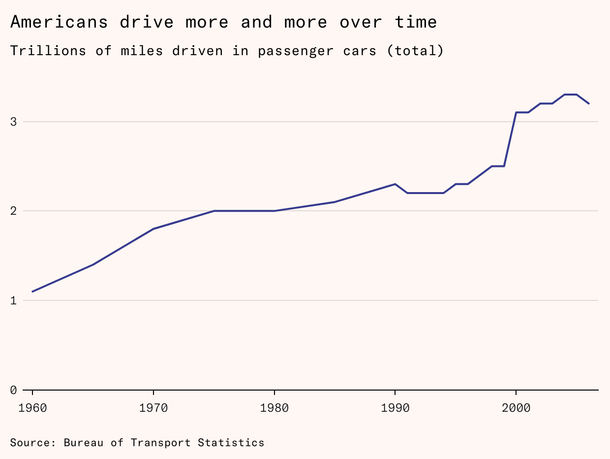

_Ben Adler chronicles the endless struggle to bring congestion pricing to New York, for [Issue 15](https://worksinprogress.co/issue-15/). Read it on our website [here](https://worksinprogress.co/issue/new-yorks-long-road-to-congestion-pricing/).  

本·阿德勒记录了将拥堵收费引入纽约的漫长斗争，您可以在我们的网站上阅读第 15 期的内容。_

It has taken almost 60 years to bring traffic congestion pricing to New York.  

在纽约引入交通拥堵收费几乎花费了 60 年。  

This is the story of how politicians and advocates built the coalition it needed to finally happen.  

这是政治家和倡导者如何建立必要的联盟，最终使这一目标得以实现的故事。

In the 1980s, New York’s Department of Transportation held a series of public meetings open to any interested New Yorker on what to do about the city’s chronic traffic problem.  

在 1980 年代，纽约市交通局举办了一系列公开会议，任何感兴趣的纽约市民都可以参与，讨论如何解决城市的交通拥堵问题。  

‘This older, professor-like guy attended these meetings, by the name of  

这个年长的、像教授一样的家伙参加了这些会议，名叫[William Vickrey](https://en.wikipedia.org/wiki/William_Vickrey), and he kept pestering me to do congestion pricing’, said Sam Schwartz, then an official at the Department of Transportation.  

威廉·维克里一直在催促我进行拥堵定价，萨姆·施瓦茨说，当时他是交通部的一名官员。  

‘I hadn’t heard that term before.’  

我之前从未听过这个词。

The idea of congestion pricing for New York City dates back to 1952, when it was [first proposed](https://www.vtpi.org/vickrey.htm#:~:text=Introduction,and%20be%20lowered%20in%20others.) by William Vickrey, a young academic at Columbia University who would go on to win the Nobel Prize in economics.  

纽约市的拥堵收费概念始于 1952 年，当时由哥伦比亚大学的年轻学者威廉·维克里首次提出，他后来获得了诺贝尔经济学奖。  

It was an idea ahead of its time that would take decades to gain traction.  

这是一个超前于时代的想法，经过几十年才逐渐被接受。  

This is the long and tortuous story of how, more than 70 years later, Vickrey’s congestion pricing vision may be about to become reality in New York City.  

这是一个漫长而曲折的故事，讲述了维克里的拥堵定价愿景在 70 多年后可能即将在纽约市变为现实。

[Share  

共享](https://www.worksinprogress.news/p/new-yorks-long-road-to-congestion?utm_source=substack&utm_medium=email&utm_content=share&action=share)

New York, by far the largest and densest US city, is also the most choked by congestion.  

纽约是美国最大、最密集的城市，交通拥堵问题也最为严重。  

The city’s drivers lose an average of  

这座城市的司机平均每年损失[112 hours per year to gridlock](https://www.tomtom.com/traffic-index/ranking/?country=US), according to the Dutch location technology firm TomTom.  

根据荷兰位置技术公司 TomTom 的数据显示，每年有 112 小时的时间被浪费在交通拥堵中。  

The next-worst US city, with 89 lost hours annually, is Los Angeles.  

下一个最糟糕的美国城市是洛杉矶，每年损失 89 个小时。

The costs of this inefficiency are enormous. By 2016, [according to the Partnership for New York City](https://www.pfnyc.org/reports/GrowthGridlock_4pg.pdf), a business advocacy group, one third of the 3.6 million people who traveled into Midtown and Downtown Manhattan each day were in automobiles, crawling along at less than 12 miles per hour during rush hour.  

这种低效造成的成本非常巨大。根据纽约市合作伙伴关系的数据，到 2016 年，每天有 360 万人前往曼哈顿中城和下城，其中三分之一是开车的，尤其在高峰时段，车速不到每小时 12 英里。  

The group estimates that traffic directly costs the regional economy more than $13 billion a year in lost hours and extra fuel, equivalent to more than twice the annual budget of the New York Police Department.  

该小组估计，交通每年直接给地区经济带来的损失超过 130 亿美元，这包括浪费的时间和额外的燃料费用，金额相当于纽约警察局年预算的两倍多。

The knock-on effects are even greater.  

影响更加深远。  

Cities are rich because people become more productive when they can work in a larger and deeper pool of people.  

城市之所以富裕，是因为人们在更大、更深的社交圈中工作时，生产力会提高。  

Cities with slow transport have a lower  

交通缓慢的城市通常发展较慢[effective size](https://www.tomforth.co.uk/birminghamisasmallcity/) – although a lot of people live in the metropolitan area, it is difficult to [get around to work with one another](https://www.createstreets.com/why-gentle-density-is-a-key-part-of-the-levelling-up-puzzle/).  

有效的规模 - 尽管许多人居住在大都市区，但彼此之间很难进行合作。  

The lack of a reliable connection to the center could be making those living in outer suburbs take worse jobs than they might otherwise get, leaving potentially  

可靠的交通连接缺失可能导致居住在外郊的人们接受比他们本可以获得的更差的工作机会[tens of billions of dollars](https://www.centreforcities.org/reader/office-politics/the-impact-of-agglomeration-on-the-economy/) in productivity on the table.  

桌子上有数十亿美元的生产力潜力。

When London introduced congestion charging in 2003, total traffic [fell](https://www.intelligenttransport.com/transport-news/143883/londons-congestion-charge-celebrates-20-years-of-success/#:~:text=When%20the%20scheme%20had%20been,Reduced%20congestion%20by%2030%2525) 18 percent, increasing road speeds and cutting air pollutants such as particulates and nitrogen oxides.  

2003 年伦敦引入拥堵收费后，交通总量下降了 18%，道路速度提高，空气中的颗粒物和氮氧化物等污染物减少。  

Civic organizations have long advocated for similar policies in New York.  

公民组织在纽约长期以来一直倡导类似的政策。  

By dedicating the revenue raised to bolstering New York’s struggling mass transit system, they argue, the program could allow New Yorkers to move faster on both the roads and subway.  

他们认为，通过将筹集的收入用于改善纽约疲弱的公共交通系统，该计划可以使纽约人在道路和地铁上更快地出行。

Under state law, New York City cannot impose taxes or tolls without explicit state permission.  

根据州法律，纽约市在没有获得明确的州许可之前，不能征收税费或通行费。  

In 2014 for example, Governor Andrew Cuomo and state legislators  

例如，在 2014 年，州长安德鲁·库莫和州立法者们[repeatedly blocked](https://www.politico.com/states/new-york/albany/story/2017/08/22/contra-de-blasio-cuomo-declares-millionaires-tax-dead-on-arrival-114069) Mayor Bill de Blasio’s proposed millionaires’ tax.  

一再阻止市长比尔·德布拉西奥提出的富人税。

Previous congestion pricing proposals met a similar fate, failing to get through the state capitol.  

之前的拥堵收费提案也遭遇了类似的命运，未能在州议会中通过。  

But Cuomo was eventually persuaded that the Metropolitan Transportation Authority (MTA), which runs the subways, buses, and some suburban commuter rail lines, needed a new source of revenue.  

但库莫最终被说服，认为负责运营地铁、公交车和一些郊区通勤铁路的都市交通局（MTA）需要寻找新的收入来源。  

In 2019, at Cuomo’s behest, congestion pricing was passed into state law with a mandate to raise one billion dollars per year for the MTA’s capital improvements program.  

2019 年，应库莫的要求，拥堵收费被纳入州法律，旨在每年为 MTA 的资本改善计划筹集十亿美元。

Five years later, the system is still not in place, and New York’s traffic [remains as bad as ever](https://nypost.com/2023/03/13/nyc-drivers-travel-just-12-mph-during-rush-hour/). While it is scheduled to roll out [on June 30th, 2024](https://www.fox5ny.com/news/nyc-congestion-pricing-legal-challenges-start-date), legal challenges could yet derail it.  

五年过去了，系统仍未建立，纽约的交通依然糟糕。虽然计划在 2024 年 6 月 30 日推出，但法律挑战可能会使其受到阻碍。

‘I’m giving it a 70 percent chance at this point’, said state senator Liz Krueger, a Democrat from Manhattan who has supported congestion pricing since Mayor Michael Bloomberg first proposed it in 2007.  

“我现在认为这个提案有 70%的成功机会，”曼哈顿的民主党州参议员莉兹·克鲁格表示，她自 2007 年迈克尔·布隆伯格市长首次提出拥堵收费以来一直支持这一政策。

These delays in implementation are minor compared to the almost 50 years that elapsed between the first time the New York City government proposed congestion charges and when the state finally authorized them.  

与纽约市政府首次提出拥堵收费和州政府最终授权之间的近 50 年相比，这些实施延迟显得微不足道。  

Congestion pricing didn’t pass the New York State legislature until its fifth attempt.  

拥堵收费在纽约州立法机构经过五次尝试才最终获得通过。

New York’s long, winding road to congestion pricing contains lessons for other cities around the world that may want to follow suit.  

纽约在拥堵收费方面的漫长而曲折的历程为全球其他城市提供了宝贵的经验。  

You can’t take the politics out of policy, you need to offer the communities that will be paying more something in return, and that something must involve a cut of the revenue rather than merely easing traffic.  

你无法将政治与政策分开，必须为那些将支付更多的社区提供一些回报，而这个回报应该是收入的分成，而不仅仅是缓解交通问题。

In the early 1970s, New York City – especially its densest borough, Manhattan – had a problem.  

在 1970 年代初，纽约市，特别是其最繁忙的区域曼哈顿，遇到了一个问题。  

In fact it had many problems, including rising crime, white flight, and a brewing fiscal crisis, but there was a tangible and inescapable issue in the air: pollution caused by the growing volume of motor traffic.  

事实上，它面临许多问题，包括犯罪上升、白人迁出和潜在的财政危机，但空气中有一个显而易见且无法忽视的问题：日益增长的机动车交通量所造成的污染。

The federal Clean Air Act of 1970 required states to develop plans to meet national ambient air quality standards.  

1970 年的联邦清洁空气法要求各州制定计划，以达到国家空气质量标准。  

Brian Ketcham, an automotive engineer in the New York City Environmental Protection Agency set up an automotive testing lab in Brooklyn that measured emissions from different types of vehicles and tested pollution control equipment.  

布莱恩·凯查姆是一位在纽约市环境保护局工作的汽车工程师，他在布鲁克林建立了一个汽车测试实验室，专门测量不同类型车辆的排放并测试污染控制设备。  

Ketcham concluded that traffic in New York’s central business district was so heavy that regulating tailpipe emissions wouldn’t reduce particulate pollution enough to bring the area’s air into compliance.  

凯查姆得出结论，纽约中央商务区的交通非常繁忙，以至于 regulating tailpipe emissions 并不能有效减少颗粒物污染，使该地区的空气达到标准。  

Another approach would be needed.  

需要采用另一种方法。

Manhattan is connected to the outer boroughs across the East and Harlem Rivers and to New Jersey across the Hudson River by a series of bridges and tunnels, but for historical and bureaucratic reasons only some of these require drivers to pay a toll.  

曼哈顿通过一系列桥梁和隧道与东河和哈莱姆河的外区相连，并通过哈德逊河与新泽西州相连，但由于历史和官僚原因，只有部分桥梁和隧道需要司机支付通行费。  

The Hudson River crossings such as the George Washington Bridge and Holland Tunnel are tolled, as they  

哈德逊河的过河通道，例如乔治·华盛顿大桥和霍兰隧道，都是需要收费的，因为它们[are manged by](https://www.amny.com/news/for-whom-the-bridge-tolls-why-not-east-river-spans/) the Port Authority of New York and New Jersey, a quasi-governmental agency that raises money through user fees.  

由纽约和新泽西港务局管理，该机构是一个通过用户费用筹集资金的准政府机构。

Another such agency, MTA Bridges and Tunnels, operates and charges for using the Brooklyn-Battery Tunnel (connecting Brooklyn and Manhattan), the Queens Midtown Tunnel (Queens to Manhattan), bridges between Queens and the Bronx such as the Throgs Neck and the Bronx-Whitestone, and the Robert F.  

另一个类似的机构，MTA 桥梁和隧道，负责运营并收取布鲁克林-电池隧道（连接布鲁克林和曼哈顿）、皇后区中城隧道（连接皇后区和曼哈顿）、连接皇后区与布朗克斯的桥梁，如托罗格斯颈桥和布朗克斯-怀特斯通桥，以及罗伯特·F.  

Kennedy Bridge (also known as the Triborough, because it connects Queens, the Bronx, and Manhattan).  

肯尼迪桥（也叫三州桥，因为它连接了皇后区、布朗克斯和曼哈顿）。

But bridges managed by the New York City Department of Transportation connecting outer boroughs to Manhattan, such as the Brooklyn, Manhattan, Williamsburg, and Queensboro Bridges – which span the East River – and the bridges crossing the Harlem River between Manhattan and the Bronx, such as the 145th Street Bridge and the Madison Avenue Bridge, are toll-free.  

由纽约市交通局管理的桥梁，连接外区与曼哈顿，包括布鲁克林桥、曼哈顿桥、威廉斯堡桥和昆斯伯勒桥——这些桥跨越东河——以及连接曼哈顿和布朗克斯的 145 街桥和麦迪逊大道桥，均免收通行费。

In the first of many abortive attempts at charging traffic, Mayor John Lindsay [raised the idea](https://www.nytimes.com/1966/04/22/archives/bridge-toll-plan-explored-by-city-auto-club-denounces-idea-for-4.html) of tolling the East River bridges in 1966, but his administration soon [backed off](https://www.nytimes.com/1966/09/19/archives/no-east-river-tolls-expected-by-barnes.html) amidst criticism from the auto lobby.  

1966 年，市长约翰·林德西在多次尝试征收交通费的过程中提出了对东河桥收费的建议，但他的政府很快因受到汽车行业的批评而放弃了这一想法。  

In 1971 Lindsay tried again, ordering a feasibility study of bridge tolls, aimed at raising revenue that would help keep subway fares low.  

1971 年，林赛再次尝试，委托进行了一项关于桥梁收费的可行性研究，目的是筹集资金以保持地铁票价的低廉。  

The state legislature  

州立法机关[rejected that proposal](https://www.nytimes.com/1971/06/07/archives/bridge-toll-bills-beaten-in-albany-fare-held-periled-brydges.html) and most of the city’s powerful [Board of Estimate](https://en.wikipedia.org/wiki/New_York_City_Board_of_Estimate) also opposed it.  

拒绝了那个提案，城市强大的估算委员会大多数成员也表示反对。

Ketcham and his colleagues went on to develop the 1973 Transportation Control Plan to reduce the number of cars coming into the city center.  

凯查姆及其同事们随后制定了 1973 年的交通控制计划，以减少进入市中心的汽车数量。  

The plan proposed a range of measures, such as creating taxi stands to reduce the time taxis spend driving around looking for fares, but the most significant proposal was to place tolls on the bridges that span the East and Harlem Rivers, connecting Manhattan to Brooklyn, Queens, and the Bronx.  

该计划提出了一系列措施，比如设立出租车站，以减少出租车在寻找乘客时的行驶时间，但最重要的提议是对连接曼哈顿、布鲁克林、皇后区和布朗克斯的东河和哈莱姆河桥梁征收通行费。  

This would reduce traffic from the three most populous outer boroughs and the city’s northern and eastern suburbs.  

这将减少来自三个最人口密集的外区以及城市北部和东部郊区的交通流量。

Lindsay embraced the proposal that same year, and New York City’s first official congestion pricing plan was born.  

林赛在同一年接受了这一提案，纽约市的首个官方拥堵收费计划由此诞生。  

The state  

这个国家[incorporated](https://archive.nytimes.com/cityroom.blogs.nytimes.com/2008/11/11/how-east-river-bridges-have-stayed-toll-free/) the measure into its federally mandated plan to bring local air quality into compliance with the new federal standards.  

将该措施纳入其联邦要求的计划，以确保当地空气质量符合新的联邦标准。

But the federal government was divided against itself.  

但联邦政府内部存在着分歧。  

While the Environmental Protection Agency (EPA) was demanding congestion pricing, the Department of Transportation filed a suit to block the tolls, arguing that local governments cannot toll bridges that the federal government helped fund.  

尽管环境保护局（EPA）要求实施拥堵收费，交通部却提起诉讼以阻止这一收费，理由是地方政府无法对联邦政府资助的桥梁征收通行费。  

In January 1977, the federal appeals court  

1977 年 1 月，联邦上诉法院[rejected](https://www.nytimes.com/1977/01/19/archives/tolls-on-east-river-bridges-upheld-us-appeals-court-upholds-tolls.html) that argument.  

拒绝了这个论点。

Lindsay’s mayoral successor, Abe Beame, opposed the bridge tolls, calling them ‘an undue burden on drivers’, but by then they had been incorporated into the state’s official plan to comply with federal law, so the city was legally bound to adopt it.  

林赛的市长继任者阿贝·比姆反对桥梁收费，称其为“对司机的不合理负担”，但到那时这些收费已被纳入州政府的官方计划，以遵守联邦法律，因此城市在法律上必须接受这一计划。

‘Nothing could stop it short of an act of Congress, and in 1977 there was an act of Congress: the Moynihan-Holtzman amendment’, said Sam Schwartz, the former chief engineer of the New York City Department of Transportation.  

“没有什么能阻止它，除了国会的法案，而在 1977 年确实通过了一项国会法案：莫伊尼汉-霍尔茨曼修正案，”纽约市交通局前首席工程师萨姆·施瓦茨说道。  

The May 1977 amendment to the Clean Air Act,  

1977 年 5 月对《清洁空气法》的修订[sponsored by](https://trid.trb.org/View/150715) Senator Daniel Patrick Moynihan and Representative Elizabeth Holtzman, offered New York State a way of dropping congestion pricing, [replacing the East River tolls](https://www.nytimes.com/1977/05/27/archives/house-votes-amendment-to-avert-tolls-on-new-yorks-free-bridges.html) with alternative means of reducing car traffic, such as improved public transportation.  

由参议员丹尼尔·帕特里克·莫伊尼汉和众议员伊丽莎白·霍尔茨曼赞助，纽约州提出了一种放弃拥堵收费的方法，通过改善公共交通等替代手段来减少汽车交通，取代东河的收费。  

This was welcomed by Governor Hugh Carey, the newly elected Brooklyn Democrat who had  

这得到了新当选的布鲁克林民主党州长休·凯里的欢迎[opposed the tolls](https://www.nytimes.com/1977/05/04/archives/despite-us-order-2-state-units-oppose-east-river-bridge-tolls.html), saying they would increase pollution near the toll plazas.  

反对收费，认为这会加剧收费站附近的污染。  

A report released earlier that month by the New York State Departments of Environmental Conservation and Transportation also argued tolls would place an excessive cost burden on businesses in Manhattan.  

本月早些时候，纽约州环境保护部和交通部发布的一份报告指出，收费将对曼哈顿的企业造成过大的成本压力。

New York and the federal EPA agreed to pursue [an alternative plan](https://www.nytimes.com/1977/08/19/archives/new-york-wins-cleanair-accord-easing-limit-on-midtown-parking-new.html) to discourage driving and the [congestion pricing proposal died](https://www.nytimes.com/1981/09/15/nyregion/city-drops-proposal-to-charge-bridge-tolls.html).  

纽约州和联邦环保局达成一致，决定采取替代方案以减少驾驶，拥堵收费提案因此被搁置。

Some architects of New York’s congestion pricing scheme believe the New York policy was initially too far ahead of its time.  

一些参与纽约拥堵定价方案的建筑师认为，纽约的政策最初超前于时代。  

Singapore’s Electronic Road Pricing system arrived in 1998.  

新加坡的电子道路收费系统于 1998 年启用。  

The Congestion Charge in London operated from 2003.  

伦敦的拥堵收费自 2003 年起开始实施。  

Stockholm’s congestion charge was introduced in 2006, and Milan’s Ecopass in 2008.  

斯德哥尔摩的拥堵收费在 2006 年实施，而米兰的生态通行证则在 2008 年推出。

In the 1970s, ‘there was no such thing as electronic tolling’, noted Charles Komanoff, an energy policy analyst and, in recent years, prominent congestion pricing advocate.  

在 1970 年代，查尔斯·科曼诺夫，一位能源政策分析师，指出“当时并没有电子收费这种概念”，而他近年来也成为了拥堵定价的知名倡导者。  

‘So tolling the bridges would have required toll booths.’  

收取过桥费需要设置收费站。

‘The specter of mile-long queues back into Brooklyn and Queens that were going to be pumping exhaust gas in the interest of reducing emissions was too self-contradictory.’  

“为了减少排放而在布鲁克林和皇后区排起一英里长的队伍，排放废气的情景实在太矛盾了。”

A few smaller ideas to encourage alternatives to automobiles were eventually adopted, including the removal of some on-street parking spaces in Midtown and the expansion of bus and bicycle lanes.  

最终采纳了一些较小的想法，以鼓励使用替代汽车的方式，包括在中城移除一些街边停车位，并扩展公交和自行车道。  

In 1982, the city’s zoning text was revised to include its first-ever off-street  

1982 年，城市的分区条例首次修订，增加了非街道停车场的规定[parking maximums](https://nyc.streetsblog.org/2013/05/08/city-council-passes-changes-to-manhattan-core-parking-regulations).  

停车的最大限制。

But Americans continued their decades-long shift from riding trains to driving cars.  

但美国人已经持续几十年从乘坐火车转向开车。  

According to data from the Eno Center for Transportation and the Federal Highway Administration, Americans drove 6,767 miles per person in 1981.  

根据埃诺交通中心和联邦公路管理局的数据，1981 年美国人平均每人驾驶了 6767 英里。  

That rose steadily to  

稳定地上升到[9,937 miles per capita miles per capita in 2019](https://frontiergroup.org/resources/where-people-drive-less-than-they-used-to/).  

2019 年人均行驶 9,937 英里。  

Although New York State – with more than half the population concentrated in New York City and its suburbs – has the lowest vehicle miles per capita of any state, it rose there too, from 4,504 in 1981 to a peak of 7,302 in 2006, before dipping to 6,316 in 2019.  

尽管纽约州的人口超过一半集中在纽约市及其郊区，且人均车辆行驶里程在所有州中最低，但从 1981 年的 4504 英里上升到 2006 年的最高点 7302 英里后，2019 年又降至 6316 英里。  

In Manhattan, they continued to move very slowly.  

在曼哈顿，他们的移动速度非常缓慢。

In 1978 the newly elected mayor, Ed Koch, appointed a forward-thinking deputy commissioner, David Gurin, to the city’s new Department of Transportation, who in turn recruited Sam Schwartz, later a leading proponent of congestion pricing, to his team.  

1978 年，新当选的市长埃德·科赫任命了前瞻性的副专员大卫·古林，负责城市新的交通部。大卫随后招募了山姆·施瓦茨，后者后来成为拥堵定价的主要倡导者，加入了他的团队。  

Gurin and Schwartz promptly took the then-revolutionary step of replacing an auto lane on the Central Park and Prospect Park ring roads with bike lanes.  

古林和施瓦茨迅速采取了当时革命性的措施，将中央公园和前景公园环路上的一条汽车道改为自行车道。

‘\[It was\] the first time car lanes were removed for bicycles’, Schwartz recalled.  

“施瓦茨回忆说，这是第一次为自行车取消车道。”

When the Transit Workers Union went on strike in 1980, Koch tasked Gurin’s team with devising a plan to manage the expected spike in car traffic from commuters whose trains and buses weren’t running.  

1980 年交通工人联合会罢工时，科赫让古林的团队制定计划，以应对因通勤者的火车和公交车停运而预计增加的汽车交通。  

A [previous transmit strike in 1966](https://www.amny.com/transit/a-look-back-at-the-1966-transit-strike-that-1-11302919/) had led to hours-long car backups and devastating economic consequences.  

1966 年的一次罢工导致了长时间的交通堵塞和严重的经济后果。  

In writing the plan, Schwartz coined the term ‘gridlock’.  

在制定计划时，施瓦茨创造了“交通堵塞”这个术语。

The department [barred cars with fewer than three passengers](https://timesmachine.nytimes.com/timesmachine/1980/04/01/111145397.pdf) from taking major highways in the city or entering Manhattan south of 96th Street (about two thirds up the island, most of the way up Central Park); created bike lanes on East River bridges; and initiated ride-sharing in taxis for the duration of the strike.  

该部门禁止乘客少于三人的汽车在城市主要高速公路上行驶，或进入曼哈顿 96 街以南的区域（大约在岛的三分之二处，接近中央公园）；在东河桥上设立了自行车道；并在罢工期间启动了出租车拼车服务。  

Together these measures worked, preventing the chaos of earlier strikes.  

这些措施共同发挥了作用，避免了早期罢工带来的混乱。

‘After that, the mayor said, “You guys were heroes, you gotta come up with some other strategies to reduce the traffic congestion”’, Schwartz said.  

“之后，市长说，‘你们是英雄，必须想出其他策略来缓解交通拥堵’，”施瓦茨说道。  

‘I came up with a plan which was a mini-congestion pricing plan that could be implemented overnight.’  

我想出了一个计划，这是一项可以在一夜之间实施的迷你拥堵收费方案。

Three crossings across the East River are tolled – the Battery Tunnel, the Midtown Tunnel, and the Triborough Bridge – and four crossings are toll-free; the Brooklyn, Manhattan, Williamsburg, and Queensborough Bridges.  

东河上有三个收费的过河口——电池隧道、中城隧道和三州大桥——而布鲁克林大桥、曼哈顿大桥、威廉斯堡大桥和皇后区大桥则是免费的。  

From 6am to 10am, only cars with two people or more would be allowed to enter Manhattan via the free crossings.  

‘We passed a city regulation in late 1980 and we were promptly sued by the Garage Board of Trade, which practices congestion pricing in all its parking facilities’, Schwartz said, referring to the fact that the most centrally located garages charge the highest prices.  

  

The local chapter of the American Automobile Association also sued.  

  

The state judge sided with the plaintiffs, and Koch  

[declined](https://scag.ca.gov/sites/main/files/file-attachments/community_advisory_committee_workshop_1.pdf?1648581466) to appeal the ruling.  

At this point, the Department of Transportation decided to hold public meetings, inviting New Yorkers to say what they would do about the congestion crisis.  

  

It was at these meetings that William Vickrey pressed the case for congestion pricing.  

Partly due to Vickrey’s influence, and with the city again on the precipice of its air quality being in violation of federal law, [Koch proposed a ten-dollar fee](https://www.nytimes.com/1987/08/04/nyregion/koch-backs-10-a-day-fees-on-vehicles-to-reduce-pollution.html) for vehicles entering Manhattan south of 59th Street (the southern end of Central Park, the northern border of Midtown Manhattan)  

  

in 1987.  

Once again the backlash was severe.  

  

‘One thousand businesspeople showed up to denounce it on the steps of City Hall’, Schwartz said.  

  

‘They called it “draconian measures.”’ Under pressure from the business community and organized labor,  

[Koch shelved the plan](https://www.nytimes.com/1988/08/28/nyregion/followup-on-the-news-car-entry-fee-on-hold-for-now.html).  

On Earth Day 2007, Mayor Michael Bloomberg [unveiled 127 initiatives](https://www.nytimes.com/2007/04/22/nyregion/23mayorcnd.html) to reduce air pollution and greenhouse gas emissions, but most people remember only one: congestion pricing.  

  

Pointing to London’s successful adoption of a congestion fee in 2003, and with an endorsement from UK prime minister Tony Blair, Bloomberg suggested an eight-dollar fee for cars and $20 for trucks entering Manhattan south of 86th Street on the borough’s Upper East and West Sides, with the revenue – an estimated $400 million per year – going to the mass transit system.

Given Americans’ famous commitment to their cars, not many US politicians would have had the nerve to propose congestion pricing at a time when the idea was still novel to many.  

  

But Bloomberg was a unique political animal – a multibillionaire who could outspend opponents  

[by a factor of 14](https://www.nytimes.com/2009/11/28/nyregion/28spending.html). He felt liberated to do as he saw fit, even if it risked provoking a powerful constituency.  

This was one policy the mayor could not institute without the state legislature passing enabling legislation, however.  

  

And while he was adept at drumming up support in the city’s nonprofit and business sectors, he failed to do so in the state capitol.  

  

Bloomberg – despite his liberal views on social issues and the environment – had run as a Republican to avoid the more competitive Democratic primary.  

  

He bankrolled Republican state senate campaigns, making a  

[$500,000 donation in 2006](https://www.nytimes.com/2006/11/01/nyregion/01senate.html) to help win approval for his policies from state legislators in Albany, the New York State capital.  

  

But Republicans from the suburbs did not want to upset constituents who drove into the city.  

  

So congestion pricing needed Democratic votes to pass the Senate and the heavily Democratic Assembly.

While measures to reduce air pollution and greenhouse gas emissions would appeal to some on the left, Democratic moderates, representing seats in the outskirts of the five boroughs of New York whose constituents would be the ones paying the new tolls, were largely skeptical.  

  

From the beginning they argued that the fee would be regressive, deriding the idea as an elitist plot to benefit rich Manhattan at the expense of the working-class outer boroughs.  

‘The middle class and the poor will not be able to pay these fees and the rich will’, said Richard Brodsky, a Democrat from suburban Westchester County who chaired the Assembly committee overseeing the MTA.  

It is true that congestion pricing is regressive in the same sense that a sales tax is regressive: any flat fee consumes a larger share of a smaller salary.  

  

But what about a sales tax that only applies to a product disproportionately consumed by the rich?  

  

That’s what congestion pricing is, at least in New York City.  

Of commuters going into Manhattan’s traffic-clogged center, [85 percent use mass transit](https://news.yahoo.com/new-york-city-is-poised-to-enact-steep-congestion-pricing-tolls-for-cars-and-trucks-unless-critics-can-kill-the-plan-first-120052751.html).  

  

The poor overwhelmingly don’t drive into Manhattan, because the poor in New York mostly don’t drive at all, and they certainly don’t drive into a borough where parking at a street meter costs  

[more than five dollars per hour](https://www.nyc.gov/html/dot/html/motorist/parking-rates.shtml) and garage parking costs several times that. Midtown garages typically [cost more than](https://en.parkopedia.com/parking/garage/332_w_44th_st/10036/new_york_city/?arriving=202401231400&leaving=202401231600) $20 for one hour and around $60 per day.  

Nonetheless, Bloomberg failed to gain sufficient support in either chamber of the legislature.  

  

‘They didn’t do their politics, the Bloomberg people’, Schwartz said.  

Senate Democrats, resentful of Bloomberg’s efforts to keep them in the minority, were in no mood to do him any favors.  

‘He came to Albany, one day, and said, “Okay, I need your votes”’, said Senator Krueger.  

  

‘And the response was, “You just spent a fortune against me, or my colleague or my friend, to keep us out of here.  

  

Why the hell would we be giving you votes, when a lot of the members were not supporters of congestion pricing, or came from a part of the MTA region where it was a much harder lift for them to be in favor than it was for those of us in Manhattan?” And yet he was just assuming that people who had no reason to would do him a favor.’  

Legislators found Bloomberg arrogant and presumptuous in their meetings with him, as he demanded they vote for the bill just three days after it had been unveiled and argued the city would lose a $350 million federal grant if it wasn’t passed immediately.  

‘At one point, the mayor was furious and yelled, “Well, if you’re not going to vote for this bill today, you’re gonna have to come up with $350 million for New York City!”’ Krueger recounted.  

  

‘The whole thing had gone down the tubes.  

  

I, who has been known to mouth off occasionally – and again, I was a supporter \[of congestion pricing\] – yelled, “Mr. Mayor, we make $49,000 per year.  

  

You’re the only person who can write a check for $350 million; you better get out your checkbook.”’  

‘If the mayor came in with one vote, he left with none’, state Senator Kevin Parker, a Brooklyn Democrat, [told](https://www.nytimes.com/2007/07/16/nyregion/17cnd-congestion.html) _[The New York Times](https://www.nytimes.com/2007/07/16/nyregion/17cnd-congestion.html)_.  

“市长如果是以一票的身份进来的，那他就以零票的身份离开了，”布鲁克林的民主党州参议员凯文·帕克对《纽约时报》说。

Yet this failure offered a valuable lesson for future congestion pricing efforts: to succeed politically, the policy’s supporters would have to carefully build support in the legislature.  

然而，这次失败为未来的拥堵收费工作提供了宝贵的经验教训：要在政治上取得成功，政策的支持者必须在立法机构中认真争取支持。

After Bloomberg’s failed attempt, advocates strove to keep the idea of congestion pricing alive.  

在彭博社的尝试失败后，倡导者们继续努力推动拥堵定价的概念。  

  The coalition of some 140 labor, environmental, and business organizations that supported Bloomberg’s plan, known as Campaign for New York’s Future, gradually disintegrated, but many continued individually to develop their ideas.  

支持彭博计划的约 140 个劳工、环境和商业组织的联盟逐渐解散，但许多人仍然在单独发展自己的想法。

Around 2011, Sam Schwartz, the former Transportation Department official, linked up with the policy analyst Charles Komanoff and Alex Matthiessen, an environmental activist, to begin advancing a new proposal.  

大约在 2011 年，前交通部官员萨姆·施瓦茨与政策分析师查尔斯·科曼诺夫以及环境活动家亚历克斯·马提森合作，开始推动一项新提案。

Judging that the reason suburban and outer-borough legislators largely opposed it was because it would raise fees on their constituents, they published [a proposal called Move NY](https://grist.org/cities/the-nyc-traffic-guru-who-coined-the-term-gridlock-has-a-plan-to-fix-it/), intended to ameliorate those concerns by reducing the costs constituents faced elsewhere.  

由于郊区和外区的立法者普遍反对这一提案，主要是因为这会增加他们选民的费用，因此他们发布了一项名为“Move NY”的提案，旨在通过降低选民在其他地方的费用来缓解这些担忧。

At that time, the Verrazzano-Narrows Bridge from Brooklyn to Staten Island cost truck drivers between [$22 and $147](https://www.owneroperatordirect.com/blog/two-way-tolls-verrazzano-bridge) depending on how many axles their vehicle had and how they paid.  

当时，从布鲁克林到斯塔滕岛的维拉扎诺-纳罗桥对卡车司机的收费在 22 到 147 美元之间，具体取决于车辆的车轴数量和支付方式。  

This created a perverse incentive for truckers traveling between Long Island and New Jersey to go through Manhattan rather than around it.  

这使得在长岛和新泽西之间行驶的卡车司机产生了扭曲的激励，选择通过曼哈顿而不是绕道而行。  

So Move NY proposed using some of the revenue generated from tolling the East River bridges to reduce other tolls, such as that on the Verrazzano-Narrows, The rest, Komanoff calculated, could finance $10 billion worth of mass transit improvements.  

所以 Move NY 提议利用东河桥收费产生的部分收入来降低其他收费，例如维拉扎诺-纳罗斯桥的收费。Komanoff 计算，剩余的收入可以为 100 亿美元的公共交通改善提供资金。

Many of the groups involved in the Campaign for New York’s Future backed Move NY, helping Schwartz, Komanoff, and Matthiessen to promote the concept in the media and among elected officials.  

参与纽约未来运动的许多团体支持 Move NY，帮助施瓦茨、科曼诺夫和马蒂森在媒体及当选官员中推广这一理念。

‘We got every single editorial board to endorse the Move NY plan, including the _New York Post_’, Schwartz said, referring to the right-wing, Murdoch-owned tabloid.  

“我们让每一个编辑委员会都支持 Move NY 计划，包括《纽约邮报》。”施瓦茨提到，这是一家右翼的、由默多克拥有的小报。

Yet, although bills were introduced in Albany, [including by Staten Island Republicans](https://www.nysenate.gov/newsroom/articles/2016/andrew-j-lanza/senator-andrew-lanza-introduces-move-ny-bill-state-senate) eager to reap the benefits for their borough, the leadership never brought them to a vote, suspecting they lacked the support needed to pass.  

尽管在奥尔巴尼提出了包括斯塔滕岛共和党人在内的法案，他们希望为自己的地区争取利益，但领导层始终没有将这些法案提交投票，怀疑它们缺乏通过所需的支持。  

What gave congestion pricing another shot was instead a desperate need for subway funding.  

让拥堵定价重新受到关注的，是对地铁资金的迫切需求。

A political strategy to get congestion pricing passed in Albany was going to need a more effective advocate than Bloomberg – someone like Governor Andrew Cuomo, whom [Albany insiders](https://www.empirecenter.org/publications/how-andrew-cuomo-became-maybe-the-most-powerful-governor-in-u-s/) referred to as an ‘800-pound gorilla in the room’ because of his dominant role in state lawmaking.  

为了在奥尔巴尼推动拥堵定价，政治策略需要比彭博更有效的倡导者——像州长安德鲁·库莫那样的人。奥尔巴尼的内部人士称他为“房间里的 800 磅大猩猩”，因为他在州立法中扮演着主导角色。  

But Cuomo, a  

但是库莫，作为一个[muscle car aficionado](https://www.nytimes.com/2010/10/29/nyregion/29cars.html) who had grown up in Queens and lived in suburban Westchester before taking office in 2011, was initially opposed.  

一位热爱肌肉车的人，成长于皇后区，后来在西切斯特郡的郊区生活，2011 年上任时最初持反对意见。

Meanwhile, the need for new revenue for the MTA was becoming increasingly urgent.  

与此同时，MTA 对新收入的需求愈发紧迫。  

The New York City subway began operating in 1904, and a century later its infrastructure was aged and outdated.  

纽约市地铁于 1904 年开始运营，经过一个世纪，其基础设施已经老旧和过时。  

Annual ridership grew from  

年度乘客量增长了[one billion in 1997 to 1.7 billion in 2015](https://wagner.nyu.edu/files/faculty/publications/State%20of%20Subway%20Ridership%20-%20Mar717.pdf), thanks to the introduction in 1997 of free transfers between subways and buses, the advent of weekly and monthly unlimited MetroCards, population growth, sharply declining crime, and [fast-growing tourism](https://www.nyc.gov/html/dot/downloads/pdf/mobility-report-2016-screen-optimized.pdf).  

从 1997 年的十亿增长到 2015 年的 17 亿，这得益于 1997 年引入的地铁与公交之间的免费转乘、每周和每月无限次的 MetroCard、人口增长、犯罪率大幅下降以及旅游业的快速发展。  

But, because fares were priced lower than the cost of operation, these additional riders placed a strain on the antiquated system, and on-time performance plunged.  

但是，由于票价低于运营成本，这些额外的乘客对老旧系统造成了压力，导致准时率大幅下降。

For some metro systems, growing ridership numbers would have been a boon, not a burden.  

对于某些地铁系统来说，乘客数量的增长本应是一个好消息，而不是负担。  

London’s Underground charges a weekly maximum of £78 ($98), and recovers more than 100 percent of its operating costs through fares, making a small profit that is used to fund other transit such as the bus network.  

伦敦地铁每周最高收费为 78 英镑（约 98 美元），通过票价回收超过 100%的运营成本，所获得的小额利润用于支持其他交通服务，例如公交网络。  

By contrast, NY subway fares cap out at $34 weekly, and they cover only 24 percent of its costs, relying on continual taxpayer subsidies to keep going.  

相比之下，纽约地铁的周票费用最高为 34 美元，仅能覆盖其成本的 24%，依赖持续的纳税人补贴来维持运营。  

Thus, more customers can actually mean a more difficult job.  

因此，客户的增加实际上可能会使工作变得更加困难。  

Average delays per month increased from  

每月的平均延误时间有所增加[20,000 in 2012 to more than 67,450 in May 2017](https://ibo.nyc.ny.us/iboreports/we-are-being-held-momentarily-how-much-time-and-money-are-new-york-city-subway-riders-losing-to-delays-october-2017.html).  

从 2012 年的 20,000 增长到 2017 年 5 月的 67,450 以上。  

And whereas 85.4 percent of subway trains finished their route within five minutes of their schedule in 2011, only 66.8 percent did in 2016.  

2011 年，85.4%的地铁列车在五分钟内按时完成了行程，而到 2016 年，这一比例降至 66.8%。

In response to these deteriorating conditions, a grassroots group called the Riders Alliance started a campaign to raise public awareness of the situation within the MTA.  

针对这些恶化的情况，一个名为骑士联盟的草根组织发起了一项运动，旨在提高公众对 MTA 内部状况的认识。  

This started with the fact that the MTA is controlled by the governor, and thus he – and not the mayor – was responsible for the state of the subway.  

这一切始于 MTA 由州长掌控，因此他——而不是市长——对地铁的状况负有责任。

In 2017, as the group pushed for Cuomo to find new revenue to fix the subway system, the transit crisis exploded in the public consciousness during the so-called [summer of hell](https://www.cnn.com/2017/07/19/us/new-york-summer-of-hell/index.html).  

2017 年，当该团体敦促库莫寻找新的收入来修复地铁系统时，所谓的“地狱之夏”使交通危机在公众意识中达到了高潮。  

Emergency repairs at Penn Station caused major disruptions to suburban commuter rail lines and the subway’s service troubles seemed to crescendo.  

佩恩车站的紧急维修导致郊区通勤铁路和地铁服务出现了严重干扰，问题似乎达到了顶峰。

The Riders Alliance created the hashtag campaign [#CuomosMTA](https://twitter.com/hashtag/CuomosMTA?src=hashtag_click), and the phrase stuck in New Yorkers’ minds, prompting Cuomo to finally take steps to address the crisis.  

骑士联盟发起了#CuomosMTA 的标签活动，这个短语深深印在纽约人的心中，促使库莫最终采取行动来应对危机。  

He brought in new leadership at the MTA and  

他为 MTA 引入了新的领导团队[declared that congestion pricing](https://www.nytimes.com/2017/08/13/nyregion/cuomo-rethinks-opposition-to-tolls-to-ease-manhattan-traffic.html) was ‘an idea whose time has come’.  

宣称拥堵定价是“一个时机已到的理念”。

‘We are on the trajectory that was launched in that moment’, Komanoff said.  

“我们正沿着那个时刻开启的轨迹前进，”科曼诺夫说。  

‘And that happened only because of the Riders Alliance and the whole constellation of transit advocates.’  

这件事之所以发生，完全是因为骑士联盟和一整套公共交通倡导者的努力。

Thereafter, ‘our funding proposal, which had been an all-of-the-above approach, really narrowed to congestion pricing’, said Danny Pearlstein, spokesperson for the Riders Alliance.  

此后，骑士联盟的发言人丹尼·皮尔斯坦表示：“我们的资金提案曾经是一种全面的方法，但实际上已经缩小到拥堵定价。”

Cashless tolling, in which cars are electronically charged as they drive past a camera, had become widespread in America by 2017, when the state government created the Fix NYC task force to find solutions to the city’s transportation woes.  

无现金收费系统在 2017 年已在美国广泛应用，车辆经过摄像头时会自动收费。为了寻找解决城市交通问题的方案，州政府成立了 Fix NYC 工作组。  

Taking advantage of that technology, states from Florida to California had been creating express lanes that allow only multi-passenger vehicles, or charge a fee for single drivers.  

利用这项技术，从佛罗里达到加利福尼亚的各州正在设立仅允许多乘客车辆通行的快速车道，或对单人驾驶者收取费用。  

The idea is to reduce traffic for everyone by incentivizing carpooling.  

这个想法是通过鼓励拼车来减轻大家的交通压力。  

Some even charge a flexible surge price at peak times to any driver.  

一些公司甚至在高峰时段对所有司机收取灵活的加价。  

(Opponents deride them as ‘Lexus lanes’ for those who can afford them, while advocates like Tennessee Republican governor Bill Lee  

对手称这些车道为“雷克萨斯车道”，意指只有那些能负担得起的人才能使用，而像田纳西州共和党州长比尔·李这样的支持者则对此表示赞同[prefer the term choice lanes’](https://finance.yahoo.com/news/paid-express-lanes-grow-more-052949166.html?guccounter=1&guce_referrer=aHR0cHM6Ly93d3cuZ29vZ2xlLmNvbS8&guce_referrer_sig=AQAAAIvkhPGtVZb8loB82Clgc7zgwmXOn4Dc8VU7Wnr5nWNrwImlrEb4Oug-U1eZNRBQbiy18-soR0YpomZRAFD5_Kae3nZ0OPTtfnUsFBKMDyQbOHeRb0OC1vvlOV-AxqpHXGXa8NVf_GsryoqWd4G-uGVFE8KylNbonvuNHMtOanVq).)  

更喜欢使用“选择车道”这个术语。

In December 2017 Fix NYC, the new task force, recommended charging $11.52 for cars and $25.34 for trucks entering the central business district, south of 60th Street, during peak hours.  

2017 年 12 月，Fix NYC 新成立的工作组建议在高峰时段，对进入 60 街以南的中央商务区的汽车收取 11.52 美元，卡车收取 25.34 美元。  

But the state budget passed the following March still did not include congestion pricing, although it did create  

但是州预算在接下来的三月通过时仍然没有包含拥堵收费，尽管它确实创造了[per-trip fees of $2.50](https://www.nytimes.com/2018/03/31/nyregion/congestion-pricing-new-york.html) for taxis and $2.75 on ride hailing apps in the congestion zone south of 96th Street, with the revenue going to the MTA.  

在 96 街以南的拥堵区，出租车每次收费 2.50 美元，打车应用收费 2.75 美元，所得收入将用于 MTA。 

The 2018 election boosted congestion pricing’s prospects.  

2018 年的选举增强了拥堵收费的可能性。  

In the years since Bloomberg had left the scene, growing partisan polarization had made Republicans more uniformly opposed to congestion pricing, as they hung on to control of the chamber by a margin of one.  

自彭博离开后，党派之间的极化加剧，使得共和党人对拥堵定价的反对更加统一，因为他们以微弱的优势掌控着议会。  

In a backlash against President Donald Trump, progressive Democrats turned out in droves and not only ousted the Republicans but also defeated several suburban moderates  

在对唐纳德·特朗普总统的强烈反对中，进步派民主党人积极参与，不仅成功驱逐了共和党人，还击败了几位郊区的温和派[in the Democratic primaries](https://www.nytimes.com/2018/09/13/nyregion/state-senate-election-results-idc-klein.html). In many cases, opponents of congestion pricing were replaced by enthusiastic supporters.  

在民主党初选中，许多反对拥堵定价的对手被热情的支持者所替代。

In 2019, Cuomo included a congestion charge in his budget proposal.  

2019 年，库莫在预算提案中提出了拥堵收费。  

The outside game of the activists was now complemented by the governor’s inside game.  

活动家的外部行动现在得到了州长内部策略的支持。  

In New York’s legislative process, the state budget is a large omnibus bill that contains many disparate policies and  

在纽约的立法过程中，州预算是一项包含多项不同政策的大型综合法案[the governor is a powerful actor in crafting the law](https://www.gothamgazette.com/130-opinion/10705-massive-budget-power-new-york-governor-stakes-2022-election).  

州长在法律制定中扮演着重要的角色。

‘The first time that \[congestion pricing\] seemed to have legs at the state level was this plan, as it came to be, as part of the budget process in 2019’, said Assembly Member Ed Ra, a Republican from suburban Long Island.  

“在 2019 年的预算过程中，\[拥堵定价\]第一次在州级看到了可行性，”来自长岛郊区的共和党议员埃德·拉（Ed Ra）表示。  

‘When Governor Cuomo was really focusing on something, he usually found a way to get it across the finish line.’  

“当库莫州长全力以赴时，他总能找到办法将事情做到最后。”

Larding the state budget with tangential measures is standard operating procedure in New York.  

在纽约，给州预算增加附加措施是常规操作。  

The 2019 budget bill included a range of criminal justice reforms such as the elimination of cash bail for minor offenses.  

2019 年的预算法案包含了一系列刑事司法改革措施，例如取消对轻微犯罪的现金保释。

Including congestion pricing in that package helped it pass in two ways.  

将拥堵收费纳入该计划以两种方式促进了其通过。  

First, opponents such as Ra say that the debate over hot-button issues like bail reform distracted the public from congestion pricing and tamped down opposition.  

首先，像拉这样的对手认为，关于保释改革等热点问题的辩论使公众忽视了拥堵收费，从而减弱了反对的声音。  

Second, legislators could vote for the budget while distancing themselves from congestion pricing by saying their vote was cast to support other programs.  

其次，立法者可以投票支持预算，同时通过表明他们的投票是为了支持其他项目，从而与拥堵收费保持距离。

‘For those people who were like, “This will be very unpopular at home, how will I deal with it?”, the answer was conveniently, and politically, designed such that you’re not taking a vote on it, you’re taking a vote on budget bills that have a huge number of other things in them that you really want to vote for and need to vote for,’ Senator Liz Krueger said.  

“对于那些担心‘这在家里会非常不受欢迎，我该如何应对？’的人来说，答案恰好是，政治上设计得如此，你并不是在对这件事投票，而是在对预算法案投票，而这些法案中包含了许多你确实想支持和需要支持的其他内容，”参议员莉兹·克鲁格说。  

‘So you can even go home and say, “Well, I didn’t like this part, but I had to vote for this because it had A, B, C, D that we had to get done.”’  

“所以你甚至可以回家说，‘我不太喜欢这个部分，但我必须投票支持，因为它包含了我们必须完成的 A、B、C、D。’”

Another clever maneuver by Cuomo’s team was to link the proposal to an MTA capital improvement plan that would require enough revenue to raise $15 billion through selling bonds, which works out at about one billion dollars in revenue per year.  

库莫团队的另一个聪明举措是将提案与 MTA 的资本改善计划相结合，该计划需要通过出售债券筹集 150 亿美元的收入，预计每年可产生约 10 亿美元的收入。

‘They focused on the gain, not the pain’, Charles Komanoff told me.  

“他们关注的是收获，而不是痛苦，”查尔斯·科曼诺夫对我说。  

‘Nobody knew what the toll would have to be, but rather it would fund $15 billion in capital improvements.  

没有人知道费用会是多少，但这将为 150 亿美元的基础设施改善提供资金。  

So it was all positive and no negative.’  

所以一切都是正面的，没有负面的。

In this case, the gain would include everything from better on-time performance and more reliable air-conditioning for trains and buses to elevators for disabled access to subway stations.  

在这种情况下，收益将包括更好的准时表现、更可靠的空调，以及无障碍电梯进入地铁站等各方面。

But some cried foul.  

但有些人表示不满。  

According to state legislators on both sides of the issue, Cuomo personally lobbied legislators to vote for congestion pricing with promises of improving bus or other transit service in areas where the subway doesn’t run.  

根据两边立法者的说法，库莫亲自游说立法者支持拥堵定价，并承诺在地铁不通的地区改善公交或其他交通服务。

‘Andrew Cuomo twisted arms for people to vote for it, on the false promise that they were gonna get all these goodies for their district: all these extra bus lines that never materialized’, said Assembly Member David Weprin, a Democrat from the outer reaches of Queens.  

“安德鲁·库莫为了让人们投票而施加压力，虚假承诺他们会为自己的选区获得许多好处，包括那些从未实现的额外公交线路，”来自皇后区边缘的民主党议员大卫·韦普林说道。  

‘It was all lies, basically.’  

说白了，这全都是谎言。

Weprin, who voted against congestion pricing, also believes the transit service won’t be meaningfully improved because the MTA, a notoriously [inefficient bureaucracy](https://www.globalconstructionreview.com/new-york-transit-agency-told-to-stop-wasting-money-on-poorly-scoped-projects/), won’t put the money to good use.  

Weprin 反对拥堵定价，他还认为，由于 MTA 这个臭名昭著的低效官僚机构不会合理使用资金，公共交通服务不会得到实质性的改善。  

‘The more money you give to the MTA, the more money they’ll waste’, he said.  

“你给 MTA 的钱越多，他们就越会浪费，”他说。

There is at least some truth in this assessment.  

这个评估中至少有一些真实的内容。  

New York City has the highest construction costs in the United States, due to factors such as high labor costs and more expensive liability insurance, but the MTA’s construction expenses are egregious even in context.  

纽约市的建筑成本在美国中最高，主要是由于高昂的劳动力成本和更贵的责任保险，但即使在这种情况下，MTA 的建筑费用仍然显得极为不合理。  

It  

这个[costs three times as much](https://nymag.com/intelligencer/2019/05/new-york-infrastructure-costs.html) to build a subway station in New York as it does in London or Paris, thanks to extravagant design choices, extensive environmental reviews, and inefficient union work rules.  

在纽约建造地铁站的成本是伦敦或巴黎的三倍，这主要是由于奢华的设计选择、繁琐的环境审查和低效的工会工作规则。  

The recently completed Second Avenue subway line cost  

最近完成的第二大道地铁线路的建设费用[six times as much](https://www.curbed.com/2023/02/nyc-subway-overspending-second-avenue-nyu-transit-costs-project-goldwyn.html) per mile of track as expansions of the Paris and Berlin subways.  

每英里轨道的费用是巴黎和柏林地铁扩建费用的六倍。  

It should be noted, however, that the MTA’s capital spending plan is not primarily focused on building new stations and subway lines.  

不过，需要指出的是，MTA 的资本支出计划并不主要侧重于新车站和地铁线路的建设。  

It is mostly earmarked for replacing and upgrading existing infrastructure to keep it going.  

这主要是为了替换和升级现有的基础设施，以确保其正常运作。

Cuomo did not respond to an interview request submitted to his spokesperson, but Senator Krueger said that while she believes Weprin’s account, the specific transit improvements in the outer boroughs that she remembers being in the deal have been fulfilled.  

库莫没有回应提交给他发言人的采访请求，但克鲁格参议员表示，尽管她相信韦普林的说法，但她记得在交易中提到的外区交通改善措施已经得到落实。

‘One part of the deal was four new Metro-North stops in the Bronx, and that’s been made good on’, she said, referring to the commuter train line serving New York’s northern suburbs.  

“这笔交易的一部分是在布朗克斯新增四个地铁北站，这一承诺已经兑现，”她提到，指的是服务于纽约北部郊区的通勤火车线路。  

Construction began on the promised stations in areas of the Bronx lacking subway service  

在布朗克斯缺乏地铁服务的地区，承诺建设的车站已经开始动工[in 2022](https://ny1.com/nyc/all-boroughs/transit/2022/12/11/bronx-residents-looking-forward-to-new-metro-north-stations). ‘The ones I’m familiar with, they actually have made good on’, she said.  

在 2022 年。“我所熟悉的人，他们确实履行了承诺，”她说。

The 2019 budget included the creation of a congestion pricing system for entrance to Manhattan south of 60th Street, but it left the details of how much to charge and gave some discretion of who to exempt to the Traffic Mobility Review Board, which the [MTA would assemble](https://ny1.com/nyc/all-boroughs/transit/2022/07/27/mta-appoints-board-to-determine-tolls--exemptions-for-congestion-pricing).  

2019 年的预算中包括为进入曼哈顿 60 街以南地区设立拥堵收费系统，但具体收费标准和豁免对象的裁定权则交给了由 MTA 组建的交通流动性审查委员会。  

This board was tasked with ensuring that the program provided a minimum of $15 billion in funding for the MTA’s Capital Program, with 80 percent of the funds dedicated to the Staten Island Railway, New York City Subway, and MTA Regional Bus Operations, while ten percent would be given to the Long Island Rail Road and ten percent to the Metro-North Railroad.  

该委员会的任务是确保该计划为 MTA 的资本项目提供至少 150 亿美元的资金，其中 80%的资金将用于斯塔滕岛铁路、纽约市地铁和 MTA 区域公交运营，10%将用于长岛铁路，10%将用于大都会北方铁路。  

The law mandated exemptions for emergency vehicles, vehicles transporting people with disabilities, and for drivers who cross a bridge but stay on a highway until they are north of 60th Street.  

法律规定，紧急车辆、运输残疾人士的车辆，以及在桥上行驶但仍在 60 街以北的高速公路上行驶的司机，可以享受豁免。  

The law also required people living in the congestion zone who make less than $60,000 a year get a tax rebate for the cost.  

该法律还要求年收入低于 60,000 美元的拥堵区居民可以获得相应费用的税收减免。

But one group did not see any relief.  

但有一组人并没有感受到任何缓解。  

Drivers from New Jersey and Staten Island already pay high tolls on bridges and tunnels.  

新泽西州和斯塔滕岛的司机在桥梁和隧道上已经支付了很高的通行费。  

They would now have to pay the congestion charge on top of existing fees.  

他们现在需要在现有费用的基础上额外支付拥堵费。  

This triggered intense opposition from those areas, but New Jersey does not get a vote in the New York State legislature, and the support of the mostly Republican representatives of Staten Island – New York City’s least populous borough – was not needed now that larger and left-leaning Democratic majorities could provide the votes.  

这引发了那些地区的强烈反对，但新泽西州在纽约州立法机构中没有投票权，而斯塔滕岛的主要共和党代表——纽约市人口最少的区——的支持现在已经不再必要，因为更大且偏左的民主党多数能够提供投票。

Leaving it up to a board that doesn’t have to face the voters was a clever move, because legislators were more comfortable voting for the program’s creation without having to take a position on whether, say, cops or firefighters who commute to work in Manhattan would be exempted from the fees.  

将决定权交给一个不必面对选民的委员会是个聪明的做法，因为立法者在投票支持该项目时更为自在，无需对例如通勤到曼哈顿的警察或消防员是否免除费用表态。

‘The devil’s in the details, but those wouldn’t be up to the legislature’, Senator Krueger said.  

“细节决定成败，但这些并不由立法机构来决定，”克鲁格参议员说道。  

‘It was more politically viable to people who didn’t want to be seen as having anything to do with those decisions.’  

“对那些不想被认为与这些决策有任何关系的人来说，这在政治上更具可行性。”

So at last, after 50 years, New York had become the first American state to pass congestion pricing.  

因此，经过 50 年的努力，纽约终于成为第一个实施拥堵收费的美国州。

You might assume that once a law is passed the program will be implemented in a timely manner – the goal was to have congestion charging up and running by 2021 – but that has not happened.  

你可能会认为，一旦法律通过，相关程序就会及时实施——目标是在 2021 年之前启动拥堵收费——但实际上并没有实现。

The congestion fee had to be approved by the [Federal Highway Administration](https://en.wikipedia.org/wiki/Federal_Highway_Administration) (FHWA) because some federal roads would be covered by the charge.  

拥堵费需要得到联邦公路管理局（FHWA）的批准，因为一些联邦公路将会被此费用覆盖。  

Trump’s Transportation Department refused to grant permission to create the program, delaying its implementation until President Joe Biden’s inauguration in January 2021.  

特朗普的交通部拒绝批准该项目的创建，导致其实施被推迟至乔·拜登总统于 2021 年 1 月就职。

The federal environmental assessment and public outreach process began in August 2021.  

联邦环境评估和公众参与过程于 2021 年 8 月开始。  

In March 2022, the agency requested that the MTA  

2022 年 3 月，该机构向 MTA 提出请求[answer 430 questions](https://www.nydailynews.com/2022/04/22/feds-send-mta-430-questions-on-plan-for-congestion-pricing-in-nyc/) about the technical aspects of the congestion charge before submitting the plan for a final public review.  

在提交最终公众审查计划之前，回答 430 个关于拥堵收费技术的相关问题。

Meanwhile, opponents organized to stop the plan.  

与此同时，反对者们联合起来阻止这个计划。  

In August 2021, New Jersey representatives Josh Gottheimer, a centrist Democrat, and Jeff Van Drew, a Republican, both hailing from the New York City suburbs, proposed legislation to prohibit the MTA from obtaining federal grants unless New Jersey drivers were exempted from the congestion charges.  

2021 年 8 月，新泽西州的代表乔什·戈特海默（Josh Gottheimer），一位中间派民主党人，以及杰夫·范德鲁（Jeff Van Drew），一位共和党人，均来自纽约市郊，提出了一项立法，要求大都会运输署（MTA）在未能免除新泽西州司机的拥堵收费之前，不得获得联邦拨款。  

Congestion pricing supporters countered that New York pays for half of many infrastructure projects connecting the states, such as rail tunnels, that overwhelmingly benefit New Jerseyans, since few New Yorkers commute to New Jersey.  

拥堵定价的支持者反驳称，纽约为许多连接各州的基础设施项目支付了一半的费用，例如铁路隧道，这些项目主要受益于新泽西州的居民，因为很少有纽约人通勤到新泽西。  

Undeterred, Gottheimer partnered with Mike Lawler, a newly elected Republican from New York’s northern suburbs, to introduce another bill to the same effect in 2023.  

不屈不挠，戈特海默与来自纽约北郊的新当选共和党人迈克·劳勒合作，于 2023 年提出了另一项相同目的的法案。

Nonetheless, the FHWA granted approval in June 2023, [citing evidence](https://ops.fhwa.dot.gov/congestionpricing/resources/enviro_benefits.htm) from other cities that congestion charging has cut air pollution and fossil fuel consumption.  

尽管如此，FHWA 在 2023 年 6 月批准了这一计划，引用了其他城市的证据，表明拥堵收费有效减少了空气污染和化石燃料的消耗。  

London reduced particulate matter and nitrogen oxides by 12 percent and carbon dioxide emissions by 20 percent.  

伦敦的颗粒物和氮氧化物减少了 12%，二氧化碳排放减少了 20%。  

Singapore estimates its congestion pricing scheme prevents 175,000 pounds of carbon dioxide emissions per day and Stockholm has seen a 10–14 percent drop in carbon dioxide emissions in its central area.  

新加坡估计其拥堵收费方案每天可以减少 175,000 磅的二氧化碳排放，而斯德哥尔摩在市中心地区的二氧化碳排放量下降了 10%至 14%。

The MTA’s [environmental assessment](https://new.mta.info/document/111101) projects significant benefits from congestion pricing within the core of Manhattan, including more than 11 percent reductions in vehicle miles traveled, carbon emissions, and particulate pollution within the zone.  

MTA 的环境评估显示，曼哈顿核心区的拥堵收费将带来显著好处，包括车辆行驶里程、碳排放和颗粒污染减少超过 11%。  

Traffic speeds are expected to improve as a result.  

预计交通速度将因此得到改善。  

But most of the outer boroughs and suburbs will see only very marginal improvements in air pollution (less than one percent drops) and areas such as Staten Island and the Bronx were actually projected to see slight increases in particulate pollution (less than two percent and one percent, respectively), due to increased traffic from cars going around Manhattan to avoid tolls.  

但大多数外区和郊区的空气污染改善幅度非常有限（下降不到百分之一），而斯塔滕岛和布朗克斯等地区实际上预计会出现颗粒物污染的轻微增加（分别下降不到百分之二和百分之一），这主要是因为车辆为了避开收费而绕行曼哈顿，导致交通增加。

Now last-ditch efforts to block implementation have moved to the courts, focusing on the fact that, although congestion pricing will reduce total air pollution, it could increase it in some areas.  

目前，阻止实施的最后努力已转向法院，主要关注尽管拥堵收费会减少整体空气污染，但在某些地区可能会导致污染增加。

After New Jersey governor Phil Murphy failed to persuade the Biden administration to block congestion pricing, he [filed a lawsuit](https://www.nj.gov/governor/news/news/562023/approved/20230721a.shtml) arguing that the environmental assessment was insufficient.  

新泽西州州长菲尔·墨菲在未能说服拜登政府阻止拥堵定价后，提起了一项诉讼，认为环境评估不够充分。  

The mayor of Fort Lee, New Jersey, Mark Sokolich,  

新泽西州福特李市的市长马克·索科利奇，[filed a suit](https://gottheimer.house.gov/posts/release-gottheimer-fort-lee-mayor-sokolich-announce-new-class-action-lawsuit-to-stop-new-yorks-congestion-tax) in November 2023, claiming his town, adjacent to the George Washington Bridge, which connects New Jersey with a part of Manhattan outside the congestion zone, will suffer from increased traffic.  

他在 2023 年 11 月提起诉讼，声称他的城镇位于乔治·华盛顿大桥旁，该大桥连接新泽西州和曼哈顿的一个区域，位于拥堵区之外，预计将面临交通增加的问题。  

(In April 2024, after this piece was sent off to the printers,  

在 2024 年 4 月，这篇文章送去印刷后，[the MTA announced it would share revenues with New Jersey](https://www.nbcnewyork.com/traffic/transit-traffic/mta-congestion-pricing-nyc-nj-money-tolls-hoboken-jersey-city/5329601/).)  

MTA 宣布将与新泽西州共享收入。

The possibility that some low-income areas already burdened by poor air quality may see increased traffic from drivers avoiding the congestion zone, such as parts of the Bronx near the Cross Bronx Expressway, has alarmed even erstwhile congestion pricing supporters such as [Representative Ritchie Torres](https://nyc.streetsblog.org/2022/08/16/rep-ritchie-torres-im-not-one-of-those-congestion-pricing-critics), a Bronx Democrat who represents America’s poorest congressional district.  

一些已经受到空气质量差影响的低收入地区，可能会因为司机避开拥堵区而面临交通增加的情况，例如布朗克斯靠近跨布朗克斯高速公路的部分。这一可能性甚至让曾经支持拥堵定价的布朗克斯民主党代表里奇·托雷斯感到震惊，他代表着美国最贫困的国会选区。

In December 2023, after months of public hearings, the MTA finally [announced](https://www.nbcnewyork.com/traffic/transit-traffic/mta-board-approves-nyc-congestion-pricing-plan-what-to-know-about-tolls-exemptions-and-more/4926113/) the amounts of the tolls: passenger vehicles will pay $15, small trucks $24, large trucks $36, and motorcycles $7.50. Those rates will apply from 5am to 9pm on weekdays and from 9am to 9pm on the weekends.  

2023 年 12 月，经过几个月的公开听证会，MTA 终于公布了收费标准：乘用车需支付 15 美元，小型卡车 24 美元，大型卡车 36 美元，摩托车 7.50 美元。这些收费将在工作日的早上 5 点到晚上 9 点，以及周末的早上 9 点到晚上 9 点期间适用。  

The rest of the time, the costs will be 75 percent lower than the peak time charge.  

其余时间的费用将比高峰时段低 75%。  

One of the points of congestion pricing, after all, is to incentivize time shifting for trips like deliveries to occur during off-hours.  

拥堵收费的一个目的，毕竟是为了鼓励在非高峰时段进行送货等行程的时间调整。  

There will be a five-dollar credit for those using an already-tolled entrance for which they are paying an additional separate fee, like the Lincoln Tunnel from New Jersey.  

对于使用已收费入口并支付额外费用的人，将获得五美元的抵扣，例如从新泽西州进入林肯隧道。

Drivers will only be charged once each day, after which point they can drive around, or in and out of, Manhattan as much as they like, and they won’t be charged for trips originating and ending within the congestion zone – from Tribeca, in Downtown Manhattan, to Hell’s Kitchen, in Midtown Manhattan, for instance.  

驾驶员每天只需支付一次费用，此后可以在曼哈顿自由进出，随意驾驶，并且在拥堵区内起始和结束的行程将不再收费——例如，从曼哈顿下城的 Tribeca 到中城的 Hell's Kitchen。  

Taxis and ride-hail services will be exempt, but instead they will pay $1.25 and $2.50 surcharges per ride, respectively.  

出租车和打车服务将不受限制，但它们每次乘车需支付 1.25 美元和 2.50 美元的附加费。  

 

So, is congestion pricing in New York set to happen at last?  

所以，纽约的拥堵定价终于要开始了吗？  

Will Vickrey’s vision become reality, 70 years on?  

威克里（Vickrey）的愿景在 70 年后能否实现？

‘I’m not breaking out the champagne until the first car gets charged’, former chief engineer Sam Schwartz said.  

“在第一辆车充电之前，我是不会开香槟庆祝的，”前首席工程师萨姆·施瓦茨说道。  

‘And I’m hoping to be the one driving it.’  

我希望能成为开车的人。

_Ben Adler is an editor for USA Today. You can follow him on Twitter [here](https://x.com/badler).  

本·阿德勒是《今日美国》的编辑。您可以在这里关注他的推特账号。_
