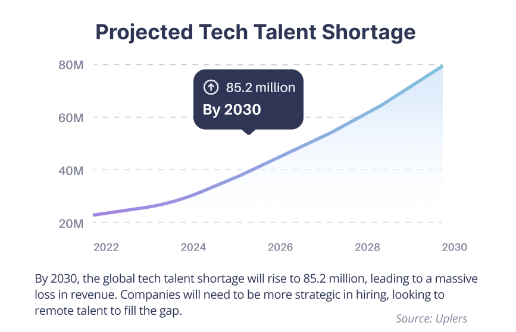
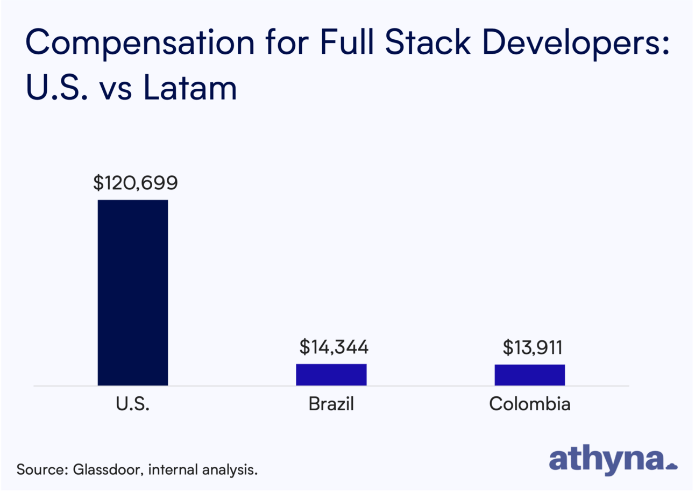

> 摘要：Jaryd Hermann 分享了他对 Athyna 的投资体验，Athyna 是一家帮助公司通过在非传统的新兴科技市场（如拉丁美洲）寻找优秀人才来扩展全职团队的公司。他强调，随着美国初创公司失败率的上升和人力成本的增加，Athyna 通过降低招聘成本提供了必要的运营资金，使得初创企业能够获得额外的燃油时间。文章详细介绍了 Athyna 在产品、增长、策略和创业建设方面的 8 个新思想。

_[Jaryd here](https://www.linkedin.com/in/jaryd-hermann/)! 👋 You’re reading How They Grow—my newsletter’s main series where we unpack **how the greatest companies are winning, and what you can learn from them.**  

Jaryd 在这里！👋 你正在阅读《他们是如何成长的》——这是我新闻通讯的主要系列，我们将深入探讨那些伟大公司如何取得成功，以及你能从中学到什么。_

Friends, I just made my first startup investment.  

朋友们，我刚刚完成了我的第一次创业投资。  

Today’s deep dive is a tad different, where I’ll share  

今天的深度讨论有些不同，我会分享**what stood out most to me about the company’s approach.** My hope is that sharing this will **add to your mental model and inspire some ideas to help you with your own product.**  

我对公司方法中最让我印象深刻的部分是。我希望分享这些内容能丰富你的思维模型，并激发一些想法，帮助你改善自己的产品。

For example, **have you ever heard of** _**negative**_ **CAC, a strategy of constants, or using a** _**suite**_ **of brands to sell your product?** Yup, neither had I.  

比如，你听说过负 CAC、常数策略，或者用一系列品牌来销售你的产品吗？没错，我也没听说过。

I learned this from **[Athyna](https://partnerslink.athyna.com/3qcs4c8zlk3o)**.  

我是从 Athyna 那里学到这些的。

[Athyna](https://partnerslink.athyna.com/3qcs4c8zlk3o) helps companies grow their full-time teams by unlocking great talent in non-obvious emerging tech markets like LATAM.  

Athyna 通过发掘拉美等非显著的新兴科技市场中的优秀人才，帮助公司壮大全职团队。  

They get rid of the headaches that come with building a distributed workforce,  

他们解决了构建分布式团队所带来的烦恼[they use AI](https://www.opensourceceo.com/p/building-athyna-ai) to match talent and companies _ridiculously_ fast, and they add tons of value to both ends of an important equation: **They help companies** _**save money**_**, while simultaneously helping the people working there make more of it.**  

他们利用人工智能以极快的速度匹配人才和公司，为这个重要的关系双方带来了巨大的价值：他们帮助公司节省开支，同时也帮助员工赚取更多收入。

_But that’s impossible, Jimmy!  

这不可能，吉米！_

**When industries mature, growth slows**. And when growth becomes more expensive, efficiency becomes the name of the game.  

当行业成熟时，增长速度会减缓；而当增长变得更加昂贵时，效率就成了关键。  

Efficiency means sustainability, and that means  

效率就是可持续，而这意味着**founders need to obsess over healthier profit margins.  

创始人需要关注更健康的利润率。**

This is just how the world works. As my favorite economist, Noah Smith [explained it](https://www.noahpinion.blog/p/some-thoughts-on-the-future-of-the); this is where we’re at with the tech industry since most things on the internet have now been built.  

这就是世界运作的方式。正如我最喜欢的经济学家诺亚·史密斯所说的那样；这就是我们在科技行业的现状，因为互联网上的大部分内容现在都已经建立起来了。  

The result of this maturity and cost of growth is real…**startup failures in the US have jumped [60% over the past year.](https://www.ft.com/content/2808ad4c-783f-4475-bcda-bddc0299095e)** Also, according to Carta, **the bankruptcy rate of startups is 700% more than in 2019.**  

这种成熟度和增长成本的结果是显而易见的……过去一年，美国的初创企业失败率上升了 60%。此外，根据 Carta 的数据，初创企业的破产率比 2019 年高出 700%。

Ultimately, **startups fail when they run out of cash**. And in tech, **headcount is by far the biggest line item**—often accounting for ~70% of a company’s budget.  

最终，初创公司在资金耗尽时会失败。在科技行业，员工成本无疑是最大的开支项——通常占公司预算的约 70%。

Athyna is in the business of bringing that number _way_ down without compromising on talent quality. **In a time of expensive growth, Athyna helps make it affordable again, giving startups essential extra runway.  

Athyna 的业务是大幅降低成本，同时不妥协人才质量。在这个增长成本高昂的时代，Athyna 帮助初创企业再次实现可负担的增长，提供必要的额外发展空间。  

**

That’s a bet I can (and did) get behind.  

这是我可以（并且已经）支持的赌注。

The rest of this piece will unpack **8 new ideas on product, growth, strategy, and startup building I’ve learned studying how Athyna grows.** Here’s a peek:  

这篇文章的其余部分将分享我在研究 Athyna 成长过程中学到的 8 个关于产品、增长、战略和创业的新想法。以下是一个简要预览：

1.  **The power of embedded media companies  
    
    嵌入式媒体公司的影响力**
    
2.  **Creator-squad growth  
    
    创作者团队的发展**
    
3.  **A strategy of constants  
    
    常数策略方法**
    
4.  **Mind the shiny object  
    
    留意那些吸引眼球的事物**
    
5.  **The cold email growth hack  
    
    冷邮件增长技巧**
    
6.  **The sidecar product trick  
    
    侧车产品的技巧**
    
7.  **A simple, but hard, superpower.  
    
    一种简单却又困难的超能力。**
    
8.  **Build what you can consume  
    
    构建你可以使用的产品**
    

##### `20-minute read.`

If you want to learn more about how Athyna can **help** _**your**_ **company grow and save on your biggest cost**, you can **[learn more here](https://partnerslink.athyna.com/jarydhermann6365-613ux)** or just **[book a call](https://partnerslink.athyna.com/jarydhermann6365-nziiva).**  

如果您想了解 Athyna 如何帮助您的公司成长并降低主要成本，可以在这里获取更多信息，或者直接预约电话。

[Check out Athyna  

了解 Athyna](https://partnerslink.athyna.com/3qcs4c8zlk3o)

> **💡 Big idea:** Modern media companies (e.g. NYT) have a software company embedded inside.  
> 
> 💡 大想法：现代媒体公司（如纽约时报）内部实际上有一家软件公司。  
> 
> But, next-gen software companies will have media companies embedded inside.  
> 
> 不过，下一代软件公司将会内嵌媒体公司。
> 
> **🫰 Why it matters:** Embedded media companies can create negative CAC and turn lead gen into a profit center.  
> 
> 嵌入式媒体公司能够产生负的客户获取成本，并将潜在客户生成转化为利润中心。  
> 
> And with growth becoming more expensive, founders who  
> 
> 随着增长成本的不断上升，创始人们谁_don’t_ build a media/creator strategy may struggle with it in the coming years.  
> 
> 如果不建立媒体或创作者策略，未来几年可能会面临挑战。
> 
> **🥇 Applying it:** An easy first step is investing in your personal brand. Social media or _starting_ a newsletter is a tool to grow your audience and therefore your business. Or, you could consider _buying_ a small newsletter/podcast.  
> 
> 🥇 应用它：一个简单的第一步是投资于个人品牌。社交媒体或创建一个新闻通讯可以帮助你扩大受众，从而推动业务发展。或者，你也可以考虑购买一个小型的新闻通讯或播客。
> 
> _**Let’s go deeper**_**…**  
> 
> 让我们深入了解…

People were confused when HubSpot acquired _The Hustle_ newsletter and the _My First Million_ podcast. What business does a SaaS company have buying two media companies?  

当 HubSpot 收购 The Hustle 新闻通讯和 My First Million 播客时，人们感到困惑。一家 SaaS 公司为什么会去买两家媒体公司呢？

Well…  

嗯…

1.  HubSpot wants to grow in the SMB and mid-market.  
    
    HubSpot 希望在中小企业和中型市场中实现增长。
    
2.  CAC through traditional marketing and sales here is _very_ crowded/expensive  
    
    这里通过传统营销和销售获得的客户获取成本非常高且竞争激烈
    
3.  That CAC is only going to increase as those channels get more saturated  
    
    随着这些渠道越来越饱和，CAC 只会不断增加
    
4.  Newsletters & podcasts are good at building large and engaged audiences for very little cost.  
    
    新闻通讯和播客能够以极低的成本有效地吸引大量活跃的受众。
    
5.  Those SMB & mid-market decision-makers read/listen to _The Hustle_ & _MFM_  
    
    这些中小企业及中型市场的决策者会阅读或收听《The Hustle》和《MFM》
    
6.  By owning them, HubSpot drives brand value and can reach them for free  
    
    通过拥有这些资源，HubSpot 提升了品牌价值，并能够免费接触到它们
    
7.  Bonus: These companies will keep making money to pay back the investment  
    
    奖励：这些公司将持续盈利，以便偿还投资
    

Unpacked like that, it’s hard not to see the brilliance of the strategy.  

这样拆开，确实很难不看出这个策略的高明之处。

And it’s clearly worked. Since then Hubspot has built the [Hubspot Podcast Network](https://www.hubspot.com/podcastnetwork?utm_source=www.opensourceceo.com&utm_medium=referral&utm_campaign=media-tech-negative-cac) which now has 34 unique podcasts all focusing on at least one of HubSpot's ICPs.  

这显然是有效的。自那时起，Hubspot 建立了 Hubspot 播客网络，目前有 34 个独特的播客，专注于至少一个 HubSpot 的理想客户画像（ICP）。  

They’ve doubled down on this “Own your own media” play and are hoping to find the next MFM early.  

他们在“拥有自己的媒体”策略上加倍投入，希望能尽早找到下一个 MFM。

They’re not alone.  

他们并不是孤单的。

-   [Pendo](https://www.pendo.io/) acquired [Mind the Product](https://www.mindtheproduct.com/)—a PM community and newsletter.  
    
    Pendo 收购了产品管理社区和通讯平台 Mind the Product。
    
-   RobinHood acquired [MarketSnacks](https://newsroom.aboutrobinhood.com/robinhood-acquires-marketsnacks-to-bring-you-financial-news/?utm_source=www.opensourceceo.com&utm_medium=referral&utm_campaign=media-tech-negative-cac)—a financial newsletter for consumers.  
    
    罗宾汉收购了 MarketSnacks——一份面向消费者的财经通讯。
    
-   Mailchimp acquired [Courier](https://www.forbes.com/sites/martyswant/2020/03/03/mailchimp-acquires-courier-to-expand-into-print-and-internationally/)—a business magazine  
    
    Mailchimp 收购了 Courier，一本商业杂志
    
-   Zapier acquired [Makerpad](https://makerpad.zapier.com/)—a no-code newsletter.  
    
    Zapier 收购了 Makerpad——一个无代码的资讯平台。
    
-   SemRush acquired [Backlino](https://investors.semrush.com/news/news-details/2022/Semrush-Acquires-Backlinko.com-Adds-500K-in-Monthly-Traffic/default.aspx)—a marketing newsletter.  
    
    SemRush 收购了 Backlino——一份营销新闻通讯。
    

**By owning these embedded media companies, these software companies are all enjoying [what Bill calls negative CAC](https://www.opensourceceo.com/p/negative-cac) through this channel and organically integrating their brand in extremely valuable, non-salesy, content.  

通过拥有这些嵌入式媒体公司，这些软件公司在这个渠道上享受着比尔所说的负客户获取成本（CAC），并在极具价值且不带销售性质的内容中自然地融入了他们的品牌。  

**

It’s such a winning move.  

这真是一个绝妙的举动。

And Athyna is doing exactly that with **[the Open Source CEO newsletter](https://www.opensourceceo.com/)** that boasts a wild 40,000+ subscribers and sold-out sponsors.  

阿西娜正是这样做的，她的开源首席执行官通讯拥有超过 40,000 名订阅者，并且赞助商已经售罄。

The only difference is [Athyna](https://partnerslink.athyna.com/3qcs4c8zlk3o) didn’t have to buy it because it’s written by Bill!  

唯一的区别是，阿西娜不需要购买这本书，因为是比尔写的！  

With every email that Bill is paid to send, his media co. drives leads to Athyna.  

每当比尔收到发送电子邮件的报酬时，他的媒体公司就会为 Athyna 带来潜在客户。

If you’re a bigger company wanting to break away from expensive channels, you’re probably best off buying one because you’re getting the right audience instantly, vs being distracted and having to build one yourself.  

如果你是一家希望摆脱高昂渠道费用的大公司，购买一个可能是最佳选择，因为这样你可以立即接触到合适的受众，而不必分心去自己建立一个。

As Kyle Poyar [says](https://openviewpartners.com/blog/should-you-buy-a-media-or-community-company/),"_Big SaaS companies with billion-dollar valuations can afford to treat media acquisitions as experiments and as an insurance policy against uncertain future outcomes.  

正如凯尔·波亚所说，“估值达到十亿美元的大型 SaaS 公司可以将媒体收购视为一种实验，同时也作为应对未来不确定性的一种保险策略。”  

They don’t necessarily need to build a comprehensive business case with board-approved targets in order to get the green light on an acquisition.  

他们不一定需要制定一个全面的商业案例或获得董事会批准的目标，就能获得收购的批准。  

These types of acquisitions haven’t been proven out yet among earlier stage (Seed-Series C) or more cash-constrained companies.”  

这些类型的收购在早期阶段（种子轮到 C 轮）或资金紧张的公司中尚未得到证实。_

But as Athyna and Bill show us, startups can also invest in their own, independently branded and run, newsletters or podcasts to feed their core business.  

但正如 Athyna 和 Bill 所示，初创公司也可以投资于自己独立品牌和运营的新闻通讯或播客，以促进其核心业务。  

For instance:  

比如说：

-   [PostHog](https://posthog.com/) has [Product For Engineers](https://newsletter.posthog.com/) co-authored by the team.  
    
    PostHog 推出了一款由团队共同开发的工程师产品。
    
-   [beehiiv](https://www.beehiiv.com/) has [Big Desk Energy](https://mail.bigdeskenergy.com/) by founder/CEO Tyler Denk.  
    
    beehiiv 的创始人兼首席执行官 Tyler Denk 拥有“大桌能量”。
    

It’s not easy doing this while running a company, but [Bill has great advice on how to do it.](https://youtu.be/VQ3f9YZEtP0)  

一边经营公司一边做这件事并不简单，但比尔提供了很好的建议。

We now know software companies owning an embedded media company get free growth.  

我们现在知道，拥有嵌入式媒体公司的软件公司能够实现免费的增长。  

Bill saw how well it worked, and asked a simple question, “  

比尔看到这个方法效果很好，问了一个简单的问题，“_How we can 10X this?_”  

我们如何能把这个提升到十倍？

Instead of buying more media companies, Bill’s genius strategy was to get many media companies to buy a part of Athyna.  

比尔的聪明策略不是收购更多的媒体公司，而是让许多媒体公司共同投资 Athyna。  

Let’s pull the thread on this below.  

让我们深入探讨一下下面的内容。

> #### 🔑 Bottom line: **Owning your own brand-independent media company is like having another business that gets paid to organically drive excellent leads to your main business.**  
> 
> 关键点：拥有一家独立的品牌媒体公司就像拥有另一个业务，它能够自然地为您的主要业务带来优质客户。

> **💡 Big idea:** Go beyond paid creator/influencer marketing. Create a group of creator _investors_ that will keep shouting your name.  
> 
> 💡 大想法：超越付费创作者和影响者营销。建立一个创作者投资者团队，让他们持续为你宣传。
> 
> **🫰 Why it matters:** People want to buy from other people, not brands. But an ongoing creator program can be expensive.  
> 
> 🫰 这很重要：人们更愿意向其他人而非品牌购买。然而，持续的创作者计划可能会非常昂贵。  
> 
> One way to indefinitely tap this growth channel and  
> 
> 一种可以持续利用这个增长渠道的方法是_grow while your creators grow_ for $0 in cash, is by raising a mini round that is creator-led.  
> 
> 在没有现金的情况下，随着创作者的成长，通过进行一个由创作者主导的小型融资轮来实现成长。
> 
> **🥇 Applying it:** Think about a few “influencers” in your space that likely reach your ICP.  
> 
> 🥇 应用它：考虑一下你所在领域的一些“影响者”，他们可能会接触到你的理想客户。  
> 
> Then test a lead-gen campaign with one or two of them.  
> 
> 然后进行一到两个潜在客户生成活动的测试。  
> 
> Get some data, and then model out what ~10-20 creators could do for your growth.  
> 
> 收集一些数据，然后模拟大约 10 到 20 位创作者能为你的成长带来什么帮助。
> 
> _**Let’s go deeper**_**…**  
> 
> 让我们深入了解…

Athyna’s latest funding round of $2.5M was mostly led by 15 creators. Myself included.  

Athyna 最近的融资轮达到了 250 万美元，主要由 15 位创作者主导，包括我在内。

The combined reach of this group is well into the hundreds of thousands of unique people, with many millions of monthly impressions.  

这个团体的覆盖人数超过数十万，每月的曝光量达到数百万。  

**As investors in Athyna, we talk about Athyna.  

作为 Athyna 的投资者，我们讨论 Athyna。**

The data? **40% of Athyna’s leads are now coming through this channel.**  

数据显示，Athyna 的 40%潜在客户现在是通过这个渠道获得的。

And importantly:  

而且，这一点非常重要：

1.  They aren’t paying _any_ cash for this growth, allowing them to invest in other channels and R&D.  
    
    他们并没有为这种增长支付现金，这让他们能够投资于其他渠道和研发。
    
2.  As these 15 media companies grow (which _conservatively_ is probably a combined 50-100% a year), this channel becomes more effective vs how others become more competitive.  
    
    随着这 15 家媒体公司的增长（保守估计每年合计增长 50-100%），这个渠道变得比其他渠道更有效，而其他渠道则变得更加竞争。
    
3.  This growth all compounds in SEO over time given all the content is evergreen, with mounting backlinks and increased domain authorities of these growing creators  
    
    这种增长在 SEO 中随着时间的推移不断积累，因为所有内容都是常青的，同时伴随着越来越多的反向链接和这些不断崛起的创作者的域名权威
    
4.  The word-of-mouth flywheel will spin faster.  
    
    口碑效应将会加速。
    

I’ve seen more and more companies have a creator strategy, but they’re all based on paying the creators via direct sponsorships or affiliates.  

我注意到越来越多的公司开始采用创作者战略，但它们的支付方式主要是通过直接赞助或联盟。  

**I haven’t seen one besides Athyna leveraging creators by** _**getting them**_ **to pay the company to talk about them.**  

我没有看到除了 Athyna 通过让创作者付费给公司来谈论他们以外的其他方式。

It’s negative CAC on steroids.  

这是负 CAC 的升级版。

Somebody _Give Bill a Bells!_ 🥃  

有人给比尔来个铃铛！🥃

But while this idea was Bill’s baby, I must give so much credit to the team who do an _extraordinary_ job **creating a community around this group of creators.** I won’t give away all the behind-the-scenes secrets to this brand-new program because Bill might slap my wrists, but here’s one thing that stands out to me.  

尽管这个想法是比尔的创意，但我必须给予团队很多赞誉，他们在为这群创作者建立社区方面做得非常出色。我不会透露这个全新项目的所有幕后秘密，因为比尔可能会惩罚我，但有一件事让我特别印象深刻。

-   **What they do:** Athyna offers to help us with content, research, sponsorship outreach, and facilitating collabs.  
    
    他们的工作：Athyna 可以帮助我们进行内容创作、研究、赞助联系和合作促进。  
    
    Plus, we all share lots of insights with each other in Slack on how to grow and monetize.  
    
    此外，我们在 Slack 上互相分享了许多关于如何发展和盈利的见解。
    
-   **Why they do it:** Athyna wants their creator investors to be as successful as possible.  
    
    为什么他们这样做：Athyna 希望他们的创作者投资者能够取得最大的成功。
    
-   **The outcome:** Growth in their creators means growth to Athyna.  
    
    结果：创造者的成长意味着 Athyna 也会成长。
    

Everybody wins.  

大家都赢。

The universal idea is this: **Don’t be shy about giving away parts of your company to people who can have a direct hand in helping you grow it efficiently and sustainably.** That’s employees. It’s key customers or partners. It could be creators…  

这个普遍的理念是：不要害怕将公司的一部分分享给那些能够直接帮助你高效、可持续地发展的人员。这包括员工、重要客户或合作伙伴，甚至可能是创作者……

> #### **💡** Bottom line: **Every growth channel is going to become more expensive to play in over time.  
> 
> Investor creators could accelerate your negative CAC strategy and drive steady leads.**  
> 
> 💡 底线：随着时间的推移，每个增长渠道的成本都会增加。投资者创作者可以帮助你加速负 CAC 策略，并持续带来稳定的潜在客户。

> **💡 Big idea:** There’s a Bezos philosophy around strategy: _Always focus on the constants._ This means invest in the customer needs and wants that will _never_ change.  
> 
> 💡 大想法：贝索斯有一种战略哲学：始终关注那些不变的因素。这意味着要投资于客户永恒的需求和愿望。
> 
> **🫰 Why it matters:** It’s _very_ easy to get caught up adjusting a strategy based on hype cycles.  
> 
> 这很重要：根据炒作周期调整策略非常简单。  
> 
> And, while you don’t want to stop lifting your head to see what’s changing and spot possible inflections, you mainly should focus on defining and building upon  
> 
> 而且，虽然你不想停止抬头去观察变化和发现可能的转折点，但你主要应该专注于定义和发展 _the things that endure over time.  
> 
> 随着时间流逝而持久的事物。_
> 
> **🥇 Applying it:** Find time to map out what your market’s fundamental needs are—the timeless principles that are unlikely to change in the future.  
> 
> 🥇 应用它：找时间理清市场的基本需求——那些在未来不太可能改变的永恒原则。  
> 
> Then check if your strategy clearly improves those things for your customer.  
> 
> 然后检查你的策略是否能明显改善这些对客户的重要方面。
> 
> _**Let’s go deeper**_**…**  
> 
> 让我们深入了解…

You can probably think of _at least_ 5 products that have added some AI feature that feels unnecessary.  

你可能能想到至少五款添加了看似多余的 AI 功能的产品。

These are trend chases looking to add the Sparkle emoji to their homepage. ✨  

这些是追逐潮流的人，想在他们的主页上添加闪亮的表情符号。✨

But Athyna has based their AI strategy on **the idea of constants**; an idea first introduced by Bezos.  

但 Athyna 的人工智能战略基于常数的概念，这一概念最早是由贝索斯提出的。

_We know that customers want low prices, and I know that's going to be **true 10 years from now.** They want fast delivery; they want vast selection.  

我们知道客户希望价格低廉，我相信这在 10 年后依然会成立。他们希望快速交货，并且希望有丰富的选择。  

It's impossible to imagine a future 10 years from now where a customer comes up and says, 'Jeff I love Amazon; I just wish the prices were a little higher.  

我无法想象 10 年后的未来，顾客走过来对我说：“杰夫，我喜欢亚马逊；我只希望价格能稍微高一些。”_

And **you can** _**always**_ **go deeper on solving your users’ constant needs.**  

你可以更深入地满足用户不断变化的需求。

For instance, the constants for:  

比如，常量是：

-   **My newsletter’s** are  
    
    我的通讯是
    
    -   Quality, novelty, and relevance of insights  
        
        见解的质量、创新性和相关性
        
-   **OpenAI’s** are  
    
    OpenAI 的存在是
    
    -   Accuracy, speed, and cost of model  
        
        模型的准确性、速度与成本
        
-   **Tesla’s** are**:**  
    
    特斯拉是：
    
    -   Battery life and price  
        
        电池续航和价格
        
-   **Boeing’s** are**:**  
    
    波音的特点是：
    
    -   Planes that don’t have doors flying off…  
        
        没有门的飞机飞走了…
        

If those companies improve their constants, people will love them for it and they’ll grow.  

如果这些公司能够改善他们的常规，人们会因此喜欢他们，他们将会发展壮大。

**This is all quite neat for anyone who does “strategy” work.** It’s almost a cheat code for what to say _Yes_ and _No_ to.  

这对任何从事“战略”工作的人来说都非常实用。这几乎就像是一个秘籍，帮助你判断该对什么说“是”，对什么说“不是”。

Athyna had a pretty good idea of what their constants were, but to be sure, they started with a **[needs analysis](https://dovetail.com/customer-research/customer-needs-analysis/?utm_source=www.justgogrind.com&utm_medium=referral&utm_campaign=building-the-future-of-work)**.  

阿西娜对他们的常量有相当清晰的认识，但为了确认，她们开始进行需求分析。  

They mapped out the functional, social, and emotional needs of their customers and ranked them against how  

他们梳理了客户的功能、社交和情感需求，并对这些需求进行了排名_**important**_ and _**often**_ they occurred, as well as from a solution POV how _**big**_ and _**crowded**_ the market was.  

这在市场上是重要且常见的，同时从解决方案的角度来看，市场的规模和拥挤程度也很关键。

_“Once we had our needs analysis mapped we started building.  

一旦我们完成了需求分析的梳理，就开始进行构建。  

All product and features pitches needed to map back to a user need from one of our three ICPs” -  

所有产品和功能的介绍都需要与我们三个理想客户群中的某个用户需求相匹配_Bill  

比尔

It looked like this.👇  

它看起来是这样的。👇

In the end, **Athyna had 4 timeless needs:**  

最终，Athyna 有四个永恒的需求：

-   _**Quality talent**_ - _who doesn’t want amazing people?_  
    
    优秀的人才 - 谁不想拥有出色的人呢？
    
-   _**Accurate role fit**_ **-** _who doesn’t want the most qualified candidates?_  
    
    精准的角色匹配 - 谁不希望拥有最优秀的候选人呢？
    
-   _**Fast time-to-hire** -_ _who doesn’t want to find a fit sooner?_  
    
    快速招聘 - 谁不想尽早找到合适的人选呢？
    
-   _**Low cost**_ - _who doesn’t want to save the bank?_  
    
    低成本 - 谁不想省钱呢？
    

Bill sent me this table showing how Athyna amplifies these constants—where **all the constants, but most obviously those of** _**Talent**_**,** _**Process, and Speed**_ **are improved with AI.**  

比尔给我发了这张表，展示了 Athyna 如何提升这些常数——所有常数，尤其是人才、流程和速度的常数，都得益于人工智能的改善。

**The typical recruitment process lasts 3 to 8 weeks.** By using AI to search tens of thousands of profiles (quality) from markets like LATAM (cost), rate and rank them against job descriptions and various recruiter-enabled assessments (process), and push the best suggestions to recruiters (speed), **Athyna gets recruiters and best-match talent speaking within 2 days.**  

典型的招聘流程通常持续 3 到 8 周。Athyna 通过使用人工智能搜索来自拉丁美洲等市场的数万个高质量个人资料，评估并排名这些资料与职位描述及各种招聘人员的评估，最终在 2 天内将最佳匹配的人才推荐给招聘人员。

The end result of using AI to improve the constants is their epic new product, **[Athyna AI.](https://www.opensourceceo.com/p/building-athyna-ai)**  

利用人工智能提升常量的最终成果是他们的全新产品，Athyna AI。

So, **what are** _**your**_ **product’s constants? And are you investing in them?**  

那么，你的产品有哪些常量？你在为这些常量投资吗？

Because the more I think about the companies we’ve covered, the more obvious it is: **The companies that** _**(1)**_ **are super clear on what their constants are, and** _**(2)**_ **always do R&D around going deeper on them, will beat the ones who have loose understandings of them and easily chase shiny objects.  

因为我越是思考我们所报道的公司，就越明显：那些（1）对自身核心价值非常清晰，并且（2）始终围绕这些核心价值进行深入研发的公司，将会战胜那些对这些价值理解模糊、容易追逐新奇事物的公司。**

More on shiny objects coming right up…  

关于闪亮物体的更多内容马上就要来了…

> #### 🔑 Bottom line: **The constants in your business should always be reflected in at least one of the pillars of your strategy.  
> 
> **  
> 
> 关键点：您业务中的核心要素应始终体现在战略的至少一个支柱上。

_Learning something? **Consider upgrading to paid to support my work, invest in yourself, and unlock [premium essays like these ones.](https://www.howtheygrow.co/s/from-the-garden)**  

想学习新知识吗？考虑升级到付费版，支持我的工作，投资自己，并解锁更多优质文章。_

> **💡 Big idea:** Shiny Object Syndrom is a very common trap.  
> 
> 💡 大想法：闪亮物体综合症是一个非常常见的陷阱。  
> 
> It’s that irresistible pull toward new ideas, strategies, or projects that promise instant gratification and untold riches.  
> 
> 这是一种无法抗拒的吸引力，促使人们追求新的想法、策略或项目，这些都承诺能带来即时的满足和无尽的财富。  
> 
> **🫰 Why it matters:** SOS is anti-strategy because it’s a reflection of indecisivness.  
> 
> 🫰 这很重要：SOS 是一种反策略，因为它反映了犹豫不决。  
> 
> If you keep chasing after something new, copying because a competitor is doing it, or just saying yes to all things that come to mind, you won’t ever make progress.  
> 
> 如果你总是追求新事物，模仿竞争对手，或者对所有想到的事情都说“是”，你将永远无法取得进展。  
> 
> **🥇 Applying it:** _No_ should be the default answer to new things. Until the evidence is clear that saying _Yes_ clearly intergates with your strategic choice set—_[Where To Play, How To Win](https://www.howtheygrow.co/i/146745300/i-where-to-play-how-to-win)_—shut that shit (politelly) down.  
> 
> 🥇 应用它：对新事物的默认回答应该是“不”。在证据明确表明说“是”与您的战略选择（竞争领域和获胜方式）有明显关联之前，礼貌地拒绝。
> 
> _**Let’s go deeper**_**…**  
> 
> 让我们深入了解…

I was recently watching _Dragons’ Den_ (the UK, and original, Shark Tank) and I saw a sad case of an entrepreneur having no idea he had Shiny Objected Syndrome (SOS).  

我最近在看《龙的巢穴》（英国版的《鲨鱼坦克》），看到一个企业家的悲惨案例，他完全不知道自己有闪亮物体综合症（SOS）。  

You can  

你可以这样做[watch the clip here](https://www.youtube.com/watch?v=S2HMINXzkcY&t=339s), but in short, this dude had invented over _**40**_ things in his life—of which not one had ever made any money.  

在这里观看视频，简单来说，这个家伙一生中发明了超过 40 样东西，但没有一样能赚钱。  

He was pitching a product to the Dragons for a biodegradable cable tie, but he was also (1) writing a novel, (2) inventing a parachute for NASA, and (3) designing a new type of surfboard.  

他正在向投资者推销一种生物可降解的扎带，同时还在（1）写小说，（2）为 NASA 发明降落伞，以及（3）设计一种新型冲浪板。

Poor Simon.  

可怜的西蒙啊。

No need to tell you he didn’t get a nickel that day, and Simon’s trajectory has been eerily similar to this chart…  

不用说，他那天一分钱都没得到，而西蒙的轨迹与这张图表惊人地相似…

-   _**Focus x Execution**_ = _up and to the right._  
    
    专注与执行 = 向上和向右发展。
    
-   _**Distraction x Execution**_ = _sideways (or often down) and to the right_  
    
    分心与执行的结果是向侧面（或常常向下）和向右发展
    

**Simply because no company can be all things to everyone.  

仅仅因为没有任何公司能够满足每个人的需求。  

Narrowing down the strategic playing field is an absolute must.  

确定战略竞争领域是非常重要的。** One quick pulse check you can do right now is to ask yourself (and answer honestly), “_What choices have we made that have narrowed our competitive field across markets, segments, channels, categories, and ICPs?”_  

你现在可以进行的一个快速自我检查是问自己（并诚实回答）：“我们做出了哪些选择，导致我们的竞争领域在市场、细分、渠道、类别和理想客户群中变得更加狭窄？”

The tighter and more obvious the answer, the more strategically focused you are.  

答案越简洁明了，你的战略重点就越明确。

When you _haven’t_ made a decision about where you want to play in the market, then hopping around to “the next best thing” like Simon is an easy slope to slip down.  

当你还没有决定自己想在市场上做什么时，像西蒙那样不断寻找“下一个最佳选择”就很容易陷入困境。  

But,  

不过，_even when you_ have made choices, chasing the odd distraction that pulls you away from that focus (like [a Sirens Song](https://en.wikipedia.org/wiki/Siren%27s_Song)) is still possible.  

即使你已经做出选择，仍然可能会被那些奇怪的干扰（如海妖的歌声）吸引，偏离你的专注。

This happened to me at my own startup, and this happened to Bill and Athyna.  

这件事发生在我自己的创业公司，也发生在比尔和阿西娜身上。  

They were ramping up and seeing good growth, and got caught in the SOS whirlpool for a bit.  

他们正在快速发展并取得良好增长，但一度被 SOS 漩涡卷入。**It’s much easier than you think to fall into.  

这比你想的要简单得多。**

Their shiny object was to become an Employer of Record (like Deel).  

他们的目标是成为一个雇主记录机构（类似于 Deel）。

They shopped this around in 2022 with top VCs when they were raising a $5M round at a $25M valuation.  

他们在 2022 年向顶级风险投资公司展示这笔交易，当时他们正在以 2500 万美元的估值筹集 500 万美元的融资。  

And they got very close to making this happen.  

他们几乎要实现这个目标了。  

Right in the end, the deal fell through due to a conflict of interest.  

最终，由于利益冲突，这笔交易未能成功。

I think that was lucky.  

我觉得那真是运气好。  

If they’d raised the $5M then, they probably would have gone down the EOR path.  

如果他们当时筹集了 500 万美元，他们可能会走上 EOR 的道路。  

A hard and competitive route up against an incredible startup—Deel—that wouldn’t have charted a clear path to winning.  

一条艰难且竞争激烈的道路，面对一个令人惊叹的初创公司——Deel——它并没有清晰的胜利之路。

They ended up doing a bridge round of $500k, focused on their matchmaking marketplace which grew at 22% MoM last year, and now do $6M+ ARR.  

他们最终进行了 50 万美元的桥接轮融资，专注于他们的配对市场，去年月增长率达 22%，现在年收入超过 600 万美元。

**Focus pays quick and big dividends.  

专注能带来快速且丰厚的回报。**

[Download  

下载文件](https://www.howtheygrow.co/api/v1/file/043a39a5-d4ca-45ef-9528-4963a155b605.pdf)

The best way to avoid SOS is to **know what choices you’ve made and say no like a mad man to the things that don’t align with where you want to play, and progress how you will win in that market.**  

避免 SOS 的最佳方法是清楚自己做出的选择，并对那些与自己目标不符的事情坚决说不，从而推动自己在该市场中取得成功。

Three quick notes from me and Bill’s experience…  

我和比尔的经历有三点简要说明…

-   Be careful of cool new tech that may provide no real value to your customer  
    
    注意那些可能对您的客户没有实际价值的炫酷新技术
    
-   Be careful of entering new markets just because they are there  
    
    进入新市场时要谨慎，不要仅仅因为它们存在就贸然尝试
    
-   Be careful of chasing ideas from investor feedback or one big customer  
    
    注意不要过于追求投资者的反馈或某个大客户的意见
    

> #### **💡** Bottom line: **You won’t grow by simply doing more things and playing in more spaces.  
> 
> You need to know when to go deeper on what you have, vs going wider.**  
> 
> 💡 底线：仅仅通过做更多事情和进入更多领域是无法实现成长的。你需要知道何时在已有的基础上深入，而不是一味扩展。

> **💡 Big idea:** Athyna went from sending 50 emails per week to a scaled outbound machine sending _1.2M_ emails per week. They did this using a _suite_ of different sub-brands.  
> 
> 💡 大想法：Athyna 从每周发送 50 封电子邮件，发展到每周发送 120 万封电子邮件的外联系统。他们通过多个不同的子品牌实现了这一目标。
> 
> **🫰 Why it matters:** Outbound is a volume game, but, it’s hard to send a lot of emails every week because cold outreach is always going to be slowed and limited by how “warm” your email domain is.  
> 
> 🫰 这很重要：外部营销是一个数量游戏，但每周发送大量电子邮件很困难，因为冷邮件的推广总是会受到你电子邮件域名的“温暖”程度的限制。  
> 
> The more unique domains you use, the faster you’ll reach scale (and the higher your ceiling will be).  
> 
> 域名越独特，达到规模的速度就越快（上限也会更高）。
> 
> **🥇 Applying it:** If cold email is part of your GTM, consider buying a related domain, feeding it into your email machine, and ramping up its daily sends.  
> 
> 🥇 应用：如果冷邮件是您市场进入策略的一部分，建议购买一个相关的域名，将其接入您的邮件系统，并逐步增加每日发送量。  
> 
> _**Let’s go deeper**_**…**  
> 
> 让我们深入了解…

**Outbound email is still one of the best ways to reach B2B buyers.** It’s a simple equation—_send more emails to more of the right people with the right message_, and you’ll land more customers.  

外发电子邮件依然是接触 B2B 买家的最佳方式之一。这是一个简单的道理——向更多合适的人发送更多电子邮件，并传达正确的信息，你就能获得更多客户。

But getting to volume takes time because it takes about 3 months to warm up a domain to send any decent number of emails.  

但是要达到发送量需要时间，因为让一个域名准备好发送可观数量的电子邮件大约需要 3 个月。  

Which is fair—that’s how we get spared from spam.  

这很公平——这就是我们如何避免垃圾邮件的方式。  

Send too many too fast, and you’re digging yourself a hole.  

发送得太快太多，你是在给自己挖坑。

[ - MailReach")](https://substackcdn.com/image/fetch/f_auto,q_auto:good,fl_progressive:steep/https%3A%2F%2Fsubstack-post-media.s3.amazonaws.com%2Fpublic%2Fimages%2F76cf6272-4e9b-4019-927f-ee83b12377a3_843x459.png)

But Bill isn’t one to dilly-dally.  

但比尔可不是那种拖延的人。  

He had little patience to wait and slowly scale the power of the single Athyna.com domain.  

他没有耐心去等待，也不愿意慢慢提升单一的 Athyna.com 域名的影响力。  

So, he took a play from Dr. Strange and launched a full suite of sub-brands that can each send 100K emails a day—like the little email workhorses of Athyna!  

所以，他借鉴了奇异博士的做法，推出了一整套子品牌，每个品牌每天可以发送 10 万封邮件——就像 Athyna 的小型邮件工作者一样！

It’s quickly become their biggest growth channel, with _60 million_ emails being sent a year. And doing some napkin math, at $6M+ ARR, that’s an ROI of $0.1 per email.  

它迅速成为他们最大的增长渠道，每年发送 6000 万封电子邮件。根据一些简单的计算，以超过 600 万美元的年经常性收入来看，每封电子邮件的投资回报率为 0.1 美元。

As Bill said: “_I don’t think you need that many channels to really be working to get to a big business.  

比尔说：“我觉得你不需要那么多频道就能真正做到大生意。”  

For several years, outbound alone accounted for 80% of our revenue.  

几年来，外部销售独自占据了我们 80%的收入。  

We’re still a small company, so being able to do this at our current scale leads me to believe we’re probably the best in the world at it.”  

“我们仍然是一家小公司，因此在我们目前的规模下能够做到这一点让我相信，我们可能是世界上最优秀的。”_

_3 of Athyna’s workhorse sub-brands (not the market relevance of each domain/brand)  

亚西娜的三款主力子品牌（不考虑每个领域/品牌的市场相关性）_

FYI, [Brett Adcock](https://www.linkedin.com/in/brettadcock/) sold Vettery (a talent marketplace with Athyna’s model) for $110M with the same strategy.  

仅供参考，布雷特·阿德科克以相同的策略将 Vettery（一个与 Athyna 模式相似的人才市场）以 1.1 亿美元的价格出售。  

For 4-5 years outbound was the only channel he used.  

在过去的 4 到 5 年里，他只使用了外部渠道。

To replicate a strategy like this, simply:  

要想复制这样的策略，只需：

-   Buy more (cheap) domains  
    
    购买更多便宜的域名
    
-   Connect them to your outbound GTM machine (i.e [Attio](https://attio.com/?utm_source=how_they_grow&utm_medium=newsletter_sponsorship&utm_campaign=how_they_grow-Q2Y24), [Apollo](https://www.apollo.io/), [Clay](https://www.clay.com/))  
    
    将它们连接到您的外部 GTM 工具（如 Attio、Apollo、Clay）
    
-   Start warming them up and ramping your sequences that all point to your core product  
    
    开始让他们热身，并逐步提升所有指向核心产品的流程
    

> #### **💡** Bottom line: **If you’re playing the outbound email game, increase your surface area of success by using multiple domains via sub-brands to run sequences.  
> 
> **  
> 
> 💡 底线：如果你在进行外发邮件的工作，可以通过使用多个域名和子品牌来增加成功的机会。

If you’re looking to grow your team now or in the near future, consider chatting with Bill and the Athyna team.  

如果你希望现在或不久的将来扩展团队，可以考虑与比尔和 Athyna 团队进行交流。  

**[You can book some time here](https://partnerslink.athyna.com/jarydhermann6365-nziiva)**—just tell them Jaryd sent you and you’ll get first-class treatment.  

你可以在这里预约时间——只需告诉他们是 Jaryd 推荐的，你就能享受到一流的服务。

[I'm interested  

我对这个很感兴趣](https://partnerslink.athyna.com/jarydhermann6365-nziiva)

> **💡 Big idea:** You can build free mini-products (AKA sidecar products) that solve a general, high-frequency problem for your ICP, some of who will then convert to the core product thanks to well placed CTAs.  
> 
> 💡 大想法：你可以创建免费的迷你产品（也称为副产品），以解决目标客户群体中普遍存在的高频问题，其中一些客户会因为合适的号召性用语而转向核心产品。  
> 
> **🫰 Why it matters:** These products are like honeypots; attracting new users to the core product with a free (and valuable) hook.  
> 
> 🫰 这很重要：这些产品就像蜜罐，通过一个免费的（且有价值的）吸引点来吸引新用户使用核心产品。  
> 
> They are great for PLG motions!  
> 
> 它们非常适合产品-led 增长的策略！
> 
> **🥇 Applying it:** Find an adjacent, wider use case that's relevant to your core product and customer, and then build a free tool to attract them.  
> 
> 🥇 应用它：寻找一个与您的核心产品和客户相关的更广泛的用例，然后创建一个免费工具来吸引他们。  
> 
> _**Let’s go deeper**_**…**  
> 
> 让我们深入了解…

I first learned of the term “Sidecar Product” when reading up on [Snyk](https://snyk.io/), which uses multiple mini products like _[The Snyk Vulnerability Database](https://security.snyk.io/)_ and _[Snyk Advisor](https://snyk.io/advisor/)_ to contribute to noticeable platform growth.  

我第一次了解到“边车产品”这个术语是在阅读 Snyk 时，Snyk 通过使用多个小型产品，如 Snyk 漏洞数据库和 Snyk 建议，来推动平台的显著增长。

These products are not core to Snyk’s product, but they are:  

这些产品虽然不是 Snyk 的核心产品，但它们仍然是：

1.  _**Free**_ to use  
    
    可自由使用
    
2.  _**Useful**_ to devs  
    
    对开发人员很有帮助
    
3.  _**Related**_ to Snyks primary use case of dev security  
    
    与 Snyk 的主要用途——开发安全性相关
    

These micro tools help build brand awareness and funnel the right people to the main lead gen motion since they always place CTAs that send people to the core.  

这些微型工具有助于提升品牌知名度，并将合适的人引导到主要的潜在客户生成活动中，因为它们总是设置呼吁行动（CTA），将人们引导到核心内容。  

Athyna is using a similar strategy with _**Ava**_**—their AI-powered Chrome extension for job seekers.**  

Athyna 正在采用与 Ava 类似的策略——一款为求职者提供的 AI 驱动 Chrome 扩展。

Ava does two things:  

阿瓦有两件事情要做：

-   _**For the market,**_ it helps anyone looking for a job (1) build a great LinkedIn profile, (2) tailor their job applications, and (3) get job suggestions.  
    
    对于求职者来说，它可以帮助他们（1）创建一个优秀的 LinkedIn 个人资料，（2）定制求职申请，以及（3）获取工作推荐。
    
-   _**For Athyna—**_by creating massive, free, and related value for job-seekers—Ava connects Athyna with the perfect supply side of the marketplace: motivated tech workers who are comfortable with AI.  
    
    对于 Athyna 来说，Ava 通过为求职者创造大量免费且相关的价值，将 Athyna 与市场上完美的供应方连接起来：那些对人工智能感到自如的积极技术工作者。  
    
    This helps them (1) grow the depth of their talent pool, and (2) is a  
    
    这帮助他们（1）增加人才库的深度，并且（2）是一个**brilliant data play, giving them first-party insight into real-world job market data.  
    
    出色的数据分析，让他们获得关于真实就业市场的第一手见解。**
    

**The second sidecar product Athyna is working on is a third-party job board.** Like _Ava_, this opens another big door to grow the talent side of the market. Also like _Ava_, it doubles down on their data play.  

Athyna 正在开发的第二个边车产品是一个第三方招聘平台。与 Ava 类似，这为市场的人才发展打开了新的大门。同时，它也在数据方面加大了投入。  

By aggregating tons of usage-based data points, they can build a really solid model that shows the state of labor and can inform where Athyna should invest.  

通过汇集大量基于使用的数据，他们能够构建一个非常可靠的模型，展示劳动市场的状况，并为 Athyna 的投资方向提供建议。

Bill likes to compare this strategy of adding 3rd party employers to how Amazon opened its marketplace to 3rd party sellers.  

比尔喜欢将这种将第三方雇主纳入的策略与亚马逊开放市场给第三方卖家的做法进行比较。  

He even scribbled over Bezo’s 2018 letter about it.  

他甚至在贝索斯 2018 年的信件上乱写乱画。

This will drive Athyna’s core flywheel, just like it did for Amazon.  

这将推动 Athyna 的核心运转，就像它曾推动亚马逊一样。  

That’s the power of sidecar products.  

这就是副产品的强大之处。

**So, it’s worth thinking about what you could offer the market as a complementary onramp to your main product.  

因此，值得思考一下你可以为市场提供什么作为你主要产品的补充途径。  

**

**A word of caution though:** When a sidecar product caters to an adjacent, wider use case than your core product serves, you create a gap between the value promise of the acquisition channel and the value realized by the core product.  

不过需要提醒的是：当一个边车产品满足的用例比你的核心产品更广泛时，就会在获取渠道的价值承诺与核心产品实际实现的价值之间产生差距。  

In effect, you’ll get some signups with much lower intent who you should expect will not activate or retain as well as others.  

实际上，您会获得一些意图较低的注册用户，您应该预期他们不会像其他用户那样活跃或留存。

> #### **💡** Bottom line: **If you build a sidecar product, make sure it aligns closely with your market’s main problem/needs map.  
> 
> **  
> 
> 💡 底线：如果你要开发一个附加产品，务必确保它与市场的主要问题和需求紧密相关。

> **💡 Big idea:** Being incredibly helpful to others eventually helps you.  
> 
> 💡 大想法：帮助他人最终也会帮助到自己。
> 
> **🫰 Why it matters:** Actually being helpful is _hard_. It means saying _Yes_ to things that don’t directly progress your goals and following through.  
> 
> 🫰 这很重要：真正提供帮助是很难的。这意味着要对那些不直接推动你目标的事情说“是”，并且要付诸实践。  
> 
> But if you can do a hard thing that other people won’t—the rewards are very high.  
> 
> 但如果你能做那些别人不愿意做的艰难事情，回报将会非常丰厚。  
> 
> People reciprocate, and you’ll expand your surface area of opportunity.  
> 
> 人们会互相回馈，这样你就能拓宽机会的范围。
> 
> **🥇 Applying it:** The next time you’re catching up with a buddy, coworker, customer, or investor, expliclty ask them, “_How can I help you most right now?_”. If the answer is doable—do it.  
> 
> 🥇 应用它：下次你和朋友、同事、客户或投资者聊天时，直接问他们：“我现在能最有效地帮助你什么？”如果答案可行，就去做。
> 
> _**Let’s go deeper**_**…**  
> 
> 让我们深入了解…

What I remember most about meeting Bill, besides how flipping cool he is (he’s run with the bulls, patted lions, and swum with sharks!) was seeing a founder building and growing his business in a way that I wish I had.  

我对见到比尔最深刻的印象，除了他有多酷（他曾与公牛赛跑，抚摸狮子，还与鲨鱼共游！）就是看到一位创始人以我所希望的方式建立和发展他的事业。  

A trait I quickly came to see in Bill—one that I think is a true superpower that infinitely expands one’s surface area for success—is that Bill does not stop being incredibly helpful.  

我很快发现比尔有一个特质——我认为这是一个真正的超能力，可以无限扩大一个人成功的机会——那就是比尔总是非常乐于助人。  

I’m not exaggerating.  

我并不是在夸张。  

And not surface-level help, like actually really caring about how he can add value to everyone in his circles.  

这不仅仅是表面上的帮助，而是真心关心他如何能为身边的每个人带来价值。  

He also asks for  

他还请求_nothing_ in return.  

没有得到任何回报。

_**Aside**_: Selfishly though, plenty of evidence shows that helping others benefit our own mental health and wellbeing.  

虽然有些自私，但许多证据表明，帮助他人有利于我们的心理健康和幸福感。  

For instance, it reduces  

比如，它减少了**[stress](https://www.mentalhealth.org.uk/explore-mental-health/a-z-topics/stress)** as well as improves mood, self-esteem, and happiness.  

缓解压力，同时提升情绪、自尊心和幸福感。

In a world where we want to say _No_ more often to protect our focus, **offering to help and delivering on that help is** _**hard to do.**_ But [like we saw with Stripe](https://www.howtheygrow.co/p/how-stripe-grows), if you can do a hard thing that other people won’t—the rewards are very high.  

在一个我们希望更频繁地说“不”的世界里，提供帮助并真正兑现承诺是非常困难的。但正如我们在 Stripe 看到的，如果你能做一些别人不愿意做的艰难事情，回报将会非常丰厚。

I asked Bill about how he manages to be so helpful to so many people while running a $6M+ ARR startup _and_ building a rapidly growing media company, and if he had any advice.  

我问比尔，他是如何在经营一家年收入超过 600 万美元的初创公司和快速发展的媒体公司时，能够如此帮助这么多人，并且是否有任何建议。  

Of course, he was happy to help.  

当然，他很乐意提供帮助。

I just try to be helpful as a rising ship floats all boats.  

我只是想像一艘上升的船那样，帮助所有的船只。

I have never really believed in competition, but more so in collaboration.  

我从来不太相信竞争，更相信合作的重要性。  

And I guess it’s the same with the program, my socials, and my newsletter.  

我想这和我的项目、社交媒体以及我的通讯内容是一样的。  

I’m trying to build a big base of allies.  

我正在努力建立一个强大的盟友网络。  

Not strategically really, just by trying to be a good person and do fun, helpful, interesting stuff.  

其实并不是出于战略考虑，而是想做一个好人，做一些有趣且有帮助的事情。  

I think that’s how we all are really wanting to operate at our core but sometimes people forget.  

我觉得这正是我们每个人内心深处真正想要的方式，但有时人们会忘记这一点。  

So the ‘work’ if you will hopefully will pay off in some way over time because allies want to see you do well.  

所以，如果你愿意，这份“工作”希望随着时间的推移能有所回报，因为盟友们希望看到你表现出色。  

And I do have a great lot of allies now.  

我现在确实有很多支持者。

The tricky thing is taking on too much stuff. Which I am incredibly guilty of.  

棘手的地方在于承担了太多的事情，而我对此深感愧疚。  

I won’t lie and say I have a balanced lifestyle really right now.  

我不会撒谎，实际上我现在并没有一个平衡的生活方式。  

But having said that, I am doing things I enjoy and making friends along the way, so it’s all good in that regard.  

不过，我正在做我喜欢的事情，并在这个过程中交到朋友，所以这一切都很好。  

A key for me though is to have a solid team around me to help me do more.  

对我来说，关键是拥有一个强大的团队来帮助我做更多的事情。  

Delegating and getting support is key. I’d be nowhere near as productive without my team.  

委托他人并获得支持是非常重要的。没有我的团队，我的工作效率不会如此高。

> #### **💡** Bottom line: **Help yourself by helping others.**  
> 
> 💡 关键是：通过帮助他人来帮助自己。

> **💡 Big idea:** The most successful companies use their own product to grow. “_[Never trust a skinny chef!](https://www.phaidon.com/store/cookbooks-food-and-drink/never-trust-a-skinny-italian-chef-9780714867144/)_”  
> 
> 💡 大想法：最成功的公司通过使用自己的产品来实现增长。“永远不要相信瘦厨师！”
> 
> **🫰 Why it matters:** When you rely on your own product as a tool to be successful, it aligns the incentives with your customers, drives crafstmanship and attention to detail, and gives you ongoing feedback from being your own power user.  
> 
> 🫰 这很重要：当你将自己的产品作为成功的工具时，它能使你的激励与客户的需求一致，促进工艺水平和对细节的关注，同时通过成为自己的重度用户获得持续的反馈。  
> 
> **🥇 Applying it:** Dogfood. Dogfood. _More dogfood_.  
> 
> 🥇 使用它：狗粮。狗粮。更多的狗粮。
> 
> _**Let’s go deeper**_**…**  
> 
> 让我们深入了解…

The US job market is crazy competitive, and comp packages reflect that.  

美国的就业市场竞争异常激烈，薪酬待遇也因此相应提高。  

What’s more, predictions suggest by 2030 there will be a talent shortage in the US, particularly in the tech sector.  

此外，预测表明到 2030 年，美国在科技行业将面临人才短缺。  

And when things become more scarce, they become more expensive.  

当物品变得稀缺时，它们的价格会变得更高。

Athyna’s entire shtick is that **companies should be growing with remote talent from underutilized and growing tech hub markets**.  

Athyna 的核心理念是公司应与来自被低估和快速发展的科技中心市场的远程人才共同成长。  

I believe about 80% of Athyna’s supply side is the LATAM market—that’s Argentina, Brazil, Mexico, and Colombia.  

我认为 Athyna 的供应链中大约 80%来自拉丁美洲市场，包括阿根廷、巴西、墨西哥和哥伦比亚。  

People often think offshore talent just means India or the Philippines.  

人们常常认为离岸人才只指印度或菲律宾。  

That’s because most don’t really understand that the tech ecosystem in South America is as strong as any other ecosystem in the world, outside of the US.  

这主要是因为大多数人并不真正理解南美的科技生态系统与世界上其他任何生态系统一样强大，除了美国。  

Consider this:  

请考虑一下这个：

-   The cost of living in LATAM is significantly lower than in the U.S. This allows companies to offer competitive salaries (**up to 40-50% better than local rates)** that are more affordable **(up to 80% less than onshore**) without compromising the quality of life. Simply**, offshore is an opportunity to pay a premium to talent at a discount to you.**  
    
    拉美的生活成本明显低于美国。这使得公司能够提供具有竞争力的薪资（比当地薪资高出 40-50%），而且这些薪资更具可负担性（比本土薪资低 80%），同时不影响生活质量。简单来说，离岸是以折扣的方式为人才支付溢价的机会。
    
-   Emerging tech hubs in São Paulo, Buenos Aires, and Mexico City are producing **highly skilled professionals,** coming from very mature tech ecosystems.  
    
    圣保罗、布宜诺斯艾利斯和墨西哥城的新兴科技中心正在培养来自成熟科技生态系统的高技能专业人士。
    
-   LATAM professionals operate within **similar time zones** to the U.S., meaning significant overlap (6 hours or more) for collaboration.  
    
    拉美专业人士与美国的时区相似，这意味着在合作时有显著的重叠（6 小时或更多）。
    
-   Establishing a presence in LATAM can **open doors to new markets** and customer bases, driving business growth.  
    
    在拉丁美洲建立业务可以为新市场和客户群体打开大门，从而促进业务增长。
    

And while Athyna helps US tech companies access LATAM talent and hedge against the 2030 shortage, they themselves are also their own customer and favorite case study—using Athyna to build their competitive edge.  

当 Athyna 帮助美国科技公司获取拉美人才并应对 2030 年的人才短缺时，他们自己也是自己的客户和最受欢迎的案例研究——通过 Athyna 来提升他们的竞争优势。  

As Bill says:  

正如比尔所说的：

> _Internally, **we have team members that are ex-Amazon, Uber, Oracle, Meta and more.  
> 
> 我们的团队成员中有来自亚马逊、优步、甲骨文、Meta 等公司的前员工。  
> 
> We’d not be able to afford that type of talent had we hired them in the US,  
> 
> 如果我们在美国雇佣他们，我们就无法承担那种人才的费用** Australia etc. **All of our team gets paid much more than they would locally and we give RSUs (stock) from executives to interns.  
> 
> 澳大利亚等地。我们团队的所有成员的薪水都远高于当地水平，并且我们为实习生提供来自高管的 RSU（股票）。  
> 
> So everyone is super happy.  
> 
> 所以大家都非常快乐。**_
> 
> _It still makes me shake my head that people want to hire their entire team onshore, whether that be the US, Canada, Aus, or the UK.  
> 
> 我仍然觉得很不可思议，人们竟然想在美国、加拿大、澳大利亚或英国雇佣他们的整个团队。  
> 
> Salaries are 3-5x higher in most cases, and as Founder & CEO I need to make the best decisions for our shareholders.  
> 
> 在大多数情况下，薪资高出 3 到 5 倍，作为创始人兼首席执行官，我需要为我们的股东做出最佳决策。  
> 
>   
> 
> So **I need to ask, "Will this marketing, sales, creative, product hire add 400% more value because they are boots on the ground in the US?”.  
> 
> 所以我想问，“这个市场营销、销售、创意和产品的招聘，是否因为他们在美国的实地工作而能增加 400%的价值？”  
> 
> And the answer is almost always a “Hell no”. So it would be irresponsible for me to hire in the US.  
> 
> 答案几乎总是“绝对不行”。因此，在美国雇人对我来说是不负责任的。**_
> 
> _Of course there are some exceptions, boots on the ground enterprise sales and CS, events, some high level comms that we will hire local to our target markets in the future but that’s it really.  
> 
> 当然有一些例外，比如在目标市场的地面企业销售和客户服务、活动，以及一些高级沟通，我们将来会在当地招聘，但就这些了。  
> 
> **We are creating a huge, valuable company, that we are all owners of today and the best way to maximise that is to avoid hiring in the US.  
> 
> 我们正在创建一个巨大的、有价值的公司，今天我们都是这家公司的所有者，最大化这一点的最佳方式是避免在美国招聘。**_

This was definitely a factor in my decision to invest. **I believe companies that spend time using their own products and building for themselves just as much as they build for their customers are low-key awesome drivers of growth, as well as craftsmanship inside the product.**  

这无疑是我决定投资的一个因素。我相信，那些花时间使用自己产品并为自己打造的公司，和为客户打造的同样出色，都是低调的增长推动者，同时也展现了产品的工艺水平。

_How could you not care more when you’re also a power user?  

作为一个重度用户，你怎么可能不更加关心呢？_

> #### 🔑 Bottom line: **The more that you and your team use your own product, the higher the quality bar (and customer empathy level) will be.  
> 
> **  
> 
> 关键点：你和你的团队越频繁地使用自己的产品，产品质量和客户理解能力就会越高。

**And that’s the end of our Athyna analysis.** I hope you found this post helpful and enjoyable, and appreciated the [Smart Brevity](https://www.youtube.com/watch?v=NGy1o4jLkJc) I’ve been practicing! 🙏 _s/o to_

_for putting that book on my radar._  

这就是我们对 Athyna 分析的总结。希望你觉得这篇文章既有帮助又愉快，并且能欣赏我一直在练习的简洁表达！🙏 特别感谢 Tom Orbach 让我关注到这本书。

Once again, if you want to learn more about how Athyna can help _your_ company grow, you can **[learn more here](https://partnerslink.athyna.com/jarydhermann6365-613ux)** or just **[book a call](https://partnerslink.athyna.com/jarydhermann6365-nziiva). 🤝**  

如果您想了解更多关于 Athyna 如何帮助您的公司发展的信息，可以在这里获取更多详情，或者直接预约一个电话。🤝

As always, thanks for spending time with me here today.  

一如既往，感谢你今天抽出时间陪我。

Until next time.  

下次再见。  

_— Jaryd_ ✌️  

— 贾瑞德 ✌️

-   **[How Athyna Makes Remote, Work  
    
    Athyna 如何实现远程工作](https://www.opensourceceo.com/p/how-athyna-does-remote)**
    
-   **[The life of a tech CEO in a rocket ship startup  
    
    一位火箭创业公司的科技首席执行官的生活](https://www.bayareatimes.com/p/life-tech-ceo-rocket-ship-startup-interview-athynas-bill-kerr)**
    
-   **[Interview with Bill about his side hustle  
    
    关于比尔副业的采访](https://www.youtube.com/watch?v=VQ3f9YZEtP0&utm_source=strategybreakdowns.com&utm_medium=referral&utm_campaign=athyna-s-ai-for-talent-strategy)**
    
-   **[Bill’s philosophy on stock and compensation  
    
    比尔关于股票和薪酬的理念](https://www.youtube.com/watch?v=3Z86vP0q0Ek&list=PLClHX32vkyYG2pWYp_PjaUzUc-AclT-M8&index=17&t=328s)**
    

