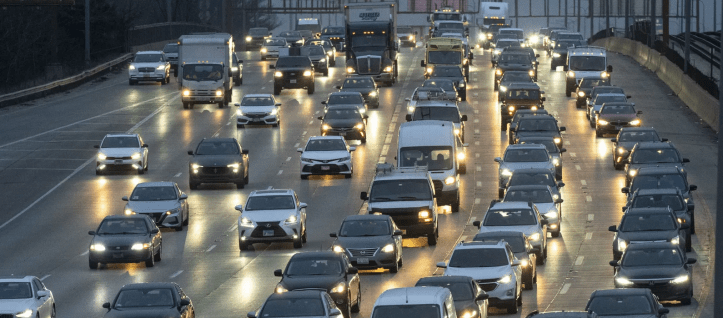
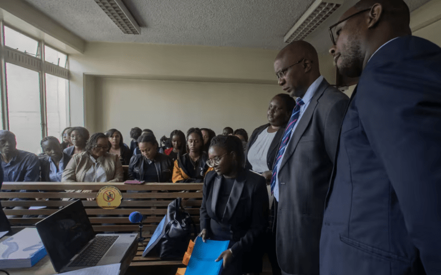
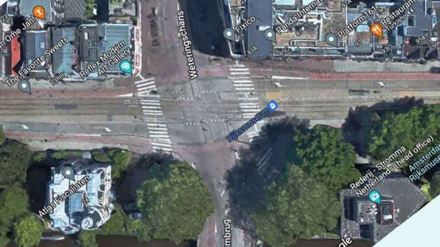
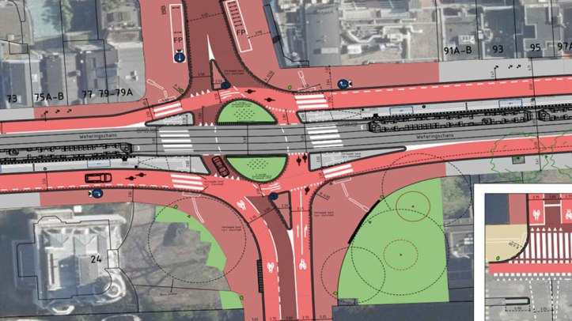

Reading Time: 20 minutes  

阅读时间：20 分钟

Photo Credit: Tyler Pasciak LaRiviere for the Chicago Sun-Times  

照片来源：Tyler Pasciak LaRiviere，芝加哥太阳时报

## “Let’s start with cars.”  

“让我们从汽车开始。”

My students break out into groups of four, each quartet gathered around a collection of pink and green post-it notes.  

我的学生分成四人一组，每个四人小组围绕着一堆粉色和绿色的便利贴。

For the first few minutes, the room remains quiet while each student jots down a personal story about one way that cars have impacted their lives.  

在最初的几分钟里，教室保持安静，每个学生都在写下一个关于汽车如何影响他们生活的个人故事。  

As the students finish and begin to read their stories to each other, the air fills with the gentle hum of conversation.  

随着学生们完成并开始互相朗读他们的故事，空气中充满了轻柔的交谈声。

The first quartet to finish their discussion approaches the whiteboard.  

第一组完成讨论后走向白板。  

Two of their post-its share a theme: stories about a car getting a family member to the hospital quickly.  

他们的两个便签有一个共同主题：关于一辆车迅速将家庭成员送到医院的故事。  

Those post-its get placed on the whiteboard together.  

那些便签被放在白板上。  

The other two stories—one about working at a car wash as a teenager, the other about getting hit by a car turning right on red while cycling through an intersection—go to different respective whiteboard locations.  

另外两个故事——一个是关于青少年在洗车店工作的，另一个是关于在骑自行车穿过十字路口时被右转红灯的汽车撞到——分别放在不同的白板位置。

More groups approach the board and attach their post-its.  

更多小组接近白板并贴上他们的便签。  

Stories under the same theme go together, creating several little collections.  

同一主题的故事汇聚在一起，形成几个小合集。  

Each collection tends to have one color of post-it (green for perceived positive impact, pink for perceived negative impact).  

每个集合通常有一种颜色的便签（绿色表示感知的积极影响，粉色表示感知的消极影响）。  

A few cases have mixed colors: for example, a few additional post-its join the one about working at a car wash.  

有几个案例混合了颜色：例如，几个额外的便签与关于在洗车店工作的便签一起。  

In the next step, when I ask students to students label each collection, this grouping will receive the label “car-related jobs.” Students either loved or hated the jobs.  

在下一步，当我要求学生给每个集合贴标签时，这个分组将被标记为“与汽车相关的工作”。学生们要么喜欢这些工作，要么讨厌这些工作。

For homework, I ask the students to do two things.  

作为作业，我要求学生做两件事。  

First, they add digital versions of their post-its to an enormous Google slide, grouped together and labeled just like our whiteboard.  

首先，他们将数字版本的便签添加到一个巨大的 Google 幻灯片中，像我们的白板一样分组并标记。  

Second, they collect more car-related stories from three sources:  

其次，他们从三个来源收集更多与汽车相关的故事：

-   Their own experiences: 2 more posit-its  
    
    他们自己的经历：再两个便利贴
-   Two additional friends or family members: 2 more post-its  
    
    两个额外的朋友或家人：2 个额外的便签
-   A Twitter hashtag—a different one selected by each student from a list that I predicted would broaden the range of perspectives beyond those available inside the classroom.  
    
    一个 Twitter 标签——每个学生从我预测的列表中选择一个不同的标签，以拓宽课堂内可用视角的范围。  
    
    The hashtags bring in the anecdotes of mechanics, cyclists, pedestrians, traffic engineers, pulmonologists, and a variety of other groups.  
    
    这些标签汇集了机械师、骑自行车的人、行人、交通工程师、肺病专家以及其他各种群体的轶事。  
    
    Again, 2 more post-its.  
    
    再来两个便签。

By the next class period, the Google slide’s septupled post-it population includes several more groups, which we finish labeling together.  

到下节课时，Google 幻灯片的便签数量增加了七倍，包含了几个更多的小组，我们一起完成了标记。  

Our original list includes car-related jobs, emergency medical transport, cycling accidents, parking costs, noise.  

我们的原始列表包括与汽车相关的工作、紧急医疗运输、骑行事故、停车费用、噪音。  

Now we add several more: pollution, storefront visibility, status symbols, child safety, travel time, carbon footprint, and others.  

现在我们再添加几个：污染、店面可见性、地位象征、儿童安全、旅行时间、碳足迹等。

Next, I offer each student an unlimited number of three types of emojis:  

接下来，我为每位学生提供无限数量的三种类型的表情符号：

-   A small fire for “consequences”  
    
    小火灾的“后果”
-   A human silhouette for “prevalence”  
    
    “流行率”的人类轮廓
-   A snake for “sneakiness”  
    
    一条蛇代表“偷偷摸摸”

I ask each student to place the fire emoji next to each label for which the outcomes sound dire to them: most students put these, for example, on the labels with obvious and immediate life or death outcomes.  

我要求每位学生在每个标签旁边放置火焰表情符号，以表示这些结果对他们来说听起来很严重：大多数学生将这些放在明显和直接涉及生死结果的标签上。  

Similarly, they apply the silhouette sticker next to labels that they think affect a lot of people, and the snake next to labels that they think people might not notice or think about relative to the size of the outcome.  

同样，他们在认为会影响很多人的标签旁边贴上轮廓贴纸，而在认为人们可能不会注意或考虑到结果大小的标签旁边贴上蛇形贴纸。

We’re doing an impact assessment not unlike the risk assessments I ask of students in software engineering classes.  

我们正在进行一项影响评估，这与我在软件工程课程中要求学生进行的风险评估类似。  

This class, though, focuses not on code, but on _what code does to Us_—and on how we, its authors, can evaluate and influence that.  

这个课程关注的不是代码，而是代码对我们的影响——以及我们作为作者如何评估和影响这一点。

The next homework assignment lets each student select a different category label from the slide.  

下一个作业让每个学生从幻灯片中选择一个不同的类别标签。  

They’ll each do some research and come back with a short report comparing the class’s emojified impact assessments to actual literature and findings.  

他们每个人都会进行一些研究，并带回一份简短的报告，将班级的表情符号影响评估与实际文献和发现进行比较。  

Where are we accurate? Where do our estimates _not_ match the information students find?  

我们在哪些方面是准确的？我们的估计与学生找到的信息在哪些方面不匹配？

## Over the course of the nine week quarter, we do this three-session activity three times.  

在为期九周的学期中，我们进行这个三节课的活动三次。

Each time we start from our own anecdotes, then broaden our search to additional perspectives, and finally compare our own assessments to population data and available studies.  

每次我们都从自己的轶事开始，然后扩大搜索到其他视角，最后将自己的评估与人口数据和可用研究进行比较。  

First, we discuss the impact of cars. Then, we discuss the impact of the consumer internet.  

首先，我们讨论汽车的影响。然后，我们讨论消费互联网的影响。  

Finally, we do generative text and image models—in other words, the thing colloquially termed “AI.”  

最后，我们做生成文本和图像模型——换句话说，就是通常所称的“人工智能”。

Three times sounds like overkill, but I have found that the prior practice on less nascent, hotly contested developments like cars and the internet helps defuse conflict on the third topic.  

三次听起来有些过分，但我发现之前在汽车和互联网等较成熟、竞争激烈的发展上的实践有助于缓解第三个主题的冲突。  

After we do the internet, I ask students to reflect on the patterns of impact they’ve seen across the car and internet discussions.  

在我们进行互联网讨论后，我让学生反思他们在汽车和互联网讨论中看到的影响模式。  

Their comparisons draw out some common themes:  

他们的比较揭示了一些共同主题：

-   Both cars and the internet boast some excellent anecdotal outcomes in isolated cases.  
    
    汽车和互联网在个别案例中都有一些优秀的轶事结果。
-   Both cars and the internet boast some positive outcomes for millions.  
    
    汽车和互联网为数百万人的生活带来了积极的影响。
-   Both cars and the internet have produced negative outcomes that affect a lot of the same people who experience the positive outcomes, plus some collection more.  
    
    汽车和互联网都产生了负面结果，这些结果影响了许多经历过积极结果的人，以及一些其他人。
-   Many of the negative outcomes emerge from failure to predict and implement against _emergent_ properties of the technologies becoming popular and widely accessible.  
    
    许多负面结果源于未能预测和应对日益普及和广泛可及的技术的突现特性。
-   The _direst_ consequences often affect different people than the most glittery benefits, and those divisions tend to break along class lines.  
    
    最严重的后果往往影响到与最光鲜的利益不同的人，而这些分歧往往沿着阶级界限划分。

I _also_ ask students to reflect on the patterns they witness in the _difference_ between their impact assessments before and after their research projects.  

我还要求学生反思他们在研究项目前后影响评估之间所见的模式。  

Again, common themes arise:  

再次出现共同主题：

-   Students tend to _overestimate_ the _proportion_ of the population that experiences the positive outcomes relative to the negative outcomes (worth noting here that the opportunity to participate in a graduate program tends to select for class).  
    
    学生往往高估经历积极结果的人口比例相对于经历消极结果的人口比例（值得注意的是，参与研究生项目的机会往往会选择特定的阶层）。
-   Students tend to drastically overindex on their own experience when estimating the impact (positive _or_ negative) of a technology on any given life globally.  
    
    学生在估计某项技术对全球任何生活的影响（正面或负面）时，往往会极大地高估自己的经验。
-   When faced with an explicit menu of positive and negative impacts, students tend to rapidly identify new-to-them opportunities to retain positive outcomes while reducing or eliminating negative outcomes.  
    
    当面临明确的正面和负面影响菜单时，学生往往能够迅速识别出新的机会，以保留积极结果，同时减少或消除负面结果。

When I then tell students we’re about to do this exercise a third time for “AI,” they approach with curiosity.  

当我告诉学生我们即将进行第三次关于“人工智能”的练习时，他们带着好奇心走过来。  

They wonder whether the patterns they’ve observed will appear again.  

他们想知道他们观察到的模式是否会再次出现。  

They hope to beat their prior collective accuracy at assessing impact in each category label.  

他们希望在评估每个类别标签的影响时超越之前的集体准确性。

A student displayed this map—found [in this article](https://studentwork.prattsi.org/infovis/visualization/the-disparity-in-access-to-the-internet-a-world-overview/) from [this data source](https://ourworldindata.org/internet)—while comparing their findings to class estimates about the internet’s impact on job networking opportunities.  

一名学生展示了这张地图——在这个数据来源的文章中找到——同时将他们的发现与课堂对互联网对就业网络机会影响的估计进行比较。  

They concluded that _the pattern of WHO could access these networking opportunities_ might look less evenly distributed than they initially assumed, and they also noted the correlation between darkness of hue on this map and population in our classroom from various countries.  

他们得出结论，世界卫生组织能够获取这些网络机会的模式可能看起来没有他们最初假设的那么均匀分布，他们还注意到这张地图上颜色深浅与我们教室中来自不同国家的人口之间的相关性。

## A few weeks ago, my day job hosted a training about ChatGPT.  

几周前，我的日常工作举办了一次关于ChatGPT的培训。

Members of the company expressed both wanton excitement and deep concern about the normalization of its use in the workplace.  

公司成员对其在工作场所使用的正常化表达了既兴奋又深切的担忧。

Afterwards, a colleague of mine asked me about the discussion.  

之后，我的一位同事问我关于讨论的情况。  

He’d been using the products since GPT-2 in 2019, and he really enjoys them.  

他自 2019 年使用 GPT-2 以来一直在使用这些产品，并且他非常喜欢它们。  

He wanted to know: “outside of speculating net benefit, why so many concerns with Gen AI?  

他想知道：“除了推测净收益，为什么对生成性人工智能有这么多担忧？”  

And what are they?”  

它们是什么？

Then he shared an anecdote: the chatbot had helped his wife uncover the root of some health issues she was having that were otherwise terminal (_sic_). He also described really enjoying using ChatGPT, personally.  

然后他分享了一个轶事：聊天机器人帮助他的妻子找到了她一些健康问题的根源，这些问题在其他情况下可能是致命的（原文如此）。他还描述了自己非常喜欢使用ChatGPT。  

From his perspective, sure, there are environmental concerns and social problems with oppression, but these don’t overwhelm the positives.  

从他的角度来看，当然，存在环境问题和社会压迫问题，但这些并没有压倒积极的一面。

We talked about the topic for a while.  

我们谈论了这个话题一段时间。

## Full disclosure: I don’t think “net impact” makes sense to estimate at scale.  

完全披露：我认为“净影响”在大规模估算时没有意义。

I understand why businesses like to calculate this.  

我理解为什么企业喜欢计算这个。  

They want to compare cost to revenue to figure out whether they’ll have more money or less money as a result of building their product.  

他们想比较成本与收入，以确定构建产品后他们会有更多的钱还是更少的钱。  

But besides a particular, well-circumscribed set of individuals deciding whether a project lives or dies, I don’t have much use for the calculation beyond philosophical navel-gazing.  

但除了一个特定的、界定明确的个体群体决定一个项目的生死之外，我对这种计算没有太多实际用途，除了哲学上的自我反思。

How could we possibly approach an accurate estimate? We’re not just talking about _money_ here: we’re talking about _general impact._ That amount doesn’t come in a convenient, single numerical unit.  

我们如何才能接近一个准确的估计？我们谈的不仅仅是金钱：我们还在谈论整体影响。这个数额并不是以一个方便的单一数字单位出现的。  

It’s instead delivered in a million different currencies, from health to ecstasy to money to misery.  

它以一百万种不同的货币传递，从健康到狂喜，从金钱到痛苦。  

You can’t convert these into like metrics.  

您无法将这些转换为类似的度量。

And we don’t get to scope our analysis to a relatively homogeneous customer base like companies get to do.  

我们无法将分析范围限制在相对同质的客户群体上，就像公司可以做到的那样。  

_Global impact_, by definition, includes everyone, and it taunts us with the question “impact _to whom?_” It ain’t as small a world as the specious aphorism claims. Most of us live within ten miles of neighborhoods in which no one thinks like us, and we’ve never had a single person from there over for board game night, and we never will.  

全球影响，按定义包括每一个人，它向我们提出了“影响谁？”的问题。这个世界并不像那些虚假的格言所声称的那样小。我们大多数人生活在距离我们十英里以内的社区，在那里没有人和我们有相同的想法，我们从未邀请过那里的任何人来参加棋盘游戏之夜，也永远不会。  

By traveling twelve thousand miles east or west, most of us can find ourselves in a land whose language we can’t even begin to comprehend, whose cultural customs would tie us in knots, and whose celebrities we’ve never heard of.  

通过向东或向西旅行一万二千英里，我们大多数人会发现自己身处一个我们无法理解其语言的地方，那里文化习俗会让我们感到困惑，而我们从未听说过的名人。  

The mini-worlds into which we isolate by building networks of people _like_ ourselves—_those_ worlds are small. THE world?  

我们通过建立与自己相似的人际网络而孤立的迷你世界——这些世界是微小的。真正的世界呢？  

Enormous, and capable of absorbing a kaleidoscope of impact patterns whose news will never, ever reach us.  

巨大的，能够吸收各种冲击模式的万花筒，其消息永远不会传达到我们这里。

I don’t ask my students to decide whether the arrival of cars, or the internet, or generative models were good or bad for society.  

我不要求我的学生判断汽车、互联网或生成模型的到来对社会是好是坏。  

In fact, I want them to reach the conclusion that they’re wholly unqualified to do so.  

事实上，我希望他们得出结论，认为他们完全没有资格这样做。  

I watch them discover the patterns of inaccuracy in their assumptions about impact.  

我观察他们发现关于影响的假设中不准确性的模式。  

Then I watch them look at their post-it maps and brainstorm ways to _improve_ the net impact regardless of where the navel-gazing lands on its current value.  

然后我看着他们查看他们的便签地图，并集思广益，寻找改善净影响的方法，无论自我反思在其当前价值上落在哪里。  

For me, this is enough.  

对我来说，这就足够了。

But for folks who have spent years in industry, hounded by executives to consider the bottom line first and foremost, I understand the motivation to peg a theoretical impact number relative to zero.  

但对于那些在行业中工作了多年的人士来说，他们被高管们不断催促首先考虑底线，我理解将理论影响数字相对于零进行定位的动机。  

My conversation with my colleague starts there.  

我与同事的对话从那里开始。

## We begin, like the students, 135 years before ChatGPT: with cars.  

我们开始，像学生一样，在ChatGPT之前的 135 年：从汽车开始。

A car permits someone, my colleague notes, to be driven to the hospital when found in critical condition an unreachable by an ambulance.  

一辆车可以让人，在我同事的观察下，在危急情况下被送往医院，而救护车无法到达。  

It’s true that cars allow individuals to drive other individuals to hospitals.  

确实，汽车可以让个人将其他个人送往医院。  

I’d place this among the “excellent anecdotal outcomes” students notice in their assessments.  

我会将此归类为学生在评估中注意到的“优秀轶事结果”。  

Along with that, the annual death toll of car crashes in the US alone—that “same people who experience the positive outcomes, plus some collection more” group that my students identify—is in the tens of thousands.  

此外，仅在美国，汽车事故的年死亡人数——我学生所识别的“经历积极结果的同一群体，加上一些更多的人”——达到了数万人。  

This does not count pedestrian deaths or cyclist deaths: just people _in_ cars.  

这不包括行人死亡或骑自行车者死亡：仅指汽车内的人。  

Then there are deaths caused by comorbidities with asthma, whose rates have risen due to pollution from vehicle exhaust. A dire outcome, and one that affects many who live in polluted areas and without the financial resources to access a car themselves.  

然后，由于与哮喘相关的合并症导致的死亡率因车辆排放的污染而上升。这是一个严重的结果，影响了许多生活在污染地区且没有经济能力自己拥有汽车的人。  

“Okay,” my colleague concedes, “but what about the distribution of food and access to information?” A fair point.  

“好吧，”我的同事承认，“但是食物的分配和获取信息呢？”这是一个合理的观点。  

As it happens, most commercial freight travels by train or ship or semi-truck, not cars.  

实际上，大多数商业货物是通过火车、船或半挂车运输的，而不是汽车。  

But then, of course, what about the drive to the grocery store?  

但当然，去杂货店的路呢？  

That last leg requires a car, doesn’t it? For some, yes. For others, no.  

最后一段路需要车，对吗？对某些人来说，是的。对其他人来说，不是。  

For still others living in food deserts, the answer might be yes if they had the resources to access a car, which again, many don’t.  

对于仍然生活在食品沙漠中的其他人来说，如果他们有资源获得一辆车，答案可能是肯定的，但很多人并没有。

Reluctant to get too deep in the weeds and lose the original thread, we move on to discussing the impact of the internet.  

不愿意深入细节而失去原有的主题，我们继续讨论互联网的影响。  

I like this example because often folks discuss the value of generative models, not in terms of what they can do right now, but in terms of what they theoretically should be able to do 30 years from now.  

我喜欢这个例子，因为人们常常讨论生成模型的价值，不是从它们现在能做什么的角度，而是从它们理论上在 30 年后应该能够做什么的角度。  

The consumer internet is a little over 30 years old and aptly demonstrates the ambiguity of attempted impact calculations.  

消费互联网已经有超过 30 年的历史，恰当地展示了影响计算尝试的模糊性。

I ask my colleague if the internet has improved the world.  

我问我的同事互联网是否改善了世界。  

He replies “You and I are talking right now using it, so yes.” I point out “you and me.  

他回答说：“你和我现在正在使用它，所以是的。”我指出：“你和我。”  

The top 2% of privilege.  

特权的前 2%。  

How many have the opportunity to interact like this?” The official number, as of this writing: [5.35 billion](https://www.forbes.com/home-improvement/internet/internet-statistics/#:~:text=There%20are%205.35%20billion%20internet%20users%20worldwide.&text=Out%20of%20the%20nearly%208,the%20internet%2C%20according%20to%20Statista.).  

有多少人有机会像这样互动？”截至目前的官方数字：53.5 亿。  

That’s about two-thirds of the population, officially; I couldn’t find definitive details on what amount of activity constitutes using the internet, nor what the network strength distribution looks like over those people.  

这大约是官方统计的三分之二的人口；我无法找到关于什么活动构成使用互联网的确切细节，也不知道这些人中网络强度的分布情况。

It’s worth noting that we (myself included), people reading this, generally consider the existence of the internet to be a well-received development.  

值得注意的是，我们（包括我自己）以及阅读此文的人，通常认为互联网的存在是一个受到欢迎的发展。  

It’s also worth noting that our impression comes from personal reference and survivorship bias.  

值得注意的是，我们的印象来自个人参考和生存偏差。  

For us to hear someone’s opinion on this, they have to either have access to the internet, or they have to have a relationship to us (which means, given that we have access to the internet and given that we network extremely homogeneously, they almost certainly have access to the internet).  

为了让我们听到某人的意见，他们必须要么能够上网，要么与我们有关系（这意味着，考虑到我们可以上网，并且我们网络非常同质化，他们几乎可以肯定能够上网）。

I’m not saying kill the internet and live on subsistence farms, which is what my colleague accused me of next.  

我并不是说要关闭互联网，过上自给自足的农场生活，这正是我的同事接下来指责我的。  

It’s just that, for a software engineer to estimate a global 30 year positive impact for a nascent technology because that person has had a positive _individual_ experience with the technology, doesn’t mean a lot. _This_ is a key takeaway for my students from the estimation exercise.  

对于一名软件工程师来说，仅仅因为他对一项新兴技术有过积极的个人体验，就估计该技术在全球范围内的 30 年积极影响，这并没有太大意义。这是我从估算练习中给学生们的一个关键启示。  

During both the hashtag part and also the research project part, they tend to learn about impacts of cars, the internet, and generative models that they had no idea existed.  

在标签部分和研究项目部分，他们倾向于了解汽车、互联网和他们之前不知道存在的生成模型的影响。  

They tend to conclude—this is my _favorite part—_that they might not be in the best position, based on their current knowledge and perspective, to estimate the technology’s global impact.  

他们倾向于得出结论——这是我最喜欢的部分——基于他们当前的知识和视角，他们可能并不处于最佳位置来评估该技术的全球影响。  

They also tend to conclude that _they_ are more likely to see and experience many of the _benefits_ while avoiding, and even remaining oblivious to, some of the costs.  

他们还倾向于得出结论，认为他们更有可能看到和体验许多好处，同时避免，甚至对一些成本保持无知。

Mercy Mutemi and fellow counsel during a virtual pre-trial consultation in April 2023.  

梅西·穆特米和同事在 2023 年 4 月的虚拟审前咨询中。  

Mutemi represents a collection of content moderators bringing a class action lawsuit against Meta and outsource company Sama for mistreatment of workers hired to filter gruesome content off of Facebook.  

Mutemi 代表一群内容审核员对 Meta 和外包公司 Sama 提起集体诉讼，指控其对雇佣的员工在 Facebook 上过滤血腥内容时的虐待。  

Facebook users rarely have to confront the existence of these roles because they never see the gruesome content.  

Facebook 用户很少需要面对这些角色的存在，因为他们从未看到这些可怕的内容。  

Image from [this article.](https://www.ft.com/content/afeb56f2-9ba5-4103-890d-91291aea4caa)  

本文中的图片。

## When we reached the topic of generative models, my colleague put it this way:  

当我们谈到生成模型的话题时，我的同事是这样说的：

“If I distribute the environmental impact to every human being, and then measure the net positive of Gen AI for that individual, given that so much of the world doesn’t even have access to that technology let alone cars, I can see where it’s definitely a net negative.”  

“如果我将环境影响分配给每一个人，然后衡量生成性人工智能对该个体的净正面影响，考虑到世界上有如此多的人甚至无法接触到这项技术，更不用说汽车，我可以看到这绝对是一个净负面。”

Again, setting aside attempts to estimate global net impact, what impacts _do_ we know about from generative models?  

再者，撇开对全球净影响的估计尝试，我们知道生成模型带来了哪些影响？  

We know that they bring joy to many who can afford a license and chat to them regularly.  

我们知道，他们给许多能够负担许可证并定期与他们聊天的人带来了快乐。  

We know that thousands of content creators applaud them as a tool for brainstorming (and many, it must be said, outright print and distribute designs generated entirely by the models).  

我们知道成千上万的内容创作者称赞它们作为头脑风暴的工具（而且必须说，许多人完全打印并分发由模型生成的设计）。  

We know that the models offer assistance to folks who need to write documents in English for work, who speak English as a second language, or who struggle with writing.  

我们知道，这些模型为需要用英语撰写工作文件的人、以英语为第二语言的人或在写作上有困难的人提供帮助。

We also know that the model creators’ unfettered use of copyright material without creators’ consent constitutes outright thievery.  

我们也知道，模型创作者在未获得创作者同意的情况下不受限制地使用版权材料构成了彻底的盗窃。  

The environmental impact of these models, climate scientists agree, drives us toward catastrophe.  

这些模型的环境影响，气候科学家一致认为，正将我们推向灾难。  

OpenAI’s exploitation of global south labor at a wage of two cents per hour, only to turn around and take ten billion from Microsoft, clearly consolidates global wealth to, basically, 1-3 dudes.  

OpenAI 对全球南方劳动力的剥削，工资仅为每小时两美分，却从微软那里获得十亿美元，显然将全球财富基本集中在 1-3 个人手中。  

 

Our ethical struggle with generative models derives in part from the fact that we…sort of can’t _have_ them ethically, right now, to be honest. We have known _how_ to build models like this for a long time, but we did not have the necessary volume of parseable data available until recently—and even then, to get it, companies have to plunder the internet.  

我们与生成模型的伦理斗争部分源于这样一个事实：说实话，我们现在…有点无法在伦理上拥有它们。我们早就知道如何构建这样的模型，但直到最近，我们才有足够的可解析数据可用——即便如此，企业也必须掠夺互联网才能获得这些数据。  

Sitting around and waiting for _consent_ from all the parties that _wrote_ on the internet over the past thirty years probably didn’t even cross Sam Altman’s mind.  

坐在那里等待过去三十年在互联网上发表意见的所有各方的同意，可能连萨姆·阿尔特曼的脑海中都没有出现过。  

But also, I can tell you, based on numbers I have seen as an engineer at a company that asks for user consent before changing almost anything, it wouldn’t work.  

但我也可以告诉你，根据我作为一名工程师在一家在更改几乎任何内容之前要求用户同意的公司看到的数字，这样做是行不通的。  

Too many people would say no. The project _would not obtain sufficient consenters_ for companies to have enough data to build generative models.  

太多人会说不。该项目将无法获得足够的同意者，使公司拥有足够的数据来构建生成模型。

On the environmental front, fans of generative model technology insist that _eventually_ we’ll possess sufficiently efficient compute power to train and run these models without the massive carbon footprint.  

在环境方面，生成模型技术的支持者坚持认为，最终我们将拥有足够高效的计算能力来训练和运行这些模型，而不会产生巨大的碳足迹。  

That is not the case at the moment, and [we don’t have a concrete timeline for it](https://www.reddit.com/r/hardware/comments/11x37u9/revisiting_moores_law_was_supposed_to_be_dead_in/). Again, _wait around for a thing we don’t have yet_ doesn’t appeal to investors or executives.  

目前情况并非如此，我们也没有具体的时间表。再次强调，等待我们尚未拥有的东西对投资者或高管并没有吸引力。

The exploitation part is unfortunately a time-honored tradition in global enterprise.  

剥削部分不幸地是全球企业中的一种悠久传统。  

The tech industry specifically gets away with new and more atrocious versions all the time by dint of creating things that regulatory bodies have never seen, let alone regulated.  

科技行业通过创造监管机构从未见过的事物，甚至未曾监管的事物，时常逃避责任，推出新的、更糟糕的版本。  

Tech companies move quickly; regulatory bodies move slowly. It took the Sherman Anti-Trust Act [almost fifteen years to catch up to Google](https://www.wheresyoured.at/monopoly-money/), and the _sentence_ from that ruling is expected to take _another_ 3-5 years.  

科技公司行动迅速；监管机构行动缓慢。谢尔曼反托拉斯法案花了近十五年才追上谷歌，而该裁决的判决预计还需要 3-5 年。  

I understand, and even agree with, calls to regulate what folks have named the AI industry.  

我理解，并且甚至同意对人们所称的人工智能行业进行监管的呼声。  

But gurl, that will not be a quick process.  

但是，女孩，这将不是一个快速的过程。

The invention of the automobile offers prescient precedent here.  

汽车的发明在这里提供了先见之明的先例。  

Though it’s hard to argue against the utility of cars to those that can access them, emergent developments after their introduction dragged the “net impact” meter down.  

尽管很难反驳汽车对能够使用它们的人的实用性，但在它们引入后的新兴发展使“净影响”指标下降。  

The United States built cities around the assumption that _everyone_ had a car. This forced residents to _depend_ on them—a situation we compare disfavorably to life in cities with reliable transit, bicycle infrastructure, and pedestrian options.  

美国在假设每个人都有车的基础上建造了城市。这迫使居民依赖汽车——这种情况与拥有可靠公共交通、自行车基础设施和步行选择的城市生活相比，显得不那么理想。  

 As cars got bigger, survival in car crashes favored the larger car, resulting in a car size arms race.  

随着汽车变得越来越大，汽车碰撞中的生存更倾向于较大的汽车，导致了汽车尺寸的军备竞赛。  

_Could we_ have done all this in a better way, that better leveraged cars for positive impact while avoiding some of the negative emergent properties?  

我们是否可以以更好的方式完成这一切，更好地利用汽车带来积极影响，同时避免一些负面的涌现特性？  

I’d like to believe we could have.   

我想相信我们可以。

A busy intersection in Amsterdam received a redesign in 2023 (you can drag the white vertical separator left and right to compare the before and after).  

阿姆斯特丹一个繁忙的交叉口在 2023 年进行了重新设计（您可以左右拖动白色垂直分隔线以比较前后）。  

The new version dedicates space for bicycles and pedestrians, while converting the car section to a roundabout structure with crossings for the transit trolleys.  

新版本为自行车和行人留出了空间，同时将汽车部分改为环形交叉结构，并设有通行电车的过道。  

The redesign achieves higher throughput of people at rush hour and dispenses with the need for a lot of traffic signals.  

重新设计在高峰时段实现了更高的人流通量，并且不再需要大量的交通信号灯。  

Images from this article: [https://bicycledutch.wordpress.com/2024/01/31/cycling-in-amsterdam-watch-the-traffic-flow-at-a-transformed-busy-intersection/](https://bicycledutch.wordpress.com/2024/01/31/cycling-in-amsterdam-watch-the-traffic-flow-at-a-transformed-busy-intersection/)  

来自本文的图片：https://bicycledutch.wordpress.com/2024/01/31/cycling-in-amsterdam-watch-the-traffic-flow-at-a-transformed-busy-intersection/

_Could_ we theoretically improve the net benefit of any given technical development today if we make efforts to maximize its positive outcomes and mitigate its negative ones?  

我们是否可以理论上提高今天任何特定技术发展的净收益，如果我们努力最大化其积极成果并减轻其负面影响？  

I believe so, and I believe that’s basically the option available to us.  

我相信是这样，我认为这基本上是我们可用的选项。

## Fine, Chelsea; you want us all to abandon modernity, live in huts, and gather berries?  

好吧，切尔西；你想让我们都放弃现代生活，住在小屋里，采集浆果？

Jesus, guys, we’ve been over this.  

耶稣，伙计们，我们已经讨论过这个了。  

Crying luddism every time somebody critiques your pet thing is a super weird look.  

每当有人批评你心爱的事物时，哭泣的反技术主义是一种非常奇怪的表现。

I _do_ want practitioners to do three things.  

我确实希望从业者做三件事。

**1.  

I want people to recognize and acknowledge the massive difference between “what this thing has done for me” and “what this thing is doing for everyone.”  

我希望人们能够认识到“这个东西为我做了什么”和“这个东西为每个人做了什么”之间的巨大差异。**

I think the internet has made life better _for me_. I am immensely grateful for that. I work at Mozilla because I believe in the internet and I _want_ to maximize its positive impact.  

我认为互联网让我的生活变得更好。我对此非常感激。我在 Mozilla 工作，因为我相信互联网，并希望最大化它的积极影响。  

I think it’s okay to acknowledge that just because something was good for _me_ doesn’t mean it saved the world.  

我认为承认某件事对我有好处并不意味着它拯救了世界是可以的。  

GenAI saved my colleague’s wife’s life (or, I’d argue, his wife used a tool in a positive way to save her own life).  

GenAI 拯救了我同事妻子的生命（或者，我认为，是他的妻子以积极的方式使用了一种工具来拯救自己的生命）。  

It’s reasonable for him to believe in it. I am _grateful_ that they had it available to do that.  

他相信这一点是合理的。我很感激他们有这个可供使用。  

That’s different from calling it a global net positive, and that’s okay.   

这与称其为全球净正面不同，这没关系。

**2.  

I want people to think about “net impact” in a more nuanced, complex way than product net revenue.  

我希望人们以比产品净收入更细致、复杂的方式思考“净影响”。**

The emergent outcomes of a technical shift on the entirety of global society cannot be reduced to the same mathematics we use to decide if a widget made a profit.  

技术转变对全球社会整体的突发结果无法简化为我们用来判断一个小工具是否盈利的相同数学。  

I don’t think we have to start huge; I have my students start with personal anecdotes and then broaden from there.  

我认为我们不必一开始就做得很大；我让我的学生从个人轶事开始，然后再逐步扩展。  

The approach I use for them is abbreviated, a little hamfisted, and certainly imperfect.  

我对他们采用的方法是简化的，有些笨拙，当然也不完美。  

But it captures more nuance than we often do when we make a gut estimate about whether a development was good for the world.  

但它捕捉到了比我们在直觉估计某项发展是否对世界有利时更细微的差别。  

I’d like to see engineering practitioners more regularly engage in a practice of organized, collective investigation and reflection.  

我希望工程从业者能够更定期地参与有组织的集体调查和反思的实践。

**3\. I want people to arrive, not at an estimate of net impact, but at a set of ideas for _improving_ that net impact.  

我希望人们得出的不是净影响的估计，而是一套改善净影响的想法。**

This is what I think is within our purview to execute against anyway.  

这就是我认为在我们执行范围内的事情。  

The last time I did this exercise I watched students arrive, unprompted, at a long and varied list of ideas for how they might shape a future with generative models in it.  

上一次我做这个练习时，我看到学生们自发地提出了一长串多样的想法，关于他们如何塑造一个包含生成模型的未来。  

“Can we build tools for content creators to proactively thwart their materials’ digestion by online scrapers?” “Can technical innovation permit us to minimize energy use in retraining somehow?” “What is universal basic data income, and is there any path to viability for that?” “How…how might someone like me chart a course to becoming a subject matter expert for regulation development?”  

“我们能否为内容创作者构建工具，以主动阻止在线抓取者对其材料的获取？” “技术创新能否让我们以某种方式最小化再训练的能源使用？” “什么是普遍基本数据收入，是否有可行的路径？” “我……我该如何规划成为法规开发的主题专家？”

I hope these questions inform students’ choices as practitioners in the field.  

我希望这些问题能帮助学生在该领域作为从业者做出选择。  

And I think arriving at similar questions can inform the choices of _current_ practitioners.  

我认为提出类似的问题可以为当前从业者的选择提供参考。  

It’s tempting to sit around and speculate about whether a parallel universe without <insert development here> might be better off.  

坐着猜测一个没有的平行宇宙是否会更好是很诱人的。  

But we don’t live in that universe; we live in this one.  

但我们不生活在那个宇宙；我们生活在这个宇宙。  

This universe is the one where we get to answer that question: not with navel-gazing, but with empirical evidence derived from attempts to drive change.  

这个宇宙是我们可以回答那个问题的地方：不是通过自我反思，而是通过从推动变革的尝试中获得的实证证据。

## If you liked this piece, you might also like:  

如果您喜欢这篇文章，您可能还会喜欢：

-   [The second piece in my little AI trifecta: How do we build the future with AI?  
    
    我小型人工智能三部曲中的第二部分：我们如何用人工智能构建未来？](https://chelseatroy.com/2024/06/23/how-do-we-build-the-future-with-ai/)
-   [The first piece, maybe, also: How does AI impact my job as a programmer?  
    
    第一部分，也许是：人工智能如何影响我作为程序员的工作？](https://chelseatroy.com/2024/05/26/how-does-ai-impact-my-job-as-a-programmer/)

Unless I am wrong (which I could be), I expect this post to conclude my writing on this topic for some time.  

除非我错了（我可能错了），我预计这篇文章将结束我在这个主题上的写作一段时间。  

I have other subjects I’d like to discuss here, including some interesting books I’ve read lately.  

我还有其他主题想在这里讨论，包括我最近读的一些有趣的书。  

Stay tuned for more, and if you can’t get enough, [join me on Patreon](https://www.patreon.com/heychelseatroy): I put out audio recordings of blog posts every Monday and maintain a few regular written columns.  

请继续关注更多内容，如果你还想要更多，欢迎在 Patreon 上加入我：我每周一发布博客文章的音频录音，并保持几篇定期的书面专栏。
