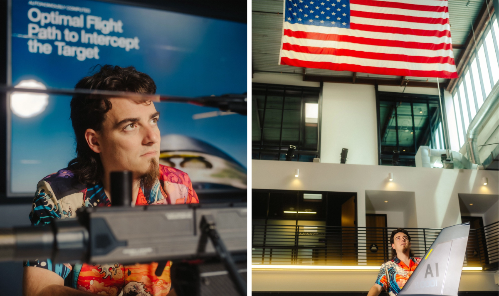
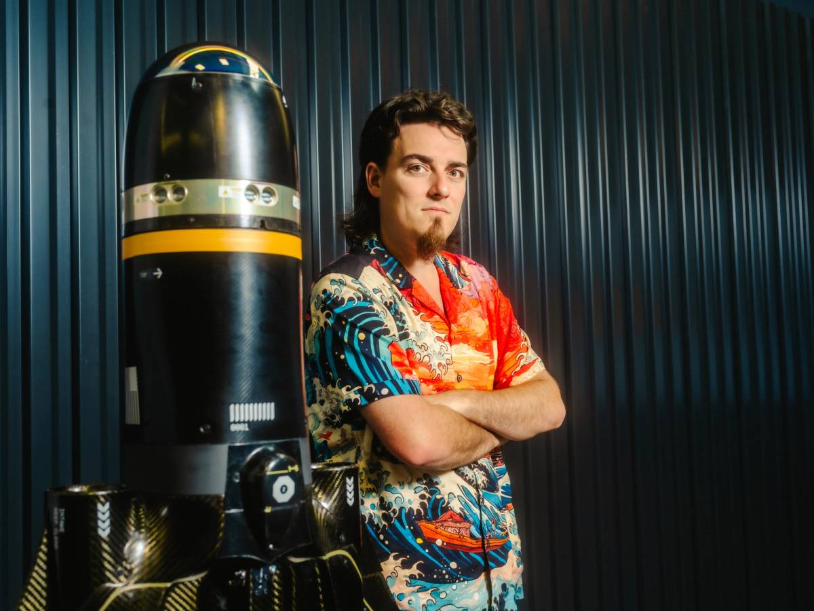

The facts of Palmer Luckey’s life are so uniquely bizarre—combining elements of fantasy with lunacy and also world-altering change—that they could be printed on magnetic poetry tiles, rearranged in an endless number of indiscriminate combinations by a drooling baby, and yet every time, still manage to convey something significant and true.  

帕尔默·拉基的生活事实是如此独特而离奇——将幻想、疯狂和改变世界的元素结合在一起——以至于它们可以印在磁性诗歌瓷砖上，由一个流口水的婴儿以无尽的随机组合重新排列，但每次仍然能够传达出某种重要而真实的东西。

Let me show you: Luckey is the owner of the world’s largest video game collection, which he keeps buried 200 feet underground in a decommissioned U.S. Air Force nuclear missile base—which is the kind of thing a man can afford to buy when he single-handedly turns virtual reality from the laughingstock of the technology industry into a multi-billion-dollar enterprise by inventing the Oculus Rift in a camper trailer parked in the driveway of his parents’ duplex in Long Beach, California, where at 19 years old he lived alone and survived on frozen burritos and Mucho Mango AriZona tea.  

让我来给你看看：Luckey 是世界上最大的电子游戏收藏的拥有者，他将这些收藏埋藏在一座废弃的美国空军核导弹基地地下 200 英尺的地方——这正是一个人能够负担得起的事情，当他凭借在加利福尼亚州长滩父母的双拼房屋车道上停放的房车中发明 Oculus Rift，将虚拟现实从科技行业的笑柄变成一个数十亿美元的企业时，他才 19 岁，独自生活，靠冷冻卷饼和 Mucho Mango AriZona 茶维生。

Or: After selling Oculus to Facebook for $2.7 billion and then getting fired by Mark Zuckerberg for making a $10,000 donation to a pro-Trump troll group dedicated to “shitposting in real life,” Luckey tried his hand at building a nonprofit private prison chain that only gets paid when ex-prisoners stay out of prison.  

或者：在以 27 亿美元将 Oculus 出售给 Facebook 后，Luckey 因向一个致力于“现实生活中发帖”的亲特朗普恶搞团体捐赠 1 万美元而被马克·扎克伯格解雇，随后他尝试建立一个非营利性私人监狱连锁，只有当前囚犯保持不再入狱时才获得报酬。  

After he decided that would require too much lobbying work, he attempted to solve the obesity epidemic by making food out of petroleum products centrifuged out of the sewer system—a perfectly delicious and low-calorie idea, he maintains, which he only ditched because of the “marketing nightmare” of persuading people to eat remanufactured sewage.  

在他决定这需要太多的游说工作后，他试图通过用从下水道系统中离心提取的石油产品制作食物来解决肥胖流行问题——他坚持认为这是一个完美美味且低热量的主意，他之所以放弃只是因为说服人们吃再制造的污水的“营销噩梦”。  

In the end, he decided instead to found Anduril Industries, a defense technology startup that makes lethal autonomous weapons systems. It is now valued at $14 billion.  

最终，他决定创办安杜里尔工业，一家制造致命自主武器系统的国防科技初创公司。现在其估值为 140 亿美元。

Another: In his spare time, when he is not providing U.S. Customs and Border Patrol with AI-powered long-range sensors, or Volodymyr Zelenskyy with drones to attack high-value Russian targets, or winning first place in the Texas Renaissance Festival’s costume contest with historically meticulous renderings of Henry VIII and Anne Boleyn sewn and stitched by his wife, Nicole—who’s been at his side for 16 of his 31 years on earth—Luckey recently built a bypass for his peripheral nervous system to experiment with giving himself superhuman reflexes; vestibular implants to pipe sounds into his skull so that instead of having to call him and wait for him to pick up, Anduril employees could just pick up a designated Palmer Phone and talk straight into his head; and a virtual reality headset that—by tying three explosive charges to a narrow-band photosensor that can detect when the screen flashes red at a specific frequency (i.e., GAME OVER)—kills you in real life when you die in a video game.  

另一个：在他的空闲时间，当他不为美国海关和边境保护局提供人工智能驱动的远程传感器，或为弗拉基米尔·泽连斯基提供无人机以攻击高价值的俄罗斯目标，或在德克萨斯文艺复兴节的服装比赛中赢得第一名，凭借他妻子妮可缝制的历史上精确还原的亨利八世和安妮·博林的服装——妮可在他 31 年生命中的 16 年里一直陪伴在他身边——拉基最近为他的周围神经系统建造了一个旁路，以实验如何给自己超人的反应能力；植入前庭装置将声音传入他的头骨，这样安杜里尔的员工就可以直接拿起指定的帕尔默电话，与他对话，而不必打电话等他接听；以及一个虚拟现实头盔——通过将三个爆炸装置绑在一个窄带光传感器上，该传感器可以检测屏幕在特定频率下闪烁红色（即“游戏结束”）——当你在视频游戏中死亡时，它会在现实生活中杀死你。

Would you like one more?  

你还想要一个吗？  

Of course you would: In his private underground workshop garage on Lido Isle in Newport Beach, California, Luckey has built an unenclosed toilet on the wall of his workspace.  

当然你会：在加利福尼亚州纽波特海滩的利多岛，他的私人地下车库工作室里，Luckey 在工作区的墙上建了一个没有围栏的厕所。  

As the transcript of our recorded conversation later confirmed, I alarmed Luckey’s press handler by becoming fixated on this toilet, repeatedly telling him that it was “awesome,” “so fucking awesome,” and “probably the coolest thing I’ve ever seen.” Luckey rescued me from this preoccupation by capering up to the second floor of his lair to show me the dance studio, the sewing room, and the traditional Japanese-style apartment he built for Nicole, who as it happened gave birth to their first child the very next day.  

根据我们录音对话的文字记录，我让 Luckey 的媒体负责人感到震惊，因为我对这个厕所产生了执念，反复告诉他它“太棒了”，“真他妈的棒”，以及“可能是我见过的最酷的东西。”Luckey 通过跳到他巢穴的二楼，带我参观舞蹈工作室、缝纫室和他为 Nicole 建造的传统日本风格公寓，救了我于这种沉迷之中，而恰好 Nicole 在第二天就生下了他们的第一个孩子。

It took me several hours of trailing Luckey—hours filled with air and sea drones, autonomous air vehicles, surveillance and electronic warfare systems currently deployed in Ukraine, a 1966 Mark V Disney Autopia, a 1,600-pound, 670-horsepower, augmented reality headset-operated Autozam AZ-1, which is wrapped in an anime decal of the character LLENN (“In the real world she is very, very tall and nobody thinks she’s cute,” he explained, “so she spends all her time in virtual reality where she can play as a very cute small girl, because that’s what she in her heart wants to be”)—to understand that my monomania for the exposed toilet was just the normal person’s relief at the sight of something ordinary in the fulminating life-world of Palmer Luckey.  

我花了几个小时跟踪 Luckey——这些小时充满了空中和海洋无人机、在乌克兰部署的自主空中载具、监视和电子战系统、1966 年马克五号迪士尼未来世界、一个重达 1600 磅、670 马力、由增强现实头戴设备操作的 Autozam AZ-1，车身贴有动漫角色 LLENN 的贴纸（“在现实世界中，她非常非常高，没人觉得她可爱，”他解释道，“所以她把所有时间都花在虚拟现实中，在那里她可以扮演一个非常可爱的小女孩，因为那是她内心想要成为的样子”）——我才明白我对暴露厕所的单一狂热不过是普通人在 Palmer Luckey 那充满爆炸性的生活世界中看到某种平常事物时的释然。  

Aside from having a family and liking Taco Bell, toilet-use might be the only other thing we have in common.  

除了有家庭和喜欢塔可钟，使用厕所可能是我们唯一的共同点。

But if he is perhaps the wildest misfit tech diva of his generation, with a torrid ambition and engineering prowess rivaled only by Elon Musk, Luckey is also, in a way Musk is not and cannot be, the product of something more familiar—the heir to a 100-year revolution in American society that made Southern California the techno-theological citadel of the Cold War, and a one-man bridge between the smoldering American past and an unknown future that may be arriving soon.  

但如果他或许是他这一代最狂野的技术天才，拥有与埃隆·马斯克仅能相提并论的炽热雄心和工程才能，那么拉基在某种程度上也是马斯克所不是且无法成为的产物——他是美国社会百年革命的继承者，这场革命使得南加州成为冷战时期的科技神学堡垒，同时也是连接燃烧的美国过去与可能即将到来的未知未来的单人桥梁。

Which is why the magnetic poetry version of the life of Luckey that does the story justice goes more like this: Before the recent preference cascade enabling high-profile tech moguls to violate the taboo against supporting Donald Trump, there was first the lonely figure of Palmer Luckey, the homeschooled, Jules Verne-obsessed, amateur scientist with no money, whose faith in the power of technology was so strong that he worked jobs sweeping ship yards, scrubbing decks, fixing engines, repairing phones, and training to sing as a gondolier for tourists, all in order to spend his nights in a gutted 19-foot camper trailer trying to manufacture dream worlds out of breadboards and lens equipment and accelerometers and magnetometers and a soldering iron—which he did, bringing virtual reality to the masses, burning a hole in his retina with a laser, and losing it all to Zuckerberg over a meme, only to reemerge from his defrocking by Big Tech as a vengeance-seeking icon of counterelite Americana, the aspiring rebuilder of the arsenal of democracy, the black mullet-, chin beard-, Hawaiian shirt-, cargo short-, sandal-clad possible savior of America.  

这就是为什么对 Luckey 生活的磁性诗歌版本更能公正地讲述这个故事：在最近的偏好级联使高调的科技大亨们能够违反支持唐纳德·特朗普的禁忌之前，首先是孤独的帕尔默·拉基（Palmer Luckey），这个自学成才、痴迷于儒勒·凡尔纳的业余科学家，身无分文，他对科技力量的信仰如此坚定，以至于他在船厂打扫、擦洗甲板、修理引擎、修理手机，以及训练自己为游客唱歌，所有这些都是为了在一个被掏空的 19 英尺的露营拖车里度过夜晚，试图用面包板、镜头设备、加速度计、磁力计和烙铁制造梦幻世界——他做到了，将虚拟现实带给大众，用激光烧坏了自己的视网膜，并因一个表情包而失去了一切给扎克伯格，最终从大科技的剥夺中重新崛起，成为一个寻求复仇的反精英美国偶像，渴望重建民主武器库的可能拯救者，身穿黑色莫霍克发型、下巴胡须、夏威夷衬衫、 cargo 短裤和凉鞋的美国救世主。

Palmer Luckey was born in 1992 to Donald Luckey, a car salesman, and Julie Freeman Luckey, who homeschooled Palmer and his three younger sisters.  

帕尔默·拉基于 1992 年出生于汽车销售员唐纳德·拉基和家庭教育者朱莉·弗里曼·拉基的家庭，朱莉为帕尔默和他的三个妹妹提供了家庭教育。  

They lived on the bottom floor of a small multifamily home in Long Beach, at the edge of Los Angeles and Orange counties.  

他们住在洛杉矶和橙县交界处的长滩一栋小型多户住宅的底层。

This is the region to which those hundreds of thousands of Dust Bowl migrants fled after the Depression, and where many of them then spent World War II assembling radar units and guidance controls for submarines, missiles, and fighter aircraft.  

这是数十万尘土碗移民在大萧条后逃往的地区，他们中的许多人在这里度过了第二次世界大战，组装雷达单元和潜艇、导弹及战斗机的制导控制系统。  

After the war, it’s where a landscape of citrus groves and cattle ranches was transformed into a suburban sprawl of military bases, defense plants, malls, and swimming pools.  

战争结束后，这里曾是柑橘园和牧场的景观，转变为军事基地、国防工厂、购物中心和游泳池的郊区扩展。  

Fantastical American curiosities like the suburban megachurch, the neo-Pentecostal “charismatic” clinic, drive-thru restaurants, drive-in churches, and Disneyland were created here.  

奇幻的美国奇观，如郊区的大型教堂、新五旬节“魅力”诊所、汽车自取餐厅、汽车教堂和迪士尼乐园，都是在这里创造的。  

It’s where a distinctive style of dress was honed—Palmer Luckey’s style—“shorts, colorful open-necked shirts, sandals,” as an October 1945 feature in _Life_ coined it.  

这是一个独特的穿衣风格被磨练的地方——帕尔默·拉基的风格——“短裤、色彩鲜艳的开领衬衫、凉鞋，”正如 1945 年 10 月《生活》杂志的一篇特写所称。  

Here, where Luckey was born, is where the back of the patrician Northeastern Republican establishment was broken during the Cold War, and replaced by a new power base in defense, aerospace, technology, electronics, and natural resource extraction that united the Southwest with the South and the Middle West in what they called the “Sun Belt”—which propelled first Richard Nixon and then Ronald Reagan into the White House, and dominated American politics more or less until 2008.  

这里，Luckey 出生的地方，是在冷战期间，东部贵族共和党建立的后盾被打破的地方，取而代之的是一个新的权力基础，涵盖国防、航空航天、技术、电子和自然资源开采，这个基础将西南部与南部和中西部联合在一起，他们称之为“阳光带”——这推动了理查德·尼克松和随后罗纳德·里根进入白宫，并在某种程度上主导了美国政治，直到 2008 年。

The shadow of the Sun Belt—which pooled its wealth and voting power into free market and family politics, an eccentric and paranoid anticommunism, pro-Zionism, and a younger, more colorblind hyperpatriotic nationalism—can be hard to spot in the more recent California of Kamala Harris and George Clooney, and the parched corpse that passes for the region’s GOP.  

太阳带的阴影——将其财富和投票权集中于自由市场和家庭政治、古怪而偏执的反共主义、亲犹太复国主义，以及一种更年轻、更无色盲的超爱国民族主义——在卡马拉·哈里斯和乔治·克鲁尼的更近期加利福尼亚，以及被视为该地区共和党的干枯尸体中，可能很难被察觉。  

But it can be seen following Palmer Freeman Luckey, who went to church here every Sunday as a boy and grew up near the port, watching the Marine Corps practice helicopter drills and Navy ships conduct exercises right offshore, and spent his weekends building computers and coil guns, modifying video game consoles, raiding junkyards, and cannibalizing DVD burners for their laser diodes, which he used to build etching equipment.  

但可以看到，帕尔默·弗里曼·卢基（Palmer Freeman Luckey）小时候每个星期天都在这里上教堂，成长于靠近港口的地方，观看海军陆战队进行直升机演习和海军舰艇在近海进行演习，周末则用来组装电脑和电磁炮，改装游戏机，袭击废品场，拆解 DVD 刻录机以获取激光二极管，用于制造蚀刻设备。

Julie Luckey decided to homeschool her children for an uncomplicated reason: She believed all kids are different, and that no schooling system can devise a personalized education for every individual, who by definition is unique.  

朱莉·拉基决定给她的孩子们进行家庭教育，原因很简单：她相信每个孩子都是不同的，没有任何教育系统能够为每个独特的个体设计个性化的教育。  

In her son’s case, at least, the decision was vindicated.  

在她儿子的案例中，至少这个决定得到了证明。  

“These days they’d probably say I had ADD,” Luckey told me at his home in Newport Beach, sitting at his makeshift Dungeons & Dragons table littered with Sonic condiment packets, beneath the 6,500-gallon coldwater tank filled with local predatory fish he built into his white and teal living room.  

“这些天他们可能会说我有注意力缺陷障碍，”拉基在他位于纽波特海滩的家中告诉我，他坐在临时搭建的《龙与地下城》桌子旁，桌子上满是索尼克调味品包，头顶是他建在白色和青色客厅里的 6500 加仑冷水箱，里面装满了当地的掠食鱼。  

“I’d say I just had boy disorder.  

“我可以说我只是有男孩障碍。”  

But it was pretty clear that I was going to need some special attention if I was going to not just spin out of control.” When he wasn’t doing his schoolwork, Luckey liked reading Jules Verne, Neal Stephenson, and Anne McCaffrey novels, playing video games, and educating himself on electrical engineering, mechanical engineering, gas and solid-state lasers, and high-voltage power systems.  

但很明显，如果我不想失控，我需要一些特别的关注。”当他不做学校作业时，Luckey 喜欢阅读儒勒·凡尔纳、尼尔·斯蒂芬森和安妮·麦卡弗里的小说，玩视频游戏，以及自学电气工程、机械工程、气体和固态激光器以及高压电力系统。

His mother’s sense of the value of tailoring education to the uniqueness of individuals has an echo in Luckey’s love of anime, which began in early childhood—and which is clear from the room on the first floor of his home ringed with glass shelves supporting hundreds of hand-painted vinyl anime figurines, mostly of buxom girl characters.  

他母亲对根据个体独特性量身定制教育的价值的认识在拉基对动漫的热爱中得到了呼应，这种热爱始于幼年——这从他家一楼的房间可以看出，房间里环绕着玻璃架，架子上摆满了数百个手绘的乙烯基动漫 figurines，主要是丰满女孩角色。  

This animated style adapted from Japanese manga, running at a low frame rate and composed of longer fixed scenes, is very cheap—which is what gives the medium its magic, he explained.  

这种动画风格源自日本漫画，帧率较低，由较长的固定场景组成，非常便宜——这正是赋予这种媒介魔力的原因，他解释道。  

“The reason that’s so fundamental is that the extremely low cost of production is what allowed anime to become a huge, huge diversity of different genres, of different ideas.  

“这之所以如此根本，是因为极低的生产成本使得动漫能够发展出巨大的、丰富多样的不同类型和不同的创意。”  

They can say, ’We’re going to do an experiment here.  

他们可以说：“我们将在这里进行一个实验。”  

We’re going to make something for the weirdos.’”  

“我们要为那些怪人做点什么。”

One of those series was _Yu-Gi-Oh!_, which began its run in 1998, when Luckey was six.  

其中一部系列是《游戏王》，它于 1998 年开始播出，当时 Luckey 六岁。  

As a kid, his favorite character was the antihero, Seto Kaiba, an orphan adopted by the CEO of a weapons manufacturing mega-conglomerate, the Kaiba Corporation.  

作为一个孩子，他最喜欢的角色是反英雄海马濑人，一个被武器制造巨头海马公司首席执行官收养的孤儿。  

He is a brilliant computer hacker, hardware engineer, and electrical engineer, who’s always five steps ahead of everyone else.  

他是一位出色的计算机黑客、硬件工程师和电气工程师，总是比其他人领先五步。  

When his adoptive father dies, Seto Kaiba inherits the weapons manufacturing empire, and uses the money to launch a series of virtual reality video games.  

当他的养父去世时，海马濑斗继承了武器制造帝国，并利用这笔钱推出了一系列虚拟现实视频游戏。

After he pointed out the Seto Kaiba figurine sitting on a mantel behind me, I asked the obvious question: Your favorite fictional character as a little kid had a weapons manufacturing empire and built virtual reality video games?  

在他指出坐在我身后壁炉架上的海马濑人手办后，我问了一个显而易见的问题：你小时候最喜欢的虚构角色竟然有一个武器制造帝国，还制作虚拟现实视频游戏？

Luckey answered by way of a detour through the mind of Pierre-Simon Laplace, an 18th-century French mathematician.  

拉基通过 18 世纪法国数学家皮埃尔-西蒙·拉普拉斯的思维方式进行了绕道回答。

“Laplace had this thought experiment around free will and determinism where he said, imagine if you had a demon that was so powerful and so superintelligent and advanced, and so perceptive that it could perceive the entire universe all at once … If it could truly observe everything in the universe and reason at an advanced enough level—is it the case that such a being would be able to hypothetically derive everything that’s going to happen from now until the end of history in a single gigantic equation?  

“拉普拉斯有一个关于自由意志和决定论的思想实验，他说，想象一下如果你有一个如此强大、超智能和先进的恶魔，它如此敏锐，以至于能够同时感知整个宇宙……如果它真的能够观察宇宙中的一切，并在足够高级的水平上推理——那么这样的存在是否能够假设性地从现在起到历史的尽头，通过一个巨大的方程推导出将要发生的一切？”  

His point being, if such a being could even hypothetically exist, doesn’t that definitionally mean that free will is not real?”  

他的观点是，如果这样的存在甚至在假设上都可能存在，这难道不意味着自由意志实际上并不存在吗？

Laplace’s demon, Luckey explained, is the inspiration for Lattice, the AI software that powers every surveillance and weapons system Anduril Industries makes.  

拉普拉斯的恶魔，Luckey 解释道，是 Lattice 的灵感来源，这款 AI 软件为 Anduril Industries 制造的每一个监控和武器系统提供动力。  

“What does it take to build an artificial being that is perceptive enough, and sees enough of the world, and is advanced enough in its thinking that it can predict not just what’s happening now, but what’s going to happen 10 seconds from now, 10 minutes from now, 10 hours from now?  

“构建一个足够敏感、足够了解世界、思维足够先进的人工生命体需要什么，它不仅能预测现在发生的事情，还能预测 10 秒钟后、10 分钟后、10 小时后的事情？”  

If you can reliably do that, even to a statistically relevant degree, that’s a really powerful military tool.”  

如果你能可靠地做到这一点，甚至达到统计上相关的程度，那就是一个非常强大的军事工具。

“But then the second bit of Laplace’s demon is …” At this point Luckey closed his eyes for an extended period to think, a habit of his in which you can actually see his eyeballs shivering under the lids, like he’s dreaming, or been plugged into the Matrix.  

“但是拉普拉斯的恶魔的第二部分是……”此时，拉基闭上眼睛思考了很长时间，这是他的一个习惯，你可以看到他的眼球在眼睑下颤动，就像他在做梦，或者被插入了矩阵。

“I’ve always done a lot of thinking around free will and whether it exists,” he said as his eyes reopened.  

“我一直在思考自由意志是否存在，”他说，眼睛重新睁开。  

“And I’m quite concerned that I’m doing what I was programmed to do when I was 8 years old.  

“我很担心我在做我 8 岁时被编程要做的事情。”  

If you like _Yu-Gi-Oh!_ and the Power Rangers, can you really do anything except build virtual reality and tools of violence to enact your aims while feeling superior?”  

如果你喜欢游戏王和超级战队，除了构建虚拟现实和暴力工具来实现你的目标并感到优越之外，你真的还能做什么吗？

“Probably not,” he said. “You probably just have to do it.”  

“可能不行，”他说。“你可能只需要去做。”

When he was 15, Luckey started taking courses at Golden West College, and by 17, he was accepted to Cal State, Long Beach, where he decided to study journalism, figuring he could teach himself anything about technology, but required formal training to learn how to communicate more effectively with people.  

当他 15 岁时，Luckey 开始在金西学院上课，17 岁时被加州州立大学长滩分校录取，他决定学习新闻学，认为自己可以自学任何关于技术的知识，但需要正式的培训来学习如何更有效地与人沟通。  

His parents kicked him out of the house, but let him live in the halfway home of the 19-foot camper trailer parked in their driveway until he could figure out something better.  

他的父母把他赶出了家，但让他住在停在他们车道上的 19 英尺房车的中途之家，直到他能想出更好的办法。

Luckey got to work modifying the inside of the trailer to better slake his desires.  

Luckey 开始修改拖车内部，以更好地满足他的需求。  

He took out the bathroom, since there was a public restroom next to the laundromat a few blocks away.  

他把浴室拆掉了，因为洗衣店旁边几条街外有一个公共厕所。  

He also took out the kitchen, seeing as he could just bike down to Jack in the Box when he ran out of frozen burritos, which he did so often that the manager gave him a loyalty card.  

他还拆除了厨房，因为他可以骑自行车去 Jack in the Box，当他用完冷冻卷饼时，他经常这样做，以至于经理给了他一张忠诚卡。  

On one end of the gutted trailer he stuck a twin mattress on top of some boxes; on the other he installed a six-screen computer setup.  

在被拆解的拖车一端，他把一张双人床垫放在一些箱子上；另一端则安装了一个六屏电脑系统。  

In the space between, he conducted his hardware modification experiments—or “modding,” as it is known among hackers and gamers.  

在这之间，他进行了硬件改装实验——在黑客和玩家中称为“modding”。

In 2009, the 17-year-old Luckey founded an online chat forum, ModRetro, where the only other human beings on earth whose passion in life was hacking old game consoles to make them smaller and faster gathered to trade secrets and stories.  

在 2009 年，17 岁的 Luckey 创办了一个在线聊天论坛 ModRetro，地球上唯一其他热衷于破解旧游戏机以使其更小更快的人聚集在这里，交流秘密和故事。  

Luckey said the first smart thought he ever had came to him one night in the trailer after realizing that making consoles more portable could only take his desires so far.  

拉基说，他第一次聪明的想法是在一个晚上在拖车里产生的，当时他意识到让游戏机更便携只能满足他的愿望到一定程度。

“My ideological framework had been, ‘What’s the next step? How do I make my gaming PC better?  

“我的思想框架是，‘下一步是什么？我如何让我的游戏电脑更好？’”  

How do I upgrade it?’” he told me.  

“我该如何升级它？”他告诉我。  

“But then I just had this light bulb moment where I said, ‘Next step doesn’t matter. What’s the _last_ step?’ And that flipped my thinking upside down, because it allowed me to think in just a totally different way about the problem.  

“但随后我突然有了一个灵光一现的时刻，我说，‘下一步不重要。最后一步是什么？’这彻底颠覆了我的思维，因为它让我以完全不同的方式思考这个问题。”  

And I immediately concluded, ‘Oh, it’s virtual reality.  

我立刻得出结论：“哦，这是虚拟现实。”  

It’s the ability to literally feel like you’re inside of a game, as real as the real world.  

这是一种让你感觉自己真的置身于游戏中的能力，和现实世界一样真实。  

That’s the real purpose of all of this.  

这就是所有这一切的真正目的。  

The next step might be eight monitors instead of six, but the last step is virtual reality.  

下一步可能是八个显示器而不是六个，但最后一步是虚拟现实。  

That’s what I’m going to do.’”  

“这就是我要做的。”

Over the next two years, Luckey tinkered with making his own headset prototypes.  

在接下来的两年里，Luckey 一直在尝试制作自己的头戴式耳机原型。  

Along the way, he accumulated what was then the world’s largest private collection of discontinued virtual reality (VR) head-mounted displays (HMDs), which had all failed so spectacularly that he could buy them on Craigslist or at government surplus auctions for pennies on the dollar.  

在这个过程中，他积累了当时世界上最大的私人已停产虚拟现实（VR）头戴显示器（HMD）收藏，这些设备都以如此惊人的方式失败，以至于他可以在 Craigslist 或政府剩余拍卖会上以极低的价格购买它们。  

For instance, on eBay Luckey snagged a Fakespace Boom 3C, which in the 1990s cost almost $100,000, for less than a hundred bucks.  

例如，在 eBay 上，Luckey 以不到一百美元的价格抢到了一个 Fakespace Boom 3C，这在 1990 年代的价格几乎为 100,000 美元。

Still, his snowballing obsession required some cash, so Luckey took jobs at the Long Beach Sailing Center scrubbing decks and repairing engines.  

尽管如此，他日益增长的痴迷需要一些现金，因此拉基在长滩帆船中心找了工作，擦洗甲板和修理引擎。  

In the summer of 2011, he worked up the courage to cold email the founder of Fakespace, Mark Bolas, who by then was researching VR treatments for veterans with PTSD at the Pentagon-sponsored Mixed Reality Lab at the University of Southern California (USC), to ask for a “low pay or unpaid” internship.  

在 2011 年夏天，他鼓起勇气给 Fakespace 的创始人马克·博拉斯发了一封冷邮件，当时他正在南加州大学（USC）由五角大楼赞助的混合现实实验室研究针对创伤后应激障碍（PTSD）退伍军人的虚拟现实治疗，询问是否有“低薪或无薪”的实习机会。  

Bolas, who offered Luckey a temp job as a cable monkey, would later tell the _Orange County Register_ that “I’ve been doing VR for 25 years. He knew as much about the history of my products as I did.”  

博拉斯曾给拉基提供了一份临时的电缆工工作，后来对《橙县注册报》说：“我已经做了 25 年的虚拟现实。他对我的产品历史了解得和我一样多。”

Less than a year later, Luckey completed a prototype for his own low-cost, high-performance HMD, which he christened the Rift, named after the schism he hoped it would create between the real world and the virtual world.  

不到一年后，Luckey 完成了他自己低成本、高性能 HMD 的原型，他将其命名为 Rift，意在创造现实世界与虚拟世界之间的裂缝。  

He also set up a company for the Rift, which he called Oculus, after the circular window or opening at the apex of a dome, like in the Pantheon.  

他还为 Rift 成立了一家公司，名为 Oculus，取自圆顶顶部的圆形窗户或开口，类似于万神殿中的设计。

What made the Rift different was, first, its unprecedentedly wide field of view, using stereoscopic 3D, 360-degree visuals; second, the reduction of latency between the user’s head movements and the corresponding changes in the virtual environment—a kind of uptown way of saying he was the first person to figure out how to eliminate the intense motion sickness that made all previous HMDs insufferable; third, 6-degree-of-freedom advanced positional tracking, allowing the user to move freely and have their movements accurately mirrored in the virtual world, enhancing the sense of actual physical presence; and fourth, he did it all at a fraction of a fraction of the cost of every other HMD ever made—partly through good timing (things like high-resolution screens and low-latency sensors had only recently become affordable), and partly by using off-the-shelf parts mass produced for other devices, rather than trying to design every component from scratch.  

使 Rift 与众不同的是，首先，它具有前所未有的广阔视野，采用立体 3D、360 度视觉；其次，减少了用户头部运动与虚拟环境中相应变化之间的延迟——这是一种高大上的说法，意味着他是第一个找出如何消除使所有以前的 HMD 令人无法忍受的强烈晕动症的人；第三，6 自由度的高级定位追踪，允许用户自由移动，并使他们的动作在虚拟世界中准确反映，增强了实际身体存在感；第四，他以其他所有 HMD 成本的一小部分完成了这一切——部分是因为时机良好（高分辨率屏幕和低延迟传感器最近才变得可负担），部分是通过使用为其他设备大规模生产的现成部件，而不是试图从头设计每个组件。

Luckey shared the good news with his pals on ModRetro and other forums. His idea was to do a Kickstarter campaign to send DIY Rift kits to VR enthusiasts, who in 2012 numbered fewer than a hundred people in the entire world.  

Luckey 在 ModRetro 和其他论坛上与他的朋友们分享了这个好消息。他的想法是发起一个 Kickstarter 活动，向 VR 爱好者发送 DIY Rift 套件，而在 2012 年，全球的 VR 爱好者人数不到一百人。  

Even if successful, the Kickstarter wouldn’t net him any money, and his temp job at USC was coming to an end.  

即使成功，Kickstarter 也不会给他带来任何收入，而他在南加州大学的临时工作也即将结束。  

So in the meantime, he applied for a writing position at a tech blog, a job at an HMD manufacturer, and also to enroll at USC as a student.  

所以在此期间，他申请了一个科技博客的写作职位，一个 HMD 制造商的工作，以及作为学生申请进入南加州大学。  

He was ghosted by the first and rejected by the other two.  

他被第一个人无视，另外两个则拒绝了他。

Then, quite suddenly, things changed forever.  

然后，事情突然永远改变了。

In April 2012, he received an email asking to buy or borrow one of his prototypes from John Carmack—the inventor of 3D computer games, creator of some of the greatest games ever made like Doom and Quake_,_ and one of the 10 best computer programmers maybe of all time.  

在 2012 年 4 月，他收到了一封电子邮件，询问是否可以购买或借用他的一个原型，发件人是约翰·卡马克——3D 计算机游戏的发明者，曾创造出《毁灭战士》和《雷神之锤》等一些有史以来最伟大的游戏之一，也许是历史上最优秀的 10 位计算机程序员之一。  

Carmack discovered Luckey in the comments section of a VR enthusiast website called VR-tifacts, where another user had posted about some interesting sounding things being done by a hardware hacker who went by the name of “PalmerTech.”  

卡马克在一个名为 VR-tifacts 的 VR 爱好者网站的评论区发现了拉基，那里有另一位用户发布了一些关于一位名为“PalmerTech”的硬件黑客所做的有趣事情的帖子。

Luckey couldn’t mail his prototype to Carmack fast enough, free of charge.  

Luckey 无法免费将他的原型快速邮寄给 Carmack。  

The next month, Carmack—known to his legions of devoted followers as Carmack the Magnificent—tweeted that Palmer Luckey’s Rift was “a completely different situation” that “blows everything else out of the water.” In June 2012, at E3, then the largest trade show in the video game industry, Carmack demonstrated the Rift, telling the heaving crowds of frothing reporters, developers, and gamers that it was “probably the best VR demo the world has ever seen.” The tech press went ballistic.  

下个月，Carmack——被他众多忠实粉丝称为“伟大的 Carmack”——在推特上表示，Palmer Luckey 的 Rift 是“一个完全不同的情况”，它“超越了其他一切”。2012 年 6 月，在当时视频游戏行业最大的贸易展 E3 上，Carmack 演示了 Rift，告诉涌动的人群中激动的记者、开发者和玩家，这“可能是世界上最好的 VR 演示”。科技媒体为之疯狂。

Soon after, Sony offered Luckey $70,000 a year to work on the Rift at its R&D lab in Santa Monica.  

不久之后，索尼向拉基提供了每年 70,000 美元的薪水，让他在位于圣塔莫尼卡的研发实验室中为 Rift 工作。  

At the time, he had no money.  

当时，他没有钱。  

Also, he’d recently told his parents that he’d dropped out of college to focus on Oculus, at which point they sold his camper trailer and told him he could sleep in the garage.  

此外，他最近告诉父母他已经退学，专注于 Oculus，随后他们卖掉了他的房车，并告诉他可以在车库里睡觉。  

That was their best offer.  

那是他们最好的报价。

It is worth reiterating that Luckey was 19, sleeping in a damp garage, and brooming ship decks like Ishmael, in order to appreciate the unusual sense of purpose it must have taken for a near-penniless kid to tell an iconic multi-billion-dollar conglomerate like Sony, in that precise moment—thank you, but no.  

值得重申的是，Luckey 当时只有 19 岁，睡在潮湿的车库里，像伊什梅尔一样打扫船甲板，以此来理解一个几乎身无分文的孩子在那个特定时刻对一个标志性的数十亿美元企业如索尼说——谢谢，但不需要，这种不寻常的目标感。

The way Luckey saw it, the Rift was not a way out of his parents’ garage or his ticket to somewhere—it was his _baby_, and he was terrified to give up control of it. What if Sony just decided to dump it?  

在 Luckey 看来，Rift 并不是逃离父母车库的出路，也不是通往某个地方的票——它是他的宝贝，他害怕失去对它的控制。如果索尼决定抛弃它怎么办？  

What if they moved him out of their VR research lab?  

如果他们把他调出他们的虚拟现实研究实验室呢？  

Or, what if they decided to move on, as a company, from VR altogether? The whole _point_ of having money would be to work more on VR—“to transport us into worlds we cannot hope to experience in real life, or augment our reality to shape it closer to our desires!,” as he wrote in a later blog post.  

或者，如果他们决定作为一家公司完全放弃虚拟现实呢？拥有资金的全部意义在于更多地投入到虚拟现实中——“将我们带入我们无法在现实生活中体验的世界，或增强我们的现实，使其更接近我们的愿望！”，正如他在后来的博客文章中所写。

Instead of a place to live and job stability at one of the biggest electronics hardware and gaming companies on the planet, Luckey launched a Kickstarter.  

与其在全球最大的电子硬件和游戏公司之一寻找一个居住地和工作稳定性，Luckey 选择了发起一个 Kickstarter。  

He’d wanted to set a goal of $100,000, with the aim of getting about 300 kits out to developers, but eventually settled on $250,000.  

他原本想设定一个 10 万美元的目标，旨在向开发者提供大约 300 个工具包，但最终定在了 25 万美元。  

It raised over $2.4 million from almost 10,000 people, selling 4-5 kits per minute during the first 24 hours.  

它在前 24 小时内从近 10,000 人那里筹集了超过 240 万美元，每分钟销售 4-5 个套件。

Luckey hired friends from ModRetro to work at Oculus LLC and an executive team to run it.  

Luckey 聘请了 ModRetro 的朋友在 Oculus LLC 工作，并组建了一个管理团队。  

He convinced Carmack, one of history’s greatest hackers, to quit the multi-million-dollar company he’d founded, id Software, and decamp for Oculus as chief technology officer.  

他说服了历史上最伟大的黑客之一卡马克辞去他创办的数百万美元公司 id Software 的职务，转而担任 Oculus 的首席技术官。  

Peter Thiel’s Founders Fund, Andreessen-Horowitz, and Joe Lonsdale’s Formation 8 came in as investors.  

彼得·蒂尔的创始人基金、安德森-霍洛维茨和乔·朗斯代尔的 Formation 8 作为投资者参与。  

Oculus expanded to a headquarters in Orange County and dozens of employees.  

Oculus 在橙县扩展了总部，并增加了数十名员工。  

It was happening—everything Luckey had ever wanted.  

这正在发生——Luckey 所有想要的东西。

Then came Zuck.  

然后是扎克。

“Right now, I hold all the cards,” Luckey told me in July 2024.  

“现在，我掌握着所有的主动权，”Luckey 在 2024 年 7 月告诉我。  

“Right now, I gain nothing by correcting the record of things that \[Facebook\] did wrong eight years ago.  

“现在，我纠正\[Facebook\]八年前所做错误的记录没有任何好处。”  

If that changes, then I’ve got that in my hopper. If it’s better for me to bury it, I will.  

如果情况改变，那么我会把这个放在我的计划中。如果对我来说更好的是埋掉它，我会这样做。  

I’m maybe not the crusader for truth that people imagine. I am a crusader for vengeance.  

我可能不是人们想象中的真相斗士。我是复仇的斗士。  

And if my vengeance can best be served by covering up the crimes of those who have wronged me, then I’ll probably do that.”  

“如果我的复仇最好的方式是掩盖那些伤害我的人的罪行，那么我可能会这样做。”

“Remember that I’m not a journalist,” he continued. “I don’t have to be objective.  

“记住，我不是记者，”他继续说道。“我不必客观。”  

I don’t have to be neutral.  

我不必保持中立。  

I can be a propagandist. I have no reason to throw Mark under the bus these days.  

我可以成为一名宣传者。这些日子我没有理由出卖马克。  

I want him to keep investing billions of dollars into VR.  

我希望他继续在虚拟现实（VR）上投资数十亿美元。  

I don’t want there to be stories about, ’Founder of Oculus says that Facebook’s VR strategy is a disaster,’ because that’ll lead to them investing less in VR.  

我不想出现“Oculus 创始人称 Facebook 的 VR 战略是个灾难”的故事，因为那会导致他们在 VR 上的投资减少。  

I want what’s best for VR, and I’m willing to just grit my teeth and let it happen if that’s what it takes.”  

我想要虚拟现实的最佳发展，如果这需要我咬紧牙关让事情发生，我也愿意这样做。

The story of Oculus has been told, most comprehensively in [_The History of the Future_](https://www.harpercollins.com/products/the-history-of-the-future-blake-j-harris?variant=40821857583138) by Blake J.  

Oculus 的故事已经被讲述，最全面的版本出现在布莱克·J 的《未来的历史》中。  

Harris, who in 2016 was in the process of conducting hundreds of interviews with Oculus and Facebook employees and reviewing some 25,000 documents when the controversial firing of Palmer Luckey unfolded, and Harris’ access was then abruptly cut off.  

哈里斯在 2016 年期间正在对 Oculus 和 Facebook 员工进行数百次采访，并审查大约 25,000 份文件，当时帕尔默·拉基的争议性解雇事件发生，哈里斯的访问权限随后被突然切断。  

Luckey corroborated Harris’ rendition and added some color in our conversations, making the story worth retelling—especially because it typified so many of the troubles in American society that followed, which are intensifying again in what looks like yet another election that will tear the country apart.  

Luckey 证实了 Harris 的叙述，并在我们的对话中增添了一些细节，使这个故事值得一再讲述——尤其是因为它典型地反映了随之而来的美国社会中的许多问题，这些问题在看似又一次将国家撕裂的选举中再次加剧。

What happened was that around 2010, Facebook had missed the switch from desktop to mobile.  

发生的事情是，2010 年左右，Facebook 错过了从桌面到移动的转变。  

There was talk of a “Facebook phone,” but it never got off the ground, and in any case, a software company that had never shipped a hardware product before couldn’t hope to compete with the likes of Apple.  

曾有人提到“Facebook 手机”，但它从未真正启动过，毕竟，一家从未推出过硬件产品的软件公司无法指望与苹果等公司竞争。  

But by 2013, Facebook had made its IPO, and Zuckerberg had come to believe that another big shift was coming—this time, the “next billion users” would come from virtual or augmented reality, understood as a smartphone you don’t hold in your hands but affix to your eyes.  

但到 2013 年，Facebook 已经进行了首次公开募股，扎克伯格开始相信另一个重大变化即将到来——这一次，“下一个十亿用户”将来自虚拟或增强现实，理解为一种你不握在手中而是固定在眼睛上的智能手机。

In 2014, he went down to Orange County to visit Oculus, meet the team, and try out Luckey’s second-generation prototypes.  

在 2014 年，他前往橙县拜访 Oculus，见团队，并试用了 Luckey 的第二代原型。  

Three days later, in an email to Oculus execs, Zuckerberg outlined his plan to acquire them.  

三天后，在给 Oculus 高管的电子邮件中，扎克伯格概述了他收购他们的计划。  

He later offered $1 billion, the same amount he’d purchased Instagram for a couple years earlier.  

他后来出价 10 亿美元，这与他几年前购买 Instagram 时的金额相同。  

Luckey said no. He wanted to keep building Oculus, not sell it yet.  

Luckey 说不。他想继续开发 Oculus，而不是现在就出售它。  

Zuckerberg eventually got to $2 billion, with $700 million in restricted stock units and a $300 million earnout, in order to retain and incentivize Oculus’ employees and founding team.  

扎克伯格最终达到了 20 亿美元，其中包括 7 亿美元的限制性股票单位和 3 亿美元的业绩奖励，以留住和激励 Oculus 的员工和创始团队。

At the time, the number of people on planet Earth who used Facebook every day was 1.25 billion, and 20% of the time those 1.25 billion people spent on their phones they spent on Facebook, more than any other app by a lot.  

当时，地球上每天使用 Facebook 的人数为 12.5 亿，其中 20%的时间，这 12.5 亿人花在手机上的时间都在 Facebook 上，远超过其他任何应用。  

By selling to Facebook, Oculus would have exclusive rights to the first killer app in VR, which was going to leave the smartphone in the dust the way the smartphone had left behind the personal computer.  

通过出售给 Facebook，Oculus 将拥有虚拟现实领域第一个杀手级应用的独占权，这将使智能手机黯然失色，就像智能手机曾让个人电脑落后一样。  

All the game developers and studios and engineers in Facebook’s orbit would be made available to Oculus.  

所有在 Facebook 生态系统中的游戏开发者、工作室和工程师将会提供给 Oculus。  

Facebook would reduce the cost of the Rift and distribute it faster.  

Facebook 将降低 Rift 的成本并加快分发速度。  

Zuckerberg would pour another $1 billion _a year_ into growing it.  

扎克伯格每年将再投入 10 亿美元来发展它。  

He would lend his galactic influence to VR and spend near-infinite capital and resources publicly signaling the importance of it.  

他将把他的银河影响力借给虚拟现实，并花费近乎无限的资本和资源公开表明其重要性。  

He was the one man who could take Oculus from plucky little success story to commercial and technological escape velocity.  

他是唯一一个能够将 Oculus 从一个勇敢的小成功故事提升到商业和技术逃逸速度的人。

On March 25, 2014, on the condition that Oculus would have access to all Facebook’s resources but continue to operate within it as an independent entity, like Instagram and WhatsApp, Luckey sold his baby to Facebook.  

2014 年 3 月 25 日，Luckey 在条件是 Oculus 可以访问 Facebook 的所有资源，但继续作为独立实体运营，像 Instagram 和 WhatsApp 一样，出售了他的“孩子”给 Facebook。  

That same day, Zuckerberg visited the anxious Oculus staff in Irvine to speak and field questions.  

同一天，扎克伯格访问了在尔湾焦虑的 Oculus 员工，与他们交谈并回答问题。  

The question everyone would remember came from Chris Dycus, Oculus’ first employee and Palmer Luckey’s best friend from ModRetro.  

每个人都会记得的问题来自克里斯·迪克斯，Oculus 的第一位员工，也是帕尔默·拉基的 ModRetro 最好的朋友。

“Hey, Mark,” said Dycus.  

“嘿，马克，”迪克斯说。  

“I know that you know that some people think Facebook is evil … so I’m wondering how that will affect the perception of Oculus.” The room went quiet.  

“我知道你知道有些人认为 Facebook 是邪恶的……所以我在想这将如何影响对 Oculus 的看法。”房间安静下来。  

According to Harris, Zuckerberg smiled and laughed off Dycus’ question.  

根据哈里斯的说法，扎克伯格微笑着并轻松地回应了迪库斯的问题。  

Not dismissively, per se, but as if to say, Oh well.  

并不是轻视，而是仿佛在说，哦，好吧。

Over the next two years, Luckey would work on handheld motion controllers called Oculus Touch, and on getting the Rift ready for a launch date of March 28, 2016, by which time he had moved up to Silicon Valley and was in the habit of driving a 5,200-pound desert-sand-colored demilitarized Humvee to work, which some other Facebook employees objected to as “a symbol of American genocide and oppression.” (Several police cruisers showed up one day after an employee called the cops on Luckey and his Humvee.) In the sale, Luckey had netted a fortune “in the healthy hundreds of millions” (a 2015 estimate from Forbes put it at $700 million).  

在接下来的两年里，Luckey 将致力于名为 Oculus Touch 的手持运动控制器，并为 2016 年 3 月 28 日的 Rift 发布做准备。到那时，他已经搬到了硅谷，并习惯于开着一辆 5200 磅的沙漠色非军事化悍马上班，这让一些其他 Facebook 员工反对，称其为“美国种族灭绝和压迫的象征”。（有一天，一名员工因 Luckey 和他的悍马而报警，几辆警车随之出现。）在这笔交易中，Luckey 获得了“数亿的可观财富”（福布斯 2015 年的估计为 7 亿美元）。  

He’d also started learning to fly helicopters and bought his parents a house for themselves.  

他还开始学习驾驶直升机，并为父母买了一套房子。

Meanwhile, the fastest growing community on Reddit at the time, with more than 200,000 members, was a subreddit meant to track the news and “correct the record” on the then-unlikely presidential candidate Donald Trump.  

与此同时，当时在 Reddit 上增长最快的社区是一个拥有超过 200,000 名成员的子版块，旨在追踪新闻并“纠正记录”，针对当时不太可能的总统候选人唐纳德·特朗普。  

It was called r/The\_Donald, and despite all that happened in the months and years that followed, its chief contribution to history was as the origin point of the defenestration of Palmer Luckey.  

它被称为 r/The\_Donald，尽管在随后的几个月和几年中发生了许多事情，但它对历史的主要贡献是作为帕尔默·拉基被推窗而出的起点。

Unsurprisingly, r/The\_Donald attracted some unsavory characters, which the subreddit’s moderators sought to forestall by quickly banning users posting hateful messages, and with a sticky note at the top of the page that read, “The bottom line is white supremacist clowns are not wanted or needed by the Trump campaign.  

毫不奇怪，r/The\_Donald 吸引了一些不受欢迎的人物，子版块的版主试图通过迅速禁止发布仇恨信息的用户来防止这种情况，并在页面顶部贴了一张便签，上面写着：“底线是特朗普竞选不需要和不欢迎白人至上主义者小丑。”  

You morons do way more harm than good”—which even more unsurprisingly did not stop Slate and _The Washington Post_ from calling the community a “hate speech forum” that “promotes eugenics.” By August 2016, after Trump had secured the nomination, a couple moderators from r/The\_Donald decided to start a separate nonprofit called Nimble America, with the mission of “shitposting in real life”—i.e., putting up some smart-alecky pro-Trump billboards.  

你们这些傻瓜造成的伤害远超过好处”——这更不出所料地没有阻止 Slate 和《华盛顿邮报》称这个社区为“仇恨言论论坛”，并“促进优生学”。到 2016 年 8 月，在特朗普获得提名后，r/The\_Donald 的几位版主决定成立一个名为 Nimble America 的独立非营利组织，使命是“在现实生活中发帖”——即张贴一些聪明调侃的支持特朗普的广告牌。  

They put out a call for help and received $10,000 from an anonymous benefactor, known only as NimbleRichMan.  

他们发出求助请求，并从一位匿名捐助者那里获得了 10,000 美元，这位捐助者只被称为 NimbleRichMan。  

Theories about the identity of NimbleRichMan spanned from Peter Thiel to Elon Musk to Carl Icahn.  

关于 NimbleRichMan 身份的理论从彼得·蒂尔到埃隆·马斯克再到卡尔·伊坎。

In late September 2016, Luckey was on his first ever vacation, on a Riviera cruise ship with Nicole, when Gideon Resnick, a reporter at The Daily Beast, asked to speak with him about Nimble America.  

在 2016 年 9 月底，Luckey 和 Nicole 一起在里维埃拉游轮上度过了他第一次的假期，这时《每日野兽》的记者 Gideon Resnick 请求与他谈谈 Nimble America。  

Luckey, the former journalism major, said yes, but confirmed first in writing via email, then again with Resnick over the phone, he says, that he would only speak anonymously and off the record.  

卢基，这位前新闻专业学生，表示同意，但首先通过电子邮件以书面形式确认，然后又通过电话与雷斯尼克确认，他表示他只会匿名和不公开发言。  

Resnick wanted to confirm, for a story, that there was in fact an actual human being behind NimbleRichMan, and he was told by a third party that Luckey might be able to speak to it.  

雷斯尼克想确认，为了一个故事，NimbleRichMan 背后确实有一个真实的人，他被第三方告知，拉基可能能够与之对话。  

Luckey, who claims that at no point did he change his mind to give Resnick permission to print his name, said he could give firsthand confirmation that there was, because it was him.  

Luckey 声称他在任何时候都没有改变主意，允许 Resnick 使用他的名字，他表示他可以提供第一手确认，因为那是他。

A short while later, an editor at The Daily Beast emailed Facebook PR to say they were “doing a story on Palmer Luckey, who told us today he helped found and donate a large sum of cash to a political organization called ’Nimble America’ ... The group was co-founded with two moderators of Reddit’s r/The\_Donald, which is often home to white supremacists \[sic\] memes.” Notified, Luckey immediately emailed Resnick to remind him that “you do not have permission to use my identity in your piece.”  

不久之后，《每日野兽》的编辑给 Facebook 公关发了邮件，表示他们正在“做一个关于帕尔默·拉基的故事，他今天告诉我们他帮助创立并捐赠了一大笔现金给一个名为‘灵活美国’的政治组织……该组织是与 Reddit 的 r/The\_Donald 的两个版主共同创立的，那里常常充斥着白人至上主义的\[原文如此\]迷因。” 拉基收到通知后，立即给雷斯尼克发了邮件，提醒他“你没有权限在你的文章中使用我的身份。”

Three hours later, The Daily Beast published “The Facebook Billionaire Secretly Funding Trump’s Meme Machine: Palmer Luckey—founder of Oculus—is funding a Trump group that circulates dirty memes about Hillary Clinton.” What followed—the mass synchronization of emotion for political purposes, built on a self-reinforcing and auto-expanding body of falsehoods—is by now old hat.  

三小时后，《每日野兽》发布了“Facebook 亿万富翁秘密资助特朗普的模因机器：Oculus 创始人帕尔默·拉基正在资助一个传播关于希拉里·克林顿的肮脏模因的特朗普团体。”随之而来的——为了政治目的而进行的大规模情感同步，建立在自我强化和自我扩展的谎言基础上——现在已经是老生常谈。  

But in the world of 2016, when Luckey was 24 and the idea of an actual Trump victory was widely considered impossible, it was still a bit novel.  

但在 2016 年的世界里，当时 Luckey 24 岁，特朗普获胜的想法被广泛认为是不可能的，这仍然有点新颖。

A few minutes after The Daily Beast story appeared, Anil Dash, a prominent tech blogger, tweeted to his 590,000 followers: “This guy, @PalmerLuckey, put some of his billion FB dollars toward explicitly funding white supremacy.” Boing Boing quickly ran its own report claiming that Luckey was funding a “tactical team that churns out racist, sexist, hatey anti-Hillary Clinton memes and works to make them go viral.” A few hours later, Gizmodo ran a story attacking his girlfriend, Nicole, for being sexist. In “How your Oculus Rift is secretly funding Donald Trump’s racist meme wars,” Ars Technica reported that “the stream of racist, sexist, and economically illiterate memes appearing in support of Donald Trump … is being bankrolled in part by the 24-year-old inventor of Oculus Rift.” Pacing back and forth on the balcony of his cruise ship cabin, Luckey saw that a post by Facebook’s own director of mobile engineering which read, “Sick to watch selfish, immature elitism funding hate, fear and bigotry” and then linked to the baseless Gizmodo story attacking Nicole, was “liked” by at least two other Facebook executives.  

在《每日野兽》故事发布几分钟后，著名科技博主 Anil Dash 向他的 590,000 名粉丝发推：“这个家伙，@PalmerLuckey，把他的一些十亿 FB 美元用于明确资助白人至上主义。”Boing Boing 迅速发布了自己的报道，声称 Luckey 资助了一个“制作种族主义、性别歧视、仇恨反希拉里·克林顿迷因并努力让它们病毒式传播的战术团队。”几小时后，Gizmodo 发布了一篇攻击他女友 Nicole 的文章，指责她性别歧视。在“你的 Oculus Rift 如何秘密资助唐纳德·特朗普的种族主义迷因战争”一文中，Ars Technica 报道说“支持唐纳德·特朗普的种族主义、性别歧视和经济无知的迷因流……部分由 24 岁的 Oculus Rift 发明者资助。”Luckey 在游轮舱房的阳台上来回踱步，看到 Facebook 自己的移动工程总监发布了一条帖子，内容是“看着自私、幼稚的精英主义资助仇恨、恐惧和偏见真让人恶心”，并链接到毫无根据的 Gizmodo 故事攻击 Nicole，这条帖子被至少两位其他 Facebook 高管“点赞”。

Luckey quickly drafted several iterations of an internal statement disputing the reports—for one, _not a single article or tweet_ produced evidence of a single racist, sexist, antisemitic, homophobic, or otherwise bigoted meme or any other product, digital or physical, made by Nimble America—and clarifying his own political views.  

Luckey 迅速起草了几份内部声明，驳斥了这些报道——首先，没有一篇文章或推文提供了任何证据，证明 Nimble America 制作了单一的种族主义、性别歧视、反犹太主义、恐同或其他偏见的模因或任何其他产品，无论是数字的还是实体的——并澄清了他自己的政治观点。  

Facebook PR prevented him from posting it.  

Facebook 公关阻止他发布它。  

Later on, Facebook executives, including Zuckerberg, pressured Luckey to respond by declaring public support for Gary Johnson and forswearing support for Trump.  

后来，Facebook 高管，包括扎克伯格，施压拉基公开支持加里·约翰逊，并放弃对特朗普的支持。  

Eventually, Facebook’s general counsel sent Luckey a statement for him to post under his own name but drafted by “Mark himself.” Zuckerberg relented only on the line about supporting Johnson and not Trump, presumably because he was advised that such an action would be illegal under sections 1101 and 1102 of the California Labor Code.  

最终，Facebook 的总法律顾问给 Luckey 发了一份声明，让他以自己的名义发布，但由“马克本人”起草。扎克伯格只在支持约翰逊而非特朗普的那句话上妥协，推测是因为他被告知这样的行为在加利福尼亚劳动法第 1101 和 1102 条下是非法的。  

Otherwise, Zuckerberg brooked no changes to the statement.  

否则，扎克伯格不容许对声明进行任何更改。

Terrified of losing his baby, of everything he’d built, Luckey posted it.  

害怕失去他的孩子，失去他所建立的一切，Luckey 发布了它。  

When he sought permission to release a second, clarifying statement more in line with what he’d written himself, Facebook not only said no, but ordered him to “voluntarily” refrain from posting on social media, messaging colleagues, or returning to the office.  

当他寻求许可发布第二份更符合他自己所写内容的澄清声明时，Facebook 不仅拒绝了，还命令他“自愿”停止在社交媒体上发帖、给同事发消息或返回办公室。  

If he disobeyed, he would be fired—“not because of your political views,” he was told, “but for failing to go along with a company strategy.” Over the following weeks, Luckey was endlessly accused of racism, antisemitism, sexism, and homophobia by Ars Technica, _The Guardian_, _The Washington Post_, _WIRED_, _The New York Times_, and hundreds of others.  

如果他不服从，他将被解雇——“不是因为你的政治观点，”他被告知，“而是因为未能遵循公司的战略。”在接下来的几周里，Luckey 不断被《阿斯科技》、《卫报》、《华盛顿邮报》、《连线》、《纽约时报》和数百家其他媒体指责种族主义、反犹太主义、性别歧视和恐同。  

Some of them doxxed Nicole and spread information about her living situation.  

他们中的一些人曝光了妮可的个人信息，并传播了关于她居住情况的信息。

To this day, no evidence has materialized that Nimble America ever produced anything, online or in reality, except for a single billboard in Pittsburgh featuring Hillary Clinton’s caricatured face and the words “Too big to jail.” Exactly one week after The Daily Beast story dropped, in fact, a developer that had originally threatened to drop its support for Oculus, Scruta Games, stated: “We’ve failed to find any evidence backing up The Daily Beast’s claim that Luckey paid for hate speech.  

至今没有证据表明 Nimble America 曾经在网上或现实中生产过任何东西，除了在匹兹堡的一块广告牌上展示的希拉里·克林顿的漫画脸和“太大而无法入狱”的字样。事实上，在《每日野兽》报道发布整整一周后，最初威胁要撤回对 Oculus 支持的开发商 Scruta Games 表示：“我们未能找到任何证据支持《每日野兽》关于 Luckey 支付仇恨言论的说法。”  

Only a lame billboard.  

只有一个无聊的广告牌。  

So we were misinformed about him financially backing hate speech, which was the issue we had.  

所以我们被错误地告知他在经济上支持仇恨言论，这正是我们所关心的问题。  

Since there is no evidence of that so far, we will tentatively resume work on Touch support.” No retractions or corrections to the articles themselves were made until years later, and many of the articles remain today in their original form.  

由于到目前为止没有证据，我们将暂时恢复对触控支持的工作。” 直到多年后，文章本身没有进行任何撤回或更正，许多文章至今仍保持原样。  

(Resnick did not respond to a request for comment from Tablet.  

（雷斯尼克没有回应《平板电脑》的评论请求。）  

His co-author on the article was the Daily Beast’s “disinformation reporter” Ben Collins, who is now CEO of _The Onion_.)  

他的合著者是《每日野兽》的“虚假信息记者”本·柯林斯，他现在是《洋葱》的首席执行官。

After Trump won the election, Facebook’s internal investigation of Luckey found no incidents of inappropriate conduct.  

特朗普赢得选举后，Facebook 对 Luckey 的内部调查未发现任何不当行为。  

At the beginning of December, he again showed Facebook PR a draft of the internal statement he wished to circulate in order to correct the record, but was told to delete a line that read, “A handful of press outlets and influencers have managed to construct and push a narrative of several huge lies and countless small lies.” The reason, he was told, was “Because that’ll just feed into the whole Trump narrative of attacking the media and calling things fake news.”  

在十二月初，他再次向 Facebook 公关展示了他希望传播的内部声明草稿，以纠正记录，但被告知要删除一行内容：“少数新闻媒体和影响者设法构建并推动了几个巨大的谎言和无数小谎言的叙述。”他被告知的原因是：“因为这只会助长特朗普攻击媒体和称事物为假新闻的整个叙述。”

Meanwhile, Facebook got to work eliminating Luckey from the record.  

与此同时，Facebook 开始着手将 Luckey 从记录中删除。  

To take one example, after Luckey had already spent over a year working on Oculus Touch, a December 2016 _WIRED_ story and a 2017 _Fast Company_ followup, attributed the budding success of Touch entirely to Caitlin Kalinowski, an Apple vet who had transferred from Facebook to Oculus a year after the acquisition, without once mentioning Luckey or his team.  

举个例子，在 Luckey 已经花费超过一年时间开发 Oculus Touch 之后，2016 年 12 月的 WIRED 报道和 2017 年 Fast Company 的后续报道将 Touch 的初步成功完全归功于 Caitlin Kalinowski，这位在收购一年后从 Facebook 转到 Oculus 的苹果老将，文章中一次也没有提到 Luckey 或他的团队。  

When read now, both articles give off that labored corporate PR feel of a favored figure being soft-soaped until the suds fly.  

现在阅读这两篇文章时，都会给人一种费力的企业公关感觉，就像一个受宠人物被过度奉承，直到泡沫飞扬。

“I don’t mean it was a little off,” Luckey told me.  

“我不是说它有点偏差，”拉基对我说。  

“I mean it’s completely wrong … In reality, we had an entire team of people exclusively working on it for over a year.  

“我的意思是这完全是错误的……实际上，我们有一个专门的团队为此工作了超过一年。”  

There was a team, a mailing list, we’d already made a bunch of prototypes, we had hired external contractors, I had hired and then acquired the company that designed the Xbox 360 gamepad.  

有一个团队，一个邮件列表，我们已经制作了一堆原型，我们雇佣了外部承包商，我雇佣并收购了设计 Xbox 360 手柄的公司。  

And then they were just like, ‘Oh no, it started at Facebook, and here’s the people who did it.’ ... And I like Caitlin Kalinowski, I have no problem with her.  

然后他们就像，“哦不，这始于 Facebook，这里是做这件事的人。”……我喜欢凯特琳·卡林诺夫斯基，我对她没有任何问题。  

But their whole story was about how this lesbian woman who fits the DEI profile to a T ‘solved VR’s biggest problem.’ It was a completely synthetic narrative.  

但他们的整个故事是关于这个完全符合 DEI 标准的女同性恋者是如何“解决 VR 最大的问题”的。这是一个完全虚构的叙述。  

Again, it’s hard to overstate … It was literally written like a fiction novel.  

再一次，很难夸大……它简直就像一本小说一样写成。  

The characters were not real. The story wasn’t real.  

角色并不真实。故事也不真实。  

The beginning, the middle, and the end were all wrong.”  

“开始、中间和结尾都是错的。”

Kalinowski, for one, broadly agrees.  

卡林诺夫斯基对此表示广泛认同。  

When contacted for comment, the former Meta engineer told Tablet: “I was proud to have had the opportunity to work on Oculus Touch, leading the mechanical engineering of the device post-acquisition, but the credit for the original Touch concept belongs to Palmer.  

当被联系以发表评论时，前 Meta 工程师告诉 Tablet：“我很自豪有机会参与 Oculus Touch 的工作，在收购后领导该设备的机械工程，但原始 Touch 概念的功劳属于 Palmer。”  

Immediately after the _Fast Company_ article was published, I tweeted publicly that Palmer came up with the original idea, tagging him to clear the record.”  

在《Fast Company》文章发布后，我立即在推特上公开表示，帕尔默提出了最初的想法，并标记了他以澄清事实。

A few days after Luckey signed Zuckerberg’s statement, Facebook’s director of engineering wrote a note to other high-level executives that in hindsight helps clarify what kind of altar, exactly, Palmer Luckey was being burned on.  

在 Luckey 签署 Zuckerberg 声明几天后，Facebook 的工程总监给其他高层管理人员写了一封便条，事后看来，这有助于澄清 Palmer Luckey 究竟是在什么样的祭坛上被烧毁的。  

“Multiple women have literally teared up in front of me in the last few days,” she wrote.  

“在过去几天里，多个女性在我面前真的流泪了，”她写道。  

“\[But\] the Palmer issue is only one problem. There are other big systematic issues.  

“\[但\]帕尔默问题只是一个问题。还有其他重大系统性问题。”  

For example, some women feel that their coworkers don’t understand their challenges or worse, don’t care.”  

例如，一些女性觉得她们的同事不理解她们的挑战，或者更糟的是，不在乎。

In February 2017, to make up for the ruined Riviera trip, Luckey took Nicole to Disney World—he was, in any case, ordered to “voluntarily” not return to work and told he would be fired for violating “strategy” if he did.  

在 2017 年 2 月，为了弥补被毁的里维埃拉之行，Luckey 带着 Nicole 去了迪士尼乐园——无论如何，他被要求“自愿”不返回工作，并被告知如果违反“战略”将被解雇。  

Shortly after they arrived, however, Luckey received a call from his lawyer informing him that Facebook was about to fire him anyway and withhold the money he’d been scheduled to receive henceforth—which, due to the structure of the deal, was the majority of the money he’d agreed to receive for selling his baby.  

然而，在他们到达不久后，Luckey 收到了他律师的电话，通知他 Facebook 即将解雇他，并且将扣留他原本计划今后收到的款项——由于交易结构的原因，这笔款项占据了他为出售自己的项目所同意收到的绝大部分金额。  

Guppering for air, Luckey offered to let Facebook keep all the money it owed him, in exchange for letting him come back, if that’s what it would take.  

为了获得机会，Luckey 提议让 Facebook 保留他所欠的所有钱，以换取让他回来，如果这就是所需的条件。  

He was told that it was no longer _his_ baby, and that there was no longer any job for him at Facebook.  

他被告知这不再是他的项目，并且他在 Facebook 已经没有工作了。  

The CEO of Oculus, Brendan Iribe, assured him it wasn’t about politics.  

Oculus 的首席执行官布伦丹·伊里贝向他保证，这与政治无关。  

It was just that his baby—all of a sudden!—no longer needed him.  

他的宝宝——突然间！——不再需要他了。  

When Luckey returned to California, he was told his office would need to be vacated immediately.  

当 Luckey 返回加利福尼亚时，他被告知他的办公室需要立即腾出。

Over the following year, the founders of Instagram and WhatsApp would resign from Facebook, with some citing concerns about its approach to privacy, encryption, and user data.  

在接下来的一年里，Instagram 和 WhatsApp 的创始人将辞去 Facebook 的职务，一些人提到对其隐私、加密和用户数据处理方式的担忧。  

Peter Thiel, the company’s first investor, sold 73% of his remaining stock.  

彼得·蒂尔，这家公司的首位投资者，出售了他剩余股票的 73%。  

Facebook—which by then had grown to a $40 billion business, with advertising accounting for over 98% of revenue—would get mired in repeated scandals, of which Cambridge Analytica was only the most famous, related to selling user data to advertisers, device makers, and other buyers without their knowledge or consent.  

Facebook——到那时已经发展成为一个 400 亿美元的企业，广告收入占超过 98%——将陷入反复的丑闻，其中剑桥分析公司只是最著名的一起，涉及在用户不知情或未同意的情况下将用户数据出售给广告商、设备制造商和其他买家。  

In July 2017, Facebook’s stock plunged 20%.  

2017 年 7 月，Facebook 的股票暴跌 20%。  

In October of that same year, advertisers filed a class action lawsuit alleging Facebook intentionally delayed disclosing that a key engagement metric had been inflated by up to 900%.  

在同年十月，广告商提起了一项集体诉讼，指控 Facebook 故意延迟披露一个关键参与指标被夸大了多达 900%。  

When called to appear before the Senate in 2018, Zuckerberg said “No” when asked by Sen.  

在 2018 年被召唤出席参议院时，扎克伯格在被参议员问及时回答“没有”。  

Ted Cruz if Palmer Luckey had been fired for political reasons.  

特德·克鲁兹如果帕尔默·拉基因政治原因被解雇。

In a call with Facebook’s board of directors shortly thereafter, according to Harris, Zuckerberg was asked why Luckey _was_ fired. “I don’t know,” he said.  

在随后的一个电话会议上，哈里斯表示，Facebook 董事会问扎克伯格为什么解雇了拉基。“我不知道，”他说。

After the release of Harris’ book, on which much of the above retelling is based, Facebook’s head of VR product said in a [statement](https://www.uploadvr.com/palmer-luckey-oculus-harris-book/): “The book’s dramatization of our history is not always consistent with what happened, and some of the stories are definitely not reflective of our real relationships.” The statement otherwise avoided specifics or repudiations, except to deny that Luckey was fired for his political giving or beliefs.  

在哈里斯的书发布后，许多上述叙述基于该书，Facebook 的虚拟现实产品负责人在一份声明中表示：“这本书对我们历史的戏剧化并不总是与实际发生的事情一致，其中一些故事显然并不反映我们真实的关系。”声明在其他方面避免了具体细节或否认，除了否认拉基因其政治捐赠或信仰而被解雇。

It happened that I met with Luckey on July 16, 2024, three days after Elon Musk, Bill Ackman, and other billionaire moguls endorsed Trump.  

我恰好在 2024 年 7 月 16 日与 Luckey 见面，那是埃隆·马斯克、比尔·阿克曼和其他亿万富翁大亨支持特朗普的三天后。  

While we were speaking, in fact, I got a notification on my phone that Marc Andreessen and Ben Horowitz had also declared for Trump, citing the Biden-Harris administration’s attempts to regulate AI and crypto startups out of existence to the benefit of incumbents, and a proposal to tax unrealized capital gains that they argue would kill startups and the venture capital industry as a whole.  

在我们交谈时，实际上，我收到了手机通知，马尔克·安德森和本·霍洛维茨也宣布支持特朗普，理由是拜登-哈里斯政府试图通过监管人工智能和加密初创公司来使其消失，以惠及现有企业，以及一项提议对未实现的资本收益征税，他们认为这将扼杀初创公司和整个风险投资行业。  

Back in 2016, Andreessen—who sits on Facebook’s board and supported Hillary Clinton, but was one of the very few people to stick up for Luckey at the time—said that Luckey and Thiel were the only two people in the entire bleaching tub of Silicon Valley who were willing to admit even privately their support for Trump, questioning the health of an industry and society in which even people who deeply trust one another were unwilling to be honest out of fear of what might happen to them.  

2016 年，安德森——他是 Facebook 的董事会成员，支持希拉里·克林顿，但当时是为拉基辩护的少数人之一——表示，拉基和蒂尔是整个硅谷中唯一愿意私下承认支持特朗普的两个人，这让人质疑一个行业和社会的健康状况，在这个社会中，即使是彼此深信不疑的人也不愿意诚实，因为他们害怕可能发生的事情。

“On the one hand I’m happy, but honestly it kind of pisses me off,” Luckey told me.  

“我一方面很高兴，但老实说，这让我有点生气，”拉基对我说。  

“I took so much heat and so much shit for it, and now everyone’s coming back, including some of the people who were shitting on me.”  

“我为此受到了很多批评和指责，现在每个人都回来了，包括一些曾经指责我的人。”

“I should be happy about that and say, ’The whole point of politics is persuasion, right?  

“我应该为此感到高兴，并说，‘政治的全部意义在于说服，对吧？’”  

I’m glad they’ve been persuaded,’” he added.  

“我很高兴他们被说服了，”他补充道。  

“But I can’t help but take it personally and just look back and say, man, you guys are really a piece of work to be so mean to me about it and then all of a sudden, you all come to the conclusion I came to ... how long has it been?  

“但我忍不住把这件事放在心上，只能回头想，天哪，你们真是太过分了，竟然对我这么刻薄，然后突然间，你们都得出了我早已得出的结论……这已经多久了？”  

Eight years?”  

八年？

It is not only the so-called “tech right” that seems affected by the experience of the intervening years, and perhaps also by the opportunities that might have been lost along the way.  

不仅仅是所谓的“科技右派”似乎受到这些年间经历的影响，也可能受到沿途可能失去的机会的影响。

“I have a huge amount of respect for Palmer—both for what he’s done for VR and for now achieving the rare feat of building multiple successful companies,” Zuckerberg told Tablet in a statement this month, his first regarding Luckey in several years.  

“我对帕尔默非常尊敬——不仅因为他为虚拟现实所做的贡献，还因为他现在成功地创办了多家成功的公司，”扎克伯格本月在一份声明中对《平板电脑》表示，这是他几年以来首次谈及拉基。  

“He’s an impressive free-thinker and fun to work with.  

“他是一个令人印象深刻的自由思想者，和他一起工作很有趣。”  

I was sad when his time at Meta came to an end, but the silver lining is that his work at Anduril is going to be extremely important for our national security.  

我对他在 Meta 的时光结束感到难过，但好的一面是他在 Anduril 的工作对我们的国家安全将极为重要。  

I’m glad an entrepreneur of his caliber is working on these problems. I hope we can find ways to work together in the future.”  

我很高兴像他这样优秀的企业家正在解决这些问题。希望我们将来能找到合作的方式。

Throughout his volatile early life, there was one person who remained at Luckey’s side—through the trailer, the damp garage, and dropping out of college; the Rift, Carmack the Magnificent, the Kickstarter; Facebook, _T_he Daily Beast, the doxxing, the ruined vacations, and the slavering hatred that thousands of people aired in public for him.  

在他动荡的早年生活中，有一个人始终陪伴在拉基身边——经历了拖车、潮湿的车库和辍学；裂痕、伟大的卡马克、众筹；Facebook、《每日野兽》、人肉搜索、破碎的假期，以及成千上万的人在公众场合对他发泄的狂热仇恨。

“Hey baby,” Luckey messaged Nicole, whose Mini Cooper was parked in front of their house, wrapped in a decal of Helpful Fox Senko-san, an anime about an overworked salaryman visited by an 800-year-old fox demigod sent to make his life happy again.  

“嘿，宝贝，”Luckey 给 Nicole 发了消息，她的 Mini Cooper 停在他们家门前，车身贴着《有帮助的狐狸仙子》的贴纸，这是一部关于一个过度劳累的上班族被一个 800 岁的狐狸半神拜访的动漫，旨在让他的生活重新快乐起来。  

“What were my controversial parenting things again?”  

“我那些有争议的育儿方式是什么来着？”

“Your highly questionable parenting vision,” responded Nicole, who was a day away from labor.  

“你那极具争议的育儿观，”妮可回应道，她距离分娩只有一天。  

“One, no school or college. Two, separate apartment in childhood. Three, move out at 16.  

“一，没有学校或学院。二，童年时分开居住。三，16 岁时搬出去。”  

Four, learn to drive all machines as early as possible.  

四、尽早学习驾驶所有机器。  

Five, leave the family fortune to one child.  

五、将家族财富留给一个孩子。  

Six, children have to fly in economy while we are in business.” Luckey also believes strongly in (legally obtained) child labor (permits), that having fewer than 2.1 children would make him a traitor to the nation, and that children as young as 2 are fully capable of walking several miles without a stroller (“History shows it,” he says).  

六，孩子们必须坐经济舱，而我们则坐商务舱。”Luckey 还坚信（合法获得的）童工（许可证），认为拥有少于 2.1 个孩子会使他成为国家的叛徒，并且认为年仅 2 岁的孩子完全能够在没有婴儿车的情况下走几英里（“历史证明了这一点，”他说）。

Palmer and Nicole met when they were 15 at debate camp in Washington, D.C. “The first time we met,” he said, “she cried because we totally wrecked her team.  

帕尔默和妮可在华盛顿特区的辩论营时相遇，当时他们 15 岁。“我们第一次见面时，”他说，“她哭了，因为我们彻底摧毁了她的团队。”  

It wasn’t even close.” I made the mistake of asking what the debate topic was.  

“这根本不算什么。”我犯了一个错误，问了辩论的主题是什么。  

“Whether or not DDT, the pest control agent, should be legal,” which turned out to be something Luckey remains extremely passionate about, to the point where he began reciting, from memory, every single pettifogging line of argument he used to beat Nicole’s team to tears 16 years earlier.  

“DDT，这种害虫控制剂是否应该合法，”这成为了 Luckey 非常热衷的话题，以至于他开始背诵他 16 年前用来让 Nicole 的团队泪流满面的每一个琐碎的论点。  

“I love DDT, it’s so good,” he said. “But I love my wife more.”  

“我爱 DDT，它太好了，”他说。“但我更爱我的妻子。”

After the debate, Luckey spotted Nicole, in a platinum bob of hair, reading an issue of the Japanese manga _Lucky Star_ in a courtyard.  

辩论结束后，Luckey 在一个庭院里看到 Nicole，她留着铂金色的短发，正在阅读一本日本漫画《幸运星》。  

They got to talking, and it turned out they were both being homeschooled, and both loved making things (for Nicole, it was costumes).  

他们开始交谈，结果发现他们都是在家接受教育，并且都喜欢制作东西（对妮可来说，是服装）。  

“She realized that I was not a mean guy, I was just really good at debate,” said Luckey, and a few months later they started long-distance dating.  

“她意识到我并不是个坏人，我只是很擅长辩论，”拉基说，几个月后他们开始了异地恋。  

Ahead of one visit Luckey made to visit Nicole at her home in Colorado, he decided he wanted to bring her several boxes of ice cream.  

在 Luckey 前往科罗拉多州的 Nicole 家拜访之前，他决定想给她带几箱冰淇淋。  

Not having the $35 it would also cost to overnight ship it in dry ice, he came up with the idea to print out an official-looking “Palmer’s Wharf” label on an adhesive sheet and stick it on a box filled with the ice cream and some cold packs, to make it look like it was professionally packed at a fishery, which TSA is apparently trained to leave alone.  

没有 35 美元用于隔夜用干冰运输，他想出了一个主意：在一张粘性纸上打印出一个看起来很官方的“Palmer’s Wharf”标签，然后贴在一个装满冰淇淋和一些冷藏包的箱子上，以使其看起来像是在一个鱼类加工厂专业包装的，显然 TSA 被训练成不去碰这些。

By the time Nicole started visiting Palmer in Long Beach, he was living in the trailer.  

当妮可开始在长滩拜访帕尔默时，他已经住在拖车里。  

One can imagine the state of it through the eyes of a 16-year-old girl.  

可以通过一个 16 岁女孩的眼睛想象它的状态。  

But when she wasn’t insisting on cleaning it up herself, Nicole spent her time with Palmer, in the gutted trailer parked in his parents’ driveway, being transported elsewhere.  

但当她不坚持自己清理时，妮可就和帕尔默在他父母车道上停着的空置拖车里度过时光，准备被运往其他地方。  

She was the person Palmer loved sharing his work with most, and by then, he had an early prototype of an HMD that he loved to show her.  

她是帕尔默最喜欢与之分享自己工作的那个人，到那时，他已经有了一个早期的 HMD 原型，他喜欢向她展示。  

It wasn’t that good yet, but he could at least transport her to worlds they couldn’t hope to experience yet in real life, beyond the trailer.  

还没有那么好，但他至少可以把她带到他们在现实生活中还无法希望体验的世界，超越预告片。

“At some point, in business and in life and in romance, you have to commit to a path,” said the 31-year-old Luckey.  

“在某个时刻，无论是在商业、生活还是浪漫中，你都必须对一条道路做出承诺，”31 岁的 Luckey 说道。  

“A lot of my peers in the tech industry do not share this philosophy … They’re always pursuing everything with optionality.  

“我在科技行业的许多同行并不认同这种理念……他们总是追求一切可能性。”  

’Oh, I need to be able to raise money from anybody.  

哦，我需要能够从任何人那里筹集资金。  

I need to be able to sell my business in any way. I need to have liquidity in any way.  

我需要能够以任何方式出售我的业务。我需要以任何方式拥有流动性。  

I need to make sure that I’m not closing myself off to future romantic partners.  

我需要确保自己不会对未来的浪漫伴侣封闭自己。  

I need to make sure I’ve got my options open.  

我需要确保我有选择的余地。  

I need to make sure that I’m not going to buy a house and settle down in one place and lock myself down.  

我需要确保我不会买房子并在一个地方定居，从而束缚自己。  

Oh, having children. I don’t know. Maybe I’m not ready to commit to that path.’”  

哦，生孩子。我不知道。也许我还没有准备好走上那条路。”

“In keeping their options open, they ensure that they’re going to jump from option to option.  

“通过保持选择的开放性，他们确保能够在不同选项之间跳跃。”  

If you don’t commit to a path, you’re going to fail at it … You have to commit to it to make it work, and I think marriage is the same way.  

如果你不坚持一条道路，你就会失败……你必须全心投入才能让它成功，我认为婚姻也是如此。  

You just have to commit to it. You have to say, ’This is the path I’m on.  

你只需要全心投入。你必须说，‘这是我所走的道路。’  

For better or for worse, I’m going to double down on it.’”  

“无论好坏，我都要加倍努力。”

“The one thing money can’t buy,” said Luckey, “is people who liked you before you had money.  

“钱买不到的唯一东西，”Luckey 说，“就是在你有钱之前就喜欢你的人。”  

I’m very lucky that I met my wife back when I had literally nothing.  

我很幸运在我几乎一无所有的时候遇到了我的妻子。  

When we met, I had less than $300 in my bank account … I probably should have gotten married, should have married her when I was 16.  

当我们见面时，我银行账户里不到 300 美元……我可能应该结婚，应该在 16 岁时娶她。  

Looking back, I think that’s probably my radical belief.”  

回顾过去，我认为这可能是我激进的信念。

After he was fired from Facebook for good in early 2017, Luckey wasn’t seen again in public until a couple months later, when he and Nicole materialized at the Machi Asobi anime expo in Tokushima, Japan, where he was feted as a hero.  

在 2017 年初他被 Facebook 永久解雇后，Luckey 直到几个月后才再次出现在公众视野中，那时他和 Nicole 出现在日本德岛的 Machi Asobi 动漫博览会上，受到了英雄般的欢迎。  

In photos, he and Nicole were seen cosplaying as Quiet from Metal Gear Solid V: The Phantom Pain—with Luckey in black boots, an elbow-length black leather glove, ripped stockings, and a black bikini top.  

在照片中，他和妮可被看到扮演《合金装备 5：幻痛》中的 Quiet——Luckey 穿着黑色靴子、肘长黑色皮手套、破损的丝袜和黑色比基尼上衣。  

Around the same time, Chris Dycus, Oculus’ first employee and Luckey’s pal from ModRetro, left the company.  

大约在同一时间，Oculus 的第一位员工 Chris Dycus 和 Luckey 的 ModRetro 好友离开了公司。  

“I’ve been presented with a new job opportunity that I just can’t pass up,” Dycus wrote in a goodbye post to Oculus and Facebook staff.  

“我收到了一个我无法拒绝的新工作机会，”Dycus 在给 Oculus 和 Facebook 员工的告别帖子中写道。  

“Unfortunately, I can’t say what it is, other than it’s a start-up in SoCal that is currently in stealth mode.”  

“很遗憾，我不能说它是什么，只能说它是一个位于南加州的初创公司，目前处于隐秘模式。”

The SoCal startup in stealth mode was Anduril, an idea Luckey had been jamming on for a couple years with Trae Stephens, formerly of Palantir and now at Founders Fund.  

这家处于隐秘模式的南加州初创公司是 Anduril，这是 Luckey 与曾在 Palantir 工作的 Trae Stephens（现任 Founders Fund）合作了几年的一项想法。  

“He was still at Facebook at the time, they had just been acquired,” Stephens told me.  

“他那时还在 Facebook，他们刚被收购，”斯蒂芬斯告诉我。  

“I realized that he was really into national security, and so we started talking about the work that he had done at USC, using VR to treat PTSD … I had been going back and forth with him on this idea of starting Stark Industries from _Ironman_, that was the general idea. And he was like, ’No, my whole life is just going to be about VR.  

“我意识到他真的很关注国家安全，于是我们开始谈论他在南加州大学所做的工作，利用虚拟现实治疗创伤后应激障碍……我一直在和他讨论从《钢铁侠》开始斯塔克工业的这个想法，这就是大致的想法。他说，‘不，我的整个生活将只围绕虚拟现实。’”  

I am very committed to this idea.’”  

我对这个想法非常投入。”

Then things changed.  

然后事情发生了变化。  

“Towards the end of 2016,” said Stephens, “he called me and he’s like, ’Well, Zuck’s going to fire me.  

“在 2016 年末，”斯蒂芬斯说，“他给我打电话，说，‘好吧，扎克要解雇我了。’”  

Maybe we should revisit this Stark Industries idea.’”  

“也许我们应该重新考虑这个斯塔克工业的想法。”

Luckey and Stephens recruited Brian Schimpf, then Palantir’s director of engineering; Matt Grimm, also of Palantir; and Joseph Chen, an early Oculus hire.  

Luckey 和 Stephens 招募了 Brian Schimpf，当时是 Palantir 的工程总监；Matt Grimm，来自 Palantir；以及 Joseph Chen，一位早期的 Oculus 员工。  

They called their new startup Anduril Industries—Anduril (meaning “flame of the west”) being the name of Aragorn’s sword in _The Lord of the Rings_, and the initials AI representing the nature of the software, inspired by Laplace’s demon, that would power the company’s hardware products like high-endurance drones and small footprint surveillance towers, using computer vision, mesh networking, and sensor fusion.  

他们将他们的新创业公司命名为安杜里尔工业——安杜里尔（意为“西方之焰”）是《指环王》中阿拉贡的剑的名字，而首字母 AI 代表软件的特性，灵感来自拉普拉斯的恶魔，这将为公司的硬件产品提供动力，如高耐久性无人机和小型监视塔，使用计算机视觉、网状网络和传感器融合。  

Founders Fund led Anduril’s seed round, which was quickly followed by a meeting with the Department of Homeland Security, which was intrigued enough by Luckey’s pitch to build an AI platform that could power a low-cost, easy-to-deploy border security system that it arranged a followup meeting with Customs and Border Patrol, which selected Anduril for a pilot project.  

创始人基金主导了安杜里尔的种子轮融资，紧接着与国土安全部举行了会议，该部门对拉基的提案产生了足够的兴趣，计划建立一个能够支持低成本、易于部署的边境安全系统的人工智能平台，因此安排了与海关和边境保护局的后续会议，后者选择安杜里尔进行试点项目。  

In its first few weeks, Anduril’s system led to the apprehension of 10 people trying to cross the border into California, and to the capture of 55 individuals and almost 1,000 pounds of marijuana in Texas.  

在最初的几周内，安杜里尔的系统导致 10 人试图越境进入加利福尼亚被捕，以及在德克萨斯州捕获 55 人和近 1,000 磅大麻。

Chen later recalled discussing Anduril with Luckey in the spring of 2017, shortly after his appearance in Tokushima in a bikini top.  

陈后来回忆起在 2017 年春天与 Luckey 讨论 Anduril 的情景，那是在他穿着比基尼上衣出现在德岛之后不久。  

“I don’t want to be another Eduardo,” Luckey had told him in an atypically vulnerable moment.  

“我不想成为另一个爱德华多，”拉基在一个不寻常的脆弱时刻告诉他。  

(Ousted in 2005, Eduardo Saverin was the co-founder of Facebook who sank from attention without a bubble.) Luckey has said that in the weeks between the end of Oculus and the beginning of Anduril—this is the era in which he was considering a chain of nonprofit private prisons and making food out of poop—that he wanted “to show people that I’m somebody, that I wasn’t a one-hit wonder.  

（在 2005 年被驱逐，爱德华多·萨维林是 Facebook 的联合创始人，他在没有泡沫的情况下沉寂了。）拉基曾表示，在 Oculus 结束和 Anduril 开始之间的几周里——这是他考虑建立一系列非营利私人监狱并用粪便制作食物的时期——他想“向人们展示我不是一个昙花一现的人。”  

That’s the thing I was terrified of after Oculus, that I’d be the music artist that had that one hit and would never be able to recapture the magic.  

我在 Oculus 之后最害怕的就是，我会成为那个只有一首热门歌曲的音乐艺术家，再也无法重现那种魔力。  

It’s not even just about proving that I’m somebody.  

这不仅仅是为了证明我是谁。  

For me that would just be very sad if I had to confront that within myself, that that was all I’m good for.”  

对我来说，如果我不得不面对自己，这就是我唯一的价值，那将是非常悲伤的。

“He has a very innate sense of justice,” Stephens told me.  

“他有一种非常与生俱来的正义感，”斯蒂芬斯告诉我。  

“A lot of people develop a socially defined sense of justice, and we don’t feel any particular ownership of it.  

“很多人形成了一种社会定义的正义感，而我们并不感到对此有任何特别的归属感。”  

But it is core to Palmer’s personality.  

但这对帕尔默的个性至关重要。  

If he has been wronged by you, he has a long memory … I think the way his brain works, it has a strain of vengeance in it.” When asked where that might come from, Stephens pointed to “the hero thread that runs across the best science fiction and the best anime … the hero’s journey thing, I think that’s deeply embedded in him.  

如果他被你冤屈了，他的记性很长……我认为他的思维方式中有一种复仇的倾向。”当被问到这可能来自哪里时，斯蒂芬斯指向“贯穿最佳科幻作品和最佳动漫的英雄线索……英雄之旅的东西，我认为这深深植根于他心中。  

A lot of the most creative people who are inspired by the hero’s journey narrative end up with some version of this.  

许多受到英雄之旅叙事启发的最具创造力的人，最终都会以某种形式呈现出这一点。  

Although it might not be as pronounced as Palmer’s.”  

尽管它可能没有帕尔默的那么明显。

“I didn’t have any of this in the Oculus days,” Luckey told me, qualifying Stephens’ theory.  

“在 Oculus 时代我没有这些，”Luckey 告诉我，质疑 Stephens 的理论。  

“I was just trying to build toys that delighted people.  

“我只是想制造让人们开心的玩具。”  

There was no vengeance, there was no malice, there was no killer instinct involved.  

没有复仇，没有恶意，也没有杀手本能的参与。  

I think I didn’t develop that obsession or framing until I felt I was stabbed in the back by a lot of people who should have treated me better.  

我认为在我感到被许多本该更好对待我的人背叛之前，我并没有发展出那种痴迷或框架。  

I was a journalism major, I had nothing against the media, I had nothing against journalists.  

我主修新闻学，我对媒体没有任何偏见，我对记者也没有任何偏见。  

And it wasn’t that they treated me negatively, which is fine.  

他们并没有对我表现出负面态度，这没关系。  

It’s that they treated me extremely unfairly in a way that was even unfair to their readers.  

他们对我极其不公平，甚至对他们的读者也不公平。  

In other words, there was nobody who benefited.  

换句话说，没有人受益。  

It wasn’t that I suffered at the expense of the truth.  

我并不是以真相为代价而受苦。  

It was that they were just lying about me in a coordinated way across dozens of outlets in a way that they knew was wrong, they knew was false.”  

他们只是以一种协调的方式在数十个媒体上对我撒谎，他们知道这是错误的，他们知道这是虚假的。

“And it wasn’t proportional either!” Luckey continued, sitting in the offices of Anduril, his second multi-billion-dollar company, which has already eclipsed the first (in valuation terms, by a factor of four), the pussing memory of Oculus still evidently rubbing his sensitivities raw.  

“而且这也不成比例！”Luckey 继续说道，他坐在 Anduril 的办公室里，这是他的第二家数十亿美元公司，估值已经是第一家公司的四倍，Oculus 的痛苦记忆显然仍在刺激着他的敏感神经。  

“It wasn’t like their careers were made on getting me fired … But it destroyed mine, and took away everything that I had worked my entire teenage life and my entire adult life to build.  

“他们的职业生涯并不是建立在让我被解雇的基础上……但这毁了我的职业生涯，夺走了我整个青少年时期和整个成年时期所努力建立的一切。”  

And so that made it very personal for me.”  

“这对我来说变得非常个人化。”

“Even people who have not necessarily wronged me yet, I’m looking at them and saying, ’I know how the world works now.  

“即使是那些还没有对我造成伤害的人，我也在看着他们说，‘我现在知道这个世界是如何运作的。’”  

You are going to fuck me. And I am not going to give you the chance.’”  

你要操我。我不会给你机会的'"

Luckey’s drive for revenge would prove vital to his new work, which unfolded against a backdrop of the American tech industry’s abandonment of its once-flourishing relationship with the Pentagon.  

拉基的复仇心驱动对他的新工作至关重要，这项工作在美国科技行业与五角大楼曾经繁荣的关系被抛弃的背景下展开。  

That deterioration began during the Vietnam War, when many Silicon Valley engineers soured on working with the U.S. government, but only accelerated in the years after.  

这种恶化始于越南战争期间，当时许多硅谷工程师对与美国政府合作感到失望，但在此后的几年中只加速了。  

Not only do you make a lot less money working with the government, and not only is working with the government a huge pain in the ass, but the increasingly left-wing politics of Silicon Valley largely made working on defense technology for the U.S. military anathema.  

与政府合作不仅赚得少，而且与政府合作非常麻烦，硅谷日益左倾的政治使得为美国军方从事国防技术的工作变得令人厌恶。

A few months after Anduril’s seed round, in fact, Google announced the formation of the Google AI China Center in Beijing, which under the country’s policy of “civil-military fusion” would serve to benefit the People’s Liberation Army.  

几个月后，安杜里尔的种子轮融资后，谷歌实际上宣布在北京成立谷歌人工智能中国中心，该中心将在国家“军民融合”政策下为人民解放军服务。  

Four months later, thousands of Google employees signed a letter in protest of their company—not for working with the Chinese Communist Party, but over work with the U.S. Department of Defense on an AI-based drone-footage-analysis program called Project Maven.  

四个月后，数千名谷歌员工签署了一封信，抗议他们的公司——不是因为与中国共产党合作，而是因为与美国国防部合作一个名为“项目梅文”的基于人工智能的无人机影像分析程序。  

“We believe that Google should not be in the business of war,” the letter began, and included demands that Google “Cancel this project immediately” and “Draft, publicize, and enforce a clear policy stating that neither Google nor its contractors will ever build warfare technology.” In June 2018, Google canceled Project Maven.  

“我们认为谷歌不应该参与战争业务，”信中开头写道，并包括要求谷歌“立即取消该项目”和“起草、公开并执行一项明确政策，声明谷歌及其承包商绝不会开发战争技术。”2018 年 6 月，谷歌取消了梅文项目。

“One of the reasons I started Anduril,” Luckey said with mingled feelings, “is I felt like I was one of the only people who was ... I’m the guy who’s already been lit on fire, right?  

“我创办安杜里尔的原因之一，”拉基带着复杂的情感说道，“是我觉得自己是唯一一个……我就是那个已经被点燃的人，对吧？”  

I’ve already been burned.  

我已经受过伤。  

My reputation was so bad that I could do literally anything and it couldn’t get worse.  

我的声誉糟糕到我可以做任何事情，情况也不会更糟。  

In that way, I think I’m actually blessed.  

以那种方式，我认为我实际上是被祝福的。  

I’m not sure I could have convinced myself to start Anduril if I had still been a popular, well-respected member of the technology community.  

我不确定如果我仍然是科技界一个受欢迎、受尊敬的成员，我是否能说服自己去创办安杜瑞尔。  

I wouldn’t have had it in me to do this thing where everyone was going to think I was evil.”  

“我没有勇气去做这件事，大家都会认为我很邪恶。”

One of Luckey’s favorite books is [_The Unincorporated Man_](https://en.wikipedia.org/wiki/The_Unincorporated_Man), a 2009 sci-fi novel about a tech industrialist, Justin Cord, who engineers his own cryopreservation and wakes up hundreds of years later to find that in the future, everyone has universal income, health care, and housing, but in exchange, from the day they’re born they must give up a percentage of shares in themselves to schools, corporations, the government, and other investors.  

Luckey 最喜欢的书之一是《未注册的人》，这是一本 2009 年的科幻小说，讲述了一位科技工业家贾斯廷·科德，他自己进行了冷冻保存，几百年后醒来发现，在未来，每个人都有普遍收入、医疗保健和住房，但作为交换，从出生的那一天起，他们必须将自己的一部分股份交给学校、公司、政府和其他投资者。  

In the world of the future, it is impossible to reach adulthood without being majority owned by other entities, and so nobody has the right to do what they want without a shareholder vote.  

在未来的世界中，成年人无法不被其他实体大多数拥有，因此没有人有权在没有股东投票的情况下做自己想做的事。  

The only person who didn’t sign the contract that requires you to give away yourself is Justin Cord—the one man who can still do whatever he wants.  

唯一没有签署要求你放弃自我的合同的人是贾斯廷·科德——那个仍然可以随心所欲的人。

“I see a lot of myself in that,” Luckey said when prodded.  

“我在那里面看到了很多自己的影子，”拉基在被催促时说道。  

“It gets back to, is free will really real?  

“自由意志真的存在吗？”  

How much room do you really have to maneuver within the constraints imposed by society around you?  

你在周围社会施加的限制下，实际上有多少空间可以操作？  

I love the idea of just saying, ’No, I am going to do whatever I think the right thing is, and I’m not to be bound by those constraints.’”  

我喜欢这样说的想法：“不，我要做我认为正确的事情，我不想被这些限制束缚。”

“I remember early on, Palmer, Trae, and I were going around doing fundraising, and we were having dinner at an Indian restaurant in Palo Alto,” said Brian Schimpf, co-founder and CEO of Anduril.  

“我记得早期，帕尔默、特雷和我在四处筹款，我们在帕洛阿尔托的一家印度餐厅吃晚餐，”安杜瑞尔的联合创始人兼首席执行官布莱恩·辛普夫说道。  

“And Trae and I were joking that it would be hilarious to put dogs on quadcopters \[a type of drone\], like skateboarding.  

“特雷和我开玩笑说，把狗放在四旋翼无人机上就像滑板一样，真是太搞笑了。”  

And Palmer was like, ’I’ve actually thought a lot about this.  

帕尔默说：“我其实对此想了很多。”  

Here’s how you want to do it.’ He had a whole framework of how you would do it, the ethical implications of it, how it would work, and the rules of engagement.  

这就是你想要的做法。他有一个完整的框架，说明你将如何做到这一点，相关的伦理影响，它将如何运作，以及参与的规则。  

It was like a 45-minute discussion on dogs on quadcopters that Palmer had already thought about extensively.  

这就像是一次关于四旋翼无人机上狗的 45 分钟讨论，而帕尔默已经对此进行了深入思考。  

It was amazing … I mean, he’s just endless.”  

太棒了……我的意思是，他真是无穷无尽。

It’s not a bad metaphor for Anduril itself, whose efficient killing machines can make you wonder if they aren’t the half-cheeky expression of the imagination of a revenge-seeking anime-D&D-gamer kid who thought it would be super awesome to build Stark Industries—when in fact, within a few weeks of leaving Facebook, Luckey had already developed an intricate theory of the company’s business model and the historical factors that would make it, as Thiel later said, “the company that can save Western civilization.”  

这对安杜里尔本身来说并不是一个坏的隐喻，其高效的杀戮机器让人不禁想起一个寻求复仇的动漫-D&D 游戏孩子的半调侃的想象，他认为建立斯塔克工业会超级酷——实际上，在离开 Facebook 几周后，拉基已经发展出一个复杂的公司商业模式理论以及历史因素，这些因素将使其如蒂尔后来所说的那样，“成为能够拯救西方文明的公司。”

Luckey’s kernel insights would later be captured in Anduril’s mission statement, and written about at greater length in the 2020 book [_The Kill Chain_](https://www.hachettebookgroup.com/titles/christian-brose/the-kill-chain/9780316533362/?lens=hachette-books) by Christian Brose, formerly staff director of the Senate Armed Services Committee and now Anduril’s chief strategy officer.  

Luckey 的内核见解后来被纳入 Anduril 的使命声明，并在 2020 年 Christian Brose 所著的《杀戮链》中进行了更详细的阐述，Christian Brose 曾是参议院武装服务委员会的工作人员，现在是 Anduril 的首席战略官。  

They can be summarized, roughly, as follows.  

它们可以大致总结如下。

In the beginning (i.e., World War II), America built things quickly.  

在开始时（即第二次世界大战），美国迅速建造东西。  

The Pentagon was built in 16 months. The Manhattan Project ran for less than four years.  

五角大楼在 16 个月内建成。曼哈顿计划持续了不到四年。  

The Apollo Program put a man on the moon in under a decade.  

阿波罗计划在不到十年的时间里将人类送上了月球。  

Kelly Johnson, of Lockheed’s Skunkworks, designed the SR-71 Blackbird, the fastest manned aircraft ever made, with pencils and a slide rule.  

凯利·约翰逊，洛克希德的隐形飞机设计部门的工程师，使用铅笔和计算尺设计了 SR-71 黑鸟，这是有史以来最快的载人飞机。  

In the 1950s alone, America built five generations of fighter jets, three generations of manned bombers, two classes of aircraft carriers, submarine-launched ballistic missiles, and nuclear-powered attack submarines.  

在 1950 年代，美国建造了五代战斗机、三代载人轰炸机、两类航空母舰、潜射弹道导弹和核动力攻击潜艇。

In _[A Fiery Peace in a Cold War](https://www.penguinrandomhouse.com/books/165415/a-fiery-peace-in-a-cold-war-by-neil-sheehan/)_ (2009), Neil Sheehan tells the story of what reads like a different country, where in 1954 President Eisenhower assigned Bernard Schriever, a German immigrant, the seemingly impossible task of inventing the first ever weapon meant to deter an atomic holocaust rather than be fired in anger.  

在《冷战中的炽热和平》（2009）中，尼尔·希汉讲述了一个看似不同的国家的故事，在那里，1954 年艾森豪威尔总统将一个看似不可能的任务交给了德国移民伯纳德·施里弗，要求他发明第一种旨在威慑核大屠杀而非出于愤怒发射的武器。  

Eisenhower poured cash on the project and protected Shriever from bureaucrats who tried to kill the project at every turn, and from jealous military officials who tried to exploit the project’s early failures.  

艾森豪威尔为该项目投入了资金，并保护施里弗免受试图在每个环节扼杀项目的官僚和试图利用项目早期失败的嫉妒军官的影响。  

In just five years, Shriever did it—he developed the Thor, Atlas, Titan, and Minuteman intercontinental ballistic missiles that could deliver nuclear weapons to precise locations on the other side of the planet in minutes, and which later powered America’s adventure to the moon.  

在短短五年内，施里弗做到了——他开发了能够在几分钟内将核武器精确投送到地球另一侧的托尔、阿特拉斯、泰坦和分钟人洲际弹道导弹，这些导弹后来推动了美国的登月冒险。  

(It is a former ICBM base, by the way, where Luckey keeps that world’s largest video game collection of his buried in a silo.  

（顺便提一下，这里曾是一个洲际弹道导弹基地，Luckey 把他埋在一个筒仓里的世界上最大的电子游戏收藏放在这里。）  

“The U.S. was supposed to destroy most of our ICBM bases, it was part of our new disarmament treaty with Russia, but the contractors they hired to do it just lied,” he told me.  

“美国本应摧毁我们大部分的洲际弹道导弹基地，这是我们与俄罗斯的新裁军条约的一部分，但他们雇佣的承包商只是撒谎，”他告诉我。  

“They just poured mud into them and called it a day.  

“他们只是往里面倒了泥巴，然后就结束了。”  

So all the paperwork says that it’s permanently destroyed, but my completely empty and pumped out and cleaned silo begs to differ.”)  

所以所有的文件都说它被永久销毁了，但我完全空荡、抽空并清理过的筒仓却不这么认为。”

“This was how America acted when it was serious,” Brose writes in _The Kill Chain_.  

“这就是美国在认真时的表现，”布罗斯在《杀戮链》中写道。  

“The paramount concern was picking winners: the priorities that were more important than anything else, the people who could succeed where others could not, and the industrialists who could quickly build amazing technology that worked.  

“首要关注是挑选赢家：那些比其他任何事情都更重要的优先事项，那些能够在其他人无法成功的地方取得成功的人，以及那些能够迅速构建出有效的惊人技术的工业家。”  

Other concerns, such as fairness and efficiency, were of secondary importance.  

其他关注点，如公平和效率，重要性较低。  

Did this approach occasionally result in waste, fraud, and abuse? Yes.  

这种方法偶尔会导致浪费、欺诈和滥用吗？是的。  

But that was deemed the price of moving fast, getting things done, and staying ahead of the Soviet Union.”  

但这被视为快速行动、完成任务和保持领先于苏联的代价。

Things changed in the mid-1960s under Defense Secretary Robert McNamara, who introduced something called the Planning, Programming, and Budgeting System (PPBS) in order to eliminate what he saw as wasteful spending on duplicative programs. Under PPBS, before the government even considers purchasing new military technology, it conducts an interminable process of defining requirements, developing intricate plans for resource allocation, and eventually releasing an award for a new system.  

事情在 1960 年代中期发生了变化，国防部长罗伯特·麦克纳马拉引入了一种叫做计划、编程和预算系统（PPBS）的东西，以消除他认为的重复项目上的浪费支出。在 PPBS 下，在政府甚至考虑购买新军事技术之前，它会进行一个漫长的过程，定义需求，制定复杂的资源分配计划，最终发布新系统的奖励。  

Because PPBS makes it impossible for the government to buy new technology quickly or to buy a system for which there is no predefined requirement, defense companies don’t develop products on their own.  

由于 PPBS 使得政府无法快速购买新技术或购买没有预定义需求的系统，防务公司不会自行开发产品。  

Instead, they sell existing systems or wait for the government to order specific research and development efforts, for which they are paid.  

相反，他们出售现有系统或等待政府下订单进行特定的研究和开发工作，并为此获得报酬。  

Thus when a defense company is multiple years into a program and has failed to deliver, the government can only cancel the contract or shower the project with more money.  

因此，当一家国防公司在一个项目中投入多年却未能交付时，政府只能取消合同或为该项目投入更多资金。  

You can guess which choice it usually makes.  

你可以猜测它通常会做出哪个选择。

As a result, the major defense companies known as the “primes”—there are only five of them (Lockheed Martin, Boeing, General Dynamics, Raytheon, and Northrop Grumman) and together they account for more than 80% of the industry’s revenue—have no ability to build weapons systems with low-cost, high-performance software half as good as what’s been available on the commercial market for over a decade, let alone cutting-edge AI to power drone swarms, networked weapons systems, or instantaneous situational awareness generated by sensor fusion.  

因此，被称为“主要承包商”的主要防务公司——只有五家（洛克希德·马丁、波音、通用动力、雷神和诺斯罗普·格鲁曼），它们共同占据了行业收入的 80%以上——没有能力构建低成本、高性能的软件武器系统，其水平仅为商业市场上已有十年以上的产品，更不用说用于驱动无人机群、网络化武器系统或通过传感器融合生成的即时态势感知的尖端人工智能。  

In lieu of R&D spending (the primes devote about 1%-4% to it, compared to the 60%-70% a tech startup typically spends), they fling extraordinary resources at legions of lawyers and lobbyists—often recently retired military officers and congressional staffers—in order to shape requirements in line with the company’s existing, fossilizing capabilities.  

作为研发支出的替代（大型企业大约投入 1%-4%用于此，而科技初创公司通常投入 60%-70%），他们将大量资源投入到成群的律师和游说者身上——通常是最近退休的军官和国会工作人员——以便根据公司的现有、逐渐僵化的能力来塑造需求。

Crucially, the primes are also paid on cost-plus contracts—i.e., they are paid for the costs of developing and making new systems, plus a fixed percentage fee on top—meaning that profits decrease the faster and more efficiently the systems are produced.  

关键的是，主要承包商在成本加成合同中也会获得报酬——即，他们会获得开发和制造新系统的成本加上固定百分比的费用——这意味着利润随着系统生产的速度和效率的提高而减少。  

During the first decade of the “global war on terror,” according to the Center for Strategic and International Studies in Washington, the Pentagon spent more than $59 billion on programs billed as next-generation hybrid technologies of the future, and got precisely zero usable capability by the time the programs—at least 18 of them—were scrubbed.  

在“全球反恐战争”的头十年里，根据华盛顿战略与国际研究中心的数据，五角大楼在被称为未来下一代混合技术的项目上花费超过 590 亿美元，而在这些项目（至少 18 个）被取消时，得到了零可用能力。  

When Americans learned that the F-35 Joint Strike Fighter—one of the only new major systems the U.S. military has fielded in several years—ran years over schedule and cost taxpayers $1.6 trillion, it was at least in part because Lockheed had no incentive to meet deadlines, reduce costs, or produce the best possible product to meet real needs.  

当美国人得知 F-35 联合攻击战斗机——美国军方在几年内唯一的新主要系统之一——超出了数年的时间表，并使纳税人花费了 1.6 万亿美元时，部分原因是洛克希德没有动力去满足截止日期、降低成本或生产满足实际需求的最佳产品。  

There were no other bidders for the fighter, it had no competition, and it quite literally could make more money the longer it took.  

没有其他竞标者竞标这架战斗机，它没有竞争，实际上，拖得越久，它能赚的钱就越多。

Luckey speaks often about the singular travesty of cost-plus contracting, but when I spoke to Steve Blank—the legendary Stanford professor and Silicon Valley entrepreneur who’s been pushing startup technology on makers of traditional defense systems for 50 years, and who served on the Pentagon’s Defense Business Board and the U.S. Navy’s Science and Technology Board—he said it’s even worse than Luckey is in a position to let on.  

Luckey 经常谈论成本加成合同的独特丑闻，但当我与史蒂夫·布兰克交谈时——这位传奇的斯坦福教授和硅谷企业家，已经在传统国防系统制造商中推动初创技术达 50 年，并曾在五角大楼的国防商业委员会和美国海军的科学与技术委员会任职——他说情况比 Luckey 所能透露的还要糟糕。  

“It’s not that he’s wrong,” said Blank, “but there are components he doesn’t want to talk about.”  

“并不是他说错了，”布兰克说，“但有些组件他不想谈论。”

“One is Congress.  

“一个是国会。”  

Both the House and Senate Armed Services committees and the Appropriations committees have staffers who write recommendations for the congressmen, and congressmen need to get reelected.  

众议院和参议院的武装服务委员会以及拨款委员会都有工作人员为国会议员撰写建议，而国会议员需要连任。  

And the way you get reelected is by raising the biggest pile of campaign cash and convincing the maximum number of voters.  

你获得连任的方式是筹集最多的竞选资金，并说服尽可能多的选民。  

And how do they do that? Jobs. And so let’s work backwards.  

他们是怎么做到的？工作。所以让我们从后往前推。  

The prime contractors are the biggest donors to every congressman on those committees, and they have figured out over the last 75 years that the game to be played is the maximum number of jobs in the maximum number of districts of those regulators in Congress.  

主要承包商是这些委员会上每位国会议员最大的捐赠者，他们在过去 75 年中已经 figured out 了游戏规则，即在国会的监管者所在的最大数量地区中创造最大数量的工作岗位。  

So number one is that Congress is coin-operated.”  

所以第一点是国会是靠钱运作的。

Blank’s telling is confirmed in [_Unit X_](https://www.simonandschuster.com/books/Unit-X/Raj-M-Shah/9781668031384), a 2024 book by Raj M.  

布兰克的叙述在拉杰·M 的 2024 年书籍《X 单元》中得到了证实。  

Shah and Christopher Kirchhoff, who tell a tragicomic story in which one of the 20 House Appropriations Committee staffers who manages America’s $850 billion defense budget zeroed out their fledgling Defense Innovation Unit because the congressman she worked for came from Indiana.  

沙和克里斯托弗·基尔霍夫讲述了一个悲喜交加的故事，其中一位负责管理美国 8500 亿美元国防预算的众议院拨款委员会工作人员，因为她所工作的国会议员来自印第安纳州，而将她刚起步的国防创新单位的预算削减为零。  

“The money’s all going to California,” she told them, by way of justification for evaporating their puny little $30 million budget.  

“所有的钱都要去加利福尼亚，”她告诉他们，以此为理由来解释她蒸发了他们微不足道的 3000 万美元预算。  

“We have tech companies in Indiana.”  

“我们在印第安纳州有科技公司。”

“And then let’s go back to inside the DoD,” Blank continued.  

“然后我们回到国防部内部，”布兰克继续说道。  

“Guess why the Navy is so late in shipbuilding, and why is every contract never held to account?  

“猜猜为什么海军在造船上如此迟缓，以及为什么每个合同从未被追究责任？”  

Well, where do you think the DoD program executive officers and program managers go when they retire?  

那么，你认为国防部的项目执行官和项目经理退休后会去哪里？  

They go to the primes.  

他们去寻找素数。  

Imagine, you’re going to be the guy inside DoD that holds their feet to their fire?  

想象一下，你将成为国防部内部那个让他们承担责任的人？  

Do you think you’re ever going to get a well-paying job when you retire at 45? No way.  

你认为你在 45 岁退休时会找到一份高薪工作吗？不可能。  

You’ll be blackballed from the industry forever.”  

你将永远被行业排斥。

“There’s also an emotional component of this,” Blank concluded in our conversation.  

“这其中还有一个情感因素，”布兰克在我们的谈话中总结道。  

“Today, few Air Force or Navy aviators want to fly a drone or command drone squadrons.  

“今天，很少有空军或海军飞行员想要驾驶无人机或指挥无人机中队。”  

People and the culture still aspire to be a squadron or wing commander or captain of a carrier or run a carrier strike group, not to be in charge of a fleet of autonomous drones.  

人们和文化仍然渴望成为一个中队或联队指挥官，或航母的舰长，或指挥一个航母打击群，而不是负责一支自主无人机舰队。  

’Fly drones? Are you kidding?’ ... The mindset is that real men fly airplanes or command carriers.  

“飞无人机？你在开玩笑吗？”……这种心态是，真正的男人是驾驶飞机或指挥航母。  

We forget that no, they don’t.  

我们忘记了，不，他们并没有。  

Real men who want to defend their country, those who actually want to deter or win a war, will use the most advanced tools at their disposal.  

真正想要保卫国家的男人，那些真正想要威慑或赢得战争的人，将会使用他们手中最先进的工具。  

And I think the culture that teaches those goals is missing.  

我认为教导这些目标的文化是缺失的。  

We’ve stopped teaching that no, it’s not about your ego.  

我们已经停止教授这不是关于你的自我。  

The goal isn’t to command the largest number of people or the size of your ship.  

目标不是指挥最多的人或船只的大小。  

It’s whether you can win the war or deter the war.”  

“关键在于你能否赢得战争或威慑战争。”

Back in early 2017, before the frightening erosion of the U.S. military’s technological advantage over China really emerged as a topic of intense political interest and public debate, Anduril was founded on the idea that the U.S. government had to be reformed so that it could buy deterrence again—and that the only way to deter wars is to be so clearly capable of winning them that no rival power tries to harm core U.S. interests through the use of force.  

在 2017 年初，在美国军方对中国的技术优势令人担忧的侵蚀真正成为激烈政治关注和公众辩论的话题之前，安杜里尔成立于一个理念：美国政府必须进行改革，以便能够再次购买威慑——而威慑战争的唯一方法就是要明确具备赢得战争的能力，以至于没有任何对手试图通过使用武力来伤害美国的核心利益。

Luckey and his team made three bets.  

Luckey 和他的团队进行了三次下注。  

Their first bet was that they could help break the cost-plus contracting model by founding a startup that operates like a normal company—developing products on their own dime and then selling them off the shelf to the buyer, rather than waiting to be compensated up-front for products that they haven’t proved they can build yet.  

他们的第一个赌注是，他们可以通过创办一家像普通公司一样运营的初创企业来帮助打破成本加成合同模式——自己出资开发产品，然后将其直接出售给买家，而不是在尚未证明自己能够制造产品之前就等待提前获得补偿。

Their second bet was that an existing military built around small numbers of large, expensive, exquisite, heavily manned, and hard-to-replace platforms like aircraft carriers would have to transform into a military built on large numbers of small, low-cost, expendable, autonomous machines with AI software, enabling a smaller number of remote human actors to make decisions instantaneously.  

他们的第二个赌注是，围绕少量大型、昂贵、精致、人员众多且难以替代的平台（如航空母舰）构建的现有军事力量必须转变为基于大量小型、低成本、可消耗、具备人工智能软件的自主机器的军事力量，从而使得较少的远程人类参与者能够瞬时做出决策。

From top: Luckey and Nicole Edelmann at The Game Awards, 2015; at a Dell dinner in Las Vegas, 2016; at a 2015 Oculus VR news conference in San Francisco; at the E3 Gaming Conference in Los Angeles, 2016  

从上到下：Luckey 和 Nicole Edelmann 在 2015 年的游戏大奖上；在 2016 年拉斯维加斯的戴尔晚宴上；在 2015 年旧金山的 Oculus VR 新闻发布会上；在 2016 年洛杉矶的 E3 游戏大会上

Jeffrey Mayer/WireImage; Bryan Steffy/Getty Images for Dell; Lea Suzuki/The San Francisco Chronicle via Getty Images; Kevork Djansezian/Getty Images  

杰弗里·梅耶/WIREIMAGE；布莱恩·斯特菲/盖蒂图片社为戴尔提供；铃木丽亚/旧金山纪事报通过盖蒂图片社；凯沃克·贾恩塞齐安/盖蒂图片社

Their third bet was that these simpler, more modular, software-defined weapons could be mass produced using advanced automated manufacturing and commercial supply chains and labor—so that the same processes used to build fiberglass bathtubs can just as easily be reconfigured to build missile airframes, for example, the way a Ford plant in World War II could be repurposed to build bomber aircraft—allowing the company to blanket the battlefield in thousands of reproducible autonomous systems, rather than the few dozen irreplaceable systems it currently takes the U.S. government decades to field—and which Pentagon war games project would deplete to zero in less than a week of war with China.  

他们的第三个赌注是，这些更简单、更模块化的软件定义武器可以利用先进的自动化制造和商业供应链及劳动力进行大规模生产——例如，制造玻璃纤维浴缸所使用的相同工艺可以轻松重新配置为制造导弹机身，就像二战期间福特工厂可以被重新利用来制造轰炸机一样——这使得公司能够在战场上布置成千上万的可复制自主系统，而不是目前美国政府需要几十年才能部署的几打不可替代的系统——而五角大楼的战争游戏预测在与中国的战争中，这些系统将在不到一周的时间内耗尽至零。

In Luckey’s phrase, the mission of Anduril is to serve as the Western world’s gun store, turning America and its allies into “prickly porcupines so that no one wants to step on them.” Just imagine the political dividend of such an outcome, he told me.  

在 Luckey 的说法中，Anduril 的使命是作为西方世界的枪店，将美国及其盟友变成“刺猬，以便没有人愿意踩到他们。”他告诉我，想象一下这样的结果所带来的政治红利。  

“What if instead of a $60 billion aid package \[for Ukraine\], it was a $1 billion aid package, and it was 10 times as effective?  

“如果不是 600 亿美元的援助计划，而是 10 亿美元的援助计划，并且它的效果是前者的 10 倍呢？”  

Just imagine that that were possible.  

想象一下，如果那是可能的。  

If you’re building the right mass-produced, AI robot-produced, very, very cheap loitering munitions that are always able to do the job at a hundredth or a thousandth of the price of an existing system, at some point the justification \[for withholding aid\] goes away.”  

如果你正在制造正确的大规模生产、人工智能机器人生产的、非常非常便宜的徘徊弹药，这些弹药始终能够以现有系统价格的百分之一或千分之一完成任务，那么在某个时刻，拒绝援助的理由就不复存在了。

In Anduril’s showroom, Luckey showed me the current state of the gun store.  

在安杜里尔的展厅里，拉基向我展示了枪店的现状。  

There was Pulsar, an electronic warfare system that can jam and hack drones, spoof navigation systems, and manage about 100 incoming targets simultaneously; Altius, a loitering weapon that can carry a 30-pound warhead, 50% more than a Hellfire missile and currently deployed in Ukraine; Wisp, an apparently unjammable, passive, 360-degree, broad-spectrum thermal imager that generates a 50-gigapixel panorama scan every two seconds, allowing you to identify and classify stealth aircraft 100 miles away; Dive-LD, an undersea autonomous vehicle; Ghost, the company’s flagship drone that’s been deployed in Ukraine since the second week of the war; and Roadrunner, a reusable twin turbojet, vertical takeoff-and-landing microfighter that went from concept to combat validation in less than two years.  

有 Pulsar，一种电子战系统，可以干扰和黑客无人机，欺骗导航系统，并同时管理约 100 个来袭目标；Altius，一种滞空武器，可以携带 30 磅的弹头，比 Hellfire 导弹多 50%，目前已在乌克兰部署；Wisp，一种显然无法干扰的被动 360 度宽谱热成像仪，每两秒生成 50 亿像素的全景扫描，使您能够识别和分类 100 英里外的隐形飞机；Dive-LD，一种水下自主车辆；Ghost，该公司的旗舰无人机，自战争第二周以来已在乌克兰部署；以及 Roadrunner，一种可重复使用的双涡轮喷气式垂直起降微型战斗机，从概念到战斗验证不到两年。

There was also Fury, an autonomous air vehicle selected by the U.S. Air Force for its flagship Collaborative Combat Aircraft (CCA) program.  

还有 Fury，这是一种自主空中飞行器，被美国空军选中用于其旗舰协作作战飞机（CCA）计划。  

When Anduril’s Fury beat out Lockheed, Boeing, and Raytheon for the CCA in April 2024, it was considered a watershed moment in the industry.  

当安杜瑞尔的 Fury 在 2024 年 4 月击败洛克希德、波音和雷神获得 CCA 时，这被视为行业的一个分水岭时刻。

There was one other item in the showroom—by far the biggest, coolest looking thing—which was off the record.  

展厅里还有一件其他物品——无疑是最大、最酷的东西——这件事不便公开。  

There are also another dozen or so products that aren’t public yet.  

还有十几个尚未公开的产品。  

Luckey seems to have fun dangling some insane detail and then shooting ink when pumped for more information, like when he said in a recent interview that “I’m building a lot of the tech that will also help us figure out what these UAPs \[unidentified flying objects\] are,” or when I asked about some sort of subterranean fighting vehicle he’s teased.  

Luckey 似乎很享受在悬念中吊人胃口，然后在被问及更多信息时故作神秘，比如他在最近的一次采访中说：“我正在构建很多技术，这也将帮助我们弄清楚这些 UAP（不明飞行物）是什么”，或者当我询问他提到的某种地下作战车辆时。

“In terms of the subterranean side,” he told me, “the U.S. and the Soviet Union both used to explicitly recognize that the next warfighting domain is the subterranean domain.  

“在地下方面，”他告诉我，“美国和苏联曾明确承认，下一个战争领域是地下领域。”  

Not like the tunnels in Gaza or bunkers, I’m talking about the full crust of the earth as a three-dimensional maneuvering space through which we’re moving people, weapons, effects, signals, and even infrastructure.  

不像加沙的隧道或掩体，我所说的是地球的完整地壳作为一个三维机动空间，通过这个空间我们正在移动人员、武器、效果、信号，甚至基础设施。  

The U.S. used to have a subterrene program.  

美国曾经有一个地下计划。  

The Soviets had a subterrene program, they actually built a working prototype.  

苏联有一个地下计划，他们实际上建造了一个可工作的原型。  

The problem was that at the time nuclear energy was considered to be the only way to build a useful subterrene.  

问题在于，当时核能被认为是建造有用的地下设施的唯一方法。  

Then we decided we were not going to use nuclear for civil applications or new military applications.”  

然后我们决定不再将核能用于民用或新的军事应用。

“But I figured out how to build a subterrene without nuclear,” he said.  

“但我想出了如何在没有核能的情况下建造地下车，”他说。  

“That’s the really interesting innovation I’ve come up with.  

“这是我想到的真正有趣的创新。”  

I can’t tell you about the details, but I can tell you that I strongly still believe that the subterranean domain, it’s going to be a domain just like air, land, sea, or space.  

我不能告诉你细节，但我可以告诉你，我仍然坚信地下领域将会像空气、陆地、海洋或太空一样成为一个领域。  

Some interesting things happen once you can control the crust of the earth.”  

一旦你能够控制地壳，就会发生一些有趣的事情。

“But to be clear,” Luckey’s press handler interjected, “we’re not actively working on that.”  

“但为了明确，”Luckey 的公关人员插话说，“我们并没有积极在做这件事。”

“Oh no we are,” Luckey said, smiling. “We are.”  

“哦不，我们是，”Luckey 微笑着说。“我们是。”

She looked at me and shrugged: “There are things I don’t know about sometimes.”  

她看着我耸了耸肩：“有些事情我有时不知道。”

To make sense of where exactly the second act of Palmer Luckey might be going, it helps to consider how Anduril might affect a country like Israel.  

要理解帕尔默·拉基的第二幕究竟会走向何方，考虑安杜里尔如何影响以色列这样的国家是有帮助的。

Luckey described himself to me as a “radical Zionist,” and thinks many of his “well-meaning but less-Israel-aligned colleagues” are missing key parts of what the country means—for Jews, but also for the balance of power.  

Luckey 向我描述自己是一个“激进的犹太复国主义者”，并认为许多“出于善意但与以色列不太一致的同事”错过了这个国家对犹太人以及对权力平衡的关键意义。  

For one, Luckey’s belief in the political benefits of the future he imagines—in which U.S. military aid to Ukraine, say, becomes both cheaper and more effective when built around Anduril-like products—applies doubly to Israel, which has the unique honor of being both a plausible spark for a potential great power war, and the single most toxic issue in American domestic politics (these are two separate privileges).  

首先，Luckey 对他所想象的未来的政治利益的信念——例如，美国对乌克兰的军事援助在围绕 Anduril 类产品构建时变得更便宜且更有效——同样适用于以色列，以色列独特的荣誉在于，它既是潜在大国战争的一个合理导火索，也是美国国内政治中最具毒性的单一议题（这两者是两个独立的特权）。

“I think people take stability a little too for granted,” he said.  

“我认为人们有些过于理所当然地看待稳定，”他说。  

“They’re like, oh, well, the state will protect \[the Jews\]. I’m like, what state?  

“他们就说，哦，国家会保护\[犹太人\]。我就问，哪个国家？”  

You think the Arab states are going to protect them?  

你认为阿拉伯国家会保护他们吗？  

You think the Europeans are inclined to go out of their way?  

你认为欧洲人倾向于特意去做某事吗？  

I mean, even in America, a lot of crazy stuff can go down.  

我意思是，即使在美国，也会发生很多疯狂的事情。  

It’s not like all of America needs to hate the Jews for something bad to happen.  

并不是说整个美国都需要仇恨犹太人才能发生不好的事情。  

It just needs to be a large enough group to enact violence, and you don’t have to have that many people to do that.”  

只需要一个足够大的群体来实施暴力，而你并不需要那么多人来做到这一点。

The process of U.S. allies and partners acquiring military technology from Anduril is complex.  

美国盟友和合作伙伴从安杜里尔获取军事技术的过程是复杂的。  

There are ultimately two: the foreign military sales process, and direct commercial sales.  

最终有两种：外国军事销售流程和直接商业销售。  

Some of the company’s products can be sold internationally and exported in accordance with U.S. trade controls, including Export Administration Regulations (EAR) and the State Department’s International Traffic in Arms Regulations (ITAR).  

该公司的部分产品可以根据美国贸易管制进行国际销售和出口，包括出口管理条例（EAR）和国务院的国际武器贸易条例（ITAR）。  

There are also various international regulations and treaties around defense technologies through which Anduril makes its products available in allied markets.  

还有各种国际法规和条约涉及防御技术，通过这些法规和条约，安杜瑞尔将其产品提供给盟国市场。  

Put simply, Israel can’t just pick up the Palmer Phone and speak a gun store order into his head, and Anduril can’t just fill a container with lethal autonomous weapons systems and ship it to Haifa.  

简单来说，以色列不能仅仅拿起帕尔默电话，向他的脑海中下达枪店订单，而安杜里尔也不能仅仅将一个集装箱装满致命的自主武器系统并运送到海法。

Yet suppose, for a moment, that one day Anduril is able to sell all its products to Israel, and let’s say those products, over time, really do deliver on their promise.  

假设有一天，安杜瑞尔能够将其所有产品销售给以色列，并且假设这些产品随着时间的推移，确实兑现了它们的承诺。  

Lattice gives the Israelis a near-perfect understanding of what Iran and its proxies are doing, both ahead of a hostile action and as the action is occurring.  

Lattice 使以色列人对伊朗及其代理人在敌对行动前和行动发生时的行为有了近乎完美的理解。  

Pulsar, Wisp, Roadrunner, and Anvil create an impenetrable drone and missile defense bubble.  

脉冲星、微光、跑者和铁砧创建了一个不可穿透的无人机和导弹防御泡沫。  

Ghost, Fury, and pervasive reconnaissance and surveillance systems give Israel total battlefield dominance within 100 miles of its borders.  

幽灵、愤怒以及广泛的侦察和监视系统使以色列在其边界 100 英里范围内实现了全面的战场主导。

Imagine, moreover, that Anduril’s newly announced Arsenal-1—a 5 million-square-foot facility designed to hyperscale manufacturing—succeeds in using automated manufacturing to churn out weapons like Tesla cranks out cars, reversing the suicidal U.S. defense industrial norm of low production rates, and getting Israel as many systems as it needs as soon as it needs them, at a hundredth or a thousandth of the cost of existing systems. And let’s say that an Anduril-powered $300 million aid package to Israel ends up being more effective than the current $3 billion one—in turn helping dilute the toxicity of Israel aid in American politics, and even reducing the ability of the State Department, Defense Department, and White House to micromanage Israel’s operational decision-making, which Lattice will facilitate at unprecedented speeds.  

想象一下，Anduril 新宣布的 Arsenal-1——一个设计用于超大规模制造的 500 万平方英尺设施——成功地利用自动化制造像特斯拉生产汽车一样大量生产武器，逆转美国国防工业低生产率的自杀性常态，并在以色列需要时以现有系统成本的百分之一或千分之一的价格提供尽可能多的系统。假设 Anduril 支持的 3 亿美元对以色列的援助计划最终比当前的 30 亿美元援助计划更有效——反过来帮助稀释以色列援助在美国政治中的毒性，甚至减少国务院、国防部和白宫对以色列操作决策的微观管理能力，而 Lattice 将以空前的速度促进这一进程。  

Finally, imagine that Anduril solves many of these problems not just for Israel, but for Taiwan, Ukraine, NATO, and America itself—which in this future becomes an exporter not primarily of massive forward bases and hundreds of thousands of young men and women in uniform, but of millions of integrated autonomous weapons and surveillance systems, leaving a far smaller footprint of American blood and treasure than at any time in eight decades.  

最后，想象一下，安杜里尔不仅为以色列解决了许多这些问题，还为台湾、乌克兰、北约和美国本身解决了这些问题——在这个未来，美国成为的不是主要出口大量前进基地和数十万年轻的军人，而是数百万集成的自主武器和监视系统，留下的美国血液和财富的足迹远小于八十年来的任何时候。

There is evidence that the new age of warfare Luckey imagines has already begun.  

有证据表明，Luckey 想象的新战争时代已经开始。  

The conflict between Azerbaijan and Armenia in late 2020 over the Nagorno-Karabakh region, for example, saw Azeri forces armed with low-cost autonomous aircraft, precision-guided weapons, and AI-powered drones tear apart an Armenian army of conventional assets like tanks and fixed bases.  

2020 年底，阿塞拜疆与亚美尼亚在纳戈尔诺-卡拉巴赫地区的冲突中，阿塞拜疆军队使用低成本的自主飞行器、精确制导武器和人工智能驱动的无人机，击溃了装备传统资产如坦克和固定基地的亚美尼亚军队。  

A few months into the war in Gaza, advanced sensors allowed the Israelis to map the Hamas tunnel network with a high degree of precision, enabling them to fracture the tunnels into disconnected segments and divide Hamas’ command-and-control network.  

几个月后，在加沙的战争中，先进的传感器使以色列人能够高精度地绘制哈马斯的隧道网络，从而使他们能够将隧道分割成不相连的部分，并分割哈马斯的指挥控制网络。  

The Ukrainians, too, have been fighting with drones, satellites, AI, and by launching cyberattacks.  

乌克兰人也在使用无人机、卫星、人工智能进行战斗，并发起网络攻击。  

One can easily imagine conflicts in other parts of the world being similarly decided.  

人们可以很容易地想象世界其他地方的冲突也会以类似的方式解决。

Yet Luckey’s vision also points to a puzzle.  

然而，Luckey 的愿景也指向了一个难题。  

If these futuristic, technology-driven theories of warfighting clearly belong to the present, there is also evidence that falling too in love with them too quickly can backfire—in some cases, catastrophically so.  

如果这些未来主义、以技术驱动的战争理论显然属于现在，那么也有证据表明，过于迅速地迷恋它们可能会适得其反——在某些情况下，甚至会导致灾难性的后果。  

This is what Israel itself learned on Oct. 7.  

以色列在 10 月 7 日学到的就是这个。

The problem was not just that the Israelis didn’t see Oct.  

问题不仅在于以色列人没有看到十月。  

7 coming—an intelligence failure that Luckey argues will be unimaginable a decade from now with advances in ubiquitous sensors and systems like Lattice.  

7 即将到来——Luckey 认为，随着普遍传感器和像 Lattice 这样的系统的进步，十年后这将是一个难以想象的情报失败。  

The problem was that Israel had largely swapped out its conventional forces—made up of heavy armor, overwhelming firepower, and large tank and infantry formations—for a “small and smart” force dependent on “smart fences,” underground sensors, and precision strike capabilities.  

问题在于，以色列在很大程度上用“小而智能”的部队替代了其常规部队——这些常规部队由重型装甲、压倒性的火力以及大型坦克和步兵编队组成，依赖于“智能围栏”、地下传感器和精确打击能力。  

In other words, Israel had made a similar bet to Luckey’s—that technological advantages not only provide a marginal advantage once a war has begun, but that the fact of technological superiority can itself deter and win wars.  

换句话说，以色列做出了与拉基相似的赌注——技术优势不仅在战争开始后提供边际优势，而且技术优越本身可以威慑并赢得战争。

As a result, what Israel had not thought necessary any longer was the apparently outdated requirement of deterring and winning wars: the ability to take and hold territory by force over the course of months and years.  

因此，以色列认为不再必要的，是显然过时的威慑和赢得战争的要求：在数月和数年的时间里，通过武力占领和控制领土的能力。  

Yet even in an age of total battlefield transparency and flawless information superiority over the enemy, what if the physical presence of thousands of armed human beings on the ground is still what determines one’s ability to shape the political order that remains the ultimate goal of deterrence and the purpose of war?  

然而，即使在一个完全透明的战场和对敌人拥有无懈可击的信息优势的时代，如果数千名武装人类的实际存在仍然是决定一个人塑造政治秩序的能力，而这仍然是威慑的最终目标和战争的目的，那该怎么办？  

What if even in a world of infinite low-cost, high-performance, AI-powered weapons and surveillance systems, states are still only able to deter conflict and achieve battlefield victories by either seizing territory or credibly threatening to do so—something that autonomous systems, in the absence of thousands or millions of human-scale killer robot soldiers, cannot do on their own?  

即使在一个充满无限低成本、高性能、人工智能驱动的武器和监控系统的世界中，如果各国仍然只能通过占领领土或可信地威胁这样做来威慑冲突和取得战场胜利——而在没有成千上万或数百万个人规模的杀手机器人士兵的情况下，自动化系统无法独立做到这一点，这该怎么办？

What’s more, what if there is something inherent in the nature of these autonomous systems, no matter how splendid the technology, that makes them insufficient for deterrence?  

更重要的是，如果这些自主系统的本质中存在某种内在因素，无论技术多么出色，这使得它们在威慑方面都显得不足，该怎么办？

“To avoid loss, the Israelis must intercept everything lobbed in their direction,” Michael Doran and Can Kasapoğlu recently [wrote](https://www.tabletmag.com/sections/israel-middle-east/articles/gates-of-gaza) in Tablet.  

“为了避免损失，以色列人必须拦截所有朝他们方向投掷的东西，”迈克尔·多兰和坎·卡萨波格鲁最近在《平板》上写道。  

“Iran risks nothing by attacking and needs only one lucky shot—against, say, HaKirya, Israel’s Pentagon in downtown Tel Aviv; or Dimona, its nuclear reactor in the Negev—to inflict on Israel a national tragedy … Iran has grown especially adept at building mixed strike packages that, by combining missile warfare assets together with drone warfare assets, saturate and overwhelm the sensors and interceptors of air warfare systems.”  

“伊朗攻击没有任何风险，只需要一次幸运的攻击——比如说，针对特拉维夫市中心的以色列五角大楼哈基里亚；或者是位于内盖夫的迪莫纳核反应堆——就能给以色列带来国家悲剧……伊朗在构建混合打击组合方面变得特别娴熟，通过将导弹战斗资产与无人机战斗资产结合在一起，饱和并压倒空战系统的传感器和拦截器。”

It is an axiom of deterrence, they go on to explain, that an offense-dominant capability cannot be easily countered.  

这是一个威慑的公理，他们接着解释说，主导进攻的能力无法轻易被反制。  

It was Israel’s overconfidence in air and missile defense, high-end precision strike capabilities, and a technologically advanced intelligence, surveillance, and reconnaissance network, that over time tranquilized the country into accepting as normal the construction of a vast underground tunnel network in Gaza, and routine rocket attacks into Israeli territory by Hamas and Hezbollah.  

以色列对空中和导弹防御、高端精确打击能力以及技术先进的情报、监视和侦察网络的过度自信，随着时间的推移，使该国逐渐习惯于将加沙地区庞大的地下隧道网络的建设以及哈马斯和真主党对以色列领土的常规火箭袭击视为正常。  

It is perhaps _because_ Israel’s intelligence on such matters was often so good and its rate of interception so high that the country had decided to forswear the kind of ground incursion that might have reshaped the political conditions that made Oct.  

这可能是因为以色列在此类事务上的情报通常非常出色，拦截率也很高，因此该国决定放弃可能重塑十月政治条件的地面入侵。  

7—and now perhaps a much wider war—possible in the first place.  

7—而现在也许可能爆发一场更大规模的战争—首先是可能的。

A different but related story could be told in Ukraine.  

在乌克兰可以讲述一个不同但相关的故事。  

Both Russia and the United States were certain in February 2022 that the Russian army would go through Ukraine like shit through a goose because Russia was in possession of a degree of “fourth-generation hybrid warfare” that the technologically inferior Ukrainians simply were not.  

2022 年 2 月，俄罗斯和美国都确信俄罗斯军队会像屎通过鹅一样轻松穿越乌克兰，因为俄罗斯掌握了一定程度的“第四代混合战争”，而技术上处于劣势的乌克兰人根本无法比拟。  

Russia was so intoxicated by the vision of an easy victory through obvious technological superiority that the initial invasion forces packed no provisions beyond the dress uniforms they planned to wear as they paraded all the way to Kyiv.  

俄罗斯对通过明显的技术优势轻松获胜的愿景感到如此陶醉，以至于最初的入侵部队除了计划在游行到基辅时穿的礼服外，没有携带任何补给。

What happened instead was the battle of Hostomel Airport on Feb.  

发生的事情是 2 月的霍斯托梅尔机场之战。  

24, when the Ukrainian gendarmerie sent out word of attack, calling on every available military-aged male to pick up a Kalashnikov and get to Hostomel by cab, motorcycle, or whatever other means were available.  

24，当乌克兰宪兵发出攻击警报时，呼吁每位适龄男性拿起卡拉什尼科夫，乘坐出租车、摩托车或其他任何可用的方式前往霍斯托梅尔。  

Instead of being massacred, which Russia’s technological overmatch should have guaranteed, the Ukranians fought pitilessly with rifles and artillery, and bounced the Russians off the airfield and into the trees.  

乌克兰人没有被屠杀，尽管俄罗斯的技术优势本应保证这一点，他们毫不留情地用步枪和炮火作战，将俄罗斯人击退到机场外，冲进了树林。

The point is that very real advances in technology itself created emotional and psychological changes that caused otherwise powerful state actors to ignore some very basic realities.  

关键在于，技术本身的真正进步引发了情感和心理上的变化，使得本应强大的国家行为者忽视了一些非常基本的现实。  

Indeed, even as the war has dragged on for more than two years, and Ukraine has proved itself in many ways the technological equal of the Russians, the prospects for a Ukrainian victory may ultimately depend less on advanced weaponry than on a simple lack of infantry.  

确实，即使战争已经持续了超过两年，乌克兰在许多方面证明了自己在技术上与俄罗斯相当，但乌克兰胜利的前景最终可能更多地依赖于步兵的简单缺乏，而不是先进的武器。  

Regardless of its proficiency in drone and cyber warfare, it has become painfully clear that Ukraine probably cannot win a war of frontal attrition without meeting the depressingly primordial imperative to get many thousands more young men to the front lines.  

无论其在无人机和网络战争方面的能力如何，乌克兰显然无法在不满足令人沮丧的原始要求——将成千上万年轻人送往前线的情况下，赢得一场正面消耗战。

None of this is to say that a company like Anduril can’t or isn’t succeeding in moving the most useful information to those who need it at historic speeds, or that those soldiers don’t benefit from cheaper, better hardware powered by unprecedentedly better software.  

这并不是说像安杜里尔这样的公司不能或没有成功地以历史性的速度将最有用的信息传递给需要它的人，或者那些士兵没有从更便宜、更好的硬件以及前所未有的更好软件中受益。  

But the ultimate hope of a company like Anduril is not just that it will supplement existing military technology on the margins.  

但像安杜里尔这样的公司的最终希望不仅仅是补充现有军事技术的边缘。  

It is that it will allow the U.S. and its allies to deter and win wars by the margin of containment or peace.  

它将使美国及其盟友能够通过遏制或和平的边际来威慑和赢得战争。  

Its promise (in the conceptual sense) is not that better, cheaper UAVs and thermal imaging systems will accompany thousands of Ukrainian men into World War I-style trenches, or Israel’s plodding mechanized formations into urban areas in Gaza.  

它的承诺（在概念上）并不是更好、更便宜的无人机和热成像系统将伴随成千上万的乌克兰人进入一战式的战壕，或以色列缓慢的机械化编队进入加沙的城市地区。  

The hope is that new technology, at least for a little while, will deter these wars from happening in the first place, and that when they do, the good guys will win.  

希望新技术至少能在一段时间内阻止这些战争的发生，并且当战争发生时，正义的一方能够获胜。

To put it another way, Anduril’s promise is peace, properly understood—not as the elimination of human conflict, but as the creation of conditions in which conflict can be contained enough to keep civilization alive.  

换句话说，安杜里尔的承诺是和平，正确理解不是消除人类冲突，而是创造能够足够遏制冲突的条件，以维持文明的生存。  

That kind of goal is, traditionally, the dominion first of diplomacy, and then of armies.  

那种目标，传统上首先是外交的主权，然后是军队的主权。  

Luckey’s bet, as it has been his entire life, is that it can be the dominion of machines—that by disrupting how the U.S. government acquires new technologies and building them himself, he can once again “augment our reality to shape it closer to our desires.”  

Luckey 的赌注，正如他一生所做的那样，是它可以成为机器的统治——通过颠覆美国政府获取新技术的方式并自己构建这些技术，他可以再次“增强我们的现实，使其更接近我们的愿望。”

“I don’t want to be doing Anduril, not really,” Luckey has said.  

“我其实不想做安杜里尔，”拉基说。  

“I would rather be making virtual reality headsets.  

“我宁愿制造虚拟现实头盔。”  

I’d rather be making video games and toys, fast cars, spaceships. That’s what I want to be doing.  

我宁愿制作视频游戏和玩具，快车，宇宙飞船。这就是我想做的。  

I’m doing what I’m doing with Anduril because I think that it’s important, and I think that it’s going to be more impactful.” It’s a figure of speech, of course, but it was also hard not to notice when he said in another interview that what he’s doing now might kill him.  

我之所以与安杜里尔合作，是因为我认为这很重要，并且我认为这将产生更大的影响。” 这当然是一种修辞，但当他在另一次采访中说他现在所做的事情可能会要了他的命时，确实很难不注意到这一点。

“It’s very, very unhealthy, and it’s very corrosive,” he told me as we sat in his living room, beneath the giant aquarium, surrounded by the sounds of painters and builders modding his house in preparation for the arrival of his first child.  

“这非常非常不健康，而且非常腐蚀性，”他在我们坐在他的客厅里，巨大的水族箱下，周围是画家和建筑工人装修他房子的声音，为他第一个孩子的到来做准备时告诉我。

“Even positive forms of stress that lead to good outcomes for your company can still have a negative impact on your health, your spiritual well-being, your psychological well-being,” he said.  

“即使是导致公司良好结果的积极压力形式，仍然可能对你的健康、精神福祉和心理健康产生负面影响，”他说。  

“The way that I am running my business and that I’m managing my own time is not designed to be self-sustainable or psychologically positive for me.  

“我经营我的业务和管理我自己时间的方式并不是为了自我维持或对我心理上有积极影响。”  

I’m not going to be one of those people who’s like, ’Oh, no, it’s totally fine to wake up with your fist clenched and your teeth grit every morning, stewing on the people who wronged you a decade ago, and applying that to being motivated today.’ That is not a good way to live.  

我不会成为那种人，像是“哦，不，早上醒来时拳头紧握、牙齿咬紧，心里想着十年前伤害过你的人，并把这些情绪用来激励自己，完全没问题。”这不是一种好的生活方式。  

But it’s very, very effective.  

但它非常非常有效。  

And so, I’ve just decided that I’m going to take that trade, at least for now.”  

所以，我刚刚决定我会接受那个交易，至少现在是这样。

“At some point, I’m going to be all used up. This can’t last forever.  

“在某个时刻，我会用尽所有。这不能永远持续下去。”  

I cannot survive my whole life like this.  

我无法这样度过我的一生。  

But, right now, it’s what my company needs, and I think it’s what my country needs.  

但现在，这正是我的公司所需要的，我认为这也是我的国家所需要的。  

So, I’m able to put up with it for now, and I’ll probably just have a few extra wrinkles, and I’ll look back on it, and be glad that I did it.”  

所以，我现在能够忍受它，我可能只会多几条皱纹，回头看时，我会很高兴我做了这件事。

Leaving Anduril HQ, I took the I-5 freeway back to Los Angeles, a route that takes you on a ghost tour of the old headquarters of the Sun Belt.  

离开安杜瑞尔总部，我沿着 I-5 高速公路返回洛杉矶，这条路线带你游览太阳带旧总部的幽灵之旅。  

After a couple miles you pass Angel Stadium, where the Reverend Billy Graham once led his revivalist crusades.  

经过几英里后，你会经过天使体育场，曾经在这里，比利·格雷厄姆牧师领导过他的复兴运动。  

A few miles farther on you pass Disneyland, with its Frontierland and Tomorrowland and Main Street USA.  

再往前几英里，你会经过迪士尼乐园，那里有西部乐园、明日乐园和美国主街。  

A few miles more and there’s Knott’s Berry Farm, where the Old West came alive at the original American ghost town, and where people once took a tour that recreated the lives of the Founding Fathers, ending at the Freedom Center, where they collected pamphlets about free enterprise for people back home.  

再走几英里就是诺特斯莓农场，那里是旧西部的生动再现，原始的美国鬼镇，曾经人们参加一个重现开国元生活的游览，最后到达自由中心，在那里他们为家乡的人们收集有关自由企业的小册子。  

Continue north and you pass the old Hughes Aircraft aerospace complex, once the Western world’s arsenal of air defense systems and battlefield radar.  

继续向北，你会经过旧的休斯飞机航天综合体，曾是西方世界的空中防御系统和战场雷达的武器库。

Graham’s revivals were where the people of Orange County—many of them simple-truth Dust Bowl plain folk with Pentecostal, Foursquare, Nazarene, fundamentalist Baptist, and other evangelical ties to the Old South, who dodged “bum blockades” at the border of California meant to thwart their settlement—would come to see John Wayne and Gene Autry declare themselves for Christ, and listen to Pat Boone say things like (he actually said this), “I would rather see my four girls shot and die as little girls who have faith in God than leave them to die some years later as godless, faithless, soulless Communists.” This is where they tuned into KGER Radio to hear about the work being done at Project Rand in Santa Monica, where Men of Science were making breakthroughs in atom-smashing, satellites, computers, and something called generalized artificial intelligence.  

格雷厄姆的复兴活动是橙县人民的聚集地——许多是简单真理的尘土碗平民，拥有五旬节、四方教会、拿撒勒、基要派浸信会及其他与旧南方有联系的福音派背景，他们躲避着加利福尼亚边界的“流浪者封锁”，这些封锁旨在阻止他们定居——他们会来观看约翰·韦恩和吉恩·奥特里宣称归向基督，听帕特·布恩说诸如（他确实说过）“我宁愿看到我的四个女儿被枪杀，作为对上帝有信仰的小女孩死去，也不愿意让她们在几年后作为无神论者、无信仰者、无灵魂的共产主义者死去。”这就是他们收听 KGER 电台的地方，了解在圣塔莫尼卡的兰德项目中所做的工作，科学家们在原子破碎、卫星、计算机以及一种叫做广义人工智能的领域取得突破。  

It’s where they tuned into the Trinity Broadcasting Network to hear host John Brown deliver the good news about the proclamation of the State of Israel, “the greatest piece of prophetic news that we have had in the 20th century,” and “the most significant event since Jesus Christ was born.”  

他们在这里收听三位一体广播网络，听主持人约翰·布朗传达关于以色列国宣告的好消息，“这是我们在 20 世纪所获得的最伟大的预言新闻”，以及“自耶稣基督诞生以来最重要的事件”。

Continue on the 5 and you hit downtown LA, where some 20,000 airmen and sailors could be seen on leave at any given time during World War II, filling the extended wartime zone of honky-tonk bars, burlesque theaters, and dance halls abetting the Biltmore Hotel.  

继续沿着 5 号公路行驶，你会到达洛杉矶市中心，在第二次世界大战期间，随时可以看到大约 20,000 名空军和海军士兵在休假，他们填满了与比尔特莫尔酒店相邻的延伸战时区域，包括酒吧、歌舞表演剧院和舞厅。  

A couple miles off is the Angelus Temple, America’s first megachurch, and the old North American Aviation plant, where they built the fighters of the 1940s and bombers of the 1950s, and the Apollo command module.  

几英里外是天使教堂，美国第一座大教堂，以及老北美航空厂，那里建造了 1940 年代的战斗机和 1950 年代的轰炸机，以及阿波罗指令舱。  

Not far off is where Bette Davis and John Garfield operated the Hollywood Canteen, where thousands of boys with the “boot camp stare” headed for the Pacific came to drink coffee and dance with Marlene Dietrich and Rita Hayworth and Hedy Lamarr and dozens of other starlets and stars before, maybe, never coming home again.  

不远处是贝蒂·戴维斯和约翰·加菲尔德经营的好莱坞餐厅，成千上万的“训练营凝视”的男孩们前往太平洋，在这里喝咖啡，与玛琳·迪特里希、丽塔·海华斯、海迪·拉玛尔以及其他数十位明星和女星跳舞，或许，他们再也无法回家。

In the end, George W. Bush killed the Sun Belt. Barack Obama buried it.  

最终，乔治·W·布什杀死了太阳带。巴拉克·奥巴马埋葬了它。  

Donald Trump has been alternately digging up the bones and peeing on the grave.  

唐纳德·特朗普时而挖掘旧事，时而在坟墓上撒尿。  

Orange County, once the embodiment of the Cold War boom, at one point went bankrupt.  

橙县曾是冷战繁荣的象征，曾一度破产。  

The defense suburbs that ringed Los Angeles County mostly went poof.  

环绕洛杉矶县的防御郊区大多消失了。  

The evangelical communities left for the mountain West and the western South.  

福音派社区前往山区西部和西南部。  

As William Stevens put it, the “great surge of post-World War II westing migration bounced off the West Coast and ricocheted back to Texas.” All things must pass, etc.  

正如威廉·史蒂文斯所说，“二战后西部迁移的巨大浪潮在西海岸反弹并回弹到德克萨斯州。” 一切都必须过去，等等。

But the shadow of a cultural revolution like the Sun Belt—which ended in the greatest American religious revival, economic expansion, technological march, and geopolitical victory in history—doesn’t just _disappear_, despite what Adam Schiff and the Republican National Convention may convey otherwise.  

但像太阳带这样的文化革命的阴影——它以历史上最大的美国宗教复兴、经济扩张、技术进步和地缘政治胜利告终——并不会就此消失，尽管亚当·希夫和共和党全国大会可能传达出其他信息。  

If you believe at all in the idea of culture, the flame of a past so recent must in some form keep burning, lighting the way for those shaped here.  

如果你对文化的概念有任何信仰，那么如此近的过去的火焰必须以某种形式继续燃烧，为在这里塑造的人指引道路。  

As Palmer Luckey himself may be discovering, there are powers even greater than free will.  

正如帕尔默·拉基自己可能正在发现的那样，还有比自由意志更强大的力量。
