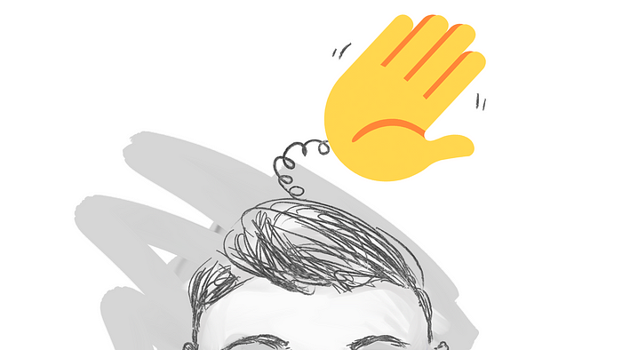

Say hello, change your life.  

说你好，改变你的生活。

Learn to say hello and you’ll give yourself your best shot at a wonderful life.  

学会打招呼，你就给自己创造了美好生活的最佳机会。  

I know this sounds goofy and unreasonably pretentious—you already say hello many times a day—you don’t _really_ need to learn how to do it. And yet… the stakes are high if you get it wrong.  

我知道这听起来很傻且不合理地自命不凡——你一天已经打招呼很多次了——你其实并不需要学习怎么做。然而……如果你做错了，后果很严重。  

We decide if we like something **somewhere between 1/10th of a second and 7 seconds** ([Janine Willis and Alexander Todorov, 2006](https://journals.sagepub.com/doi/10.1111/j.1467-9280.2006.01750.x)). First impressions have been shown to last for months ([Gunaydin, Selcuk, & Zayas, 2017](http://paclab.psych.cornell.edu/pdf/Gunaydin,Selcuk,&Zayas,PortraitPrediction.pdf)) and can sway one’s point of view **even in the presence of contradictory evidence** (e.g., [Rydell & McConnell, 2006](https://www.researchgate.net/publication/5407180_Forming_Implicit_and_Explicit_Attitudes_Toward_Individuals_Social_Group_Association_Cues)), and **even when you can’t recall why** ([McCarthy & Skowronski, 2011](https://www.ncbi.nlm.nih.gov/pmc/articles/PMC5172463/#R23); [Todorov & Uleman, 2002](https://www.ncbi.nlm.nih.gov/pmc/articles/PMC5172463/#R38)). This is why it matters that you learn how to say hello.  

我们决定是否喜欢某样东西的时间介于 1/10 秒到 7 秒之间（Janine Willis 和 Alexander Todorov，2006）。研究表明，第一印象可以持续数月（Gunaydin, Selcuk, & Zayas，2017），并且即使在有相反证据的情况下也能影响一个人的观点（例如，Rydell & McConnell，2006），即使你无法回忆起原因（McCarthy & Skowronski，2011；Todorov & Uleman，2002）。这就是为什么学习如何打招呼很重要。  

This is why the opening shot of a film sets the tone.  

这就是为什么电影的开场镜头定下基调。  

This is why the first few notes of a song trigger such a potent memory response.  

这就是为什么一首歌的前几个音符会引发如此强烈的记忆反应。  

This is why a webpage needs to [load in under a second](https://www.portent.com/blog/analytics/research-site-speed-hurting-everyones-revenue.htm). This is why the first sentence of a novel matters more than all the others.  

这就是为什么网页需要在一秒钟内加载完成。这就是为什么小说的第一句话比其他所有句子更重要。  

This is why Instagram and TikTok are so effective and the copy on billboards is so short.  

这就是为什么 Instagram 和 TikTok 如此有效，以及广告牌上的文案如此简短。  

This is why we fall in love at first sight and can tell when the bad guy enters a movie even before he’s done anything wrong.  

这就是为什么我们会一见钟情，并且在坏人还没有做错任何事情之前就能知道他进入了电影。

First impressions shouldn’t matter as much as they do… but they do.  

第一印象不应该像现在这样重要……但确实很重要。  

Here are a few suggestions on how to make a positive first impression that won’t leave you feeling phony, shameful, off-putting, or fake.  

以下是一些建议，帮助你留下积极的第一印象，而不会让你感到虚假、羞愧、令人反感或不真实。  

In fact… honestly? they are kind of fun.  

实际上……老实说？它们有点有趣。

## Here’s how to do it.  

这是如何做到的。

“Hello” happens with your whole body.  

“你好”是全身的感受。  

To do it well, you’ll need to adjust your voice, your body language, and the _focus_ of your attention.  

要做好这件事，你需要调整你的声音、肢体语言和注意力的焦点。

1.  Your voice: take a deep breath or two to drop your voice down from the squeak of social anxiety to its normal, wonderful, natural register.  
    
    你的声音：深吸一两口气，让你的声音从社交焦虑的尖细声调降到正常、奇妙、自然的音域。  
    
    Your voice doesn’t start in your head, as we might imagine, it starts down between your gut and your heart with the pull of your diaphragm.  
    
    你的声音并不是从头部开始的，正如我们可能想象的那样，而是从你的腹部和心脏之间开始，依靠横膈膜的拉动。  
    
    By the time the air travels all the way up your throat to be shaped by your vocal cords, it already should possess the resonance of your body.  
    
    当空气一路上升到你的喉咙，被声带塑造时，它应该已经具备了你身体的共鸣。  
    
    Think of your voice as something that starts deep inside of you and gains your best qualities as it makes its way towards the ears of others.  
    
    把你的声音看作是从你内心深处开始，并在向他人耳中传递的过程中，逐渐展现出你最好的品质。  
    
    Your voice should emanate from your center of gravity, and we should feel it as such, even at a whisper.  
    
    你的声音应该从你的重心发出，即使是低语，我们也应该感受到这一点。  
    
    Your goal is to sound sonorous, not sing-songy or loudmouthed, but, dare I say? **beautiful and cool.**  
    
    你的目标是听起来洪亮，而不是像唱歌一样或大声喧哗，但，我敢说？美丽而酷。
2.  Roll your shoulders back to pull your frame upwards and raise your gaze.  
    
    将肩膀向后放松，拉伸身体向上，抬起视线。  
    
    This will shift your posture from the shape of a question mark to an upside-down exclamation point.  
    
    这将使你的姿势从问号的形状转变为倒感叹号。  
    
    You want to your spine look like (¡) not (?).  
    
    你希望你的脊柱看起来像(¡)而不是(?)。
3.  Relax your face.  
    
    放松你的脸。  
    
    You don’t have to smile if your mood doesn’t match it—a fake smile erodes trust—instead, just relax away your leftover facial tensions so you don’t accidentally send an expression of hate or worry or disdain to a person you haven’t yet met.  
    
    你不必微笑，如果你的情绪与之不符——虚假的微笑会侵蚀信任——相反，只需放松你脸部剩余的紧张，以免不小心向一个你尚未见过的人传达仇恨、担忧或轻蔑的表情。  
    
    Offer positive potential energy instead, and that energy will get reflected and magnified and sent back to you so that you end up getting more than you put in.  
    
    提供积极的潜在能量，这种能量将被反射、放大并返回给你，从而使你最终获得的比你投入的更多。  
    
    Breathe in, and then on the exhale, imagine every muscle in your face hearing the end-of-shift whistle and relaxing and taking a break from work.  
    
    深吸一口气，然后在呼气时，想象你脸部的每一块肌肉听到下班的哨声，放松并休息一下。  
    
    Or imagine your facial muscles as actors on a stage, where you hear the director shout “Cut!” and everyone relaxes and rejoices.  
    
    或者想象你的面部肌肉就像舞台上的演员，你听到导演喊“停！”然后每个人都放松并欢呼。  
    
    Relax your face to neutral — not dead — just not all tensed up from concerns that others do not share.  
    
    放松你的脸部，保持中性——不是死板——只是不要因为别人不分享的担忧而紧绷。
4.  “Hello” happens long before you speak.  
    
    “你好”在你说话之前就已经发生。  
    
    We can tell from across the room when a salutation might soon occur.  
    
    我们可以从房间的另一边判断何时可能会发生问候。  
    
    Start your hello adjustments (mind, body, voice, attention) sooner than later. A challenge: **can you walk into the room already adjusted?**  
    
    尽早开始你的问候调整（心态、身体、声音、注意力）。一个挑战：你能在进入房间时已经调整好自己吗？
5.  You can uncover something interesting about nearly anyone **_if_** you **converse with curiosity** instead of apathy, greed, mistrust, or resignation.  
    
    如果你以好奇心而不是冷漠、贪婪、不信任或放弃的态度与几乎任何人交谈，你就能发现一些有趣的事情。  
    
    And if you don’t happen to uncover something fascinating about the other person—see this as your fault, not theirs.  
    
    如果你没有发现对方身上有什么迷人的地方——把这看作是你的错，而不是他们的。  
    
    Why?  
    
    为什么？  
    
    If you blame others for poor conversations you surrender control and condemn yourself to a lifetime of many miserable, meaningless chats.  
    
    如果你责怪他人进行糟糕的对话，你就放弃了控制权，并将自己判处于一生中许多痛苦、毫无意义的聊天。  
    
    **But, if you take responsibility for building an interesting conversation,** you’ll learn to adjust what you’re doing so that people will want to have positive interactions with you.  
    
    但是，如果你负责建立有趣的对话，你将学会调整自己的行为，以便人们愿意与你进行积极的互动。  
    
    Also, people will be more willing to share with you their most interesting ideas if you demonstrate that you can be trusted to handle them with care.  
    
    此外，如果你能证明自己值得信赖，能够妥善处理这些想法，人们会更愿意与你分享他们最有趣的想法。  
    
    This takes effort but makes life more vivid.  
    
    这需要努力，但使生活更加生动。  
    
    Author Chuck Palahniuk meets people by the hundreds—sometimes for eight hours straight—at his book signings.  
    
    作者查克·帕拉尼克在他的签书会上与成百上千的人见面——有时连续八个小时。  
    
    He [offers this advice](https://www.amazon.com/Consider-This-Moments-Everything-Different/dp/1538717956) on how to do it well: he attempts to treat each person as if they were the only person he would meet that day.  
    
    他提供了关于如何做好这件事的建议：他试图把每个人都当作是他当天唯一会见的人。
6.  If someone asks you “what do you do?” resist the temptation to respond with your job title.  
    
    如果有人问你“你做什么？”请抵制用你的职位名称来回答的诱惑。  
    
    Instead, **respond with an “I believe” statement.** Example:  
    
    相反，回应一个“我相信”的陈述。示例：  
    
    _“So, Jim, What do you do?”  
    
    “所以，吉姆，你是做什么的？”  
    
    “ I believe story, art, and design can bend the arc of humanity’s progress, and I try to bring that into everything I do: from movies to startups to paintings to books and to ballets.”  
    
    “我相信故事、艺术和设计可以弯曲人类进步的arc，我努力将这一点融入我所做的一切：从电影到初创公司，从绘画到书籍，再到芭蕾舞。”  
    
    _A statement of belief will start more interesting conversations than your job title.  
    
    信念声明会引发比你的职位名称更有趣的对话。  
    
    If the person doesn’t immediately ask a question in return, you can _ask them_ _what they believe_.  
    
    如果对方没有立即反问，你可以问他们的看法。  
    
    Compare this to the usual path: if you open with your job title or rank, this sets up a confrontational hierarchy.  
    
    将此与通常的路径进行比较：如果您以职位或等级开场，这会建立一种对抗性的等级制度。  
    
    And if you introduce yourself with something vague, like “finance” or “tech” or “science” or “art” this sends a signal that you don’t really want to talk about it.  
    
    如果你用一些模糊的词汇自我介绍，比如“金融”或“科技”或“科学”或“艺术”，这会发出一个信号，表明你并不真正想谈论这个。  
    
    **Open with an idea**, and the conversation is already interesting before it begins.  
    
    以一个想法开场，谈话在开始之前就已经很有趣。  
    
    We crave interestingness over almost all else.  
    
    我们渴望有趣的事物，胜过几乎所有其他事物。
7.  When you greet someone, look at the other person’s eyes.  
    
    当你问候某人时，注视对方的眼睛。  
    
    Do not look at their feet or your feet or the ceiling or the person behind them or your phone or your watch or your elbow or anywhere else.  
    
    不要看他们的脚、你的脚、天花板、他们身后的那个人、你的手机、你的手表、你的肘部或其他任何地方。  
    
    **Eyes to Eyes.** If the other person’s eyes are obscured or missing, direct your gaze towards their face, which will magically line up your voice with their ears.  
    
    眼对眼。如果对方的眼睛被遮挡或缺失，请将目光投向他们的脸，这将神奇地将你的声音与他们的耳朵对齐。
8.  After you introduce yourself, ask a question.  
    
    在自我介绍后，问一个问题。  
    
    Listen to their response carefully and ask a question that allows them to develop their idea further.  
    
    仔细听他们的回应，并提出一个问题，让他们进一步发展他们的想法。  
    
    You already know your own ideas, so why not focus on theirs?  
    
    你已经知道自己的想法了，那为什么不关注他们的呢？  
    
    The conversation will be more fun if you uncover interesting ideas hidden behind the foreheads of others.  
    
    如果你能揭示他人额头背后隐藏的有趣想法，谈话会更加有趣。
9.  Once someone does tell you something, store it away in your mind for the next time you meet.  
    
    一旦有人告诉你什么，把它存放在你的脑海中，以备下次见面时使用。  
    
    When you see that person again… a day, a week, a year from now… bring it up—so how was that trip to Spain?  
    
    当你再次见到那个人时……一天、一周、一年后……提起这件事——那么，西班牙之行怎么样？  
    
    I remember it sounded wonderful… And weren’t you about to do something interesting at your Tunnel Drilling Startup?  
    
    我记得听起来很棒……你不是要在你的隧道钻探初创公司做一些有趣的事情吗？
10.  And with that… no more boring conversations. No more bad first impressions.  
    
    就这样……再也没有无聊的对话。再也没有糟糕的第一印象。

## Instant judgment, lasting impression.  

即时判断，持久印象。

But wait, what if your first impression goes poorly? Any chance for second chances?  

但是等等，如果你的第一印象不好呢？还有第二次机会吗？

## Hard to change.  

难以改变。

While we **can** change our minds from a positive to a negative impression if we learn something horrible about someone ([Cone and Ferguson 2015)](https://www.ncbi.nlm.nih.gov/pmc/articles/PMC5172463/#R6), **we have** **a very hard time learning to like someone if we experienced a bad first impression.** It’s not impossible, [but it’s harder than you’d think](https://www.ncbi.nlm.nih.gov/pmc/articles/PMC5172463/) and requires specific conditions.  

虽然如果我们了解到某人一些可怕的事情，我们可以将对他们的印象从积极转为消极（Cone 和 Ferguson 2015），但如果我们经历了糟糕的第一印象，我们很难学会喜欢某人。这并不是不可能，但比你想象的要困难，并且需要特定的条件。

## Make it count.  

让它有意义。

When I first read this research I immediately thought back to all the bad first impressions I’ve made — moments when I was too curt or aloof — and how those bad first impressions have likely never faded.  

当我第一次阅读这项研究时，我立刻想到了我所留下的所有糟糕第一印象——那些我过于简短或冷漠的时刻——以及那些糟糕的第一印象可能从未消失。  

Then nearly immediately I became filled with retrograde anxiety as I thought about all the wonderful people in my life and how easily I could have missed out on their absolute wonderfulness had our first impression moments gone poorly.  

然后几乎立刻，我感到了一种逆行焦虑，因为我想到我生活中所有美好的人，以及如果我们第一次见面的时刻不顺利，我是多么容易错过他们的绝对美好。  

I’m so grateful they went well, but what if they hadn’t?  

我很感激它们进展顺利，但如果没有呢？  

Maybe it wouldn’t have mattered.. but maybe…  

也许这并不重要……但也许……

I now try to make every first encounter count. Why?  

我现在努力让每一次初次见面都变得重要。为什么？  

Every person you meet is a chance to learn something new, gain an ally for your cause, find someone who believes what you believe, make a new friend, or get help from unexpected places, including the extended networks of everyone you meet.  

你遇到的每一个人都是一个学习新知识的机会，一个为你的事业争取盟友的机会，找到一个相信你所相信的人，结交新朋友，或从意想不到的地方获得帮助，包括你遇到的每个人的广泛网络。

Every hello is a chance to have a wonderful life.  

每一个问候都是拥有美好生活的机会。
