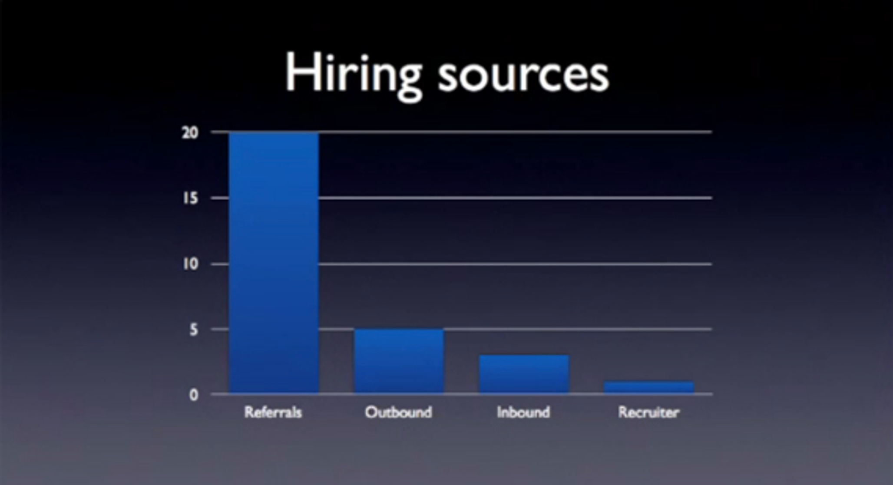

[Stripe](https://stripe.com/?ref=review.firstround.com), the payments company that makes it simple to accept payments on the web has quietly been amassing one of the strongest engineering teams in Silicon Valley.  

Stripe，这家让网上支付变得简单的公司，悄然汇聚了硅谷最强大的工程团队之一。  

In this First Round Capital CTO Summit talk, [Greg Brockman](https://www.linkedin.com/in/thegdb?ref=review.firstround.com), founding engineer at Stripe, pries open the black box and shares how Stripe recruits.  

在这次 First Round Capital CTO 峰会上，Stripe 的创始工程师 Greg Brockman 揭示了招聘的秘密，分享了 Stripe 的招聘方法。  

Below is an interpretation, not a transcript, of Greg’s talk.  

下面是对格雷格演讲的解读，而非逐字记录。  

The credit goes to him for all the good stuff, and you can watch the complete talk in the video below.  

这份功劳归他，所有的好东西都是他的贡献，你可以在下面的视频中观看完整的演讲。

**Measure the performance of each of your hiring channels and double down where you find the most success**.  

评估各个招聘渠道的效果，并在最成功的渠道上加大投入。

The metric you’re looking to optimize is number of high quality hires — not number of candidates.  

你需要优化的指标是高质量的雇佣人数，而不是候选人的数量。  

Even if one channel brings in hundreds of good candidates, another channel that results in fewer hires but requires less effort will be a more efficient use of your time.  

即使一个渠道吸引了数百名优秀候选人，另一个招聘人数较少但所需精力更少的渠道，仍然会更有效地利用你的时间。  

This is how Stripe’s recruiting channels have performed.  

这是 Stripe 招聘渠道的效果。

-   **Referrals:** Referrals tend to be a really fantastic way to bring people in and should be the first place you go.  
    
    推荐通常是吸引新人的一种非常有效的方法，应该是你首先考虑的选项。  
    
    If you leverage each of your first ten hires’ networks, chances are you’ll meet some excellent candidates.  
    
    如果你利用前十位员工的网络， chances are 你会遇到一些优秀的候选人。  
    
    When done right, internal and external referrals can scale your company pretty efficiently.  
    
    如果操作得当，内部和外部的推荐可以非常高效地帮助公司发展。  
    
    Sit down and get your engineers to physically list out the best and smartest people they’ve ever worked with and then go after them with crazy intensity.  
    
    坐下来，让你的工程师们列出他们曾经合作过的最佳和最聪明的人，然后以极大的热情去追求他们。  
    
    As an added bonus, referral candidates might be easier to close because a friend’s recommendation goes a long way.  
    
    作为额外的好处，推荐的候选人可能更容易被说服，因为朋友的推荐非常有说服力。
-   **The Career Fair Circuit**: It’s the place where you’re “supposed to look.” but unless you're setup to handle that type of top of the funnel inbound and require new grads, you're best to skip it early on.  
    
    职业招聘会：这是一个“你应该去关注的地方”。但如果你没有准备好处理这种类型的入站需求，并且不需要新毕业生，最好在早期就跳过这个活动。
-   **Outbound**: If you’re creating a developer-focused product, you might be able to hire people you interact with daily.  
    
    如果你正在开发一个面向开发者的产品，或许可以雇佣那些你每天接触的人。  
    
    Be sure to create stimulating events for this community (i.e. online capture the flag), as it will help you identify the most promising individuals.  
    
    一定要为这个社区组织一些有趣的活动（例如，在线夺旗），这将帮助你识别出最有潜力的人才。
-   **Inbound**: These are the people who shoot you an email after visiting your careers page.  
    
    收件箱：这些是在访问您的招聘页面后给您发送电子邮件的人。  
    
    Stripe spent a significant amount of time and effort on this channel but it hasn’t delivered a proportionately effective return.  
    
    Stripe 在这个渠道上投入了大量时间和精力，但回报并不成比例。
-   **Contingency Recruiters:** Although a recruiter’s job “is to get you people,” it’s been spectacularly unsuccessful for Stripe.  
    
    应急招聘人员：虽然招聘者的职责是“为你找到合适的人”，但对 Stripe 来说，这一工作却非常不成功。  
    
    Recruiters will inevitably send lots of people your way, and while it’s a free source of people, they aren’t often the A+ players you’re trying to hire.  
    
    招聘人员会不可避免地推荐很多人给你，虽然这是一种免费的人员来源，但他们通常不是你想要招聘的顶尖人才。

**Recruiting is Like Marketing  

招聘就像市场营销**

Once you find great people, how do you convince them join your company?  

一旦你找到优秀的人，如何说服他们加入你的公司呢？  

The very best people are always going to be in demand, particularly in the current market for talent.  

在当前的人才市场中，最优秀的人才总是供不应求。  

Consider approaching recruiting the way you approach marketing.  

可以考虑用你对待市场营销的方式来进行招聘。  

The end goal of each is to make your company appear more desirable. You have to build a brand.  

每个目标的最终目的是让你的公司显得更加吸引人。你需要打造一个品牌。

One way to do this is to devise great recruitment emails.  

一种方法是撰写出色的招聘邮件。  

Involve multiple people when composing your messages in order to collect a diverse perspective.  

在撰写消息时，邀请多个人参与，以便收集多元的视角。  

One non-obvious place to invest is your rejection calls and emails.  

一个不太明显的投资方式是关注你的拒绝电话和邮件。  

You’ll end up rejecting people who are very talented, but just not quite a good fit.  

你最终会拒绝那些非常有才华但不太合适的人。  

Odds are they have some friends who are.  

他们可能有一些这样的朋友。

When you’re engaging an engineer, always be cognizant of the person you’re speaking with.  

与工程师交流时，始终要注意对方是谁。  

If you post about how you need people who are willing to dedicate their entire lives to this company, you’re basically only going to be appealing to people in their mid-20s.  

如果你发帖说你需要愿意为这家公司全心投入的人，实际上你只会吸引到二十多岁的人。  

This extends through the entire interview process and all the way up to when you’re actually making an offer.  

这贯穿了整个面试过程，直到你真正提出录用的报价。

Transparency is another great way to convey to a candidate that your company is a great place to work, especially in the offer stage (i.e. how you calculated the numbers, outstanding shares).  

透明度是向候选人展示贵公司是一个理想工作场所的有效方式，尤其是在报价阶段（例如，您是如何计算这些数字和流通股的）。  

Do unconventional things like offering to meet candidates on weekends.  

做一些不寻常的事情，比如建议在周末与候选人见面。  

Consider getting senior team members to conduct interviews.  

考虑让资深团队成员来进行面试。  

If you and your employees are willing to take time out of your day, it demonstrates how much you care about the company you’re building.  

如果你和你的员工愿意花时间，这显示了你们对所建立公司的关心程度。  

Candidates should walk away knowing a) your company is building something big and b) they’ll be really happy.  

候选人应该明白：a) 你的公司正在打造一些伟大的事业，b) 他们会感到非常满意。

**Don’t Take Circumstantial Evidence as Authoritative  

不要把情境证据当作权威依据**

Don’t assume that just because someone worked at Google they’re going to have extensive knowledge of distributed systems. Google-sized companies often have pre-built infrastructure and engineers don’t need to know how to build it in order to use it.  

不要认为仅仅因为某人在谷歌工作过，他们就一定对分布式系统有深入的了解。谷歌这样的公司通常拥有现成的基础设施，工程师们不需要知道如何构建这些基础设施就能使用它们。  

Every time Stripe has made assumptions about someone’s ability they’ve turned out to be wrong.  

每当 Stripe 对某人的能力做出假设时，结果总是错误的。  

Seek personal references from people who have worked with them.  

向曾与他们合作的人索取个人推荐。

**Focus on Distinguishing the Great from the Good  

专注于区分卓越与优秀**

> It's difficult to tell the difference between someone who is good and someone who is great.  
> 
> 很难分辨一个人是好还是伟大。  
> 
> Your interview should be focused on distinguishing the great from the good.  
> 
> 你的面试应着重于区分优秀与一般。

Stripe uses a collaborative hack project — typically prepared in advance to make sure they’re well suited for someone’s interests and skill set.  

Stripe 采用一个协作黑客项目，通常会提前准备，以确保它符合某人的兴趣和技能水平。  

If a candidate doesn’t want to do it, you don’t want to hire them anyway.  

如果候选人不愿意做这件事，那你也不应该雇佣他们。

**The Sunday Test  

周日测试**

Stripe turns down candidates with outstanding engineering talent if they don’t fit with the team’s culture.  

如果候选人不符合团队文化，Stripe 会拒绝那些拥有卓越工程才能的人。  

Each candidate must pass the “Sunday test.” If this person were alone in the office on a Sunday, would that make you more likely to come in and want to work with them?  

每位候选人都必须通过“星期天测试”。如果这个人在星期天独自在办公室，你会更愿意来和他们一起工作吗？  

If the answer is not a clear yes, then don't make the hire.  

如果答案不是明确的肯定，那么就不要聘用。  

Hiring a few bad eggs might impact your ability to attract top talent in the future.  

雇佣一些不合适的人可能会影响你未来吸引顶尖人才的能力。  

In the short term, you might miss out on really great people, but like recruiting, you have to play the long game.  

从短期来看，你可能会错过一些非常优秀的人，但就像招聘一样，你需要有长远的眼光。

**The first hire in a new role or department is incredibly important.  

新角色或部门的首位员工至关重要。**

Whenever you’re hiring the first person for a particular role or division, always hold out for the person who's mastered all the sub pieces.  

每当你为某个特定角色或部门招聘第一位员工时，一定要寻找那些掌握所有细节的人。  

This person defines the trajectory for their department and will likely be responsible for building that team.  

这个人负责规划他们部门的发展方向，并可能会负责组建团队。  

They need to inspire other talented people to want to work with them.  

他们需要激励其他有才华的人愿意与他们合作。

Taking this approach can be really painful because you have to wait a lot longer before you’re able to make this hire.  

采用这种方法可能会非常痛苦，因为你需要等待更长时间才能进行这次招聘。  

Finding someone who can do both the day-to-day execution of going out and selling to customers and the higher level strategy of figuring out who to sell to, for instance, is really hard.  

找到一个既能处理日常销售工作，又能制定销售策略的人，实在是非常困难。

**Hire People Instead of Roles  

雇佣人才而非职位**

One thing that's worked well for Stripe is bringing on people who didn’t have an immediately obvious role in the organization.  

对于 Stripe 来说，一个有效的做法是引入那些在组织中没有明确角色的人。  

If you can think of one thing this person can do, then there’s probably ten more you're not thinking of that he/she can do two months from now.  

如果你能想到这个人能做的一件事，那么他/她在两个月后可能还能做十件你想不到的事情。  

Focusing on hiring to fill a role could make you more likely to sacrifice quality just to get someone with the right skill set.  

专注于招聘以填补某个职位，可能会让你更容易牺牲质量，只为找到一个拥有合适技能的人。

**Trust Your Instincts  

相信你的直觉**

It turns out that when you think that someone's not good, you're almost always right.  

事实证明，当你觉得某人不怎么样时，你几乎总是没错的。
