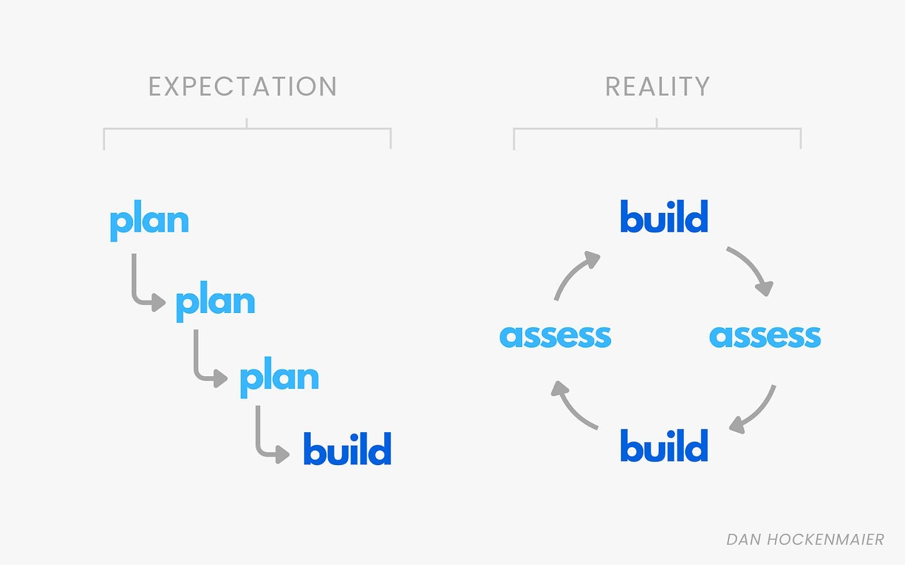

Many people aspire to do “high level strategy work”.  

许多人渴望从事 “高级战略工作”。  

This is the wrong goal, and most of them won’t do much of it.  

这是错误的目标，他们中的大多数人不会做太多事情。

The problem is not that there isn’t much strategic work to do, it’s that they are focused on the wrong kind.  

问题不在于没有太多的战略工作要做，而在于他们专注于错误的类型。

What they have in mind is making big, consequential decisions - what Jeff Bezos called “one-way doors” because they’re hard to reverse.  

他们心中想的是做出重大的、重要的决定——杰夫·贝佐斯 （Jeff Bezos） 称之为“单向门”，因为它们很难逆转。  

Launching Amazon Prime was like this.  

推出 Amazon Prime 是这样的。  

It required an attempt to see multiple steps into the future to develop conviction that it would work.  

它需要尝试看到未来的多个步骤，以培养对它会奏效的信念。  

These kinds of decisions happen rarely, and most people don’t spend much time on them, even if they’re on the senior leadership team.  

这类决定很少发生，大多数人不会花太多时间在这些决定上，即使他们在高级领导团队中也是如此。

However there is a different kind of strategic work in extreme abundance, and that is what comes after launching Prime.  

然而，还有一种不同类型的战略工作非常丰富，那就是在推出 Prime 之后。  

Thousands of smaller decisions that will determine whether or not it actually works.  

数以千计的小决定将决定它是否真的有效。  

How do we convince people to sign up? Which suppliers should we onboard?  

我们如何说服人们注册？我们应该加入哪些供应商？  

How should we set up our fulfillment operation?  

我们应该如何设置我们的配送操作？

Being good at these kinds of decisions is a different thing entirely.  

擅长这些类型的决定是完全不同的事情。

You’re not trying to see many steps in the future.  

你不是想看到未来的很多步骤。  

You’re just trying to get clarity on what is actually happening right now, so you can decide what to do next.  

你只是想弄清楚现在实际发生的事情，这样你就可以决定下一步做什么。

And speed matters just as much as accuracy.  

速度和准确性同样重要。  

You want to try to get these decisions right if you can, but you also want to give yourself as much time as possible to keep trying if you’re wrong.  

如果可以的话，你想尝试把这些决定做对，但你也想给自己尽可能多的时间，如果你错了，就继续尝试。

It’s not a linear process, it’s a flywheel:   

这不是一个线性过程，而是一个飞轮：

This means that the metric you are optimizing for needs to have both a direction and a velocity.  

这意味着您正在优化的指标需要同时具有方向和速度。  

It’s something like _“good decisions per hour”._  

这有点像 _“每小时的好决策”。_

Making good decisions rapidly requires four inputs, and we’ll explore how to get good at each of them.  

快速做出正确的决策需要四个输入，我们将探讨如何做好每个输入。

1.  **Intuition:** short circuiting as much of a problem as possible and driving quickly to a hypothesis  
    
    **直觉：**尽可能多地短路问题并快速得出假设
    
2.  **Insight generation**: a toolkit to rapidly validate or invalidate that hypothesis  
    
    **洞察生成**：用于快速验证或否定该假设的工具包
    
3.  **Solutioning:** understanding enough about execution that you can recommend the right things to try **解决方案：**对执行有足够的了解，以便您可以推荐正确的尝试 
    
4.  **Synthesis:** pulling everything you’ve learned into a story that is cohesive, true, and will lodge in people’s brains in just a few minutes  
    
    **综合：**将您学到的所有知识整合到一个有凝聚力、真实且将在几分钟内留在人们大脑中的故事中
    

Intuition is a machine that takes in questions and outputs good hypotheses as to their answer.  

直觉是一台机器，它接受问题并输出关于答案的良好假设。

Ben Thompson of Stratechery was asked how he can possibly have an insightful take on what is happening in tech every day, often just a few hours after it happens.  

Stratechery 的 Ben Thompson 被问及他如何才能对每天发生的科技事件有深刻的见解，通常是在事情发生后几个小时。  

His response:  

他的回答是：

> I have a framework - an overall view of the world and how it works. It’s like a machine.  
> 
> 我有一个框架 - 世界及其运作方式的整体视图。它就像一台机器。  
> 
> When a piece of news happens, I feed it into the machine and out pops a conclusion.  
> 
> 当一条新闻发生时，我将其输入机器，然后弹出一个结论。  
> 
> If A happened, then B then C then D then E.  
> 
> 如果 A 发生，则 B 然后 C，然后 D 和 E。

How do you develop this?  

你怎么开发这个？

Intuition is one of those mythical things that it seems some people have and others don’t.  

直觉是那些似乎有些人拥有而另一些人没有的神话般的事物之一。  

But you can absolutely get better at it if you try, especially if you’re intentional about understanding the problem space at three levels of fidelity:  

但是，如果你尝试一下，你绝对可以做得更好，特别是如果你有意识地在三个保真度级别上理解问题空间：

**1\. The customer.** Most fundamental is understanding who the customer is and what they actually care about.  

1\. 客户。最基本的是了解客户是谁以及他们真正关心什么。  

You need a mental model of how they decide between alternatives, and what single or small set of variables matter most.  

您需要一个心智模型，了解他们如何在备选方案之间做出决定，以及哪些单一或较小的变量集最重要。

For example, Amazon figured out relatively early that convenience was the thing that mattered most. Specifically ubiquitous, free, fast shipping.  

例如，Amazon 相对较早地发现便利性是最重要的。特别是无处不在、免费、快速的运输。  

Eugene Wei [wrote](https://www.eugenewei.com/blog/2018/5/21/invisible-asymptotes) about how clarifying this was: Eugene Wei [写道](https://www.eugenewei.com/blog/2018/5/21/invisible-asymptotes)，这是多么澄清： 

> _“You can't imagine what a relief it is to have a single overarching obstacle to focus on as a product person.  
> 
> “你无法想象作为产品人员需要关注一个首要障碍是多么令人欣慰。  
> 
> It's the same for anyone trying to solve a problem”  
> 
> 任何试图解决问题的人都是一样的。_

**2\. The industry.** The next level of fidelity is the surrounding industry. What is its cost structure?  

2\. 行业。下一个级别的保真度是周边行业。它的成本结构是什么？  

Who are the key competitors and on what variables are they competing?  

谁是主要竞争对手，他们在哪些变量上竞争？  

Which of those variables are fluid and which are hard to change?  

这些变量中哪些是流动的，哪些是难以改变的？

One big thing changing in online retail is the Temu and Shein business model.  

在线零售的一大变化是 Temu 和 Shein 的商业模式。  

They partner deeply with overseas factories and use a tax loophole that allows them to bypass import duties.  

他们与海外工厂深度合作，并利用税收漏洞绕过进口关税。  

This makes products so much cheaper that many customers are willing to accept slower shipping.  

这使得产品便宜得多，以至于许多客户愿意接受较慢的运输速度。  

Amazon has been forced to re-think its customer value calculus, and they are launching a Temu competitor.  

Amazon 被迫重新思考其客户价值计算，他们正在推出 Temu 的竞争对手。

**3\. The Idea Maze.** Finally, you have to understand what the cutting edge is inside your own company.  

3\. 创意迷宫。最后，您必须了解自己公司内部的前沿是什么。  

Your colleagues are all navigating the idea maze with you, and once a company is sufficiently large you can get pretty far just by talking to them, reading their docs, and understanding which goals they are hitting and missing.  

您的同事都在与您一起探索想法迷宫，一旦一家公司足够大，您只需与他们交谈、阅读他们的文档并了解他们正在达到和错过的目标即可走得很远。 

If you were working on the team at Amazon launching the Temu competitor, it would be quite important to understand things like how much other teams have been able to negotiate prices with factories and how much price and shipping times impact conversion rates.  

如果您在亚马逊推出 Temu 竞争对手的团队中工作，那么了解其他团队能够与工厂协商价格的程度以及价格和运输时间对转化率的影响程度等信息将非常重要。

Once you have hypotheses, you have to go actually validate or invalidate them.  

一旦你有了假设，你就必须去实际验证或使它们无效。

An important part of being good at this is simply being clear that this is what you’re doing.  

擅长这一点的一个重要部分就是明确这就是你正在做的事情。  

Start by stating what the hypotheses are and what conditions must be true to believe them.   

首先陈述假设是什么以及哪些条件必须为真才能相信它们。

It’s then about having a toolkit that allows you to rapidly assess those conditions.  

然后是拥有一个工具包，让您能够快速评估这些情况。  

There are many different types of businesses, roles, and problems, but if you’re at a tech company, 90% of the way you generate raw insights comes down to just two things: **learn SQL, and learn to talk to customers.**  

有许多不同类型的业务、角色和问题，但如果您在一家科技公司工作，您生成原始见解的 90% 方式归结为两件事：**学习 SQL 和学习与客户交谈。**

The way to get to the data you want inside most tech companies is SQL.  

在大多数科技公司内部获取所需数据的方法就是 SQL。  

Sometimes people who have only spent time in fields like consulting think they can get by with spreadsheets because someone else will give them a nice neat dataset to work with, but they are wrong.  

有时，只在咨询等领域花费时间的人认为他们可以使用电子表格，因为其他人会给他们一个很好的简洁的数据集来使用，但他们错了。  

Just invest in getting great at this right away so you can unblock yourself on working with data.  

只需投资立即在这方面变得出色，这样您就可以在处理数据时摆脱阻碍。

Talking to customers is an important counterbalance, because it can give you something data can’t: anecdotes.  

与客户交谈是一种重要的平衡，因为它可以为您提供数据无法提供的东西：轶事。  

Until you’ve heard at least one customer talk about the dynamic you’re seeing in the data, you should be highly suspicious that that dynamic actually exists.  

在您听到至少一个客户谈论您在数据中看到的动态之前，您应该高度怀疑该动态是否真的存在。  

Bezos has a line about this:  

贝佐斯对此有一句话：

> The thing I have noticed is when the anecdotes and the data disagree, the anecdotes are usually right.  
> 
> 我注意到的是，当轶事和数据不一致时，轶事通常是正确的。  
> 
> There's something wrong with the way you are measuring it.  
> 
> 你测量它的方式有问题。

To get value from customer conversations you must avoid leading the witness.  

要从客户对话中获得价值，您必须避免引导证人。  

You have a hypothesis, and if you’re not careful you can probably get the customer to agree with you even if they don’t.  

你有一个假设，如果你不小心，你可能会让客户同意你的观点，即使他们不同意。  

To counteract this, start your interviews with general topics and let the customer take you to more specific ones.  

为了解决这个问题，从一般话题开始你的采访，让客户带你去看更具体的话题。

You’ll often have to vacillate between data and customer feedback as you zero in on an answer.  

当您专注于答案时，您经常不得不在数据和客户反馈之间摇摆不定。  

At BCG I was taught a principle for how to do this: _“qual → quant → qual.”_  

在 BCG，我学到了一个如何做到这一点的原则：“_qual → quant → qual”。_

In other words, start with a few customer calls while you’re still in hypothesis generation mode to make sure you’re smoking out all of the possible issues.  

换句话说，当您仍处于假设生成模式时，从几个客户电话开始，以确保您消除了所有可能的问题。  

Then use data to size and validate the things you’re hearing.  

然后使用数据来调整和验证您听到的内容。  

Then return to customers at the end to make sure what you found in the data is real.   

然后在最后返回给客户，以确保您在数据中找到的内容是真实的。

Now you must drive to recommendations. Coming up with good ideas is usually not the hard part.  

现在您必须开车去推荐。想出好主意通常不是难的部分。  

It’s knowing which of them are worth trying and in what order.  

而是知道其中哪些值得尝试以及以什么顺序尝试。

That doesn’t mean trying to predict exactly what will work, which is usually too difficult.  

这并不意味着试图准确预测什么会奏效，这通常太难了。  

It’s the more fundamental task of knowing which ones are feasible and how much effort they will be to implement, so you can assess whether it’s worth taking the shot at all.  

更基本的任务是了解哪些是可行的以及实施它们需要付出多少努力，这样您就可以评估是否值得一试。

This requires knowing how long things take, what is already on roadmaps, where there are dependencies on other things that must be built first, and a bunch of other things you can’t really know until you understand the teams that are doing the building, like engineering, operations and marketing.  

这需要知道事情需要多长时间，路线图上已经有什么，哪些地方依赖于必须首先构建的其他事物，以及一系列其他事情，除非你了解正在进行构建的团队，否则你无法真正了解，比如工程、运营和营销。  

 

That is why strategic work can’t be decoupled from execution.  

这就是为什么战略工作不能与执行脱钩的原因。  

The people working on strategy should either be the same ones that execute it, or embedded with them and working closely from the start of the process.  

制定战略的人员要么是执行战略的人，要么是与他们融为一体，从流程的一开始就密切合作。

The most important skill of all is writing.  

最重要的技能是写作。  

That is because it is the best proxy for the thing that really matters: _synthesis_.  

那是因为它是真正重要的事情的最佳代理：综合。  

Synthesis is taking all of the data and anecdotes and recommendations and telling a story that is cohesive and true.  

Synthesis 利用所有数据、轶事和建议，讲述一个有凝聚力和真实的故事。

Slides or bullet points are not as good at forcing synthesis, because you can list things that sound smart without actually figuring out if they’re important.  

幻灯片或项目符号点不擅长强制合成，因为你可以列出听起来很聪明的东西，而不需要真正弄清楚它们是否重要。  

Writing in prose forces structure and exposes gaps.  

散文写作会加强结构并暴露差距。  

Cultures that write (like Amazon) are not just making a stylistic choice; they actually learn and execute faster as a result.  

写作的文化（如亚马逊）不仅仅是在做出风格选择;因此，他们实际上学习和执行得更快。

Getting good at writing seems to be mostly about doing it a lot.  

擅长写作似乎主要是要大量地写作。  

There are certainly things that help: for example Barbara Minto created an excellent [structure](https://medium.com/lessons-from-mckinsey/the-pyramid-principle-f0885dd3c5c7) for good writing, and Paul Graham has published a lot of useful things on writing, including the appropriately named [How to Write Usefully](https://paulgraham.com/useful.html). But mostly you just have to write (and read good writing) a lot.  

当然，有一些事情是有帮助的：例如，芭芭拉·明托 （Barbara Minto） 为优秀的写作创造了一个极好的[结构](https://medium.com/lessons-from-mckinsey/the-pyramid-principle-f0885dd3c5c7)，保罗·格雷厄姆 （Paul Graham） 发表了许多关于写作的有用东西，包括恰当地命名的《[如何有用地写作](https://paulgraham.com/useful.html)》。但大多数情况下，你只需要多写（和读好的作品）。

We’ve listed synthesis last, but it shouldn’t actually happen at the end.  

我们最后列出了 synthesis，但它实际上不应该发生在最后。  

Start writing a skeleton of what you think the ultimate output will be at the very beginning.  

一开始就开始编写您认为最终输出的框架。  

This has a way of exposing where there are holes in your logic.  

这有一种方法可以暴露你的逻辑中存在漏洞的地方。

The ultimate output should be something that lodges an understanding of the situation and the path forward in your reader’s brains in a few minutes.  

最终的输出应该是在几分钟内将对情况和前进道路的理解留在读者的大脑中。  

Not in thirty minutes, not after a follow up discussion.  

不是在三十分钟内，不是在后续讨论之后。  

If you can make it understandable with just a few minutes of reading, your work can spread through your company and have much greater impact.  

如果你能通过几分钟的阅读让它变得易于理解，你的工作就可以在你的公司传播并产生更大的影响。

The sheer magnitude of smaller strategic decisions that require this process - going from hypothesis to insights to recommendations to synthesis - means that you can get a lot of reps at it.  

需要这个过程的小型战略决策的规模之大——从假设到洞察到建议再到综合——意味着你可以得到很多代表。  

As you do, you’ll probably notice that you’re developing stronger and stronger opinions about the bigger strategic decisions as well.  

当你这样做时，你可能会注意到你对更大的战略决策也形成了越来越强烈的看法。

That is because almost all decision making in business follows a pattern: one big decision (launching Prime) followed by an endless series of smaller decisions that will determine whether or not it actually works.  

这是因为几乎所有的商业决策都遵循一种模式：一个重大决策（启动 Prime），然后是无休止的一系列小决策，这些决策将决定它是否真的有效。

The only way to develop the instincts to be good at those big decisions is to understand deeply what it would take to make them work.  

培养擅长这些重大决策的本能的唯一方法是深入了解如何使它们发挥作用。  

So start there and the rest will follow.  

所以从那里开始，其余的都会随之而来。

Thank you to [Max](https://www.linkedin.com/in/maxvco/) and [Lenny](https://www.linkedin.com/in/lennyrachitsky/) for their feedback on a draft of this essay.  

感谢 [Max](https://www.linkedin.com/in/maxvco/) 和 [Lenny](https://www.linkedin.com/in/lennyrachitsky/) 对本文草稿的反馈。
