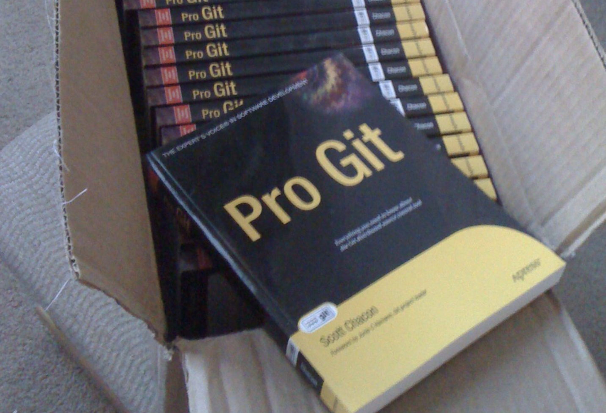
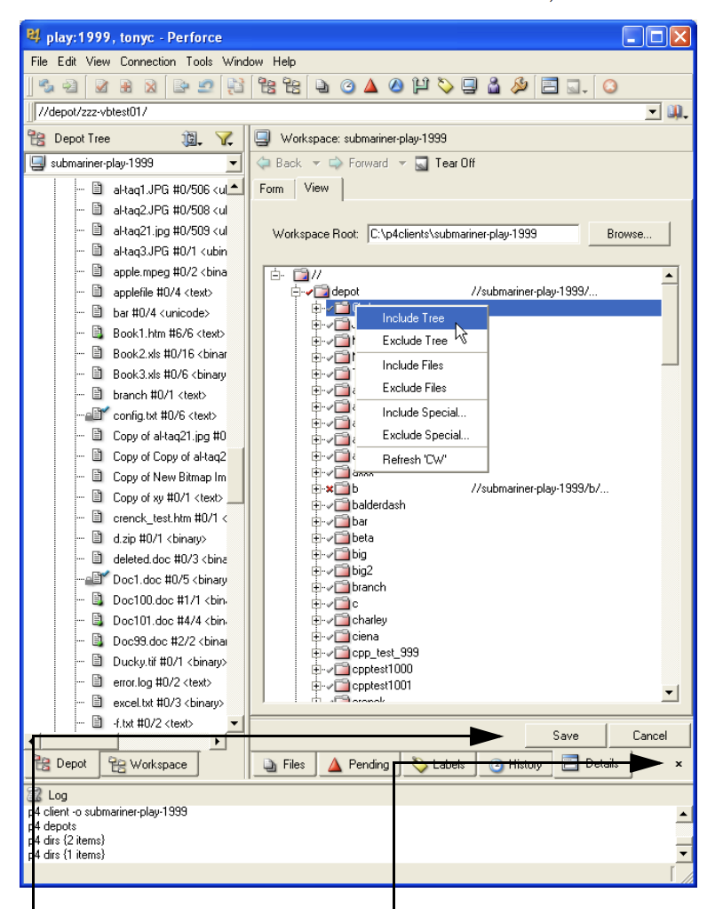
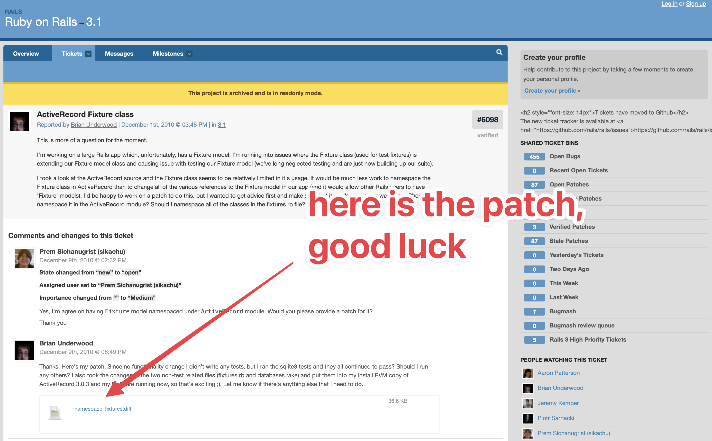
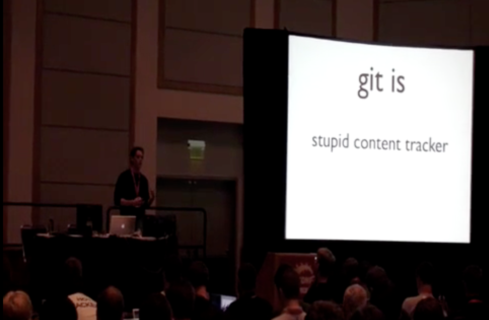
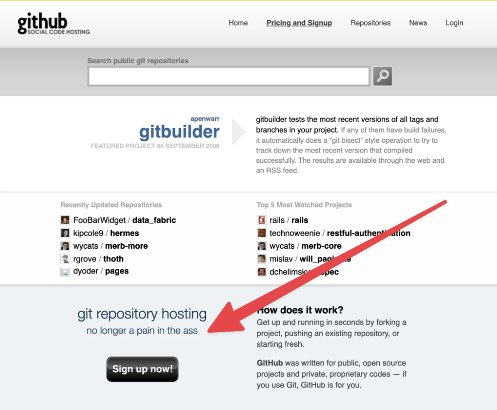
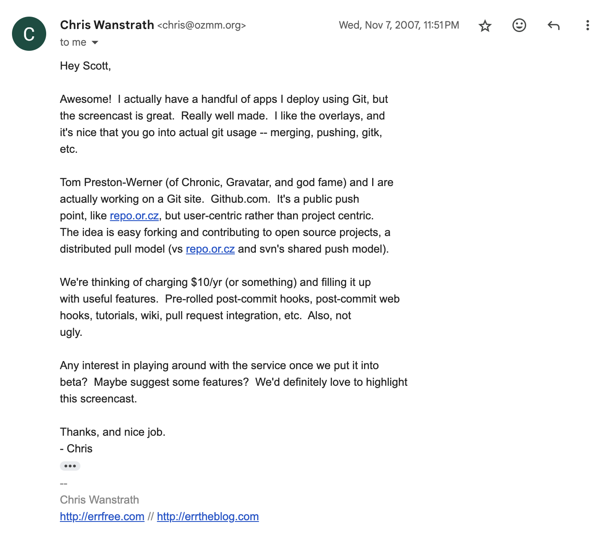
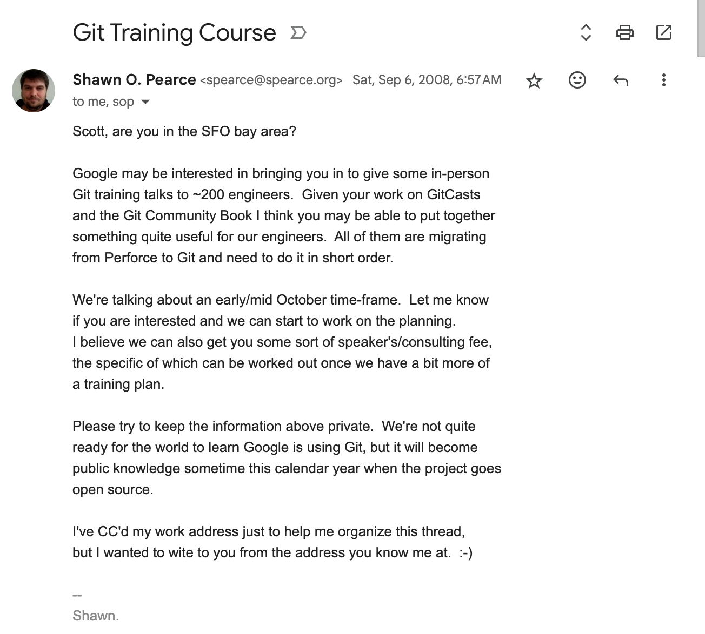
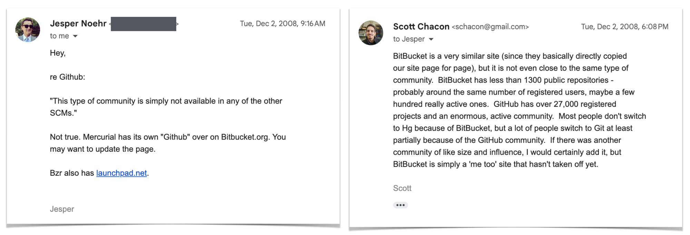
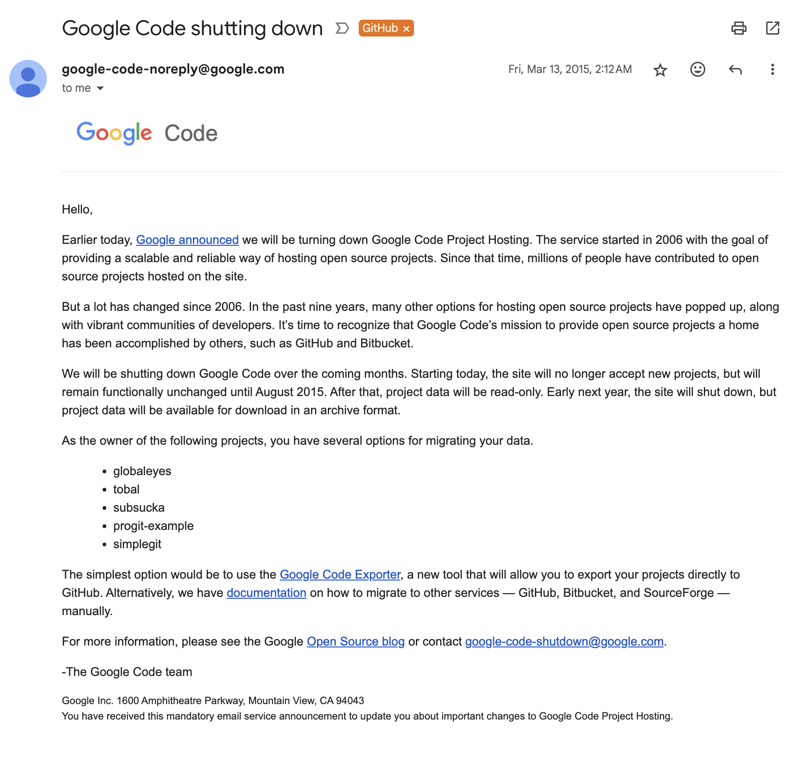

A few days ago, a video produced by [@t3dotgg](https://www.youtube.com/@t3dotgg?ref=blog.gitbutler.com) was posted to his very popular YouTube channel where he reviews an article written by the Graphite team titled “[How](https://graphite.dev/blog/github-monopoly-on-code-hosting?ref=blog.gitbutler.com) [GitHub replaced SourceForge as the dominant code hosting platform](https://graphite.dev/blog/github-monopoly-on-code-hosting?ref=blog.gitbutler.com)”.   

几天前，[@t3dotgg](https://www.youtube.com/@t3dotgg?ref=blog.gitbutler.com) 制作的一段视频被发布到他非常受欢迎的 YouTube 频道上，他在其中评论了 Graphite 团队撰写的一篇题为“GitHub [如何](https://graphite.dev/blog/github-monopoly-on-code-hosting?ref=blog.gitbutler.com)[取代 SourceForge 成为主导代码托管平台](https://graphite.dev/blog/github-monopoly-on-code-hosting?ref=blog.gitbutler.com)”的文章。

Theo’s title was a little more succinct, “[Why](https://youtu.be/4FNNlMtPS-0?ref=blog.gitbutler.com) [GitHub Won](https://youtu.be/4FNNlMtPS-0?ref=blog.gitbutler.com)”.  

Theo 的标题更简洁一些，“[为什么](https://youtu.be/4FNNlMtPS-0?ref=blog.gitbutler.com) [GitHub 获胜](https://youtu.be/4FNNlMtPS-0?ref=blog.gitbutler.com)”。

<iframe width="200" height="113" src="https://www.youtube.com/embed/4FNNlMtPS-0?feature=oembed" frameborder="0" allow="accelerometer; autoplay; clipboard-write; encrypted-media; gyroscope; picture-in-picture; web-share" referrerpolicy="strict-origin-when-cross-origin" allowfullscreen="" title="Why GitHub Won"></iframe>

  

Being a cofounder of [GitHub](https://github.com/?ref=blog.gitbutler.com), I found Greg’s article and Theo’s subsequent commentary fun, but figured that it might be interesting to write up my own take on the reasoning behind the rise and dominance of GitHub and perhaps correct a few things that were not quite right from their outside analysis.  

作为 [GitHub](https://github.com/?ref=blog.gitbutler.com) 的联合创始人，我发现 Greg 的文章和 Theo 随后的评论很有趣，但我认为写下我自己对 GitHub 崛起和主导背后的原因的看法可能会很有趣，也许可以纠正一些从外部分析中不太正确的事情。  

 

Being at the very center of phenomena like this can certainly leave you with blind spots, but unlike these youngsters, I was actually there.  

身处这种现象的中心肯定会给你留下盲点，但与这些年轻人不同的是，我真的在那里。  

Hell, I [wrote the book](https://git-scm.com/book/en/v2?ref=blog.gitbutler.com).  

妈的，这本书是我[写的](https://git-scm.com/book/en/v2?ref=blog.gitbutler.com)。

Unboxing of the first batch of the first edition of my Pro Git book, 2009  

我的 Pro Git 书第一版的第一批开箱，2009 年

So here’s an _insider’s_ take on why GitHub won.  

以下是_内部人士_对 GitHub 获胜原因的看法。

## TLDR  

顶级域名

If you want a very short read, here is the quick version of why _I_ believe GitHub won and why you’re probably using the site to this day.  

如果您想要一个非常简短的阅读，以下是_我认为_ GitHub 获胜的原因以及为什么您可能至今仍在使用该网站的快速版本。

I can boil it down to **exactly two reasons** that happened to resonate with each other at the perfect frequency.  

我可以将其归结**为恰好**以完美的频率相互共振的两个原因。

1.  GitHub started at the right time  
    
    GitHub 在正确的时间启动
2.  GitHub had good taste  
    
    GitHub 的品味不错

All four GitHub cofounders had flops both before and after GitHub. Chris and PJ couldn’t quite make [FamSpam](https://web.archive.org/web/20081202124457/http://famspam.com/) work before GitHub, Tom and I couldn’t quite make [Chatterbug](https://chatterbug.com/en/?ref=blog.gitbutler.com) explode after GitHub.  

所有四位 GitHub 联合创始人在 GitHub 之前和之后都失败了。Chris 和 PJ 在 GitHub 之前无法让 [FamSpam](https://web.archive.org/web/20081202124457/http://famspam.com/) 发挥作用，Tom 和我无法在 GitHub 之后让 [Chatterbug](https://chatterbug.com/en/?ref=blog.gitbutler.com) 爆炸。  

I think both of these ventures had good taste and great product, but it wasn’t the right place or time or market or whatever for them to become GitHub level.  

我认为这两家公司都有很好的品味和出色的产品，但这不是他们成为 GitHub 级别的合适地点、时间、市场或其他任何位置。  

 

At the time GitHub was starting, [distributed](https://en.wikipedia.org/wiki/GNU_arch?ref=blog.gitbutler.com) [open](https://web.archive.org/web/20230506175749/http://bazaar.canonical.com/en/) [source](https://en.wikipedia.org/wiki/Monotone_(software)?ref=blog.gitbutler.com) [version](https://en.wikipedia.org/wiki/Mercurial?ref=blog.gitbutler.com) [control](https://en.wikipedia.org/wiki/Darcs?ref=blog.gitbutler.com) [tools](https://git-scm.com/?ref=blog.gitbutler.com) were starting to get useful, solid and adopted and there was nobody around to seriously (much less commercially) host them.  

在 GitHub 成立时，[分布式](https://en.wikipedia.org/wiki/GNU_arch?ref=blog.gitbutler.com)[开源](https://web.archive.org/web/20230506175749/http://bazaar.canonical.com/en/)?ref=blog.gitbutler.com)[版本控制](https://en.wikipedia.org/wiki/Mercurial?ref=blog.gitbutler.com)[工具](https://git-scm.com/?ref=blog.gitbutler.com)开始变得有用、可靠和采用，而且周围没有人认真（更不用说商业上）托管它们。  

Big hosts didn’t care and smaller players weren’t serious.  

大东道主不在乎，小玩家也不认真。

Furthermore, the players (Sourceforge, Google Code, etc) who eventually did care, after seeing Git and GitHub rising in popularity, simply had no taste.  

此外，在看到 Git 和 GitHub 越来越受欢迎之后，最终关心的玩家（Sourceforge、Google Code 等）根本没有品味。  

They could never have competed with a developer tools company whose cofounders were all product-focused open source software developers.  

他们永远无法与一家开发工具公司竞争，该公司的联合创始人都是专注于产品的开源软件开发人员。

We cared about the developer experience and had the creativity to throw away assumptions about what it was supposed to be and build how we wanted to work.  

我们关心开发人员的体验，并有创造力来抛弃关于它应该是什么的假设，并构建我们想要的工作方式。  

Everyone else tried to build what they thought they could sell to advertisers or CTOs.  

其他人都试图构建他们认为可以销售给广告商或 CTO 的东西。

**That’s why GitHub won.  

这就是 GitHub 获胜的原因。**

Now that that’s out of the way, if you’re interested in some storytelling, let me lead you down the path of how some of this actually unfolded from the inside.  

现在我们已经不碍事了，如果你对一些故事感兴趣，让我带你了解一下其中一些实际上是如何从内部展开的。

## The Environment  

环境

Let’s go back to the beginning of the story.   

让我们回到故事的开头。

I’ll dig a little more into the “GitHub started at the right time” theme from the point of view of a software developer circa 2005.  

我将从 2005 年左右的软件开发人员的角度更深入地探讨“GitHub 在正确的时间启动”主题。  

This is when Git had it’s [first commit](https://github.com/git/git/commit/e83c5163316f89bfbde7d9ab23ca2e25604af290?ref=blog.gitbutler.com) by Linus and Mercurial had it’s [first commit](https://repo.mercurial-scm.org/hg/rev/9117c6561b0b?ref=blog.gitbutler.com) by Olivia.  

这是 Git 的第一个[提交](https://github.com/git/git/commit/e83c5163316f89bfbde7d9ab23ca2e25604af290?ref=blog.gitbutler.com)是 Linus 提交，Mercurial 的第一个[提交](https://repo.mercurial-scm.org/hg/rev/9117c6561b0b?ref=blog.gitbutler.com)是 Olivia 提交。

My Windows Vista, Ubuntu and Mac Tiger desktops, circa a stupid long time ago.  

我的 Windows Vista、Ubuntu 和 Mac Tiger 台式机，大约是很久以前的事情了。

What was it like to develop software almost 20 years ago and how was this an environment where Git could win over people and a GitHub could be born?  

大约 20 年前开发软件是什么感觉，Git 如何赢得人们的青睐，GitHub 诞生了？

Mac OS Tiger, released in 2005. If you were using a Mac, it looked something like this.  

Mac OS Tiger，2005 年发布。如果您使用的是 Mac，它看起来就像这样。

If you were a software developer in 2005, you were probably (hopefully) using a centralized version control system like Subversion.  

如果你在 2005 年是一名软件开发人员，你可能（希望）正在使用像 Subversion 这样的集中式版本控制系统。  

I professionally used [RCS](https://en.wikipedia.org/wiki/Revision_Control_System?ref=blog.gitbutler.com), [CVS](https://en.wikipedia.org/wiki/Concurrent_Versions_System?ref=blog.gitbutler.com), [Subversion](https://subversion.apache.org/?ref=blog.gitbutler.com) and [Perforce](https://www.perforce.com/perforce/doc.051/manuals/p4guide/03_quickstart.html?ref=blog.gitbutler.com#1043460) before Git came along.  

在 Git 出现之前，我专业地使用 [RCS](https://en.wikipedia.org/wiki/Revision_Control_System?ref=blog.gitbutler.com)、[CVS](https://en.wikipedia.org/wiki/Concurrent_Versions_System?ref=blog.gitbutler.com)、[Subversion](https://subversion.apache.org/?ref=blog.gitbutler.com) 和 [Perforce](https://www.perforce.com/perforce/doc.051/manuals/p4guide/03_quickstart.html?ref=blog.gitbutler.com#1043460)。  

Hell, I was actually in a company that FTP'd it's PHP files directly to the production server.  

妈的，我实际上在一家公司工作，它把 PHP 文件直接 FTP 到生产服务器。

Now, if you were working on proprietary commercial software, centralized version control systems like SVN honestly wasn’t the most horrible thing.  

现在，如果你正在开发专有的商业软件，老实说，像 SVN 这样的集中式版本控制系统并不是最可怕的事情。  

It was pretty simple to checkout, make changes, check back in.  

结账、更改、再次签入非常简单。  

Branching and merging completely sucked but in a lot of situations it could basically be avoided (I’m not sure I ever really used branching in Subversion or Perforce).  

分支和合并完全很糟糕，但在很多情况下它基本上是可以避免的（我不确定我是否真的在 Subversion 或 Perforce 中使用过分支）。  

 

People probably complain more about Git today than they did about SVN back then, to be honest - the user interface and mental model is arguably simpler than in Git.  

老实说，今天人们对 Git 的抱怨可能比当时对 SVN 的抱怨还要多——用户界面和心智模型可以说比 Git 更简单。

Perforce 2005.1 visual client. I spent a loooot of time hating this software.  

Perforce 2005.1 可视化客户端。我花了很多时间讨厌这个软件。

The big problem that I think started coming to a head around this time was not in the world of professional development within closed, trusted teams. The big problem was within the growing world of open source.  

我认为在这个时候开始出现的大问题不是在封闭的、值得信赖的团队中的专业发展领域。最大的问题在于不断增长的开源世界。

You see, open source was [barely a thing before this time](https://blog.gitbutler.com/the-future-of-open-source/#a-quick-history-of-open-source), especially compared to today.  

你看，在此之前，开源[几乎不存在](https://blog.gitbutler.com/the-future-of-open-source/#a-quick-history-of-open-source)，尤其是与今天相比。  

Most of you kids probably don’t remember a time where there weren’t millions of open source projects around, but the phrase was only _coined_ in 1998.   

你们中的大多数孩子可能不记得没有数百万个开源项目的时代，但这个词是在 1998 年_才创造_出来的。

To get a sense of scale, Dirk Riehle [published a paper in 2008](https://dirkriehle.com/publications/2008-selected/the-total-growth-of-open-source/comment-page-1/?ref=blog.gitbutler.com) analyzing global open source project trends and they estimated that there were a _total_ of 18,000 active open source projects in the world at that time - in 2005, certainly far fewer.  

为了获得规模感，Dirk Riehle [在 2008 年发表了一篇论文](https://dirkriehle.com/publications/2008-selected/the-total-growth-of-open-source/comment-page-1/?ref=blog.gitbutler.com)，分析了全球开源项目趋势，他们估计当时世界上_共有_ 18,000 个活跃的开源项目——在 2005 年，肯定要少得多。

Total open source projects.  

开源项目总数。  

From “The Total Growth of Open Source”, 2008, published by Amit Deshpande and Dirk Riehle  

摘自《开源的全面增长》，2008 年，由 Amit Deshpande 和 Dirk Riehle 出版

To put this in perspective, there are over **280 _million_** public repositories on GitHub alone today.  

从这个角度来看，仅今天 GitHub 上就有超过 **2.8 _亿_**个公共仓库。

So, why did open source help usher in the era of Git and GitHub?  

那么，为什么开源帮助开创了 Git 和 GitHub 的时代呢？

Because open source was growing fast and centralized version control systems were particularly bad at open contribution strategies.  

因为开源发展迅速，而且集中式版本控制系统特别不擅长开放贡献策略。  

That is, you couldn’t easily share a project publicly and then take contributions back into it in a simple manner.  

也就是说，你不能轻易地公开分享一个项目，然后以简单的方式将贡献带回其中。  

## Contributing to Open Source in 2005  

2005 年为 Open Source 做出贡献

Really, how bad could it have been?  

真的，情况会有多糟糕？

If you would like to see me talk about what open source contributing was like via my AWS Tokyo keynote 10 years ago, check it out and then you can skip the next few paragraphs:  

如果您想看到我通过 10 年前的 AWS 东京主题演讲来谈论开源贡献是什么样的，请查看它，然后您可以跳过接下来的几段：

<iframe width="200" height="113" src="https://www.youtube.com/embed/2fBNuK6CRmA?start=733&amp;feature=oembed" frameborder="0" allow="accelerometer; autoplay; clipboard-write; encrypted-media; gyroscope; picture-in-picture; web-share" referrerpolicy="strict-origin-when-cross-origin" allowfullscreen="" title="AWS Summit Tokyo 2015 - DevCon Opening Keynote with Scott Chacon (GitHub, Inc. Co-Founder)"></iframe>

Me talking about how we used to contribute to open source before GitHub.  

我谈到了在 GitHub 之前我们过去是如何为开源做出贡献的。  

I recommend watching it at 1.5x, I had to speak slowly for the translators.  

我建议以 1.5 倍的速度观看，我不得不为翻译缓慢说话。

Basically, you could make your Subversion server read only for unauthenticated users, this is generally how you hosted an open source project (or you put a tarball somewhere occasionally).  

基本上，你可以将你的 Subversion 服务器设置为只对未经身份验证的用户只读，这通常是你托管开源项目的方式（或者你偶尔在某个地方放一个 tarball）。

If you wanted to contribute, essentially you had to:  

如果你想做出贡献，基本上你必须：

-   checkout the latest version  
    
    查看最新版本
-   make your changes  
    
    进行更改
-   generate a patch file with GNU diff  
    
    使用 GNU diff 生成补丁文件
-   upload that patch file to a ticketing system or email list used by the project  
    
    将该补丁文件上传到项目使用的工单系统或电子邮件列表

Then the maintainer needed to:  

然后，维护者需要：

-   pull down that patch file  
    
    下拉该补丁文件
-   apply it to their project to see if it  
    
    将其应用于他们的项目，看看它是否
    -   applied cleanly  
        
        清洁应用
    -   worked properly  
        
        工作正常
-   either submit feedback, make changes, or commit the change  
    
    提交反馈、进行更改或提交更改

There are still artifacts of this around the internet. I used the [Trac](https://trac.edgewall.org/?ref=blog.gitbutler.com) project at some point for this type of project, you can still see their [Submitting Patches guide](https://trac.edgewall.org/wiki/TracDev/SubmittingPatches?ref=blog.gitbutler.com) and an example of how a [change would be suggested](https://trac.edgewall.org/ticket/2553?ref=blog.gitbutler.com#no1).   

互联网上仍然存在这样的工件。我在某个时候将 [Trac](https://trac.edgewall.org/?ref=blog.gitbutler.com) 项目用于此类项目，您仍然可以查看他们的 [提交补丁 指南](https://trac.edgewall.org/wiki/TracDev/SubmittingPatches?ref=blog.gitbutler.com)以及如何[建议更改](https://trac.edgewall.org/ticket/2553?ref=blog.gitbutler.com#no1)的示例。

**It was a goddamn nightmare.  

这真是一场该死的噩梦。**

The [Rails project](https://rails.lighthouseapp.com/projects/8994/tickets/300-unsigned-integers-for-mysql?ref=blog.gitbutler.com), as well as my friends (and future GitHub cofounders) at [Err](http://errtheblog.com/?ref=blog.gitbutler.com) used a similar ticketing system called [Lighthouse](https://err.lighthouseapp.com/projects/466/home?ref=blog.gitbutler.com) (which is mind-blowingly still up) and one of my earliest open source projects was a command line tool called [git-lighthouse](https://github.com/schacon/git-lighthouse?ref=blog.gitbutler.com) that could simplify the process of pulling down and applying attached patches from tickets you wanted to test out.  

[Rails 项目](https://rails.lighthouseapp.com/projects/8994/tickets/300-unsigned-integers-for-mysql?ref=blog.gitbutler.com)以及我在 [Err](http://errtheblog.com/?ref=blog.gitbutler.com) 的朋友（以及未来的 GitHub 联合创始人）使用了一个名为 [Lighthouse](https://err.lighthouseapp.com/projects/466/home?ref=blog.gitbutler.com) 的类似工单系统（它仍然令人震惊），我最早的开源项目之一是一个名为 [git-lighthouse](https://github.com/schacon/git-lighthouse?ref=blog.gitbutler.com) 的命令行工具，它可以简化从您想要测试的工单中拉取和应用附加补丁的过程。  

 

[Here](https://rails.lighthouseapp.com/projects/8994/tickets/6098-activerecord-fixture-class?ref=blog.gitbutler.com) is an example of 3 different versions of a patch that were submitted to the Rails project in the early days.  

[以下是](https://rails.lighthouseapp.com/projects/8994/tickets/6098-activerecord-fixture-class?ref=blog.gitbutler.com)早期提交给 Rails 项目的 3 个不同版本的补丁示例。

This process sucked enough that when something came around that simplified it, it was quickly embraced.  

这个过程足够糟糕，以至于当出现简化它的事情时，它很快就被接受了。  

And that something was GitHub. But first, we needed a Git.  

这个东西就是 GitHub。但首先，我们需要一个 Git。

## The Rise of Git  

Git 的兴起

Git actually started from the fact that Linus Torvalds really liked an (at the time) commercial version control system called [BitKeeper](https://www.bitkeeper.org/?ref=blog.gitbutler.com). It was actually built specifically to help simplify the existing kernel development process.  

Git 实际上是从 Linus Torvalds 非常喜欢一个（当时的）名为 [BitKeeper](https://www.bitkeeper.org/?ref=blog.gitbutler.com) 的商业版本控制系统开始的。它实际上是专门为帮助简化现有内核开发过程而构建的。

If it had been open source or had better licensing terms, there probably would have been no Git or GitHub.  

如果它是开源的或有更好的许可条款，可能就不会有 Git 或 GitHub。

However, what happened instead was that one of the Linux developers reverse engineered the protocol, breaking the licensing terms, and BitKeeper and Linus determined that the spat that followed was untenable and they mutually decided to part ways.  

然而，相反，其中一名 Linux 开发人员对协议进行了逆向工程，违反了许可条款，BitKeeper 和 Linus 确定随后的争吵是站不住脚的，他们共同决定分道扬镳。

So Linus took some of the concepts that BitKeeper opened his eyes to, threw together the simplest thing he thought would solve his problems with those principles in mind, and called the new project Git, the “[information](https://github.com/git/git/commit/e83c5163316f89bfbde7d9ab23ca2e25604af290?ref=blog.gitbutler.com) [manager from hell](https://github.com/git/git/commit/e83c5163316f89bfbde7d9ab23ca2e25604af290?ref=blog.gitbutler.com)”.  

因此，Linus 采用了 BitKeeper 大开眼界的一些概念，将他认为可以解决他的问题的最简单的东西放在一起，并牢记这些原则，并将新项目 Git 称为“[来自地狱](https://github.com/git/git/commit/e83c5163316f89bfbde7d9ab23ca2e25604af290?ref=blog.gitbutler.com)[的信息](https://github.com/git/git/commit/e83c5163316f89bfbde7d9ab23ca2e25604af290?ref=blog.gitbutler.com)管理器”。

It was fairly quickly embraced by several people in the Linux community and slowly grew into an actual, sort of, version control system.  

它很快就被 Linux 社区中的几个人接受了，并慢慢成长为一个实际的、某种版本控制系统。

There are several reasons why Git felt awesome at the time. They were:  

Git 在当时感觉很棒有几个原因。他们是：

-   branching and merging were dreams rather than nightmares  
    
    分支和合并是梦想，而不是噩梦
-   it was stupendously fast  
    
    它的速度非常快
-   permissions were vastly simpler  
    
    权限要简单得多

In the early days of Git, I would do talks where I would just go on stage, create a few branches, commit changes into them, switch between them and then merge them together, all in 60 seconds.  

在 Git 的早期，我会做一些演讲，我只是走上舞台，创建几个分支，将更改提交到其中，在它们之间切换，然后将它们合并在一起，所有这些都在 60 秒内完成。  

I would _literally_ see peoples jaw’s drop. Some of them would think I was faking the demo.  

我_真的_会看到人们的下巴掉下来。他们中的一些人会认为我在伪造演示。

I just cannot tell you how magical it felt in 2006 to be able to switch and merge contexts that fast and easily.  

我只是无法告诉你在 2006 年能够如此快速轻松地切换和合并上下文的感觉是多么神奇。  

In Subversion this was a total nightmare.  

在 Subversion 中，这简直是一场噩梦。

Baby Scott talking about Git at RailsConf 2008  

Baby Scott 在 RailsConf 2008 上谈论 Git

Not having to go over a network to negotiate a commit with a central server was also incredible.  

不必通过网络与中央服务器协商提交也令人难以置信。  

It felt like a rocket ship. Everything was _so fast_.  

感觉就像一艘火箭飞船。一切都_太快_了。

And probably most importantly, you could fork the repository incredibly easily, which meant that you could host your own copy of a repository and have your own write access and push changes there that other people could pull down into _their_ fork.  

可能最重要的是，您可以非常轻松地分叉存储库，这意味着您可以托管自己的存储库副本，并拥有自己的写入权限，并将更改推送到其他人可以拉取_到他们的_分叉中。  

The Linux project started doing this early on - for larger changes, they could send a request to pull changes from a hosted fork and Linus could very easily do so.  

Linux 项目很早就开始这样做了——对于更大的更改，他们可以发送请求以从托管的 fork 中提取更改，而 Linus 可以很容易地做到这一点。

In fact, if you’re wondering where the terminology “Pull Request” came from, this is it. Git has a [`git request-pull`](https://git-scm.com/docs/git-request-pull?ref=blog.gitbutler.com) command that would format an email for sending to a mailing list to help make this process simpler.  

事实上，如果您想知道术语 “Pull Request” 从何而来，就是这样。Git 有一个 [`git request-pull`](https://git-scm.com/docs/git-request-pull?ref=blog.gitbutler.com) 命令，该命令可以格式化电子邮件以发送到邮件列表，以帮助简化此过程。  

When GitHub added the ability to basically generate this same type of message, we decided that a request to pull should be called a Pull Request. _(A little more backstory on that_ [_here_](https://x.com/chacon/status/1823416898379505749?ref=blog.gitbutler.com) _if you’re curious)_  

当 GitHub 添加基本上生成相同类型消息的功能时，我们决定将拉取请求称为拉取请求。（_如果你好奇_的话，[_这里有_](https://x.com/chacon/status/1823416898379505749?ref=blog.gitbutler.com)_更多关于这个的背景故事_）

Some people think that developers liked Git because it was distributed and you got the whole history when you cloned, which meant you could share locally, etc. I disagree.  

有些人认为开发人员喜欢 Git，因为它是分布式的，而且你在克隆时可以获得整个历史记录，这意味着你可以在本地共享，等等。我不同意。  

I don’t think almost anybody really cared about any of that.  

我认为几乎没有人真正关心这些。  

Distributed was cool because you could do operations _fast_ and you could host your own full, writeable fork which made permissions much simpler.  

分布式很酷，因为您可以_快速_执行操作，并且可以托管自己的完整、可写的分支，这使得权限变得更加简单。

It was cool because contributing went from a problem of who had permission to push into the simplicity of who had something interesting to pull.  

这很酷，因为贡献从谁有权推动的问题变成了谁有有趣的东西要拉的简单问题。

And of course, this last point led directly to GitHub.  

当然，最后一点直接导致了 GitHub。

## The Rise of GitHub  

GitHub 的兴起

Late last year, I interviewed my GitHub cofounder Tom, and among the things we discussed, he told the story of how he got the initial idea of working on GitHub.  

去年年底，我采访了我的 GitHub 联合创始人 Tom，在我们讨论的事情中，他讲述了他是如何产生在 GitHub 上工作的最初想法的故事。

Essentially, when he was working at [Powerset](https://en.wikipedia.org/wiki/Powerset_(company)?ref=blog.gitbutler.com), Tom’s team started using Git internally.  

从本质上讲，当他在 [Powerset](https://en.wikipedia.org/wiki/Powerset_(company)?ref=blog.gitbutler.com) 工作时，Tom 的团队开始在内部使用 Git。  

However, it was a pain in the ass to add other team members to the internal server, because Git’s main protocol was over SSH, which means you need a user with ssh privileges on the machine.  

但是，将其他团队成员添加到内部服务器是一件令人头疼的事情，因为 Git 的主协议是通过 SSH 进行的，这意味着您需要在计算机上具有 ssh 权限的用户。  

For everyone. It was difficult and, for most of the team, not worth it.  

适合所有人。这很困难，对于团队中的大多数人来说，这不值得。  

This spawned the concept for him of making this process as easy as possible.   

这为他催生了使此过程尽可能简单的概念。

Git is awesome, Git hosting is a pain in the ass. This is why Tom started working on GitHub.  

Git 很棒，Git 托管很麻烦。这就是 Tom 开始在 GitHub 上工作的原因。

Why GitHub was started. To ease ass pain.  

为什么启动 GitHub。缓解屁股疼痛。

I went through my old emails to see if I could find the first time I heard about Tom’s “GitHub” project, and it was this email from Chris responding to a [Git screencast](https://youtu.be/7x98k_IQlcY?ref=blog.gitbutler.com) I made in late 2007.  

我翻阅了我的旧电子邮件，看看我是否能找到我第一次听说 Tom 的“GitHub”项目的时间，正是 Chris 对我在 2007 年末制作的 [Git 截屏视频](https://youtu.be/7x98k_IQlcY?ref=blog.gitbutler.com)的回复。

It was still a secret side project between the two of them at that point (_also Chris… lower-case ‘h’?_) and it’s when I started chatting with Chris and Tom about the [Git/Ruby libraries](https://github.com/mojombo/grit?ref=blog.gitbutler.com) that ran the site, and [eventually how](https://github.blog/news-insights/the-library/supercharged-ruby-git/?ref=blog.gitbutler.com) I wiggled my way into the project and company.  

那时这仍然是他们两个之间的秘密副业（_也是 Chris......小写 'h'？_就在那时，我开始与 Chris 和 Tom 聊起运行该网站的 [Git/Ruby 库](https://github.com/mojombo/grit?ref=blog.gitbutler.com)，以及[最终我是如何](https://github.blog/news-insights/the-library/supercharged-ruby-git/?ref=blog.gitbutler.com)进入这个项目和公司的。

There are a few interesting things about this pitch.   

这个推销有一些有趣的事情。

The first is that they compared it to the only other real public Git hosting site, [repo.or.cz](https://repo.or.cz/?ref=blog.gitbutler.com) (which also miraculously is still running, if you want to see what the state of Git hosting was pre-GitHub), but made a _crucial_ innovation over that site and every other hosting service like it, which is to make it user-centric rather than project-centric.  

首先，他们将它与唯一另一个真正的公共 Git 托管站点 [repo.or.cz](https://repo.or.cz/?ref=blog.gitbutler.com) 进行了比较（如果您想了解 Git 托管在 GitHub 之前的状态，它也奇迹般地仍在运行），但对该站点和所有其他类似的托管服务进行了_关键_创新，即使其以用户为中心，而不是以项目为中心。  

 Before this, if you wanted to host something on Sourceforge or whatever, you needed to grab the name.  

在此之前，如果你想在 Sourceforge 或其他任何东西上托管一些东西，你需要抓住这个名字。  

With GitHub, you can make any project you want named anything you want because it’s namespaced to _your user._  

使用 GitHub，您可以将任何您想要的项目命名为您想要的任何名称，因为它是为您的_用户命名的。_

The second was that they focused on a pull model rather than a push model (basically the permissions thing I talked about before).  

第二个是他们专注于拉取模型而不是推送模型（基本上是我之前谈到的权限）。

The third is that “not ugly” was a core feature. _GitHub had taste._  

第三个是“不丑”是一个核心功能。_GitHub 有品味。_

## Git Wins  

Git 获胜

This is why Git was cool and why GitHub was started to make using it easier, but the question is, why did _Git_ win? Lots of distributed systems sprang up during this time.  

这就是为什么 Git 很酷，为什么 GitHub 开始让使用它更容易，但问题是，_为什么 Git_ 会赢呢？在此期间，许多分布式系统涌现。  

Mercurial was similar in a lot of ways and better in many.  

Mercurial 在很多方面都很相似，而且在很多方面都更好。  

Why did Git come out on top in the great DVCS war?  

为什么 Git 在 DVCS 大战中名列前茅？

I think the answer there was “PR”.   

我认为答案是“PR”。

And there are two big PR gorillas fighting it out for the “_why did **Git** win”_ answer. The first was Linux and by extension, Linus.  

还有两只大型公关大猩猩争夺“_**为什么 Git** 赢了”_的答案。第一个是 Linux，引申开来是 Linus。  

The other was GitHub, and specifically the Rails community.  

另一个是 GitHub，特别是 Rails 社区。

## Maybe it was Linus/Linux  

也许是 Linus/Linux

The Linux project using Git and Linus having started the project gave **instant credibility** to it.  

使用 Git 的 Linux 项目和 Linus 启动了该项目，立即赋予了它**可信度**。

Everyone knew Linux, everyone knew Linus. If he made an amazing operating system that everyone uses _(at least for their servers, next year is the year of Linux on the desktop)_, he can certainly make a next-level version control system.  

每个人都知道 Linux，每个人都知道 Linus。如果他制作了一个每个人都在使用的出色操作系统_（至少对于他们的服务器来说，明年是桌面上的 Linux 年），_他肯定可以制作一个更高级的版本控制系统。  

And even if it’s difficult to use, that just means he’s smarter than us and we should try harder, right?  

即使它很难使用，那也只是意味着他比我们更聪明，我们应该更努力，对吧？

<iframe width="200" height="150" src="https://www.youtube.com/embed/4XpnKHJAok8?feature=oembed" frameborder="0" allow="accelerometer; autoplay; clipboard-write; encrypted-media; gyroscope; picture-in-picture; web-share" referrerpolicy="strict-origin-when-cross-origin" allowfullscreen="" title="Tech Talk: Linus Torvalds on git"></iframe>

This video is one of the first talks about Git online, circa 2007.  

这个视频是大约 2007 年最早的在线 Git 讲座之一。  

It's Linus talking about Git and distributed version control systems, then a brand new concept, at the Google campus.  

这是 Linus 在 Google 园区谈论 Git 和分布式版本控制系统，然后是一个全新的概念。

It came out in between when I started using Git (late 2005) and when I started at GitHub (mid 2008).  

它出现在我开始使用 Git （2005 年末） 和我开始在 GitHub 工作（2008 年年中）之间。  

I watched it several times, as did millions of people.  

我和数百万人都看了好几遍。  

Who doesn’t like listening to the Linux guy say “CVS is the dumbest shit that has ever been thought of, and everyone who disagrees is ugly and stupid”?  

谁不喜欢听 Linux 家伙说“CVS 是有史以来最愚蠢的狗屎，每个不同意的人都是丑陋和愚蠢的”？  

At _Google_!   

在 _Google_！

It’s just _great_ PR.  

这真是_很棒的_公关。

Beyond that, if you conflate Linux and Linus, which most people do, there is an argument that Linux itself pushed Git adoption indirectly through Android.  

除此之外，如果你把 Linux 和 Linus 混为一谈，大多数人都会这样做，就会有一种说法是 Linux 本身通过 Android 间接推动了 Git 的采用。

This is where I really don’t know how much impact my own efforts or GitHub’s efforts had compared to this big, quiet, behind-the-scenes side effect of Android becoming a thing at exactly the same time.  

这就是我真的不知道我自己的努力或 GitHub 的努力与 Android 同时成为事物的巨大、悄无声息的幕后副作用相比，产生了多大的影响。  

Or even, my personal impact in either or both of these fronts, doing Git talks and corporate training for years.  

甚至，我个人在这些方面的影响，多年来一直从事 Git 演讲和企业培训。

In early September 2008, right as Android 1.0 was being released (like 2 weeks after this email, but before I did the training), [Shawn Pearce](https://git.github.io/rev_news/2017/08/16/edition-30/?ref=blog.gitbutler.com#developer-spotlight-shawn-pearce), an early super hero of the Git ecosystem, wrote me this email asking me to help train the Google Android team on Git.  

2008 年 9 月初，就在 Android 1.0 发布之时（大概是这封电子邮件的 2 周后，但在我接受培训之前），Git 生态系统的早期超级英雄 [Shawn Pearce](https://git.github.io/rev_news/2017/08/16/edition-30/?ref=blog.gitbutler.com#developer-spotlight-shawn-pearce) 给我写了这封电子邮件，请我帮助培训 Google Android 团队使用 Git。

It’s difficult to determine what impact Android had in corporate Git adoption, but it certainly wasn’t zero.  

很难确定 Android 对企业 Git 采用有什么影响，但肯定不是零。  

While the Google/Android team was the first that I did corporate training for under the GitHub banner, I also eventually did Git training for engineering teams at Motorola, Qualcomm, Ericsson and Broadcom, just to name the _telecoms_. And that was before we hired a team to do this for us full time.  

虽然 Google/Android 团队是我在 GitHub 旗下进行企业培训的第一个团队，但我最终还为摩托罗拉、高通、爱立信和博通的工程团队进行了 Git 培训，仅举几_例。_那是在我们聘请一个团队全职为我们做这件事之前。

Linus pushed Git with his broad ranging brand of superstar nerd PR that Mercurial never got, but Android furthermore pushed Git uniquely, via it’s dependance from the Linux kernel, into massive companies out of pure practicality that also otherwise never would have happened for at least another decade.  

Linus 用他广泛的超级明星书PR 品牌推动了 Git，而 Mercurial 从未得到过，但 Android 进一步将 Git 独特地推向了大型公司，通过它对 Linux 内核的依赖，出于纯粹的实用性，这些公司至少在未来十年内也不会发生。

## Maybe it was GitHub  

也许是 GitHub

There is also, and I must say this with a grain of hopeful humility, a possibility that _GitHub_ was the determining factor in the eventual dominance of Git over Mercurial.  

还有一种可能性，我必须带着一丝充满希望的谦逊来说，_GitHub_ 可能是 Git 最终战胜 Mercurial 的决定性因素。

GitHub had the incredible luck to have an amazingly supportive and hip community that embraced us right out of the gate, namely the Ruby community.  

GitHub 非常幸运地拥有一个非常支持和时尚的社区，他们从一开始就欢迎我们，即 Ruby 社区。  

Within months, _everyone_ in the Ruby community put their stuff on GitHub.  

几个月内，Ruby 社区中的_每个人都_将他们的东西放在了 GitHub 上。  

Rails was the hot shit at that time, it was cooler than PHP, JS frameworks weren’t really around, there was no Node, etc. So everyone was paying attention to what the hip cats in the Ruby community were doing, they were the bleeding edge of cool development in the software world.  

Rails 在那个时候很热门，它比 PHP 更酷，JS 框架还没有真正存在，没有 Node，等等。所以每个人都在关注 Ruby 社区中的时髦猫在做什么，他们是软件世界酷开发的前沿。  

And they were using GitHub.  

他们正在使用 GitHub。

And it’s not just me, Linus _himself_ also recently said that from his perspective, the Ruby community unexpectedly made Git explode overnight.  

不仅仅是我，Linus _本人_最近也表示，从他的角度来看，Ruby 社区出乎意料地让 Git 在一夜之间爆炸。  

He doesn’t credit GitHub for that by name, but I think it’s impossible for anyone to argue that the Ruby community didn’t adopt Git in a very large part due to us.  

他没有点名归功于 GitHub，但我认为任何人都不可能争辩说 Ruby 社区没有采用 Git，这在很大程度上是由于我们。  

 

By the transitive property and some speculation, I’ll make the claim that **Linus in fact thinks that GitHub is the reason Git won**. 😀  

通过传递属性和一些推测，我将声称 **Linus 实际上认为 GitHub 是 Git 获胜的原因**。😀

<iframe width="200" height="113" src="https://www.youtube.com/embed/0m4hlWx7oRk?start=1032&amp;feature=oembed" frameborder="0" allow="accelerometer; autoplay; clipboard-write; encrypted-media; gyroscope; picture-in-picture; web-share" referrerpolicy="strict-origin-when-cross-origin" allowfullscreen="" title="Pat Gelsinger and Linus Torvalds talk Linux, open source, technology and more"></iframe>

“…the Ruby people, strange people, started using Git and suddenly it just exploded…”  

“…Ruby 人，奇怪的人，开始使用 Git，突然间它就爆炸了......”

Of course, the Ruby community adopting GitHub wasn’t random.   

当然，采用 GitHub 的 Ruby 社区并不是随机的。

I remember all of us - Chris, Tom, PJ and myself - sitting at tables at Ruby conferences with all the guys in the early Ruby community, showing them GitHub, selling them on Git, doing talks, etc. We were all speaking at the same conferences, we all drank beers together after Ruby meetups in SF.  

我记得我们所有人 - Chris、Tom、PJ 和我自己 - 在 Ruby 会议上与早期 Ruby 社区的所有成员一起坐在桌子旁，向他们展示 GitHub，在 Git 上销售它们，做演讲等。我们都在同一个会议上发言，在 Ruby 在旧金山聚会后我们一起喝啤酒。  

These were the guys who started Rails, Heroku, Twitter, jQuery, you name it.   

这些人创立了 Rails、Heroku、Twitter、jQuery，应有尽有。

It’s not that we were _selling_ it, it’s that we were all sharing what we were passionate about.  

这并不是因为我们_在推销_它，而是我们都在分享我们热衷的东西。  

There was a high level of trust in this community, the GitHub founders were a deep and authentic part of it, and we all tried each others stuff and supported each other.  

这个社区非常信任，GitHub 创始人是其中深刻而真实的一部分，我们都尝试了彼此的东西并相互支持。

Me and PJ at Scotland on Rails in March 2009 with a table full of amazing early Ruby peeps  

2009 年 3 月，我和 PJ 在 Scotland on Rails 上，桌上满是令人惊叹的早期 Ruby 窥视者

The Ruby community using GitHub meant that every conference talk everywhere had a GitHub plug in it.  

使用 GitHub 的 Ruby 社区意味着世界各地的每个会议演讲都有一个 GitHub 插件。  

Free advertising everywhere.  

到处都是免费广告。  

This meant that as more and more projects moved to or were started on GitHub, even people who liked Mercurial had no real choice but to use Git.  

这意味着，随着越来越多的项目迁移到 GitHub 或在 GitHub 上开始，即使是喜欢 Mercurial 的人也别无选择，只能使用 Git。  

After a while, it probably just wasn’t worth it.  

过了一段时间，这可能就是不值得。  

GitHub’s dominance in the hosting sphere just crushed Mercurial in just the span of a few years.  

GitHub 在托管领域的主导地位在短短几年内就压垮了 Mercurial。

In Mercurial land, there was BitBucket, which was started for Mercurial hosting and written in the Django framework, but I think we just had too much of a head start and there wasn’t enough differentiation.  

在 Mercurial 领域，有 BitBucket，它是为 Mercurial 托管而启动的，并使用 Django 框架编写，但我认为我们只是有太多的领先优势，没有足够的差异化。  

The Python community just didn't adopt it as aggressively as our Ruby community did.  

Python 社区并没有像我们的 Ruby 社区那样积极地采用它。

As early as December 2008, GitHub was hosting about 27,000 public repositories where BitBucket had a little over 1,000.  

早在 2008 年 12 月，GitHub 就托管了大约 27,000 个公共存储库，而 BitBucket 只有 1,000 多个。  

It became difficult to catch up.  

赶上来变得困难。

How do I remember those numbers you might ask?  

我怎么记住你可能会问的那些数字？  

Well, I had a website I put up called whygitisbetterthanx.com and this guy named Jesper emailed me to say that one of my points was incorrect, where I argued that Git has GitHub and Mercurial and Bazaar didn't have a GitHub.  

嗯，我建立了一个叫 whygitisbetterthanx.com 的网站，这个叫 Jesper 的人给我发了电子邮件，说我的一个观点是不正确的，我争辩说 Git 有 GitHub 和 Mercurial，而 Bazaar 没有 GitHub。  

I rather arrogantly argued that they're not in the same league.  

我相当傲慢地争辩说他们不在同一联盟。

Young Scott being a little bitchy. Sorry, Jesper.  

年轻的斯科特有点婊子。对不起，Jesper。

To his credit, he never called me out on my response, which now seems real snippy of me in hindsight.  

值得称赞的是，他从来没有对我的回应大声疾呼，现在事后看来，这似乎真的是我的轻描淡写。  

But it turns out that Jesper in fact was the founder of BitBucket. Whoopsie.  

但事实证明，Jesper 实际上是 BitBucket 的创始人。哎呀。

A year or so later, we met up with him in Amsterdam, drank some nice whiskey together and have remained friendly ever since.  

大约一年后，我们在阿姆斯特丹见到了他，一起喝了一些不错的威士忌，从那以后一直保持友好。

GitHub cofounder PJ Hyett and myself with BitBucket founder Jesper Noehr (black shirt) getting a friendly competitor whiskey in Amsterdam, circa 2009 or so.  

大约 2009 年左右，GitHub 联合创始人 PJ Hyett 和我以及 BitBucket 创始人 Jesper Noehr（黑衬衫）在阿姆斯特丹获得了一款友好的竞争对手威士忌。  

Always be friends with those you compete against.  

永远与你的竞争对手成为朋友。

## The Competitive Field Collapses  

竞争领域崩溃

In the end, whether it was GitHub that helped Git win, or Git that helped GitHub win, it was quickly over.  

最后，无论是帮助 Git 获胜的 GitHub，还是帮助 GitHub 获胜的 Git，它都很快结束了。  

 

In 2006-2007, people were first learning about distributed version control systems and Git and Mercurial were starting to fight it out.  

在 2006-2007 年，人们首次了解分布式版本控制系统，Git 和 Mercurial 开始展开争论。  

 

In 2008, GitHub launched.   

2008 年，GitHub 推出。

In 2011, both Google Code and BitBucket added Git support, which I’ll mark as the year that the nail was in the Mercurial coffin.  

在 2011 年，Google Code 和 BitBucket 都添加了 Git 支持，我将这一年标记为 Mercurial 棺材上的钉子。  

Git had won and GitHub was now essentially unbeatable.   

Git 赢了，GitHub 现在基本上是不可战胜的。

Just 4 years later, in 2015, Google Code just completely gave up and shut it’s service down.  

仅仅 4 年后的 2015 年，Google Code 就完全放弃并关闭了它的服务。  

In the email they sent out, they basically said “just move to GitHub”.  

在他们发送的电子邮件中，他们基本上是说 “迁移到 GitHub 就好”。  

If I remember correctly, they even reached out to us for help with the migration.  

如果我没记错的话，他们甚至向我们寻求帮助。

## So, Why Not Google Code?  

那么，为什么不是 Google Code呢？

Of course, while BitBucket started after us and so we had a head start, there were other hosting sites that existed before us.  

当然，虽然 BitBucket 在我们之后起步，因此我们取得了领先优势，但在我们之前还有其他托管网站。  

So why didn’t _they_ win?  

那么_他们_为什么没有获胜呢？

In early 2009, Google Code [added Mercurial support](https://arstechnica.com/information-technology/2009/04/google-code-adds-mercurial-version-control-system/?ref=blog.gitbutler.com#:~:text=Google%20has%20announced%20that%20it,more%20are%20preparing%20to%20migrate.) and Sourceforge added both Git and Mercurial support. So if these industry monsters had a _massive_ user head start _and_ had DVCS support only months after we launched, why didn’t they wipe the floor with us little guys?   

在 2009 年初，Google Code [添加了 Mercurial 支持](https://arstechnica.com/information-technology/2009/04/google-code-adds-mercurial-version-control-system/?ref=blog.gitbutler.com#:~:text=Google%20has%20announced%20that%20it,more%20are%20preparing%20to%20migrate.)，Sourceforge 添加了 Git 和 Mercurial 支持。那么，如果这些行业怪物拥有_巨大的_用户领先优势_，并且在_我们推出仅几个月后就获得了 DVCS 支持，那么他们为什么不和我们这些小家伙一起擦地板呢？

Not only _little_, but also nearly _completely_ un-funded.  

不仅_很少_，而且几乎_完全_没有资金。  

Chris was able to put a little bit of money in to bootstrap iirc, but the rest of us were totally broke and we didn't raise any outside funding.  

Chris 能够投入一点资金来引导 iirc，但我们其他人完全破产了，我们没有筹集到任何外部资金。

When Google Code launched Mercurial support, we were still 4 developers working out of cafes in South Beach with zero VC investment.  

当 Google Code 推出 Mercurial 支持时，我们仍然是 4 名开发人员，在南海滩的咖啡馆工作，风险投资为零。  

We [struck deals with our buddies](https://github.blog/news-insights/the-library/rolling-with-engine-yard/?ref=blog.gitbutler.com) (May 2008) at Engine Yard for help with hosting costs because we didn’t really have the cash.  

我们与 Engine Yard 的[朋友达成了交易](https://github.blog/news-insights/the-library/rolling-with-engine-yard/?ref=blog.gitbutler.com)（2008 年 5 月），寻求托管费用方面的帮助，因为我们真的没有现金。

How is it possible that this tiny, unfunded team made Google Code fold in just a few years?  

这个规模不大、没有资金的团队怎么可能在短短几年内就让 Google Code 倒闭呢？

**Side Note: GitHub Funding  

旁注：GitHub 资助**

As a side note, speaking of funding, the article I’m reacting to states _“VC investment wasn't an option for the cofounders.”_ This is _purely_ untrue.   

顺便说一句，说到资金，我对这篇文章的反应是_“风险投资不是联合创始人的选择”。_这_完全_是不正确的。

From the very first days, we were talking to VCs.  

从第一天起，我们就在与 VC 交谈。  

When PJ emailed me in July of 2008 to say they wanted me to join them and we should all make the leap, quit our respective jobs, and make this a full time thing instead of a side project, he explicitly said “_we've been talking to one VC in particular we like a lot and we want to raise a handful of money to do a few of things._” These were things like get an office, hire some people, etc.  

当 PJ 在 2008 年 7 月给我发电子邮件说他们希望我加入他们时，我们都应该迈出这一步，辞去各自的工作，让它成为全职工作，而不是一个副业，他明确表示“_我们一直在与一位我们特别喜欢的风险投资公司交谈，我们想筹集少量资金来做一些事情。_这些是诸如获得办公室、雇用一些人等。

It was always on the table, we could have done it at _literally_ any time. We considered and thoughtfully rejected the idea constantly over the years.  

它总是摆在桌面上，我们_几乎_随时都可以这样做。多年来，我们不断考虑并深思熟虑地拒绝这个想法。  

 We didn't really need an office. We didn't really need more people yet.  

我们真的不需要办公室。我们还不需要更多的人。

Not only that, we actually nearly rejected the idea when we were considering our [$100 million A round](https://a16z.com/announcement/github/?ref=blog.gitbutler.com) from Andreessen Horowitz, 4 years later.  

不仅如此，4 年后，当我们考虑从 Andreessen Horowitz 获得 [1 亿美元的 A 轮](https://a16z.com/announcement/github/?ref=blog.gitbutler.com)融资时，我们实际上几乎拒绝了这个想法。  

I remember vividly the night we all sat down for dinner at some restaurant on Folsum St in April of 2012 and argued very heatedly if we should take a capital round _at all_.   

我清楚地记得 2012 年 4 月的那个晚上，我们都在 Folsum St 的一家餐厅坐下来吃晚饭，非常激烈地争论我们是否应该进行_一轮资本_融资。

We basically had offers from [a16z](https://a16z.com/?ref=blog.gitbutler.com), [Benchmark](https://www.benchmark.com/?ref=blog.gitbutler.com), [Sequoia](https://www.sequoiacap.com/?ref=blog.gitbutler.com) and [Bessemer](https://www.bvp.com/?ref=blog.gitbutler.com) (pretty much the best VC firms on the planet) on the table and meanwhile us four assholes sat around and heatedly yelled at each other about whether or not we should tell all of them “thanks, but no thanks”.  

我们基本上有来自 [a16z](https://a16z.com/?ref=blog.gitbutler.com)、[Benchmark](https://www.benchmark.com/?ref=blog.gitbutler.com)、[Sequoia](https://www.sequoiacap.com/?ref=blog.gitbutler.com) 和 [Bessemer](https://www.bvp.com/?ref=blog.gitbutler.com)（几乎是地球上最好的风险投资公司）的报价，与此同时，我们四个混蛋围坐在一起，激烈地互相吼叫，询问我们是否应该告诉他们所有人“谢谢，但不谢谢”。  

Offers that other tech entrepreneurs would probably literally have killed for.  

其他科技企业家可能会为之付出代价的提议。

But the point is that it wasn’t that we couldn’t have raised money, but that we _didn’t even need to_ in order to take down the entire field.  

但关键是，并不是我们不能筹集到资金，而是我们_甚至不需要_筹集到资金来摧毁整个领域。

## GitHub Had Taste  

GitHub 有味道

The original article is correct, the other hosts focused on distribution and revenue streams. We cared about developers.  

原文是正确的，其他主持人专注于分销和收入流。我们关心开发人员。  

But it wasn’t about when they added Git, it never really mattered. [They never had any taste](https://www.youtube.com/watch?v=3KdlJlHAAbQ&ref=blog.gitbutler.com). They never cared about the developer workflow.  

但这并不是关于他们何时添加 Git，这从来都无关紧要。[他们从来没有任何品味](https://www.youtube.com/watch?v=3KdlJlHAAbQ&ref=blog.gitbutler.com)。他们从不关心开发人员的工作流程。  

They could have added Git at any time and I think they all still would have lost.  

他们可以随时添加 Git，但我认为他们仍然会失败。

You can try to explain it by the features or “value adds”, but the core takeaway that is still relevant to starting a startup today is more fundamental than if we had an activity feed or profile page or whatever.  

你可以尝试通过功能或 “增值” 来解释它，但今天仍然与创办初创公司相关的核心要点比我们拥有活动提要或个人资料页面或其他任何内容更基本。  

The much simpler, much more fundamentally interesting thing that I think showed in everything that we did was that we **built for ourselves**. We had taste. We cared about the experience.  

我认为我们所做的一切都表明了更简单、更有趣的事情，那就是我们**为自己打造**的。我们有品味。我们关心这种体验。

We were developers and we built what we wanted in order to enable how we wanted to ideally work.  

我们是开发人员，我们构建了我们想要的东西，以实现我们想要的理想工作方式。  

We were the only tool in the space built by developers for developers without PMs or accountants or CEOs trying to optimize for revenue rather than for developer experience.  

我们是该领域中唯一由开发人员为开发人员构建的工具，没有 PM、会计师或 CEO 试图优化收入而不是开发人员体验。

In the end we won because the open source community started to converge on distributed version control and we were the only ones in the hosting space that truly cared about how developers worked at all.  

最终我们赢了，因为开源社区开始在分布式版本控制上趋同，而我们是托管领域唯一真正关心开发人员工作方式的人。  

The only ones who questioned it, approached it from first principles, tried to make it better holistically rather than just throwing more features onto something existing in order to sell it.  

唯一质疑它的人，从第一原则出发，试图从整体上让它变得更好，而不是仅仅为了销售它而将更多功能投入到现有的东西上。

So, to sum up, we won because we started at the right time and we had taste.   

所以，总而言之，我们赢了，因为我们在正确的时间开始，我们有品味。

We were there when a new paradigm was being born and we approached the problem of helping people embrace that new paradigm with a developer experience centric approach that nobody else had the capacity for or interest in.  

当一种新的范式诞生时，我们就在那里，我们通过一种以开发人员体验为中心的方法来解决帮助人们接受这种新范式的问题，这是其他人没有能力或兴趣的。

I guess the question is, what is the next sea change in developer workflow, and who will have good enough taste to make it explode in the same way?  

我想问题是，开发人员工作流程的下一个巨变是什么，谁会有足够的品味让它以同样的方式爆发？

___

_PS: If you would like to watch me talk about Git and and some crazy things you can do with the Git internals, check out our_ [_YouTube channel_](https://www.youtube.com/@gitbutlerapp?ref=blog.gitbutler.com)_._  

_PS：如果你想看我谈论 Git，以及你可以用 Git 内部做的一些疯狂的事情，请查看我们的_ [_YouTube 频道_](https://www.youtube.com/@gitbutlerapp?ref=blog.gitbutler.com)_。_
