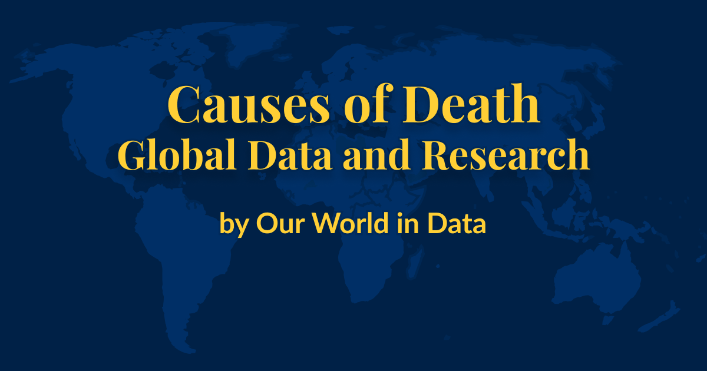
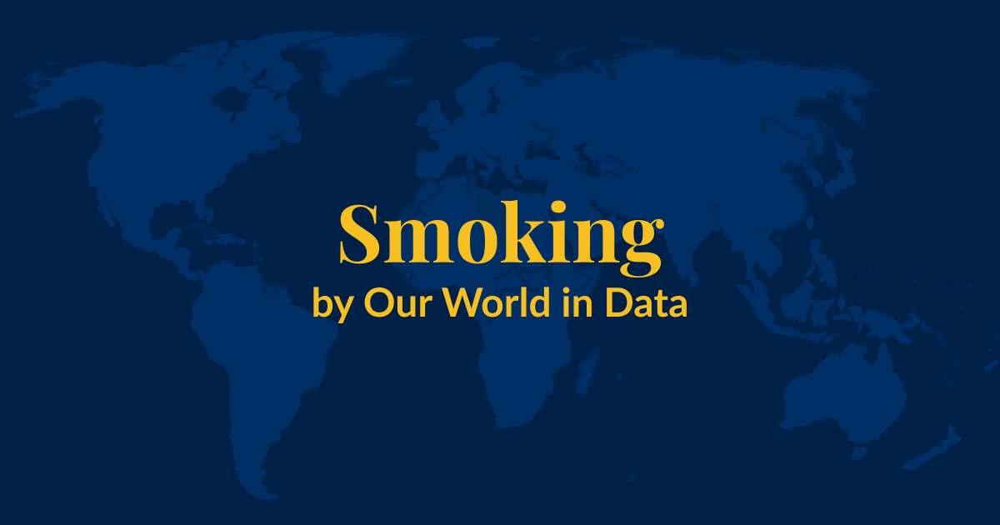
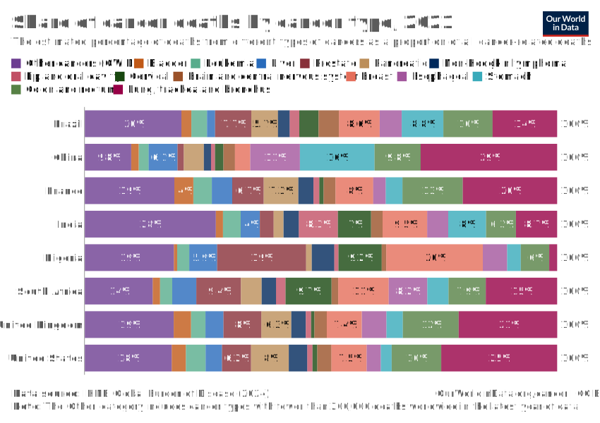
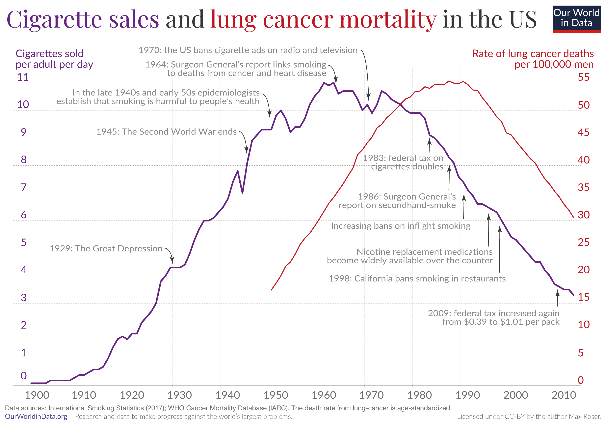

Cancer is one of the biggest health challenges worldwide. As of 2021, [around 15%](https://ourworldindata.org/grapher/share-of-deaths-by-cause) of all deaths were cancer deaths, making it one of the most common [causes of death](https://ourworldindata.org/causes-of-death) globally.  

癌症是全球最大的健康挑战之一。截至 2021 年，[约 15%](https://ourworldindata.org/grapher/share-of-deaths-by-cause) 的死亡是癌症死亡，使其成为全球最常见的[死亡原因](https://ourworldindata.org/causes-of-death)之一。

Cancers are a group of diseases in which abnormal cells multiply rapidly and can grow into tumors.  

癌症是一组异常细胞迅速繁殖并可生长成肿瘤的疾病。  

They can develop in different parts of the body and, in some cases, spread to other organs through the blood and lymph systems.  

它们可以在身体的不同部位发展，在某些情况下，会通过血液和淋巴系统扩散到其他器官。

As the global population grows larger and older, the number of cancer cases has also increased.  

随着全球人口的增加和老龄化，癌症病例的数量也有所增加。  

However, the age-standardized death rate from cancer has declined over time in many countries — due to improvements in diagnosis, research, medical advances, and public health efforts, as well as reductions in risk factors such as [smoking](https://ourworldindata.org/smoking) and some cancer-causing pathogens.  

然而，由于诊断、研究、医学进步和公共卫生工作的改进，以及[吸烟](https://ourworldindata.org/smoking)和一些致癌病原体等风险因素的减少，许多国家/地区的癌症年龄标准化死亡率随着时间的推移而下降。

On this page, we explore global data and research on different types of cancer.  

在此页面上，我们探索了有关不同类型癌症的全球数据和研究。  

This can help us better understand the risk factors for cancer, how cancer risks vary across the lifespan, how they differ worldwide, and how they have changed over time.  

这可以帮助我们更好地了解癌症的风险因素、癌症风险在生命周期中如何变化、它们在世界范围内有何不同以及它们如何随着时间的推移而变化。

### Research & Writing  

研究与写作[](https://ourworldindata.org/cancer#research-writing)

[### Smoking: How large of a global problem is it? And how can we make progress against it?  

吸烟：这是一个多大的全球性问题？我们如何才能在对抗它方面取得进展？

Every year, around 8 million people die prematurely as a result of smoking.  

每年约有 800 万人因吸烟而过早死亡。  

But there are things we can do to prevent this.  

但是我们可以采取一些措施来防止这种情况。](https://ourworldindata.org/smoking-big-problem-in-brief)

### Related topics  

相关主题[](https://ourworldindata.org/cancer#related-topics)

[

### Causes of Death  

死因

To find ways to save lives, it’s essential to know what people are dying from.  

要找到挽救生命的方法，必须了解人们死于什么。  

Explore global data and research on causes of death.  

探索全球死亡原因数据和研究。](https://ourworldindata.org/causes-of-death)[

### Life Expectancy  

预期寿命

People are living longer across the world, but large differences remain.  

世界各地的人们寿命越来越长，但仍然存在巨大差异。  

Explore global data on life expectancy and how it has changed over time.  

探索有关预期寿命的全球数据及其随时间的变化。](https://ourworldindata.org/life-expectancy)[

### Smoking  

吸烟

Tobacco smoking is one of the world’s largest health problems today.  

吸烟是当今世界上最大的健康问题之一。](https://ourworldindata.org/smoking)

**[See all interactive charts on cancer ↓  

查看癌症的所有交互式图表 ↓](https://ourworldindata.org/cancer#all-charts)**

## Lung, colorectal, stomach, and breast cancers are the leading cancer causes of death worldwide  

肺癌、结直肠癌、胃癌和乳腺癌是全球癌症的主要死亡原因[](https://ourworldindata.org/cancer#lung-colorectal-stomach-and-breast-cancers-are-the-leading-cancer-causes-of-death-worldwide)

The chart below shows the cancers with the highest death rates globally. These rates are age-standardized.  

下图显示了全球死亡率最高的癌症。这些比率是年龄标准化的。

These estimates come from the Institute for Health Metrics and Evaluation (IHME), which uses data from vital registries, cancer registries, hospital records, and verbal autopsies and applies statistical modeling to make global estimates, including for countries where data is lacking.  

这些估计值来自健康指标与评估研究所 （IHME），该研究所使用来自重要登记处、癌症登记处、医院记录和口头尸检的数据，并应用统计模型进行全球估计，包括缺乏数据的国家/地区。

As you can see, lung cancer has the highest death rate, followed by colorectal, stomach, and breast cancers.  

如您所见，肺癌的死亡率最高，其次是结直肠癌、胃癌和乳腺癌。

The high death rate from lung cancer is [primarily](https://ourworldindata.org/smoking-big-problem-in-brief) due to the impact of smoking.  

肺癌的高死亡率[主要是](https://ourworldindata.org/smoking-big-problem-in-brief)由于吸烟的影响。

The two maps below show the leading cause of cancer deaths in men and women.  

下面的两张地图显示了男性和女性癌症死亡的主要原因。

The data comes from the WHO Mortality Database, which presents reported data from the “underlying cause of death” listed on death certificates.  

数据来自 WHO 死亡率数据库，该数据库提供了来自死亡证明上列出的“潜在死亡原因”的报告数据。  

These are filled in by health and legal professionals and collected by national vital registries.  

这些由卫生和法律专业人士填写，并由国家重要登记处收集。  

The dataset only includes countries that have sufficient death registration.  

该数据集仅包括拥有足够死亡登记的国家/地区。

In men, you can see that lung cancer kills the most in many countries.  

在男性中，您可以看到肺癌在许多国家/地区的致死率最高。  

Other cancers — such as prostate, liver, and stomach cancer — are the most common in others.  

其他癌症（如前列腺癌、肝癌和胃癌）在其他癌症中最常见。

In women, the picture is different.  

在女性中，情况则不同。  

Breast cancer is the most common cause of cancer death in women in many countries, but in others, lung, liver, and stomach cancer dominate.  

乳腺癌是许多国家女性癌症死亡的最常见原因，但在其他国家，肺癌、肝癌和胃癌占主导地位。

## Cancer risks rise steeply with age  

癌症风险随着年龄的增长而急剧上升[](https://ourworldindata.org/cancer#cancer-risks-rise-steeply-with-age)

Cancer risks rise with age, so most [cancer cases](https://ourworldindata.org/grapher/number-of-people-with-cancer-by-age) and [deaths](https://ourworldindata.org/grapher/cancer-deaths-by-age) occur in older people.  

癌症风险随着年龄的增长而增加，因此大多数[癌症病例](https://ourworldindata.org/grapher/number-of-people-with-cancer-by-age)和[死亡](https://ourworldindata.org/grapher/cancer-deaths-by-age)发生在老年人中。

The chart below presents death rates from cancers across ages in the United States.  

下图显示了美国不同年龄段的癌症死亡率。  

It is based on national data from the Centers for Disease Control and Prevention (CDC), using the “underlying cause of death” on death certificates between 2018 and 2022.  

它基于疾病控制和预防中心 （CDC） 的国家数据，使用 2018 年至 2022 年间死亡证明上的“潜在死因”。

As you can see, cancer death rates are much higher at older ages.  

如您所见，老年人的癌症死亡率要高得多。

Some cancers — such as brain and central nervous system cancers, leukemias, lymphoid and blood cancers — are also seen in children. Some cancers begin to rise much earlier than others.  

一些癌症（如脑癌和中枢神经系统癌、白血病、淋巴癌和血癌）也见于儿童。有些癌症比其他癌症更早开始上升。

![This chart, titled "How do cancer death rates vary by age?", displays the annual cancer death rate per 100,000 people in the United States between 2018 and 2022, using data from death certificates classified by ICD-10 codes. Each subplot represents a different type of cancer, with age on the x-axis and death rate on the y-axis. Each subplot shows a rise in death rates at older ages. This chart is authored by Saloni Dattani and published on "Our World in Data," with data sourced from the United States Centers for Disease Control and Prevention (CDC), Wonder database (2024). The chart is licensed under CC-BY.](cancer-death-rates-by-age.jpg)

## Why does cancer risk increase with age?  

为什么癌症风险会随着年龄的增长而增加？[](https://ourworldindata.org/cancer#why-does-cancer-risk-increase-with-age)

Several factors make cancer more likely at older ages.  

有几个因素使老年人更容易患癌症。

One reason is that as we get older, our cells accumulate more DNA damage, which increases the chances of mutations that can lead to cancer.  

一个原因是，随着年龄的增长，我们的细胞会积累更多的 DNA 损伤，这会增加可能导致癌症的突变的机会。  

At the same time, our cells’ ability to repair this damage becomes less effective, which allows harmful mutations to build up.[<sup data-immersive-translate-walked="454c19cb-c692-4d3d-a356-f418af7a7f5c"><span data-immersive-translate-walked="454c19cb-c692-4d3d-a356-f418af7a7f5c">1</span></sup>](https://ourworldindata.org/cancer#note-1)  

同时，我们的细胞修复这种损伤的能力变得不那么有效，这使得有害突变积累起来。[<sup data-immersive-translate-walked="454c19cb-c692-4d3d-a356-f418af7a7f5c"><span data-immersive-translate-walked="454c19cb-c692-4d3d-a356-f418af7a7f5c">1</span></sup>](https://ourworldindata.org/cancer#note-1)

Our immune system also weakens with age, which makes it harder to identify and eliminate abnormal cells before they can multiply and spread.  

我们的免疫系统也会随着年龄的增长而减弱，这使得在异常细胞繁殖和扩散之前识别和消除异常细胞变得更加困难。

In addition, we accumulate more exposure to risk factors, such as smoking and radiation, which can damage our cells.  

此外，我们积累了更多的风险因素，例如吸烟和辐射，这些因素会损害我们的细胞。

In some organs, it is rare for cancers to develop without the effect of risk factors, and the risk factors may only affect people in some age groups, such as the human papillomavirus, which is spread through sexual contact.  

在某些器官中，在没有风险因素影响的情况下发展为癌症的情况很少见，并且风险因素可能只影响某些年龄段的人，例如通过性接触传播的人瘤病毒。

These factors mean that countries with older populations tend to have a higher prevalence of cancer.  

这些因素意味着人口老龄化的国家往往癌症患病率更高。  

This is shown in the chart below.  

如下图所示。

## In many countries, cancer death rates have fallen for people of a given age  

在许多国家，特定年龄人群的癌症死亡率有所下降[](https://ourworldindata.org/cancer#in-many-countries-cancer-death-rates-have-fallen-for-people-of-a-given-age)

The world has seen a rise in cancer deaths over time, as the chart below shows.  

如下图所示，随着时间的推移，世界上的癌症死亡人数有所增加。  

This comes largely from more deaths in the oldest age groups as populations have been [growing](https://ourworldindata.org/population-growth) and [aging](https://ourworldindata.org/age-structure).  

这主要是由于随着人口[的增长](https://ourworldindata.org/population-growth)和[老龄化](https://ourworldindata.org/age-structure)，年龄最大的年龄组死亡人数增加。

As we saw earlier, death rates from cancer rise steeply with age.  

正如我们之前看到的，癌症死亡率随着年龄的增长而急剧上升。  

This means that, without any other changes, we would expect more people to die from cancer as populations become larger and older.  

这意味着，在没有任何其他变化的情况下，随着人口的增加和老龄化，我们预计会有更多的人死于癌症。

If we account for the population _size_ alone — by looking at the “crude death rate” — we may see an increase or a slight decrease over time.  

如果我们仅考虑人口_规模_——通过查看“粗死亡率”—— 我们可能会看到随着时间的推移而增加或略有下降。

But if we also account for the population _growing older_ — by looking at the “age-standardized death rate” — we see a more significant decline.  

但是，如果我们通过 查看“年龄标准化死亡率”来考虑人口_老龄化_，我们会看到更显著的下降。

The chart below compares the crude to the age-standardized rate in the United States.  

下图比较了美国的粗税率与年龄标准化税率。  

You can click to change the country.  

您可以单击以更改国家/地区。

The chart shows that the age-standardized cancer death rate has fallen by one-third from 1990 to 2021.  

该图表显示，从 1990 年到 2021 年，年龄标准化癌症死亡率下降了三分之一。  

This means that, among people of a given age, those in 2021 had a cancer mortality rate one-third lower than those in 1990.  

这意味着，在特定年龄的人群中，2021 年的癌症死亡率比 1990 年低三分之一。

The decline in cancer mortality is due to many factors, including:  

癌症死亡率的下降是由许多因素造成的，包括：

-   Better screening and earlier diagnosis of cancers;  
    
    更好地筛查和早期诊断癌症;
-   Research into the biological mechanisms of cancer, and medical advances such as chemotherapy, radiation therapy, immunotherapy, and surgery;  
    
    癌症生物学机制的研究，以及化学疗法、放射疗法、免疫疗法和外科手术等医学进步;
-   Public health efforts in reducing risk factors — including behavioral risk factors like declining smoking, environmental toxins and carcinogens, and infectious causes of cancers.  
    
    减少风险因素的公共卫生努力，包括行为风险因素，如减少吸烟、环境毒素和致癌物以及癌症的感染原因。

One notable example is stomach cancer, which used to be the most common cause of cancer death in countries like the United States.  

一个值得注意的例子是胃癌，它曾经是美国等国家最常见的癌症死亡原因。  

But age-standardized death rates from stomach cancer have declined a lot over time, as the chart below shows.  

但随着时间的推移，胃癌的年龄标准化死亡率已经下降了很多，如下图所示。

For example, in the United States, the death rate of stomach cancer was around 9 times lower in 2021 than it was in 1950.  

例如，在美国，2021 年胃癌的死亡率比 9 年低约 1950 倍。

Most stomach cancer cases are caused by the bacteria _Helicobacter pylori_, which can cause chronic inflammation and gradually result in stomach cancer in a fraction of people.  

大多数胃癌病例是由幽门螺杆菌引起的，幽门螺杆菌可引起慢性炎症，并逐渐导致一小部分人患胃癌。  

It spreads between people through close contact, contaminated food and water, and poor hygiene.[<sup data-immersive-translate-walked="454c19cb-c692-4d3d-a356-f418af7a7f5c"><span data-immersive-translate-walked="454c19cb-c692-4d3d-a356-f418af7a7f5c">2</span></sup>](https://ourworldindata.org/cancer#note-2)  

它通过密切接触、受污染的食物和水以及恶劣的卫生条件在人与人之间传播。[<sup data-immersive-translate-walked="454c19cb-c692-4d3d-a356-f418af7a7f5c"><span data-immersive-translate-walked="454c19cb-c692-4d3d-a356-f418af7a7f5c">阿拉伯数字</span></sup>](https://ourworldindata.org/cancer#note-2)

It’s likely that stomach cancer declined without specific interventions but rather over time due to general improvements in clean water and sanitation, food safety practices, antibiotics, and hygiene.[<sup data-immersive-translate-walked="454c19cb-c692-4d3d-a356-f418af7a7f5c"><span data-immersive-translate-walked="454c19cb-c692-4d3d-a356-f418af7a7f5c">3</span></sup>](https://ourworldindata.org/cancer#note-3)  

胃癌很可能在没有特定干预措施的情况下下降，而是随着时间的推移，由于清洁水和卫生、食品安全实践、抗生素和卫生的普遍改善。[<sup data-immersive-translate-walked="454c19cb-c692-4d3d-a356-f418af7a7f5c"><span data-immersive-translate-walked="454c19cb-c692-4d3d-a356-f418af7a7f5c">3</span></sup>](https://ourworldindata.org/cancer#note-3)

Since the 1990s, when the bacterium was identified as its cause, doctors have used screening, testing, and antibiotic treatment to prevent their progression into stomach cancer in individuals.[<sup data-immersive-translate-walked="454c19cb-c692-4d3d-a356-f418af7a7f5c"><span data-immersive-translate-walked="454c19cb-c692-4d3d-a356-f418af7a7f5c">4</span></sup>](https://ourworldindata.org/cancer#note-4) Some countries have also piloted screening and antibiotic programs to eliminate the bacteria nationwide after randomized controlled trials.[<sup data-immersive-translate-walked="454c19cb-c692-4d3d-a356-f418af7a7f5c"><span data-immersive-translate-walked="454c19cb-c692-4d3d-a356-f418af7a7f5c">5</span></sup>](https://ourworldindata.org/cancer#note-5) These have shown large declines in the prevalence of bacteria, stomach infections, and cancers; research is ongoing.[<sup data-immersive-translate-walked="454c19cb-c692-4d3d-a356-f418af7a7f5c"><span data-immersive-translate-walked="454c19cb-c692-4d3d-a356-f418af7a7f5c">6</span></sup>](https://ourworldindata.org/cancer#note-6)  

自 1990 年代确定细菌是其原因以来，医生一直在使用筛查、检测和抗生素治疗来防止个体发展为胃癌。[<sup data-immersive-translate-walked="454c19cb-c692-4d3d-a356-f418af7a7f5c"><span data-immersive-translate-walked="454c19cb-c692-4d3d-a356-f418af7a7f5c">4</span></sup>](https://ourworldindata.org/cancer#note-4) 一些国家还在随机对照试验后试行了筛查和抗生素计划，以在全国范围内消除细菌。[<sup data-immersive-translate-walked="454c19cb-c692-4d3d-a356-f418af7a7f5c"><span data-immersive-translate-walked="454c19cb-c692-4d3d-a356-f418af7a7f5c">5</span></sup>](https://ourworldindata.org/cancer#note-5) 这些研究表明细菌、胃部感染和癌症的患病率大幅下降;研究正在进行中。[<sup data-immersive-translate-walked="454c19cb-c692-4d3d-a356-f418af7a7f5c"><span data-immersive-translate-walked="454c19cb-c692-4d3d-a356-f418af7a7f5c">6</span></sup>](https://ourworldindata.org/cancer#note-6)

## Cancers in childhood are often different from cancers at older ages  

儿童期的癌症通常与老年时期的癌症不同[](https://ourworldindata.org/cancer#cancers-in-childhood-are-often-different-from-cancers-at-older-ages)

Although cancer rates rise with age, some cancers can develop much earlier.  

虽然癌症的发病率随着年龄的增长而上升，但有些癌症可以更早地发展。

The chart below shows the relative share of deaths from each cancer by age.  

下图显示了按年龄划分的每种癌症死亡人数的相对份额。  

This is based on national data from the United States Centers for Disease Control and Prevention (CDC) between 2018 and 2022, using the “underlying cause of death” on death certificates.  

这是基于美国疾病控制和预防中心 （CDC） 在 2018 年至 2022 年间使用死亡证明上的“根本原因”的国家数据。

![This chart, titled "Which cancers do people in the United States die from at different ages?", illustrates the relative share of cancer deaths from various types of cancer at each single-age group, between 2018 and 2022, for both sexes. It uses data from death certificates classified by ICD-10 codes, with the percentage of deaths on the y-axis and age on the x-axis.
Key overall trends:
In younger ages, brain and central nervous system cancers, leukemia, and lymphatic/blood cancers account for a larger proportion of cancer deaths.
As age increases, the proportion of lung cancer deaths rises dramatically, becoming the dominant cause by age 60 and above.
Breast cancer and colorectal cancer represent a notable share of cancer deaths in middle-aged individuals.
This chart is authored by Saloni Dattani and published on "Our World in Data," with data sourced from the United States Centers for Disease Control and Prevention (CDC), Wonder database (2024). The chart is licensed under CC-BY.](cancer-relative-share-by-age.jpg)

In the United States, the leading causes of cancer death in children are brain and central nervous system cancers, leukemia, and lymphoid and blood cancers.  

在美国，儿童癌症死亡的主要原因是脑癌和中枢神经系统癌、白血病以及淋巴癌和血癌。  

These organs rapidly grow and develop during childhood, which makes them more vulnerable to cancerous changes.  

这些器官在儿童时期迅速生长和发育，这使得它们更容易发生癌变。

These tend to be linked to risk factors early in development or genetic mutations.  

这些往往与发育早期的风险因素或基因突变有关。  

Some cancer-causing genetic mutations are inherited, but others are “de novo mutations” — meaning they arise by chance around the time of conception or early in development.[<sup data-immersive-translate-walked="454c19cb-c692-4d3d-a356-f418af7a7f5c"><span data-immersive-translate-walked="454c19cb-c692-4d3d-a356-f418af7a7f5c">7</span></sup>](https://ourworldindata.org/cancer#note-7)  

一些致癌基因突变是遗传的，但其他基因突变是“新发突变”，这意味着它们在受孕时或发育早期偶然出现。[<sup data-immersive-translate-walked="454c19cb-c692-4d3d-a356-f418af7a7f5c"><span data-immersive-translate-walked="454c19cb-c692-4d3d-a356-f418af7a7f5c">7</span></sup>](https://ourworldindata.org/cancer#note-7)

In contrast, cancers often develop in adults due to long-term exposure to risk factors, typically in organs such as the lungs, colon, pancreas, breasts, or prostate.  

相比之下，由于长期暴露于风险因素，通常在肺、结肠、胰腺、乳房或前列腺等器官中，癌症通常在成人中发展。

The relative share of deaths from each cancer type in this chart is affected by the rise of other cancer types: some cancers may grow rapidly and outrank other cancers on the chart.  

此图表中每种癌症类型的相对死亡份额受其他癌症类型增加的影响：一些癌症可能会迅速生长并超过图表上的其他癌症。  

This is why some cancer types, like colorectal and breast cancer, appear to shrink at the oldest ages, even though their risks actually continue to rise with age.  

这就是为什么一些癌症类型，如结直肠癌和乳腺癌，似乎在最年长的年龄会缩小，即使它们的风险实际上会随着年龄的增长而继续上升。

The share of cancer deaths from each type varies between countries.  

每种类型的癌症死亡比例因国家而异。  

You can explore an interactive chart for different countries showing the relative share of all cancer deaths from each cancer type here:  

您可以在此处浏览不同国家/地区的交互式图表，其中显示了每种癌症类型导致的所有癌症死亡人数的相对份额：

[

### Share of cancer deaths by cancer type  

按癌症类型划分的癌症死亡人数份额

See the data in our interactive visualization  

在我们的交互式可视化中查看数据](https://ourworldindata.org/grapher/share-of-cancer-deaths-by-cancer-type)

## The world has made much progress in treating childhood cancers  

世界在治疗儿童癌症方面取得了很大进展[](https://ourworldindata.org/cancer#the-world-has-made-much-progress-in-treating-childhood-cancers)

Thanks to scientific research, medical advances, and public health efforts, the world has made significant progress in treating childhood cancers.  

由于科学研究、医学进步和公共卫生努力，世界在治疗儿童癌症方面取得了重大进展。

The chart below shows this.  

下图显示了这一点。  

There have been declines in cancer death rates across age groups, but especially among children.  

各年龄组的癌症死亡率都有所下降，尤其是儿童。

One reason for this progress is that scientists have learned more about the genetic causes of childhood cancers.  

这一进展的一个原因是科学家们对儿童癌症的遗传原因有了更多的了解。  

This has helped identify children at risk earlier and develop targeted treatments with fewer side effects.[<sup data-immersive-translate-walked="454c19cb-c692-4d3d-a356-f418af7a7f5c"><span data-immersive-translate-walked="454c19cb-c692-4d3d-a356-f418af7a7f5c">8</span></sup>](https://ourworldindata.org/cancer#note-8)  

这有助于更早地识别处于危险中的儿童，并开发副作用较少的靶向治疗方法。[<sup data-immersive-translate-walked="454c19cb-c692-4d3d-a356-f418af7a7f5c"><span data-immersive-translate-walked="454c19cb-c692-4d3d-a356-f418af7a7f5c">8</span></sup>](https://ourworldindata.org/cancer#note-8)

There have also been advances in immunotherapy, stem cell transplants, radiation, and surgeries used to treat different types of childhood cancers.[<sup data-immersive-translate-walked="454c19cb-c692-4d3d-a356-f418af7a7f5c"><span data-immersive-translate-walked="454c19cb-c692-4d3d-a356-f418af7a7f5c">9</span></sup>](https://ourworldindata.org/cancer#note-9)  

免疫疗法、干细胞移植、放射和用于治疗不同类型儿童癌症的手术也取得了进展。[<sup data-immersive-translate-walked="454c19cb-c692-4d3d-a356-f418af7a7f5c"><span data-immersive-translate-walked="454c19cb-c692-4d3d-a356-f418af7a7f5c">9</span></sup>](https://ourworldindata.org/cancer#note-9)

A prominent example is acute lymphoblastic leukemia (ALL), a common form of leukemia in children.  

一个突出的例子是急性淋巴细胞白血病 （ALL），这是一种常见的儿童白血病。  

Survival rates for ALL in children have increased greatly, thanks to improved treatments and bone marrow transplants.  

由于改进的治疗方法和骨髓移植，儿童 ALL 的存活率大大提高。  

Genetic research helped identify specific mutations responsible for ALL, which led to the development of highly effective targeted chemotherapy drugs.[<sup data-immersive-translate-walked="454c19cb-c692-4d3d-a356-f418af7a7f5c"><span data-immersive-translate-walked="454c19cb-c692-4d3d-a356-f418af7a7f5c">10</span></sup>](https://ourworldindata.org/cancer#note-10)  

遗传研究有助于确定导致 ALL 的特定突变，从而开发出高效的靶向化疗药物。[<sup data-immersive-translate-walked="454c19cb-c692-4d3d-a356-f418af7a7f5c"><span data-immersive-translate-walked="454c19cb-c692-4d3d-a356-f418af7a7f5c">10</span></sup>](https://ourworldindata.org/cancer#note-10)

The chart below shows the decline in death rates for some common childhood cancers.  

下图显示了一些常见儿童癌症死亡率的下降。  

You can see that childhood cancer death rates have declined greatly in the United States, especially for leukemias and lymphomas.  

你可以看到，美国的儿童癌症死亡率已经大大下降，尤其是白血病和淋巴瘤。

There has also been progress in protecting children with cancer from other complications while they are undergoing chemotherapy.  

在保护癌症儿童在接受化疗期间免受其他并发症的影响方面也取得了进展。

For example, as chemotherapy weakens the immune system, it’s harder for children with cancer to fight off infections.  

例如，由于化疗会削弱免疫系统，因此癌症患儿更难抵抗感染。  

This means vaccination across the population — against diseases like the flu, measles, whooping cough, and pneumonia — can help protect these children from catching infections that can be much more serious for them.[<sup data-immersive-translate-walked="454c19cb-c692-4d3d-a356-f418af7a7f5c"><span data-immersive-translate-walked="454c19cb-c692-4d3d-a356-f418af7a7f5c">11</span></sup>](https://ourworldindata.org/cancer#note-11)  

这意味着为所有人接种疫苗——针对流感、麻疹、百日咳和肺炎等疾病——可以帮助保护这些儿童免受对他们来说可能更严重的感染。[<sup data-immersive-translate-walked="454c19cb-c692-4d3d-a356-f418af7a7f5c"><span data-immersive-translate-walked="454c19cb-c692-4d3d-a356-f418af7a7f5c">11</span></sup>](https://ourworldindata.org/cancer#note-11)

## Smoking was a major driver of cancer in the 20th century  

吸烟是 20 世纪癌症的主要驱动因素[](https://ourworldindata.org/cancer#smoking-was-a-major-driver-of-cancer-in-the-20th-century)

Tobacco smoking became much more common over the 20th century in many countries.  

吸烟在 20 世纪在许多国家变得更加普遍。  

This led to a rise in lung cancer death rates, as the chart below shows.  

这导致肺癌死亡率上升，如下图所示。

Smoking causes lung cancer because some of the chemicals in cigarette smoke damage the cells in our lungs and their DNA.  

吸烟会导致肺癌，因为香烟烟雾中的一些化学物质会损害我们肺部的细胞及其 DNA。

Over time, constant exposure overwhelms the body’s ability to repair the damage, which allows mutated cells to multiply and form tumors.  

随着时间的推移，持续的暴露会压倒身体修复损伤的能力，从而使突变细胞繁殖并形成肿瘤。  

Smoking also causes chronic inflammation and weakens the immune system, making it harder to stop cancer from developing.[<sup data-immersive-translate-walked="454c19cb-c692-4d3d-a356-f418af7a7f5c"><span data-immersive-translate-walked="454c19cb-c692-4d3d-a356-f418af7a7f5c">12</span></sup>](https://ourworldindata.org/cancer#note-12)  

吸烟还会导致慢性炎症并削弱免疫系统，从而更难阻止癌症的发展。[<sup data-immersive-translate-walked="454c19cb-c692-4d3d-a356-f418af7a7f5c"><span data-immersive-translate-walked="454c19cb-c692-4d3d-a356-f418af7a7f5c">12</span></sup>](https://ourworldindata.org/cancer#note-12)



Read more in our article:  

在我们的文章中阅读更多内容：

[### Smoking: How large of a global problem is it? And how can we make progress against it?  

吸烟：这是一个多大的全球性问题？我们如何才能在对抗它方面取得进展？

Every year, around 8 million people die prematurely as a result of smoking.  

每年约有 800 万人因吸烟而过早死亡。  

But there are things we can do to prevent this.  

但是我们可以采取一些措施来防止这种情况。](https://ourworldindata.org/smoking-big-problem-in-brief)

Lung cancer isn’t the only risk from smoking.  

肺癌并不是吸烟的唯一风险。

Smoking raises the risks of various other cancers as well, because the chemicals in cigarette smoke can affect multiple parts of the respiratory system, and can travel via the bloodstream to other organs.  

吸烟也会增加患其他各种癌症的风险，因为香烟烟雾中的化学物质会影响呼吸系统的多个部分，并可以通过血液传播到其他器官。

As the chart below shows, smoking increases the risk of death from cancers in various organs like the bladder, kidneys, pancreas, stomach, cervix, lungs, mouth, and throat.[<sup data-immersive-translate-walked="454c19cb-c692-4d3d-a356-f418af7a7f5c"><span data-immersive-translate-walked="454c19cb-c692-4d3d-a356-f418af7a7f5c">13</span></sup>](https://ourworldindata.org/cancer#note-13)  

如下图所示，吸烟会增加膀胱、肾脏、胰腺、胃、宫颈、肺、口腔和喉咙等各种器官死于癌症的风险。[<sup data-immersive-translate-walked="454c19cb-c692-4d3d-a356-f418af7a7f5c"><span data-immersive-translate-walked="454c19cb-c692-4d3d-a356-f418af7a7f5c">13</span></sup>](https://ourworldindata.org/cancer#note-13)

Smoking also increases the risks of death from cardiovascular diseases, tuberculosis, and chronic obstructive pulmonary disease.  

吸烟还会增加死于心血管疾病、肺结核和慢性阻塞性肺病的风险。


Smoking has an impact on many cancers, and its rise and fall over time was a major driver of cancer in the 20th century.  

吸烟对许多癌症都有影响，随着时间的推移，吸烟的兴衰是 20 世纪癌症的主要驱动因素。

The chart below shows a historical view of reported cancer death rates since 1950 in the United States.  

下图显示了自 1950 年以来美国报告的癌症死亡率的历史视图。  

You can see several major changes: colorectal and stomach cancer were previously the two most common cancer causes of death, but both have declined greatly over time.  

您可以看到几个主要变化：结直肠癌和胃癌以前是两种最常见的癌症死亡原因，但随着时间的推移，两者都大大下降了。

Although both colorectal and stomach cancer are also affected by smoking, other factors reduced their rates during this time — such as colorectal cancer screening, improved hygiene, and the use of antibiotics against the bacteria _H. pylori_, which can cause stomach cancer.  

尽管结直肠癌和胃癌也受到吸烟的影响，但在此期间其他因素降低了吸烟率—— 例如结直肠癌筛查、改善卫生条件以及使用抗生素对抗幽_门螺杆菌，幽门螺杆菌_可导致胃癌。

In contrast, lung cancer rose greatly over the 20th century and became the leading cause of cancer death by far, and pushed up the [overall death rate from cancer](https://ourworldindata.org/grapher/cancer-death-rate-who-mdb).  

相比之下，肺癌在 20 世纪大幅上升，成为迄今为止癌症死亡的主要原因，并推高[了癌症的总体死亡率](https://ourworldindata.org/grapher/cancer-death-rate-who-mdb)。

## Some cancers are caused by infections, which can be effectively prevented or treated  

有些癌症是由感染引起的，可以有效预防或治疗[](https://ourworldindata.org/cancer#some-cancers-are-caused-by-infections-which-can-be-effectively-prevented-or-treated)

Some infections can increase the risk of cancer, by mechanisms such as causing inflammation, harming key proteins, or directly damaging our cells’ DNA.  

一些感染可以通过引起炎症、损害关键蛋白质或直接破坏我们细胞的 DNA 等机制来增加患癌症的风险。

This includes the human papillomavirus (HPV), which can cause various cancers, including cervical cancer and penile cancer; the hepatitis B and C viruses, which can cause liver cancer; and the bacteria _Helicobacter pylori_, which can cause stomach cancer.[<sup data-immersive-translate-walked="454c19cb-c692-4d3d-a356-f418af7a7f5c"><span data-immersive-translate-walked="454c19cb-c692-4d3d-a356-f418af7a7f5c">14</span></sup>](https://ourworldindata.org/cancer#note-14)  

这包括人瘤病毒 （HPV），它会导致各种癌症，包括宫颈癌和癌;乙型和丙型肝炎病毒，可导致肝癌;以及幽_门螺杆菌_，可导致胃癌。[<sup data-immersive-translate-walked="454c19cb-c692-4d3d-a356-f418af7a7f5c"><span data-immersive-translate-walked="454c19cb-c692-4d3d-a356-f418af7a7f5c">14</span></sup>](https://ourworldindata.org/cancer#note-14)

The different pathogens spread through various routes.  

不同的病原体通过各种途径传播。  

HPV is typically spread through sexual contact, while hepatitis B and C viruses spread via blood, including needle sharing or unprotected sex.  

HPV 通常通过性接触传播，而乙型和丙型肝炎病毒则通过血液传播，包括共用针头或无保护措施的性行为。  

In contrast, _H. pylori_ typically spreads through contaminated food and water or close human contact, often in places with poor sanitation.  

相比之下，_幽门螺杆菌_通常通过受污染的食物和水或密切的人际接触传播，通常在卫生条件差的地方传播。

The chart below shows the estimated share of cancers caused by infectious diseases.  

下图显示了传染病引起的癌症的估计份额。  

This comes from the International Agency for Research on Cancer.[<sup data-immersive-translate-walked="454c19cb-c692-4d3d-a356-f418af7a7f5c"><span data-immersive-translate-walked="454c19cb-c692-4d3d-a356-f418af7a7f5c">15</span></sup>](https://ourworldindata.org/cancer#note-15)  

这来自国际癌症研究机构。[<sup data-immersive-translate-walked="454c19cb-c692-4d3d-a356-f418af7a7f5c"><span data-immersive-translate-walked="454c19cb-c692-4d3d-a356-f418af7a7f5c">15</span></sup>](https://ourworldindata.org/cancer#note-15)

You can see that, for some cancers — such as Kaposi’s sarcoma, cervical cancer, T-cell leukemia and lymphoma, and non-cardia stomach cancer — it’s estimated that all, or almost all, cases are caused by pathogens.  

您可以看到，对于某些癌症，例如卡波西肉瘤、宫颈癌、T 细胞白血病和淋巴瘤以及非贲门胃癌，估计所有或几乎所有病例都是由病原体引起的。

Without these pathogens, these organs tend to remain stable and rarely form cancers.  

如果没有这些病原体，这些器官往往会保持稳定，很少形成癌症。

For many others, such as lung cancer, pathogens are not established as a causal risk factor and are not shown in the chart.  

对于许多其他因素，例如肺癌，病原体未被确定为致病风险因素，也没有显示在图表中。

In total, it’s estimated that around 13% of all cancers worldwide were caused by infections in 2020.  

据估计，2020 年全球约 13% 的癌症是由感染引起的。

These infection-caused cancers can be prevented or treated in different ways.  

这些感染引起的癌症可以通过不同的方式预防或治疗。

This includes vaccination (for HPV and hepatitis B), antibiotic treatment and improved hygiene (for _H. pylori_), antiviral treatments (for hepatitis C), and various types of chemotherapies, radiation therapies, immunotherapies, and surgeries.  

这包括疫苗接种（针对 HPV 和乙型肝炎）、抗生素治疗和改善卫生条件（针对_幽门螺杆菌_）、抗病毒治疗（针对丙型肝炎）以及各种类型的化疗、放射疗法、免疫疗法和手术。

By controlling these infections, their cancers can be reduced or prevented effectively.  

通过控制这些感染，可以有效地减少或预防他们的癌症。

The map below shows that the share of cancers caused by infections varies widely worldwide — with around a quarter of cancer cases caused by infections in many African countries versus less than 10% in many European countries and North America.  

下图显示，全球感染引起的癌症份额差异很大——在许多非洲国家，大约四分之一的癌症病例是由感染引起的，而在许多欧洲国家和北美，这一比例不到 10%。

These disparities are due to many factors, including the risks of infection and public health efforts, such as vaccination, sanitation, and antibiotics.  

这些差异是由许多因素造成的，包括感染风险和公共卫生工作，例如疫苗接种、卫生和抗生素。

## Much more progress can be made against cancers  

在对抗癌症方面可以取得更多进展[](https://ourworldindata.org/cancer#much-more-progress-can-be-made-against-cancers)

Although the world has made progress against several cancers, it remains one of the largest health problems, and it is the [most common cause of death](https://ourworldindata.org/grapher/leading-cause-of-death) in many countries.  

尽管世界在对抗多种癌症方面取得了进展，但它仍然是最大的健康问题之一，也是许多国家[最常见的死亡原因](https://ourworldindata.org/grapher/leading-cause-of-death)。

It’s estimated that around 10 million people died from cancer in 2021.  

据估计，2021 年约有 1000 万人死于癌症。  

This number is expected to rise over time, with a growing and aging population.  

随着人口的增长和老龄化，预计这个数字会随着时间的推移而上升。

Much more progress is possible. As the chart below shows, death rates from cancers remain high.  

还有更多的进展是可能的。如下图所示，癌症死亡率仍然很高。

Our ability to treat them can improve with a better understanding of the risk factors and causes and research into potential new treatments and public health policies.  

通过更好地了解风险因素和原因以及研究潜在的新治疗方法和公共卫生政策，可以提高我们的治疗能力。

We can also make more use of existing tools — including vaccines, antibiotics, and antivirals for cancers caused by infections.  

我们还可以更多地利用现有工具，包括疫苗、抗生素和抗病毒药物来治疗感染引起的癌症。

We can also save lives by expanding access to screening and early treatment, especially in places where healthcare is limited.  

我们还可以通过扩大筛查和早期治疗的机会来挽救生命，尤其是在医疗保健有限的地方。

On a broader scale, we can use public health efforts that reduce smoking, improve sanitation, and lower exposure to carcinogens to drive further progress.  

在更广泛的范围内，我们可以利用减少吸烟、改善卫生条件和减少致癌物暴露的公共卫生努力来推动进一步的进展。

## Definitions and measurement  

定义和测量[](https://ourworldindata.org/cancer#definitions-and-measurement)

## Differences in screening and diagnosis can affect the number of cancer cases detected  

筛查和诊断的差异会影响检测到的癌症病例数量[](https://ourworldindata.org/cancer#differences-in-screening-and-diagnosis-can-affect-the-number-of-cancer-cases-detected)

In the past, many cancers went undetected, especially at the early stages of cancer.  

过去，许多癌症未被发现，尤其是在癌症的早期阶段。  

Improvements in screening and diagnosis methods have helped detect cancers earlier before they might progress and lead to noticeable symptoms or disease.  

筛查和诊断方法的改进有助于在癌症可能进展并导致明显症状或疾病之前及早发现癌症。

These can include mammography for breast cancer, Pap smears or HPV testing for cervical cancer, and colonoscopies for colorectal cancer.  

这些检查可能包括 乳腺癌的乳房 X 光检查、宫颈癌的巴氏涂片检查或 HPV 检测，以及 结直肠癌的结肠镜检查。

Some countries have screening programs to test populations at risk of specific cancers.  

一些国家/地区有筛查计划来检测有特定癌症风险的人群。  

For example, all women of certain ages may be invited for Pap smear tests to screen for cervical cancer, or long-term smokers may be invited for lung cancer screening.  

例如，可能会邀请所有特定年龄的女性进行巴氏涂片检查以筛查宫颈癌，或者可能会邀请长期吸烟者进行肺癌筛查。

Other cases may be detected during routine check-ups, other healthcare visits, or emergency admissions.  

其他病例可能会在常规检查、其他医疗保健就诊或紧急入院期间发现。

The chart below shows these pathways to diagnosis in England.  

下图显示了英格兰的这些诊断途径。  

As you can see, a significant share of stage 1 cases of cervical, breast, and colorectal cancer, are detected during screening in England.  

如您所见，在英格兰的筛查过程中，很大一部分宫颈癌、乳腺癌和结直肠癌的 1 期病例是在筛查过程中发现的。  

For others, most stage 1 cases are diagnosed during general practitioner (GP) referrals or other routes.  

对于其他人来说，大多数 1 期病例是在全科医生 （GP） 转诊或其他途径中诊断出来的。

Screening rates and policies can vary greatly between countries. They have also changed over time.[<sup data-immersive-translate-walked="454c19cb-c692-4d3d-a356-f418af7a7f5c"><span data-immersive-translate-walked="454c19cb-c692-4d3d-a356-f418af7a7f5c">16</span></sup>](https://ourworldindata.org/cancer#note-16)  

不同国家/地区的筛查率和政策可能有很大差异。它们也随着时间的推移而变化。[<sup data-immersive-translate-walked="454c19cb-c692-4d3d-a356-f418af7a7f5c"><span data-immersive-translate-walked="454c19cb-c692-4d3d-a356-f418af7a7f5c">16</span></sup>](https://ourworldindata.org/cancer#note-16)

The chart below shows data from Europe on screening rates for different cancers.  

下图显示了欧洲不同癌症筛查率的数据。  

Screening rates vary between countries and [dropped](https://ourworldindata.org/grapher/cancer-screening-rates-in-europe?time=earliest..latest&country=FRA~SWE~NLD~TUR~IRL~DEU~CYP) in several countries during the COVID-19 pandemic.  

筛查率因国家而异，在 COVID-19 大流行期间，一些国家的筛查率[有所下降](https://ourworldindata.org/grapher/cancer-screening-rates-in-europe?time=earliest..latest&country=FRA~SWE~NLD~TUR~IRL~DEU~CYP)。

These differences can result in differences in the reported number of cancer cases between countries and over time, even without underlying changes in cancer rates.  

这些差异可能导致国家之间和时间范围内报告的癌症病例数存在差异，即使癌症发病率没有潜在的变化。

In many countries, a national cancer registry collects data on the number of cancer cases.  

在许多国家，国家癌症登记处收集有关癌症病例数量的数据。  

This only includes cancers that are detected and reported, which means that new and expanded screening programs can increase the number of cancer cases reported.[<sup data-immersive-translate-walked="454c19cb-c692-4d3d-a356-f418af7a7f5c"><span data-immersive-translate-walked="454c19cb-c692-4d3d-a356-f418af7a7f5c">16</span></sup>](https://ourworldindata.org/cancer#note-16)  

这仅包括检测和报告的癌症，这意味着新的和扩大的筛查计划可以增加报告的癌症病例数量。[<sup data-immersive-translate-walked="454c19cb-c692-4d3d-a356-f418af7a7f5c"><span data-immersive-translate-walked="454c19cb-c692-4d3d-a356-f418af7a7f5c">16</span></sup>](https://ourworldindata.org/cancer#note-16)

International statistical organizations aim to adjust for underdiagnosis of cancer in countries without cancer registries, by using other hospital or death records.  

国际统计组织旨在通过使用其他医院或死亡记录来调整没有癌症登记的国家/地区的癌症诊断不足。  

However, this can be challenging without sufficient data.  

但是，如果没有足够的数据，这可能会具有挑战性。

Even in countries with high-quality data from cancer registries, it can be difficult to account for new screening policies and improvements in survival rates over time.  

即使在癌症登记处拥有高质量数据的国家/地区，也很难解释新的筛查政策和生存率随着时间的推移而提高。

## Non-melanoma skin cancers are typically excluded from cancer statistics  

非黑色素瘤皮肤癌通常被排除在癌症统计数据之外[](https://ourworldindata.org/cancer#non-melanoma-skin-cancers-are-typically-excluded-from-cancer-statistics)

Non-melanoma skin cancer (NMSC) refers to skin cancers aside from melanoma. This group of cancers is often not included in international cancer statistics.  

非黑色素瘤皮肤癌 （NMSC） 是指黑色素瘤以外的皮肤癌。这组癌症通常不包括在国际癌症统计数据中。

This is because NMSC cases are usually benign and easily treatable, and awareness and diagnosis of them have increased greatly over time.[<sup data-immersive-translate-walked="454c19cb-c692-4d3d-a356-f418af7a7f5c"><span data-immersive-translate-walked="454c19cb-c692-4d3d-a356-f418af7a7f5c">17</span></sup>](https://ourworldindata.org/cancer#note-17)  

这是因为 NMSC 病例通常是良性的且易于治疗，并且随着时间的推移，对它们的认识和诊断大大提高。[<sup data-immersive-translate-walked="454c19cb-c692-4d3d-a356-f418af7a7f5c"><span data-immersive-translate-walked="454c19cb-c692-4d3d-a356-f418af7a7f5c">17</span></sup>](https://ourworldindata.org/cancer#note-17)

In addition, different countriesʼ reporting standards vary.  

此外，不同国家/地区的报告标准也有所不同。  

Some countries don’t include NMSC in their cancer registries, while others do.[<sup data-immersive-translate-walked="454c19cb-c692-4d3d-a356-f418af7a7f5c"><span data-immersive-translate-walked="454c19cb-c692-4d3d-a356-f418af7a7f5c">18</span></sup>](https://ourworldindata.org/cancer#note-18)  

一些国家/地区没有将 NMSC 纳入其癌症登记处，而另一些国家/地区则将其纳入其中[<sup data-immersive-translate-walked="454c19cb-c692-4d3d-a356-f418af7a7f5c"><span data-immersive-translate-walked="454c19cb-c692-4d3d-a356-f418af7a7f5c">18</span></sup>](https://ourworldindata.org/cancer#note-18)。

Many international statistical organizations exclude them from overall cancer statistics, as we do on this page, to make comparisons more valid.  

许多国际统计组织将它们从整体癌症统计数据中排除，正如我们在本页面上所做的那样，以使比较更加有效。

## Interactive charts on cancer  

癌症互动图表[](https://ourworldindata.org/cancer#all-charts)

### Endnotes  

尾注

1.  Sas, A. A., Snieder, H., & Korf, J. (2012).  
    
    Sas， A. A.， Snieder， H.， & Korf， J. （2012年）。  
    
    Gompertz’ survivorship law as an intrinsic principle of aging. _Medical Hypotheses_, _78_(5), 659–663. [](https://doi.org/10.1016/j.mehy.2012.02.004)[https://doi.org/10.1016/j.mehy.2012.02.004](https://doi.org/10.1016/j.mehy.2012.02.004)  
    
    Gompertz 的幸存法则作为衰老的内在原则。_医学假设_，_78_（5），659-663。[https://doi.org/10.1016/j.mehy.2012.02.004](https://doi.org/10.1016/j.mehy.2012.02.004)
    
2.  Moss, Steven F. “The Clinical Evidence Linking Helicobacter Pylori to Gastric Cancer.” _Cellular and Molecular Gastroenterology and Hepatology_ 3, no. 2 (March 2017): 183–91. [https://doi.org/10.1016/j.jcmgh.2016.12.001](https://doi.org/10.1016/j.jcmgh.2016.12.001)  
    
    Moss， Steven F. “将幽门螺杆菌与胃癌联系起来的临床证据。” _细胞和分子胃肠病学和肝病学_ 3，第 2 期（2017 年 3 月）：183-91。 [https://doi.org/10.1016/j.jcmgh.2016.12.001](https://doi.org/10.1016/j.jcmgh.2016.12.001)
    
3.  Balakrishnan, Maya, Rollin George, Ashish Sharma, and David Y. Graham.  
    
    Balakrishnan、Maya、Rollin George、Ashish Sharma 和 David Y. Graham。  
    
    “Changing Trends in Stomach Cancer Throughout the World.” _Current Gastroenterology Reports_ 19, no. 8 (August 2017): 36. [https://doi.org/10.1007/s11894-017-0575-8](https://doi.org/10.1007/s11894-017-0575-8)  
    
    “全球胃癌的变化趋势。”_当前胃肠病学报告_ 19，第 8 期（2017 年 8 月）：36。 [https://doi.org/10.1007/s11894-017-0575-8](https://doi.org/10.1007/s11894-017-0575-8)
    
4.  Lee, Y.-C., Dore, M. P., & Graham, D. Y. (2022).  
    
    李，Y.-C.，多尔，M.P.和格雷厄姆，D.Y.（2022年）。  
    
    Diagnosis and Treatment of Helicobacter pylori Infection.  
    
    幽门螺杆菌感染的诊断和治疗。  
    
    Annual Review of Medicine, 73(1), 183–195. [https://doi.org/10.1146/annurev-med-042220-020814](https://doi.org/10.1146/annurev-med-042220-020814)  
    
    医学年鉴，73（1），183-195。[https://doi.org/10.1146/annurev-med-042220-020814](https://doi.org/10.1146/annurev-med-042220-020814)
    
5.  Chiang, T.-H., Cheng, H.-C., Chuang, S.-L., Chen, Y.-R., Hsu, Y.-H., Hsu, T.-H., Lin, L.-J., Lin, Y.-W., Chu, C.-H., Wu, M.-S., & Lee, Y.-C. (2022).  
    
    Chiang， T.-H.， Cheng， H.-C.， Chuang， S.-L.， Chen， Y.-R.， Hsu， Y.-H.， Hsu， T.-H.， Lin， L.-J.， Lin， Y.-W.， Chu， C.-H.， Wu， M.-S.， & Lee， Y.-C. (2022).  
    
    Mass screening and eradication of Helicobacter pylori as the policy recommendations for gastric cancer prevention.  
    
    大规模筛查和根除幽门螺杆菌作为预防胃癌的政策建议。  
    
    Journal of the Formosan Medical Association, 121(12), 2378–2392. [https://doi.org/10.1016/j.jfma.2022.08.012](https://doi.org/10.1016/j.jfma.2022.08.012)  
    
    台湾医学会杂志，121（12），2378-2392。[https://doi.org/10.1016/j.jfma.2022.08.012](https://doi.org/10.1016/j.jfma.2022.08.012)
    
    Kowada, A., & Asaka, M. (2021).  
    
    Kowada， A. 和 Asaka， M. （2021）。  
    
    Economic and health impacts of introducing Helicobacter pylori eradication strategy into national gastric cancer policy in Japan: A cost‐effectiveness analysis.  
    
    将幽门螺杆菌根除策略引入日本国家胃癌政策的经济和健康影响：成本效益分析。  
    
    Helicobacter, 26(5), e12837. [https://doi.org/10.1111/hel.12837](https://doi.org/10.1111/hel.12837)  
    
    幽门螺杆菌，26（5），e12837。[https://doi.org/10.1111/hel.12837](https://doi.org/10.1111/hel.12837)
    
6.  Chen, M., Bair, M., Chen, P., Lee, J., Yang, T., Fang, Y., Chen, C., Chang, A., Hsiao, W., Yu, J., Kuo, C., Chiu, M., Lin, K., Tsai, M., Hsu, Y., Chou, C., Chen, C., Lin, J., Lee, Y., … for the Taiwan Gastrointestinal Disease and Helicobacter Consortium.  
    
    陈明明， 拜尔， 陈平， 李俊杰， 杨廷， 方英， 陈俊， 张俊， 萧文， 余俊杰， 郭俊杰， 郭俊杰， 邱明明， 林俊， 蔡明， 徐英， 周俊杰， 陈俊杰， 林俊， 李俊杰， 李俊杰， ...为台湾胃肠道疾病和幽门螺杆菌联盟。  
    
    (2022).  
    
    Declining trends of prevalence of Helicobacter pylori infection and incidence of gastric cancer in Taiwan: An updated cross‐sectional survey and meta‐analysis.  
    
    台湾幽门螺杆菌感染患病率和胃癌发病率的下降趋势：更新的横断面调查和荟萃分析。  
    
    Helicobacter, 27(5), e12914. [https://doi.org/10.1111/hel.12914](https://doi.org/10.1111/hel.12914)  
    
    幽门螺杆菌，27（5），e12914。[https://doi.org/10.1111/hel.12914](https://doi.org/10.1111/hel.12914)
    
    Chiang, T.-H., Chang, W.-J., Chen, S. L.-S., Yen, A. M.-F., Fann, J. C.-Y., Chiu, S.  
    
    Chiang， T.-H.， Chang， W.-J.， Chen， S. L.-S.， Yen， A. M.-F.， Fann， JCY， Chiu， S.  
    
    Y.-H., Chen, Y.-R., Chuang, S.-L., Shieh, C.-F., Liu, C.-Y., Chiu, H.-M., Chiang, H., Shun, C.-T., Lin, M.-W., Wu, M.-S., Lin, J.-T., Chan, C.-C., Graham, D.  
    
    Y.-H.， Chen， Y.-R.， Chuang， S.-L.， Shieh， C.-F.， Liu， C.-Y.， Chiu， H.-M.， Chiang， H.， Shun， C.-T.， Lin， M.-W.， Wu， M.-S.， Lin， J.-T.， Chan， C.-C.， Graham， D.  
    
    Y., Chen, H.-H., & Lee, Y.-C. (2020).  
    
    Y.， Chen， H.-H.， & Lee， Y.-C.(2020).  
    
    Mass eradication of Helicobacter pylori to reduce gastric cancer incidence and mortality: A long-term cohort study on Matsu Islands.  
    
    大规模根除幽门螺杆菌以降低胃癌发病率和死亡率：一项关于马祖列岛的长期队列研究。  
    
    Gut, gutjnl-2020-322200. [https://doi.org/10.1136/gutjnl-2020-322200](https://doi.org/10.1136/gutjnl-2020-322200)  
    
    肠道，gutjnl-2020-322200。[https://doi.org/10.1136/gutjnl-2020-322200](https://doi.org/10.1136/gutjnl-2020-322200)
    
7.  Kuhlen, M., Taeubner, J., Brozou, T., Wieczorek, D., Siebert, R., & Borkhardt, A. (2019).  
    
    Kuhlen， M.， Taeubner， J.， Brozou， T.， Wieczorek， D.， Siebert， R.， & Borkhardt， A. （2019）.  
    
    Family-based germline sequencing in children with cancer. Oncogene, 38(9), 1367–1380. [https://doi.org/10.1038/s41388-018-0520-9](https://doi.org/10.1038/s41388-018-0520-9)  
    
    癌症儿童的基于家系的种系测序。癌基因，38（9），1367-1380。[https://doi.org/10.1038/s41388-018-0520-9](https://doi.org/10.1038/s41388-018-0520-9)
    
    Plon, S. E., & Lupo, P. J. (2019). Genetic Predisposition to Childhood Cancer in the Genomic Era.  
    
    Plon， S. E.， & Lupo， P. J. （2019）.基因组时代儿童癌症的遗传易感性。  
    
    Annual Review of Genomics and Human Genetics, 20, 241–263. [https://doi.org/10.1146/annurev-genom-083118-015415](https://doi.org/10.1146/annurev-genom-083118-015415)  
    
    基因组学和人类遗传学年鉴，20,241-263。[https://doi.org/10.1146/annurev-genom-083118-015415](https://doi.org/10.1146/annurev-genom-083118-015415)
    
8.  Kuhlen, M., Taeubner, J., Brozou, T., Wieczorek, D., Siebert, R., & Borkhardt, A. (2019).  
    
    Kuhlen， M.， Taeubner， J.， Brozou， T.， Wieczorek， D.， Siebert， R.， & Borkhardt， A. （2019）.  
    
    Family-based germline sequencing in children with cancer. Oncogene, 38(9), 1367–1380. [https://doi.org/10.1038/s41388-018-0520-9](https://doi.org/10.1038/s41388-018-0520-9)  
    
    癌症儿童的基于家系的种系测序。癌基因，38（9），1367-1380。[https://doi.org/10.1038/s41388-018-0520-9](https://doi.org/10.1038/s41388-018-0520-9)
    
    Plon, S. E., & Lupo, P. J. (2019). Genetic Predisposition to Childhood Cancer in the Genomic Era.  
    
    Plon， S. E.， & Lupo， P. J. （2019）.基因组时代儿童癌症的遗传易感性。  
    
    Annual Review of Genomics and Human Genetics, 20, 241–263. [https://doi.org/10.1146/annurev-genom-083118-015415](https://doi.org/10.1146/annurev-genom-083118-015415)  
    
    基因组学和人类遗传学年鉴，20,241-263。[https://doi.org/10.1146/annurev-genom-083118-015415](https://doi.org/10.1146/annurev-genom-083118-015415)
    
    Rashed, W. M., Marcotte, E. L., & Spector, L. G. (2022).  
    
    Rashed， W. M.， Marcotte， E. L.， & Spector， L. G. （2022）.  
    
    Germline De Novo Mutations as a Cause of Childhood Cancer. JCO Precision Oncology, 6, e2100505. [https://doi.org/10.1200/PO.21.00505](https://doi.org/10.1200/PO.21.00505)  
    
    种系新发突变是儿童癌症的原因。JCO 精准肿瘤学，6，e2100505。[https://doi.org/10.1200/PO.21.00505](https://doi.org/10.1200/PO.21.00505)
    
    Skalet, A. H., Gombos, D. S., Gallie, B. L., Kim, J. W., Shields, C. L., Marr, B. P., Plon, S.  
    
    Skalet， AH， Gombos， DS， Gallie， BL， Kim， JW， Shields， CL， Marr， BP， Plon， S.  
    
    E., & Chévez-Barrios, P. (2018). Screening Children at Risk for Retinoblastoma.  
    
    E.， & Chévez-Barrios， P. （2018）.筛查有患视网膜母细胞瘤风险的儿童。  
    
    Ophthalmology, 125(3), 453–458. [https://doi.org/10.1016/j.ophtha.2017.09.001](https://doi.org/10.1016/j.ophtha.2017.09.001)  
    
    眼科，125（3），453-458。[https://doi.org/10.1016/j.ophtha.2017.09.001](https://doi.org/10.1016/j.ophtha.2017.09.001)
    
9.  Smith, M. A., Altekruse, S. F., Adamson, P. C., Reaman, G. H., & Seibel, N. L. (2014).  
    
    史密斯，马萨诸塞州，阿尔特克鲁斯，S. F.，亚当森，P. C.，雷曼，G. H.和塞贝尔，N. L.（2014年）。  
    
    Declining childhood and adolescent cancer mortality. _Cancer_, _120_(16), 2497–2506. [](https://doi.org/10.1002/cncr.28748)[https://doi.org/10.1002/cncr.28748](https://doi.org/10.1002/cncr.28748)  
    
    儿童和青少年癌症死亡率下降。_癌症_，_120_（16），2497-2506。[https://doi.org/10.1002/cncr.28748](https://doi.org/10.1002/cncr.28748)
    
    Erdmann, F., Frederiksen, L. E., Bonaventure, A., Mader, L., Hasle, H., Robison, L.  
    
    Erdmann， F.， Frederiksen， L. E.， Bonaventure， A.， Mader， L.， Hasle， H.， Robison， L.  
    
    L., & Winther, J. F. (2021).  
    
    L.， & Winther， J. F. （2021）.  
    
    Childhood cancer: Survival, treatment modalities, late effects and improvements over time.  
    
    儿童癌症：生存率、治疗方式、迟发效应和随时间推移的改善。  
    
    Cancer Epidemiology, 71, 101733. [https://doi.org/10.1016/j.canep.2020.101733](https://doi.org/10.1016/j.canep.2020.101733)  
    
    癌症流行病学， 71， 101733.[https://doi.org/10.1016/j.canep.2020.101733](https://doi.org/10.1016/j.canep.2020.101733)
    
10.  Tran, T. H., & Hunger, S. P. (2022).  
    
    Tran， T. H.， & Hunger， S. P. （2022年）。  
    
    The genomic landscape of pediatric acute lymphoblastic leukemia and precision medicine opportunities.  
    
    儿科急性淋巴细胞白血病的基因组景观和精准医学机会。  
    
    _Seminars in Cancer Biology_, _84_, 144–152. [](https://doi.org/10.1016/j.semcancer.2020.10.013)[https://doi.org/10.1016/j.semcancer.2020.10.013](https://doi.org/10.1016/j.semcancer.2020.10.013)  
    
    _癌症生物学研讨会_，_84,144-152_。[https://doi.org/10.1016/j.semcancer.2020.10.013](https://doi.org/10.1016/j.semcancer.2020.10.013)
    
    Starý, J., & Hrušák, O. (2016).  
    
    Starý， J. 和 Hrušák， O. （2016）。  
    
    Recent advances in the management of pediatric acute lymphoblastic leukemia.  
    
    小儿急性淋巴细胞白血病管理的最新进展。  
    
    F1000Research, 5, 2635. [https://doi.org/10.12688/f1000research.9548.1](https://doi.org/10.12688/f1000research.9548.1)  
    
    F1000Research，5,2635。[https://doi.org/10.12688/f1000research.9548.1](https://doi.org/10.12688/f1000research.9548.1)
    
    Plon, S. E., & Lupo, P. J. (2019). Genetic Predisposition to Childhood Cancer in the Genomic Era.  
    
    Plon， S. E.， & Lupo， P. J. （2019）.基因组时代儿童癌症的遗传易感性。  
    
    Annual Review of Genomics and Human Genetics, 20, 241–263. [https://doi.org/10.1146/annurev-genom-083118-015415](https://doi.org/10.1146/annurev-genom-083118-015415)  
    
    基因组学和人类遗传学年鉴，20,241-263。[https://doi.org/10.1146/annurev-genom-083118-015415](https://doi.org/10.1146/annurev-genom-083118-015415)
    
11.  Ward, Elizabeth M., Christopher R. Flowers, Ted Gansler, Saad B. Omer, and Robert A. Bednarczyk.  
    
    沃德、伊丽莎白 M.、克里斯托弗 R. 弗劳尔斯、泰德·甘斯勒、萨阿德·奥马尔和罗伯特·贝德纳奇克。  
    
    “The Importance of Immunization in Cancer Prevention, Treatment, and Survivorship.” _CA: A Cancer Journal for Clinicians_ 67, no. 5 (September 2017): 398–410. [https://doi.org/10.3322/caac.21407](https://doi.org/10.3322/caac.21407)  
    
    “免疫接种在癌症预防、治疗和生存中的重要性。”_CA：临床医生癌症杂志_ 67，第 5 期（2017 年 9 月）：398-410。 [https://doi.org/10.3322/caac.21407](https://doi.org/10.3322/caac.21407)
    
12.  Lee, J., V. Taneja, and R. Vassallo.  
    
    Lee， J.、V. Taneja 和 R. Vassallo。  
    
    “Cigarette Smoking and Inflammation: Cellular and Molecular Mechanisms.” _Journal of Dental Research_ 91, no. 2 (February 2012): 142–49. [https://doi.org/10.1177/0022034511421200](https://doi.org/10.1177/0022034511421200)  
    
    “吸烟和炎症：细胞和分子机制。”_牙科研究杂志_ 91，第 2 期（2012 年 2 月）：142-49。 [https://doi.org/10.1177/0022034511421200](https://doi.org/10.1177/0022034511421200)
    
13.  Oza, S., Thun, M. J., Henley, S. J., Lopez, A. D., & Ezzati, M. (2011).  
    
    Oza， S.， Thun， M. J.， Henley， S. J.， Lopez， A. D.， & Ezzati， M. （2011）.  
    
    How many deaths are attributable to smoking in the United States?  
    
    在美国，有多少人死于吸烟？  
    
    Comparison of methods for estimating smoking-attributable mortality when smoking prevalence changes.  
    
    当吸烟率发生变化时，估计吸烟归因死亡率的方法比较。  
    
    Preventive Medicine, 52(6), 428–433. [https://doi.org/10.1016/j.ypmed.2011.04.007](https://doi.org/10.1016/j.ypmed.2011.04.007)  
    
    预防医学，52（6），428-433。[https://doi.org/10.1016/j.ypmed.2011.04.007](https://doi.org/10.1016/j.ypmed.2011.04.007)
    
14.  Schiffman, M., Doorbar, J., Wentzensen, N., De Sanjosé, S., Fakhry, C., Monk, B. J., Stanley, M.  
    
    Schiffman， M.， Doorbar， J.， Wentzensen， N.， De Sanjosé， S.， Fakhry， C.， Monk， BJ， Stanley， M.  
    
    A., & Franceschi, S. (2016). Carcinogenic human papillomavirus infection. _Nature Reviews Disease Primers_, _2_(1), 16086. [](https://doi.org/10.1038/nrdp.2016.86)[https://doi.org/10.1038/nrdp.2016.86](https://doi.org/10.1038/nrdp.2016.86)  
    
    A.， & Franceschi， S. （2016）.致癌人瘤病毒感染。_自然评论疾病入门，__2_（1），16086。[https://doi.org/10.1038/nrdp.2016.86](https://doi.org/10.1038/nrdp.2016.86)
    
    Moss, S. F. (2017). The Clinical Evidence Linking Helicobacter pylori to Gastric Cancer.  
    
    莫斯，SF（2017 年）。将幽门螺杆菌与胃癌联系起来的临床证据。  
    
    Cellular and Molecular Gastroenterology and Hepatology, 3(2), 183–191. [https://doi.org/10.1016/j.jcmgh.2016.12.001](https://doi.org/10.1016/j.jcmgh.2016.12.001)  
    
    细胞和分子胃肠病学和肝病学，3（2），183-191。[https://doi.org/10.1016/j.jcmgh.2016.12.001](https://doi.org/10.1016/j.jcmgh.2016.12.001)
    
    Llovet, J. M., Kelley, R. K., Villanueva, A., Singal, A.  
    
    Llovet， JM， Kelley， RK， Villanueva， A.， Singal， A.  
    
    G., Pikarsky, E., Roayaie, S., Lencioni, R., Koike, K., Zucman-Rossi, J., & Finn, R. S. (2021).  
    
    G.， Pikarsky， E.， Roayaie， S.， Lencioni， R.， Koike， K.， Zucman-Rossi， J.， & Finn， R. S. （2021）.  
    
    Hepatocellular carcinoma. Nature Reviews Disease Primers, 7(1), 6. [https://doi.org/10.1038/s41572-020-00240-3](https://doi.org/10.1038/s41572-020-00240-3)  
    
    肝癌。Nature Reviews 疾病入门，7（1），6。[https://doi.org/10.1038/s41572-020-00240-3](https://doi.org/10.1038/s41572-020-00240-3)
    
15.  De Martel, Catherine, Damien Georges, Freddie Bray, Jacques Ferlay, and Gary M Clifford.  
    
    De Martel、Catherine、Damien Georges、Freddie Bray、Jacques Ferlay 和 Gary M Clifford。  
    
    “Global Burden of Cancer Attributable to Infections in 2018: A Worldwide Incidence Analysis.” _The Lancet Global Health_ 8, no. 2 (February 2020): e180–90. [https://doi.org/10.1016/S2214-109X(19)30488-7](https://doi.org/10.1016/S2214-109X(19)30488-7)  
    
    “2018 年全球感染造成的癌症负担：全球发病率分析。”_柳叶刀全球健康_ 8，第 2 期（2020 年 2 月）：e180-90。 [https://doi.org/10.1016/S2214-109X（19）30488-7](https://doi.org/10.1016/S2214-109X(19)30488-7)
    
16.  Cardoso, R., Guo, F., Heisser, T., Hackl, M., Ihle, P., De Schutter, H., Van Damme, N., Valerianova, Z., Atanasov, T., Májek, O., Mužík, J., Nilbert, M.  
    
    Cardoso， R.， Guo， F.， Heisser， T.， Hackl， M.， Ihle， P.， De Schutter， H.， Van Damme， N.， Valerianova， Z.， Atanasov， T.， Májek， O.， Mužík， J.， Nilbert， M.  
    
    C., Tybjerg, A.  
    
    C.， 蒂比约， A.  
    
    J., Innos, K., Mägi, M., Malila, N., Bouvier, A.-M., Bouvier, V., Launoy, G., … Brenner, H. (2021).  
    
    J.， Innos， K.， Mägi， M.， Malila， N.， Bouvier， A.-M.， Bouvier， V.， Launoy， G.， ...布伦纳，H.（2021 年）。  
    
    Colorectal cancer incidence, mortality, and stage distribution in European countries in the colorectal cancer screening era: An international population-based study.  
    
    结直肠癌筛查时代欧洲国家的结直肠癌发病率、死亡率和分期分布：一项基于人群的国际研究。  
    
    _The Lancet Oncology_, _22_(7), 1002–1013. [](https://doi.org/10.1016/S1470-2045(21)00199-6)[https://doi.org/10.1016/S1470-2045(21)00199-6](https://doi.org/10.1016/S1470-2045(21)00199-6)  
    
    _柳叶刀肿瘤学_，_22_（7），1002-1013。[https://doi.org/10.1016/S1470-2045（21）00199-6](https://doi.org/10.1016/S1470-2045(21)00199-6)
    
17.  Some forms of NMSC are not mild; for example, squamous cell carcinomas can sometimes spread to other parts of the body if not treated.  
    
    某些形式的 NMSC 并不轻微;例如，如果不治疗，鳞状细胞癌有时会扩散到身体的其他部位。  
    
    Non-melanoma skin cancers can also cause damage to the skin and surrounding tissues if they are left untreated for too long.  
    
    非黑色素瘤皮肤癌如果长时间不治疗，也会对皮肤和周围组织造成损害。
    
    Ciążyńska, M., Kamińska-Winciorek, G., Lange, D., Lewandowski, B., Reich, A., Sławińska, M., Pabianek, M., Szczepaniak, K., Hankiewicz, A., Ułańska, M., Morawiec, J., Błasińska-Morawiec, M., Morawiec, Z., Piekarski, J., Nejc, D., Brodowski, R., Zaryczańska, A., Sobjanek, M., Nowicki, R.  
    
    Ciążińska， M.， Kamińska-Winciorek， G.， Lange， D.， Lewandowski， B.， Reich， A.， Sławińska， M.， Pabianek， M.， Szczepaniak， K.， Hankiewicz， A.， Ułańska， M.， Morawiec， J.， Błasińska-Morawiec， M.， Morawiec， Z.， Piekarski， J.， Nejc， D.， Brodowski， R.， Zaryczańska， A.， Sobjanek， M.， Nowicki， R.  
    
    J., … Lesiak, A. (2021). The incidence and clinical analysis of non-melanoma skin cancer.  
    
    J., …莱西亚克，A.（2021 年）。非黑色素瘤皮肤癌的发病率和临床分析。  
    
    Scientific Reports, 11(1), 4337. [https://doi.org/10.1038/s41598-021-83502-8](https://doi.org/10.1038/s41598-021-83502-8)  
    
    科学报告， 11（1）， 4337.[https://doi.org/10.1038/s41598-021-83502-8](https://doi.org/10.1038/s41598-021-83502-8)
    
    Eisemann, N., Waldmann, A., Geller, A. C., Weinstock, M.  
    
    Eisemann， N.， Waldmann， A.， Geller， A. C.， Weinstock， M.  
    
    A., Volkmer, B., Greinert, R., Breitbart, E. W., & Katalinic, A. (2014).  
    
    A.， Volkmer， B.， Greinert， R.， Breitbart， A. O.， & Catalinik， A. （2014）.  
    
    Non-Melanoma Skin Cancer Incidence and Impact of Skin Cancer Screening on Incidence.  
    
    非黑色素瘤皮肤癌发病率和皮肤癌筛查对发病率的影响。  
    
    Journal of Investigative Dermatology, 134(1), 43–50. [https://doi.org/10.1038/jid.2013.304](https://doi.org/10.1038/jid.2013.304)  
    
    皮肤病学研究杂志，134（1），43-50。[https://doi.org/10.1038/jid.2013.304](https://doi.org/10.1038/jid.2013.304)
    
18.  The National Cancer Registry of Ireland provides an example. They write:  
    
    爱尔兰国家癌症登记处提供了一个例子。他们写道：
    
    ”Registrations for non-melanoma skin cancer (ICD-10 C44) are likely to be less complete and less accurate than for other cancer sites.  
    
    “非黑色素瘤皮肤癌 （ICD-10 C44） 的注册可能比其他癌症部位更不完整且准确性更低。  
    
    Such cancers are relatively common and usually non-fatal.  
    
    这种癌症相对常见，通常不会致命。  
    
    There is a propensity for multiple tumours to occur in one individual and cancer registries adopt different practices in recording these.  
    
    一个个体有发生多个肿瘤的倾向，癌症登记处采用不同的做法来记录这些肿瘤。  
    
    The tumours are most common in the elderly population and the completeness of registration in the very elderly is likely to be less than for younger patients.  
    
    肿瘤在老年人群中最为常见，非常老年人的登记完成度可能低于年轻患者。  
    
    Furthermore, increasing numbers of these cancers are diagnosed and treated within GP surgeries and the registration scheme is not confident that all such cases are notified.  
    
    此外，越来越多的这些癌症是在 GP 手术中诊断和治疗的，注册计划没有信心通知所有此类病例。  
    
    Because cancer registries across the world have different practices for recording non-melanoma skin cancer (some do not record them at all), the category "all cancers combined" often omits these tumours in the interests of making international comparisons of cancer incidence more valid.”  
    
    由于世界各地的癌症登记处对记录非黑色素瘤皮肤癌的做法不同（有些根本不记录），因此“所有癌症合并”类别通常会省略这些肿瘤，以使癌症发病率的国际比较更加有效。
    
    National Cancer Registry of Ireland (2024).  
    
    爱尔兰国家癌症登记处（2024 年）。  
    
    Why are data for non-melanoma skin cancer sometimes excluded? Available [online](https://www.ncri.ie/faqs/interpret-use-our-data/why-are-data-non-melanoma-skin-cancer-sometimes-excluded)  
    
    为什么有时排除非黑色素瘤皮肤癌的数据？[在线](https://www.ncri.ie/faqs/interpret-use-our-data/why-are-data-non-melanoma-skin-cancer-sometimes-excluded)提供.
    

### Cite this work  

引用此作品

Our articles and data visualizations rely on work from many different people and organizations.  

我们的文章和数据可视化依赖于许多不同人员和组织的工作。  

When citing this topic page, please also cite the underlying data sources.  

在引用本主题页面时，请同时引用基础数据源。  

This topic page can be cited as:  

本文的引用为：

```
Saloni Dattani, Veronika Samborska, Hannah Ritchie and Max Roser (2024) - “Cancer” Published online at OurWorldinData.org. Retrieved from: 'https://ourworldindata.org/cancer' [Online Resource]
```

BibTeX citation  

BibTeX 引用

```
@article{owid-cancer,
    author = {Saloni Dattani and Veronika Samborska and Hannah Ritchie and Max Roser},
    title = {Cancer},
    journal = {Our World in Data},
    year = {2024},
    note = {https://ourworldindata.org/cancer}
}
```


### Reuse this work freely  

自由重复使用此作品

All visualizations, data, and code produced by Our World in Data are completely open access under the [Creative Commons BY license](https://creativecommons.org/licenses/by/4.0/).  

Our World in Data 生成的所有可视化、数据和代码在[Creative Commons BY 许可](https://creativecommons.org/licenses/by/4.0/)下都是完全开放访问的。  

You have the permission to use, distribute, and reproduce these in any medium, provided the source and authors are credited.  

您有权在任何媒体上使用、分发和复制这些内容，前提是注明来源和作者。

The data produced by third parties and made available by Our World in Data is subject to the license terms from the original third-party authors.  

由第三方生成并由 Our World in Data 提供的数据受原始第三方作者的许可条款的约束。  

We will always indicate the original source of the data in our documentation, so you should always check the license of any such third-party data before use and redistribution.  

我们将始终在文档中指明数据的原始来源，因此在使用和重新分发之前，您应该始终检查任何此类第三方数据的许可证。

All of [our charts can be embedded](https://ourworldindata.org/faqs#how-can-i-embed-one-of-your-interactive-charts-in-my-website) in any site.  

[我们所有的图表都可以嵌入](https://ourworldindata.org/faqs#how-can-i-embed-one-of-your-interactive-charts-in-my-website)到任何网站中。
