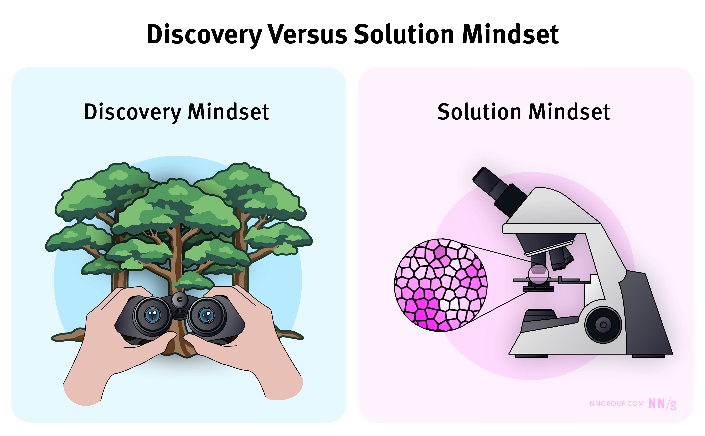

Summary:  Successful discovery requires teams to be open to uncovering “unknown unknowns.” Center your discovery efforts around problems rather than solutions.  

总结：  成功的发现需要团队对发现“未知的未知数”持开放态度。将您的发现工作集中在问题而不是解决方案上。  

[Discovery](https://www.nngroup.com/articles/discovery-phase/) helps us decide what to build or what direction to pursue.  

[Discovery](https://www.nngroup.com/articles/discovery-phase/) 帮助我们决定构建什么或追求什么方向。  

To perform discovery well, we have to adopt a particular mindset: an **exploration mindset** and an **openness** to learn new things.  

为了做好发现，我们必须采用一种特定的心态：**探索心态**和对学习新事物**的开放态度**。

-   [The Solution Mindset  
    
    解决方案思维](https://www.nngroup.com/articles/discovery-mindset/#toc-the-solution-mindset-1)
-   [What a Discovery Mindset Means  
    
    发现型思维模式的含义](https://www.nngroup.com/articles/discovery-mindset/#toc-what-a-discovery-mindset-means-2)
-   [3 Methods to Avoid the Solution Mindset  
    
    避免解决方案思维模式的 3 种方法](https://www.nngroup.com/articles/discovery-mindset/#toc-3-methods-to-avoid-the-solution-mindset-3)
-   [Conclusion  
    
    结论](https://www.nngroup.com/articles/discovery-mindset/#toc-conclusion-4)

## The Solution Mindset  

解决方案思维

Many discoveries start with exploring solutions. Consider these discovery goals:  

许多发现都是从探索解决方案开始的。请考虑以下发现目标：

-   Identify how an AI chatbot can answer customers' essential questions  
    
    确定 AI 聊天机器人如何回答客户的基本问题
-   Identify what user needs exist for a new dashboard  
    
    确定新仪表板的用户需求
-   Explore how we can design a fulfillment tracker that helps users track their order  
    
    探索我们如何设计配送追踪器来帮助用户跟踪他们的订单

The problem with these goals is that they are **too focused on specific solutions**. When discoveries focus on solutions, teams can experience **two common cognitive biases** when conducting discovery research.  

这些目标的问题在于它们**过于关注特定的解决方案**。当发现侧重于解决方案时，团队在进行发现研究时可能会遇到**两种常见的认知偏差**。

-   **[Anchoring](https://www.nngroup.com/articles/anchoring-principle/):** Teams with a solution mindset often conduct discovery research through the lens of a particular solution.  
    
    **[锚定](https://www.nngroup.com/articles/anchoring-principle/)：**具有解决方案思维模式的团队通常会通过特定解决方案的视角进行发现研究。  
    
    For example, they start by testing prototypes or interviewing target users about a solution rather than conducting [exploratory research](https://www.nngroup.com/articles/discovery-phase/) on the problem, such as how it comes about, who it affects, and how.  
    
    例如，他们从测试原型或就解决方案采访目标用户开始，而不是对问题进行[探索性研究](https://www.nngroup.com/articles/discovery-phase/)，例如它是如何产生的、它影响谁以及如何产生的。
-   **[Confirmation bias](https://www.nngroup.com/articles/confirmation-bias-ux/):** When teams have a preferred solution in mind, they often seek evidence that their solution is the right one.  
    
    **[确认偏倚](https://www.nngroup.com/articles/confirmation-bias-ux/)：**当团队心中有一个首选解决方案时，他们通常会寻求证据来证明他们的解决方案是正确的。  
    
    They may ignore or avoid looking for evidence suggesting they’re wrong about the problem or the best solution.  
    
    他们可能会忽略或避免寻找表明他们对问题或最佳解决方案有错误的证据。

[Starting discovery with a solution in mind](https://www.nngroup.com/videos/stop-solutioneering/) can limit your ability to discover valuable insights about your users and their needs and the problem you want to solve.  

[在开始发现时考虑解决方案](https://www.nngroup.com/videos/stop-solutioneering/)可能会限制您发现有关用户及其需求以及您想要解决的问题的宝贵见解的能力。  

You also risk building the wrong thing.  

你也有可能构建错误的东西。

_Like an explorer in a new land, the discovery mindset requires an openness to discover new things about the problem space.  

就像新土地上的探险家一样，发现心态需要以开放的态度来发现有关问题领域的新事物。  

On the other hand, a solution mindset is like a biologist examining an organism under a microscope.  

另一方面，解决方案思维方式就像生物学家在显微镜下检查生物体。_

## What a Discovery Mindset Means  

发现型思维模式的含义

A discovery mindset means that a team is open to learning  

发现型思维方式意味着团队对学习持开放态度

-   **That their assumptions are wrong**, whether those assumptions are about users’ problems, needs, or the best solution.  
    
    **他们的假设是错误的**，无论这些假设是关于用户的问题、需求还是最佳解决方案。
-   **New things they hadn’t expected to learn** (these are known as _unknown unknowns_). _Unknown unknowns_ can sometimes change the trajectory of a discovery as a team gains new, important knowledge about the problem domain.  
    
    **他们没想到会学到的新事物**（这些被称为_未知的未知物_）。_未知的未知数_有时会改变发现的轨迹，因为团队获得了有关问题领域的新的重要知识。

Adopting a discovery mindset helps teams gather valuable insights to identify the correct problems and solutions.  

采用发现思维方式有助于团队收集有价值的见解，以确定正确的问题和解决方案。

## 3 Methods to Avoid the Solution Mindset  

避免解决方案思维模式的 3 种方法

Use these 3 tactics in your discovery efforts to encourage curiosity, avoid early conclusions, and embrace a data-driven approach.  

在您的发现工作中使用这 3 种策略来激发好奇心，避免过早得出结论，并采用数据驱动的方法。

### 1\. Reframe the Goal  

1\. 重新制定目标

To avoid beginning discovery with the solution mindset, frame the goal of your discovery around a problem rather than a solution.  

为避免以解决方案的思维方式开始发现，请围绕问题而不是解决方案来构建发现目标。

Everything we build solves a problem for your users; otherwise, it wouldn’t be used.  

我们构建的一切都为您的用户解决了问题;否则，它不会被使用。  

If your team has a solution in mind, think about the underlying problem it solves.  

如果您的团队心中有解决方案，请考虑它解决的潜在问题。

> **_Ask_**: _What problem is this solution intended to solve?_  
> 
> **_问_**：_这个解决方案旨在解决什么问题？_

| Solution  
溶液 | **Example Problem it Solves  

它解决的问题示例** |
| --- | --- |
| Dashboard  

挡泥板 | Help users make good decisions using up-to-date data  

使用最新数据帮助用户做出正确的决策 |
| Chatbot  

聊天机器人 | Provides reassurance and support when users have questions  

在用户有疑问时提供保证和支持 |
| Order tracker  

订单跟踪器 | Sets expectations for when an order will be fulfilled and provides peace of mind  

设定订单履行时间的预期，让您高枕无忧 |

Once you’ve identified the problem, frame it as a goal for your discovery.  

确定问题后，将其作为发现的目标。

For example, the goals for these discoveries could be:  

例如，这些发现的目标可能是：

-   _Decide how we can provide users with the data they need to make good decisions  
    
    决定我们如何为用户提供做出正确决策所需的数据_
-   _Decide how best to provide reassurance and support for users with queries about their account  
    
    确定如何最好地为对账户有疑问的用户提供保证和支持_
-   _Decide how we can provide transparency to users on the progress of their order  
    
    决定我们如何向用户提供订单进度的透明度_

Starting with a broader goal that centers around a problem can help you identify important research questions that need to be answered.  

从以问题为中心的更广泛目标开始可以帮助您确定需要回答的重要研究问题。

For example, if the goal is to provide users with the data they need to make good decisions, we might need to research which decisions our users make, when they need up-to-date data and why, and how they use data in the decision-making process.  

例如，如果目标是为用户提供做出正确决策所需的数据，我们可能需要研究用户做出哪些决策、何时需要最新数据、为什么需要以及他们如何在决策过程中使用数据。

### 2\. Highlight Unknowns and Assumptions  

2\. 突出未知数和假设

Another strategy to help us adopt a discovery mindset is to focus on what we know and don’t.  

帮助我们采用发现思维模式的另一种策略是专注于我们知道和不知道的。  

When teams take time to do this at the beginning of discovery, they’re less likely to fall into the trap of trying to [validate their assumptions](https://www.nngroup.com/articles/no-validate-in-ux/).  

当团队在发现开始时花时间这样做时，他们不太可能陷入试图[验证其假设](https://www.nngroup.com/articles/no-validate-in-ux/)的陷阱。

Highlight facts and assumptions or unknowns with your team. This can be an exercise in a [kick-off workshop](https://www.nngroup.com/videos/discovery-kick-off-workshops/).  

与您的团队一起强调事实和假设或未知因素。这可以是[启动研讨会](https://www.nngroup.com/videos/discovery-kick-off-workshops/)中的练习。

> **_Ask_**_:_ _What are we assuming about our users’ needs, behaviors, desires, or the problem context?_  
> 
> **_问_**_：__我们对用户的需求、行为、愿望或问题背景有什么假设？_

The team can also prioritize unknowns or assumptions.  

团队还可以确定未知数或假设的优先级。  

Some unknowns might be crucial to explore because you might take on a lot of risk if you don't.  

探索一些未知因素可能至关重要，因为如果不这样做，您可能会承担很多风险。  

Some unknowns might be nice to know but not essential to your project.  

一些未知数可能很好了解，但对您的项目来说并不重要。

### 3\. Icebox Favorite Ideas  

3\. Icebox 最喜欢的想法

To avoid teams anchoring on a particular solution, teams can ideate solutions at the start of discovery and agree to put their solution ideas “on ice” until the discovery research has been performed.  

为避免团队锚定于特定解决方案，团队可以在发现开始时构思解决方案，并同意将他们的解决方案想法“搁置”，直到发现研究完成。  

This can be done in a kick-off workshop before creating discovery goals or research questions.  

这可以在创建发现目标或研究问题之前的启动研讨会中完成。

> **_Ask_**_:_ _What solution ideas do we have now? Let’s document them for safekeeping and consideration later._  
> 
> **_问_**_：__我们现在有什么解决方案的想法？让我们记录它们以供以后保管和考虑。_

Iceboxing solution ideas has two advantages:  

Iceboxing 解决方案的想法有两个优点：

1.  Team members **who are emotionally attached to specific solutions** have their ideas heard and documented, freeing them from the worry that their ideas will get lost.  
    
    **对特定解决方案有情感依恋的**团队成员的想法会被听到并记录下来，这样他们就不必担心自己的想法会丢失。
2.  Teams with **one solution in mind** can avoid narrow thinking by creating a space for other ideas to be considered.  
    
    **考虑一种解决方案**的团队可以通过为考虑其他想法创造空间来避免狭隘的思考。

After the team has done their discovery research and begun to ideate, they can consider the solutions in the icebox to see if any are a good fit.  

在团队完成发现研究并开始构思后，他们可以考虑 Icebox 中的解决方案，看看是否有任何合适的解决方案。

## Conclusion  

结论

Successful discoveries involve adopting the right mindset: open and solution-agnostic.  

成功的发现需要采用正确的思维方式：开放和与解决方案无关。  

To do so, frame your discovery goal around a problem rather than a solution, identify and icebox any solution ideas at the start, and spend time identifying assumptions and unknowns that need to be explored.  

为此，请围绕问题而不是解决方案来制定您的发现目标，在开始时确定并限制任何解决方案的想法，并花时间确定需要探索的假设和未知因素。
