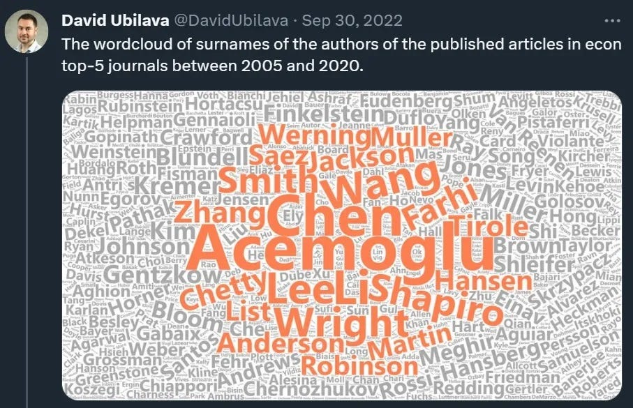

Every year when they award the Econ Nobel Prize, I do a post about it. I wrote posts about [Goldin in 2023](https://www.noahpinion.blog/p/a-nobel-for-the-story-of-women-in), [Bernanke, Diamond, & Dybvig in 2022](https://www.noahpinion.blog/p/an-econ-nobel-for-research-that-saved), and [Card, Angrist, & Imbens in 2021](https://www.noahpinion.blog/p/the-econ-nobel-we-were-all-waiting).  

每年他们颁发经济诺贝尔奖时，我都会写一篇关于它的帖子。我在2023年写了关于Goldin的文章，2022年写了关于Bernanke、Diamond和Dybvig的文章，以及2021年的Card、Angrist和Imbens的文章。  

But I almost didn’t do a post this, year, because I’m not actually that happy about this year’s prize, and I don’t like to be a party pooper.  

但今年我差点没发帖子，因为我实际上对今年的奖项并不那么高兴，而且我不喜欢成为派对大便者。  

But I suppose that carping about mainstream macroeconomics used to be my brand as a blogger, so I might as well return to my roots.  

但我想，关心主流宏观经济学曾经是我作为博主的品牌，所以我还不如回到我的根源。  

Long-time readers will know that I don’t think much of Nobel Prizes in general.  

老读者会知道，我总体上不太看重诺贝尔奖。  

They elevate individual contributions way too much, when most big discoveries are big group efforts and/or series of small incremental additions.  

他们过分地抬高了个人的贡献，而大多数重大发现都是大团队的努力和/或一系列小的增量增加。  

This creates a “cult of genius” that doesn’t reflect how science really works, and creates too large of a status distinction between prizewinners and others.  

这创造了一种“天才崇拜”，它没有反映科学的真正运作方式，并在获奖者和其他人之间造成了太大的地位差异。  

On top of that, I also have some additional criticisms of the Econ Nobel.[1](https://www.noahpinion.blog/p/a-nobel-for-the-big-big-questions#footnote-1-150232242) The science prizes rely very heavily on external validity to determine who gets the prize — your theory or your invention has to work, basically.  

除此之外，我还对 Econ Nobel 有一些额外的批评。1 科学奖在很大程度上依赖于外部有效性来决定谁获得该奖项——基本上，你的理论或你的发明必须有效。  

If it doesn’t, you can be the biggest genius in the world, but you’ll never get a Nobel.  

如果没有，你可以成为世界上最伟大的天才，但你永远不会获得诺贝尔奖。  

The physicist Ed Witten won a _Fields Medal_, which is even harder to get than a Nobel, for the math he invented for string theory.  

物理学家埃德·维滕 （Ed Witten） 获得了菲尔兹奖，这比诺贝尔奖更难获得，因为他为弦论发明了数学。  

But he’ll almost certainly never get a Physics Nobel, because string theory can’t be empirically tested.  

但他几乎肯定永远不会获得诺贝尔物理学奖，因为弦理论无法进行实证检验。  

The Econ Nobel is different. Traditionally, it’s given to economists whose ideas are _most influential within the economics profession_.  

Econ Nobel 则不同。传统上，它被授予其思想在经济学界最有影响力的经济学家。  

If a whole bunch of other economists do research that follows up on your research, or which uses theoretical or empirical techniques you pioneered, you get an Econ Nobel.  

如果一大群其他经济学家的研究跟进你的研究，或者使用你开创的理论或实证技术，你就会获得诺贝尔经济学奖。  

Your theory doesn’t have to be validated, your specific empirical findings can already have been overturned by the time the prize is awarded, but if you were influential, you get the prize.  

你的理论不必得到验证，你的具体实证发现在颁奖时可能已经被推翻了，但如果你有影响力，你就会得到奖品。  

You could argue that this is appropriate for what Thomas Kuhn would call a “pre-paradigmatic” science — a field that’s still looking for a set of basic concepts and tools.  

你可以争辩说，这很适合托马斯·库恩（Thomas Kuhn）所说的“前范式”科学——一个仍在寻找一套基本概念和工具的领域。  

But it’s been 55 years since they started giving the prize, and that seems like an awfully long time for a field to still be tooling up.  

但是，自从他们开始颁发该奖项以来，已经过去了 55 年，对于一个领域来说，这似乎是一段非常长的时间。  

Meanwhile, making “influence within the economics profession” the criterion for successful research seems a little too much like a popularity contest. It’s how you end up with prizes like the one in 2004, which was given to some macroeconomic theorists [whose theory said](https://www.noahpinion.blog/p/a-failed-economic-theory-of-everything) that recessions are caused by technological slowdowns and that mass unemployment is a voluntary vacation.  

与此同时，将“在经济学界的影响力”作为成功研究的标准似乎有点太像一场人气竞赛了。这就是你最终获得像 2004 年那样的奖项的原因，这个奖项被授予了一些宏观经济理论家[，他们的理论认为](https://www.noahpinion.blog/p/a-failed-economic-theory-of-everything)经济衰退是由技术放缓引起的，而大规模失业是自愿休假。

In recent years, that looked like things might be changing.  

近年来，情况似乎正在发生变化。  

Often, the prize was given to empirical economists associated with the so-called “credibility revolution” — basically, [quasi-experiments](https://www.bloomberg.com/view/articles/2018-08-02/how-economics-went-from-philosophy-to-science).  

通常，该奖项颁发给与所谓的“可信度革命”相关的实证经济学家——基本上是准实验。  

Those cases include Goldin in 2023, Card/Angrist/Imbens in 2021, and Banerjee/Duflo/Kremer in 2019.  

这些案例包括 2023 年的 Goldin、2021 年的 Card/Angrist/Imbens 和 2019 年的 Banerjee/Duflo/Kremer。  

And when it was given to theorists, they tended to be game theorists whose theories are very predictive of real-world outcomes — Milgrom/Wilson in 2020, Hart/Holmstrom in 2016, Tirole in 2014, and Roth/Shapley in 2012.  

当它被交给理论家时，他们往往是博弈论者，他们的理论对现实世界的结果非常具有预测性——2020 年的 Milgrom/Wilson、2016 年的 Hart/Holmstrom、2014 年的 Tirole 和 2012 年的 Roth/Shapley。  

Even when the prize was given to macro — a field where validity is much harder to establish — it was given to economists whose theories have seen immediate application to pressing problems of the day, such as Bernanke/Diamond/Dybvig in 2022 and Nordhaus in 2018.  

即使该奖项被授予宏——一个有效性更难确定的领域——它也被授予那些理论立即应用于当今紧迫问题的经济学家，例如 2022 年的伯南克/戴蒙德/迪布维格和 2018 年的诺德豪斯。  

In other words, the recent Nobels have made it seem like economics might be becoming _more like a natural science_, where practical applications and external validity are the ultimate arbiter of the value of research, rather than cultural influence within the economics profession.  

换句话说，最近的诺贝尔奖使经济学看起来可能越来越像一门自然科学，其中实际应用和外部有效性是研究价值的最终仲裁者，而不是经济学界的文化影响。  

But this year’s prize seems like a step away from that, and back toward the sort of big-think that used to be more popular in the prize’s early years.  

但今年的奖项似乎离那一步又近了一步，又回到了该奖项早期更流行的那种大思考。  

Anyway, a key point about this year’s prize is that Daron Acemoglu _was_ going to win an Econ Nobel at some point.  

无论如何，今年奖项的一个关键点是 Daron Acemoglu 将在某个时候获得诺贝尔经济学奖。  

He’s an absolute beast of a researcher — the closest thing economics has to Terence Tao in math.  

他绝对是研究者的野兽——是经济学最接近数学界的 Terence Tao。  

Alex Tabarrok [tells the tale](https://marginalrevolution.com/marginalrevolution/2024/10/acemoglu-johnson-and-robinson-win-nobel-for-institutions-and-prosperity.html):  

Alex Tabarrok [讲述了这个故事](https://marginalrevolution.com/marginalrevolution/2024/10/acemoglu-johnson-and-robinson-win-nobel-for-institutions-and-prosperity.html)：

> I think of [Daron Acemoglu](https://scholar.google.com/citations?user=l9Or8EMAAAAJ&hl=en&oi=ao) (GS) as the Wilt Chamberlin of economics, an absolute monster of productivity who racks up the papers and the citations at nearly unprecedented rates.  
> 
> 我认为达伦·阿西莫格鲁 （GS） 是经济学界的威尔特·张伯林 （Wilt Chamberlin），一个绝对的生产力怪物，他以几乎前所未有的速度积累论文和引用。  
> 
> According to Google Scholar he has [247,440 citations](https://scholar.google.com/citations?user=l9Or8EMAAAAJ&hl=en&oi=ao) and an H-index of 175, which means 175 papers each with more than 175 citations.  
> 
> 根据 Google Scholar 的数据，他有 247,440 次引用和 H 指数 175，这意味着 175 篇论文的引用次数超过 175 次。  
> 
> Pause on that for a moment.  
> 
> 停顿片刻。  
> 
> Daron got his PhD in 1992 so that’s over 5 papers per year which would be tremendous by itself–but we are talking 5 path-breaking, highly-cited papers per year plus many others!…In his overview of Daron’s work for the [John Bates Clark medal](https://pubs.aeaweb.org/doi/pdfplus/10.1257/jep.21.1.191) Robert Shimer wrote “he can write faster than I can digest his research.” I believe that is true for the profession as a whole.  
> 
> Daron 于 1992 年获得博士学位，因此每年超过 5 篇论文，这本身就已经很了不起了——但我们谈论的是每年 5 篇开创性、高引用率的论文，以及许多其他论文...罗伯特·希默 （Robert Shimer） 在他对达伦为约翰·贝茨·克拉克奖章所做的工作概述中写道：“他的写作速度比我消化他的研究还快。我相信整个行业都是如此。  
> 
> We are all catching-up to Daron Acemoglu.  
> 
> 我们都在追赶 Daron Acemoglu。

In fact, this is all you really have to see to get the point:  

事实上，这就是你真正需要看到的要点：

In physics, as I mentioned, it would easily be possible for a researcher this accomplished to never get a Nobel.  

正如我提到的，在物理学领域，如此有成就的研究人员很可能永远不会获得诺贝尔奖。  

In economics it is not possible.[2](https://www.noahpinion.blog/p/a-nobel-for-the-big-big-questions#footnote-2-150232242) And when Acemoglu got his Nobel, it was always going to be officially awarded for his single most influential area of research.  

在经济学中，这是不可能的。2 当阿西莫格鲁获得诺贝尔奖时，他最有影响力的研究领域总是被正式授予诺贝尔奖。  

That would be his research on institutions and economic development.  

那就是他对制度和经济发展的研究。

Which is why Johnson and Robinson, Acemoglu’s key co-authors in that literature, also received this year’s Nobel.  

这就是为什么阿西莫格鲁在该文献中的主要合著者约翰逊和罗宾逊也获得了今年的诺贝尔奖。  

That’s not to say Johnson and Robinson are unimpressive researchers on their own!  

这并不是说 Johnson 和 Robinson 本身就是不起眼的研究人员！  

In fact I’m a huge fan of Johnson’s work overall, on finance, place-based policy, technology policy, and other topics near and dear to my heart, as well as his excellent popular writing.  

事实上，我总体上是 Johnson 的超级粉丝，关于金融、地方政策、技术政策和其他我心爱的主题，以及他出色的通俗作品。  

But Johnson and Robinson’s most influential research, by far, has been the work they did on institutions with Acemoglu.  

但到目前为止，Johnson 和 Robinson 最有影响力的研究是他们与 Acemoglu 一起对机构所做的工作。  

What’s an “institution”? No one can quite agree on that point.  

什么是“机构”？在这一点上，没有人能完全同意。  

Conceptually, they could include legal arrangements like property rights, political systems like democracy, bureaucratic organizations, etc. Different researchers tend to mean different things when they say “institutions”, though everyone seems to agree that 1) rule of law, and 2) property rights are important examples.  

从概念上讲，它们可以包括财产权等法律安排、民主等政治制度、官僚组织等。不同的研究人员在说“机构”时往往有不同的含义，尽管每个人似乎都同意 1） 法治和 2） 财产权是重要的例子。  

Acemoglu, Johnson and Robinson (whom most people call “AJR”) have a theory that economic development is caused by a country having the right kind of institutions.  

阿西莫格鲁、约翰逊和罗宾逊（大多数人称他们为“AJR”）有一个理论，即经济发展是由一个国家拥有正确的制度引起的。  

Specifically, they believe that if institutions are “[inclusive](https://www.goodreads.com/quotes/8471923-inclusive-economic-institutions-such-as-those-in-south-korea-or)” — if they “allow and encourage participation by the great mass of people in economic activities that make best use of their talents and skills and that enable individuals to make the choices they wish” — then a country will prosper.  

具体来说，他们认为，如果制度是“包容的”——如果它们“允许并鼓励广大人民参与经济活动，最好地利用他们的才能和技能，使个人能够做出他们想要的选择”——那么一个国家就会繁荣。  

And if institutions are “extractive” — if they ignore human input, waste human potential, and just try to grab resources like free labor or minerals — then a country will stay poor.  

如果机构是“攫取性的”——如果它们忽视人类的投入，浪费人类的潜力，只试图攫取免费劳动力或矿产等资源——那么一个国家就会一直贫穷。  

You may have read this theory in Acemoglu and Johnson’s famous book, _[Why Nations Fail](https://www.amazon.com/Why-Nations-Fail-Origins-Prosperity/dp/0307719227)_.  

你可能在阿西莫格鲁和约翰逊的著名著作《_[为什么国家会失败](https://www.amazon.com/Why-Nations-Fail-Origins-Prosperity/dp/0307719227)_》中读到过这个理论。

In fact, _I love this theory_. It resonates strongly on an emotional level, because it agrees strongly with my values.  

事实上，我喜欢这个理论。它在情感层面上引起了强烈的共鸣，因为它与我的价值观非常吻合。  

I believe in regular people.  

我相信普通人。  

I believe that average people have enormous economic and political potential that is usually under-exploited, and I’m constantly annoyed by elitists who think society is driven by a few geniuses.  

我相信普通人拥有巨大的经济和政治潜力，而这些潜力通常没有得到充分开发，我经常对那些认为社会是由少数天才驱动的精英主义者感到恼火。  

I believe that countries get rich primarily [through hard work and ingenuity rather than plunder](https://www.noahpinion.blog/p/nations-dont-get-rich-by-plundering).  

我相信，国家主要[通过努力工作和聪明才智致富，而不是通过掠夺](https://www.noahpinion.blog/p/nations-dont-get-rich-by-plundering)。

Also, intuitively speaking, I sort of think this theory is right.  

另外，从直觉上讲，我有点认为这个理论是对的。  

I look at countries like Russia that devalue their own people and view them as cannon fodder, and I see them doing worse in terms of technology and the economy.  

我看到像俄罗斯这样的国家贬低本国人民的价值，把他们看作炮灰，我看到他们在技术和经济方面做得更糟。  

I see Xi Jinping cracking down on private entrepreneurship, and I can’t imagine it’ll be good for China’s growth.  

我看到习近平在打压民营创业，我无法想象这对中国的增长会有好处。  

I look at any number of repressive regimes and see militaries and party-states and mafias that reach their tentacles deep into society, preventing regular people from getting ahead, and producing a feeling of hopelessness.  

我观察了许多压迫性政权，看到军队、党国和黑手党将触角伸向社会深处，阻止普通人出人头地，并产生一种绝望的感觉。  

I see how companies that rely heavily on cheap labor often fail to innovate.  

我看到严重依赖廉价劳动力的公司往往无法创新。

Having said all that, though, I _don’t_ think this is the kind of theory you can easily evaluate with evidence.  

不过，说了这么多，我不认为这是那种你可以轻易用证据评估的理论。  

And I don’t find the evidence that Acemoglu, Johnson, and Robinson have produced to test the institutional theory of development to be extremely persuasive.  

而且，我不认为阿西莫格鲁、约翰逊和罗宾逊为检验发展的制度理论而提供的证据非常有说服力。

For example, take AJR’s most famous paper, “[The Colonial Origins of Comparative Development: An Empirical Investigation](https://economics.mit.edu/sites/default/files/publications/colonial-origins-of-comparative-development.pdf)”.  

例如，以 AJR 最著名的论文“比较发展的殖民起源：实证调查”为例。  

In this paper, AJR look at various different former European colonies — rich ones like the U.S. and Australia, and poor ones like Nigeria and Pakistan.  

在本文中，AJR 研究了各种不同的前欧洲殖民地——美国和澳大利亚等富裕国家，以及尼日利亚和巴基斯坦等贫穷国家。  

They observe that in the rich ex-colonies, people today are at less risk of expropriation by the government.  

他们观察到，在富裕的前殖民地，人们今天被政府没收的风险较小。  

AJR hypothesize that this is because back in the colonial days, European colonialists created strong property rights in the colonies that eventually became rich, and weak property rights in the colonies that eventually became poor.  

AJR 假设这是因为在殖民时代，欧洲殖民者在殖民地创造了强大的财产权，最终变得富有，而在殖民地创造了薄弱的财产权，最终变得贫穷。  

To test this hypothesis, AJR look at the mortality of European settlers in the various colonies.  

为了验证这一假设，AJR 研究了各个殖民地欧洲定居者的死亡率。  

High settler mortality — generally due to tropical diseases — meant that Europeans couldn’t move to a place like Nigeria en masse, and therefore ruled from afar.  

高定居者死亡率——通常是由于热带疾病——意味着欧洲人无法集体迁移到尼日利亚这样的地方，因此只能从远处进行统治。  

Colonialists ruling from afar didn’t really care about property rights, so they just had their armies and their local cronies extract mineral resources and/or slaves, and left the colony as a whole to rot.  

远距离统治的殖民主义者并不真正关心财产权，所以他们只是让他们的军队和当地的亲信开采矿产资源和/或奴隶，让整个殖民地腐烂。  

But if the disease burden was low, the Europeans moved in, and then they needed to put in some property rights.  

但是，如果疾病负担很低，欧洲人就会搬进来，然后他们需要投入一些财产权。  

Lo and behold, this hypothesis checks out — the colonies where Europeans didn’t die as much from disease tend to be much richer, and to have better property rights, in the modern day.  

瞧，这个假设是站得住脚的——在现代，欧洲人死于疾病的殖民地往往要富裕得多，拥有更好的财产权。  

This methodology is clever, and the result agrees with our intuition.  

这种方法很聪明，结果与我们的直觉一致。  

But a couple of years after it came out, some other economists started pointing out some big flaws.  

但在它问世几年后，其他一些经济学家开始指出一些重大缺陷。  

In particular, [Glaeser et al. (2004)](https://scholar.harvard.edu/files/shleifer/files/do_institutions_cause_growth.pdf) pointed out that in places where Europeans were able to settle, they didn’t just bring property rights and other institutions — _they brought themselves_. Glaeser et al.  

特别是，Glaeser 等人（2004 年）指出，在欧洲人能够定居的地方，他们不仅带来了财产权和其他机构，还带来了自己。Glaeser 等人。  

note that it’s impossible to empirically disentangle the growth effect of the institutions from the growth effects of human capital — i.e., the effect of just _having a bunch of European-descended people in your country_.  

请注意，不可能从实证上将制度的增长效应与人力资本的增长效应区分开来——即_在你的国家只有一群欧洲血统_的人的影响。

Now, that may sound like a racial theory, but it’s not.[3](https://www.noahpinion.blog/p/a-nobel-for-the-big-big-questions#footnote-3-150232242) For one thing, culture might be just as long-lasting[4](https://www.noahpinion.blog/p/a-nobel-for-the-big-big-questions#footnote-4-150232242) as institutions themselves.  

现在，这听起来像是一种种族理论，但事实并非如此。3 首先，文化可能和制度本身一样持久 4。  

But I think there’s an even more important reason why having European-descended people in your country would cause economic growth — _they traded a lot with Europe_.  

但我认为，贵国有欧洲血统的人会促进经济增长，还有一个更重要的原因——他们与欧洲进行了大量贸易。  

Americans and Australians and Canadians got lots of ideas from the UK and Germany and France — technologies, business models, etc.[5](https://www.noahpinion.blog/p/a-nobel-for-the-big-big-questions#footnote-5-150232242) And they established incredibly lucrative trading networks with European countries, often from a place of equality rather than as a subordinate province of empire.  

美国人、澳大利亚人和加拿大人从英国、德国和法国那里得到了很多想法——技术、商业模式等5，他们与欧洲国家建立了利润丰厚的贸易网络，这些贸易网络通常来自平等的地方，而不是帝国的附属省份。

This alternative explanation for AJR’s famous result has never been rejected, and it’s so important that the Nobel committee saw the need to _issue a disclaimer about it_ in their prize announcement:  

这种对 AJR 著名结果的替代解释从未被拒绝，这一点非常重要，以至于诺贝尔委员会认为有必要 在他们的获奖公告中_发布免责声明_：

> \[A\]scribing causality to such an…estimate requires strong assumptions.  
> 
> 将因果关系归结为这样的......估计需要强有力的假设。  
> 
> In short, it requires an “exclusion restriction,” i.e., that the only reason why the mortality rates among European settlers centuries ago affect GDP per capita today is because of their effect on contemporary institutional quality…A more serious concern for the validity of the exclusion restriction is if the settlers also brought with them their know-how and human capital, and if these factors have had a direct effect on long-term prosperity for a given set of colonial institutions…Ultimately…human capital and institutions are both determinants of growth, and it is very hard to distinguish Acemoglu, Gallego, and Robinson’s argument from the fact that human capital has an independent effect on growth…The \[AJR\] estimate should thus be taken with a grain of salt.  
> 
> 简而言之，它需要一个“排斥限制”，即几个世纪前欧洲定居者的死亡率影响今天人均 GDP 的唯一原因是因为它们对当代制度质量的影响......对排斥限制有效性的一个更严重的担忧是，定居者是否也带来了他们的专业知识和人力资本，以及这些因素是否对一组特定殖民机构的长期繁荣产生了直接影响......最终。。。人力资本和制度都是增长的决定因素，很难将 Acemoglu、Gallego 和 Robinson 的论点与人力资本对增长有独立影响的事实区分开来......因此，应该对 \[AJR\] 估计持保留态度。  
> 
> Nevertheless, the evidence presented by Acemoglu, Johnson, and Robinson strongly suggests that the type of institutions implemented by the colonizers is a key mechanism driving the relationship between contemporary GDP and the conditions at colonization.  
> 
> 尽管如此，Acemoglu、Johnson 和 Robinson 提供的证据强烈表明，殖民者实施的制度类型是推动当代 GDP 与殖民条件之间关系的关键机制。

This is a pretty startling thing to have to put in a Nobel Prize announcement, isn’t it?  

不得不在诺贝尔奖宣布中发布这是一件非常令人吃惊的事情，不是吗？  

It basically amounts to saying “Well, this result doesn’t actually prove the researchers’ hypothesis, and in fact the hypothesis probably _can’t_ be proven, but we’re going to give it a Nobel anyway because it’s strongly suggestive.” If you want economics to be more of a science and less of a branch of philosophy, that’s not the kind of thing you want to have to write!  

它基本上相当于说“嗯，这个结果实际上并不能证明研究人员的假设，事实上这个_假设可能无法_被证明，但我们还是要给它一个诺贝尔奖，因为它具有很强的暗示性。如果你想让经济学更像一门科学，而不是哲学的一个分支，那不是你想写的那种东西！

The Nobel committee defends this move by referencing a second famous AJR paper, from 2002: “[Reversal of Fortune: Geography and Institutions in the Making of the Modern World Income Distribution](https://economics.mit.edu/sites/default/files/publications/reversal-of-fortune.pdf)”.  

诺贝尔委员会通过引用 2002 年 AJR 的第二篇著名论文来捍卫这一举措：“命运的逆转：现代世界收入分配形成中的地理和制度”。  

In that paper, AJR show that European colonies that were rich before colonization became poor afterwards, while colonies that were poor before colonization became rich afterwards.  

在那篇论文中，AJR 表明，殖民前富裕的欧洲殖民地在殖民后变得贫穷，而殖民前贫穷的殖民地在殖民后变得富有。  

And as a measure of wealth and poverty, they use urbanization. So they come up with this chart:  

作为衡量财富和贫困的指标，他们使用城市化。所以他们想出了这张图表：

AJR’s argument here is that because the rich and poor places flipped places between 1500 and 1995 — as demonstrated by that downward-sloping line — it must mean that geography can’t explain wealth and poverty.  

AJR 在这里的论点是，因为富人和穷人在 1500 年到 1995 年之间发生了位置翻转——正如那条向下倾斜的线所证明的那样——这一定意味着地理学无法解释财富和贫困。  

Instead it must be institutions.  

相反，它必须是机构。

But this has the same problem as the other famous paper.  

但这与其他著名论文有同样的问题。  

The places like the U.S., Canada, and Australia — the “poor” colonies that later became rich — are the places that filled up with Europeans and their descendants.  

像美国、加拿大和澳大利亚这样的地方——后来变得富有的“贫穷”殖民地——是欧洲人及其后代居住的地方。  

The places that were more urbanized in 1500 and were poorer later — like Egypt, Mexico, and Vietnam — are places that _didn’t_ get a ton of Europeans moving in, possibly because they already had a lot of people there (or had more tropical diseases, or whatever).  

那些在 1500 年城市化程度更高、后来更贫穷的地方——比如埃及、墨西哥和越南——是没有大量欧洲人搬进来的地方，可能是因为它们已经有很多人在那里（或者有更多的热带疾病，或者其他什么）。

Let’s try something, just for fun.  

让我们尝试一些东西，只是为了好玩。  

Let’s black out a few rich places that were pretty empty, and which the Europeans filled up with colonists (including Singapore and Hong Kong, which they filled up with Chinese folks they recruited), and then see what the trendline looks like:  

让我们把一些相当空旷的富裕地方涂黑，这些地方被欧洲人填满了殖民者（包括新加坡和香港，他们招募了中国人），然后看看趋势线是什么样的：

It looks like the “reversal of fortunes” has…reversed.  

看起来“命运逆转”已经......反。

OK fine, that wasn’t a particularly scientific exercise on my part. But [Chanda, Cook, and Putterman (2014)](https://www.aeaweb.org/articles?id=10.1257/mac.6.3.1) did this exercise rigorously, and found that, lo and behold, once you account for population relocations, AJR’s “reversal of fortune” gets reversed:  

好吧，好吧，这对我来说并不是一个特别科学的练习。但 [Chanda、Cook 和 Putterman （2014）](https://www.aeaweb.org/articles?id=10.1257/mac.6.3.1) 严格地进行了这项练习，发现，瞧，一旦你考虑到人口迁移，AJR 的“命运逆转”就会逆转：

> Using data on place of origin of today's country populations and the indicators of level of development in 1500 used by Acemoglu, Johnson, and Robinson (2002), we confirm a reversal of fortune for colonized countries as territories, but find persistence of fortune for people and their descendants.  
> 
> 使用当今国家人口的起源地数据和 Acemoglu、Johnson 和 Robinson （2002） 使用的 1500 年发展水平指标，我们证实了作为领土的殖民地国家的命运逆转，但发现人们及其后代的命运持续存在。  
> 
> Persistence results are at least as strong for three alternative measures of early development, for which reversal for territories, however, fails to hold.  
> 
> 对于早期发展的三种替代措施，持久性结果至少同样强，然而，领土的逆转并不成立。  
> 
> Additional exercises lend support to Glaeser et al.'s (2004) view that human capital is a more fundamental channel of influence of precolonial conditions on modern development than is quality of institutions.  
> 
> 其他练习支持 Glaeser 等人（2004 年）的观点，即人力资本是前殖民条件对现代发展影响的更根本渠道，而不是制度质量。

Once again, “Europeans implementing good institutions” is just impossible to distinguish empirically from “Europeans moving in.”  

再一次，“欧洲人实施良好的制度”与“欧洲人迁入”在经验上是不可能区分的。

Note that I am _not_ accusing Acemoglu, Johnson, and Robinson of doing shoddy empirical work.[6](https://www.noahpinion.blog/p/a-nobel-for-the-big-big-questions#footnote-6-150232242) It’s just inherently very very hard to look at the history of countries 500 years ago and draw strong empirical conclusions about the deep fundamental causes of economic development.  

请注意，我并不是在指责 Acemoglu、Johnson 和 Robinson 做了粗制滥造的实证工作。6 回顾 500 年前的国家历史并就经济发展的深层根本原因得出强有力的实证结论，本质上是非常非常困难的。  

That is, inherently, an _incredibly difficult exercise_. Kevin Bryan has [a good thread](https://x.com/afinetheorem/status/1845857311543148840?s=61) explaining, briefly, some of the reasons why it’s so hard:  

这本质上是一项_非常困难的工作_。Kevin Bryan 有[一个很好的帖子](https://x.com/afinetheorem/status/1845857311543148840?s=61)，简要地解释了它如此困难的一些原因：

Anyway, those are only the two most famous papers in a long series of papers in which AJR (or sometimes just AR, or sometimes just Acemoglu) attempt to theorize how institutions affect growth — basically, political science theories about the relationship between elites and the masses.  

无论如何，这只是AJR（有时只是AR，有时只是Acemoglu）试图从理论上解释制度如何影响增长的一系列论文中最著名的两篇论文——基本上，关于精英与大众之间关系的政治学理论。  

That’s very interesting stuff. But without solid empirical confirmation that institutions really _do_ affect growth in the way that AJR hypothesize — confirmation that may simply be impossible to get — there’s always the chance that those theories are “explaining” a phenomenon that doesn’t actually exist.  

这是非常有趣的事情。但是，如果没有坚实的实证证实，证明制度_确实_以AJR假设的方式影响了增长——这种确认可能根本不可能得到——这些理论总是有可能在“解释”一个实际上并不存在的现象。

The same issue crops up regarding Acemoglu and Robinson’s recent work with Suresh Naidu and Pascual Restrepo on [the impact of democracy on growth](https://economics.mit.edu/sites/default/files/publications/Democracy%20Does%20Cause%20Growth.pdf). The paper is entitled “Democracy Does Cause Growth”, but as [Alex Tabarrok notes](https://marginalrevolution.com/marginalrevolution/2019/07/is-democracy-doomed.html), the effect they find is actually pretty small:  

阿西莫格鲁和罗宾逊最近与苏雷什·奈杜（Suresh Naidu）和帕斯夸尔·雷斯特雷波（Pascual Restrepo）就[民主对增长的影响](https://economics.mit.edu/sites/default/files/publications/Democracy%20Does%20Cause%20Growth.pdf)进行了研究，也出现了同样的问题。这篇论文的标题是“民主确实导致增长”，但正如 [Alex Tabarrok 所指出](https://marginalrevolution.com/marginalrevolution/2019/07/is-democracy-doomed.html)的，他们发现的影响实际上相当小：

> In other words, if the average nondemocracy in their sample had transitioned to a democracy its GDP per capita would have increased from $2074 to $2489 in 25 years (i.e. this is the causal effect of democracy, ignoring other factors changing over time).  
> 
> 换句话说，如果他们样本中的平均非民主国家过渡到民主国家，那么其人均GDP将在25年内从2074美元增加到2489美元（即，这是民主的因果效应，忽略了其他随时间变化的因素）。  
> 
> Twenty percent is better than nothing and better than dictatorship but it’s weak tea.  
> 
> 百分之二十总比没有好，也比独裁好，但这是淡茶。

A small effect like this is usually susceptible to being reversed by the inclusion of an omitted variable that was initially left out.  

像这样的小效果通常很容易被包含最初被遗漏的省略变量所逆转。  

For example, [Park (2024)](https://papers.ssrn.com/sol3/papers.cfm?abstract_id=4912929) argues that democratic countries putting economic sanctions on nondemocracies in recent years can explain all of the small economic benefits of being a democracy:  

例如，[Park （2024）](https://papers.ssrn.com/sol3/papers.cfm?abstract_id=4912929) 认为，民主国家近年来对非民主国家实施经济制裁可以解释成为民主国家的所有微小经济利益：

> This paper argues that the observed positive effects of democracy are largely due to a "democratic favor channel," where powerful democratic nations, their allies, and international organizations treat democracies more favorably than nondemocracies…\[W\]hen controlling for sanctions imposed by the US, its G7 allies, and the UN, the positive effects of democracy weaken or turn negative…I show that these democratic favors serve as plausible channels through which democracy appears to drive economic growth.  
> 
> 本文认为，观察到的民主的积极影响主要是由于“民主恩惠渠道”，即强大的民主国家、其盟友和国际组织对民主的待遇高于非民主国家......当控制美国、其 G7 盟友和联合国实施的制裁时，民主的积极影响会减弱或变成消极......我表明，这些民主恩惠似乎是民主推动经济增长的合理渠道。

If Park is right, then the economic benefits of democracy are simply an accident of the last few decades of history, in which the U.S. and its allies happened to be very powerful and used their power to put their thumb on the economic scales a bit.  

如果朴槿惠是对的，那么民主的经济利益只是过去几十年历史的偶然，其中美国及其盟友恰好非常强大，并利用他们的权力在经济天平上稍作干预。  

Is Park right? I don’t know.  

朴槿惠是对的吗？我不知道。  

But the point is that the entire literature is filled with things like this.  

但关键是，整个文献中都充满了这样的事情。  

Cross-country regressions are inherently limited tools for explaining the wealth and poverty of nations.  

跨国回归本质上是解释国家财富和贫困的有限工具。  

The kind of questions AJR purport to answer [may never really be answerable](https://growthecon.wordpress.com/2014/11/26/the-skeptics-guide-to-institutions-part-4/), or at least not for the foreseeable future.  

AJR 声称要回答的那种问题[可能永远不会真正得到回答](https://growthecon.wordpress.com/2014/11/26/the-skeptics-guide-to-institutions-part-4/)，或者至少在可预见的未来不会。

Anyway, I definitely don’t mean to criticize Acemoglu, Johnson, and Robinson for doing this research.  

无论如何，我绝对不是要批评 Acemoglu、Johnson 和 Robinson 做这项研究。  

It’s good to think about the big questions of history, development, institutions, and national wealth.  

思考历史、发展、制度和国家财富等重大问题是件好事。  

Though those questions aren’t often answerable with the kind of credible empirics that economists use for more small-bore microeconomic questions, but they’re still very important.  

尽管这些问题通常不能用经济学家用于更小尺度微观经济问题的那种可信的经验来回答，但它们仍然非常重要。  

We may never get definitive answers, but thinking about these things is better than not thinking about them.  

我们可能永远无法得到明确的答案，但考虑这些事情总比不考虑它们要好。  

And as I said before, I really _like_ the answers AJR came up with, and I think there’s a decent chance they’re actually true.  

正如我之前所说，我真的很_喜欢_ AJR 提出的答案，我认为它们很有可能真的是真的。

But I also don’t think every interesting line of research needs a Nobel Prize.  

但我也不认为每个有趣的研究领域都需要诺贝尔奖。  

I was happy to see the Econ Nobel move toward rewarding research that was more scientific and less philosophical than in the past. It was part of econ’s general trend toward being a more humble, grounded, reliable, applicable science.  

我很高兴看到诺贝尔经济学奖转向奖励比过去更科学、更少哲学的研究。这是 econ 成为一门更谦逊、更扎实、更可靠、更适用的科学的总体趋势的一部分。  

This year’s award moves in the opposite direction, back toward philosophical big-think.  

今年的奖项正朝着相反的方向发展，回到了哲学上的大思考。

[Share  

共享](https://www.noahpinion.blog/p/a-nobel-for-the-big-big-questions?utm_source=substack&utm_medium=email&utm_content=share&action=share)
