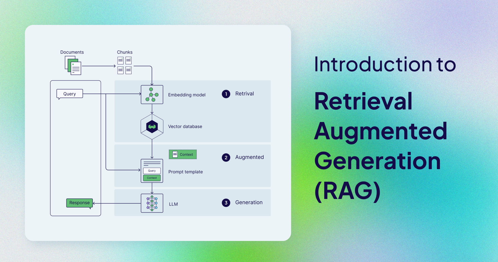
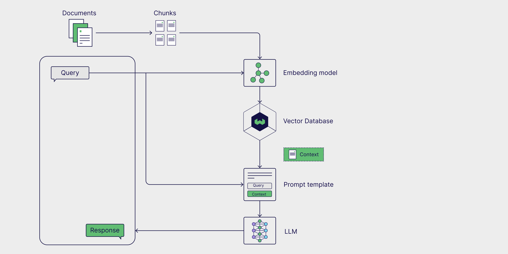
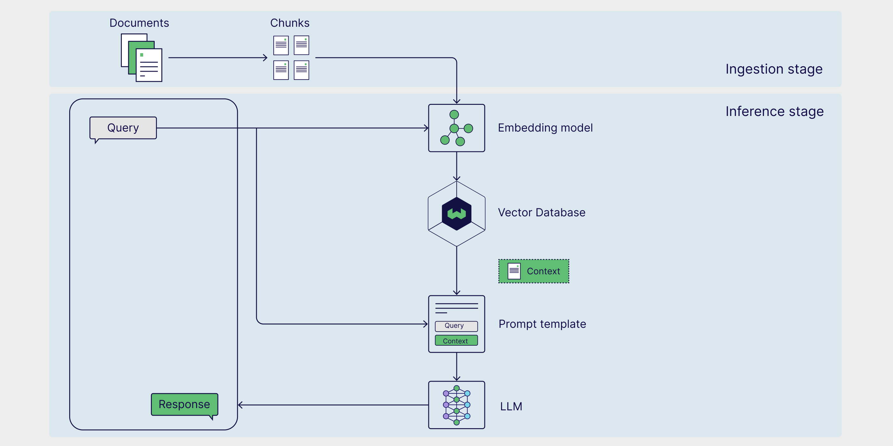
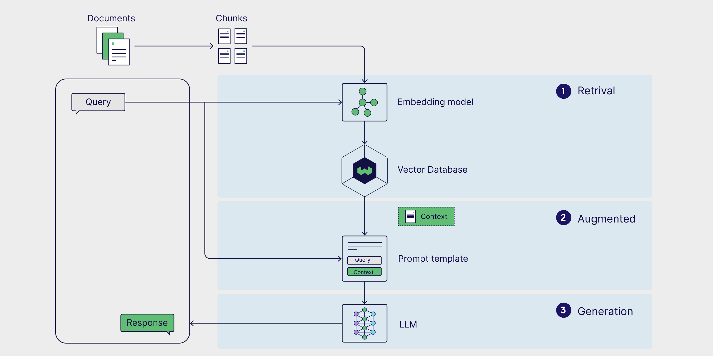
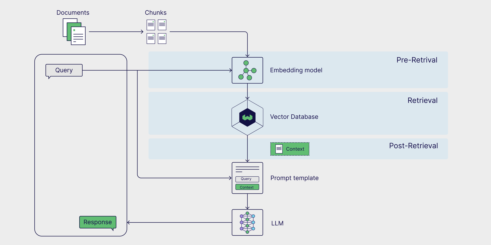
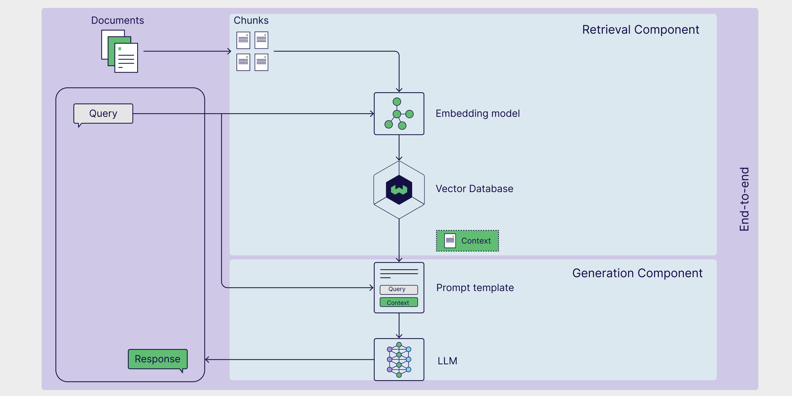

Despite the steady release of increasingly larger and smarter models, state-of-the-art generative large language models (LLMs) still have a big problem: they struggle with tasks that require specialized knowledge.  

尽管越来越大、越来越智能的模型稳步发布，但最先进的生成式大型语言模型 （LLMs） 仍然存在一个大问题：它们难以完成需要专业知识的任务。  

This lack of specialized knowledge can lead to issues like hallucinations, where the model generates inaccurate or fabricated information.  

这种专业知识的缺乏会导致幻觉等问题，其中模型生成不准确或捏造的信息。  

**Retrieval-Augmented Generation (RAG)** helps mitigate this by allowing the model to pull in real-time, niche data from external sources, enhancing its ability to provide accurate and detailed responses.  

**Retrieval-Augmented Generation （RAG）** 允许模型从外部来源提取实时的利基数据，从而增强其提供准确和详细响应的能力，从而帮助缓解这种情况。

Despite these limitations, generative models are impactful tools that automate mundane processes, assist us in our everyday work, and enable us to interact with data in new ways.  

尽管存在这些限制，但生成模型是有影响力的工具，可以自动化日常流程，帮助我们完成日常工作，并使我们能够以新的方式与数据交互。  

So how can we leverage their broad knowledge while also making them work for our specific use cases?  

那么，我们如何利用他们的广泛知识，同时让他们为我们的特定用例服务呢？  

The answer lies in providing generative models with task-specific data.  

答案在于为生成模型提供特定于任务的数据。

In this article, we take a deep dive into Retrieval Augmented Generation (RAG), a framework that enhances the capabilities of generative models by allowing them to reference external data.  

在本文中，我们深入探讨了检索增强生成 （RAG），这是一个通过允许生成模型引用外部数据来增强生成模型功能的框架。  

We’ll explore the limitations of generative models that led to the creation of RAG, explain how RAG works, and break down the architecture behind RAG pipelines.  

我们将探讨导致 RAG 创建的生成模型的局限性，解释 RAG 的工作原理，并分解 RAG 管道背后的架构。  

We’ll also get practical and outline some real-world RAG use cases, suggest concrete ways to implement RAG, introduce you to a few advanced RAG techniques, and discuss RAG evaluation methods.  

我们还将提供实用的概述，概述一些真实的 RAG 用例，提出实施 RAG 的具体方法，向您介绍一些高级 RAG 技术，并讨论 RAG 评估方法。

note  

注意

LLM is a broad term that refers to language models trained on large datasets that are capable of performing a variety of text- and language-related tasks.  

LLM 是一个广义术语，指的是在大型数据集上训练的语言模型，这些模型能够执行各种文本和语言相关任务。  

LLMs that generate novel text in response to a user prompt, like those used in chatbots, are called generative LLMs, or **generative models**. LLMs that encode text data in the semantic space are called **embedding models**.  

LLMs用户提示生成新文本的 LLM，如聊天机器人中使用的文本，称为生成式 LLMs 或**生成模型**。LLMs语义空间中对文本数据进行编码的 LLM 称为嵌入**模型**。  

Thus, we use the terms generative model and embedding model to distinguish between these two types of models in this article.  

因此，在本文中，我们使用术语 生成模型 和 嵌入模型 来区分这两种类型的模型。

## Limitations of generative models[](https://weaviate.io/blog/introduction-to-rag#limitations-of-generative-models "Direct link to Limitations of generative models")  

生成模型的[](https://weaviate.io/blog/introduction-to-rag#limitations-of-generative-models "Direct link to Limitations of generative models")局限性

Generative models are trained on large datasets, including (but not limited to) social media posts, books, scholarly articles and scraped webpages, allowing them to acquire a sense of general knowledge.  

生成模型在大型数据集上进行训练，包括（但不限于）社交媒体帖子、书籍、学术文章和抓取的网页，使它们能够获得一般知识。  

As a result, these models can generate human-like text, respond to diverse questions, and assist with tasks like answering, summarizing, and creative writing.  

因此，这些模型可以生成类似人类的文本，回答不同的问题，并协助完成回答、总结和创意写作等任务。

However, training datasets for generative models are inevitably incomplete, as they lack information on niche topics and new developments beyond the dataset’s cutoff date.  

然而，生成模型的训练数据集不可避免地是不完整的，因为它们缺乏有关利基主题和数据集截止日期之后的新发展的信息。  

Generative models also lack access to proprietary data from internal databases or repositories.  

生成模型也无法访问来自内部数据库或存储库的专有数据。  

Furthermore, when these models don’t know the answer to a question, they often guess, and sometimes not very well.  

此外，当这些模型不知道问题的答案时，他们通常会猜测，有时不是很好。  

This tendency to generate incorrect or fabricated information in a convincing manner is known as hallucination, and can cause real reputational damage in client-facing AI applications.  

这种以令人信服的方式生成不正确或捏造信息的倾向被称为幻觉，可能会在面向客户的 AI 应用程序中造成真正的声誉损害。

The key to enhancing performance on specialized tasks and reducing hallucinations is to provide generative models with additional information not found in their training data.  

提高专业任务性能和减少幻觉的关键是为生成模型提供其训练数据中未找到的附加信息。  

This is where RAG comes in.  

这就是 RAG 的用武之地。

## What is Retrieval Augmented Generation (RAG)?[](https://weaviate.io/blog/introduction-to-rag#what-is-retrieval-augmented-generation-rag "Direct link to What is Retrieval Augmented Generation (RAG)?")  

什么是 Retrieval Augmented Generation （RAG）？[](https://weaviate.io/blog/introduction-to-rag#what-is-retrieval-augmented-generation-rag "Direct link to What is Retrieval Augmented Generation (RAG)?")

[**Retrieval-Augmented Generation (RAG)**](https://arxiv.org/abs/2005.11401) is a framework that _augments_ the general knowledge of a generative LLM by providing it with additional data relevant to the task at hand _retrieved_ from an external data source.  

[**检索增强生成 （RAG）**](https://arxiv.org/abs/2005.11401) 是一个框架，它通过向生成式 LLM与从外部数据源_检索_的手头任务相关的额外数据来增强生成式 代码 id=g1001 LLM 的一般知识。

External data sources can include internal databases, files, and repositories, as well as publicly available data such as news articles, websites, or other online content.  

外部数据源可以包括内部数据库、文件和存储库，以及公开可用的数据，例如新闻文章、网站或其他在线内容。  

Access to this data empowers the model to respond more factually, cite its sources in its responses, and avoid “guessing” when prompted about information not found in the model’s original training dataset.  

访问这些数据使模型能够更真实地做出响应，在响应中引用其来源，并避免在提示模型的原始训练数据集中找不到的信息时“猜测”。

Common use cases for RAG include retrieving up-to-date information, accessing specialized domain knowledge, and answering complex, data-driven queries.  

RAG 的常见使用案例包括检索最新信息、访问专门的领域知识以及回答复杂的数据驱动型查询。

## RAG architecture[](https://weaviate.io/blog/introduction-to-rag#rag-architecture "Direct link to RAG architecture")  

RAG 架构[](https://weaviate.io/blog/introduction-to-rag#rag-architecture "Direct link to RAG architecture")

The basic parts of a RAG pipeline can be broken down into **three components**: an external knowledge source, a prompt template, and a generative model.  

RAG 管道的基本部分可以分为**三个部分**：外部数据源、提示模板和生成模型。  

Together, these components enable LLM-powered applications to generate more accurate responses by leveraging valuable task-specific data.  

这些组件共同使 LLM 支持的应用程序能够利用有价值的任务特定数据生成更准确的响应。



### External knowledge source[](https://weaviate.io/blog/introduction-to-rag#external-knowledge-source "Direct link to External knowledge source")  

外部知识源[](https://weaviate.io/blog/introduction-to-rag#external-knowledge-source "Direct link to External knowledge source")

Without access to external knowledge, a generative model is limited to generating responses based only on its **parametric knowledge**, which is learned during the model training phase.  

由于无法访问外部知识，生成模型只能根据其**参数知识**生成响应，这些知识是在模型训练阶段学习的。  

With RAG, we have the opportunity to incorporate **external knowledge sources**, also referred to as **non-parametric knowledge**, in our pipeline.  

借助 RAG，我们有机会将**外部知识源**（也称为**非参数知识**）整合到我们的管道中。

External data sources are often task-specific and likely beyond the scope of the model’s original training data, or its parametric knowledge.  

外部数据源通常是特定于任务的，并且可能超出模型的原始训练数据或其参数知识的范围。  

Furthermore, they are often stored in vector databases and can vary widely in topic and format.  

此外，它们通常存储在矢量数据库中，并且在主题和格式上可能会有很大差异。

Popular sources of external data include internal company databases, legal codes and documents, medical and scientific literature, and scraped webpages.  

外部数据的常用来源包括公司内部数据库、法律代码和文档、医学和科学文献以及抓取的网页。  

Private data sources can be used in RAG as well.  

私有数据源也可以在 RAG 中使用。  

Personal AI assistants, like Microsoft’s Copilot, leverage multiple sources of personal data including, emails, documents, and instant messages to provide tailored responses and automate tasks more efficiently.  

个人 AI 助手（如 Microsoft 的 Copilot）利用多个个人数据来源（包括电子邮件、文档和即时消息）来提供量身定制的响应并更高效地自动执行任务。

### Prompt template[](https://weaviate.io/blog/introduction-to-rag#prompt-template "Direct link to Prompt template")  

提示模板[](https://weaviate.io/blog/introduction-to-rag#prompt-template "Direct link to Prompt template")

Prompts are the tools we use to communicate our requests to generative models.  

提示是我们用来将请求传达给生成模型的工具。  

Prompts may contain several elements, but generally include a query, instructions, and context that guides the model in generating a relevant response.  

提示可能包含多个元素，但通常包括指导模型生成相关响应的查询、说明和上下文。

**Prompt templates** provide a structured way to generate standardized prompts, in which various queries and contexts can be inserted.  

**提示模板**提供了一种生成标准化提示的结构化方法，其中可以插入各种查询和上下文。  

In a RAG pipeline, relevant data is retrieved from an external data source and inserted into prompt templates, thus augmenting the prompt.  

在 RAG 管道中，从外部数据源检索相关数据并将其插入到提示模板中，从而增强提示。  

Essentially, prompt templates act as the bridge between the external data and the model, providing the model with contextually relevant information during inference to generate an accurate response.  

从本质上讲，提示模板充当外部数据和模型之间的桥梁，在推理过程中为模型提供上下文相关信息，以生成准确的响应。

```
prompt_template = "Context information is below.\n"                  "---------------------\n"                  "{context_str}\n"                  "---------------------\n"                  "Given the context information and not prior knowledge, "                  "answer the query.\n"                  "Query: {query_str}\n"                  "Answer: "
```

### Generative large language model (LLM)[](https://weaviate.io/blog/introduction-to-rag#generative-large-language-model-llm "Direct link to Generative large language model (LLM)")  

生成式大型语言模型 （LLM）[](https://weaviate.io/blog/introduction-to-rag#generative-large-language-model-llm "Direct link to Generative large language model (LLM)")

The final component in RAG is the generative LLM, or generative model, which is used to generate a final response to the user’s query.  

RAG 中的最后一个组件是生成式 LLM 或生成模型，用于生成对用户查询的最终响应。  

The augmented prompt, enriched with information from the external knowledge base, is sent to the model, which generates a response that combines the model's internal knowledge with the newly retrieved data.  

增强的提示（扩充了来自外部知识库的信息）将发送到模型，该模型会生成一个响应，将模型的内部知识与新检索的数据相结合。

Now that we’ve covered the RAG architecture and its key components, let’s see how they come together in a RAG workflow.  

现在我们已经介绍了 RAG 架构及其关键组件，让我们看看它们如何在 RAG 工作流程中组合在一起。

## How does RAG work?[](https://weaviate.io/blog/introduction-to-rag#how-does-rag-work "Direct link to How does RAG work?")  

RAG 如何运作？[](https://weaviate.io/blog/introduction-to-rag#how-does-rag-work "Direct link to How does RAG work?")

RAG is a multi-step framework that works in two stages.  

RAG 是一个多步骤框架，分两个阶段工作。  

First, the external knowledge is preprocessed and prepared for retrieval during the ingestion stage.  

首先，对外部知识进行预处理，并准备在摄取阶段进行检索。  

Next, during the inference stage, the model retrieves relevant data from the external knowledge base, augments it with the user’s prompt, and generates a response.  

接下来，在推理阶段，模型从外部知识库中检索相关数据，使用用户的提示对其进行扩充，并生成响应。  

Now, let’s take a closer look at each of these stages.  

现在，让我们仔细看看这些阶段中的每一个。

### Stage 1: Ingestion[](https://weaviate.io/blog/introduction-to-rag#stage-1-ingestion "Direct link to Stage 1: Ingestion")  

第 1 阶段：摄入[](https://weaviate.io/blog/introduction-to-rag#stage-1-ingestion "Direct link to Stage 1: Ingestion")

First, the external knowledge source needs to be prepared.  

首先，需要准备外部知识源。  

Essentially, the external data needs to be cleaned and transformed into a format that the model can understand.  

从本质上讲，需要清理外部数据并将其转换为模型可以理解的格式。  

This is called the **ingestion stage**. During ingestion, text or image data is transformed from its raw format into **embeddings** through a process called **vectorization**.  

这称为 **摄取阶段**。在摄取过程中，文本或图像数据通过称为**矢量化**的过程从其原始格式转换为**嵌入**。  

Once embeddings are generated, they need to be stored in a manner that allows them to be retrieved at a later time.  

生成嵌入后，需要以允许以后检索的方式存储它们。  

Most commonly, these embeddings are stored in a vector database, which allows for quick, efficient retrieval of the information for downstream tasks.  

最常见的是，这些嵌入存储在向量数据库中，这样可以快速、高效地检索下游任务的信息。



### Stage 2: Inference[](https://weaviate.io/blog/introduction-to-rag#stage-2-inference "Direct link to Stage 2: Inference")  

第 2 阶段：推理[](https://weaviate.io/blog/introduction-to-rag#stage-2-inference "Direct link to Stage 2: Inference")

After external data is encoded and stored, it’s ready to be retrieved during **inference**, when the model generates a response or answers a question.  

对外部数据进行编码和存储后，当模型生成响应或回答问题时，就可以在**推理**期间检索这些数据。  

Inference is broken down into three steps: retrieval, augmentation, and generation.  

推理分为三个步骤：检索、增强和生成。



#### Retrieval[](https://weaviate.io/blog/introduction-to-rag#retrieval "Direct link to Retrieval")  

检索[](https://weaviate.io/blog/introduction-to-rag#retrieval "Direct link to Retrieval")

The inference stage starts with retrieval, in which data is retrieved from an external knowledge source in relation to a user query.  

推理阶段从检索开始，在该阶段，从与用户查询相关的外部数据源检索数据。  

Retrieval methods vary in format and complexity, however in the naive RAG schema, in which external knowledge is embedded and stored in a vector database, similarity search is the simplest form of retrieval.  

检索方法的格式和复杂性各不相同，但是在简单的 RAG 模式中，外部知识被嵌入并存储在向量数据库中，相似性搜索是最简单的检索形式。

To perform similarity search, the user query must be first embedded in the same multi-dimensional space as the external data, which allows for direct comparison between the query and embedded external data.  

要执行相似性搜索，必须首先将用户查询嵌入到与外部数据相同的多维空间中，这样就可以在查询和嵌入的外部数据之间进行直接比较。  

During [**similarity search**](https://weaviate.io/developers/weaviate/search/similarity), the distance between the query and external data points is calculated, returning those with the shortest distance and completing the retrieval process.  

在[**相似性搜索**](https://weaviate.io/developers/weaviate/search/similarity)期间，将计算查询与外部数据点之间的距离，返回距离最短的数据点并完成检索过程。

#### Augmentation[](https://weaviate.io/blog/introduction-to-rag#augmentation "Direct link to Augmentation")  

增大[](https://weaviate.io/blog/introduction-to-rag#augmentation "Direct link to Augmentation")

Once the most relevant data points from the external data source have been retrieved, the augmentation process integrates this external information by inserting it into a predefined prompt template.  

从外部数据源中检索到最相关的数据点后，扩充过程会通过将此外部信息插入到预定义的提示模板中来集成这些信息。

#### Generation[](https://weaviate.io/blog/introduction-to-rag#generation "Direct link to Generation")  

代[](https://weaviate.io/blog/introduction-to-rag#generation "Direct link to Generation")

After the augmented prompt is injected into the model’s context window, it proceeds to generate the final response to the user’s prompt.  

将增强的提示注入模型的上下文窗口后，它将继续生成对用户提示的最终响应。  

In the generation phase, the model combines both its internal language understanding and the augmented external data to produce a coherent, contextually appropriate answer.  

在生成阶段，该模型将其内部语言理解和增强的外部数据相结合，以生成连贯的、上下文适当的答案。

This step involves crafting the response in a fluent, natural manner while drawing on the enriched information to ensure that the output is both accurate and relevant to the user's query.  

此步骤涉及以流畅、自然的方式制作响应，同时利用丰富的信息，以确保输出准确且与用户的查询相关。  

While augmentation is about incorporating external facts, generation is about transforming that combined knowledge into a well-formed, human-like output tailored to the specific request.  

增强是关于整合外部事实，而生成是将组合的知识转化为根据特定请求量身定制的格式良好的、类似人类的输出。

## RAG use cases[](https://weaviate.io/blog/introduction-to-rag#rag-use-cases "Direct link to RAG use cases")  

RAG 使用案例[](https://weaviate.io/blog/introduction-to-rag#rag-use-cases "Direct link to RAG use cases")

Now that we’ve covered what RAG is, how it works, and its architecture, let’s explore some practical use cases to see how this framework is applied in real-world scenarios.  

现在我们已经介绍了 RAG 是什么、它是如何工作的以及它的架构，让我们探索一些实际用例，看看这个框架是如何应用于实际场景的。  

Augmenting generative LLMs with up-to-date, task-specific data boosts their accuracy, relevance, and ability to handle specialized tasks.  

使用最新的特定于任务的数据来增强生成式 LLMs） 可以提高其准确性、相关性和处理专业任务的能力。  

Consequently, RAG is widely used for real-time information retrieval, creating content recommendation systems, and building personal AI assistants.  

因此，RAG 广泛用于实时信息检索、创建内容推荐系统和构建个人 AI 助手。

### Real-time information retrieval[](https://weaviate.io/blog/introduction-to-rag#real-time-information-retrieval "Direct link to Real-time information retrieval")  

实时信息检索[](https://weaviate.io/blog/introduction-to-rag#real-time-information-retrieval "Direct link to Real-time information retrieval")

When used alone, generative models are limited to retrieving only information found in their training dataset.  

单独使用时，生成模型仅限于检索在其训练数据集中找到的信息。  

When used in the context of RAG, however, these models can retrieve data and information from external sources, ensuring more accurate and up-to-date responses.  

但是，当在 RAG 上下文中使用时，这些模型可以从外部来源检索数据和信息，从而确保更准确和最新的响应。  

One such example is ChatGPT-4o’s ability to access and retrieve information directly from the web in real-time.  

一个这样的例子是 ChatGPT-4o 直接从网络实时访问和检索信息的能力。  

This is an example of a RAG use case that leverages an external data source that is _not_ embedded in a vector database and can be especially useful in responding to user queries regarding the news or other current events, such as stock prices, travel advisories, and weather updates.  

这是一个 RAG 使用案例示例，它利用_未_嵌入矢量数据库中的外部数据源，在响应用户有关新闻或其他时事（如股票价格、旅行建议和天气更新）的查询时特别有用。

### Content recommendation systems[](https://weaviate.io/blog/introduction-to-rag#content-recommendation-systems "Direct link to Content recommendation systems")  

内容推荐系统[](https://weaviate.io/blog/introduction-to-rag#content-recommendation-systems "Direct link to Content recommendation systems")

Content recommendation systems analyze user data and preferences to suggest relevant products or content to users.  

内容推荐系统分析用户数据和偏好，以向用户推荐相关的产品或内容。  

Traditionally, these systems required sophisticated ensemble models and massive user preference datasets.  

传统上，这些系统需要复杂的集成模型和大量的用户偏好数据集。  

RAG simplifies recommendation systems directly integrating external, contextually relevant user data with the model's general knowledge, allowing it to generate personalized recommendations.  

RAG 简化了推荐系统，将外部的上下文相关用户数据与模型的一般知识直接集成，使其能够生成个性化推荐。

### Personal AI assistants[](https://weaviate.io/blog/introduction-to-rag#personal-ai-assistants "Direct link to Personal AI assistants")  

个人 AI 助手[](https://weaviate.io/blog/introduction-to-rag#personal-ai-assistants "Direct link to Personal AI assistants")

Our personal data, including files, emails, Slack messages, and notes are a valuable source of data for generative models.  

我们的个人数据（包括文件、电子邮件、Slack 消息和笔记）是生成模型的宝贵数据源。  

Running RAG over our personal data enables us to interact with it in a conversational way, increasing efficiency and allowing for the automation of mundane tasks.  

对我们的个人数据运行 RAG 使我们能够以对话方式与之交互，从而提高效率并允许日常任务的自动化。  

With AI assistants, such as Microsoft’s Copilot and Notion’s Ask AI, we can use simple prompts to search for relevant documents, write personalized emails, summarize documents and meeting notes, schedule meetings, and more.  

借助 AI 助手，例如 Microsoft 的 Copilot 和 Notion 的 Ask AI，我们可以使用简单的提示来搜索相关文档、编写个性化电子邮件、总结文档和会议记录、安排会议等。

## How to implement RAG[](https://weaviate.io/blog/introduction-to-rag#how-to-implement-rag "Direct link to How to implement RAG")  

如何实施 RAG[](https://weaviate.io/blog/introduction-to-rag#how-to-implement-rag "Direct link to How to implement RAG")

Now that we know how RAG works, let’s explore how to build a functional RAG pipeline.  

现在我们知道了 RAG 的工作原理，让我们探索如何构建功能性 RAG 管道。  

RAG can be implemented through a number of different frameworks, which simplify the building process by providing pre-built tools and modules for integrating individual RAG components as well as external services like vector databases, embedding generation tools, and other APIs.  

RAG 可以通过许多不同的框架来实现，这些框架通过提供预构建的工具和模块来集成各个 RAG 组件以及矢量数据库、嵌入生成工具和其他 API 等外部服务，从而简化构建过程。

LangChain, LlamaIndex, and DSPy are all robust open source Python libraries with highly engaged communities that offer powerful tools and integrations for building and optimizing RAG pipelines and LLM applications.  

LangChain、LlamaIndex 和 DSPy 都是强大的开源 Python 库，拥有高度参与的社区，为构建和优化 RAG 管道和 LLM。

-   [**LangChain**](https://www.langchain.com/) provides building blocks, components, and third-party integrations to aid in the development of LLM-powered applications.  
    
    [**LangChain**](https://www.langchain.com/) 提供构建块、组件和第三方集成，以帮助开发 LLM 驱动的应用程序。  
    
    It can be used with [LangGraph](https://langchain-ai.github.io/langgraph/tutorials/introduction/) for building agentic RAG pipelines and [LangSmith](https://docs.smith.langchain.com/) for RAG evaluation.  
    
    它可以与 [LangGraph](https://langchain-ai.github.io/langgraph/tutorials/introduction/) 一起用于构建代理 RAG 管道，与 [LangSmith](https://docs.smith.langchain.com/) 一起用于 RAG 评估。
-   [**LlamaIndex**](https://www.llamaindex.ai/) is a framework that offers tools to build LLM-powered applications integrated with external data sources.  
    
    [**LlamaIndex**](https://www.llamaindex.ai/) 是一个框架，它提供工具来构建与外部数据源集成的 LLM 驱动的应用程序。  
    
    LlamaIndex maintains the [LlamaHub](https://llamahub.ai/), a rich repository of data loaders, agent tools, datasets, and other components, that streamline the creation of RAG pipelines.  
    
    LlamaIndex 维护 [LlamaHub](https://llamahub.ai/)，这是一个包含数据加载器、代理工具、数据集和其他组件的丰富存储库，可简化 RAG 管道的创建。
-   [**DSPy**](https://dspy-docs.vercel.app/) is a modular framework for optimizing LLM pipelines.  
    
    [**DSPy**](https://dspy-docs.vercel.app/) 是一个模块化框架，用于优化 LLM 管道。  
    
    Both LLMs and RMs (Retrieval Models) can be configured within DSPy, allowing for seamless optimization of RAG pipelines.  
    
    LLMs 和 RM（检索模型）都可以在 DSPy 中配置，从而实现 RAG 管道的无缝优化。

note  

注意

Weaviate provides [integrations](https://weaviate.io/developers/integrations) and [recipes](https://github.com/weaviate/recipes) for each of these frameworks.  

Weaviate 为每个框架提供[集成](https://weaviate.io/developers/integrations)和[配方](https://github.com/weaviate/recipes)。  

For specific examples, take a look at our notebooks that show how to build RAG pipelines with Weaviate and [LlamaIndex](https://github.com/weaviate/recipes/blob/main/integrations/llm-frameworks/llamaindex/retrieval-augmented-generation/naive_rag.ipynb) and [DSPy](https://github.com/weaviate/recipes/blob/main/integrations/llm-frameworks/dspy/1.Getting-Started-with-RAG-in-DSPy.ipynb).  

有关具体示例，请查看我们的笔记本，其中展示了如何使用 Weaviate、[LlamaIndex](https://github.com/weaviate/recipes/blob/main/integrations/llm-frameworks/llamaindex/retrieval-augmented-generation/naive_rag.ipynb) 和 [DSPy](https://github.com/weaviate/recipes/blob/main/integrations/llm-frameworks/dspy/1.Getting-Started-with-RAG-in-DSPy.ipynb) 构建 RAG 管道。

If you’re looking for a way to get up and running with RAG quickly, check out [**Verba**](https://github.com/weaviate/Verba), an open source out-of-the-box RAG application with a shiny, pre-built frontend.  

如果您正在寻找一种快速启动和运行 RAG 的方法，请查看 [**Verba**](https://github.com/weaviate/Verba)，这是一款开箱即用的开源 RAG 应用程序，具有闪亮的预构建前端。  

Verba enables you to visually explore datasets, extract insights, and build customizable RAG pipelines in just a few easy steps, without having to learn an entirely new framework.  

Verba 使您能够通过几个简单的步骤直观地探索数据集、提取见解并构建可定制的 RAG 管道，而无需学习全新的框架。  

Verba is a multifunctional tool that can be used as a playground for testing and experimenting with RAG pipelines as well as for personal tasks like assisting with research, analyzing internal documents, and streamlining various RAG-related tasks.  

Verba 是一种多功能工具，可以用作测试和试验 RAG 管道以及个人任务的游乐场，例如协助研究、分析内部文档和简化各种与 RAG 相关的任务。

Your browser does not support the video tag.  

您的浏览器不支持 video 标签。

Out-of-the-box RAG implementation with Verba  

使用 Verba 实现开箱即用的 RAG

## RAG techniques[](https://weaviate.io/blog/introduction-to-rag#rag-techniques "Direct link to RAG techniques")  

RAG 技术[](https://weaviate.io/blog/introduction-to-rag#rag-techniques "Direct link to RAG techniques")

The vanilla RAG workflow is generally composed of an external data source embedded in a vector database retrieved via similarity search.  

原版 RAG 工作流通常由嵌入在向量数据库中的外部数据源组成，该数据库通过相似性搜索检索。  

However, there are several ways to enhance RAG workflows to yield more accurate and robust results, which collectively are referred to as advanced RAG.  

但是，有几种方法可以增强 RAG 工作流程以产生更准确和可靠的结果，这些方法统称为高级 RAG。

Functionality of RAG pipelines can be further extended by incorporating the use of graph databases and agents, which enable even more advanced reasoning and dynamic data retrieval.  

RAG 管道的功能可以通过结合使用图形数据库和代理来进一步扩展，从而实现更高级的推理和动态数据检索。  

In this next section, we’ll go over some common advanced RAG techniques and give you an overview of Agentic RAG and Graph RAG.  

在下一节中，我们将介绍一些常见的高级 RAG 技术，并为您提供 Agentic RAG 和 Graph RAG 的概述。

### Advanced RAG[](https://weaviate.io/blog/introduction-to-rag#advanced-rag "Direct link to Advanced RAG")  

高级 RAG[](https://weaviate.io/blog/introduction-to-rag#advanced-rag "Direct link to Advanced RAG")

Advanced RAG techniques can be deployed at various stages in the pipeline.  

高级 RAG 技术可以部署在管道的各个阶段。  

Pre-retrieval strategies like **metadata filtering** and text **chunking** can help improve the retrieval efficiency and relevance by narrowing down the search space and ensuring only the most relevant sections of data are considered.  

**元数据筛选**和文本**分块**等预检索策略可以通过缩小搜索空间并确保仅考虑最相关的数据部分来帮助提高检索效率和相关性。  

Employing more advanced retrieval techniques, such as **hybrid search**, which combines the strengths of similarity search with keyword search, can also yield more robust retrieval results.  

采用更高级的检索技术，例如**混合搜索**，它结合了相似性搜索和关键字搜索的优势，也可以产生更强大的检索结果。  

Finally, **re-ranking** retrieved results with a ranker model and using a generative LLM **fine-tuned** on domain-specific data help improve the quality of generated results.  

最后，使用排名器模型对检索到的结果**进行重新排名**，并使用根据特定领域数据进行微调的生成式 LLM） 有助于提高生成结果的质量。



For a more in-depth exploration of this topic, check out our blog post on [advanced RAG techniques](https://weaviate.io/blog/advanced-rag#3-fine-tuning-embedding-models).  

要更深入地探索这个主题，请查看我们关于[高级 RAG 技术的](https://weaviate.io/blog/advanced-rag#3-fine-tuning-embedding-models)博客文章。

### Agentic RAG[](https://weaviate.io/blog/introduction-to-rag#agentic-rag "Direct link to Agentic RAG")  

代理 RAG[](https://weaviate.io/blog/introduction-to-rag#agentic-rag "Direct link to Agentic RAG")

**AI agents** are autonomous systems that can interpret information, formulate plans, and make decisions.  

**AI 代理**是可以解释信息、制定计划和做出决策的自主系统。  

When added to a RAG pipeline, agents can reformulate user queries and re-retrieve more relevant information if initial results are inaccurate or irrelevant.  

当添加到 RAG 管道时，如果初始结果不准确或不相关，代理可以重新制定用户查询并重新检索更多相关信息。  

Agentic RAG can also handle more complex queries that require multi-step reasoning, like comparing information across multiple documents, asking follow-up questions, and iteratively adjusting retrieval and generation strategies.  

Agentic RAG 还可以处理需要多步骤推理的更复杂的查询，例如比较多个文档中的信息、提出后续问题以及迭代调整检索和生成策略。

To take a closer look at a RAG pipeline that incorporates agents and utilizes advanced techniques like text chunking and reranking, check out this [post](https://www.llamaindex.ai/blog/agentic-rag-with-llamaindex-2721b8a49ff6) and accompanying [notebook](https://github.com/cobusgreyling/LlamaIndex/blob/d8902482a247c76c7902ded143a875d5580f072a/Agentic_RAG_Multi_Document_Agents-v1.ipynb) on the LlamaIndex blog.  

要仔细了解包含代理并利用文本分块和重新排名等高级技术的 RAG 管道，请查看 LlamaIndex 博客[上的这篇文章和](https://www.llamaindex.ai/blog/agentic-rag-with-llamaindex-2721b8a49ff6)随附的[笔记本](https://github.com/cobusgreyling/LlamaIndex/blob/d8902482a247c76c7902ded143a875d5580f072a/Agentic_RAG_Multi_Document_Agents-v1.ipynb)。

### Graph RAG[](https://weaviate.io/blog/introduction-to-rag#graph-rag "Direct link to Graph RAG")  

图形 RAG[](https://weaviate.io/blog/introduction-to-rag#graph-rag "Direct link to Graph RAG")

While traditional RAG excels at simple question answering tasks that can be resolved by retrieval alone, it is unable to answer questions and draw conclusions over an _entire_ external knowledge base.  

虽然传统的 RAG 擅长简单的问答任务，这些任务可以通过单独检索来解决，但它无法_在整个外部知识库_中回答问题并得出结论。  

Graph RAG aims to solve this by using a generative model to create a knowledge graph that extracts and stores the relationships between key entities and can then be added as a data source to the RAG pipeline.  

Graph RAG 旨在通过使用生成模型创建知识图谱来解决此问题，该知识图谱提取和存储关键实体之间的关系，然后可以作为数据源添加到 RAG 管道中。  

This enables the RAG system to respond to queries asking to compare and summarize multiple documents and data sources.  

这使 RAG 系统能够响应请求比较和汇总多个文档和数据源的查询。

For more information on building graph RAG pipelines, take a look at Microsoft’s GraphRAG [package](https://github.com/microsoft/graphrag/tree/main?tab=readme-ov-file) and [documentation](https://microsoft.github.io/graphrag/).  

有关构建图形 RAG 管道的更多信息，请查看 Microsoft 的 GraphRAG [包](https://github.com/microsoft/graphrag/tree/main?tab=readme-ov-file)和[文档](https://microsoft.github.io/graphrag/)。

## How to evaluate RAG[](https://weaviate.io/blog/introduction-to-rag#how-to-evaluate-rag "Direct link to How to evaluate RAG")  

如何评估 RAG[](https://weaviate.io/blog/introduction-to-rag#how-to-evaluate-rag "Direct link to How to evaluate RAG")

RAG is a multi-stage, multi-step framework that requires both holistic and granular [evaluation](https://weaviate.io/blog/rag-evaluation). This approach ensures both component-level reliability and high-level accuracy.  

RAG 是一个多阶段、多步骤的框架，需要整体[和精细评估](https://weaviate.io/blog/rag-evaluation)。这种方法确保了组件级的可靠性和高水平的准确性。  

In this section, we’ll explore both of these evaluation approaches and touch on RAGAS, a popular evaluation framework.  

在本节中，我们将探讨这两种评估方法，并介绍一种流行的评估框架 RAGAS。



### Component-level evaluation[](https://weaviate.io/blog/introduction-to-rag#component-level-evaluation "Direct link to Component-level evaluation")  

组件级评估[](https://weaviate.io/blog/introduction-to-rag#component-level-evaluation "Direct link to Component-level evaluation")

On a component-level, RAG evaluation generally focuses on assessing the quality of the retriever and the generator, as they both play critical roles in producing accurate and relevant responses.  

在组件层面，RAG 评估通常侧重于评估检索器和生成器的质量，因为它们在产生准确和相关的响应方面都发挥着关键作用。

Evaluation of the retriever centers around accuracy and relevance. In this context, **accuracy** measures how precisely the retriever selects information that directly addresses the query, while **relevance** assesses how closely the retrieved data aligns with the specific needs and context of the query.  

对检索器的评估以准确性和相关性为中心。在此上下文中，**准确性**衡量检索器选择直接解决查询的信息的精确程度，而**相关性**则评估检索到的数据与查询的特定需求和上下文的一致性。

On the other hand, evaluation of the generator focuses on faithfulness and correctness. **Faithfulness** evaluates whether the response generated by the model accurately represents the information from the relevant documents and checks how consistent the response is with the original sources.  

另一方面，对生成器的评估侧重于忠实度和正确性。**Faithfulness** 评估模型生成的响应是否准确表示来自相关文档的信息，并检查响应与原始来源的一致性。  

**Correctness** assesses whether the generated response is truly factual and aligns with the ground truth or expected answer based on the query's context.  

**正确性**评估生成的响应是否真实可信，并与基于查询上下文的基本事实或预期答案一致。

### End-to-end evaluation[](https://weaviate.io/blog/introduction-to-rag#end-to-end-evaluation "Direct link to End-to-end evaluation")  

端到端评估[](https://weaviate.io/blog/introduction-to-rag#end-to-end-evaluation "Direct link to End-to-end evaluation")

Although the retriever and the generator are two distinct components, they rely on each other to produce coherent responses to user queries.  

尽管检索器和生成器是两个不同的组件，但它们相互依赖以生成对用户查询的一致响应。

Calculating Answer Semantic Similarity is a simple and efficient method of assessing how well the retriever and generator work together.  

计算答案语义相似性是一种简单而有效的方法，用于评估检索器和生成器的协同工作情况。  

**Answer Semantic Similarity** calculates the semantic similarity between generated responses and ground truth samples.  

**答案语义相似性**计算生成的响应与真实样本之间的语义相似性。  

Generated responses with a high degree of similarity to ground truth samples are indicative of a pipeline that can retrieve relevant information and generate contextually appropriate responses.  

生成的响应与真值样本高度相似，这表明管道可以检索相关信息并生成上下文适当的响应。

note  

注意

RAG evaluation frameworks offer structured methods, tools, or platforms to evaluate RAG pipelines. [**RAGAS**](https://docs.ragas.io/en/stable/index.html#) (Retrieval Augmented Generation Assessment) is an especially popular framework, as it offers a suite of metrics to assess retrieval relevance, generation quality, and faithfulness without requiring human-labeled data.  

RAG 评估框架提供结构化的方法、工具或平台来评估 RAG 管道。[**RAGAS**](https://docs.ragas.io/en/stable/index.html#)（检索增强生成评估）是一个特别受欢迎的框架，因为它提供了一套指标来评估检索相关性、生成质量和忠实度，而无需人工标记的数据。  

Listen to this [episode](https://www.youtube.com/watch?v=C-UQwvO8Koc) of the Weaviate podcast to learn more about how RAGAS works and advanced techniques for optimizing RAGAS scores, straight from the creators themselves.  

收听本[集](https://www.youtube.com/watch?v=C-UQwvO8Koc) Weaviate 播客，直接从创作者本人那里了解更多关于 RAGAS 的工作原理以及优化 RAGAS 分数的高级技术。

## RAG vs. fine-tuning[](https://weaviate.io/blog/introduction-to-rag#rag-vs-fine-tuning "Direct link to RAG vs. fine-tuning")  

RAG 与微调[](https://weaviate.io/blog/introduction-to-rag#rag-vs-fine-tuning "Direct link to RAG vs. fine-tuning")

RAG is only one of several methods to expand the capabilities and mitigate the limitations of generative LLMs. Fine-tuning LLMs is a particularly popular technique for tailoring models to perform highly specialized tasks by training them on domain-specific data.  

RAG 只是扩展生成式 LLMs。微调 LLMs 是一种特别流行的技术，它通过在特定于领域的数据上训练模型来定制模型以执行高度专业化的任务。  

While fine-tuning may be ideal for certain use cases, such as training a LLM to adopt a specific tone or writing style, RAG is often the lowest-hanging fruit for improving model accuracy, reducing hallucinations, and tailoring LLMs for specific tasks.  

虽然微调可能适用于某些用例，例如训练 LLM 采用特定的语气或写作风格，但 RAG 通常是提高模型准确性、减少幻觉和为特定任务定制 LLMs。

The beauty of RAG lies in the fact that the weights of the underlying generative model don’t need to be updated, which can be costly and time-consuming.  

RAG 的美妙之处在于，底层生成模型的权重不需要更新，这可能既昂贵又耗时。  

RAG allows models to access external data dynamically, improving accuracy without costly retraining.  

RAG 允许模型动态访问外部数据，无需昂贵的重新训练即可提高准确性。  

This makes it a practical solution for applications needing real-time information.  

这使其成为需要实时信息的应用程序的实用解决方案。  

In the next section, we’ll dive deeper into the architecture of RAG and how its components work together to create a powerful retrieval-augmented system.  

在下一节中，我们将深入探讨 RAG 的架构及其组件如何协同工作以创建一个强大的检索增强系统。

## Summary[](https://weaviate.io/blog/introduction-to-rag#summary "Direct link to Summary")  

总结[](https://weaviate.io/blog/introduction-to-rag#summary "Direct link to Summary")

In this article, we introduced you to RAG, a framework that leverages task-specific external knowledge to improve the performance of applications powered by generative models.  

在本文中，我们向您介绍了 RAG，这是一个利用特定于任务的外部知识来提高由生成模型提供支持的应用程序的性能的框架。  

We learned about the different components of RAG pipelines, including external knowledge sources, prompt templates, and generative models as well as how they work together in retrieval, augmentation, and generation.  

我们了解了 RAG 管道的不同组件，包括外部知识源、提示模板和生成模型，以及它们如何在检索、增强和生成中协同工作。  

We also discussed popular RAG use cases and frameworks for implementation, such as LangChain, LlamaIndex, and DSPy.  

我们还讨论了流行的 RAG 使用案例和实施框架，例如 LangChain、LlamaIndex 和 DSPy。  

Finally, we touched on some specialized RAG techniques, including advanced RAG methods, agentic RAG, and graph RAG as well as methods for evaluating RAG pipelines.  

最后，我们谈到了一些专门的 RAG 技术，包括高级 RAG 方法、代理 RAG 和图形 RAG 以及评估 RAG 管道的方法。

At a minimum, each section in this post deserves its own individual blog post, if not an entire chapter in a book.  

至少，这篇文章中的每个部分都应该有自己的单独博客文章，如果不是一本书的一整章的话。  

As a result, we’ve put together a resource guide with academic papers, blog posts, YouTube videos, tutorials, notebooks, and recipes to help you learn more about the topics, frameworks, and methods presented in this article.  

因此，我们整理了一份资源指南，其中包含学术论文、博客文章、YouTube 视频、教程、笔记本和食谱，以帮助您了解有关本文中介绍的主题、框架和方法的更多信息。

### Resource guide[](https://weaviate.io/blog/introduction-to-rag#resource-guide "Direct link to Resource guide")  

资源指南[](https://weaviate.io/blog/introduction-to-rag#resource-guide "Direct link to Resource guide")

📄 [Retrieval-Augmented Generation for Knowledge-Intensive NLP Tasks](https://arxiv.org/abs/2005.11401) (Original RAG paper)  

📄 [用于知识密集型 NLP 任务的检索增强生成](https://arxiv.org/abs/2005.11401)（原始 RAG 论文）

👩🍳 [Getting Started with RAG in DSPy](https://github.com/weaviate/recipes/blob/main/integrations/llm-frameworks/dspy/1.Getting-Started-with-RAG-in-DSPy.ipynb) (Recipe)  

👩 🍳 [DSPy 中的 RAG 入门](https://github.com/weaviate/recipes/blob/main/integrations/llm-frameworks/dspy/1.Getting-Started-with-RAG-in-DSPy.ipynb)（配方）

👩🍳 [Naive RAG with LlamaIndex](https://github.com/weaviate/recipes/blob/main/integrations/llm-frameworks/llamaindex/retrieval-augmented-generation/naive_rag.ipynb) (Recipe)  

👩 🍳 [带有 LlamaIndex 的 Naive RAG](https://github.com/weaviate/recipes/blob/main/integrations/llm-frameworks/llamaindex/retrieval-augmented-generation/naive_rag.ipynb)（食谱）

📝 [Advanced RAG Techniques](https://weaviate.io/blog/advanced-rag#3-fine-tuning-embedding-models) (Blog post)  

📝 [高级 RAG 技术](https://weaviate.io/blog/advanced-rag#3-fine-tuning-embedding-models)（博客文章）

📒 [Agentic RAG with Multi-Document Agents](https://github.com/cobusgreyling/LlamaIndex/blob/d8902482a247c76c7902ded143a875d5580f072a/Agentic_RAG_Multi_Document_Agents-v1.ipynb) (Notebook)  

📒 [具有多文档代理的代理 RAG](https://github.com/cobusgreyling/LlamaIndex/blob/d8902482a247c76c7902ded143a875d5580f072a/Agentic_RAG_Multi_Document_Agents-v1.ipynb) （笔记本）

📝 [An Overview of RAG Evaluation](https://weaviate.io/blog/rag-evaluation) (Blog post)  

📝 [RAG 评估概述](https://weaviate.io/blog/rag-evaluation) （博客文章）

📄 [Evaluation of Retrieval-Augmented Generation: A Survey](https://arxiv.org/abs/2405.07437) (Academic paper)  

📄 [检索增强一代的评估：一项调查](https://arxiv.org/abs/2405.07437)（学术论文）

## Ready to start building?[](https://weaviate.io/blog/introduction-to-rag#ready-to-start-building "Direct link to Ready to start building?")  

准备好开始构建了吗？[](https://weaviate.io/blog/introduction-to-rag#ready-to-start-building "Direct link to Ready to start building?")

Check out the [Quickstart tutorial](https://weaviate.io/developers/weaviate/quickstart), or build amazing apps with a free trial of [Weaviate Cloud (WCD)](https://console.weaviate.cloud/).  

查看[快速入门教程](https://weaviate.io/developers/weaviate/quickstart)，或通过免费试用 [Weaviate Cloud （WCD）](https://console.weaviate.cloud/) 构建令人惊叹的应用程序。
