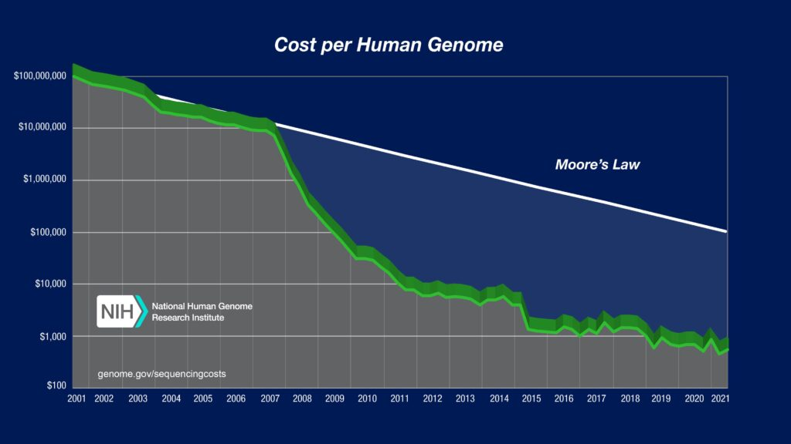
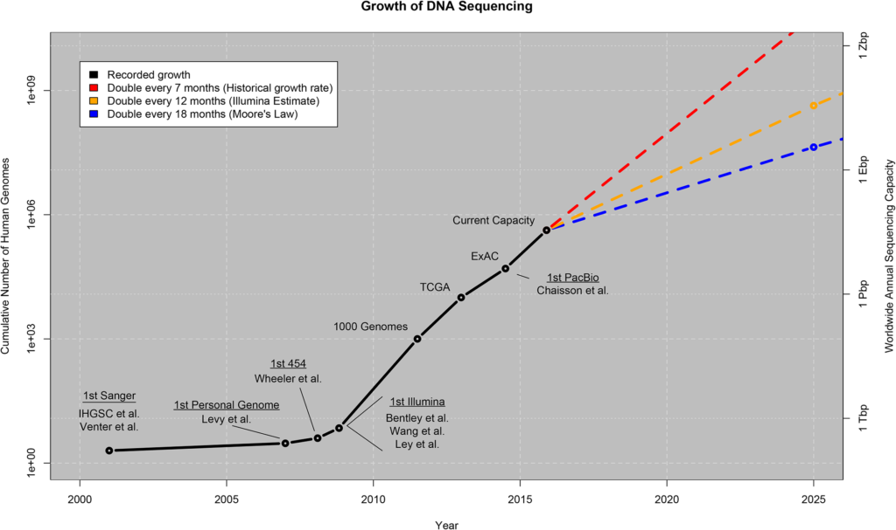
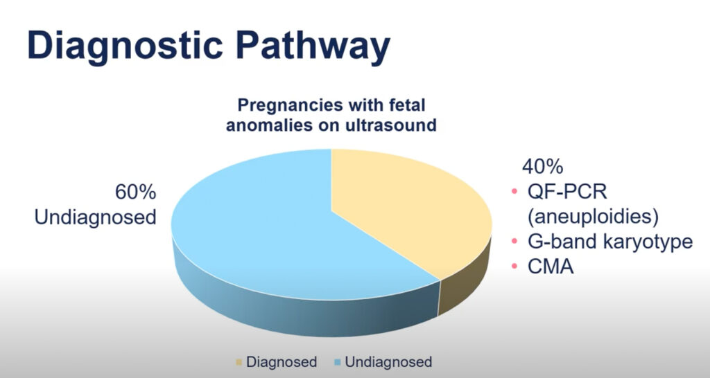

## **What is genome sequencing?  

基因组测序是什么？**

Genome sequencing is a method in which the genetic makeup of a specific organism or cell type is determined.  

基因测序是一种用于确定特定生物或细胞类型遗传组成的方法。  

In sequencing the genome, a great deal of information can be determined such as the likelihood of getting certain diseases or possible allergies.  

在基因组测序中，可以获得大量信息，例如某些疾病或潜在过敏的风险。  

Scientists are interested in this technology because it allows the possibility of diagnosing unknown diseases, detect diseases from the genome prior to symptoms, and advance preventive care greatly.  

科学家们对这项技术非常感兴趣，因为它可以帮助诊断未知疾病、在症状出现之前通过基因组检测疾病，并大大提升预防护理的水平。  

 

## **History  

历史学**

-   1965 – Robert Holley [sequenced the first tRNA](https://the-dna-universe.com/2020/11/02/a-journey-through-the-history-of-dna-sequencing/) from Saccharomyces cerevisiae, a type of yeast.   
    
    1965 年，罗伯特·霍利成功测序了来自酿酒酵母（Saccharomyces cerevisiae）的第一个 tRNA。
-   1972 – [Walter Fiers](https://belsocmicrobio.be/famous-belgian-microbiologists/walter-fiers/) sequenced the DNA of an entire gene.   
    
    1972 年，沃尔特·菲尔斯完成了一个完整基因的 DNA 测序。
-   1977 – Fredrick Sanger found an alternative and more efficient way to sequence DNA called the “[chain termination method](https://bio.libretexts.org/Bookshelves/Microbiology/Book%3A_Microbiology_(Boundless)/7%3A_Microbial_Genetics/7.13%3A_Bioinformatics/7.13F%3A_DNA_Sequencing_Based_on_Sanger_Dideoxynucleotides#:~:text=Sanger%20sequencing%2C%20also%20known%20as,specifically%2C%20dideoxynucleotides%20(ddNTPs).).” He used his method to sequence the first complete genome by sequencing the genome of the bacteriophage PhiX174.  
    
    1977 年，弗雷德里克·桑格发现了一种更高效的 DNA 测序方法，称为“链终止法”。他利用这种方法成功测序了第一个完整的基因组，即细菌病毒 PhiX174 的基因组。  
    
     
-   2000 – Massively Parallel Signature Sequencing (MPSS) Lynx Therapeutics (USA) Company launched the [first of the NGS technologies](https://www.ncbi.nlm.nih.gov/pmc/articles/PMC3917434/#:~:text=In%202000%2C%20Massively%20Parallel%20Signature,first%20of%20the%20NGS%20technologies.), which was later bought by Illumina.  
    
    2000 年 – 大规模并行签名测序（MPSS）由 Lynx Therapeutics（美国）公司推出，这是首个 NGS 技术，后来被 Illumina 收购。  
    
    This next-generation sequencing didn’t use radioactive material and could produce a higher throughput.  
    
    这种新一代测序技术不使用放射性材料，能够实现更高的通量。  
    
    However, it sequenced a smaller portion of the DNA  
    
    不过，它对 DNA 的一小部分进行了测序

_Diagram of the cost per human genome over the years._   

人类基因组成本随年份变化的图表。  

Image credit: [National Human Genome Research Institute](https://www.genome.gov/about-genomics/fact-sheets/Sequencing-Human-Genome-cost)  

图片来源：美国国家人类基因组研究所

As technology continues to develop, genomic sequencing has become cheaper and more accessible.  

随着技术的不断进步，基因组测序变得更加经济实惠且易于获取。  

Soon people will have the opportunity to get their genome sequenced for as low as [one hundred dollars](https://www.science.org/content/article/100-genome-new-dna-sequencers-could-be-game-changer-biology-medicine).   

不久后，人们将有机会以仅需一百美元的价格进行基因组测序。

_Diagram of the number of human genomes sequenced over the years._   

人类基因组测序数量随时间变化的图表。  

Image credit: [PLOS Biology](https://journals.plos.org/plosbiology/article?id=10.1371/journal.pbio.1002195)  

图片来源：PLOS 生物学期刊

As demonstrated above, there has been an almost exponential increase in the number of people who have had their genomes sequenced due to the decrease in price.  

如上所示，由于价格下降，接受基因组测序的人数几乎呈现出指数级的增长。  

As of February 2021, close to [30 million people have gotten their genomes sequenced](https://www.science.org/content/podcast/looking-back-20-years-human-genome-sequencing).  

到 2021 年 2 月，近 3000 万人已经进行了基因组测序。

As this technology advances, much controversy has occurred over the ethics of genome sequencing.  

随着这项技术的进步，基因组测序的伦理问题引发了广泛的争议。  

What are the pros and cons of sequencing one’s genome at different ages?  

在不同年龄进行基因组测序有哪些优缺点？  

What are the ethics around getting a genome sequenced?  

进行基因组测序的伦理问题是什么？  

To answer these questions, it is essential to look at sequencing during different stages of life: sequencing while a fetus, from birth to adulthood, and from adulthood onward.  

为了回答这些问题，必须关注不同生命阶段的序列：胎儿时期、从出生到成年，以及成年之后。

## **Sequencing the genome of a fetus  

测序胎儿的基因组**

**Proper Consent  

正确的同意**

Oftentimes parents do not have a complete understanding of all of the implications and possibilities that come with genome sequencing and therefore they are unable to [give their full consent](https://www.ncbi.nlm.nih.gov/pmc/articles/PMC5836985/). The solution seems simple, just provide all of the information needed to make the decision.  

父母往往对基因组测序的所有影响和可能性缺乏全面的理解，因此无法给予完全的同意。解决方案看似简单，只需提供做出决策所需的所有信息。  

However, the solution is complex because of the certainty and interpretation of the results, meaning, with most results, the implications of the findings are difficult to explain due to their complexity.  

然而，解决方案很复杂，因为结果的确定性和解释，意味着大多数结果的含义由于其复杂性而难以阐明。  

Often there is information other than what is directly being investigated that presents during genomic testing, creating an additional issue with consent.  

在基因检测中，常常会出现与直接调查内容无关的信息，这给知情同意带来了额外的挑战。

**Certainty of Results and Information Communicated  

结果和信息传达的确定性**

Often, certain results can signal significance, however, it is [impossible to know with full certainty if the child will ever](https://www.ncbi.nlm.nih.gov/pmc/articles/PMC7413244/) be affected. Additionally, many genomic sequencing results are currently unable to be interpreted.  

有时，某些结果可能表明其重要性，但我们无法完全确定孩子是否会受到影响。此外，目前许多基因组测序结果仍然无法进行解读。  

This complicates things as too much information can be too complicated and lead to minimal understanding, however, not enough information can be seen as withholding information.  

这使事情变得复杂，因为信息过多可能会导致理解困难，而信息不足又可能被视为隐瞒。  

The consensus tends to be that [all information and data that could be acted upon should be delivered to the patient](https://www.ncbi.nlm.nih.gov/pmc/articles/PMC5836985/). Nevertheless, what is considered to be actionable is a grey area.  

大家普遍认为，所有可以采取行动的信息和数据都应提供给患者。然而，什么算是可操作的信息却是一个模糊的概念。  

Furthermore, results might persuade parents to terminate a pregnancy due to the possible conditions of the baby.  

此外，结果可能会使父母因婴儿可能存在的健康问题而选择终止妊娠。  

This could cause many problems due to the ambiguity of the results and the certainty that the newborns would actually be affected.  

这可能会引发许多问题，因为结果的不确定性以及新生儿确实会受到影响的事实。  

 

This leads to the question of [whether uncertain results should be communicated back to the patient](https://www.ncbi.nlm.nih.gov/pmc/articles/PMC6370459/).  

这引发了一个问题：不确定的结果是否应该告知患者。  

While there are many results with an uncertain level of significance, many results also have a high level of certainty.  

虽然许多结果的显著性水平不确定，但也有许多结果具有很高的确定性。  

If there is a disease or disability that has been detected and has the potential to be fixed, is the doctor obligated to do so?  

如果发现有可治疗的疾病或残疾，医生是否有义务进行治疗？  

The answer may seem obvious to some people, however, there are arguments for both sides.  

对于某些人来说，答案可能很明显，但实际上双方都有各自的论据。  

It can be seen as the duty of a doctor to intervene, however, this intervention could decrease diversity and could [imply that those with disabilities aren’t “normal](https://www.ncbi.nlm.nih.gov/pmc/articles/PMC4113095/)”. As of now, the final decision is in the hands of the parents.  

医生的职责可以被视为进行干预，但这种干预可能会减少多样性，并可能暗示残疾人并不“正常”。目前，最终的决定权在父母手中。

**Benefits  

益处**

Although there are many ethical concerns, this procedure has many benefits.  

尽管存在许多伦理问题，但这个过程带来了许多好处。  

The most obvious benefit of genomic sequencing of the fetus is the ability to receive treatment early.  

胎儿基因组测序最显著的好处是能够尽早进行治疗。  

Possible disabilities or diseases such as [heart disease, cystic fibrosis, and sickle cell anemia](https://health.mo.gov/living/families/genetics/) could be prevented with treatments improving the quality of life of the newborn baby.   

心脏病、囊性纤维化和镰状细胞贫血等可能的残疾或疾病，可以通过改善新生儿生活质量的治疗来预防。

Even if the condition isn’t curable, finding out early on could prevent the condition from worsening.  

即使这种病症无法治愈，早期发现也能防止病情加重。  

With information about any disabilities, diseases, or abnormalities, [parents have the opportunity to plan ahead](https://www.science.org/content/article/sequencing-unborn). This advanced planning often saves money and can lead to less stress.  

了解任何残疾、疾病或异常后，父母可以提前做好规划。这种提前规划通常能节省开支，并减轻压力。  

This is especially the case with newly found mutations in the DNA which can result in diseases that do not run in the family which would make them harder to predict without genomic sequencing.  

这尤其适用于新发现的 DNA 突变，这可能导致一些家族中没有出现过的疾病，从而使得在没有基因组测序的情况下更难以预测。  

 

Diagram showing percent of undiagnosed fetal anomalies using ultrasound. Image Credit: [Congenica](https://blog.congenica.com/diagnosis-of-fetal-structural-abnormalities-using-exome-sequencing-a-single-centre-study)  

显示未诊断胎儿畸形百分比的超声波图表。图片来源：Congenica

Fetal sequencing can also uncover many of the undiagnosed anomalies missed with ultrasound screening, possibly saving lives.  

胎儿测序还可以揭示许多在超声筛查中未被诊断的异常，这可能会挽救生命。

## **Sequencing the genome of a child  

对儿童基因组进行测序**

**Proper Consent  

正确的同意**

The same issues that come up with consent regarding prenatal genomic sequencing apply to this age group as well.  

与产前基因组测序相关的相同问题同样适用于这个年龄段。  

However, there is another issue that comes up regarding consent; [is it ethical to give the parents the authority to make the decision](https://bmcpediatr.biomedcentral.com/articles/10.1186/s12887-021-02830-w) of whether or not genomic sequencing should be done?  

然而，还有一个关于同意的另一个问题：让父母决定是否进行基因组测序是否符合伦理？  

Should the child have the right to choose whether or not he or she has their genome sequenced?  

孩子是否有权决定是否进行基因组测序？  

It is up to the parents to choose the option that is in the child’s best interest, however, there are some conflicts that go along with this.  

父母有责任选择对孩子最有利的方案，但这其中也会出现一些冲突。  

With the choice in the hands of the parents, the child loses the right to not know.   

当选择权在父母手中时，孩子失去了不知情的权利。

Another issue with consent is whether or not the parent should be able to decide to release the data to be analyzed and used for research.  

另一个与同意相关的问题是父母是否有权决定是否释放数据以供分析和研究使用。  

The information belongs to the child, since it is in fact their own DNA, however, the [decision is left to the parents](https://bmcpediatr.biomedcentral.com/articles/10.1186/s12887-021-02830-w).   

这些信息属于孩子，因为它实际上是他们自己的 DNA，但最终的决定权在父母手中。

**Return of Results  

返回结果**

Another issue that comes up is testing for disorders that don’t take effect until adulthood and have no treatment that could be applied during childhood.  

另一个问题是，有些疾病直到成年才会显现，而在儿童时期没有可用的治疗方法。  

Would the knowledge of such a disorder be beneficial in any way or would it just induce stress?  

了解这种疾病是否有任何好处，还是只会带来压力？  

The genetics community has decided that testing or returning results of [testing children for adult-onset diseases should be withheld](https://pubmed.ncbi.nlm.nih.gov/16758099/).  

遗传学界已决定不对儿童进行成人发病疾病的检测或返回检测结果。  

This has been decided in order to respect the children’s autonomy; it would protect the child from unnecessary harm, and there would be no real benefits in testing for adult-onset diseases that have no treatment.  

这是为了尊重儿童的自主权而做出的决定；这样可以保护儿童免受不必要的伤害，而且对那些没有治疗方法的成人发病疾病进行检测并没有实际的好处。

**Lack of Autonomy  

缺乏自主权**

A problem that doesn’t happen as often is if the parents’ opinion on what is best for the child opposes the opinion of what the health care professional thinks is best for the child, then the child could be harmed.  

一个不常见的问题是，如果父母对孩子最佳利益的看法与医疗专业人员的看法相悖，可能会对孩子造成伤害。  

The child does not get to decide whether or not to accept the health care professional’s advice and [instead has their decisions made by their parents which could be harmful](https://pubmed.ncbi.nlm.nih.gov/16758099/).  

孩子无法决定是否接受医疗专业人员的建议，而是由父母代为决定，这可能会带来伤害。

**Benefits  

益处**

Even though there are ethical issues with genome sequencing in children, there are many undeniably beneficial outcomes as well.  

尽管儿童基因组测序存在伦理问题，但其带来的许多好处是不可否认的。  

The most prevalent benefit, especially in genome sequencing for children, is finding out if they have any child-onset conditions.  

在儿童基因组测序中，最显著的好处是能够发现他们是否患有任何儿童期发病的疾病。  

There are [over 2,500 genes that are associated with child-onset conditions](https://www.viacord.com/other-services/newborn-and-children-tests/whole-genome-sequencing/#:~:text=The%20information%20from%20the%20test,proactive%20and%20informed%20health%20decisions.&text=2%2C500%20Genes%20are%20known%20to,for%20any%20of%20those%20conditions.).  

与儿童发病相关的基因数量超过 2500 个。  

The discovery of one of these genes would help prepare the child and the parents to deal with the conditions or it could even lead to a possible treatment of the condition.  

发现其中一个基因将有助于孩子和父母更好地应对这些状况，甚至可能为治疗该状况提供新的可能性。  

In either scenario, the overall quality of life would go up and there would most likely be an increase in life expectancy.  

无论哪种情况，整体生活质量都会提高，寿命也很可能会增加。  

 

Genomic sequencing in children would also help determine if they would have an allergic reaction to different drugs that could be used for treatments.  

对儿童进行基因组测序还可以帮助确定他们是否会对可能用于治疗的不同药物产生过敏反应。  

It would definitely be easier to find out a child is allergic to something through a genetic test rather than experiencing an allergic reaction.  

通过基因测试发现孩子是否对某种物质过敏，肯定比经历过敏反应要容易得多。  

Not only can genomic sequencing of a child be beneficial to the entire family, but it can also help other children all around the world.  

基因组测序不仅对一个孩子和整个家庭有益，还能帮助世界各地的其他孩子。  

This is because as more genomic data is collected, more mystery diseases can be solved, helping others around the world.  

这是因为随着基因组数据的不断增加，更多神秘疾病得以解决，从而帮助全球的人们。  

The video below shows a real-life example of when genomic data was used to diagnose mystery diseases.  

下面的视频展示了一个真实案例，说明基因组数据是如何被用来诊断难以识别的疾病的。

<iframe title="Medical Mystery – Alexis and Noah" src="https://www.youtube.com/embed/YnfjCiJyt-Y?feature=oembed" allow="accelerometer; autoplay; clipboard-write; encrypted-media; gyroscope; picture-in-picture; web-share" referrerpolicy="strict-origin-when-cross-origin" allowfullscreen="" name="fitvid0"></iframe>

Not only can genomic sequencing be used to diagnose mystery diseases, but it can also make the diagnostic journey much easier for a variety of diseases.  

基因组测序不仅可以用来诊断神秘疾病，还能让多种疾病的诊断过程变得更加简单。  

Instead of going through hundreds of different time-consuming and often painful tests, it is possible to get a full diagnosis from just genomic sequencing.  

与其经历数百种耗时且常常痛苦的测试，不如仅通过基因组测序就能获得全面的诊断。  

A real-life example of this is shown in the video below.  

下面的视频展示了一个现实生活中的例子。

<iframe title="Whole Genome Sequencing: Patient stories - Jessica Wright’s diagnostic odyssey" src="https://www.youtube.com/embed/ygi3Dtfxf7w?feature=oembed" allow="accelerometer; autoplay; clipboard-write; encrypted-media; gyroscope; picture-in-picture; web-share" allowfullscreen="" name="fitvid1"></iframe>

## **Sequencing the genome of an adult  

对成人基因组进行测序**

The majority of the ethical issues that have already been discussed also apply to adults.  

大多数已经讨论过的伦理问题同样适用于成年人。  

If anything, there seem to be fewer ethical issues.   

如果说有什么的话，似乎道德问题反而更少了。

**Proper Consent  

正确的同意**

The issue of making the decision on whether to get genomic sequencing done for someone else such as a child is eliminated since adults are old enough at this point to give consent.  

关于是否为他人（如儿童）进行基因组测序的决定问题已经不再存在，因为成年人在这个时候已经足够成熟，可以自行做出同意。  

However, the problem that resurfaces is whether or not that consent is truly considered consent.  

然而，重新出现的问题是这种同意是否真正被视为有效的同意。  

This is due to the complex nature of genomic sequencing so even if there is the consent given, it is not informed consent so ethical questions referencing the reliability of that consent arise.  

这与基因组测序的复杂性有关，因此即使获得了同意，这也并不算是知情同意，因此会出现关于该同意可靠性的伦理问题。  

 

**Return of Results  

返回结果**

Another issue comes up with what information to reveal to the patient in the results.  

另一个问题是我们应该向患者透露哪些结果信息。  

With prenatal and sequencing in children, this issue would be in the hands of the parents, however, in this situation, the issue is in the hands of the medical professionals.  

在儿童的产前检查和基因测序中，这个问题通常由父母来处理，但在这种情况下，问题则掌握在医疗专业人员手中。  

Nevertheless, this problem could be eased by asking the patient what information they want to be disclosed to them before the sequencing is done.  

不过，这个问题可以通过询问患者希望在测序前了解哪些信息来缓解。  

Due to the opposing viewpoints in this process, it is up to the individual doctors and companies as to what is revealed [since different experts have different recommendations.](https://www.ncbi.nlm.nih.gov/pmc/articles/PMC4163150/)  

由于在这个过程中存在不同的观点，具体揭示什么由各个医生和公司决定，因为不同的专家有各自的建议。

**Benefits  

益处**

Similar to the ethical issues for this age group, the benefits are very similar to the benefits of the other age groups as well.  

这个年龄组的伦理问题与其他年龄组的益处非常相似。  

There aren’t many different benefits but the one that stands out in most age groups is diagnosis.  

在大多数年龄段中，虽然好处不多，但最显著的是诊断。  

When someone has health issues, genomic sequencing could offer very [precise diagnoses which could help with managing the illness and coming up with treatment](https://www.viacord.com/other-services/newborn-and-children-tests/whole-genome-sequencing/#:~:text=The%20information%20from%20the%20test,proactive%20and%20informed%20health%20decisions.&text=2%2C500%20Genes%20are%20known%20to,for%20any%20of%20those%20conditions.) options.  

当一个人出现健康问题时，基因组测序能够提供非常准确的诊断，这有助于疾病管理和制定治疗方案。  

Genomic sequencing can be used to identify what drugs they should be taking as well which would be more helpful in adulthood rather than childhood.  

基因组测序可以帮助确定他们应该服用哪些药物，以及哪些药物在成年时比在儿童时期更有效。  

 

The video below is a real-life example of genomic sequencing preventing many possible deaths in adults of this generation and the next one.  

下面的视频是一个现实生活中的例子，展示了基因组测序如何帮助预防这一代和下一代成年人可能面临的许多死亡。  

  

<iframe title="How genetic sequencing can unlock secret DNA mutations — and save lives" src="https://www.youtube.com/embed/BQahk_eHfxg?feature=oembed" allow="accelerometer; autoplay; clipboard-write; encrypted-media; gyroscope; picture-in-picture; web-share" allowfullscreen="" name="fitvid2"></iframe>

A long-term benefit that comes out of more genomic testing, not exclusive to sequencing in adults, is that with more genomic data, more correlations between genes and disease can be found, [leading to more accurate diagnoses in the future](https://www.genome.gov/about-genomics/fact-sheets/Genomic-Data-Science).  

更加基因组测试带来的长期好处不仅限于成年人测序，随着基因组数据的增加，我们可以发现基因与疾病之间更多的关联，从而在未来实现更准确的诊断。  

Whole genome sequencing would be able to look for a much larger array of different conditions than before helping to prevent even more diseases.  

全基因组测序可以检测到比以往更多种类的疾病，从而帮助预防更多的健康问题。  

 

With genomic sequencing, there are many possible concerns, such as proper consent, the certainty of results, the return of results, and lack of autonomy.  

通过基因组测序，可能会出现许多担忧，例如是否获得适当的同意、结果的可靠性、结果的反馈以及个人自主权的缺失。  

These are just some of the issues that would have to be weighed against some heavy benefits, such as diagnosis of mystery diseases, early treatment, and finding what allergies affect you.  

这些只是需要与一些重大好处进行权衡的问题，例如神秘疾病的诊断、早期治疗以及找出哪些过敏源会影响你。  

Depending on different people’s age ranges and values, sometimes the benefits outweigh the concerns whereas sometimes the concerns are too heavy.  

根据不同年龄段和价值观的人，有时好处会超过担忧，而有时担忧则显得过于沉重。  

Would you get your genome sequenced?  

你会选择对自己的基因组进行测序吗？

___

_Albert Nasr is a senior at Mira Loma High School in Sacramento, California.  

阿尔伯特·纳斯尔是加利福尼亚州萨克拉门托市米拉洛马高中的一名高年级学生。  

He loves biology because of how even in the most complex systems with so many different intricate processes, everything seems to fit together perfectly.  

他热爱生物学，因为在那些复杂的系统中，尽管有许多不同的精细过程，但一切似乎都能完美地融为一体。  

Albert, being eager to learn more about how these complex systems function in everyday situations, was thrilled to take part in the summer workshop at Stanford University.  

阿尔伯特渴望了解这些复杂系统在日常生活中的运作，因此他非常高兴能参加斯坦福大学的夏季研讨会。_

_Apart from biology, Albert is also incredibly passionate about soccer, and he loves trying new foods from different cultures.  

除了生物学，阿尔伯特对足球也充满热情，他喜欢尝试来自不同文化的新食物。_
