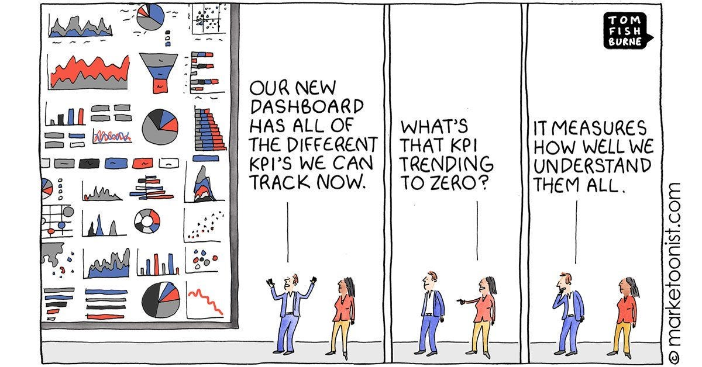

We strive to be data-driven in our decision making.  

我们在决策时力求以数据为导向。  

And barring that, data-informed, overlaying our intuition and thoughts on top of the data.  

除此以外，还要以数据为依据，在数据的基础上叠加我们的直觉和想法。  

We certainly don’t want to be ignorant, and just make decisions with our gut.  

我们当然不希望自己一无所知，只凭直觉做决定。  

And yet sometimes that is exactly what happens — and some argue, better than being data-driven.  

然而，有时这正是发生的事情--有人认为，这比数据驱动更好。

There is a great paradox at the heart of using data to make product decisions.  

使用数据进行产品决策的核心是一个巨大的悖论。  

While data is meant to be objective and scientific, in practice, it’s hardly the case.  

虽然数据本应是客观和科学的，但实际上却很难做到。  

That’s because being data-driven has limitations. What limits?  

这是因为数据驱动有其局限性。什么限制？

Let me say more, but to address this very important, very serious topic, I must begin with some webcomics.  

让我多说几句，但要谈这个非常重要、非常严肃的话题，我必须从一些网络漫画开始。

The first one:  

第一个：

The above webcomic made me LOL and reminded me of this quote — which I think is very true:  

上面这幅网络漫画让我捧腹大笑，也让我想起了这句话--我认为它非常正确：

> “If we have data, let’s look at data. If all we have are opinions, let’s go with mine.”  
> 
> "如果我们有数据，那就看数据。如果我们只有观点，那就用我的观点吧"。  
> 
> — Jim Barksdale  
> 
> \- 吉姆-巴克斯代尔

And the second webcomic, illustrating what happens with data-driven product cultures.  

而第二幅网络漫画，说明了数据驱动的产品文化会发生什么。  

Yes, you can have too much of a good thing:  

是的，好东西可以吃得太多：

OK, now we’re ready to rock since we’ve built a mutual understanding of the problem via webcomics.  

好了，既然我们已经通过网络漫画建立了对问题的相互理解，现在我们就可以开始摇滚了。  

What are all the problems we encounter when we strive to be data-driven?  

当我们努力以数据为导向时，会遇到哪些问题？

**The problem  

问题**  

We are endlessly surrounded by data but also lack the ability to make sense of it all.  

我们被无穷无尽的数据所包围，但同时也缺乏理解这些数据的能力。  

It’s enormously frustrating but we commonly encounter discussions with statements like the following:  

这让人非常沮丧，但我们在讨论中经常会遇到类似下面这样的说法：

-   “Oh the metrics went down? That’s just seasonality. Next quarter will be better”  
    
    "哦，指标下降了？那只是季节性因素。下个季度会更好"。
    
-   “Yes, the metrics are up! That’s because of this amazing new thing we just shipped”  
    
    "是的，指标上升了！那是因为我们刚出厂的这个神奇的新产品"
    
-   “Yes, the A/B test showed this metric went down but this other went up, so it’s actually okay”  
    
    "是的，A/B 测试显示这个指标下降了，但另一个指标却上升了，所以实际上还不错"。
    
-   “We have to wait on the A/B test to see how the feature is doing, the data is still collecting”  
    
    "我们必须等待 A/B 测试，看看该功能的效果如何，数据仍在收集中"
    
-   “I signed up for a 5% increase last quarter on this key metric, and we hit that goal.  
    
    "上个季度，我提出要将这一关键指标提高 5%，我们实现了这一目标。  
    
    Why didn’t revenue go up? No idea”  
    
    为什么收入没有增加？不知道"
    
-   “People love this feature, just look at the data, we just need to onboard them better!”  
    
    "人们喜欢这项功能，看看数据就知道了，我们只需要更好地为他们提供服务！"
    
-   “Our new product feature is totally working, but the current metrics don’t reflect it since there’s a time lag.  
    
    "我们的新产品功能已经完全投入使用，但由于存在时间差，目前的指标并没有反映出来。  
    
    Wait until next month”  
    
    等到下个月"
    
-   “The clickthrough rate on this email was 0.15% and the other was 0.14%. That’s why  
    
    "这封邮件的点击率是 0.15%，另一封是 0.14%。这就是为什么
    
-   Etc etc etc  
    
    等等等等
    

Many of you are now smiling because you’ve been there!  

你们中的许多人现在都在微笑，因为你们曾经经历过！  

Both on the receiving end, as well as having these kinds of words come out of your mouth :) I know I certainly have.  

无论是在接收端，还是从你嘴里说出这些话:)我知道我肯定有这样的经历。

Why is it that we have so much data about how people use our products, and we are able to speculate as to what might make them stickier, or more valuable — yet truth-seeking is so difficult?  

为什么我们掌握了这么多关于人们如何使用我们产品的数据，我们能够推测是什么让产品更有粘性或更有价值，但寻求真相却如此困难？  

We get all the aforementioned excuses (and more) because of the “fog of war” as we pick the product.  

由于在挑选产品时存在 "战争迷雾"，我们会得到上述所有借口（以及更多借口）。  

This is doubly critical to figure out as many of our jobs now regularly involve reviewing data, then making decisions.  

由于我们现在的许多工作都经常涉及审查数据，然后做出决策，因此弄清这一点加倍重要。  

This happens while reviewing dashboards and graphs (at product meetings, reviewing decks, board meetings, etc).  

这种情况会在查看仪表盘和图表时发生（在产品会议、审查工作底稿、董事会会议等场合）。  

Or writing about metrics you’re plan to increase as part of a quarterly review.  

或者在季度审查中写下你计划提高的指标。  

We are in this fog constantly.  

我们一直处于这种迷雾之中。

**The root cause(s) for all our problems  

我们所有问题的根源**  

In our quest to be data-driven, we hit many core problems based on how we collect/analyze/decision the data.  

在追求数据驱动的过程中，我们遇到了许多核心问题，这些问题都是基于我们如何收集/分析/决策数据。  

Here are some of the variations:  

以下是其中的一些变化：

-   **Measuring yesterday when you should be thinking about tomorrow.** Data comes from the market you have today, not who you want to have.  
    
    在你应该考虑明天的时候，却在衡量昨天。数据来自于您今天所拥有的市场，而不是您想拥有的市场。  
    
    Products often resonate with a small and loyal audience, but they are often niche, early adopter types.  
    
    产品往往能引起一小部分忠实受众的共鸣，但他们往往是小众、早期采用者类型。  
    
    If you make decisions using data from this audience, you may not be able to make the right decisions that get you to a broader market.  
    
    如果您使用这些受众的数据来做决策，您可能无法做出正确的决策，从而进入更广阔的市场。  
    
    Your initial nerdy audience might ask for nerdy/configurable features, or expert features, whereas a broader market wants “easy to use.” Your data often doesn’t make this argument, and instead you end up chasing a local maximum.  
    
    最初的书呆子受众可能会要求书呆子/可配置功能或专家功能，而更广泛的市场则希望 "易于使用"。你的数据往往无法证明这一点，最终只能追逐局部最大值。
    
-   **Analysis paralysis. The cost of acquiring the data and its analysis can become cost prohibitive**. Of course you’d like to have data for every decision.  
    
    分析瘫痪。获取数据和分析数据的成本可能会让人望而却步。当然，您希望每项决策都能获得数据。  
    
    But if you need smart data analysts to pull the data, analyze it, check for corner cases, segment and analyze it, and then call a meeting to discuss (then analyze more, then discuss again), then it’ll just take too long.  
    
    但是，如果你需要聪明的数据分析师来提取数据、分析数据、检查边角情况、对数据进行细分和分析，然后召开会议进行讨论（然后进行更多的分析，然后再进行讨论），那么就会花费太长的时间。  
    
    So it’s often better to just analyze the hell out of big things and otherwise ignore the small stuff, even though a truly data-driven team would bristle at this approach.  
    
    因此，最好的办法往往是只分析大事，而忽略小事，尽管真正以数据为导向的团队会对这种做法感到不屑一顾。
    
-   **Intuition is fast, A/B tests are slow**.  
    
    直觉很快，A/B 测试很慢。  
    
    Related to the last point, sometimes when you become an expert about the customer, and have great intuition, you just know how to do the right thing.  
    
    与上一点有关的是，有时，当你成为客户专家，并拥有敏锐的直觉时，你就会知道如何做正确的事情。  
    
    And now just the right thing that can move the needle in the short-term, but also the thing that will create better, long-term value.  
    
    现在，我们不仅要做能在短期内推动发展的正确事情，还要做能创造更好的长期价值的事情。  
    
    You can make a bunch of these decisions quickly, and just ship the product, and not try to A/B test every single one.  
    
    您可以快速做出一系列这样的决定，然后直接发货，而不必尝试对每一个决定进行 A/B 测试。  
    
    Sometimes a startup’s market is moving so fast that this is actually the right approach.  
    
    有时，初创企业的市场发展速度太快，这样做其实是正确的。
    
-   **The tyranny of the majority.** When you deal with millions of datapoints of usage, you necessarily have to aggregate people together into segments.  
    
    少数服从多数。当你处理数以百万计的使用数据点时，你必须将人们聚合在一起，形成细分市场。  
    
    You look at averages, and compare segments.  
    
    你要看平均值，并对各部分进行比较。  
    
    Yet sometimes these groupings are wrong — what about the VIPs? What about the high value users?  
    
    然而，有时这些分组是错误的--VIP 用户怎么办？高价值用户怎么办？  
    
    If you make decisions that appeal to a broad audience, you might attract low-value international users at the expense of high-value US users — is more always better?  
    
    如果您做出的决策能吸引广泛的受众，那么您可能会吸引低价值的国际用户，而牺牲高价值的美国用户--难道越多越好吗？  
    
    It takes a while to unentangle which segments you actually care about, particularly if they are the minority of your users.  
    
    您需要花些时间来了解您真正关心哪些细分市场，尤其是如果这些细分市场在您的用户中占少数的话。
    
-   **A/B tests are good at measuring big things quickly, but not other things**. The biggest tool that a data-driven team can use is to use A/B tests.  
    
    A/B 测试擅长快速测量大事，但对其他事情却无能为力。数据驱动型团队可以使用的最大工具就是 A/B 测试。  
    
    Yet to reach statistical significance quickly, and to iterate on a regular basis (weeks not months), you end up comparing big metrics movements that happen quickly.  
    
    然而，要想快速达到统计意义，并定期（数周而不是数月）进行迭代，就必须对快速发生的重大指标变化进行比较。  
    
    Signup rate is easy to measure, as is clickthrough rate.  
    
    注册率很容易衡量，点击率也是如此。  
    
    But what about 90 day retention rate for the minority of your users that are the most high-value?  
    
    但对于少数最有价值的用户，90 天的留存率又如何呢？  
    
    That’s hard. And so often people just ignore them.  
    
    这很难。而人们往往视而不见。
    
-   **There’s a lot of noise**. Factors like seasonality adds a lot of noise.  
    
    噪音很大。季节性等因素会增加很多噪音。  
    
    So do big ad campaigns, or when competitors launch new products, or even if the month you’re in has an extra weekend versus another.  
    
    大型广告宣传活动、竞争对手推出新产品、甚至您所在的月份与其他月份相比多了一个周末，也是如此。  
    
    It’s often hard to compare metrics cleanly, so unless there’s a big effect, you often have to just grit your teeth and make a guesstimate.  
    
    通常很难对指标进行清晰的比较，所以除非有很大的影响，否则通常只能咬紧牙关进行猜测。  
    
-   **Historical data may not predict future trends**. This is particularly true with emerging technologies.  
    
    历史数据可能无法预测未来趋势。新兴技术尤其如此。  
    
    If you take a product idea, and add AI to it, will that be better or worse?  
    
    如果将一个产品创意加入人工智能，会更好还是更糟？  
    
    Will that increase conversion or retention or put other key metrics into decline?  
    
    这会提高转化率或留存率，还是会导致其他关键指标下降？  
    
    What if you take an idea and add a web3-first design?  
    
    如果将一个想法添加到网络3优先设计中会怎样？  
    
    Sometimes, technology is just discontinuous and it’s impossible to know what will happen next.  
    
    有时，技术就是不连续的，不可能知道下一步会发生什么。  
    
    Sometimes you just have to go for it.  
    
    有时，你不得不去做。  
    
    I live with this problem every day in my venture capital job, where you’d like to simplify investing as a “you should always invest when a product has X attribute.” But the problem is, the successes are so few (a few dozen a year at most, out of tens of thousands) that you can’t really build a high-conviction predictive model  
    
    在风险投资工作中，我每天都要面对这个问题，你会想把投资简化为 "当产品具有 X 属性时，你就应该投资"。但问题是，成功的案例太少（一年最多几十个，成千上万个），你无法真正建立一个高说服力的预测模型
    
-   **Correlation and causation**.  
    
    相关性和因果关系。  
    
    There’s a common path of analysis where a product team tries to figure out how their most engaged users became that in the first place.  
    
    有一种常见的分析方法是，产品团队试图找出他们最投入的用户最初是如何变成这样的。  
    
    They quickly find that they do some setup step more often than others — like setting their profile photo or inviting a friend or something.  
    
    他们很快就会发现，他们会比其他人更频繁地进行某些设置步骤，比如设置个人照片或邀请朋友什么的。  
    
    The effect looks strong, and then an A/B test is run forcing everyone to take this step.  
    
    效果看起来很好，然后进行 A/B 测试，迫使每个人都采取这一步骤。  
    
    The result is… nothing. It turns out high-intent users do X and then become high-intent.  
    
    结果是......一无所获。事实证明，高意向用户做了 X，然后就变成了高意向用户。  
    
    It’s correlation not causation. Shrug.  
    
    这是相关性，不是因果关系。耸耸肩。  
    
    This appears all the time, in many places, and just wastes everyone’s time.  
    
    这种情况经常出现在很多地方，浪费了大家的时间。
    
-   **Some things are important, but hard to measure**. How do you measure the effect of a new product feature on long-term brand? You probably can’t.  
    
    有些事情很重要，但很难衡量。如何衡量新产品功能对长期品牌的影响？你可能做不到。  
    
    What about how psyched your employees are about a new feature set? Or what investors think?  
    
    您的员工对新功能集的热情如何？或者投资者怎么看？  
    
    Or maybe you have an n=1 super strategic and important partner you want to impress with some killer new tech.  
    
    或者，你有一个 n=1 的超级战略重要合作伙伴，你想用一些杀手级的新技术打动他。  
    
    How does that show in an A/B test?  
    
    在 A/B 测试中如何体现？  
    
    Some of these factors are very important in the success of a new product, but it’s hard to get them to show up properly in a graph.  
    
    其中一些因素对新产品的成功非常重要，但很难在图表中正确显示出来。  
    
    Sometimes you just have to make the right call, if these things are important to you.  
    
    有时候，如果这些事情对你很重要，你就必须做出正确的决定。
    

I could come up with dozens more of these.  

这样的例子我还能想出几十个。  

The ultimate point I want to make is that there are a lot of gotchas, and as the webcomics mention, a lot of these data-driven problems will crop up, there are too many dashboards, and too many conflicting opinions.  

我想说的最终一点是，有很多问题，正如网络漫画中提到的，这些数据驱动的问题会层出不穷，有太多的仪表盘，也有太多相互矛盾的意见。  

And eventually the “highest paid person” (the HIPPO) just makes the decision, which is often where we started.  

最终，"薪酬最高的人"（HIPPO）只是做出决定，这往往就是我们的出发点。

For the more data-driven among you, this might seem horrible.  

对于更注重数据的人来说，这可能看起来很可怕。  

But let me also make the argument that this is great, and actually works!  

但我也要说，这样做很好，而且确实有效！

**Competing against tech’s dominant culture  

与科技主流文化竞争  

**In the past two decades, because of the success of the Google/Meta product management cultures spreading into many new companies, we have now implemented OKRs across the industry.  

在过去的二十年里，由于谷歌/美达的产品管理文化成功地传播到了许多新公司，我们现在已经在整个行业实施了 OKR。  

As a result, we have tens of thousands of product managers signing up for +5% increases in their metrics and aiming their hundreds of thousands of engineers at this problem.  

因此，我们有数以万计的产品经理签约，要求将他们的指标提高 5%，并将他们的数十万名工程师瞄准了这个问题。  

This dominant culture is one of data, of optimization, of taking small concrete steps to move metrics that are big and easy to understand.  

这种主流文化是一种数据文化、优化文化，是一种采取具体的小步骤来实现大而易懂的指标的文化。  

And you could argue that the success of many of the biggest tech products — the ones that don’t seem to evolve much at their core, but just inch along — are a success based on this strategy.  

可以说，许多大型科技产品的成功--这些产品的核心似乎并没有发生什么变化，只是在不断进步--都是基于这种策略的成功。

What do you do if you are their competitor?  

如果你是他们的竞争对手，你该怎么办？  

For example if you are a startup competing with one of the FAANG companies?  

例如，如果你是一家初创企业，要与 FAANG 公司竞争？

The reality is, you can’t race their race.  

现实情况是，你无法和他们比赛。  

If you are data-driven in the same way they are, have the same dominant PM culture, and make decisions as slow as them, you will lose.  

如果你和他们一样以数据为导向，拥有同样占主导地位的项目管理文化，决策速度也和他们一样慢，那么你就输定了。  

They have more resources, can move the ball inches forward each time, and it’s hard to win as a result.  

他们拥有更多的资源，每次都能将球向前推进几英寸，因此很难获胜。

Instead, you may have to do the opposite to compete:  

相反，您可能必须反其道而行之，才能在竞争中立于不败之地：

-   mostly intuition rather than waiting for data  
    
    主要凭直觉，而不是等待数据
    
-   super fast decision-making rather than incremental decisions  
    
    超快速决策，而不是渐进决策
    
-   big moves rather than small ones  
    
    大动作而不是小动作
    

Of course, I will always advocate to optimize the things worth optimizing for — like signup flows and key notifications.  

当然，我始终主张优化值得优化的东西，比如注册流程和关键通知。  

But a startup’s core product strategy might need something more drastic, and intuitive.  

但是，初创企业的核心产品战略可能需要更激烈、更直观的东西。

**Data-driven vs data-informed vs data-ignorant  

数据驱动型 vs 数据知情型 vs 数据漠视型  

**I write all of this with the deep pains and scars of using data in almost every product decision I’ve been apart of over the past decades.  

在过去的几十年里，我几乎参与了所有产品决策的制定，在使用数据的过程中，我留下了深深的伤痛。  

Of course I will always use the data.  

当然，我会一直使用这些数据。  

Yet in my twenties as a feral young founder, I erred towards relying on data too much — a desire to be data-driven, at all costs.  

然而，在我二十几岁时，作为一个狂热的年轻创始人，我却犯了过分依赖数据的错误--不惜一切代价，渴望以数据为导向。  

But I found that often took me to local maxima.  

但我发现这往往会把我带到当地的最大值。

Later on, I learned to be data-informed, still having intuition but overlaying data on top.  

后来，我学会了以数据为依据，仍然有直觉，但在直觉之上叠加了数据。  

There’s a happy medium here.  

这里有一个很好的平衡点。  

But I think there is also an argument — particularly for zero-to-one situations — to just be ignorant of the quantitative data, and instead, just train on intuition.  

但我认为，也有一种观点--尤其是在零对一的情况下--就是不考虑量化数据，而只凭直觉进行训练。  

Just make decisions based on your expert qualitative opinion about the market, your customers, and your competition.  

只需根据你对市场、客户和竞争对手的专业定性意见做出决策即可。  

And only optimize based on data later on, when it’s more appropriate.  

只有在以后更合适的时候，才会根据数据进行优化。
