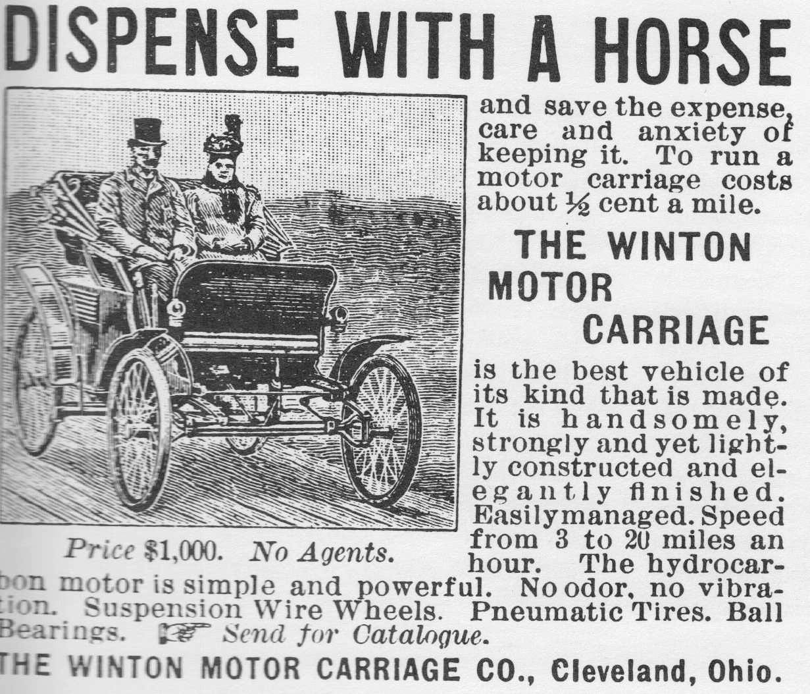

_Above: The horseless carriage (known here as a motor carriage) as the ultimate example of the adjective+noun product description.  

上图无马马车（此处称为电动马车）是形容词+名词产品描述的终极范例。  

Positioned against horses!  

对马定位！_

**The Simple to WTF scale  

从 "简单 "到 "繁琐 "量表  

**There's a complexity scale for how people describe products. Here it is, from simplest to wtf:  

人们对产品的描述有一个复杂程度表。从最简单到匪夷所思：

-   **SIMPLE (and easiest to understand)**: The product can be described in 2 words as \[adjective\] + \[noun\] like "electric car" or "smart phone" or similar.  
    
    简单（最容易理解）：可以用 \[形容词\] + \[名词\] 这两个词来描述产品，如 "电动汽车 "或 "智能手机 "或类似产品。  
    
    It's something you understand, but with one major change that's emphasized.  
    
    这是你能理解的，但有一个重大变化需要强调。  
    
    If the category gets big, then eventually something like "horseless carriage" just turns into "car." (which then invites a new adjective-led category later)  
    
    如果类别变大，那么像 "无马马车 "这样的词最终就会变成 "汽车"。(随后又会产生一个以形容词为主导的新类别）。
    
-   **OK GOT IT**: It's also easy to understand something like, "an \[kind of app\] for \[well-understood behavior\]," like an app for making a restaurant reservation or a VR app for playing basketball.  
    
    OK GOT IT："用于\[广为人知的行为\]的\[一种应用程序\]"这样的说法也很容易理解，比如用于预订餐厅的应用程序或用于打篮球的 VR 应用程序。  
    
    The more understandable the behavior (and the more obvious why someone would want to do this) the better.  
    
    这种行为越容易理解（为什么有人要这么做的原因越明显）就越好。  
    
    If there's a clear commercial value, that will make it very easy to understand.  
    
    如果有明确的商业价值，就会非常容易理解。
    
-   **HUH**: Famously a lot of startups go with the "\[product\] for \[category\]" description.  
    
    胡：众所周知，很多初创公司都会使用"\[产品\]用于\[类别\]"这样的描述。  
    
    This can work well for products that are easily segmented, like "online dating for international students" or "voice notes for doctors." If the product is obviously useful while the segment seems valuable and big enough, then it works great.  
    
    对于那些容易细分的产品，比如 "留学生在线约会 "或 "医生语音笔记"，这种方法可以很好地发挥作用。如果产品明显有用，而细分市场看起来有价值且足够大，那么效果就会很好。  
    
    It works less well when things are too niche, or there's no real market intersection for the "X for Y" idea, like a social network for cats.  
    
    当事情过于小众，或者 "X for Y "的想法没有真正的市场交叉点时，比如猫的社交网络，这种方法就不那么奏效了。  
    
    (No, this isn't a good idea, don't even get started).  
    
    (不，这不是个好主意，不要开始）。
    
-   **UH.... WHAT**: There's a close cousin to the above, which is "a \[kind of app\] for \[literal/weird/bizarre behavior\] or "it's \[weird product idea\] for \[niche segment\]".  
    
    UH....内容：上述内容还有一个近亲，即 "针对\[字面/怪异/离奇行为\]的\[一种应用程序\]或 "针对\[细分市场\]的\[怪异产品创意\]"。  
    
    Obv if it's an app for a weird/strange behavior, like "an app for visualizing wikipedia links as geometric diagrams" then one might understand literally what the app does, but still not get the why.  
    
    当然，如果它是一个用于怪异行为的应用程序，比如 "一个将维基百科链接可视化为几何图的应用程序"，那么人们可能会从字面上理解这个应用程序的作用，但仍然不明白为什么。  
    
    Or saying something is Roblox for cats. What would that even mean?  
    
    或者说什么是猫的 Roblox。这到底是什么意思？  
    
    This is particularly tempting for nerds who want to describe in detail what their product does, but not why, or to just make word salad because it's fun.  
    
    这对那些只想详细描述产品功能却不想说明原因的书呆子来说特别有诱惑力，或者只是因为好玩而制作文字沙拉。
    
-   **WTF (like seriously what?)**: One more step towards descriptive would be to lead with a lot of detail about the inner mechanics of the product as the starting point.  
    
    WTF（什么意思？）在描述性方面再进一步，可以从产品的内部机制入手，详细介绍产品的内部机制。  
    
    Perhaps starting with a history of an esoteric set of technologies involved as the 20 min preamble, before finally describing the product.  
    
    在 20 分钟的序言中，也许可以先介绍一系列深奥技术的历史，然后再介绍产品。  
    
    Or talk about a complicated product strategy based on the structure of your market, and after analyzing everything, finally get to a complex family of somewhat unrelated products, followed by a super product that encompasses all of them.  
    
    或者根据你的市场结构谈论一个复杂的产品战略，在分析了所有东西之后，最后得出一个复杂的有点不相关的产品家族，然后是一个包含所有产品的超级产品。  
    
    These pitches all follow the same pattern: 10-minute intro, question, another 10-minute spiel, more rambling, more questions, even more rambling... more confused questions.  
    
    这些推销都遵循相同的模式：10 分钟的介绍、提问、另一个 10 分钟的演讲、更多的废话、更多的问题、更多的废话......更多令人困惑的问题。  
    
    And on and on. WTF.  
    
    亹亹不倦。WTF.
    
-   **DOUBLE WTF**: And don't get me started if you begin your presentation with the "jobs to be done" framework, describe that, then describe your weird product, then describe how it fills some bizarre psychological need.  
    
    加倍 WTF：如果你在演讲中以 "待完成的工作 "为开头，先描述 "待完成的工作 "框架，然后描述你的怪异产品，再描述它如何满足了某种怪异的心理需求，那就别让我开始了。  
    
    Then 2x2s and then a weird super product with a bunch of features to be built over the next 5 years.  
    
    然后是 2x2，然后是一个奇怪的超级产品，将在未来 5 年内推出一系列功能。  
    
    We get it, you just got your MBA :) Just tell us what you're building now.  
    
    我们知道，你刚拿到 MBA 学位 :)告诉我们你现在在做什么吧。
    

If you’re building a product, maybe this is starting to scare you.  

如果你正在开发一款产品，也许这会让你感到恐惧。  

Maybe you’re at the WTF level and no wonder your idea has sounded so confusing over time.  

也许你正处于 "WTF "级别，难怪随着时间的推移，你的想法听起来如此令人困惑。

**How to fix your WTF description  

如何修复您的 WTF 描述**  

If you're at a higher WTF level than desired, here's the easiest fix.  

如果您的 WTF 水平高于期望值，这里有一个最简单的解决方法。  

But I warn you, it's a painful one, because it requires you to ask questions and listen.  

但我要提醒你，这是一个痛苦的过程，因为它需要你提问和倾听。

-   Show your product to target customers  
    
    向目标客户展示您的产品
    
-   Ask them: "How would you describe this to someone else?"  
    
    问他们"你会如何向别人描述这一切？"
    
-   Bite your tongue and listen - you'll soon learn some simple truths  
    
    咬紧牙关倾听--你很快就会明白一些简单的道理
    

Their words that follow this question are gold. Simplicity is key.  

在这个问题之后，他们的话是金玉良言。简单是关键。  

They will toss out your complicated description, and replace it with something easier and more truthful.  

他们会扔掉你复杂的描述，取而代之的是更简单、更真实的描述。  

Often times, you will dislike what you hear.  

很多时候，你会不喜欢听到的东西。  

Because it strips out all of your strategic differentiation, and just describes what is in front of them.  

因为它剔除了你所有的战略差异，只是描述了他们面前的东西。  

Or perhaps because it doesn't capture the technical "wow" of what's under the hood.  

或许是因为它无法捕捉到引擎盖下的技术 "惊艳"。  

Sorry, this is the unvarnished truth of your product even if it's painful.  

对不起，这是你的产品不加修饰的真相，即使它很痛苦。

To dislodge this ugly but truthful idea, you have to replace it with a better idea that's prettier but also equivalently truthful.  

要推翻这个丑陋但真实的想法，就必须用一个更好的想法来代替它，这个想法更漂亮，但也同样真实。  

You may need to shift towards familiar product categories or behaviors and position against them in an attractive way.  

您可能需要转向熟悉的产品类别或行为，并以有吸引力的方式对其进行定位。  

Your customers can only understand things through the context of what already exists in the world -- they can't talk or ask for new/innovative things.  

你的客户只能通过世界上已有的事物来理解事物，他们无法谈论或要求新的/创新的事物。  

The classic quote by Henry Ford says, "If I had asked people what they wanted, they would have said faster horses" Of course it's your job to deliver these innovations, but you must learn to describe them.  

亨利-福特（Henry Ford）有一句经典名言："如果我问人们想要什么，他们会说要更快的马。  

And cars were originally called horseless carriages for a reason -- to bridge the gap between what customers understand and what they actually want.  

而汽车最初被称为无马马车是有原因的--它弥补了客户的理解与实际需求之间的差距。

As a result, the simplest product pitches are often counterpositions on existing categories.  

因此，最简单的产品推销往往是对现有类别的反定位。  

Take something that's well understood, whether that's product in market, or a behavior that's commonplace, and describe your product relative to that one.  

选择一些广为人知的事物，无论是市场上的产品，还是司空见惯的行为，然后描述与之相对应的产品。  

If you can describe it as adjective+noun, then great, or "noun for segment" or "app for behavior." These are all attempts to use pre-existing categories.  

如果你能把它描述为形容词+名词，那就太好了，或者是 "细分市场的名词 "或 "行为的应用程序"。这些都是使用已有类别的尝试。

**What if your idea sounds too bland  

如果你的想法听起来太平淡怎么办？**  

The main downside to positioning against something pre-existing is that it'll feel too similar and bland.  

针对已有的东西进行定位的主要缺点是会让人感觉过于相似和平淡。  

It'll seem to lack differentiation.  

它似乎缺乏差异化。  

Sometimes that's fine, particularly if you are early in the product cycle where having the "it works" feature is enough, or if you at the end and "it has better design" is enough.  

有时这样也不错，特别是在产品周期的早期，有 "它能工作 "的功能就足够了，或者在产品周期的末期，有 "它有更好的设计 "就足够了。  

But sometimes you do need to have a strong counterpositioning.  

但有时你确实需要一个强有力的反定位。

A few things to try.  

有几件事可以试试。

-   First, try to be the anti-something.  
    
    首先，努力成为反事物。  
    
    If there's a pre-existing product in the market try to differentiate by positioning against it.  
    
    如果市场上已经存在某种产品，则应通过与之相对应的定位来实现差异化。  
    
    "We're a new kind of X" or "We're the anti-X" and follow this line of thought to what this might be.  
    
    "我们是一种新的 X "或 "我们是反 X"，并按照这个思路去思考这可能是什么。  
    
    Perhaps it's mostly branding, as Pepsi and Coke are, or maybe it's something more substantial like a consumer versus enterprise focus (like Box and Dropbox).  
    
    也许主要是品牌效应，就像百事可乐和可口可乐一样，也许是更实质的东西，比如消费者与企业的关注点（如 Box 和 Dropbox）。  
    
    There’s a good book called [Different by Youngme Moon](https://www.amazon.com/Different-Escaping-Competitive-Youngme-Moon/dp/030746086X) that I sometimes recommend, which discusses this antagonistic positioning.  
    
    我有时会推荐一本好书，叫《不同》，作者是 Youngme Moon，书中讨论了这种对立的定位。
    
-   Or, make a fundamental choice in UX, one that's immediately visible.  
    
    或者，在用户体验方面做出一个一眼就能看出来的基本选择。  
    
    Perhaps another product opens to an AI text box, and you should open to a grid of templates.  
    
    也许其他产品打开的是一个 AI 文本框，而你打开的应该是一个模板网格。  
    
    Or you use animated GIFs when others use videos or lists of text.  
    
    或者当别人使用视频或文字列表时，你却使用 GIF 动画。  
    
    Sometimes a big "out of the box" difference in UI goes a long way, particularly if that UI helps you target a different audience.  
    
    有时，"开箱即用 "的用户界面差异会起到很大作用，尤其是当这种用户界面能帮助你锁定不同的受众时。
    
-   Go really premium and target a smaller audience.  
    
    真正的高端产品，目标受众更小。  
    
    Or go towards free (or as close as you can) and go broader. Sell via partners, or go direct.  
    
    或者走向免费（或尽可能接近免费）和更广泛的销售。通过合作伙伴销售，或直接销售。  
    
    Go for a younger audience, or try for an older one. Grow internationally rather than domestically.  
    
    争取年轻受众，或努力争取年长受众。在国际上发展，而不是在国内发展。  
    
    There's a lot of choices like these.  
    
    像这样的选择有很多。  
    
    These dichotomies help define the product description and oftentimes it's choices like these that can help win, not just features.  
    
    这些二分法有助于定义产品描述，而往往是这样的选择能帮助赢得市场，而不仅仅是功能。
    

There are may other strategies of course, but these are some common approaches.  

当然，还有其他一些策略，但这些都是常见的方法。

**Simple is a competitive advantage  

简单是一种竞争优势  

**When it's easier to describe what you do, it's more memorable. It spreads faster.  

当你更容易描述你所做的事情时，它就更容易让人记住。传播更快。  

Your onboarding gets more efficient, and your customer acquisition gets cheaper.  

您的入职效率会更高，获取客户的成本会更低。  

Simpler is a competitive advantage unto itself.  

更简单本身就是一种竞争优势。

The hardest part about this for a lot of product builders is simply that the ego wants to be different.  

对于很多产品制造商来说，最难的部分就是自我想要与众不同。  

People want credit for the cleverness of their idea.  

人们都想为自己的聪明点子赢得荣誉。  

And the line of thinking goes, more complex means more clever, which means they are smarter.  

按照这种思路，更复杂就意味着更聪明，也就意味着它们更聪明。  

Customers don't care about that.  

客户并不关心这些。  

They just want to understand how your product fits into their life and when they should use it.  

他们只想了解您的产品如何融入他们的生活，以及何时应该使用。  

That's it.  

就是这样。
