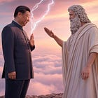
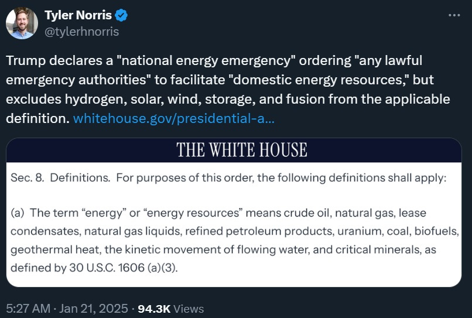
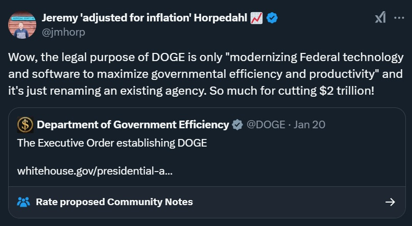

There’s a popular perception that the U.S. presidency has become an “imperial presidency”.  

人们普遍认为，美国总统已成为 "帝国总统"。  

Part of this idea is that Congress is so hopelessly gridlocked that the President has begun [governing by executive order](https://www.cato.org/free-society/winter-2024/reining-imperial-presidency-plan-repealing-harmful-executive-orders) — basically, an elected king.  

这种想法的部分原因是，国会陷入僵局已到了无可救药的地步，总统已开始通过行政命令进行治理--基本上就是一个民选的国王。  

I don’t think this is true — at least, not compared to the past. Executive orders were [more common in the early 20th century](https://www.statista.com/statistics/1125024/us-presidents-executive-orders/) than they have been in recent years — Calvin Coolidge issued 215 a year and Herbert Hoover 242, compared to 55 by Donald Trump (so far), and 38 by Joe Biden.  

我认为事实并非如此--至少，与过去相比并非如此。20 世纪初的行政命令比近年来更为常见--卡尔文-柯立芝（Calvin Coolidge）每年发布 215 项行政命令，赫伯特-胡佛（Herbert Hoover）每年发布 242 项行政命令，而唐纳德-特朗普（Donald Trump）每年发布 55 项行政命令（到目前为止），乔-拜登（Joe Biden）每年发布 38 项行政命令。  

Even in terms of word count, [we don’t see much change](https://www.mercatus.org/research/data-visualizations/measuring-content-not-just-number-executive-orders-and-proclamations) over the years.  

即使从字数上看，我们也看不出这些年来有什么变化。

As for whether executive orders have overreached in terms of their scope, that is definitely a concern (though it was also a concern a century ago), and I’ll talk about that later.  

至于行政命令的范围是否过大，这绝对是一个令人担忧的问题（尽管一个世纪前也是如此），我稍后会谈到这个问题。  

But many modern executive orders are just one President revoking or canceling some executive order of the previous President — often some symbolic culture-war thing.  

但是，许多现代行政命令只是由一位总统撤销或取消前任总统的某些行政命令--通常是一些象征性的文化战争措施。  

Yo-yoing back and forth between conservative and progressive cultural stances isn’t necessarily the most stability-inducing thing, but it doesn’t make the President a king.  

在保守和进步的文化立场之间来回摇摆并不一定是最稳定的做法，但这并不能让总统成为国王。

Donald Trump’s [flurry of executive orders](https://www.nytimes.com/2025/01/20/us/politics/trump-executive-orders-list.html) should be seen in this context. A bunch of what Trump did on his first day in office was just to [cancel out stuff Biden tried to do](https://www.whitehouse.gov/presidential-actions/2025/01/initial-rescissions-of-harmful-executive-orders-and-actions/). Ultimately, the effect on the nation won’t be noticeable.  

唐纳德-特朗普（Donald Trump）的一系列行政命令应从这个角度来看。特朗普上任第一天所做的很多事情都是为了取消拜登试图做的事情。最终，对国家的影响并不明显。  

But in addition, Trump issued some orders that could have far-reaching consequences, and in a few cases they represent a broadened assertion of presidential power.  

但除此之外，特朗普还发布了一些可能产生深远影响的命令，在一些情况下，这些命令代表了总统权力的扩大。  

[Time has a good summary](https://time.com/7208691/trump-day-one-presidential-actions-executive-orders-memorandum-proclamation-explainer/).  

《时代》有一个很好的总结。  

Of course I’ll write more about these orders in the days ahead, but I thought I’d give some rapid reactions.  

当然，我会在接下来的日子里写更多关于这些订单的内容，但我想我应该给出一些快速反应。  

The five main areas I’m going to focus on here are:  

在此，我将重点介绍以下五个方面：

1.  Immigration  
    
    移民
    
2.  Environmental review and permitting  
    
    环境审查和许可
    
3.  Affirmative action and DEI  
    
    平权行动和 DEI
    
4.  Energy policy  
    
    能源政策
    
5.  DOGE and the federal workforce  
    
    性别平等办公室和联邦劳动力
    

Trump’s executive order on birthright citizenship is his most important, because it’s the biggest test of executive power by far.  

特朗普关于出生公民权的行政命令是其最重要的行政命令，因为这是迄今为止对行政权力的最大考验。  

The 14th Amendment of the U.S. Constitution guarantees birthright citizenship:  

美国宪法第 14 条修正案保障出生公民权：

> All persons born or naturalized in the United States, and subject to the jurisdiction thereof, are citizens of the United States and of the State wherein they reside.  
> 
> 所有在美国出生或归化并受其管辖的人，均为美国公民和其居住州的公民。

This is [a common practice in the Western hemisphere](https://en.wikipedia.org/wiki/Jus_soli), though it’s rare in the Old World.  

这种做法在西半球很常见，但在旧大陆却很少见。  

Immigration restrictionists have been wanting to go after this one for a while, and they finally decided to just go for it and see what happens.  

移民限制主义者早就想这么做了，他们最终决定放手一搏，看看会发生什么。

Trump’s executive order says that visa holders — people here on O-1, H-1b, and so on — are not subject to U.S. jurisdiction, and therefore their kids are not citizens even if born in the U.S. (It also says the same about the kids of illegal immigrants.) It doesn’t revoke anyone’s citizenship; it applies only to future kids.  

特朗普的行政命令规定，签证持有者--持 O-1、H-1b 等签证入境者--不受美国司法管辖，因此他们的孩子即使出生在美国也不是美国公民。  

Trump’s EO is not declaring the Constitution null and void, but it’s asserting an interpretation of the text that has [already been contradicted by the Supreme Court](https://en.wikipedia.org/wiki/United_States_v._Wong_Kim_Ark), way back in 1898. [SCOTUS ruled](https://www.nationalreview.com/the-morning-jolt/can-birthright-citizenship-be-repealed-by-executive-order/) that “subject to the jurisdiction” of the U.S. means that you’re under U.S. law, and visa holders are definitely under U.S. law, so there’s a good chance this executive order will be struck down.  

特朗普的 EO 并非宣布宪法无效，但它对宪法文本的解释早在 1898 年就已被最高法院所抵触。最高法院裁定，"受美国司法管辖 "意味着你受美国法律管辖，而签证持有者肯定受美国法律管辖，因此这项行政命令很有可能被推翻。  

Already, states are [launching a flurry of lawsuits](https://www.nytimes.com/2025/01/21/us/trump-birthright-citizenship.html) against the order. (Update: A federal judge [has](https://www.foxnews.com/politics/blatantly-unconstitutional-u-s-judge-temporarily-blocks-trumps-ban-birthright-citizenship) _[already](https://apnews.com/article/birthright-citizenship-donald-trump-lawsuit-immigration-9ac27b234c854a68a9b9f8c0d6cd8a1c)_ [blocked this executive order](https://www.foxnews.com/politics/blatantly-unconstitutional-u-s-judge-temporarily-blocks-trumps-ban-birthright-citizenship), so we’ll see what SCOTUS has to say.) I’m no legal expert, but it seems pretty nonsensical to argue that green card holders _are_ subject to U.S. jurisdiction, but O-1 holders _aren’t_.  

目前，各州已经针对该命令发起了一系列诉讼。(更新：一位联邦法官已经阻止了这一行政命令，我们将拭目以待最高法院的裁决）。我不是法律专家，但认为绿卡持有者受美国司法管辖，而 O-1 持有者不受美国司法管辖似乎很无稽。

Even if the order does get struck down, however, it’ll probably exert a chilling effect on skilled immigration.  

不过，即使该命令被推翻，它也可能会对技术移民产生寒蝉效应。  

The chance to have a kid who’s an American citizen is one reason that the world’s most talented people come to America to work — often on an O-1 visa.  

有机会让孩子成为美国公民，是世界上最有才华的人来美国工作的原因之一--他们通常持 O-1 签证。  

Getting those people to work here is [a national security priority](https://www.noahpinion.blog/p/skilled-immigration-is-a-national), as well as a boon to the U.S. economy":  

让这些人在这里工作是国家安全的当务之急，也是美国经济的福音"：

Now those people know that the citizenship of their future children is a precarious thing — a political football.  

现在，这些人知道，他们未来子女的公民身份岌岌可危，是一个政治足球。  

This will probably exert a chilling effect on America’s ability to recruit top talent.  

这可能会对美国招募顶尖人才的能力产生寒蝉效应。  

The EO also seems badly written, in a way that could potentially be interpreted [turn the kids of visa holders into illegal immigrants](https://x.com/LevyAntoine/status/1881553205123031410) the moment they’re born (though I bet they’d find some fix for this).  

该 EO 似乎也写得很糟糕，有可能被解释为签证持有者的孩子一出生就变成了非法移民（尽管我打赌他们会找到一些解决方法）。

What will the voters think of this move?  

选民会如何看待这一举动？  

Birthright citizenship is broadly popular, though not overwhelmingly so. A bunch of [recent polls](https://docs.cdn.yougov.com/r0o0a2nef6/econTabReport.pdf) find [support](https://www.newsweek.com/ending-birthright-citizenship-popularity-donald-trump-immigration-2003145) for birthright citizenship in [the 60% range](https://www.prri.org/spotlight/the-resurgence-of-birtherism-and-attitudes-on-birthright-citizenship/). But Americans are [about evenly split](https://poll.qu.edu/Poll-Release-Legacy?releaseid=1497) on granting it to the kids of illegal immigrants.  

出生公民权受到广泛欢迎，尽管不是压倒性的。最近的一些民意调查显示，对出生公民权的支持率在 60% 左右。但美国人对给予非法移民子女公民权的意见基本持平。  

As usual, Americans like immigration in general, but really hate the idea that [people are violating the country’s rules](https://www.noahpinion.blog/p/on-immigration-what-americans-want) and getting away with it.  

像往常一样，美国人总体上喜欢移民，但非常讨厌有人违反国家规定并逍遥法外。  

It seems possible to me that Trump’s people added visa holders to the EO in order to give a conservative SCOTUS a face-saving way to split the difference — ending birthright citizenship for the kids of unauthorized immigrants, but keeping it for the kids of visa holders.  

在我看来，特朗普的人有可能在 EO 中加入了签证持有者，目的是给保守的上议院一个面子，让他们分出胜负--终止非法移民子女的出生公民权，但保留签证持有者子女的出生公民权。

Anyway, I also think this order confirms a trend that I’ve been noticing since Trump’s first term: The MAGA movement is opposed not just to illegal immigration, but also to _high-skilled legal immigration_, especially immigration from _India_. The [massive blowup on right-wing social media](https://www.noahpinion.blog/p/indian-immigration-is-great-for-america) around Christmastime was all about Indians, and there continues to be [a huge amount of hate](https://x.com/1776General_/status/1881289715082842265) directed specifically at Indians in right-wing circles. Elon Musk [stood up for H-1b workers on X](https://x.com/elonmusk/status/1872860577057448306?lang=en), but if there was any internal battle over it within the administration, his faction does not appear to have come out on top.  

无论如何，我还认为这项命令证实了我自特朗普上任以来一直注意到的一个趋势：MAGA 运动不仅反对非法移民，也反对高技能合法移民，尤其是来自印度的移民。圣诞节前后，右翼社交媒体上的大爆炸都是关于印度人的，右翼圈子里仍然有大量专门针对印度人的仇恨。埃隆-马斯克（Elon Musk）在 X 上为 H-1b 工人挺身而出，但如果政府内部对此有任何争论，他所在的派别似乎并没有占到上风。  

All in all, this is Trump’s worst executive order, for any number of reasons, and has the potential to do lasting harm to the fabric of the nation.  

总而言之，由于种种原因，这是特朗普最糟糕的行政命令，有可能对国家结构造成持久伤害。  

It’s also part of a suite of executive orders attacking immigration in general.  

这也是一系列行政命令的一部分，这些行政命令普遍针对移民问题。  

A lot of this stuff — suspending asylum claims at the border, suspending refugee resettlement, reimplementing the “remain in Mexico” policy, and so on — is stuff that [the American people wanted](https://www.noahpinion.blog/p/americans-are-angry-about-immigration) (or probably would want if they understood it).  

其中很多内容--暂停边境庇护申请、暂停难民安置、重新实施 "留在墨西哥 "政策等等--都是美国人民想要的（或者说如果他们理解的话，他们可能也会想要）。  

Many of these orders will be challenged in court, as they were in Trump’s first term; permanent resolution of these problems will require Congress to change the asylum law.  

这些命令中的许多都将在法庭上受到挑战，特朗普的第一个任期也是如此；要永久解决这些问题，国会必须修改庇护法。

But Trump’s legal justification for these orders relies on his declaration that the wave of illegal immigration constitutes an “invasion”.  

但特朗普发布这些命令的法律依据是，他宣称非法移民潮构成了 "入侵"。  

Obviously, this is nonsense — it’s just a bunch of poor people looking for work, the same as it ever was.  

这显然是无稽之谈--这只是一群穷人在找工作，和以前一样。  

Declaring that this is an “invasion” seems like a clear recipe for executive overreach.  

宣称这是一次 "入侵"，这显然是行政越权的表现。

If the birthright citizenship EO is Trump’s worst, the two orders on environmental review — basically, limiting NEPA — are easily his best.  

如果说 "与生俱来的公民权 "法令是特朗普最糟糕的法令，那么关于环境审查的两项法令--基本上就是限制《国家环保法》--则是他最好的法令。

Remember that NEPA and other environmental review laws (like [California’s CEQA](https://www.noahpinion.blog/p/the-big-nepa-roundup)) are the most important kind of regulation holding back American development, be that housing, green energy, or reindustrialization.  

请记住，NEPA 和其他环境审查法（如加州的 CEQA）是阻碍美国发展的最重要法规，无论是住房、绿色能源还是再工业化。  

These are procedural requirements — even if a development project obeys every single substantive environmental law, NEPA allows NIMBYs to sue to force the developer to complete years of onerous paperwork for the courts before proceeding.  

这些都是程序性要求--即使开发项目遵守了每一条实质性的环境法，NEPA 也允许 NIMBY 提起诉讼，迫使开发商在继续开发之前完成多年的繁重文书工作。  

This exerts a massive chilling effect on new projects, because developers know they’ll get sued and might have to spend years on paperwork.  

这对新项目产生了巨大的寒蝉效应，因为开发商知道他们会被起诉，而且可能要花费数年时间来处理文书工作。  

To make matters worse, NEPA only applies to projects with _government_ involvement, meaning that the U.S. government has specifically tied its own hands.  

更糟糕的是，NEPA 只适用于有政府参与的项目，这意味着美国政府特别束缚了自己的手脚。  

This has been a huge barrier to industrial policy and the abundance agenda, but progressives have nevertheless fought permitting reform every step of the way, preventing Congress from acting.  

这一直是产业政策和充裕议程的巨大障碍，但进步人士仍在每一步都与改革作斗争，阻止国会采取行动。  

This resistance to any change in environmental review law has basically [hamstrung progressives’ own ambitious project](https://www.noahpinion.blog/p/progressives-need-to-embrace-progress) of state-led development, and called U.S. state capacity as a whole into question.  

这种对环境审查法任何变革的抵制，从根本上束缚了进步人士自己雄心勃勃的国家主导型发展项目，并使美国国家的整体能力受到质疑。

Enter Donald Trump, who has just used EOs to do some of the work that Congress has refused to.  

唐纳德-特朗普（Donald Trump）刚刚利用行政命令完成了一些国会拒绝完成的工作。  

As usual, Thomas Hochman is the best source for details of NEPA-related policy:  

一如既往，Thomas Hochman 是了解 NEPA 相关政策细节的最佳来源：

Hochman explains:  

霍赫曼解释说：

> \[T\]he two big permitting \[orders\] are the Unleashing American Energy and Declaring A National Energy Emergency EOs.  
> 
> \[两大许可\[命令\]是 "释放美国能源 "和 "宣布国家能源紧急状态"。  
> 
> Both are chock full of interesting ideas — and I'm proud to say that if you’ve been reading _Green Tape_, you will have already gotten a [sneak](https://greentapeblog.substack.com/p/executive-branch-permitting-reform) [peak](https://greentapeblog.substack.com/p/permitting-exemptions-and-waiver) of what several of these provisions were going to look like…  
> 
> 两者都充满了有趣的想法--我可以自豪地说，如果您一直在阅读《绿色胶带》，您就已经提前了解了其中几项条款的内容......
> 
> President Carter’s 1977 EO, which empowered the Council on Environmental Quality (CEQ) to issue binding NEPA regulations, has been revoked.  
> 
> 卡特总统 1977 年的行政命令授权环境质量委员会 (CEQ) 发布具有约束力的 NEPA 法规，该法令已被废除。  
> 
> NEPA will never be quite the same…  
> 
> NEPA 将一去不复返...
> 
> Trump has now effectively \[ruled\] that CEQ does not have rulemaking power…Carter's 1977 Executive Order 11991 is revoked outright…CEQ must propose rescinding its existing NEPA regulations and provide new, streamlined guidance within 30 days…Agencies must prioritize speed, efficiency, and "certainty," with expanded use of general permits and permits-by-rule…  
> 
> 特朗普现在实际上\[裁定\]行政首长协调会没有制定规则的权力......卡特 1977 年的第 11991 号行政命令被彻底废除......行政首长协调会必须提议废除其现有的 NEPA 法规，并在 30 天内提供新的、简化的指导......各机构必须优先考虑速度、效率和 "确定性"，扩大使用一般许可证和逐条许可证......。
> 
> Without those binding regulations in place, agencies are free to adopt much narrower definitions of terms like "significance" and “major federal action,” trim back their alternatives analyses, and treat factors like environmental justice or greenhouse gas emissions as optional rather than mandatory considerations.  
> 
> 如果没有这些具有约束力的规定，各机构就可以自由地对 "重要性 "和 "重大联邦行动 "等术语采用更为狭义的定义，缩减替代品分析，并将环境正义或温室气体排放等因素视为可选而非强制考虑因素。  
> 
> What’s more, obstructionists can no longer use CEQ regulations as the basis for litigation.  
> 
> 更重要的是，阻挠者不能再利用行政首长协调会的法规作为诉讼的依据。  
> 
> All of this could serve to make the NEPA review process _significantly_ less burdensome.  
> 
> 所有这些都可以大大减轻《国家环境影响评估法》审查过程的负担。

There’s much more detail at Hochman’s blog, so [check it out](https://greentapeblog.substack.com/p/the-permitting-eos-part-1-ceq-gets).  

Hochman 的博客上有更多详细信息，请查看。

Anyway, this is an important and much-needed move by Trump. I’ve been [ranting for years now](https://www.noahpinion.blog/p/the-build-nothing-country) about how America went way too far with anti-development regulation in the 1970s, and left itself utterly unprepared to deal with the new challenges of the 21st century — the housing shortage, Cold War 2, the green energy transition, and reindustrialization.  

无论如何，特朗普的这一举动非常重要，也非常必要。多年来，我一直在抨击美国在20世纪70年代的反开发法规上走得太远，让自己完全没有准备好应对21世纪的新挑战--住房短缺、冷战2、绿色能源转型和再工业化。  

We froze our built environment in amber in the 70s.  

上世纪 70 年代，我们将建筑环境冻结在琥珀中。

Progressives had the chance to change all that when it become apparent that a 1970s-style world was no longer sufficient.  

当 20 世纪 70 年代式的世界显然不再足够时，进步人士有机会改变这一切。  

They passed on that chance, and now it falls to conservatives to do what needs to be done.  

他们放弃了这个机会，现在就由保守派来做该做的事了。  

Fortunately, Trump is doing it.  

幸运的是，特朗普正在这样做。  

Whether that will translate into effective reindustrialization and/or abundance remains to be seen, but this is a necessary step in the right direction.  

这是否会转化为有效的再工业化和/或富裕，还有待观察，但这是朝着正确方向迈出的必要一步。  

One of Trump’s most important executive orders is [his cancellation](https://x.com/awprokop/status/1881903218231320589) of [a 1965 executive order by LBJ](https://en.wikipedia.org/wiki/Executive_Order_11246), which banned the U.S. government from discrimination — racial and otherwise — in government contracting.  

特朗普最重要的行政命令之一是取消了 1965 年由黑人首相雷杰尔颁布的行政命令，该命令禁止美国政府在政府合同中实行种族歧视和其他歧视。  

LBJ’s order might have seemed redundant at the time — after all, the Civil Rights Act of 1964 had already banned discrimination.  

在当时看来，LBJ 的命令似乎是多余的，毕竟 1964 年的《民权法案》已经禁止歧视。  

But LBJ’s executive order created additional enforcement mechanisms within the federal government — instead of just banning discrimination and waiting for people to sue, it told the government to go “take affirmative action” to make sure there was no discrimination.  

但是，LBJ 的行政命令在联邦政府内部设立了额外的执行机制--它告诉政府去 "采取平权行动"，以确保没有歧视，而不仅仅是禁止歧视和等待人们起诉。  

In fact, the term “affirmative action” comes from a similar EO by JFK, which itself followed up on another similar one by Eisenhower.  

事实上，"平权行动 "一词来源于肯尼迪的一项类似法令，而该法令本身又是艾森豪威尔另一项类似法令的后续。  

Over time (ironically, [under Nixon](https://x.com/RichardHanania/status/1881916152613675362)) non-discrimination came to mean something along the lines of “disparate impact”, basically establishing soft racial quotas — what we now think of as “affirmative action” for government contracting.  

随着时间的推移（具有讽刺意味的是，在尼克松执政时期），非歧视逐渐变成了 "不同影响 "的意思，基本上是建立软性的种族配额--也就是我们现在认为的政府合同中的 "平权行动"。  

Because government contracting affects so many parts of America’s economy and society, this made affirmative action standard practice throughout a fairly large swathe of American society.  

由于政府合同影响到美国经济和社会的许多方面，这使得平权行动成为美国社会相当大范围内的标准做法。

Trump has now canceled LBJ’s executive order, meaning that affirmative action in government contracting is now gone.  

特朗普现在取消了 LBJ 的行政命令，这意味着政府合同中的平权法案已经不复存在。  

This has been [one of the chief goals of the “anti-woke” movement](https://www.city-journal.org/article/a-new-civil-rights-agenda), along with eliminating the disparate impact standard and getting rid of DEI.  

这一直是 "反觉醒 "运动的主要目标之一，此外还有取消差异影响标准和废除 DEI。  

In fact, the same Trump order also gets rid of DEI departments in the U.S. government — all federal DEI employees have [been placed on leave](https://www.cnn.com/2025/01/21/politics/white-house-government-dei-employees-on-leave/index.html).  

事实上，特朗普的这道命令还取消了美国政府的 DEI 部门--所有联邦 DEI 员工都被安排休假。

Why is this happening now, when conservative Presidents like Nixon, Reagan, and Bush — and Trump in his first term — refused to touch affirmative action?  

尼克松、里根和布什等保守派总统以及特朗普在其第一任期内都拒绝触碰平权法案，为什么现在却发生了这种情况？  

One obvious reason is that the DEI regime that was created in U.S. institutions after the summer of 2020 was far less tolerable than the “old” affirmative action regime that existed from 1965 to 2019.  

一个显而易见的原因是，2020 年夏天之后在美国院校中建立的 DEI 制度远不如 1965 年至 2019 年期间的 "旧 "平权制度那么令人容忍。  

[Wacky DEI training materials](https://www.slowboring.com/p/tema-okun) and compulsory DEI statements were the most noticeable features, but they were probably only the tip of the iceberg — more substantively, the years after 2020 probably saw the rise of quiet discrimination against white people in hiring, contracting, and promotion across large parts of America.  

古怪的 DEI 培训材料和强制性 DEI 声明是最显著的特征，但它们可能只是冰山一角--更实质性的是，2020 年之后的几年里，美国大部分地区在招聘、签约和晋升方面对白人的歧视可能在悄然兴起。

This was all in keeping with the idea that such discrimination was needed as [an “antiracist” corrective](https://www.politico.com/interactives/2019/how-to-fix-politics-in-america/inequality/pass-an-anti-racist-constitutional-amendment/) against entrenched white supremacy.  

这一切都符合这样一种观点，即这种歧视是必要的，是对根深蒂固的白人至上主义的一种 "反种族主义 "矫正。  

But you have to twist yourself into kind of a pretzel to believe that racial discrimination is necessary in order to implement an executive order _banning racial discrimination_.  

但是，你必须把自己扭成一个麻花辫，才能相信为了执行禁止种族歧视的行政命令，种族歧视是必要的。

So the likeliest reason Trump & co. decided not to go back to the “old” pre-2020 affirmative action regime is that the “woke” era convinced them that the policies of LBJ, JFK, and Eisenhower had always contained the seed of the post-2020 regime — that affirmative action was always just waiting for its chance to blossom into DEI.  

因此，特朗普等人决定不回到 2020 年前的 "旧 "平权法案制度的最可能的原因是，"觉醒 "时代让他们相信，LBJ、肯尼迪和艾森豪威尔的政策一直包含着 2020 年后制度的种子--平权法案一直在等待机会开花结果，成为 DEI。  

But I think there may have been another reason as well.  

但我认为可能还有其他原因。  

When the Supreme Court abolished affirmative action in college admissions back in 2022, it didn’t provoke much of a backlash at all — in fact, a majority of the American public [agreed with the decision](https://www.washingtonpost.com/education/2022/10/22/race-college-admissions-poll-results/). I wrote a post about it:  

当最高法院在 2022 年废除大学招生中的平权法案时，根本没有引起什么反弹--事实上，大多数美国公众都同意这一决定。我曾就此写过一篇文章：

Basically, I argued that two big things had changed since the 1960s and 1970s.  

基本上，我认为自 20 世纪六七十年代以来，有两件大事发生了变化。  

First, affirmative action largely accomplished its job of building a Black middle class.  

首先，平权法案在很大程度上完成了建立黑人中产阶级的任务。  

And second, America’s increasingly kaleidoscopic diversity made it very difficult to determine what racial preferences should look like in principle.  

其次，美国的多样性日益丰富多彩，很难确定种族偏好原则上应该是什么样子。  

Colorblindness is far from a perfect alternative, but it’s just infinitely simpler than trying to adjudicate whether a half-Colombian, half-Bangladeshi American has been more or less disadvantaged than a half-Persian, half-Laotian American.  

色盲远非完美的替代方案，但它比试图判定一个半哥伦比亚半孟加拉裔美国人是否比一个半波斯半老挝裔美国人处于更不利的地位要简单得多。  

This is why I predict there will be little backlash to Trump’s ending of affirmative action in government contracting, or his cancellation of DEI.  

这就是为什么我预测特朗普终止政府合同中的平权法案或取消 DEI 不会引起什么反弹的原因。  

Few people on either side yearn to go back to the “old” pre-2020 affirmative action system; it was a compromise suited to its time and place, but the nation has moved on.  

双方都没有多少人渴望回到 2020 年之前的 "旧 "平权行动制度；这是一种适合其时代和地点的妥协，但国家已经向前迈进。  

As for what will replace it, that is still in flux, and Trump’s executive orders won’t be the last word.  

至于取而代之的是什么，目前仍在变化之中，特朗普的行政命令不会是最后的决定。

Trump’s executive orders on environmental review were great, but another order of his is a big victory for NIMBYism and stasis.  

特朗普关于环境审查的行政命令非常好，但他的另一项命令则是NIMBY主义和停滞不前的一大胜利。  

He’s basically [stopped all wind development on federal land](https://www.washingtonpost.com/climate-environment/2025/01/21/trump-wind-energy-development-executive-order/):  

他基本上停止了联邦土地上的所有风能开发：

> President [Donald Trump](https://www.washingtonpost.com/donald-trump/) signed an executive order that pauses wind energy development on federal lands and waters…The [executive order](https://www.whitehouse.gov/presidential-actions/2025/01/temporary-withdrawal-of-all-areas-on-the-outer-continental-shelf-from-offshore-wind-leasing-and-review-of-the-federal-governments-leasing-and-permitting-practices-for-wind-projects/) temporarily stops offshore wind lease sales in federal waters and halts the approval of leases, permits and loans for both offshore and onshore wind energy projects…“We think the EO is likely to significantly curtail the U.S. offshore wind industry over at least the next four years,” Timothy Fox, managing director at the research firm ClearView Energy Partners, said\[.\]  
> 
> 唐纳德-特朗普总统签署了一项行政命令，暂停联邦土地和水域的风能开发......该行政命令暂时停止了联邦水域的海上风能租赁销售，并停止了海上和陆上风能项目的租赁、许可和贷款审批...... "我们认为，至少在未来四年内，该行政命令可能会大幅削减美国的海上风能产业，"研究公司 ClearView Energy Partners 的董事总经理蒂莫西-福克斯（Timothy Fox）说\[......\]。

This is not going to destroy the wind energy industry in the U.S., because almost all onshore wind projects are [on privately owned land](https://www.nrdc.org/press-releases/trumps-wrong-turn-wind-energy), not federally owned land.  

这不会摧毁美国的风能产业，因为几乎所有的陆上风能项目都是在私人拥有的土地上，而不是联邦拥有的土地上。  

So red states, which tend to be in the interior of the country and are thus [much more likely to rely on wind](https://www.visualcapitalist.com/mapped-u-s-wind-electricity-generation-by-state/), are mostly safe. But it will probably kill most of the _offshore_ wind industry, since the federal government owns most of the water offshore.  

因此，往往位于内陆地区、因而更有可能依赖风能的红州基本上是安全的。但这可能会扼杀大部分近海风能产业，因为联邦政府拥有大部分近海水域。

Currently, [most offshore wind is in the Northeast](https://offshorewindmaryland.org/how-offshore-wind-works/u-s-wind-farm-locations/), so blue states will be the most affected. Texas, Florida, and other gulf states have [a lot of potential for offshore wind](https://www.nrel.gov/wind/offshore-resource.html), and unless this executive order is rescinded or modified, they could be prevented from developing it.  

目前，大部分海上风电都在东北部，因此受影响最大的将是蓝州。德克萨斯州、佛罗里达州和其他海湾州在近海风能方面有很大潜力，除非这项行政命令被撤销或修改，否则这些州可能无法开发近海风能。  

But because these red states tend to have a lot fewer NIMBYs, they can build their wind onshore, where it’s [a lot cheaper](https://emp.lbl.gov/news/are-we-underestimating-potential-wind) anyway.  

但是，由于这些红州的 "NIMBY "人数较少，他们可以在陆地上建造风力发电站，而在陆地上建造风力发电站的成本要低得多。

Why did Trump attack an important source of U.S. electricity?  

特朗普为何攻击美国重要的电力来源？  

As far as anyone can tell, it’s some combination of A) pure emotional NIMBYism (NIMBYs think offshore wind farms look bad, because they think anything different looks bad), and B) culture wars.  

就任何人而言，这都是 A）纯粹情绪化的 "惧内主义"（"惧内主义 "认为海上风电场看起来很糟糕，因为他们认为任何不同的东西看起来都很糟糕）和 B）文化战争的某种结合。  

Unfortunately, America has decided to treat energy as a culture war, with green energy coded as progressive and fossil fuel energy coded as conservative.  

不幸的是，美国已决定将能源视为一场文化战争，绿色能源被认为是进步的，而化石燃料能源则被认为是保守的。  

Biden initially placed some restrictions on fossil fuel development (before reversing most of these because of the Ukraine war), so of course Trump [has to hit right back](https://x.com/PEWilliams_/status/1881535248498033055) by attacking green energy.  

拜登最初对化石燃料的开发施加了一些限制（后因乌克兰战争而撤销了大部分限制），因此特朗普当然要通过攻击绿色能源来进行反击。

This is part of an incredibly unfortunate pattern in America.  

这是美国令人难以置信的不幸模式的一部分。  

Because Americans see energy technologies as _fundamentally about climate_ rather than about abundance, they are at risk of losing the physical technologies of the future because of a stupid culture war:  

由于美国人认为能源技术从根本上说与气候而非富裕有关，因此他们有可能因为一场愚蠢的文化战争而失去未来的物理技术：

Now, offshore wind is not that cheap of a technology — the future of energy is mostly solar, with some onshore wind.  

现在，海上风能技术并不便宜--未来的能源主要是太阳能，再加上一些陆上风能。  

Blue states could build all the wind power they want, even under Trump’s executive order, by simply cracking down on their local NIMBYs and allowing wind farms on privately owned land.  

即使根据特朗普的行政命令，蓝州也可以建造他们想要的所有风力发电厂，只需打击当地的 "NIMBY"，允许在私有土地上建造风力发电厂即可。  

And because Trump’s executive orders make it easier to extract and use fossil fuels, America’s overall energy costs are unlikely to go up as a direct result of this order.  

而且，由于特朗普的行政命令让开采和使用化石燃料变得更加容易，美国的总体能源成本不太可能因为这项命令而直接上升。

But it’s still a bad sign that Trump and his administration are [still seeing energy](https://x.com/tylerhnorris/status/1881695007368950152?t=OOEQY-DyfUU4HOLkWPCFIg&s=19) through the lens of climate change and culture wars, rather than as something we simply need more of:  

但是，特朗普及其政府仍然从气候变化和文化战争的角度来看待能源问题，而不是将其视为我们仅仅需要更多的东西，这仍然是一个不好的迹象：

This is a self-defeating and childish way to think about technology, and it will make America a weaker nation.  

这是一种自取灭亡和幼稚的技术思维方式，它将使美国成为一个更弱的国家。

Another group of important executive orders concerns the federal civil service.  

另一组重要行政命令涉及联邦公务员制度。  

For months, everyone has been talking about DOGE — the Department of Government Efficiency, to be headed by Elon Musk and Vivek Ramaswamy.  

几个月来，每个人都在谈论由埃隆-马斯克（Elon Musk）和维维克-拉马斯瓦米（Vivek Ramaswamy）领导的政府效率部（DOGE）。  

Now Ramaswamy is out, and Trump’s EO establishing DOGE makes it look [pretty cosmetic](https://x.com/jmhorp/status/1881566130403422701):  

现在，拉马斯瓦米出局了，而特朗普的 EO 建立了 DOGE，这让它看起来非常表面化：

There’s plenty of speculation about DOGE having [secret and sinister purposes](https://x.com/mattyglesias/status/1881881287969112411). But while leaking of classified information via DOGE is certainly [worth worrying about](https://x.com/JStein_WaPo/status/1881871764931723715), a more parsimonious explanation is that the idea was always more than a little hot air.  

关于 DOGE 具有秘密和险恶目的的猜测比比皆是。不过，通过 DOGE 泄露机密信息固然值得担心，但一个更合理的解释是，这个想法始终只是个空想。  

Musk and Ramaswamy constantly talked about cutting trillions in government inefficiency and waste, but every Republican talks about that, and it never happens.  

马斯克和拉马斯瓦米不断谈论削减政府数万亿美元的低效和浪费，但每个共和党人都在谈论这一点，却从未发生过。  

Maybe Elon could have come in and spent a few years in government, and executed his world-beating playbook for running an ultra-tight ship…but he’s got companies to run.  

也许埃隆本可以在政府部门待上几年，然后执行他那套举世闻名的 "超严密飞船 "运行手册......但他还有公司要经营。  

Instead, it looks like DOGE is going to just be a souped-up version of the [U.S. Digital Service](https://en.wikipedia.org/wiki/United_States_DOGE_Service), conceived by Jen Pahlka in 2014, whose job is to modernize government software and improve the use of software by government employees.  

相反，DOGE 看起来只是美国数字服务的升级版，该服务由 Jen Pahlka 于 2014 年提出，其职责是使政府软件现代化，并改善政府雇员对软件的使用。  

I’ve long said that the most important thing for DOGE was to get Elon a copy of Pahlka’s book _[Recoding America: Why Government Is Failing in the Digital Age and How We Can Do Better](https://www.amazon.com/Recoding-America-Government-Failing-Digital/dp/1250266777)_, and…well, maybe that’s exactly what happened.  

我早就说过，DOGE 最重要的事情就是给埃隆买一本帕尔卡的《美国重编码》（Recoding America）：为什么政府在数字时代会失败，以及我们如何才能做得更好》一书。

A more foolish executive order is Trump’s freeze on federal hiring. He [did this in his first term](https://www.nytimes.com/2017/01/23/us/politics/federal-hiring-freeze.html), too.  

更愚蠢的行政命令是特朗普冻结联邦招聘。他在第一任期内也是这么做的。  

It’s standard Republican virtue-signaling — a holdover from the days when Reagan made the civil service his chief enemy, and Grover Norquist said he wanted to drown government in a bathtub.  

这是标准的共和党美德信号--是里根把公务员制度作为主要敌人、格罗弗-诺奎斯特说要把政府淹死在浴缸里的时代遗留下来的。  

But the problems with U.S. state capacity aren’t going to be solved by slashing the federal workforce — they’ll be solved by identifying and eliminating the regulations that stop the government _and_ the private sector from doing their jobs.  

但是，美国各州的能力问题并不能通过削减联邦工作人员来解决，而是要通过识别和消除那些阻碍政府和私营部门开展工作的法规来解决。  

Scott Alexander had an excellent post about this a couple of weeks ago:  

斯科特-亚历山大（Scott Alexander）几周前曾就此发表过一篇精彩的文章：

And back in 2023, I argued that cutting red tape would actually require a _bigger_ federal workforce, in order to A) take some of the day-to-day job of administering laws away from lawyers and courts, which suck up far more labor and time, and B) hack through the mountain of regulations that we’ve saddled ourselves with:  

而早在2023年，我就曾提出，削减繁文缛节实际上需要更多的联邦工作人员，以便A）从律师和法院手中分担一些日常的法律管理工作，而律师和法院所耗费的人力和时间要多得多；B）削减我们堆积如山的法规：

Unfortunately, it seems Republicans still haven’t gotten this message.  

遗憾的是，共和党人似乎还没有得到这个信息。  

But there’s another interesting development here. Trump also issued an executive order [weakening employment protections](https://www.cnn.com/2025/01/20/politics/federal-employee-protections-trump-executive-order/index.html) for federal workers.  

但这里还有另一个有趣的进展。特朗普还发布了一项行政命令，削弱了对联邦工作人员的就业保护。  

That might sound like a bad thing, especially when you realize that one reason for doing that is to replace left-leaning career civil servants with right-leaning political appointees.  

这听起来可能是件坏事，尤其是当你意识到这样做的一个原因是用右倾的政治任命人员取代左倾的职业公务员时。

Yes, doing that could reduce government competence — remember when George W. Bush’s [political appointees](https://en.wikipedia.org/wiki/Michael_D._Brown) bungled the Hurricane Katrina response?  

是的，这样做可能会降低政府的能力--还记得小布什的政治任命人员在应对卡特里娜飓风时的失误吗？  

But at the same time, having a more ideologically balanced federal workforce might eventually make Republicans less wary of the civil service as an institution, and more willing to beef it up.  

但与此同时，拥有一支意识形态更加平衡的联邦工作人员队伍，最终可能会让共和党人对公务员制度不再那么警惕，而更愿意加强公务员队伍。  

(Then again, this could be cancelled out if Democrats grow to trust the civil service less, as they have [stopped trusting the Supreme Court](https://www.annenbergpublicpolicycenter.org/trust-in-us-supreme-court-continues-to-sink/).)  

(话又说回来，如果民主党人越来越不信任公务员制度，就像他们不再信任最高法院一样，这可能会被抵消）。

In any case, I hope that the Republicans’ new allies in the tech industry all read Jen Pahlka’s book, and Scott Alexander’s blog, and understand that a smaller federal workforce isn’t necessarily what we need.  

无论如何，我希望共和党在科技行业的新盟友们都能读一读詹-帕尔卡（Jen Pahlka）的书和斯科特-亚历山大（Scott Alexander）的博客，明白我们需要的并不一定是更少的联邦劳动力。  

[Share  

分享](https://www.noahpinion.blog/p/trumps-executive-orders-five-big?utm_source=substack&utm_medium=email&utm_content=share&action=share&token=eyJ1c2VyX2lkIjo0NjAxMDY0LCJwb3N0X2lkIjoxNTU0NTAwMzksImlhdCI6MTczNzY5ODcwOCwiZXhwIjoxNzQwMjkwNzA4LCJpc3MiOiJwdWItMzUzNDUiLCJzdWIiOiJwb3N0LXJlYWN0aW9uIn0.BsqmQLdev4A7uZ4V90rlNm4IeiomiUD9Qq-OaVcaX4A)
