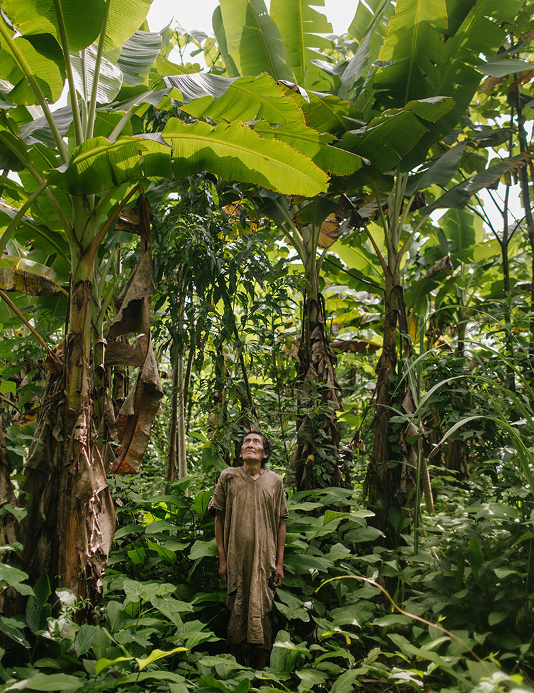
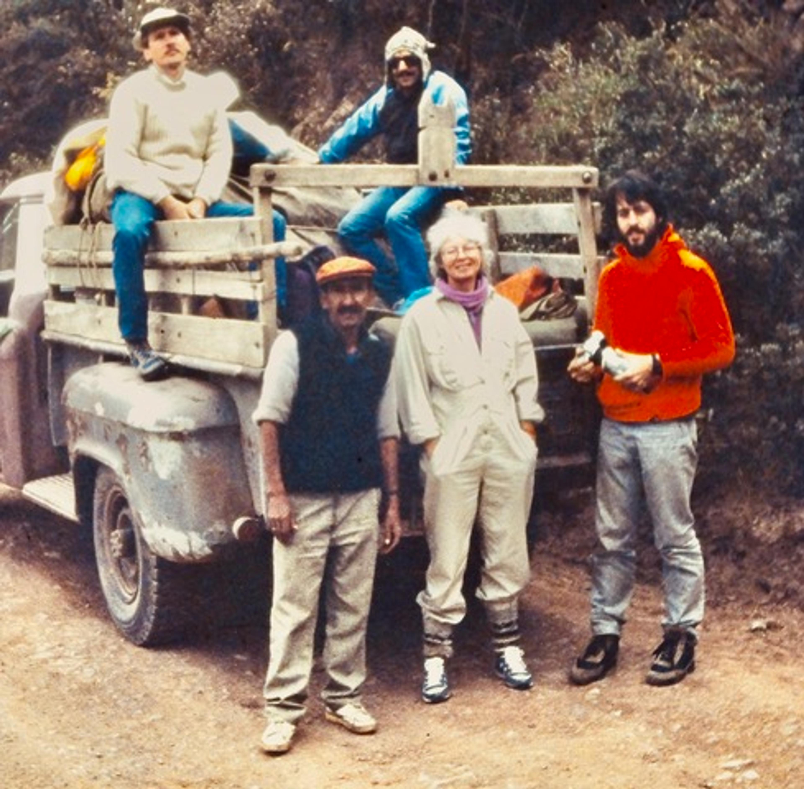
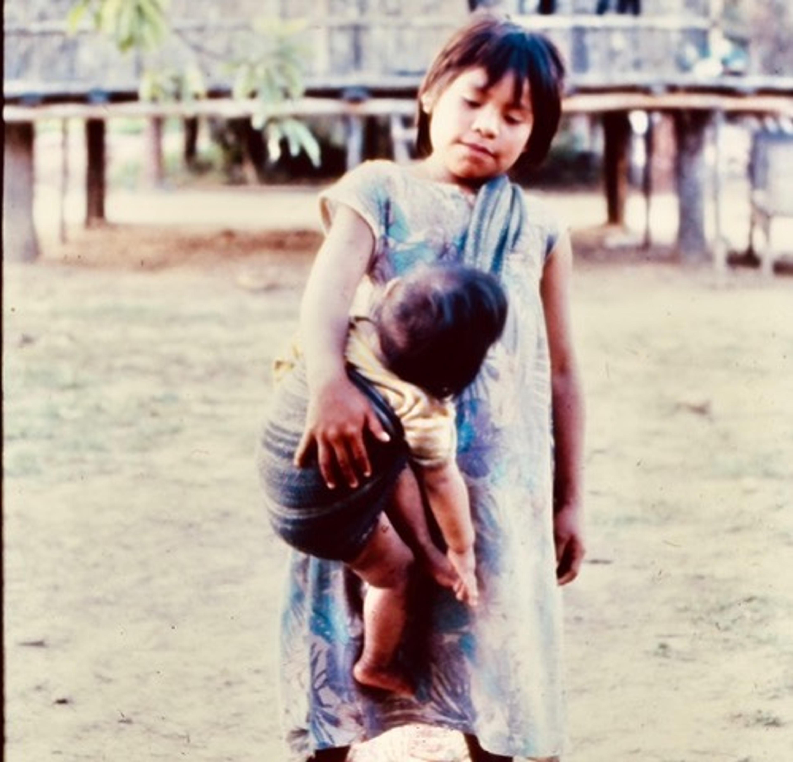

> If the last 5 million years of human evolution is compressed into a single calendar year, we’re hunter-gatherers from 1 January until 11:40 pm on 31 December.  
> 
> 如果把人类过去 500 万年的进化史压缩成一个日历年，那么从 1 月 1 日到 12 月 31 日晚上 11:40 我们都是狩猎采集者。  
> 
> – Ben Trumble, Arizona State University  
> 
> \- 亚利桑那州立大学 Ben Trumble

I’m on a Zoom call with 20 faces, a biweekly meeting of an improbable collaboration of international scientists.  

我正在与 20 张面孔进行 Zoom 通话，这是一个由国际科学家组成的不可能合作组织的双周会议。  

They call themselves the Horus/Tsimane Group because they study the hearts and brains of both Egyptian mummies and the living Bolivian foragers and small-scale farmers known as the Tsimane.  

他们称自己为荷鲁斯/Tsimane 小组，因为他们既研究埃及木乃伊的心脏和大脑，也研究活着的玻利维亚觅食者和被称为 Tsimane 的小农。

The Horus Group, named after the Egyptian god of healing, is an international team of cardiologists, archaeologists and radiologists who have [studied](https://www.sciencedirect.com/science/article/abs/pii/S1050173814000541) more than 200 mummies in Egypt, Peru, the Aleutian Islands and Italy with computer tomography (CT) scans and genetic analyses.  

荷鲁斯小组以埃及医神的名字命名，是一个由心脏病专家、考古学家和放射科专家组成的国际团队，他们通过计算机断层扫描（CT）和基因分析，对埃及、秘鲁、阿留申群岛和意大利的 200 多具木乃伊进行了研究。  

They wanted to see if atherosclerosis, one of the leading causes of death in the world, is a disease of modernity, our high stress, cholesterol-laden lifestyle, or if it had been there all along.  

他们想知道，动脉粥样硬化是世界上最主要的死亡原因之一，它是一种现代病，是我们高压力、高胆固醇的生活方式造成的，还是一直就存在。  

Are we dealing with a mere century of clogged arteries – or can we find the same pathology in the arteries of mummies that are 5,000 years old?  

我们面对的仅仅是一个世纪的动脉堵塞问题，还是说我们能在 5000 年前的木乃伊的动脉中发现同样的病理现象？

Turns out, many mummies died with heart disease. The Horus Group found that, on CT scans, almost 38 per cent of the mummies had the primary pathological evidence of atherosclerosis, deposits of calcium lining their aortas, and other major arteries.  

原来，许多木乃伊死于心脏病。荷鲁斯小组在 CT 扫描中发现，近 38% 的木乃伊有动脉粥样硬化的主要病理证据，即主动脉和其他主要动脉内的钙质沉积。

To be mummified, you had to be rich, powerful, a priest, a relative of the pharaoh; the Egyptian elite were not foragers like the Tsimane.  

要成为木乃伊，你必须富有、有权势、是祭司、法老的亲戚；埃及的精英阶层不像齐玛尼人那样是狩猎者。  

They lived a relatively lavish, sedentary lifestyle and, according to hieroglyphic papyri, ate a lot of meat and suffered from cardiac symptoms. In 2013, the results of the Horus [study](https://www.thelancet.com/journals/lancet/article/PIIS0140-6736(13)60598-X/abstract) were published in the preeminent medical journal _The Lancet_ and major cardiovascular journals.  

根据象形文字纸莎草纸的记载，他们过着相对奢侈的定居生活，吃大量肉类，并患有心脏症状。2013 年，荷鲁斯研究的结果发表在著名医学期刊《柳叶刀》和主要心血管期刊上。

In 2022, I was invited to join an extraordinary Zoom meeting by the anthropologist Hillard (Hilly) Kaplan, co-director of the Tsimane Health and Life History Project, and my friend of many years.  

2022 年，人类学家希拉德-卡普兰（Hillard (Hilly) Kaplan）邀请我参加一次非同寻常的 Zoom 会议，他是 Tsimane 健康和生活史项目的联合主任，也是我多年的朋友。  

I’m a physician, and in 2002, I had joined Kaplan and a small group of young anthropologists and Bolivian physicians in a project that would ultimately conduct one of the most logistically complex and comprehensive health assessments of any group of people in the world, a rare model of cooperative scientific effort across multiple disciplines and cultures.  

我是一名医生，2002 年，我和卡普兰以及一小群年轻的人类学家和玻利维亚医生一起参与了一个项目，该项目最终将对世界上所有人群进行一次后勤上最复杂、最全面的健康评估，这是一个跨学科、跨文化的罕见的科学合作典范。

Horus Group scientists who had found heart disease in mummies would join with the Tsimane Project and analyse CT scans of the hearts of the Tsimane, an Indigenous tribe of about 17,000 people living in the lowland Bolivian jungle.  

Horus 集团的科学家曾在木乃伊中发现过心脏病，他们将与 Tsimane 项目合作，分析 Tsimane 人的心脏 CT 扫描图，Tsimane 是一个生活在玻利维亚低地丛林中的土著部落，约有 17000 人。  

They would find almost no heart disease.  

他们会发现几乎没有心脏病。  

What’s more, continuing research with the Tsimane shows rates of dementia among the lowest ever observed, and they have only minimal cognitive impairment with ageing.  

此外，对 Tsimane 人的持续研究表明，他们的痴呆症发病率是有史以来最低的，而且随着年龄的增长，他们的认知障碍也很小。

Jose, 75, one of the oldest Tsimane and the only Tsimane still wearing a _cojchity_, the traditional Tsimane cloth; Anachere, Amazon rainforest, Bolivia. Photo by Matthieu Paley  

75 岁的何塞是最年长的齐马内人之一，也是唯一还穿着齐马内传统服饰 cojchity 的齐马内人。摄影：Matthieu Paley

Now, on the Zoom, I met Caleb (‘Tuck’) Finch, professor of gerontology at the University of Southern California.  

现在，在中转站上，我遇到了南加州大学老年学教授凯莱布-芬奇（"塔克"）。  

Finch has been studying the neurobiology of ageing, the evolution of the human life course and the causes of Alzheimer’s disease for most of his career.  

芬奇职业生涯的大部分时间都在研究老龄化的神经生物学、人类生命过程的演变以及阿尔茨海默病的病因。  

He had long known about the Horus Group and their mummy slides; he’d met Kaplan and knew about his findings on the Tsimane foragers too.  

他早就知道荷鲁斯小组和他们的木乃伊幻灯片；他见过卡普兰，也知道他对齐马内觅食者的研究成果。

In 2014, at a gerontological sciences meeting, Finch had arranged to meet Kaplan and the cardiologist Greg Thomas, lead investigator of the Horus Group (whom I also met on the Zoom call).  

2014 年，在一次老年科学会议上，芬奇安排与卡普兰和心脏病专家格雷格-托马斯（Horus Group 的首席研究员）会面（我也在 Zoom 通话中见到了他）。  

Thomas and Kaplan were giving back-to-back papers: Thomas was arguing that the mummy evidence suggested atherosclerosis was a fundamental feature of the biology of human ageing.  

托马斯和卡普兰背靠背发表论文：托马斯认为，木乃伊的证据表明动脉粥样硬化是人类衰老生物学的一个基本特征。  

Kaplan was contending that the Tsimane study showed little apparent evidence of heart disease.  

卡普兰认为，Tsimane 研究几乎没有显示出心脏病的明显证据。

Thomas was initially sceptical about talking to an anthropologist about heart disease, or its supposed lack.  

托马斯起初对与人类学家谈论心脏病或所谓的心脏病缺乏持怀疑态度。  

But: ‘I got the two together,’ Finch later told me, on a phone call, ‘and after two minutes they said: “We’ve gotta work together.”’ Their resulting study is a groundbreaking 2017 [article](https://pmc.ncbi.nlm.nih.gov/articles/PMC6028773/) in _The Lancet_, which says: ‘Despite a high infectious inflammatory burden, the Tsimane, a forager-horticulturalist population of the Bolivian Amazon with few coronary artery disease risk factors, have the lowest reported levels of coronary artery disease of any population recorded to date.’ In short, it appeared possible that coronary artery disease emerged, on a population-wide scale, from lifestyle, not our genes.  

但 "我把两人叫到一起" 芬奇后来在电话里告诉我 "两分钟后他们说'"两分钟后，他们说：'我们必须合作。他们的研究结果是2017年发表在《柳叶刀》上的一篇突破性文章，文章中写道："尽管感染性炎症负担很重，但玻利维亚亚马逊河流域的狩猎园艺人口Tsimane几乎没有冠状动脉疾病风险因素，他们的冠状动脉疾病报告水平是迄今为止有记录的所有人口中最低的。简而言之，在整个人群中，冠状动脉疾病似乎可能来自生活方式，而不是我们的基因。

All these professional relationships and our intersecting work go way back.  

所有这些专业关系和我们的交叉工作都可以追溯到很久以前。  

Kaplan and I have been friends for almost 40 years. In 1987, we were the first anthropologist and physician allowed to enter the interior cultural zone of Manú National Park in the Peruvian Amazon, a UNESCO Biosphere Reserve and World Heritage Site.  

卡普兰和我是近 40 年的朋友。1987 年，我们是第一批获准进入秘鲁亚马逊马努国家公园（联合国教科文组织生物圈保护区和世界遗产）内部文化区的人类学家和医生。  

Manú is almost 4.2 million acres of incredible biodiversity, extending from the rain-forested Andes to the Amazon basin in southeastern Peru.  

马努地区占地近 420 万英亩，从安第斯雨林一直延伸到秘鲁东南部的亚马逊盆地，拥有令人难以置信的生物多样性。  

The people, fauna and flora living in the biosphere are ‘protected’ by UN covenant, and we were there to study the Machiguenga, a tribe with very limited previous contact.  

生活在生物圈中的人、动物和植物都受到联合国公约的 "保护"，我们在那里是为了研究马奇根加人，一个以前很少接触的部落。

We were a team of four: Kaplan, Michael Alvard, then an anthropology grad student, and my then wife Mary Daitz, an experienced nurse.  

我们当时是四人小组：卡普兰、迈克尔-阿尔瓦德（当时是人类学研究生）和我当时的妻子玛丽-戴兹（Mary Daitz），她是一名经验丰富的护士。  

Just getting there was an adventure in a 1952 Chevy truck piled high with gear, rambling over the Andes and down a muddy single-track road through the rainforest to the Madre de Dios, a tributary of the Amazon.  

乘坐一辆满载装备的 1952 年雪佛兰卡车，翻越安第斯山脉，沿着泥泞的单行道穿越雨林，前往亚马逊河支流马德雷德迪奥斯河（Madre de Dios），这一路上简直就是一场冒险。

Crossing the Andes in a 1952 Chevy truck; Michael Alvard is left of Hillard Kaplan in the truck  

乘坐 1952 年雪佛兰卡车穿越安第斯山脉；迈克尔-阿尔瓦德（Michael Alvard）在卡车上希拉德-卡普兰（Hillard Kaplan）的左边

We hired a guide and Machiguenga translator who knew the river and its people.  

我们雇了一名向导和马奇根加语翻译，他对这条河流和这里的人都很熟悉。

On the bank of the Madre de Dios, we watched a felled log become a dugout canoe, powered by a small outboard motor, a _peci-peci_, which is what it sounds like.  

在马德雷德迪奥斯河畔，我们看着一根根砍伐下来的原木变成了独木舟，独木舟由一个小型舷外马达驱动，听起来就像 "peci-peci"。  

We peci-pecied upstream, from the Madre de Dios to the Manú, and then past red clay cliffs festooned with macaws and past giant river otters floating on their backs.  

我们逆流而上，从马德雷德迪奥斯河（Madre de Dios）到马努河（Manú），然后经过布满金刚鹦鹉的红土悬崖，经过背上漂浮着的巨大河獭。  

We frequently got in the water with the piranhas to edge our canoe through log jams. We camped on the pristine oxbow beaches of the Manú, first chasing away 8- and 10-foot black caimans, and dreading having to go out to pee at night.  

我们经常和食人鱼一起下水，划着独木舟穿过木桩。我们在马努河纯净的牛角滩上扎营，先是驱赶 8 英尺和 10 英尺长的黑凯门鳄，又害怕晚上出去撒尿。

What were their family units like? Who did what, and how much time did they spend doing it?  

他们的家庭单位是什么样的？谁做了什么，花了多少时间？

The people living in the Manú biosphere had no idea what a doctor did, nor an anthropologist. I was conflicted – excited about the opportunity to help but concerned about whether we’d be doing more harm than good, about whether there would be any follow-up care.  

生活在马努生物圈的人们不知道医生是做什么的，也不知道人类学家是做什么的。我很矛盾--为有机会提供帮助而兴奋，但又担心我们是否会弊大于利，担心是否会有后续治疗。  

The Peruvian Ministry of Health was responsible for managing healthcare in its vast Amazon basin, but very few physicians ventured over the Andes.  

秘鲁卫生部负责管理其广袤的亚马逊流域的医疗保健工作，但很少有医生涉足安第斯山脉。  

Would these people ever be vaccinated?  

这些人会接种疫苗吗？  

If we found folks who had a communicable disease, like TB, what would we do?  

如果我们发现有人得了肺结核等传染病，我们该怎么办？  

If we diagnosed diabetes, heart disease or malaria, what next, after we left?  

如果我们诊断出糖尿病、心脏病或疟疾，那么在我们离开之后，下一步该怎么办？

Kaplan and Alvard’s work would centre on examining the life course of the Machiguenga.  

卡普兰和阿尔瓦德的工作重点是研究马奇根加人的生命历程。  

Kaplan had already lived, hunted and foraged with the Aché people of eastern Paraguay.  

卡普兰曾与巴拉圭东部的阿切人一起生活、狩猎和觅食。  

Before getting his PhD in anthropology at the University of Utah, he’d earned a degree in communication from the University of Pennsylvania and a masters in anthropology from Columbia.  

在犹他大学获得人类学博士学位之前，他曾获得宾夕法尼亚大学传播学学位和哥伦比亚大学人类学硕士学位。  

He picked up languages easily, spoke excellent Spanish, and knew some basic phrases of Machiguenga, the language of the people we were heading to meet in the village of Tayakome, on the upper reaches of the Manú.  

他很容易掌握语言，西班牙语说得很好，还知道一些马奇根加语（Machiguenga）的基本短语，这是我们要去马努河上游的塔亚科梅（Tayakome）村子见的人的语言。

Kaplan wanted to learn what their family units were like.  

卡普兰想了解他们的家庭单位是什么样的。  

Who did what, and how much time did they spend doing it?  

谁做了什么，花了多少时间？  

How many children did women have on average?  

妇女平均生育多少个孩子？  

What was their nutritional status, their height and weight?  

他们的营养状况、身高和体重如何？  

Where and what did they hunt and fish, and did they share food and drink?  

他们在哪里打猎和捕鱼，他们分享食物和饮料吗？  

What were the roles of grandparents?  

祖父母的角色是什么？

Meanwhile, as a family doctor, I was seeing patients, and teaching residents and medical students at the University of New Mexico School of Medicine.  

同时，作为一名家庭医生，我在新墨西哥大学医学院为病人看病，并为住院医生和医学生授课。  

I’d worked in a clinic for migrant farmworkers in California and helped organise rural clinics in northern New Mexico. I spoke reasonable Spanish, and had some experience treating typhoid, malaria and TB in Mexico.  

我曾在加利福尼亚州的一家诊所为农民工服务，并在新墨西哥州北部帮助组织乡村诊所。我会说流利的西班牙语，在墨西哥治疗过伤寒、疟疾和肺结核。

On our fourth day on the Manú, we spotted Tayakome, the largest of the Machiguenga villages, sited high on a clay cliff.  

在马努河上的第四天，我们看到了马奇根加人最大的村庄塔亚科姆（Tayakome），它坐落在高高的粘土悬崖上。  

We were welcomed by a group of Machiguenga villagers.  

我们受到了一群马奇根加村民的欢迎。  

Word of our arrival had somehow travelled faster on the river than we’d done.  

我们抵达的消息不知为何在河上传得比我们还快。

Tayakome is a village of extended family groups living in jungle clearings, in expertly constructed reed houses with thatched palm roofs and raised sleeping and eating platforms, providing good protection in the rainy season and some degree of safety from snakes and jaguars.  

Tayakome 是一个由大家庭组成的村落，他们居住在丛林空地上，住在精心建造的芦苇房里，房顶上铺着茅草，还有高高的睡觉和吃饭的平台，这在雨季提供了很好的保护，并在一定程度上避免了蛇和美洲虎的伤害。  

Each family compound was separated by hundreds of yards but connected by trails.  

每个家庭院落之间相隔数百码，但有小径相连。

In Tayakome village. Photo supplied by the author  

Tayakome 村。照片由提交人提供

We slept in our own little compound, in tents peered in at all hours by children and adults who shyly came to meet us.  

我们睡在自己的小院子里，在帐篷里，孩子们和大人随时都在窥视着我们，他们害羞地前来迎接我们。  

The Machiguenga are handsome people, adults and kids dressed in their traditional _kushma_s, simple gowns of rough, ivory-coloured, hand-spun jungle cotton.  

马奇根加人英俊潇洒，大人和小孩都穿着传统的库什玛（kushmas）长袍，这种长袍是用手工纺织的丛林棉花制成的，质地粗糙，呈象牙色。

The Machiguenga were gracious and kind, offering to share their plentiful fish and game with us; peccary (wild pig), smoked Amazon catfish big enough for several families to feast on, turtle eggs, wild bananas, chilies, and the omnipresent manioc and _masato_, a thick, milky beer, made from the manioc root, the tuberous cassava, the chief carbohydrate of Amazonia.  

马奇根加人热情好客，愿意与我们分享他们丰富的鱼类和野味；山雀（野猪）、熏制的亚马逊鲶鱼（足以让几个家庭大快朵颐）、海龟蛋、野生香蕉、辣椒，以及无处不在的木薯和马萨托（一种用木薯根、木薯块茎、亚马孙主要碳水化合物制成的浓稠乳汁啤酒）。  

We watched women make it, from digging up the long, potato-coloured root in their gardens, to peeling, chopping, masticating and spitting the communal mash into a large gourd, their saliva starting the fermentation process.  

我们亲眼目睹了妇女们的制作过程，从在自家菜园里挖出长长的土豆色根茎，到去皮、切碎、咀嚼，再到将公共的泥浆吐到一个大葫芦里，她们的唾液开始了发酵过程。  

We were offered _masato_ on our arrival, and I drank it several times afterwards, until I was pretty sure that one of the women spitting in the bowl had tuberculosis.  

我们一到就有人给我们提供马萨托，后来我喝了好几次，直到我非常确定其中一位往碗里吐痰的妇女得了肺结核。  

I later suspected two other people in the same family group might have TB, but I had no way of confirming my diagnosis.  

后来，我怀疑同一家族中的另外两个人可能患有肺结核，但我无法确诊。

We gave out wood paddles for stool samples, pantomiming the collection process to our chagrin and their amusement  

我们分发了木桨来采集粪便样本，在我们的懊恼和他们的欢笑声中，我们把采集过程表演得惟妙惟肖

I did physical exams on about 300 people living in Tayakome and Diamante, another village on the Manú, and was seeing a remarkably healthy group of people, infants to elders, generally fit, active and well-nourished.  

我为居住在塔亚科梅和马努河上的另一个村庄迪亚曼特的大约 300 人做了体检，看到的是一群非常健康的人，从婴儿到老人，他们普遍身体健康、活泼好动、营养充足。  

They were hunters, fishermen, farmers and foragers, had been forever, and they were good at it.  

他们是猎人、渔夫、农民和觅食者，一直都是，而且他们很擅长这些。

I never heard a heart murmur or recorded an elevated blood pressure.  

我从未听到过心脏杂音，也没有血压升高的记录。  

There were no obvious clinical cases of diabetes or chronic heart disease, but I did see several cases of leishmaniasis, an invasive skin infection caused by sandflea bites.  

临床上没有明显的糖尿病或慢性心脏病病例，但我确实看到了几例利什曼病病例，这是一种由沙蝇叮咬引起的侵入性皮肤感染。  

Everyone was constantly attacked by murmurations of mosquitoes, and we treated lots of infected mosquito bites, including our own.  

每个人都不断受到蚊子的袭击，我们治疗了很多被蚊子叮咬感染的人，包括我们自己。  

Dental problems, including badly worn teeth in young women, perhaps from chewing manioc, were common.  

牙齿问题很常见，包括年轻妇女的牙齿磨损严重，可能是由于咀嚼木薯造成的。  

Older folks complained of arthritic hips, knees and low back pain, and observing their activity I understood why.  

老年人抱怨髋关节、膝关节和腰背疼痛，通过观察他们的活动，我明白了其中的原因。  

They were grateful for aspirin and acetaminophen (Tylenol/paracetamol).  

他们感谢阿司匹林和对乙酰氨基酚（泰诺/扑热息痛）。

I’d lived and worked in rural Mexico where intestinal parasites were a problem, as they were here but I had no medication to treat them.  

我曾在墨西哥农村生活和工作过，那里的肠道寄生虫是个问题，在这里也一样，但我没有治疗寄生虫的药物。  

We distributed vials and small wood paddles for collecting stool samples, pantomiming the collection process to our chagrin and their amusement.  

我们分发了收集粪便样本的小瓶子和小木棍，并模仿收集过程，这让我们懊恼不已，也让他们觉得很有趣。  

The samples arrived, day after day, deposited in a box by our tent by different family groups.  

一天又一天，不同的家庭组把样本送到我们帐篷边的箱子里。  

A month later, on our return, I smuggled home 200 stool samples in the bottom of a duffle bag.  

一个月后，我们回国时，我用行李袋的底层偷偷带回了 200 份粪便样本。

How could we best provide rudimentary medical care for geographically and culturally isolated people?  

我们怎样才能为地理和文化上与世隔绝的人们提供最基本的医疗服务？  

Would they even want it? How would a community decide one way or the other?  

他们会想要吗？社区如何决定是要还是不要？  

Who were the community leaders and potential influencers? Who were the traditional healers?  

谁是社区领袖和潜在影响者？谁是传统治疗师？  

What would be the role of the Peruvian Ministry of Health?  

秘鲁卫生部将发挥什么作用？

Although the Machiguenga had been in limited contact for some time, I had expected – considering the devastating disease history of contact on native peoples – that basic immunisations would be a primary concern, but no one had been vaccinated.  

虽然马奇根加人已经与当地人进行了一段时间的有限接触，但考虑到与当地人的接触会带来毁灭性的疾病，我原本以为基本的免疫接种会是首要问题，但没有人接种过疫苗。  

Could we, as outsiders, suggest basic public health concepts like vaccines and latrines to keep their water supply safe?  

作为局外人，我们能否提出疫苗和厕所等基本公共卫生概念，以保证他们的供水安全？  

Working in Manú was public health at the limits, certainly a dilemma for the Peruvian government, and a worrying one for me.  

在马努工作是公共卫生的极限，这对秘鲁政府来说无疑是个难题，对我来说也是个令人担忧的问题。  

These were just some of the issues we talked about on the river and around our fire at night, swatting mosquitoes.  

这些只是我们在河边和晚上围着火堆拍打蚊子时谈论的一些问题。

When I opened my duffle bag-full of stool samples for the microbiologist at the New Mexico State Scientific Laboratory, she was in parasite paradise.  

当我为新墨西哥州科学实验室的微生物学家打开装满粪便样本的行李袋时，她就像来到了寄生虫的天堂。  

Almost all the samples contained five to seven different intestinal parasites, or helminths, such as tape worms, hook worms and whip worms. Was that the norm for other forager/horticulturist people?  

几乎所有样本都含有五到七种不同的肠道寄生虫或蠕虫，如胶带虫、钩虫和鞭虫。其他觅食者/园艺家也是这样吗？  

And what about heart disease, hypertension and diabetes?  

那么心脏病、高血压和糖尿病呢？  

I’d expected to find some evidence of these common diseases but didn’t.  

我本以为能找到这些常见疾病的一些证据，但却没有。  

Was there something about the Machiguenga lifestyle that somehow protected them from the chronic scourges of modernity?  

马奇根加人的生活方式是否在某种程度上保护了他们，使他们免受现代社会的长期祸害？

Spending time with Kaplan, I found myself thinking about his big concept: that the evolution of the human life course could best be studied among the last people who still lived as our ancestors had.  

在与卡普兰相处的过程中，我发现自己一直在思考他的伟大理念：人类生命历程的演变最好是在最后一批仍像我们祖先那样生活的人中进行研究。

To pursue the answer, Kaplan studied fertility patterns among the nomadic peoples who mix foraging with small-scale farming that he and other anthropologists had lived with, and developed complex mathematical models of parental investment.  

为了寻找答案，卡普兰研究了他和其他人类学家生活过的游牧民族的生育模式，这些游牧民族将狩猎和小规模耕作结合在一起，卡普兰建立了复杂的父母投资数学模型。  

He looked at peoples’ regional biodiversity and the availability of nutritionally high-quality food.  

他考察了各民族的地区生物多样性以及营养丰富的优质食品的供应情况。  

His research, along with many collaborators, has become seminal in the study of these societies.  

他与许多合作者的研究已成为研究这些社会的开创性成果。

It has also helped distinguish humans from other primates.  

它还有助于将人类与其他灵长类动物区分开来。  

Among our most unique characteristics, he counts our long life span, about 70 years for forager/horticulturalists; our long childhood dependence on parental support; and the familial contribution of grandparents and elders.  

在我们最独特的特征中，他认为我们的寿命很长，狩猎者/园艺家的寿命约为 70 年；我们的童年长期依赖父母的支持；以及祖父母和长辈的家庭贡献。  

The returns on parental and [grandparent investment](https://aeon.co/essays/why-childhood-and-old-age-are-key-to-our-human-capacities) in children means increased familial productivity later in life, more hunters and farmers, a higher fertility rate, and an evolutionary self-sustaining society.  

父母和祖父母在孩子身上的投资回报，意味着日后家庭生产力的提高、更多的猎人和农民、更高的生育率，以及一个自我维持的进化社会。  

And of course, all of us are dependent on access to nutritionally rich food, the energy that drives the whole process.  

当然，我们所有人都离不开营养丰富的食物，这是推动整个过程的能源。

For the most part, they are living without market economies, healthcare or schools  

在大多数情况下，他们生活在没有市场经济、医疗保健或学校的环境中

There’s another important element in the evolution of our life course – disease.  

在我们生命历程的演变中，还有一个重要因素--疾病。  

We now know that in addition to heart disease, Egyptian mummies had intestinal parasites, malaria, leishmaniasis, TB and smallpox – for starters.  

我们现在知道，除了心脏病，埃及木乃伊还患有肠道寄生虫、疟疾、利什曼病、肺结核和天花等疾病。

In 2002, neither Kaplan nor I knew anything about the health of mummies but, to test his life course theory, a much larger forager population was needed.  

2002 年，卡普兰和我都对木乃伊的健康状况一无所知，但为了验证他的生命历程理论，我们需要更多的觅食者。  

Kaplan asked me if I wanted to go to the Bolivian Amazon to visit the Tsimane, a group much like the Machiguenga, and a little easier to reach.  

卡普兰问我是否想去玻利维亚的亚马逊河流域探访齐马内人，这个族群与马奇根加人很相似，而且更容易到达。  

I took a leave of absence from my practice and teaching.  

我请假离开了我的实践和教学工作。

There are about 17,000 Tsimane living in 80 scattered, lowland jungle communities east of the Andes, a vast territory along the Rio Maniqui and its tributaries.  

在安第斯山脉以东的 80 个分散的低地丛林社区中，生活着约 1.7 万名齐马内人，他们居住在马尼基河及其支流沿岸的广袤土地上。  

The majority of Tsimane and their neighbours, the Moseten, are foragers, hunters and fishermen, and for the most part they are living without market economies, healthcare or schools, although some of the Moseten and people living in villages closer to San Borja, a frontier town of around 17,000, were more acculturated.  

大多数 Tsimane 人和他们的邻居 Moseten 人都是觅食者、猎人和渔民，在大多数情况下，他们过着没有市场经济、没有医疗保健、没有学校的生活，尽管有些 Moseten 人和居住在离 San Borja（一个约有 17000 人的边境小镇）较近的村庄里的人文化程度较高。  

We’d be trying to assess their overall health status.  

我们要评估他们的整体健康状况。

One of Kaplan’s former doctoral students, Michael Gurven, was then assistant professor of anthropology at the University of California, Santa Barbara, and had spent three months securing permission from the Tsimane Tribal Council for us to pursue the life course study.  

卡普兰以前的一位博士生迈克尔-古尔文当时是加州大学圣巴巴拉分校人类学助理教授，他花了三个月时间从齐马内部落委员会那里获得了我们进行生命历程研究的许可。  

Most importantly, in return, we would do health assessments, and provide some limited primary medical care for the Tsimane.  

最重要的是，作为回报，我们将进行健康评估，并为 Tsimane 人提供一些有限的初级医疗服务。  

With funding from the National Science Foundation, Kaplan and Gurven assembled a team of Bolivian and US anthropology grad students and three young Bolivian physicians, all recent medical school graduates.  

在美国国家科学基金会的资助下，卡普兰和古尔文组建了一个团队，成员包括玻利维亚和美国的人类学研究生以及三名年轻的玻利维亚医生，他们都是医学院的应届毕业生。

The anthropologists would be asking many of the same societal questions they had asked of other groups, like the Machiguenga in Manú: what makes a good hunter or fisherman or farmer or weaver?  

人类学家将提出许多与其他群体（如马努的马奇根加人）相同的社会问题：怎样才能成为一名优秀的猎人、渔民、农民或纺织工？  

How do people spend their days? What is the social structure of the community?  

人们如何度过每一天？社区的社会结构是怎样的？  

What, and how much, do they eat? How many children do they have?  

他们吃什么，吃多少？他们有几个孩子？  

All the collected data would augment the life course study.  

所有收集到的数据都将有助于生命历程研究。  

The physicians would do their best at taking histories, translated from Tsimane to Spanish, listening to hearts and lungs, and treating basic problems as best we could with a combination of US and Bolivian medicines.  

医生们会尽力询问病史，从 Tsimane 翻译成西班牙语，倾听心脏和肺部的声音，并用美国和玻利维亚的混合药物尽可能地治疗基本问题。  

All of us, living together with these people, would be trying to learn how their health and their life course interacted.  

我们所有人与这些人生活在一起，将努力了解他们的健康和他们的生命历程是如何相互作用的。

From our base in the frontier jungle town of San Borja, it was about 60 miles to the village of Cuvirene, but it took us seven hours in a vintage Ford truck, our team and our equipment piled in back.  

从我们在边境丛林小镇圣博尔哈的基地出发，到库维雷内村大约有 60 英里，但我们开着一辆老式福特卡车花了 7 个小时，我们的团队和装备都堆在后面。  

We picked up Tsimane people along the way: a hunter with a bow and long arrows, a peccary slung over his shoulders; women, old beyond their teenage years, with babies at the breast; in total, about 30 people crammed into our truck.  

我们沿途遇到了一些齐马内人：一个猎人拿着弓和长箭头，肩上扛着一只山雀；一些妇女已经过了花甲之年，怀里还抱着婴儿；总共大约有 30 人挤在我们的卡车里。

The village of Cuvirene in Bolivia was like Tayakome in Peru, with the same palm-thatched, elevated dwellings, but a bit more upscale with pots and plastic.  

玻利维亚的 Cuvirene 村与秘鲁的 Tayakome 村一样，都是用棕榈茅草搭建的高脚屋，但在盆子和塑料制品的使用上更高档一些。  

Kids were stalking chickens with bows and arrows, and people could have been distant cousins, except they were wearing old soccer shirts instead of _kushma_s.  

孩子们拿着弓箭追赶小鸡，人们可能是远房表亲，只不过他们穿的是旧足球衫而不是库什玛。  

There was a road to Cuvirene, but the main thoroughfare for the far-flung villages of the Tsimane is the nearby river, the Rio Maniqui, where canoes of families floated by to the same tune of the _peci-peci_.  

这里有一条通往库维雷内的公路，但通往 Tsimane 偏远村庄的主要通道是附近的马尼基河。

In the morning, only women and children were around; the men had gone hunting.  

早上，周围只有妇女和儿童，男人们都去打猎了。  

Alfredo Zelada, a Tsimane man, translated this information for us. He was a _promotor de salud_, a community health worker trained with other Spanish-speaking Tsimane in a one-month course in San Borja.  

阿尔弗雷多-塞拉达（Alfredo Zelada）是一名齐马内人，他为我们翻译了这些信息。他是一名健康促进者，一名与其他讲西班牙语的齐马内人一起在圣博尔雅接受为期一个月培训的社区健康工作者。

We heard reports of multiple intestinal parasites, but not heart murmurs, high blood pressure or diabetes  

我们听到了关于多种肠道寄生虫的报告，但没有听到心脏杂音、高血压或糖尿病的报告

His first job was smoothing our way with the very frightened women and children who had never seen a group as white or gear laden as ourselves and, when the hunters returned, he quashed the rumour that we’d come to rape their women.  

他的第一项工作是安抚那些惊恐万分的妇女和儿童，他们从未见过像我们这样的白种人和装备齐全的队伍。当猎人回来时，他辟谣说我们是来强奸他们的女人的。

Later, Zelada spoke to the assembled community of perhaps 50 people. He explained why we’d come, and over the next week we were able to do health histories and physical exams on 160 people, practically the entire populations of Cuvirene and the neighbouring village of Aperecito.  

后来，泽拉达向聚集在一起的大约 50 人发表了讲话。在接下来的一周里，我们为 160 人做了健康史和身体检查，几乎涵盖了库维雷内和邻近的阿佩雷西托村的全部人口。  

Zelada shuttled back and forth, translating for the anthropologists in the morning, and the four doctors taking histories in the afternoon.  

泽拉达来回穿梭，上午为人类学家翻译，下午为四位医生采集病史。  

Kaplan told me Tsimane is a tough language to learn.  

卡普兰告诉我，Tsimane 语很难学。  

It starts somewhere on the back palate and then whines out the nose, with a little reverse spin.  

它从后味蕾的某处开始，然后在鼻腔中发出呜呜声，带着一点反向旋转。

Very few Tsimane had been immunised.  

接受过免疫接种的 Tsimane 人寥寥无几。  

Like the Machiguenga in Peru, we saw chronic cases of dermatitis from infected insect bites, eye and ear infections in children and adults, and the widespread need for dental care.  

与秘鲁的马奇根加人一样，我们也看到了因昆虫叮咬感染而引发的慢性皮炎、儿童和成人的眼部和耳部感染，以及对牙科护理的普遍需求。  

In the village of Aperecito, there were cases of pneumonia, and a man who we thought might have TB.  

在 Aperecito 村，出现了肺炎病例，还有一名我们认为可能患有肺结核的男子。  

We heard reports of multiple intestinal parasites, but we didn’t hear heart murmurs, record high blood pressure, or suspect anyone had diabetes.  

我们听到了关于多种肠道寄生虫的报告，但我们没有听到心脏杂音，没有记录到高血压，也没有怀疑任何人患有糖尿病。

A patient I saw, reportedly a great hunter, could no longer hunt because of a huge inguinal hernia dropping his scrotum halfway to his knees.  

我接诊过一位病人，据说他是一位出色的猎手，但由于巨大的腹股沟疝气，他的阴囊一直垂到膝盖。  

Loops of herniated bowel gurgled in my stethoscope.  

我的听诊器里传出疝气肠子的汩汩声。  

I asked him if he would consider going to San Borja for an operation.  

我问他是否会考虑去圣博尔哈做手术。  

He said yes, although Zelada and I wondered if he knew what we were talking about; but when we left Cuvirene, we brought him to San Borja, and the next day his hernia was repaired.  

他说是的，尽管我和泽拉达怀疑他是否知道我们在说什么；但当我们离开库维雷内时，我们把他带到了圣博尔哈，第二天他的疝气就被修补好了。  

The surgeon told me it was the biggest he’d ever seen.  

外科医生告诉我，这是他见过的最大的伤口。

We accomplished more than we expected.  

我们的成就超出了预期。  

We viewed this as a shakedown trip, a chance for the team members to get to know one another, to work out kinks, and we’d talked about important next steps as the project continued.  

我们把这次旅行看作是一次磨合之旅，是团队成员相互了解、克服困难的一次机会，我们还讨论了项目继续进行的下一步重要措施。  

The plan was that Gurven and the anthropology graduate students and doctors would spend the next year living and working in about 12 different Tsimane communities.  

按照计划，古尔文和人类学研究生及医生们将在接下来的一年里在大约 12 个不同的齐马内社区生活和工作。  

Immunisations, public health teaching, and training more Tsimane health workers were all top priorities, along with trying to do some basic lab studies, and all those expectations were in competition with limited grant funding.  

免疫接种、公共卫生教学、培训更多的 Tsimane 卫生工作者以及尝试进行一些基础实验室研究都是当务之急，而所有这些期望都在与有限的资助资金竞争。

Several months later, Kaplan went back to Cuvirene to check on the fledgling project.  

几个月后，卡普兰再次来到库维涅，检查这个刚刚起步的项目。  

On his way back to San Borja, in the middle of the night on the same mud-slick jungle logging road, he was told that a Tsimane man had been shot and was dying.  

在返回圣博尔哈的途中，他在深夜走在同样泥泞不堪的丛林伐木路上，被告知一名齐马内人中枪，生命垂危。  

They were able to find the man at a campsite, alive, but with a bullet hole in the middle of his chest and a broken leg.  

他们在一个营地找到了这名男子，他还活着，但胸口中间有一个弹孔，腿也断了。  

Kaplan transported him to the hospital in San Borja, where the man was denied care because he had no money, but, even if he’d had money, the hospital had no functioning X-ray machine, so Kaplan paid for the man and a translator to be flown to Trinidad, a Bolivian city of around 130,000, which had one.  

卡普兰把他送到圣博尔哈的医院，但因为他没钱，医院拒绝为他提供治疗，但即使他有钱，医院也没有能用的 X 光机，于是卡普兰花钱把他和一名翻译送到特立尼达，一个大约有 13 万人口的玻利维亚城市，那里有一台 X 光机。  

Luckily, the bullet had lodged in his shoulder. He was treated and returned to his village.  

幸运的是，子弹击中了他的肩膀。他接受治疗后返回了自己的村庄。

The Tsimane weren’t getting any treatment or medical care because of poverty and racism, Kaplan told me: ‘They weren’t even getting to go to the hospital.’ So he called a meeting with the mayor of San Borja, the president of the Tsimane Council and the director of the hospital, and said: ‘Can we work together?’ Kaplan offered to give the hospital $1,000 for medicines, and the group signed a _convenio_, an initial agreement to provide some help for the Tsimane.  

卡普兰告诉我："由于贫困和种族主义，齐马内人得不到任何治疗或医疗服务，他们甚至连去医院的机会都没有。于是他召集圣博尔哈市市长、Tsimane 理事会主席和医院院长开会，说：'我们能一起合作吗？卡普兰表示愿意给医院提供 1000 美元的药品费用，他们还签署了一份初步协议（convenio），为齐马内人提供一些帮助。

‘Wow! They’re looking like American and Canadian athletes’  

哇！他们看起来像美国和加拿大运动员

The research groups’ name became the Tsimane Health and Life History Project, and today, 23 years later, Gurven is its co-director with Kaplan.  

23 年后的今天，古尔文与卡普兰共同担任该项目主任。  

Over the past two decades, the two of them have assembled a team of anthropologists, cardiologists, geneticists, neurologists, geriatricians, radiologists and graduate students to work on one of the most logistically complex but comprehensive health assessments of any group of people in the world.  

在过去二十年里，他们两人组建了一个由人类学家、心脏病学家、遗传学家、神经学家、老年病学家、放射学家和研究生组成的团队，对世界上所有人群进行了一次后勤工作最复杂但最全面的健康评估。

With the support of the Tsimane Tribal Council, and with healthcare as a primary focus, Gurven, his graduate students and the Bolivian doctors gradually expanded their work among the far-flung Tsimane communities.  

在齐马内部落委员会的支持下，古尔文、他的研究生和玻利维亚医生以医疗保健为主要工作重点，逐步在遥远的齐马内社区开展工作。  

Histories and physical exams were complemented by demographic interviews, and simple tests measuring overall fitness and nutritional health.  

除病史和体格检查外，还进行了人口统计学访谈，以及衡量总体体能和营养健康状况的简单测试。

<iframe allowfullscreen="" frameborder="0" src="https://youtube.com/embed/TvJsXwi1Fno"></iframe>

‘From the earliest data: normal heart exams, low blood pressures, which didn’t increase with age, low resting pulses, exercise step-tests, very little obesity.  

'从最早的数据来看：心脏检查正常、血压较低（不会随年龄增长而升高）、静息脉搏较低、运动步测、肥胖症极少。  

And from doing interviews,’ Gurven said on a Zoom call, ‘I was able to tell that people weren’t dropping dead from heart attacks, and I thought: wow!  

通过采访，"古尔文在一次 Zoom 通话中说，"我发现人们并没有死于心脏病，我就想：哇！  

They’re looking like American and Canadian athletes.’  

他们看起来就像美国和加拿大运动员。

In 2006, Kaplan was able to hire a Bolivian biochemist to do standard tests like blood glucose screening for diabetes and cholesterol levels.  

2006 年，卡普兰聘请了一名玻利维亚生化学家，负责糖尿病血糖筛查和胆固醇水平等标准检测。  

The glucose levels were essentially normal, and the total cholesterol and LDL levels were low.  

血糖水平基本正常，总胆固醇和低密度脂蛋白水平较低。  

Combine that data with a nutritious, junk-free jungle diet, an activity-demanding lifestyle, and, Kaplan said: ‘At that point, what we were trying to sell in grant proposals was good heart health.’  

卡普兰说："把这些数据与营养丰富、不含垃圾的丛林饮食和需要活动的生活方式结合起来，我们在赠款提案中要推销的就是良好的心脏健康。

With funding from the US National Institute on Aging at the National Institutes of Health (NIH), they finally came up with an agreement with the Tsimane Council.  

在美国国立卫生研究院（NIH）国家老龄化研究所的资助下，他们最终与 Tsimane 理事会达成了协议。  

In return for doing life history science in all the communities, they would help with healthcare and hospital costs, and, by 2010, roving medical teams were seeing people in about 50 villages.  

到 2010 年，巡回医疗队已为大约 50 个村庄的人们看病。

Abinash Achrekar, a cardiologist and professor of medicine at the University of New Mexico, recalls Kaplan reaching out to his cardiology division.  

阿比纳什-阿奇雷卡（Abinash Achrekar）是一名心脏病专家，也是新墨西哥大学的医学教授。  

‘He had a fairly simple but unusual request,’ Achrekar said.  

Achrekar说："他有一个非常简单但不寻常的请求。  

‘Would cardiology faculty read a few hundred EKGs of the Tsimane people of Bolivia?  

心脏病学教员会阅读几百份玻利维亚齐马内人的心电图吗？  

I was intrigued by the request.’  

我对这个请求很感兴趣。

‘We’ve only seen one heart attack in this population since we’ve been working with them in the last 12 years’  

在过去的 12 年中，我们只在这一人群中发现过一次心脏病发作。

The EKGs in people aged over 45 were all normal, so they decided to do echocardiograms, soundwave images of the heart’s chambers and blood flow.  

45 岁以上人群的心电图均正常，因此他们决定进行超声心动图检查，即对心腔和血流进行声波成像。  

Soon, Edhitt Cortez Linares, one of the young Bolivian physicians who had stayed on with the team, was trained as an echocardiographer and using portable machines right there in the jungle to do that work.  

不久，留在医疗队的年轻玻利维亚医生埃迪特-科尔特斯-利纳雷斯接受了超声心动图医师培训，并在丛林中使用便携式机器开展这项工作。

Kaplan realised he needed to get more clinical expertise to better evaluate the cardiovascular data and laboratory tests, like cholesterol.  

卡普兰意识到，他需要获得更多的临床专业知识，以便更好地评估心血管数据和胆固醇等实验室检测结果。  

‘That’s when we hooked up with Ben Trumble, a biological anthropologist at Arizona State, and Tuck Finch, and that’s when we really started working, writing papers on no blood pressure increase with ageing, and lipid profiles,’ he said.  

他说："就在那时，我们结识了亚利桑那州立大学的生物人类学家本-特兰布尔和塔克-芬奇，也就是从那时开始，我们真正开始工作，撰写关于血压不会随年龄增长而升高以及血脂特征的论文。  

And that’s when, in 2014, Finch introduced Kaplan to Thomas of the Horus Group and their mummies.  

2014 年，芬奇向卡普兰介绍了荷鲁斯集团的托马斯和他们的木乃伊。

Thomas’s team had already concluded that ‘atherosclerosis was ubiquitous, was part of human genetics.’ But the news from Bolivia was that the Tsimane didn’t have it, so the conclusion must be wrong.  

托马斯的团队已经得出结论："动脉粥样硬化无处不在，是人类遗传学的一部分。但来自玻利维亚的消息称，Tsimane人没有这种病，所以结论肯定是错的。

By 2014, Thomas and his team had arrived in the Amazon to do some scans themselves.  

2014 年，托马斯和他的团队来到亚马逊，亲自进行了一些扫描。

Easier said than done.  

说起来容易，做起来难。  

You could do an echocardiogram in the jungle, but instead Kaplan, Gurven and another physician, Daniel Eid Rodriguez, figured out the transportation logistics of bringing 700 Tsimane, 40 years and older, on a two-day trip to Trinidad, which had a CT machine.  

你可以在丛林里做超声心动图，但卡普兰、古尔文和另一位医生丹尼尔-埃德-罗德里格斯却想出了一个交通物流方案，让 700 名 40 岁以上的齐马内人到特立尼达岛进行为期两天的旅行，那里有一台 CT 机。  

And bringing teams of radiologists and cardiologists to Trinidad to read the CT scans, looking for the tell-tale calcium deposits in hearts and coronary arteries.  

将放射科医生和心脏病专家团队带到特立尼达岛，阅读 CT 扫描结果，寻找心脏和冠状动脉中的钙沉积物。

‘There was just no calcium in people 60 years or older, and minimal calcium in people 70 and over. It was just dramatic!’ Thomas said.  

'60岁及以上的人体内没有钙，70岁及以上的人体内钙极少。这太戏剧性了托马斯说。

In the 2017 _Lancet_ paper, the Horus/Tsimane group looked at the CTs, lipid levels and inflammatory markers of the Tsimane, and compared them with data from almost 7,000 American participants in the Multi-Ethnic Study of Atherosclerosis (MESA), the longest-running study of cardiovascular disease in the US.  

在2017年的《柳叶刀》论文中，Horus/Tsimane小组研究了Tsimane人的CT、血脂水平和炎症指标，并将其与美国心血管疾病研究历史最长的多种族动脉粥样硬化研究（MESA）中近7000名美国参与者的数据进行了比较。  

The Tsimane hearts were clear winners, ‘like marathoners’, Thomas said.  

托马斯说，"就像马拉松运动员一样"，Tsimane 心脏是明显的赢家。  

‘We’ve only seen one heart attack in this population since we’ve been working with them in the last 12 years.’  

在过去的 12 年中，我们只在这一人群中见过一次心脏病发作。

I asked Thomas about the impact that the Tsimane findings had on his own patients.  

我问托马斯，Tsimane 的研究结果对他自己的病人有什么影响。  

He said: ‘When we found heart disease in mummies, I told them they shouldn’t feel guilty about getting heart disease or having a heart attack, it’s part of human nature.  

他说："当我们在木乃伊身上发现心脏病时，我告诉他们不应该为得心脏病或心脏病发作而感到内疚，这是人类天性的一部分。  

That’s what I preached for a long time.’ And now, I asked? ‘Prevention works,’ he told me.  

我一直都是这么说的。我问，现在呢？他告诉我：'预防起作用了。  

‘The amount of exercise the Tsimane do, which amounts to 17,000 steps a day for men and 16,000 for women (about 7-8 miles), and their diet which has 5 per cent saturated fat versus a Western diet of 15 per cent, and they do that by eating a lot of fish and wild animals.  

Tsimane人的运动量很大，男性每天要走17000步，女性每天要走16000步（约7-8英里），他们的饮食中饱和脂肪含量为5%，而西方人的饮食中饱和脂肪含量为15%。  

And you can’t be going down the street with a bow and arrows, but you can improve your diet and exercise for a lot of the day.’  

你不可能拿着弓箭走街串巷，但你可以改善你的饮食，并在一天中的很多时间里锻炼身体'。

I met Margaret Gatz on the Horus/Tsimane Zoom call, and again after she just returned from a visit to the Tsimane and the Moseten where she was observing assessments for dementia.  

伊梅特-玛格丽特-加茨（Margaret Gatz）在荷鲁斯/齐马内（Horus/Tsimane）变焦通话中，以及在她刚刚访问完齐马内和莫塞滕（Moseten）观察痴呆症评估工作后，再次进行了通话。  

Gatz, professor of psychology, gerontology and preventive medicine at the University of Southern California, and a widely published expert on depression and dementia in the elderly, was recruited by Finch to join the research group.  

加茨是南加州大学心理学、老年学和预防医学教授，也是一位在抑郁症和老年痴呆症方面发表过大量论文的专家。

‘There’s very little dementia, and that would be consistent with not much heart disease,’ she told me.  

她告诉我：'痴呆症很少，这与心脏病不多是一致的。  

In fact, her [study](https://pubmed.ncbi.nlm.nih.gov/35262289/) of more than 600 Tsimane and Moseten, conducted in 2022, found that their prevalence of dementia, particularly Alzheimer’s disease, is among the lowest in the world, and that’s consistent with their low coronary calcium levels and lipids, their activity levels and their healthy diet.  

事实上，她在 2022 年对 600 多名 Tsimane 和 Moseten 人进行的研究发现，他们的痴呆症，尤其是阿尔茨海默氏症的发病率是世界上最低的，这与他们的低冠状动脉钙水平和血脂、他们的活动水平和健康饮食是一致的。

The researchers did find mild cognitive impairment consistent with other populations, however, and started seeing calcifications in the arteries of the brain.  

不过，研究人员确实发现了与其他人群一致的轻度认知障碍，并开始在大脑动脉中发现钙化现象。  

‘We have this interesting contradiction between the heart, where we’re seeing virtually no calcification, and the brain, where it’s very prevalent and associated with neurological impairment,’ Kaplan said.  

卡普兰说："我们在心脏和大脑之间发现了有趣的矛盾，前者几乎没有钙化，而后者却非常普遍，并与神经损伤有关。

So, one of the next studies will be trying to figure that out, and Trumble will be working to that end.  

因此，接下来的一项研究将试图弄清这一点，而特鲁姆布尔将为此而努力。  

Over the next year, his main task will be helping to direct a staged, carefully coordinated convoy of more than 1,000 Tsimane and Moseten from their villages on another two-day trip to Trinidad, where a rotating team of neurologists, cardiologists and radiologists will examine them, and analyse CT scans of their brains, hearts and abdomens.  

在接下来的一年里，他的主要任务是帮助指挥一支经过精心协调的车队，将 1000 多名 Tsimane 和 Moseten 人从他们的村庄出发，前往特立尼达岛进行为期两天的旅行。  

On the way back, in San Borja, they’ll see a dentist for the first time, the results of their imaging will be available, explained and, for significant conditions, follow-up care arranged.  

在回来的路上，在圣博尔哈，他们将第一次见到牙医，获得并解释他们的成像结果，如果情况严重，还将安排后续治疗。

Could parasitic ‘inflammation’ in the Tsimane gut microbiome provide a cardio-protective role?  

Tsimane 肠道微生物群中的寄生虫 "炎症 "能否起到保护心脏的作用？

Care like treating the parasites – _deja vu_ my duffle bag – that cause abdominal pain, diarrhoea, weight loss and anaemia, and are a tremendous burden of disease in poor countries.  

比如治疗寄生虫（似曾相识的行李袋），寄生虫会导致腹痛、腹泻、体重减轻和贫血，是贫穷国家的巨大疾病负担。  

Two-thirds of Tsimane have them. In the Horus/Tsimane Group’s 2017 _Lancet_ paper, although there was little evidence of coronary calcium and atherosclerosis, the Tsimane helminths (tape worms, whip worms, hook worms and others) were the primary cause of high levels of inflammation in lab tests.  

三分之二的Tsimane人都有这种病。在荷鲁斯/Tsimane 小组 2017 年发表的《柳叶刀》论文中，虽然几乎没有冠状动脉钙化和动脉粥样硬化的证据，但 Tsimane 螺旋虫（带绦虫、鞭虫、钩虫和其他蠕虫）是实验室检测中炎症水平较高的主要原因。

And inflammation is the ‘Big Bang’ theory equivalent in cardiology.  

而炎症就相当于心脏病学中的 "大爆炸 "理论。  

It is the pathological genesis of cardiovascular disease, priming the environment for cholesterol-laden plaque to block arteries.  

它是心血管疾病的病理起源，为富含胆固醇的斑块阻塞动脉提供了条件。  

Inflammation was the Horus Group’s thinking when they found that mummies had parasites and other infections that could potentially lead to heart disease.  

当荷鲁斯小组发现木乃伊身上有寄生虫和其他可能导致心脏病的感染时，他们想到了炎症。

But could parasitic ‘inflammation’ in the Tsimane gut microbiome, along with their diet, abundant activity and good genes, somehow provide a cardio-protective role?  

但是，Tsimane 人肠道微生物群中的寄生虫 "炎症"，加上他们的饮食、丰富的活动和良好的基因，会不会在某种程度上起到保护心脏的作用呢？

‘We’ve co-evolved with parasites for millions of years. They’re “old friends”,’ Trumble said.  

我们与寄生虫共同进化了数百万年。它们是'老朋友'"，特兰布尔说。  

‘Old friends’ is another name for the ‘hygiene hypothesis’ that suggests early childhood exposure to bacteria and parasites seems to protect against allergies, asthma and inflammatory diseases.  

老朋友 "是 "卫生假说 "的另一个名称，该假说认为儿童早期接触细菌和寄生虫似乎可以预防过敏、哮喘和炎症性疾病。  

‘So, helminths burrow into your intestines and eat lipids out of your bloodstream before you get a chance to absorb them and, when we remove them, it causes shifts in immune function, like cytokines.’  

'因此，蠕虫会钻进你的肠道，在你有机会吸收脂质之前就把脂质从血液中吃掉，当我们把它们移除时，就会引起免疫功能的变化，比如细胞因子。

Cytokines are proteins that moderate our immune responses. During COVID-19, ‘cytokine storms’ kicked immune systems into high gear, and the resulting systemic inflammation caused many deaths worldwide.  

细胞因子是调节免疫反应的蛋白质。在 COVID-19 期间，"细胞因子风暴 "将免疫系统推向高潮，由此引发的全身性炎症在全球造成多人死亡。  

But Trumble and his colleagues, and yet unpublished studies, suggest that the Tsimane, with their high parasite loads, already have a higher background of cytokines and a more active innate immune system.  

但特兰布尔和他的同事以及尚未发表的研究表明，寄生虫数量较多的齐马内人已经拥有较高的细胞因子背景和更活跃的先天免疫系统。  

The idea is that they have an initial immune response that helps them get a jump on the virus.  

这样做的目的是让它们产生最初的免疫反应，帮助它们抢先感染病毒。  

Although many Tsimane and Moseten got sick from COVID, there was only one reported death.  

虽然许多齐马内和莫塞滕人因 COVID 生病，但只有一例死亡报告。

We’re witnessing the fast-forward evolution of a people’s health and life history, in real time  

我们正在实时见证一个民族的健康和生活史的快速演变

When we first met the Tsimane in 2002, I watched a hunter make an arrow, a six-foot reed shaft with a red-brown feather trimmed and tied with expert precision.  

2002 年，当我们第一次见到 Tsimane 人时，我看到一位猎人在做箭，六英尺长的芦苇箭杆上插着一根红褐色的羽毛，羽毛的修剪和绑扎都非常精确。  

Nowadays, Tsimane men must walk a week to hunt or fish for their families, because commercial logging, fishing, hunting and climate change have forever altered their landscape and lifestyle.  

如今，由于商业伐木、捕鱼、狩猎和气候变化永久性地改变了他们的地貌和生活方式，齐马内人必须步行一周才能为家人打猎或捕鱼。  

A people who never depended on a market economy are now poor.  

一个从未依赖过市场经济的民族现在变得贫穷了。  

New roads have brought cellphones, cigarettes, alcohol, STDs and racism.  

新道路带来了手机、香烟、酒精、性病和种族主义。

‘I can say that the change is already huge,’ Rodriguez, the Bolivian physician, told me.  

玻利维亚医生罗德里格斯告诉我：'我可以说，变化已经很大了。  

‘Now we are looking at a prevalence of hypertension close to 20 per cent and, when we started, it was below 5 per cent. At the beginning, we didn’t have cases of diabetes, and now we have many.  

现在，我们的高血压发病率接近 20%，而在我们开始工作时，发病率还不到 5%。一开始，我们没有糖尿病病例，而现在有很多。  

It’s the same with obesity.  

肥胖症也是如此。  

They can no longer rely on their traditional food resources so, inevitably, they will end up in a modern lifestyle.’  

他们无法再依赖传统的食物资源，因此不可避免地最终会选择现代生活方式'。

In Massachusetts, the Framingham Heart Study (FHS) has been evaluating the health of our modern lifestyle over its 77 years of [research](https://www.nhlbi.nih.gov/science/framingham-heart-study-fhs) and three generations of participants.  

在马萨诸塞州，弗雷明汉心脏研究（FHS）通过 77 年的研究和三代人的参与，对我们现代生活方式的健康状况进行了评估。  

The FHS first identified the risk factors for heart disease: hypertension, high cholesterol, obesity, smoking and physical inactivity, and, most importantly, how to prevent or treat these conditions.  

家庭健康调查首先确定了心脏病的风险因素：高血压、高胆固醇、肥胖、吸烟和缺乏运动，最重要的是确定了如何预防或治疗这些疾病。  

FHS research is now focused on stroke, dementias, genetics, and – holy shit!  

目前，FHS 的研究重点是中风、痴呆症、遗传学，以及--我的妈呀！  

– the gut, our intestinal biome.  

\- 肠道，我们的肠道生物群落。

Perhaps one day we’ll see the two studies graphically merged; a blended portrait of our family tree, the evolution of the human life course and our diseases, from foragers to mummies to modern Massachusettsans.  

也许有一天，我们会看到这两项研究以图解的方式融合在一起；我们的家谱、人类生命历程的演变和我们的疾病，从觅食者到木乃伊再到现代马萨诸塞人的混合画像。

History tells us that the Tsimane, and their neighbours the Moseten, are people in an inevitable transition, and what we’re witnessing is the fast-forward evolution of a people’s health and life history, but in real time.  

历史告诉我们，Tsimane 人和他们的邻居 Moseten 人都处于不可避免的转型期，而我们现在看到的是一个民族的健康和生活史的快进演变，而且是实时的。  

What does that mean for the Tsimane?  

这对 Tsimane 意味着什么？

Maguin Gutierrez Cayuba is the president of the Gran Consejo Tsimane, the tribal chairman representing the Tsimane among Bolivian and South American Indigenous groups.  

Maguin Gutierrez Cayuba 是 "Tsimane 大理事会 "的主席，该理事会是代表玻利维亚和南美原住民群体的 Tsimane 部落主席。  

On the phone, he explained in Spanish that he was hired by the project in 2002 to help the anthropologists with hunting and fishing research for their nutritional studies.  

在电话中，他用西班牙语解释说，他是 2002 年受雇于该项目，帮助人类学家为营养研究进行狩猎和捕鱼研究的。  

He said that, over the years, the skills he’d learned, the communities and families he’d met, the grandparents he’d talked to, were the factors that influenced him to run for president.  

他说，多年来，他学到的技能、遇到的社区和家庭、与祖父母的交谈，都是影响他竞选总统的因素。  

‘Thanks to the project,’ he said, ‘I’ve been able to understand the key needs that my people, my community have, and gain their loyalty.  

多亏了这个项目，"他说，"我得以了解我的人民、我的社区的主要需求，并赢得了他们的忠诚。  

The project needs to continue, and there are many young people from the Indigenous sector who are already being trained.  

该项目需要继续下去，土著部门的许多年轻人已经接受了培训。  

I’ve always said that we are going to work in coordination for the good of all the communities.’  

我一直在说，我们将为了所有社区的利益而协调工作。

When I asked whether the Tsimane understood the outcomes of the health research, he told me: ‘Many people are surprised that this research is important.  

当我问及 Tsimane 人是否了解健康研究的成果时，他告诉我：'很多人都对这项研究的重要性感到惊讶。  

The concern is that the people who live near the city are often going to get sick, and the brothers who live deeper in the jungle are not.  

人们担心的是，住在城市附近的人经常会生病，而住在丛林深处的兄弟们却不会生病。  

The brothers who live near the city are already suffering from diabetes.’  

住在城市附近的兄弟们已经患上了糖尿病'。

Trumble is optimistic that community education and early intervention can keep the Tsimane healthy.  

特兰布尔乐观地认为，社区教育和早期干预可以让齐马内人保持健康。  

‘The crown jewel of the Tsimane project is first understanding cardiovascular ageing and brain ageing, so we can see how many people are converting from being healthy to being unhealthy,’ he said.  

他说："Tsimane 项目的首要任务是首先了解心血管老化和大脑老化，这样我们就能知道有多少人从健康状态转变为不健康状态。  

‘Or are there some protective things that keep them from converting, and what are they?  

'还是有一些保护性的东西让他们无法皈依，是什么呢？  

Then we can target these as interventions.  

然后，我们就可以有针对性地采取干预措施。  

I think it could be some combination of diet, physical activity and the immune environment.’  

我认为这可能是饮食、体育锻炼和免疫环境的某种结合。

Limited Indigenous access to healthcare increases worse outcomes and reduces life expectancy by 20 years  

土著人获得医疗保健的机会有限，导致结果更加糟糕，预期寿命缩短 20 年

The project is on its fourth year of a five-year NIH funding cycle, with hopes that the importance of the emerging research will prolong support.  

该项目已进入美国国立卫生研究院五年资助周期的第四年，希望这项新兴研究的重要性能延长对它的支持。  

I asked Kaplan to sum up the project’s significance.  

我请卡普兰总结一下这个项目的意义。  

‘I’m a real believer in the discovery process,’ he said, ‘that we may actually have something important to offer.  

他说："我非常相信发现的过程，"他说，"我们可能真的能提供一些重要的东西。  

So I kind of see the importance of the project from a scientific point of view on two timeframes.  

因此，从科学的角度来看，我认为这个项目的重要性体现在两个时间框架上。  

One is what we can immediately contribute to the understanding of heart disease and arterial disease and brain diseases.  

一是我们能立即为了解心脏病、动脉疾病和脑部疾病做出什么贡献。  

And then, also, what can we leave for future researchers.  

此外，我们还能为未来的研究人员留下什么？  

These data will provide insights into fundamental human biology that you wouldn’t get from looking only at people in places like the United States and Europe.’  

这些数据将为人类的基本生物学提供洞察力，而这些洞察力是只观察美国和欧洲等地的人所无法获得的。

The World Health Organization is developing a Global Action Plan for the health of the world’s Indigenous peoples, around 6 per cent of the world’s population, whose limited access to healthcare substantially increases worse outcomes and reduces life expectancy by about 20 years.  

世界卫生组织正在为世界土著人民的健康制定一项全球行动计划，土著人民约占世界人口的 6%，他们获得医疗保健的机会有限，大大增加了恶化的结果，使预期寿命减少了约 20 年。

Bolivia is near the bottom in Western Hemisphere health outcomes, but it’s one of very few countries to endorse universal healthcare coverage.  

在西半球，玻利维亚的健康状况几乎垫底，但它却是极少数支持全民医保的国家之一。  

The government’s goal is to provide free care for 50 per cent of underserved Bolivians.  

政府的目标是为 50%医疗服务不足的玻利维亚人提供免费医疗服务。  

Perhaps, because of the Health and Life History Project, the Tsimane are more fortunate than many other Indigenous communities because they are generally healthy, and they are getting primary care and referral services, for now.  

也许，由于开展了 "健康和生活史项目"，齐马内人比许多其他土著社区更为幸运，因为他们普遍健康，而且目前还能获得初级保健和转诊服务。  

Kaplan sees the project as a bridge to whatever comes next.  

卡普兰认为，该项目是通向下一步的桥梁。

[Wendell Berry](https://aeon.co/videos/the-poet-wendell-berry-reflects-on-the-sublime-peace-of-escaping-into-wilderness), the poet and philosopher, wrote that ‘the community – in the fullest sense: a place and all its creatures, is the smallest unit of health, and to speak of the health of an isolated individual is a contradiction in terms.’ In a global sense, the Tsimane represent Berry’s smallest unit of health, and it’s our good fortune that they continue to allow us a mirror into our evolutionary past, and a model for our future wellbeing.  

诗人兼哲学家温德尔-贝里（Wendell Berry）写道："社区--最完整的意义：一个地方及其所有生物，是健康的最小单位，而谈论孤立个体的健康是自相矛盾的。从全球意义上讲，Tsimane 代表了贝里最小的健康单位，我们很幸运，它们继续为我们提供一面镜子，让我们看到我们进化的过去，并为我们未来的福祉树立典范。
