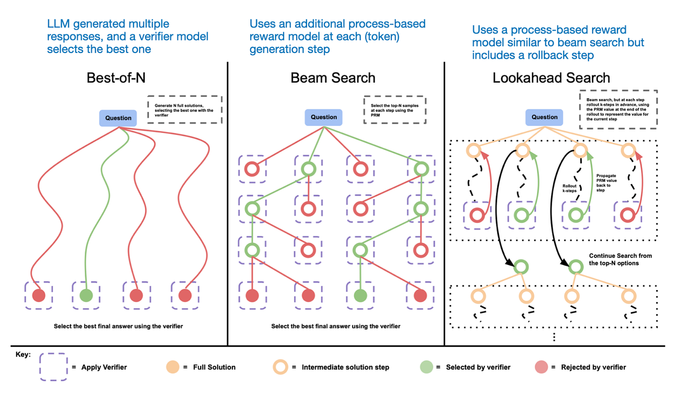
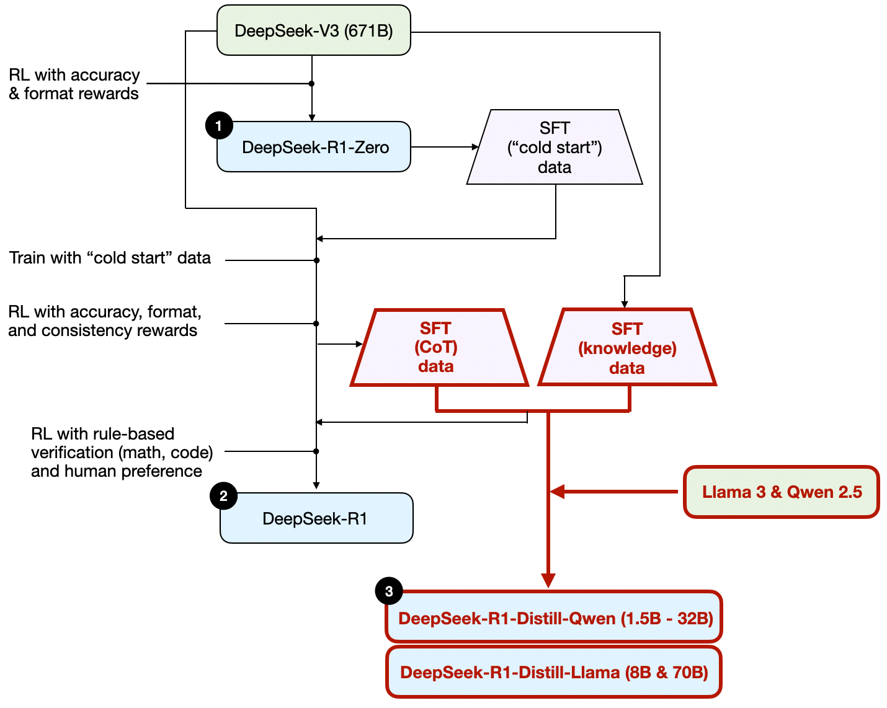

This article describes the four main approaches to building reasoning models, or how we can enhance LLMs with reasoning capabilities.  

本文将介绍构建推理模型的四种主要方法，或我们如何通过推理功能来增强 LLMs 的功能。  

I hope this provides valuable insights and helps you navigate the rapidly evolving literature and hype surrounding this topic.  

我希望这能为您提供有价值的见解，并帮助您了解围绕这一主题的快速发展的文献和炒作。

In 2024, the LLM field saw increasing specialization.  

2024 年，LLM领域的专业化程度越来越高。  

Beyond pre-training and fine-tuning, we witnessed the rise of specialized applications, from RAGs to code assistants.  

除了预培训和微调，我们还见证了从 RAG 到代码助手等专业应用的兴起。  

I expect this trend to accelerate in 2025, with an even greater emphasis on domain- and application-specific optimizations (i.e., "specializations").  

我预计这一趋势将在 2025 年加速发展，并更加强调针对特定领域和应用的优化（即 "专业化"）。

_Stages 1-3 are the common steps to developing LLMs. Stage 4 specializes LLMs for specific use cases.  

第 1-3 阶段是开发 LLMs 的常用步骤。第 4 阶段将 LLMs 专门用于特定用例。_

The development of reasoning models is one of these specializations.  

推理模型的开发就是这些专业之一。  

This means we refine LLMs to excel at complex tasks that are best solved with intermediate steps, such as puzzles, advanced math, and coding challenges.  

这就意味着，我们要对 LLMs 进行改进，使其在复杂的任务（如谜题、高等数学和编码挑战）中表现出色，而这些任务最好通过中间步骤来解决。  

However, this specialization does not replace other LLM applications.  

但是，这种专业化并不能取代其他 LLM 应用程序。  

Because transforming an LLM into a reasoning model also introduces certain drawbacks, which I will discuss later.  

因为将 LLM 转化为推理模型也会带来一些弊端，我将在后面讨论。

To give you a brief glimpse of what's covered below, in this article, I will:  

在本文中，我将简要介绍以下内容：

1.  Explain the meaning of "reasoning model"  
    
    解释 "推理模型 "的含义
    
2.  Discuss the advantages and disadvantages of reasoning models  
    
    讨论推理模型的优缺点
    
3.  Outline the methodology behind DeepSeek R1  
    
    概述 DeepSeek R1 背后的方法论
    
4.  Describe the four main approaches to building and improving reasoning models  
    
    描述建立和改进推理模型的四种主要方法
    
5.  Share thoughts on the LLM landscape following the DeepSeek V3 and R1 releases  
    
    分享对 DeepSeek V3 和 R1 发布后LLM格局的看法
    
6.  Provide tips for developing reasoning models on a tight budget  
    
    提供在预算紧张的情况下开发推理模型的技巧
    

I hope you find this article useful as AI continues its rapid development this year!  

随着人工智能在今年继续快速发展，希望这篇文章对您有所帮助！

If you work in AI (or machine learning in general), you are probably familiar with vague and hotly debated definitions.  

如果您从事的是人工智能（或一般的机器学习）工作，您可能对含糊不清、争论激烈的定义并不陌生。  

The term "reasoning models" is no exception.  

推理模型 "一词也不例外。  

Eventually, someone will define it formally in a paper, only for it to be redefined in the next, and so on.  

最终，有人会在一篇论文中对其进行正式定义，但下一篇论文又会对其进行重新定义，如此反复。

In this article, I define "reasoning" as the process of answering questions that require complex, multi-step generation with intermediate steps.  

在本文中，我将 "推理 "定义为回答问题的过程，而这些问题需要复杂的、多步骤的生成过程，并包含中间步骤。  

For example, factual question-answering like "What is the capital of France?" does not involve reasoning.  

例如，像 "法国的首都是哪里？"这样的事实性问题解答并不涉及推理。  

In contrast, a question like "If a train is moving at 60 mph and travels for 3 hours, how far does it go?" requires some simple reasoning.  

相比之下，"如果一列火车以 60 英里/小时的速度行驶 3 个小时，它能行驶多远？"这样的问题则需要一些简单的推理。  

For instance, it requires recognizing the relationship between distance, speed, and time before arriving at the answer.  

例如，在得出答案之前，需要认识到距离、速度和时间之间的关系。

_A regular LLM may only provide a short answer (as shown on the left), whereas reasoning models typically include intermediate steps that reveal part of the thought process.  

普通的 LLM 可能只能提供一个简短的答案（如左图所示），而推理模型通常包括中间步骤，可以揭示思维过程的一部分。  

(Note that many LLMs who have not been specifically developed for reasoning tasks can also provide intermediate reasoning steps in their answers.)  

(请注意，许多并非专门为推理任务开发的 LLMs 也可以在答案中提供中间推理步骤）。_

Most modern LLMs are capable of basic reasoning and can answer questions like, "If a train is moving at 60 mph and travels for 3 hours, how far does it go?" So, today, when we refer to reasoning models, we typically mean LLMs that excel at more complex reasoning tasks, such as solving puzzles, riddles, and mathematical proofs.  

大多数现代LLMs都具备基本的推理能力，并能回答诸如 "如果一列火车以每小时 60 英里的速度行驶 3 个小时，那么它能行驶多远？"之类的问题。因此，今天当我们提及推理模型时，我们通常指的是擅长完成更复杂推理任务的 LLMs ，例如解决谜题、谜语和数学证明。

Additionally, most LLMs branded as reasoning models today include a "thought" or "thinking" process as part of their response.  

此外，当今大多数被称为推理模型的 LLMs 都将 "思维 "或 "思考 "过程作为其响应的一部分。  

Whether and how an LLM actually "thinks" is a separate discussion.  

至于 LLM 是否以及如何 "思考"，则是另一个问题。

Intermediate steps in reasoning models can appear in two ways.  

推理模型的中间步骤可以通过两种方式出现。  

First, they may be explicitly included in the response, as shown in the previous figure.  

首先，它们可以明确地包含在回复中，如上图所示。  

Second, some reasoning LLMs, such as OpenAI's o1, run multiple iterations with intermediate steps that are not shown to the user.  

其次，某些推理LLMs（例如 OpenAI 的 o1）会进行多次迭代，中间步骤不会显示给用户。

_"Reasoning" is used at two different levels: 1) processing the input and generating via multiple intermediate steps and 2) providing some sort of reasoning as part of the response to the user.  

"推理 "用于两个不同的层面：1）通过多个中间步骤处理输入并生成；2）提供某种推理作为对用户响应的一部分。_

Now that we have defined reasoning models, we can move on to the more interesting part: how to build and improve LLMs for reasoning tasks.  

既然我们已经定义了推理模型，那么就可以进入更有趣的部分：如何构建和改进用于推理任务的 LLMs 。  

However, before diving into the technical details, it is important to consider when reasoning models are actually needed.  

不过，在深入研究技术细节之前，重要的是要考虑何时真正需要推理模型。

**When do we need a reasoning model?** Reasoning models are designed to be good at complex tasks such as solving puzzles, advanced math problems, and challenging coding tasks.  

什么时候需要推理模型？推理模型的设计目的是为了胜任复杂的任务，如解决谜题、高级数学问题和具有挑战性的编码任务。  

However, they are not necessary for simpler tasks like summarization, translation, or knowledge-based question answering.  

不过，对于摘要、翻译或基于知识的问题解答等较简单的任务来说，它们并不是必需的。  

In fact, using reasoning models for everything can be inefficient and expensive.  

事实上，凡事都使用推理模型可能既低效又昂贵。  

For instance, reasoning models are typically more expensive to use, more verbose, and sometimes more prone to errors due to "overthinking." Also here the simple rule applies: Use the right tool (or type of LLM) for the task.  

例如，推理模型的使用成本通常更高、更冗长，有时还更容易因 "过度思考 "而出错。在这里，简单的规则同样适用：针对任务使用正确的工具（或 LLM 类型）。

The key strengths and limitations of reasoning models are summarized in the figure below.  

下图概述了推理模型的主要优势和局限性。

_The key strengths and weaknesses of reasoning models.  

推理模型的主要优缺点。_

Before discussing four main approaches to building and improving reasoning models in the next section, I want to briefly outline the DeepSeek R1 pipeline, as described in the [DeepSeek R1 technical report](https://arxiv.org/abs/2501.12948).  

在下一节讨论建立和改进推理模型的四种主要方法之前，我想先简要介绍一下 DeepSeek R1 技术报告中描述的 DeepSeek R1 流程。  

This report serves as both an interesting case study and a blueprint for developing reasoning LLMs.  

本报告既是一个有趣的案例研究，也是制定推理 LLMs 的蓝图。

Note that DeepSeek did not release a single R1 reasoning model but instead introduced three distinct variants: DeepSeek-R1-Zero, DeepSeek-R1, and DeepSeek-R1-Distill.  

请注意，DeepSeek 没有发布单一的 R1 推理模型，而是推出了三种不同的变体：DeepSeek-R1-Zero、DeepSeek-R1和DeepSeek-R1-Distill。

Based on the descriptions in the technical report, I have summarized the development process of these models in the diagram below.  

根据技术报告中的描述，我在下图中总结了这些模型的开发过程。

Development process of DeepSeeks three different reasoning models that are discussed in the DeepSeek R1 technical report.  

DeepSeeks 三种不同推理模型的开发过程，在 DeepSeek R1 技术报告中进行了讨论。

Next, let's briefly go over the process shown in the diagram above.  

接下来，让我们简要回顾一下上图所示的过程。  

More details will be covered in the next section, where we discuss the four main approaches to building and improving reasoning models.  

下一节将介绍更多细节，我们将讨论构建和改进推理模型的四种主要方法。

**(1) DeepSeek-R1-Zero:** This model is based on the 671B pre-trained DeepSeek-V3 base model released in December 2024.  

(1) DeepSeek-R1-Zero：该模型基于 2024 年 12 月发布的 671B 预训练 DeepSeek-V3 基础模型。  

The research team trained it using reinforcement learning (RL) with two types of rewards.  

研究小组利用强化学习（RL）技术对其进行了训练，并采用了两种奖励方式。  

This approach is referred to as "cold start" training because it did not include a supervised fine-tuning (SFT) step, which is typically part of reinforcement learning with human feedback (RLHF).  

这种方法被称为 "冷启动 "训练，因为它不包括监督微调（SFT）步骤，而监督微调通常是有人类反馈的强化学习（RLHF）的一部分。

**(2) DeepSeek-R1:** This is DeepSeek's flagship reasoning model, built upon DeepSeek-R1-Zero.  

(2) DeepSeek-R1：这是 DeepSeek 的旗舰推理模型，建立在 DeepSeek-R1-Zero 的基础上。  

The team further refined it with additional SFT stages and further RL training, improving upon the "cold-started" R1-Zero model.  

研究小组在 R1-Zero 模型 "冷启动 "的基础上，通过增加 SFT 阶段和进一步的 RL 训练，进一步完善了该模型。

**(3) DeepSeek-R1-Distill\*:** Using the SFT data generated in the previous steps, the DeepSeek team fine-tuned Qwen and Llama models to enhance their reasoning abilities.  

(3) DeepSeek-R1-Distill\*：DeepSeek 团队利用前几步生成的 SFT 数据，对 Qwen 和 Llama 模型进行了微调，以提高它们的推理能力。  

While not distillation in the traditional sense, this process involved training smaller models (Llama 8B and 70B, and Qwen 1.5B–30B) on outputs from the larger DeepSeek-R1 671B model.  

虽然不是传统意义上的提炼，但这一过程涉及在较大的 DeepSeek-R1 671B 模型的输出上训练较小的模型（Llama 8B 和 70B 以及 Qwen 1.5B-30B）。

In this section, I will outline the key techniques currently used to enhance the reasoning capabilities of LLMs and to build specialized reasoning models such as DeepSeek-R1, OpenAI's o1 & o3, and others.  

在本节中，我将概述目前用于增强 LLMs 的推理能力以及构建 DeepSeek-R1、OpenAI 的 o1 和 o3 等专用推理模型的关键技术。

Note: The exact workings of o1 and o3 remain unknown outside of OpenAI.  

注：O1 和 O3 的具体工作原理在 OpenAI 之外仍不得而知。  

However, they are rumored to leverage a combination of both inference and training techniques.  

不过，据说它们会同时利用推理和训练技术。

One way to improve an LLM's reasoning capabilities (or any capability in general) is inference-time scaling.  

提高 LLM 的推理能力（或任何一般能力）的一种方法是推理时间扩展。  

This term can have multiple meanings, but in this context, it refers to increasing computational resources during inference to improve output quality.  

这个术语有多种含义，但在这里指的是在推理过程中增加计算资源，以提高输出质量。

A rough analogy is how humans tend to generate better responses when given more time to think through complex problems. Similarly, we can apply techniques that encourage the LLM to "think" more while generating an answer.  

一个粗略的类比是，当人类有更多时间思考复杂问题时，往往会产生更好的答案。同样，我们可以应用一些技术，鼓励 LLM 在生成答案时多 "思考"。  

(Although, whether LLMs actually "think" is a different discussion.)  

(不过，LLMs是否真的 "思考 "则另当别论）。

One straightforward approach to inference-time scaling is clever prompt engineering.  

推理时间缩放的一种直接方法是巧妙的提示工程。  

A classic example is _chain-of-thought (CoT) prompting_, where phrases like "think step by step" are included in the input prompt.  

一个典型的例子是思维链（CoT）提示，即在输入提示中加入 "逐步思考 "等短语。  

This encourages the model to generate intermediate reasoning steps rather than jumping directly to the final answer, which can often (but not always) lead to more accurate results on more complex problems. (Note that it doesn't make sense to employ this strategy for simpler knowledge-based questions, like "What is the capital of France", which is again a good rule of thumb to find out whether a reasoning model makes sense on your given input query.)  

这将鼓励模型生成中间推理步骤，而不是直接跳转到最终答案，这通常（但并不总是）能为更复杂的问题带来更准确的结果。(请注意，对于像 "法国的首都是什么 "这样基于知识的简单问题，采用这种策略是没有意义的，这也是一个很好的经验法则，可用于确定推理模型对给定的输入查询是否有意义）。

_An example of classic CoT prompting from the 2022 Large Language Models are Zero-Shot Reasoners paper (https://arxiv.org/abs/2205.11916).  

2022 Large Language Models are Zero-Shot Reasoners》一文中的一个经典 CoT 提示示例 (https://arxiv.org/abs/2205.11916)。_

The aforementioned CoT approach can be seen as inference-time scaling because it makes inference more expensive through generating more output tokens.  

上述 CoT 方法可视为推理时间扩展，因为它通过生成更多的输出标记来增加推理的成本。

Another approach to inference-time scaling is the use of voting and search strategies.  

推理时间缩放的另一种方法是使用投票和搜索策略。  

One simple example is majority voting where we have the LLM generate multiple answers, and we select the correct answer by majority vote.  

一个简单的例子是多数票表决，我们让 LLM 生成多个答案，然后通过多数票选出正确答案。  

Similarly, we can use beam search and other search algorithms to generate better responses.  

同样，我们可以使用波束搜索和其他搜索算法来生成更好的响应。

I highly recommend the _[Scaling LLM Test-Time Compute Optimally can be More Effective than Scaling Model Parameters](https://arxiv.org/abs/2408.03314)_ paper that I described in my previous Noteworthy AI Research Papers of 2024 (Part Two) article (https://magazine.sebastianraschka.com/p/ai-research-papers-2024-part-2) for more details on these different strategies.  

关于这些不同策略的更多细节，我强烈推荐我在上一篇《2024 年值得关注的人工智能研究论文（第二部分）》文章 (https://magazine.sebastianraschka.com/p/ai-research-papers-2024-part-2) 中介绍的《最佳缩放 LLM 测试时间计算比缩放模型参数更有效》一文。

_Different search-based methods rely on a process-reward-based model to select the best answer.  

不同的基于搜索的方法都依赖于基于过程奖励的模型来选择最佳答案。  

Annotated figure from the LLM Test-Time Compute paper, https://arxiv.org/abs/2408.03314  

LLM测试时间计算论文中的注释图，https://arxiv.org/abs/2408.03314_

The DeepSeek R1 technical report states that its models do not use inference-time scaling.  

DeepSeek R1 技术报告指出，其模型不使用推理时间缩放。  

However, this technique is often implemented at the application layer on top of the LLM, so it is possible that DeepSeek applies it within their app.  

不过，这种技术通常是在 LLM 的应用层上实现的，因此 DeepSeek 有可能在其应用程序中应用了这种技术。

I suspect that OpenAI's o1 and o3 models use inference-time scaling, which would explain why they are relatively expensive compared to models like GPT-4o.  

我怀疑 OpenAI 的 o1 和 o3 模型使用了推理时间缩放，这就解释了为什么与 GPT-4o 等模型相比，它们的成本相对较高。  

In addition to inference-time scaling, o1 and o3 were likely trained using RL pipelines similar to those used for DeepSeek R1.  

除了推理时间缩放外，o1 和 o3 很可能是使用与 DeepSeek R1 类似的 RL 管道进行训练的。  

More on reinforcement learning in the next two sections below.  

下面两节将详细介绍强化学习。

One of my personal highlights from the [DeepSeek R1 paper](https://arxiv.org/abs/2501.12948) is their discovery that reasoning emerges as a behavior from pure reinforcement learning (RL).  

DeepSeek R1 论文中的一个亮点是，他们发现推理是纯强化学习（RL）的一种行为。  

Let's explore what this means in more detail.  

让我们来详细探讨一下这意味着什么。

As outlined earlier, DeepSeek developed three types of R1 models. The first, **DeepSeek-R1-Zero**, was built on top of the DeepSeek-V3 base model, a standard pre-trained LLM they released in December 2024.  

如前所述，DeepSeek 开发了三种类型的 R1 模型。第一种是 DeepSeek-R1-Zero，它建立在 DeepSeek-V3 基础模型之上，后者是 2024 年 12 月发布的标准预训练 LLM 模型。  

Unlike typical RL pipelines, where supervised fine-tuning (SFT) is applied before RL, DeepSeek-R1-Zero was trained **exclusively** with reinforcement learning without an initial SFT stage as highlighted in the diagram below.  

与在 RL 之前应用监督微调（SFT）的典型 RL 管线不同，DeepSeek-R1-Zero 完全采用强化学习进行训练，没有初始 SFT 阶段，如下图所示。

The development process of DeepSeek-R1-Zero model.  

DeepSeek-R1-Zero 模型的开发过程。

Still, this RL process is similar to the commonly used RLHF approach, which is typically applied to preference-tune LLMs. (I covered RLHF in more detail in my article, _[LLM Training: RLHF and Its Alternatives](https://magazine.sebastianraschka.com/p/llm-training-rlhf-and-its-alternatives)_.) However, as mentioned above, the key difference in _DeepSeek-R1-Zero_ is that they skipped the supervised fine-tuning (SFT) stage for instruction tuning.  

不过，这种 RL 流程与常用的 RLHF 方法类似，后者通常用于偏好调整 LLMs 。(我在《LLM训练》一文中更详细地介绍了 RLHF：RLHF 及其替代方案）。不过，如上所述，DeepSeek-R1-Zero 的关键区别在于，他们跳过了指令调整的监督微调 (SFT) 阶段。  

This is why they refer to it as "pure" RL.  

这就是为什么他们称其为 "纯粹 "的 RL。  

(Although, RL in the context of LLMs differs significantly from traditional RL, which is a topic for another time.)  

(不过，LLMs中的 RL 与传统的 RL 有很大不同，这是另一个话题）。

For rewards, instead of using a reward model trained on human preferences, they employed two types of rewards: an accuracy reward and a format reward.  

在奖励方面，他们没有使用根据人类偏好训练的奖励模型，而是采用了两种类型的奖励：准确性奖励和格式奖励。

-   The **accuracy reward** uses the LeetCode compiler to verify coding answers and a deterministic system to evaluate mathematical responses.  
    
    准确性奖励使用 LeetCode 编译器验证编码答案，并使用确定性系统评估数学答案。
    
-   The **format reward** relies on an LLM judge to ensure responses follow the expected format, such as placing reasoning steps inside <think> tags.  
    
    格式奖励依靠 LLM 判断来确保回复遵循预期格式，例如将推理步骤置于 标记内。
    

Surprisingly, this approach was enough for the LLM to develop basic reasoning skills.  

令人惊讶的是，这种方法足以让 LLM 培养基本的推理能力。  

The researchers observed an "Aha!" moment, where the model began generating reasoning traces as part of its responses despite not being explicitly trained to do so, as shown in the figure below.  

如下图所示，研究人员观察到了一个 "啊哈！"时刻，尽管没有经过明确的训练，模型还是开始生成推理踪迹作为其响应的一部分。

_A figure from the DeepSeek R1 technical report (https://arxiv.org/abs/2501.12948) showing the emergence of the "Aha" moment.  

DeepSeek R1 技术报告 (https://arxiv.org/abs/2501.12948) 中的一幅图显示了 "啊哈 "时刻的出现。_

While R1-Zero is not a top-performing reasoning model, it does demonstrate reasoning capabilities by generating intermediate "thinking" steps, as shown in the figure above.  

虽然 R1-Zero 并非性能最佳的推理模型，但它确实通过生成中间 "思考 "步骤展示了推理能力，如上图所示。  

This confirms that it is possible to develop a reasoning model using pure RL, and the DeepSeek team was the first to demonstrate (or at least publish) this approach.  

这证实了使用纯 RL 开发推理模型是可行的，DeepSeek 团队是第一个展示（或至少发布）这种方法的团队。

Next, let's look at the development of DeepSeek-R1, DeepSeek’s flagship reasoning model, which serves as a blueprint for building reasoning models.  

接下来，让我们看看 DeepSeek 的旗舰推理模型 DeepSeek-R1 的开发情况，它是构建推理模型的蓝本。  

This model improves upon DeepSeek-R1-Zero by incorporating additional supervised fine-tuning (SFT) and reinforcement learning (RL) to improve its reasoning performance.  

该模型在 DeepSeek-R1-Zero 的基础上进行了改进，增加了监督微调 (SFT) 和强化学习 (RL)，以提高其推理性能。

Note that it is actually common to include an SFT stage before RL, as seen in the standard RLHF pipeline.  

请注意，在 RL 之前加入一个 SFT 阶段实际上是很常见的，这在标准的 RLHF 流水线中可以看到。  

OpenAI's o1 was likely developed using a similar approach.  

OpenAI 的 o1 可能也是采用类似方法开发的。

The development process of DeepSeek-R1 model.  

DeepSeek-R1 模型的开发过程。

As shown in the diagram above, the DeepSeek team used DeepSeek-R1-Zero to generate what they call "cold-start" SFT data.  

如上图所示，DeepSeek团队使用DeepSeek-R1-Zero生成了所谓的 "冷启动 "SFT数据。  

The term "cold start" refers to the fact that this data was produced by DeepSeek-R1-Zero, which itself had not been trained on any supervised fine-tuning (SFT) data.  

所谓 "冷启动"，是指这些数据是由 DeepSeek-R1-Zero 生成的，而 DeepSeek-R1-Zero 本身并没有经过任何监督微调（SFT）数据的训练。

Using this cold-start SFT data, DeepSeek then trained the model via instruction fine-tuning, followed by another reinforcement learning (RL) stage.  

利用这些冷启动 SFT 数据，DeepSeek 通过指令微调对模型进行了训练，然后进入另一个强化学习 (RL) 阶段。  

This RL stage retained the same accuracy and format rewards used in DeepSeek-R1-Zero’s RL process.  

该 RL 阶段保留了 DeepSeek-R1-Zero RL 流程中使用的相同精度和格式奖励。  

However, they added a consistency reward to prevent language mixing, which occurs when the model switches between multiple languages within a response.  

不过，他们增加了一致性奖励，以防止语言混合，即当模型在一个反应中切换多种语言时发生的语言混合。

The RL stage was followed by another round of SFT data collection.  

RL 阶段之后是另一轮 SFT 数据收集。  

In this phase, the most recent model checkpoint was used to generate 600K Chain-of-Thought (CoT) SFT examples, while an additional 200K knowledge-based SFT examples were created using the DeepSeek-V3 base model.  

在这一阶段，最新的模型检查点被用来生成 60 万个思维链（CoT）SFT 示例，同时使用 DeepSeek-V3 基础模型创建了另外 20 万个基于知识的 SFT 示例。

These 600K + 200K SFT samples were then used for another round of RL.  

这些 600K + 200K SFT 样本随后被用于另一轮 RL。  

In this stage, they again used rule-based methods for accuracy rewards for math and coding questions, while human preference labels used for other question types.  

在这一阶段，他们再次使用基于规则的方法对数学和编码问题进行准确性奖励，而对其他类型的问题则使用人的偏好标签。

The final model, DeepSeek-R1 has a noticeable performance boost over DeepSeek-R1-Zero thanks to the additional SFT and RL stages, as shown in the table below.  

如下表所示，由于增加了 SFT 和 RL 级，最终型号 DeepSeek-R1 的性能比 DeepSeek-R1-Zero 有了明显提升。

Benchmark comparison of OpenAI A1 and DeepSeek R1 models.  

OpenAI A1 和 DeepSeek R1 模型的基准比较。  

Annotated figure from the DeepSeek-R1 technical report (https://arxiv.org/abs/2501.12948).  

DeepSeek-R1 技术报告（https://arxiv.org/abs/2501.12948）中的注释图。

So far, we have covered three key approaches to building and improving reasoning models:  

到目前为止，我们已经介绍了建立和改进推理模型的三种主要方法：

1.  

Inference-time scaling, a technique that improves reasoning capabilities without training or otherwise modifying the underlying model.  

推理时间扩展，这是一种无需训练或修改底层模型就能提高推理能力的技术。

2.  

Pure reinforcement learning (RL) as in DeepSeek-R1-Zero, which showed that reasoning can emerge as a learned behavior without supervised fine-tuning.  

DeepSeek-R1-Zero 中的纯强化学习（RL）表明，推理可以作为一种学习行为出现，而无需监督微调。

3.  

Supervised fine-tuning (SFT) plus RL, which led to DeepSeek-R1, DeepSeek’s flagship reasoning model.  

监督微调（SFT）加 RL，从而产生了 DeepSeek 的旗舰推理模型 DeepSeek-R1。

**So, what’s left? Model "distillation."  

那么，还剩下什么？模型 "蒸馏"。**

Surprisingly, DeepSeek also released smaller models trained via a process they call _distillation_.  

令人惊讶的是，DeepSeek 还发布了通过他们称之为 "蒸馏 "的过程训练出来的较小模型。  

However, in the context of LLMs, distillation does not necessarily follow the classical knowledge distillation approach used in deep learning.  

但是，在LLMs中，蒸馏并不一定遵循深度学习中使用的经典知识蒸馏方法。  

Traditionally, in knowledge distillation (as briefly described in Chapter 6 of my [Machine Learning Q and AI](https://amzn.to/40YYowg) book), a smaller student model is trained on both the logits of a larger teacher model and a target dataset.  

传统上，在知识提炼过程中（如我的《机器学习问答与人工智能》一书第 6 章中所简述的），一个较小的学生模型会在一个较大的教师模型和一个目标数据集的对数上进行训练。

Instead, here distillation refers to instruction fine-tuning smaller LLMs, such as Llama 8B and 70B and Qwen 2.5 models (0.5B to 32B), on an SFT dataset generated by larger LLMs. Specifically, these larger LLMs are DeepSeek-V3 and an intermediate checkpoint of DeepSeek-R1.  

相反，这里的提炼指的是在较大的 LLMs 生成的 SFT 数据集上对较小的 LLMs 进行指令微调，例如 Llama 8B 和 70B 以及 Qwen 2.5 模型（0.5B 至 32B）。具体来说，这些较大的 LLMs 是 DeepSeek-V3 和 DeepSeek-R1 的中间检查点。  

In fact, the SFT data used for this distillation process is the same dataset that was used to train DeepSeek-R1, as described in the previous section.  

事实上，用于这一提炼过程的 SFT 数据与上一节所述用于训练 DeepSeek-R1 的数据集相同。

To clarify this process, I have highlighted the distillation portion in the diagram below.  

为了说明这一过程，我在下图中突出了蒸馏部分。

The development process of DeepSeek-R1-Distill models.  

DeepSeek-R1-Distill 模型的开发过程。

Why did they develop these distilled models? In my opinion, there are two key reasons:  

他们为什么要开发这些经过提炼的模型呢？在我看来，主要有两个原因：

1\. Smaller models are more efficient.  

1.小机型更高效。  

This means they are cheaper to run, but they also can run on lower-end hardware, which makes these especially interesting for many researchers and tinkerers like me.  

这意味着它们的运行成本更低，但也可以在低端硬件上运行，这让许多研究人员和像我这样的工匠特别感兴趣。

2\. A case study in pure SFT.  

2.纯 SFT 案例研究。  

These distilled models serve as an interesting benchmark, showing how far pure supervised fine-tuning (SFT) can take a model without reinforcement learning.  

这些经过提炼的模型是一个有趣的基准，显示了纯粹的监督微调（SFT）可以在不进行强化学习的情况下将模型提升到何种程度。

The table below compares the performance of these distilled models against other popular models, as well as DeepSeek-R1-Zero and DeepSeek-R1.  

下表比较了这些蒸馏模型与其他流行模型以及 DeepSeek-R1-Zero 和 DeepSeek-R1 的性能。

Benchmark comparison of distilled versus non-distilled models.  

蒸馏模型与非蒸馏模型的基准比较。  

Annotated figure from the DeepSeek-R1 technical report (https://arxiv.org/abs/2501.12948).  

DeepSeek-R1 技术报告（https://arxiv.org/abs/2501.12948）中的注释图。

As we can see, the distilled models are noticeably weaker than DeepSeek-R1, but they are surprisingly strong relative to DeepSeek-R1-Zero, despite being orders of magnitude smaller.  

我们可以看到，蒸馏后的模型明显弱于 DeepSeek-R1，但与 DeepSeek-R1-Zero 相比，尽管体积小了几个数量级，它们却出奇地强大。  

It's also interesting to note how well these models perform compared to o1 mini (I suspect o1-mini itself might be a similarly distilled version of o1).  

值得注意的是，这些模型与 o1 mini 相比性能如何（我怀疑 o1-mini 本身可能就是 o1 的类似提炼版本）。

Before wrapping up this section with a conclusion, there’s one more interesting comparison worth mentioning.  

在结束本节结论之前，还有一个有趣的对比值得一提。  

The DeepSeek team tested whether the emergent reasoning behavior seen in DeepSeek-R1-Zero could also appear in smaller models.  

DeepSeek 团队测试了 DeepSeek-R1-Zero 中出现的新兴推理行为是否也会出现在更小的模型中。  

To investigate this, they applied the same pure RL approach from DeepSeek-R1-Zero directly to Qwen-32B.  

为了研究这一点，他们将 DeepSeek-R1-Zero 的纯 RL 方法直接应用于 Qwen-32B。

The results of this experiment are summarized in the table below, where QwQ-32B-Preview serves as a reference reasoning model based on Qwen 2.5 32B developed by the Qwen team (I think the training details were never disclosed).  

QwQ-32B-Preview 是基于 Qwen 团队开发的 Qwen 2.5 32B 的参考推理模型（我想训练细节从未公开）。  

This comparison provides some additional insights into whether pure RL alone can induce reasoning capabilities in models much smaller than DeepSeek-R1-Zero.  

这种比较提供了一些额外的见解，让我们了解单纯的 RL 是否能在比 DeepSeek-R1-Zero 小得多的模型中产生推理能力。

Benchmark comparison distillation and RL on a smaller 32B model.  

在较小的 32B 机型上对蒸馏和 RL 进行基准比较。  

Annotated figure from the DeepSeek-R1 technical report (https://arxiv.org/abs/2501.12948).  

DeepSeek-R1 技术报告（https://arxiv.org/abs/2501.12948）中的注释图。

Interestingly, the results suggest that distillation is far more effective than pure RL for smaller models.  

有趣的是，结果表明，对于较小的模型，蒸馏比纯 RL 更有效。  

This aligns with the idea that RL alone may not be sufficient to induce strong reasoning abilities in models of this scale, whereas SFT on high-quality reasoning data can be a more effective strategy when working with small models.  

这与以下观点不谋而合，即在这种规模的模型中，仅靠 RL 可能不足以诱导出强大的推理能力，而在处理小型模型时，基于高质量推理数据的 SFT 可能是一种更有效的策略。

For completeness, it would have been useful to see additional comparisons in the table:  

为了完整起见，最好在表格中增加一些比较：

1\. Qwen-32B trained with SFT + RL, similar to how DeepSeek-R1 was developed.  

1.Qwen-32B 采用 SFT + RL 训练，与 DeepSeek-R1 的开发过程类似。  

This would help determine how much improvement can be made, compared to pure RL and pure SFT, when RL is combined with SFT.  

这将有助于确定，与纯 RL 和纯 SFT 相比，当 RL 与 SFT 相结合时，能有多大改进。

2\. DeepSeek-V3 trained with pure SFT, similar to how the distilled models were created.  

2.DeepSeek-V3 使用纯 SFT 进行训练，与创建蒸馏模型的方法类似。  

This would allow for a direct comparison to see how effective RL + SFT is over pure SFT.  

这样就可以直接比较 RL + SFT 与纯 SFT 的效果。

In this section, we explored four different strategies for building and improving reasoning models:  

在本节中，我们探讨了建立和改进推理模型的四种不同策略：

1.  

Inference-time scaling requires no additional training but increases inference costs, making large-scale deployment more expensive as the number or users or query volume grows.  

推理时间扩展不需要额外的训练，但会增加推理成本，随着用户数量或查询量的增加，大规模部署的成本也会增加。  

Still, it remains a no-brainer for improving the performance of already strong models.  

尽管如此，要提高已经很强大的机型的性能，它仍然是不二之选。  

I strongly suspect that o1 leverages inference-time scaling, which helps explain why it is more expensive on a per-token basis compared to DeepSeek-R1.  

我强烈怀疑 o1 利用了推理时间扩展，这有助于解释为什么它的单标记成本比 DeepSeek-R1 高。

2.  

Pure RL is interesting for research purposes because it provides insights into reasoning as an emergent behavior.  

纯粹的 RL 对于研究目的来说非常有趣，因为它能让我们深入了解推理这种新兴行为。  

However, in practical model development, RL + SFT is the preferred approach as it leads to stronger reasoning models.  

不过，在实际模型开发中，RL + SFT 是首选方法，因为它能带来更强的推理模型。  

I strongly suspect that o1 was trained using RL + SFT as well.  

我强烈怀疑 o1 也是用 RL + SFT 训练出来的。  

More precisely, I believe o1 starts from a weaker, smaller base model than DeepSeek-R1 but compensates with RL + SFT and inference-time scaling.  

更确切地说，我认为 o1 的基础模型比 DeepSeek-R1 更弱、更小，但它通过 RL + SFT 和推理时间扩展进行了补偿。

3\. As mentioned above, RL + SFT is the key approach for building high-performance reasoning models.  

3.如上所述，RL + SFT 是构建高性能推理模型的关键方法。  

DeepSeek-R1 is a nice blueprint showing how this can be done.  

DeepSeek-R1 是一个很好的蓝图，展示了如何做到这一点。

4\. Distillation is an attractive approach, especially for creating smaller, more efficient models.  

4.蒸馏法是一种很有吸引力的方法，尤其是在创建更小、更高效的模型时。  

However, the limitation is that distillation does not drive innovation or produce the next generation of reasoning models.  

然而，其局限性在于提炼并不能推动创新或产生下一代推理模型。  

For instance, distillation always depends on an existing, stronger model to generate the supervised fine-tuning (SFT) data.  

例如，蒸馏总是依赖于现有的、更强大的模型来生成监督微调（SFT）数据。

One interesting aspect I expect to see next is to combine RL + SFT (approach 3) with inference-time scaling (approach 1).  

我期望看到的下一个有趣方面是将 RL + SFT（方法 3）与推理时间缩放（方法 1）相结合。  

This is likely what OpenAI o1 is doing, except it's probably based on a weaker base model than DeepSeek-R1, which explains why DeepSeek-R1 performs so well while remaining relatively cheap at inference time.  

这很可能就是 OpenAI o1 正在做的事情，只不过它所基于的基础模型可能比 DeepSeek-R1 更弱，这也解释了为什么 DeepSeek-R1 在推理时表现如此出色，而推理成本却相对较低。

In recent weeks, many people have asked for my thoughts on the DeepSeek-R1 models.  

最近几周，很多人问我对 DeepSeek-R1 型号的看法。  

In short, I think they are an awesome achievement.  

总之，我认为它们是一项了不起的成就。  

As a research engineer, I particularly appreciate the detailed technical report, which provides insights into their methodology that I can learn from.  

作为一名研究工程师，我特别欣赏这份详细的技术报告，它提供了我可以借鉴的研究方法。

One of the most fascinating takeaways is how reasoning emerged as a behavior from pure RL.  

其中最引人入胜的一点是，推理是如何从纯粹的 RL 行为中脱颖而出的。  

And it's impressive that DeepSeek has open-sourced their models under a permissive open-source MIT license, which has even fewer restrictions than Meta's Llama models.  

令人印象深刻的是，DeepSeek 在 MIT 许可的许可下开源了他们的模型，其限制甚至比 Meta 的 Llama 模型还要少。

**How does it compare to o1?  

与 o1 相比如何？**

Is DeepSeek-R1 better than o1? I’d say it’s roughly in the same ballpark.  

DeepSeek-R1 比 o1 好用吗？我认为大致相同。  

However, what stands out is that DeepSeek-R1 is more efficient at inference time.  

然而，最突出的是，DeepSeek-R1 的推理效率更高。  

This suggests that DeepSeek likely invested more heavily in the training process, while OpenAI may have relied more on inference-time scaling for o1.  

这表明，DeepSeek 可能在训练过程中投入了更多精力，而 OpenAI 可能更依赖于 o1 的推理时间扩展。

That said, it's difficult to compare o1 and DeepSeek-R1 directly because OpenAI has not disclosed much about o1.  

尽管如此，要直接比较 o1 和 DeepSeek-R1 还是很困难的，因为 OpenAI 并没有透露太多有关 o1 的信息。  

For instance, we don’t know:  

例如，我们不知道

-   Is o1 also a Mixture of Experts (MoE)?  
    
    o1 也是专家混合物（MoE）吗？
    
-   How large is o1?  
    
    o1 有多大？
    
-   Could o1 just be a slightly refined version of GPT-4o with minimal RL + SFT and only extensive inference-time scaling?  
    
    o1 会不会只是 GPT-4o 的略微改良版，只具有最小的 RL + SFT 和广泛的推理时间扩展？
    

Without knowing these details, a direct comparison remains an apples-to-oranges comparison.  

在不了解这些细节的情况下，直接进行比较仍然是 "苹 果对苹果 "的比较。

**The cost of training DeepSeek-R1  

DeepSeek-R1 的培训费用**

Another point of discussion has been the cost of developing DeepSeek-R1.  

另一个讨论点是开发 DeepSeek-R1 的成本。  

Some have mentioned a ~$6 million training cost, but they likely conflated DeepSeek-V3 (the base model released in December last year) and DeepSeek-R1.  

有人提到约 600 万美元的培训费用，但他们很可能把 DeepSeek-V3（去年 12 月发布的基本型号）和 DeepSeek-R1 混淆了。

The $6 million estimate is based on an assumed $2 per GPU hour and the number of GPU hours required for the final training run of DeepSeek-V3, which was originally discussed back in December 2024.  

600 万美元的估算是基于每 GPU 小时 2 美元的假设，以及 DeepSeek-V3 最终训练运行所需的 GPU 小时数，而最初的讨论要追溯到 2024 年 12 月。

However, the DeepSeek team has never disclosed the exact GPU hours or development cost for R1, so any cost estimates remain pure speculation.  

不过，DeepSeek 团队从未透露过 R1 的具体 GPU 小时数或开发成本，因此任何成本估算都纯属猜测。

Either way, ultimately, DeepSeek-R1 is a major milestone in open-weight reasoning models, and its efficiency at inference time makes it an interesting alternative to OpenAI’s o1.  

无论如何，DeepSeek-R1 最终都是开放式推理模型的一个重要里程碑，它在推理时的效率使其成为 OpenAI 的 o1 的有趣替代品。

Developing a DeepSeek-R1-level reasoning model likely requires hundreds of thousands to millions of dollars, even when starting with an open-weight base model like DeepSeek-V3.  

开发一个DeepSeek-R1级别的推理模型可能需要数十万到数百万美元，即使从DeepSeek-V3这样的开放式基础模型开始也是如此。  

This can feel discouraging for researchers or engineers working with limited budgets.  

这可能会让预算有限的研究人员或工程师感到气馁。

**The good news: Distillation can go a long way  

好消息是蒸馏可以大有作为**

Fortunately, model distillation offers a more cost-effective alternative.  

幸运的是，模式蒸馏提供了一种更具成本效益的替代方法。  

The DeepSeek team demonstrated this with their R1-distilled models, which achieve surprisingly strong reasoning performance despite being significantly smaller than DeepSeek-R1.  

DeepSeek 团队用他们的 R1 馏分模型证明了这一点，尽管这些模型比 DeepSeek-R1 小得多，但推理性能却出奇地强。  

However, even this approach isn’t entirely cheap.  

不过，即使是这种方法也不完全便宜。  

Their distillation process used 800K SFT samples, which requires substantial compute.  

他们的蒸馏过程使用了 800K SFT 样本，这需要大量的计算。

Interestingly, just a few days before DeepSeek-R1 was released, I came across [an article about Sky-T1](https://novasky-ai.github.io/posts/sky-t1/), a fascinating project where a small team trained an open-weight 32B model using only 17K SFT samples.  

有趣的是，就在 DeepSeek-R1 发布的前几天，我看到了一篇关于 Sky-T1 的文章，这是一个令人着迷的项目，一个小团队仅用 17K SFT 样本就训练出了一个开放重量的 32B 模型。  

The total cost? Just $450, which is less than the registration fee for most AI conferences.  

总费用是多少？仅需 450 美元，比大多数人工智能会议的注册费还低。

This example highlights that while large-scale training remains expensive, smaller, targeted fine-tuning efforts can still yield impressive results at a fraction of the cost.  

这个例子突出表明，虽然大规模培训仍然费用高昂，但较小规模、有针对性的微调工作仍能产生令人印象深刻的效果，而成本只是一小部分。

Figure from the "Sky-T1: Train your own O1 preview model within $450" article, https://novasky-ai.github.io/posts/sky-t1/  

图自 "Sky-T1：450 美元内训练自己的 O1 预览模型 "一文，https://novasky-ai.github.io/posts/sky-t1/

According to their benchmarks, Sky-T1 performs roughly on par with o1, which is impressive given its low training cost.  

根据他们的基准测试，Sky-T1 的性能与 o1 大致相当，考虑到其较低的培训成本，这一点令人印象深刻。

**Pure RL on a budget: TinyZero  

预算有限的纯粹 RLTinyZero**

While Sky-T1 focused on model distillation, I also came across some interesting work in the "pure RL" space.  

在 Sky-T1 专注于模型提炼的同时，我还发现了 "纯 RL "领域的一些有趣工作。  

One notable example is [TinyZero](https://github.com/Jiayi-Pan/TinyZero/), a 3B parameter model that replicates the DeepSeek-R1-Zero approach (side note: it costs less than $30 to train).  

一个值得注意的例子是 TinyZero，它是一个 3B 参数模型，复制了 DeepSeek-R1-Zero 方法（题外话：它的训练成本不到 30 美元）。

Surprisingly, even at just 3B parameters, TinyZero exhibits some emergent self-verification abilities, which supports the idea that reasoning can emerge through pure RL, even in small models.  

令人惊讶的是，即使只有 3B 个参数，TinyZero 也表现出了一些新兴的自我验证能力，这支持了推理可以通过纯 RL 出现的观点，即使在小型模型中也是如此。

The [TinyZero repository](https://github.com/Jiayi-Pan/TinyZero/) mentions that a research report is still work in progress, and I’ll definitely be keeping an eye out for further details.  

TinyZero 存储库提到，研究报告仍在撰写中，我一定会密切关注进一步的细节。

A figure from the TinyZero repository (https://github.com/Jiayi-Pan/TinyZero) showing that the model is capable of self-verification.  

TinyZero 数据库（https://github.com/Jiayi-Pan/TinyZero）中的一张图显示，该模型能够进行自我验证。  

(It would have been interesting to see the response of the base model in comparison.)  

(相比之下，看看基本车型的反应会更有意思）。

The two projects mentioned above demonstrate that interesting work on reasoning models is possible even with limited budgets.  

上述两个项目表明，即使预算有限，也可以在推理模型方面开展有意义的工作。  

While both approaches replicate methods from DeepSeek-R1, one focusing on pure RL (TinyZero) and the other on pure SFT (Sky-T1), it would be fascinating to explore how these ideas can be extended further.  

这两种方法都复制了 DeepSeek-R1 中的方法，一种侧重于纯 RL（TinyZero），另一种侧重于纯 SFT（Sky-T1）。

**Beyond Traditional SFT: Journey Learning  

超越传统的 SFT：旅程学习**

One particularly interesting approach I came across last year is described in the paper _[O1 Replication Journey: A Strategic Progress Report – Part 1](https://arxiv.org/abs/2410.18982)_. Despite its title, the paper does not actually replicate o1.  

我去年遇到的一个特别有趣的方法在论文《O1 复制之旅》中有所描述：战略进展报告--第一部分》。尽管标题如此，但这篇论文实际上并没有复制 o1。  

Instead, it introduces an different way to improve the distillation (pure SFT) process.  

相反，它介绍了一种改进蒸馏（纯 SFT）工艺的不同方法。

The key idea in the paper is "journey learning" as an alternative to "shortcut learning."  

本文的关键观点是 "旅程学习"，以此替代 "捷径学习"。

-   Shortcut learning refers to the traditional approach in instruction fine-tuning, where models are trained using only correct solution paths.  
    
    捷径学习指的是指令微调中的传统方法，即仅使用正确的求解路径来训练模型。
    
-   Journey learning, on the other hand, also includes incorrect solution paths, allowing the model to learn from mistakes.  
    
    另一方面，"旅程学习 "还包括错误的求解路径，让模型从错误中学习。
    

This approach is kind of related to the self-verification abilities observed in TinyZero’s pure RL training, but it focuses on improving the model entirely through SFT.  

这种方法与 TinyZero 的纯 RL 训练中观察到的自我验证能力有某种联系，但它的重点是完全通过 SFT 改进模型。  

By exposing the model to incorrect reasoning paths and their corrections, journey learning may also reinforce self-correction abilities, potentially making reasoning models more reliable this way.  

通过让模型接触不正确的推理路径及其修正，旅程学习还能强化自我修正能力，从而有可能使推理模型更加可靠。

Journey learning, as opposed to traditional shortcut learning, includes wrong solutions paths in the SFT data.  

旅程学习与传统的捷径学习不同，它包括 SFT 数据中的错误解法路径。  

Annotated figure from the O1 Replication Journey: A Strategic Progress Report – Part 1 (https://arxiv.org/abs/2410.18982)  

O1 复制之旅》中的注释图：战略进展报告 - 第 1 部分 (https://arxiv.org/abs/2410.18982)

This could be an exciting direction for future work, particularly for low-budget reasoning model development, where RL-based approaches may be computationally impractical.  

这可能是未来工作的一个令人兴奋的方向，特别是对于低预算的推理模型开发而言，基于 RL 的方法在计算上可能是不切实际的。

Anyways, a lot of interesting work is currently happening on the reasoning model front, and I'm sure we will see a lot more exciting work in the upcoming months!  

总之，目前在推理模型方面有很多有趣的工作正在进行，我相信在接下来的几个月里，我们还会看到更多令人兴奋的工作！

_This magazine is a personal passion project.  

这本杂志是一个个人激情项目。  

For those who wish to support me, please consider purchasing a copy of my [Build a Large Language Model (From Scratch) book](https://amzn.to/4fqvn0D).  

如果您想支持我，请考虑购买我的《构建大型语言模型（从零开始）》一书。  

(I am confident that you'll get lots out of this book as it explains how LLMs work in a level of detail that is not found anywhere else.)  

(我相信你会从这本书中收获很多，因为它对 LLMs 工作原理的详细解释是其他任何地方都找不到的）。_

_If you read the book and have a few minutes to spare, I'd really appreciate a [brief review](https://www.amazon.com/Build-Large-Language-Model-Scratch/dp/1633437167). It helps us authors a lot!  

如果您读过这本书并有几分钟的空闲时间，我非常希望您能给我写一篇简短的评论。这对我们作者帮助很大！_

**Your support means a great deal! Thank you!  

你们的支持意义重大！谢谢您的支持**
