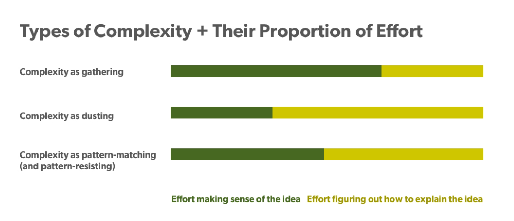
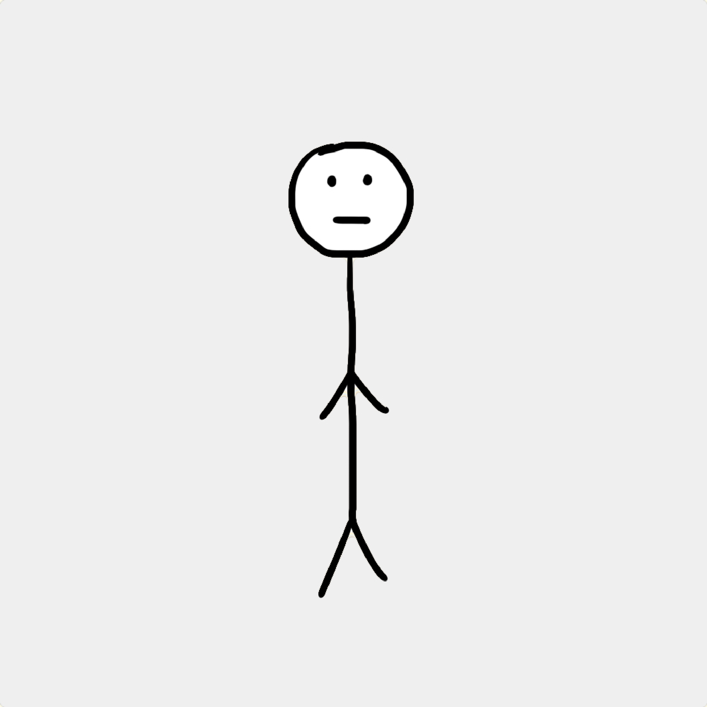
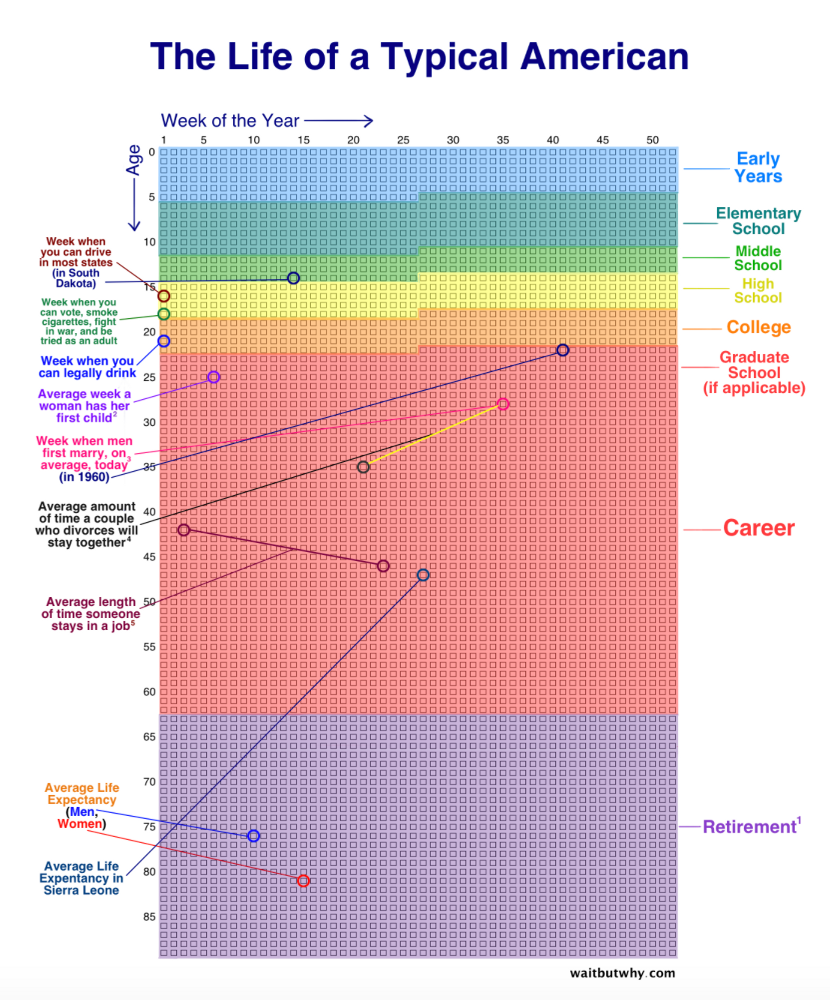
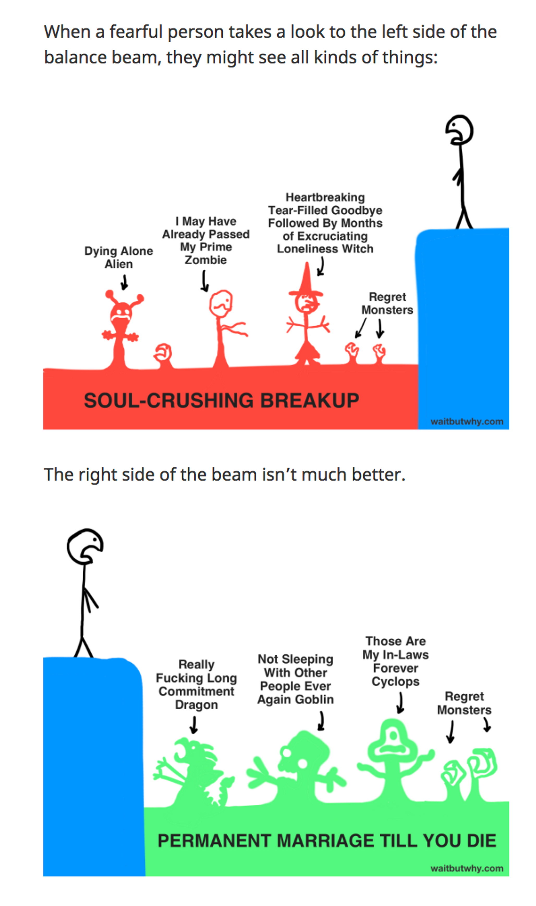

In Bruce Lee’s [final film](https://en.wikipedia.org/wiki/Game_of_Death?ref=review.firstround.com)_,_ his character fights his way to the top of a pagoda, vanquishing foes of different fighting styles on each floor.  

在李小龙的最后一部电影中，他饰演的角色一路打到一座宝塔的顶端，在每一层战胜不同格斗风格的敌人。  

As he ascends, he finds opponents more challenging than the last. On the top floor, he faces the 7’2” Kareem Abdul Jabbar, whose martial arts style and prowess matches his own.  

随着楼层的升高，他发现对手一个比一个更具挑战性。在顶楼，他面对的是身高 7 英尺 2 英寸的卡里姆-阿卜杜勒-贾巴尔，后者的武术风格和实力与他不相上下。  

Lee’s quest is to retrieve something sacred, though it’s never named.  

李的任务是找回一件神圣的东西，尽管它从未被命名。

In the world of content, **[Tim Urban](https://waitbutwhy.com/wait-but-who?ref=review.firstround.com)** is the Bruce Lee of long-form.  

在内容领域，蒂姆-乌尔班是长篇小说界的李小龙。  

In his inimitable style, he tackles the most enigmatic, entangled topics, ranging from [AI](https://waitbutwhy.com/2015/01/artificial-intelligence-revolution-1.html?ref=review.firstround.com) to [procrastination](https://waitbutwhy.com/2013/10/why-procrastinators-procrastinate.html?ref=review.firstround.com), from [cryonics](https://waitbutwhy.com/2016/03/cryonics.html?ref=review.firstround.com) to [picking a life partner](https://waitbutwhy.com/2014/02/pick-life-partner.html?ref=review.firstround.com). The **[Wait But Why](https://waitbutwhy.com/?ref=review.firstround.com)** blogger is now fighting his top-floor challenger: constitutional democracies and the culture of politics.  

他以自己独特的风格，探讨最神秘、最纠结的话题，从人工智能到拖延症，从冷冻疗法到挑选人生伴侣。现在，这位 "Wait But Why "博主正在与他的顶层挑战者--宪政民主和政治文化--进行斗争。  

The sacred at stake each day?  

每天都在危及的神圣？  

Simplifying the complex for the curious — now 600K subscribers and 1M monthly unique visitors.  

为好奇者化繁为简 - 现已拥有 60 万订阅者和 100 万每月独立访客。

In this exclusive interview, Urban shares how he distills and presents complex ideas so they're rich and resonant for others: an act that every startup leader and team must master over and over again.  

在这次独家专访中，Urban 分享了他如何提炼和呈现复杂的想法，使其丰富并引起他人的共鸣：这是每个初创企业领导者和团队必须反复掌握的行为。  

He discusses three common types of complex ideas — and why those distinctions matter in how you unravel them.  

他讨论了三种常见的复杂想法--以及为什么这些区别对你如何解开它们很重要。  

Then, Urban shares how he thinks about explaining difficult concepts to others — and how a 1-10 rating can help.  

然后，Urban 与大家分享了他在向他人解释难懂的概念时是如何思考的，以及 1-10 分值是如何起到帮助作用的。  

Lastly, he offers tips on how to present concepts so that they’re sticky and useful for others.  

最后，他还就如何呈现概念提出了建议，以便使概念具有粘性并对他人有用。  

From editorial team of two to editorial team of two, the Review deeply admires how Wait But Why can extricate and explain.  

从两个人的编辑团队到两个人的编辑团队，《评论》对《Wait But Why》的抽丝剥茧和解释能力深表钦佩。  

Any startup with an equally lean team can learn a lot from Urban and his approach.  

任何拥有同样精干团队的初创企业都可以从 Urban 和他的方法中学到很多东西。

> Our brains want ones and zeros. But the real world is analog, gray area and about spectrums.  
> 
> 我们的大脑需要 1 和 0。但现实世界是模拟的，是灰色地带，是关于光谱的。

## COMPLEXITY ITSELF IS COMPLEX  

复杂性本身就是复杂的

At each turn, startup founders need to learn and convey complex ideas about their company or industry to investors, their teams, customers and the public without losing them — or the nuances of the ideas.  

初创企业的创始人每次都需要学习并向投资者、团队、客户和公众传达有关公司或行业的复杂想法，同时又不能让他们迷失方向，或忽略想法的细微差别。  

It’s not an easy task. Even [tech’s most admired founder](http://stateofstartups.firstround.com/2016/?ref=review.firstround.com#highlights-leaders), Elon Musk, [has turned to Urban to help explain](https://waitbutwhy.com/2017/03/elon-musk-post-series.html?ref=review.firstround.com) the technology he’s building, how he thinks and what’s next.  

这并非易事。就连科技界最令人钦佩的创始人埃隆-马斯克（Elon Musk）也曾求助于乌尔姆来帮助解释他正在开发的技术、他的思维方式以及下一步的计划。

**The first step is to identify** **_what type_** **of complexity you are attempting to unravel**.  

第一步是确定您试图解开的复杂性类型。  

Urban has observed a few main categories of complexity, each defined by the mix of actions needed to untangle it.  

Urban 观察到复杂性主要有几大类，每一类都由解开复杂性所需的行动组合来定义。  

Let’s call them: **complexity as gathering, complexity as dusting** and **complexity as pattern-matching (or pattern-resisting)**. For each, there’s a different allocation of effort and time to disentangle a difficult concept.  

我们把它们称为：作为收集的复杂性、作为除尘的复杂性和作为模式匹配（或模式抗拒）的复杂性。每种方法都需要分配不同的精力和时间，以厘清一个难以理解的概念。

## **Complexity as gathering  

复杂性即聚集**

The first category of complexity requires a researcher’s mindset.  

第一类复杂性需要研究者的思维方式。  

The primary act to defray this type of complexity is collecting: the ability to amass all the material out there to make sense of it.  

消除这种复杂性的主要方法是收集：收集所有材料并从中找出意义。  

Take Urban’s [post on Neuralink](https://waitbutwhy.com/2017/04/neuralink.html?ref=review.firstround.com), Elon Musk’s brain-machine interface development company.  

以 Urban 发表的关于 Neuralink 的文章为例，这是 Elon Musk 的脑机接口开发公司。  

Though it took time to write the post, Urban spent most of his time finding material and learning.  

虽然写这篇文章花了不少时间，但 Urban 把大部分时间都花在了查找资料和学习上。  

Once he gathered what he needed to understand the company and technology, it was relatively straightforward to create a narrative that was structured and easier to digest for others.  

一旦他收集到了了解公司和技术所需的资料，就可以比较直接地编写出有条理、更易于他人消化的叙述。

“I’m convinced that \[Neuralink\] somehow manages to eclipse Tesla and SpaceX in both the boldness of its engineering undertaking and the grandeur of its mission.  

"我深信，\[Neuralink\]无论在工程设计的胆识上，还是在使命的宏伟上，都能让特斯拉和 SpaceX 望尘莫及。  

The other two companies aim to redefine what future humans will do — Neuralink wants to redefine what future humans will be,” says Urban.  

Urban 说："其他两家公司的目标是重新定义未来人类将做什么，而 Neuralink 则希望重新定义未来人类将成为什么。  

“The mind-bending bigness of Neuralink’s mission, combined with the labyrinth of impossible complexity that is the human brain, made this the hardest set of concepts yet to fully wrap my head around — but it also made it the most exhilarating when, with enough time spent zoomed on both ends, it all finally clicked.”  

"Neuralink的使命之艰巨让人匪夷所思，再加上人类大脑的复杂性让人如入迷宫，这是我迄今为止最难完全理解的一组概念，但也是最让我兴奋的，因为当我在两端都花了足够的时间后，一切终于水到渠成了。

When complexity is about gathering sufficient information to be able to digest and explain it to another, it’s a front-loaded process.  

当复杂性是为了收集足够的信息，以便能够消化并向他人解释时，它就是一个前置的过程。  

The bulk of time spent is assembling and sequencing components.  

大部分时间都花在组件的组装和排序上。  

“To explain Neuralink, there are so many things that need to be taught.  

"要解释 Neuralink，需要教的东西太多了。  

It took at least 50% of my time to find and collect that information and learn it.  

我至少花了 50% 的时间来查找、收集和学习这些信息。  

This is classic complexity, where you have something that takes a while to learn in order to explain,” says Urban.  

乌尔班说："这是典型的复杂性，你需要花一段时间学习才能解释清楚。  

“Unlike something that can be explained in two minutes, it’ll take listening hard for a bunch of hours.  

"与两分钟就能解释清楚的事情不同，这需要认真听上几个小时。  

There’s so much education that needs to happen.  

需要进行的教育太多了。  

The goal is to put a structured package into someone’s brain so it lives in a organized way.  

我们的目标是将一个结构化的软件包植入一个人的大脑，使其有条不紊地生活。  

Otherwise it’s a mess two weeks later and they can’t explain the idea.”  

否则，两周后就会一团糟，他们也无法解释这个想法"。

## Complexity as dusting  

复杂性如同除尘

The second type of complexity asks for an archaeologist's hat to be worn; it stresses detective work and determination to find something that’s buried, but ancient: an idea that is less learned and more revealed.  

第二类复杂性要求戴上考古学家的帽子；它强调侦探工作和决心，以找到埋藏在地下但古老的东西：一种少有学问而多有启示的想法。  

A prime example from _Wait But Why_ is Urban’s [cook versus chef concept](https://waitbutwhy.com/2015/11/the-cook-and-the-chef-musks-secret-sauce.html?ref=review.firstround.com). In brief, chef and cook may seem like synonyms, but they’re not. A chef _invents_ recipes; a cook _follows_ recipes.  

Wait But Why》中的一个典型例子就是 Urban 的厨师与主厨概念。简而言之，厨师和主厨看似同义词，其实不然。厨师发明食谱，厨子遵循食谱。  

This idea is complex in its application, as once it’s groked, the concept holds like a principle.  

这个想法在应用中很复杂，因为一旦掌握了它，这个概念就像一个原则。  

For example, it can help explain the difference between creation and innovation.  

例如，它有助于解释创造和创新之间的区别。

The way that Urban landed on this analogy was very much like dusting.  

乌尔班打这个比方的方式很像除尘。  

As he was looking into different topics, he saw the ‘cook and the chef’ concept was under the surface.  

在研究不同的主题时，他发现 "厨师和厨师 "的概念就在表面之下。  

And, once he found it, he asked himself: where is this concept elsewhere?  

找到这个概念后，他问自己：这个概念在其他地方出现过吗？  

And then he saw it everywhere. This type of complexity is backloaded.  

然后，他看到它无处不在。这种复杂性是后负荷的。  

It takes less time to explain, and more time to get it ingrained.  

解释所需的时间更少，而让它深入人心所需的时间更多。  

It’s simple on its own, but complex in how it unlocks other complex ideas.  

它本身很简单，但复杂之处在于它如何开启其他复杂的想法。

“‘The cook and the chef’ is an unbelievably simple concept that I can explain to someone in two minutes and they understand it.  

"'厨师和主厨'是一个简单得令人难以置信的概念，我可以在两分钟内向别人解释清楚，他们也能理解。  

So the complex part isn't that.  

因此，复杂的部分并不在于此。  

The complex part is how you know ‘the cook and the chef’ is a first principle,” says Urban.  

复杂的部分在于你如何知道'厨师和主厨'是第一原则，"Urban 说。  

“If you start looking for it, you’ll see the chef/cook thing happening everywhere.  

"如果你开始寻找，你会发现厨师/厨子的事情到处都在发生。  

There are chefs and cooks in the worlds of music, art, technology, architecture, writing, business, comedy, marketing, app development, football coaching, teaching, and military strategy.”  

在音乐、艺术、技术、建筑、写作、商业、喜剧、营销、应用程序开发、足球教练、教学和军事战略等领域，都有厨师和厨子"。

The challenge with this type of complexity is explaining the idea in a way that people not only understand it, but how to apply it.  

这种复杂性所面临的挑战是如何解释这种想法，让人们不仅理解它，而且知道如何应用它。  

“If you can just explain it to someone, they don't know what to do with it.  

"如果你只是向别人解释，他们不知道该怎么做。  

They can kind of internalize it, but then forget it the next day.  

他们可以把它内化，但第二天就会忘记。  

If you’ve explained it, you've just done step one of 20,” says Urban.  

如果你解释清楚了，你就完成了 20 步中的第一步，"Urban 说。  

“The next 19 steps are the hard part, which is getting to a place where people deeply internalize the concept in the different ways that it manifests in life — and that they have words that they can assign to it and visuals so they can really envision the concept.  

"接下来的 19 个步骤才是最难的部分，那就是让人们通过生活中的不同表现形式来深刻地内化这一概念--让他们有可以赋予这一概念的词语和视觉效果，从而真正地设想这一概念。  

To me, it's getting that concept deep into someone's psyche — not just into their understanding, but into their intuition.”  

对我来说，就是要让这个概念深入别人的心灵--不只是深入他们的理解，而是深入他们的直觉"。

> Parsing complexity is like finding a fossil and realizing it’s part of a skeleton, a framework that can support life.  
> 
> 解析复杂性就像发现一块化石，然后意识到它是骨架的一部分，是支撑生命的框架。

## Complexity as pattern-matching (and pattern-resisting)  

作为模式匹配（和模式抵制）的复杂性

Then there’s complexity that blends a bit of the first two: it’s not front-loaded or back-loaded, but a slog throughout.  

还有一种复杂性则融合了前两种复杂性的一些特点：它不是前重后轻，而是自始至终都很艰难。  

The gathering of information happens throughout the learning and explaining process.  

信息的收集贯穿于整个学习和讲解过程。  

You’re dusting for the simple, rich idea that’s inevitably part of a complex string of ideas.  

你在寻找简单而丰富的想法，而这些想法必然是一连串复杂想法的一部分。  

The challenging work is assigning each new bit of information to a pattern and then — and only then — deciding if that pattern should be included or resisted.  

具有挑战性的工作是将每一条新信息分配到一个模式中，然后--也只有这样--才能决定该模式应该被包含还是被抵制。

The best example of this from Urban’s writing is likely one that’s yet to come: one that he’s working on about democracy, tyranny and the culture of politics.  

乌尔班写作中最能体现这一点的可能是他正在创作的一部关于民主、暴政和政治文化的作品。  

“With something like society, it's going to take me forever because it's going to be me trying to find the pattern — the honest pattern — in a whole mess of analog complexity and uniqueness.  

"对于像社会这样的东西，我会花上很长的时间，因为这将是我试图在纷繁复杂、独一无二的模拟中找到模式--真实的模式。  

It’s hard to do without being reckless because you can carelessly find patterns and there’s already a bunch of preset patterns set by political rules and tribes,” says Urban.  

Urban说："要做到不鲁莽是很难的，因为你会不经意地发现一些模式，而政治规则和部落已经预设了很多模式。  

“If you really look hard, you can find patterns that aren't that obvious, but that are really important to notice.”  

"如果你真的仔细观察，你会发现一些并不明显，但却非常重要的规律"。

But even once you finally find those patterns within a complicated concept like society, it’s also complex to decide how to share those observations.  

但是，即使你最终在社会这样一个复杂的概念中找到了这些模式，要决定如何分享这些观察结果也是很复杂的。  

“If I'm explaining AI, I'm gonna have a bunch of people reading with a humble eye, saying ‘Yeah I don't understand it, I want to get it better.’ But if you're trying to explain something in politics, people don't understand it any better, but they _think_ they do.  

"如果我在解释人工智能，就会有很多人带着谦虚的眼光看我，说'是啊，我不懂，我想更好地理解它'。'但如果你试图解释政治方面的东西，人们并不会理解得更透彻，但他们自以为理解得很透彻。  

Everyone immediately puts on their ‘uniforms,’ whether it's politics, religion, or some kind of ideology,” says Urban.  

每个人都会立即穿上自己的'制服'，无论是政治、宗教还是某种意识形态，"Urban 说。  

“There's no humility, and there's a real delusion about your own expertise in that world.”  

"一点都不谦虚" "对自己在这个世界上的专业技能充满幻想"

## The Three Complexities in Summary  

三大复杂性综述

For those seeking to convey complex ideas to others, start by identifying _how_ it’s complex to more efficiently simplify the concept to others.  

对于那些希望向他人传达复杂想法的人来说，首先要明确想法是如何复杂的，才能更有效地向他人简化概念。  

Urban has observed that it often takes him the same amount of time to disentangle a difficult idea.  

根据 Urban 的观察，他往往需要花费同样多的时间来厘清一个困难的想法。  

What’s different is the _type and proportion of effort_ needed to crack the case — knowing that ratio can help you better tackle complex ideas.  

不同的是破案所需的努力类型和比例--了解这一比例可以帮助你更好地处理复杂的想法。

Many topics are just straight-up complex. They’re going to take a while to figure out.  

许多主题都非常复杂。要花点时间才能弄明白。  

Ideas that fall into these different categories of complexity often take me the same amount of time.  

属于这些不同复杂类别的想法往往会花费我同样多的时间。  

But your goal — especially if you’re time-strapped as a founder or scrappy startup — is to have it _not take longer than it should_. Any of these three types of complexity require a sustained state of effort to figure out.  

但你的目标--尤其是如果你作为创始人或苟延残喘的初创企业时间紧迫的话--是不要让它花费比它应该花费的时间更长的时间。这三种复杂性中的任何一种都需要持续的努力才能解决。  

But it’s the composition and balance of effort that’s the key.  

但关键在于努力的构成和平衡。

## WHO ARE YOU CUTTING THROUGH COMPLEXITY FOR?  

你在为谁打破复杂性？

A taxonomy of complexity is great for defining how to approach an idea — but once you have a sense of its categories, you have to be clear on how you’ll explain it to someone else.  

复杂性分类法对于确定如何处理一个想法非常有用，但一旦你对其类别有了一定的了解，你就必须清楚如何向别人解释它。

Here are the questions to ask:  

下面是要问的问题：

**What’s the goal for you as a learner or explainer of the idea?** “If I'm teaching a PhD course, I need to get to a level beyond what experts know — to a super level — so I can get people with an already advanced understanding to where they can do original work in a specific field of science,” says Urban.  

作为思想的学习者或解释者，你的目标是什么？"Urban说："如果我教授的是一门博士课程，我需要让学生达到超出专家所知的水平--超水平--这样我才能让学生在已经有了很高的理解能力后，在特定的科学领域开展原创性工作。  

“With Wait But Why, that’s not my goal.  

"对于《等着看好戏》，这不是我的目标。  

My goal is to bring readers up to a level of clarity and understanding about a complex idea _that they don’t need to be an expert on_, but which they can be knowledgeable enough to talk about it, ask questions about it and have independent thoughts about it — whether it’s something in politics, tech or psychology.”  

我的目标是让读者对一个复杂的概念有清晰的认识和理解，他们不需要成为这方面的专家，但他们可以有足够的知识来谈论它、提出问题并对它进行独立思考--无论是政治、科技还是心理学方面的问题。

So what does this mean for the founder who’s trying to explain her technology to an investor?  

那么，这对试图向投资者解释其技术的创始人意味着什么呢？  

Or a hiring manager communicating his company’s emerging technology to a candidate?  

还是招聘经理向应聘者介绍公司的新兴技术？

**Pinpoint where on a 1-10 scale the recipient of your explanation falls:  

指出接受你解释的人在 1-10 级中的位置：**

-   **10** - Is world’s leading expert on the idea.  
    
    10 - 是世界领先的思想专家。
-   **9** - Can ask expert questions and generate new information/data on the idea.  
    
    9 - 能向专家提问，并能就该想法提出新的信息/数据。
-   **8** - Can answer expert questions and reconcile contradictory thoughts about the idea.  
    
    8 - 能回答专家提出的问题，并能调和与观点有关的相互矛盾的想法。
-   **7** - Can answer any layman’s question and forms independent thoughts on the idea.  
    
    7 - 能回答任何外行人的问题，并形成独立的想法。
-   **6** - Can answer any layman’s question and forms intelligent opinions on the idea.  
    
    6 - 能回答任何外行人的问题，并能就有关想法形成明智的观点。
-   **5** - Knows about the idea, and can discern inaccurate statements about the idea.  
    
    5 - 了解该观点，并能辨别有关该观点的不准确说法。
-   **4** - Knows about the idea, and can explain what’s been learned in one’s own words.  
    
    4 - 了解想法，并能用自己的话解释所学内容。
-   **3** - Heard of the idea, and recites what others have said about it.  
    
    3 - 听说过这一想法，并能背诵别人对它的评价。
-   **2** - Heard of the idea, but doesn’t know anything about it.  
    
    2 - 听说过这个想法，但一无所知。
-   **1** - Never heard of the idea.  
    
    1 - 从未听说过这个想法。

**First, find yourself on the scale before digging into a complex idea**.  

首先，在深入研究一个复杂的想法之前，要先找到自己的尺度。  

Inspired by how Urban gives numerical rankings to levels of understanding, try this scale to rate your comprehension of a given topic.  

受 Urban 给理解程度进行数字排名的启发，您可以尝试用这个量表来评价自己对某个主题的理解程度。  

“I might start at two or three when I get into topics, and my goal is to get to a minimum of six — maybe a seven, but probably a six.  

"我的目标是至少达到六分，也许是七分，但很可能是六分。  

Here, I can answer any layman’s question, and I have intelligent opinions, but can be humbled, too,” says Urban.  

乌尔班说："在这里，我可以回答任何外行人的问题，我有睿智的见解，但也会谦虚。  

“When an expert says something that contradicts what I think, I'm gonna listen hard and I'm gonna object.  

"当专家说的话与我的想法相悖时，我会认真倾听并提出异议。  

I’m not gonna automatically believe it, but I’m going to take it into account and maybe revise my own conclusion.  

我不会自动相信它，但我会把它考虑进去，也许会修正我自己的结论。  

I find it so fun to have a six level of understanding.  

我觉得能有六种不同程度的理解是一件非常有趣的事情。  

Suddenly, everything you read on the topic is interesting.  

突然间，你读到的关于这个话题的一切都变得有趣起来。  

You can stick onto that foundation that you've built.”  

你可以坚持你已经建立的基础"。

**The second person to plot on the scale is the recipient of the idea.** For Urban, that’s his Wait But Why reader, but for you, it may be your customer.  

刻度上的第二个人是创意的接受者。对于 Urban 来说，这就是他的《Wait But Why》的读者，但对于你来说，这可能是你的客户。  

“I see the value and fun in having a level six understanding, so it’s my goal to deliver that to readers, too.  

"我看到了六级理解的价值和乐趣，所以我的目标也是向读者传递这种价值和乐趣。  

I want them to join the party, to think independently about a topic with me or each other,” says Urban, who caters to the other ‘Tims” out there.  

我希望他们能加入派对，与我或彼此一起独立思考一个话题。"Urban 说，他迎合了其他 "Tims "的需求。  

“A ‘Tim’ is a certain type of person: one who really likes being a ‘six,’ but doesn't really want to be at an ‘eight.’ Look, I'm not that unique of a human.  

"'蒂姆'是某种类型的人：他很喜欢当'六分'，但并不想当'八分'。听着，我不是那么独特的人。  

I'm very curious. I'm not an expert on stuff.  

我很好奇。我不是这方面的专家。  

I get bored if things get too technical, but I get very excited about having a fundamental understanding of something.  

如果技术性太强，我就会感到厌烦，但如果对某件事情有了基本的了解，我就会非常兴奋。  

To me, I'm never gonna run out of those people.”  

"对我来说，这些人永远都用不完"

**Then, compare the ascent needed as a learner to the ascent needed as an explainer.** In Urban’s case, his goal is to transport his Wait But Why readers to the same level he’s hit, but just faster (as will be explained later).  

然后，将学习者所需的提升与解释者所需的提升进行比较。就 Urban 而言，他的目标是让他的《Wait But Why》读者达到与他相同的水平，只是速度要更快（稍后会解释）。  

Urban recognizes that his situation is rare in that generally his readers and he travel the ‘same distance.’ That’s not true for all ventures, but the assessment of the market opportunity is the same.  

Urban 认识到，他的情况很罕见，因为他的读者和他一般都是 "同路人"。并非所有企业都是如此，但对市场机遇的评估是相同的。

“If I start dumbing it down a little and trying to get people to a four, I'll win over a bunch of new people who aren't gonna read such a long article.  

"如果我开始把文章写得简单一些，并试图让人们读到四开，我就会赢得一批新读者，他们不会读这么长的文章。  

The people who actually really want what I want will then get disappointed, so why would I do that?” asks Urban.  

那些真正想要我想要的东西的人会失望的，我为什么要这么做呢？  

“There's lots of explainer sites that try to get you from a one to a three, but the people who want to get to a six are an underserved audience in my opinion.  

"有很多解说网站试图让你从 1 分升至 3 分，但在我看来，想要达到 6 分的人是未得到充分服务的受众。  

I know that because I'm one of those people.”  

我知道这一点，因为我就是这样的人"。

The bottom line: use the scale to map your buyers’ current level of understanding to the type of knowledge they need in order to buy.  

底线：使用量表将买家当前的理解水平与他们购买时所需的知识类型相匹配。  

Your goal is to find the the minimal viable understanding they need to take the action you want to trigger, whether that’s a purchase of a product or a vision for the future.  

您的目标是找到他们所需的最基本的可行理解，从而采取您想触发的行动，无论是购买产品还是对未来的憧憬。  

“Take Elon.  

"就拿伊隆来说吧。  

He wants to fire up the masses about something he knows they would care about if they just understood it.  

他想让群众了解一些他知道只要他们了解就会关心的事情。  

That's his goal with content. Not about how cool the specs are in a Tesla.  

这就是他做内容的目的。而不是特斯拉的配置有多酷。  

But why energy, multiplanetary colonization and AI safety matters.  

但是，为什么能源、多行星殖民和人工智能安全很重要？  

He wants to get their heads in the right place 20 years earlier than they probably otherwise would,” says Urban.  

乌尔班说："他想让孩子们提前 20 年进入正确的学习状态。  

“For others who are trying to sell a new kind of nutrition, their goal might be to educate a certain target audience who they know cares about nutrition but they don't understand that they have a misconception.  

"对于其他试图销售一种新型营养品的人来说，他们的目标可能是教育某个目标受众，因为他们知道这些受众关心营养问题，但他们不了解自己的误解。  

The goal is to clear that up. In sum, start with: Who is the audience I'm trying to reach?  

我们的目标就是要澄清这一点。总之，要从以下几点入手：我想接触的受众是谁？  

Where are they starting on that 1-10 scale?”  

他们在 1-10 级中的起点是什么？

Wait But Why's Tim Urban  

《等一下，为什么》的蒂姆-厄本

## PRESENTING COMPLEX IDEAS TO OTHERS  

向他人介绍复杂的想法

It takes Urban an average of 160 hours to learn everything he needs to learn about a topic to write a post. But he knows no one is going to spend as many hours reading as he spent learning.  

Urban 平均要花 160 个小时来学习关于一个主题的所有知识，才能写出一篇文章。但他知道，没有人会像他一样花那么多时间去阅读。  

Urban knows he’s lucky if a reader will spend two hours reading his post, so his challenge is to present complex topics in a way that readers can learn 80x faster than he did.  

Urban 知道，如果读者愿意花两个小时阅读他的文章，那他就很幸运了，所以他面临的挑战是如何用一种读者能比他快 80 倍的速度学会的方式来呈现复杂的话题。

He prefers to describe the learning-turned-teaching process through an analogy.  

他更喜欢通过类比来描述从学习到教学的过程。  

“The learning process for me is that I'm blindfolded.  

"对我来说，学习的过程就是蒙上眼睛的过程。  

I'm feeling around trying to figure out where the trees are.  

我四处摸索，试图找出树的位置。  

The blindfold starts to come off as I start to learn more, and eventually I can see the general area,” says Urban.  

随着学习的深入，我的眼罩开始脱落，最终我可以看到大致的区域，"Urban 说。  

“Then I get in the helicopter and I start going up, and eventually I can see the whole picture.  

"然后我坐上直升机，开始往上飞，最终我可以看到整个画面。  

Eventually I'm in an airplane and I can see the entire picture and understand it super well, and I can see not just what the trees are, but the context around them and why they're important.”  

最终，我在飞机上就能看到整个画面，并且理解得非常透彻，我不仅能看到树是什么，还能看到它们周围的环境，以及它们为什么重要"。

So how can you navigate your way from blindfold to atmosphere?  

那么，如何才能从蒙眼到大气层呢？  

Gleaned from Urban’s experience, here are ways to help you better present complex ideas.  

根据 Urban 的经验，以下方法可以帮助你更好地表达复杂的想法。

## Stretch the zipline.  

拉长滑索

The shortest distance through any landscape is typically as the crow flies.  

在任何景观中，最短的距离通常是乌鸦飞过的距离。  

Up in Urban’s helicopter, there’s greater clarity in how to most quickly get from point A to B.  

在乌尔姆的直升机上，如何最快速地从 A 点到达 B 点更加清晰明了。  

His [post on cryonics](https://waitbutwhy.com/2016/03/cryonics.html?ref=review.firstround.com) — freezing oneself after death — is a good example. “When I started, I just had no idea.  

他关于冷冻技术（死后冷冻自己）的文章就是一个很好的例子。"刚开始的时候，我一无所知。  

I was reading all about life extension, about cells and blood, and current medical technology.  

我读的都是关于生命的延续、细胞和血液以及当前的医疗技术。  

It was all a mess,” says Urban.  

一切都乱糟糟的，"Urban 说。  

“But by the time I was done, I realized there’s a clear throughline here, which is: _the definition of death is not what you think it is_. The way we define death is: when today's medical technology cannot save you.  

"但当我读完之后，我意识到这里有一条清晰的主线，那就是：死亡的定义并不是你所想的那样。我们对死亡的定义是：当当今的医疗技术无法拯救你的时候。  

When that happens, we call you dead.  

一旦发生这种情况，我们就叫你死了。  

But the actual definition of death of a human — if you consider a human to be their brain, personality, memories, talents and intelligence and all the other things that make them them — is just a hard drive in your head.  

但人类死亡的实际定义--如果你认为人类是指他们的大脑、个性、记忆、才能和智慧以及所有其他使他们成为人类的东西--只是你脑袋里的一个硬盘。  

And it's just based on the arrangement of the atoms that make up your brain.  

这只是基于组成大脑的原子排列。  

That arrangement is you, in my opinion.”  

在我看来，这种安排就是你。"

Once Urban understood that, he knew what he had to do.  

一旦 Urban 明白了这一点，他就知道自己该怎么做了。  

“I needed to change people’s conception of what death means — of the kind of core values behind life extension.  

"我需要改变人们对死亡的概念--改变人们对生命延续背后的核心价值的概念。  

I had to show that it's not vanity and narcissism any more than fighting cancer is.  

我必须证明，这不是虚荣和自恋，就像抗击癌症一样。  

It's courageous. It's the spirit of loving life that makes you want life extension.  

这是一种勇气。是热爱生命的精神，让你渴望生命的延续。  

I had to get rid of that stigma,” says Urban.  

我必须摆脱这种耻辱感。  

“Second, I had to make a case for a redefinition of death.  

"其次，我必须为重新定义死亡提出理由。  

I had to define it as when the physical atoms in your brain have deteriorated to the point that arrangement is no longer not just not there, but no longer recoverable by even the most fancy future scientists.  

我不得不把它定义为，当你大脑中的物理原子退化到一定程度时，安排就不再是不存在，而是即使是未来最出色的科学家也无法恢复了。  

_Now_ you’re gone and nothing can bring you back. _That’s_ really far past the point where we consider someone dead.  

现在你走了，没有什么能让你回来。这已经远远超出了我们认为一个人已经死亡的程度。  

That person, in my definition of death, is alive.  

按照我对死亡的定义，那个人还活着。  

And they're right there, the arrangement of their atoms in their brain is right there for anyone to figure out — it's just sitting there, but then we let it deteriorate into something that's nonrecoverable.”  

他们就在那里，他们大脑中原子的排列就在那里，任何人都可以弄清楚--它就在那里，但我们却让它退化成无法复原的东西。

## Write for the layman you were (especially if you’re now an expert).  

为你曾经的门外汉写作（尤其是如果你现在是专家的话）。

To present these points in the post, Urban needed to stretch his line of thinking from where a reader might be who hasn’t thought about or agreed with cryonics to one who had.  

为了在文章中阐述这些观点，Urban 需要把他的思路从一个没有考虑过或同意冷冻学的读者延伸到一个已经考虑过或同意冷冻学的读者。  

When he had that trajectory established, it became about sequencing the facts: from the science behind cryonics to what it means to die to what happens to your body, to what death may mean in the future.  

当他确定了这一轨迹后，就开始对事实进行排序：从冷冻背后的科学到死亡意味着什么，到你的身体会发生什么，再到死亡在未来可能意味着什么。  

“So I'm gonna go chronologically and explain these things — and so 80% of what I learned at that point got cut out of the post because it just wasn't relevant.  

"所以我要按时间顺序来解释这些事情--所以我当时学到的东西有 80% 都被删掉了，因为这些东西根本不相关。  

All the paper research on Alzheimer's or strokes.  

所有关于老年痴呆症或中风的论文研究。  

It helped me understand stuff a little bit, but it wasn’t critical.  

它帮助我理解了一些东西，但并不重要。  

So after four weeks of research, I had packaged it into something that was tight.  

因此，经过四周的研究，我把它包装成了一个严密的东西。  

I could basically use my own hindsight and say, this took 150 hours, but if I could do it in two hours over, here's what I would need to learn.”  

我基本上可以用我自己的后见之明说，这花了 150 个小时，但如果我能用两个小时完成，我需要学习的就是这些"。

> Of course you're a layman. It doesn't matter how smart you are.  
> 
> 你当然是个门外汉。你有多聪明并不重要。  
> 
> Everyone in the world is a layman at most stuff.  
> 
> 世界上的每个人在大多数事情上都是门外汉。

When Urban writes his posts, he appears to be in a special limbo: **both wanting to understand any layman’s question while retaining the ability to remember what it’s like to be a layman**.  

乌尔班在写文章时，似乎处于一种特殊的边缘状态：既想理解任何外行人的问题，又能保持回忆外行人的能力。  

This is the key not only to humility, but to being able to orient any reader within a complex topic.  

这不仅是谦逊的关键，也是能够在复杂的主题中为任何读者指明方向的关键。  

“For something like AI, a lot of articles start with an assumption that I already know what AI is — and I actually didn't.  

"对于人工智能这样的东西，很多文章一开始都假设我已经知道人工智能是什么--而实际上我并不知道。  

I always felt like that shut part of my brain off right away as I read.  

我在阅读时总觉得大脑的一部分马上就被关闭了。  

I never felt oriented,” says Urban. “For cryonics, I knew that right away. I felt skeptical.  

乌尔班说："我从未感觉到自己是有方向的。"对于冷冻技术，我立刻就明白了这一点。我感到怀疑。  

And it seemed like it was both impossible and kind of ridiculous.  

这似乎既不可能，又有点可笑。  

So for AI, I want to start and build that initial definition of AI — and distinguish it from robots and what the movies make us think AI is.”  

因此，对于人工智能，我希望开始并建立人工智能的初步定义--并将其与机器人和电影中让我们认为的人工智能区分开来"。

If you read Wait But Why, you see that he signals to readers — subtly or overtly — when he doesn’t know something.  

如果你读过《等一等，为什么》，你就会发现，当他不知道某件事情时，他会向读者发出信号--或隐晦，或明显。  

He tries to explain it immediately and address any other early confusion points.  

他试图立即解释，并解决其他早期困惑点。  

That gets readers’ guards down, so they trust his orientation. **Your goal is to get by that wall of skepticism — the belief that the piece wasn’t written for them**.  

这样读者就会放松警惕，从而相信他的取向。你的目标是克服怀疑的障碍--让读者相信这篇文章不是写给他们看的。

## Make points viscerally — not just visually.  

直观地表达观点，而不仅仅是视觉上的。

They say a picture is worth a thousand words.  

俗话说，一图胜千言。  

But Urban uses both images and an ambitious word count, so his visuals need to achieve something more.  

但是，Urban 既使用了图像，也使用了雄心勃勃的字数，因此他的视觉效果需要达到更高的要求。  

Here are his reasons for choosing the types of illustrations he does — and tips for how to use graphics to great effect.  

以下是他选择插图类型的理由，以及如何使用图形达到最佳效果的技巧。

**Ground the fireworks.** Visual simplicity is critical to Urban.  

烟花落地。视觉上的简洁对 Urban 来说至关重要。  

“A lot of times, I look at a visual and there's some fancy looking computer graphics, but the actual information in it is lacking.  

"很多时候，我看到的视觉效果都是一些花哨的电脑图形，但其中的实际信息却很匮乏。  

If you stripped out all the graphics and you put the actual information in a simple Excel table, you realize that there's not really that much information there,” says Urban.  

Urban 说："如果剔除所有图形，把实际信息放在一个简单的 Excel 表格中，你就会发现其实并没有那么多信息。  

“When you dress up all these empty graphics to put out a beautiful infographic, that's the wrong thing to focus on.”  

"当你把这些空洞的图形包装成精美的信息图表时，这就是错误的关注点"。

As an experiment, pull out all the numbers from a graphic and put it in a spreadsheet.  

作为一项实验，将图表中的所有数字提取出来，放入电子表格中。  

Now compare the fancy graphic to the chart and ask yourself:  

现在，请对比花哨的图形和图表，扪心自问：

-   Is it well-worded or a bit redundant?  
    
    是措辞得当还是有点多余？
-   Is it an elegant capture of the data, or presenting or masking partial data?  
    
    是优雅地捕捉数据，还是呈现或掩盖部分数据？
-   Does it properly categorize or erroneously conflate points?  
    
    是正确分类还是错误混淆？

These questions can help show you if a graphic is augmenting a complex idea.  

这些问题可以帮助您了解图形是否对复杂的想法起到了辅助作用。  

A perfect illustration of this is Urban’s [blocks of time post](https://waitbutwhy.com/2016/10/100-blocks-day.html?ref=review.firstround.com).  

Urban 的 "时间块 "帖子就是一个很好的例子。  

In this case, the visual layout of the data was just a bunch of blocks, but the distance between them really made the point.  

在这种情况下，数据的可视化布局只是一堆块，但它们之间的距离却真正体现了这一点。  

A paragraph would have been much harder for most people to absorb the magnitude of the idea.  

对于大多数人来说，用一个段落来概括这个想法的重要性要困难得多。

The Life of a Typical American  

典型美国人的生活

Often just a simple hand-drawn arrow seems like a teacher in a classroom teaching you something versus flash-bang marketing material.  

通常情况下，一个简单的手绘箭头就像一位老师在课堂上向你传授知识，而不是昙花一现的营销材料。  

“I don't try to pretend to do fancy, well-produced visuals.  

"我不会装模作样地制作花哨、制作精良的视觉效果。  

I do it like I’d teach a friend if I had a napkin at a restaurant.  

我的做法就像我在餐厅给朋友教餐巾纸一样。  

Good tutors are not coming in with a bunch of marketing things; they're drawing with different colors and simple lines on a whiteboard,” says Urban.  

Urban说："优秀的辅导教师不会带着一大堆市场营销的东西来，他们会在白板上用不同的颜色和简单的线条作画。  

“So I try to do that for explanations.  

"所以，我试着做这样的解释。  

A lot of the times, you're trying to capture a complex psychological concept or whatever it is and there's characters involved in which case I'm going to create funny drawings.  

很多时候，你试图捕捉一个复杂的心理概念或其他什么东西，其中涉及到人物，在这种情况下，我就会创作出有趣的图画。  

I'm going to create stick figure people or stick figure animals because to me if you can delight people a little bit, if they smile or they're laughing while they're looking at that, it's gonna stick a lot better.  

我打算创作棒图人物或棒图动物，因为在我看来，如果你能让人们高兴一点，如果他们在看的时候微笑或大笑，那就会更有黏性。  

It just is.”  

就是这样"。

**Bust a gut.** You don’t need to be the Dave Chapelle of data, but find the edge of humor in your story.  

大胆尝试。你不需要成为数据界的戴夫-查佩尔（Dave Chapelle），但要在你的故事中找到幽默的边缘。  

That’s often where you can accelerate an explanation or make it resonate.  

这往往是你可以加快解释或引起共鸣的地方。  

“Think about your favorite funny TV show that you haven't seen in ten years.  

"想想你最喜欢的搞笑电视节目，你已经有十年没看过了。  

You can probably recite 20 lines from it and tell me about all the different episodes.  

你大概能背出其中的 20 句台词，并告诉我所有不同的情节。  

When something delights you, it's with suspense or humor.  

当一件事让你感到愉悦时，它就会充满悬念或幽默。  

Your brain locks in because it's being delighted and it's gonna replay the funny or riveting moments again and again.  

你的大脑会被锁定，因为它被取悦了，它会一遍又一遍地重放那些有趣或引人入胜的片段。  

If it feels like work to your brain, it's not gonna remember it.  

如果你的大脑感觉像是在工作，它就不会记住它。  

I'm sure some people check out when they get to a silly diagram and that's fine.  

我相信有些人在看到愚蠢的图表时就会退出，这也没什么。  

That's not for everyone, but for me I'm gonna learn and remember it better that way.”  

这不是每个人都能做到的，但对我来说，这样能更好地学习和记忆"。

The Marriage Decision  

婚姻裁决

## Pick the protagonist that gets you to the end.  

选择能让你走到最后的主人公。

For Urban, the hardest part can be choosing the character that will carry forth his point — with the right balance of gravity and hilarity.  

对于 Urban 来说，最难的部分可能是选择一个能表达他的观点的角色--兼顾严肃性和搞笑性。  

Sometimes that’s an anonymous stick figure. Other times it’s him.  

有时候，那是一个匿名的棍子图。有时是他。  

But selecting a messenger to deliver the story is often the hardest part.  

但是，选择故事的传递者往往是最难的部分。  

Here are some of the questions that can help you find your narrator:  

以下是一些可以帮助您找到叙述者的问题：

-   Who is taking the reader by the hand?  
    
    是谁牵着读者的手？
-   Is it me or a a storytelling character?  
    
    是我还是一个故事人物？
-   Is the narrator behind the scenes?  
    
    解说员在幕后吗？
-   Where can/should they start?  
    
    他们可以/应该从哪里开始？
-   What's the game you're playing?  
    
    你在玩什么游戏？
-   What voice are you using? Which emotions?  
    
    你用的是什么声音？哪种情绪？
-   Is their job to show or to tell?  
    
    他们的工作是展示还是讲述？

There’s not one answer — and Urban admits that it’s _the_ challenge of presenting a complex idea. “Honestly, I'm not good at this.  

答案不是唯一的--Urban 承认，这正是提出一个复杂想法所面临的挑战。"老实说，我不擅长这个。  

That's why it takes me forever. It's not something that just comes to me,” says Urban.  

这就是为什么我需要花很长时间。Urban说。  

“I sit there and I toil for sometimes weeks trying to get a structure that fits.  

"我坐在那里，有时要花上几个星期的时间，努力弄出一个合适的结构。  

I don't want it to be just be functional.  

我不希望它只是功能性的。  

I want it to get all of the information across in a structured way.”  

我希望它能有条理地传递所有信息"。

To show different approaches to topics, Urban juxtaposes his [procrastination](https://waitbutwhy.com/2013/10/why-procrastinators-procrastinate.html?ref=review.firstround.com), [cryonics](https://waitbutwhy.com/2016/03/cryonics.html?ref=review.firstround.com) and [SpaceX](https://waitbutwhy.com/2015/08/how-and-why-spacex-will-colonize-mars.html?ref=review.firstround.com) posts. “So with procrastination, there are core forces that battle against each other in my head.  

为了展示处理主题的不同方法，Urban 将他的 "拖延症"、"冷冻疗法 "和 "SpaceX "文章并列在一起。"对于拖延症，我的脑海中有几股核心力量在相互斗争。  

So rather than describe the psychology and the structures of the brain where they come from, let's make it what they really are: very memorable and funny characters that’s way better than just explaining the psychology of something — and way more fun to read and memorable.  

因此，与其描述他们来自哪里的心理学和大脑结构，不如让他们真正成为：非常令人难忘和有趣的人物，这比单纯解释心理学要好得多--而且读起来更有趣，更令人难忘。  

There’s the instant gratification monkey or the panic monster.  

有急功近利的猴子，也有惊慌失措的怪物。  

Their names were descriptives and they were drawn with humor so readers remembered them,” says Urban.  

Urban说："他们的名字都是描述性的，而且画得很幽默，这样读者就能记住他们。  

“But with cryonics, there's no characters. I could have said, ‘Here's Joe.  

"但冷冻疗法没有人物。我可以说，'这是乔。  

Joe wants to live this long.’ But that cuteness would have gotten in the way of the job: the conception of death.  

乔想活这么长的时间'。但这种可爱会妨碍工作：死亡的孕育。  

You don't need Joe; he’s a distraction, I just need to look the reader in the eye, talk to them, and explain some shit.  

你不需要乔，他只会让你分心，我只需要看着读者的眼睛，跟他们说话，解释一些屁话。  

With SpaceX, there was a lot to talk about so I need to get people to buy in at the very beginning by giving them a hint where we’re going because some people will drop off because it’s too long.  

对于 SpaceX，要谈的东西很多，所以我需要在一开始就给他们一个提示，让他们接受我们的内容，因为有些人会因为太长而放弃。  

But people will start to get hooked if they understand the arc of the story — and that it’s gonna be really fun at the end.”  

但是，如果人们了解了故事的弧度，就会开始上瘾--最后会非常有趣"。

> Great narrators are comprehensive symbols. To remember them is to recall the entire concept.  
> 
> 伟大的叙述者是全面的象征。记住他们，就是记住了整个概念。  
> 
> But if they don’t represent the full notion, the narrator loses part of the idea.  
> 
> 但如果它们不能代表完整的概念，叙述者就会失去部分概念。  
> 
> And then you’ll lose part of your audience.  
> 
> 这样你就会失去部分观众。

## TYING IT ALL TOGETHER  

一气呵成

When thinking of an idea that’s hard to understand, it’s tempting to think of complexity in a singular way.  

当想到一个难以理解的想法时，我们很容易以一种单一的方式来看待复杂性。  

Instead consider it in three distinct forms: complexity as gathering, complexity as dusting, and complexity as pattern-matching (and pattern-resisting).  

相反，我们可以将其分为三种不同的形式：作为收集的复杂性、作为除尘的复杂性以及作为模式匹配（和模式抵制）的复杂性。  

Each type of complexity is defined by the act most needed to unravel it.  

每种类型的复杂性都是由解开复杂性最需要的行为所决定的。  

Next, on a scale from oblivious (1) to leading expert (10), map your intended starting and ending point for both your audience and yourself.  

接下来，按照从 "漠不关心"（1）到 "顶尖专家"（10）的等级，为受众和你自己绘制出你想要的起点和终点。  

Very rarely must you take someone from 1 to 10, but it’ll benefit you to know — and own — the segment of the journey that you take your reader.  

你很少必须把一个人从 1 带到 10，但了解--并拥有--你带领读者走过的这段旅程会让你受益匪浅。  

Lastly, when presenting a complex topic, adhere to a few rules of thumb: pass on the bell and whistles, delight through levity, and pick a protagonist like a racehorse: one that’ll get you to the end.  

最后，在介绍一个复杂的主题时，要遵守几条经验法则：不要用铃声和口哨声，通过轻松的方式让人愉悦，选择一个像赛马一样的主人公：一个能让你坚持到最后的主人公。

“People who try to explain, package and present complex ideas need to put in the work beforehand.  

"试图解释、包装和展示复杂想法的人需要事先下功夫。  

They need to learn enough that they can get to the level where they can independently think to really wrap their own head around it, before they're ready to be an effective explainer,” says Urban.  

Urban说："他们需要学习足够多的知识，达到能够独立思考的水平，才能成为一名有效的讲解员。  

“I think these early processes should happen before any word is written or drawing is drawn.  

"我认为这些早期过程应该在写任何字或画任何画之前进行。  

Wrapping your own brain around it and then conceiving how to present it, that's 80% of the work.  

把你自己的大脑包裹起来，然后构思如何呈现它，这就是 80% 的工作。  

People probably spend only 10% of the work doing those two things and most of the time they sit there and execute.  

人们可能只花 10%的时间来做这两件事，大部分时间都是坐在那里执行。  

That's not the way to do it.”  

这样做是不对的"。

_Drawings by Tim Urban of_ _[Wait But Why](https://waitbutwhy.com/?ref=review.firstround.com)__._  

Wait But Why 的 Tim Urban 的绘画作品。
