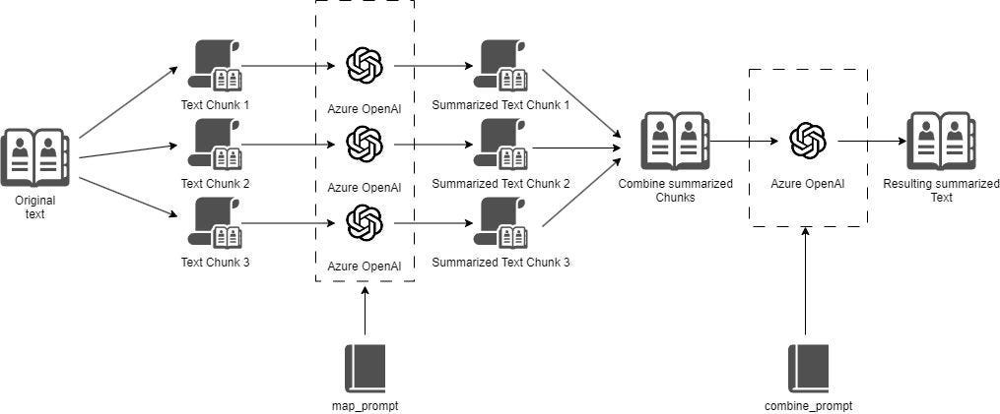
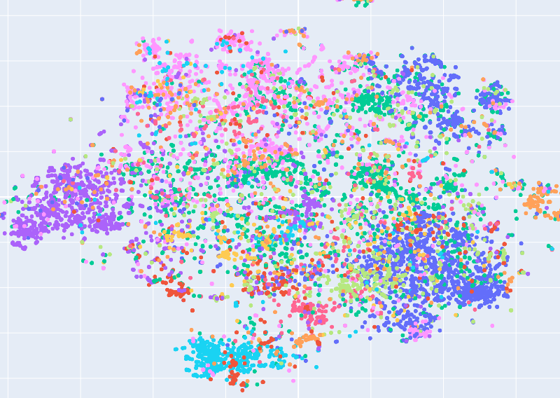

In my experience working on [vault.pash.city](https://vault.pash.city/), over 40% of user queries have been geared toward document summarization. Thousands of people often upload a document and have one straightforward yet challenging request: _**“Can you summarize this?”**_  

根据我在 vault.pash.city 工作的经验，超过 40%的用户查询都是针对文档摘要的。成千上万的人经常上传文档，并提出一个简单但具有挑战性的请求：“你能总结一下吗？”

The popularity of this use-case led me to develop a new mini-app: **[summarize.wtf](https://summarize.wtf/)**  

这个用例的受欢迎程度促使我开发了一个新的迷你应用：summarize.wtf

[Summarize.wtf](https://summarize.wtf/) allows you to upload any document—be it PDF, txt, ePub, or Docx—and generate summaries of varying lengths: short (tweet-length), medium (one paragraph), or long (detailed and comprehensive). Let’s explore how it works.  

Summarize.wtf 允许您上传任何文档——无论是 PDF、txt、ePub 还是 Docx——并生成不同长度的摘要：短（推文长度）、中（一个段落）或长（详细和全面）。让我们来探讨一下它是如何工作的。

For documents that are short enough to fit within an LLM's (Large Language Model) long context window— ranging from 16,000 to 32,000 tokens, or about 32-64 pages —the task is straightforward. You feed the entire document to the LLM, and out comes a neatly packed summary.  

对于足够短的文档，可以适应LLM（大型语言模型）长上下文窗口——范围从 16,000 到 32,000 个标记，或大约 32-64 页——任务是简单的。您将整个文档输入LLM，然后输出一个整齐的摘要。

However, what happens when the document in question is an entire eBook or a 100+ page PDF that exceeds the model's context window?  

然而，当相关文档是一本完整的电子书或超过 100 页的 PDF，超出了模型的上下文窗口时，会发生什么？

For big documents that can't fit into a long context window, you need to figure out how to compress the meaning of the entire document to fit within the context limit.  

对于无法放入长上下文窗口的大文档，您需要找出如何压缩整个文档的含义以适应上下文限制。

Some services take a naive approach by using only the beginning and the end of the document to generate a summary. While this might work for research papers that have an abstract upfront, the method is flawed. It risks:  

一些服务采取天真的方法，仅使用文档的开头和结尾来生成摘要。虽然这对于有前言的研究论文可能有效，但这种方法是有缺陷的。它存在以下风险：

-   Missing critical information tucked away in the body of the document.  
    
    文档主体中隐藏了关键信息。
    
-   Lack of contextual flow leading to incoherent summaries.  
    
    缺乏上下文流导致摘要不连贯。
    
-   Misrepresenting the core arguments or plot of the document.  
    
    歪曲文件的核心论点或情节。
    

Techniques like [TextRank](https://www.researchgate.net/publication/200042361_TextRank_Bringing_Order_into_Text) were popular in the pre-LLM world. This approach splits up the document into sentences and scores each one based on the frequency of key terms or “important words”. Then the “most important” sentences are stuffed into the long context window and the hope is that those sentences are cohesive enough to generate a reasonable summary. While this may work occasionally, [this approach has several pitfalls](https://johnfarmer.substack.com/i/136138482/why-textrank-didnt-do-well-either):  

像 TextRank 这样的技术在LLM之前的世界中很受欢迎。这种方法将文档拆分成句子，并根据关键术语或“重要词”的频率对每个句子进行评分。然后，将“最重要”的句子放入长上下文窗口中，希望这些句子足够连贯，以生成合理的摘要。虽然这种方法偶尔有效，但它有几个缺陷：

-   It often misses nuanced or less explicit yet important information.  
    
    它常常遗漏细微或不太明确但重要的信息。
    
-   The isolated important sentences might not make a cohesive summary.  
    
    孤立的重要句子可能无法形成一个连贯的总结。
    
-   Highly technical or uncommon terms may skew the importance ranking.  
    
    高度技术性或不常见的术语可能会扭曲重要性排名。
    

In the post-LLM world, Map-Reduce has become a popular summarization technique. Libraries like LangChain offer this [out-of-the-box](https://python.langchain.com/docs/modules/chains/document/map_reduce).  

在后LLM的世界中，Map-Reduce 已成为一种流行的摘要技术。像 LangChain 这样的库提供了开箱即用的功能。

At a basic level, Map-Reduce is a two-step process:  

在基本层面上，Map-Reduce 是一个两步过程：

1.  First, individual sections of the document are summarized (Map),  
    
    首先，文档的各个部分被总结（地图），
    
2.  Then, these mini-summaries are combined to form the final summary (Reduce).  
    
    然后，这些小摘要被组合成最终摘要（Reduce）。
    

This is done over and over until the output summary fits within your desired context length. Although this results in the most inclusive summary, **it's computationally expensive and time-consuming:** The costs and processing time associated with this step grow super-linearly with the length of the input-document. Thus, Map-Reduce is by far one of the most expensive methods of AI-summarization.  

这一步骤会反复进行，直到输出摘要符合您期望的上下文长度。尽管这会产生最全面的摘要，但它在计算上是昂贵且耗时的：与此步骤相关的成本和处理时间会随着输入文档长度的增加而超线性增长。因此，Map-Reduce 迄今为止是 AI 摘要中最昂贵的方法之一。

Given the constraints and complexities of the above methods, I've found that the most effective approach is to split the document into paragraphs, or chunks ([this technique is discussed in my previous article](https://pashpashpash.substack.com/p/understanding-long-documents-with)), and generating vector embeddings for each chunk.  

考虑到上述方法的限制和复杂性，我发现最有效的方法是将文档分成段落或块（这种技术在我之前的文章中讨论过），并为每个块生成向量嵌入。

The result is that the meaning of each of these chunks (or paragraphs) is captured in a multi-dimensional vector space.  

结果是这些块（或段落）的每个含义都被捕捉在一个多维向量空间中。

Paragraphs talking about similar things will be “closer” to each other in this meaning-space, forming an embeddings **“cluster”**. So if the introduction of your document is talking about one thing, and another section of the document is talking about something else, they will fall into distinct meaning-clusters.  

谈论相似事物的段落在这个意义空间中将“更接近”彼此，形成一个嵌入“簇”。因此，如果您文档的引言谈论的是一件事，而文档的另一部分谈论的是其他内容，它们将落入不同的意义簇中。

You can then use a clustering algorithm like _**[K-means](https://en.wikipedia.org/wiki/K-means_clustering)**_ to identify these clusters and take the center point (or collection of points) from each cluster to extract the _**representative chunk**_ that represents the “average meaning” of that topic cluster.  

然后，您可以使用像 K-means 这样的聚类算法来识别这些簇，并从每个簇中提取中心点（或点的集合），以提取代表该主题簇的“平均意义”的代表性块。

In effect, this strategy identifies “key topics” within the document and assembles them to create a context-rich summary. This technique is the backbone of both **[vault.pash.city](https://vault.pash.city/)** and **[summarize.wtf](https://summarize.wtf/)**.  

实际上，这种策略识别文档中的“关键主题”，并将它们组合起来以创建一个丰富上下文的摘要。这项技术是 vault.pash.city 和 summarize.wtf 的核心。

To summarize (pun intended):  

总结一下（双关语的意思）：

1.  The document is first split into sections.  
    
    文档首先被分成几个部分。
    
2.  Each section is vectorized.  
    
    每个部分都被向量化。
    
3.  K-means clustering identifies key topic clusters within these vectors.  
    
    K-means 聚类识别这些向量中的关键主题集群。
    
4.  The representative vectors of these clusters are sequentially sorted by where they appear in the document and fed into an LLM to generate a cohesive and comprehensive summary.  
    
    这些聚类的代表向量按它们在文档中出现的顺序进行排序，并输入到LLM中以生成一个连贯且全面的摘要。
    

This approach is not only cost-effective but also ensures a high-quality summary while minimizing processing time. Unlike in Map-Reduce, only one call is made to the LLM to generate the final summary, saving you a lot of money. Documents of any length—from brief articles to epics like the Odyssey—are fair game.  

这种方法不仅具有成本效益，还能确保高质量的摘要，同时最小化处理时间。与 Map-Reduce 不同，仅需对LLM进行一次调用即可生成最终摘要，为您节省了大量资金。任何长度的文档——从简短的文章到像《奥德赛》这样的史诗——都是可以处理的。

Summarization is a complex task, especially when the document exceeds the token limits of current LLMs. From naive beginnings-and-ends approaches to computationally expensive Map-Reduce techniques, various methods have tried to tackle this challenge with varying levels of success.  

摘要是一项复杂的任务，尤其是当文档超过当前LLMs的令牌限制时。从简单的开始和结束方法到计算成本高昂的 Map-Reduce 技术，各种方法尝试以不同的成功程度来应对这一挑战。

The key is to strike a balance between comprehensiveness, accuracy, cost, and computational efficiency. Vector clustering combined with K-means offers this balance, making it the go-to choice for **[vault.pash.city](https://vault.pash.city/)** and **[summarize.wtf](https://summarize.wtf/)**.  

关键是要在全面性、准确性、成本和计算效率之间取得平衡。向量聚类结合 K-means 提供了这种平衡，使其成为 vault.pash.city 和 summarize.wtf 的首选。

If you haven't tried it yet, I invite you to test out these summarization capabilities at **[summarize.wtf](https://summarize.wtf/)**. Whether you're dealing with a two-page article or a sprawling novel, this approach gives you a crisp, coherent, and insightful summary.  

如果你还没有尝试过，我邀请你在 summarize.wtf 测试这些摘要功能。无论你处理的是一篇两页的文章还是一部庞大的小说，这种方法都能为你提供简洁、连贯且富有洞察力的摘要。

Until next time!  下次见！

[Leave a comment  留下评论](https://pashpashpash.substack.com/p/tackling-the-challenge-of-document/comments)
