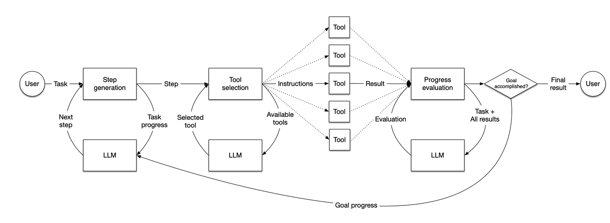
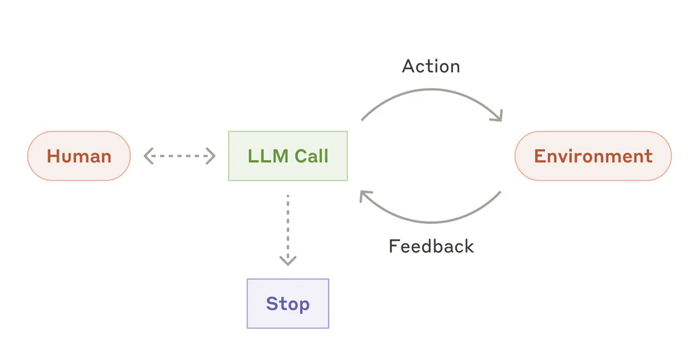

There were a lot of speculation over the past years about what the next cycle of AI development could be. Agents? Reasoners? Actual multimodality?  

过去几年，人们对人工智能发展的下一个周期有很多猜测。代理？推理机？还是真正的多模态？

I think it's time to call it: the model is the product.  

我觉得现在是时候称之为：模型就是产品了。

All current factors in research and market development push in this direction.  

目前研究和市场开发的所有因素都朝着这个方向发展。

-   Generalist scaling is stalling. This was the whole message behind the release of GPT-4.5: capacities are growing linearly while compute costs are on a geometric curve. Even with all the efficiency gains in training and infrastructure of the past two years, OpenAI can't deploy this giant model with a remotely affordable pricing.  
    
    通用扩展正在停滞。这是 GPT-4.5 发布背后的全部信息：容量呈线性增长，而计算成本呈几何曲线增长。即使过去两年在训练和基础设施方面取得了所有效率提升，OpenAI 也无法以可承受的价格部署这个巨型模型。
-   Opinionated training is working _much_ better than expected. The combination of reinforcement learning and reasoning means that models are suddenly learning tasks. It's not machine learning, it's not base model either, it's a secret third thing. It's even tiny models getting suddenly scary good at math. It's coding model no longer just generating code but managing an entire code base by themselves. It's Claude playing Pokemon with very poor contextual information and no dedicated training.  
    
    有主见的训练效果比预期的要_好得多_。强化学习和推理的结合意味着模型突然变成了学习任务。这不是机器学习，也不是基础模型，而是秘密的第三件事。即使是微小的模型也突然变得数学能力惊人。编码模型不再只是生成代码，而是自己管理整个代码库。这是克劳德在玩口袋妖怪时，语境信息非常少，也没有专门的训练。
-   Inference cost are in free fall. The recent optimizations from DeepSeek means that all the available GPUs could cover a demand of 10k tokens per day from a frontier model for… the entire earth population. There is nowhere this level of demand. The economics of selling tokens does not work anymore for model providers: they have to move higher up in the value chain.  
    
    推理成本直线下降。DeepSeek 最近的优化意味着所有可用的 GPU 都可以满足前沿模型每天 10k 个代币的需求……满足整个地球人口的需求。这种需求水平无处不在。出售代币的经济学对模型提供商来说不再有效：他们必须在价值链中向上移动。

This is also an uncomfortable direction. All investors have been betting on the application layer. In the next stage of AI evolution, the application layer is likely to be the first to be automated and disrupted.  

这也是一个让人很不舒服的方向，所有的投资者都押注在应用层，在AI进化的下一个阶段，应用层很可能是最先被自动化和颠覆的。

## Shapes of models to come.  

未来模型的形状。

Over the past weeks, we have seen two prime example of this new generation of models as a product: OpenAI's DeepResearch and Claude Sonnet 3.7.  

在过去几周中，我们已经看到了新一代模型作为产品的两个典型示例：OpenAI 的 DeepResearch 和 Claude Sonnet 3.7。

I've read a lot of misunderstandings about DeepResearch, which isn't helped by the multiplication of open and closed clones. OpenAI has not built a wrapper on top of O3. They have [trained an entirely new model](https://cdn.openai.com/deep-research-system-card.pdf), able to perform search internally, without any external calls, prompts or orchestration:  

我读到过很多关于 DeepResearch 的误解，开放和封闭克隆的增加并没有起到什么帮助作用。OpenAI 并没有在 O3 之上构建包装器。他们[训练了一个全新的模型](https://cdn.openai.com/deep-research-system-card.pdf)，能够在内部执行搜索，无需任何外部调用、提示或编排：

> The model learned the core browsing capabilities (searching, clicking, scrolling, interpreting files) (…) and how to reason to synthetize a large number of websites to find specific pieces of information or write comprehensive reports through reinforcement learning training on these browsing tasks.  
> 
> 模型通过对这些浏览任务的强化学习训练，学习了核心的浏览功能（搜索、点击、滚动、解释文件）（……）以及如何推理合成大量网站以查找特定的信息或撰写综合报告。

DeepResearch is not a standard LLM, nor a standard chatbot. It's a new form of _research language model_, explicitly designed to perform search tasks end to end. The difference is immediately striking to everyone using it seriously: the model generate lengthy reports with consistent structure and underlying source analysis process. In comparison as Hanchung Lee [underlined](https://leehanchung.github.io/blogs/2025/02/26/deep-research/) all the other DeepSearch, including the Perplexity and Google variant, are just your usual models with a few twists:  

DeepResearch 既不是标准模型，也不是标准聊天机器人。它是一种新型_研究语言模型_，专门设计用于端到端执行搜索任务。对于认真使用它的每个人来说，其区别是显而易见的：该模型生成具有一致结构和底层源分析过程的长篇报告。相比之下，正如 Hanchung Lee[所强调的](https://leehanchung.github.io/blogs/2025/02/26/deep-research/)那样，所有其他 DeepSearch（包括 Perplexity 和 Google 变体）都只是普通模型，只是有一些变化：

> Google’s Gemini and Perplexity’s chat assistants also offer “Deep Research” features, but neither has published any literature on how they optimized their models or systems for the task or any substaintial quantitative evaluations (…) We will make an assumption that the fine-tuning work done is non-substantial.  
> 
> Google 的 Gemini 和 Perplexity 的聊天助手也提供“深度研究”功能，但都没有发布任何关于如何优化其模型或系统以完成任务的文献，也没有进行任何实质性的定量评估（...）我们将假设所做的微调工作并不实质性。

Anthropic has been laying their current vision ever clearer. In December, they introduced a controversial but, to my mind, correct [definition](https://www.anthropic.com/research/building-effective-agents) of agent models. Similarly to DeepSearch, an agent has to perform the targeted tasks internally: they "dynamically direct their own processes and tool usage, maintaining control over how they accomplish tasks".  

Anthropic 一直在更清晰地阐述他们当前的愿景。去年 12 月，他们引入了一个有争议但在我看来是正确的代理模型[定义](https://www.anthropic.com/research/building-effective-agents)。与 DeepSearch 类似，代理必须在内部执行目标任务：它们“动态地指导自己的流程和工具使用，保持对如何完成任务的控制”。

What most agent startups are currently building is not agents, it's workflows, that is "systems where LLMs and tools are orchestrated through predefined code paths." Workflows may still bring some value, especially for vertical adaptations. Yet, to anyone currently working in the big labs it's strikingly obvious that all major progress in autonomous systems will be through redesigning the models in the first place.  

目前，大多数代理初创公司正在构建的不是代理，而是工作流，即“通过预定义代码路径编排系统和工具的系统”。工作流可能仍然会带来一些价值，尤其是对于垂直适应而言。然而，对于目前在大型实验室工作的任何人来说，显而易见的是，自主系统的所有重大进展都将首先通过重新设计模型来实现。

We had a very concrete demonstration of this with the release of Claude 3.7, a model primarily trained with complex code use cases in mind. All the workflow adaptation like Devin had a major boost on SWE benchmarks.  

我们在 Claude 3.7 的发布中对此进行了非常具体的展示，该模型主要针对复杂的代码用例进行训练。所有工作流程的调整（如 Devin）都对 SWE 基准测试产生了重大提升。

To give it another example done at a much smaller scale: at Pleias we're currently working on automating RAG. Current RAG systems are a lot of interconnected yet brittle workflows: routing, chunking reranking, query interpretation, query expansion, source contextualization, search engineering. With the evolving training tech stack, there is a real potential to bundle all theses processes in two separate yet interconnected models, one for data preparation and the other for search/retrieval/report generation. This requires an elaborated synthetic pipeline and entirely new reward functions for reinforcement learning. Actual training, actual research.  

再举一个规模小得多的例子：在 Pleias，我们目前正在致力于实现 RAG 自动化。当前的 RAG 系统包含许多相互关联但又脆弱的工作流程：路由、分块重新排序、查询解释、查询扩展、源语境化、搜索工程。随着训练技术堆栈的不断发展，将所有这些流程捆绑在两个独立但相互关联的模型中是完全有可能的，一个用于数据准备，另一个用于搜索/检索/报告生成。这需要精心设计的合成管道和全新的强化学习奖励函数。实际训练，实际研究。

What all this all means in practice: displacing complexity. Training anticipates a wide range of actions and edge cases, so that deployment becomes much more simple. But in this process most of the value is now created and, likely in the end, captured by the model trainer. In short, what Claude aims to disrupt and replace the current workflows like this basic "agent" system from llama index:  

所有这些在实践中意味着：取代复杂性。训练可以预测各种动作和边缘情况，因此部署变得更加简单。但在这个过程中，大部分价值现在被创建，并且很可能最终被模型训练师捕获。简而言之，Claude 的目标是颠覆和取代当前的工作流程，比如 llama index 中的这个基本“代理”系统：

With this:  有了这个：

## Training or being trained on.  

接受训练或受训练。

To reassert: the big labs are not advancing with an hidden agenda. While they can be opaque at time, they laying it all in the open: they will bundle, they will go up the application layer and they will attempt to capture most of the value there. And the commercial consequences are quite clear. Naveen Rao, the Gen AI VP of Databricks, [phrased it quite well](https://x.com/NaveenGRao/status/1886544584588619840):  

重申一下：大型实验室的推进并非隐藏议程。虽然有时它们可能不透明，但它们将一切都公开：它们将捆绑，它们将上升到应用层，它们将试图在那里获取大部分价值。商业后果非常明显。Databricks 的 Gen AI 副总裁 Naveen Rao[对此进行了很好的阐述](https://x.com/NaveenGRao/status/1886544584588619840)：

> all closed AI model providers will stop selling APIs in the next 2-3 years. Only open models will be available via APIs (…) Closed model providers are trying to build non-commodity capabilities and they need great UIs to deliver those. It's not just a model anymore, but an app with a UI for a purpose.  
> 
> 所有封闭式 AI 模型提供商将在未来 2-3 年内停止销售 API。只有开放模型可通过 API 获得 (…) 封闭式模型提供商正在尝试构建非商品化功能，他们需要出色的 UI 来实现这些功能。它不再只是一个模型，而是一个具有特定用途的 UI 的应用程序。

So what is happening right now is just a lot of denial. The honeymoon period between model providers and wrappers is over. Things could evolve in both direction:  

所以现在发生的事情只是很多否认。模型提供者和包装器之间的蜜月期已经结束。事情可能会朝两个方向发展：

-   Claude Code and DeepSearch are early technical and product experiments in this direction. You will notice that DeepSearch is not available through an API, only used to create value for the premium subscriptions. Claude Code is a minimalistic terminal integration. Weirdly enough, while Claude 3.7 works perfectly in Claude Code, Cursor struggles with it and I've already seen several high end users cancelling their subscriptions as a result. Actual LLM agents doesn't care about pre-existing workflows: they replace it.  
    
    Claude Code 和 DeepSearch 是此方向的早期技术和产品实验。您会注意到 DeepSearch 无法通过 API 获得，仅用于为高级订阅创造价值。Claude Code 是一种极简主义的终端集成。奇怪的是，虽然 Claude 3.7 在 Claude Code 中运行完美，但 Cursor 却难以运行，我已经看到几个高端用户因此取消了订阅。实际的代理并不关心预先存在的工作流程：他们会替换它。
-   The most high profile wrapper are now scrambling to become hybrid AI training companies. They do have some training capacities, though very little advertised. One of Cursor main assets is their small autocompletion model. WindSurf has their internal cheap code model, Codium. Perplexity always relied on home classifiers for routing and recently pivoted to train their own DeepSeek variant for search purposes.  
    
    最受瞩目的包装器现在正争相成为混合 AI 训练公司。它们确实有一些训练能力，尽管很少宣传。Cursor 的主要资产之一是他们的小型自动完成模型。WindSurf 有他们内部的廉价代码模型 Codium。Perplexity 一直依赖家庭分类器进行路由，最近转向训练他们自己的 DeepSeek 变体以用于搜索目的。
-   For smaller wrappers, not much will change, except likely increased reliance on agnostic inference providers if the big labs entirely let go of this market. I do also expect to see much more focus on UI which is still dramatically underestimated, as even more generalist models are likely to bundle common deployment takss, especially for RAG.  
    
    对于较小的包装器，不会有太大变化，除非大型实验室完全放弃这个市场，否则可能会增加对不可知推理提供商的依赖。我还希望看到更多关注仍然被严重低估的 UI，因为甚至更多的通用模型可能会捆绑常见的部署任务，尤其是对于 RAG。

In short the dilemma for most successful wrappers is simple: training or being trained on. What they are doing right now is both free market research for the big labs but, even, as all outputs is ultimately generated through model providers, free data design and generation.  

简而言之，大多数成功的包装者面临的困境很简单：培训还是接受培训。他们现在所做的既是为大型实验室进行免费的市场研究，也是免费的数据设计和生成，因为所有输出最终都是通过模型提供商生成的。

What will happen afterwards is anyone guess. Successful wrappers do have the advantage of knowing their vertical well and accumiulating a lot of precious user feedbacks. Yet, in my experience, it's easier to go down from the model to application layers than building an entirely new training capacities from scratch. Wrappers may not have been helped by their investors either. From what I overheard, there is such a negative polarization against training, they almost have to hide what is going to be their most critical value: neither cursor small nor codium are properly documented at this moment.  

之后会发生什么谁也猜不到。成功的包装器确实具有了解其垂直领域并积累大量宝贵用户反馈的优势。然而，根据我的经验，从模型到应用层比从头开始构建全新的训练能力更容易。包装器可能也没有得到投资者的帮助。据我所知，人们对训练存在如此负面的两极分化，他们几乎不得不隐藏他们最重要的价值：目前无论是 Cursor Small 还是 Codium 都没有得到适当的记录。

## Reinforcement learning was not priced in.  

强化学习尚未被计入价格。

This brings me to the actual painful part: currently all AI investments are correlated. Funds are operating under the following assumptions:  

这让我想到了真正痛苦的部分：目前所有人工智能投资都是相关的。基金在以下假设下运作：

-   The real value lay exclusively in an application layer independent from the model layer that is best positioned to disrupt existing market.  
    
    真正的价值完全在于独立于模型层的应用层，而该应用层最有可能颠覆现有市场。
-   Model providers will only sell tokens at an ever lowering price, making wrappers in turn more profitable.  
    
    模型提供者只会以不断降低的价格出售代币，从而使包装器变得更有利可图。
-   Close models wrapping will satisfy all the existing demands, even in regulated sectors with long lasting concerns over external dependencies.  
    
    封闭模型包装将满足所有现有需求，即使在长期关注外部依赖的受监管行业也是如此。
-   Building any training capacity is just a waste of time. This does not include only pre-training but all forms of training.  
    
    建立任何培训能力都是浪费时间。这不仅包括前期培训，还包括所有形式的培训。

I'm afraid this increasingly look like an adventurous bet and an actual market failure to accurately price the latest technical developments, especially in RL. In the current economic ecosystem, venture funds are meant to find uncorrelated investments. They will not beat S&P500 but that's not what larger institutional investors are looking for: they want to bundle risks, ensure that in a bad year at least some things will work out. Model training is like a textbook perfect example for this: lots of potential for disruption in a context where most western economies are on course for a recession. And yet model trainers can't raise, or at least not in the usual way. Prime Intellect is one of the few new western ai training companies that has a clear potential to become a frontier lab. Yet, despite their achievements including the training of the first decentralized LLM, they struggled to raise more than your usual wrapper.  

我担心这越来越像是一个冒险的赌注，以及一个实际的市场失败，无法准确为最新的技术发展定价，尤其是在 RL 领域。在当前的经济生态系统中，风险基金旨在寻找不相关的投资。他们不会击败标准普尔 500 指数，但这不是大型机构投资者所寻求的：他们希望捆绑风险，确保在糟糕的年份至少有些事情会成功。模型训练就像一个教科书上的完美例子：在大多数西方经济体正走向衰退的背景下，存在很大的破坏潜力。然而，模型训练师无法筹集资金，至少不能以通常的方式筹集资金。Prime Intellect 是少数几家有明显潜力成为前沿实验室的新西方人工智能培训公司之一。然而，尽管他们取得了包括第一个去中心化 LLM 的培训在内的成就，但他们仍难以筹集到比通常更多的资金。

Beyond that, aside from the big lab, the current training ecosystem is very tiny. You can count all theses companies on your hands: Prime Intellect, Moondream, Arcee, Nous, Pleias, Jina, the HuggingFace pretraining team (actually tiny)… Along with a few more academic actors (Allen AI, Eleuther…) they build and support most of the current open infrastructure for training. In Europe, I know that at least 7-8 LLM projects will integrate the Common Corpus and some of the pretraining tools we developed at Pleias — and the rest will be fineweb, and likely post-training instruction sets from Nous or Arcee.  

除此之外，除了大型实验室之外，当前的训练生态系统非常小。您可以数得出来这些公司：Prime Intellect、Moondream、Arcee、Nous、Pleias、Jina、HuggingFace 预训练团队（实际上很小）……以及一些学术参与者（Allen AI、Eleuther……）他们构建并支持当前大多数开放的训练基础设施。在欧洲，我知道至少有 7-8 个 LLM 项目将整合 Common Corpus 和我们在 Pleias 开发的一些预训练工具 — 其余的将是 fineweb，以及来自 Nous 或 Arcee 的后训练指令集。

There is something deeply wrong in the current funding environment. Even OpenAI senses it now. Lately, there was some [felt irritation](https://x.com/khoomeik/status/1892743475843813680) at the lack of "vertical RL" in the current Silicon Valley startup landscape. I believe the message comes straight from Sam Altman and will likely result in some adjustment in the next YC batch but pinpoint to a larger shift: soon the big labs select partners won't be API customers but associated contractors involved in the earlier training stage.  

当前的融资环境存在严重问题。就连 OpenAI 现在也意识到了这一点。最近，人们对当前硅谷初创企业缺乏“垂直 RL”[感到不满](https://x.com/khoomeik/status/1892743475843813680)。我相信这个消息直接来自 Sam Altman，可能会导致下一批 YC 进行一些调整，但重点是更大的转变：很快，大型实验室选择的合作伙伴将不再是 API 客户，而是参与早期培训阶段的相关承包商。

If the model is the product, you cannot necessarily build it alone. Search and code are easy low hanging fruits: major use cases for two years, the market is nearly mature and you can ship a new cursor in a few months. Now many of the most lucrative AI uses cases in the future are not at this advanced stage of development — typically, think about all these rule based system that still rule most of the world economy… Small dedicated teams with a cross-expertise and a high level of focus may be best positioned to tackle this— eventually becoming potential acquihire once the initial ground work is done. We could see the same pipeline in the UI side. Some preferred partner, getting exclusive API access to close specialized models, provided they get on the road for business acquisition.  

如果模型就是产品，你不一定能独自构建它。搜索和代码是唾手可得的果实：主要用例已经存在两年，市场已接近成熟，你可以在几个月内推出一款新光标。现在，未来许多最赚钱的人工智能用例尚未处于这个高级开发阶段——通常，想想所有这些仍然统治着世界经济大部分的基于规则的系统……拥有交叉专业知识和高度专注的小型专业团队可能最适合解决这个问题——一旦完成初步的基础工作，最终成为潜在的被收购对象。我们可以在 UI 方面看到同样的管道。一些首选合作伙伴，只要他们踏上业务收购之路，就能获得独家 API 访问权限来关闭专门的模型。

I haven't mentioned DeepSeek, nor Chinese labs so far. Simply because DeepSeek is already one step further: not model as a product, but as a universal infrastructure layer. Like OpenAI and Anthropic, Lian Wenfeng [lays his plans in the open](https://www.lesswrong.com/posts/kANyEjDDFWkhSKbcK/two-interviews-with-the-founder-of-deepseek):  

到目前为止，我还没有提到 DeepSeek，也没有提到中国的实验室。原因很简单，因为 DeepSeek 已经更进了一步：不是作为产品的模型，而是作为通用基础设施层。与 OpenAI 和 Anthropic 一样，连文峰[也公开了他的计划](https://www.lesswrong.com/posts/kANyEjDDFWkhSKbcK/two-interviews-with-the-founder-of-deepseek)：

> We believe that the current stage is an explosion of technological innovation, not an explosion of applications (…) If a complete upstream and downstream industrial ecosystem is formed, then there is no need for us to make applications ourselves. Of course, there is no obstacle for us to make applications if needed, but research and technological innovation will always be our first priority.  
> 
> 我们认为，现在的阶段是技术创新的爆发，而不是应用的爆发……如果形成完整的上下游产业生态，那我们就没必要自己去做应用了。当然，有需要我们去做应用，也没有障碍，但研究和技术创新永远是我们的首要任务。

At this stage, working only on applications is like "fighting the next wars with last war generals". I'm afraid we're at the point where many in the west are not even aware the last war is over.  

在这个阶段，只做申请工作就像“用上一场战争的将军去打下一场战争”。恐怕我们正处于这样一个阶段：西方许多人甚至还没有意识到上一场战争已经结束。
