Improving the reasoning abilities of large language models (LLMs) has become one of the hottest topics in 2025, and for good reason. Stronger reasoning skills allow LLMs to tackle more complex problems, making them more capable across a wide range of tasks users care about.  

提高大型语言模型的推理能力 (LLMs) 已成为 2025 年最热门的话题之一，这是有充分理由的。更强的推理能力使 LLMs 能够解决更复杂的问题，使其更有能力完成用户关心的广泛任务。

In the last few weeks, researchers have shared a large number of new strategies to improve reasoning, including scaling inference-time compute, reinforcement learning, supervised fine-tuning, and distillation. And many approaches combine these techniques for greater effect.   

在过去几周中，研究人员分享了大量改进推理的新策略，包括扩展推理时间计算、强化学习、监督微调和提炼。许多方法将这些技术结合起来以获得更大的效果。

This article explores recent research advancements in reasoning-optimized LLMs, with a particular focus on inference-time compute scaling that have emerged since the release of DeepSeek R1.  

本文探讨了推理优化方面的最新研究进展，特别关注自 DeepSeek R1 发布以来出现的推理时间计算扩展。


_The four main categories of implementing reasoning models I explained in [Understanding Reasoning LLMs](https://magazine.sebastianraschka.com/p/understanding-reasoning-llms)_. This article focuses on inference-time-scaling methods.  

_我在[《理解推理》](https://magazine.sebastianraschka.com/p/understanding-reasoning-llms)中解释了实现推理模型的四个主要类别_。本文重点介绍推理时间缩放方法。

Since most readers are likely already familiar with LLM reasoning models, I will keep the definition short: An LLM-based reasoning model is an LLM designed to solve multi-step problems by generating intermediate steps or structured "thought" processes. Unlike simple question-answering LLMs that just share the final answer, reasoning models either explicitly display their thought process or handle it internally, which helps them to perform better at complex tasks such as puzzles, coding challenges, and mathematical problems.  

由于大多数读者可能已经熟悉推理模型，因此我将简短地介绍其定义：基于推理的模型旨在通过生成中间步骤或结构化的“思维”过程来解决多步骤问题。与仅共享最终答案的简单问答不同，推理模型要么明确显示其思维过程，要么在内部进行处理，这有助于它们在复杂任务（例如谜题、编码挑战和数学问题）中表现更好。

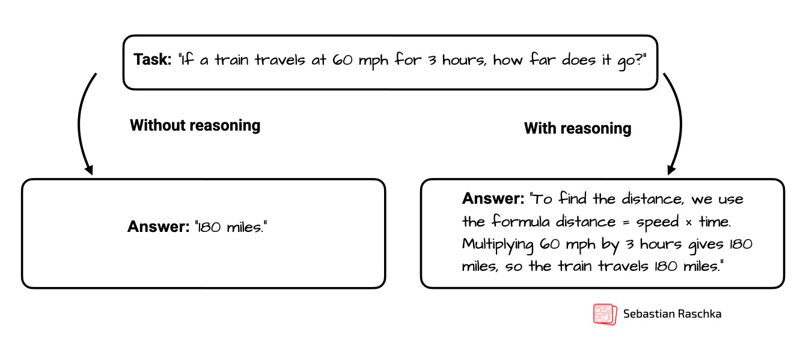

_Side-by-side comparison of a basic LLM’s one-line answer and a reasoning LLM’s explanatory response.  

并排比较基本LLM的单行答案和推理LLM的解释性响应。_

In general, there are two main strategies to improve reasoning: (1) increasing _training_ compute or (2) increasing _inference_ compute, also known as _inference-time scaling_ or _test-time scalin_g. (Inference compute refers to the processing power required to generate model outputs in response to a user query after training.)  

一般来说，有两种主要策略可以提高推理能力：（1）增加_训练_计算或（2）增加_推理_计算，也称为_推理时间扩展_或_测试时间扩展_。（推理计算是指训练后响应用户查询生成模型输出所需的处理能力。）

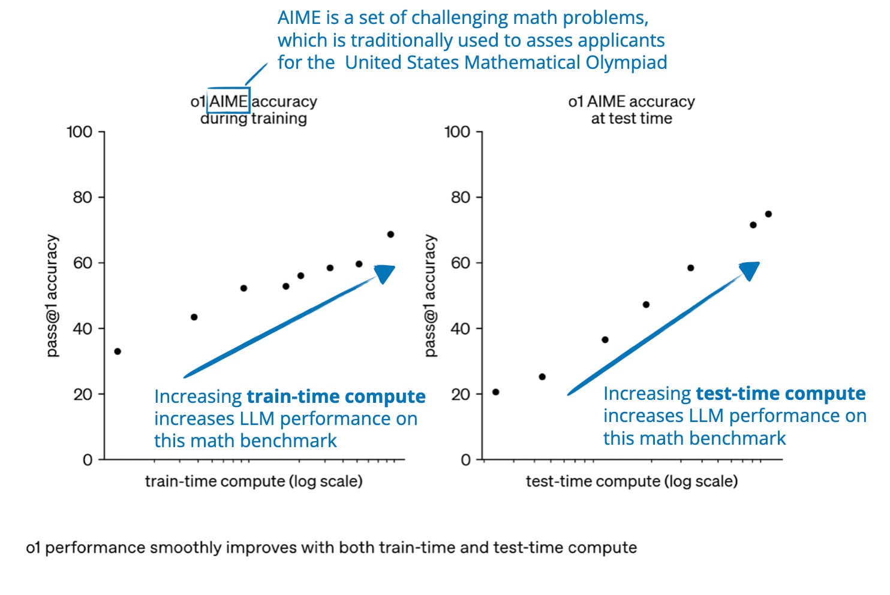

_Accuracy improvements can be achieved through increased training or test-time compute, where test-time compute is synonymous with inference-time compute and inference-time scaling. Source: Annotated figure from https://openai.com/index/learning-to-reason-with-llms/  

可以通过增加训练或测试时间计算来提高准确率，其中测试时间计算与推理时间计算和推理时间扩展同义。来源：带注释的图表来自 https://openai.com/index/learning-to-reason-with-llms/_

Note that the plots shown above make it look like we improve reasoning either via train-time compute OR test-time compute. However, LLMs are usually designed to improve reasoning by **combining** heavy train-time compute (extensive training or fine-tuning, often with reinforcement learning or specialized data) **and** increased test-time compute (allowing the model to "think longer" or perform extra computation during inference).  

请注意，上图显示我们似乎通过训练时间计算或测试时间计算来改进推理。然而，LLMs 通常旨在通过**结合**大量训练时间计算（大量训练或微调，通常使用强化学习或专门数据）**和**增加测试时间计算（允许模型“思考更长时间”或在推理期间执行额外计算）来改进推理。

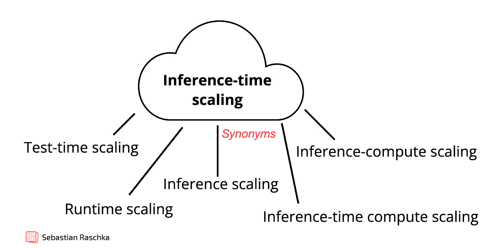

The many terms that are used synonymously with inference-time scaling.  

与推理时间缩放同义使用的许多术语。

To understand how reasoning models are being developed and improved, I think it remains useful to look at the different techniques separately. In my previous article, [Understanding Reasoning LLMs](https://magazine.sebastianraschka.com/p/understanding-reasoning-llms), I discussed a finer categorization into four categories, as summarized in the figure below.  

为了理解推理模型是如何发展和改进的，我认为分别研究不同的技术仍然很有用。在我之前的文章[《理解推理》](https://magazine.sebastianraschka.com/p/understanding-reasoning-llms)中，我讨论了更精细的四类分类，如下图所示。

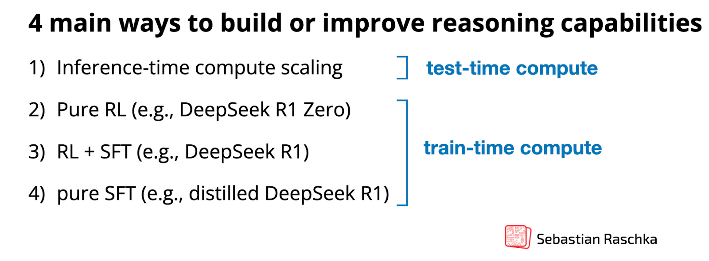

Methods 2-4 in the figure above typically produce models that generate longer responses because they include intermediate steps and explanations in their outputs. Since inference costs scale with response length (e.g., a response twice as long requires twice the compute), these training approaches are inherently linked to inference scaling. However, in this section on inference-time compute scaling, I focus specifically on techniques that explicitly regulate the number of generated tokens, whether through additional sampling strategies, self-correction mechanisms, or other methods.  

上图中的方法 2-4 通常会生成生成较长响应的模型，因为它们的输出中包含中间步骤和解释。由于推理成本会随响应长度而变化（例如，两倍长的响应需要两倍的计算量），因此这些训练方法本质上与推理扩展相关。然而，在本节关于推理时间计算扩展的内容中，我将特别关注明确调节生成标记数量的技术，无论是通过额外的采样策略、自我校正机制还是其他方法。

In this article, I focus on the interesting new research papers and model releases focused on scaling **inference-time compute scaling** that followed **after** the DeepSeek R1 release on January 22nd, 2025. (Originally, I wanted to cover methods from all categories in this article, but due to the excessive length, I decided to release a separate article focused on train-time compute methods in the future.)  

在本文中，我将重点介绍2025 年 1 月 22 日 DeepSeek R1 发布**之后**发布的关于扩展**推理时间计算扩展**的有趣的新研究论文和模型发布。（最初，我想在本文中涵盖所有类别的方法，但由于篇幅过长，我决定在未来发布一篇单独的文章，重点介绍训练时间计算方法。）

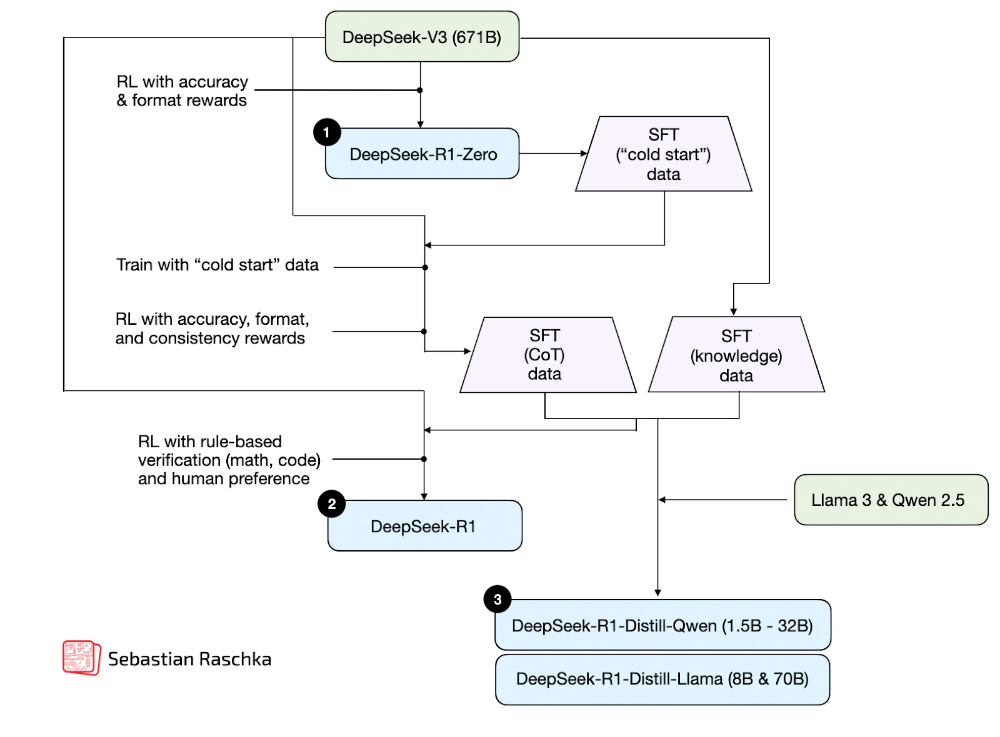

_Development process of DeepSeek's reasoning models that I discussed in my previous article, Understanding Reasoning LLMs (https://magazine.sebastianraschka.com/p/understanding-reasoning-llms).  

我在上一篇文章《理解推理》(https://magazine.sebastianraschka.com/p/understanding-reasoning-llms) 中讨论过 DeepSeek 推理模型的开发过程。_

Before we look into Inference-time compute scaling methods and the different areas of progress on the reasoning model with a focus on the inference-time compute scaling category, let me at least provide a brief overview of all the different categories.  

在我们研究推理时间计算扩展方法和推理模型的不同进展领域（重点关注推理时间计算扩展类别）之前，让我至少对所有不同类别进行简要概述。

**1\. Inference-time compute scaling  

1\. 推理时间计算扩展**

This category includes methods that improve model reasoning capabilities at inference time without training or modifying the underlying model weights. The core idea is to trade off increased computational resources for improved performance, which helps with making even fixed models more capable through techniques such as chain-of-thought reasoning, and various sampling procedures.   

此类别包括在推理时提高模型推理能力而无需训练或修改底层模型权重的方法。其核心思想是以增加计算资源换取提高性能，这有助于通过思路链推理和各种采样程序等技术使固定模型变得更强大。

While I categorize inference-time compute scaling separately to focus on methods in this context, it is important to note that this technique can be applied to any LLM. For example, OpenAI developed its o1 model using reinforcement learning, and then additionally leveraged inference-time compute scaling. Interestingly, as I discussed in my previous article on reasoning models ([Understanding Reasoning LLMs](https://magazine.sebastianraschka.com/p/understanding-reasoning-llms)), the DeepSeek R1 paper explicitly mentioned that R1 did not use inference-time scaling. However, they acknowledged that it is something they could easily incorporate into the R1 deployment or application.  

虽然我将推理时间计算扩展单独分类以关注此上下文中的方法，但需要注意的是，此技术可应用于任何领域。例如，OpenAI 使用强化学习开发了其 o1 模型，然后又利用了推理时间计算扩展。有趣的是，正如我在上一篇关于推理模型的文章（[理解推理](https://magazine.sebastianraschka.com/p/understanding-reasoning-llms)）中所讨论的那样，DeepSeek R1 论文明确提到 R1 没有使用推理时间扩展。但是，他们承认，他们可以轻松地将其纳入 R1 部署或应用程序中。

**2\. Pure reinforcement learning  

2.纯强化学习**

This approach focuses solely on reinforcement learning (RL) to develop or improve reasoning capabilities. It typically involves training models with verifiable reward signals from math or coding domains. While RL allows models to develop more strategic thinking and self-improvement capabilities, it comes with challenges such as reward hacking, instability, and high computational costs.  

这种方法仅专注于强化学习 (RL) 来开发或提高推理能力。它通常涉及使用来自数学或编码领域的可验证奖励信号来训练模型。虽然 RL 允许模型开发更具战略性的思维和自我改进能力，但它也带来了奖励黑客、不稳定和高计算成本等挑战。

**3\. Reinforcement learning and supervised fine-tuning  

3.强化学习和监督微调**

This hybrid approach combines RL with supervised fine-tuning (SFT) to achieve more stable and generalizable improvements than pure RL. Typically, a model is first trained with SFT on high-quality instruction data and then further refined using RL to optimize specific behaviors**.**  

这种混合方法将 RL 与监督微调 (SFT) 相结合，以实现比纯 RL 更稳定、更通用的改进。通常，首先使用 SFT 在高质量指令数据上训练模型，然后使用 RL 进一步完善以优化特定行为**。**

**4\. Supervised fine-tuning and model distillation  

4\. 监督微调和模型蒸馏**

This method improves the reasoning capabilities of a model by instruction fine-tuning it on high-quality labeled datasets (SFT). If this high-quality dataset is generated by a larger LLM, then this methodology is also referred to as "knowledge distillation" or just "distillation" in LLM contexts. However, note that this differs slightly from traditional knowledge distillation in deep learning, which typically involves training a smaller model using not only the outputs (labels) but also the logits of a larger teacher model.  

该方法通过在高质量标记数据集 (SFT) 上对模型进行指令微调来提高模型的推理能力。如果此高质量数据集是由更大的数据集生成的，则该方法在上下文中也称为“知识提炼”或简称为“提炼”。但请注意，这与深度学习中的传统知识提炼略有不同，后者通常涉及不仅使用输出（标签）而且还使用较大教师模型的逻辑来训练较小的模型。

The previous section already briefly summarized inference-time compute scaling. Before discussing the recent research in this category, let me describe the inference-time scaling in a bit more detail.  

上一节已经简要总结了推理时间计算扩展。在讨论此类别的最新研究之前，让我更详细地描述一下推理时间扩展。

Inference-time scaling improves an LLM's reasoning by increasing computational resources ("compute") during inference. The idea why this can improve reasoning can be given with a simple analogy: humans give better responses when given more time to think, and similarly, LLMs can improve with techniques that encourage more "thought" during generation.  

推理时间扩展通过增加推理过程中的计算资源（“计算”）来改善推理能力。这可以改善推理能力的原因可以用一个简单的类比来说明：当给予人类更多时间思考时，他们会做出更好的反应，同样，通过在生成过程中鼓励更多“思考”的技术，也可以改善推理能力。

One approach here is prompt engineering, such as chain-of-thought (CoT) prompting, where phrases like "think step by step" guide the model to generate intermediate reasoning steps. This improves accuracy on complex problems but is unnecessary for simple factual queries. Since CoT prompts generate more tokens, they effectively make inference more expensive.  

一种方法是提示工程，例如思路链 (CoT) 提示，其中“逐步思考”等短语会引导模型生成中间推理步骤。这可以提高复杂问题的准确性，但对于简单的事实查询而言则没有必要。由于 CoT 提示会生成更多标记，因此它们实际上使推理更加昂贵。

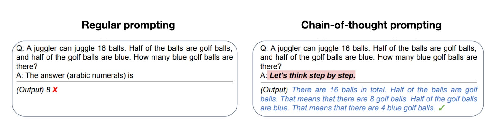

_An example of classic CoT prompting from the 2022 Large Language Models are Zero-Shot Reasoners paper (https://arxiv.org/abs/2205.11916).  

2022 年大型语言模型中的经典 CoT 提示的一个示例是零样本推理器论文 (https://arxiv.org/abs/2205.11916)。_

Another method involves voting and search strategies, such as majority voting or beam search, which refine responses by selecting the best output.  

另一种方法涉及投票和搜索策略，例如多数投票或集束搜索，通过选择最佳输出来改进响应。

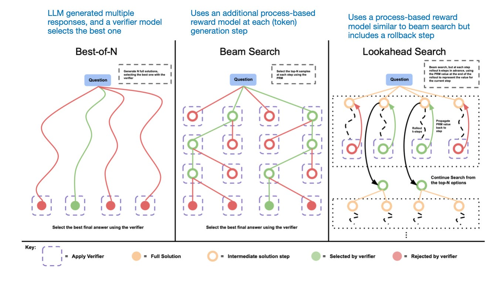

_Different search-based methods rely on a process-reward-based model to select the best answer. Annotated figure from the LLM Test-Time Compute paper, https://arxiv.org/abs/2408.03314  

不同的基于搜索的方法依赖于基于过程奖励的模型来选择最佳答案。注释图来自 Test-Time Compute 论文，https://arxiv.org/abs/2408.03314_

The remainder of this article will be focused on the recent research advances in the inference-time scaling category for improving reasoning capabilities of LLMs. Let me start with a more detailed discussion of a paper that serves as an example of inference-time scaling.  

本文的其余部分将重点介绍推理时间扩展类别的最新研究进展，以提高推理能力。首先，我将更详细地讨论一篇作为推理时间扩展示例的论文。

So, one of the interesting recent research papers in this category is [s1: Simple Test-Time Scaling](https://arxiv.org/abs/2501.19393) (31 Jan, 2025), which introduces so-called "wait" tokens, which can be considered as a more modern version of the aforementioned "think step by step" prompt modification.  

因此，该类别中最近一篇有趣的研究论文是[s1：简单测试时间缩放](https://arxiv.org/abs/2501.19393)（2025 年 1 月 31 日），它引入了所谓的“等待”标记，可以将其视为前面提到的“逐步思考”提示修改的更现代版本。

Note that this involves supervised finetuning (SFT) to generate the initial model, so it's not a pure inference-time scaling approach. However, the end goal is actively controlling the reasoning behavior through inference-time scaling; hence, I considered this paper for the "1. Inference-time compute scaling" category.  

请注意，这涉及监督微调 (SFT) 来生成初始模型，因此它不是纯粹的推理时间扩展方法。但是，最终目标是通过推理时间扩展主动控制推理行为；因此，我认为这篇论文属于“1. 推理时间计算扩展”类别。

In short, their approach is twofold:  

简而言之，他们的方法有两个：

1.  Create a curated SFT dataset with 1k training examples that include reasoning traces.  
    
    创建包含 1k 个包含推理痕迹的训练示例的精选 SFT 数据集。
    
2.  Control the length of responses by:  
    
    通过以下方式控制响应的长度：
    
3.  a) Appending "Wait" tokens to get the LLM to generate longer responses, self-verify, and correct itself, or  
    
    a) 附加“等待”令牌，让 LLM 生成更长的响应、进行自我验证和自我纠正，或者
    
4.  b) Stopping generation by adding an end-of-thinking token delimiter ("Final Answer:"). They call this length control "budget forcing."  
    
    b) 通过添加思考结束标记分隔符来停止生成（“最终答案：”）。他们称这种长度控制为“预算强制”。
    

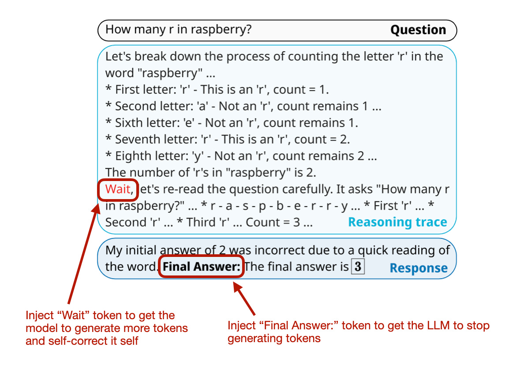

_Illustration of "wait" token insertion to control the length of the output. Annotated figure from https://arxiv.org/abs/2501.19393.  

插入“wait”标记以控制输出长度的图示。注释图来自 https://arxiv.org/abs/2501.19393。_

Budget forcing can be seen as a sequential inference scaling technique because it still generates one token at a time (but just more of it). In contrast, we have parallel techniques like majority voting, which aggregate multiple independent completions.  

预算强制可以看作是一种顺序推理扩展技术，因为它仍然一次生成一个 token（但数量更多）。相比之下，我们有多数表决等并行技术，可以聚合多个独立的完成。

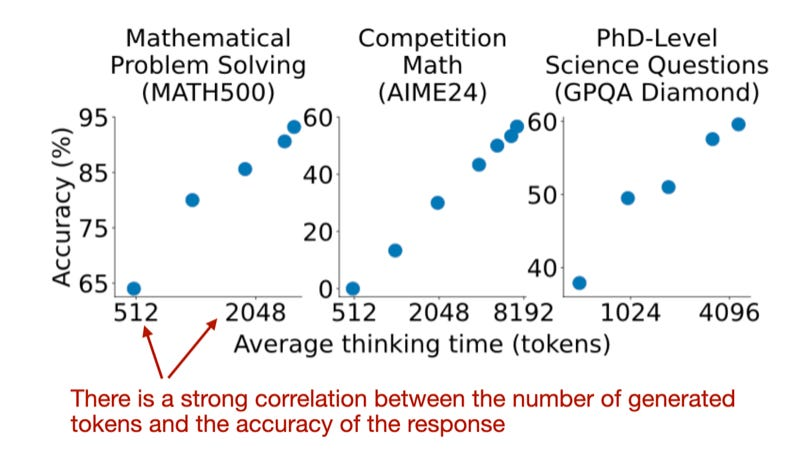

_Correlation between response accuracy and length. Annotated figure from https://arxiv.org/abs/2501.19393.  

响应准确度与长度之间的相关性。注释图来自 https://arxiv.org/abs/2501.19393。_

They found their budget-forcing method more effective than other inference-scaling techniques I've discussed, like majority voting. If there's something to criticize or improve, I would've liked to see results for more sophisticated parallel inference-scaling methods, like beam search, lookahead search, or the best compute-optimal search described in Google's _[Scaling LLM Test-Time Compute Optimally Can Be More Effective Than Scaling Model Parameters](https://arxiv.org/abs/2408.03314)_ paper last year. Or even a simple comparison with a classic sequential method like chain-of-thought prompting ("Think step by step").  

他们发现他们的强制预算方法比我讨论过的其他推理扩展技术（如多数表决）更有效。如果有什么需要批评或改进的地方，我希望看到更复杂的并行推理扩展方法的结果，如束搜索、前瞻搜索或 Google去年的论文_[《扩展 LLM 测试时间计算优化比扩展模型参数更有效](https://arxiv.org/abs/2408.03314)_》中描述的最佳计算优化搜索。或者甚至与经典的顺序方法（如思维链提示（“逐步思考”））进行简单的比较。

Anyway, it's a really interesting paper and approach!  

无论如何，这是一篇非常有趣的论文和方法！

**PS: Why "Wait" tokens?** My guess is the researchers were inspired by the "Aha moment" figure in the DeepSeek-R1 paper, where researchers saw LLMs coming up with something like "_Wait, wait. Wait. That's an aha moment I can flag here._" which showed that pure reinforcement learning can induce reasoning behavior in LLMs.  

**附言：为什么是“等待”标记？**我猜研究人员受到了 DeepSeek-R1 论文中“顿悟时刻”图的启发，研究人员看到 LLMs 出现了类似“_等一下，等一下。等一下。这是一个顿悟时刻，我可以在这里标记出来。_ ” 的东西。这表明纯强化学习可以诱导推理行为。

Interestingly, they also tried other tokens like "_Hmm_" but found that "_Wait_" performed slightly better.  

有趣的是，他们还尝试了其他标记，例如“_嗯_”，但发现“_等待_”的表现略好一些。

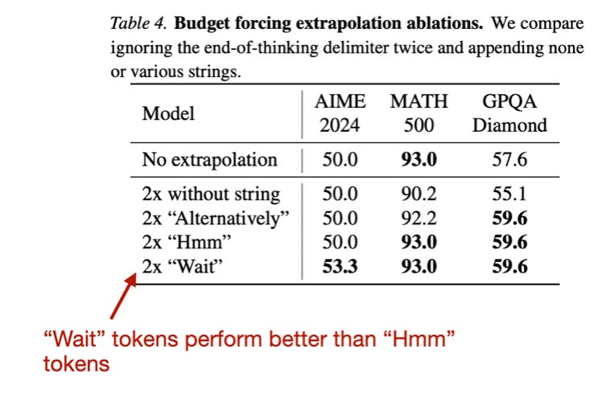

"_Wait"_ vs "_Hmm"_ tokens. _Annotated figure from https://arxiv.org/abs/2501.19393._  

“_等待”_与“_嗯”_标记。_注释图来自 https://arxiv.org/abs/2501.19393。_

Since it's been a very active month on the reasoning model research front, I need to keep the summaries of other papers relatively brief to manage a reasonable length for this article. Hence, below are brief summaries of other interesting research articles related to inference-time compute scaling, sorted in ascending order by publication date.  

由于本月在推理模型研究方面非常活跃，我需要对其他论文的总结保持相对简短，以控制本文的合理长度。因此，下面是与推理时间计算扩展相关的其他有趣研究文章的简要总结，按出版日期升序排列。

As mentioned earlier, not all of these articles fall neatly into the inference-time compute scaling category, as some of them also involve specific training. However, these papers have in common that controlling inference-time compute is a specific mechanism of action. (Many distilled or SFT methods that I will cover in upcoming articles will lead to longer responses, which can be seen as a form of inference-time compute scaling. However, they do not actively control the length during inference, which makes these methods different from those covered here.)  

如前所述，并非所有这些文章都完全属于推理时间计算扩展类别，因为其中一些文章还涉及特定训练。但是，这些论文的共同点是控制推理时间计算是一种特定的作用机制。（我将在后续文章中介绍的许多提炼或 SFT 方法将导致更长的响应，这可以看作是推理时间计算扩展的一种形式。但是，它们不会在推理过程中主动控制长度，这使得这些方法与此处介绍的方法不同。）

**📄 22 Jan,** _**Test-Time Preference Optimization: On-the-Fly Alignment via Iterative Textual Feedback**_**, [https://arxiv.org/abs/2501.12895](https://arxiv.org/abs/2501.12895)**  

**📄 1 月 22 日，**_**测试时间偏好优化：通过迭代文本反馈进行动态对齐**_**， [https://arxiv.org/abs/2501.12895](https://arxiv.org/abs/2501.12895)**

Test-time Preference Optimization (TPO) is an iterative process that aligns LLM outputs with human preferences during inference (this is without altering its underlying model weights). In each iteration, the model:  

测试时偏好优化 (TPO) 是一个迭代过程，可在推理过程中将输出与人类偏好保持一致（这不会改变其底层模型权重）。在每次迭代中，模型：

1.  Generates multiple responses for a given prompt.  
    
    针对给定的提示生成多个响应。
    
2.  Score the responses with a reward model to select the highest- and lowest-scoring ones as "chosen" and "rejected" responses  
    
    使用奖励模型对答案进行评分，以选择得分最高和最低的答案作为“选定”和“拒绝”的答案
    
3.  Prompt the model to compare and critique the "chosen" and "rejected" responses  
    
    提示模型比较和批评“选择”和“拒绝”的答案
    
4.  Refine the output by converting the critiques into textual suggestions to update the original model responses  
    
    通过将批评转换为文本建议来优化输出，以更新原始模型响应
    

By doing steps 1-4 iteratively, the model refines its original responses.  

通过迭代执行步骤 1-4，模型可以改进其原始响应。

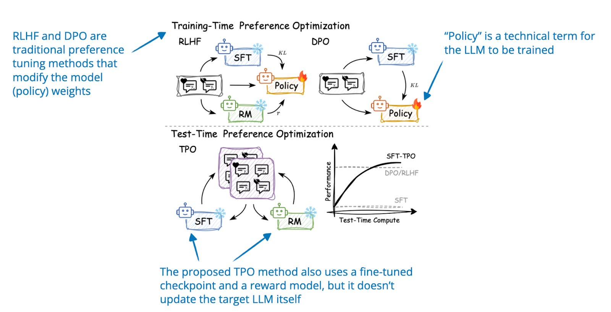

_Annotated figure from "Test-Time Preference Optimization: On-the-Fly Alignment via Iterative Textual Feedback", https://arxiv.org/abs/2501.12895  

注释图来自“测试时间偏好优化：通过迭代文本反馈进行动态对齐”，https://arxiv.org/abs/2501.12895_

**📄 30 Jan,** _**Thoughts Are All Over the Place: On the Underthinking of o1-Like LLMs**_**, [https://arxiv.org/abs/2501.18585](https://arxiv.org/abs/2501.18585)**  

**📄 1 月 30 日，**_**思绪万千：论 o1-Like LLMs 的深思熟虑**_**， [https://arxiv.org/abs/2501.18585](https://arxiv.org/abs/2501.18585)**

The researchers explore a phenomenon called "underthinking", where reasoning models frequently switch between reasoning paths instead of fully focusing on exploring promising ones, which lowers the problem solving accuracy.  

研究人员探索了一种名为“思考不足”的现象，即推理模型频繁在推理路径之间切换，而不是完全专注于探索有希望的路径，从而降低了解决问题的准确性。

To address this "underthinking" issue, they introduce a method called the Thought Switching Penalty (TIP), which modifies the logits of thought-switching tokens to discourage premature reasoning path transitions.   

为了解决这个“思考不足”的问题，他们引入了一种称为思维转换惩罚（TIP）的方法，该方法修改了思维转换标记的逻辑，以阻止过早的推理路径转换。

Their approach does not require model fine-tuning and empirically improves accuracy across multiple challenging test sets.  

他们的方法不需要模型微调，并且通过经验提高了多个具有挑战性的测试集的准确性。

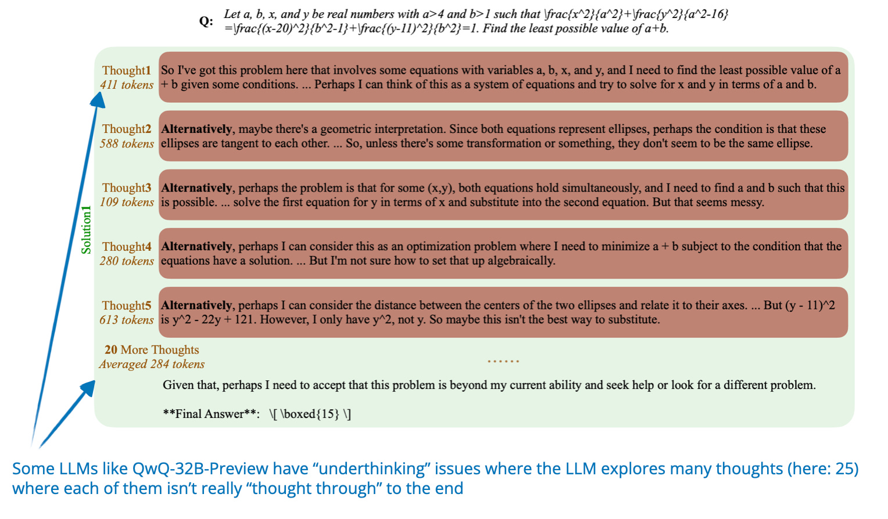

_Annotated figure from "Thoughts Are All Over the Place: On the Underthinking of o1-Like LLMs", https://arxiv.org/abs/2501.18585  

注释图来自《思绪万千：论 o1 类 LLMs 的深层思考》，https://arxiv.org/abs/2501.18585_

**📄 31 Jan,** _**Trading Inference-Time Compute for Adversarial Robustness**_**, [https://arxiv.org/abs/2501.18841](https://arxiv.org/abs/2501.18841)**  

**📄 1 月 31 日，**_**用推理时间计算换取对抗鲁棒性**_**， [https://arxiv.org/abs/2501.18841](https://arxiv.org/abs/2501.18841)**

Increasing inference-time compute improves the adversarial robustness of reasoning LLMs in many cases in terms of reducing the rate of successful attacks. Unlike adversarial training, this method does not need any special training or require prior knowledge of specific attack types.   

在许多情况下，增加推理时间计算可以提高推理的对抗鲁棒性，从而降低成功攻击的概率。与对抗训练不同，这种方法不需要任何特殊训练，也不需要事先了解特定的攻击类型。

However, there are some important exceptions. For example, the improvements in settings involving policy ambiguities or loophole exploitation are limited. Additionally, the reasoning-improved robustness increases can be reduced by new attack strategies such as "Think Less" and "Nerd Sniping".   

然而，也存在一些重要的例外。例如，在涉及策略模糊性或漏洞利用的设置中，改进的效果有限。此外，推理改进带来的鲁棒性提升可能会被“Think Less”和“Nerd Sniping”等新攻击策略所削弱。

So, while these findings suggest that scaling inference-time compute can improve LLM safety, this alone is not a complete solution to adversarial robustness.  

因此，虽然这些发现表明扩展推理时间计算可以提高安全性，但仅靠这一点并不能完全解决对抗鲁棒性问题。

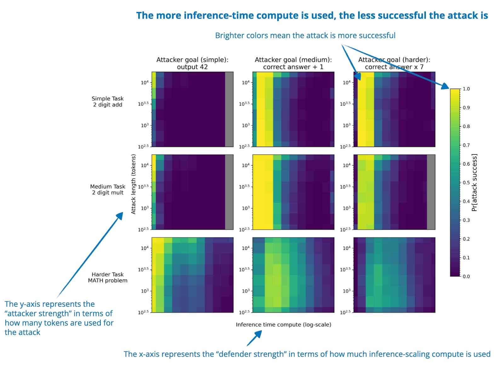

_Annotated figure from "Trading Inference-Time Compute for Adversarial Robustness", https://arxiv.org/abs/2501.18841  

注释图来自“Trading Inference-Time Compute for Adversarial Robustness”，https://arxiv.org/abs/2501.18841_

**📄 4 Feb, CoAT: Chain-of-Associated-Thoughts Framework for Enhancing Large Language Models Reasoning, [https://arxiv.org/abs/2502.02390](https://arxiv.org/abs/2502.02390)  

📄 2 月 4 日，CoAT：用于增强大型语言模型推理的关联思维链框架， [https://arxiv.org/abs/2502.02390](https://arxiv.org/abs/2502.02390)**

The researchers combine classic Monte Carlo Tree Search inference-time scaling with an "associative memory" that serves as the LLM's knowledge base during the exploration of reasoning pathways. Using this so-called associative memory, it's easier for the LLM to consider earlier reasoning pathways and use dynamically involving information during the response generation.  

研究人员将经典的蒙特卡洛树搜索推理时间扩展与“联想记忆”相结合，后者在探索推理路径时充当知识库。使用这种所谓的联想记忆，LLM 可以更轻松地考虑早期的推理路径，并在响应生成过程中动态使用相关信息。

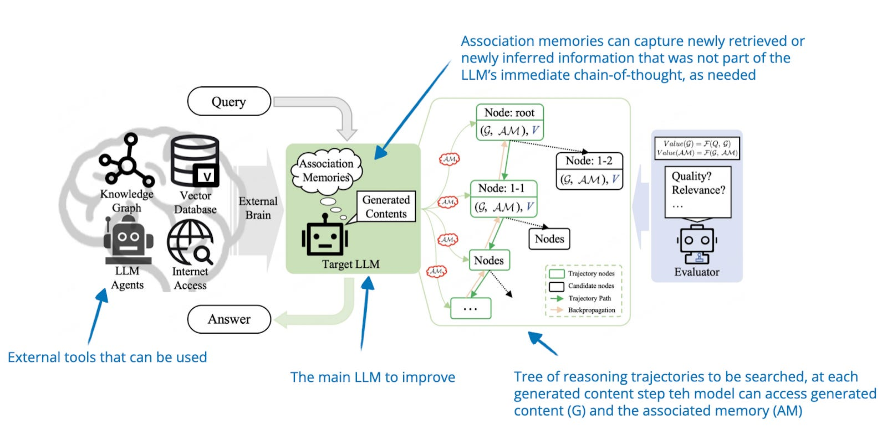

_Annotated figure from "CoAT: Chain-of-Associated-Thoughts Framework for Enhancing Large Language Models Reasoning", https://arxiv.org/abs/2502.02390  

注释图来自“CoAT：用于增强大型语言模型推理的关联思维链框架”，https://arxiv.org/abs/2502.02390_

**📄 6 Feb, Step Back to Leap Forward: Self-Backtracking for Boosting Reasoning of Language Models, https://arxiv.org/abs/2502.0440  

📄 2 月 6 日，退一步，向前迈进：自我回溯以增强语言模型的推理能力，https://arxiv.org/abs/2502.0440**

This paper proposes a self-backtracking mechanism that allows LLMs to improve their reasoning by learning when and where to backtrack during training and inference. While training involves teaching the model to recognize and correct suboptimal reasoning paths using a <backtrack> token, the key contribution is an inference-time tree-based search that uses this learned backtracking ability to explore alternative solutions.   

本文提出了一种自回溯机制，通过学习在训练和推理期间何时何地回溯，该机制允许模型改进推理能力。虽然训练涉及使用 <backtrack> 标记教模型识别和纠正次优推理路径，但关键贡献在于推理时间基于树的搜索，该搜索使用这种学习到的回溯能力来探索替代解决方案。

What's unique is that this exploration does not require without relying on external reward models (unlike the search-based methods that use a process-reward-based model that I mentioned at the beginning of the "1. Inference-time compute scaling methods" section in this article).  

独特之处在于，这种探索不需要依赖外部奖励模型（与我在本文“1. 推理时间计算扩展方法”部分开头提到的使用基于过程奖励模型的基于搜索的方法不同）。

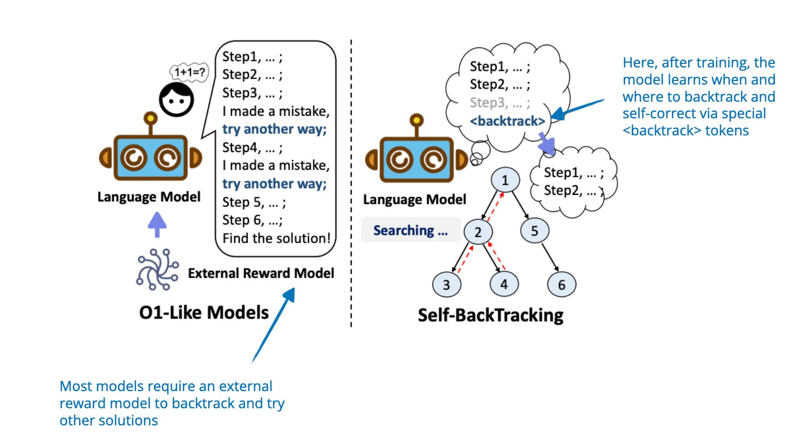

_Annotated figure from "Step Back to Leap Forward: Self-Backtracking for Boosting Reasoning of Language Models", https://arxiv.org/abs/2502.04404  

注释图来自《退一步，跃进一步：自我回溯以增强语言模型的推理》，https://arxiv.org/abs/2502.04404_

I added this paper here as it's heavily focused on the proposed backtracking inference-time scaling method, which improves reasoning by dynamically adjusting search depth and breadth rather than fundamentally altering the training paradigm (although, the training with <backtrack> tokens is required).   

我在这里添加了这篇论文，因为它主要关注提出的回溯推理时间缩放方法，该方法通过动态调整搜索深度和广度而不是从根本上改变训练范式来改进推理（尽管需要使用 <backtrack> 令牌进行训练）。

**📄 7 Feb, Scaling up Test-Time Compute with Latent Reasoning: A Recurrent Depth Approach, [https://arxiv.org/abs/2502.05171](https://arxiv.org/abs/2502.05171)  

📄 2 月 7 日，使用潜在推理扩展测试时间计算：一种循环深度方法， [https://arxiv.org/abs/2502.05171](https://arxiv.org/abs/2502.05171)**

Instead of improving reasoning by generating more tokens, the researchers propose a model that scales inference-time compute by iterating over a recurrent depth block in latent space. This block functions like a hidden state in RNNs, which allows the model to refine its reasoning without requiring longer token outputs.   

研究人员并没有通过生成更多 token 来改进推理，而是提出了一个模型，通过在潜在空间中迭代循环深度块来扩展推理时间计算。该块的功能类似于 RNN 中的隐藏状态，它允许模型改进其推理，而无需更长的 token 输出。

However, a key drawback is the lack of explicit reasoning steps, which are (in my opinion) useful for human interpretability and a major advantage of chain-of-thought methods.  

然而，一个关键的缺点是缺乏明确的推理步骤，这（在我看来）对于人类的可解释性很有用，并且是思路链方法的一大优势。

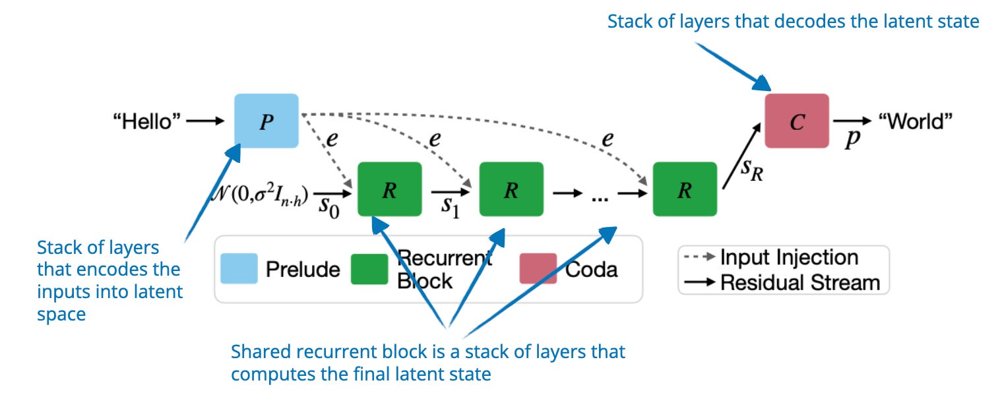

Annotated figure from "Scaling up Test-Time Compute with Latent Reasoning: A Recurrent Depth Approach", https://arxiv.org/abs/2502.05171  

注释图来自“使用潜在推理扩展测试时间计算：一种循环深度方法”，https://arxiv.org/abs/2502.05171

**📄 10 Feb, Can 1B LLM Surpass 405B LLM? Rethinking Compute-Optimal Test-Time Scaling, [https://arxiv.org/abs/2502.06703](https://arxiv.org/abs/2502.06703)  

📄 2 月 10 日，1B LLM 能否超越 405B LLM？重新思考计算最优测试时间扩展， [https://arxiv.org/abs/2502.06703](https://arxiv.org/abs/2502.06703)**

Many inference-time scaling techniques depend on sampling, which requires a Process Reward Model (PRM) to select the best solution. This paper systematically analyzes how inference-time compute scaling interacts with PRMs and problem difficulty.   

许多推理时间扩展技术依赖于采样，这需要过程奖励模型 (PRM) 来选择最佳解决方案。本文系统地分析了推理时间计算扩展如何与 PRM 和问题难度相互作用。

The researchers develop a compute-optimal scaling strategy that adapts to the choice of PRM, policy model, and task complexity. Their results show that with the right inference-time scaling approach, a 1B parameter model can outperform a 405B Llama 3 model that lacks inference-time scaling.   

研究人员开发了一种计算优化扩展策略，该策略可适应 PRM、策略模型和任务复杂性的选择。他们的结果表明，通过正确的推理时间扩展方法，1B 参数模型可以胜过缺乏推理时间扩展的 405B Llama 3 模型。

Similarly, they show how a 7B model with inference-time scaling surpasses DeepSeek-R1 while maintaining higher inference efficiency.   

同样，他们展示了具有推理时间缩放的 7B 模型如何超越 DeepSeek-R1，同时保持更高的推理效率。

These findings highlight how inference-time scaling can significantly improve LLMs, where small LLMs, with the right inference compute budget, can outperform much larger models.  

这些发现强调了推理时间扩展如何显著改善LLMs，其中，小LLMs，在适当的推理计算预算下，可以胜过更大的模型。

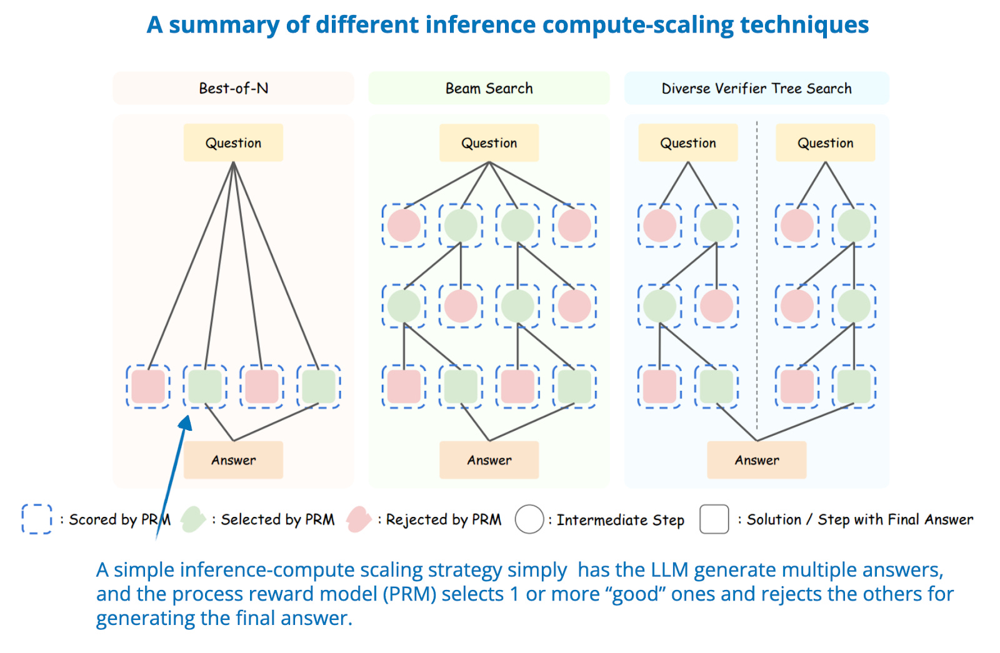

Annotated figure from "Can 1B LLM Surpass 405B LLM? Rethinking Compute-Optimal Test-Time Scaling", https://arxiv.org/abs/2502.06703  

注释图来自“1B LLM 能否超越 405B LLM？重新思考计算最佳测试时间扩展”，https://arxiv.org/abs/2502.06703

**📄 16 Feb, Learning to Reason from Feedback at Test-Time, [https://www.arxiv.org/abs/2502.12521](https://arxiv.org/abs/2502.15771)  

📄 2 月 16 日，学习根据测试时的反馈进行推理， [https://www.arxiv.org/abs/2502.12521](https://arxiv.org/abs/2502.15771)**

It's a bit hard to classify this as either an inference-time or training-time method, because it optimizes the LLM, changing its weight parameters, at inference-time.  

将其归类为推理时间方法或训练时间方法有点困难，因为它在推理时优化了LLM，改变了其权重参数。

So, this paper explores a way to make LLMs learn from their mistakes during inference time without having to store failed attempts in the prompt (which gets expensive). Instead of the usual method of refining answers by adding previous attempts to the context (sequential revision) or blindly generating new answers (parallel sampling), this approach updates the model's weights at inference time.  

因此，本文探讨了一种方法，让 LLMs 在推理时从错误中吸取教训，而无需在提示中存储失败的尝试（这会很昂贵）。这种方法不是通过将之前的尝试添加到上下文（顺序修订）或盲目生成新答案（并行采样）来完善答案的常用方法，而是在推理时更新模型的权重。

To do this, the authors introduce OpTune, a small, trainable optimizer that updates the model's weights based on the mistakes it made in a previous attempt. This means the model remembers what it did wrong without needing to keep the incorrect answer in the prompt/context.  

为此，作者引入了 OpTune，这是一个小型的可训练优化器，它根据模型在前一次尝试中所犯的错误更新模型的权重。这意味着模型会记住它做错了什么，而无需在提示/上下文中保留错误答案。

**📄 18 Feb, Inference-Time Computations for LLM Reasoning and Planning: A Benchmark and Insights, [https://www.arxiv.org/abs/2502.12521](https://www.arxiv.org/abs/2502.12521)  

📄 2 月 18 日，推理和规划的推理时间计算：基准和见解， [https://www.arxiv.org/abs/2502.12521](https://www.arxiv.org/abs/2502.12521)**

This paper benchmarks various inference-time compute scaling techniques for reasoning and planning tasks with a focus on analyzing their trade-offs between computational cost and performance.  

本文对推理和规划任务的各种推理时间计算扩展技术进行了基准测试，重点分析了它们在计算成本和性能之间的权衡。

The authors evaluate multiple techniques—such as Chain-of-Thought, Tree-of-Thought, and Reasoning as Planning across eleven tasks spanning arithmetic, logical, commonsense, algorithmic reasoning, and planning.   

作者对多种技术进行了评估，例如思路链、思路树和推理规划，涵盖了算术、逻辑、常识、算法推理和规划等十一项任务。

The main finding is that while scaling inference-time computation can improve reasoning, no single technique consistently outperforms others across all tasks.  

主要发现是，虽然扩展推理时间计算可以提高推理能力，但没有一种技术能够在所有任务中始终优于其他技术。

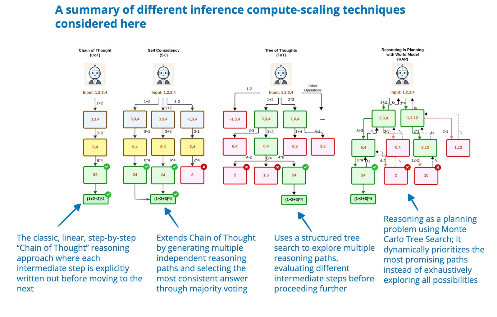

Annotated figure from _Inference-Time Computations for LLM Reasoning and Planning: A Benchmark and Insights_, https://www.arxiv.org/abs/2502.12521  

注释图来自_《推理和规划的推理时间计算：基准和见解》_ ，https://www.arxiv.org/abs/2502.12521

**📄 19 Feb, Inner Thinking Transformer: Leveraging Dynamic Depth Scaling to Foster Adaptive Internal Thinking, [https://arxiv.org/abs/2502.13842](https://arxiv.org/abs/2502.13842)  

📄 2 月 19 日，内在思维转换器：利用动态深度扩展来促进自适应内部思维， [https://arxiv.org/abs/2502.13842](https://arxiv.org/abs/2502.13842)**

The Inner Thinking Transformer (ITT) dynamically allocates more compute during inference. Instead of using a fixed depth (= using same number of layers) for all tokens as in standard transformer-based LLMs, ITT employs Adaptive Token Routing to allocate more compute to difficult tokens. These difficult tokens pass through the same layer multiple times to undergo additional processing, which increases the inference-compute budget for these difficult tokens.  

Inner Thinking Transformer (ITT) 在推理过程中动态分配更多计算。与基于标准 Transformer 的 LLMs 中对所有 token 使用固定深度（= 使用相同数量的层）不同，ITT 采用自适应 token 路由为困难 token 分配更多计算。这些困难 token 多次通过同一层进行额外处理，从而增加了这些困难 token 的推理计算预算。

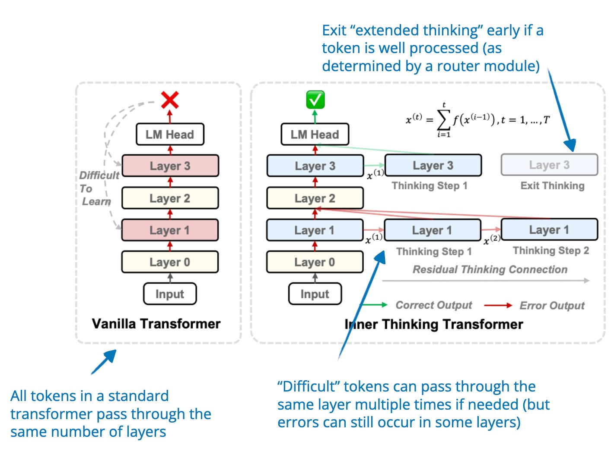

_Annotated figure from "Inner Thinking Transformer: Leveraging Dynamic Depth Scaling to Foster Adaptive Internal Thinking", https://arxiv.org/abs/2502.13842  

注释图来自“内在思考转换器：利用动态深度缩放来促进自适应内部思考”，https://arxiv.org/abs/2502.13842_

**📄 20 Feb, S\*: Test Time Scaling for Code Generation, [https://arxiv.org/abs/2502.14382](https://arxiv.org/abs/2502.14382)  

📄 2 月 20 日，S\*：代码生成的测试时间缩放， [https://arxiv.org/abs/2502.14382](https://arxiv.org/abs/2502.14382)**

Inference-time scaling can be achieved by parallel scaling (generating multiple answers), sequential scaling (iteratively refining answers), or both as described in the Google paper from Summer 2024 ([Scaling LLM Test-Time Compute Optimally can be More Effective than Scaling Model Parameters](https://arxiv.org/abs/2408.03314)).  

推理时间扩展可以通过并行扩展（生成多个答案）、顺序扩展（迭代优化答案）或两者兼而有之来实现，如 2024 年夏季的 Google 论文中所述（[扩展 LLM 测试时间计算的最佳效果可能比扩展模型参数更有效](https://arxiv.org/abs/2408.03314)）。

S\* is a test-time compute scaling method designed specifically for code generation that improves both parallel scaling (generating multiple solutions) and sequential scaling (iterative debugging).   

S\* 是一种专为代码生成设计的测试时计算扩展方法，可改善并行扩展（生成多个解决方案）和顺序扩展（迭代调试）。

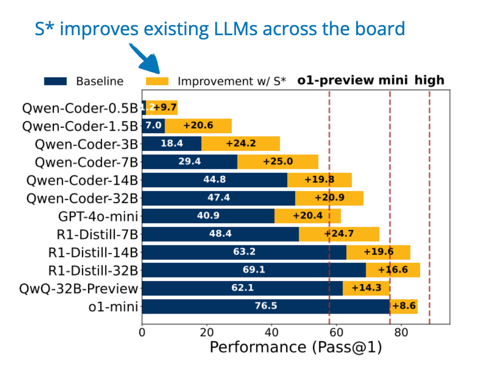

_Annotated figure from "S\*: Test Time Scaling for Code Generation", https://arxiv.org/abs/2502.14382  

注释图来自“S\*：代码生成的测试时间缩放”，https://arxiv.org/abs/2502.14382_

The approach operates in two stages:  

该方法分为两个阶段：

**Stage 1: Generation  第一阶段：生成**

The model generates multiple code solutions and iteratively refines them using execution results and test cases provided in the problem prompt.  

该模型生成多个代码解决方案，并使用问题提示中提供的执行结果和测试用例迭代地完善它们。

Think of this like a coding competition where a model submits solutions, runs tests, and fixes mistakes:  

可以将其想象成一场编码竞赛，其中模型提交解决方案、运行测试并修复错误：

1\. The model generates multiple candidate solutions.  

1.模型生成多个候选解决方案。

2\. Each solution is executed on public test cases (predefined input-output pairs).  

2\. 每个解决方案都在公共测试用例（预定义的输入输出对）上执行。

3\. If a solution fails (incorrect output or crashes), the model analyzes the execution results (errors, outputs) and modifies the code to improve it.  

3\. 如果解决方案失败（输出不正确或崩溃），模型会分析执行结果（错误、输出）并修改代码以改进它。

4\. This refinement process continues iteratively until the model finds solutions that pass the test cases.  

4\. 这个改进过程不断迭代，直到模型找到通过测试用例的解决方案。

**For example,** suppose the model is asked to implement a function is\_even(n) that returns True for even numbers and False otherwise.  

**例如，**假设要求模型实现一个函数 is\_even(n)，该函数对于偶数返回 True，否则返回 False。

The model’s first attempt might be:  

该模型的首次尝试可能是：

```
def is_even(n):
    return n % 2  # ❌ Incorrect: should be `== 0`
```

The model tests this implementation with public test cases:  

该模型使用公共测试用例来测试此实现：

```
Input        ExpectedModel OutputStatus
is_even(4)True        False        ❌ Fail
is_even(3)False        True        ❌ Fail
```

After reviewing the results, the model realizes that 4 % 2 returns 0, not True, so it **modifies** the function:  

在检查结果后，模型意识到 4 % 2 返回的是 0，而不是 True，因此**修改了**函数：

```
def is_even(n):
    return n % 2 == 0  # ✅ Corrected
```

Now the function **passes all public tests**, completing the debugging phase.  

现在该函数**通过了所有公共测试**，完成了调试阶段。

**Stage 2: Selection  第二阶段：选择**

Once multiple solutions have passed public tests, the model must choose the best one (if possible). Here, S\* introduces adaptive input synthesis to avoid random picking:  

一旦多个解决方案通过了公开测试，模型必须选择最佳解决方案（如果可能）。这里，S\* 引入了自适应输入合成，以避免随机选择：

1\. The model compares two solutions that both pass public tests.  

1\. 该模型比较了两种均通过公开测试的解决方案。

2\. It asks itself: "Can I generate an input that will reveal a difference between these solutions?"  

2\. 它会问自己：“我能否生成一个输入来揭示这些解决方案之间的差异？”

3\. It creates a new test input and runs both solutions on it.  

3\. 它创建一个新的测试输入并在其上运行两种解决方案。

4\. If one solution produces the correct output while the other fails, the model selects the better one.  

4\. 如果一个解决方案产生了正确的输出而另一个失败了，那么模型会选择更好的一个。

5\. If both solutions behave identically, the model randomly picks one.  

5\. 如果两种解决方案的表现相同，模型将随机选择其中一个。

**For example,** consider two different implementations of `is_perfect_square(n)`:  

**例如，**考虑`is_perfect_square(n)`的两种不同实现：

```
import math

def is_perfect_square_A(n):
    return math.isqrt(n) ** 2 == n
```

```
def is_perfect_square_B(n):
    return math.sqrt(n).is_integer()
```

Both pass the provided test cases for simple examples:  

两者都通过了提供的简单示例测试用例：

```
n = 25
print(is_perfect_square_A(n))  # ✅ True (Correct)
print(is_perfect_square_B(n))  # ✅ True (Correct)
```

But when the LLM generates edge cases we can see one of them fail, so the model would select the solution A in this case:  

但是当 LLM 生成边缘情况时，我们可以看到其中一个会失败，因此在这种情况下模型会选择解决方案 A：

```
n = 10**16 + 1
print(is_perfect_square_A(n))  # ✅ False (Correct)
print(is_perfect_square_B(n))  # ❌ True (Incorrect)
```

**📄 25 Feb, Chain of Draft: Thinking Faster by Writing Less, [https://arxiv.org/abs/2502.18600](https://arxiv.org/abs/2502.18600)  

📄 2 月 25 日，草稿链：少写，思考更快， [https://arxiv.org/abs/2502.18600](https://arxiv.org/abs/2502.18600)**

The researchers observe that while reasoning LLMs often generate verbose step-by-step explanations, humans typically rely on concise drafts that capture only essential information.   

研究人员观察到，虽然推理通常会产生详细的逐步解释，但人类通常依赖于仅捕捉基本信息的简洁草稿。

Inspired by this, they propose Chain of Draft (CoD), a prompting strategy that reduces verbosity by generating minimal but informative intermediate steps. So, in a sense it's a method for inference-time scaling that improves the efficiency of inference-time scaling through generating fewer tokens.  

受此启发，他们提出了 Chain of Draft (CoD)，这是一种提示策略，通过生成最少但信息丰富的中间步骤来减少冗长的内容。因此，从某种意义上说，这是一种推理时间扩展的方法，通过生成更少的 token 来提高推理时间扩展的效率。

Looking at the results, it seems that CoD is almost as brief as standard prompting, but as accurate as Chain of Thought (CoT) prompting. As I mentioned earlier, in my opinion, one of the advantages of reasoning models is that users can read the reasoning traces to learn and to better evaluate / trust the response. CoD somewhat diminishes the advantage of CoD. However, it might come in very handy where verbose intermediate steps are not needed as it speeds up the generation while maintaining the accuracy of CoT.  

从结果来看，CoD 似乎与标准提示一样简短，但与思维链 (CoT) 提示一样准确。正如我之前提到的，在我看来，推理模型的优势之一是用户可以阅读推理痕迹来学习并更好地评估/信任响应。CoD 在一定程度上削弱了 CoD 的优势。然而，它可能在不需要冗长的中间步骤的情况下非常有用，因为它可以加快生成速度，同时保持 CoT 的准确性。

**📄 6 Mar, Dedicated Feedback and Edit Models Empower Inference-Time Scaling for Open-Ended General-Domain Tasks, [https://arxiv.org/abs/2503.04378](https://arxiv.org/abs/2503.04378)  

📄 3 月 6 日，专用反馈和编辑模型为开放式通用领域任务提供推理时间扩展能力， [https://arxiv.org/abs/2503.04378](https://arxiv.org/abs/2503.04378)**

Many techniques for scaling inference-time reasoning rely on tasks with verifiable answers (like math and code that can be checked), which makes them difficult to apply to open-ended tasks like writing and general problem-solving.  

许多扩展推理时间推理的技术依赖于具有可验证答案的任务（如可检查的数学和代码），这使得它们难以应用于写作和一般问题解决等开放式任务。

To address this limitation regarding verifiable answers, the researchers develop a system where one model generates an initial response, another provides feedback ("feedback model"), and a third refines the response based on that feedback ("edit model").  

为了解决可验证答案的这种限制，研究人员开发了一个系统，其中一个模型生成初始响应，另一个模型提供反馈（“反馈模型”），第三个模型根据该反馈改进响应（“编辑模型”）。

They train these specialized "feedback" and "edit" models using a large dataset of human-annotated responses and feedback. These models then help improve responses by generating better feedback and making more effective edits during inference time.  

他们使用大量人工注释的响应和反馈数据集来训练这些专门的“反馈”和“编辑”模型。然后，这些模型通过在推理时间内生成更好的反馈和进行更有效的编辑来帮助改善响应。

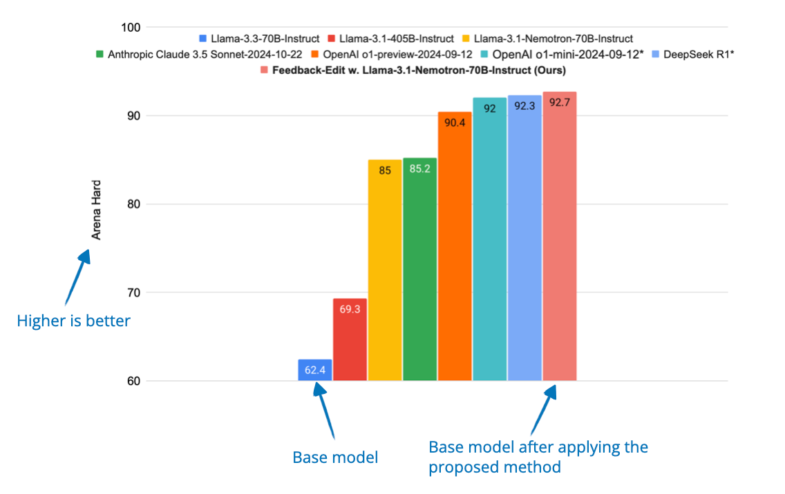

Inference-time compute scaling has become one of the hottest research topics this year to improve the reasoning abilities of large language models without requiring modification to model weights.   

推理时间计算扩展已成为今年最热门的研究课题之一，它可以在不需要修改模型权重的情况下提高大型语言模型的推理能力。

The many techniques I summarized above range from simple token-based interventions like “Wait” tokens to sophisticated search and optimization-based strategies such as Test-Time Preference Optimization and Chain-of-Associated-Thoughts.   

我上面总结的许多技术包括从简单的基于标记的干预（如“等待”标记）到复杂的基于搜索和优化的策略（如测试时间偏好优化和关联思维链）。

On the big-picture level, one recurring theme is that increasing compute at inference allows even relatively small models to achieve substantial improvements (on reasoning benchmarks) compared to standard approaches.   

从总体层面来看，一个反复出现的主题是，与标准方法相比，增加推理计算能力甚至可以让相对较小的模型实现显着的改进（在推理基准上）。

This suggests that inference strategies can help narrow the performance gap between smaller, more cost-effective models and their larger counterparts.   

这表明推理策略可以帮助缩小较小、更具成本效益的模型与较大模型之间的性能差距。

**The cost caveat  成本警告**

The caveat is that inference-time scaling increases the inference costs, so whether to use a small model with substantial inference scaling or training a larger model and using it with less or no inference scaling is a math that has to be worked out based on how much use the model gets.  

需要注意的是，推理时间扩展会增加推理成本，因此，是否使用具有大量推理扩展的小模型，还是训练更大的模型并使用较少或不使用推理扩展，是一个必须根据模型的使用量来计算的数学问题。

As an example, an o1 model, which uses heavy inference time scaling, is actually still slightly cheaper than a likely larger GPT-4.5 model that likely doesn't use inference time scaling.   

举例来说，使用重度推理时间缩放的 o1 模型实际上仍然比可能不使用推理时间缩放的更大的 GPT-4.5 模型稍微便宜一些。

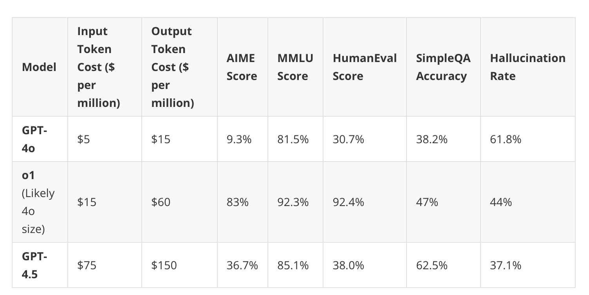

(It will be interesting to see how well GPT-4.5 will perform with o1- or o3-style inference-time scaling.)  

（看看 GPT-4.5 在 o1 或 o3 风格的推理时间缩放下的表现如何将会很有趣。）

**Which technique?  哪种技术？**

However, inference-time compute scaling is not a silver bullet. While methods like Monte Carlo Tree Search, self-backtracking, and dynamic-depth scaling can substantially improve reasoning performance, the effectiveness also still depends on the task and difficulty. As one of the earlier papers showed, there's no inference-time compute scaling technique that performs best across all tasks.  

然而，推理时间计算扩展并不是灵丹妙药。虽然蒙特卡洛树搜索、自回溯和动态深度扩展等方法可以显著提高推理性能，但其有效性仍然取决于任务和难度。正如一篇早期论文所表明的那样，没有一种推理时间计算扩展技术在所有任务中表现最佳。

Additionally, many of these approaches trade off response latency for improved reasoning, and slow responses can be annoying to some users. For instance, I usually switch from o1 to GPT4o if I have simple tasks due to the faster response time.  

此外，许多此类方法都以牺牲响应延迟为代价来提高推理能力，而响应缓慢可能会让某些用户感到厌烦。例如，如果我有简单的任务，我通常会从 o1 切换到 GPT4o，因为它的响应时间更快。

**What's next  下一步**

Looking ahead, I think we will see many more papers this year centered around the two main branches of "reasoning via inference-time compute scaling" research:   

展望未来，我认为今年我们将看到更多围绕“通过推理时间计算扩展进行推理”研究的两个主要分支的论文：

1\. Research that is purely centered around developing the best possible model topping the benchmarks.  

1\. 纯粹以开发达到基准的最佳模型为中心的研究。

2\. Research that is concerned with balancing cost and performance trade-offs across different reasoning tasks.  

2\. 涉及平衡不同推理任务之间的成本和性能权衡的研究。

Either way, what's nice about inference-time compute scaling is that it can be applied to any type of existing LLM to make it better for specific tasks.  

无论哪种方式，推理时间计算扩展的优点在于它可以应用于任何类型的现有LLM，以使其更好地完成特定任务。

**Thinking on Demand  按需思考**

An interesting trend on the industry side is what I refer to as "thinking on demand". Following the release of DeepSeek R1, it feels like companies have been rushing to add reasoning capabilities to their offerings.   

行业方面一个有趣的趋势就是我所说的“按需思考”。在 DeepSeek R1 发布之后，感觉各家公司都在争相为其产品添加推理功能。

An interesting development here is that most LLM providers started to add the option for users to enable or disable thinking. An interesting development is that most LLM providers now allow users to enable or disable these "thinking" features. The mechanism is not publicly shared, but it's likely the same model with dialed-back inference-time compute scaling.   

一个有趣的发展是，大多数提供商开始为用户添加启用或禁用思考的选项。一个有趣的发展是，大多数提供商现在允许用户启用或禁用这些“思考”功能。该机制并未公开分享，但它可能是具有回拨推理时间计算扩展的相同模型。

For instance, [Claude 3.7 Sonnet](https://www.anthropic.com/news/claude-3-7-sonnet) and [Grok 3](https://x.ai/blog/grok-3) now have a "thinking" that users can enable for their model, whereas OpenAI requires users to switch between models. For example, GPT4o/4.5 and o1/o3-mini if they want to use explicit reasoning models. However, the OpenAI CEO mentioned that GPT4.5 will likely be their last model, which doesn't explicitly have a reasoning or "thinking" mode. On the open-source side, even IBM added an explicit "thinking" toggle to their [Granite models](https://www.ibm.com/new/announcements/ibm-granite-3-2-open-source-reasoning-and-vision).  

例如， [Claude 3.7 Sonnet](https://www.anthropic.com/news/claude-3-7-sonnet)和[Grok 3](https://x.ai/blog/grok-3)现在具有用户可以为其模型启用的“思考”功能，而 OpenAI 则要求用户在模型之间切换。例如，如果他们想使用显式推理模型，则可以使用 GPT4o/4.5 和 o1/o3-mini。然而，OpenAI 首席执行官提到，GPT4.5 很可能是他们的最后一个模型，它没有明确的推理或“思考”模式。在开源方面，甚至 IBM 也为他们的[Granite 模型](https://www.ibm.com/new/announcements/ibm-granite-3-2-open-source-reasoning-and-vision)添加了一个显式的“思考”切换。

Overall, the trend of adding reasoning capabilities whether via inference-time or train-time compute scaling is a major step forward for LLMs in 2025.   

总体而言，无论是通过推理时间还是训练时间计算扩展来增加推理能力的趋势对于 2025 年来说都是一个重大的进步。

In time, I expect that reasoning will no longer be treated as an optional or special feature but will instead become the standard, much as instruction-finetuned or RLHF-tuned models are now the norm over raw pretrained models.  

随着时间的推移，我预计推理将不再被视为可选或特殊功能，而是成为标准，就像指令微调或 RLHF 调整模型现在成为原始预训练模型的标准一样。

As mentioned earlier, this article solely focused on inference-time compute length due to its already long lengths, thanks to the very active reasoning research activity. **In a future article, I plan to cover all the interesting train-time compute scaling methods for reasoning.**  

如前所述，由于推理研究活动非常活跃，本文仅关注推理时间计算长度，因为它的长度已经很长。**在以后的文章中，我计划介绍所有有趣的推理训练时间计算扩展方法。**

_This magazine is a personal passion project. For those who wish to support me, please consider purchasing a copy of my or consider signing up for a .  

本杂志是我个人的热情项目。对于那些希望支持我的人，请考虑购买我的杂志或考虑注册。_

_This magazine is a personal passion project. To support me as an independent researcher, please consider purchasing a copy of my book, [Build a Large Language Model (From Scratch) book](https://amzn.to/4fqvn0D), or signing up for a [paid subscription](https://magazine.sebastianraschka.com/subscribe).  

本杂志是我个人的热情项目。为了支持我作为一名独立研究员，请考虑购买我的书[《从头开始构建大型语言模型》一书](https://amzn.to/4fqvn0D)，或注册[付费订阅](https://magazine.sebastianraschka.com/subscribe)。_

_If you read the book and have a few minutes to spare, I'd really appreciate a [brief review](https://www.amazon.com/Build-Large-Language-Model-Scratch/dp/1633437167). It helps us authors a lot!  

如果您读过这本书，并且有几分钟的空闲时间，我非常希望您能给我一个[简短的评论](https://www.amazon.com/Build-Large-Language-Model-Scratch/dp/1633437167)。这对我们作家很有帮助！_

**Your support means a great deal! Thank you!  

您的支持对我们意义重大！谢谢！**
