## 

3 years ago, I wrote a list of generation-defining stats (like the fertility decline, tuition inflation, esports growth) that reached millions. Now, I'm back with more! From space debris to drone delivery to extreme weather… over a dozen digits that may define the decade 三年前，我写了一份定义世代特征的统计数据清单（例如生育率下降、学费上涨、电子竞技增长），这些数据影响了数百万人。  现在，我带着更多内容回来了！ 从太空垃圾到无人机送货再到极端天气……十几个数字或将定义未来十年  

💡 Since last thread (flagging the scale of AI models nearly a year before ChatGPT!), so much has changed. For one, technology is moving faster than ever. ChatGPT’s rise to 100m users was just 2 months. Phones? 22 years! But as you’ll see in this thread, it’s not just AI…  💡 自上一个帖子（在 ChatGPT 之前近一年标记了 AI 模型的规模！）以来，发生了很多变化。 首先，技术发展速度比以往任何时候都快。ChatGPT 的用户数量增长到 1 亿只用了 2 个月的时间。 电话？22年！ 但正如您在本帖中看到的，这不仅仅是人工智能……

[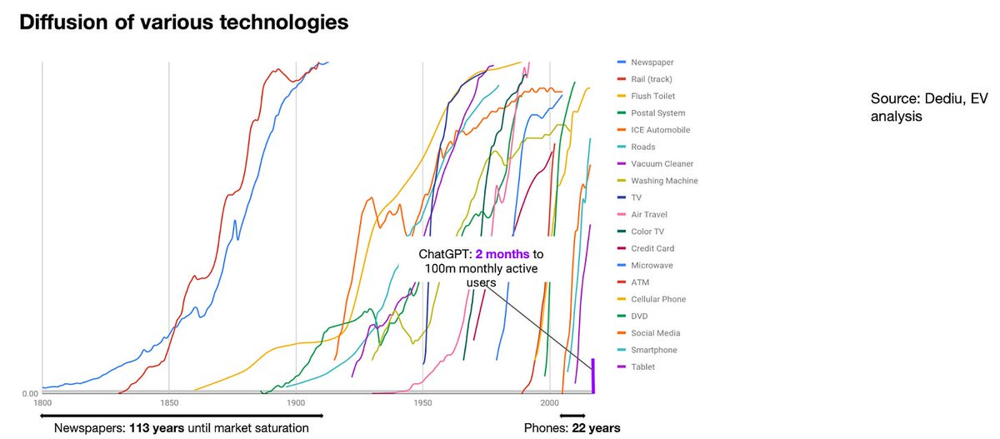](https://pbs.twimg.com/media/Gg3m_b5aMAEw4wf?format=jpg&name=4096x4096)

 As we head for a more technical future, technical literacy matters more than ever. But as a society, we’re playing catch-up. Less than 1% of the world knows how to code! And in the halls of Congress, less than 10 members have an engineering degree.  随着我们迈向更加技术化的未来，技术素养比以往任何时候都更加重要。但作为一个社会，我们正在努力追赶。 世界上只有不到 1% 的人懂得如何编程！而在国会大厅里，只有不到 10 名议员拥有工程学位。[x.com/stephsmithio/s](https://x.com/stephsmithio/status/1842059542118727901)

A stat that more people should know: Of the 535 representatives in Congress, less than 10 are engineers.  

更多人应该知道的统计数据： 在国会的 535 名代表中，工程师不到 10 名。

[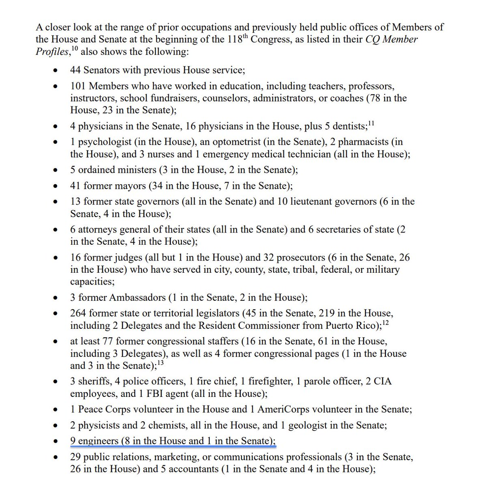](https://pbs.twimg.com/media/GZBO2B8aEAA7rBd?format=jpg&name=4096x4096)

 Look no further than the Bureau of Labor Statistics’ fastest-growing occupations. Topping the list are:  Wind turbine technicians  Solar panel installers  Nurses  Data scientists  Security analysts What do these jobs say about our future?  只要看看美国劳工统计局列出的增长最快的职业就知道了。 位居榜首的是：  风力涡轮机技术人员  太阳能电池板安装工  护士  数据科学家  证券分析师 这些工作对我们的未来有何启示？

[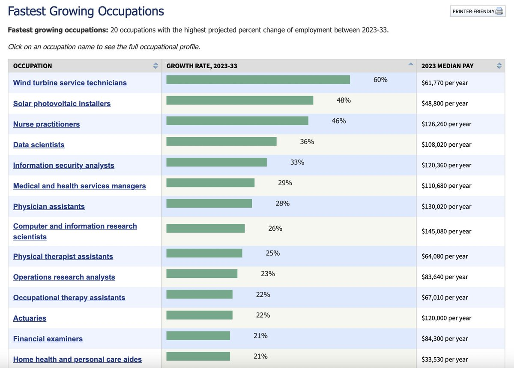](https://pbs.twimg.com/media/Gg3nxH-aMAIKqDV?format=jpg&name=4096x4096)

💡 For one, we have a growing need for better infrastructure. It turns out that 17,636, or 99.97% (!), of the bridges in NYC need repair. Only 6 are deemed as not in need of repair. And of the over 600k bridges in America… 17.5k are "fracture-critical".  💡 首先，我们对更好的基础设施的需求日益增长。 事实证明，纽约市有 17,636 座桥梁（占 99.97％！）需要维修。 只有 6 处被认为不需要修复。 美国有 60 多万座桥梁，其中 1.75 万座属于“断裂危急”桥梁。

[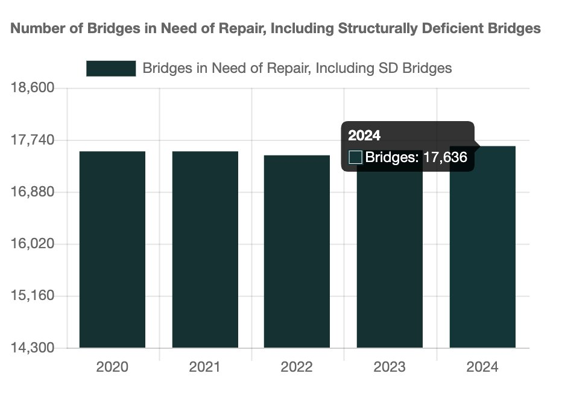](https://pbs.twimg.com/media/Gg3oGVsaMAIoHHo?format=jpg&name=4096x4096)

 Today’s zoning laws would prevent 40% of the buildings in Manhattan from being built. Perhaps that's why the median age for first-time home buyers is the highest it's been since we started recording the metric in 1981, clocking in at 38.  现行的区域划分法律将阻止曼哈顿 40% 的建筑物建造。 也许这就是为什么首次购房者的平均年龄是自 1981 年我们开始记录这一指标以来最高的，达到 38 岁。

[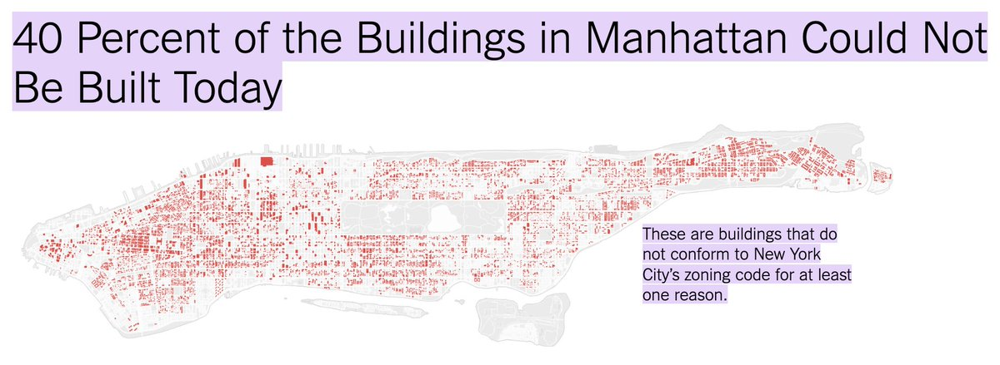](https://pbs.twimg.com/media/Gg3oMCVbMAAuQ4c?format=jpg&name=4096x4096)

💡 Drones may not have hit your neighborhood yet, but the FAA has allowed takeoff beyond line of sight. North America drone deliveries jumped to 150k+ in 2024, with Zipline alone passing 1m globally. Plus, Amazon launched in Phoenix – where Waymo started (now 150k+ rides/wk!)  💡 无人机可能尚未袭击您的社区，但美国联邦航空管理局已允许无人机在视线之外起飞。 到 2024 年，北美无人机送货量将跃升至 15 万+，仅 Zipline 一项就将在全球范围内突破 100 万。 此外，亚马逊在凤凰城推出了这项服务，而 Waymo 也从这里起步（现在每周的出行量超过 15 万次！）

[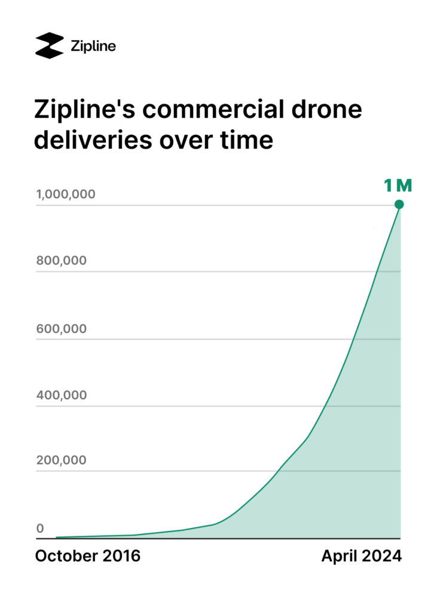](https://pbs.twimg.com/media/Gg3ob3HaMAApVbH?format=png&name=4096x4096)[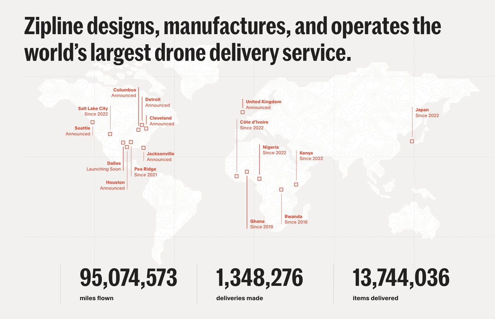](https://pbs.twimg.com/media/Gg3ojNHaMAA7liM?format=jpg&name=4096x4096)

 As launch costs come down and satellites saturate the sky, the European Space Agency estimates there are:  40,000+ space debris objects >10cm  130m (!) between 1mm to 1cm ...all moving ~10km per second. The space observation and insurance industries are lifting off.  随着发射成本下降以及卫星在天空中的普及，欧洲航天局估计：  40,000+ 件太空垃圾 >10cm  130m（！）1毫米至1厘米之间 ...全部以每秒约10公里的速度移动。 太空观测和保险行业正在腾飞。

[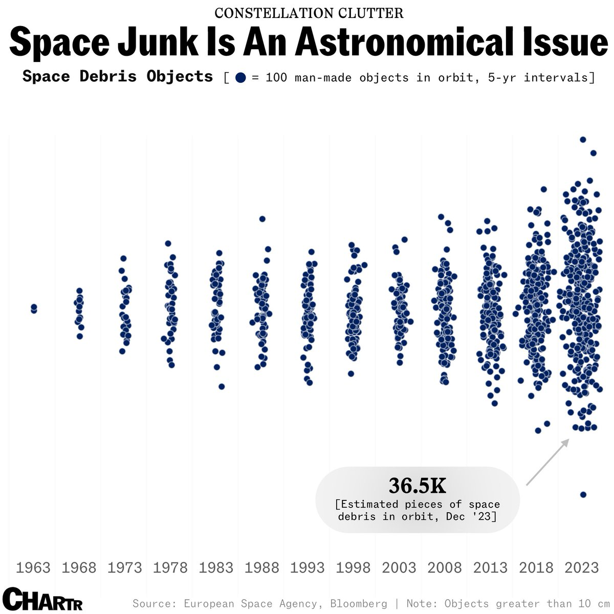](https://pbs.twimg.com/media/Gg3o9i4aMAQ_ldS?format=jpg&name=4096x4096)

 Every country in the world has a lower fertility rate than 1950, however the decline is not equal everywhere. In fact, the Economist estimates that over 50% of the world's babies will be born in sub-Saharan Africa by 2100.  世界上每个国家的生育率都低于 1950 年，但各地的下降幅度并不均匀。 事实上，《经济学人》估计，到 2100 年，全球超过 50% 的婴儿将出生在撒哈拉以南非洲地区。

[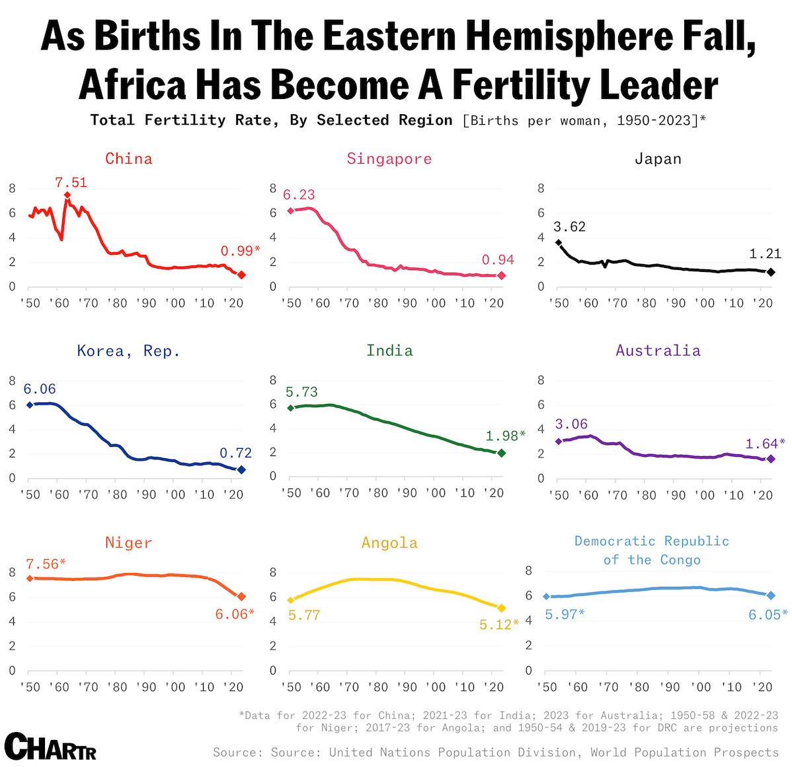](https://pbs.twimg.com/media/Gg3pKN4a4AAXfDL?format=png&name=4096x4096)

 Look out for India! In the last 30 years, India went from 50% of its population having access to electricity to nearly 100%. Its literacy rate has followed a similarly positive trend.  关注印度！ 在过去的30年里，印度的电力覆盖率从50%上升到接近100%。 其识字率也呈现出同样积极的趋势。

[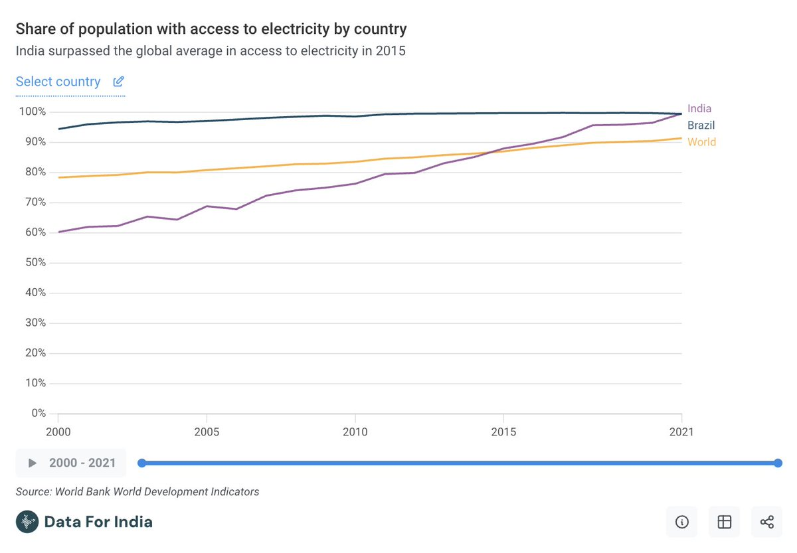](https://pbs.twimg.com/media/Gg3pPsSaMAAe758?format=jpg&name=4096x4096)

People are also living longer. In 1950, the number of US centenarians (people over 100) was estimated to be 2.3k. By 2020, that number increased to 80k. Just 4 years later, that's increased to over 100k -- with a 4x projection in the next 30 years.  人们的寿命也越来越长。1950 年，美国百岁老人（年龄超过 100 岁）的数量估计为 2300 人。到 2020 年，这一数字将增加到 8 万人。 仅仅 4 年后，这一数字就增加到了 10 万以上，预计未来 30 年内还将增长 4 倍。

[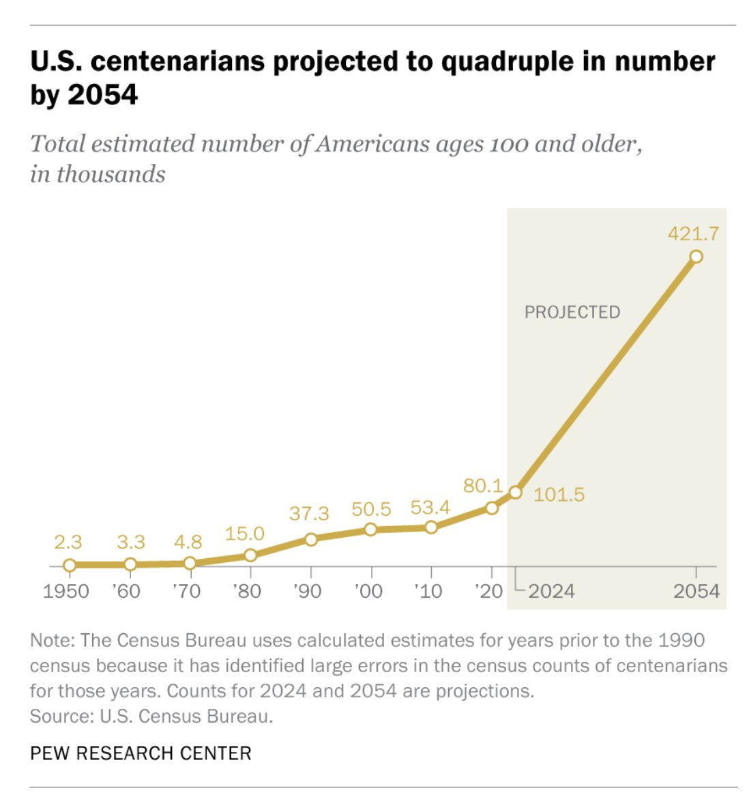](https://pbs.twimg.com/media/Gg3pU_TaMAIBFy1?format=jpg&name=4096x4096)

 Healthcare expenditure has 10xed in the last ~50 years, even when accounting for inflation. To put this scale into perspective – $50B or nearly 1% of the US budget is spent on Kidney dialysis alone – several times more than NASA.  即使考虑到通货膨胀因素，医疗保健支出在过去 50 年里也增长了 10 倍。 为了更直观地了解这一规模，仅肾透析一项就花费了 500 亿美元或近 1% 的美国预算——比 NASA 多出几倍。

[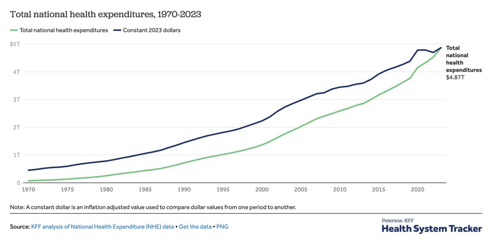](https://pbs.twimg.com/media/Gg3pbeMaMAAXNF3?format=jpg&name=4096x4096)

The pharmaceutical industry spends the most on lobbying in DC, spending nearly $300m in 2024 – nearly triple oil and gas. Let’s hope the drug discovery strides coming out of AI – like one study demonstrating 80-90% success rates in phase 1 clinical trials – aren’t stifled.  制药行业在华盛顿特区的游说支出最多，2024 年花费近 3 亿美元——几乎是石油和天然气的三倍。 我们希望人工智能在药物研发方面的进步不会受到阻碍——就像一项研究表明第一阶段临床试验的成功率达到 80-90％ 一样。

[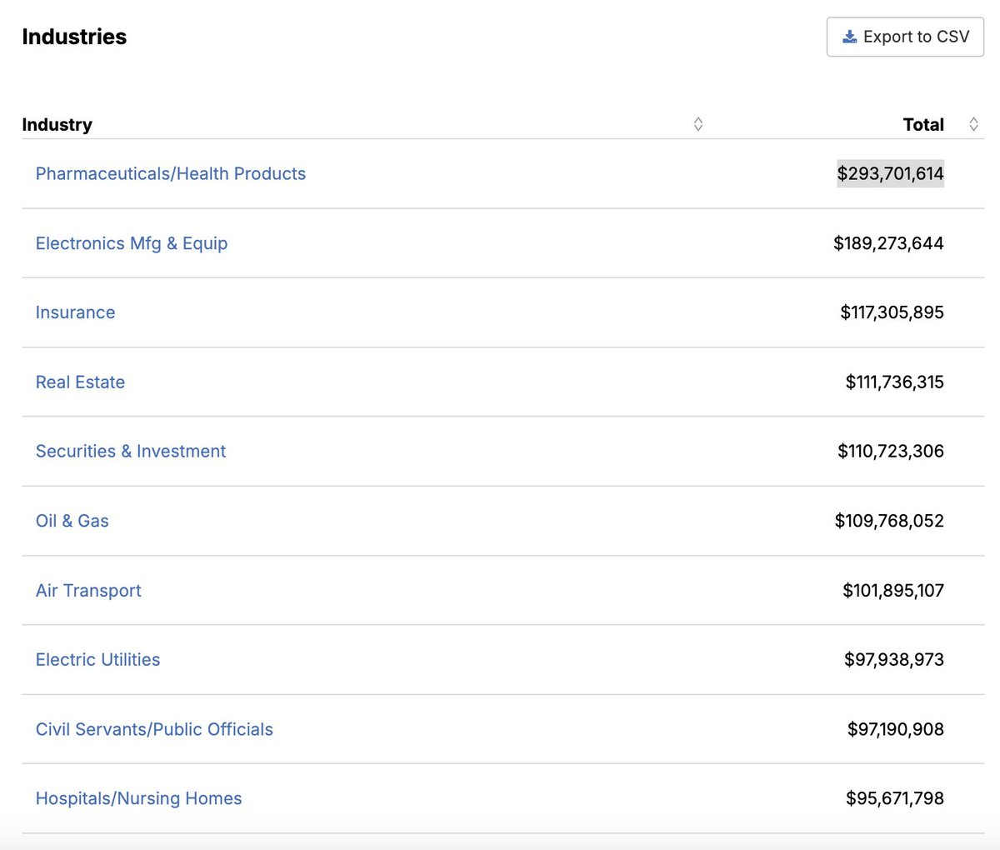](https://pbs.twimg.com/media/Gg3pugJaUAAWSwq?format=jpg&name=4096x4096)

 The US Surgeon General stated that "the mortality impact of being socially disconnected is similar to that caused by smoking up to 15 cigarettes a day." Meanwhile, more people are living alone than ever and 10-15% have no friends at all.  美国卫生局局长表示，“社交缺失对死亡率的影响与每天吸烟 15 支以上对死亡率的影响相似。” 与此同时，独居的人比以往任何时候都多，10-15％的人根本没有朋友。

 As remote work continues to make strides…. musculoskeletal issues do too. In 2019, 44% percent of employers ranked musculoskeletal issues as the top condition impacting their costs. This was the top condition driving cost until 2021, falling only behind cancer in 2022+.  随着远程工作不断取得进展......肌肉骨骼问题也同样如此。 2019年，44%的雇主将肌肉骨骼问题列为影响其成本的首要问题。 这是截至 2021 年导致成本增加的最主要疾病，在 2022 年及以后仅落后于癌症。

[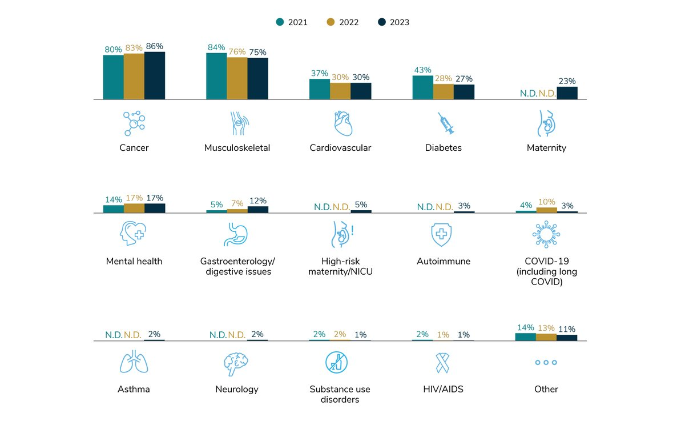](https://pbs.twimg.com/media/Gg3qCZHaoAAWcya?format=jpg&name=4096x4096)

 66 territories now offer a "digital nomad visa" to attract top talent, including Indonesia's "Golden Visa" of which Sam Altman was the first recipient. Just a few years ago, this would've been unimaginable!  目前，已有 66 个地区提供“数字游民签证”来吸引顶尖人才，其中包括印度尼西亚的“黄金签证”，萨姆·奥特曼是该签证的首位获得者。 就在几年前，这还是不可想象的！[x.com/stephsmithio/s](https://x.com/stephsmithio/status/1872057392487403547)

5 years ago, many individuals – let alone states – found it hard to fathom the idea of truly untethered, digital work. Now, over 60 territories see the opportunity to attract talent and offer some form of a digital nomad visa. Just amazing to see.  

五年前，许多个人（更不用说国家）都很难理解真正不受束缚的数字化工作的概念。 现在，超过 60 个地区看到了吸引人才并提供某种形式的数字游民签证的机会。 真是令人惊奇。

[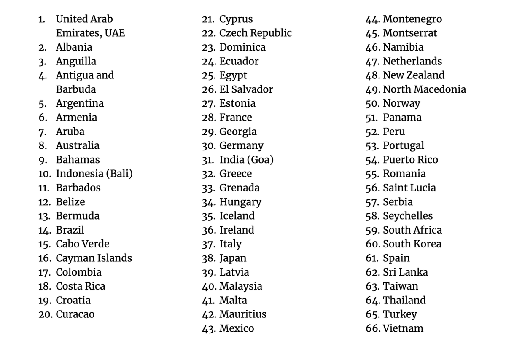](https://pbs.twimg.com/media/GfriAiAWAAAA1u5?format=png&name=4096x4096)

 Our high-tech future (semiconductors, EVs, batteries...) relies on several critical materials like gallium, vanadium, & germanium. China accounts for the majority of rare earth production, with reports ranging from 69%-95%. For gallium, China controls some 98% of exports.  我们的高科技未来（半导体、电动汽车、电池……）依赖于镓、钒和锗等几种关键材料。 中国占稀土产量的大部分，据报道占69%-95%。 对于镓而言，中国控制着约98%的出口。

[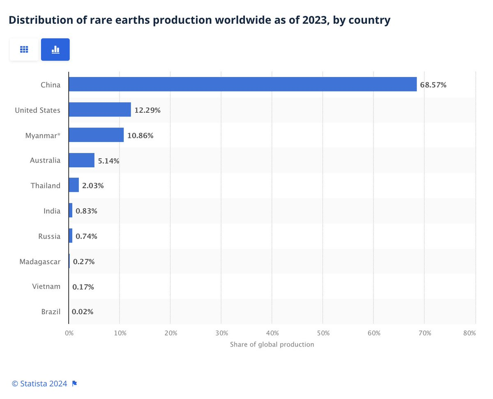](https://pbs.twimg.com/media/Gg3qMGXbsAATR2S?format=jpg&name=4096x4096)

 US post-secondary enrollment has dropped (for the first time in decades) and is down ~10% in the past ~5 years. Perhaps it should be no surprise that the fastest-growing form of education is homeschooling. Some estimate that there are now ~4m children homeschooled in the US.  美国高等教育入学率下降（几十年来首次），过去 5 年内下降了约 10%。 增长最快的教育形式是家庭教育，这也许并不令人意外。有人估计，目前美国有约 400 万名儿童接受家庭教育。

[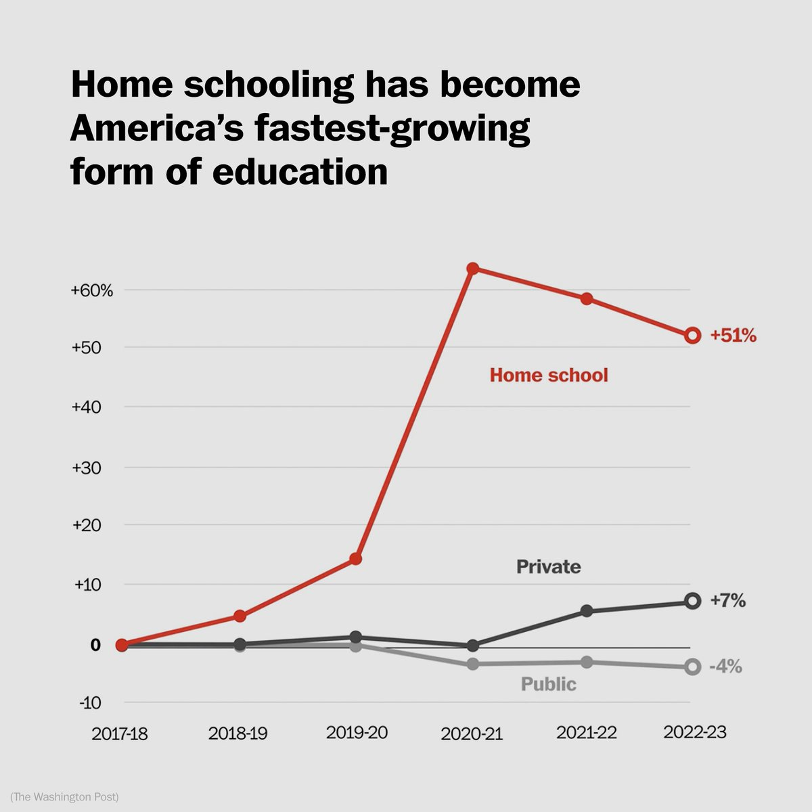](https://pbs.twimg.com/media/Gg3rdIIakAAnlKE?format=jpg&name=4096x4096)

 Between May-Aug, 99% of Americans faced at least 1 extreme weather alert. Given the changing landscape, insurance is being rewritten. For ex, Progressive refused to renew ~100k high-risk home policies in Florida. Non-admitted insurance (not backed by state) rose 28% YoY!  5 月至 8 月期间，99% 的美国人面临至少 1 次极端天气警报。 鉴于形势的变化，保险业正在被改写。例如，Progressive 拒绝续签佛罗里达州约 10 万份高风险房屋保险。 非承保保险（不受国家支持）同比增长 28％！

[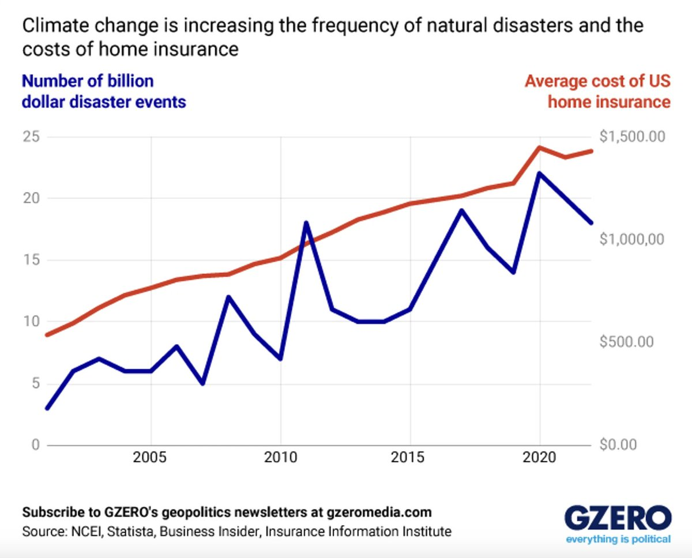](https://pbs.twimg.com/media/Gg3rhtJaMAMUYcz?format=jpg&name=4096x4096)

I'll post more of these shortly, but for now... What is missing from this list? I also compiled over 100 of these digits for the [@Internet Pipes](https://x.com/internet_pipes "Internet Pipes") community, so if you want to access the full list, join us! Plus, last year's thread ICYMI 我很快会发布更多这样的内容，但是现在…… 此列表中缺少什么？ 我还为[@Internet Pipes](https://x.com/internet_pipes "Internet Pipes")社区编制了 100 多个这样的数字，因此如果您想访问完整列表，请加入我们！ 另外，去年的帖子 ICYMI   [x.com/stephsmithio/s](https://x.com/stephsmithio/status/1500986096745779200)

In 1994, Jeff Bezos famously spotted a stat that made him leave his high-paying PE job to start Amazon:  The Internet was growing 2300% per year. What are the generation-defining stats of today? I'll post a few to kick things off...  

1994 年，杰夫·贝佐斯发现了一个著名的数据，这促使他放弃了高薪的 PE 工作，创办了亚马逊：  互联网每年的增长率为 2300%。 当今定义世代的统计数据是什么？ 我会发布一些内容来开始...

Back for more! Nearly 2.5B people by 2050 are expected to experience hearing loss, with 700m+ "requiring rehabilitation". This has caused some to project that "hearing aids are about to become as common as reading glasses", especially as hearing aids went OTC in late 2022.  

回来了解更多！  到 2050 年，预计会有近 25 亿人遭受听力损失，其中 7 亿多人“需要康复治疗”。 这导致一些人预测“助听器即将变得像老花镜一样普遍”，尤其是随着助听器在 2022 年底开始非处方销售。

[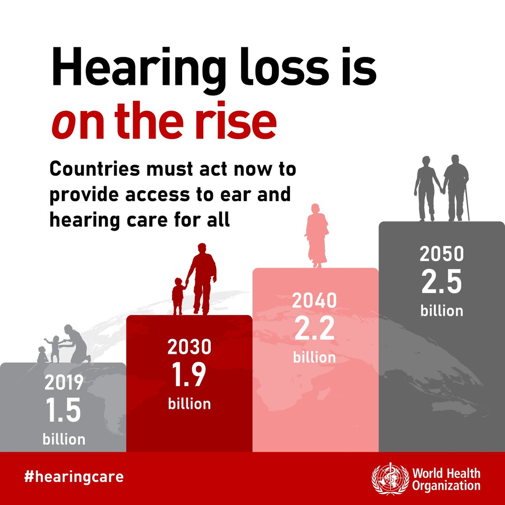](https://pbs.twimg.com/media/Gg436claMAAOKCG?format=jpg&name=4096x4096)

 ~Half the world's population is exposed to 5x the air quality threshold = "fair". And qir pollution overall is thought to prematurely kill 6.7m ppl/year and cost trillions. In Delhi – the most polluted city – breathing is akin to smoking 25-30 cigarettes a day.   ~ 世界上一半的人口所处的空气质量阈值为 5 倍 = “一般”。 总体而言，这种污染每年会导致 670 万人过早死亡，造成数万亿美元的损失。 在污染最严重的城市德里，呼吸一次空气就相当于每天吸 25-30 支香烟。  

[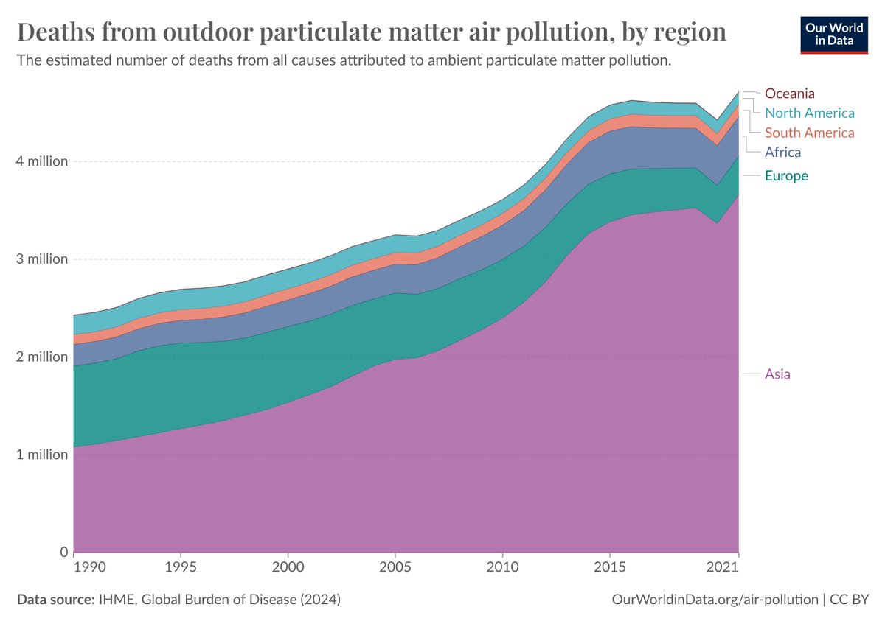](https://pbs.twimg.com/media/Gg44KqeaMAEtctl?format=jpg&name=4096x4096)[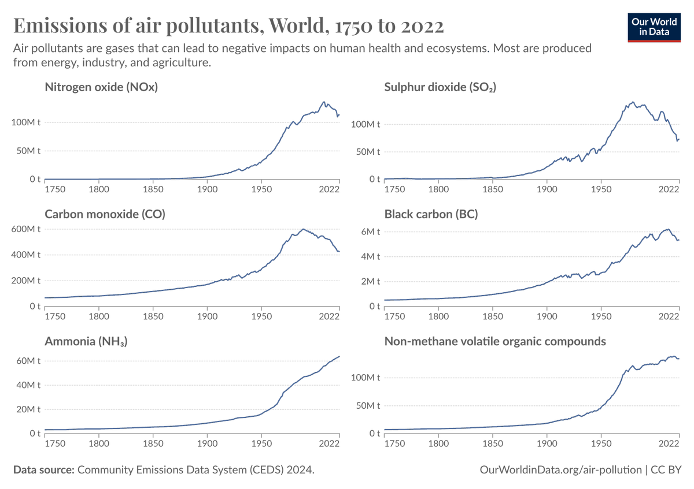](https://pbs.twimg.com/media/Gg44RPXbwAAVk4y?format=png&name=4096x4096)

 Freshwater reserves around the world have been dwindling for decades – whether it goes toward agriculture, domestic needs, or industry, however… The cost of desalinating water has been cut more than half since 2000, from $1.10 to $0.50. That’s the power of technology!  几十年来，世界各地的淡水储量一直在减少——无论是用于农业、家庭需求还是工业…… 自 2000 年以来，海水淡化成本已削减了一半以上，从 1.10 美元降至 0.50 美元。 这就是科技的力量！

[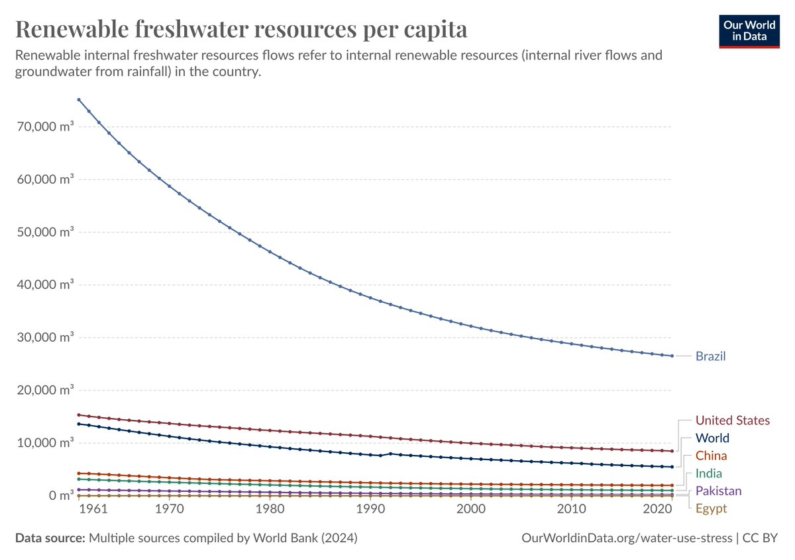](https://pbs.twimg.com/media/Gg44m-SaMAIsUlz?format=jpg&name=4096x4096)[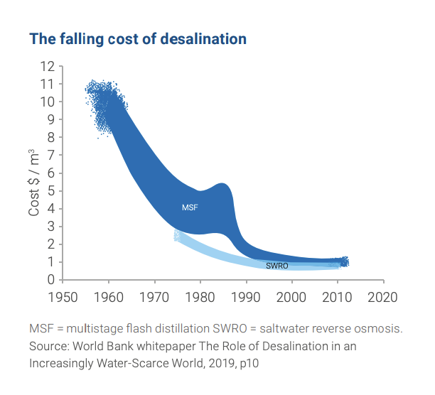](https://pbs.twimg.com/media/Gg44nupaMAAE-Hx?format=png&name=4096x4096)

Alright, that's all for now! With more RTs, I'll share more stats — from nuclear, to psychedelics, to ship building, to VTubers to Arctic shipping, & many more. In fact, I spent the last year compiling over 100 of these. If you want the full list, join [@Internet Pipes](https://x.com/internet_pipes "Internet Pipes"). 好的，现在就这些了！ 随着转发增多，我会分享更多统计数据 — — 从核能、迷幻药、造船、VTubers 到北极航运等等。 事实上，我花了去年一年的时间编写了 100 多个这样的文件。 如果您需要完整列表，请加入[@Internet Pipes](https://x.com/internet_pipes "Internet Pipes") 。 
