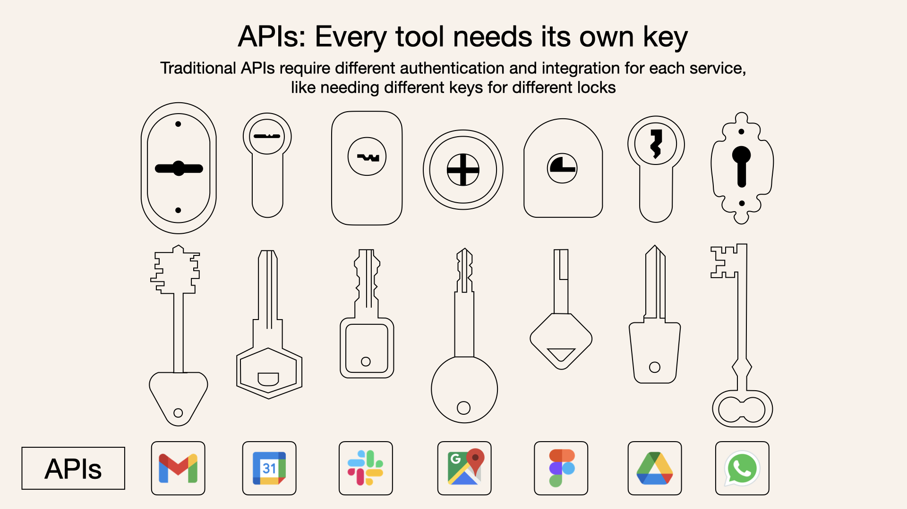

? How it simplifies AI integrations compared to APIs")

**MCP (Model Context Protocol)** is a new open protocol designed to standardize how applications provide context to Large Language Models (LLMs).  

**MCP（模型上下文协议）**是一种新的开放协议，旨在标准化应用程序向大型语言模型 (LLMs) 提供上下文的方式。

Think of MCP like a USB-C port but for AI agents: it offers a uniform method for connecting AI systems to various tools and data sources.  

将 MCP 视为适用于 AI 代理的 USB-C 端口：它提供了一种将 AI 系统连接到各种工具和数据源的统一方法。

This post breaks down MCP, clearly explaining its value, architecture, and how it differs from traditional APIs.  

这篇文章分解了 MCP，清楚地解释了它的价值、架构以及它与传统 API 的区别。

## What is MCP?  什么是 MCP？

The Model Context Protocol (MCP) is a standardized protocol that connects AI agents to various external tools and data sources. Imagine it as a USB-C port - but for AI applications.  

模型上下文协议 (MCP) 是一种标准化协议，可将 AI 代理连接到各种外部工具和数据源。可以将其想象为 USB-C 端口 - 但适用于 AI 应用程序。

The **Model Context Protocol (MCP)** is a standardized protocol that connects AI agents to various external tools and data sources  

**模型上下文协议 (MCP)**是一种将 AI 代理连接到各种外部工具和数据源的标准化协议

Just as USB-C simplifies how you connect different devices to your computer, MCP simplifies how AI models interact with your data, tools, and services.  

正如 USB-C 简化了您将不同设备连接到计算机的方式一样，MCP 简化了 AI 模型与您的数据、工具和服务交互的方式。

## Why use MCP instead of traditional APIs?  

为什么要使用 MCP 而不是传统 API？

Traditionally, connecting an AI system to external tools involves integrating multiple APIs. Each API integration means separate code, documentation, authentication methods, error handling, and maintenance.  

传统上，将 AI 系统连接到外部工具需要集成多个 API。每个 API 集成都意味着单独的代码、文档、身份验证方法、错误处理和维护。

### Why traditional APIs are like having separate keys for every door  

为什么传统 API 就像每扇门都有单独的钥匙

**Metaphorically Speaking:** APIs are like individual doors - each door has its own key and rules:  

**打个比方：** API 就像是单独的门 - 每扇门都有自己的钥匙和规则：

Traditional APIs require developers to write custom integrations for each service or data source  

传统 API 要求开发人员为每个服务或数据源编写自定义集成

## Who's behind MCP?  MCP 背后是谁？

MCP (Model Context Protocol) started as a project by [Anthropic ↗](https://www.anthropic.com/news/model-context-protocol) to make it easier for AI models - like Claude - to interact with tools and data sources.  

MCP（模型上下文协议）最初是[Anthropic ↗](https://www.anthropic.com/news/model-context-protocol)的一个项目，旨在使 AI 模型（如 Claude）更容易与工具和数据源进行交互。

But it's not just an Anthropic thing anymore. MCP is open, and more companies and developers are jumping on board.  

但这已不再只是人类的事情。MCP 是开放的，越来越多的公司和开发人员正在加入其中。

It's starting to look a lot like a new standard for AI-tool interactions.  

它开始看起来很像人工智能工具交互的新标准。

## MCP vs. API: Quick comparison  

MCP 与 API：快速比较

| Feature  特征 | MCP | Traditional API  传统 API |
| --- | --- | --- |
| **Integration Effort  整合工作** | Single, standardized integration  
单一、标准化的集成 | Separate integration per API  

每个 API 单独集成 |
| **Real-Time Communication  实时通信** | ✅ Yes  ✅ 是的 | ❌ No  ❌ 没有 |
| **Dynamic Discovery  动态发现** | ✅ Yes  ✅ 是的 | ❌ No  ❌ 没有 |
| **Scalability  可扩展性** | Easy (plug-and-play)  简单（即插即用） | Requires additional integrations  

需要额外的集成 |
| **Security & Control  安全与控制** | Consistent across tools  跨工具保持一致 | Varies by API  因 API 而异 |

### Key differences between MCP and traditional APIs:  

MCP 与传统 API 之间的主要区别：

-   **Single protocol:** MCP acts as a standardized "connector," so integrating one MCP means potential access to multiple tools and services, not just one  
    
    **单一协议：** MCP 充当标准化的“连接器”，因此集成一个 MCP 意味着可以访问多种工具和服务，而不仅仅是一种
-   **Dynamic discovery:** MCP allows AI models to dynamically discover and interact with available tools without hard-coded knowledge of each integration  
    
    **动态发现：** MCP 允许 AI 模型动态发现并与可用工具交互，而无需对每个集成进行硬编码
-   **Two-way communication:** MCP supports persistent, real-time two-way communication - similar to WebSockets. The AI model can both retrieve information and trigger actions dynamically  
    
    **双向通信：** MCP 支持持久、实时的双向通信 - 类似于 WebSockets。AI 模型既可以检索信息，也可以动态触发操作

Why two-way communication?  

为什么要双向沟通？

MCP provides real-time, two-way communication:  

MCP 提供实时、双向通信：

-   **Pull data:** LLM queries servers for context → e.g. checking your **calendar**  
    
    **拉取数据：** LLM 向服务器查询上下文 → 例如检查**日历**
-   **Trigger actions:** LLM instructs servers to take actions → e.g. **rescheduling meetings**, **sending emails**  
    
    **触发操作：** LLM指示服务器采取行动 → 例如**重新安排会议**、**发送电子邮件**

## How MCP works: The architecture  

MCP 的工作原理：架构

MCP follows a simple client-server architecture:  

MCP 遵循简单的客户端-服务器架构：

-   **MCP Hosts:** These are applications (like Claude Desktop or AI-driven IDEs) needing access to external data or tools  
    
    **MCP 主机：**这些是需要访问外部数据或工具的应用程序（如 Claude Desktop 或 AI 驱动的 IDE）
-   **MCP Clients:** They maintain dedicated, one-to-one connections with MCP servers  
    
    **MCP 客户端：**它们与 MCP 服务器保持专用的一对一连接
-   **MCP Servers:** Lightweight servers exposing specific functionalities via MCP, connecting to local or remote data sources  
    
    **MCP 服务器：**轻量级服务器，通过 MCP 公开特定功能，连接到本地或远程数据源
-   **Local Data Sources:** Files, databases, or services securely accessed by MCP servers  
    
    **本地数据源：** MCP 服务器安全访问的文件、数据库或服务
-   **Remote Services:** External internet-based APIs or services accessed by MCP servers  
    
    **远程服务：**基于互联网的外部 API 或 MCP 服务器访问的服务

**Visualizing MCP as a bridge makes it clear:** MCP doesn't handle heavy logic itself; it simply coordinates the flow of data and instructions between AI models and tools.  

**将 MCP 视为一座桥梁可以清楚地表明：** MCP 本身并不处理繁重的逻辑；它只是协调 AI 模型和工具之间的数据和指令流。

tip  提示

Just as USB-C simplifies how you connect different devices to your computer, MCP simplifies how AI models interact with your data, tools, and services  

正如 USB-C 简化了你将不同设备连接到计算机的方式一样，MCP 简化了 AI 模型与数据、工具和服务交互的方式

### An MCP client in practice  

实践中的 MCP 客户端

In practice, an MCP client (e.g., a Python script in `client.py`) communicates with MCP servers that manage interactions with specific tools like **Gmail, Slack, or calendar apps**.  

实际上，MCP 客户端（例如`client.py`中的 Python 脚本）与 MCP 服务器进行通信，后者管理与**Gmail、Slack 或日历应用**等特定工具的交互。

This standardization removes complexity, letting developers quickly enable sophisticated interactions.  

这种标准化消除了复杂性，使开发人员能够快速实现复杂的交互。

## MCP examples: When to use MCP?  

MCP 示例：何时使用 MCP？

Consider these scenarios:  

请考虑以下情形：

### 1\. Trip planning assistant  

1\. 旅行计划助理

-   **Using APIs:** You'd write separate code for Google Calendar, email, airline booking APIs, each with custom logic for authentication, context-passing, and error handling  
    
    **使用 API：**您需要为 Google 日历、电子邮件、航空公司预订 API 编写单独的代码，每个代码都有用于身份验证、上下文传递和错误处理的自定义逻辑
-   **Using MCP:** Your AI assistant smoothly checks your **calendar** for availability, **books flights**, and **emails confirmations** - all via MCP servers, no custom integrations per tool required  
    
    **使用 MCP：**您的 AI 助手可以顺利检查您的**日历**是否有空档、**预订航班**和**发送确认电子邮件**\- 全部通过 MCP 服务器完成，无需每个工具进行自定义集成

### 2\. Advanced IDE (Intelligent Code Editor)  

2\. 高级 IDE（智能代码编辑器）")

-   **Using APIs:** You'd manually integrate your IDE with file systems, version control, package managers, and documentation  
    
    **使用 API：**你可以手动将 IDE 与文件系统、版本控制、包管理器和文档集成
-   **Using MCP:** Your IDE connects to these via a single MCP protocol, enabling richer context awareness and more powerful suggestions  
    
    **使用 MCP：**您的 IDE 通过单个 MCP 协议连接到这些，从而实现更丰富的情境感知和更强大的建议

### 3\. Complex data analytics  

3\. 复杂数据分析

-   **Using APIs:** You manually manage connections with each database and data visualization tool  
    
    **使用 API：**手动管理与每个数据库和数据可视化工具的连接
-   **Using MCP:** Your AI analytics platform autonomously discovers and interacts with multiple databases, visualizations, and simulations through a unified MCP layer  
    
    **使用 MCP：**您的 AI 分析平台通过统一的 MCP 层自主发现并与多个数据库、可视化和模拟进行交互

## Benefits of implementing MCP  

实施 MCP 的好处

-   **Simplified development:** Write once, integrate multiple times without rewriting custom code for every integration  
    
    **简化开发：**一次编写，多次集成，无需为每次集成重写自定义代码
-   **Flexibility:** Switch AI models or tools without complex reconfiguration  
    
    **灵活性：**无需复杂的重新配置即可切换 AI 模型或工具
-   **Real-time responsiveness:** MCP connections remain active, enabling real-time context updates and interactions  
    
    **实时响应：** MCP 连接保持活跃，实现实时上下文更新和交互
-   **Security and compliance:** Built-in access controls and standardized security practices  
    
    **安全性和合规性：**内置访问控制和标准化安全实践
-   **Scalability:** Easily add new capabilities as your AI ecosystem grows—simply connect another MCP server  
    
    **可扩展性：**随着 AI 生态系统的发展，轻松添加新功能 - 只需连接另一个 MCP 服务器即可

## When are traditional APIs better?  

传统 API 何时更好？

If your use case demands precise, predictable interactions with strict limits, traditional APIs could be preferable. MCP provides broad, dynamic capabilities ideal for scenarios requiring flexibility and context-awareness but might be less suited for highly controlled, deterministic applications.  

如果您的用例需要精确、可预测且具有严格限制的交互，那么传统 API 可能是更好的选择。MCP 提供广泛的动态功能，非常适合需要灵活性和情境感知的场景，但可能不太适合高度受控的确定性应用程序。

### Stick with granular APIs when:  

在以下情况下，请坚持使用细粒度 API：

-   Fine-grained control and highly-specific, restricted functionalities are needed  
    
    需要细粒度的控制和高度特定、受限的功能
-   You prefer tight coupling for performance optimization  
    
    您更喜欢紧密耦合以实现性能优化
-   You want maximum predictability with minimal context autonomy  
    
    您希望以最小的上下文自主性实现最大的可预测性

## Getting started with MCP: High-level steps  

MCP 入门：高级步骤

MCP integration:  MCP 集成：

1.  **Define capabilities:** Clearly outline what your MCP server will offer  
    
    **定义功能：**明确概述您的 MCP 服务器将提供哪些功能
2.  **Implement MCP layer:** Adhere to the standardized MCP protocol specifications  
    
    **实现MCP层：**遵循标准化的MCP协议规范
3.  **Choose transport:** Decide between local (stdio) or remote (Server-Sent Events/WebSockets)  
    
    **选择传输：**在本地（stdio）或远程（服务器发送事件/WebSockets）之间选择
4.  **Create resources/tools:** Develop or connect the specific data sources and services your MCP will expose  
    
    **创建资源/工具：**开发或连接您的 MCP 将公开的特定数据源和服务
5.  **Set up clients:** Establish secure and stable connections between your MCP servers and clients  
    
    **设置客户端：**在 MCP 服务器和客户端之间建立安全稳定的连接

## Summary  概括

### What is MCP?  什么是 MCP？

-   **MCP:** Unified interface for AI agents to dynamically interact with external data/tools  
    
    **MCP：** AI代理与外部数据/工具动态交互的统一接口
-   **APIs:** Traditional methods, requiring individualized integrations and more manual oversight  
    
    **API：**传统方法，需要个性化集成和更多人工监督

MCP provides a **unified** and **standardized** way to integrate AI agents and models with external data and tools  

MCP 提供了一种**统一**、**标准化的**方法，将 AI 代理和模型与外部数据和工具进行集成

## Conclusion  结论

MCP provides a **unified** and **standardized** way to integrate AI agents and models with external data and tools. It's not just another API; it's a powerful connectivity framework enabling intelligent, dynamic, and context-rich AI applications.  

MCP 提供了一种**统一**且**标准化的**方式，可将 AI 代理和模型与外部数据和工具集成在一起。它不仅仅是另一个 API，而是一个强大的连接框架，可实现智能、动态且情境丰富的 AI 应用程序。

