_SemiAnalysis is hosting an [Nvidia Blackwell GPU Hackathon on Sunday March 16th](https://semianalysis.com/hackathon-2025/). It is the ultimate playground for Blackwell PTX tech enthusiasts, offering hands-on exploration of Blackwell & PTX infrastructure while collaborating on open-source projects. Speakers will include Philippe Tillet of OpenAI, Tri Dao of TogetherAI, Horace He of Thinking Machines, and more. Sponsored by: Together, Lambda, Google Cloud, Nvidia, GPU Mode, Thinking Machines, OpenAI, PyTorch, Coreweave, Nebius. [Apply to be part of the fun.](https://semianalysis.com/hackathon-2025/)  

SemiAnalysis[将于 3 月 16 日星期日举办 Nvidia Blackwell GPU Hackathon](https://semianalysis.com/hackathon-2025/) 。这是 Blackwell PTX 技术爱好者的终极游乐场，提供亲身探索 Blackwell 和 PTX 基础设施的机会，同时合作开展开源项目。演讲者包括 OpenAI 的 Philippe Tillet、TogetherAI 的 Tri Dao、Thinking Machines 的 Horace He 等。赞助商包括：Together、Lambda、Google Cloud、Nvidia、GPU Mode、Thinking Machines、OpenAI、PyTorch、Coreweave、Nebius。[申请加入这场有趣的活动。](https://semianalysis.com/hackathon-2025/)_

This is a Call for Action for the United States of America and the West. We are in the early precipice of a nonlinear transformation in industrial society, but the bedrock the US is standing on is shaky. Automation and robotics is currently undergoing a revolution that will enable full-scale automation of all manufacturing and mission-critical industries. These intelligent robotics systems will be the first ever additional industrial piece that is not supplemental but fully additive– 24/7 labor with higher throughput than any human—, allowing for massive expansion in production capacities past adding another human unit of work. The only country that is positioned to capture this level of automation is currently China, and should China achieve it without the US following suit, the production expansion will be granted only to China, posing an existential threat to the US as it is outcompeted in all capacities.  

这是对美国和西方的行动号召。我们正处于工业社会非线性转型的早期边缘，但美国所依赖的基石并不稳固。自动化和机器人技术目前正在经历一场革命，这将使所有制造业和关键任务行业实现全面自动化。这些智能机器人系统将是有史以来第一个不是补充而是完全附加的工业部件——全天候劳动力，生产率高于任何人类——这将使生产能力大幅扩张，而不仅仅是增加一个人类工作单位。目前唯一有能力达到这一自动化水平的国家是中国，如果中国在没有美国跟进的情况下实现这一目标，那么生产扩张将只属于中国，这对美国构成生存威胁，因为它在所有能力上都处于劣势。

This is the manufacturing playing field that China has dominated for years now. The country has one of the most competitive economies in the world internally, where they will naturally achieve economies of scale and have shown themselves to be one of most skilled in high-volume manufacturing, at the same time their engineering quality has grown to be competitive in several critical industries at the highest level. This has already happened in batteries, solar, and is well underway in EVs. With these economies of scale, they are able to supply large developing markets, like Southeast Asia, Latin America, and others, allowing them to extend their advantage and influence.   

这是中国多年来一直占据主导地位的制造业领域。该国是世界上最具竞争力的经济体之一，他们自然会实现规模经济，并已证明自己是最擅长大批量制造的国家之一，同时他们的工程质量已在几个关键行业中发展成为最高水平的竞争力。这已经在电池、太阳能领域实现，电动汽车领域也正在顺利推进。凭借这些规模经济，他们能够为东南亚、拉丁美洲等大型发展中市场提供服务，从而扩大其优势和影响力。

The impact of this in robotics will be exponential compared to their last strategic industry captures. These will be robotics systems manufacturing more robotics systems, and with each unit produced the cost will be driven down continuously and the quality will improve, only strengthening their production flywheel. This will repeat ad infinitum and as quality inevitably increases it will make it extraordinarily difficult for other countries to compete. Due to the fact that robotics is a general purpose technology, this will have horizontal impacts on all manufacturing sectors and all other currently advantaged industries as well–textiles, electronics, consumer goods, etc. At the moment, the West is caught flatfooted: South Korea and Japan have a birth rate crisis that is throttling their manufacturing capabilities, European industrial sectors are being eaten alive by China and their inability to generate power, and the US is focused on other markets and procuring cheap overseas production, all the while China’s manufacturing capacity has gotten stronger and robotics is catching fire.   

相比上一次的战略性行业占领，此次事件对机器人的影响将是指数级的。这些机器人系统将制造更多的机器人系统，随着每个单元的生产，成本将不断下降，质量将提高，只会加强它们的生产飞轮。这将无限重复，随着质量不可避免地提高，其他国家将很难与之竞争。由于机器人是一种通用技术，这将对所有制造业以及所有其他目前具有优势的行业产生横向影响——纺织、电子、消费品等。目前，西方措手不及：韩国和日本的出生率危机正在扼杀它们的制造能力，欧洲工业部门正被中国蚕食，无法发电，美国则专注于其他市场并采购廉价的海外产品，与此同时，中国的制造能力不断增强，机器人技术正在火爆起来。

[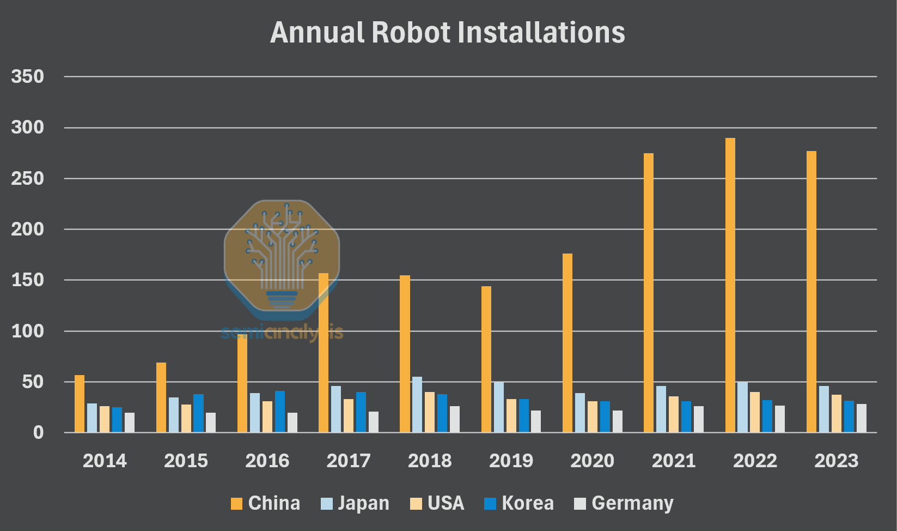](https://i0.wp.com/semianalysis.com/wp-content/uploads/2025/03/2900-annual-installations-with-china.png?resize=1647%2C974&ssl=1)

Source: SemiAnalysis, IFR.org  

来源：SemiAnalysis、IFR.org

China’s robotics localization effort is well underway. Local firms are taking over the world’s largest market, approaching a 50% market share, compared to just 30% in 2020. While Chinese manufacturers are currently on par with Western giants in the low-end market, our supply chain review leads us to believe that local firms are beginning to take over the higher-end market segments. The rise of Unitree exemplifies this shift: the only viable humanoid robot on the market, the Unitree G1, is now entirely decoupled from American components.  

中国的机器人本土化工作进展顺利。本土企业正在占领全球最大的市场，市场份额接近 50%，而 2020 年仅为 30%。虽然中国制造商目前在低端市场与西方巨头不相上下，但我们的供应链审查让我们相信，本土企业正开始占领高端市场。宇树机器人的崛起就是这种转变的例证：市场上唯一可行的人形机器人宇树 G1 现在已完全脱离了美国零部件。  

Source: SemiAnalysis, IFR.org  

来源：SemiAnalysis、IFR.org

Today, building an exactly identical robotic arm (modeled after the Universal Robots UR5e) in the US **is ~2.2x more expensive than in China**. Under the hood, the situation is even more alarming. Even if those components are labeled “Made in USA”, they rely _heavily_ upon China-made parts and materials – with no viable scalable alternative.  

如今，在美国制造一模一样的机械臂（仿照 Universal Robots UR5e 制造）的**成本比在中国高出约 2.2 倍**。在内部，情况更加令人担忧。即使这些部件标有“美国制造”的标签，它们_也严重_依赖中国制造的零件和材料——没有可行的可扩展替代品。

[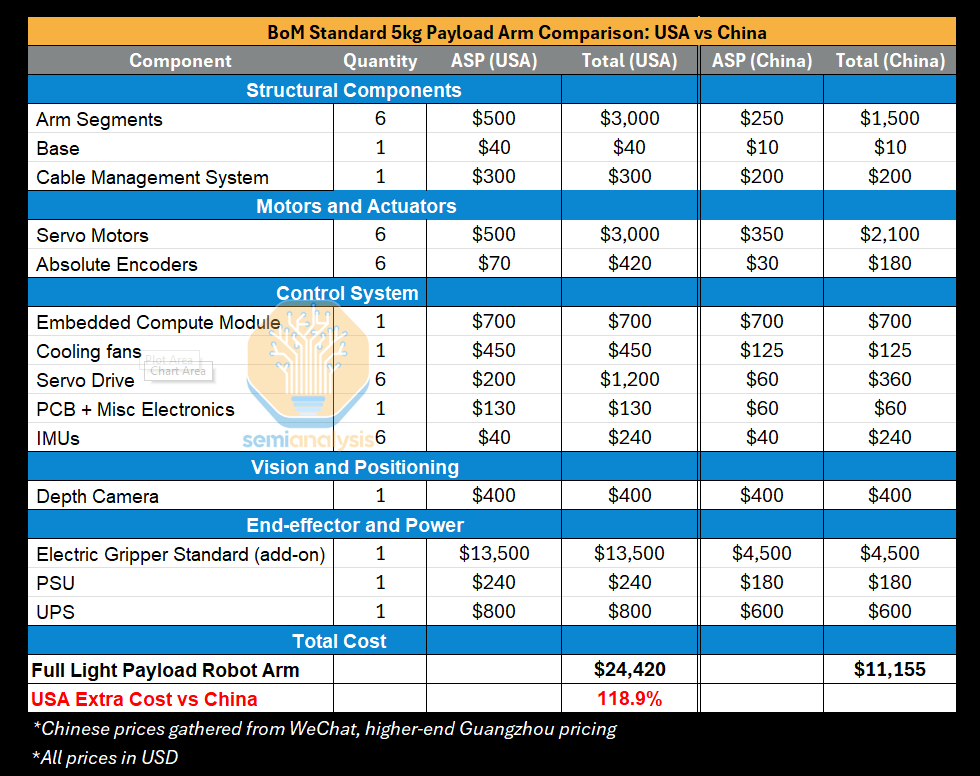](https://i0.wp.com/semianalysis.com/wp-content/uploads/2025/03/200-BoM.png?resize=980%2C776&ssl=1)

Source: SemiAnalysis  来源：SemiAnalysis  

## **Drones, DJI, GoPro, and How Iteration Speed Paves Victory’s Path  

无人机、大疆、GoPro，以及迭代速度如何铺就胜利之路**

The commercial drone market exemplifies China’s scale/oversupply playbook in every strategic industry it has entered, however, this is the first example of the strategy in a robotics-adjacent market. Local leader DJI today accounts for over [80%](https://www.atlanticcouncil.org/in-depth-research-reports/issue-brief/a-global-strategy-to-secure-uas-supply-chains/) of the global commercial drone market… and 90% in the **American consumer market**! While the company was a first-mover, it maintained and consolidated its market position for over a decade thanks to China’s manufacturing dominance and economies of scale/oversupply strategy.  

商用无人机市场体现了中国在其进入的每个战略行业中的规模/供应过剩策略，然而，这是该策略在机器人相关市场中的第一个例子。本土领导者大疆目前占据了全球商用无人机市场[80%](https://www.atlanticcouncil.org/in-depth-research-reports/issue-brief/a-global-strategy-to-secure-uas-supply-chains/)以上的份额……以及**美国消费市场**的 90%！虽然该公司是先行者，但由于中国在制造业的主导地位和规模经济/供应过剩战略，它保持并巩固了十多年的市场地位。

[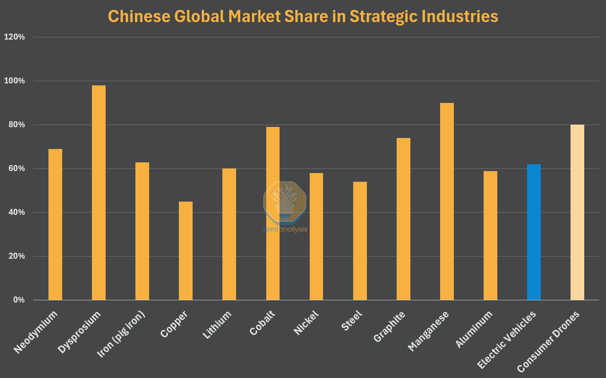](https://i0.wp.com/semianalysis.com/wp-content/uploads/2025/03/100-chinas-global-mkt-share-in-strategic-industries-1.png?resize=1589%2C992&ssl=1)

Source: SemiAnalysis, Industry Estimates  

来源：SemiAnalysis，行业估计

Let us explain how. To properly develop a functional and robust piece of hardware, the creation + recreation (i.e. manufacturing) must be iterated repeatedly and rapidly to work out the kinks and perfect the product before competitors. However, the most challenging thing for Western competitors is that Chinese markets are built to reward the company that can scale the fastest, so before a Chinese competitor ever enters the Western market it has already outclassed them in cost, all that’s left is for the quality to refine over the coming iterations.   

让我们来解释一下。要正确开发出一款功能齐全、性能强大的硬件，必须反复快速地迭代创造 + 再造（即制造），以解决问题并在竞争对手之前完善产品。然而，对西方竞争对手来说，最具挑战性的是，中国市场旨在奖励能够最快扩张的公司，因此，在中国竞争对手进入西方市场之前，它已经在成本上超越了他们，剩下的就是在接下来的迭代中完善质量。

GoPro tried to compete in the consumer drone market despite having most of its manufacturing based in China, Malaysia, and Japan, which meant that each iteration of their drone took several weeks – likely starting the design in California, sending over the details to the manufacturers in China and having them build it, and shipping it back to the USA before ever finding out what needed to be ironed out in this attempt. Contrast this with DJI, which was based in Shenzhen, meaning the company could get any needed part from any factory in Shenzhen within hours of ordering and iterate at an unreal speed.  

尽管 GoPro 的大部分制造业务都在中国、马来西亚和日本，但 GoPro 仍试图在消费级无人机市场展开竞争，这意味着其无人机的每次迭代都要花费数周时间——很可能从加利福尼亚开始设计，将细节发送给中国制造商并由他们制造，然后运回美国，之后才发现在此过程中需要解决哪些问题。相比之下，大疆的总部位于深圳，这意味着该公司可以在订购后数小时内从深圳的任何一家工厂获得任何所需的部件，并以惊人的速度进行迭代。

As a result, in 2016, GoPro’s Karma Drone + Hero5 were outclassed by DJI’s drones. At $999 vs $1,099, DJI was slightly cheaper, had a battery life 50% longer, had obstacle avoidance already implemented, and the launch of the Karma was plagued with hardware issues and a [recall/refund program](https://investor.gopro.com/press-releases/press-release-details/2016/GoPro-Announces-Karma-Recall-and-Refund-Program/default.aspx) for their faulty product, which sometimes lost power during operation. GoPro likely could have solved these problems through enough work, but the company simply didn’t have the time, as DJI had already surpassed them in every way.   

结果，2016 年，GoPro 的 Karma Drone + Hero5 被大疆的无人机超越。大疆的售价为 999 美元，而 GoPro 的售价为 1,099 美元，前者略便宜，电池寿命长 50%，已实现避障功能，而 Karma 的推出受到硬件问题的困扰，并且由于其有缺陷的产品（有时会在操作过程中断电）而[实施召回/退款计划](https://investor.gopro.com/press-releases/press-release-details/2016/GoPro-Announces-Karma-Recall-and-Refund-Program/default.aspx)。GoPro 可能可以通过足够的努力来解决这些问题，但该公司根本没有时间，因为大疆已经在各方面超越了 GoPro。

Quickly after entering the Western markets, DJI’s incredible cost advantage and sheer production capacity quickly led to oversupplying the market, and capturing a massive amount of market share. Every other major drone company was quickly undercut heavily by DJI’s aggressive pricing. GoPro cited “[margin challenges](https://petapixel.com/2018/01/08/gopro-kills-karma-exits-drone-business/)” being a reason for disbanding their Karma program, and many other [companies crashed](https://www.open-electronics.org/behind-the-crash-of-3d-robotics-north-americas-most-promising-drone-company/) alongside. DJI was the only one to understand that this was a competition of scale and had long been prepared before entering the Western markets.   

进入西方市场后不久，大疆凭借其惊人的成本优势和强大的生产能力迅速导致市场供大于求，并占据了大量的市场份额。大疆的激进定价策略迅速削弱了其他所有大型无人机公司。GoPro 以“[利润挑战](https://petapixel.com/2018/01/08/gopro-kills-karma-exits-drone-business/)”为由解散了 Karma 项目，许多其他[公司也随之倒闭](https://www.open-electronics.org/behind-the-crash-of-3d-robotics-north-americas-most-promising-drone-company/)。只有大疆明白这是一场规模竞争，在进入西方市场之前就做好了准备。

In the world of Robotics, manufacturing dominance is key. To build a complete and functional robot means recreating the robot countless times and fine-tuning each minor mistake until a solid, scalable, and cost-effective product. This luxury is readily available to those who have the manufacturing capacity nearby and at an affordable cost, and its absence means a disadvantage. With a share of GDP three times higher than that of the US, China’s industrial base outcompetes that of America’s in every possible way.  

在机器人领域，制造业的主导地位至关重要。要制造一个功能齐全的机器人，就需要无数次地重新制造机器人，对每个小错误进行微调，直到制造出坚固、可扩展且具有成本效益的产品。对于那些拥有附近制造能力且成本合理的人而言，这种奢侈是唾手可得的，而没有制造能力则意味着处于劣势。中国的工业基础在国内生产总值中所占份额是美国的三倍，在各个方面都胜过美国。

[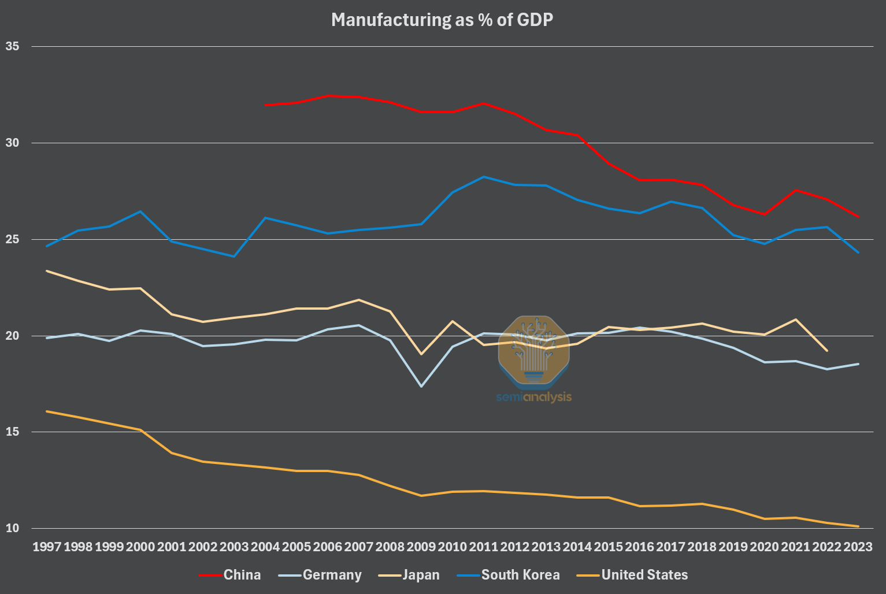](https://i0.wp.com/semianalysis.com/wp-content/uploads/2025/03/300-mnfg-as-percent.png?ssl=1)

Source: Worldbank, FRED  数据来源：世界银行、FRED

Our goal with this multi-part Robotics series is to illuminate landscape of the robotics and manufacturing industry, and convey the magnitude of the labor transformation it is poised to unleash. In Part One, we examine the current state of the market and take a deep dive into the hardware architecture of commercially available industrial robots. Our analysis demonstrates that China is rapidly taking over the market, leaving competing nations behind and preparing to capture a revolutionary technology. We also explore the broader repercussions for the Western trailing-edge semiconductor ecosystem.  

我们撰写这个由多部分组成的机器人系列的目的是阐明机器人和制造业的前景，并传达它即将引发的劳动力转型的规模。在第一部分中，我们研究了当前的市场状况，并深入研究了商用工业机器人的硬件架构。我们的分析表明，中国正在迅速占领市场，将竞争对手甩在身后，并准备掌握一项革命性的技术。我们还探讨了对西方后缘半导体生态系统的更广泛影响。

China’s ascendancy positions it perfectly to lead next-generation robotics—a field we anticipate will generate significantly higher macroeconomic benefits. In Parts Two and Three of our series, we will delve into the intricate hardware and software architectures of next-generation systems and address the remaining challenges on the path to achieving “Robotics AGI” across form factors. We will also pinpoint the likely frontrunners in this emerging market.  

中国的优势使其完全有能力引领下一代机器人技术——我们预计该领域将产生显著更高的宏观经济效益。在本系列文章的第二部分和第三部分中，我们将深入探讨下一代系统复杂的硬件和软件架构，并解决实现跨形式因素的“机器人 AGI”道路上的剩余挑战。我们还将指出这个新兴市场中可能的领跑者。

For now, let’s start with some basics and explain how why robots are more difficult to build than most understand.  

现在，让我们从一些基础知识开始，解释一下为什么机器人比大多数人理解的更难制造。

## More Than Just A “Robot”  

不仅仅是“机器人”

Robotics is a systems engineering problem with the end goal being a machine, or multiple machines, that can produce one or more human unit of work at equal or lower cost than that of a human. The feat is designing both a system of hardware with many many interconnected individual parts integrated with the software layer, where the software layer understands how to move and plan with the hardware. Repeated iterations are **necessary** to identify the discrepancies between the two systems and resolve them toward perfect accuracy. In essence, this is a delicate dance between two systems, with each iteration of choreography carving synchronicity from complexity. What happens as each etch gets closer to resolution?  

机器人技术是一个系统工程问题，其最终目标是一台或多台机器能够以与人类相同或更低的成本生产一个或多个人类工作单元。这项壮举是设计一个硬件系统，该系统将许多相互连接的单个部件与软件层集成在一起，其中软件层了解如何与硬件一起移动和规划。**需要**反复迭代才能识别两个系统之间的差异并解决它们以实现完美的准确性。本质上，这是两个系统之间的微妙舞蹈，每次编排迭代都会从复杂性中雕琢出同步性。当每次蚀刻都接近解决方案时会发生什么？

Engineering reliability into a system that is low-cost, performant, and scalable achieves a new type of system that has never existed. Comparing a robotic system to a human, the current labor force is lower skilled, lower ability, and a much higher attrition rate. Fusing mechanical capability with a software intelligence brings the world closer and closer to fully expanding the capacities of an industrial economy beyond the constraints of human labor. Similar to humans integrating sensory inputs and cognitive processing to understand and interact with the world, an embodied AI would perform the same actions and operate autonomously, allowing a new group of systems to contribute to all sectors. The imminent robotics transformation is promising to solve all of these and create a new labor force that only movies have been able to depict, but there’s more depth to the field and the industry than the words “embodied AI” might entail.  

将可靠性融入低成本、高性能和可扩展的系统，可实现前所未有的新型系统。将机器人系统与人类相比，当前的劳动力技能较低、能力较低，而且流失率更高。将机械能力与软件智能融合，将使世界越来越接近完全扩大工业经济的能力，超越人类劳动力的限制。与人类整合感官输入和认知处理以理解和与世界互动类似，具身人工智能将执行相同的操作并自主运行，从而允许一组新系统为所有部门做出贡献。即将到来的机器人转型有望解决所有这些问题并创造一支只有电影才能描绘的新劳动力，但该领域和行业还有比“具身人工智能”一词所包含的更深层次的内容。

Operating in this industry has historically been traumatic, from manufacturing capabilities being subpar, to managing a business with a product that is a nightmare to scale, with many bottlenecks constantly in place:  

从历史上看，在这个行业中运营一直是充满痛苦的，从制造能力低于标准，到管理产品规模化成为一场噩梦，并且始终存在许多瓶颈：

-   Limited innovation in hardware throttling accuracy and efficiency in mobility and manipulation  
    
    硬件节流精度和移动性和操控效率创新有限
-   Software/AI capabilities that never enabled variety among capabilities and real-time understanding   
    
    软件/人工智能功能从未实现功能的多样性和实时理解
-   Exorbitant upfront CapEx for installation  
    
    安装前期资本支出过高
-   Elevated OpEx for maintenance of the systems   
    
    系统维护的运营成本增加

These have historically combined together to make automation a problem more than a solution. However, breakthroughs in hardware and AI models have finally unlocked the floodgates for early stages of rapid progress and unlocked the potential for general-purpose robotics.  

从历史上看，这些因素结合在一起，使自动化成为问题而非解决方案。然而，硬件和人工智能模型的突破终于打开了快速发展的早期阶段的闸门，并释放了通用机器人技术的潜力。

## **Towards General Purpose Robotics  

迈向通用机器人**

General purpose robotics is the holy grail of robotics: a robot that can do any task in any environment, replacing the need for a human in the industrial process. Every step along the way the world will see massive unlocks for whoever steps toward general purpose robotics first. The robots currently implemented at scale across the world are rigid and fragile: environments must be predefined and tasks must be static, and any minute change in one factor means the robot will destroy the process. The bottlenecks in place have been impossible to break and stifled the whole industry of robotics for generations, intelligent or not. This meant the only improvements possible have been small, iterative, and incremental developments, and any company who tried to equip robots with anything above the current level of capabilities failed, leaving many researchers and investors sidelined and scarred, especially in Western markets. The only people who tried to cross the chasm into general-purpose robotics have been researchers in a lab. Building a functional replacement for a human that can achieve the same level accuracy as a human, often requiring ~99.99%, and making sure it was worth it in cost over a long enough timespan was a pipedream. Why would anyone believe it?  

通用机器人技术是机器人技术的圣杯：一种可以在任何环境中执行任何任务的机器人，取代工业过程中对人类的需求。在这一过程中的每一步，谁先向通用机器人技术迈进，世界将看到巨大的发展机遇。目前在世界各地大规模实施的机器人是僵硬而脆弱的：环境必须预先定义，任务必须是静态的，任何因素的微小变化都意味着机器人将破坏整个过程。现有的瓶颈是无法突破的，并且扼杀了整个机器人行业几代人的发展，无论智能与否。这意味着唯一可能的改进是小规模、迭代和渐进式的发展，任何试图为机器人配备超出当前能力水平的任何功能的公司都失败了，让许多研究人员和投资者被边缘化和伤痕累累，尤其是在西方市场。唯一试图跨越鸿沟进入通用机器人领域的人是实验室里的研究人员。打造一个可以达到与人类相同水平的准确度（通常要求约 99.99%）的功能性替代物，并确保在足够长的时间内物有所值，这简直是白日梦。为什么有人会相信呢？

Not even Google was able to overcome the data scarcity problem, having famously constructed an “arm farm” of 14 robots running continuously for 3,000 hours simply to achieve reliable grasping. This never left the lab. Data scarcity was a crippling challenge. Researchers were forced to build jerry-rigged robots due to the absence of hardware standardization, and then manually gather training data, a process that consumed vast amounts of time and resources.   

甚至连谷歌都无法克服数据稀缺的问题，它曾建造了一个由 14 个机器人组成的“机械臂农场”，这些机器人连续运行 3,000 小时，只是为了实现可靠的抓取。这从未离开过实验室。数据稀缺是一个严峻的挑战。由于缺乏硬件标准化，研究人员被迫建造临时拼凑的机器人，然后手动收集训练数据，这个过程耗费了大量的时间和资源。

[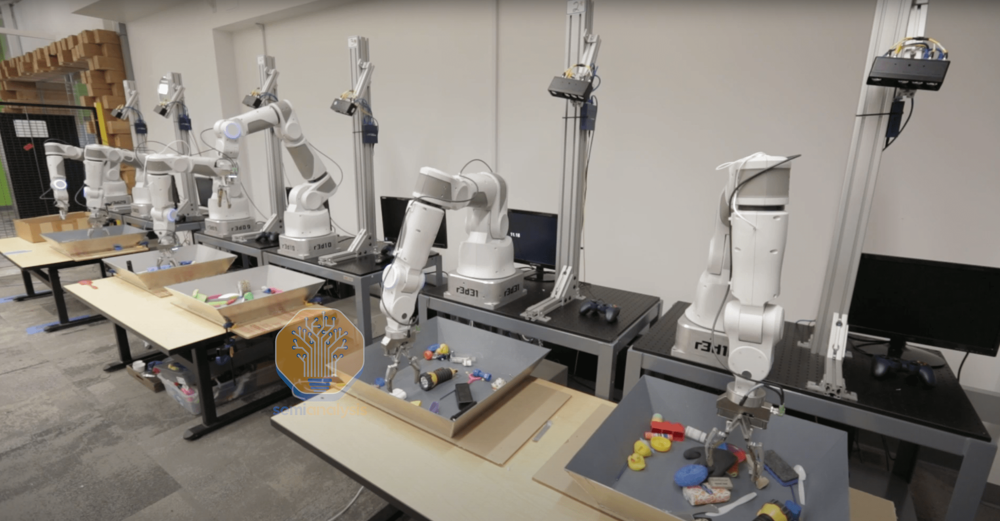](https://i0.wp.com/semianalysis.com/wp-content/uploads/2025/03/400-arm-farmGIMP.png?resize=2525%2C1318&ssl=1)

Source: [Google – Large-scale data collection with an array of robots](https://www.youtube.com/watch?v=iaF43Ze1oeI&t=2s)  

来源：[谷歌——利用一系列机器人进行大规模数据收集](https://www.youtube.com/watch?v=iaF43Ze1oeI&t=2s)

Moreover, unlike the freely-available textual data on the internet that fueled LLMs, robotics demanded multimodal data, which did not exist. Every person trying to train a robot had to collect all data themselves in physical space with a functional robot. Hardware limitations compounded the issue. It was incredibly difficult to build a system of strong enough actuators that could fine-tune movements, all interconnected with non-standardized parts that don’t understand each other, into a robot that could perform one task with slight variations, and much less one that could perform a wide array of actions.  

此外，与推动 LLMs 发展的互联网上免费提供的文本数据不同，机器人技术需要多模态数据，而这种数据并不存在。每个试图训练机器人的人都必须亲自在物理空间中使用功能齐全的机器人收集所有数据。硬件限制使问题更加严重。构建一个具有足够强大的执行器系统以微调动作（所有执行器都与彼此不理解的非标准化部件互连）极其困难，无法让机器人执行一项任务时略有变化，更不用说执行各种动作了。

However, we’re in the early precipice of this nonlinear transformation, but the bedrock the US is standing on is shaky. Significant research and funding across the entire robotics stack have yielded a cascade of breakthroughs. Advances in realistic simulated data, the ability to scale up real world training on multiple robots, and the rise of foundation models have opened the door for a more intelligent system. Simultaneously, advancements in hardware, like electric actuators, have brought down costs greatly and given robots better efficiency to operate at the desired accuracy level, unlocking new actions that were impossible before. **General-purpose robotics has finally been unlocked as a potential real world solution.**   

然而，我们正处于这种非线性转型的早期边缘，但美国所依赖的基石并不稳固。整个机器人技术领域的大量研究和资金投入已经取得了一系列突破。逼真模拟数据的进步、在多个机器人上扩大现实世界训练的能力以及基础模型的兴起为更智能的系统打开了大门。同时，电动执行器等硬件的进步大大降低了成本，使机器人能够以更高的效率在所需的精度水平上运行，从而解锁了以前不可能实现的新动作。**通用机器人终于被解锁为潜在的现实世界解决方案。**

The first movement toward general-purpose robotics will be the entrance into “partially unstructured” domains – initially within their usual environments. In factories, this means operating outside of their isolated predefined environment and handling more than one task. As robots slide across the spectrum toward general purpose, they will replace more and more difficult and diverse tasks in factory settings until they can automate every step.   

通用机器人技术的第一个发展方向将是进入“部分非结构化”领域——最初是在它们通常的环境中。在工厂中，这意味着它们可以在孤立的预定义环境之外运行，并处理多项任务。随着机器人逐渐向通用方向发展，它们将在工厂环境中取代越来越多困难和多样化的任务，直到它们能够实现每一步自动化。

An even more difficult domain for robots is the human-populated domain, in which robots are considered intelligent/safe enough to operate in wholly unstructured and dynamic environments. Since human behavior is unpredictable, robots will need to adapt to avoid safety risks. In addition to full automation of industry, these robots will ease staffing shortages in elder care, improve hospital efficiency, enhance surgical accuracy, and automate dangerous construction tasks, thereby capturing nearly all labor demand.  

对于机器人来说，一个更困难的领域是人类聚集的领域，在这个领域，机器人被认为足够智能/安全，可以在完全非结构化和动态的环境中运行。由于人类行为不可预测，机器人需要适应以避免安全风险。除了工业的全面自动化之外，这些机器人还将缓解老年人护理人员短缺的问题，提高医院效率，提高手术准确性，并自动化危险的建筑任务，从而满足几乎所有的劳动力需求。

## China Is Already Living In Another World  

中国已经生活在另一个世界

Due to Chinese governmental investment and strategic declaration to accelerate robotics, the country has created incredible processes all while still under the usual rigid and fragile constraints of robotics systems. While still requiring perfectly structured environments and static tasks, China has implemented fully “lights-out” factories. Xiaomi’s “[lights-out](https://itc.ua/en/news/xiaomi-s-new-smart-factory-will-operate-24-7-without-people-and-produce-60-smartphones-per-minute/)” factory currently operates constantly with 0 humans employed and produces 1 smartphone every minute. This is not the only [one](https://www.mobileworldlive.com/u-joy-cities-the-worlds-largest-5-5g-native-lights-out-factory/) [either](https://www.gsma.com/solutions-and-impact/technologies/internet-of-things/digital-industries-20/benefits-use-case/foxconn-lights-off-factory/), China is able to achieve this level of automation without general purpose robotics, and the implications for their production capacity when general-purpose arrives cannot be understated. This is not a statement that the US is losing, this is to demonstrate an absurd difference in manufacturing proficiency. This has nothing to do with cheap Chinese labor, this is a manufacturing country with a robust industrial base that has now created one single machine that can produce goods entirely autonomously. General purpose robotics would make this indistinguishable from a living organism, with mobile robots constantly moving around and solving tasks to support and keep the organism alive and functional.  

由于中国政府的投资和加速机器人技术的战略宣言，该国创造了令人难以置信的工艺，但仍然受到机器人系统通常僵硬而脆弱的限制。虽然仍然需要完美结构化的环境和静态任务，但中国已经实现了完全“无人值守”的工厂。小米的“[无人值守](https://itc.ua/en/news/xiaomi-s-new-smart-factory-will-operate-24-7-without-people-and-produce-60-smartphones-per-minute/)”工厂目前在 0 名员工的情况下持续运营，每分钟生产 1 部智能手机。这[也不](https://www.gsma.com/solutions-and-impact/technologies/internet-of-things/digital-industries-20/benefits-use-case/foxconn-lights-off-factory/)是唯一的[一个](https://www.mobileworldlive.com/u-joy-cities-the-worlds-largest-5-5g-native-lights-out-factory/)，中国能够在没有通用机器人的情况下实现这种自动化水平，而当通用机器人出现时，其生产能力的影响不容小觑。这并不是说美国正在失败，而是要展示制造能力的巨大差异。这与中国廉价劳动力无关，这是一个拥有强大工业基础的制造业国家，现在已经创造了一台可以完全自主生产商品的机器。通用机器人将使其与生物体难以区分，移动机器人不断移动并解决任务以支持和保持生物体的生命和功能。

[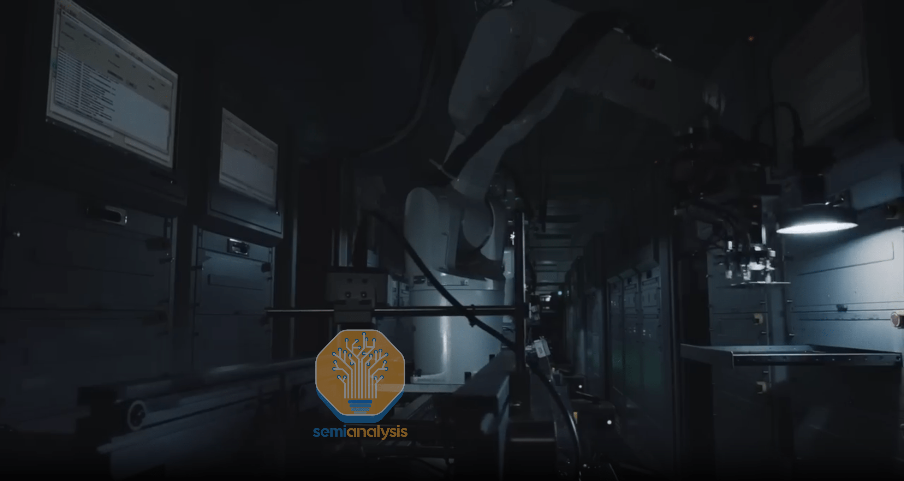](https://i0.wp.com/semianalysis.com/wp-content/uploads/2025/03/xiaomiGIMP.png?resize=2560%2C1363&ssl=1)

Source: Xiaomi  来源：小米

This is only the first step in creating entirely automated machines to produce goods, and they will evolve as AI foundation models become more reliable and accurate. The country has already enabled robots to build robots at their KUKA [factory](https://www.yicaiglobal.com/news/robots-build-robots-at-kukas-guangdong-facility-producing-one-every-half-hour) in Guangdong, and a director at KUKA said that they should be able to cut times from one robot every half hour to one robot every one minute. They’re right. All of these aforementioned factories are running on either minimal levels of AI or the usual structured environment with static tasks and basic programming. General purpose robotics will turn this business into one single machine, and soon after, any complex manufacturing task could be completed by a general purpose robotic system.  

这只是创建全自动机器生产商品的第一步，随着人工智能基础模型变得更加可靠和准确，它们将不断发展。该国已允许机器人在广东的库卡[工厂](https://www.yicaiglobal.com/news/robots-build-robots-at-kukas-guangdong-facility-producing-one-every-half-hour)制造机器人，库卡的一位主管表示，他们应该能够将生产时间从每半小时一台机器人缩短到每分钟一台机器人。他们是对的。上述所有工厂都在最低水平的人工智能或通常的结构化环境中运行，执行静态任务和基本编程。通用机器人将把这项业务变成一台机器，不久之后，任何复杂的制造任务都可以由通用机器人系统完成。

## **From Industrial Robots to Cobots  

从工业机器人到协作机器人**

Let’s take a step back and first understand the current state of the industry. There are many types of robots and form factors that have become much more diverse and feasible in the last few years. The robots that have been most compelling for implementing automation at scale for the past decades however have been the industrial robots.   

让我们回顾一下，首先了解一下该行业的现状。过去几年，机器人的类型和外形已经变得更加多样化和可行。然而，过去几十年来，最引人注目的大规模自动化实现方式是工业机器人。

[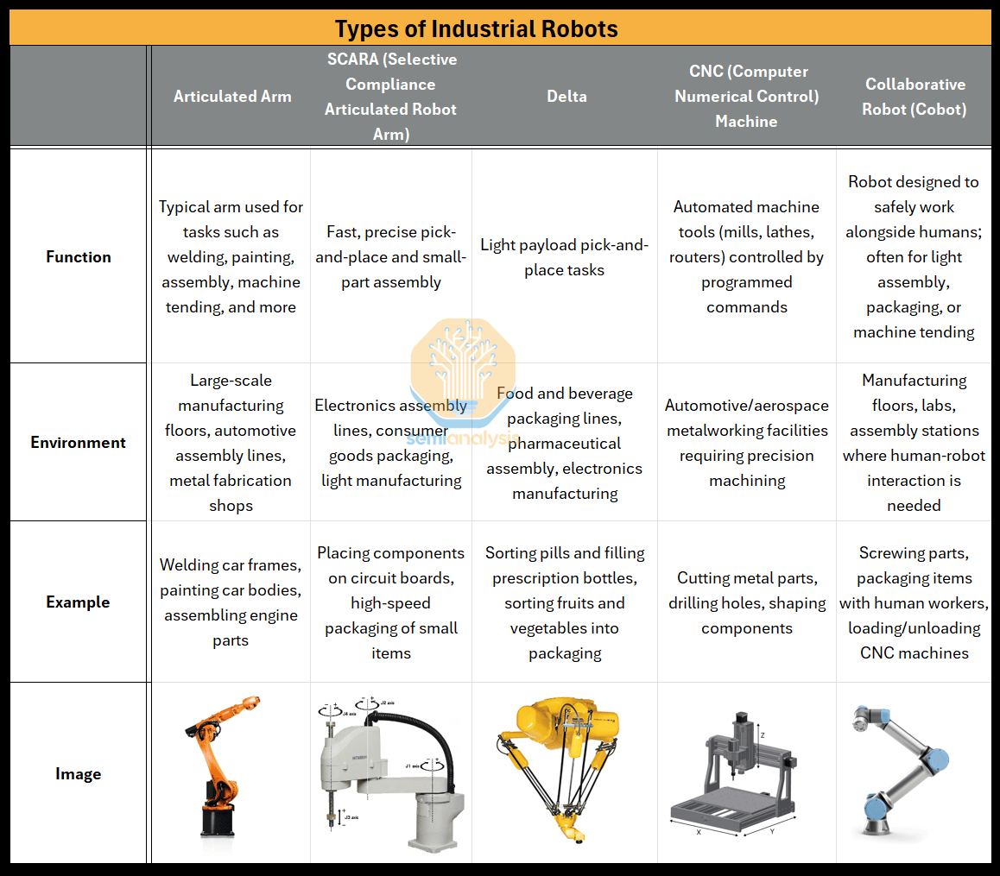](https://i0.wp.com/semianalysis.com/wp-content/uploads/2025/03/500-types-of-industrial-bots-1.png?resize=1158%2C1015&ssl=1)

Source: SemiAnalysis  来源：SemiAnalysis

Traditional industrial robots, like an articulated robot arm, prioritize speed, precision, and payload capacity. Equipped with high-torque actuators and finely tuned high-frequency control systems for precision, they are typically found in heavy industry environments that require repetition and high throughput, i.e. automotive factories or electronics manufacturing.   

传统工业机器人（如铰接式机器人手臂）优先考虑速度、精度和有效载荷能力。它们配备高扭矩执行器和精细调整的高频控制系统以实现精度，通常用于需要重复和高吞吐量的重工业环境，例如汽车工厂或电子制造业。

They are required to work in [isolated cells](https://www.youtube.com/watch?v=RBlGe12UGVI) for two reasons:  

它们需要在[隔离单元](https://www.youtube.com/watch?v=RBlGe12UGVI)中工作有两个原因：

1.  Human safety,  人类安全，
2.  Their lack of flexibility.  
    
    缺乏灵活性。

These robots are not capable of adaptation: any small deviation in the environment can break their process. For example, in automotive industries, [spot welding metal panels](https://www.youtube.com/watch?v=gWwNsgw24NE) together is often automated. This task requires remarkable accuracy to ensure the panels are correctly positioned next to each other, the spot weld is exactly over the designated points, and the weld is applied with the same consistent force and duration **every time.** Due to the accurate nature of the task, any slight deviation in the positioning or timing can affect the weld, and consequently the structural integrity of the vehicle  

这些机器人不具备适应能力：环境中的任何细微偏差都可能破坏其流程。例如，在汽车行业，[点焊金属面板](https://www.youtube.com/watch?v=gWwNsgw24NE)通常是自动化的。这项任务需要非凡的精确度，以确保面板正确定位在一起，点焊精确地位于指定点上，并且**每次焊接都以相同的一致力和持续时间施加。**由于任务的精确性，定位或时间上的任何轻微偏差都可能影响焊接，从而影响车辆的结构完整性

Source: [KUKA’s automated spot welding](https://www.kuka.com/en-de/applications/automated-welding/spot-welding)  

来源： [KUKA 的自动化点焊](https://www.kuka.com/en-de/applications/automated-welding/spot-welding)

Collaborative robots (cobots) are the proposed solution to a human populated environment subject to the inherent dynamism of the world – enabling a higher level of automation inside a factory. Similar looking to an industrial robot but a bit smaller, they trade-off payload capacity with higher safety, flexibility and programmability – and can easily be restaked and moved around a factory when necessary. These are often the robots that are given higher levels of AI capabilities for some tasks today (higher variability pick and place and sorting).  

协作机器人 (cobot) 是针对受制于世界固有动态的人类居住环境提出的解决方案 - 可在工厂内实现更高水平的自动化。它们的外观与工业机器人相似，但体型略小，在有效载荷能力和更高安全性、灵活性和可编程性之间取得平衡 - 必要时可在工厂内轻松重新固定和移动。这些机器人通常被赋予更高水平的人工智能能力，以执行当今的某些任务（更高可变性的拾取、放置和分类）。

[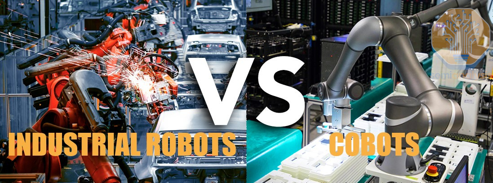](https://i0.wp.com/semianalysis.com/wp-content/uploads/2025/03/750-ROBOTS-VS-COBOTS-GO-GO-GOGIMP.jpg?resize=1097%2C408&ssl=1)

Source: Futura Automation  

来源：Futura Automation

Cobots sacrifice payload capacity and speed with weaker actuators and adding some type of safety hardware in place such as force-torque sensors to understand collision, additional vision sensors to build a more comprehensive view, and more onboard controllers for redundancy. They can be hand-guided or taught via some interface (tablet typically) so that programming an action requires less expertise and enabling them to easily change simple tasks.  

协作机器人牺牲了有效载荷能力和速度，采用了较弱的执行器，并增加了某种安全硬件，例如力矩传感器以了解碰撞、额外的视觉传感器以构建更全面的视图，以及更多的板载控制器以实现冗余。它们可以通过某种界面（通常是平板电脑）进行手动引导或教学，因此编程操作所需的专业知识较少，并使其能够轻松更改简单的任务。

Typically given the tasks that require less force and more finesse, cobots (collaborative robots) might be tasked with lightweight materials handling in between processes in a factory where the industrial robot would take the materials and perform the heavier tasks. Cobots can also work as a companion to other industrial machines like [CNCs](https://en.wikipedia.org/wiki/Numerical_control) (Computer Numerical Control) – where they can [load](https://www.youtube.com/watch?v=lNeRrsu4s3Y) the CNC with raw materials, retrieve the finished parts, and even perform routine supporting tasks like cleaning or quality checking. We show below an example of a robotic arm interacting with a CNC machine.  

通常，协作机器人 (cobot) 的任务需要较少的力量和更多的技巧，它们可能负责在工厂工序之间搬运轻质材料，而工业机器人则会负责搬运材料并执行较重的任务。协作机器人还可以作为[CNC](https://en.wikipedia.org/wiki/Numerical_control) (计算机数控) 等其他工业机器的伴侣 - 它们可以将原材料[装入](https://www.youtube.com/watch?v=lNeRrsu4s3Y)CNC，检索成品零件，甚至执行清洁或质量检查等常规支持任务。下面我们展示了机械臂与 CNC 机器交互的示例。

Source: Productive Robotics  

来源：Productive Robotics

Naturally, the share of cobots of all industrial robot installations has been rising fast, as they enable higher automation settings and improved factory ROI. Cobots are financially viable in industrial settings, as the environment can be structured enough to make sure the robot’s accuracy on tasks remains high. At the moment, there are **over four million robots installed and operating around the world**, with 90% of annual shipments being standard industrial robots and [10%](https://ifr.org/img/worldrobotics/Press_Conference_2024.pdf) cobots. Industrial robots are usually implemented in automotive sectors, packaging in food and consumer goods, and electronics manufacturing. Cobots are seen in the same industries performing more complex tasks that require great precision, but under the guidance and instruction of human workers  

自然而然，协作机器人在所有工业机器人安装中的份额一直在快速上升，因为它们可以实现更高的自动化设置并提高工厂的投资回报率。协作机器人在工业环境中具有经济可行性，因为环境可以结构化到足以确保机器人在执行任务时保持较高的准确性。目前，**全球已安装并运行超过 400 万台机器人**，其中 90% 的年出货量为标准工业机器人， [10% 为](https://ifr.org/img/worldrobotics/Press_Conference_2024.pdf)协作机器人。工业机器人通常应用于汽车行业、食品和消费品包装以及电子制造业。协作机器人在相同的行业中执行更复杂、需要高精度的任务，但需要在人类工人的指导和指示下进行

[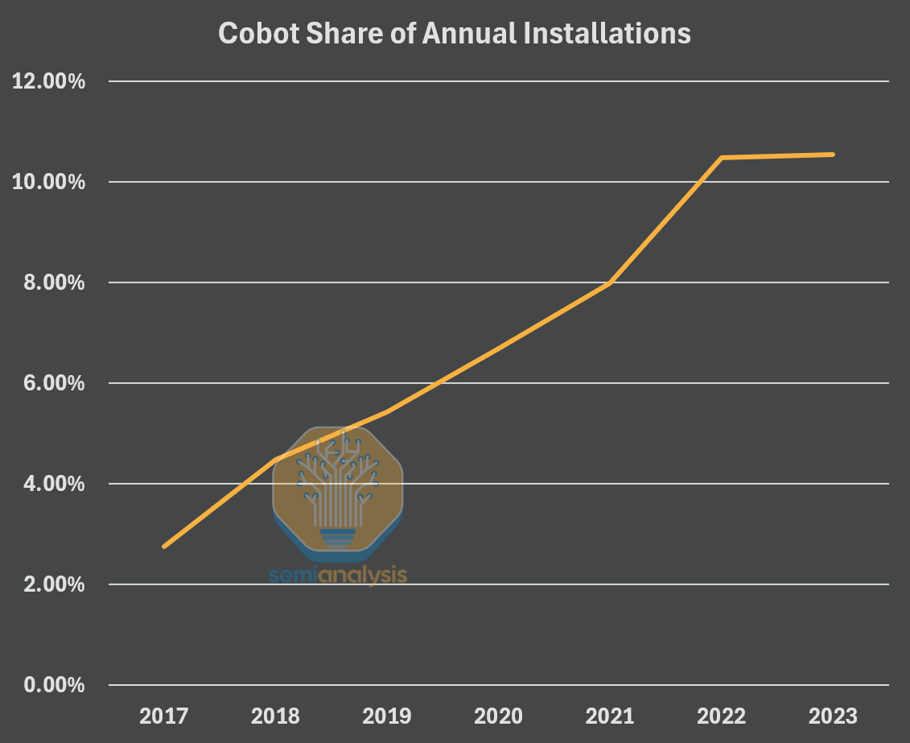](https://i0.wp.com/semianalysis.com/wp-content/uploads/2025/03/900-cobot-share-of-installations.png?resize=1131%2C923&ssl=1)

Source: SemiAnalysis, IFR  

来源：SemiAnalysis、IFR

While the scale of automation is impressive, there are reasons these robots are nearly always found in factory settings. Not all manufacturing is easy for these robots, high-mix low-volume production where frequent changes are common make it difficult to fully automate tasks and most tasks that require fine motor skills and dexterity require levels of manipulation not developed yet. Cobots are posed as the solution for this as well, but in practice, automation entails much more flexibility and capability than any of the current robots can provide.   

虽然自动化的规模令人印象深刻，但这些机器人几乎总是出现在工厂环境中，这是有原因的。并非所有制造对于这些机器人来说都很容易，高混合小批量生产中频繁的变化使任务难以完全自动化，大多数需要精细运动技能和灵活性的任务需要尚未开发的操作水平。协作机器人也被认为是解决这一问题的方案，但在实践中，自动化需要比任何当前机器人所能提供的更大的灵活性和能力。

## **The Rise of Mobile Robots  

移动机器人的兴起**

[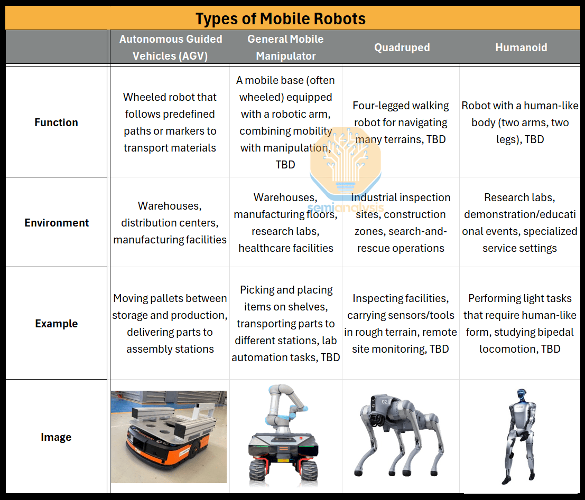](https://i0.wp.com/semianalysis.com/wp-content/uploads/2025/03/600-types-of-mobile-robots-1.png?resize=1107%2C947&ssl=1)

Source: SemiAnalysis  来源：SemiAnalysis

Mobile robots have been the newest addition to the robotic fleet of automation, leveraging mobility to conduct transportation tasks and coordinating with other robots, however, all have different difficulties, domains, and advantages in their mobility capabilities. Autonomous Guided Vehicles were the first foray into mobility around the same time as cobots. Their job is simple: transport objects, like a package inside of an Amazon fulfillment center, to another location. These are still rigid as most other robots, requiring that some guidance be placed on the floor for the AGV to follow.  

移动机器人是自动化机器人领域的最新成员，它们利用移动性执行运输任务并与其他机器人协调，然而，它们在移动能力方面都有不同的困难、领域和优势。自动导引车是与协作机器人同时首次涉足移动领域的产品。它们的工作很简单：将物品（例如亚马逊配送中心内的包裹）运送到另一个位置。它们仍然像大多数其他机器人一样是刚性的，需要在地板上放置一些引导装置以便 AGV 跟随。

[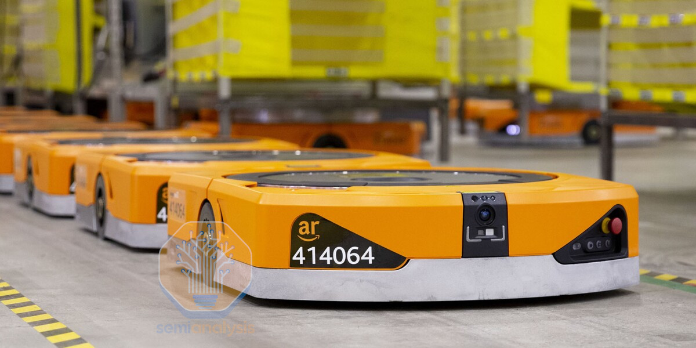](https://i0.wp.com/semianalysis.com/wp-content/uploads/2025/03/amazon-agvGIMP.jpeg?resize=1200%2C600&ssl=1)

Source: Amazon  来源：亚马逊

Mobile manipulators are often wheeled manipulators that are found in factories, where floors are legally required to be flat, and will be used for grasping and moving objects from station to station on a very strict and short navigation horizon. Quadrupeds are four legged mobile robots and are more often found in more open-world environments, typically found inspecting various areas of a construction site or similar, however, they are still in the prototyping phase as well. Finally, humanoids are able to be in the same environments as the others, but are poised to be functional in human-populated domains. These are currently in production with the aim of being an evolved and more capable mobile form factor with more degrees of freedom, range in tasks, and domains, but have yet to be integrated into any formal setting.   

移动机械手通常是工厂中的轮式机械手，法律要求工厂的地面必须是平整的，移动机械手用于在非常严格和短的导航范围内抓取和移动物体。四足机器人是四条腿的移动机器人，更常见于更开放的世界环境中，通常用于检查建筑工地或类似场所的各个区域，但它们也仍处于原型设计阶段。最后，类人机器人能够与其他机器人处于相同的环境中，但准备在人类居住的领域发挥作用。这些机器人目前正在生产中，目的是成为一种进化的、更强大的移动形式，具有更多的自由度、任务范围和领域，但尚未集成到任何正式环境中。

However, all of these form factors still only function in static structured environments. At the moment, mobile manipulators are still in the early deployment phase in factories, and quadrupeds will soon begin deployment onto construction sites. Currently, only AGVs are widely deployed and integrated, and mobile manipulators, quadrupeds, and humanoids are still in early formats of more open-world domains, benefitted by the current progress in AI.   

然而，所有这些形态的机器人仍然只能在静态结构化环境中发挥作用。目前，移动机械手在工厂中仍处于早期部署阶段，四足机器人将很快开始部署到建筑工地。目前，只有 AGV 得到广泛部署和集成，而移动机械手、四足机器人和人形机器人仍处于更开放世界领域的早期形态，这得益于当前人工智能的进步。

## **Hardware: What Goes Into a Robot?   

硬件：机器人里面有什么？**

Robot component markets are dominated by a few key players, and the US is noticeably absent in many. The industrial capacity necessary for entry—high volume, high quality, and low cost—is largely concentrated elsewhere, particularly in China. It will be a challenge for the US to carve a position, especially when most of the materials come from China.  

机器人零部件市场由少数几家关键企业主导，而美国在很多领域都明显缺席。进入该市场所需的工业能力（大批量、高质量和低成本）主要集中在其他地方，尤其是中国。对于美国来说，占据一席之地将是一个挑战，尤其是当大多数材料都来自中国时。

On the hardware side, actuators, motors, and drives are the pieces that will physically generate motion by converting an electrical input into either a hydraulic, pneumatic, or, more often, electrical output to generate this motion.  

在硬件方面，执行器、电机和驱动器是通过将电输入转换为液压、气动或更常见的电输出来物理产生运动的部件。

At the higher-level in a factory, a Programmable Logic Controller (PLC) determines how a production line will be automated, sequencing each operation properly to ensure the entire automated process is functional. Within each robot, regardless of form factor, there is a Microcontroller Unit (MCU), or embedded systems with multiple MCUs, that is the dedicated processor handling low-level real-time tasks like reading sensor inputs, generating motor control signals, and running fast control loops. These systems are effectively the “brain” for most robotic systems.  

在工厂的更高层，可编程逻辑控制器 (PLC) 决定生产线的自动化方式，正确排序每个操作以确保整个自动化过程正常运行。每个机器人，无论外形尺寸如何，都有一个微控制器单元 (MCU) 或具有多个 MCU 的嵌入式系统，它们是处理低级实时任务的专用处理器，例如读取传感器输入、生成电机控制信号和运行快速控制循环。这些系统实际上是大多数机器人系统的“大脑”。

[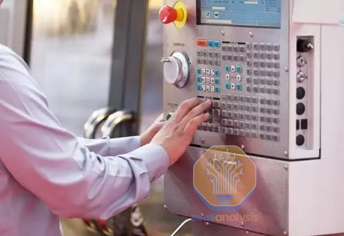](https://i0.wp.com/semianalysis.com/wp-content/uploads/2025/03/1000-PLCGIMP.png?resize=500%2C343&ssl=1)

Source: BizLink  资料来源：BizLink

In the world of robotics, high-precision motors are required to ensure the proper torque is applied to avoid damaging its surroundings. Servo motors are the most common option – they are self-contained systems that include a motor, a control circuit, and a feedback mechanism. This overhead enables the motor to actively adjust itself and maintain a desired position or motion. Servo motors are one of the few components in a robot where the market is not dominated by China and fairly well distributed across countries.  

在机器人领域，需要高精度电机来确保施加适当的扭矩，避免损坏周围环境。伺服电机是最常见的选择——它们是独立的系统，包括电机、控制电路和反馈机制。这种开销使电机能够主动调整自身并保持所需的位置或运动。伺服电机是机器人中为数不多的市场不由中国主导且在各国分布相当均匀的部件之一。

[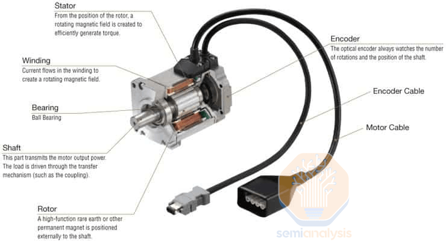](https://i0.wp.com/semianalysis.com/wp-content/uploads/2025/03/1100-servo-motor-1GIMP.png?resize=740%2C402&ssl=1)

[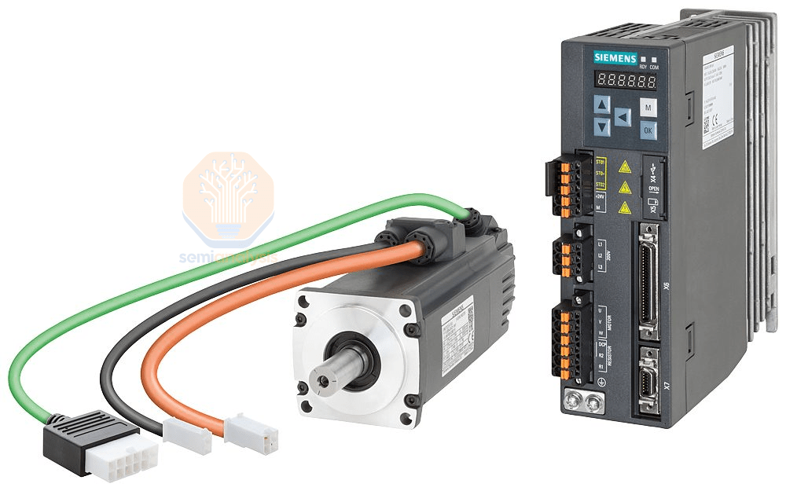](https://i0.wp.com/semianalysis.com/wp-content/uploads/2025/03/1200-servo-driveGIMP.png?resize=1000%2C625&ssl=1)

Source: [SolisPLC](https://www.solisplc.com/servo-motor)  

来源： [SolisPLC](https://www.solisplc.com/servo-motor)

The control circuit is referred to as “drive”. This is a power electronics box designed to regulate the voltage sent to the motor, through an AC-DC-AC conversion (or AC-DC for a DC motor). Its main component is a power electronics switch such as a MOSFET or IGBT, which combined with a rectifier and capacitors can electronically modify the electrical signal.   

控制电路称为“驱动器”。这是一个电力电子盒，旨在通过交流-直流-交流转换（或直流电机的交流-直流）调节发送到电机的电压。其主要组件是电力电子开关，例如 MOSFET 或 IGBT，它与整流器和电容器结合使用，可以电子方式修改电信号。

[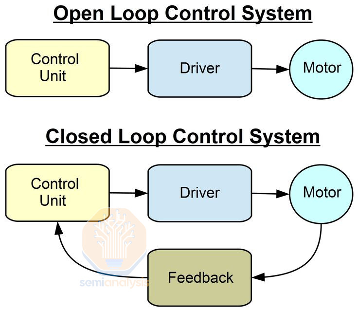](https://i0.wp.com/semianalysis.com/wp-content/uploads/2025/03/1300-closed-loop-control-systemGIMP.jpg?resize=736%2C637&ssl=1)

Source: Polytechnic Hub  来源：理工学院中心

Gearboxes are also a common component found in servo motors. They are able to increase the force/torque of a motor, and increase accuracy. In essence, gearboxes reduce the speed of a motor, leading to a proportional increase in torque, which also enables the motor to make finer movements. Most gearboxes found in robotic systems have been largely produced by Japan’s Nabtesco.  

变速箱也是伺服电机中常见的部件。它们能够增加电机的力/扭矩，并提高精度。本质上，变速箱会降低电机的速度，从而按比例增加扭矩，这也使电机能够做出更精细的动作。机器人系统中的大多数变速箱主要由日本的 Nabtesco 生产。

[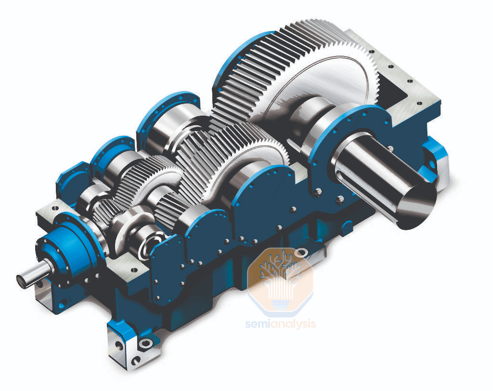](https://i0.wp.com/semianalysis.com/wp-content/uploads/2025/03/1400-gearboxGIMP.png?resize=1024%2C815&ssl=1)

Source: [Santram Engineers](https://www.santramengineers.com/industrial-helical-gearbox-issues-and-their-solutions/)  

来源： [Santram Engineers](https://www.santramengineers.com/industrial-helical-gearbox-issues-and-their-solutions/)

Cameras and sensors are pivotal for the robot as well, as this has been the primary medium by which it knows both its own positioning and the steps required to complete the task it faces. Most robots use standard 2D cameras, 3D depth cameras, or a combination of both to create a full spatial understanding of its environment. Some form factors, typically those in a more human-populated environment, may use LiDAR to gain a much more detailed view of its surroundings, albeit usually at a higher cost. Most LiDAR, automotive specifically, comes from Hesai (China), and China has advanced enough in LiDAR innovation that Unitree has already developed a proprietary [LiDAR](https://www.unitree.com/L2) system at a slightly higher price point than the Intel RealSense depth camera.   

摄像头和传感器对于机器人来说也至关重要，因为这是机器人了解自身定位和完成任务所需步骤的主要媒介。大多数机器人使用标准 2D 摄像头、3D 深度摄像头或两者结合来全面了解其环境的空间。某些外形尺寸的机器人（通常是人类密集环境中的机器人）可能会使用 LiDAR 来更详细地了解其周围环境，尽管成本通常较高。大多数 LiDAR（特别是汽车 LiDAR）来自 Hesai（中国），中国在 LiDAR 创新方面已经足够先进，Unitree 已经开发出专有的[LiDAR](https://www.unitree.com/L2)系统，价格略高于英特尔 RealSense 深度摄像头。

Industrial and precise robots are equipped with joint encoders, which allow the robot to understand the angle, position, or rotation speed of its joints. A broad set of sensors can be included such as touch and tactile sensors to understand pressure, texture, and more, proprioceptive sensors to understand physical internal states like balance, force-torque sensors to understand how much force-torque is being applied by a joint, etc. This market is a bit small/disjointed because the products are newer developments; however, most Western companies that are able to design and assemble these sensors will still typically buy the base materials from China.   

工业和精密机器人配备有关节编码器，使机器人能够了解其关节的角度、位置或旋转速度。可以包括多种传感器，例如触摸和触觉传感器，用于了解压力、纹理等，本体感受传感器用于了解平衡等物理内部状态，力矩传感器用于了解关节施加了多少力矩等。这个市场有点小/脱节，因为产品是较新的开发产品；然而，大多数能够设计和组装这些传感器的西方公司通常仍会从中国购买基础材料。

Source: Intel  来源：英特尔

Then there are the “end-effectors”, which are whatever the robot may have at the end of its arm, typically a tool or a very basic gripper for most robots. Each end-effector has its own use-case and payload capacity, or the amount of weight it is able to “hold”, so whatever the purpose of the robot will dictate the end-effector it has installed. This is one part of the robot that China is not very involved in at all, most end-effector producers are German (Schunk, Zimmer Group, Festo, Schmalz) and some are even American (ATI Industrial Automation, Destaco). However, it’s likely that Chinese companies are simply producing their own end-effectors and not exporting them yet, as vertical integration is their main strategy. While “hands” are catching much of the spotlight right now, these are not widely implemented and are far from achieving sufficient dexterity. We will explore the challenges of dexterity and what road lies ahead for manipulation in the next article of the robotics series!  

然后是“末端执行器”，即机器人手臂末端可能装有的装置，通常是工具或大多数机器人最基本的夹持器。每个末端执行器都有自己的使用情况和有效载荷能力，或者说它能够“承载”的重量，因此机器人的用途将决定其安装的末端执行器。这是中国参与度不高的机器人部件之一，大多数末端执行器生产商都是德国公司（Schunk、Zimmer Group、Festo、Schmalz），有些甚至是美国公司（ATI Industrial Automation、Destaco）。然而，中国公司很可能只是生产自己的末端执行器，尚未出口，因为垂直整合是他们的主要战略。虽然“手”现在备受关注，但它们尚未得到广泛应用，而且远未达到足够的灵活性。我们将在机器人系列的下一篇文章中探讨灵活性的挑战以及未来操控的道路！  

[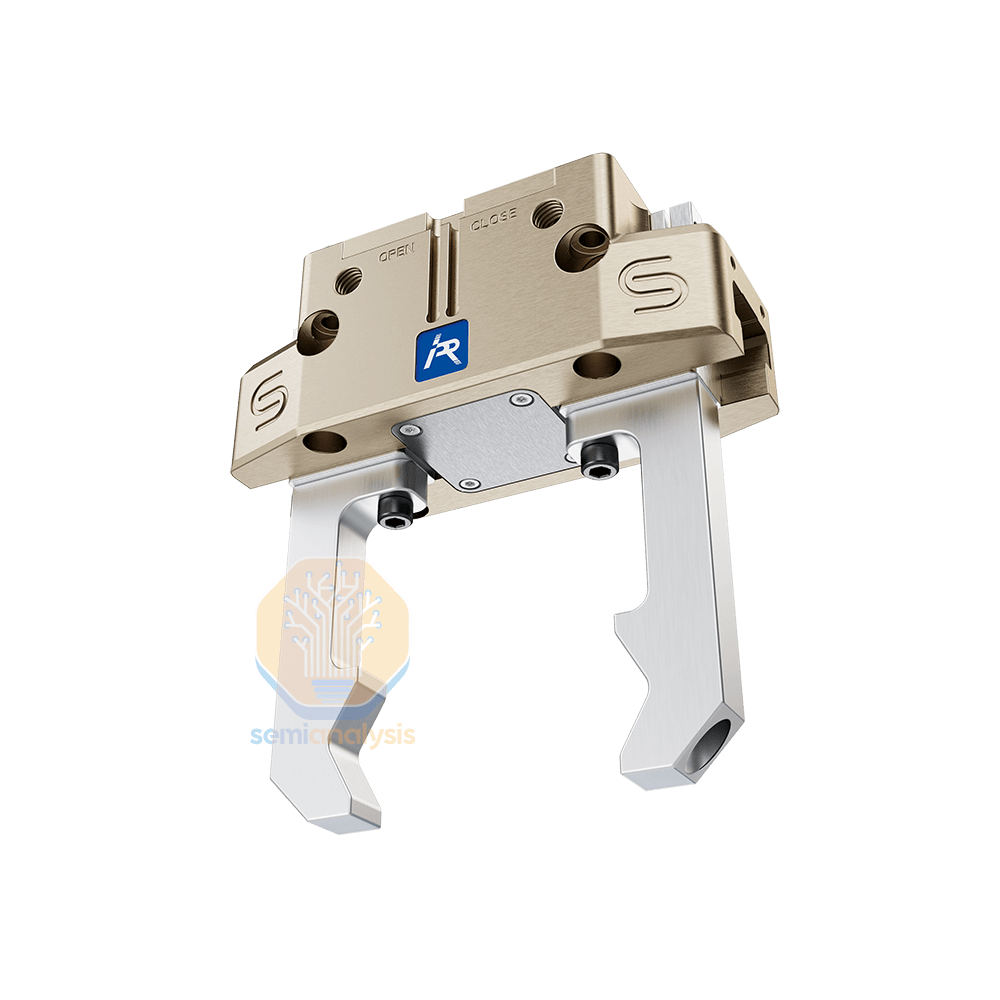](https://i0.wp.com/semianalysis.com/wp-content/uploads/2025/03/1600-gripperGIMP.png?resize=1000%2C1000&ssl=1)

Source: IPR Worldwide  来源：IPR Worldwide

[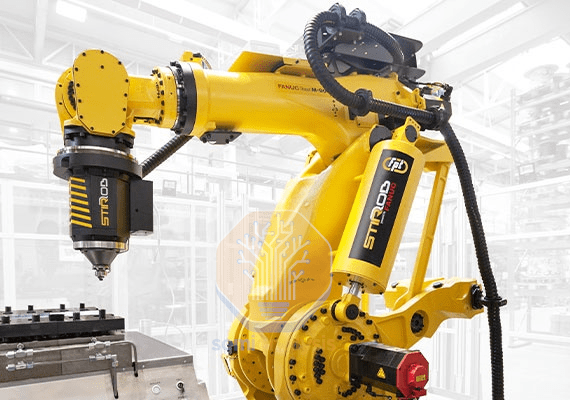](https://i0.wp.com/semianalysis.com/wp-content/uploads/2025/03/1700-igus-end-effectorGIMP.png?resize=570%2C400&ssl=1)

Source: Igus  来源：Igus

## **Supply Chain Woes  供应链困境**

In the US, the “Made in America” label is misleading at best, and downright harmful at worst. The substantial transformation principle allows for significant processing of foreign materials, notably from China, in intermediary countries, before final assembly in the US. This means a product can be labeled “Made in USA” even if its core components originated in China, obfuscating the true extent of foreign dependence. Consequently, many US companies will purchase cheap materials from China, transform them into robotics hardware packaged with Country of Origin (COO) America, and undercut the US firms that are actually extracting from the ground and manufacturing in the US. This is hard to talk about, but it’s even harder to solve.  

在美国，“美国制造”标签充其量只是一种误导，最坏的情况则是完全有害。实质性转化原则允许在中间国家对外国材料（尤其是来自中国的材料）进行大量加工，然后再在美国进行最终组装。这意味着即使产品的核心部件源自中国，也可以贴上“美国制造”的标签，从而掩盖其对外国的真正依赖程度。因此，许多美国公司将从中国购买廉价材料，将其转化为贴有原产国 (COO) 的机器人硬件，并削弱实际上在美国开采和制造的美国公司的竞争力。这很难说，但更难解决。

It is far more difficult and time consuming than many people think to bring manufacturing capacity online and mass produce industrial robots to introduce automation, and worse, it’s _very_ time consuming. Supply chains for many industrial robots are very complex, coming from many corners of the world where component production is typically already dominated through competitive cost advantages. There have been many cases of supply chain disruptions that have rattled Western economies. For example, in 2020-2022 during COVID the ports of Los Angeles and Long Beach experienced a line of over 100 ships waiting outside the port for their turn to disembark. In stark contrast to this debacle, during the same time period (2020-2021), China pivoted and increased their robotics installation by [44%](https://ifr.org/ifr-press-releases/news/china-robot-installations-grew-by-44-percent) from 2020-2021 in order to implement automation to make up for the lack of a workforce.   

将制造能力上线并批量生产工业机器人以引入自动化，这比很多人想象的要困难和耗时得多，更糟糕的是，这_非常_耗时。许多工业机器人的供应链非常复杂，来自世界许多角落，而这些地方的零部件生产通常已经通过竞争成本优势占据主导地位。有许多供应链中断的案例震撼了西方经济体。例如，在 2020-2022 年新冠疫情期间，洛杉矶和长滩港口的港口外排起了长队，有超过 100 艘船等待下船。与这一灾难形成鲜明对比的是，在同一时期（2020-2021 年），中国为了实施自动化来弥补劳动力的不足，从 2020-2021 年增加了[44%](https://ifr.org/ifr-press-releases/news/china-robot-installations-grew-by-44-percent)的机器人安装量。

Why didn’t the US follow suit? COVID was the largest wake up call in years regarding the supply chain dependencies, yet the country refused to open its eyes. As explained below, the US has no significant market share in **any** of the relevant manufacturing nodes for robotics, and in most it’s essentially absent.   

为什么美国没有效仿？COVID 是多年来对供应链依赖性的最大警示，但该国却拒绝睁开眼睛。如下所述，美国在**任何**相关的机器人制造节点中都没有显著的市场份额，而且在大多数节点中，它基本上不存在。

## **Mechanical Components: Gearbox, Motors, Actuators  

机械部件：变速箱、电机、执行器**

On the hardware side, we will focus on what actually goes into generating locomotion in a robot: actuators/motors and their respective components. **There are many types of motors available for generating motion, steppers with precise angular control in open-loop systems typically found in 3D printers or CNC machines, brushless DC motors with high power-to-weight ratios to propel drones and EVs, but the most important in robotics tends to be the servo motor.** Most robotics companies, especially those of the Big 4, produce their own servo motors in-house and sell them individually as well. These are not terribly difficult to build, but manufacturing them at scale does create a bit of a moat for the aforementioned reasons: actuators must have incredible reliability and performance, so scaling up requires advanced manufacturing techniques to be nearly perfectly replicated. As such, the long-standing manufacturers of robotics components with the necessary expertise hold the largest market share are Yaskawa (Japan), Panasonic (Japan), Bosch (Germany), KUKA (now China), and Siemens (Germany). Rockwell (USA) must be named here as well because it holds some 7% of the servo motor market share, but this is also the only segment of the supply chain that is not dominated by any one player.   

在硬件方面，我们将重点介绍机器人产生运动的实际过程：执行器/电机及其各自的组件。**有许多类型的电机可用于产生运动，开环系统中具有精确角度控制的步进电机通常用于 3D 打印机或 CNC 机器，具有高功率重量比的无刷直流电机用于推动无人机和电动汽车，但机器人技术中最重要的往往是伺服电机。**大多数机器人公司，尤其是四大公司，都在内部生产自己的伺服电机并单独销售。这些电机并不难制造，但大规模生产确实会因为上述原因而形成一些壁垒：执行器必须具有令人难以置信的可靠性和性能，因此扩大规模需要先进的制造技术才能几乎完美地复制。因此，拥有必要专业知识的长期机器人组件制造商占据最大市场份额的是安川（日本）、松下（日本）、博世（德国）、库卡（现为中国）和西门子（德国）。这里也必须提到罗克韦尔（美国），因为它占有伺服电机市场约7%的份额，但这也是供应链中唯一一个不受任何一家公司主导的部分。

[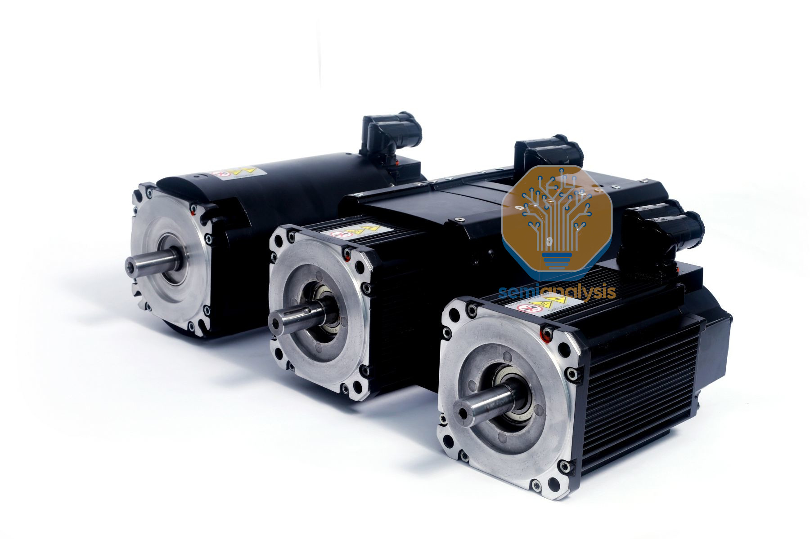](https://i0.wp.com/semianalysis.com/wp-content/uploads/2025/03/1800-servo-motor-againGIMP.jpeg?resize=1800%2C1200&ssl=1)

Source: Moog GmbH  消息来源：Moog GmbH

Nearly 60% of the world’s gearboxes for medium-to-large industrial robots are supplied by Japan’s Nabtesco. Their difficulty to manufacture arises from the fact that almost every order is likely to be highly customized and tailored to the customer’s hardware specifications, yet must still meet the 99.99% accuracy threshold to replace a human. Gearboxes are absolutely pivotal for ensuring this precision, and therefore make up the largest % of COGS on an industrial robot at [14%](https://www.controleng.com/industrial-robot-value-comes-from-servo-motors-servo-drives-and-gearboxes/). The manufacturing of these gearboxes must be accurate to an unreal degree, and as such, typically only long-standing and established players with years of experience building them have refined their process and process technology enough to achieve this quality, hence the Nabtesco dominance. They manufactured their first cycloidal gear in 1980.   

全球近 60% 的中大型工业机器人变速箱由日本的 Nabtesco 供应。它们制造起来很困难，因为几乎每个订单都可能是高度定制的，并根据客户的硬件规格量身定制，但仍必须满足 99.99% 的准确度阈值才能取代人类。变速箱对于确保这种精度绝对是关键，因此占工业机器人 COGS 的最大百分比，为[14%](https://www.controleng.com/industrial-robot-value-comes-from-servo-motors-servo-drives-and-gearboxes/) 。这些变速箱的制造必须精确到难以置信的程度，因此，通常只有拥有多年制造经验的长期和成熟的参与者才能改进他们的工艺和工艺技术，使其达到这种质量，因此 Nabtesco 占据了主导地位。他们在 1980 年制造了第一个摆线齿轮。

Source: CuratedIndustry  来源：CuratedIndustry

There are even special types of gearboxes like Harmonic Drive (Japan), founded in 1970, which uses a patented strain-wave design for incredible precision. These are more expensive but a must-have in superprecise settings (like semiconductor fabrication) and as such have a strong presence at [15%](https://roboticpaint.com/how-japanese-speed-reducer-monopolize-the-industry/) of the gearbox market. However, to demonstrate what a proper industrial base and rapid iteration is capable of, Leaderdrive was founded in China in 2003 with the aim of manufacturing their own superprecise strain-wave gearbox. In just 14 years, the company had produced over 100,000 units and captured [90%](https://www.leaderdrive.com/about-us.asp) of the Chinese domestic market for strain-wave gearboxes.  

甚至还有特殊类型的变速箱，例如成立于 1970 年的 Harmonic Drive（日本），它采用获得专利的应变波设计，精度极高。这些变速箱价格更昂贵，但在超精密环境（如半导体制造）中必不可少，因此在变速箱市场中占有[15% 的](https://roboticpaint.com/how-japanese-speed-reducer-monopolize-the-industry/)份额。然而，为了展示适当的工业基础和快速迭代的能力，Leaderdrive 于 2003 年在中国成立，旨在制造自己的超精密应变波变速箱。在短短 14 年内，该公司已生产了 100,000 多台，占据了中国国内应变波变速箱市场的[90%](https://www.leaderdrive.com/about-us.asp) 。

Source: [makeagif](https://makeagif.com/gif/strain-wave-gear-principle-harmonic-drive-ag-yLZhgu)  

资料来源： [makeagif](https://makeagif.com/gif/strain-wave-gear-principle-harmonic-drive-ag-yLZhgu)

## **Magnets and Materials – Manufacturing Dependence  

磁铁和材料——制造依赖性**

Motors and gearboxes are not in short supply and are fairly cheap; however, motors nowadays have undergone a breakthrough. Most high-quality high-speed motors are now developed with permanent magnets (PM motors) to achieve higher power efficiency and power-to-weight ratio — perfect for robots. Without getting into too much detail, permanent magnets effectively add more magnetism into the electromagnetic field of a motor, meaning less electricity is required to magnetize and can instead go toward generating motion. There remains one issue though, the process and elements that go into creating your typical Neodymium permanent magnet (NdFeB) is nearly entirely dominated by China with 90% of the market share. Of that 90%, roughly three producers in China hold a near-monopoly on it: Jingci, JL MAG, and Ningbo Yungsheng.  

电机和变速箱并不短缺，而且价格相当便宜；然而，如今的电机已经取得了突破。现在大多数高质量的高速电机都是用永磁体（PM 电机）开发的，以实现更高的功率效率和功率重量比——非常适合机器人。不必过多赘述，永磁体可以有效地为电机的电磁场增加更多的磁性，这意味着磁化所需的电力更少，而可以用于产生运动。不过，还有一个问题，制造典型的钕永磁体 (NdFeB) 的工艺和元素几乎完全由中国主导，占据了 90% 的市场份额。在这 90% 中，大约有三家中国生产商几乎垄断了这一市场：晶磁、JL MAG 和宁波永盛。

[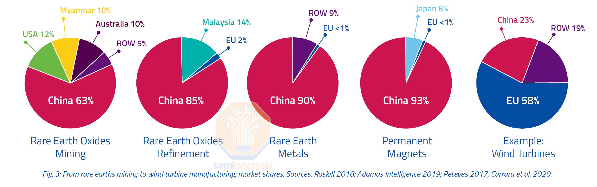](https://i0.wp.com/semianalysis.com/wp-content/uploads/2025/03/2100-REE-paper-comparisonGIMP.png?resize=2403%2C756&ssl=1)

Source: ERMA  来源：ERMA

While “rare earth” is a misnomer — they are just as abundant as most other elements– the process needed to refine Neodymium and produce a final permanent magnet requires around ~12 complex steps and a strong industrial capacity. China dominates this process as well at 93%. After the trade restrictions on [Chinese strategic minerals](https://www.reuters.com/markets/commodities/rattled-by-china-west-scrambles-rejig-critical-minerals-supply-chains-2024-12-06/), there are attempts to try to minimize this dependency on Chinese permanent magnets. For instance, MP Materials in the US to become the only fully vertically integrated rare earths company in all of North America. Australia’s Lynas, the world’s largest non-Chinese producer, is expanding and building another separation plant in the US with US DoD support of [USD$120M](https://lynasrareearths.com/lynas-awarded-us120m-contract-to-build-commercial-heavy-rare-earths-facility/). BMW and Yamaha have [backed](https://www.reuters.com/markets/deals/bmw-yamaha-motor-back-us-rare-earths-startup-phoenix-tailings-2024-12-31/) a new US-based rare earths startup, Phoenix Tailings, to try to create another supplier. With MP Materials we have seen the process go from construction to early production in just a few years, but establishing a high-volume capacity would likely require a [5-10 year timeframe](https://www.gao.gov/assets/gao-10-617r.pdf).  

虽然“稀土”是一个误称——它们的储量与大多数其他元素一样丰富——但提炼钕并生产出最终的永磁体所需的工艺大约需要 12 个复杂步骤和强大的工业产能。中国在这一工艺上也占据主导地位，占比 93%。在对[中国战略矿产](https://www.reuters.com/markets/commodities/rattled-by-china-west-scrambles-rejig-critical-minerals-supply-chains-2024-12-06/)实施贸易限制之后，人们试图尽量减少对中国永磁体的依赖。例如，美国的 MP Materials 成为北美唯一一家完全垂直整合的稀土公司。全球最大的非中国生产商澳大利亚的 Lynas 正在美国扩建并建造另一家分离厂，美国国防部将为其提供[1.2 亿美元](https://lynasrareearths.com/lynas-awarded-us120m-contract-to-build-commercial-heavy-rare-earths-facility/)的支持。宝马和雅马哈已经[支持了](https://www.reuters.com/markets/deals/bmw-yamaha-motor-back-us-rare-earths-startup-phoenix-tailings-2024-12-31/)一家新的美国稀土初创公司 Phoenix Tailings，试图打造另一家供应商。我们看到 MP Materials 在短短几年内就从建设到早期生产完成了这一过程，但建立大批量产能可能需要[5-10 年的时间](https://www.gao.gov/assets/gao-10-617r.pdf)。

[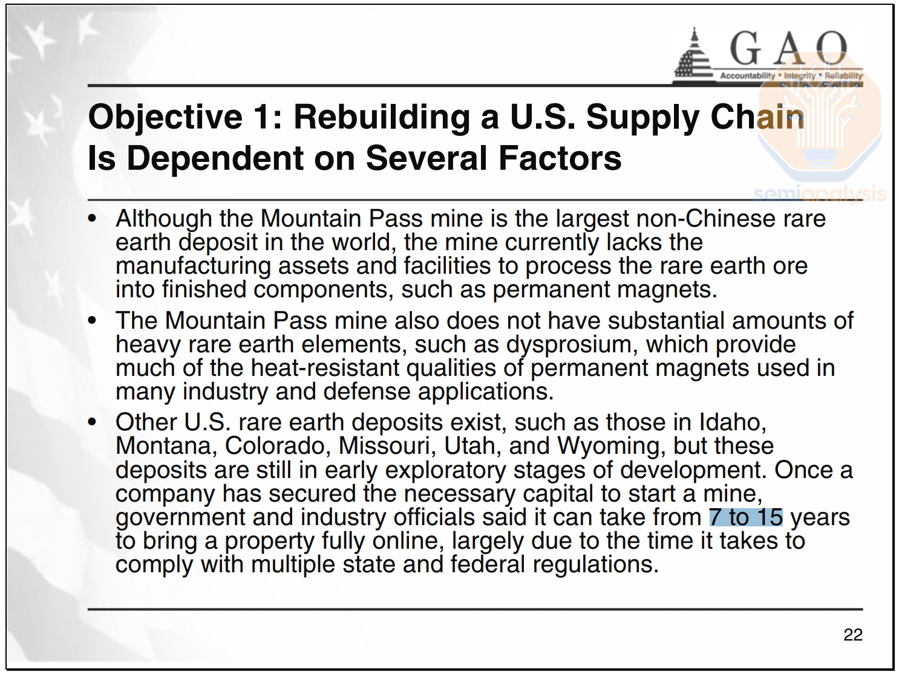](https://i0.wp.com/semianalysis.com/wp-content/uploads/2025/03/2200-GAOGIMP.png?resize=1486%2C1117&ssl=1)

Source: GAO  来源：GAO

However, it’s likely that these companies will not catch up in scale without _significant_ government subsidy to match the lower cost of capital in China. We’ve heard rumblings that China has some 250-275K tons of installed capacity for refining NdFeB magnets, and this will likely double in the next five years. For comparison, the USD$120M investment from the DoD in Lynas will likely produce somewhere around ~4,200 tons of NdFeB. At the moment, China’s economies of scale are in position to oversupply a large portion of the permanent magnet market.  

然而，如果没有政府的_大量_补贴来匹配中国较低的资本成本，这些公司很可能无法在规模上赶上。我们听说中国拥有约 250-275 万吨的 NdFeB 磁铁精炼产能，并且在未来五年内可能会翻一番。相比之下，国防部对 Lynas 的 1.2 亿美元投资可能会生产约 4,200 吨的 NdFeB。目前，中国的规模经济足以供应大部分永磁体市场。

Mining and materials beyond rare earth elements are just as — if not more essential, and while this is not typically bottlenecked, they are largely under the control of China. Additionally, having raw ore deposits or being capable of mining doesn’t imply too much for many of these elements. Many economies struggle to process these elements whereas China excels in this endeavor due to its advanced industrial economy. Stemming from two main initiatives in China, the Belt and Road initiative and Made in China 2025 initiative, the country has invested and built a well-paved path to absolute dominance over nearly the entire minerals processing industry.  

稀土元素以外的采矿和材料同样重要，甚至更为重要，虽然这通常不会成为瓶颈，但它们在很大程度上受中国控制。此外，拥有原始矿床或能够开采这些元素并不意味着很多。许多经济体难以加工这些元素，而中国凭借其先进的工业经济在这方面表现出色。在中国的两大主要举措——“一带一路”倡议和“中国制造 2025”倡议的推动下，中国已经投资并铺设了一条铺就的道路，以在几乎整个矿物加工行业中占据绝对主导地位。

[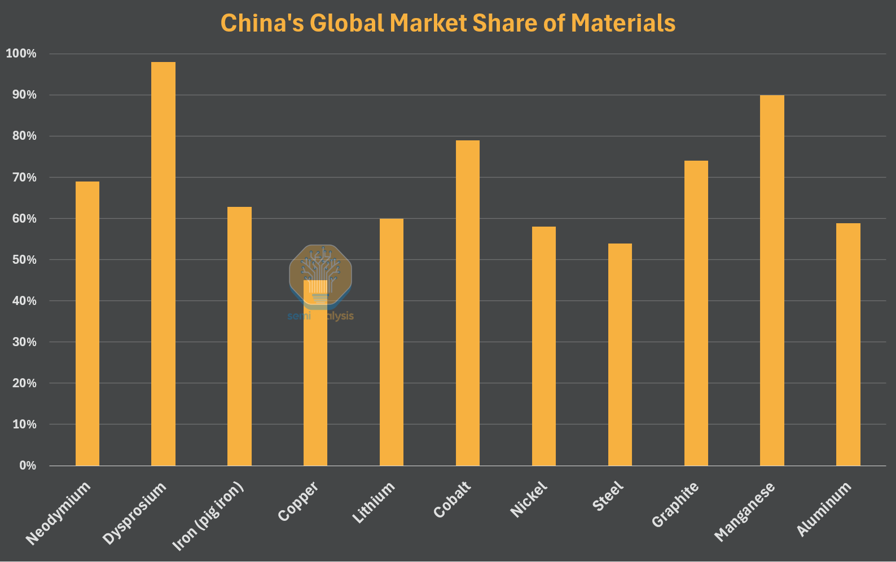](https://i0.wp.com/semianalysis.com/wp-content/uploads/2025/03/2300-chinas-mineral-shares.png?resize=1588%2C997&ssl=1)

Source: SemiAnalysis, Industry Estimates  

来源：SemiAnalysis，行业估计

## **Lithium and Batteries  锂和电池**

All of the ore may come from other countries rich in deposits, but this means nothing without the capacity to refine them at scale and with high enough grade. In fact, China is only rich in deposits in _two_ of these minerals, lithium and graphite, but countries rely on Chinese processing to refine them into usable materials. The Belt and Road initiative came up with clever ways to circumvent the lack of mineral deposits.  

所有这些矿石可能都来自其他矿藏丰富的国家，但如果没有能力大规模提炼出足够高品位的矿石，这一切都毫无意义。事实上，中国只有锂和石墨_两种_矿石储量丰富，但各国依赖中国的加工将它们提炼成可用的材料。“一带一路”倡议想出了巧妙的方法来规避矿藏不足的问题。

-   Copper typically comes from Chile and Peru, and around 76% of Peru’s and 68% of Chile’s copper exports went to China, totaling up to 56% of all global raw [copper](https://features.csis.org/copper-in-latin-america/).   
    
    铜主要产自智利和秘鲁，其中秘鲁约76%和智利约68%的铜出口到中国，合计占全球原[铜](https://features.csis.org/copper-in-latin-america/)出口的56%。
-   Nickel is highlighted as the one key mineral that is not refined mostly in China, as 37% is refined in Indonesia, and “only” 28% in China. However, according to the most recent [IEA](https://iea.blob.core.windows.net/assets/ee01701d-1d5c-4ba8-9df6-abeeac9de99a/GlobalCriticalMineralsOutlook2024.pdf) report, over 80% of Indonesia’s battery-grade nickel output is owned by Chinese producers linked to the [CCP](https://c4ads.org/commentary/refining-power/).  
    
    镍被强调为一种主要不在中国精炼的关键矿物，因为 37% 的镍是在印度尼西亚精炼的，而“只有”28% 的镍在中国精炼。然而，根据[国际能源署的](https://iea.blob.core.windows.net/assets/ee01701d-1d5c-4ba8-9df6-abeeac9de99a/GlobalCriticalMineralsOutlook2024.pdf)最新报告，印度尼西亚 80% 以上的电池级镍产量归与[中](https://c4ads.org/commentary/refining-power/)共有关联的中国生产商所有。
-   Cobalt is mined in the Democratic Republic of the Congo and accounts for [80%](https://issafrica.org/iss-today/rampant-cobalt-smuggling-and-corruption-deny-billions-to-drc) of the world’s cobalt production, but China has struck up the Sicomines Pact with them and now owns [80%](https://www.cecc.gov/events/hearings/from-cobalt-to-cars-how-china-exploits-child-and-forced-labor-in-the-congo) of the DRC’s cobalt output.  
    
    钴矿产于刚果民主共和国，占世界钴产量的[80%](https://issafrica.org/iss-today/rampant-cobalt-smuggling-and-corruption-deny-billions-to-drc) ，但中国已与该国达成《华刚矿业协议》，目前拥有刚果民主共和国[80%](https://www.cecc.gov/events/hearings/from-cobalt-to-cars-how-china-exploits-child-and-forced-labor-in-the-congo)的钴产量。

China understands that without access to processed minerals, there is no first step to manufacturing a product. The Western nations have not woken up to the fact that reshoring manufacturing starts at these minerals.  

中国明白，没有加工矿物，产品制造就无从谈起。西方国家还没有意识到，制造业回流的第一步就是这些矿物。

[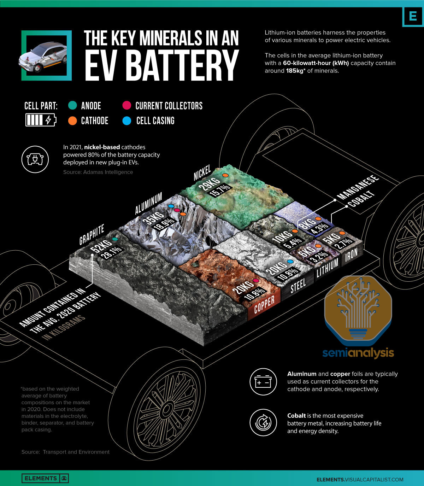](https://i0.wp.com/semianalysis.com/wp-content/uploads/2025/03/2400-EV-breakdwonGIMP.jpg?resize=1200%2C1375&ssl=1)

Source: [Visual Capitalist](https://elements.visualcapitalist.com/the-key-minerals-in-an-ev-battery/)  

来源： [Visual Capitalist](https://elements.visualcapitalist.com/the-key-minerals-in-an-ev-battery/)

Batteries, lithium-ion specifically, are critical for mobile robots, like drones, service robots, autonomous guided vehicles in warehouses, mobile manipulators, humanoids, and especially EVs. If you wanted to realize the future of detaching robots from a connected power source, you’d most likely equip it with Chinese battery cells, as Chinese companies supply around [80%](https://www.bloomberg.com/graphics/2023-breaking-china-ev-supply-chain-dominance/?embedded-checkout=true) of battery cells globally. Chinese battery packs maintain an advantage by having a cost of around $127/kWh, while North America and Europe see prices 24% and 33% higher [respectively](https://www.bnef.com/insights/30265/view). The largest producer, CATL, accounted for [37%](https://www.slashgear.com/1600609/who-dominates-ev-battery-market-why-important/) of the global EV battery market in 2023, while BYD accounted for ~16%.  

电池，特别是锂离子电池，对于移动机器人至关重要，例如无人机、服务机器人、仓库中的自动导引车、移动机械手、人形机器人，尤其是电动汽车。如果你想实现将机器人与连接电源分离的未来，你很可能会为其配备中国的电池单元，因为中国公司供应全球约[80%](https://www.bloomberg.com/graphics/2023-breaking-china-ev-supply-chain-dominance/?embedded-checkout=true)的电池单元。中国电池组的成本约为 127 美元/千瓦时，保持优势，而北美和欧洲的价格[分别](https://www.bnef.com/insights/30265/view)高出 24% 和 33%。最大的生产商 CATL 在 2023 年占据全球电动汽车电池市场的[37%](https://www.slashgear.com/1600609/who-dominates-ev-battery-market-why-important/) ，而比亚迪则占据约 16%。

The largest producer outside of China, LGES (South Korea), only accounted for roughly 13% of the global market share. It’s not easy to overcome the barriers to entry in this market, Sweden’s state-backed attempt to break the dependency, Northvolt, just filed for [bankruptcy](https://www.ttnews.com/articles/northvolt-investment-fund). While the US was committing at least ~USD$73B to battery supply chain investments with the Inflation Reduction Act, China was giving out over USD$230B in subsidies to EV companies since 2009. The current layout of the battery market is a bit spooky, given that Chinese companies can and will be iterating faster than Western companies due to the massive industrial base in China and continued government investment which will only further drive their costs down to edge out competitors.   

中国以外最大的生产商 LGES（韩国）仅占全球市场份额的 13% 左右。进入这个市场并不容易，瑞典政府支持的试图打破依赖关系的公司 Northvolt 刚刚申请[破产](https://www.ttnews.com/articles/northvolt-investment-fund)。当美国通过《通胀削减法案》向电池供应链投资至少约 730 亿美元时，中国自 2009 年以来已向电动汽车公司提供超过 2300 亿美元的补贴。目前电池市场的布局有点令人毛骨悚然，因为中国公司可以而且将比西方公司更快地进行迭代，这得益于中国庞大的工业基础和持续的政府投资，这只会进一步降低成本以击败竞争对手。

Building a battery from an engineering standpoint is a hurdle that Chinese companies have been able to climb over their repeated iterations. The balancing between complex chemistries within cathodes, anodes, and electrolytes must all meet stringent purity requirements as any impurity can lead to noticeable variations in battery lifetime. Constructing sufficient capacity to produce at scale is already challenging, especially in US, and can cost over USD$100M in the US to construct, which is [46%](https://evboosters.com/ev-charging-news/300-billion-in-new-lithium-ion-battery-gigafactories/) more expensive per GWh than its Chinese counterparts. LG has even paused the construction on their USD$5.5B battery plant in Arizona citing “[market conditions](https://www.utilitydive.com/news/lg-pauses-arizona-battery-plant-energy-storage-queen-creek/720416/).”  

从工程角度来看，制造电池是中国公司在反复尝试中克服的一个难题。阴极、阳极和电解质中复杂化学物质之间的平衡必须满足严格的纯度要求，因为任何杂质都会导致电池寿命明显变化。建设足够的产能进行大规模生产已经很具挑战性，尤其是在美国，在美国建设成本可能超过 1 亿美元，每千兆瓦时成本比中国同行高出[46%](https://evboosters.com/ev-charging-news/300-billion-in-new-lithium-ion-battery-gigafactories/) 。LG 甚至以“[市场状况](https://www.utilitydive.com/news/lg-pauses-arizona-battery-plant-energy-storage-queen-creek/720416/)”为由暂停了其在亚利桑那州价值 55 亿美元的电池厂的建设。

In the case of robots, batteries are all different sizes, there is no standardization, and the batteries have different demands. Power-to-weight ratio is a much stricter requirement as a robot doesn’t have the leniency to carry the same weight a car would, and often different robots have different power requirements. The battery that a quadruped would use is not the same battery that a humanoid would use, and this extends to nearly all form factors. The difficulty and cost in manufacturing a pure and efficient battery is already challenging enough, especially in the US, but the lack of uniformity in robot batteries will be one of the largest issues as the time arrives to scale production**.**  

对于机器人来说，电池的尺寸各不相同，没有标准化，对电池的要求也不同。功率重量比的要求要严格得多，因为机器人无法承受与汽车相同的重量，而且不同的机器人通常有不同的功率要求。四足动物使用的电池与人形机器人使用的电池不同，这几乎适用于所有外形尺寸。制造纯净高效的电池的难度和成本已经足够具有挑战性，尤其是在美国，但随着规模化生产到来，机器人电池缺乏统一性将成为最大的问题之一**。**

## **Historical Robotics and How The Current Powers Came To Be  

机器人技术的历史以及当前机器人技术的诞生**

Industrial automation through robotics has been long in the making over the past decades, and throughout this time, some countries have prevailed as paragons of what the automated future can look like, and some have lost their position. Let’s take a look at the current world powers, where they stand in the robotics race to automation, and the driving forces moving their markets. So how did the world leaders in robotics end up on top?  

过去几十年来，通过机器人技术实现工业自动化的进程一直在推进。在此期间，一些国家已成为自动化未来的典范，而另一些国家则失去了自己的地位。让我们来看看当今世界强国，看看它们在机器人自动化竞赛中处于什么位置，以及推动其市场发展的驱动力。那么，机器人领域的世界领导者是如何取得最终胜利的呢？

[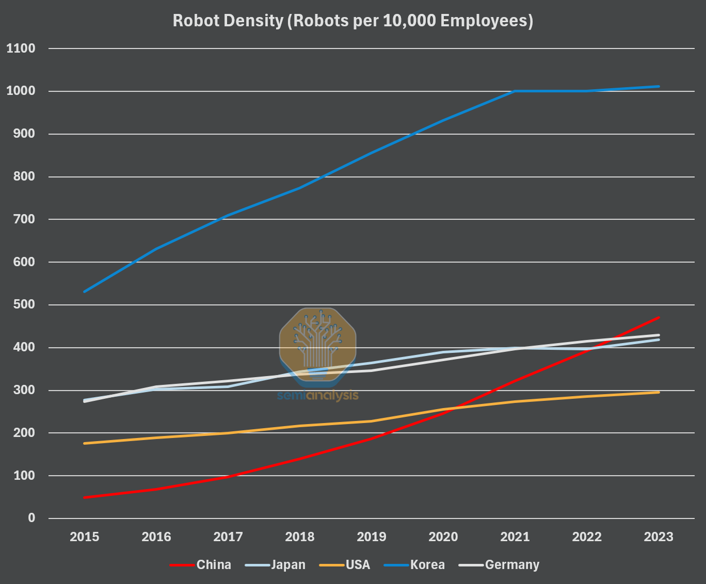](https://i0.wp.com/semianalysis.com/wp-content/uploads/2025/03/2500-shares-of-robot-densities.png?resize=1368%2C1132&ssl=1)

Source: SemiAnalysis, IFR.org  

来源：SemiAnalysis、IFR.org

The Robotics landscape has historically been dominated by four countries: South Korea, Japan, Germany, and the US. China today is a major force, but we will deep dive into the country later in the report. A closer look at the four incumbents reveals common factors driving their success to varying extents:  

机器人领域历来由四个国家主导：韩国、日本、德国和美国。如今，中国是机器人领域的一支主要力量，但我们将在报告的后面深入探讨这个国家。仔细观察这四个国家，可以发现推动它们成功的共同因素在不同程度上：

[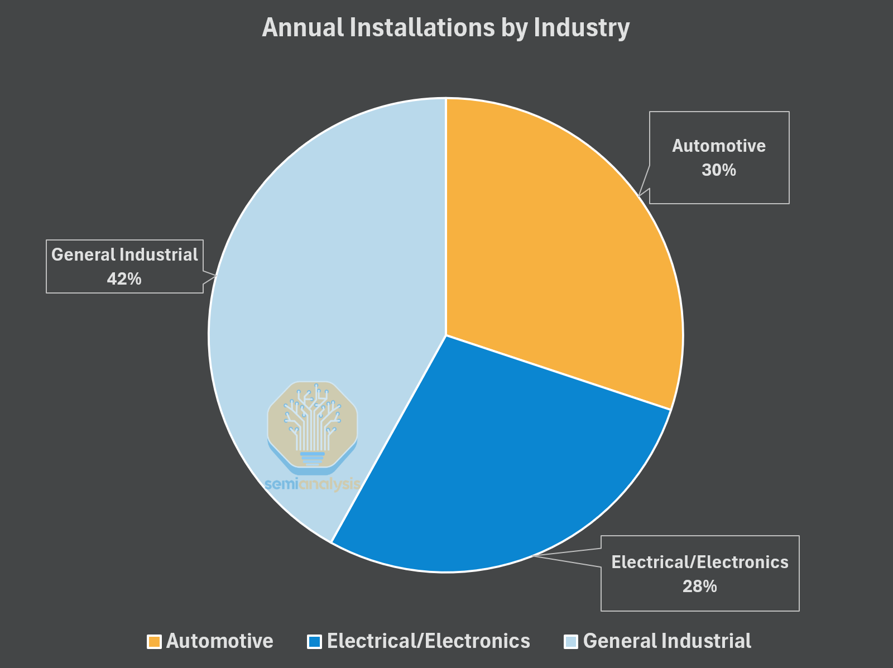](https://i0.wp.com/semianalysis.com/wp-content/uploads/2025/03/2600-shares-by-industry.png?resize=1600%2C1197&ssl=1)

Source: SemiAnalysis, IFR.org  

来源：SemiAnalysis、IFR.org

-   Heavy industries: they are all historically large players in heavy-duty industries like Automotive and Electronics – which are prone to automation through robotics.  
    
    重工业：它们都是汽车和电子等重型工业的历史大参与者，这些工业很容易通过机器人实现自动化。
-   Presence of vast industrial conglomerates – the likes of Toyota, Siemens, Samsung, Emerson  
    
    大型工业集团的存在——例如丰田、西门子、三星、艾默生
-   Technology-savvy culture  精通技术的文化
-   Demographics and labor cost  
    
    人口统计和劳动力成本

## South Korea and Japan: Can’t Automate Birth Rates  

韩国和日本：无法实现生育率自动化

South Korea has taken automation to an extreme level, with 10% of the workforce being automated! With high-tech manufacturing companies making up a whopping [61%](https://www.statista.com/statistics/1490388/south-korea-total-assets-of-major-chaebols-as-percentage-of-gdp/) of the Korean economy in 2022, it has a clear advantage. But cultural factors are also at play – for example, eCommerce adoption is among the world’s highest, with [north of 30%](https://www.emarketer.com/content/global-ecommerce-share-breakdown) of retail sales done online, double that of the US!  

韩国已将自动化推向极致，10% 的劳动力实现了自动化！2022 年，高科技制造公司占韩国经济的[61%](https://www.statista.com/statistics/1490388/south-korea-total-assets-of-major-chaebols-as-percentage-of-gdp/) ，韩国具有明显的优势。但文化因素也在发挥作用——例如，电子商务的采用率位居世界前列，[超过 30%](https://www.emarketer.com/content/global-ecommerce-share-breakdown)的零售额是在线完成的，是美国的两倍！

And the South Korean government and Chaebols are all-in: In 2021, Samsung declared their company-wide initiative to invest up to [USD$163B](https://www.koreatimes.co.kr/www/tech/2025/02/129_389731.html) into industrial automation and AI. Hyundai already acquired Boston Dynamics in 2021. LG set robotics as a key growth area after deploying self-driving airport guide robots at the Seoul airport in 2017, and recently just converted their stake in [Bear Robotics](https://www.lgnewsroom.com/2025/01/lg-acquires-majority-stake-in-bear-robotics-to-bolster-robotics-capabilities/) into a majority stake. On top of all of this, the government is upping their investments as well. In total, the country has put forth four rounds of the Basic Plan for Intelligent Robots since [2008](https://ifr.org/downloads/papers/Executive_Summary_-_World_Robotics_RD_Programs_V03.pdf)–[2030](https://ifr.org/downloads/papers/Executive_Summary_-_World_Robotics_RD_Programs_V02.pdf), totaling USD$1.6B, and a new plan to invest ~USD$2.26B in the industry up to [2030](https://www.koreatechtoday.com/south-koreas-2-26-billion-vision-a-robotic-revolution-by-2030/). While the country needs automation more than ever, it doesn’t have the benefit of being a major manufacturer, having relied on other countries for [~60%](https://www.korea-certification.com/en/south-korea-still-depends-heavily-on-imported-robot-components/) of components in an industrial robot. South Korea is running on borrowed time.  

韩国政府和财阀也全力以赴：2021 年，三星宣布全公司计划向工业自动化和人工智能投资高达[1630 亿美元](https://www.koreatimes.co.kr/www/tech/2025/02/129_389731.html)。现代汽车已于 2021 年收购了波士顿动力公司。LG 在 2017 年在首尔机场部署了自动驾驶机场导游机器人后，将机器人技术定为关键增长领域，最近又将其在[Bear Robotics 的](https://www.lgnewsroom.com/2025/01/lg-acquires-majority-stake-in-bear-robotics-to-bolster-robotics-capabilities/)股份转换为多数股权。除此之外，政府也在加大投资。总体而言，该国自[2008 年](https://ifr.org/downloads/papers/Executive_Summary_-_World_Robotics_RD_Programs_V03.pdf)至[2030 年](https://ifr.org/downloads/papers/Executive_Summary_-_World_Robotics_RD_Programs_V02.pdf)已推出四轮智能机器人基本计划，总额为 16 亿美元，并有一项到[2030 年](https://www.koreatechtoday.com/south-koreas-2-26-billion-vision-a-robotic-revolution-by-2030/)在该行业投资约 22.6 亿美元的新计划。虽然该国比以往任何时候都更需要自动化，但它并没有成为主要制造商的优势，工业机器人[约 60%](https://www.korea-certification.com/en/south-korea-still-depends-heavily-on-imported-robot-components/)的零部件依赖其他国家。韩国的时间不多了。

South Korea has found automation to be a necessity for the same reason as Japan: an aging labor demographic and low birth rates. Despite government initiatives across the board, the country continues to hit record-low birth [rates](https://asiatimes.com/2025/02/japans-birth-crisis-is-a-leadership-failure/). Case in point, the dearth of workers in rural areas is forcing factories to [move](https://www.chosun.com/english/national-en/2024/01/12/53W4QPBZORCCVF5HRX3DCHYOYI/) near Seoul just to man their operations. They’ve even recently had to [remove](https://www.kedglobal.com/construction/newsView/ked202402140025) their decades-old foreign worker ban at certain manufacturing plants (in place due to security reasons) to make up for the labor shortage. Korea suffers from the lowest birthrate in the world, with Japan trailing closely behind. However, Japan stands a slightly better chance in the race to automation as they have two of the Big 4 titans, while Korea still imports some [~60%](https://www.korea-certification.com/en/south-korea-still-depends-heavily-on-imported-robot-components/) of the components in an industrial robot.  

韩国认为自动化是必需品，原因与日本相同：劳动力老龄化和低出生率。尽管政府采取了全面举措，但该国的[出生率](https://asiatimes.com/2025/02/japans-birth-crisis-is-a-leadership-failure/)仍然创历史新低。例如，农村地区劳动力的短缺迫使工厂[搬迁](https://www.chosun.com/english/national-en/2024/01/12/53W4QPBZORCCVF5HRX3DCHYOYI/)到首尔附近，以配备人员。为了弥补劳动力短缺，他们甚至最近不得不[取消](https://www.kedglobal.com/construction/newsView/ked202402140025)某些制造厂实施了几十年的外国工人禁令（出于安全原因）。韩国的出生率居世界最低，日本紧随其后。然而，在自动化竞赛中，日本的机会略大一些，因为日本拥有四大巨头中的两家，而韩国仍然需要进口约[60%](https://www.korea-certification.com/en/south-korea-still-depends-heavily-on-imported-robot-components/)的工业机器人零部件。

## Germany and The EU: Watching from the Chair in the Corner  

德国与欧盟：坐在角落里观察

Germany, the industrial powerhouse of Europe, holds the position of 4th highest robot density in the world, and has always been geared toward a strong industrial economy. The country introduced Industrie 4.0 to the broader European Union in 2011, aimed at bringing the region to the forefront of integrating new technologies and automation processes into industry to enhance competitiveness. Their heavy emphasis on industrial manufacturing has led them down the path toward great automation, and they would be well positioned for the coming of the robotics unlocks had the EU managed to stop China from eating away at their automation companies.   

德国是欧洲的工业强国，机器人密度居世界第四位，并且一直致力于发展强大的工业经济。2011 年，德国向欧盟引入了工业 4.0，旨在使该地区走在将新技术和自动化流程融入工业以提高竞争力的前沿。德国对工业制造的高度重视使他们走上了实现高度自动化的道路，如果欧盟能够阻止中国蚕食其自动化公司，他们将为即将到来的机器人技术解锁做好准备。

European countries have been complicit and passive in the selling of the EU’s industrial automation capacity and technologies to China. A travesty that will echo through the robotics revolution, Germany’s stringent and bureaucratic restrictions held them back from interfering on the KUKA take over in 2016, sidelined as it was sold off to China’s Midea Group. They could only [reform](https://a.storyblok.com/f/137553/x/5c5eaafa8f/evolving-fdi-screening-in-germany.pdf) the policy after it unfolded and their goliath was gone. Italy sold off many robotics companies (EVOLUT, OLCI Engineering, CMA Robotics), and in 2022 the country finally made the decision to [veto](https://decode39.com/3551/draghi-efort-robox-veto/) one of the takeovers. Now, in [February 2025](https://www.automation.com/en-us/articles/february-2025/robotics-action-plan-europe-vdma), an automation organization industry finally issued a Call-To-Action to the EU to address its lack of competitiveness through robotics. Industrie 4.0 is a transformational plan, but it took the EU nine years to realize that it required the robots China was eating.  

欧洲国家在向中国出售欧盟工业自动化产能和技术方面一直是同谋和被动的。这一悲剧将在整个机器人革命中产生影响，德国严格的官僚限制使他们无法干涉 2016 年的库卡收购案，库卡被卖给了中国的美的集团。他们只能在政策实施并且他们的巨头消失之后才[进行改革](https://a.storyblok.com/f/137553/x/5c5eaafa8f/evolving-fdi-screening-in-germany.pdf)。意大利出售了许多机器人公司（EVOLUT、OLCI Engineering、CMA Robotics），并在 2022 年该国最终决定[否决](https://decode39.com/3551/draghi-efort-robox-veto/)其中一项收购。现在，在[2025 年 2 月](https://www.automation.com/en-us/articles/february-2025/robotics-action-plan-europe-vdma)，一个自动化组织行业终于向欧盟发出行动号召，要求其通过机器人技术解决缺乏竞争力的问题。工业 4.0 是一个转型计划，但欧盟花了九年时间才意识到它需要中国正在吃掉的机器人。

## **The US: The American Dream’s Rude Awakening  

美国：美国梦的突然觉醒**

Lastly, in the US, we see a strange phenomenon of having a highly advanced tech sector, but both a lack of national strategy and the drawbacks of outsourcing manufacturing. Manufacturing capacity in the US is still a relevant topic, the issue is that it cannot compete in sectors that China competes in due to the expensive nature of manufacturing in America, and the “quality” moat that the US once had is slowly draining, as China now has the means to produce most goods at similar quality for cheaper. Automating certain sectors could alleviate this pain, but this would be a ways away. The country has a large automotive industry like its peers, but it only ranks 10th in robot density in 2023. One study showed that according to wage-adjusted robot adoption, the US is actually 49% lower than [expected](https://itif.org/publications/2021/01/25/robots-and-international-economic-development/). Given the AI revolution in the country, it’s surprising to see one of the main potential beneficiaries, robotics, diverging from the path of its other tech sectors. Should robotics become a target sector for growth, the country may be able to benefit from the cheaper production and compete, but this is down the line.  

最后，在美国，我们看到一个奇怪的现象：美国拥有高度发达的科技行业，但缺乏国家战略，外包制造业也存在弊端。美国的制造能力仍然是一个相关话题，问题在于，由于美国制造业成本高昂，美国无法在中国竞争的领域竞争，而美国曾经拥有的“质量”护城河正在慢慢消失，因为中国现在有能力以更低的成本生产出大多数质量相似的商品。某些行业的自动化可以缓解这种痛苦，但这还有很长的路要走。该国拥有与其他同行一样庞大的汽车行业，但到 2023 年，其机器人密度仅排名第 10 位。一项研究表明，根据工资调整后的机器人采用率，美国实际上比[预期](https://itif.org/publications/2021/01/25/robots-and-international-economic-development/)低 49%。考虑到该国的人工智能革命，令人惊讶的是，主要潜在受益者之一机器人技术与其他科技行业的发展路径背道而驰。如果机器人技术成为增长的目标行业，该国也许能够从更廉价的生产中受益并参与竞争，但这只是未来的事。

There’s a number of reasons why the dissonance could be occurring in the US, a large one mainly being the lack of multi-year national initiatives that other countries see benefit from. For example, the CHIPS act and the [Inflation Reduction Act](https://www.congress.gov/bill/119th-congress/house-bill/191/titles), two major government initiatives aimed at bolstering domestic industry, were initiated under one administration and under another the IRA is already on the table for [repeal](https://www.congress.gov/bill/119th-congress/house-bill/191/titles), with the [CHIPS](https://www.foxbusiness.com/politics/future-chips-act-under-trump-admin) act being in the conversation as well. Moreover, the economy was structured to follow different economic incentives than China.  The US found it more worthwhile to pursue digital innovation, cutting-edge technology, and services, and in the process it outsourced most production capabilities to countries with a better cost advantage as most American companies cannot compete. However, the US is now left at the mercy of Chinese manufacturing powers and will need a significant turnaround just to enter the race.  

导致美国出现这种不和谐现象的原因有很多，其中一个主要原因是美国缺乏其他国家认为可以受益的多年期国家举措。例如，两项旨在提振国内产业的重大政府举措《CHIPS 法案》和《[降低通胀法案》](https://www.congress.gov/bill/119th-congress/house-bill/191/titles)是在上一届政府领导下发起的，而《IRA》已在另一届政府领导下被提上[废除](https://www.congress.gov/bill/119th-congress/house-bill/191/titles)议程， [《CHIPS](https://www.foxbusiness.com/politics/future-chips-act-under-trump-admin)法案》也在讨论之中。此外，美国的经济结构遵循的经济激励措施与中国不同。美国发现追求数字创新、尖端技术和服务更有价值，在此过程中，它将大部分生产能力外包给具有更佳成本优势的国家，因为大多数美国公司无法竞争。然而，美国现在完全受制于中国制造业强国，需要实现重大转变才能加入竞争。

To add insult to injury, a closer look at the Western world’s automation growth reveals a peak in ~2016-18. Japan’s 2023 additions are still ~13% below the 2018 peak, and South Korea has not grown since 2016. The only country among the top 4 that has reached a new peak in 2023 is Germany… but their goliath KUKA has been acquired by China and is shifting manufacturing to Asia.  

更糟糕的是，仔细观察西方世界的自动化增长，可以发现在 2016-18 年左右达到顶峰。日本 2023 年的新增产能仍比 2018 年的峰值低约 13%，而韩国自 2016 年以来一直没有增长。前四名中唯一在 2023 年达到新高峰的国家是德国……但他们的巨头库卡已被中国收购，正在将制造业转移到亚洲。

[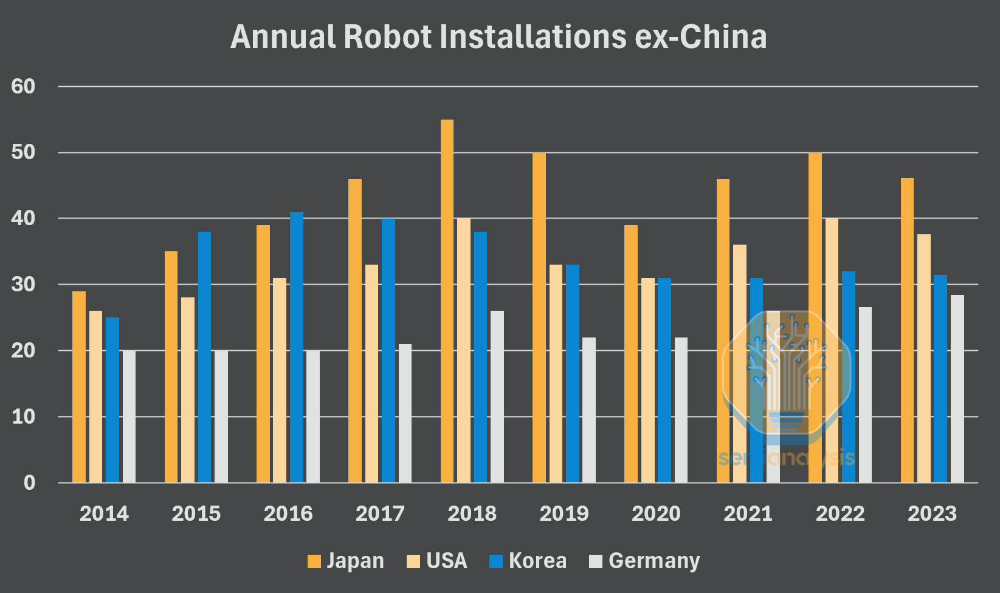](https://i0.wp.com/semianalysis.com/wp-content/uploads/2025/03/2700-shares-ex-china.png?resize=1645%2C977&ssl=1)

Source: SemiAnalysis, IFR.org  

来源：SemiAnalysis、IFR.org

## The Sleeping Goliaths and The Budding Davids  

沉睡的巨人和初露头角的大卫

KUKA is part of the small set of companies referred to as the “Big 4” in robotics, having dominated the industry for decades: FANUC (Japan), ABB (Switzerland/Sweden), Yaskawa (Japan), and KUKA (prev Germany, now China).   

库卡 (KUKA) 是机器人领域被称为“四大”的少数几家公司之一，这些公司几十年来一直主宰着该行业：发那科 (FANUC)（日本）、ABB（瑞士/瑞典）、安川 (Yaskawa)（日本）和库卡 (KUKA)（原德国，现中国）。

[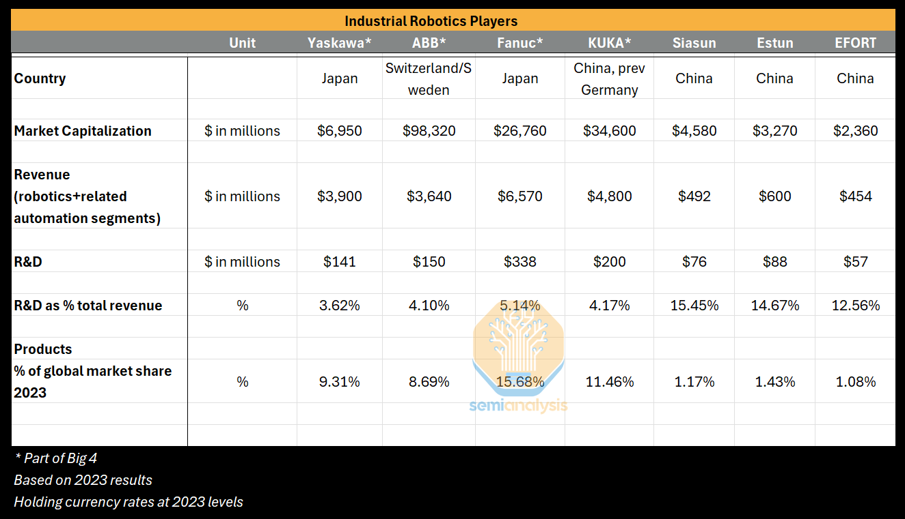](https://i0.wp.com/semianalysis.com/wp-content/uploads/2025/03/2750-Market-Shares.png?resize=1324%2C761&ssl=1)

Source: SemiAnalysis  来源：SemiAnalysis

A closer look at those four titans reveals a lot of similarity: decades of experience in the space, high-volume manufacturing capacity among a broad product portfolio (cobots, robots, multiple industries, etc), but relatively low R&D ratio and overall limited willingness to participate in the capital-heavy and risk-oriented goal to build these next-gen robots that hold the same promises that have failed in the past. In addition, their business is increasingly tilted towards mainland China – leaving a large geopolitical risk.  

仔细观察这四家巨头，就会发现它们有很多相似之处：数十年的经验、广泛的产品组合（协作机器人、机器人、多个行业等）中的高产量制造能力，但研发比例相对较低，总体上参与打造这些下一代机器人的资本密集型和风险导向型目标的意愿有限，这些机器人承载着过去未能实现的相同承诺。此外，他们的业务越来越倾向于中国大陆——留下了巨大的地缘政治风险。

The situation is particularly worrisome, with Chinese players now on track to catch up and fill the gaps with unprecedented speed.  

这种情况尤其令人担忧，中国企业正以前所未有的速度赶上并填补空白。

## **China’s Robotics Champions  

中国机器人冠军**

While the revenues of the major companies are much larger than those of China, the landscape has been shifting toward western sleeping giants growing complacent and Chinese innovation. Chinese robotics are picking up very quickly through companies like Estun, Efort, and Siasun, and their recent takeovers of the aforementioned European robotics companies.  

虽然大型公司的营收远高于中国，但形势已开始向西方沉睡的巨头转移，这些巨头正变得自满，而中国则不断创新。中国机器人技术正在迅速发展，埃斯顿、埃夫特和新松等公司以及它们最近对上述欧洲机器人公司的收购正在推动中国机器人技术的发展。

These companies are setting up to be powerhouses. Most are focused on strong vertical integration, like Estun with up to [95%](https://en.estun.com/?list_180/) of core components manufactured in-house, enabling them to rapidly iterate product development. They recognize the power of a strong production capacity, for example EFORT is planning to build out a “[Super Plant](https://www.yicaiglobal.com/news/eforts-stock-surges-on-plan-to-invest-usd263-million-to-build-robot-super-plant-global-hq)” to upgrade production capacity by 100,000 robots/year. Siasun is already well-equipped for an impressive production output with around 2.3M square footage of factories globally. Furthermore, their R&D numbers may speak for themselves, but Siasun has gone even further in their innovation strategy. The company went so far as to [buy](https://www.chinadaily.com.cn/business/tech/2017-08/24/content_31035917.htm) a leading German mechanical engineering vocational school so that they could both train new employees abroad and gain access to the decades of German experience in training engineers, all while setting up its own robotics institute at a Chinese [university](https://www.xjtlu.edu.cn/en/study/departments/school-of-robotics/industrial-partners/siasun).  

这些公司都志在成为巨头。其中大多数都专注于强大的垂直整合，例如埃斯顿高达[95%](https://en.estun.com/?list_180/)的核心部件均自行生产，这让他们能够快速迭代产品开发。他们认识到强大生产能力的力量，例如埃夫特正计划建造一座“[超级工厂](https://www.yicaiglobal.com/news/eforts-stock-surges-on-plan-to-invest-usd263-million-to-build-robot-super-plant-global-hq)”，将生产能力提高 10 万台机器人/年。新松机器人已具备令人印象深刻的生产能力，全球工厂面积约为 230 万平方英尺。此外，他们的研发数字可能不言而喻，但新松机器人的创新战略更进一步。该公司甚至[收购了](https://www.chinadaily.com.cn/business/tech/2017-08/24/content_31035917.htm)一家领先的德国机械工程职业学校，这样他们既可以在国外培训新员工，又可以获得德国数十年的工程师培训经验，同时在中国一所[大学](https://www.xjtlu.edu.cn/en/study/departments/school-of-robotics/industrial-partners/siasun)建立了自己的机器人学院。

The traditional industrial robotics market and the respective hardware is still dominated by the original four giants of ABB, KUKA, Fanuc, and Yaskawa, however, they are not matching the pace of their Chinese contemporaries. Lack of innovation and investment in R&D is leaving a door wide open for Chinese companies to enter through, and they’re only ramping up further. This expansion is not only happening at the company level but rather it’s the country’s imperative to cross the finish line first.  

传统工业机器人市场和相关硬件仍由 ABB、库卡、发那科和安川这四大巨头主导，但它们的步伐却赶不上中国同行。缺乏创新和研发投入为中国企业进入市场敞开了大门，而且它们还在进一步加速发展。这种扩张不仅发生在公司层面，而是国家必须率先冲过终点线。

## **China’s Hellbent Path to Robotics Dominance  

中国不屈不挠地走向机器人主导地位**

In China, the most impressive shifts are taking place, going from outside the top 10 in robots per 10,000 employees in 2018, to overtaking 3rd place in the world from Germany with 470 robots/10,000 employees in 2024. China’s annual root installations dwarf that of the four western incumbents **combined**.  

中国正在发生最令人印象深刻的变化，2018年中国每万名员工拥有的机器人数量排名世界前十，到2024年将以每万名员工拥有470台机器人的水平超越德国，成为世界第三。中国每年的机器人安装量远远超过西方四大国的**总和**。

Source: SemiAnalysis, IFR.org  

来源：SemiAnalysis、IFR.org

A change of this scale can only be described as a robotics revolution. Many factors can point to how this happened, but most stem from their massive industrial sector and policies that continue to fuel it, like the Made in China 2025 plan, and aggressive government subsidies. Exact numbers are hard to pinpoint, and the EV industry is a key recipient, but it is clear that the broad industrial landscape is benefiting from at least tens of billions of dollars every year.  

如此规模的变化只能被描述为机器人革命。许多因素可以解释这一变化是如何发生的，但大多数源于中国庞大的工业部门和持续推动其发展的政策，如“中国制造 2025”计划和积极的政府补贴。确切的数字很难确定，电动汽车行业是主要受益者，但很明显，广泛的工业领域每年至少从中受益数百亿美元。

[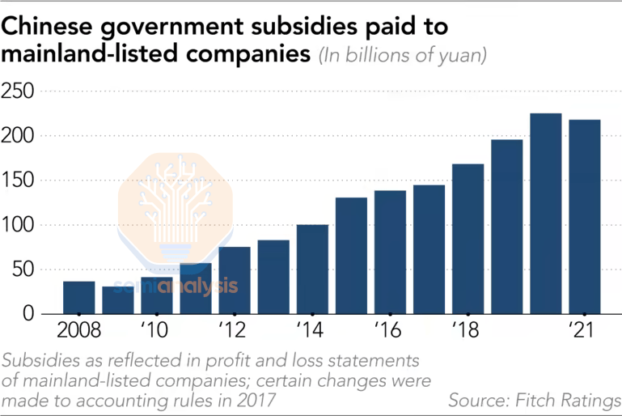](https://i0.wp.com/semianalysis.com/wp-content/uploads/2025/03/3000-chinese-govt-subsidiesGIMP.png?resize=769%2C514&ssl=1)

Source: [Nikkei Asia](https://asia.nikkei.com/Business/Business-Spotlight/Made-in-China-2025-thrives-with-subsidies-for-tech-EV-makers)  

来源：[日经亚洲](https://asia.nikkei.com/Business/Business-Spotlight/Made-in-China-2025-thrives-with-subsidies-for-tech-EV-makers)

The Chinese manufacturing base is currently dominated by automotive and electronics production, as [China](https://sccei.fsi.stanford.edu/china-briefs/rise-robots-china) has been producing more cars than the US and Japan combined since 2009, and assembles some 70% of the world’s electronics. Even with a massive sector ripe for automation, 51% of global robot installations in 2023 were coming from China, adding 276,000 units that year alone! China’s industrial economy is one of the most formidable players in the world, setting it up perfectly to reap the next evolutions of robotics and automation.  

目前，中国制造业以汽车和电子产品生产为主，因为自 2009 年以来，[中国](https://sccei.fsi.stanford.edu/china-briefs/rise-robots-china)生产的汽车数量超过美国和日本的总和，并组装了全球约 70% 的电子产品。尽管自动化行业规模庞大，但 2023 年全球 51% 的机器人安装量来自中国，仅当年就增加了 276,000 台！中国的工业经济是世界上最强大的参与者之一，它为收获机器人和自动化的下一次革命做好了完美的准备。

The Made in 2025 plan was the largest catalyst toward becoming the industrial and high-tech manufacturing giant it is today. Signed by Li Keqiang in 2015, the plan initiated the move from 40% of domestic content of core components in 2020 to 70% by 2025. Additionally, the plan highlights the following six of the ten priority sectors going forward: automated machine tools & robotics, new-energy vehicles and equipment, power equipment, modern rail transport equipment, new advanced information technology, and new materials. With a focus on the entire manufacturing chain and the development of both advanced and traditional industries, the country laid out the road map to become an economic juggernaut.   

《中国制造2025》计划是中国成为如今工业和高科技制造业大国的最大催化剂。该计划由李克强于2015年签署，旨在将核心零部件国产化率从2020年的40%提高到2025年的70%。此外，该计划还强调了未来十大重点行业中的以下六个：自动化机床和机器人、新能源汽车及装备、电力设备、现代轨道交通装备、新型先进信息技术和新材料。中国重点关注整个制造链以及先进和传统产业的发展，制定了成为经济巨头的路线图。

[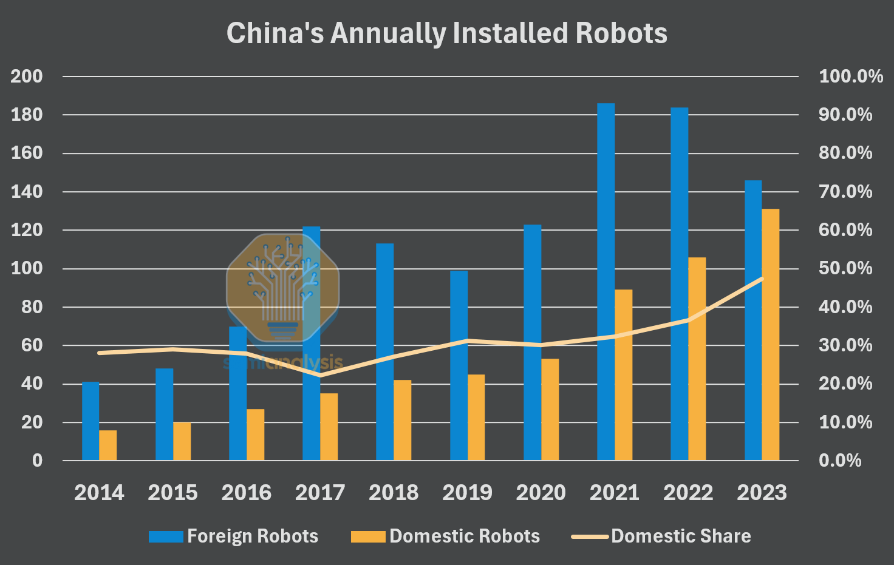](https://i0.wp.com/semianalysis.com/wp-content/uploads/2025/03/3100-chinas-annually-installed-robots-3.png?resize=1472%2C931&ssl=1)

Source: SemiAnalysis, IFR.org  

来源：SemiAnalysis、IFR.org

In 2023 they doubled down on robotics, with China’s Ministry of Industry and Information Technology posted their [four-year plan](https://www.scmp.com/news/china/politics/article/3240259/china-says-humanoid-robots-are-new-engine-growth-pushes-mass-production-2025-and-world-leadership) positioning humanoids as a strategic engine of economic growth. Within this outline, they highlighted having a robust innovation system for humanoids and to achieve “production at scale” by 2025, with the engine of growth coming online by 2027. This state-backed interest is significant for the sector as the US-China Economic and Security Review Commission posted an [Issue Alert](https://www.uscc.gov/sites/default/files/2024-10/Humanoid_Robots.pdf) in October 2024 stating that Chinese humanoid companies raised USD$769M in 2023 alone, and over USD$990M in the first half of 2024. China believes in robotics and its related form factors as the future of the country, just recently, Unitree CEO Wang Xingxing was even seen at the [private sector symposium](https://www.scmp.com/tech/big-tech/article/3299435/meet-wang-xingxing-young-chinese-robotics-star-unitree-xi-jinpings-symposium) seated across from Xi Jinping.  

2023 年，中国加倍投入机器人技术，中国工业和信息化部发布了[四年计划，](https://www.scmp.com/news/china/politics/article/3240259/china-says-humanoid-robots-are-new-engine-growth-pushes-mass-production-2025-and-world-leadership)将人形机器人定位为经济增长的战略引擎。在这一纲要中，他们强调要建立强大的人形机器人创新体系，到 2025 年实现“规模化生产”，到 2027 年实现增长引擎。这种国家支持的利益对该行业意义重大，因为美中经济与安全审查委员会于 2024 年 10 月发布了一份[问题警报，](https://www.uscc.gov/sites/default/files/2024-10/Humanoid_Robots.pdf)指出中国的人形机器人公司仅在 2023 年就筹集了 7.69 亿美元，2024 年上半年筹集了超过 9.9 亿美元。中国相信机器人技术及其相关的形态是国家的未来，就在最近，宇树科技首席执行官王星星甚至出现在[私营部门研讨会](https://www.scmp.com/tech/big-tech/article/3299435/meet-wang-xingxing-young-chinese-robotics-star-unitree-xi-jinpings-symposium)上，坐在习近平对面。

Even humanoids are now booming in China, still considered the most difficult form factor to unlock, with many older estimates misinterpreting the coming revolution, i.e. Goldman Sachs having to [revise](https://www.goldmansachs.com/insights/articles/the-global-market-for-robots-could-reach-38-billion-by-2035) their 2035 TAM by 6x! At the 2024 World Robot Conference in Beijing, over [27 different humanoids](https://archive.is/5StXj) were debuted and active, while the Tesla Optimus remained motionless in a clear box. A stark contrast to the Unitree H1 which was performing [synchronized choreography](https://www.youtube.com/watch?v=hrjxmJWo3IY) with both H1’s and humans nearby in Feb 2025. While it is impressive to see how well Chinese humanoids are performing, it’s more impressive that they can produce these at a much faster and larger scale than any other country. [UBTech](https://www.tweaktown.com/news/103128/chinas-humanoid-robots-slated-for-mass-production-by-end-of-2025/index.html) is already set to mass produce nearly 1000 units by late 2025. Agibot was created in 2023, and has started mass production already, with [962 units](https://www.yahoo.com/tech/former-huawei-genius-youth-recruit-093000908.html) fully produced as of December 15. Most importantly, Unitree G1 is already in the United States and [commercially available](https://toborlife.ai/g1/), and the humanoid boasts a shocking price tag of only USD$16K. There are no other humanoids in the world available for purchase by consumers, and the price tags for most humanoids are angling to be in the ~USD$100K range, and up to ~USD$200K for a significant portion.   

甚至人形机器人现在在中国也蓬勃发展，这仍然被认为是最难解锁的形式因素，许多较早的估计都误解了即将到来的革命，例如高盛不得不将其 2035 年的 TAM[修改了](https://www.goldmansachs.com/insights/articles/the-global-market-for-robots-could-reach-38-billion-by-2035)6 倍！在北京举行的 2024 年世界机器人大会上，超过[27 种不同的人形机器人](https://archive.is/5StXj)首次亮相并活跃起来，而特斯拉擎天柱则一动不动地待在一个透明的盒子里。这与 2025 年 2 月与 H1 和附近的人类进行[同步舞蹈](https://www.youtube.com/watch?v=hrjxmJWo3IY)的 Unitree H1 形成了鲜明的对比。虽然看到中国人形机器人的表现令人印象深刻，但更令人印象深刻的是他们能够以比其他任何国家更快、更大的规模生产这些机器人。 [UBTech](https://www.tweaktown.com/news/103128/chinas-humanoid-robots-slated-for-mass-production-by-end-of-2025/index.html)已计划在 2025 年底前量产近 1000 台。Agibot 于 2023 年创建，并已开始量产，截至 12 月 15 日已完全生产[962 台](https://www.yahoo.com/tech/former-huawei-genius-youth-recruit-093000908.html)。最重要的是，Unitree G1 已经在美国[上市，并且这款人形机器人的](https://toborlife.ai/g1/)标价令人震惊，仅为 1.6 万美元。世界上没有其他人形机器人可供消费者购买，大多数人形机器人的标价都在 10 万美元左右，而相当一部分人形机器人的标价高达 20 万美元左右。

## What Stands to Come  未来前景

This is a Call for Action. In America there are many companies attempting to build their own hardware, but in-house hardware development means the company designing and assembling it in-house, and everyone closes their eyes when the materials and base components roll in from China. The US once had a solid base to spin up heavy industry factories, but this withered away as cheaper overseas manufacturing cut US producers out and the American economy shifted toward leading edge technology and services. However, with each dilapidated factory and every “Made in China” sticker the dots connected a pointillist image of a nation depleted. Now the country stands at the bifurcated path between limitless labor expansion or obsolescence, and the echoes of industry’s past are shouting.   

这是行动的号召。在美国，有许多公司试图制造自己的硬件，但内部硬件开发意味着公司在内部设计和组装，当材料和基础部件从中国涌入时，每个人都会睁一只眼闭一只眼。美国曾经拥有坚实的基础来推动重工业工厂的发展，但随着廉价的海外制造业挤占了美国生产商，美国经济转向前沿技术和服务，这一基础逐渐衰落。然而，随着每家破败的工厂和每张“中国制造”的标签，这些点连接起来的是一个国家枯竭的点画图像。现在，这个国家站在劳动力无限扩张或淘汰的分叉路上，工业过去的回声正在呼喊。

China knew 10 years ago that these robots would be a force and doubled down again in 2023. This is not a question of ifs: China knows what comes next if they are first to unlock these robots, they will iterate faster than the US, they will subsidize the industry to an unprecedented extent, they will achieve massive economies of scale and oversupply all global markets, and the general purpose robotics boom will be nothing but a bad dream for the US if nothing changes. The US must take part in the robotics revolution before all labor is handed over to China to own in perpetuity.  

中国 10 年前就知道这些机器人将成为一股力量，并在 2023 年再次加倍投入。这不是一个如果的问题：中国知道接下来会发生什么，如果他们率先解锁这些机器人，他们将比美国更快地迭代，他们将以前所未有的程度补贴该行业，他们将实现大规模的规模经济并供应过剩全球所有市场，如果不做任何改变，通用机器人热潮对美国来说只不过是一场噩梦。美国必须参与机器人革命，否则所有劳动力将永久移交给中国。

Unitree exemplifies the threat posed by China’s rise to Western industrial semiconductor suppliers. Behind paywall, we dive into the different types of electronic components found in robots, explain how western incumbents like NXP, Infineon or TXN are positioned, and highlight the Chinese threat. We also discuss leading edge logic for next-gen robots and Nvidia’s position.   

Unitree 体现了中国崛起对西方工业半导体供应商构成的威胁。在付费内容中，我们深入研究了机器人中使用的不同类型的电子元件，解释了 NXP、Infineon 或 TXN 等西方老牌企业的定位，并强调了中国带来的威胁。我们还讨论了下一代机器人的前沿逻辑和 Nvidia 的地位。

Check out our friends at Edge of Automation’s Parts [1](https://www.edgeofautomation.com/p/the-physical-ai-revolution-part-1) and [2](https://www.edgeofautomation.com/p/the-physical-ai-revolution-part-1) of the coming physical AI revolution for a great breakdown series on the current state of robotics!  

请查看我们在 Edge of Automation 上的朋友关于即将到来的物理 AI 革命的[第 1](https://www.edgeofautomation.com/p/the-physical-ai-revolution-part-1)部分和[第 2](https://www.edgeofautomation.com/p/the-physical-ai-revolution-part-1)部分，了解有关机器人技术现状的精彩分析系列！
